# 第十章 替代区块链

本章旨在介绍替代区块链解决方案。随着比特币的成功和对区块链技术潜力的后续认识，一个寒武纪爆发开始了，导致了各种区块链协议、应用和平台的发展。一些项目没有获得太多的关注，但许多项目成功地在这个领域站稳了脚跟。

在本章中，读者将介绍替代区块链和平台，它们要么是全新的区块链，要么是补充其他现有区块链的平台。这些新平台的基本理念是提供 SDK 和工具，以使区块链解决方案的开发和部署更加容易。以太坊和比特币的成功导致了各种项目的产生，这些项目通过利用它们引入的基础技术和概念而存在。这些新项目通过解决当前区块链的限制或提供在其上提供一层用户友好工具来增加价值。

本章的第一节将介绍新的区块链解决方案，后续章节将涵盖各种补充现有区块链的平台和开发工具。例如，BlockApps STRATO 是一个符合以太坊标准的平台，用于区块链应用的开发，而 Kadena 是一个具有 Scalable BFT 等新理念的新型私有区块链。随着区块链技术的发展，诸如侧链、驱动链和锚定等概念也首次被引入。本章将详细介绍所有这些技术和相关概念。当然，不可能涵盖所有替代链和平台，但本章包括了所有与区块链相关的平台，这些平台在前几章中已经涵盖，或者预计在不久的将来将获得重视。

# 区块链

本节将介绍新的区块链解决方案。首先，在接下来的章节中将讨论一种名为 Kadena 的新区块链。

## Kadena

Kadena 是最近推出的一个私有区块链，成功解决了区块链系统中的可伸缩性和隐私问题。Kadena 还引入了一种名为 Pact 的新的图灵不完备语言，可以用来开发智能合约。Kadena 的一个关键创新是其可扩展的 BFT 共识算法，具有潜力在不降低性能的情况下扩展到数千个节点。可扩展的 BFT 基于最初的 Raft 算法，并继承了 Tangaroa 和 Juno。Tangaroa 是 Raft 的一种容错实现（BFT Raft），旨在解决 Raft 算法中拜占庭节点行为所引起的可用性和安全性问题，而 Juno 则是由*摩根大通*开发的 Tangaroa 的一个分支。 共识算法在第一章的*区块链 101*中有更详细的讨论。这两个方案都存在一个基本限制 - 无法在保持高水平性能的同时进行扩展。因此，Juno 很难获得很好的反响。私有区块链具有更理想的性能维护性能属性，随着节点数量增多，性能可以保持恒定，但前述的方案缺乏这一特性。Kadena 通过其专有的可扩展 BFT 算法解决了这个问题，预计可在不降低性能的情况下扩展到数千个节点。

此外，保密性是 Kadena 的另一个重要方面，可确保区块链上交易的隐私。通过使用密钥轮换、对称链上加密、增量哈希和双摇杆协议的组合来实现。

密钥轮换被用作保护私有区块链安全的标准机制。被定期更改加密密钥的最佳做法可防止密钥被破坏，从而防止任何攻击。 Pact 智能合约语言原生支持密钥轮换。

对称链上加密允许在区块链上对交易数据进行加密。这些交易可被特定私有交易的参与者自动解密。双摇杆协议用于提供密钥管理和加密功能。

可扩展的 BFT 共识协议确保在智能合约执行之前已经实现了足够的复制和共识。实现共识的过程如下所述：

1.  首先，用户签署并广播新的交易到区块链网络，这被领导节点接收并添加到其不可变日志中。在此时，也计算了不可变日志的增量哈希。增量哈希是一种哈希函数，基本上允许在原始消息稍微改变的情况下计算哈希消息，如果已经哈希的先前原始消息稍微改变，那么新的哈希消息将从已经存在的哈希计算。这种方案比传统的哈希函数更快，资源消耗更少，在原始消息只有轻微改变时也需要生成全新的哈希消息。

1.  一旦领导节点将交易写入日志，它会签署复制和增量哈希，并将其广播到其他节点。

1.  其他节点在接收到交易后，验证领导节点的签名，将交易添加到自己的日志中，并向其他节点广播自己计算得到的增量哈希（法定证明）。最终，在从其他节点收到足够数量的证明后，交易被永久地提交到账本中。

在下图中显示了这个过程的简化版本，其中 **leader** 节点记录新的交易，然后将其复制到 **follower** 节点：

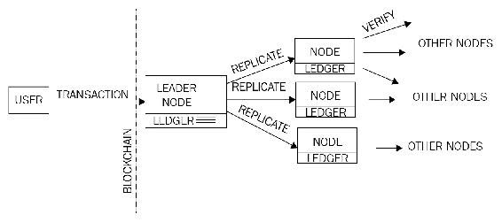

Kadena 中的共识机制

一旦达成共识，智能合约执行就可以开始，并采取以下步骤：

1.  首先，验证消息的签名。

1.  Pact 智能合约层接管。

1.  Pact 代码被编译。

1.  交易被发起并执行嵌入在智能合约中的任何业务逻辑。在发生任何失败时，会立即启动回滚，将状态恢复到执行开始之前的状态。

1.  最后，交易完成并更新相关日志。

Pact 已被 Kadena 开源，并可在 [`kadena.io/pact/downloads.html`](http://kadena.io/pact/downloads.html) 下载。这可以作为一个独立的二进制文件进行下载，提供 Pact 语言的 REPL。在 Linux 控制台中输入命令 `./pact` 即可运行 Pact，示例如下：

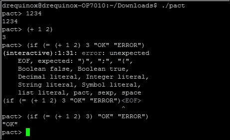

Pact REPL，显示示例命令和错误输出

Pact 中的智能合约通常由三个部分组成：keysets、modules 和 tables。首先，**keyset** 定义了表和模块的相关授权方案。其次，**module** 定义了智能合约代码，以 **functions** 和 **Pacts** 的形式包含业务逻辑。模块内的 Pacts 由多个步骤组成，并按顺序执行。

Pact 可以在多种执行模式下使用。这些模式包括**合同定义**，**交易执行**和**查询**。合同定义模式允许通过单个交易消息在区块链上创建一个合同。交易执行模式涉及执行代表业务逻辑的智能合同代码模块。查询仅与简单地探测合同数据有关，并且出于性能原因在节点上执行。

Pact 使用类似 LISP 的语法，并在代码中准确表示将在区块链上执行的内容，因为它以人类可读格式存储在区块链上。这与以太坊的 EVM 相反，后者编译为字节码以执行，这使得难以验证在区块链上执行的代码。此外，它不完整支持图灵不完备，支持不可变变量，并且不允许空值，从而提高了事务代码执行的整体安全性。

在本章中无法涵盖 Pact 的完整语法和功能，但下面显示了一个小示例，显示了在 Pact 中编写的智能合同的一般结构。该示例展示了一个简单的加法模块，定义了一个名为`addition`的函数，它接受三个参数。执行代码时，将所有三个值相加并显示结果。

以下示例是使用位于[`kadena.io/try-pact/`](http://kadena.io/try-pact/)的在线 Pact 编译器开发的：

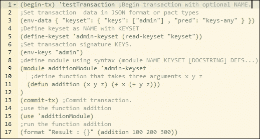

Pact 示例代码

运行代码时，将产生以下输出：

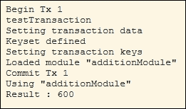

代码的输出

如前例所示，执行输出与代码布局和结构完全匹配，这有利于增加透明度，限制恶意代码执行的可能性。

Kadena 是一种引入**普遍确定性**新概念的私人区块链，除了标准的基于公钥/私钥的数据来源安全性之外，还提供了一个完全确定性共识的附加层。它在区块链的所有层面提供了加密安全性，包括交易和共识层。

### 注意

Pact 的相关文档和源代码可以在这里找到：[`github.com/kadena-io/pact`](https://github.com/kadena-io/pact)。

### 瑞波

Ripple 于 2012 年推出，是一种货币兑换和实时毛额结算系统。在 Ripple 中，支付无需等待，与传统的结算网络相比，后者可能需要数天才能结算。它有一种本地货币称为**瑞波币**（**XRP**）。它还支持非 XRP 支付。此系统被认为类似于一种称为*哈瓦拉*的旧传统货币转移机制。该系统通过利用代理接收来自发送者的钱和密码，然后联系受款人的代理并指示他们向能够提供密码的人释放资金来运作。受款人然后联系当地代理，告诉他们密码并收取资金。与代理类似的类比在 Ripple 中称为网关。这只是一个非常简单的类比，实际协议相当复杂，但原则上是相同的。

Ripple 网络由各种节点组成，这些节点根据其类型可以执行不同的功能。首先是**用户节点**：这些节点用于支付交易，并可以进行支付或接收支付。其次是**验证节点**：这些节点参与共识机制。每个服务器维护一组唯一节点，它需要在实现共识时查询这些节点。**唯一节点列表**（**UNL**）中的节点是由参与共识机制的服务器信任的，它们只会接受来自此唯一节点列表的投票。有时 Ripple 被认为不是真正的去中心化，因为涉及到网络运营商和监管机构。然而，由于任何人都可以通过运行验证节点成为网络的一部分，因此它可以被认为是去中心化的。此外，共识过程也是分散的，因为对账本提出的任何更改都必须通过超过半数的多数投票来决定。然而，这是研究人员和爱好者之间的热门话题，对于每种思想流派都有支持和反对的论点。

Ripple 维护着一个由新颖的低延迟共识算法**Ripple Protocol Consensus Algorithm**（**RPCA**）管辖的全球分布式交易分类账。共识过程通过迭代地从验证服务器中寻求验证和接受来实现对包含交易的开放账本状态的一致意见，直到获得足够数量的投票为止。一旦收到足够的投票（超过半数的多数，最初为 50%，随着每次迭代逐渐增加至至少 80%），则验证更改并关闭账本。此时，向整个网络发送警报，指示账本已关闭。

总的来说，共识协议是一个三阶段的过程。首先是**收集阶段**，在此阶段，验证节点收集由账户所有者在网络上广播的所有交易并对其进行验证。一旦被接受，交易就被称为候选交易，并且可以根据验证标准被接受或拒绝。然后开始**共识**过程，完成后账本被**关闭**。这个过程每隔几秒钟异步运行一次，以轮次形式进行，因此账本相应地被打开和关闭（更新）。

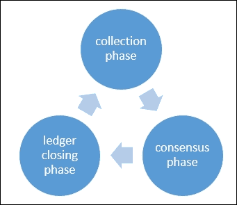

Ripple 共识协议阶段

Ripple 网络中有多个组件共同工作，以实现共识并形成支付网络。下面逐个讨论这些组件：

+   **服务器**：这个组件作为共识协议中的参与者。为了能够参与共识协议，需要使用 Ripple 服务器软件。

+   **账本**：这是网络上所有账户余额的主要记录。账本包含各种元素，例如账本编号、账户设置、交易、时间戳以及指示账本有效性的标志。

+   **最后关闭的账本**：一旦由验证节点达成共识，账本就会关闭。

+   **开放账本**：这是尚未验证且尚未就其状态达成共识的账本。每个节点都有自己的开放账本，其中包含提议的交易。

+   **唯一节点列表**：这是验证服务器使用的一组唯一可信节点列表，用于寻求投票和随后的共识。

+   **提议者**：顾名思义，这个组件提议将新的交易纳入共识过程中。通常是一组节点（上述定义的 UNL），可以向验证服务器提出交易提案。

### 交易

交易由网络用户创建，以更新账本。交易必须经过数字签名并有效，才能被视为共识过程中的候选事务。每笔交易都需要支付少量的 XRP，这是一种防止由于垃圾邮件攻击而导致的服务拒绝攻击的保护机制。Ripple 网络中有不同类型的交易。Ripple 交易数据结构中的一个字段称为`TransactionType`，用于表示交易的类型。交易通过四个步骤执行。首先，准备交易，按照标准创建一个未签名的交易。第二步是签名，对交易进行数字签名以授权。然后，通过连接的服务器将实际提交到网络。最后，执行验证以确保交易已成功验证。

大致上，交易可以分为三种类型，即与支付相关、与订单相关和与账户和安全相关。所有这些类型都在下一节中描述。

#### 与支付相关的

此类别中有几个字段会导致某些操作。所有这些字段都描述如下：

1.  `Payment`: 这种交易最常用，允许一个用户向另一个用户发送资金。

1.  `PaymentChannelClaim`: 用于从支付通道中索取**Ripples**（**XRP**）。支付通道是一种允许双方进行定期和单向支付的机制。这也可以用于设置支付通道的到期时间。

1.  `PaymentChannelCreate`: 这个交易创建一个新的支付通道，并以*滴*为单位添加 XRP。一个滴等于 0.000001 个 XRP。

1.  `PaymentChannelFund`: 用于向现有通道添加更多资金的交易。类似于`PaymentChannelClaim`交易，这也可以用于修改支付通道的到期时间。

#### 与订单相关

这种类型的交易包括以下两个字段：

1.  `OfferCreate`: 这种交易代表一个限价订单，它代表了一种货币交换的意图。如果无法完全满足，它将在共识账本中创建一个挂单节点。

1.  `OfferCancel`: 用于从共识账本中删除先前创建的挂单节点，表示撤回订单。

#### 与账户和安全相关

这种类型的交易包括以下列出的字段。每个字段负责执行特定功能。

1.  `AccountSet`: 用于修改 Ripple 共识账本中账户的属性。

1.  `SetRegularKey`: 用于更改或设置账户的交易签名密钥。账户使用从账户的主公钥派生的 base-58 Ripple 地址来标识。

1.  `SignerListSet`: 可用于创建一组签名者，以用于多重签名交易。

1.  `TrustSet`: 用于在账户之间创建或修改信任线。

Ripple 中的交易由各种字段组成，这些字段对所有交易类型都是通用的。以下列出了这些字段以及它们的描述：

1.  `Account` , 交易发起者的地址。

1.  `AccountTxnID`，这是一个可选字段，包含另一个交易的哈希值。

1.  `Fee`，XRP 数量。

1.  `Flags`，交易的可选标志。

1.  `LastLedgerSequence`，交易可能出现的账本中的最高序列号。

1.  `Memos`，可选的任意信息。

1.  `Sequence`，每个交易递增 1 的数字。

1.  `SigningPubKey`，公钥。

1.  `Signers`，表示多重签名交易中的签名者。

1.  `SourceTag`，代表交易发送者或交易原因。

1.  `TransactionType`，交易类型。

1.  `TxnSignature`，交易的验证签名。

各种开发者 API 可以通过 Ripple 使外部实体连接到 Ripple 网络。两个关键组件**Interledger**协议和**Ripple connect**协同工作，以实现分布式、安全、可扩展和互操作的支付网络。

Interledger 协议已特别开发，以实现两个不同账本之间的互操作性。它可以用于连接来自各种不同组织的账本和区块链，包括但不限于支付网络、金融机构、清算机构和交易所。

Interledger 是一个由四个层组成的简单协议：应用、传输、Interledger 和分账。每个层负责在特定协议下执行各种功能。这些功能和协议在下面的部分描述。

#### 应用层

运行在此层的协议统辖支付交易的关键属性。应用层协议的例子包括**Simple Payment Setup protocol**（**SPSP**）和**Open Web payment scheme**（**OWPS**）。 SPSP 是一个 Interledger 协议，通过在不同账本之间创建*连接器*，实现跨不同账本的安全支付。OWPS 是另一种方案，允许在不同网络之间进行消费者支付。一旦这一层的协议成功运行，传输层的协议将被调用，以开始支付流程。

#### 传输层

该层负责管理支付交易。目前，该层提供的协议包括**Optimistic Transport protocol**（**OTP**）、**Universal Transport protocol**（**UTP**）和**Atomic Transport protocol**（**ATP**）。 OTP 是最简单的协议，可以在没有任何赔偿保护的情况下管理支付转账，而 UTP 提供赔偿保护。 ATP 是最先进的协议，不仅提供赔偿转账机制，还利用受信任的公证人进一步确保支付交易的安全性。

#### Interledger 层

这一层提供了互操作性和路由服务。这一层包含诸如**Interledger protocol**（**ILP**）、**Interledger quoting protocol**（**ILQP**）和**Interledger control protocol**（**ILCP**）等协议。 ILP 数据包提供了转账中交易的最终目标。发送方在实际传输之前使用 ILQP 进行报价请求。 ILCP 用于在支付网络的连接器之间交换与路由信息和支付错误相关的数据。

#### 分账层

此层包含促进支付交易在连接器之间进行通信和执行的协议。*连接器*基本上是实现在不同账本之间转发支付的协议的对象。它可以支持各种协议，如简单账本协议、各种区块链协议、传统协议和不同的专有协议。

Ripple 连接由各种即插即用的模块组成，通过使用 ILP 实现账本之间的连接。它使各方在交易之前能够交换所需的数据，包括可见性、费用管理、交付确认和使用传输层安全性进行安全通信。第三方应用程序可以通过各种连接器连接到 Ripple 网络。

总的来说，Ripple 是针对金融行业的解决方案，使实时支付成为可能，没有任何结算风险。由于这是一个非常功能丰富的平台，在本章中无法涵盖其所有方面。Ripple 平台有非常丰富的文档，可在 [`ripple.com/`](https://ripple.com/) 上找到。

### Stellar

Stellar 是基于区块链技术的支付网络，采用一种新颖的共识模型称为**联邦拜占庭协议**（**FBA**）。FBA 通过创建受信任方的法定人数来工作。**Stellar 共识协议**（**SCP**）是 FBA 的一种实现。

Stellar 白皮书中确定的关键问题是当前金融基础设施的成本和复杂性。这一限制需要一个能够解决这些问题而又不损害金融交易的完整性和安全性的全球金融网络。这一要求导致了**Stellar 共识协议**（**SCP**）的发明，这是一种可证明安全的共识机制。

它具有四个主要属性：*分散控制*，允许任何人参与而没有中央方；*低延迟*，满足了快速处理交易的需求；*灵活的信任*，允许用户选择他们信任的特定目的的方；最后，*渐进安全性*，利用数字签名和哈希函数为网络提供所需级别的安全性。

Stellar 网络允许通过其本机数字货币 Lumens（简称 XLM）转移和表示资产的价值。当交易在网络上广播时，Lumens 会被消耗，这也可以防止**拒绝服务**（**DOS**）攻击。

Stellar 网络的核心是维护一个分布式账本，记录每一笔交易，并在每个 Stellar 服务器上复制。通过在服务器之间验证交易并更新账本来实现共识。Stellar 账本还可以作为一个分布式交易所订单簿，允许用户存储他们的买卖货币的报价。

Stellar 网络由各种工具、SDK 和软件组成。核心软件可在 [`github.com/stellar/stellar-core`](https://github.com/stellar/stellar-core) 上找到。

### Rootstock

在深入讨论 Rootstock 之前，定义和介绍一些对 Rootstock 设计基础至关重要的概念是很重要的。这些概念包括侧链、驱动链和双向锚定。侧链概念最初是由 Blockstream 公司开发的。

双向锚定是一种机制，通过它价值（硬币）可以在一个区块链之间以及反之互相转移。没有真正的硬币在链之间转移。这个概念围绕在比特币区块链（主链）中锁定相同数量和价值的硬币，然后在次级链中解锁相同金额的代币周转。

牢记这个定义，侧链可以如下所述被定义在以下章节。牢记这个定义，侧链可以如下所述被定义在以下章节。

**侧链**

这是一个与主区块链并行运行的区块链，允许在它们之间转移价值。这意味着一条区块链的代币可以在侧链中使用，反之亦然。这也被称为锚定侧链，因为它支持双向锚定的资产。

#### 驱动链

这是一个相对较新的概念，在这个概念中，解锁比特币（在主链上）的控制权交给了矿工，他们可以投票决定何时解锁它们。这与侧链形成对比，侧链通过简单支付验证机制验证共识，以便将硬币转回主链。

Rootstock 是一个智能合约平台，它与比特币区块链具有双向锚定。其核心理念是提高比特币系统的可扩展性和性能，并使其能够与智能合约一起运行。Rootstock 运行一个图灵完备的确定性虚拟机，称为**Rootstock 虚拟机**（**RVM**）。它还兼容以太坊虚拟机，允许用 Solidity 编译的合约在 Rootstock 上运行。智能合约还可以在比特币区块链的时间测试安全下运行。Rootstock 区块链通过与比特币进行合并挖矿来工作。这使得 RSK 区块链能够达到与比特币相同的安全水平。这对于防止双重支付和实现结算最终性尤为重要。它允许可扩展性，每秒最多处理 100 笔交易。

RSK 最近发布了一个名为 Turmeric 的测试网络。它可以在[`www.rsk.co/`](http://www.rsk.co/) 找到。

### 股份比

这是通过增强现有的以太坊区块链构建的区块链解决方案。在 Quorum 中引入了几个增强功能，如交易隐私和一个新的共识机制。Quorum 引入了一种称为 QuorumChain 的新共识模型，它基于大多数投票和基于时间的机制。另一个称为 Constellation 的功能也被引入，它是一个用于提交信息并允许对等方之间进行加密通信的通用机制。此外，节点级别的权限控制由智能合约管理。与公共以太坊区块链相比，它还提供了更高水平的性能。

Quorum 区块链生态系统由几个组件组成。这些在以下部分列出。

#### 事务管理器

此组件使得访问加密交易数据成为可能。它还管理本地存储并与网络上的其他事务管理器进行通信。

#### 加密保险库

正如其名称所示，该组件负责提供加密服务以确保交易隐私。它还负责执行密钥管理功能。

#### QuorumChain

这是 Quorum 中的关键创新。它是一种拜占庭容错共识机制，允许通过区块链网络上的交易进行投票的验证和流通。在此方案中，智能合约用于管理共识过程，并且节点可以被赋予投票权以投票应接受哪个新块。一旦选民收到足够数量的选票，该块就被视为有效。节点可以扮演两种角色，即 *投票者* 或 *制造者*。*投票者* 节点被允许投票，而 *制造者* 节点则是创建新块的节点。一个节点可以具有权利、无权或只有一种权利。

#### 网络管理器

此组件为权限网络提供了访问控制层。

Quorum 网络中的节点可以扮演多种角色，例如，允许创建新块的 Maker 节点。使用密码学和某些交易仅适用于其相关参与者的概念来提供交易隐私。这个想法类似于上一章讨论的 Corda 的私有交易的概念。由于它允许在区块链上进行公共和私有交易，状态数据库已分为表示私有和公共交易的两个数据库。因此，有两个单独的 Patricia-Merkle 树，表示网络的私有和公共状态。私有合同状态哈希用于在交易方之间的私有交易中提供共识证据。

Quorum 网络中的交易包括各种元素，如收件人、发送者的数字签名（用于识别交易发起者）、可选的以太数量、允许查看交易的参与者的可选列表以及在私有交易的情况下包含哈希的字段。

交易在达到目的地之前经过几个步骤。这些步骤详细描述如下：

1.  用户应用程序（DAPP）通过区块链网络提供的 API 将交易发送到 quorum 节点。这也包含接收地址和交易数据。

1.  API 然后加密有效负载，并应用任何其他必要的加密算法，以确保交易的隐私，并发送给事务管理器。在此步骤还计算了加密有效负载的哈希。

1.  收到交易后，事务管理器验证交易发送者的签名并存储消息。

1.  先前加密有效负载的哈希值被发送到 Quorum 节点。

1.  一旦 Quorum 节点开始验证包含私有交易的区块，它会向事务管理器请求更多相关数据。

1.  一旦事务管理器收到此请求，它会将加密有效负载和相关对称密钥发送给请求者 quorum 节点。

1.  一旦 Quorum 节点拥有所有数据，它会解密有效负载并将其发送到 EVM 进行执行。这就是 Quorum 如何通过区块链上的对称加密实现隐私，同时能够使用本地以太坊协议和 EVM 进行消息传输和执行的方式。

1.  之前曾以**Hydrachain**的形式提出了类似概念，但在某些方面有很大的不同，它基于以太坊区块链，允许创建权限分布式分类账。

Quorum 可在[`github.com/jpmorganchase/quorum`](https://github.com/jpmorganchase/quorum)下载。

### Tezos

Tezos 是一个通用的自修正密码分类账，这意味着它不仅允许在区块链状态上进行去中心化共识，还允许就协议和节点如何随时间演变达成共识。Tezos 已经开发出来，以解决比特币协议中的限制，如由硬分叉引起的问题，成本，由于工作量证明而导致的挖矿中心化，有限的脚本能力和安全问题。它是用一种纯函数式语言 OCaml 开发的。

Tezos 分布式分类账的架构分为三个层次：网络层、共识层和交易层。这种分解允许协议以分散的方式发展。为此，在 Tezos 中实现了一个通用的网络外壳，负责维护区块链，由共识和交易层组合表示。这个外壳在网络和协议之间提供接口层。还引入了种子协议的概念，用作允许网络上的利益相关者批准协议变更的机制。Tezos 区块链从种子协议开始，而不是从传统区块链的创世块开始。

此种子协议负责定义区块链中的修正程序，甚至自身的修正协议。Tezos 中的奖励机制基于**股权证明**（**PoS**）算法，因此没有挖矿要求。

Tezos 开发了用于编写智能合约的合约脚本语言，这是一种基于堆栈的图灵完备语言。Tezos 中的智能合约是经过形式验证的，这允许对代码进行数学上的正确性证明。

Tezos 代码可以在 [`github.com/tezos/tezos`](https://github.com/tezos/tezos) 找到。

### Storj

云存储的现有模型都是集中化的解决方案，可能不如用户期望的那样安全。需要有一个安全、高可用性，最重要的是分散的云存储系统。Storj 旨在提供基于区块链的、分散的、分布式存储。这是一个由社区共享的云，而不是一个中央组织。它允许节点之间执行存储合同，充当自治代理。这些代理（节点）执行各种功能，如数据传输，验证，并执行数据完整性检查。其核心概念基于**分布式哈希表**（**DHT**）- Kademlia，但是通过向 Storj 添加新的消息类型和功能来增强此协议。它还实现了一种点对点的**发布/订阅**（**pub/sub**）机制，称为 Quasar，这确保消息成功到达对存储合同感兴趣的节点。这是通过基于布隆过滤器的存储合同参数选择机制来实现的，称为**topics**。

Storj 在网络上以加密格式存储文件。在文件存储在网络上之前，它使用 AES-256-CTR 对称加密进行加密，然后以分布式方式逐个存储在网络上。这种将文件分割成片段的过程称为**sharding**，这样可以增加网络的可用性、安全性、性能和隐私。此外，如果一个节点出现故障，片段仍然可用，因为默认情况下，一个片段存储在网络上的三个不同位置。

它维护一个区块链，作为共享账本，并实现标准安全功能，例如公钥/私钥加密和哈希函数，类似于任何其他区块链。由于该系统基于节点之间的硬盘共享，任何人都可以通过在驱动器上共享其额外空间来做出贡献，并使用 Storj 自己的加密货币 **Storjcoinx**（**SJCX**）获得支付。SJCX 是作为 *对手方* 资产开发的，使用比特币区块链进行交易。

Storj 代码位于 [`github.com/Storj/`](https://github.com/Storj/)。

### Maidsafe

这是另一个类似于 Storj 的分布式存储系统。用户通过向网络贡献存储空间来获得 Safecoin 支付。这种支付机制由 *资源证明* 管理，该机制确保用户向网络承诺的磁盘空间可用，如果不可用，则 Safecoin 的支付会相应减少。在传输到网络进行存储之前，文件会被加密并分成小部分。Maidsafe 还引入了 **机会缓存** 的另一个概念，这是一种机制，用于在访问请求来自的物理位置附近创建经常访问数据的副本，从而提高网络性能。SAFE 网络的另一个新颖功能是，它会自动删除网络上的任何重复数据，从而减少存储要求。此外，还引入了 **搅拌** 的概念，基本上意味着数据不断在网络中移动，以便数据不能被恶意对手针对。它还在网络上保留数据的多个副本，以提供冗余，以防节点下线或失败。

### BigChainDB

这是一个可扩展的区块链数据库。它严格来说并不是一个区块链本身，而是通过提供分布式数据库来补充区块链技术。在其核心，它是一个分布式数据库，但具有区块链的附加属性，例如去中心化、不可变性和数字资产处理。它还允许使用 NoSQL 来查询数据库。它旨在提供一个数据库，位于分散的生态系统中，其中不仅处理是分散的（区块链）或文件系统是分散的（例如 IPFS），而且数据库也是分散的。这使整个分散式应用生态系统变得分散。此处提供：[`www.bigchaindb.com/`](https://www.bigchaindb.com/)。

### Multichain

Multichain 已经开发成为一个用于开发和部署私有区块链的平台。它基于比特币代码，并解决了安全性、可扩展性和隐私问题。这是一个高度可配置的区块链平台，允许用户设置不同的区块链参数。它通过一个细粒度的权限管理层支持控制和隐私。Multichain 的安装非常快速，并且安装文件的链接可在[`www.multichain.com/download-install/`](http://www.multichain.com/download-install/)找到。

### Tendermint

Tendermint 是一种软件，为应用程序提供了拜占庭容错共识机制和状态机复制功能。它的主要动机是开发一个通用的、安全的和高性能的复制状态机。

Tendermint 有两个组件，将在下一节中描述。

#### Tendermint Core

这是一个共识引擎，可以在网络中的每个节点上安全地复制交易。

#### Tendermint Socket Protocol (TMSP)

这是一个应用程序接口协议，允许与任何编程语言进行接口，以处理交易。

Tendermint 允许将应用程序过程和共识过程分离，从而使任何应用程序都能从共识机制中受益。

Tendermint 共识算法是一个基于轮次的机制，在每个轮次中，验证节点提出新的区块。使用锁定机制来确保防止在区块链的同一高度上选择提交两个不同的区块的情况。每个验证节点保持包含交易的完整本地复制分类账。每个区块包含一个头部，其中包括上一个区块的哈希值、区块提议的时间戳、当前区块高度和区块中包含的所有交易的默克尔根哈希值。

Tendermint 最近被用于**Cosmos**，它是一个区块链网络，允许在运行 BFT 共识算法的不同区块链之间进行互操作。在该网络上的区块链称为“区”。Cosmos 的第一个区被称为 Cosmos hub，实际上是一个公共区块链，负责为其他区块链提供连接服务。为此，该中枢使用**跨链通信协议**（**IBC**）。IBC 协议支持称为*IBCBlockCimmitTx*和*IBCPacketTx*的两种交易类型。第一种类型用于向任何方提供区块链中最新块哈希的证明，而后一种类型用于提供数据源认证。从一个区块链到另一个区块链的数据包是通过首先向目标链发布证明来发布的。接收（目标）链检查此证明以验证发送链确实已发布该数据包。此外，它有自己的本机货币称为 Atom。这个方案通过允许多个区块链连接到中枢来解决可伸缩性和互操作性问题。

Tendermint 可以在[`tendermint.com/`](https://tendermint.com/)找到。

# 平台

本节介绍了用于增强现有区块链解决方案体验的各种平台。首先，将讨论一个名为 BlockApps STRATO 的与以太坊兼容的解决方案。

## BlockApps

BlockApps 是一个提供丰富工具集来构建区块链应用程序的平台。该平台用 Haskell 编写，基于模块化架构。该解决方案具有可伸缩性，并使部署智能合约和区块链应用程序变得更加容易。它可以在[`www.blockapps.net/`](http://www.blockapps.net/)找到。

在下一节中，将讨论安装和一个简单的部署示例。

### 安装

可以使用以下命令通过 npm 安装 BlockApps：

```
$ sudo npm install -g blockapps-bloc

```

`sudo`是可选的，如果不需要管理员权限。这将产生类似于以下截图所示的输出：

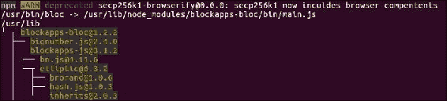

通过 npm 安装 bloc（输出已截断）

安装完成后，可以按照以下部分中显示的步骤创建应用程序。下面的示例显示如何在 BlockApps 中初始化一个新应用程序，在 BlockApps TestNet 上部署它并与其交互。

### 使用 BlockApps 进行应用程序开发和部署

第一步是使用以下命令初始化 BlockApps 应用程序：

```
$ bloc init

```

它将要求输入几个参数：应用程序名称，您的姓名，电子邮件，API URL（apiUrl）和区块链配置文件。如下截图所示。

一旦命令运行并成功完成，它将创建一个带有模板和样本的应用程序目录。在此示例中，将创建一个名为 testApp 的目录，其中包含相关的目录和示例合约。

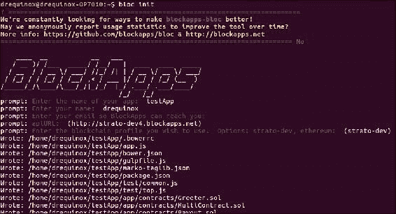

bloc init

下一步是安装`testApp`，可以通过运行以下命令实现：

```
$ sudo npm install

```

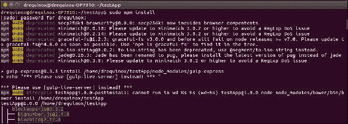

testApp 安装

为了签署交易，需要生成一个新的密钥。可以使用以下命令生成密钥：

```
$ bloc genkey

```

一旦发出，将需要输入密码以保护密钥。一旦提供，密钥将被创建，并且将创建一个 JSON 文件。请注意，JSON 文件名是区块链上帐户的实际地址。此外，它将显示消息“transaction mined”，指示密钥和交易（帐户创建）的成功部署。

过程如下截图所示：

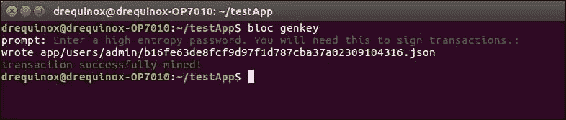

生成密钥

现在，在此时刻，可以通过使用 curl 查询新帐户。只需在 URL 中传递地址作为参数，结果将以 JSON 格式返回。

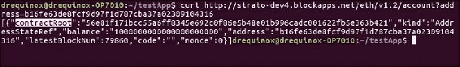

使用 curl 查询新帐户

或者，可以通过任何网页浏览器执行查询，如下面的截图所示：

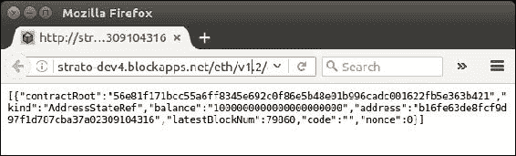

通过网页浏览器进行 BlockApps 查询

接下来，将描述将新合同上传到测试链的过程。请注意，所有合同都放在`testApp`目录下的`./app/contracts`目录中。作为示例，选择了要部署到网络的`Greeter.sol`合同。BlockApps 提供了一种简单的方法来实现此部署。

所有合同都需要放在 contracts 目录下，以便编译命令能够找到它们并进行编译。

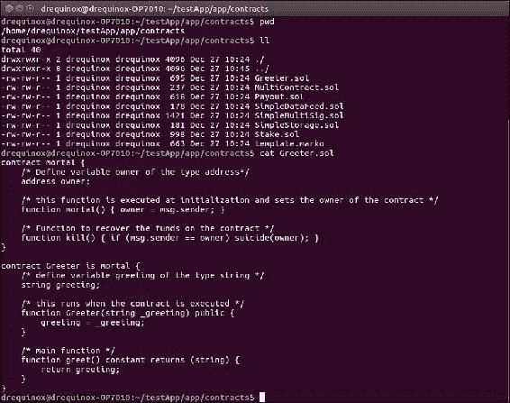

contracts 目录下的 Greeter 合同

合同可以通过使用下面截图中显示的命令进行编译。请注意，它以合同文件名作为参数。编译成功后，所有相关的 JSON 文件将写入`./meta`目录下。

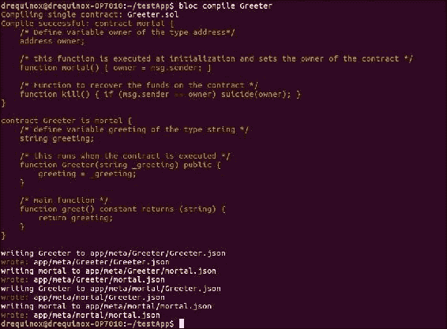

编译 Greeter 合同

最后，可以使用以下命令上传合同。此命令期望传递给合同的参数与合同代码中定义的相同。在示例中，它期望一个文本字符串，如下面的示例截图所示：

```
$ bloc upload Greeter "Hello bloc"

```

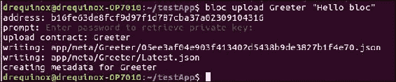

上传 Greeter 合同

请注意，如果没有传递正确的参数或缺少参数，将会发生类似下面截图的错误：

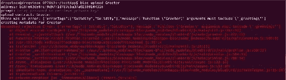

在传递错误或缺少参数的情况下出现错误

一旦部署成功，可以验证以太从现有合约转移到新合约。请注意，余额已下降。如下截图所示：

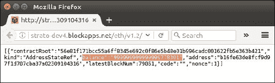

通过 Web 浏览器部署的合约

合约部署后，可以使用 Web 浏览器或诸如 cURL 之类的 CLI 工具进行查询。需要将 URL [`strato-dev4.blockapps.net/eth/v1.2/account?address=05ee3af04e903f413402d5438b9de3827b1f4e70`](http://strato-dev4.blockapps.net/eth/v1.2/account?address=05ee3af04e903f413402d5438b9de3827b1f4e70) 传递给 Web 浏览器。如下截图所示。请注意，二进制格式的代码也在输出中可用。

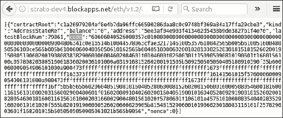

浏览已部署的合约，代码以二进制格式

此外，BlockApps 还提供了一个用于运行本地 HTTP 服务器的功能，可以使用以下命令启动：

```
$ bloc start

```

这将启动 Web 浏览器，并在 TCP 端口 `8000` 上进行侦听。

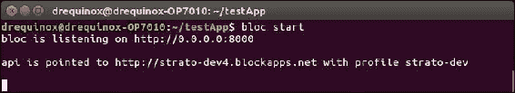

bloc start

在 Web 服务器启动后，可以通过本地网页查看和查询已编译的合约，如下面的截图所示：

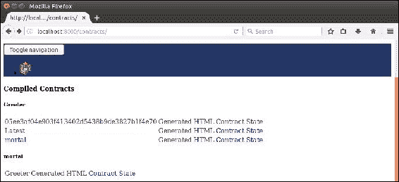

通过浏览器可用的已编译合约

正如前面的示例所示，使用 BlockApps 更容易构建、部署和管理合约。BlockApps 旨在为区块链应用程序提供工具和核心基础设施，而不仅仅是区块链。

## Eris

Eris 不是一个单一的区块链，它是由 Monax 开发的用于开发基于区块链的 *生态系统应用程序* 的开放模块化平台。它提供了各种框架、SDK 和工具，可以加速开发和部署区块链应用程序。Eris 应用平台背后的核心理念是实现带有区块链后端的 *生态系统应用程序* 的开发和管理。它允许与多个区块链集成，并使各种第三方系统能够与其他系统交互。该平台利用 solidity 语言编写的智能合约。它可以与以太坊或比特币等区块链进行交互。交互可以包括连接命令、启动、停止、断开连接和创建新区块链。Eris 中已经将与区块链设置和交互相关的复杂性抽象化了。所有命令对于不同的区块链都是标准化的，无论目标区块链类型如何，都可以在整个平台上使用相同的命令。

生态系统应用可以包括 Eris 平台，从而实现 API 网关，允许传统应用程序连接到密钥管理系统、共识引擎和应用程序引擎。Eris 平台提供各种工具包，用于向开发人员提供各种服务。这些模块描述如下：

+   **链**：这允许创建和与区块链进行交互。

+   **包**：这允许开发智能合同。

+   **秘钥**：用于密钥管理和签名操作。

+   **文件**：这允许使用分布式数据管理系统。可用于与 IPFS 和数据湖等文件系统进行交互。

+   **服务**：这提供了一组服务，允许对生态系统应用进行管理和集成。

Eris 还开发了几个 SDK，允许开发和管理生态系统应用。这些 SDK 包含经过全面测试的智能合同，满足业务的特定需求和要求。例如，财务 SDK，保险 SDK 和物流 SDK。还有一个基础 SDK，用作管理生态系统应用生命周期的基本开发工具包。

Monax 已开发了自己的权限区块链客户端，称为 Eris:db。这是一个基于**权益证明**（**PoS**）的区块链系统，允许与多种不同的区块链网络集成。`Eris:db`包括三个组件：

+   **共识**：这是基于 Tendermint 共识机制的，之前已经讨论过。

+   **虚拟机**：Eris 使用**以太坊虚拟机**（**EVM**），因此支持经过编译的 solidity 合同。

+   **权限层**：作为权限账本，Eris 提供访问控制机制，可用于在网络上为不同实体分配特定角色。

+   **界面**：这提供了各种命令行工具和 RPC 接口，以便与后端区块链网络进行交互。

以太坊区块链和 Eris:db 之间的关键区别在于 Eris:db 使用了实用拜占庭容错算法，该算法实现为基于存款的权益证明（DPOS 系统），而以太坊使用**工作证明**（**PoW**）。此外，`Eris:db`使用 ECDSA ed22519 曲线方案，而以太坊使用 secp256k1 算法。最后，它通过访问控制层具有权限，并且以太坊是公共区块链。

Eris 是一个功能丰富的应用平台，提供大量的工具包和服务，用于开发基于区块链的应用程序。可在[`monax.io/`](https://monax.io/)上获取。

# 摘要

本章以替代区块链的介绍开始，并分为两个主要部分讨论区块链和平台。区块链技术是一个非常蓬勃发展的领域，因此现有解决方案的变化相当迅速，几乎每天都有新的相关技术或工具被引入。在本章中，对平台和区块链进行了仔细的选择。讨论了几种解决方案，这些解决方案补充了之前章节中介绍的材料，例如，支持以太坊开发的 BlockApps。还讨论了新的区块链，如 Kadena，各种新协议，如 Ripple，以及诸如侧链和驱动链等概念。本章涵盖的材料旨在为读者对感兴趣的领域进行更深入的研究提供坚实的基础。正如之前所说，区块链是一个发展非常迅速的领域，还有许多其他区块链提案项目，如**Tauchain**、**Hydrachain**、**Elements**、**credits**等，这些项目在本章中没有讨论。鼓励读者关注这一领域的发展，以便及时了解这一快速发展领域的进展。
