# 第十一章：区块链-超越货币

数字货币是区块链技术的第一个应用，可以说并没有意识到其真正的潜力。随着比特币的发明，区块链的概念第一次被介绍了，但直到 2013 年，随着 *Blockchain 2.0* 的出现，区块链的真正好处才被认识到，并且发现了它在许多不同行业中的应用可能性。自那时以来，已经提出了区块链技术在不同行业中的许多用例，包括但不限于金融、物联网、数字版权管理、政府和法律。在本章中，选择了四个主要行业，即**物联网**（**IoT**）、政府、医疗和金融，进行讨论。读者将被介绍到所有这些领域，并将提供各种相关用例。

# 物联网

物联网或简称 IoT 最近因其改变商业应用和日常生活潜力而受到了广泛关注。物联网可定义为具有计算智能的物理对象网络，这些对象能够连接到互联网，感知现实世界的事件或环境，对这些事件做出反应，收集相关数据，并通过互联网进行通信。这个简单的定义具有巨大的影响，并导致了令人兴奋的概念，如可穿戴设备、智能家居、智能电网、智能互联汽车和智能城市，这些概念都是基于物联网设备的基本概念。在分解上述 IoT 定义之后，可以看到 IoT 设备执行的四个功能。这些功能包括感知、反应、收集和通信。所有这些功能都是通过 IoT 设备上的各种组件来实现的。

感知是由传感器执行的。反应或控制是由执行器执行的，收集是由各种传感器的功能执行的，通信是由提供网络连接的芯片执行的。需要注意的是，在物联网中，所有这些组件都可以通过互联网进行访问和控制。一个独立的物联网设备可能在一定程度上有用，但如果它是更大物联网生态系统的一部分，则更有价值。

一个典型的物联网可以由许多物理对象相互连接，并连接到一个集中的云服务器。如下图所示：

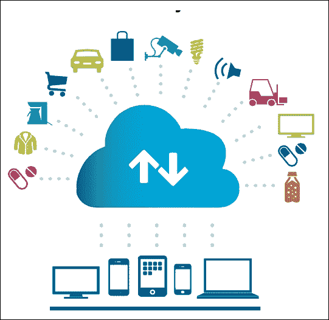

一个典型的 IoT 网络：来源--IBM

物联网的元素分布在多个层次上，存在多种可以用来开发物联网系统的参考架构。一般来说，可以使用五层模型来描述 IoT，其中包含物理对象层、设备层、网络层、服务层和应用层。每个层或级别负责各种功能，并包含各种组件。这些将在下面详细描述。

## 物理对象层

这些包括任何物理世界中的对象，包括人、动物、汽车、树木、冰箱、火车、工厂、住宅，事实上任何需要被监测和控制的东西都可以连接到物联网。

## 设备层

该层包含组成物联网的东西，例如传感器、传感器、执行器、智能手机、智能设备和**射频识别标签**（**RFID**）。根据它们执行的工作类型，传感器可以有许多类别，例如身体传感器、家庭传感器和环境传感器。这是物联网生态系统的核心，各种传感器被用来感知现实世界的环境。这包括可以监测温度、湿度、液体流量、化学物质、空气、压力等的传感器。通常，设备上需要一个**模拟到数字转换器**（**ADC**）来将真实世界的模拟信号转换为微处理器可以理解的数字信号。

该层中的执行器提供了启动电机或打开门等的外部环境控制手段。这些组件还需要数字到模拟转换器，以便将数字信号转换为模拟信号。当物联网设备需要控制机械部件时，这一点尤其重要。

## 网络层

该层由用于在设备之间提供互联网连接以及与物联网生态系统中的云或服务器的网络设备组成。这些设备可以包括网关、路由器、集线器和交换机。此层可以包括两种类型的通信。第一种是水平通信方式，包括无线电、蓝牙、WiFi、以太网、局域网、ZigBee 和 PAN，可用于在物联网设备之间提供通信。其次，我们有与下一层通信，通常通过互联网提供与机器和人或其他更高层之间的通信。第一层可以选择性地包含在设备层中，因为它物理上位于设备层，在该层设备可以彼此通信。

## 管理层

该层为物联网生态系统提供管理层。这包括使来自物联网设备收集的数据进行处理并将其转化为有意义的见解的平台。此外，设备管理、安全管理和数据流管理也包含在此层中。它还管理设备与应用程序层之间的通信。

## 应用程序层

该层包括在物联网网络顶部运行的应用程序。这可能包括根据需求的各种应用程序，例如运输、医疗保健、金融、保险或供应链管理。当然，这并不是一个详尽的列表；有许多物联网应用程序可以归入此层：

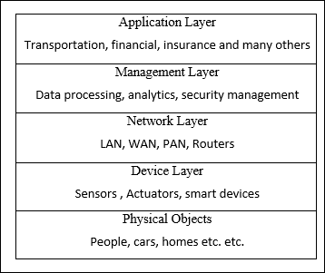

物联网五层模型

随着廉价传感器、硬件和带宽的可用性，物联网近年来备受青睐，在医疗保健、保险、供应链管理、家庭自动化、工业自动化和基础设施管理等许多不同领域都有应用。此外，技术的进步，如 IPv6 的可用性、更小巧和功能强大的处理器以及更好的互联网接入，也在物联网受欢迎中起着至关重要的作用。物联网的好处从节约成本到使企业能够根据物联网设备提供的数据做出重要决策，从而提高性能。数以百万计的物（物联网设备）的原始数据被分析，从中得到有意义的见解，有助于及时和有效地制定业务决策。

普通物联网模型基于集中式范式，物联网设备通常连接到云基础设施或中央服务器，以报告和处理相关数据。这种集中化提出了某些可能性的利用，包括黑客攻击和数据窃取。此外，在没有对个人数据进行控制的单一集中式服务提供商的情况下，也增加了安全和隐私问题的可能性。虽然有方法和技术可以建立基于普通物联网模型的高度安全的物联网生态系统，但区块链可以为物联网带来一定更可取的好处。基于区块链的物联网模型与传统物联网网络范式不同。据 IBM 称，区块链对于物联网可以帮助建立信任、减少成本和加速交易。此外，区块链技术的核心——分散化，能够消除物联网网络中的单点故障。例如，一个中央服务器可能无法处理数十亿个物联网设备（物）以高频率产生的数据量。此外，区块链所提供的点对点通信模型可以帮助降低成本，因为无需建设高成本的集中式数据中心或实施复杂的公钥基础结构来确保安全。设备可以直接或通过路由器互相通信。

根据各种研究人员和公司的估计，到 2020 年，将有大约 220 亿台设备连接到互联网。随着数十亿台设备连接到互联网的爆炸，很难想象中心化的基础设施能够在不过度支出的情况下满足带宽、服务和可用性的高需求。基于区块链的物联网将能够解决当前物联网模型中的可扩展性、隐私和可靠性问题。

区块链使*物*能够直接与其他物通信和交易，并且在智能合约的可用性下，谈判和金融交易也可以直接在设备之间发生，而无需中间人、权威或人类干预。例如，如果酒店的一个房间空闲，它可以自行出租，谈判租金，并且可以为支付了足够资金的人开门锁。另一个例子可能是，如果洗衣机用完了洗涤剂，它可以在智能合约中编程的逻辑基础上，在线订购洗涤剂并找到最佳价格和价值。

上述五层物联网模型可以通过在网络层之上添加一个区块链层来适应基于区块链的模型。该层将运行智能合约，并为物联网生态系统提供安全性、隐私性、完整性、自治性、可扩展性和去中心化服务。在这种情况下，管理层可以仅包括与分析和处理相关的软件，安全性和控制可以移至区块链层。这可以在以下图表中可视化：

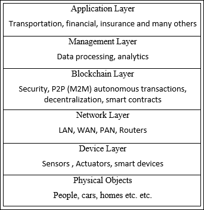

基于区块链的物联网模型

在这个模型中，其他层可能保持不变，但是会引入一个额外的区块链层作为物联网网络所有参与者之间的中间件。

在将上述所有层抽象化后，也可以将其视为点对点的物联网网络。在下面的图表中显示了这一点，所有设备都在互相通信和协商，没有中央命令和控制实体：

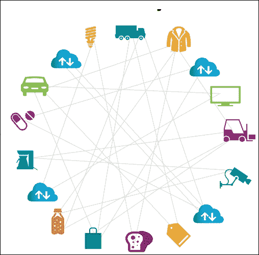

基于区块链的直接通信模型，来源--IBM

这也可以导致成本节约，这是由于使用基于区块链的去中心化方法更容易进行设备管理。可以通过使用区块链来优化物联网网络的性能。在这种情况下，将不需要为数百万设备集中存储物联网数据，因为存储和处理要求可以分配给区块链上的所有物联网设备。这可以完全消除处理和存储物联网数据的大型数据中心的需求。

基于区块链的物联网也可以防止拒绝服务攻击，其中黑客可以更容易地针对集中式服务器或数据中心，但是使用区块链的分布式和去中心化特性，这样的攻击不再可能。此外，如果根据估计，在不久的将来将有数十亿台设备连接到互联网，那么从传统的集中式服务器管理所有这些设备的安全性和更新几乎是不可能的。区块链可以通过允许设备以安全的方式直接相互通信，甚至从彼此请求固件和安全更新来解决这个问题。在区块链网络上，这些通信可以被不可变地和安全地记录下来，这将为系统提供审计性、完整性和透明性。这是传统 P2P 系统所无法实现的。

总的来说，物联网（IoT）和区块链的融合可以带来明显的好处，学术界和工业界已经在进行大量的研究和工作。已经有各种各样的项目提出了基于区块链的物联网解决方案。例如，IBM 的蓝色地平线（Blue Horizon）和 IBM Bluemix 是支持区块链物联网平台的物联网平台。各种初创公司，如 Filament，已经提出了如何构建一个允许物联网上的设备直接和自主地通过智能合约交易的分散网络的新颖想法。

在接下来的部分中，提供了一个实际示例，介绍了如何构建一个简单的物联网设备并将其连接到以太坊区块链。该物联网设备连接到以太坊区块链，并在区块链上的用户发送适当数量的资金时用于打开门（在本例中，门锁由 LED 表示）。这是一个简单的示例，需要一个更严格测试的版本才能将其投入生产，但它展示了如何连接、控制和响应以太坊区块链上某些事件的物联网设备。

## IoT 区块链实验

此示例使用的是一个树莓派设备，它是一种**单板计算机**（**SBC**）。树莓派是一种低成本的计算机，旨在促进计算机教育，但也因其在构建物联网平台方面的选择而广受欢迎。树莓派 3 型 B 型号如下图所示：

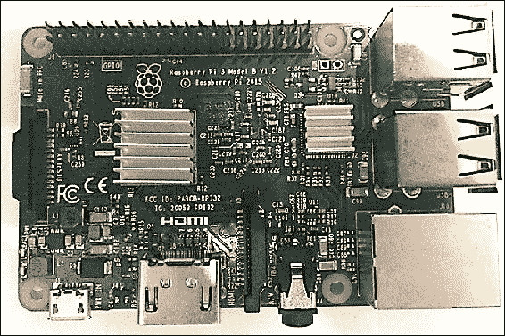

树莓派 B 型号

在接下来的部分中，将讨论一个例子，在该例子中，一个树莓派将作为一个物联网设备连接到以太坊区块链，并在对智能合约调用作出响应时执行一个动作。

首先，需要设置 Raspberry Pi。可以使用提供 Raspbian 或任何其他操作系统安装的简便方法的 NOOBS 来完成此操作。这可以从链接[`www.raspberrypi.org/downloads/noobs/`](https://www.raspberrypi.org/downloads/noobs/)下载并安装。或者，可以只从链接[`www.raspberrypi.org/downloads/raspbian/`](https://www.raspberrypi.org/downloads/raspbian/)安装 Raspbian。还可以使用[`github.com/debian-pi/raspbian-ua-netinst`](https://github.com/debian-pi/raspbian-ua-netinst)提供的另一种选择来安装 Raspbian OS 的最小非 GUI 版本。在本示例中，已使用 NOOBS 安装了 Raspbian，因此本练习的其余部分假设 Raspbian 已安装在 Raspberry Pi 的 SD 存储卡上。

安装 Raspbian 操作系统后，下一步是为 Raspberry Pi ARM 平台下载适当的`geth`二进制文件。可以通过在 Raspberry Pi Raspbian 操作系统的终端窗口中运行以下命令来确认平台。命令输出显示操作系统正在运行的体系结构。在这种情况下，它是`armv71`，因此将下载适用于`geth`的 ARM 兼容二进制文件。

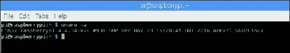

Raspberry Pi 架构

下面详细描述了以下步骤：

1.  `geth`下载：请注意，在下面的示例中下载了特定版本，但还有其他版本可供下载，可从[`geth.ethereum.org/downloads/`](https://geth.ethereum.org/downloads/)下载。

```
wget https://gethstore.blob.core.windows.net/builds/geth-linux-     
        arm7-1.5.6-2a609af5.tar.gz

```

1.  解压缩并提取到一个目录中，将自动创建名为`geth-linux-arm7-1.5.6-2a609af5`的目录，并使用下一个 tar 命令提取到该目录中：

```
tar -zxvf geth-linux-arm7-1.5.6-2a609af5.tar

```

这将创建一个名为`geth-linux-arm7-1.5.6-2a609af5`的目录，并将`geth`二进制文件和相关文件提取到该目录中。可以将`geth`二进制文件复制到 Raspbian 上的`/usr/bin`或适当的路径中，以便从操作系统中的任何位置都可以访问它。下载完成后，下一步是创建创世区块。

需要使用之前在第八章中创建的相同的创世区块，*以太坊开发*。可以从网络上的其他节点复制创世区块文件。这在以下截图中显示。或者，可以生成全新的创世区块。这在第八章中有详细讨论，*以太坊开发*。

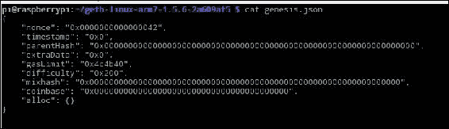

创世区块文件

一旦将`genesis.json`文件复制到 Raspberry Pi 上，就可以运行以下命令以生成创世区块。非常重要的是要使用之前生成的完全相同的创世区块，否则节点将有效地运行在不同的网络上：

```
$ ./geth init genesis.json

```

这将显示与以下截图中显示的类似的输出：

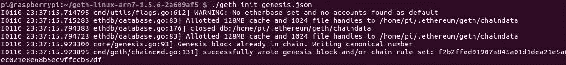

初始化创世文件

创建创世块后，需要向网络中添加对等节点。这可以通过创建一个名为`static-nodes.json`的文件来实现，其中包含树莓派上的 geth 将用于同步的对等节点的 enode ID 信息。

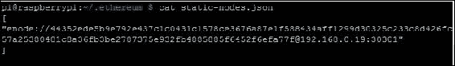

静态节点配置

可以通过运行以下显示的命令从 geth JavaScript 控制台上获得这些信息，此命令应该在树莓派要连接的对等节点上运行：

```
> Admin.nodeInfo

```

这将显示与以下截图中显示的类似的输出：

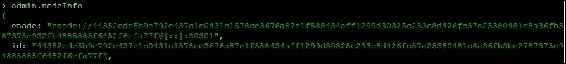

`geth nodeinfo`

完成此步骤后，可以按照下面呈现的进一步说明来连接树莓派到私人网络上的其他节点。在本例中，树莓派将连接到第八章中创建的网络 ID 为 786 的*以太坊开发*。关键是使用之前创建的相同创世文件和不同的端口号。不过，不同的端口不是严格要求的。如果两个节点正在私人网络下运行，并且需要从网络外部的环境访问，则需要使用 DMZ/路由器和端口转发的组合。因此建议使用不同的 TCP 端口以便允许端口转发正常工作。以下命令中介绍的身份切换，之前还未介绍，让节点能够指定一个标识名称。

### 第一个节点的设置

首先，需要使用以下命令在第一个节点上启动`geth`：

```
$ geth --datadir .ethereum/privatenet/ --networkid 786 --maxpeers 5 --rpc --rpcapi web3,eth,debug,personal,net --rpcport 9001 --rpccorsdomain "*" --port 30301 --identity "drequinox"

```

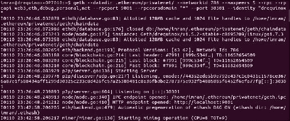

第一个节点上的`geth`

一旦`geth`启动起来，它应该得持续运行，而且来自树莓派节点的另一个`geth`实例应该被启动。

### 树莓派节点设置

在树莓派上，需要运行以下命令才能启动`geth`并与其他节点同步（在本例中只有一个节点）。命令如下：

```
$ ./geth --networkid 786 --maxpeers 5 --rpc --rpcapi web3,eth,debug,personal,net  --rpccorsdomain "*" --port 30302 --identity "raspberry"

```

这应该产生与以下截图中显示的类似的输出。当输出包含显示**块同步已开始**的行时，这意味着节点已成功连接到其对等节点。

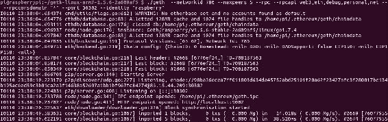

树莓派上的`geth`。

可以通过在两个节点上的`geth`控制台上运行命令来进一步验证这一点，如下截图所示。仅需在树莓派上运行以下命令就可以连接`geth`：

```
$ geth attach

```

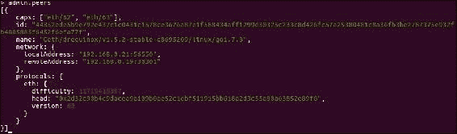

运行在树莓派上的`geth`控制台管理员 peers 命令

类似地，可以通过在第一个节点上运行以下命令来附加到`geth`：

```
$ geth attach ipc:.ethereum/privatenet/geth.ipc

```

一旦控制台可用，`admin.peers` 可以运行以显示关于其他连接节点的详细信息，如以下截图所示：

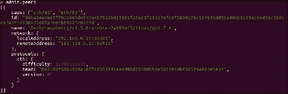

在另一节点上运行 `geth console admin peers` 命令

一旦两个节点都正常运行，可以安装更多的先决条件以设置实验。需要安装 Node.js 和相关的 JavaScript 库。以下列出了所需的库和依赖项。首先需要在树莓派的 Raspbian 操作系统上更新 Node.js 和 npm。可以按照以下步骤进行：

1.  使用以下命令在树莓派上安装最新的 Node.js：

    ```
    $ curl -sL https://deb.nodesource.com/setup_7.x | sudo -E bash      
              -

    ```

    这应该显示类似于以下内容的输出。由于输出相当大，因此以下截图仅显示了输出的顶部部分：

    

    Node.js 安装

1.  通过 `apt-get` 运行更新：

    ```
    $ sudo apt-get install nodejs

    ```

    可以通过运行以下命令来执行验证，以确保正确版本的 Node.js 和`npm`已安装，如下面的截图所示：

    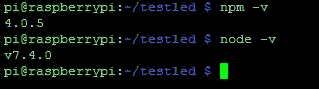

    npm 和 node 安装验证

    应该注意，这些版本不是必需的；任何最新版本的`npm`和`node`都可以工作。本章的示例使用的是 npm 4.0.5 和 node v7.4.0。

1.  安装以太坊 web3 npm，这是为了让 JavaScript 代码能够访问区块链：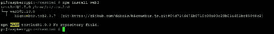

    npm install web3

1.  同样地，可以安装`npm install onoff`，这是与树莓派通信和控制 GPIO 所必需的：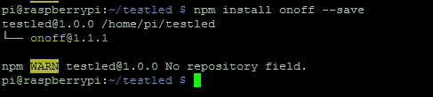

    onoff 安装

当所有先决条件都安装好后，可以进行硬件设置。为此，使用面包板和一些电子元件建立一个简单的电路。

这些组件列如下：

1.  **LED**：**发光二极管**的缩写，可以用作事件的可视指示。

1.  **电阻器**：需要一个 330 欧姆的元件，根据其额定值提供对通过电流的阻抗。不需要理解背后的理论，这个实验涵盖了所有这些主题的标准电子工程文本详细讨论。

1.  **面包板**：这提供了一种在不需要焊接的情况下构建电子电路的方法。

1.  **T 形布线板**：如下图所示插入到面包板上，并为树莓派的所有**GPIO**（**通用输入/输出**）引脚提供标记视图。

1.  **平坦电缆连接器**：简单地用于通过 GPIO 在树莓派和面包板之间提供连接。所有这些组件都显示在以下图像中：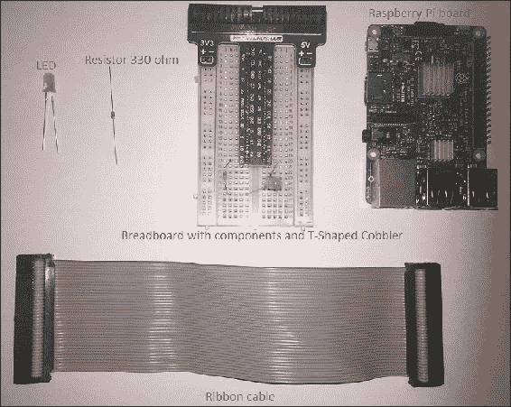

    所需组件

### 电路

如下图所示，LED 的正极（长腿）连接到 GPIO 的 21 号引脚，而负极（短腿）连接到电阻，然后连接到 GPIO 的**地**（**GND**）引脚。一旦连接设置好，可以使用平排线简单地连接到树莓派上的 GPIO 连接器。

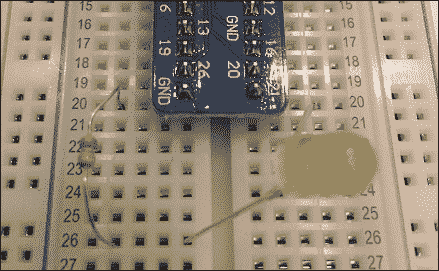

连接面包板上的元件

一旦连接正确设置并且树莓派已更新到适当的库和 geth，下一步是开发一个简单的智能合约，该合约期望一个值。如果提供给它的值不是它所期望的，它不会触发事件；否则，如果传递的值与正确值匹配，则触发事件，客户端 JavaScript 程序可以通过 Node.js 运行，可以读取事件。当然，Solidity 合约可以非常复杂，并且还可以处理发送给它的以太币，如果以太币的数量等于所需数量，则事件可以触发；但在这个示例中，目的是演示使用智能合约来触发可以由运行在 Node.js 上的 JavaScript 程序读取的事件，然后进一步可以使用各种库触发 IoT 设备上的操作。

智能合约源代码如下所示：

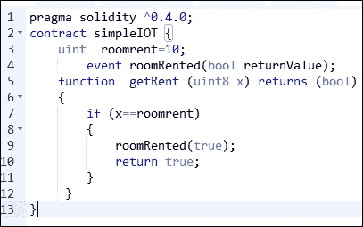

简单 IOT 的 Solidity 代码

可以使用 Solidity 在线编译器运行和测试该合约。与该合约交互所需的**应用二进制接口**（**ABI**）也可在以下截图中的**接口**字段中找到：

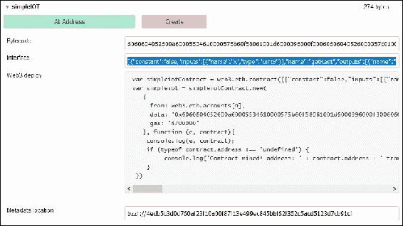

Solidity 在线编译器

树莓节点可以通过 web3 接口连接到私有区块链的两种方法。第一种是树莓设备运行自己的 geth 并维护自己的账本，但对于资源受限的设备来说，很难运行完整的`geth`节点，甚至在某些情况下运行轻量级节点也不可能。在这种情况下，可以初始化 web3 提供程序以连接到适当的 RPC 通道。这将在后面的客户端 JavaScript Node.js 程序中显示。这两种方法的比较如下图所示：

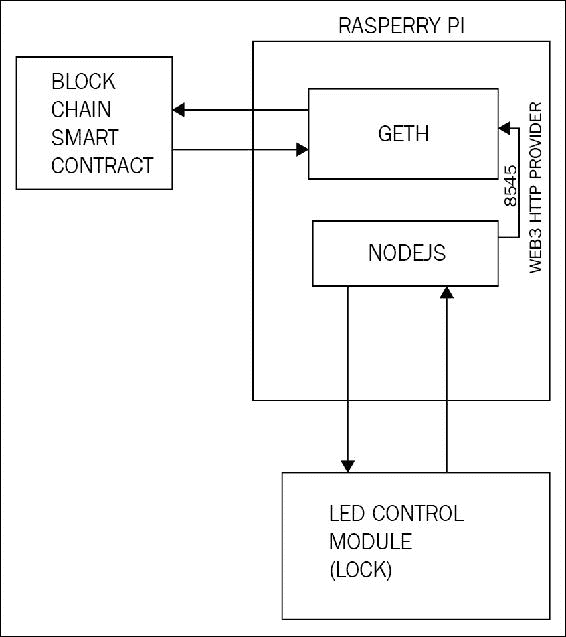

房租 IoT 应用程序的应用架构（带本地账本的 IoT 设备）

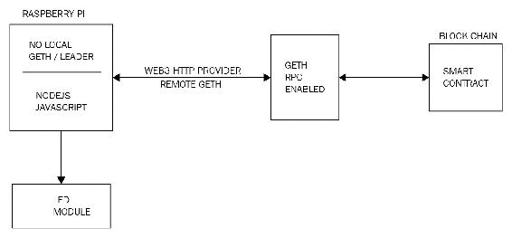

房租 IoT 应用程序的应用架构（没有本地账本的 IoT 设备）

显然，暴露 RPC 接口会带来安全问题，因此建议仅在私有网络上使用此选项，如果需要在公共网络上使用，则需采取适当的安全措施，例如仅允许已知 IP 地址连接到 geth RPC 接口。这可以通过禁用对等发现机制和 HTTP-RPC 服务器监听接口的组合来实现。有关此的更多信息，请参阅 geth 帮助文档。传统的网络安全措施，如防火墙、**传输层安全性**（**TLS**）和证书也可以使用，但在本示例中未讨论。

现在，Truffle 可以用于部署合约到私有网络 ID 786，该网络此时连接的是树莓派。可以通过以下显示的命令简单执行 truffle 部署；假设已经执行了 `truffle init` 和其他章节 8 讨论的前提条件，《以太坊开发》：

```
$ truffle migrate 

```

它应该会产生类似以下屏幕截图的输出：

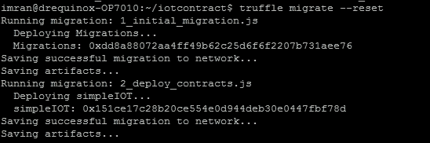

Truffle 部署

一旦合约正确部署，就可以开发 JavaScript 代码，通过 web3 连接到区块链，在区块链上监听智能合约的事件，并通过树莓派将 LED 打开。以下是 JavaScript 代码的示例：

```
var Web3 = require('web3'); 
if (typeof web3 !== 'undefined') 
{ 
  web3 = new Web3(web3.currentProvider); 
}  
else  
{ 
   web3 = new Web3(new       
   Web3.providers.HttpProvider("http://localhost:9002")); 
} 
var Gpio = require('onoff').Gpio; 
var led = new Gpio(21,'out'); 
var coinbase = web3.eth.coinbase; 
var ABIString = '[{"constant":false,"inputs": [{"name":"x","type":"uint8"}],"name":"getRent","outputs":[{"name":"","type":"bool"}],"payable":false,"type":"function"},{"anonymous":false,"inputs":[{"indexed":false,"name":"returnValue","type":"bool"}],"name":"roomRented","type":"event"}]'; 
var ABI = JSON.parse(ABIString); 
var ContractAddress = '0x151ce17c28b20ce554e0d944deb30e0447fbf78d'; 
web3.eth.defaultAccount = web3.eth.accounts[0]; 
var simpleiot = web3.eth.contract(ABI).at(ContractAddress); 
var event = simpleiot.roomRented( {}, function(error, result) { 
if (!error) 
{
led.writeSync(1);
}
}); 

```

请注意，在上面的示例中，合约地址 `0x151ce17c28b20ce554e0d944deb30e0447fbf78d` 是特定于部署的，当读者运行此示例时将会不同。只需将文件中的地址更改为读者在部署合约后看到的地址。此 JavaScript 代码可以放置在树莓派上的一个文件中，例如 `index.js`。可以使用以下命令运行它：

```
$ sudo nodejs index.js

```

这将启动程序，该程序将在 Node.js 上运行，并监听来自智能合约的事件。一旦程序正确运行，就可以使用 Truffle 控制台调用智能合约，如下面的屏幕截图所示。

在这种情况下，调用 `.getRent` 函数，并传递参数 10，这是预期的值。


与合约的交互

在合约被挖出后，将触发 `roomRented`，这将打开 LED。在此示例中，它是一个简单的 LED，但可以是任何物理设备，例如通过执行器控制的房间锁。如果一切正常，LED 将因智能合约函数调用而打开，如下图所示：

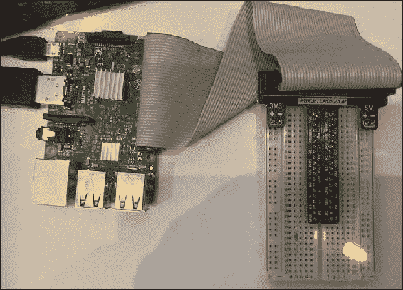

带有 LED 控制的树莓派

正如前面的例子所示，可以建立一组运行每个节点上的 geth 客户端并监听来自智能合约的事件并相应触发动作的物联网设备私有网络。此目的是简化示例，但展示了利用物联网设备和智能合约驱动的物理设备控制所需的基本原则。

在下一部分中，将讨论区块链技术在政府、金融和医疗领域的其他应用。

# 政府

目前正在研究各种支持政府职能并将当前的电子政务模式提升到新水平的区块链应用。首先，在本节中将提供电子政务的一些背景，然后将讨论一些用例，如电子投票、国土安全（边境控制）和电子身份证（公民身份证）。

电子政务或电子政府是一种利用信息和通信技术向公民提供公共服务的范式。这个概念并不新鲜，在世界各地的许多国家都有实施，但是区块链开辟了一个新的探索途径。许多政府正在研究利用区块链技术来管理和提供公共服务的可能性。区块链的透明性、可审计性和完整性是管理各种政府职能的有效属性。

## 边境控制

自动边境控制系统已经使用了几十年，旨在阻止非法进入国家，并防止恐怖主义和人口贩运。

机器可读旅行文件，尤其是生物识别护照，为自动边境控制铺平了道路；然而，目前的系统在一定程度上受限，而区块链技术可以提供解决方案。国际民航组织（ICAO）的文件 ICAO 9303 中定义了一个**机器可读旅行文件**（**MRTD**）标准，并已由世界许多国家实施。

每个护照都包含各种安全和身份属性，可用于识别护照所有者，也可以防范篡改护照的企图。这些包括生物特征，如视网膜扫描、指纹、面部识别，以及标准的 ICAO 指定特征包括**机器可读区**（**MRZ**）和护照第一页可见的其他文本属性。

当前边境控制系统的一个关键问题是集中化，即系统由单一实体控制，并且数据不容易在执法机构之间共享。这使得跟踪疑似个体变得困难。另一个问题与立即实施旅行文件黑名单相关，例如，在需要立即跟踪和控制疑似旅行文件时。目前，没有机制可以立即将疑似护照列入黑名单或吊销。

区块链可以通过在智能合约中维护黑名单来解决这个问题，该黑名单可以根据需要进行更新，任何更改都将立即对所有机构和边境控制点可见，从而实现对疑似旅行文件移动的即时控制。可以提出这样的论点，即传统机制如 PKI 和 P2P 网络也可以用于此目的，但它们不提供区块链可以提供的好处。使用区块链，整个系统可以简化，无需复杂的网络和 PKI 设置，这也将导致成本降低。此外，基于区块链的系统将提供加密保证的不可变性，有助于审计，并且会阻止任何欺诈活动。

由于可扩展性问题，当前可能无法将所有旅行文件的完整数据库存储在区块链上，但是后端分布式数据库，如 BigChainDB、IPFS 或 Swarm 可以用于此目的。在这种情况下，可以将个人的旅行文件哈希与生物特征识别 ID 存储在简单的智能合约中，然后可以使用文档的哈希来引用分布式文件系统（例如 IPFS）中可用的详细数据。这样，当任何地方的旅行文件被列入黑名单时，该信息将立即可用，具有其在整个分布式分类帐中的真实性和完整性的加密保证。这种功能也可以在反恐活动中提供有效支持，从而在政府的国土安全职能中发挥重要作用。

Solidity 中的一个简单合约可以定义一个数组，用于存储身份和相关的生物识别记录。该数组可用于存储有关护照的识别信息。身份可以是护照或旅行文件的**机器可读区域**（**MRZ**）的哈希，与 RFID 芯片中的生物识别记录连接而成。一个简单的布尔字段可以用于识别被列入黑名单的护照。一旦通过了这个初始检查，传统系统可以执行进一步的详细生物识别验证，最终当关于护照持有者入境的决定被做出时，该决定可以传播回区块链，从而使网络上的所有参与者可以立即分享决定的结果。

构建基于区块链的边境控制系统的高级方法可以如下图所示进行可视化。 在这种情况下，护照被呈现给一个 RFID 和页面扫描器进行扫描，该扫描器读取数据页并提取机器可读信息以及存储在 RFID 芯片中的生物特征数据的哈希。 在这个阶段，还会拍摄护照持有者的实时照片和视网膜扫描。 然后，将这些信息传递给区块链，智能合约负责验证旅行文件的合法性，首先检查自己的黑名单护照列表，然后从后端 IPFS 数据库请求更多数据进行比较。 请注意，诸如照片或视网膜扫描之类的生物特征数据不存储在区块链上，而是只存储在区块链后端（IPFS 或 BigChainDB）中对此数据的引用。

如果呈现护照的数据与 IPFS 中的文件或 BigChainDB 中的数据匹配，并且通过智能合约的逻辑检查，则边境门可以打开。

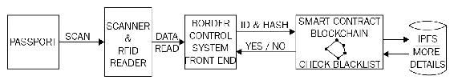

使用区块链的自动边境控制

在验证后，此信息将传播到整个区块链，并立即提供给边境控制区块链上的所有参与者。 这些参与者可以是各国国土安全部门的全球财团。

## 投票

在任何政府中投票是一个关键功能，允许公民参与民主选举过程。 虽然投票随着时间的推移逐渐发展成为一个更加成熟和安全的过程，但仍然存在需要解决的限制，以达到期望的成熟水平。 通常，当前投票系统的限制围绕着欺诈、运营流程中的弱点以及特别是透明度展开。 多年来，已建立了安全投票机制，这些机制利用专门的投票机器承诺提供安全和隐私，但它们仍然存在漏洞，可以被利用来破坏这些机器的安全机制。 这可能会对整个投票过程产生严重的影响，并导致公众对政府的不信任。

基于区块链的投票系统可以通过在过程中引入端到端的安全性和透明性来解决这些问题。安全性通过使用公钥加密技术提供，这是区块链中的标准功能，从而保证了选票的完整性和真实性。此外，由区块链保证的不可变性确保了一次投票的选票不能再次投票。这可以通过生物特征和智能合约结合使用来实现，智能合约维护一个已经投票的选票列表。例如，智能合约可以维护一个带有生物识别 ID（例如指纹）的已投票列表，并可以使用它来检测和防止双重投票。其次，零知识证明也可以在区块链上用于保护选民的隐私。

## 公民身份证（ID 卡）

目前，各国发行了电子身份证或国家身份证。这些卡是安全的，并具有许多防止复制或篡改尝试的安全功能。然而，随着区块链技术的出现，这个过程可以做出几个改进。

数字身份不仅仅局限于政府发行的身份证，这是一个在在线社交网络和论坛中也适用的概念。可以有多个用于不同目的的身份。基于区块链的在线数字身份可以控制个人信息的共享。用户可以看到谁使用了他们的数据以及目的，并可以控制对其的访问。这在目前由中央控制的基础设施中是不可能的。关键优势在于政府发行的单一身份可以通过单一的政府区块链轻松且透明地用于多项服务。在这种情况下，区块链充当了政府提供各种服务（如养老金、税收或福利）的平台，而单一身份被用于访问所有这些服务。在这种情况下，区块链为每次数字身份的变更和交易提供了不可变的记录，从而确保了系统的完整性和透明性。此外，公民可以将出生证明、婚姻证书、契约等许多其他文件在与其数字身份相关联的区块链上进行公证，作为存在的证据。

目前，各国已经成功实施了各种工作良好的身份方案，有人认为区块链在身份管理系统中并不真正需要。尽管存在诸如隐私和对身份信息使用的控制等多个好处，但由于当前区块链技术的不成熟，也许还没有准备好用于现实世界的身份系统。然而，各国政府正在进行研究，探索区块链在身份管理方面的使用。

此外，像被遗忘权这样的法律由于区块链的不可变性而很难整合。

## 杂项

其他政府职能领域可以实施区块链技术以提高成本和效率的包括税收征收、福利管理和发放、土地所有权记录管理、生活事件登记（婚姻、出生）、机动车登记和许可证等。这并不是一个详尽的清单，随着时间的推移，政府的许多职能和流程都可以适应基于区块链的模式。区块链的关键优势，如不可变性、透明度和去中心化，可以帮助改进大多数传统政府系统。

# 健康

健康产业被确定为另一个可以通过采用区块链技术获益的主要行业。区块链提供了一个传统 P2P 网络无法提供的不可变、可审计和透明的系统。此外，与传统的复杂 PKI 网络相比，区块链提供了一种经济、简单的基础架构。在医疗保健领域，由于缺乏互操作性、过度复杂的流程、透明度、可审计性和控制，可能会出现隐私泄漏、数据泄露、高成本和欺诈等主要问题。另一个紧迫的问题是假药；特别是在发展中国家，这是一个主要的关注点。

通过将区块链应用于健康领域，可以实现多种好处，从节省成本、增加信任、更快地处理索赔、高可用性、操作程序复杂性导致的没有操作错误，到防止假药的分发。

从另一个角度来看，提供数字货币作为挖矿激励的区块链可以用来提供处理能力，以解决可以帮助找到某些疾病治愈方法的科学问题。例如，FoldingCoin 奖励其矿工使用他们计算机的处理能力来解决需要特别大量计算的科学问题。FoldingCoin 可在[`foldingcoin.net/`](http://foldingcoin.net/)获得。另一个类似的项目是 CureCoin，可在[`www.curecoin.net/`](https://www.curecoin.net/)获得。这些项目能否成功实现目标尚待观察，但这个想法非常有前途。

# 金融

区块链在金融领域有许多应用。金融领域的区块链是目前行业中最热门的话题，主要银行和金融组织正在研究如何适应区块链技术，特别是由于其极具潜力的节省成本的能力。

## 保险

在保险行业中，区块链技术可以帮助阻止欺诈索赔，增加索赔处理速度，并实现透明度。想象一下，所有保险公司之间共享的账本可以为处理公司间索赔提供快速高效的机制。此外，随着物联网和区块链的融合，可以想象出一种智能设备生态系统，其中所有这些设备都能够通过区块链上的智能合约进行协商和管理其自身的保险政策。

区块链可以减少处理索赔所需的总体成本和工作量。索赔可以通过智能合约自动验证和支付，并与保险单持有人的身份相关联。例如，通过智能合约和可能的物联网的帮助，可以确保发生事故时可以记录相关的遥测数据，并根据这些信息释放付款。如果智能合约在评估付款条件后得出付款条件不应该被释放的结论，还可以暂停付款。例如，在车辆在未经授权的车间维修或在指定区域外使用的情况下等等。智能合约可以评估许多条件来处理索赔，而这些规则的选择取决于保险人，但总体想法是智能合约与物联网和 Oracles 的结合可以自动化整个车辆保险行业。

如 Dynamis 等多家初创公司已提出基于以太坊区块链的智能合约对等保险平台。最初计划用于失业保险，并不需要模型下的承保人。可在[`dynamisapp.com/`](http://dynamisapp.com/)上使用。

## 后期交易结算

这是区块链技术最受追捧的应用。目前，许多金融机构正在探索使用区块链技术简化、自动化和加快昂贵和耗时的后期交易结算流程的可能性。

为了更好地理解问题，简要描述了交易生命周期。交易生命周期包含三个步骤：执行、清算和结算。执行涉及两方之间的交易承诺，可以通过前台订单管理终端或交易所输入系统。清算是下一步，其中交易根据价格和数量等某些属性在卖方和买方之间匹配。在此阶段，还确定涉及支付的帐户。最后，结算是最终买方和卖方之间交换安全性以换取支付的地方。

在传统的交易生命周期模型中，需要一个中央清算所来促进交易双方之间的交易，承担双方的信用风险。当前的方案有些复杂，卖方和买方必须走一条复杂的路线才能进行交易。这包括各种公司、经纪人、结算所和保管人，但是通过区块链，一个具有适当智能合约的单一分布式分类账可以简化整个流程，并使买方和卖方可以直接交流。

特别是，后期交易结算流程需要两到三天，并且依赖于中央结算所和对账系统。通过共享账本的方法，区块链上的所有参与者可以立即看到有关交易状态的真实版本。此外，点对点结算是可能的，这将减少复杂性、成本、风险和结算交易所需的时间。最后，通过在区块链上使用适当的智能合约，中介可以完全被淘汰。

## 金融犯罪预防

**了解您的客户**（**KYC**）和**反洗钱**（**AML**）是防止金融犯罪的关键。在 KYC 的情况下，目前每个机构都维护着他们自己的客户数据副本，并通过集中的数据提供者进行验证。这可能是一个耗时的过程，可能会导致新客户的注册延迟。区块链可以通过在所有金融机构之间安全共享已验证和准确的客户身份信息的分布式分类账来解决这个问题。这个分布式账本只能通过参与者之间的共识来更新，从而提供透明性和可审计性。这不仅可以降低成本，还可以更好地满足监管和合规要求。

在 AML 的情况下，由于区块链的不可变性、共享性和透明性，监管机构可以轻松地获得访问私有区块链的权限，从而可以获取相关监管报告的数据。这也将导致降低与当前监管报告范式相关的复杂性和成本，其中数据是从各种遗留系统中获取并聚合和格式化用于报告目的。区块链可以提供系统中所有金融交易的单一共享视图，这些交易是经过加密安全、真实和可审计的，从而降低了与目前采用的监管报告方法相关的成本和复杂性。

# 媒体

媒体行业的关键问题围绕着内容分发、版权管理和对艺术家的版税支付。例如，数字音乐可以无限制地复制，任何试图施加复制保护的尝试都会以某种方式被破解。对音乐家或作曲家创作的内容的分发没有任何控制；它可以被无限制地复制，因此对版税支付产生影响。此外，支付并不总是保证的，并且是基于传统的播放次数数据。所有围绕复制保护和版税支付的问题可以通过连接消费者、艺术家和行业中的所有参与者来解决，实现透明度和对流程的控制。区块链可以提供一个网络，数字音乐在其中具有密码学上的保证，只能被付费购买的消费者拥有。这种支付机制由智能合约控制，而不是由集中式媒体机构或权威管理。根据嵌入在智能合约中的逻辑和“下载”数量，支付将自动进行。此外，数字音乐文件的非法复制可以完全停止，因为一切都以透明的方式记录和不可变地拥有在区块链上。例如，音乐文件可以带有所有者信息和时间戳，这可以在整个区块链网络中追溯。此外，拥有某些内容的合法拥有者与他们拥有的内容被加密地绑定在一起，除非获得所有者的许可，否则内容无法转移到其他所有者名下。一旦所有数字内容都被不可变地记录在区块链上，版权和转移就可以通过区块链轻松管理。智能合约可以控制向所有相关方的分发和支付。

# 摘要

区块链技术有许多应用，正如本章所讨论的，它们可以在各个行业中实现，为现有解决方案带来多重好处。在本章中，讨论了五个主要行业可以从区块链中受益。首先讨论了物联网（IoT），这是另一项革命性的技术；通过将其与区块链相结合，可以解决一些基本限制，从而为物联网行业带来巨大的好处。物联网受到了更多的关注，因为它是最大、最适合采用区块链技术的候选者。已经出现了一些实际的用例和平台，如基于区块链的物联网的**平台即服务**（**PaaS**），如 IBM Watson IoT 区块链。IBM Blue Horizon 也已经可以用于实验，这是一个分散的基于区块链的物联网网络。其次，讨论了政府部门的应用，政府流程如国土安全、身份证和福利发放等可以变得透明、安全和更健壮。此外，还讨论了金融领域的问题以及区块链技术可以提供的可能解决方案。尽管金融行业正在积极探索使用区块链的可能性，但离生产就绪的基于区块链的系统还有很长的路要走。最后，还讨论了医疗和音乐行业的一些方面。所有这些用例以及行业中的许多其他用例都建立在区块链技术的核心属性之上，如分散化、透明度、可靠性和安全性。然而，在完全采用区块链技术之前，需要解决一些挑战；这些将在下一章中讨论。
