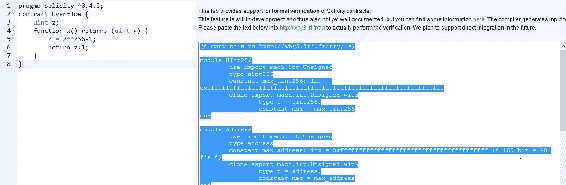
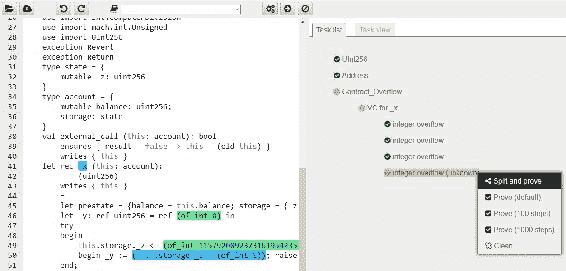
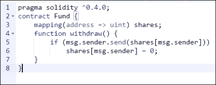
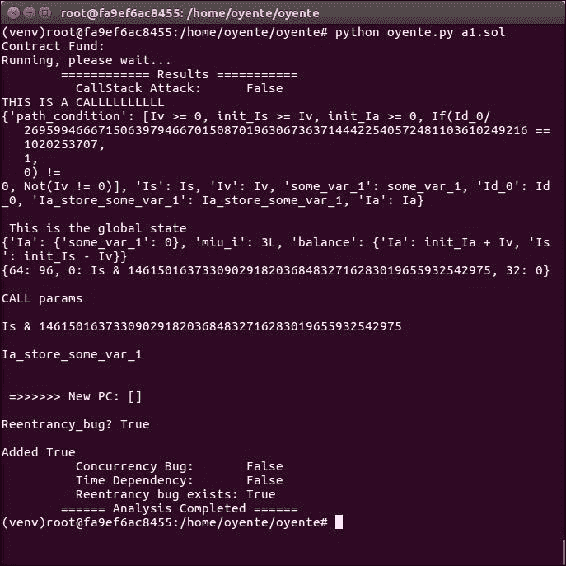

# 第十二章。可扩展性和其他挑战

本章旨在介绍在区块链成为主流技术之前需要解决的各种挑战。尽管已经开发了各种用例和概念验证系统，并且该技术在许多场景下运作良好，但仍然需要解决一些存在于区块链中的根本限制，以使这项技术更具适应性。

在这些问题清单的最顶端是可扩展性，然后是隐私。这两个问题都是需要解决的重要限制，特别是在区块链被设想用于对隐私要求较高的行业时。金融、法律和健康领域的交易机密性有具体要求，而可扩展性通常是一个关注点，即区块链未能满足用户期望的充分性能水平。这两个问题正在成为阻碍区块链技术更广泛接受的因素。本章将介绍目前在这两个特定领域提出的和正在进行的研究。除了隐私和安全性之外，其他挑战包括监管、整合、适应性和总体安全性。尽管在比特币区块链中，安全性经过证明是无懈可击的，经受住了时间的考验，但仍然存在一些细微情景可能会使安全性受到某种程度的损害。此外，在其他区块链中，如以太坊，也存在一些合理的安全性问题，涉及智能合约、拒绝服务攻击和大型攻击面。所有这些将在下文中详细讨论。

# 可扩展性

这个问题在过去几年一直是激烈辩论、严格研究和媒体关注的焦点。这是一个最重要的问题，可能意味着区块链的更广泛适用性，或者仅限于由财团使用。由于在这个领域进行了大量研究，许多解决方案已被提出，在下一节中进行了讨论。

从理论角度来看，解决可扩展性问题的一般方法通常围绕协议级别的增强展开。例如，通常提到的解决比特币可扩展性的方法之一是增加其区块大小。其他提案包括将某些处理卸载到链下网络的链下解决方案，例如，链下状态网络。根据上述解决方案，一般来说，提案可以分为两类：基于改变区块链运行的基本协议的想法的链上解决方案，以及利用链下网络和处理资源来增强区块链的链下解决方案。

最近，*米勒*和其他人在他们的立场论文*关于扩展去中心化区块链*中提出了另一种解决区块链限制的方法。在这篇论文中，表明了区块链可以被划分为称为**层**的各种抽象层。每个平面负责执行特定功能。这些功能包括网络平面、共识平面、存储平面、视图平面和侧平面。这种抽象允许单独和结构化地处理每个平面的瓶颈和限制。以下简要概述了每个层，并参考了一些比特币系统的内容。

首先讨论网络层。网络层的一个关键功能是交易传播。在上述论文中已经确定，在比特币中，由于节点在传播和复制交易之前进行交易验证的方式，网络平面未充分利用网络带宽，首先在交易广播阶段，然后在挖掘区块之后。应该注意的是，这个问题由**BIP 152**（**紧凑区块中继**）解决。

第二层称为共识平面。这一层负责挖矿和达成共识。这一层的瓶颈围绕着工作量证明算法的限制，其中增加共识速度和带宽会导致网络安全受损，因为分叉数量增加。

存储平面是第三层，负责存储分类帐。这一层的问题围绕着每个节点需要保留整个分类帐的副本，这导致了某些效率低下，如增加的带宽和存储要求。比特币有一种称为剪枝的方法，允许节点在不下载完整区块链的情况下运行。这个功能在存储方面带来了重大改进。

接下来是视图平面，提出了一种基于比特币矿工不需要完整的区块链来操作的优化方案，可以从完整的分类帐中构建视图作为整个系统状态的表示，这对于矿工运行是足够的。实施视图将消除挖矿节点存储完整区块链的需要。

最后，作者们提出了侧平面的概念。这个平面代表着离链交易的概念，其中支付或交易通道的概念用于将交易处理分担给参与者，但仍由主比特币区块链支持。

上述模型可以用于以结构化方式描述当前区块链设计的限制和改进。此外，过去几年提出了几种可以解决当前区块链设计（如以太坊和比特币）限制的一般策略。这些方法也在下一节中以个别的方式进行了特征化和讨论。

## 区块大小增加

这是增加区块链性能（交易处理吞吐量）最受争议的提议。目前，比特币每秒只能处理约三到七笔交易，这是限制将比特币区块链用于处理微交易的主要因素。比特币的区块大小被硬编码为 `1 MB`，但如果增加区块大小，它可以容纳更多交易并导致更快的确认时间。已经提出了几个**比特币改进提案**（**BIPs**）以支持增加区块大小。其中包括 BIP 100、BIP 101、BIP 102、BIP 103 和 BIP 109。在以太坊中，区块大小不受硬编码限制；相反，它受到燃气限制的控制。理论上，在以太坊中，区块的大小没有限制，因为它取决于燃气的数量，这个数量可以随时间增加。这是可能的，因为如果在前一个区块中达到了限制，矿工可以允许在后续区块中增加燃气限制。

## 区块间隔缩短

另一个提议是缩短每个区块生成之间的时间。减少区块之间的时间可以实现更快地完成区块的最终确认，但可能会因分叉数量增加而导致安全性降低。以太坊已经实现了大约 `14 秒` 的区块时间，有时可能会增加。这是与比特币区块链相比的显著改进，比特币区块链需要 `10 分钟` 来生成一个新区块。在以太坊中，由于区块之间的时间缩短导致的高孤块问题通过使用**贪婪最重子树**（**GHOST**）协议来缓解，其中孤块（叔块）也被包括在确定有效链的过程中。一旦以太坊转向股权证明，这将变得无关紧要，因为不需要挖矿，几乎可以立即完成交易的最终确认。

## 可逆布隆查找表

这是另一种旨在减少比特币节点之间所需传输的数据量的方法。**可逆布隆查找表**（**IBLTs**）最初是由*Gavin Andresen*提出的，这种方法的主要吸引力在于，如果实施，它不会导致比特币的硬分叉。关键思想基于这样的事实：不需要在节点之间传输所有交易；相反，只需要传输同步节点的交易池中尚未存在的交易。这使节点之间的交易池同步更加迅速，从而提高比特币网络的整体可扩展性和速度。

## 分片

分片并不是一种新技术，它已被用于分布式数据库以提高可扩展性，如 MongoDB 和 MySQL。分片背后的关键思想是将任务分成多个块，然后由多个节点进行处理。这可以提高吞吐量并减少存储需求。在区块链中，采用类似的方案，将网络状态划分为多个分片。状态通常包括余额、代码、随机数和存储。分片是区块链在同一网络上运行的松散耦合分区。与分片之间的通信以及每个分片的历史达成共识方面存在一些挑战。这是一个正在进行中的研究领域。

## 状态通道

这是另一个旨在加速区块链网络交易的方法。基本思想是使用侧通道来进行状态更新和在主链之外处理交易；一旦状态确定下来，就将其写回主链，从而将耗时的操作从主要区块链上移除。状态通道通过执行以下三个步骤来工作：

1.  首先，部分区块链状态被锁定在智能合约之下，以确保参与者之间的协议和业务逻辑。

1.  现在，链外交易处理和交互在参与者之间开始，只在他们之间更新状态。在这一步，几乎可以执行任意数量的交易而不需要区块链，这正是使该过程快速并成为解决区块链可扩展性问题的最佳候选方法。然而，可以说这并不是一个真正的区块链内解决方案，例如分片，但最终结果是一个更快、更轻便、更强大的网络，在微支付网络、物联网网络和许多其他应用中非常有用。

1.  一旦达到最终状态，状态通道就会关闭，最终状态会写回主要区块链。在这个阶段，锁定的区块链部分也被解锁。

这种技术已被用于比特币闪电网络和以太坊的雷电网络。

## 私有区块链

私有区块链本质上是快速的，因为不需要真正的去中心化，网络上的参与者不需要挖矿；相反，他们只能验证交易。这可以被视为公共区块链可扩展性问题的一种变通方法；然而，这并不是解决可扩展性问题的办法。此外，应注意私有区块链只适用于特定领域和设置。

## 权益证明

基于权益证明算法的区块链基本上更快。

### 侧链

侧链可以通过允许许多侧链与主区块链并行运行，同时允许使用或许相对不那么安全但更快的侧链进行交易，但仍然与主区块链挂钩，从而间接改善可扩展性。侧链的核心思想称为双向锚定，它允许将硬币从父链转移到侧链，反之亦然。

### 子链

这是*彼得·R·里宗*最近提出的一种相对较新的技术，其基础是弱块的概念，这些块是分层创建的，直到找到强块为止。弱块可以定义为那些尚未满足标准网络难度条件而已经完成了足够工作以满足其他更弱难度目标的块。矿工可以通过将弱块层层叠加在一起来构建子链，除非找到满足标准难度目标的块。此时，子链关闭并成为强块。这种方法的优点包括减少了交易第一次验证的等待时间。这种技术还导致了孤块的减少和交易处理的加速。这也是解决可扩展性问题的一种间接方式。子链不需要任何软分叉或硬分叉来实现，但需要社区的接受。

### 树链

还有其他提高比特币可扩展性的提案，比如树链，它将区块链布局从线性顺序模型改变为树形结构。这个树基本上是一个二叉树，从主比特币链衍生出来。这种方法类似于侧链实现，消除了对主要协议更改或区块大小增加的需要。它允许提高交易吞吐量。在这个方案中，区块链本身被分割并分布在网络中以实现可扩展性。此外，在树链上验证块不需要挖矿；相反，用户可以独立验证块头。然而，这个想法目前还没有准备好投入生产，需要进一步研究才能使其变得实用。

除了上述的一般技术之外，*克里斯蒂安·德克* 在他的书籍《论比特币的可扩展性和安全性》中还提出了一些比特币特定的改进。这个提议基于加快信息传播时间的想法，因为当前的信息传播机制导致了区块链分叉。这些技术包括验证的最小化，区块传播的流水线处理和连接性的增加。这些变化不需要根本性的协议层面的改变；相反，这些改变可以独立地在比特币节点软件中实现。关于验证的最小化，有人指出区块验证过程正在导致传播延迟。这背后的原因是一个节点花费了很长时间来验证区块的唯一性和区块内的交易。有人建议，一旦完成了初始的工作量证明和区块验证检查，一个节点就可以立即发送库存消息。通过这种方式，传播可以通过仅执行第一个*难度检查*而不等待交易验证完成来改善。除了上述提议之外，还提出了区块传播的流水线处理，这是基于预期区块的可用性的想法。在这个方案中，区块的可用性已经在实际区块可用之前就宣布了，从而减少了节点之间的往返时间。最后，交易发起者和节点之间的长距离也导致了区块传播的减速问题。*克里斯蒂安·德克* 进行的研究表明，增加连接性可以减少区块和交易的传播延迟。这是可能的，因为如果比特币节点在任何时候连接到许多其他节点，它将减少节点之间的距离，并可以加速网络上的信息传播。

解决可扩展性问题的一个优雅的解决方案很可能是上述一些或所有一般方法的组合。为了解决区块链的可扩展性和安全性问题，已经采取了许多举措，现在几乎已经准备好实施。例如，比特币隔离见证是一个可以大规模帮助提高可扩展性的提议，只需要软分叉即可实施。所谓*segwit* 的关键思想是将签名数据与交易分离，从而解决了交易可变性问题，并允许增加区块大小。

另一个提议是比特币 NG，它基于微块和领导者选举的想法，最近引起了一些关注。其核心思想是将区块分为两种类型，即领导者区块（也称为关键区块）和微块。领导者区块负责工作证明，而微块包含实际的交易。微块不需要任何工作证明，由选定的领导者在每个区块生成周期生成。这个区块生成周期由领导者区块发起。唯一的要求是用选定的领导者的私钥对微块进行签名。领导者（矿工）可以以非常高的速度生成微块，从而提高性能和交易速度。

另一方面，最近，以太坊创始人*维塔利克·布特林*在上海举办的以太坊 Devcon 2 上发表了一篇名为 mauve 的论文；它描述了一个可扩展的以太坊愿景。 mauve 提案基于分片和实现权益证明算法的组合。该论文确定了一些目标，如通过权益证明实现效率提升，尽可能快的区块时间，经济确定性，可扩展性，跨分片通信和抗审查性。

# 隐私

交易隐私是区块链的一个非常期望的属性。然而，由于其特性，特别是在公共区块链中，一切都是透明的，从而抑制了它在金融、健康等许多隐私至关重要的行业中的使用。已经提出了不同的方案来解决隐私问题，并且已经取得了一些进展。几种技术，如不可区分性混淆、同态加密的使用、零知识证明和环签名。所有这些技术都有其优点和缺点，并在以下部分进行了讨论。

## 不可区分性混淆

这种密码技术可能成为解决区块链中所有隐私和机密性问题的救世主，但技术尚未准备好投入生产部署。**不可区分性混淆**（**IO**）允许进行代码混淆，这是密码学中一个非常成熟的研究课题，如果应用于区块链，可以作为一个不可破解的混淆机制，将智能合约转换为黑匣子。IO 的关键思想是研究人员称之为*多线性拼图*，基本上通过将程序代码与随机元素混合来混淆程序代码，如果程序按预期运行，它将产生预期的输出，但以其他方式执行将使程序看起来是随机的和垃圾的。这个想法最初是由*Sahai*等人在他们的研究论文*Candidate Indistinguishability Obfuscation and Functional Encryption for All Circuits*中提出的。

## 同态加密

这种类型的加密允许在加密数据上执行操作。想象一下数据被发送到云服务器进行处理的情景。服务器处理数据并返回输出，而不知道已处理的数据的任何信息。这也是一个值得研究的领域，全同态加密允许对加密数据进行所有操作，但目前尚未完全投入生产；然而，这一领域已经取得了重大进展。一旦在区块链上实施，它就可以允许对密文进行处理，从而固有地保护交易的隐私和机密性。例如，存储在区块链上的数据可以使用同态加密进行加密，可以在数据上执行计算而无需解密，从而在区块链上提供隐私服务。这个概念也已经在麻省理工学院媒体实验室的一个名为*Enigma*的项目中实施。 Enigma 是一个点对点网络，允许多个参与方在不透露数据的情况下对加密数据进行计算。

## 零知识证明

零知识证明最近在 Zcash 中成功实现，正如前几章所见。更具体地说，已经实现了 SNARKs 以确保区块链上的隐私。相同的思想也可以在以太坊和其他区块链中实现。在以太坊上集成 Zcash 已经是由以太坊研发团队和 Zcash 公司进行的非常活跃的研究项目。

## 状态通道

使用状态通道实现隐私也是可能的，这仅仅是因为所有交易都是在链下运行的，主区块链根本看不到交易，除了最终的状态输出，从而确保隐私和保密性。

## 安全多方计算

安全多方计算的概念并不新鲜，它基于这样一个概念：数据在参与方之间通过秘密共享机制分成多个分区，然后在不需要在单一机器上重建数据的情况下对数据进行实际处理。处理后产生的输出也在参与方之间共享。

## 使用硬件提供机密性

可信计算平台可以用来提供一种机制，通过该机制可以在区块链上实现交易的保密性，例如，使用英特尔**软件保护扩展**（**SGX**），它允许在称为*保护域*的硬件保护环境中运行代码。一旦代码在隔离的保护域中成功运行，它可以生成一个称为*报价*的证明，该证明可以由英特尔的云服务器进行验证。然而，信任英特尔将导致某种程度的集中化，并且与区块链技术的真正精神不符。然而，这种解决方案也有其优点，在现实中，许多平台已经使用英特尔芯片，因此在某些情况下信任英特尔可能是可以接受的。

如果这项技术应用于智能合约，那么一旦一个节点执行了智能合约，它就可以生成正确和成功执行的报价，并且其他节点将只需验证它。 这个想法可以通过使用任何**受信任执行环境**（**TEE**）来进一步扩展，它可以提供与飞地相同的功能，并且甚至可以在带有**近场通讯**（**NFC**）和安全元件的移动设备上使用。

## Coinjoin

Coinjoin 是一种用于通过交互混合来匿名化比特币交易的技术。 这个想法是基于从多个实体中构建单个交易而不改变输入和输出。 它消除了发送者和接收者之间的直接联系，这意味着单个地址不再与交易相关联，这可能导致用户的身份被识别。 Coinjoin 需要多个愿意通过混合支付创建单个交易的参与方之间的合作。 因此，应该注意，如果 Coinjoin 方案中的任何单个参与者不遵守承诺合作的约定，即不按要求签署交易，那么它可能导致拒绝服务攻击。 在此协议中，不需要单个受信任的第三方。 这个概念与混合服务不同，混合服务充当比特币用户之间的受信任第三方或中介，并允许混洗交易。 这种交易的混洗会防止追踪和将支付链接到特定用户。

## 机密交易

保密交易利用 Pedersen 承诺来提供机密性。 承诺方案允许用户承诺某个价值，并保密其能力以便后来能够揭示它。 设计承诺方案需要满足的两个属性是*绑定*和*隐藏*。 绑定确保承诺者一旦承诺便无法更改所选的价值，而隐藏属性确保任何敌手无法找到承诺者所承诺的原始值。 Pedersen 承诺还允许在承诺中进行加法操作并保留承诺的交换性质，这使其在提供比特币交易的保密性方面特别有用。 换句话说，它支持对值进行同态加密。使用承诺方案允许在比特币交易中隐藏支付价值。 此概念已经在 Elements 项目([`elementsproject.org/`](https://elementsproject.org/))中实施。

## 小偷神盾

MimbleWimble 方案有点神秘地在比特币 IRC 频道上提出，自那以后就变得非常受欢迎。 MimbleWimble 扩展了保密交易和 Coinjoin 的概念，允许在不需要任何交互的情况下对交易进行聚合。 但是，它不支持与标准比特币协议的各种其他特性以及比特币脚本语言的使用。 这使其与现有的比特币协议不兼容。 因此，它可以作为比特币的侧链实现，也可以作为替代加密货币自行实现。

此方案可以同时解决隐私和可扩展性问题。 使用 MimbleWimble 技术创建的区块不像传统的比特币区块链那样包含交易； 相反，这些区块由三个列表组成：一个输入列表、一个输出列表和称为 *excesses* 的东西，其中包含签名列表和输出与输入之间的差异。 输入列表基本上是对旧输出的引用，输出列表包含保密交易输出。 通过使用签名、输入和输出来验证这些区块的节点，以确保区块的合法性。 与比特币不同，MimbleWimble 交易输出仅包含公钥，而旧输出与新输出之间的差异由参与交易的所有参与者签名。

# 安全

尽管区块链通常是安全的，并根据需要在整个区块链网络中使用非对称和对称加密，但仍然存在一些注意事项，可能会危及区块链的安全性。

在某些情况下，比特币中存在交易可塑性、信息日食攻击和双重花费的几个示例，这些示例已被各种研究人员证明是有效的。 交易可塑性通过允许黑客在比特币网络确认之前更改交易的唯一标识符，从而使交易似乎未发生，从而打开了双重提款或存款的可能性。 BIP 62 是提出解决此问题的提案之一，与隔离见证（segwit）一起。 应当注意，这仅在未确认交易的情况下存在问题，即运行流程依赖于未确认交易的情况。 对于仅依赖于已确认交易的正常应用程序而言，这不是问题。

比特币中的信息日食攻击可能导致双重花费。 日食攻击的理念是使比特币节点被欺骗，只连接到攻击者节点的 IP。 这打开了攻击者发动 51% 攻击的可能性。 这在比特币客户端 v0.10.1 中已在一定程度上得到解决。

## 智能合约安全性

最近，智能合约安全方面的工作已经开始，并且特别是正在讨论和研究智能合约的形式验证。这一切特别是由于臭名昭著的 DAO 攻击而引发的。形式验证是验证计算机程序以确保其满足某些形式陈述的过程。这现在不是一个新概念，对于其他语言，已经有一些可用的工具可以实现这一点；例如，Frama-C 用于分析 C 程序。形式验证背后的关键思想是将源程序转换为一组可由自动证明器理解的陈述。为此，通常使用 Why3，并且 solidity 的形式验证器也利用了这一点。浏览器 solidity 中已经提供了一个实验性但可操作的验证器。

智能合约安全现在至关重要，为了制定能够分析 Solidity 程序并找到漏洞的方法，许多其他举措也已经被采取。一个最近而开创性的例子是 Oyente，这是研究人员构建的工具，并在他们的论文《让智能合约更智能》中介绍了它。该论文发现并分析了智能合约中的几个安全漏洞。其中包括事务排序依赖性、时间戳依赖性、异常处理不当，比如调用堆栈深度限制的利用，以及重入漏洞。事务排序依赖性漏洞基本上是利用了合约的感知状态可能与执行后合约的状态不同的情况。这种弱点是一种竞争条件。它也被称为前加载，并且由于可以操纵块内事务的顺序而变得可能。由于所有事务首先出现在内存池中，因此可以在它们包含在块中之前监视那里的事务。这允许在另一个事务之前提交事务，从而控制智能合约的行为。

时间戳依赖性漏洞可能出现在块的时间戳被用作合约内某些决策的依据的情况下，但时间戳可以被矿工操纵。调用堆栈深度限制是另一个可能被利用的漏洞，因为 EVM 的最大调用堆栈深度为 1,024 帧。如果在合约执行时达到堆栈深度，则在某些情况下，发送或调用指令可能失败，导致资金未支付。调用堆栈深度漏洞已在 EIP50 硬分叉中解决。重入漏洞在 DAO 攻击中被利用，将数百万美元转移到了子 DAO。重入漏洞基本上意味着可以在前一个（第一个）调用函数完成之前重复调用函数。这在 solidity 智能合约的以太提取函数中特别不安全。

除了上述提到的错误之外，在撰写合同时还应该注意几个其他问题。这些错误包括，如果向另一个合同发送资金，则需谨慎处理，因为发送可能失败，即使使用`throw`作为*捕获所有*机制，也不起作用。

其他标准软件 bug，如整数溢出和下溢，在 solidity 中也非常重要，任何使用整数变量的地方都应该小心实现。例如，使用`uint8`来解析具有超过 255 个元素的数组的简单程序可能会导致无限循环。这是因为 uint8 仅限于 256 个数字。

在接下来的几节中，将分别使用 Why3 和 Oyente 展示两个合同验证示例。

### Why3 形式验证

Solidity 代码的形式化验证现在作为 solidity 浏览器的一项功能提供。首先，将代码转换为验证器可以理解的 Why3 语言。在下面的示例中，显示了一个简单的 solidity 代码，将变量 z 定义为 uint 的最大限制。当此代码运行时，将返回`0`，因为`uint z`会溢出并重新从`0`开始。这也可以使用 Why3 进行验证，如下所示：

具有形式验证的 Solidity 在线编译器

一旦 solidity 编译完成并在形式验证选项卡中可用，就可以将其复制到位于 [`why3.lri.fr/try/`](http://why3.lri.fr/try/) 的 Why3 在线 IDE 中。下面的示例显示它成功检查并报告了整数溢出错误。此工具正在积极开发中，但仍然非常有用。此外，此工具或任何其他类似工具都不是万能解药。即使形式化验证通常也不应被视为万能药，因为首先应适当定义规范：

Why3

### Oyente 工具

目前，Oyente 可作为 Docker 镜像供轻松测试和安装。它位于 [`github.com/ethereum/oyente`](https://github.com/ethereum/oyente)，可快速下载和测试。在下面的示例中，测试了从 solidity 文档中获取的一个简单合同，其中包含一个重入 bug，并显示了 Oyente 成功分析了代码并找到了该 bug：

具有重入 bug 的合同 - 来源：solidity 文档

此示例代码包含一个重入漏洞，基本上意味着如果一个合同与另一个合同交互或转移以太币，它实际上是将控制权交给了那个其他合同。这允许被调用的合同回调到调用它的合同的函数，而无需等待完成。例如，这个漏洞可以允许反复调用前面示例中显示的`withdraw`函数，导致多次获得以太币。这是可能的，因为份额值直到函数结束时才被设置为`0`，这意味着任何后续的调用都将成功，导致反复提款。

显示了一个 Oyente 运行的示例，用于分析下面显示的合同，并且正如下面的输出所示，分析成功找到了重入漏洞。建议通过结合 Solidity 文档中描述的 Checks-Effects-Interactions 模式来处理此漏洞：

Oyente 工具用于检测 Solidity 漏洞

# 摘要

在本章中，读者已经介绍了区块链技术的安全性、保密性和隐私性方面。隐私性是另一个影响公共区块链在各行业中应用的主要阻碍因素。接下来，讨论了智能合约安全性，这是一个当前非常热门的话题。这是一个深入广泛的主题，但在各个方面都进行了简要介绍，这应该为进一步研究提供了坚实的基础。例如，形式化验证本身就是一个广阔的研究领域。此外，还提供了形式化验证的示例，让读者了解可用的工具。值得注意的是，上述提到的工具正在积极开发中，缺少各种理想的功能。此外，文档相当稀缺；因此，鼓励读者密切关注发展，特别是围绕形式化验证和与以太坊紫色论文相关的发展，因为它即将迅速发展。区块链安全，特别是智能合约安全领域现在非常成熟，以至于可以撰写整本书来讨论此主题。许多学术界和商业界的专家和研究人员正在探索这个领域，很快将会有许多自动化工具可用于智能合约的验证。
