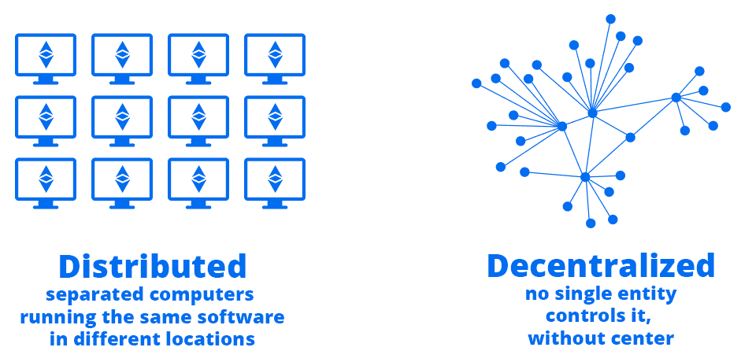
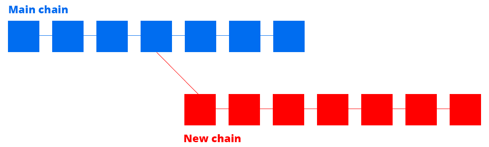

# 第一章：区块链架构

当涉及理解区块链的内部工作时，区块链架构涵盖了基本原理。能够在使用不同领域的以太坊的不同项目上工作是至关重要的，因为一旦你对一切是如何协同工作有了扎实的了解，你的思维就会开始以不同的方式看待事物。当你使用区块链并为其编程时，你将会对区块链中发生的事情有一个高层次的概览。一旦你阅读了本章，这个复杂生态系统的移动部分将变得非常清晰，因为你将会对智能合约的工作原理和它们与底层结构的关系有一个高层次的概览。

在本章中，我们将涵盖以下主题：

+   超越以太坊

+   EEA

+   理解以太坊区块链

+   智能合约工作原理的高层概览

+   重要的智能合约编程

# 超越以太坊

你可能已经了解了以太坊是什么，但为了确保我们在同一个页面上，重要的是你对以太坊的真实本质有一些背景知识，以便在进一步学习时不会分散太多注意力。

# 解释以太坊

以太坊首先是一个区块链。以太坊是一项在许多计算机上运行的技术，它向其消费者提供了一个保证，即他们信任的是一个可靠的系统，该系统将按预期工作。

“以太坊是世界计算机。”

-维塔利克·布特林

要了解更多关于核心以太坊理念的内容，请查看他们的官方网站：[`ethereum.org`](https://ethereum.org)。

连接在世界各地的数千台计算机形成的网络被称为**节点**，它们允许其他人获取他们所需的信息，同时信任代码以实现去中心化的互联网。

为什么去中心化对互联网如此重要？因为我们已经到了一个时候，少数几家大公司控制着你和我可以生产或消费的信息。

政府有太多的权力，以至于他们正在失控地制定他们的规则。他们偏向于有利于他们和他们的统治者的事物。这是可以理解的——每当某个实体处于食物链的顶端时，迟早他们会控制位于它下面的整个系统。

以太坊的目标是创建一个抗审查和开放的平台，使人们能够信任智能合约，这些合约强制执行的规则不能被第三方实体控制。

当你发布一个智能合约时，你有 100%的保证，即代码将在任何时候运行，除非它的规则规定了其他情况。

# 以太坊的历史

以太坊在 Vitalik Buterin 的 2013 年白皮书中进行了描述，可以在此处找到：[`github.com/ethereum/wiki/wiki/White-Paper`](https://github.com/ethereum/wiki/wiki/White-Paper)。他谈到了需要一种脚本语言，可以在比特币之上运行，因为他参与了*比特币杂志*，并且他了解比特币区块链的限制。

他看到了创造一个运行在去中心化技术上的平台的机会，以创建新类型的应用程序。

不多的人相信他的愿景，所以他决定自己和一个小团队创建一个全新的区块链，他们看到了 Vitalik 的想法的潜力。他成立了以太坊瑞士集团，并决定在 2014 年 7 月举行一次**首次代币发行**（**ICO**），在那里他以以太币换取比特币，共筹集了约 1800 万美元。

他创建了智能合约技术，基本上是无需信任实体执行的程序。它们始终可用，并且无故障运行。

以太坊提供了一个允许人们在区块链上创建自己应用程序的系统，这是它成功的原因。在以太坊之前，没有一种简单的方法在去中心化平台上创建**去中心化应用程序**（**dApps**）。比特币有一个使用操作码的协议，使用一种名为 Script 的编程语言创建简单的应用程序，但它的能力有限，因为它是非常低级的，并且受到区块大小的限制。

# 以太坊的发展

以太坊的发展计划分为四个不同阶段，每个阶段都有重大变化：

+   Frontier

+   Homestead

+   大都会

+   宁静

它被用来在需要时交付和研究创新解决方案，并通过硬分叉实现了不向后兼容的功能。2015 年，Frontier 作为以太坊的第一个版本推出。一年后，推出了 Homestead，其中包括许多改进，使以太坊成为一个功能强大、能够处理智能合约的系统。

在以太坊之上进行的最大的 ICO 之一是去中心化自治组织 ICO，也被称为**DAO**，它筹集了来自 11000 多人的 1.5 亿美元。问题在于，它被一个未知的个人组织攻击了，他们将资金转移到了另一个 DAO。有趣的是，一个名为**白帽子组织**的程序员团队看到了这次黑客攻击正在发生，并尽可能多地将资金转移到了一个名为**白帽子 DAO**的独立去中心化组织中，他们在那里存放着人们的资金以供以后分配。

这一事件引发了社区内的激烈争论，导致以太坊分为两个派别，一些人认为以太坊必须是不可变的，不应该被修改，而另一些人则认为应该进行硬分叉以恢复所造成的损失。

那就是以太坊经典和我们所知的以太坊的开端。以太坊经典的用户群明显较小，但它保留了他们认为区块链必不可少的初始不可变性理念。 2017 年 3 月，几家公司联合努力创建了目前超过 500 名成员的非营利组织**以太坊企业联盟**（**EEA**），其目标如下：

"创建基于开源和标准的区块链规范。"

-以太坊企业联盟

换句话说，他们创建了一个合作解决未来区块链技术的人群，以使其更好、更快和更有能力。

它遭受了几次黑客攻击，数百万美元被盗。他们不得不进行硬分叉来拯救人们的资金，并且价格的波动性非常大，但未来看起来光明，随着需求的增长而不断改进。

# EEA

**EEA** ([entethalliance.org](http://entethalliance.org))是由以太坊核心团队开发的最令人振奋的项目之一，因为他们打算帮助来自世界各地的公司从去中心化技术中受益。通过了解这个项目，当您成为 EEA 专家时，您将处于良好的位置。

在本节中，我们将介绍以下主题：

+   EEA 的愿景

+   EEA 的会员资格

+   EEA 架构

Vitalik 资助了组织，因为他收到了来自高管的巨大需求，希望创建可以在大公司中使用来处理要求严格的 dApps 的软件。这些公司现在希望建立以太坊的私有版本，以满足其研发需求。

这个倡议的有趣之处在于，他们与数百家公司合作研究和开发解决方案，并将其共享。例如，如果 EEA 的公司成员为更好、更快的 dApps 创建了新的实施协议，他们将与其他成员分享，以便他们也能从这一最尖端的研究中受益，同时共同发展以太坊生态系统。

# EEA 的愿景

EEA 在较长期内设想实现的四个重要公共目标如下：

+   **成为一个开源标准，而不是产品**：

他们只与可以公开分享给任何人而没有限制的开源代码合作，以便传播可能有助于改进他们的区块链产品的开发进展。你看，他们是一个非营利组织，希望通过结合许多对私有区块链解决方案感兴趣的公司的努力，推动区块链（我们知道的）进一步发展。

+   **解决企业开发需求**：

EEA 帮助公司免费整合其他人发现的新创新，以便享受最新需求的好处。

+   **在公共和私有以太坊之间分享改进建议**：

他们希望通过从公共区块链获取改进来改善他们正在构建的东西，以便在保持一个伟大的产品的同时更快地发展。

+   **利用现有标准**：

当涉及到区块链技术时，还有很多需要研究和发现的地方。许多关于可伸缩性、安全性和透明度的问题正在研究中，因为这种去中心化的结构对现代计算来说是新的。因此，想法是借鉴现有标准，例如**权益证明**（**PoS**），以便比其他人更快地提升。

本质上，他们试图满足许多公司对私有企业和快速区块链为其个人应用提出的要求。

# EEA 成员资格

有趣的是，任何公司都可以通过在他们的网站上填写一个表格免费加入 EEA 成为该团体的成员，每年需支付一定费用。这种开放性有助于许多个人跟上以太坊区块链的新改进。

这是成为会员的年度费用的分解：

+   不到 50 名员工：每年 3000 美元

+   51 到 500 名员工：每年 10000 美元

+   501 到 5000 名员工：每年 15000 美元

+   5000 名以上的员工：每年 25000 美元

非营利组织每年只需支付 3000 美元，无论公司规模如何。通过加入联盟，你可以享受一系列普通好处，比如参与讨论、投票、开源代码、见面会，以及在你的网站上展示 EEA 徽标所带来的声望。作为一家大型区块链公司，成为成员只为了在你的网站上展示 EEA 徽标所带来的声誉是有道理的。

好处取决于你所在公司的类型，你可以在下一节中看到它们：

+   Class A 成员是联盟关联公司的董事，他们在做决定时有优先权，并且可以享受所有的好处。

+   Class B 成员是拥有一家普通公司的人，因此他们会获得标准好处而没有独家权利。

+   Class C 成员是负责 EEA 研究中的法律挑战的律师和法律公司。

+   Class D 成员是非营利组织和学术机构。他们以最低价格获得基本好处，但没有投票权。

EEA 拥有大约 500 家公司的强大联盟，其中包括英特尔、微软和摩根大通等巨头。如果你经营一家体量不小的公司，你可能会有兴趣成为 EEA 的成员，因为这意味着你将成为企业区块链革命的一部分。

# EEA 架构

使用 EEA 工具构建的企业级应用具有非常有趣的结构，建立在现有以太坊结构之上。他们开发了**企业以太坊架构堆栈**（**EEAS**），这是一个设计，指定了这种新类型的以太坊区块链应如何在私有环境中运作，具有专为隐私设计的功能。致力于以太坊企业项目的团队详细说明了这种私有区块链的功能，而不考虑其下层技术，如软件代码、API 和通信协议。EEA 的意图是专注于创建他们规范中描述的内容，以便人们可以为其公司享受私有区块链。

包括以下独家于企业以太坊区块链的创新解决方案：

+   **硬件安全模块**（**HSM**）：这是一种安全存储数字密钥的物理计算设备，例如您的私人加密货币密钥，具有最大的安全功能。例如，Ledger 和 Trezor 是也被称为 HSM 的硬件钱包，因为它们为您的区块链私钥提供了物理设备的安全性。

+   **权限和认证**：这对于以更加结构化的方式为用户赋予特定角色并限制对某些区域的访问非常有用。

+   **企业管理系统**：这用于帮助公司控制其私有区块链的内部工作。

+   **预言机**：这对于与构建在企业私有区块链之上的自定义智能合约进行通信的外部服务非常有帮助。它们是与外部世界交换关键信息的必要手段。

关于隐私和扩展性，我们知道许多不同的团队正在努力创建独特的解决方案，这些解决方案可能会使整个社区受益。然而，我们知道，最初，区块链将使用两个主要系统来扩展现有 dApps 的容量：

+   **与可信执行的离链交易**：诸如 plasma 和状态通道等协议正在开发中，以利用可以由用户的计算机本地执行的离链交易，从而减少主区块链的计算负载。

+   **私密交易**：使用零知识证明、环签名和许多其他著名协议来保证与公共区块链交换的数据的隐私的交易。这是公司需求的一个重要方面，因为它们拥有不能公开共享的私有数据和内部流程。我们无法知道他们将选择哪种解决方案，所以这取决于他们自己的决定。他们还将实现私有代码执行，使公司能够在安全环境中执行某些智能合约交易，用户将看到一个编码的哈希。

EEA 正在现有核心区块链之上构建三个额外的元素：

+   **链上私有状态**：这是一个单独的存储区，用于存储智能合约的私有状态。它将为我们，开发人员，提供真正的私有变量和存储函数，我们将能够使用这些函数来保持信息安全，不被公众所见。这对企业级 dApp 非常强大。

+   **可信执行**：这些系统将提供可信执行环境，在此环境中，代码将被执行，而不会干扰公共流程。

+   **私有共识**：公司将能够使用自己的私有区块链为其自身系统达成协议，类似于我们可以在第三章的*去中心化自治组织*部分看到的投票系统。*以太坊资产*。

最后，区块链网络层将受益于企业 P2P，该层将用于在公司设置的更小的节点网络中交换交易，以便它们享受更快的处理速度和确认时间带来的好处。企业区块链将能够与其他网络进行交互，包括公共区块链，以交换信息。

# 了解以太坊区块链

以太坊区块链是一个由几个重要组件组成的复杂系统，这些组件共同工作，形成一个令人印象深刻的平台，每个人都可以用来创建不可阻止的应用程序。您将学习区块链内部工作的复杂性，以更深入地了解它的构造方式。

# 去中心化区块链的原理

在最基本的层面上，以太坊区块链是一组连接的块，其中包含许多节点共享的信息，以便保持不可改变的数据结构，永久保存信息。任何区块链的目标都是保留信息，而不可能更改或删除它，以避免外部实体的审查或操纵。

因此，以太坊区块链通过实施几种众所周知的工具，借助比特币和先前的研究创建了运行在这些区块之上的程序，从而建立在该概念基础上。

要了解以太坊区块链的内部工作原理，我们必须了解构成区块链的每个组件。首先，我将为您概述区块链作为一组节点，然后我们将逐个从金字塔形成的较高到较低级别的每个组件进行介绍。

# 区块链作为一组节点

以太坊是一个去中心化平台，这意味着两个或多个节点以协调的方式共同实现用户视为单个操作的共同结果。节点根据其决定扮演的角色执行各种类型的功能。它可以使用挖矿软件提出和验证交易以达成共识，同时使用**工作量证明**（**PoW**）协议来保护区块链，或者是一个轻量级节点，执行支付验证和许多其他可以使用有限资源完成的任务。

以太坊区块链基于比特币，因为由中本聪创建的系统是一个非常强大的去中心化解决方案。实际上，它使用一种系统来执行分散代码，使用能够在数十万台计算机网络上安全处理基本指令的操作码。它们必须简单以确保安全性优先。

尽管两个区块链在其系统上相当相似，但它们有明显的区别，例如以下内容：

+   比特币和以太坊都使用 PoW 来生成区块，而以太坊打算在未来将 PoS 作为块生成系统，以避免浪费计算能力。

+   以太坊使用 Ethash 算法，而比特币使用 SHA256 来处理交易和生成区块。

+   以太坊的区块时间约为 15 秒，比比特币快大约 100 倍。这使人们获得更好的确认时间。

以太坊区块链是去中心化和分布式的，这意味着连接的节点在不同位置独立地彼此有几个关系，同时在不同位置运行相同的软件。这对于保证区块链不可阻止的特性非常重要。这里解释了每个术语的含义：

+   **去中心化网络**：这是一个没有单一控制点的计算机网络，没有任何实体控制整个系统，每个节点都以**点对点**（**P2P**）的方式直接连接到其他节点。如果区块链不是去中心化的，某个政府或实体可能会找到主控节点并立即停止整个系统。

+   **分布式网络**：这是一个网络，许多不同的计算机在不同的位置运行相同的软件。如果区块链不是分布式的，某个实体可能会到所有节点所在的地方，并停止整个操作，因为它们都在同一个地方，因此没有一个是安全的免受这样的攻击。

您可以看到以下图表，说明这些类型的技术如何连接节点，以便它们可以以完全安全的方式进行通信，因为在试图理解分布式和去中心化系统之间的区别时，这通常是一个令人困惑的点：



这些特征使得以太坊网络有能力不必依赖任何人即可运行，因为成千上万的节点能够在受保护且独立的方式之间相互通信。请注意，以太坊是完全开放的区块链，这意味着任何人都可以自由加入并参与其中的决策，比如区块创建和交易处理。它允许人们以参与者的身份加入节点网络，而不需要任何要求，因为整个结构都由密码安全算法保护。

节点可以共同工作，也可以通过执行意外代码而变得恶意。那些表现出任意行为的被称为**拜占庭节点**。主要目标是创建一个系统，即使在最坏的情况下节点也能合作，在那里它们存在容错保护以避免破坏整个结构。但是如果做出区块链的节点可以因为是拜占庭节点而随机行事，它们怎么能一起工作呢？

最终，这是一组计算机志愿地朝着同一个目标工作。没有什么能阻止它们执行意外的动作。这正是区块链面临的最有趣的问题之一。有几种解决方案，但仍在进行研究，以在分散式系统中在性能和安全性之间获得完美平衡。

# CAP 理论

CAP 理论最初由 Eric Brewer 在 1998 年提出，指出任何分布式系统不能同时具有这三个属性之一：

+   **一致性**：这是节点网络在同一时间保持一致的区块链数据副本的能力。

+   **可用性**：这意味着连接节点的系统在线并且始终可用，同时可以在需要时响应所有用户的请求，而无故障。

+   **分区容忍性**：如果整个网络中的一组节点因任何原因停止工作或失去连接，系统不应受影响，应该继续正常工作，就好像什么都没有发生一样。

已经证明分布式或分散式系统不能同时具有这三个属性，这很有趣，因为以太坊，就像比特币一样，在看似同时实现了所有这些属性。事实上，一致性并不是与分区容忍性和可用性同时实现的，而是在稍后的时间实现的。你看，为了在这样多样化的计算机中有秩序，我们只能希望在区块链以已建立的速度增长时随着时间达到相同的数据水平。这就是称为**最终一致性**的概念，其中的目标是通过随时间验证多个节点来实现。因此，在比特币和以太坊中引入了挖矿的概念，以 PoW 协议达成共识。

最终，以太坊计划转向 PoS，其核心思想是，节点或用户维持一定数量的以太或任何类型的有价值的投资，并使得任何恶意活动的负面后果都超过攻击网络的好处。

例如，如果我想成为矿工以换取一些以太币作为我的时间和资源，我必须在运行 PoS 协议的智能合约中锁定 100 个以太币。 如果我决定验证无效的区块或交易，而某人通过多个安全机制注意到我的恶意行为，我将失去所有这 100 个以太币，并且无法再次发动攻击。 成功处理一个块的奖励将是投入的资源的一部分，例如 0.1 ETH。 这迫使节点合作并负责行事，以避免失去大笔赌注，即使他们同意攻击系统。

或者，**委托权益证明**（**DPoS**）可以在以太坊的后续版本中使用。 它涉及通过投票将交易的验证委托给其他节点。 它在 BitShares 区块链中使用。

# 介绍以太坊虚拟机

**以太坊虚拟机**（**EVM**）是一台虚拟机，允许执行带有有关燃气成本和价格的限制的代码，每个与之交互的个体都必须支付费用以保护网络免受垃圾邮件攻击，以便许多去中心化节点可以使用相同的软件进行交互。 它处理使用汇编代码生成的字节码，汇编代码又使用称为操作码的指令（**opcodes**）。 这是一台**图灵完备**的计算机。

当我说图灵完备时，我的意思是在以太坊上运行的智能合约编程语言具有以下特性：

+   它们可以无限访问**随机存取内存**（**RAM**）

+   它们可以根据内存中的可用信息做出决策

+   它们可以在`while`、`for`和`递归`循环的帮助下永久运行

+   它们可以使用函数

这意味着智能合约能够执行您给予它们的任何操作，只要有足够的时间和资源。 这一点很重要，以避免有人说以太坊是图灵完备的区块链时产生混淆。

# 介绍状态机

状态机是一种机制，用于跟踪区块链上发生的状态更改。 例如，一个正常的一天有两种简单状态，要么白天要么晚上。 状态机将记录每天的情况，以便当太阳下山时，白天的状态变为晚上。 这与一周中的日子一样。 每天可以是七种不同的状态之一，例如星期一或星期五。 每当在午夜时分发生变化时，跟踪一周中日期的状态将在状态机中更新。

状态机强制执行共识规则，以确保用户在拜占庭抗攻击系统中处理有效的交易：

+   **P2P 网络**：它连接参与者并传播已验证交易的事务和区块。这是区块链节点用来在它们之间传播信息以达成共识的网络。

+   **激励计划**：在以太坊的情况下，该计划是 PoW，用于创建经济安全的状态机。以太坊开发人员计划转向 PoS 系统，其中用户将使用基于矿工在那一刻锁定的 ETH 数量的被动交易验证系统来处理交易。

+   **开源客户端**：这个客户端是节点用来与区块链交互的客户端。在以太坊中，我们有 Geth、Parity 和许多其他客户端，允许您连接到区块链进行挖矿和处理交易以及下载区块链后执行各种任务。

您可以通过下载 Geth 客户端并运行 `geth --fast` 来下载区块链的轻量版，它只会跟踪每个区块的参考编号，以限制区块链的下载大小，因为它可能达到几百吉字节。轻客户端的目的是使以太坊区块链适用于具有有限存储和计算能力的低规格计算机。

# P2P 网络

区块链运行在一个 P2P 网络之上，其中节点相互连接以交换数据和状态更新。由于这项技术，我们能够直接与其他计算机交互，以便处理订单，以便我们都同意区块生成系统。它允许矿工完成 PoW 挑战并获得奖励。

# 共识规则

当我们谈到共识时，我们指的是在拥有许多参与者的系统中使用的一组技术，以便让所有参与者就有利于整个基础系统的决策达成一致。虽然投票赋予了少数满足一系列要求的特定个体决策权，但共识考虑了每一个参与者，以达成全局思维的一致。

实现任何形式的区块链技术共识的每个算法必须提供以下功能：

+   **达成有利于整个系统的决策**：这个想法是做出不仅有利于个人，而且有利于整个网络的选择，以便每个人都有一个更好的平台。

+   **允许开放参与**：每个人都应该完全自由地加入并做出他们认为会是积极的决定。

+   **足够安全，以至于恶意行为者无法损害系统**：所有共识协议都必须朝着系统的改进方向，其中恶意用户无法有足够的权力为其他人做出决定。

达成共识的问题始于所谓的**拜占庭将军问题**，这个问题在于许多计算机不容易达成预定顺序的一致性。一些计算机会迟收到指令，其他一些会因为不能从中受益而忽略它，而其他一些会尽量按照指令执行。

本质上，共识规则是必须实现全球认可的全球状态的，同时也是为了以有益的方式参与决策过程而获得奖励。

# 工作量证明

这是一种保证任务的结果很难完成的方法。为什么我们希望使处理任务变难？为了奖励那些最擅长完成它的人。在区块链中，处理来自使用网络的个人的交易需要处理能力，即硬件，能量和时间。它被用来以简单的过程生成区块：

+   挖矿者提出一个包含最近区块头和 nonce 计数器的哈希数字的新区块。

+   然后，挖矿者将哈希与由挖矿难度确定的目标值进行比较。

+   如果哈希达到目标难度，用户将通过获得 ETH 来获得解决方案的奖励。如果没有，nonce 将被递增，直到生成具有期望解决方案的哈希。

由于挖矿者将与许多其他人竞争，所以必须有一个系统来确保区块时间的一致性，因为我们希望即使新节点加入挖矿网络，也能保持以相同周期生成区块。为了保证相似的区块时间，挖矿难度被创建了。

# 股权证明

PoS 是一种新的算法，用于在去中心化区块链中节点之间达成共识，重点是在保持网络免受攻击和恶意行为的同时，消除 PoW 对高计算性能的要求。它的工作方式是基于锁定 Ether 作为押注，并验证可能失去押注的区块，如果你行为不端。以下是该过程：

+   想参与 PoS 过程的人被称为**验证者**。他们首先将一定数量的代币锁定为他们的押注（例如，100 个 Ether），在他们挖矿时不能触及。这应该足够昂贵，可以确保一群人不会同意以攻击系统的方式冒险，如果他们不成功会失去他们的押注。

+   然后，他们开始接收使用以太坊区块链的交易。验证者运行程序来验证他们收到的交易是否有效，以便可以按顺序将交易分组创建新的区块。当他们有足够的交易来覆盖每个区块的 gas 限制时，他们将对这些区块下注 - 例如，从最初押注的 100 Ether 中押注 20 Ether。

+   下注最多的区块被选为赢家。

+   当从生成的区块池中选择获胜区块时，对该有效区块进行押注的矿工将根据他们的押注比例获得该区块使用的总 gas 的一部分。他们不是以区块奖励的形式获得报酬，而是以交易费的形式。例如，如果所选区块有 100 笔交易，累积了总共 0.5 以太币的交易费用，那么这 0.5 以太币将必须在所有押注该区块的验证者之间分配。如果该区块从 10 个用户处获得了总共 1,000 以太币的押注，而你押注了 20 以太币，那么你将获得 0.5 以太币的 2%，因为这是你为该区块押注的金额。总体上，你将获得 0.01 以太币。

在为区块进行押注时，你不会损失任何资金，它只是一个指示器，表明你对该区块的有效性有多少信任。考虑到没有区块奖励，只有费用，这可能看起来是一个小奖励，但你必须考虑到这些区块是在几秒钟内生成的。甚至可能每秒一个区块，这最终会在一天内产生大量的利润。

从理论上看，这听起来很好，但有一个主要障碍阻止了 PoS 完全可行。它被称为 **无所谓的押注（Nothing at Stake）** 问题，并在以下场景中展示，在该场景中，存在一个主链和一个使用 PoS 创建的新链：



当涉及到 PoW 时，你可以在任何你想要的分叉上进行挖矿而不会有任何风险，因为你可以对每个看起来不错的区块进行押注。什么阻止你决定把所有的蛋放在一个新链上，从而生成一个硬分叉呢？

如果我们使用 PoW，你就不能轻易转移到一个新链上，因为你必须花费大量的处理能力和时间生成新的区块，只要人们决定接受它作为一个新的区块链。你将在很多个月内进行挖矿，但很难创建一个能够被接受为一种新币的新链，因为它的使用减少了，价值更低了。

但是使用 PoS，你可以简单地对所有看起来吸引人的区块进行分散投资，并且没有后果，因为只要你验证的是好的交易，你不会损失你的股份。你将在几个不同的区块链上生成区块而没有风险。这种可能性可能会导致创建数百个不同的区块链，因为人们可以同时在所有这些区块链上进行挖矿。这就是为什么被称为 **无所谓的押注（Nothing at Stake）** 问题，因为当参与挖矿过程时，你不会失去任何东西。

这是以太坊近期无法完全转向 PoS 的主要原因之一。

以太坊的研究人员一直在努力解决这个问题。其中之一被称为**Casper**的提案旨在通过惩罚那些无意义地在新链上挖矿的用户，从而将他们的股份收回，以便用户集中于对最长链进行投丨注。Casper 还惩罚不积极参与网络的节点，以免它们在不提供价值的情况下开始消耗资源。

归根结底，PoW 必须改进或完全改变才能变得可持续，因为许多大型矿池开始获得过多的权力。我们现在处于这样一个阶段，四家矿业公司可以获得约 60%的总交易力量，使它们有权进行 51%攻击，并强迫所有用户按照它们自己的条款和自己的腐败区块链挖矿。 PoS 将会长期存在，并再次带来平衡。

# 智能合约的工作原理

智能合约是区块链应用，可以执行代码并执行各种不同的任务。这些是矿工在挖矿时执行的程序。它们是安全且不可阻挡的协议，会自动执行和强制执行。您可能已经对它们很熟悉，因为本书面向以太坊开发人员；然而，如果您不知道如何使用它们，或者想更多了解它们，可以放心，因为您将在适当的时候得到详细的解释，从而全面理解一切。

与传统的纸质合同不同，以太坊的智能合约在现实世界中没有法律后果，并且在它们违反时无法被法律实体强制执行。相反，它们依赖于代码即法律的原则，这意味着代码是规范合约行为的唯一依据。您不能执行未在智能合约中定义的功能，并且必须遵守每个功能的要求。

有趣的是，智能合约允许创建不可阻挡的应用程序，这些应用程序将在区块链的顶部保持数据和功能运行，而不管底层网络界面是否不可用或因某种原因被审查。智能合约为一种新类型的应用程序打开了世界，您可以部署并忘记，知道它将在任何情况下运行。

关于代码是否可以作为法律合同在法庭上受到认可存在着持续的争论。一方认为智能合约必须进一步发展，并在法律上加以执行，以获得更广泛的应用视角，而另一方则认为代码即法律足以保证协议的安全性和执行。

智能合约是在软件层的区块链顶部运行的程序。它们允许开发人员创建去中心化的无信任程序，具有管理个体之间交易的特定功能。它们不依赖于集中式服务器，而是在去中心化应用程序中充当数据库和服务器。

从本质上讲，智能合约在其容量上必须受到限制，因为我们正在执行的代码将永久地作为区块链上的一笔交易，这意味着您执行的每个函数都会在区块链上注册，而没有撤消已完成的操作的选项。这就施加了一些自然的限制，因为您不能只是修改每个以太坊节点都必须下载的公共数据库而不受任何限制。每次更改都必须由网络的所有节点下载。

它们的目的是解决许多公司在处理投票、银行业务以及人们在不公开他们对你的数据和金钱做了什么的情况下所面临的信任问题。它们还提供了可访问性，因为任何有互联网连接的人都能够访问它们并检索存储在内部的数据。

然而，智能合约在其所能做的事情上受到限制。对于许多情况来说，它们并不是一个很好的解决方案，比如以下情况：

+   需要一个能够以快速速度处理信息的高效后端的应用程序，比如创建用户和与应用程序交互。它们天生就慢，因为它们依赖于以太坊的区块时间，并且它们无法在实时情况下工作。

+   存储大量数据的应用程序在数据库上。智能合约的工作原理类似于数据库，因为它们允许任何人在区块链上存储特定信息，但它们受限且成本高昂。

Gas 是另一个很重要的概念，适当地理解它至关重要。它的创建是因为智能合约是图灵完备的，这意味着它们可以执行无限循环的`while`或`for`，直到完成任务。开发者可能会创建永远停留在相同状态的无限循环。为了避免成千上万的节点被困在处理一笔交易而没有限制的情况，每笔交易都有一个取决于执行它所需的处理能力的 gas 成本。

因此，他们创建了一个系统，你在使用区块链进行每一项操作时都需要付费。你可以在区块链上存储信息，但你将不得不支付重要的成本，因为使用它的每一个单节点都将不得不下载你的更改。它计算 gas 成本的方式很简单：

1.  你支付了你愿意为你的交易花费的最大 gas。

1.  您的本地以太坊节点通过检查用于生成所需计算能力的操作码来计算执行您的交易将花费多少。您知道，使用区块链的每个小操作都可以被测量，因为我们使用一种告诉我们何时正在使用这台超级计算机以及如何使用的一种汇编语言。

1.  使用了正确数量的 gas，并且剩余的部分会退还给您。

您还需要确定一个从 1 到通常 100 或更高范围的燃气价格，以告诉矿工首先处理哪些交易，因为每个燃气越昂贵，他们就可以得到更多报酬。

# 智能合约部署过程

智能合约类似于在以太坊区块链上运行的服务器端 Web 应用程序。然而，部署智能合约的过程却大不相同。要成为一名专业的以太坊开发者，你必须理解智能合约代码是如何在区块链块中处理和存储的，以便你能够使用它们，因为这将让你了解在推送你新编写的智能合约代码时可能出现问题的原因和方法。

在尝试部署代码到区块链时收到错误并不罕见，所以要成功调试它，你需要理解底层发生了什么。

# 以太坊交易

要了解智能合约如何部署到网络上，首先要了解交易的工作原理是很重要的，因为当你部署一个智能合约时，你实际上是生成了一个带有你刚刚构建的应用程序的字节码的交易。

在以太坊上组成交易的消息由以下编码组件组成：

+   **收件人**：这是将接收交易的以太坊地址。

+   **价值**：这表示要转移到收件人地址的以太量。这个值可以是零，并且你可以在 Solidity 中使用全局 `msg.value` 变量来访问它。该值始终以以太为单位，是以太坊中的最小单位。

+   **数据**：这是一个十六进制的字节码字符串，主要用于调用具有所需参数的特定函数。这是你需要智能合约执行的具体信息。当智能合约彼此通信时，它们需要一种方式来告诉何时以给定的一组变量执行特定函数。由于这个数据参数，我们可以在交易处理时编码我们想要在合约中调用的函数。另一方面，当智能合约首次部署到区块链时，数据参数包含了智能合约转换为字节码的内容，以便机器能够理解它。总的来说，它包含了智能合约函数将由矿工在下一个区块中执行的信息。

+   **燃气限额**：这代表了燃气限额，即你愿意为处理你的函数交易支付多少燃气。燃气限额以 wei 表示，给矿工尽可能多的燃气来处理你的代码是强制性的。

+   **燃气价格**：燃气价格决定了你提供的每个燃气的成本。如果你的燃气成本为 1，你将支付每个燃气 1 wei。如果是 20，你将支付每 1 个燃气 20 wei。它用于帮助矿工处理交易，因为他们将部分通过交易费用获得奖励。

+   **Nonce**：Nonce 是一个用于标识交易的唯一计数器号码。这个唯一计数器用于标识每个区块，并帮助矿工识别无效区块，因为 Nonce 必须始终比上一个区块的数字大一个数。

+   **签名**：这是由三个独立变量组成的参数，称为*v*、*r*和*s*。这些变量用于使用你的唯一以太坊地址数据签署交易，以便人们可以确认你是创建者。

当用户向智能合约发出交易时，称为**消息**而不是交易。交易和消息之间的区别存在，因为消息没有签名数据，因为它们不需要被对方签名。Nonce 是必需的，以防止重放攻击，其中外部用户可以获取相同的交易数据并为自己的利益再次执行它。

当你部署一个智能合约时，实际上你是向地址`0x0`发送一个交易，带有一个特殊的字节码标识符，以便矿工理解你正在创建一个新的智能合约。在这种情况下，数据参数包含所有智能合约逻辑，包括函数名称和参数。

总之，创建和使用智能合约是一个透明的过程，你告诉矿工处理你的数据。然后他们将理解其背后的字节码，并使用所需的参数对区块链进行必要的更改。

# 必要的智能合约编程

在了解了智能合约是如何创建的以及它们如何融入区块链系统后，你现在将更加实际地了解如何使用两种最流行的语言——**Solidity**和**Vyper**来创建智能合约。

# Solidity

Solidity 是为在以太坊网络上开发智能合约而创建的最先进的编程语言。它的语法类似于 JavaScript，但具有静态类型的变量和函数。它提供了简单的功能，如函数、循环和几种类型的变量，以及复杂的功能，如汇编、加密函数和签名验证系统。

它已经在许多项目中被使用，特别是 ICO，在取得了巨大成功，因此足够成熟，可以被任何对开发去中心化应用程序和安全智能合约感兴趣的开发者使用。

其主要缺点是它更难以保护，因为它提供了更完整的功能集，这可能导致安全问题，如果不经过审核。

# 文件结构

我们将在本书的所有示例中使用 Solidity 的 0.5.0 版本。Solidity 中的智能合约始终从文件中使用的版本开始，以确保合约与可能因新增功能而破坏合约的新版本不兼容。

让我们通过以下步骤来看一下 Solidity 合约的结构：

1.  你在文件开始使用`pragma`语句来定义版本：

```
pragma solidity 0.5.0;
```

1.  然后你可以开始编写你的合同。Solidity 中的所有语句必须以分号(`;`)结尾才能有效。在文件中定义了使用的版本后，你必须创建合同，就像这样：

```
pragma solidity 0.5.0;
contract Example {}
```

1.  你可以在一个文件中定义多个合同：

```
pragma solidity 0.5.0;
contract Example {}
contract Another {}
contract Token {}
contract ICO {}
```

1.  在合同内，你将拥有状态变量，函数，修改器和一个构造函数。稍后我会详细解释它们的用法：

```
pragma solidity 0.5.0;
contract Example {
    uint256 counter;
    modifier onlyOwner {}
    constructor() {}
    function doSomething() {}
}
```

1.  直接在合同中定义的变量，即在函数之外定义的变量，被称为**状态变量**。这些都是特殊的变量，即使在执行合同之后也会保留它们的值。把它们想象成特殊的永久性变量，你可以随时读取和修改它们：

```
pragma solidity 0.5.0;
contract Example {
    uint256 myStateVariable;
    string myOtherStateVariable;
    function example(){
        uint256 thisIsNotAStateVariable;
    }
}
```

正如你所看到的，它们位于函数之外但是在合同之内，并且它们是在文件顶部定义的，就在合同开始的地方。正如我所说，它们永远保持它们的值，即使在修改合同之后也是如此。所以，如果你的`myStateVariable`的值为`5`，你可以在修改它之后的几天或几个月后读取该变量的值，只要你不修改它。

它们直接存储在区块链存储中，而不是在内存中。如你稍后所学，内存变量会在合同执行后失去值并被重置。

最后，Solidity 文件使用`.sol`扩展名，例如，`example.sol`。你将学习如何使用**Remix IDE**和`Truffle`部署它们，在*`第三章`*，*`掌握智能合同`*和*`第九章`*，*`去中心化交易工作流`*中。

# 变量

Solidity 是一种静态类型的语言，这意味着你必须为你创建的每个变量定义类型。

让我们先定义这种编程语言中可用的变量类型，以便后来理解如何使用它们，但在此之前，你需要了解变量的可见性。

# 变量的可见性

Solidity 中的每个变量和函数都有特定的可见性。可见性是你在变量类型后使用的关键字，用来定义谁可以访问它：

+   **公共**：这意味着该变量可以被任何合同读取或写入，包括外部合同，只要有一个函数来更新它们。

+   **私有**：私有变量无法被派生的智能合同访问，那些用`is`关键字实现你的合同的智能合同；例如，`contract Example is Another {}`，其中`Another`是一个带有私有变量的智能合同，无法被`Example`访问。

+   **外部**：这些变量和函数不能被包含它们的合同访问。只有外部合同和用户可以使用它们。

+   **内部**：这些是无法被外部实体读取或写入的变量和函数，只能被合同本身或继承的合同访问，就像你在私有变量的例子中看到的那样。

为了保持简单，我建议你对变量始终写上`public`，除非它是一个特殊的变量，这种情况并不经常发生。如果你不定义任何可见性，变量默认是`public`，虽然最好每个变量都写上`public`关键字，以确保你理解变量的可见性，并且这不是一个错误。

# Uints

Uints 是无符号整数，意味着它们是从零开始的数字，不能为负数。

你定义它们如下：

```
uint public myNumber;
```

如你所见，你首先定义变量的类型，然后是可见性，然后是变量的名称。请记住，如果你不定义变量的可见性，变量将是`public`。

Uints 可以是以下类型之一：

+   `uint8`

+   `uint16`

+   `uint24`

+   `uint32`

+   `uint64`

+   `uint128`

+   `uint256`

每个变量的数字表示`uint`的大小。一个`uint8`类型的变量能够存储最多 256。因此，`uint8`变量的最大值是`256`。如果你想存储数字 255，变量将正常工作，但是，如果你想存储数字`256`如下，那么变量将溢出，并且会重置为零而不是`256`，因为它超出了该类型变量的容量：

```
uint8 public myNumber = 256;
```

当你尝试存储一个值`256`时，变量会重置，因为它从零开始，所以容量是计算出来的数字减去一。

当你尝试存储另一个超过变量容量的数字时，比如`300`，变量的值将会是`44`。所以，输入以下内容：

```
uint8 public myNumber = 300;
```

它将变成以下内容：

```
uint8 public myNumber = 44;
```

请注意，你不能给变量赋一个超过其容量的值，因为在某些情况下，尝试部署你的合约时会得到编译错误。当函数接收到一个`uint8`，但用户输入的值大于 255 时，就会出现溢出问题。

这与`uint16`是一样的，它的最大值是*65536*-*1*。同样，`uint24`的最大值是*16777216*-*1*。`uint32`变量的最大值是*4294967296*-*1*。`uint64`变量的最大值是*1844674407370955e19*-*1*。`uint128`变量的最大值是*3402823669209385e38*-*1*。`uint256`变量的最大值是*1157920892373163e77*-*1*。

正如你所看到的，最大数字增长得相当快。这对于处理大数字时避免溢出非常有用。

另一方面，你还会遇到欠流的问题。当你尝试将一个负数存储到`uint`中时，就会发生这种情况。例如，尝试执行以下操作：

```
uint8 public myNumber = -5;
```

你会得到以下结果：

```
uint8 public myNumber = 251;
```

这是因为溢出的原因发生的。你从零开始，一直加到变量能够容纳的最大值。

这些问题可能导致严重的漏洞。这就是为什么重要的是检查用户在函数中输入的值是否在可接受数字范围内。稍后你将看到如何使用一个名为`require()`的全局函数来验证函数的输入。

# 地址

在 Solidity `0.4.0`中，只有一种地址类型。现在，我们有两种类型来定义以太坊地址是否应该是`payable`的。

一个**地址**包含每个以太坊用户的账号编号。它是一个由`42`个十六进制文本字符组成的文本，例如这样一个：

```
0xeF5781A2c04113e29bE5724ae6E30bC287610007
```

要在您的合同中创建一个`地址`变量，您必须定义如下：

```
pragma solidity 0.5.0;
contract Example {
    address public myAddress = 0xeF5781A2c04113e29bE5724ae6E30bC287610007;
}
```

地址没有引号，因为它们不是文本字符串。在这个版本的 Solidity 中，你必须定义地址的类型，它可以是以下之一：

+   **地址** `payable`**：** 可支付地址是在 Solidity `0.5`中引入的一种新的变量类型，允许该地址接收和存储以太币。以前，所有地址都是`payable`，现在只有那些明确标记为`payable`的地址才能接收或发送以太币，并且使用处理以太币的函数，如`.transfer()`或`.send()`。

+   **地址：** 一个普通地址，无法接收或发送以太币，以防止用户这样做。

您可以将`payable`地址定义如下：

```
address payable public myAddress;
```

当您想要向该地址发送以太币时，拥有`payable`地址将非常有用。例如，假设用户 A 想从智能合约存储的余额中收到`10`个以太币。他们将执行以下操作：

```
pragma solidity 0.5.0;
contract TransferExample {
    address payable public userAAddress;
    function transferFunds() public {
        userAAddress.transfer(10 ether);
    }
}
```

因此，用户 A 将从存储在此智能合约中的资金中收到`10`个以太币。

地址的另一个重要方面是，有时您需要访问当前智能合约的地址，因为，正如您所知，智能合约可以在内部持有以太币。

要获取您的智能合约地址，请使用以下代码：

```
address public myContractAddress = address(this);
```

在这里，`this`是一个特殊关键词，用于引用当前正在使用的活动智能合约。但因为它是智能合约的一个实例，您需要使用类型转换函数将该实例转换为地址，该函数本质上是获取本智能合约的地址。

您还可以使用`.balance`函数访问此智能合约的余额，如下所示：

```
uint256 public myContractBalance = address(this).balance;
```

这将返回智能合约中的 wei 数量，可用于使用`transfer()`函数进行转账：

```
myUserAddress.transfer(address(this).balance);
```

这将向`myUserAddress`发送存储在此合约中的所有以太币。

您可以将`payable`地址转换为普通地址，但反之则不行，基于`payable`地址是具有额外函数的增强版本，无法轻松传递。

# 字符串和字节

字符串和字节以单引号或双引号形式存储文本片段，如下所示：

```
string public myText = “This is a long text”;
bytes public myTextTwo = “This is another text”;
```

它们允许您存储大约`1,000`个字，并且它们本质上是相同的。您可以有更小的字节变体，比如`bytes1`，`bytes2`和`bytes3`，一直到`bytes32`。

现在，`bytes32`是一种有趣的变量类型，因为它允许你以非常紧凑和高效的方式存储约 32 个字符的文本。它们在需要短文本的许多情况下使用：

```
bytes32 public shortText = “Short text.”;
```

它们在许多其他高级用例中使用，例如检查字符串或字节的文本是否为空。例如，如果你有一个接收文本的函数，你可能希望确保文本不为空。你可以这样做：

```
function example(string memory myText) public {
 require(bytes(myText)[0] != 0);
}
```

不要担心函数的技术细节。如果你还不知道或记不住它们，要检查字符串是否为空，你必须执行以下操作：

```
require(bytes(yourString)[0] != 0);
```

这告诉合约确保字符串的第一个字母不为空。这是检查空字符串的正确方法。我们对字节执行相同的操作，但不进行字节转换。

在以太坊字符串中添加特殊字符时使用它们。

# 结构体

如果你熟悉 JavaScript，你可以将结构想象成具有属性和值的对象。`struct`看起来类似于以下内容：

```
struct Example {
    propertyOne;
};
```

# 枚举

枚举是具有唯一名称的固定大小列表，由你定义。你可以将它们用作特定对象的自定义修饰符，或者在智能合约中保持特定状态。这对于控制 ICO 的状态非常理想。

你声明它们如下：

```
enum Trees { RedTree, BlueTree, GreenTree, YellowTree }
```

然后，你创建`enum`变量：

```
Trees public myFavoriteTree = Trees.RedTree;
```

注意，在`enum`声明的末尾不必添加分号，但是对于刚创建的具有`enum`类型的变量，你必须添加分号。

# 布尔值

布尔变量可以是`true`或`false`：

```
bool public isValid = true;
```

# 数组

数组允许你将大量相同类型的变量存储在一个地方。它们被用作包含特定类型信息的列表，以便在智能合约中有序存储数据。你可以通过简单的`for`循环获取它们的长度来访问它们。

你可以创建 uints、strings、structs、addresses 等几乎任何其他类型的数组：

```
uint256[] public myNumbers;
string[] public myTexts;
```

你也可以使用以下关键字从数组中删除元素：

```
delete myTexts[2];
```

你也可以使用`.push()`和`.pop()`向动态大小数组中添加或删除元素。

# 映射

映射是一种特殊类型的变量，它们可以容纳无限量的数据。它就像数组和结构的组合。你可以为一组类型添加元素：

```
mapping(string => bool) public validStrings;
```

映射将信息存储为无限数组。它们的工作方式类似于 JavaScript 中的对象，其中每个键都有一个关联的值，并且它们可以被随机访问。它们没有固定长度，也不能像数组那样获取它们的长度来循环它们的值。你必须做的是保存映射的最新更新键，然后从那里开始。

你可以如下设置映射的值：

```
validStrings['example'] = true;
```

在我们的例子中，`validStrings`的所有值都将是`false`，直到你将它们设置为`true`。

# 数据位置

在 Solidity 中，您可以选择定义变量存储的位置。您可以决定将它们存储在以下位置：

+   **存储**：这是在区块链上写入的永久位置，因此使用起来很昂贵

+   **内存**：这是一个非永久的地方，变量只在智能合约运行的时间内保存。

+   **调用数据**：这是`msg`对象数据信息存储的地方，一个专门的全局变量

这种例子在以下代码中可以看到：

```
uint256 memory myNumber;
string storage myText;
```

# 事件

事件是一种特殊类型的函数。它们的目的是在区块链上记录数据和您希望在以后检索的操作。它们可以**订阅**以在产生新事件时接收更新，几乎是实时的。

本质上，您希望它们保留智能合约内部发生的事情的注册表，以便以后分析它们以修复错误，并了解如果需要以轻松的方式阅读过去发生了什么。

以下是如何在 Solidity 智能合约中声明事件的方式：

```
pragma solidity 0.5.0
contract EventsExample {
    event LogUserAddress(address userAddress);
    function registerUser() public {
        emit LogUserAddress(msg.sender);
    }
}
```

在这个例子中，您可以看到如何声明和发出一个事件。当您声明事件时，您必须决定它能够接收的参数；它们始终是可选的，因此您可以省略它们。

当您在函数内部发出事件时，必须确保它们是正确的类型。在声明中，您可以为每个参数添加名称，或者只留下类型，如下所示：

```
event LogUserAddress(address);
```

好的做法是在事件内部命名参数，以帮助他人理解每个参数的目的。

您还可以添加一个名为`indexed`的可选关键字。它是事件参数的修饰符，允许您搜索过去的事件以获得特定事件。将`indexed`参数视为数据库中可搜索的条目：

```
event LogUserAddress(address indexed userAddress);
```

请注意，您必须为`indexed`的参数命名。稍后您将看到如何使用 web3.js 检索这些事件并搜索特定事件。

# 修饰符

修饰符是一种特殊类型的函数，用于在当前函数执行之前验证数据或执行某些操作作为中间件。它们主要用于验证执行函数的用户是否具有所需权限，并验证参数：

```
address public owner;
modifier onlyOwner() {
    require(msg.sender == owner, ‘You must be the owner');
    _;
}

function doSomething() public onlyOwner {}
```

正如您所见，`onlyOwner`修饰符用于检查`doSomething`函数是由合同所有者执行还是由其他用户执行。如果调用者是所有者，则函数被执行，如果是外部地址，则合同将恢复，抛出异常。

请注意，`require()`函数是一个全局断言函数，用于验证其中的条件是否为真。如果条件不为真，它将抛出异常，停止执行智能合约。

`_`修饰符内部的下划线语句用于指示函数的代码将在哪里执行。有时，你希望在修饰符的检查之前执行函数。在修饰符中，下划线语句是强制性的。此外，请注意，修饰符可以选择性地具有参数。如果不需要参数，你可以将括号删除如下所示：

```
modifier onlyOwner { ... }
```

修饰符是非常强大的工具，当你看到重复的代码为多个函数执行相同的验证时，你经常会使用它们。

在下一节中，你将看到函数可以采用的用于可见性和支付的特殊修饰符的类型。

# 函数

Solidity 中的函数在语法上与 JavaScript 中的函数非常相似，但它们具有一些您必须了解的关键区别，例如您必须指定返回类型、函数的可见性以及适用于每个特定函数的修饰符（如果有的话）。语法如下：

```
function example() public returns(uint256) { }
```

函数与变量一样具有可见性，其中公共函数可以被外部用户、合约以及合约本身执行。外部函数只能由外部实体执行，而不是由合约本身执行。内部函数只能由包含合约执行。私有函数只能在当前合约内部执行，或由继承合约执行。

现在，一个函数可以具有确定其类型的特殊修饰符。这包括以下修饰符：

+   **视图**：视图函数是一种不修改状态变量但可以读取它们的函数。请记住，状态变量在合约开始处声明，并且它们用于直接在区块链上存储信息。因此，如果你的函数不修改任何状态变量，你必须将其标记为`view`。

+   **纯函数**：纯函数更为严格。它适用于那些甚至不读取状态变量的函数。纯函数通常是在函数内部进行某种类型的计算而无需依赖外部数据的函数。这通常包括数学函数或格式化函数。

+   **可支付函数**：`可支付（payable）`函数在执行时能够接收以太币。它会将以太币存储在合约内部，因此非常重要的是你要创建系统来提取发送到智能合约的以太币，否则这笔钱将永远被困在里面。如果你的函数没有标记为`可支付（payable）`，当你在函数执行过程中发送以太币时，你会收到一个错误并且交易会回滚。

如下是其外观：

```
string public myStateString = 'Hi';
function exampleOfView() public view returns(string memory) {
    return myStateString;
}
```

在那个函数中，我们只是读取并返回`myStateString`状态变量，因此我们可以将其标记为`view`。请注意，对于字符串类型，我们必须使用`memory`关键字，因为它们在内部是一种数组类型，就像一个个单独的字符数组一样。

另一个示例如下：

```
function sumTwoNumbers(uint256 numberA, uint256 numberB) public pure returns(uint256) {
    uint256 result = numberA + numberB;
    return result;
}
```

这个`pure`函数只是将两个数字相加并将结果返回给调用者。它不修改状态，也不读取状态变量。

这是一个`payable`函数：

```
function receiveDonation() public payable {}
```

`receiveDonation`函数是空的，因为我们只需要接收以太币。我们不必对其做任何处理。

# 回退函数

这是一种没有名称的特殊类型的函数。每当有人使用`.send()`或`.transfer()`函数发送以太币到此合约地址时，它都会被执行，类似于默认函数。它经常在 ICO 中用于接收以太币并返回收到的以太币的指定数量的代币。这允许任何人购买代币，而无需理解和部署合约实例，只需合约的地址。

它看起来是这样的：

```
function () external payable {}
```

回退函数必须标记为`external`，以帮助人们理解不应该错误地在此合约内执行它。如果你不添加`payable`修饰符，它将拒绝所有发送以太币的交易。

我建议你应该使用`remix.ethereum.org` IDE 编写并尝试不同的函数，它将向你显示必须验证的错误和通知。这样，你就能安全地编写自己的合约。

# Vyper

Vyper 是一种新的智能合约编程语言，其语法类似于 Python。它是由维塔利克亲自创建的，对于新的去中心化应用来说，它是最有趣的选择之一，因为它提供了一种与传统 Solidity 智能合约不同的方法。

它的目标是成为一种简单的编程语言，具有基于简单性的增强安全性，代码应该易于理解，即使对于非开发人员也是如此。这就是为什么语法如此简约的原因。他们还希望它成为一种编程语言，越来越难编写出有缺陷或易受攻击的代码，以便开发人员不必花费无数小时分析每个应用程序的安全性，同时默认避免意外的漏洞。

这就是 Vyper 添加了几个有趣功能的主要原因，例如以下内容：

+   **每次函数调用将花费多少 gas 的了解**：精确指示气体成本是重要的，因为您希望用户能够准确计算每笔交易将投入多少以太币。它既节省了人们的钱，又使程序可预测。

+   **自动漏洞检查**：溢出、下溢、重入攻击和许多其他众所周知的漏洞在 Vyper 中自动修复，无需手动注意每个智能合约函数。

另一方面，他们移除了其他智能合约编程语言（如 Solidity）中的重要特征：

+   **不再使用修饰符：** 在 Vyper 中不允许使用修饰符，因为它们使代码难以阅读，你必须来回跳转到修饰符定义和使用之间。此外，它们可能被恶意使用，通过意外执行代码；例如，创建一个名为 `onlyOwner` 的修饰符，但随后执行与其名称预期完全不相关的 `transfer()` 函数。

+   **不再使用汇编：** 汇编代码很难理解，即使对经验丰富的开发人员来说也是如此，因为你正在处理非常低级的函数，可能会产生误导。这意味着你将无法创建使用签名、状态通道等依赖于汇编的智能合约。

+   **不再使用递归函数：** 为了避免重入攻击并确保精确计算气体成本，他们移除了函数可以调用自身不确定次数的递归功能。

一般来说，Vyper 是一种功能强大的语言，非常适合较小的项目，并且不需要高级功能，例如汇编。你可以快速创建易于维护的智能合约，用户将在几分钟内就能理解其轻量级语法和简约的代码。

# 以示例来说明 Vyper

为了快速掌握这种新的令人兴奋的语言，我们将通过一个简单的智能合约来进行，这样你就可以看到 Vyper 的完整复杂性。我们将在一个单一的智能合约中看到所有类型的变量和函数。

接着创建一个新的 `example.vy` 文件。正如你所见，Vyper 智能合约的后缀是 `.vy`。在其中，输入以下代码；我们稍后会解释每个变量的含义以及它们如何使用。这只是一个快速的练习，让你的编程手熟悉 Vyper 的编写方式。这段代码将成为你熟悉 Vyper 语法的指南：

```
# Events
LogTransfer: event({from: indexed(address), to: indexed(address), amount: uint256})

# Custom units
units: {
    kg: "kilogram"
}

# Numbers
myPositiveInteger: uint256
myDecimalNumber: decimal
myInteger: int256

# Addresses
owner: address

# Strings
myName: bytes32
myLongArticle: bytes[1000]

# Booleans
isThisTrue: bool

# Mappings
todoList: map(uint256, bytes32)

# Structs
struct Client:
    name: bytes32
    age: uint256

myClients: Client[100]

# Timestamps
myBirthday: timestamp
expirationTime: timedelta

# Wei value
etherToSpend: wei_value

# Custom unit types
myKilo: uint256(kg)

# Public functions
@public
def subNumbers(first: int128, second: int128) -> int128:
    return first - second

# Payable functions
@public
@payable
def transferFunds(_from: address, to: address, amount: uint256):
    log.LogTransfer(_from, to, amount)

# Functions that update state
@public
def updateBoolean(result: bool):
    self.isThisTrue = result

# Constructor
@public
def __init__():
    self.owner = msg.sender

# Fallback function
@public
@payable
def __default__():
    self.myBirthday = now

```

这些是一些澄清，帮助你理解正在发生的事情：

+   事件必须在 Vyper 文件的顶部声明，并且它们必须放在大括号内，就像这样：`({})`。

+   无符号整数只能是正数，它们的最大值是 2**256。你不能有 `uint8` 或等效的；所有的 uint 必须是 `uint256`。

+   有符号整数、普通整数，可以是正数或负数，最大值是从两边各 2**128。它们只能是 `int128`，所以你不能有更小的大小。

+   小数点的精度为 10 位小数，这意味着你可以在小数点后有最多 10 个字符，例如，`1.2394837662`。

+   字符串可以是 `bytes32` 或带有自定义大小的 `byte` 数组，例如 `bytes[2000]`。注意，你没有 `string` 类型的变量，因此上传后你的字符串将被存储为十六进制文本。此外，你不能有可变大小的字节，例如 `bytes[]`，因为它们在计算气体成本时会产生不确定性。

+   映射必须使用 `map()` 函数声明，并且它们可以用方括号访问，例如，`todoList[3] = "Start something"`。

+   `Timestamp`是用于事件的固定日期，例如您的生日，或者将来的特定时间。这主要用作日期容器。`timedelta`更像是一个没有在日历中具体日期的计数器。例如，`timedelta`可以存储`2 months`，而时间戳可以存储`2019 年 1 月 1 日`，都以数字格式表示。

+   wei 值是用于以太币在 wei 中存储的类型。

+   自定义单位类型是您在文件顶部定义的个性化类型，然后可以用于您的变量。它们必须转换为 uints、ints 或 decimals。

+   函数可以是公共的或私有的。公共函数必须在顶部加上`@public`装饰器。函数的返回值用箭头符号`->`指定。

+   支付函数必须使用`@payable`装饰器，并且可以访问与`msg.value`一起发送的以太币（如果有）。

+   要在函数内更新状态变量，您必须在它们前面使用`self.`关键字将它们更新为状态变量。在 Vyper 中，您不需要在参数名称前面添加下划线`_`，因为您可以轻松地引用与状态中相同名称的变量，而在 Solidity 中您不能这样做，因此您必须使用下划线来区分它们。

+   构造函数称为`__init__()`，而回退函数称为`__default__()`。

就是这样！您可以在几页中掌握 Vyper 的最快方式。确保您将这个指南放在一个特殊的地方，以便在编写 Vyper 合约时节省数小时的头痛和不舒服的时刻。

# 概要

在本章中，我们首先对以太坊的历史进行了高层次的概述，以了解它的起源和发展方向。然后，我们转向特定主题，如 EEA，因为了解以太坊技术如何应用于不同的实际场景非常重要。之后，我们涵盖了许多关于以太坊区块链的具体主题，以更深入地理解作为开发人员有意义的技术层面，因为我们将处理与其区块链相关的所有方面。接下来，我们转向关于智能合约的更多技术主题，因为它们是以太坊开发人员所做的核心内容，以便您清楚地了解它们在整个计划中是如何实现的。最后，我们转向使用 Solidity 和 Vyper 进行基本智能合约编程，以启动您对这些最受欢迎的语言在现实世界中的使用方式的理解，为开始您的成为一名优秀以太坊开发人员的旅程奠定坚实的基础。

如果您不熟悉 Vyper，现在应该能够使用在线编译器编写简单的合约了，该编译器位于：[`vyper.online/`](https://vyper.online/)。确保您自己练习本章中描述的函数，并在您对所解释的概念有直观的理解后继续阅读。

在接下来的章节中，我们将深入探讨以太坊架构，以深刻理解每个组件在基本层面上的工作方式，以及区块链技术背后的主要推动力。
