# 第二章：以太坊生态系统

在本章中，我们将涵盖区块链的几个重要方面。例如，除了其他有趣的话题之外，我们将研究使有组织的、去中心化的计算机网络成为可能的技术发明，并探索其背后的经济学，以帮助您解决重要问题，*为什么这项技术值得真正的金钱？*这将帮助您成为这一领域去中心化应用程序的专家。您将能够比以往更好地解释所有这些如何共同运作，以便您能够引导您的未来客户走向正确的方向，因为您将了解到底层协议、技术和密码学层之后的以太坊区块链上发生了什么，并且您将下意识地解决您对这一发明的燃烧问题。

在本章中，我们将讨论以下主题：

+   引入以太坊链规范

+   区块链技术

+   区块链共识

+   区块链经济学

+   区块链指标

# 引入以太坊链规范

以太坊链规范是一种描述以太坊区块链应该如何看起来的格式。它描述了实际上被视为以太坊区块链的参数、组件和元素应该具备什么，以便您可以创建具有不同属性的私有以太坊区块链，用于测试您的应用程序或分叉新版本的以太坊。规范定义了您需要创建自己的区块链所需的内容。例如，WhaleCoin 使用以太坊规范创建了一个新的区块链，该区块链具有相同的核心技术，但具有自己的修改，这要归功于以太坊链规范。

拥有一个清晰的规范非常重要，它告诉我们如何创建类似以太坊的区块链，因为硬分叉是每个区块链的基本部分，而且高级开发人员可能会感觉他们想要更多的控制权来测试他们的应用程序在私有区块链上。以太坊给了人们选择权，可以基于以太坊创建自己的系统；在我看来，这对于处理交易的开发人员或矿工来说真的很好，因为例如，您可以更改共识算法、每个交易的燃气成本、区块时间等，同时仍然具有有效的以太坊区块链。

使用以太坊链规范，您可以创建分叉或自己的私有以太坊区块链作为测试工具，以查看您的智能合约代码如何与现实世界中的交互。

# 创世对象

链规范规定以太坊区块链必须由一个称为**创世块**的单一块生成。这是一个特殊的块，因为它没有来自先前块的信息，而且它包含整个区块链的配置。

它基于一个 `genesis.json` 文件，并具有以下参数：

+   `name`: 这是链的名称。例如，**Homestead**、**Constantinople** 和 **Morden**。

+   `forkName`: 这是这条链的可选次要名称。

+   `engine`: 这是一个枚举，指定共识引擎，可以是 **Ethash** 或 **Null**。

+   `params`: 如果你只指定了 **Ethash**，这是一个包含共识引擎的几个属性的对象。不同的参数如下：

    +   `minimumDifficulty`: 这是一个指定区块可能具有的最小难度的数字。

    +   `gasLimitBoundDivisor`: 这是一个分隔符字符串。通常是 0x400，转换为 utf8 字符串后是字符 @。

    +   `difficultyBoundDivisor`: 这是一个指定每个区块难度的整数，必须被二整除。例如，2084。

    +   `durationLimit`: 这是增加难度的点。

    +   `blockReward`: 这是发现以太坊区块的奖励。

    +   `registrar`: 这是此链上注册人合约的以太坊地址。

不同的共识引擎可能允许 `params` 对象中的不同键，但是其中有一些是所有共同的：

+   `accountStartNonce`: 这个整数指定了所有新创建账户应该有的 nonce。

+   `frontierCompatibilityModeLimit`: 这个整数指定了 frontier 兼容模式完成的区块编号，以及 homestead 模式开始的区块编号。

+   `maximumExtraDataSize`: 这个整数指定头部的 `extra_data` 字段的最大大小（以字节为单位）。

+   `minGasLimit`: 这个整数指定了一个区块可能被限制的最小 gas 量。

+   `networkID`: 这个整数指定了这条链在网络上的索引。

+   `genesis`: 一个包含创世区块头的对象，就像你在 第一章 中看到的那样，*区块链架构*。头部包含了有关区块内容的具体信息，比如 gas 使用量、时间戳和 nonce。

`genesis` 对象包含了创建的第一个区块的一系列强制参数，即以下参数：

+   `seal`

+   `difficulty`: 难度

+   `author`

+   `timestamp`: 时间戳

+   `parentHash`: 父哈希

+   `extraData`: 额外数据

+   `gasLimit`: gas 限制

+   `nodes`: 一个包含区块链初始节点的字符串数组，以 enode 格式呈现。我们稍后会看到它的结构。

+   `accounts`: 一个带有创世区块账户的对象。每个账户必须有关于每个地址的几个键：

    +   `balance`: 这个账户指定的以 wei 为单位的以太数量。

    +   `nonce`: 在 `genesis` 时账户的 nonce，通常为零。

    +   `code`: 与此账户或任何其他账户相关的合约的地址。

    +   `storage`: 在 `genesis` 时帐户存储的十六进制编码整数的对象映射。

    +   `builtin`: 用于指定账户代码是本地实现的替代代码。值是一个带有进一步字段的对象：

        +   `name`: 执行的内置代码的名称，如 **identity** 或 **ecrecover**。

        +   `pricing`: 一个枚举，用于指定调用该合约的成本。

        +   `linear`: 这指定了调用此合同的线性成本。值是一个对象，有两个字段：基本成本 `base`，以 Wei 为单位，并且总是支付；和每字成本 `word`，输入的每字的成本，向上取整。

现在您已经知道哪些参数放入 `genesis.json` 文件中，您可以开始创建自己的私有区块链，并为自己的个人应用程序自定义参数。在第三章，*以太坊资产*，您将学习创建自定义以太坊区块链的确切过程。

现在，您已经掌握了有关以太坊区块链如何启动、运行以及如何创建用于测试目的的个性化区块链的基本理解。

# 区块链技术

使区块链成为现实的技术是一组复杂的发明，它们共同努力实现一个全球协议的共同目标。要理解它们是如何相互关联的，最好将技术分解为四个主要部分，这样我们就可以看到所有分散应用运行的层：

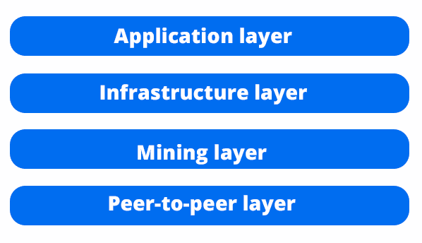

使以太坊成为可能的是一组工具和协议，它们在社区中被广泛使用。您将能够在个人项目中使用这些工具，无论何时您想要实现非常难以从头开始重新创建的高级机制。

# 应用层

应用层是外部程序与区块链交互的层。它还包括智能合约语言，如 Solidity 和 Vyper。这一层是最重要的，因为它给了人们使用以太坊区块链做更多事情的选择，而不仅仅是发送和存储加密货币，它是关于分散技术用例的下一个步骤。以下图显示了应用层：

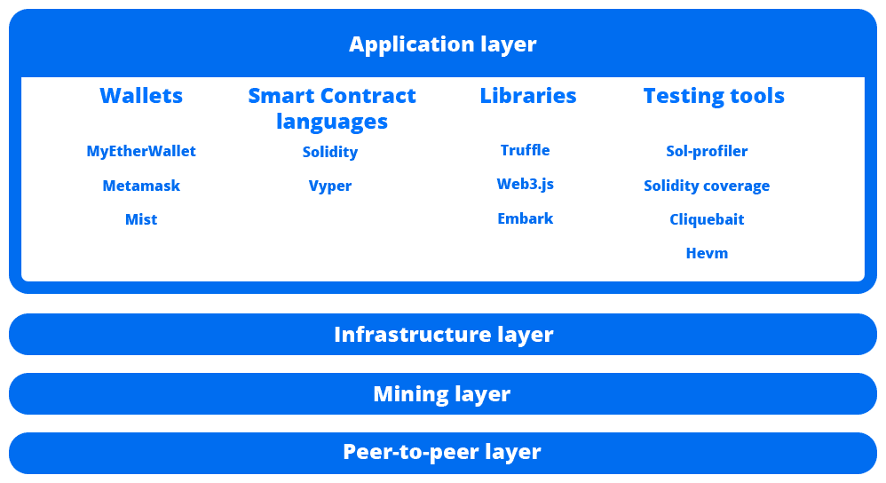

首先，我们有 **钱包**，它们允许普通用户管理私钥以便能够与 **分散应用** (**dApps**) 进行交互并进行转账。

主要的是 **Mist**，**MetaMask** 和 **MyEtherWallet**：

+   **Mist** 是一个正在开发中的浏览器，始终连接到以太坊。它允许您直接从中使用 dApps，而无需担心管理您的账户或使用外部插件。

+   **MetaMask** 是大多数浏览器上可用的插件，让您拥有连接到以太坊区块链的超能力，而无需拥有区块链的本地副本，因为它连接到一个名为 INFURA 的计算机网络，您可以在其中自由创建交易。

+   **MyEtherWallet** 是一个著名的以太坊钱包管理器，您可以在其中存储资金，连接到您的账户，并在线与智能合约进行交互。您也可以下载离线版本以增加安全性和可靠性。

接下来，我们有**智能合约语言**，如**Solidity**和**Vyper**。它们被用于创建与区块链交互的智能合约，其中包含字节码指令。这得益于矿工在挖矿时执行代码。Solidity 在 ICO、去中心化应用和代币中最常用，用户可以在无需信任的环境中与区块链进行交互。

接下来，我们有**库**，如**Truffle**，**Embark**和**web3.js****。它们为您提供了在与智能合约交互的同时创建更好的 dApps 的工具：

+   **Truffle**：这个库以在**最小可行产品**（**MVPs**）、dApps、ICO 和代币合约中被广泛应用而闻名，因为它为希望进一步发展的开发人员提供了安全而经过测试的环境。

+   **Embark**：这是由 Status 团队开发的一种 dApp 框架，为您提供诸如自动从`.js`代码部署合约、监视变化以及管理各种链等实用工具。

+   **Web3.js**：这是与现有智能合约在您的 Web 应用程序上通过 JavaScript 进行交互的最常用的库。它为您提供了直观和易于学习的简单接口。

最后，您有**测试工具**，用于验证智能合约的安全性。请记住，这些工具并不完美，因为它们只提供了扩展选项来测试您的代码，而无需强制您对去中心化应用的所有方面进行全面测试：

+   **Sol-profiler**：这是一个简单的分析工具，可生成一个美观的表格，以易于理解的方式显示所有您的合约和函数。对于较大的项目来说，当开始难以理解所有组件之间的关系时，这对您能够更有效地进行测试非常有用。

+   **Solidity 覆盖率**：这是一个用 JavaScript 编写的出色的测试工具，用于确保您的测试实际上检查了代码的每一行，至少保证进行了全面的测试，而不考虑质量测试。Truffle 是一个出色的测试工具，因为它为您提供了一个帮助您执行单元测试的测试框架。

+   **Cliquebait**：这为您提供了一个干净的 Docker 镜像，使用具有极快出块时间的权威证明以太坊区块链，以便您可以在没有依赖性的情况下部署和检查您的分布式应用程序的每个功能。

+   **Hevm**：使用 hevm，您可以获得**以太坊虚拟机**（**EVM**）的定制实现，准确显示智能合约的运行情况，包括操作码和调试器，可直接与部署的智能合约进行交互。

# 基础设施层

在应用层以下，还有基础设施层，它提供一组更低级别的工具，以更紧密地与区块链交互。诸如去中心化存储、**点对点**（**P2P**）实时消息传递和以太坊客户端等功能。

以下的示意图显示了基础设施层包含的内容：

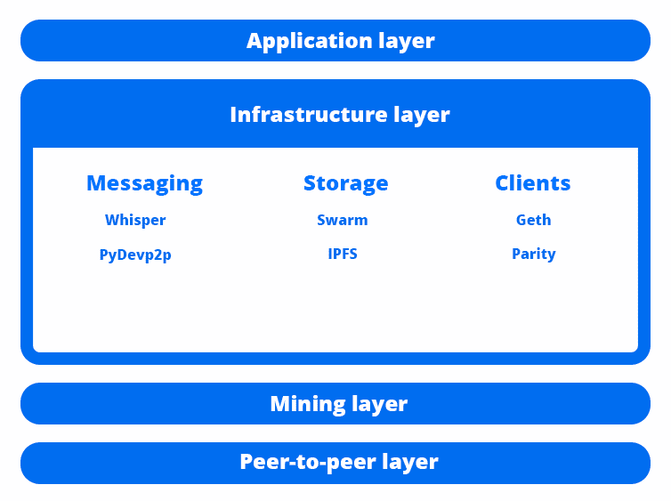

因为区块链是建立在点对点（P2P）网络之上的，节点直接相互交互，我们可以利用**消息**工具，比如**Whisper**和**PyDevp2p**：

+   **Whisper**：这是由核心以太坊开发人员维护的一种协议，你可以在自己的 dApps 上使用它来发送几乎即时的消息。对于加密的聊天应用程序非常有用，因为你只交换哈希。

+   **PyDevp2p**：这是一个类似的工具，直接使用 DEVP2P 协议来交换消息，无需等待区块确认交易。它完全由 Python 编写，所以非常适合直接连接到以太坊的个人项目。

在这一层中，你还可以访问**分散式存储**，它可以让你在区块链上无限制地保存你的数据。这个协议非常类似于 BitTorrent，其中大文件直接在对等之间交换。

与以太坊合作的最流行的存储有**IPFS**和**Swarm**：

+   **Swarm**：这是建立在以太坊之上的、由核心开发人员维护的分散式存储。借助它，你可以创建能够上传特定类型数据并得到你内容的哈希的分散式应用。它的工作原理很简单；用户将一些文件上传到 Swarm 上，同时保持它们在线供其他用户使用，每当其他人想从中得到某些文件时，他只需直接从上传者那里下载，而无需请求许可。它提供了一个类似于互联网工作的容错系统，但没有了中心化。这个事实迫使用户自己保持内容的在线状态，当这项技术开始被普通互联网用户大规模使用时，这可能成为一个问题。

+   **星际文件系统**（**IPFS**）：相比之下，这几乎与 Swarm 一样，在分散式协议存储大量数据，包括文件，在用户之间有一些明显的区别。首先，IPFS 专注于从网络中删除冗余。要知道，在分散式存储中的一个问题是，你将在不同节点上有大量相同的副本。

当你在不同处理时间的不同计算机上有相同的文件时，你只能每次选择最快的那个。你也无法确定你从网络上下载的文件是否真的是它所说的那样。它可能包含满是恶意软件的恶意软件。为了解决这个问题，IPFS 提供了类似于 GitHub 的系统，每个特定文件都有一个唯一的标识符。如果两个文件具有完全相同的内容，也就是它们是相同的，它们将具有完全相同的哈希值。

这非常好，因为这给人们提供了一个保证，他们可以得到未经任何修改的有效内容。这也增加了网络的可用性，因此您可以可靠地从许多不同的提供者那里获取正确的文件。IPFS 仍在不断发展，正在开发一种用于奖励用户将文件保留在网络上的硬币。

最后，我们有在以太坊之上运行的**客户端**。这是直接用于挖矿和下载公共以太坊链的软件。以太坊核心开发人员确保他们提供了各种类似的客户端，以便人们可以公开选择最符合他们利益的客户端，以避免出现一家软件垄断被强制推给所有人，带来的中心化问题。

这些是主要的客户端，尽管还有许多其他客户端用不同语言编写并由不同组织维护：

+   **Geth**：这是用 Go 语言编写的最受欢迎的客户端，因其简单性而广受欢迎。您可以使用它来下载主区块链，用 CPU 进行挖矿，部署合约并与之交互，创建以太坊账户等等，这些功能对一般以太坊开发人员非常有趣。它提供了一个命令行界面，您可以快速访问所有功能。

+   **Parity**：这是由以太坊的联合创始人之一创建的较大客户端，用 Rust 语言编写，与 C++ 语法类似，但在各方面都倾向于安全性。Parity 提供了一个命令行和 Web 界面，您可以使用它来创建账户，下载区块链，部署智能合约等等，Parity 以创建多重签名钱包而闻名，这是一个智能合约，帮助组织在处理资金和投票时做出决策，因为所有成员必须就每个决定达成一致意见。

或者，您还可以选择使用用 Python、C++ 和其他语言编写的客户端进行个人项目开发。选择权在您手中，所以请确保您对所有客户端进行详细了解，以更好地理解每个客户端可以为您提供什么功能。

# 挖矿层

在基础设施下方，您有挖矿层，可以使用您的显卡或 CPU 来挖取以太坊的各种实用工具。您可能知道，生成以太坊的唯一略微有利可图的方式是利用廉价的电力和 GPU 卡。实际上，您可以自己进行挖矿，或加入支付部分区块奖励的矿池。

以下图表展示了挖矿层包含的内容：

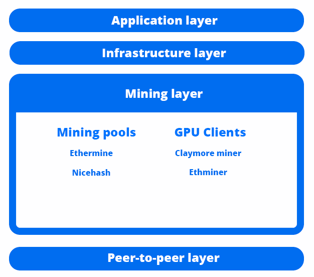

**挖矿**是通过参与挖矿的一组计算机通过工作量证明方案达成共识，增加包含有效交易的区块来增加区块链的大小的过程。这是为了进行加密货币转账以及能够利用挖矿网络的综合力量来运行智能合约而至关重要的。

以太坊的挖矿网络是巨大的，它负责处理发生的所有交易，包括智能合约的执行和部署。这是任何强大区块链的基础。您拥有的挖矿者越多，整个系统就越难以审查和更加安全。

当涉及到挖矿时，您有**挖矿矿池**和使用所有可用图形卡来解决**工作量证明**（**PoW**）挑战的挖矿客户端。挖矿矿池将向所有参与者提供他们从独自挖矿中获得的一部分区块奖励，因为挖矿已经变得指数级困难，只有许多计算机的联合努力才能稳定地生成区块。它们非常适合获得持续的奖励，而不必花费数天的时间独自挖矿，不知道自己是否能找到一个区块：

+   **Ethermine**：在许多其他类似的矿池中，Ethermine 以其丰厚的支付和稳定的回报而闻名。作为您将找到的最大的矿池之一，您有很大的保证，在达到最低 0.05 ETH 后，您将收到您挖矿的 Ether。

+   **Nicehash**：这是一个特殊的矿池，因为它与更多种类的加密货币一起运作。它更像是一个以比特币为交换媒介，以更大的支付额度出售哈希算力的市场，您可以轻松转换为 ETH。支付门槛为 0.001 BTC，这比 Ethermine 要求的要昂贵得多。它非常适合那些考虑长期利益的人。

在选择挖矿矿池之后，您需要获取一个挖矿软件，该软件将以尽可能高效的方式利用您的计算机资源，以获取最大的支付额。最受欢迎的**GPU**矿工是 Claymore 和 Ethminer，虽然还有许多其他矿工，如 Geth 和 Parity，也可以用于相同的目的，但其 CPU 的哈希输出要低得多：

+   **Claymore**：这是一个出色的工具，可以充分利用您的 Nvidia 和 AMD GPU 的性能，因为它针对这些卡的各种类型进行了优化。包括双挖矿支持，您可以使用最小的影响来挖矿 Ether 和您选择的其他加密货币，因为它们使用相似且互补的算法，可以很好地协同工作。这个矿工的唯一问题是，使用它挖矿的每个小时，将有 36 秒用于为应用程序的开发者挖矿，这对于提供比其他矿工更好性能的如此有效的工具来说是可以理解和公平的。

+   **Ethminer**：Ethminer 是用 C++编写的，专门用于挖掘使用哈希算法 Ethash 的任何加密货币，其中包括以太坊、以太经典和 Musicoin 等。它不像 Claymore 那样高效，但是背后有一个强大的开源社区，该社区不知疲倦地努力提供最佳支持和编程，这是一支由热情的开发人员组成的小团队。

理想情况下，您应该测试这两个矿工，看看哪一个能够产生最佳性能，因为每个设置和计算机略有不同。如果您的性能不佳，请确保调整它们提供的设置。

# 点对点层

这是以太坊必须正常运行的最低层。P2P 层负责通过消息以实时方式直接与节点通信，而无需通过中间人。

以下图表显示了 P2P 层包含的内容：

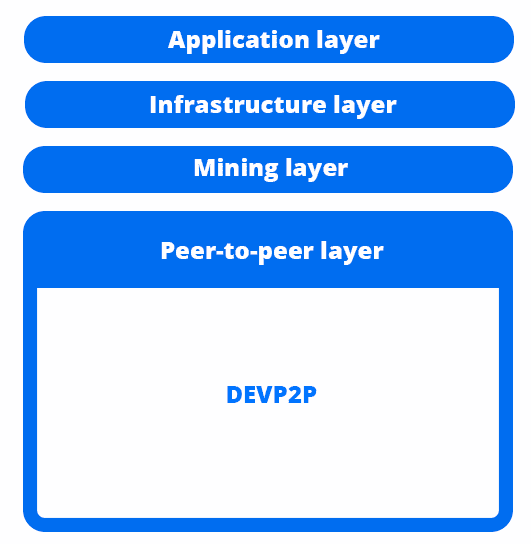

P2P 网络中的每个节点都是可发现的，因为具有唯一的 IP 标识符和包含有关连接的每个节点的数据的哈希表。例如，当您连接到节点 123.456.123 时，您可以发送请求来查看它连接的节点，从而为您提供在未来可以连接的已知节点范围的选项。这对于能够在需要时发现节点并连接到新对等方至关重要。您连接的节点越多，您获取重要消息的通信速度就会越快。

# 了解 DEVP2P

DEVP2P 是一种网络协议，负责在节点希望通过发送消息进行交互时管理协商。每个消息都使用一个名为**RLPx**的协议进行加密，这允许节点在网络上交换加密数据，并确保除接收方外，没有人能够解码消息。

要使节点彼此连接，它们会暴露任何要使用的 TCP 端口，该端口默认为 30303。因此，如果您想连接到特定节点，必须确切地知道它使用的端口、它使用的协议以及其 IP 地址或唯一标识符。例如，我们之前讨论的消息传递协议 Whisper 使用`shh`协议，而以太坊使用`eth`协议。这只是一个简单的区别，当您使用 web3.js 时就会显现出来，因为它显示了每个对应协议中的每个函数。

总之，您已经了解了以太坊架构的哪些组件，因此在开发智能合约时能够辨别出您实际使用的部分。您应该能够识别网络中使用的不同协议，并了解您可用的工具。

在利用手头的工具方面，您刚刚提高了意识，这对于所有想要实现经过时间考验的解决方案以解决常见问题的以太坊开发人员都是至关重要的。

# 区块链共识

以太坊区块链正在一个网络中运作，该网络由成千上万台相互连接的计算机组成，交换信息。现在，为了确保他们都处理相同的交易并为了实现相同的目标作为集体努力的一部分，我们需要一些达成协议的手段，这就是所谓的共识，以便他们都同意结果。这是将努力结合起来以使整体受益的最佳方式。

在下面的图表中，您可以看到所有计算机都在运行相同的挖矿软件，并且一致同意单一协议，为他们的计算能力提供奖励：

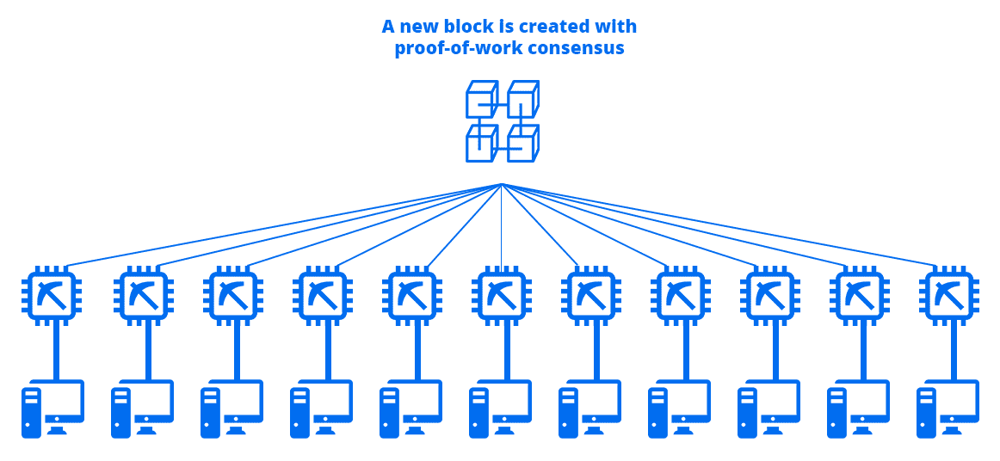

# 引入区块链共识

与标准的投票过程相比，在那里所有个体独立决定他们想要实现的目标，区块链中的**共识**更进一步，旨在做出有助于以最有效方式达到最终目标的决定。例如，桥梁建设项目的管理者做出的决定基于共识，以达成建造桥梁在最有效的时间和成本方式中的最佳解决方案。当涉及到区块链时，共识是矿工们采取的一系列行动，以最有效的方式生成尽可能好的区块，从而减少区块时间，同时矿工们获得有利可图的以太币奖励。

PoW 是用来处理交易并生成包含交易的区块的方案，以换取一项困难的任务，以便只有最有能力的计算机获得区块生成奖励。当矿工生成交易时，他们所做的就是生成随机哈希直到找到适合下一个区块的哈希。每台计算机都是独立进行这样的操作。当矿工找到正确的哈希时，他们将生成该哈希的材料分发给所有连接的节点，以便它们也能做同样的操作，并最终将这个新区块添加到网络中，同时因努力获得奖励。

为什么所有矿工都同意发现正确哈希的人应该获得下一个区块的奖励？因为，当他们进行挖矿时，他们是在遵守一套规则。

这些规则如下：

+   发现区块的用户将获得奖励。

+   作为矿工，您必须将这个新区块分发给所有连接的节点，以同步整个网络中包含在该区块中的新交易。

+   您必须只向区块添加有效的交易。

在这一点上，您可能会问自己*当无效交易被添加到一个区块中时会发生什么？* 答案是，每当矿工向区块添加无效交易，解决了工作证明挑战并试图将其分发给其他人以更新主链时，其他矿工将注意到这些无效交易，并停止分发该区块，因此它将不会进一步发展，因为他们中的每个人都是对每个区块中发生的事情的验证者。

解决包含这些无效交易的区块的 PoW 挑战的矿工浪费了他的计算能力，因为它不会进一步传播。 这是对恶意行为的惩罚，它是能源和时间的浪费。

这是一种非常强大而简单的检查机制，它保护区块链免受恶意意图，从而只批准已成功验证的有效交易。

# 展望未来

以太坊核心开发人员正在努力开发下一个版本的以太坊共识方案，该方案采用了**股权证明**（**PoS**）的方案，该方案将在不久的将来的一个硬分叉中命名为**Serenity**，约在一到两年内发布。Ethash 不再用作实现和处理 PoW 共识的算法，以太坊将使用名为**Casper**的东西作为共识的协议，结合 PoS 和 PoW。

为什么它们正在改变生成区块和达成共识的协议？因为 PoW 在资源上不可持续，因为它迫使矿工浪费无法支撑的能源和资源。 没有必要在加密挑战中浪费所有这些能源。 我们可以通过不需要太多能源的简化协议达到相同的目标。 而且，最大的加密组织能够负担得起大量的计算能力，使得少数公司成为几乎整个矿业网络的所有者。 这是一个严重的问题，因为它破坏了去中心化的原则。 如果他们可以控制整个网络，那么该系统就可以被视为中心化，因此他们获得了更强大的立场来决定加密货币的发展方式。

理论上，他们可以合并努力并发动 51％的攻击，自由操纵交易。

卡斯珀计划通过使用 PoS 算法来解决 PoW 意外增长所带来的问题。 然后，矿工在网络上锁定特定数量的以太币，以便能够验证交易，同时通过交易费用获得报酬，因为新的区块创建将停止获得奖励。 每个矿工都会为他们认为合法的区块押注任意数量的以太币，如果他们是正确的，他们将获得他们押注的一部分。 这使得整个网络更加去中心化，因为更多的计算机能够参与共识过程，以加速并从少数大玩家手中释放资源。

在以下图表中，您可以看到如何通过对随机生成的区块提出下注来生成区块的可视化表示：

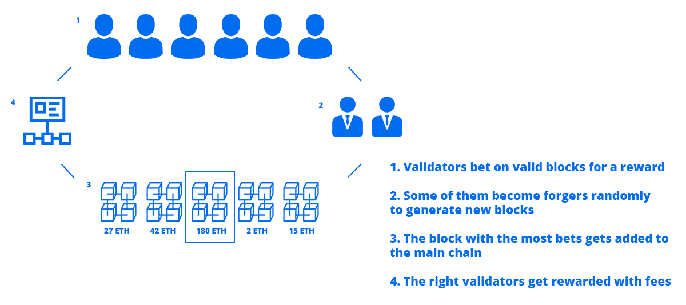

在 Casper 中，将会有一种特殊类型的矿工，被称为**forger**，他们将通过合并交易并在过程中添加他们的公钥来生成区块，以证明他们是创建该区块的人。如果他们最终将正确的区块添加到区块链上，他们还将获得费用奖励。那些对正确的区块下注的人将被称为**validators**。每当一个区块有足够的下注，并且如果它在标准区块链的标准区块时间内生成，即该区块将被添加。forger 将从所有 validators 中随机选择，以便少数人能够创建区块。

# 无利可图问题

当使用 PoS 的 Casper 实施时，参与者将能够通过对他们认为有效的区块下注来推动区块前进，并在选择有效区块时获得奖励。但是，如果他们决定对恶意区块进行投票会发生什么呢？当对恶意区块下注时，他们不会损失任何东西，因此没有任何事情能阻止他们这样做。这就是**无利可图**问题所在。

这些矿工将能够对他们看到的每个区块进行押注，以获取可能的奖励。

解决此问题的一个可能方案是惩罚那些不断对错误区块下注的人。因此，如果一个矿工犯了 10 个错误的决定，他将损失一部分他的股份。但是，只有当网络的大多数决定投票给错误的区块时，这种情况才会发生，如果矿工分布足够广泛，很难就错误的选择达成一致意见。

# 区块链经济

加密货币的有趣之处在于它们将技术与在现实世界中具有价值的真实资产结合起来。历史上，我们首次能够创建完全自主运行的数字货币。从历史上看，货币始终由中央政府支持，他们控制着供应和需求。他们是唯一能够印刷货币以控制通货膨胀的人。

# 了解通货膨胀

简单来说，通货膨胀是经济中所有资产价格上涨的现象。例如，1890 年的一座房屋通常价格约为 10000 美元，但同一座房屋现在的价格约为 350000 美元，即使它变老了——这是高通货膨胀的结果。这可能是由于自然资源稀缺导致的材料成本增加。也许是因为工作机会不足，所以人们要求更高的工资，因为要求也在增加。也可能是因为土地成本增加，这是由于销售的房屋不足。所有这些以及许多其他因素都迫使企业提高价格，从而迫使人们在增加通货膨胀的同时赚更多的钱。

诸如以太坊之类的加密货币能够增值，因为随着技术不断改进和开发更多用例，采用率不断提高，这使得它们在一定程度上对外部通货膨胀具有一定的抵抗力。每年供应增长速度放缓的事实使价值相对于法定货币保持相对稳定，而政府和机构能够按需印刷法定货币，这使得以太坊和许多其他加密货币成为很好的价值存储工具。

# 评估加密货币经济学

询问加密货币为何具有价值等同于询问任何事物为何具有价值。我们对事物进行数值估值是因为它给了我们一些东西——一个提供给我们安全睡眠场所的房子，一个给了我们能力去远方旅行的汽车，或者提供生存所需的食物。一般来说，区块链作为一种工具具有实用价值，用于存储货币，进行几乎即时的数字货币转账，并使用一种特定类型的应用程序，如果没有区块链就无法工作。

在转换加密货币方面，交易所起着很大的作用。您可以前往接受以太币的任何交易所，并将其转换为任何其他货币，因为他们同意这是一种有价值的东西。货币基于协议。我们都同意苹果有一个特定的美元价值，这可能略有变化，只要人们想要消费这个苹果，并接受美元作为交换，他们就会购买它。以太币也是如此——只要人们想要以太币用于他们能做的任何事情，并接受美元作为交换，他们就会购买它。

在货币出现之前，人们通过协议交换物品，例如，一张桌子换一袋土豆。后来，他们决定使用一个抽象概念，即一个数字，可以更精确地理解物品的价值。

请注意，价格永远不是固定的。这不像米制系统，其中 1 公斤对于整个地球来说都是一样的。法定货币和加密货币通过与其他货币比较来确定其价格。1 美元对比 0.8 欧元，就是 1 美元对比 1 美元。1 以太币对比 200 美元。世界上的法定货币全球交易称为外汇（外汇交易）。对于加密货币，有个别交易所分别处理价格。

当有人愿意用一种币换另一种币的时候，两种币都会得到一个价格。例如，想象一下以下情景：

1.  想象一下，有人刚刚创建了一种名为 RED 的新虚拟货币。它没有任何价值，因为还没有人想购买它，因为它还不为人所知。

1.  现在，约翰读到了这个新的 RED 币，并决定它将帮助他以较低的价格购买苹果，因为他们已经与当地的生产商达成协议。RED 币具有实用价值。

1.  他去了交易所，并与该币的所有者谈判。约翰想要购买 100 个 RED 币，所以他们谈论到他们决定 100 个 RED 币价值 300 美元，基于该币的实用性。

1.  在那一刻，RED 币的价值为 3 美元，直到该币的创建者决定降低价格以增加买家或反之。

市场决定了所有货币的价格，这取决于人们购买它们的意愿。

# 确定加密货币的价值

任何事物的价值取决于供应和需求。只要供应保持一致，人们越想要它，它就会变得越昂贵。

在下图中，你可以看到供需如何影响特定加密货币与稳定的法定货币对应的价格：

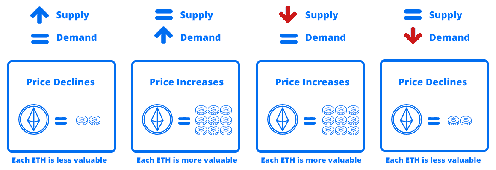

许多交易所都有自己的流动性池，以太币在这些交易所的价值不同，因为人们基于偏好使用不同的交易所。那么，他们是如何同步使得所有交易所都具有标准价格的？事实上，它们仍然有稍微不同的价格。套利者致力于保持价格一致；因为他们的收入是基于从一个交易所到另一个交易所的价格差异，这是导致每种加密货币价格总体稳定的原因，尤其是像以太坊这样的大型加密货币，其中每日交易量足够大，值得投资。

随时间的推移，价格变动的结果可以在下一节的图表中看到，在那里，你可以快速分析特定历史事件时加密货币的价值。图表为区块链采用提供了很好的理解。

# 基于以太坊的代币

以太坊区块链如此著名的原因之一是因为它为创建代币提供了简单的方式。每个有大量追随者的代币都会不可避免地影响价格，因为背后的技术仍然是相同的。在接下来的章节中，你将学习到如何创建 ERC20 代币。目前，你只需要理解，每当有人投资购买代币时，代币的价格就会上涨，同时也增加了以太坊的总价值。

以太坊上的代币数量越多，区块链的价值就越高，因此它的价格就会上涨。如果你去[`coinmarketcap.com/`](https://coinmarketcap.com/)，你会看到所有大型以太坊代币的价格，你会意识到大多数代币的价格模式与以太坊相同，原因很简单，因为购买代币的人实际上是在投资底层技术，即以太坊。

投资到以太坊的总金额被称为市值，因为以太坊的市值如此之大，只有大额以太币的购买才能明显影响价格。因此，每当你看到价格出现巨大波动时，很可能是因为一家大公司投资于技术出于他们自己的动机。

# 区块链指标

区块链指标是区块链的重要可衡量特征，可以帮助您了解其状态，以便确定以太坊区块链的表现如何，采用率如何，以便您在定价、发展和采用率方面预测未来。

# 交易数量

区块链中的交易数量是最重要的指标，因为它显示了技术在日常情况下的使用情况。交易代表活动。交易越多，越多的人积极使用区块链投资项目、运行 dApps 和使用智能合约。

如果没有人使用技术，拥有数十亿用户是没有意义的；交易越多，技术就越有用。您还将在下一个标题中看到，以太坊正在经历成长的烦恼，使用率不如预期。人们加入了它，但他们没有充分使用它。这是社区中一个必须克服的巨大问题，以成为主流。

当以太坊开始时，有 8,893 笔交易，然后在 2019 年 1 月 1 日达到每日 448,168 笔交易。2018 年 1 月 4 日的交易记录为 1,349,890 笔。

以下是以太坊自 2015 年推出以来交易数量的可视化参考：

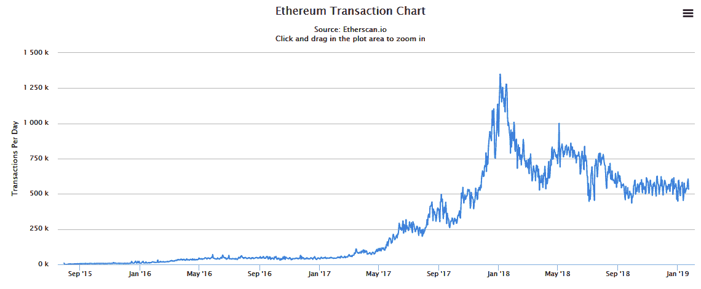

前面的截图告诉我们，每天有 448,000 笔交易来自每日转账、使用 dApps 的人、参与 ICO 的投资者和与智能合约交互的人。相比之下，截至 2017 年 12 月，PayPal 每年处理 76 亿笔交易，约为每天 6.33 亿笔。PayPal 是全球广泛使用的主流技术，因此，为了让以太坊达到这种大规模采用的水平，它必须增长大约 1413 倍才能达到当前交易水平。这清楚地表明以太坊仍处于起步阶段，需要几年时间才能在这样的规模上变得相关。

图表显示，自去年以来，以太坊的每日交易数量没有增加。这在区块链领域是正常的，预计在一段时间后，由于技术尚未经历的许多改进，它将继续增长。

您可以通过查看以太坊交易图表 [`etherscan.io/chart/tx`](https://etherscan.io/chart/tx) 自行探索数据。

# 地址增长

以太坊中的地址类似于现实生活中的账户，尽管更容易生成，因此人们通常会在任何给定时间管理 10 个地址并不奇怪。以太坊成立时总共创建了 9205 个地址。从那时起，以太坊没有停止增长，截至 2019 年 1 月 1 日，已创建了 54,281,633 个地址，每天增长约 51,139 个。这些是 5000 万个地址，我们可以将其近似为 500 万用户，因为我们可以假设普通用户具有约 10 个地址，考虑到创建它们的便利性。

这是以太坊地址总数多年来的增长情况：

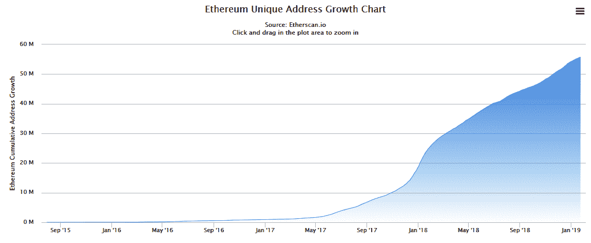

如果您想探索有关以太坊地址的更多过去历史数据，可以查看[`etherscan.io/chart/address`](https://etherscan.io/chart/address)上的图表。

5400 万个地址向我们表明以太坊仍处于采用阶段，而且在不断增长。人们第一次发现这项技术，他们加入了，他们也带来了更多人。当我们达到 10 亿个地址时，我们可以自信地说这项技术已经成为主流，人们已经把它融入到他们的日常生活中。

# 以太市值

每个以太的价格向我们表明人们对技术有多少信任。有句谚语说，“言之有物”，这个统计数据非常贴切。人们在技术上投入的资金越多，他们对它的信任就越深，这表明扩张。在 ICO、TGE 和 STO 中筹集的资金也是以太价格上涨的良好来源，因为许多项目都成功地使用了这项技术。人们把钱投入到基于以太坊的有用项目中。

在下图中，您可以看到以太坊的价格随着时间的推移而波动，出现了几次突然的暴涨，这是由人们对这项技术的兴趣所引起的。

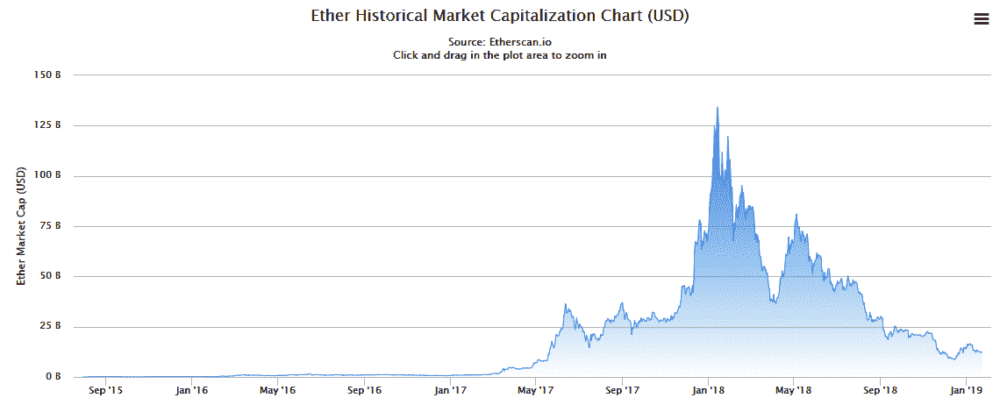

以太坊是在 2015 年诞生的，当时 1 个 ETH 价值 0.31 美元。两年后，到 2017 年 12 月底，1 个 ETH 的价值超过了 1000 美元。最近，价格下跌，截至 2019 年 1 月 1 日约为 142 美元。这向我们表明，人们在逃离它，因为他们受骗了，因为他们对它没有用处，或者只是因为炒作结束了。真正的原因不确定，但可以肯定的是，价格下跌是因为这项技术需要提供创新的解决方案来解决只能通过区块链解决的现实问题。

如果想了解有关价格如何随时间变化的更多信息，请查看 Etherscan 上的图表[`etherscan.io/chart/marketcap`](https://etherscan.io/chart/marketcap)。

# 开发者采用

一个项目没有背后的人改进和发展到新的领域就什么都不是。以太坊背后的开发者的数量和质量是未来发展的指标。越多优秀的人参与其中，它就越快能够面对可能解决人们问题的新挑战，提高实用性。我们可以通过使用以太坊发布的 dApps 数量和 ERC20 代币的数量来衡量开发者采用程度。

区块浏览器 Etherscan 表示，截至 2019 年 1 月 24 日，在以太坊区块链上发布了总共 164,188 个代币合约。您必须考虑到其中许多是欺诈行为。大约有 1,000 个是真实的，考虑到每个好的代币，都有 10 个假的或被放弃的代币。这个数字告诉我们，以太坊在开发者采用方面是主导的区块链，因为其他区块链很难达到几百个代币。人们正在加入网络并了解更多有用信息，因为代币背后有有用的应用。

状态 dApps 是最受欢迎的网站，汇集了大多数构建在以太坊上的应用程序。据说这个区块链上有 2,432 个 dApps。这比任何其他区块链都多得多。然而，我们必须将其与实际场景进行比较，因为以太坊主要是用于构建不可阻止的应用程序的协议。例如，Google Play 列出了约 2.6 百万个活跃应用程序，这比部署在以太坊上的应用程序数量大了 1,000 倍。

根据这些数据，我们可以得出结论，以太坊又一次处于增长阶段，采用刚刚开始，因此我们必须继续在其上构建，直到人们决定参与解决去中心化的问题。

要了解更多信息，您可以查看 [`etherscan.io/tokens`](https://etherscan.io/tokens) 和 [`www.statista.com/statistics/266210/number-of-available-applications-in-the-google-play-store/`](https://www.statista.com/statistics/266210/number-of-available-applications-in-the-google-play-store/)。

# 矿工活动

最后，矿工活动是技术背后力量的重要衡量标准。越多的矿工加入网络，它就会变得越强大，进而增加其去中心化程度，达到创纪录的高算力。

以太坊在 2015 年开始时的算力仅为 11 GH/s。这是极低的，而且是任何新的区块链都可以预期的。然而，这个数字并没有停止增长，现在截至 2019 年 1 月 1 日，我们大约有 180,000 GH/s。

看一看以太坊的网络算力如何持续增长的截图，以清楚地欣赏价格与采用之间的关系：

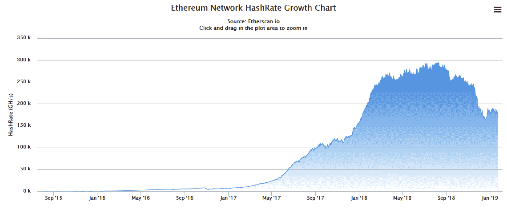

您可以从前面的图表中看到，算力一直保持稳步增长，直到 2018 年 9 月份下跌，随后缓慢回升。通过解读这些数据，我们可以得出结论，慢慢被相信这项技术的矿工们所接受，特别是最近一段时间，难度增加而奖励减少。这种加密寒冬仍然异常强劲，得到愿意承担损失挖矿的人的支持。这是人们对底层系统有多么信任的一个很好的指标。

一定要查看官方图表，自己分析这个有趣区块链的算力，以发现有趣的时间点，人们在这些时间点决定参与挖矿过程，网址是[`etherscan.io/chart/hashrate`](https://etherscan.io/chart/hashrate)。

# 总结

在本章中，我们了解了与将区块链技术与现实场景集成的机制相关的许多事项，例如交易所和采用率。您现在能够使用强大的工具来改善您的去中心化应用程序和智能合约的质量，同时还能够根据以太坊的最重要指标预测未来价格走势。在第一节中，您看到以太坊区块链是如何使用一组特定规则（称为链规范）来定义的，然后学习了使这项技术如此引人注目的不同组成部分，包括构建在每个层级上的许多应用程序。最后，您了解了以太坊共识、经济和度量是如何工作的，以帮助您了解为什么以太坊是如此有价值的数字货币，同时看到了许多节点如何共同合作以实现一个目标，使用所谓的共识。

在接下来的章节中，我们将介绍以太坊协议的不同实现，以便能够在您自己的项目中充分利用以太坊的潜力。
