# 以太坊资产

在本章中，您将了解不同的以太坊协议实现，以便更好地理解区块链可以以许多不同方式集成。在学习协议实现之后，我们将继续探讨 INFURA、钱包以及**去中心化自治组织**—也被称为**DAOs**—这样您将学会如何在区块链上创建不受中央政府限制的商业网络。我们将讨论几个区块浏览器，以便学习如何检查您的交易，从而分析在上传智能合约到区块链时发生的情况。最后，您将了解有关区块链实施的一些重要问题，以帮助您解决您可能在某个时候面临的常见问题。

在本章中，我们将涵盖以下主题：

+   以太坊协议实现

+   INFURA 要点

+   去中心化自治组织

+   杂项与关注点

+   创建您自己的私人以太坊网络

+   选择以太坊钱包

+   使用 Etherscan 进行交易

+   创建账户

# 以太坊协议实现

以太坊是一个开源系统，可以用不同的语言实现，以便为人们提供使用他们喜欢的工具进行交互的选择。其中一些完整节点的实现是 Geth 和 Parity。我们将在本节中探讨它们的区别，以及在什么情况下使用它们是最佳的场景。

# 协议实现

正如您在前面的段落中所读到的，我们将涵盖的以太坊实现包括 Geth、Parity、Mist 和 Embark。为什么只有这四个？因为它们是最流行的实现，使您能够完全执行区块链的所有功能。挖矿、进行交易、下载整个区块链、与您部署的合约互动以及创建账户这类事情在所有这些实现中都是可能的。

# 理解 Geth

Geth，也被称为 Go Ethereum，是最流行的以太坊实现，可以让您执行各种任务。我们将在接下来的章节中详细介绍如何执行大部分任务，帮助您理解每个任务所需要的每个命令。

您可以在 macOS 上轻松安装 Geth，使用以下命令：

```
brew update
brew install ethereum
brew upgrade ethereum
```

或者，如果您使用的是 Windows 或 Linux，您可以前往[geth.ethereum.org/downloads/](https://geth.ethereum.org/downloads/)，然后获取适用于您系统的可执行文件。无论哪种情况，`geth` 命令将在您的终端或命令行中安装后可用。

# 创建账户

您可以使用 Geth 创建无限账户，因为它们是由称为**Rivest Shamir Adleman**（**RSA**）的算法生成的，该算法在链下创建公钥和私钥。可能的组合数量如此之大，几乎不可能生成与另一用户相同的账户。要使用 Geth 生成一个账户，请运行以下命令：

```
$ geth account new
```

这将询问您一个密码，以保护您的凭据安全。然后，您可以使用以下代码管理您的帐户：

```
$ geth account list
$ geth account update <your-accounts-address>
```

`update` 命令用于更改特定帐户的密码，以便您可以轻松解锁它。您可以使用此命令删除现有密码。

您还可以使用以下命令解锁您的 Geth 帐户：

```
$ geth --unlock <your-accounts-address> --password <your-password> 
```

这基本上是解锁您的 Geth 帐户，以便您可以通过控制台直接发送交易。

请注意，您也可以在被询问时按下 *Enter* 键而不输入任何内容即可创建无密码的帐户。

# 下载区块链

Geth 的主要功能是下载区块链，以便您可以在设备上拥有一个完整的节点，以满足您可能需要的任何目的。要执行此操作，请在终端上执行以下命令：

```
$ geth
```

在没有参数的情况下运行 `geth` 会自动开始下载最新版本的区块链，并将其下载到默认目录，RAM 默认大小约为 1 MB。您可以使用此标志更改下载区块链的位置：

```
$ geth --datadir "<your-location>"
```

要更改用于下载区块链的 RAM 部分，请使用此标志：

```
$ geth --cache=1024
```

此标志中的数字表示您想要专门为此进程分配多少 RAM。您分配的越多，它下载主以太坊链的每个组件的速度就越快。尽管如此，由于链中包含了大量的过去交易信息，获取完整的数据链可能需要数小时。请记住，链会永久存储每笔交易，没有删除过去交易的选项。

然后，您可以使用以下命令在下载链后可视化节点指标：

```
$ geth monitor
```

# 使用您的 CPU 进行挖矿

Geth 也能够利用您的 CPU 独立挖掘以太币，但与使用图形卡或**特定应用集成电路**（**ASICs**）等替代方法相比，这不是一种高效的过程。尽管如此，将其添加到此工具中可能在需要低资源挖掘的不同情况下很有用，比如在物联网设备中。

要使用 Geth 进行挖矿，请执行以下命令：

```
$ geth --mine
```

如果尚未同步，则它将开始下载和同步您的链。在设置了您的 `etherbase` 后，您将能够接收资金，这可以轻松地完成如下：

```
$ geth --etherbase 0
```

最后一个数字表示将从您的列表中使用哪个帐户。您可以使用 `geth account list` 命令查看您的帐户。

# Parity

**Parity** 是最发达的以太坊协议实现之一，因为它为您提供了一个令人惊叹的界面，您可以从中使用所有功能，包括部署合同和与区块链交互。

要安装 Parity，请在 Linux 或 Mac 上运行以下命令：

```
bash <(curl https://get.parity.io -L)
```

它将自动下载最新版本，编译它，并立即获取所需的组件以使其正常工作。不过，对于 Windows，您需要从它们的官方网站获取可执行文件，网址是：[www.parity.io/ethereum/](https://www.parity.io/ethereum/)。

# 下载区块链

在能够与 Parity 交互之前，您必须下载区块链，这可以通过执行以下命令简单完成：

```
$ parity
```

安装完成后，您将能够访问 `localhost:8080` 网站上的 Web 界面，该界面将显示您所有可用的选项。

# 创建账户

要使用 Parity 创建账户，您只需点击 ACCOUNTS 选项卡，然后在主选项卡下方选择 + ACCOUNT，以生成一个新账户，如下图所示：

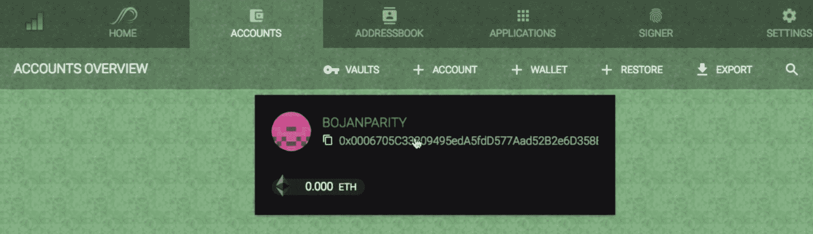

# 使用 CPU 进行挖矿

Parity 可以与其他 GPU 矿工配合使用，这将为您提供更好的哈希速率，以便您可以从一开始就变得有利可图，与使用 CPU 进行挖矿相比。然而，您可以通过运行以下命令来使用您的处理器进行挖矿：

```
$ parity --author <your-ethereum-address-without-0x>
```

然后您将开始向该地址生成微小量的以太币。

# 每种协议的最佳方案

Geth 和 Parity 都是出色的工具，可以为各种分散式应用程序和智能合约开发框架执行相同的工作。然而，有特定的用例可以让其中一个比另一个更好。

# 智能合约开发

并且在下载完整的以太坊主链之后，它们都提供了一种简单的部署和与智能合约交互的方式。然而，鉴于 Parity 在易于使用的 IDE 中为您提供了一个专用选项卡来编写智能合约代码，因此 Parity 是更好的选择。您可以将智能合约编译到特定版本，保存它们，并将它们部署到网络上。更好的是，它会自动突出显示您的代码，这在大多数 Solidity 和 Vyper 编辑器中都很少见。

另一方面，Geth 使用命令行界面，这使得智能合约开发变得更加困难。

就我个人而言，我发现 Parity 的界面是任何类型的以太坊开发人员的绝佳工具。它快速，外观出色，您完全控制您自己的节点，感觉良好，而且易于使用。

# 管理账户

在管理多个以太坊账户时，您可以使用 Parity 提供的 Web 界面或使用 Geth 提供的命令行工具。在这种情况下，两者都是不同用途的绝佳选择：

+   如果您正在管理多重签名钱包，请使用 Parity，因为它具有内置的部分来管理这些类型的复杂钱包，而这在 Geth 中是缺失的。

+   如果您需要一个基于命令行界面的简化系统，该系统为您提供更少的头疼以进行更快的操作，那么请使用 Geth，鉴于您不需要打开 Web 界面与其进行交互。您不必等待此类 UI 显示的小但明显的加载时间。

# 其他用途

当涉及到不同的情况，比如挖矿、下载区块链、转账资金以及探索你本地区块链的历史时，决定哪个选项更好取决于你。两者都是相等的，都会给你带来相同的结果，只是有些微小的差异。

你已经了解了这些以太坊实现为你可以做的主要特性。我们看到了 Geth 和 Parity 如何被使用，他们如何与区块链交互，以及一些你可以直接应用于自己的个人项目的真实世界命令。记得去看一下 Parity 的神奇智能合约代码编辑器：你会喜欢的。

# INFURA 要点

**INFURA** 是一个流行的技术，可以连接到区块链而无需下载它包含的数百吉字节，因为它免费提供给你完整的节点。

# 理解 INFURA

INFURA 通过为用户提供可用的以太坊实例来连接到区块链，帮助数百万用户连接到区块链。这是一个旨在改变以太坊采用率的最大项目之一，因为每个人都能够立即连接到以太坊，以处理交易并与区块链进行交互。

它支持像 MetaMask 这样的流行应用程序，让你可以从浏览器进行交易。这就是 ICO 变得如此流行的原因之一——因为人们发现了一个简单的方法来与区块链进行交互，以便使用 MetaMask 和 INFURA 的基础设施轻松执行交易。你可以自由地在自己的应用程序中使用 INFURA，只需使用适合你项目的正确网络的链接：

+   对于主网络，请使用此链接：[`mainnet.infura.io`](https://mainnet.infura.io)

+   对于测试网络，请使用测试网络的名称，例如：[`ropsten.infura.io`](https://ropsten.infura.io)、[`rinkeby.infura.io`](https://rinkeby.infura.io) 和 [`kovan.infura.io`](https://kovan.infura.io)

现在，这些是免费的网址，但在你可以发出的请求数量上有限制。如果你想无限制地访问区块链，你将需要在[`infura.io`](https://infura.io)上创建一个账户，你将会得到一个唯一的令牌 ID，你可以在自己的需求上无限制地使用它。

INFURA 也可以与 IPFS 一起使用，IPFS 是一种去中心化存储的协议，类似于 torrent，因此你可以在去中心化网络中上传内容而不需要中心化。

# INFURA 的内部运作

表面上，INFURA 提供了一个干净的 API，许多区块链开发人员可以自由使用它们的分散式应用程序，以提高以太坊的采用率。

在幕后，他们有一组计算机，上面安装了最新版本的以太坊区块链，并且同步地动态调整资源需求，每当用户产生更大量的交易时。以下图表展示了它是如何工作的：

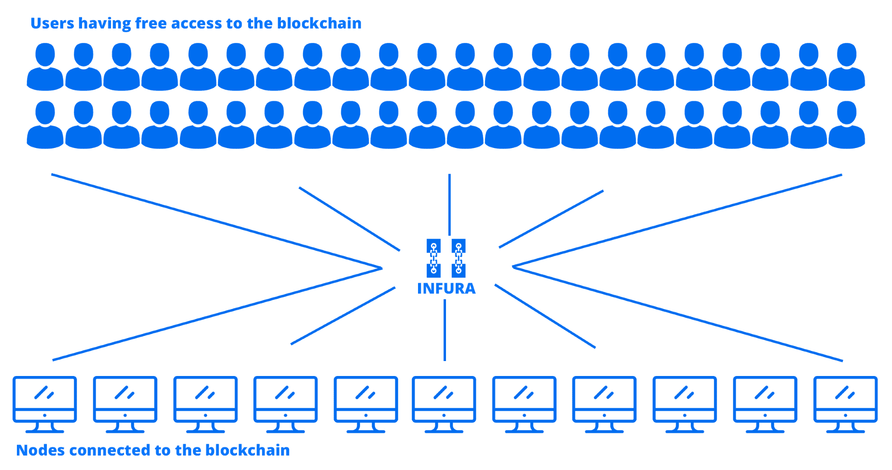

与自己下载最新链时耗费大量千兆字节和小时的时间相比，你可以简单地连接到 INFURA，这样你就可以立即访问各种以太坊链而无需任何限制。

# 使用 INFURA 的仪表板

当你在 INFURA 注册为新用户时，你将可以访问仪表板，你可以在其中创建项目，查看有关项目 ID 的统计信息和详细信息：

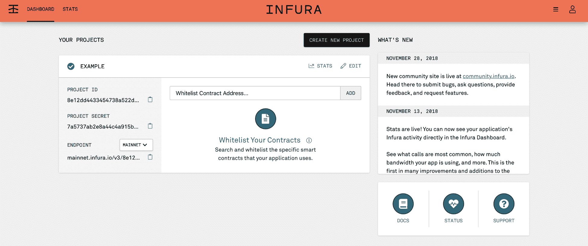

第一件你会想要做的事情是点击“创建新项目”按钮，创建一个新项目，以便你的 dApps 能够连接到正确的区块链端点，无论是 Ropsten、主网、Rinkeby 还是 Kovan。一旦你点击了那个按钮，你将被要求命名它，然后项目将被创建：

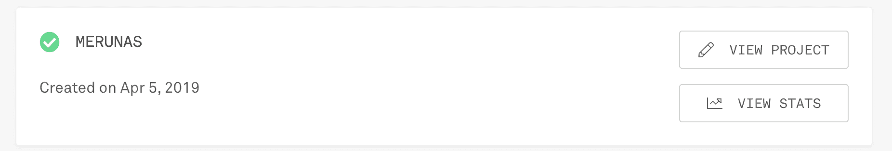

如果你点击“查看项目”，你将看到一个页面，其中有修改该端点安全性和名称的设置，以及删除它的选项：

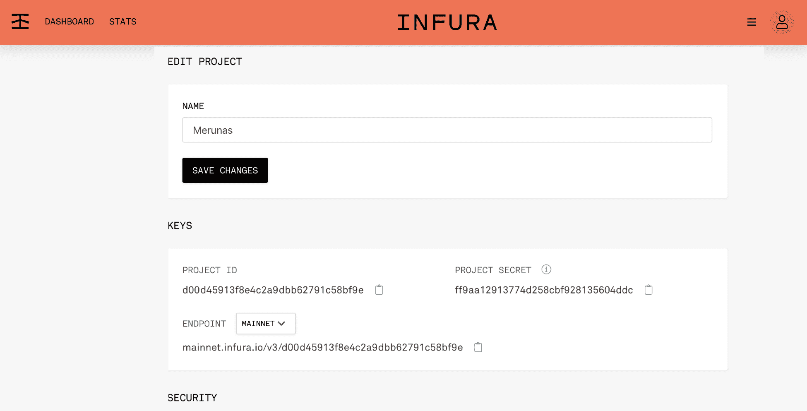

如果你点击“查看统计”，你将看到一个页面，其中包含大量关于请求数量和带宽使用情况的信息，以及关于端点使用时间的统计信息，以及其他有价值的信息：

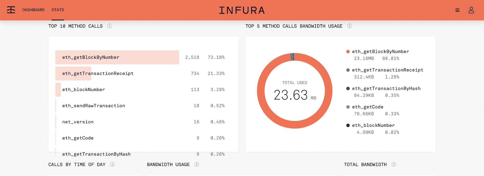

除了那些按钮，你还有一些可点击的链接，你可以快速访问文档和 INFURA 的状态，并在需要时获得支持：

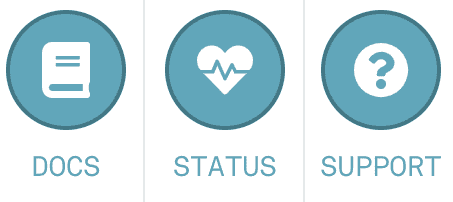

INFURA 的基础设施确实是一个有趣的命题，由 ConsenSys 的人们制作，他们创建了一个庞大的连接用户的网络，希望参与区块链革命，而不需要下载如此庞大的区块链所需的时间和存储。

这是向所有即将利用这一激动人心的技术的新用户提供开放访问的最佳方式之一。它也完全符合开放技术的区块链核心概念。然而，如果太多的应用程序和用户最终依赖于它，使其成为一个中心化的故障点，那么如果服务失败，它可能会导致数千个 dApps 无法运行，从而成为未来的一个问题。为了避免这样一个悲剧性的场景，请记住为生产应用程序设置自己的以太坊节点，以增加去中心化。

# 去中心化自治组织

**去中心化自治组织**，也被称为**DAOs**，是区块链的最佳用例之一，因为它们是信任和应该更新为现代时代的旧系统之间的完美链接。

# 解释 DAOs

**DAO** 的目标是成为企业做出决策的主要场所。它们是传统公司的去中心化版本，通过与利益相关者和每个 DAO 的关键组成部分讨论来做出决策。简单来说，它们利用了以太坊区块链的不可信任性来形成具有所有可能性的法律公司。

他们依靠智能合约提供硬编码功能，用户可以通过多重签名钱包做出决策并达成协议。多重签名钱包类似于以太坊账户，因为它们存储 ETH 并能够进行转账；然而，底层技术由智能合约组成，强制成员通过使用自己的地址签署每个决定来达成一致。

它们被称为 **自治**，因为它们在区块链顶部自行运行，无需任何人维护它们，与传统公司相比，传统公司必须研究每个组成部分的发展以避免法律后果和结构问题。

# 在 DAO 内操作

创建不受政府或外部实体控制的不可阻挡组织的想法比起初看起来要简单得多。这就是为什么我准备了一个简单的图表，展示 DAO 在日常基础上参与的流程：

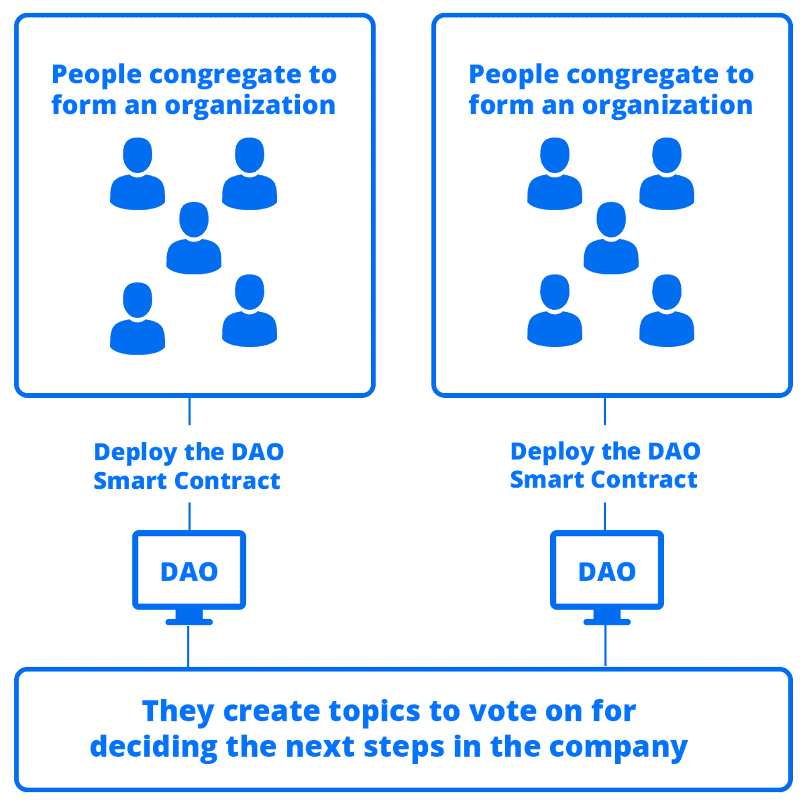

每个 DAO 都是独立运作的，每个用户都能创建要投票决定的议题。每个代币持有者都可以选择以取决于他们拥有多少代币的权重进行投票。你拥有的总代币比例越大，你在组织中获得的决策权就越大。

最初，这不应该是一个问题，因为人们预计会投票选出最好的公司结果，但后来可能会导致集中化问题，其中少数人会控制大部分代币，从而能够为个人利益合作。这类似于 51% 攻击，其中整个公司的一部分做出所有决定。

# 用于 DAO 的工具

你可以编写自己的 DAO 智能合约，为组织成员提供创建具有投票机制的提案的功能，但已经存在的解决方案可以帮助你简化流程，加快设置时间。

**AragonOS** 是用于创建去中心化自治组织的最常用的开发框架之一，它给你以下选项：

+   将你的 DAO 智能合约更新到最新版本，并包含所有改进

+   限制对具有权限控制的特定用户的访问

+   在其之上添加额外的投票应用程序以扩展功能

这个想法很简单，只需创建 DAO，配置权限，并开始构建组织的组件，以达成治理决策。你还可以使用 AragonUI 以美观简洁的方式与你的组织进行交互。后来被黑客攻击的著名 ICO，即被称为**The DAO**的项目，由于产生了如此重大的后果，所以不再可用，因此你无法从它们为创建新的去中心化组织提供的选项中受益。

# 杂项和关注点

以太坊是一个复杂的工具系统，通过协同工作实现了一个授权解决方案，帮助成千上万的用户进行去中心化交易，他们无需信任外部实体来保护他们的个人数据和滥用规则。因此，对于这些内部部分如何相互通信的方式有疑问是完全正常的。在这里，我们将为您提供一些在开发和使用区块链过程中任何用户都会面临的最常见问题的答案，以便您能够将这些新知识与坚实的基础联系在一起。

# 理解以太坊改进提案

以太坊是一个不断发展的技术，不断改进，各种专家产生的新研究推动了去中心化技术的发展。新变化被纳入这个区块链的方式是通过**以太坊改进提案**，更为人熟知的是**EIPs**。

标准如 ERC20 和 ERC721 是由 EIPs 提出的，并分别用数字 20 和 721 进行标识。这些 EIPs 是在官方以太坊 GitHub 存储库中以 EIPs 的名称创建的，位于 [`github.com/ethereum/EIPs/issues`](https://github.com/ethereum/EIPs/issues)，在这里你可以看到人们通过改进为整个系统带来益处的核心以太坊创新。事实上，ERC20 标准是为了满足基于以太坊生成唯一加密货币的需要而创建的。

它们是以太坊演进的重要组成部分，并提供非常有趣的功能，使这个区块链成为解决人们问题的技术的最佳选择之一。

# 区分使用 Truffle 和集成开发环境（IDEs）的用法

你可能熟悉被称为**Truffle**的框架，它允许你以可持续的方式编写、部署和测试合约，一旦设置完成，就需要最小的配置。它是部署高级和简单项目的最佳工具之一；然而，对于特定用例，你可能不想使用它。

例如，你可能正在处理一个简单的 50 行智能合约，为你正在构建的应用运行一些基本功能。在这些你知道智能合约代码将很小的情况下，最好使用一个 IDE，它让你能够开发你的代码，而不必花费宝贵的时间来使用 Truffle 设置项目。有时，你只需要编写一个智能合约，因为你不打算通过新功能来升级它。在这种情况下，你应该选择诸如 Remix 之类的 IDE 来节省时间和简单性。

另一方面，当你在处理需要测试和可维护性的较大智能合约的复杂 dApp 时，应选择 Truffle，以确保安全性。

# 理解智能合约的局限性

当你打算在一个新的基于区块链的项目上工作时，你必须考虑到当前智能合约语言所面临的限制，因为它们将决定你在开发中能够达到多复杂的程度。记住，你的 dApp 的好坏取决于其背后的智能合约，所以考虑在智能合约中可以做什么和不能做什么是有意义的。

作为智能合约开发者，你将面临一些问题，因为你的程序由于无法创建无限大的智能合约而不断地缩小。你的合约的大小有一个固定的限制，所以你必须在这些限制内工作。

当创建复杂的智能合约时，要注意编译器给出的信息，以了解何时遇到障碍以及如何解决它。你将面临程序根本无法按照你想象的方式完成的情况。在这些情况下，你必须了解循环限制、函数成本和智能合约的互操作性，才能成功地创建更大的代码。

# 创建你自己的私有以太坊网络

作为区块链开发者，你总会在某个时候需要创建一个具有自定义属性的以太坊区块链。考虑到侧链开始出现，以及著名的扩展技术**Plasma**的出现，这变得更加重要了。

# 在 Mac 上设置私有区块链

那么，我们如何创建一个自定义的以太坊区块链呢？以下是适用于 Mac 的说明。我已经尝试过它们，应该也适用于你：

1.  首先，通过执行以下命令使用`homebrew`安装以太坊包：

```
brew install Ethereum
```

这将需要一些时间来处理，特别是如果这是你第一次执行`brew`。在我的情况下，它显示了`Updating Homebrew…`，过了一段时间后，它就被安装了。

1.  现在，你应该能够使用`geth`和`puppeth`命令。`Geth`是主要的命令行界面，用于与以太坊区块链进行交互，可以下载主链等任务。`Puppeth`是用于设置自己的私有区块链的工具。

1.  在设置你的`genesis.json`文件之前，你需要一个以太坊地址。使用以下命令创建一个帐户：

```
geth –-datadir .ethereum/ account new
```

1.  它会要求您输入密码。只需键入密码，您将看到您帐户的地址。确保将其复制到安全的位置。

1.  之后，执行以下命令：

```
puppeth
```

这将产生以下输出：

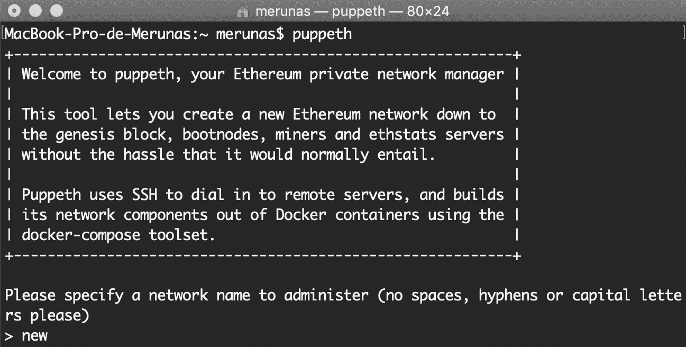

1.  它可能会要求您管理一个网络。在这种情况下，只需键入您想要创建的新网络的随机名称：

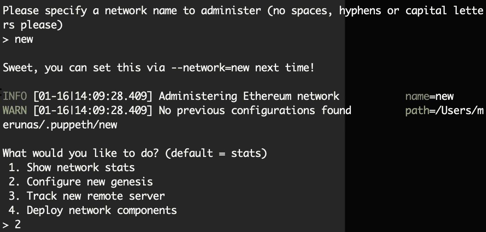

1.  然后，选择第二个选项创建一个新的`genesis`文件：

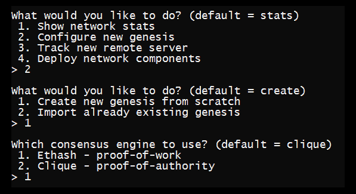

1.  从头开始创建一个新的`genesis`文件，并选择第一个共识引擎，`proof-of-work`。

1.  现在，它会问您哪些帐户应该被预先资助。在这里，您将粘贴之前使用`geth`命令生成新地址后复制的帐户地址：

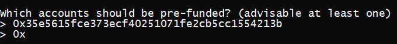

1.  然后，它会问您是否应该预先用`1 wei`资助预编译地址。回答`yes`。基本上，这是一堆将用于编译区块链的地址。之后，指定一个随机的网络 ID：在我的情况下，我选择了`77`作为 ID。以太坊主公共网络的 ID 为`1`，所以您必须选择一个不同的数字来区分您的区块链和他们的区块链。这很重要，以避免重放攻击，其中恶意用户可能会将一笔交易从一个区块链复制并在另一个区块链中执行以获取自己的利益。这个 ID 号码正是避免了这种漏洞：

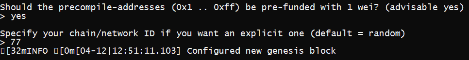

1.  您已配置并创建了将随时用于启动您自己的私有区块链的`genesis.json`文件。现在，您必须导出它以便能够使用它。要这样做，请选择已执行的`puppeth`命令的第二个选项——`管理现有创世配置`——然后选择`导出创世配置`：

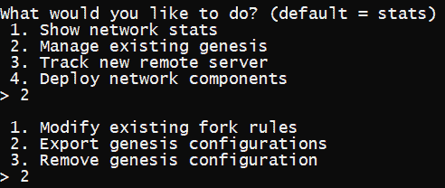

1.  然后，它会问您要将创世文件导出到哪里：

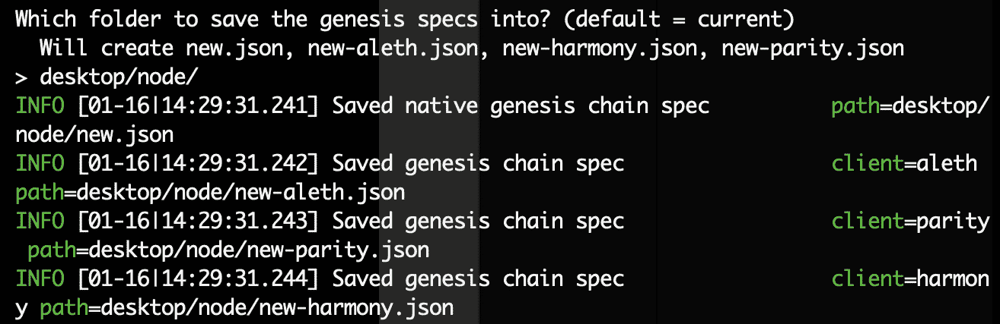

1.  您将在所选文件夹中看到您的文件。如果您没有选择一个，文件将被创建在您的用户文件夹中或者您的终端当前位置的任何地方。以下是您会找到的文件：

+   `genesis.json`：或者您为您的创世网络选择的任何名称。此文件包含我们之前看到的一般链规范。

+   `genesis-aleth.json`：这是用 C++编写的 Aleth 以太坊客户端的创世文件。Aleth 只是一个以太坊客户端，之前被称为 cpp-ethereum。

+   `genesis-harmony.json`：Harmony 是另一个独立的客户端，用 JavaScript 和 Java 编写。这是与其规范兼容的创世文件。

+   `genesis-parity.json`：Parity 是用 Rust 编写的著名的以太坊客户端。这是与 Parity 兼容的创世文件。

1.  太棒了！你现在已经为你的私有以太坊区块链导出了创世文件。要初始化你的区块链，请执行以下命令：

```
geth --datadir .ethereum/ init <your-genesis-file-location>.json
```

这将加载创世区块链状态并启动你的私有以太坊区块链。确保在你的以太坊地址前面添加`0x`前缀，如果你还没有这样做。记住，这个地址是你以前使用`geth`命令创建的。它会询问你账户密码，这是你创建时设置的。输入密码并按*Enter*解锁。如果你忘记了密码或账户，你需要返回使用`geth`命令创建一个新账户，并在询问时使用该地址创建一个新创世文件。

就是这样！你现在拥有一个具有自定义配置参数的工作私有以太坊区块链。这个私有区块链有趣的地方在于你可以将其连接到 Remix IDE。这将使你能够以极快的速度部署和测试合约。要能够将你的私有区块链连接到 remix IDE，你必须允许 remix 域在你允许域名列表中。只需执行此修改后的命令启动区块链：

```
geth --nodiscover --datadir .ethereum/ --unlock 0x<YOUR-ETHEREUM-ADDRESS> --mine --rpc --rpcapi eth,net,web3 --rpccorsdomain https://remix.ethereum.org
```

使用我的以太坊地址，看起来像这样：

```
geth --nodiscover --networkid 77 --datadir .ethereum/ --unlock 0xf30c37b1e5ed82eebd1a7cf4c66cb9497faa4799 --mine --rpc --rpcapi eth,net,web3 --rpccorsdomain https://remix.ethereum.org
```

现在，前往 [`remix.ethereum.org`](https://remix.ethereum.org)。注意，域名必须以`https`开头，并以 s 结尾以增加安全性。一旦到达那里，选择运行选项卡，并将环境更改为 Web3 提供程序：

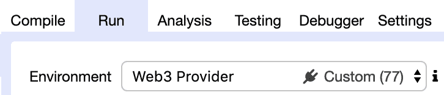

它会询问你是否确定要连接到以太坊节点。点击确定并再次点击确定，以确认 Web3 提供端点而不进行修改：

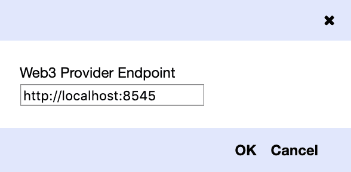

这样你就可以访问在你的私有以太坊实例上运行的帐户，以便你可以自由部署和测试智能合约。

# 在 Windows 上设置私有区块链

我决定忽略 Linux 和其他操作系统，因为事实上 Windows 和 Mac 是目前开发中使用最广泛的平台。因此，在这一部分，你将学习如何在 Windows 上创建一个私有区块链。步骤几乎相同，但需要进行一些微小的调整，以便清晰指导你如何构建这种自定义私有区块链。

你已经了解到构建一个私有以太坊区块链是有用的，因为可以加快开发时间，可以配置区块链以符合自己的偏好，快速的区块时间，并且可以获取所需的知识，随时启动自己的以太坊实例。通过以下步骤，你将学习如何在 Windows 上设置私有区块链，这是你需要掌握的用于更大项目的技能：

1.  第一步是下载 Geth。Geth 是主要的以太坊客户端，包含了运行自定义区块链所需的逻辑。你可以通过访问[geth.ethereum.org/downloads](http://geth.ethereum.org/downloads)来下载它：

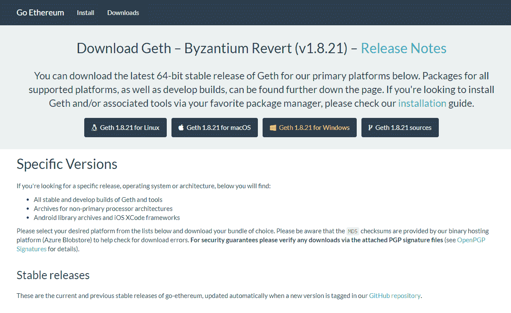

1.  点击 Geth for Windows 按钮开始下载。运行安装程序时，会询问是否要安装开发工具：

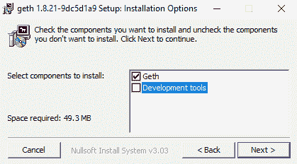

1.  一定要激活它。选择前述选项因为你将使用所需工具来设置你的自定义区块链。然后，只需点击下一步和安装完成安装。如果成功，你将能够在命令行或 Windows PowerShell 上运行`geth`，我推荐使用 Windows PowerShell，因为它包含了额外的命令并看起来更专业：

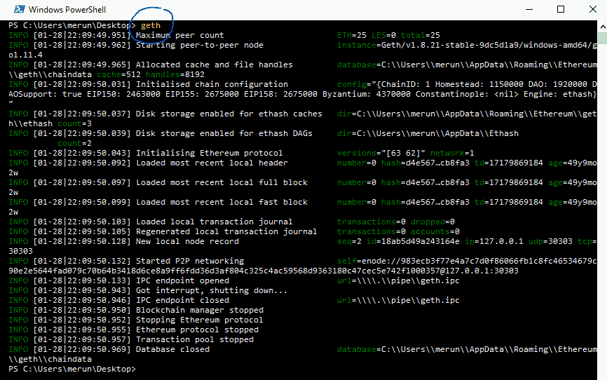

1.  如果你运行`geth`命令时无法执行*Ctrl + C*来避免从以太坊主网络上下载数百千兆字节的区块链数据。下一步与前一部分中所读到的几乎相同，但我们会再次介绍一遍以避免潜在的混乱。

1.  你现在需要在本地创建一个以太坊账户，稍后会用来为你的区块链使用。要执行此操作，请运行以下命令：

```
$ geth account new
```

1.  你需要两次输入密码，所以一定要记住它。之后运行`puppeth`命令：

```
$ puppeth
```

这会导致以下输出：

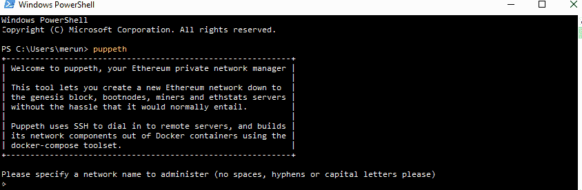

如果你无法执行`puppeth`或者在尝试时出现错误，那是因为你安装`geth`时没有安装它。请确保重新打开 Geth 安装程序，并在询问时勾选开发工具，因为那里才包括了`puppeth`。然后重新打开你的命令行或终端窗口查看变化。

1.  你会看到它要求你管理一个网络。创建一个随机名称，稍后用来识别你自己的自定义区块链。在我的例子中，我使用`merunas`作为网络名称。

1.  接着，它会要求你提供额外的指令。选择第二个选项 – `配置新的创世块` – 因为我们需要创建一个创世文件，这是它的第一个区块：

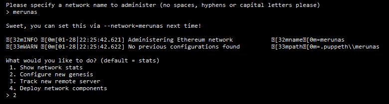

1.  然后选择第一个选项：`从零开始创建新的创世`。它会要求你选择要使用的共识引擎。在这种情况下，我决定使用`Ethash`，因为它是真实 Mainnet 使用的那一种，尽管`Clique`也是一个用于实验`权威证明`的好选择：

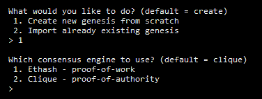

1.  接下来，你需要提供你刚刚创建的 Geth 账户，因为它需要一个预充值账户用于初始化。只需复制并粘贴你收到的地址。如果你忘记了，打开另一个终端，输入`geth account new`来生成一个新账户后继续。

1.  然后，它会问你是否应该为预编译地址预充 1 wei。说`no`因为你不需要这些账户，它们会在你的创世块文件中填充不必要的配置。最后，为你刚刚设置的区块链指定一个网络 ID。我建议使用一个大于 10 的数字，因为较低的数字已被主网络和测试网络使用，所以你需要使用一个唯一的标识符以避免重放攻击：

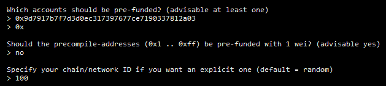

1.  恭喜！你刚刚配置了你的创世区块文件，这是你自己私有以太坊区块链的基石。现在，你需要导出它。通过选择第二个选项- `管理现有创世块` - 然后再选择第二个选项：`导出创世块配置`：

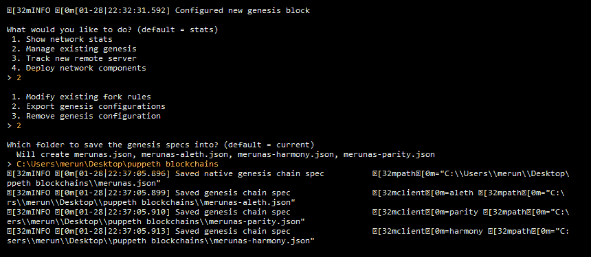

1.  现在，你应该把配置文件放在选定的文件夹中。要在 Geth 上加载你的自定义区块链，使用这个命令和你刚刚导出的自定义初始区块文件位置：

```
$ geth init <your-genesis-file-location>.json 
```

例如，在我的情况下，如下所示：

```
$ geth init 'C:\Users\merun\Desktop\puppeth blockchains\merunas.json'
```

我使用了引号，这样我就可以在文件夹名称之间包含空格，因为我创建的文件夹叫做`puppeth blockchains`，当我在没有引号的情况下运行命令时，会出错：

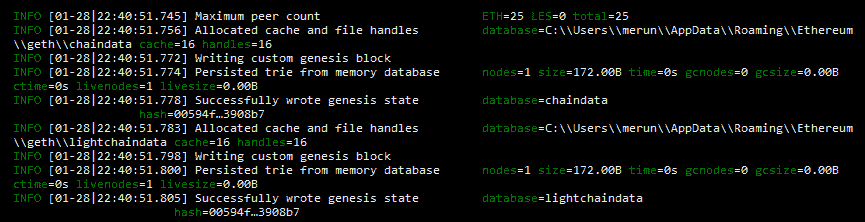

1.  如果出现错误，提示`Failed to write genesis block: database already contains an incompatible genesis block`，只需执行以下操作：

```
$ geth removedb
```

当你运行`geth removedb`时，你正在删除已下载的区块链，解决了不兼容创世区块的问题。这主要是因为你在某个时候开始下载区块链时使用了一个创世文件，而你决定在某个时候使用不同的创世文件导致的。这是无效的，因为配置永久存储在第一个区块中，也就是创世区块中。在挖掘创世区块后，你无法更改区块链设置而不先删除之前的区块链。

1.  最后，执行以下命令来运行你的区块链：

```
$ geth --networkid 100 --unlock 0x<YOUR-ETHEREUM-ADDRESS> --mine 
```

1.  它会要求你输入你账户的密码。输入密码后，你会看到区块链准备好挖矿了。现在，你可以将它用于任何你想要的项目，包括像之前看到的那样连接到 Remix IDE。你可以使用完全相同的命令来做到这一点：

```
$ geth --nodiscover --networkid 77 --datadir .ethereum/ --unlock 0xf30c37b1e5ed82eebd1a7cf4c66cb9497faa4799 --mine --rpc --rpcapi eth,net,web3 --rpccorsdomain https://remix.ethereum.org
```

现在，你可以在 Remix IDE 上连接节点，这样你就可以在你自己的区块链上部署你的合约了。

# 选择一个以太坊钱包

以太坊钱包有多种选择，从软件钱包到硬件甚至纸质钱包，如果你不了解它们之间的区别，那么选择最适合你需求的最好的钱包会变得越来越困难。因此，在这一部分中，我们将探讨钱包的各种选择，以便您为每个项目选择最佳的钱包。

# 理解以太坊钱包的概念

看起来很直观——一个钱包是你存储加密货币的地方——但实际上，钱包比它们看起来复杂得多。钱包连接到以太坊区块链，以查找您最新的余额，通过智能合约、dApps 或者通过区块链客户端本身访问。以太坊客户端下载整个链数据，它们能够搜索与您的账户相关的交易。其中一些将是转账，而其他可能是智能合约执行，您需要支付燃气。最后，只需读取最新区块中包含的与您地址相关的交易，就可以获得您当前的余额，如下图所示，余额在几次交易后被更新：

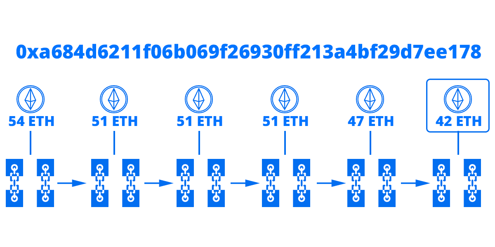

由于安全性在处理资金时是一个很大的问题，钱包必须保护您的凭证可能被使用的每一个脆弱区域。您的私钥、种子和地址不应该被任何人轻易访问。这就是为什么有不同的钱包实现。它们可以是在线的或离线的，您可以进一步使用专门用于存储加密货币的离线硬件钱包。

# 解释在线钱包

这些钱包只有在您有互联网连接时才能访问，因为它们是基于网络的，允许您在几乎任何地方与您的钱包进行交互，只要您是连接的。请注意，它们并不总是在他们的服务器上保存你的私钥：有些是，但大多数要求你每次想要访问你的钱包时都提供你的私钥。让我们看一些例子来了解它们是如何工作的。

# 选择 MyEtherWallet

MyEtherWallet 是最流行的以太坊钱包应用程序，您可以用它来访问您的钱包。每当您想要登录时，它会要求您提供您的私钥；因为它不会在线存储您的凭证，它只是一个与您的资金进行交互的平台：

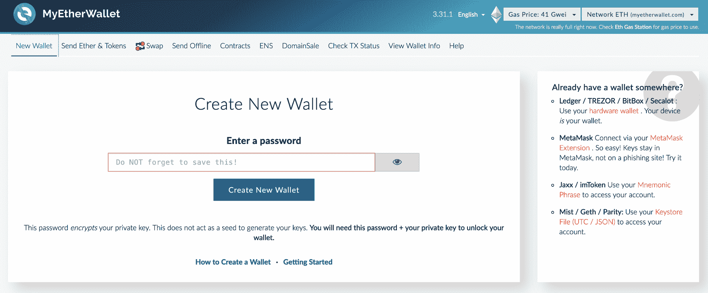

当你打开[myetherwallet.com](http://myetherwallet.com)时，你会看到一个清晰的框，指示你可以创建一个新的钱包。如果你已经有一个，只需点击**发送以太币和代币**选项卡，它将要求你以不同的格式选项上传你的私钥。

如果您还没有钱包，点击 **创建新钱包** 来生成一个新帐户并输入密码。然后，它会要求您保存您的私钥并将其存储在安全的地方。请记住，您的私钥是您的钱包的主要元素：如果您丢失它，您将无法访问它，您的资金将永远丢失。

# 使用 MetaMask

**MetaMask** 是另一个著名的钱包，主要用作中介钱包，人们将以太币发送到其中以与去中心化应用和智能合约进行交互。MetaMask 在后端使用 INFURA，因此与区块链的连接是即时的，您不必下载数百个区块。

这个钱包的有趣之处在于它会将 `web3.js` 注入到您正在检查的任何页面中，这意味着只要您已经登录了 MetaMask，您就可以使用任何 dApp：

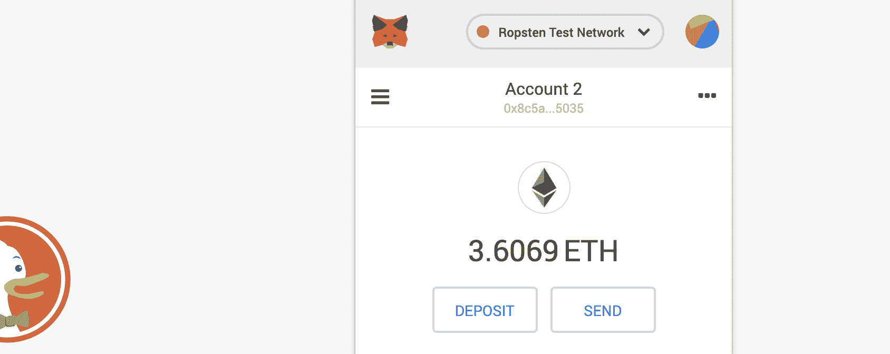

每当您想通过在去中心化应用上进行交易与区块链进行交互时，MetaMask 将会打开一个弹出窗口，询问您需要花费多少钱，包括燃气价格。然后，您就可以直接从浏览器中进行交易。

关于这个钱包的另一个好处是您可以随时通过几次点击更改您的区块链网络。这对开发者来说非常棒，因为您可以将您的智能合约部署到 Ropsten，然后再到 Mainnet，如果一切看起来都正确。总的来说，这是一个非常适合开发者和用户的出色钱包，他们都想与去中心化应用进行交互，包括 ICO。

# 理解硬件钱包

这些是将您的资金离线保存在一个小设备中的钱包，该设备安全地存储您的加密货币。关于这些设备的有趣之处在于它们不使用您的私钥进行交互；它们有一个系统可以在不将您的私钥置于风险的情况下将您登录到钱包中，因为它们将私钥存储在内部并进行了加密以增加安全性。

最受欢迎的是 Ledger 和 Trezor。这些公司制造了不同的设备，您可以使用种子设置，然后与您的加密货币一起使用，只要它们工作。请注意，它们与打印的私钥一样好，这意味着没有人会在线上访问它们，如果您不丢失它们，它们将保护您的资金安全。把它们看作是钥匙。如果它们损坏或者丢失了，您将永远丢失您的资金。这就是为什么我总是建议您购买几个相同的设备副本，三个或更多个具有相同的私钥和种子，这样即使其中一个损坏，您也可以访问相同的钱包。

# 使用 Ledger

**Ledger** 和流行的 Ledger Nano 看起来像传统的 U 盘，上面有一个 OLED 屏幕和两个按钮：

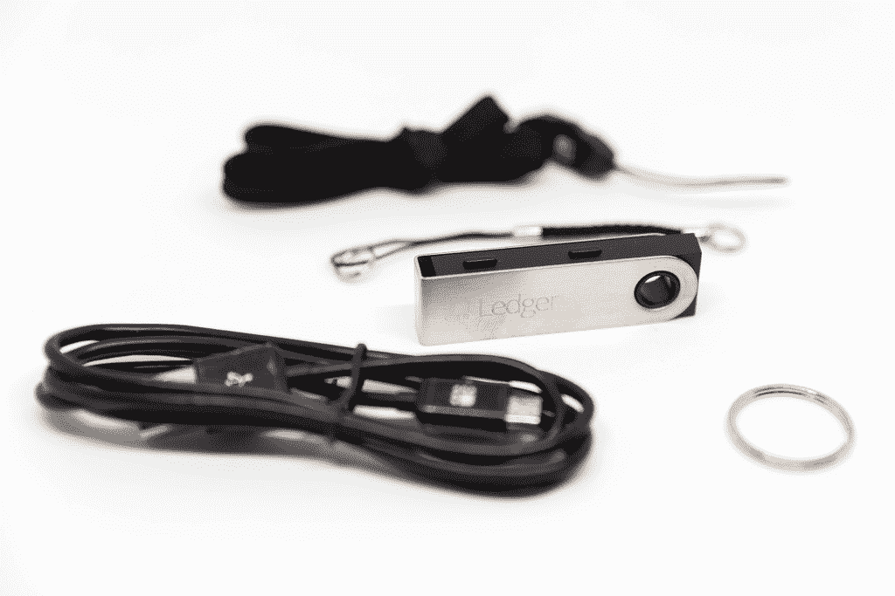

您可以通过 USB 线连接它到您的计算机，并打开一个定制的钱包应用程序来使用它。您可以使用 MetaMask 和 MyEtherWallet 等应用程序与此硬件设备一起使用。它通过使用一个 4 位数字 PIN 和一个密码（如果您在创建钱包时设置了密码）来安全地保存您的资金，就像信用卡一样。您可以存储成千上万种不同的加密货币，包括以太币，这些加密货币将保存在同一设备中。

# 使用 Trezor

**Trezor** 是另一款流行的硬件钱包，具有独特的扁平设计，同样配有两个按钮和一个高品质的黑白显示屏。此设备包装密封，必须完全破损才能访问钱包，以确保在您第一次拿到它之前没有人触摸您的 Trezor，因为一个黑客使用后可能会造成巨大的损害。

您还会收到几张小块的硬纸板，用于写下您的独特种子，以便在您无法访问钱包时恢复您的账户。确保不要丢失这些纸钱包，因为它们在 Trezor 固件更新时将会被要求：

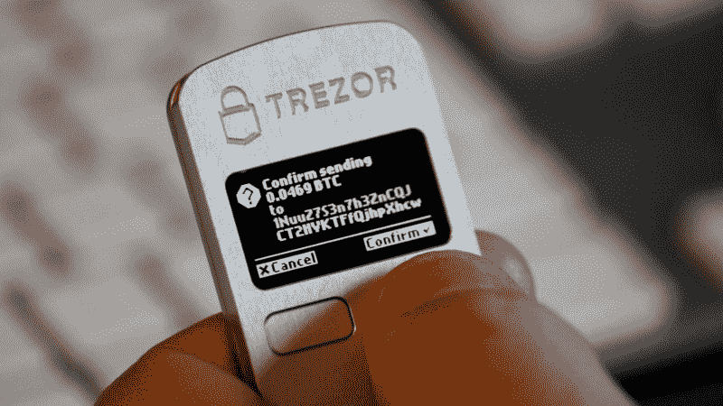

两个按钮用于在您检查到它们与您计算机上显示的内容相符后确认交易。这是一个额外的安全层，以防止人们将资金发送到错误的地址。它还支持数百种加密货币，并具有与 Ledger Nano 相同的安全功能。最终，这取决于个人偏好，因为大多数这些硬件钱包的功能方式相同，并且足够安全。

# 学习使用多重签名钱包

多重签名钱包是一种特殊类型的钱包，因为它们实际上是实现了多重签名功能的智能合约，使得一组成员在他们都同意结果时可以签署交易。与这些钱包交互的唯一方式是直接使用智能合约或通过 Parity 应用程序，因为 Parity 创建了所有应用中最大的多重签名钱包。

要与此类钱包交互，只需打开 Parity 的 Web 界面，并从账户部分使用参与其中的成员的地址部署一个新的多重签名钱包。这些钱包的工作方式是，每个成员都可以提出一个提案，将特定金额的以太币从钱包转移到给定地址。如果他们都同意，资金将被转移；否则，转账将被取消。这是一种简单的方式，让加密货币初创企业将资金保留在一个团队基金中。

您刚刚获得了所有可用以太坊钱包类型的高级概述。现在，您可以选择符合您要求的钱包，并且可以开始安全地存储 ETH，以确保您需要。请记住，只要能让您访问自己的资金的钱包就是好的，所以请确保选择一个没有限制您访问权限并且多年来已经证明安全的钱包。

# 使用 Etherscan 进行交易

Etherscan 和所有其他区块浏览器一样，在您需要深入了解智能合约如何在更深层次上运行时，提供大量有价值的信息。了解如何使用 Etherscan 等区块浏览器是一项宝贵的技能，任何以太坊开发人员都需要能够调试和理解区块链交易的真实世界事件。

# 理解区块浏览器

区块浏览器是一种特定类型的应用程序，通过搜索可能与用户相关的特定信息，与区块链进行交互。它们是用于理解代码背后发生的事情的区块链机器人。它们被创建是因为人们想要一种更简单的方法来理解交易的发生，因为大多数交易都是混乱的，当您得到的只是十六进制信息时，很难发现重要的信息。

最受欢迎的是 Etherscan、Etherchain 和 Ethplorer。所有这些区块浏览器都是基于 Web 的，因此您可以轻松从任何连接到互联网的设备上使用它们。

# 使用 Etherscan 分析交易

**Etherscan**是迄今为止最大的区块浏览器，因为它提供了简洁清晰的界面，用于与您的交易进行交互。Etherscan 主要是一个地方，可以查看您部署后的交易实际在做什么。例如，当您将 10 ETH 发送到另一个地址时，您不知道是否成功，或者使用的地址是否有错误。Etherscan 将准确地显示发生了什么以及原因：

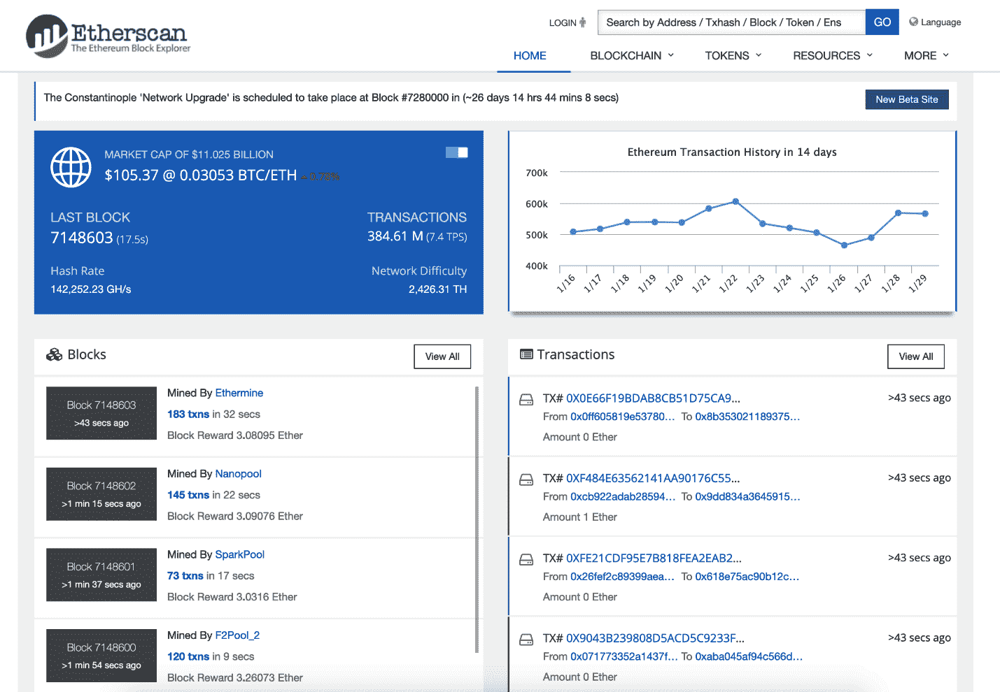

假设有人因为能够访问您的以太坊账户而偷了您 1 个 ETH。您如何跟踪这样的信息？那么，您可以将您的以太坊地址粘贴到 Etherscan 的搜索框中，然后查看它去了哪里：

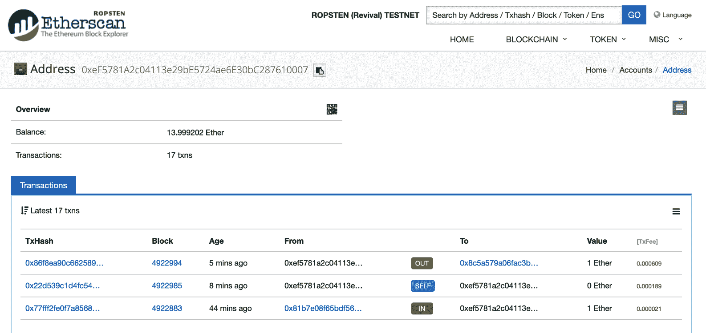

只需单击 TxHash 即可查看有关特定交易的详细信息，您将看到以下内容：

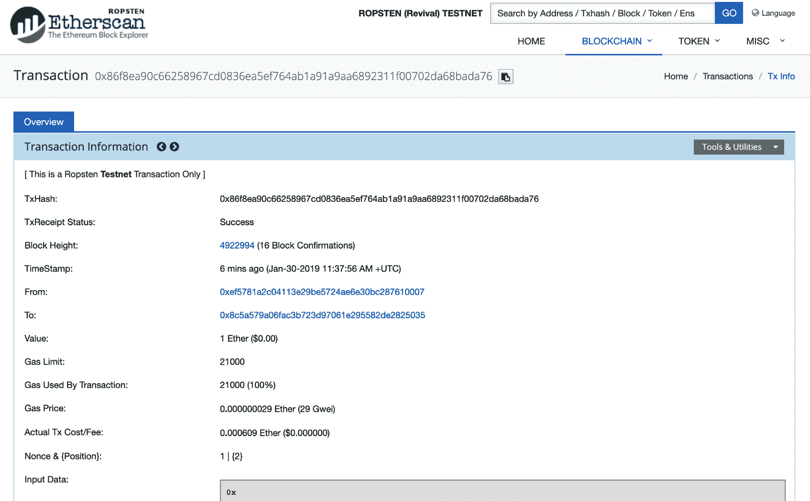

这告诉您以下内容：

+   交易成功了

+   这是一个简单的将 1 个以太币转移到地址 0x8c5a579a06fac3b723d97061e295582de2825035 的转账，来自你自己的地址

+   它是在 2019 年 1 月 30 日制作的

有了这些信息，你可以开始研究谁在那个地址背后，如果情况是这样的话，你可能找到谁偷了你的资金。在输入数据部分，你会看到被执行的代码，如果这是一个合同交易的话。你还可以使用 Etherscan 来检查代币、智能合约、图表等等，因为他们致力于为你提供有关区块链交易的最佳信息。

你还可以使用 web3.js 和 Truffle 合同创建自己的区块链浏览器！

现在你知道区块浏览器对以太坊开发人员来说是很棒的工具，因为它们以简单易懂的格式为你提供了宝贵的信息，这在处理数十万美元的永久主网交易时至关重要。

# 创建账户

账户是每个以太坊应用程序的主要组成部分。如果你想参与网络，你需要一个带有私钥和地址的以太坊账户。你可以通过许多方式创建以太坊账户，所以最好熟悉不同的工具，这样你就可以熟练地进行账户创建的过程：你将需要为你构建的所有项目创建账户。

# 使用 MetaMask 创建账户

正如你已经知道的，MetaMask 是最流行的以太坊钱包之一。它允许你为不同的以太坊链创建无限的账户，没有限制，使用相同的种子单词。以下是使用它创建账户的方法：

1.  首先，通过访问[metamask.io](http://MetaMask.io)在 Chrome 或 Firefox 上下载 MetaMask：

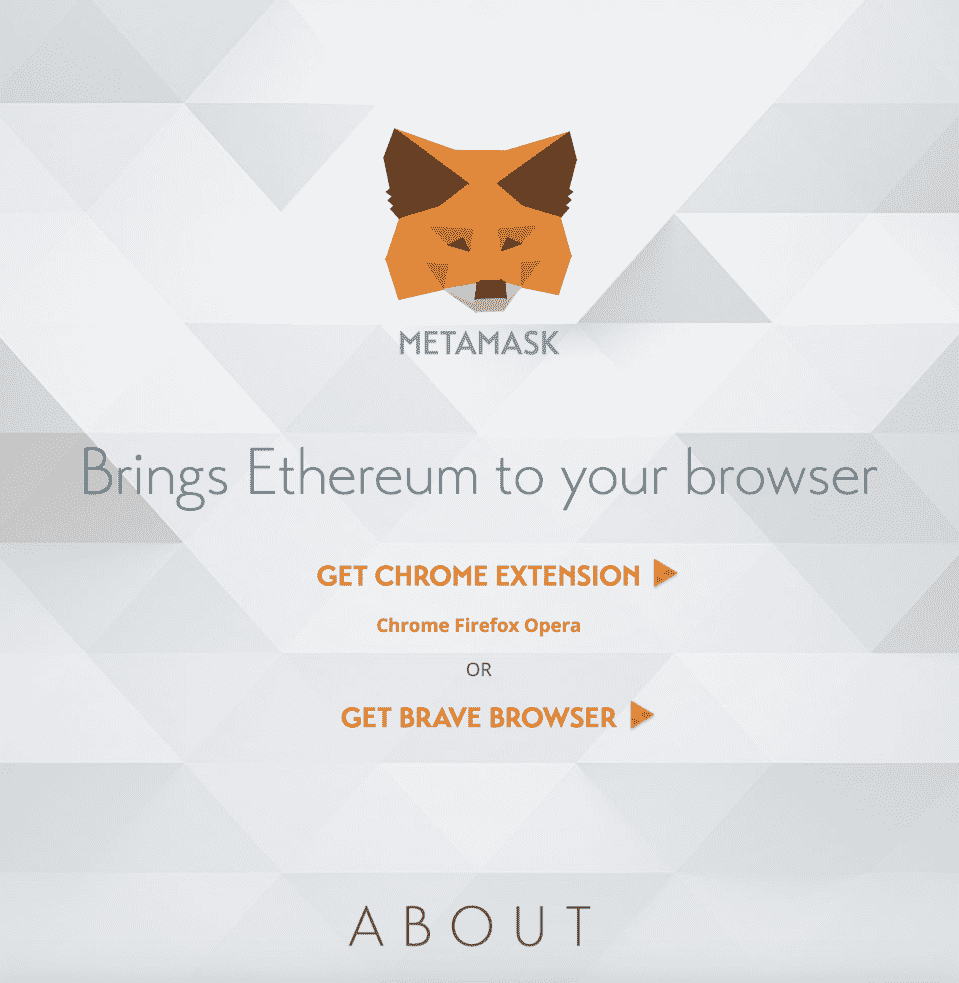

1.  然后，你可以点击刚刚安装的狐狸图标来启动 MetaMask，它将打开这个页面：

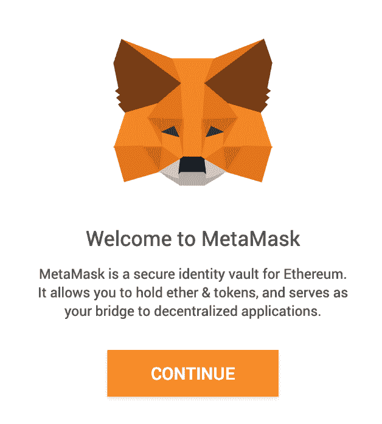

1.  点击“继续”并为你的钱包设置密码，然后向下滚动以接受使用条款：

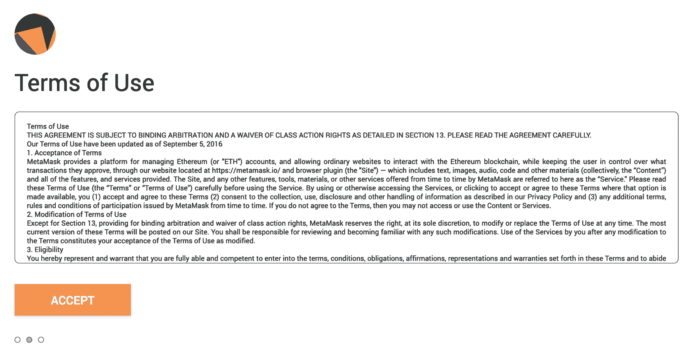

1.  之后，它会向你显示不同的窗口，警告你使用像这样的测试软件的风险，并告诉你除非你完全确信这个过程，否则绝对不要将恢复种子提供给它们。然后，你需要点击并将你的种子短语存储在一个安全的地方。这是一组独特的单词，将帮助你恢复账户，如果你丢失了它。这是你的主要私钥，绝对不能丢失，否则你的钱包将无法访问：

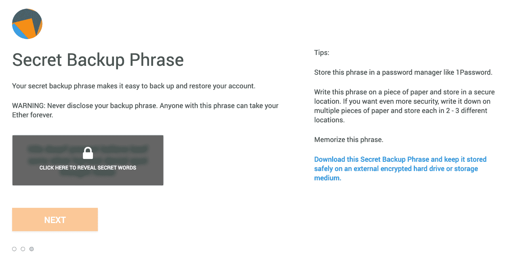

1.  最后，它会提示你使用 Coinbase 或 ShapeShift，或者直接存入以太币：

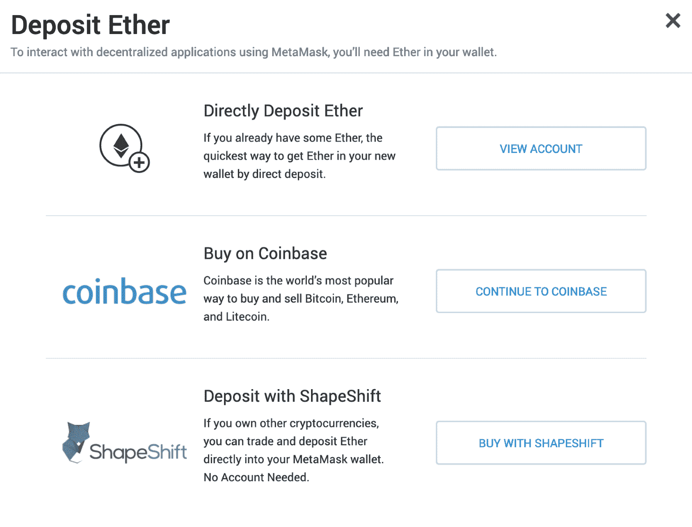

1.  你可以简单地忽略这一点，并稍后添加资金。就是这样——现在你应该能够通过点击扩展栏上的小橙色狐狸来使用 MetaMask：

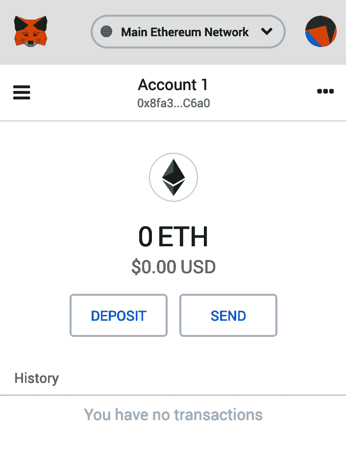

# 使用 Coinbase 创建账户

现在您已经了解了如何创建自己的私人钱包，让我们创建一个托管在交易所中的钱包，例如 Coinbase，在这里您可以直接购买和出售加密货币。请注意，这些类型的钱包不安全，因为交易所保留您的私钥和种子短语，因此您无法完全控制您的钱包，也无法自行保护它。

这种类型的钱包的一个优点是，您几乎可以立即将您的加密货币兑换为货币，而无需等待转账。这对于需要快速访问其资金的交易者非常理想。这样做的主要问题是缺乏控制，因为您提供给他们您的密钥，并且您依赖于他们保持其安全——这并不总是事实。始终查看交易所的历史记录，以查看它们是否值得信任，或者您的资金是否有可能被可能的黑客攻击所威胁。

**Coinbase** 是最大的加密货币交易所，因其提供的简便性而受到欢迎，您可以使用银行或信用卡将法定货币兑换为加密货币。在以下步骤中，您将了解如何创建一个与 Coinbase 关联的以太坊账户：

1.  首先，打开他们的网站 [coinbase.com](http://coinbase.com)：

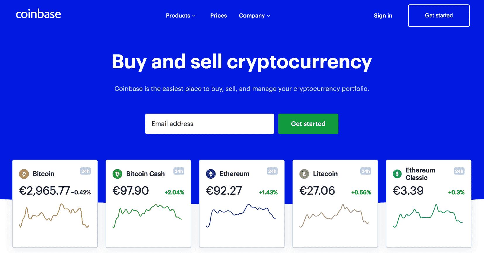

1.  在那个大输入框中键入您的电子邮件地址，然后单击“开始”以创建新的 Coinbase 账户。然后，它会要求您提供更多所需的详细信息，以便您可以开始：

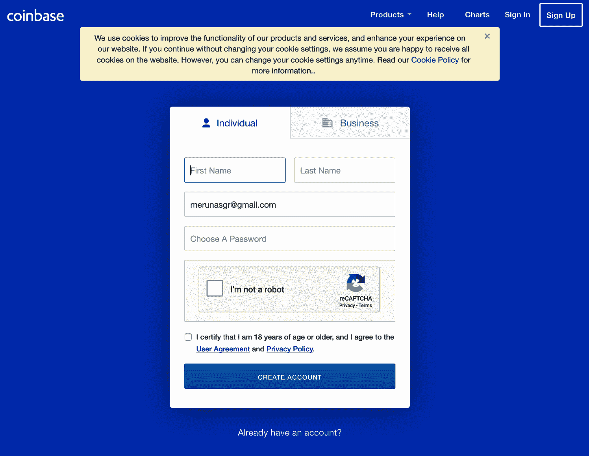

1.  随后，它会向您显示一些有关法律问题和警告的信息：

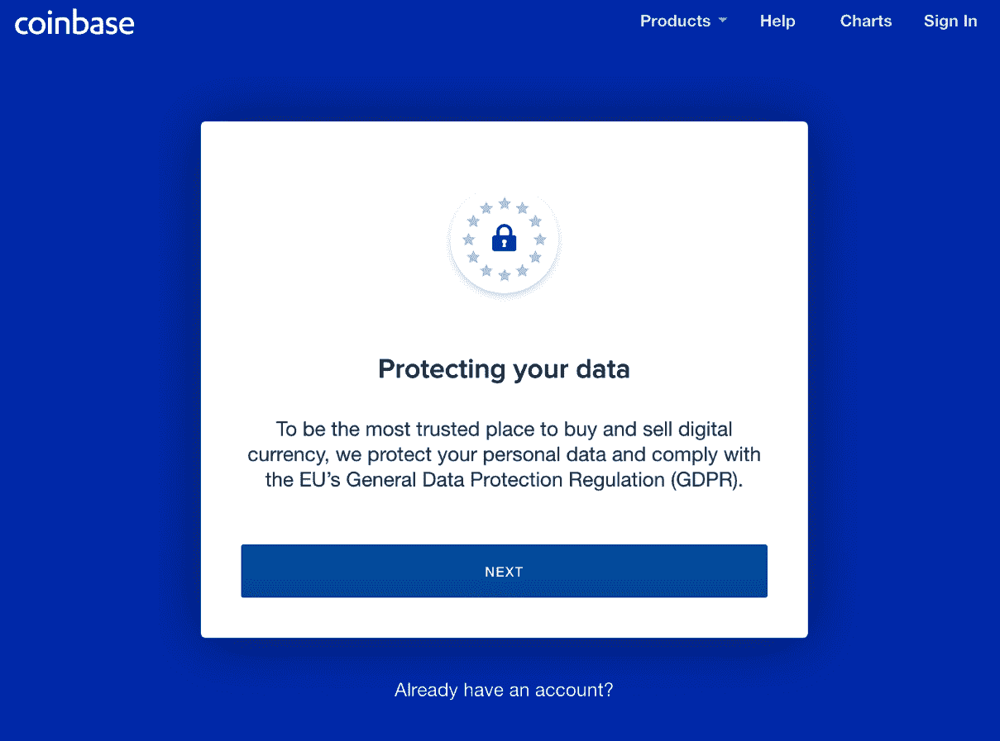

1.  然后，您将不得不检查您的电子邮件以确认您的地址：

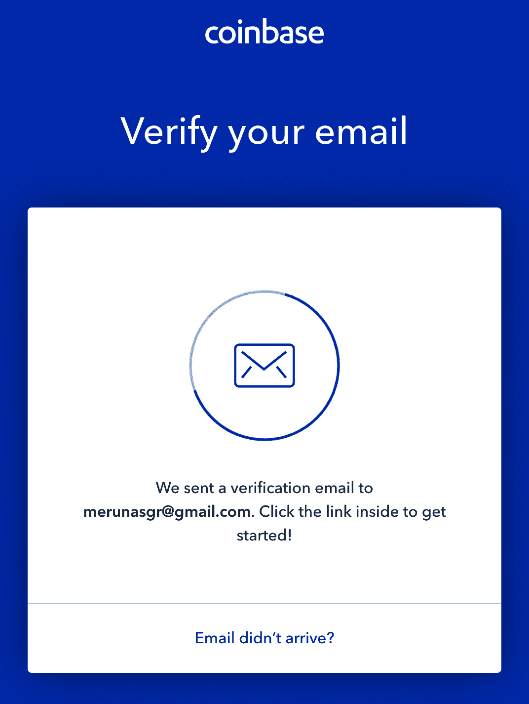

1.  确认您的电子邮件地址和登录后，您将被要求添加您的电话号码以进行安全措施，因为此类账户处理大量资金，他们希望拥有最大数量的安全点：

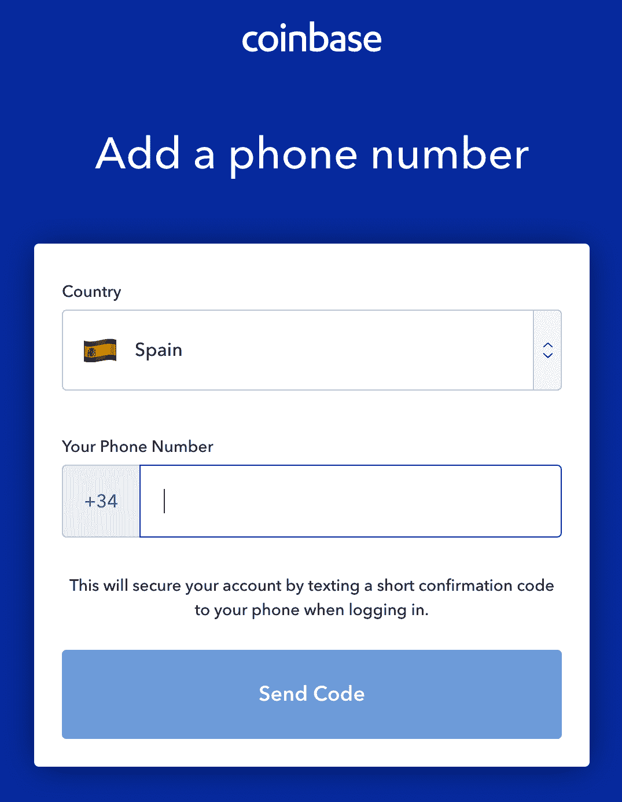

1.  他们将向您发送一条消息，请务必使用有效的号码。之后，您将被要求提供个人信息，例如您的居住地、职业和身份证号码。只需填写所有框：

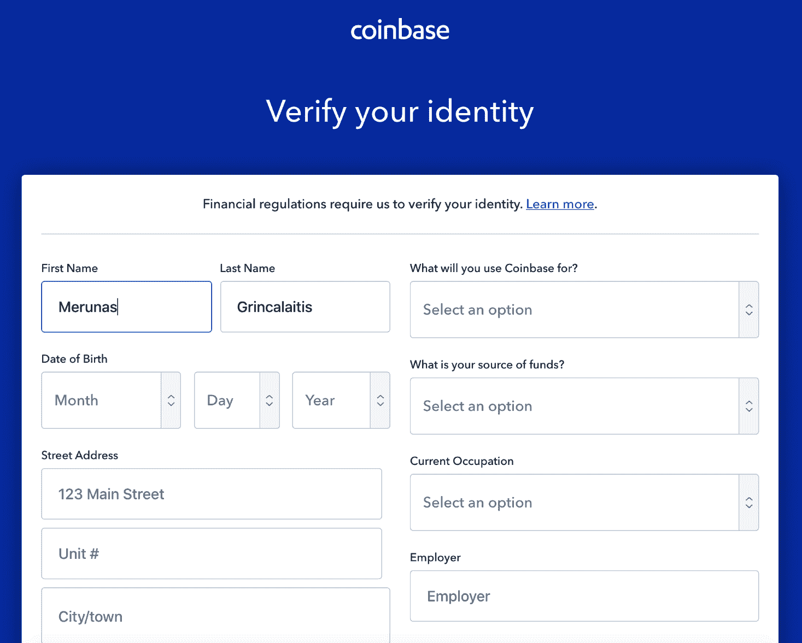

1.  提供有效数据非常重要，因为他们会检查所有内容，并使用该信息帮助您安全交易。之后，您将被要求通过护照或驾驶执照的照片验证您的身份；您必须这样做才能在此进行交易。这很烦人，但法律要求，因为他们正在与银行打交道，他们不想留下漏洞：

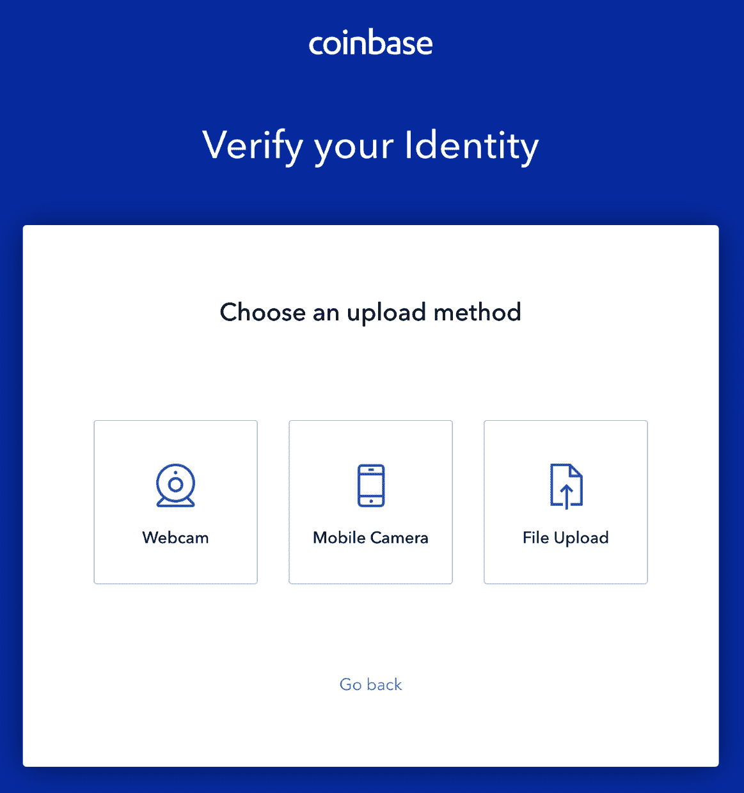

1.  如果这不起作用，请稍后再试，直到您获得访问权限。最后，在完成所有文件并再次登录后，您将能够在“账户”选项卡中交易并查看您的账户：

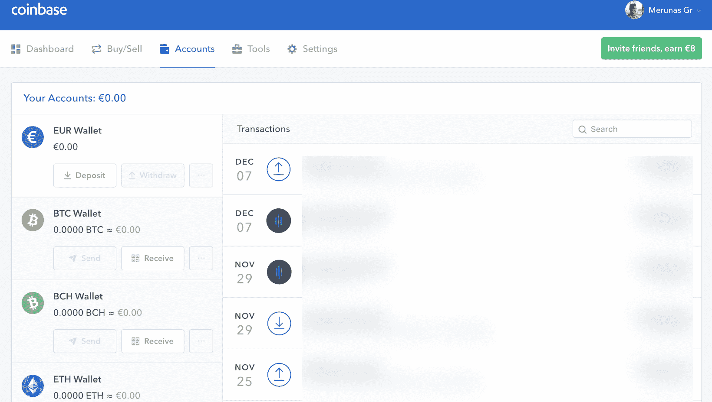

经过这些步骤，您应该能够访问一个功能齐全的基于 web 的钱包，该钱包与 Coinbase 相关联，接受许多不同的加密货币和法定货币。一旦添加了您的银行账户详细信息，您应该能够购买加密货币。

# 摘要

在本章中，您学习了如何为不同钱包创建以太坊账户，其中一些是私人的，而其他一些是托管在交易所中，以便简化获取新加密货币的流程。您了解了它们之间的区别以及它们的用途。您现在知道 MetaMask 很适合与 dApps 交互并安全存储您的资金，而 Coinbase 很适合使用法定货币立即进行交易和交换加密货币，等等。

在下一章中，您将更多了解 dApps 及如何使用高级技巧全速运行它们，这些技巧您可以立即实施，以创建更强大的应用程序，以便在未来进行扩展。
