# 精通智能合约

在本章中，您将被带上一段旅程，穿越几个有趣的框架，以设计安全、可扩展和快速的智能合约，这些智能合约被优化以减少Gas，从而使人们不必为每笔交易支付太多以太币。我们将创建一个**版权市场智能合约**，该合约存储人们为其内容创建的许可证，这些内容由唯一的ID标识，并且全部存储在区块链上。然后，您将深入探讨EVM，以了解在部署和与智能合约交互时，它在后台实际运行的方式。接下来，我们将讨论下一代可升级和可扩展的智能合约。最后，我们将涵盖Gas和数据高效的智能合约以及安全分析。在本章中，我们将涵盖以下主题：

+   适应速度

+   深入了解EVM

+   可升级和可扩展的智能合约

+   Gas和数据高效的智能合约

+   智能合约安全分析

# 适应速度

如果你想要成为智能合约方面的专家，你必须从一个简单的项目开始，以更新你的技能。我们将创建一个版权市场智能合约，将合法文件上传到区块链，以确保某些内容受版权法保护，不能被复制。言归正传，让我们开始吧！

# 规划市场构想

这里是版权法的简单工作方式：

1.  你要注册一篇内容，可能是文件、文本、图片、视频或者你自己制作的任何一种创作，通过一个唯一的标识符公开注册，这样其他人可以确认你的权威性。

1.  无论出于什么原因，想要使用你的内容的人都必须咨询您的版权条款并遵守它们，以避免法律问题，因为我们不希望人们为了自己的利益而窃取你的作品。

版权注册不应该被修改，所以我们会避免创建允许人们修改其版权数据的功能；因此，我们只允许他们添加或删除版权。

我们需要一个生存在区块链上的智能合约，人们可以轻松访问。该合约将具有以下功能来管理版权注册：

+   一个根据哈希值创建新的带有唯一标识符的版权内容的函数。在这种情况下，我们只想限制版权内容为文本，因为在区块链上上传其他类型的内容是昂贵的。该函数将接收内容所有者的地址、姓名、电子邮件地址、内容的哈希ID、包含要注册的文章或文档的URL，以及他人在使用该特定内容时必须遵守的使用条款。

+   一个根据哈希值获取内容的函数。

+   一个用于删除版权内容的函数，如果你是所有者。

+   一个用于提取锁定在此智能合约中的资金的函数。经常发生的情况是，人们将以太发送到错误的地址，最终进入了这样的智能合约。如果出现这种情况，我们希望能够提取被锁定的资金，以免永远丢失。如果这种情况发生，它也可以用作显示对完成工作的感激的捐赠地址。

# Solidity代码设计

在这个项目中，我们将使用Truffle来部署和运行我们的智能合约。当处理更大型的项目时，始终值得在设置诸如Truffle之类的框架和所有必需的依赖项时投入初始工作，因为这样可以节省我们大量的时间，同时提高开发体验。以下是使用Truffle设置项目的步骤，因为这是我们在本书中首次提到它。稍后，我们将假设您知道如何在Truffle中设置项目，尽管在需要时我们会提醒您很多次：

1.  让我们立即开始创建一个名为`copyright`的新文件夹**：**


1.  在该文件夹内，运行`truffle init`命令。如果您还没有Truffle，请使用`npm i -g truffle`或`sudo npm i -g truffle`安装它。您可以通过从他们的网站[nodejs.org](http://nodejs.org)安装Node.js来获取`npm`。下面的截图显示了这个过程：

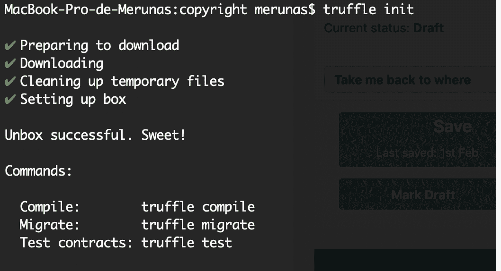

1.  然后，您可以使用您喜欢的代码编辑器打开项目，我使用的是Atom：

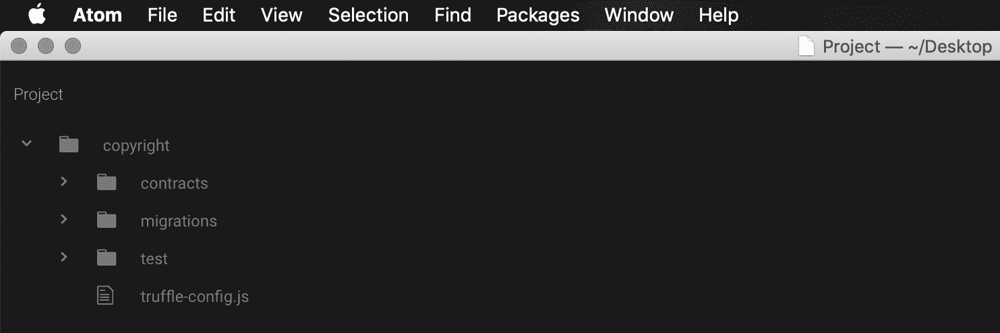

1.  在`contracts`目录下创建一个名为`Copyright.sol`的新文件。创建每个Solidity智能合约的基本代码结构：

```
pragma solidity 0.5.0;
contract Copyright {}
```

每个智能合约的顺序很简单。首先，我们定义事件、变量、修饰符、回退函数、构造函数，最后是函数。所以，让我们定义我们的事件：

```
pragma solidity 0.5.0;
contract Copyright {
    // Create the events
    event RegisteredContent(uint256 counter, bytes32 indexed hashId, string indexed contentUrl, address indexed owner, uint256 timestamp, string email, string termsOfUse);
}
```

此事件记录了`counter`、`hashId`、`contentUrl`、所有者的地址、时间戳、电子邮件和该内容的使用条款。现在我们可以定义包含这些变量的`struct`。我们的目标是以尽可能易于访问的方式存储信息，因此使用结构体是以映射方式组织受版权内容的最佳方式：

```
pragma solidity 0.5.0;
contract Copyright {
    // Create the events
    event RegisteredContent(uint256 counter, bytes32 indexed hashId, string indexed contentUrl, address indexed owner, uint256 timestamp, string email, string termsOfUse);

    // Create the variables that we'll use
    struct Content {
        uint256 counter;
        bytes32 hashId; // The half keccak256 hash since we can't store the entire 64 bit hash
        string contentUrl;
        address owner;
        uint256 timestamp;
        string email; // We need a valid email to contact the owner of the content
        string termsOfUse;
    }
    mapping(bytes32 => Content) public copyrightsById;
    uint256 public counter = 0;
    address payable public owner; }
```

映射将把每个哈希与存储了有关受版权内容的所有相关信息的内容对象相关联。以下是结构体中每个成员的原因：

+   `counter`：我们需要一种简单的方法来跟踪添加到区块链上的受版权元素的数量，因为它为我们提供了一种使用事件注册表查找最新内容的简单方法。

+   `hashId`：我们将与此对象关联的文本内容的`keccak256`字符串。因为我们不能将字符串用作映射的键，所以我们必须使用`bytes32`类型的变量。这导致了我们无法存储整个`keccack256`字符串的问题，因为它有64个字符长，而`bytes32`变量限制为32个十六进制字符。为了克服这个限制，我们将做的是将结果哈希值截断一半，仅存储前半部分，即正好32个字节。这显着降低了哈希安全性，但考虑到我们不会生成天文数字般的高版权元素，这已经足够了。

+   `contentUrl`：包含原始文档的 Web URL，用于版权登记。

+   `owner`：内容所有者的地址，这对确保个人财产至关重要。

+   `timestamp`：内容版权的固定时间戳。非常适合设置到期日期以使过时元素失效。

+   `email`：有效的电子邮件，提供给用户一个简单的联系方式，以联系特定内容的所有者。

+   `termsOfUse`：简短的文本，解释了如何处理内容：外部个人可以做什么，何时可以使用等等。

如果您希望创建不同类型的版权注册市场，可以向`struct`中添加自己的元素。这取决于个人偏好。最后，我添加了一个`owner`变量，我们稍后将用于提取可能被锁定在合同中的资金。现在，我们可以继续进行功能：

```
// To setup the owner of the contract
constructor() public {
   owner = msg.sender;
}

// To add new content to copyright the blockchain
function addContent(bytes32 _hashId, string memory _contentUrl, string memory _email, string memory _termsOfUse) public {
   // Check that the most important values are not empty
   require(_hashId != 0 && bytes(_contentUrl).length != 0 && bytes(_contentUrl).length != 0 && bytes(_email).length != 0);

   counter += 1;
   Content memory newContent = Content(counter, _hashId, _contentUrl, msg.sender, now, _email, _termsOfUse);
   copyrightsById[_hashId] = newContent;
   emit RegisteredContent(counter, _hashId, _contentUrl, msg.sender, now, _email, _termsOfUse);
}
```

`constructor`变量将用于设置所有者地址。`addContent`函数需要四个参数，而不是结构所需的七个，因为我们可以动态生成其他参数。这对于简化事务并帮助人们更轻松地上传其版权非常重要。首先，它检查是否设置了最重要的参数，因为无论如何我们都需要它们。这意味着使用条款是可选的，简单地因为人们可以选择不限制其内容的使用，这意味着使用其所有权的开放内容。

我们生成`newContent`对象，增加计数器，并将该内容添加到`copyrightsById`映射中，最后发出注册事件。这是最重要的功能，必须尽快进行优化，以避免达到气体限制。

注意，我们不需要一个根据哈希获取内容的函数，因为`copyrightsById`映射是`public`的，因此它会自动为检索每个结构元素创建一个getter函数。

让我们继续完成删除版权和提取资金的功能：

```
// To delete something if you're the owner
function deleteCopyrightedByHash(bytes32 _hashId) public {
    if(copyrightsById[_hashId].owner == msg.sender) {
        delete copyrightsById[_hashId];
    }
}

// To extract the funds locked in this smart contract
function extractFunds() public {
    owner.transfer(address(this).balance);
}
```

`deleteCopyrightedByHash`函数获取现有版权的一半`keccak256`哈希，并在您是特定内容的所有者时将其删除。`extractFunds`函数是一个可选函数，我喜欢添加这个函数，因为我通常看到智能合约中包含了以太币，这是由于某人不小心将真钱发送到合约地址，所以它一直停留在那里。此函数使提取资金成为可能，以便如果发生这种情况，您可以检索资金。

这就是整个合同！您可以使用`truffle compile`来编译它。

您可以在我的GitHub上查看更新后的代码：[https://github.com/merlox/copyright-marketplace](https://github.com/merlox/copyright-marketplace).

# 使用Truffle部署您的智能合约

使用Truffle部署智能合约并不是一个直截了当的过程：您必须通过几个不同的文件来修改Truffle的预期行为。您会发现，Truffle需要知道在哪里部署您的合约、构造函数参数和部署顺序，以及其他事项；因此，有必要配置所有运动部分以连续部署您的合约。设置完成后，只需一条命令，您就可以重新部署新版本，因为Truffle将确切知道您需要完成什么任务，如何完成，以及在哪里完成。

我们将按照以下步骤部署我们的合约：

1.  首先，您必须使用`truffle compile`编译您的合约，因为您只能将编译代码部署到区块链上。打开项目文件夹中的`truffle-config.js`文件。这是设置部署配置的文件。

1.  如果您阅读评论，您会发现Truffle使用INFURA进行快速有效地连接到区块链，您需要取消注释1到5行以更新您的信息。例如，此处显示的注释代码必须取消注释：

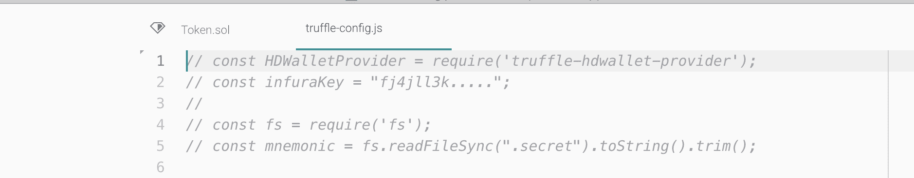

这样做将意味着看起来像下面这样：


这实质上是取消注释了您的INFURA和助记词变量。

1.  注册[https://infura.io](https://infura.io)获取您的INFURA密钥，以便在创建项目后，可以无限制访问安装了区块链的高质量服务器：

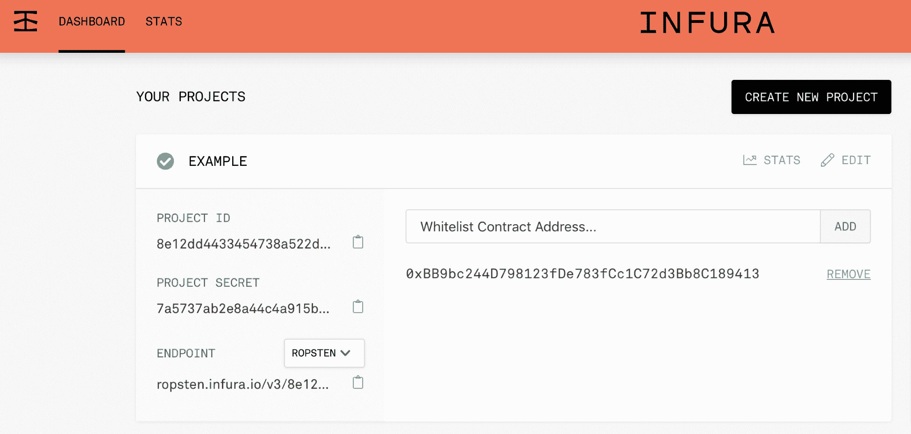

1.  ENDPOINT是您的INFURA密钥所在的地方。只需单击旁边的复制图标，这样您就会得到类似以下内容：

```
https://ropsten.infura.io/v3/8e12dd4433454738a522d9ea7ffcf2cc
```

1.  取消复制字符串，只保留网站名称后的部分，因为这是Truffle在配置部署网络密钥时使用的内容：

```
v3/8e12dd4433454738a522d9ea7ffcf2cc
```

1.  现在，将其粘贴到`truffle-config.js`中的`infuraKey`变量中，以便您能够在`ropsten`上部署您的智能合约：

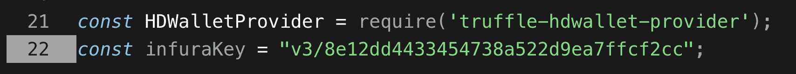

1.  现在您需要给 Truffle 提供您的助记词短语，以便它能够使用您的地址在`ropsten`上部署智能合约。为此，请在项目的最顶层创建一个名为`.secret`的文件，其中包含助记词。以下是一个示例：

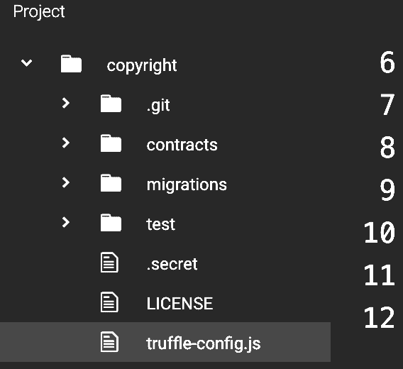

1.  在`.secret`中，仅写下您的助记词，不要添加任何其他信息：

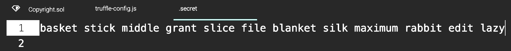

1.  然后，返回到您的`truffle-config.js`文件，并取消对`ropsten`部分的注释：

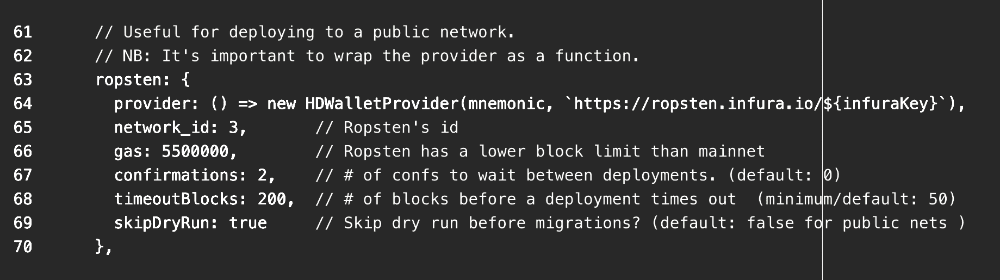

1.  然后，使用以下命令安装`truffle-hdwallet-provider`：

```
$ npm i truffle-hd-wallet-provider
```

1.  在安装它时，请确保您在项目文件夹中，因为它将在当前位置安装。最后，执行以下操作：

```
$ truffle deploy --network ropsten
```

您的合约将在几分钟内部署完成，具体时间取决于网络情况。然后，您可以玩耍并测试智能合约。确保使用此工具对受版权保护的内容进行`keccak256`哈希处理：[https://emn178.github.io/online-tools/keccak_256.html](https://emn178.github.io/online-tools/keccak_256.html)。

获得`keccak256`后，将其切成一半并生成十六进制代码。如果您有 MetaMask，则可以在浏览器中执行此操作，因为您将在所有网站上都可以使用 web3.js。以下是将特定文本字符串转换为其十六进制版本的步骤：

1.  在您的浏览器上打开开发者工具。

1.  转到您可以执行 JavaScript 代码的 Console 标签。

1.  输入`web3`以查看 web3 是否可用。

1.  如果是这样，请取一半的`keccak256`结果代码，并使用`web3.toHex('your-hash')`生成十六进制版本，如下例所示：

```
web3.toHex('041a34ca22b57f8355a7995e261fded7')
"0x3034316133346361323262353766383335356137393935653236316664656437"
```

然后，您可以使用该十六进制字符串将新的版权元素添加到智能合约中，作为`hashId`。

# 深入了解 EVM

**以太坊虚拟机（EVM）**是整个以太坊生态系统中最不被理解的部分之一。这可能是因为即使对于最优秀的开发者来说，这个虚拟机包含的复杂性也令人困惑。无论如何，作为以太坊专家，您的目标是成为与以太坊开发相关的所有事物的专家，因此您必须理解这台强大的虚拟机的复杂性，以便随时发挥其全部潜力。

# 解释 EVM

EVM是一个虚拟机，用于执行智能合约和交易。将以太坊操作系统与VirtualBox或VMware类比。它们是物理计算机的仿真，以创建一个应用程序可以与CPU通信的清洁环境。这种虚拟机为所有用户统一处理交易、区块和智能合约。它保持数百台计算机连接，因此有足够的安全性来保护每个节点免受潜在攻击是非常重要的。一些已实施的安全系统如下：

+   **Gas**：每笔交易在执行之前必须付费，以避免某些节点发送无限交易而没有意图支付它们的滥用行为。

+   **点对点通信**：节点只能通过发送和接收数据的消息进行通信，这意味着它们无法访问彼此的数据。

+   **确定性**：这意味着初始状态总是会产生相同的结果。例如，如果两个数字相加结果相同，那么无论它们是什么，都会得到完全相同的结果。这对于实现共识是很重要的，因为它允许他人验证交易确实有效；否则，要验证交易并取得共识将是不可能的，因为相同的状态导致不同的计算。

+   **沙盒执行**：由于这是一个虚拟机，使用它的智能合同不能访问外部计算机，使所有交易都成为可能。只有智能合同才能以有限的范围相互交互。

要完全理解EVM的工作原理，我们必须深入研究保持系统一体的汇编语言。理想情况下，我们可以理解字节码语言，这是计算机处理的内容，但由于我们无法理解，我们已经为每个过程创建了一种称为**汇编语言**的语言，它可以轻松转换为处理器计算的字节码。

# EVM中智能合同的操作

智能合同非常吸引人，因为它们能够在一个能够理解它们应该如何做出决策并就结果达成一致的单一系统中保持许多节点连接。它们在一个基于堆栈的虚拟机上运行，您可以将其视为一个数组，用于跟踪存储在内存中的变量。它为您提供了一组小函数来操作该堆栈。要了解智能合同在EVM中的操作方式，我们必须跟踪它们，以了解它们如何被虚拟机转换为可执行的字节码。

例如，考虑一个简单的合同，比如这个：

```
pragma solidity ^0.5.0;

contract Example {
    uint256 myNumber = 3;
}
```

编译器（比如`solc`）是如何将代码转换为EVM可以理解的东西，以便计算机可以处理它的呢？让我们尝试用特定的编译器进行分析。通过执行以下命令安装`solc`：

```
$ npm i -g solc
```

如果您将合同编译为字节码并分析字节码所采取的过程，您将得到以下结果：

```
$ solcjs Example.sol --bin
```

您会看到有关EVM行为的一些有趣的事情。首先，您会得到一个带有`.bin`结尾的文件，例如`Example_sol_Example.bin`，这是包含智能合同已编译字节码的二进制文件：

```
60806040526003600055348015601457600080fd5b5060358060226000396000f3fe6080604052600080fdfea165627a7a72305820aa17e74115b5e066ae13d560c624e9abef54adbce68c3443886eadc4e1059cfe0029
```

要理解所有那个字节码并看看EVM真正在做什么，我们必须根据每个指令拆分它。`6080604052`只是智能合同的初始化。每个合同都是一样的。然后，我们有以下内容：

```
60 03
```

数字60是一个特定的指令，被称为`PUSH`，它本质上将数字`3`移到内存堆栈中。堆栈只是一个空数组，可以从数组中获取或删除值。在`PUSH` 3指令之后，我们的堆栈看起来像这样：

```
stack: [3]
```

以下指令将零添加到堆栈中：

```
60 00
```

这导致`stack: [0, 3]`。

然后，我们有`55`，这是一个`STORE`指令，它将`uint256`永久写入存储，即区块链。我们需要在将其写入存储之前将数字3添加到堆栈中。我们在这里做的实质上是以下内容：

```
uint256 myNumber = 3;
```

这相当于以下内容：

```
6003600055
```

请记住，所有智能合约都以`6080604052`开始，就像你在完整的字节码中看到的那样。我们的智能合约只包含一个`uint256`赋值，因此它遵循具有`6003600055`的字节码。我们最终得到的是以下内容：

```
60806040526003600055348015601457600080fd5b5060358060226000396000f3fe6080604052600080fdfea165627a7a72305820aa17e74115b5e066ae13d560c624e9abef54adbce68c3443886eadc4e1059cfe0029
```

其余部分是无关紧要的，因为它包含关于发送者和合约的信息。大约有100个操作码，在EVM中使用许多不同的技术将智能合约代码转换为字节码，以便可以有效地发布到区块链上。

现在，你了解了当你编写智能合约、编译它并将其部署到网络时，在幕后发生了什么。其余工作由运行其自己特定实现的以太坊协议的节点来完成，因此它们决定采取哪些块并忽略哪些块。EVM是一个复杂的虚拟环境，它处理来自智能合约的事务和字节码，以实现符合所有人利益的全局共识。

# 可升级且可扩展的智能合约

以太坊区块链是不可变的，这意味着你无法修改其过去的操作。一旦一个动作被大多数矿工确认，该动作将永远留在那里。相同的限制也适用于智能合约。然而，我们作为以太坊专家，能够克服部署不可扩展代码的问题，因为我们理解存在着不同的开发技术，我们可以创建可扩展的代码。这个想法是部署智能合约，使它们准备好在未来扩展，具有一组不同的、可互换的合约。知道如何创建可扩展并且能够在未来改进的智能合约是任何顶尖以太坊专家必须具备的基本技能，所以不要错过它。

# 可升级智能合约

**可升级智能合约**是创建面向不断发展、突然需要新功能的大型行业的先进智能合约的下一步。它们可以用于各种项目，但我建议你只为那些可能需要未来升级或想要为未来预测保护数据的项目使用它们。并不是每个智能合约都需要具有可升级功能，尽管代币等项目将受益于可升级的代码。

我们将创建一个由三部分和两个较小智能合约组成的可升级智能合约。它将是这样的：

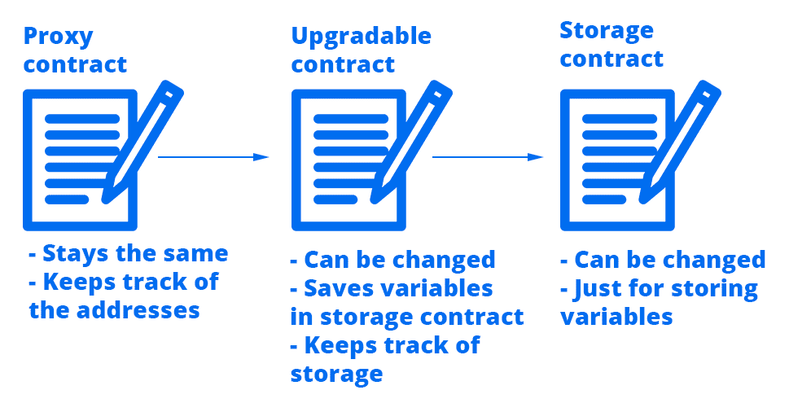

有许多方法可以使智能合约可升级 - 你甚至可以创建自己的！因此，在理解这种技术时要有耐心，因为在开始阶段可能会感到困惑。

要使合约可升级，我们需要三个部分：

+   **代理合约**：这是初始合约 - 用户始终用来与代码交互的主要合约。把这个视为同样旧的智能合约，用于进行函数调用，但是，不是在这里执行逻辑，而是在可升级智能合约中执行。

+   **可升级合约**：这是所有逻辑发生的地方。这个合约可以升级，这意味着它可以被移除，可以部署一个同名但带有新功能的新版本。用户不会直接与这个合约交互，因为地址每次升级时都会发生变化。

+   **存储合约**：因为我们不希望每次升级合约时丢失我们的状态变量和所有用户信息，我们将所有变量、映射和数据存储在这个存储合约中。它只会有变量和设置器函数来更新这些变量。除此之外，它不会有任何逻辑或函数。

要升级一个合约并保持相同地址，将会发生以下情况：

1.  用户将向代理合约发送一个交易，例如，`执行函数 buyTokens()`。

1.  代理合约将发送这个命令，找到可升级合约中的`buyTokens()`函数，并执行它。

1.  可升级合约将处理购买 token的逻辑，并将所有更改存储在存储合约中，例如，通过调用名为**`setTokens()`**的函数，将用户 A 的 token 数量增加到 40。

1.  存储合约执行**`setTokens()`**并将 tokens 变量更新为 `tokens = 40;`，用于用户 A。

这基本上是逻辑操作的工作流程。实质上，我们将始终使用相同的合约地址，但逻辑会发生变化。我们也会保留相同的信息，而不会删除它，因为这是非常有价值的信息，很难重新插入。

为了帮助你理解所有这些合约背后的概念，我将向你展示每个智能合约具有的伪代码版本。我们将使用 token 比喻，其中用户想要在可升级合约中购买 token。

这是代理合约的样子：

```
contract Proxy {
    address public upgradableContractAddress;
    function () public {
        // Delegate the execution to the upgradable contract instead of using the code in this contract since this contract won't change, it's just to keep the address consistent and to have a registry of upgradable contracts
    }
}
```

这是可升级合约的样子：

```
contract Upgradable {
    address public storageContractAddress;
    function buyTokens() public {
        // This is the function that the proxy called in this example. So this contract will execute the needed logic to buy tokens and will update the state variables in the storage contract
        storageContractAddress.setTokens(userA, 40);
    }
}
```

最后，这是存储合约的样子：

```
contract Storage {
    mapping(address => uint256) public tokens;

    function setTokens(address _user, uint256 _number) public {
        // This function is used to update the storage variables since we don't want any logic to take place in this contract
        tokens[_user] = _number;
    }
}
```

这三个合同一起工作是可升级智能合同背后的核心概念，而不是更新整个代码库，我们将不同的角色分成可以在将来修改的可变部分。让我们深入了解它们是如何一个接一个地实现的。

# 存储智能合同

存储智能合同是这三个智能合同中最简单的，因为它只包含变量和函数来更新这些变量。我们不需要getter，因为这些都是public变量，已经默认创建了getter函数来获取public变量。

我们将创建一个简单的存储智能合同，其中包含一个`uint`变量，以演示目的。然后，你可以根据需要添加更多变量。该合同非常简单，因为它只包含一个变量：

```
pragma solidity ^0.5.0;

contract Storage {
    uint256 public myNumber;
    function setMyNumber(uint256 _myNumber) public {
        myNumber = _myNumber;
    }
}
```

正如你所见，我们有一个名为`myNumber`的变量和一个名为`setMyNumber`的setter函数来更新该变量。

你可能希望引入访问逻辑，只允许特定用户更新某些变量。目前，只要你理解它的外观就足够了。

# 可升级智能合同

可升级智能合同是最有趣的。它将执行所有逻辑，并在需要更新一些变量数据时与存储合同交互。让我们看看代码，看它是如何工作的。稍后我们将看到如何对其进行升级：

```
pragma solidity ^0.5.0;

contract Upgradable {
    address public storageContract;
    constructor (address _storageContract) public {
        storageContract = _storageContract;
    }

    // A sample function that you could implement for buying tokens for demonstration purposes
    function buyTokens() public {
        // Do your logic for buying tokens for instance, calculating how many he will get for the msg.value he sent and so on. To later update the storage information
        // Create the storage contract instance
        Storage s = Storage(storageContract);
        s.setMyNumber(10);
    }
}

contract Storage {
    uint256 public myNumber;
    function setMyNumber(uint256 _myNumber) public {
        myNumber = _myNumber;
    }
}
```

这个可升级合同与`Storage`智能合同在同一个文件中。这一点很重要，因为在部署时我们需要访问该合同。或者，你也可以使用`import`关键字。

正如你所见，我用一个名为`storageContract`的变量声明了`Upgradable`智能合同，它跟踪存储合同的地址，因为我们将在那里更新状态变量。在构造函数中，我们设置了存储合同的地址，因为该合同将一直保留相同的存储，直到更新为止。然后，我添加了一个名为`buyTokens()`的函数作为示例，向你展示它在现实世界中是什么样子的；目前它除了通过调用`Storage`合同中的`setMyNumber()`更新存储外不会执行任何操作。

如果你要创建一个真正的实现，你将添加所有你期望的逻辑。我不想向你展示一个真正完整的可升级合同版本，因为其中许多函数会让你无法理解可升级智能合同是如何工作的。

它显示了你执行所有逻辑，然后在文件末尾，通过调用存储合同更新存储变量。

要升级这个合同，请按照以下步骤操作：

1.  部署这个合同的新版本，其中包含了更新后的函数。你可以添加新的函数，更新旧的函数，甚至删除一些。

1.  在部署合同时，在你的构造函数中使用存储地址，因为你需要访问该合同来保持变量。

1.  最后，在代理合约中，执行一个名为`upgradeUpgradableContract()`的函数，它将把所有的函数调用重定向到你的可升级智能合约的新版本。

请注意，您可以部署这个合约，同时保留相同的存储合约，这样您的数据就可以安全地保留，并且在下一个可升级合约版本中准备好像什么都没有发生一样使用。或者，您可以部署一个新的存储合约，然后部署一个指向该新存储的新可升级合约。这样，如果您不想保留旧数据，您就会有一个干净的存储。然而，您仍然可以访问旧数据，因为合约将永久地存在于区块链上，只要在创建新的可升级合约时指向旧存储地址即可。

# 代理智能合约

这是最重要的部分，因为这个合约将永远不会改变。我们不希望它改变，因为我们希望保留相同的以太坊地址，同时更新底层逻辑。这个合约将把所有的调用重定向到可升级合约，并且有几个变量用于注册当前可升级合约的地址和不想更新到新代码的过去合约列表。

请记住，升级到新版本始终是可选的。如果您的用户决定要继续使用旧的智能合约，他们可以直接将所有的交易发送到旧的可升级合约而不执行代理合约。您可以通过使用 `selfdestruct()` 函数销毁旧的可升级智能合约来阻止他们这样做，但我不建议这样做，因为这将使您的合约变得毫无价值，并且可能在未来可用。

这就是代理合约的样子：

```
pragma solidity 0.5.0;

contract Proxy {
    address public storageAddress;
    address public upgradableAddress;
    address public owner = msg.sender;

    address[] public listStorage; // To keep track of past storage contracts
    address[] public listUpgradable; // To keep track of past upgradable contracts
}
```

这是最复杂的合约，因为它需要做一些事情。首先，我们设置了 `storageAddress`、`upgradableAddress` 和 `owner`。这些是合约将用来理解在哪里重定向所有调用的变量。实际上，我们并不需要跟踪存储地址或所有者，但这是一个良好的做法，因为它使事情更容易理解，并提供更多的选择。请注意，`delegatecall()` 函数无法更新可升级合约的存储，所以我们设置了一个外部存储。

然后，我们有两个地址数组：`listStorage` 和 `listUpgradable`。这些数组将包含当前和旧版本的存储和可升级合约，因为我们希望在需要时能够访问旧的逻辑。我添加了一个 `onlyOwner` 修饰符，因为我们只希望允许所有者进行合约更新。

之后，我们有构造函数。它被用来立即部署一个新的存储和可升级智能合约。您可以分别部署它们，但从代理的构造函数中这样做更简单和干净：

```
modifier onlyOwner {
    require(msg.sender == owner);
    _;
}

constructor() public {
    storageAddress = address(new Storage());
    upgradableAddress = address(new Upgradable(storageAddress));
    listStorage.push(storageAddress);
    listUpgradable.push(upgradableAddress);
}
```

接下来，有一个标记为外部的回退函数。这是最重要的函数，因为它是将接收所有函数调用并将其重定向到可升级智能合约的正确函数的函数。它通过使用`delegatecall()`函数工作。这是一个接收`bytes`参数以指示使用参数值从其他合同调用哪个函数的低级函数：

```
function () external {
    bool isSuccessful;
    bytes memory message;
    (isSuccessful, message) = upgradableAddress.delegatecall(msg.data);

    require(isSuccessful);
}
```

最后，我们有必要在所有者决定升级存储和逻辑合同时，升级存储和逻辑合同所需的函数。它们通过在数组中跟踪先前的版本来工作，以便用户如果希望如此，则可以访问旧版本：

```
function upgradeStorage(address _newStorage) public onlyOwner {
    require(storageAddress != _newStorage);
    storageAddress = _newStorage;
    listStorage.push(_newStorage);
}

function upgradeUpgradable(address _newUpgradable) public onlyOwner {
    require(upgradableAddress != _newUpgradable);
    upgradableAddress = _newUpgradable;
    listUpgradable.push(_newUpgradable);
}
```

要了解与逻辑合同通信的机制如何工作，请查看此函数：

```
upgradableAddress.delegatecall(msg.data);
```

首先，这需要调用合同的地址，本例中为可升级合同地址，然后是包含要传输信息的数据。`msg.data`参数是一个特殊变量，其中包含要调用的带参数值的函数。在这里，您将编写要调用的函数名称。例如，假设您想执行`buyTokens(uint256 _number)`函数，其中`_number`参数为`12`。

在普通合同中，您只需创建合同实例，并按名称调用函数，同时发送参数值：

```
MyContract(contractAddress).buyTokens(12);
```

但是当我们事先不知道函数名称时，我们无法这样做。请记住，我们正在处理可能在将来具有新函数的合同，并且我们还希望从同一代理合同中访问这些函数。因此，我们使用`msg.data`。该变量包含一个十六进制字节字符串，其中包含函数名称和参数。让我们看看如何正确格式化它，以便 Solidity 理解我们要调用哪个函数。

首先，我们需要函数名称，然后我们需要编码的参数。因为 Solidity 使用十六进制值，所以我们需要用函数签名以十六进制形式写入它。函数签名是通过短的十六进制值而不是它们的字符串名称来引用函数的一种简短方式。如果您转到[https://remix.ethereum.org](https://remix.ethereum.org)，您可以快速看到每个函数的函数签名：

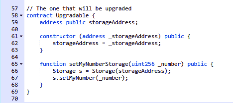

如您所见，我已经在 Remix 上复制了我的合同。现在，要以十六进制形式获取`setMyNumberStorage()`函数的函数签名，您必须在选择您的合同时转到编译选项卡：

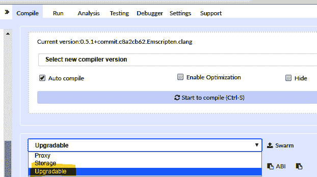

然后，您可以点击“详情”以获取更多信息：


如果您向下滚动，您将看到合同的功能哈希部分：

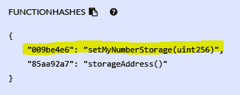

`setMyNumberStorage()`的函数哈希是`009be4e6`；这是函数的签名。非常好！我们有了`msg.data`对象的第一部分：`0x009be4e6`。

现在，我们需要编码函数的参数。假设我在调用函数时要设置一个数字为`16`。您可以通过使用web3手动将该数字转换为其十六进制形式。如果您已安装MetaMask，您可以打开您的浏览器的开发者工具与`web3.js`交互。在控制台中，您只需输入`web3.toHex(16)`，就会收到16的十六进制版本：

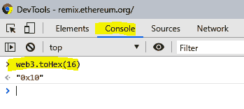

请注意，`web3.toHex()`仅适用于web3的0.20版本，这是目前由MetaMask使用的版本。在web3 1.0中，语法是不同的，因此如果MetaMask更新了它的web3版本，您可以在官方web3 1.0文档中阅读如何进行十六进制转换。

现在，我们只需要在10的前面添加62个零，因为`0x10`是我们要获得该参数的编码版本。这是一个例子：

```
0000000000000000000000000000000000000000000000000000000000000010
```

这将被十六进制编码。我们只需要在前面添加函数签名，以完成我们的`msg.data`对象：

```
0x009be4e60000000000000000000000000000000000000000000000000000000000000010
```

就是这样！ 那一长串十六进制数字代表着：*调用函数setMyNumberStorage(12)*。

回到我们离开的地方，`.delegatecall(msg.data)`函数现在可以正确执行我们的函数调用的转换值。你可能在问自己：*为什么要这么复杂，用户怎么会做所有这些转换工作呢？*

人们使用您的智能合约或dApp的真相是，不需要他们做所有的转换。你只需在你的去中心化应用程序中简单地编写转换逻辑，函数名称将在几行代码中自动转换为web3中，就像你已经看到的那样。或者，您可以在Remix上部署您的合约，并在只需点击一个按钮即可获得整个编码函数调用：

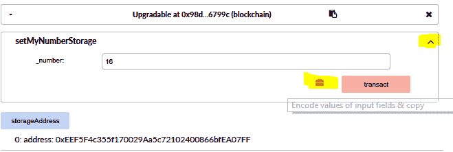

当您部署合约时，您会看到一个框，您可以与部署的合约进行交互。如果你点击我标记的箭头，你会看到函数调用的扩展版本，显示给您一个工具箱图标，您可以点击它直接将`setMyNumberStorage(16)`转换为十六进制形式：

```
0x009be4e60000000000000000000000000000000000000000000000000000000000000010
```

这是在使用Remix与您的合约时进行转换的一个简单技巧。有了这个十六进制数字，您可以打开MetaMask并将其粘贴到数据字段中。首先，打开MetaMask并点击发送：

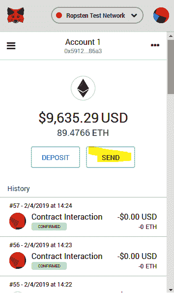

然后，通过向下滚动将您的代码粘贴到数据字段中：

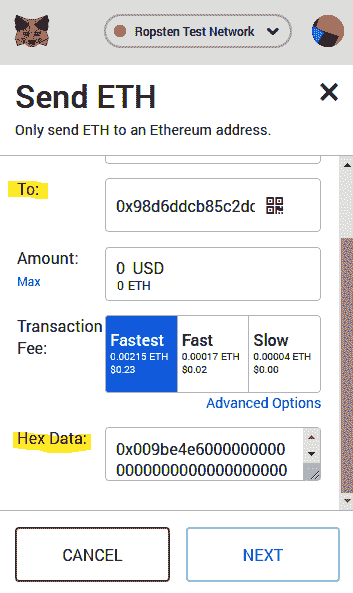

确认交易后，您将看到您的函数已成功委托，并且您已经从代理合约执行了这个操作。

让我们回到我们的回退函数：

```
    function () external {
        bool isSuccessful;
        bytes memory message;
        (isSuccessful, message) = upgradableAddress.delegatecall(msg.data);

        require(isSuccessful);
    }
```

您可以看到`delegatecall`函数返回两个值：一个布尔值，用于指示委托是否成功，以及一个字节参数。

```
(isSucessful, message)
```

我们只是捕获它们并要求委派成功。否则，它将撤销交易并不做任何更改。这很重要，因为`delegatecall`函数不关心委派是否成功；它只会通知您让您做出决定，因为它是一个低级函数，可在许多高级情况下使用。

`delegatecall()` 的另一个有趣属性是，接收合约的`msg.sender`将是您的以太坊地址，而不是代理合约的地址。这很重要，否则，在可升级合约中，您的地址将会不同。在许多情况下，用户地址对于某些逻辑很重要，你不希望出现这种情况。

最后，我们有这两个函数：

```
    function upgradeStorage(address _newStorage) public onlyOwner {
        require(storageAddress != _newStorage);
        storageAddress = _newStorage;
        listStorage.push(_newStorage);
    }

    function upgradeUpgradable(address _newUpgradable) public onlyOwner {
        require(upgradableAddress != _newUpgradable);
        upgradableAddress = _newUpgradable;
        listUpgradable.push(_newUpgradable);
    }
```

它们只是用于更新智能合约。每当部署新版本的`Upgradable`或`Storage`时，您都必须执行相应的函数，以使代理合约知道哪个是活动的版本，以便它可以将所有函数调用委托给合约的正确版本。

# 可扩展的智能合约。

通常，智能合约严格受到区块链处理能力的限制，因为数十万个节点必须相互连接以执行相同的交易。当我们处理超出区块链容量的热门应用程序时，这是一个重大问题。为了解决这个问题，有不同的扩展解决方案，您可以在智能合约中实施，以便许多更多的用户能够运行您的去中心化应用程序而无性能问题。

要理解您将要学习的扩展解决方案，了解使用智能合约时发生的过程很重要：

+   首先，用户通过运行一个与该合约交互的去中心化应用程序或直接使用他们自己的以太坊节点执行智能合约，为特定智能合约生成一个交易。

+   矿工接收交易，以便将其包含到下一个区块中并执行字节码。

+   当他们确认时，交易将永久添加到最长的链中。

我们无法加快矿工确认交易的过程，因为以太坊使用的共识方案要求每个节点验证每个交易，直到它们都变为有效为止。

相反，我们可以使用一种被称为**状态通道**的协议。它由产生有效的离链交易的承诺方案组成，只要一组人对这些交易达成协议。例如，想象一下像21点这样的牌游戏。如果你对这个游戏不熟悉，它是每个玩家轮流接收一张牌，并在获得最大组合牌面的同时下注筹码的游戏。组合总数为21的人，或者接近21的，赢得游戏。如果超过21，就会输掉游戏。

本质上，状态通道就像21点游戏一样，用户可以玩无数次游戏，同时保持可以在结束后兑换成真实货币的筹码得分。这是一个伟大的扩展系统，因为你可以直接点对点地在链下运行许多交易，而不必等待区块链处理每一笔交易。当你结束游戏时，你只需将结果捆绑在一起，并将一个大交易推送到区块链上。

因此，你会实时处理数百笔交易，直到结束游戏时，你只需发送1笔交易。与等待100笔交易每笔大约20秒不同，你只需要等待20秒一次，同时节省了gas。因此，你拥有了一个更快速且可扩展系统，让更多的玩家能够以更好的性能使用你的dApp。

# 使用状态通道实现可扩展的智能合约

我将向你介绍一个简单的示例项目，让你看看状态通道是如何运作的。它们使用的是承诺方案，这只是你不能改变的加密交易，用于在玩家决定展示他们的牌之前承诺你的行动。

智能合约将成为状态通道的进入和退出点。在区块链的控制之外，中间发生的事情，尽管我们将定义每条加密消息里的内容，以便在游戏结束时能够验证它。以下是步骤：

1.  参与游戏的每个玩家必须通过调用智能合约中的一个函数来打开状态通道，以定义他们是谁。当他们这样做时，他们必须向智能合约发送一些以太作为存款。当游戏结束时，这些资金将用于分发奖励。

1.  用你想提交的变量生成哈希。这些哈希将包含每个玩家的加密参与。因此，他们通过首先承诺他们的赌注，然后揭示他们的结果并更新变量和余额，直接来回交换消息。

1.  当他们决定结束游戏时，他们会回到智能合约上载他们最新签名的哈希，以便智能合约可以读取并向每个人发送相应的以太币。

让我们创建带有进入和退出函数的智能合约。其余操作将在链下进行。与往常一样，以下是合约的结构：

```
pragma solidity 0.5.0;

contract StateChannel {
    constructor () public payable {}

    function exitStateChannel() public {}
}
```

构造函数将是入口，因为我们想为每场游戏部署一个新的合约实例。`exitStateChannel()`函数将检查最新签名的哈希，并将相应的以太币发送给每个玩家。请注意，构造函数是可支付的，因为我们希望在开始时收到托管资金。

让我们添加一些我们需要的变量。在这种情况下，我们将创建一个简单的猜数字游戏，每个玩家必须设置一个从1到10的数字，另一个玩家必须猜出那个数字才能赢。所以，当玩家2猜到与玩家1不同的数字时，玩家1获胜。他们每次猜数字游戏还会打赌以太币；获胜者将以两倍的赌注赢得比赛，只要两者都有足够的资金进行下注：

```
pragma solidity 0.5.0;

contract StateChannel {
    address payable public playerOne;
    address payable public playerTwo;
    uint256 public escrowOne;
    uint256 public escrowTwo;

    constructor () public payable {}

    function exitStateChannel() public {}
}
```

接下来，我们需要为每个玩家设置这些变量：

```
pragma solidity 0.5.0;

contract StateChannel {
    address payable public playerOne;
    address payable public playerTwo;
    uint256 public escrowOne;
    uint256 public escrowTwo;

    constructor () public payable {
        require(msg.value > 0);

        playerOne = msg.sender;
        escrowOne = msg.value;
    }

    function setupPlayerTwo() public payable {
        require(msg.sender != playerOne);
        require(msg.value > 0);

        playerTwo = msg.sender;
        escrowTwo = msg.value;
    }

    function exitStateChannel() public {}
}
```

正如您所见，构造函数将初始化第一个玩家的地址和托管账户，而`setupPlayerTwo()`函数将为第二个玩家执行相同的操作。这是我们在两个玩家之间打开状态通道所需要的一切。在创建`exitStateChannel()`函数之前，该函数将结束游戏，关闭通道并分配资金，我想澄清每个散列消息由哪些元素组成，以及游戏将如何在链下进行。

在这个猜数字游戏中，我们有两个玩家，他们有两个不同的托管账户，每场游戏都在其中下注一个特定的数字。如果两者选择的数字相同，则第二个玩家获胜；否则，第一个玩家获胜。只要他们两者都有足够的资金，他们就会得到两倍数量的以太币投资。

因此，玩家1将创建一个包含以下值的加密对象来开始一场游戏：

+   **选择的数字**：这个数字必须在1到10之间。

+   **游戏赌注以太币数量**：另一个玩家必须有足够的资金支付你的两倍投资。例如，玩家1有10个以太币，而玩家2有4个。鉴于此，如果他赢了，玩家1将无法下注超过4个以太币，因为如果他赢了，第二个玩家将不得不支付他所有的以太币。我们将保留此选项，以便他们可以投资任意数量，如果赌注超过了玩家的余额，他将简单地获得所有资金，即使它少于赌注。

+   **游戏序列**：每场游戏都会增加的计数器，以标识每场游戏的顺序。

+   **时间戳**：每个玩家都有一个唯一的时间戳，以了解下注何时进行。

+   **随机数**：一个随机的10位数字，以确保每个消息都是唯一的。这不是强制性的，但在尝试理解游戏事件的顺序时会有所帮助。

这是一个示例：第一个玩家在与另一个玩家创建智能合约打开状态通道后开始游戏。然后，他创建以下数据将被加密：

+   **选择的数字**：9

+   **下注的以太币数量**：他在托管账户中有10个以太币，所以他将为这场比赛下注4个以太币

+   **游戏序列**：1

+   **时间戳**：1549378379

+   **随机数**：2948372910

然后，他使用 dApp 用 `keccak256` 算法加密该信息：

```
keccak256(9, 4, 1, 1549378379, 2948372910);

```

他得到了这个结果的哈希值：

```
515e473c03c2d08f92825bad975ff0123f15b3ee2f457942a3484abe749f65b4
```

请注意，这只是一个示例，真正的 `keccak256` 将会不同。然后，他使用在状态通道智能合约中使用的以太坊账户对该哈希进行签名。他可以使用 web3.js 进行此操作，因为它是与 MetaMask 结合使用在链下最快的签署哈希的方式：

```
web3.personal.sign(hash, web3.eth.defaultAccount, (err, result) => {
    if(err) return err
    return result
})
```

之后，加密的哈希将被签名，以后确认他确实选择了那些参数与他的账户。另一个玩家将采取相同的步骤生成加密签名的哈希与他的赌注。

当生成两个哈希时，他们将使用运行某种通信系统的去中心化应用，例如服务器或电子邮件，来交换这些哈希并揭示他们的赌注。他们可以随时验证这些哈希，因为一旦知道了加密信息的有效内容，就可以快速验证该信息是否有效。

每个新消息都会有一个增加的序列号、一个随机的随机数和一个新的时间戳，该时间戳必须大于上一个时间戳。所有这些检查都可以在实现状态通道合约的 dApp 中完成。

当他们决定结束游戏时，他们将上传他们的最新消息到智能合约，以便从在打开通道时配置的托管中分发更新后的余额。以下是如何在智能合约中使用 `exitStateChannel()` 函数关闭游戏。

首先，我们设置游戏所需的变量以跟踪余额：

```
pragma solidity 0.5.0;

contract StateChannel {
    address payable public playerOne;
    address payable public playerTwo;
    uint256 public escrowOne;
    uint256 public escrowTwo;

    // Variables to end the game
    uint256 public betOne;
    uint256 public betTwo;
    uint256 public balanceOne;
    uint256 public balanceTwo;
    uint256 public callOne;
    uint256 public callTwo;
    bool public isPlayer1BalanceSetUp;
    bool public isPlayer2BalanceSetUp;
    uint256 public finalBalanceOne;
    uint256 public finalBalanceTwo;
}
```

然后，我们创建设置函数，这种情况下是构造函数和 `setupPlayerTwo()`，它的作用是存储用户的初始数据：

```

constructor () public payable {
    require(msg.value > 0);

    playerOne = msg.sender;
    escrowOne = msg.value;
}

function setupPlayerTwo() public payable {
    require(msg.sender != playerOne);
    require(msg.value > 0);

    playerTwo = msg.sender;
    escrowTwo = msg.value;
}
```

最后，我们添加最重要的函数：根据最后的状态选择获胜玩家并结束游戏的函数：

```
function exitStateChannel(
 bytes memory playerMessage, 
 uint256 playerCall, 
 uint256 playerBet, 
 uint256 playerBalance, 
 uint256 playerNonce, 
 uint256 playerSequence, 
 address addressOfMessage) 
 public 
{
    require(playerTwo != address(0), '#1 The address of the player is invalid');
    require(playerMessage.length == 65, '#2 The length of the message is invalid');
    require(addressOfMessage == playerOne || addressOfMessage == playerTwo, '#3 You must use a valid address of one of the players');
    uint256 escrowToUse = escrowOne;

    if(addressOfMessage == playerTwo) escrowToUse = escrowTwo;

    // Recreate the signed message for the first player to verify that the parameters are correct
    bytes32 message = keccak256(abi.encodePacked("\x19Ethereum Signed Message:\n32", keccak256(abi.encodePacked(playerNonce, playerCall, playerBet, playerBalance, playerSequence))));
    bytes32 r;
    bytes32 s;
    uint8 v;

    assembly {
        r := mload(add(playerMessage, 32))
        s := mload(add(playerMessage, 64))
        v := byte(0, mload(add(playerMessage, 96)))
    }

    address originalSigner = ecrecover(message, v, r, s);
    require(originalSigner == addressOfMessage, '#4 The signer must be the original address');

    if(addressOfMessage == playerOne) {
        balanceOne = playerBalance;
        isPlayer1BalanceSetUp = true;
        betOne = playerBet;
        callOne = playerCall;
    } else {
        balanceTwo = playerBalance;
        isPlayer2BalanceSetUp = true;
        betTwo = playerBet;
        callTwo = playerCall;
    }

    if(isPlayer1BalanceSetUp && isPlayer2BalanceSetUp) {
        if(callOne == callTwo) {
            finalBalanceTwo = balanceTwo + betTwo;
            finalBalanceOne = balanceOne - betTwo;
        } else {
            finalBalanceOne = balanceOne + betOne;
            finalBalanceTwo = balanceTwo - betOne;
        }

        playerOne.transfer(finalBalanceOne);
        playerTwo.transfer(finalBalanceTwo);
    }
}
```

当我们有这么多参数的函数时，将每个参数分开放在新行中是很好的实践。首先，我们检查地址是否已设置，因为我们希望单独设置每个消息。然后，我们重新生成加密的、签名的哈希消息以验证传递的参数是否有效。要验证 `keccak256` 是否有效，我们只需再次使用假定使用的参数生成它，并检查结果哈希是否与给定的哈希完全相同。

之后，我们使用汇编语言获取 r、v 和 s，这三个变量用于使用您的以太坊账户对消息进行签名。我们用它来获取签名者的地址以验证消息来自正确的人。然后，我们在状态变量中设置该玩家的余额、赌注和调用。我们这样做是为了在第二个玩家使用他的参数执行退出函数时稍后分发资金。最后，在两者都设置好他们的结果消息后，我们使用 `transfer()` 函数执行以太币转账。

这看起来很复杂，但我们所做的一切只是检查签名消息是否有效，然后检查消息的签名是否有效，最后在其他玩家使用此函数验证退出消息时更新变量以分配资金。

这个智能合约只是一个演示。它有一些重要问题，比如一个玩家可以决定不发布他的退出通道消息，以避免失去以太币。为此，如果第二个玩家在 24 小时内不回应，则需要添加某种冲突解决机制来分配资金。我会把这留给你来练习你的技能。

这些是下一代智能合约，将支持同时在数十万台计算机上运行的复杂去中心化应用程序，并具有一些集中化逻辑。最终，关键在于确保我们利用区块链的无信任性质创建可以使用户受益的应用程序，而无需外部实体干预流程。继续阅读，了解更多使用最少资源获取最大结果的高效智能合约。

# 油气和数据高效的智能合约

制作智能合约不仅要以透明和安全的方式处理交易，而且要尽可能有效地使用区块链资源。因此，我们将探讨如何为以太坊编写油气和数据高效的代码。在本节中，我们将介绍以下主题：

+   制作油气高效的智能合约

+   制作数据高效的智能合约

# 制作油气高效的智能合约

我相信你已经看到了一些包含许多函数的智能合约，感觉它们消耗了太多的油气以运行：例如那些管理大量状态变量或同时有几个不同合约操作的函数。

尽管区块链要求对每笔交易支付油费，但我们最好还是创建尽可能少消耗资源的智能合约，以便为我们的用户大大降低交易成本。

那么，我们该怎么做呢？

原来每个小操作都有一个与 EVM 关联的操作码。每当使用操作码时，您都需要支付油费，因为矿工必须处理您的交易。以下是最常见操作码及其油费成本的列表：

+   `ADD` 和 `SUB`：加或减两个数字。每次添加或减少一个数字时，都会消耗 3 油费。

+   `MUL` 和 `DIV`：乘以或除以数字。每次操作都会消耗 5 油费。

+   `AND`、`OR`和`XOR`：用于比较布尔值的逻辑操作。每次操作消耗 3 油费。

+   `LT`、`GT`、`SLT`、`SGT`和`EQ`：用于比较数字的逻辑操作。每次操作消耗 3 油费。

+   `POP`：这是一种从堆栈机中删除元素的 EVM 堆栈操作。每次`POP`操作消耗 2 油费。

+   `PUSH`，`DUP`或`SWAP`：将元素添加到堆栈机器。这使用了3个气体。

+   `MLOAD`和`MSTORE`：向EVM的内存中添加数据。每次操作使用3个气体。

+   `JUMP`：跳转到汇编代码中的另一个位置。这需要8个气体。

+   `JUMPI`：有条件的跳转。每次操作需要花费10个气体。

+   `SLOAD`：另一个将元素添加到堆栈的操作。每次操作需要花费200个气体。

+   `SSTORE`：直接将信息存储到区块链中。每次操作需要花费5000至20000个气体。

+   `BALANCE`：获取以太坊账户或合约的余额。这每次操作使用400个气体。

+   `CREATE`：部署新的智能合约或账户。我们需要32000个气体来创建一个新的智能合约。

正如您所见，将信息存储在状态变量中使用了`SSTORE`，这会花费高达20k个气体。这非常昂贵，是优化代码的一个地方。

这里是我们将探讨并在实际示例中检查真实的气体成本的主要优化技术：

+   **比较运算符的顺序**：`&&`和`||`比较运算符的顺序，其中始终检查第一个条件，而第二个条件可能不会被检查。例如，如果if语句的第二部分比其他部分更有可能为真，则最好将第二部分放在首位，因为在`OR`语句中，这将节省气体，因为它不会在检查其他参数时进行不必要的计算。对于`AND`也是如此：您希望将第一部分作为最有可能为假的部分，因为如果第一部分为假，编译器将不会检查第二部分，您将节省气体，因为每个运算符都有一个气体成本。

+   **使用状态变量的** `for` **和** `while` **循环**：当您有一个使用外部变量的循环时，您希望它使用内存变量，因为它们比使用存储更便宜得多。

+   **不可访问的** `if...else` **语句**：有些情况下，条件`if...else`永远不会执行其他部分。在这些情况下，重要的是要删除重复的、多余的和不可访问的代码，因为每次执行都会消耗气体。

+   **限制变量的大小**：每个变量类型后面的数字定义了其容量，因此，具有较小容量的变量消耗的气体较少，简单来说，因为它不需要太多的区块链存储：例如，对于较小的变量，使用`uint8`而不是`uint256`。

+   **尽量不要使用库**：每次调用库或外部合约时，都会浪费气体，因为您必须创建该外部合约的实例，这又会浪费气体。这就是为什么在部署时将所有代码组合到一个大型智能合约中比创建较小的片段更好，尽管对开发而言很好，但对生产而言则不太好。

+   **使用内存而不是存储**：函数类型后面的 `memory` 关键字告诉编译器将该信息暂时存储在本地内存中，而不是写入区块链。

+   **限制余额调用**：每当你请求某个账户的余额时，你会花费 400 gas，这在规模较大的合约中可能会变得非常大。此外，请记住如果你要多次请求余额，则将余额存储在内存变量中，因为一旦存储，你就不必再次使用操作码 CREATE。

+   **使用** `bytes32` **而不是** `string`：字符串是一种更大的变量类型，因为它可以使用交易的所有 gas 来容纳约 1000 个单词。它本身没有限制；相反，它受到你发送的 gas 的限制。越多的 gas，你就可以存储更大的字符串。然而，最好使用 bytes32，因为它更加紧凑，允许你存储多达 32 个字符，这对于较短的文本（如姓名）是理想的。

让我们看一些可以使用这些技术进行优化的示例：

```
pragma solidity 0.5.0;
contract BadExample {
    uint256 public myNumber = 0;

    function counter(uint256 _counter) public {
        for(uint256 i; i < _counter; i++) {
            myNumber += 1;
        }
    }
}
```

正如你在前面的合约中所看到的，我们在 `counter()` 函数内部运行了一个 `for` 循环，它只是将 `myNumber` 状态变量按 `_counter` 次递增。你能看出可能存在问题的地方吗？主要问题在于，每次循环运行时，我们都会向状态变量写入数据，这意味着我们每次迭代都要花费 5k 到 20k gas，因为 `myNumber` 变量是一个状态变量。

当使用 `_counter = 5` 运行函数时，交易成本为 48,180 gas，当使用 `_counter = 10` 时，成本为 74,625 gas。正如你所看到的，成本很快增加了约 26k gas，这正是我们从 `SSTORE` 操作码中预期的，因为我们运行了五次更多的迭代。

要修复合约，我们只需创建一个新的使用内存而不是存储的本地变量：

```
pragma solidity 0.5.0;
contract GoodExample {
    uint256 public myNumber = 0;

    function counter(uint256 _counter) public {
        uint256 internalCounter = 0;    
        for(uint256 i; i < _counter; i++) {
            internalCounter += 1;
        }
        myNumber += internalCounter;
    }
}
```

在这种情况下，交易成本从 27,331 增加到 27,681，仅相差 350 gas。正如你所看到的，这是一个巨大的改进，将在成千上万的交易中至少节省一倍的费用。创建经过优化的 gas 合约是有意义的。这个例子可以通过将 `uint256` 更改为 `uint8` 或等效类型来进一步改进，以存储更小的变量。

让我们看另一个例子：

```
pragma solidity 0.5.0;
contract Example {
    function doSomething() public {
        if (conditionOne && conditionTwo) {
            // Do something
        }
        if (conditionTwo || conditionOne) {
            // Do something
        }
        if (alwaysTrue) {
            // Do something
        } else {
            // Do another thing
        }
    }
}
```

这个函数运行一组带有不同条件的条件语句。在第一个情况中，即 `if (conditionOne && conditionTwo)`，我们可以通过将最有可能为假的条件放在首位来改进代码，因为这样可以节省 gas，不进行第二个条件的不必要检查。`&&` 运算符在第一个条件为 false 时不会考虑第二个条件，因为它要求两个条件都为 true，这是有意义的，因此它节省了 gas。考虑以下情况，我们定义了每个条件的可能性：

+   `conditionOne` 80% 的时间将为 true，这意味着在 100 次函数调用后，它将为 true 80 次

+   `conditionTwo` 在 20% 的情况下为真，这意味着经过100次函数调用后，它将为真20次。

如果我们保持函数不变，并且运行该函数100次，那么每次第一个条件为真但另一种情况为假时，我们将浪费3 gas。请记住，运行 **AND** (**&&**), **OR** (**||**), 和 **XOR** (**^**) 操作需要3 gas。所以，经过100次运行后，我们将浪费80次 `&&` 检查，因为在这些情况下第二个条件为假，这意味着我们将浪费300 gas。这似乎不多，但它会累积到许多不同的函数和交易中，因此务必注意条件语句的顺序。

正确的版本应该是如下所示：

```
pragma solidity 0.5.0;
contract Example {
    function doSomething() public {
        // Notice the condition 2 going first because it will be false most of the times, thus rending the second condition unnecessary to check
        if (conditionTwo && conditionOne) {
            // Do something
        }
    }
}
```

对于 OR || 语句，情况也是一样的，我们希望先放置最有可能为真的条件，因为我们只需要其中一个为真。每当第一个条件为真时，编译器将停止检查该 `if` 语句中的其余条件以节省 gas，因为这是不需要的。考虑到前面示例中相同的概率，其中 `conditionOne` 80% 的时间为真，而 `conditionTwo` 20% 的时间为真，我们可以修复代码以优化 gas：

```
pragma solidity 0.5.0;
contract Example {
    function doSomething() public {
        // Notice the condition 1 going first because it will be true most of the times, thus rending the second condition unnecessary to check
        if (conditionOne || conditionTwo) {
            // Do something
        }
    }
}
```

函数中的最后一个条件语句是这样的：

```
if (alwaysTrue) {
    // Do something
} else {
    // Do another thing
}
```

因为 if 语句中的条件将始终为真，所以添加 `else` 块是没有意义的，因为它永远不会运行。在这种情况下，删除该 `else` 块以节省处理函数时的 gas 是有意义的：

```
pragma solidity 0.5.0;
contract Example {
    function doSomething() public {
        // Notice how we removed the } else { block because it will never be execute
        if (alwaysTrue) {
            // Do something
        }
    }
}
```

这种检查对于覆盖测试也很重要，因为它使用工具来验证代码的所有部分是否至少被触及一次，以移除不必要的元素。

作为本节的最后一条建议，我想让你了解一种非常高效存储信息的小技巧：使用索引事件作为存储。事件在区块链中有一个专门的部分，执行成本要低得多，因此它们非常节省 gas。这可以用来存储你想要在你的 dApps 中使用的小字符串和变量，成本最小化。你可以稍后使用 web3.js 找到每个事件，因为它们是被索引的，这意味着它们可被搜索到特定参数。另外，请注意，每个事件只能有三个被索引的参数，因此你可以创建多个不同的被索引的事件。

记住，每次编写合约时都要回到我们之前列出的8点清单，以确保高效的智能合约流程，节省人们的资金并减少区块链的大小，这正是我们所有人想要的。

最后一条建议是，您可以为可能昂贵的功能创建`view`和`pure`函数，因为`pure`和`view`函数不消耗任何气体，因为它们在本地处理计算，所以您可以免费使用计算。例如，如果您想在Solidity中对数组进行排序，您将不得不花费大量的气体，因为每次迭代都会花费气体，但是，如果排序函数是`view`，则不会花费任何气体，因此您可以排序任意数量的数组而不花费气体。

# 制作数据高效的智能合约

什么是数据高效的智能合约？就是易于阅读、理解和管理的代码。状态变量是数据高效性讨论时的主要组成部分：我们希望优化代码的可维护性。这不仅对开发者之间解释代码很重要，而且对于想要调查智能合约代码实际操作的客户也很重要。正确设置的数据结构将节省人们数小时的头痛，并且将指数级提高代码质量。

Vyper在这方面做得非常出色，因为您可以使用专门设计的自定义单元类型来提高可读性。它还使用了从Python继承的最小语法系统，有助于提高代码的可读性。一个数据高效的智能合约是什么样子？看看这个例子：

```
pragma solidity 0.5.0;
contract GoodExample {
    // The number of seconds that you have each game to make decisions up to 100
    uint8 public secondsPerGame;

    // To check if owner's address is setup when executing restricted functions
    bool public isOwnerAddressSetup;

    // The name of the first player
    bytes32 public firstPlayersName;
}
```

正如您所看到的，每个变量上方都有一个简短的注释，以帮助您理解它应该做什么，因为发现可能会因错误原因而被误解的令人困惑的变量并不罕见。每个名称都以简明的命名适当地定义，试图尽可能清楚地解释变量的用途，就像它们提供了关于何时不使用它们的明确理解一样清楚。

变量类型是每个变量目的的正确类型，因为我们希望通过最大化虚拟机的功能来使它们高效使用气体，而不需要不必要地花费大量气体。

相比之下，一个糟糕的合约会是这样的：

```
contract BadExample {
    uint256 numberOfTimes;
    string public name;
    address public senderAddress;
}
```

在这里，命名过于简单，留下了太多的混乱空间。每个变量上方没有注释帮助您理解它们应该何时使用，用于什么目的以及有什么限制。变量类型也可以改进：与其为名称使用`string`，也许使用`bytes32`更合理，因为对于短文本来说，我们不需要如此大的类型。对于`uint256`，同样的情况也是如此，我们必须考虑减少其大小是否更好。

总的来说，我们希望在我们的合约中提供尽可能多的澄清。为此，我们将在每个变量的顶部编写出色的描述，即使我们认为它已经足够清楚了；我们将有效地使用类型来优化气体成本；我们将简明地命名变量以帮助即将到来的开发者理解合约代码的复杂性。

许多大型智能合约变得过于庞大，难以轻松理解，因此，对数据效率进行优化对您来说至关重要，因为这是一项重要的预防安全措施，可用于检测危险的入口点。

您刚刚学会了如何通过正确理解与其相关的成本的操作码来优化您的智能合约，以便在创建将由数千其他人执行的函数时，可以做出更好的决策，从而节省人们的以太币。

# 智能合约安全分析

在去中心化应用中的安全性是必须要仔细处理的问题，因为我们正在处理来自信任代码足够安全以安全保管他们资金的真实人的真实资金。您不能忽略代码中的安全分析，否则将会冒着风险损害他人的资金，因此这是一项巨大的责任。

这也是保护智能合约可能如此耗时和昂贵的主要原因之一。对于ICO智能合约和处理真实资金的合约来说，审计、漏洞赏金和代码分析是常见的。它们自然昂贵，因为需要仔细考虑智能合约中所有运动部件。

# 保护智能合约的技术

在部署智能合约到主网之前，让我们来看看一些常见的检查事项：

+   **溢出和下溢**：溢出意味着超出其容量，从而将其值重置为从零重新开始计数。相反，下溢是从负面超出数字容量，所以当您超出`uint`类型变量的零时，该值会直接跳到该变量的最大值。例如，假设您想在uint8中存储5000：您能安全地做到吗？不，因为uint8的最大数是2 ** 8，即255（不是256，因为我们从零开始），因此在存储未知值之前，您将多次超出该类型的容量。如您所知，`uints`不能为负，因此当您尝试在其中存储负数时，它们将下溢。注意这些情况并在适当的位置进行检查，以避免超出数字类型的容量。

+   **文档**：不记录代码并不是一个安全风险，因为文档更多地与您节省时间的事实有关，因为不会混淆可能被错误解释的函数。当您正确记录您的代码时，您可以快速了解它可能失败的地方，这使得在审计代码时更容易维护和更安全。出于这个原因，我始终建议使用NatSpec文档，这是一种使用一些常见参数描述您的函数的方法，这些参数可以很容易地被编译器和开发人员理解。

+   **重入攻击**：你可能熟悉这种攻击，它利用`delegatecall`函数调用外部合约以恶意方式更新它们。这是非常危险的，必须在看到低级函数如`delegatecall`时仔细分析。你可以通过限制对最重要功能的访问，通过可见性或修饰符来避免它。

+   **竞争条件**：这种类型的攻击利用了燃气限制来重复运行特定代码序列，直到燃气耗尽。可以通过确保在增加状态变量之前减少它们来预防这种情况。例如，对于一个代币合约，每当你用以太币购买代币时增加你的余额，重要的是在增加你拥有的代币余额之前减少你拥有的以太币数量，以避免重新进入情况。

有许多与每个单独合约相关的小型安全问题。要修复它们，你需要慢慢分析你的智能合约，找到可能导致潜在风险的地方。

# 摘要

在本章中，你首先通过一个版权内容项目市场来提高你的智能合约开发技能，以保护用户的内容。然后，你深入探讨了智能合约世界的深处，了解了它的内部工作原理以及智能合约如何从这一美妙的技术中受益。之后，你了解了以太坊中最强大的技能之一：开发可升级和可扩展的智能合约，这些合约可以用于高级项目，以便你可以高效地运行大型企业的大规模应用程序。

接下来，你了解了数据和燃气在智能合约中的流动，这样你就能更好地管理区块链限制内可用的宝贵资源的消耗，最终以更高质量的合约节省人们的金钱和时间。最后，你对安全性分析来保护你的代码免受恶意攻击，以使人们的资金完全安全在你的dApps中。

在下一章中，你将探索先进的去中心化应用程序的奇迹，挑战你对如何从零开始创建出伟大的dApps的当前理解。你将逐步了解构建规模化项目的更强大的dApps的最有效方法。
