# 第五章：掌握 dApps

在掌握 dApps 中，您将学习如何创建高级别的分散式应用程序，这些应用程序使用我们在前几章中看到的智能合约。我们将从头开始逐步完成所有步骤，包括规划、开发代码和测试应用程序。首先，您将了解 dApp 的结构，以便能够有效地从头开始创建新的 dApp。您将通过安装以太坊和 Truffle 来为您的产品使用它。然后，您将学习如何创建出色的用户界面，展示正确的内容而不会混乱。最后，您将创建与 dApp 交互所需的智能合约，并将这些合约集成到界面中，以便用户可以轻松地与合约交互。

在本章中，我们将涵盖以下主题：

+   介绍 dApp 架构

+   安装以太坊和 Truffle

+   设置和配置以太坊和 Truffle

+   创建 dApp

+   创建用户界面

+   将智能合约连接到 Web 应用程序

# 介绍 dApp 架构

架构化分散式应用程序意味着做出高级别的软件决策，以指导我们的想法设计。我们正在规划步骤，以便能够流畅地创建一个 dApp，而不会陷入设计决策中。这也意味着计划智能合约将如何与 dApp 通信，用户将如何与 dApp 交互，以及我们希望最终产品具有哪些功能。

设计应用程序时，我们希望重点关注用户体验，以便他们在使用生成的 dApp 时感到舒适。这就是为什么在我们开始编码之前，拥有清晰的外观愿景非常重要，因为如果我们想要一个现代化的 dApp，以满足技术用户的需求，我们将不得不更多地关注提供有关应用程序每个元素的详细信息。

例如，假设您想创建一个博客 dApp，用户可以在其中发布关于特定主题的文章。您将如何设计这样一个 dApp？您从何开始？事实上，没有一种完美的系统可以从头开始设计您理想的 dApp；这更像是一个交互式过程，您需要反复回到草图板上澄清您的想法，随着开发的进行。

就个人而言，我喜欢从我脑海中对所想到的内容进行详细描述，尽可能多地澄清，并列出必须始终存在的功能列表。例如，我想为享受阅读有关新项目并通过 ICO、TGE 或 STO 等筹款的 ICO 爱好者创建一个分散式博客，因为他们处于相同的生态系统中，周围有联合风险投资、股权支付、区块链创新等。这个博客将奖励用户的代币，他们将能够在系统中交换以获得奖励。可用于交换代币的高可见性、每篇文章的高级度量标准、高级文章和投票决策。以下是此 dApp 的功能：

+   按标题和标签查找文章的搜索系统

+   具有实时响应的评论区，就像聊天一样

+   作者的写作工具

+   提升文章可见性的推广工具

+   一个可见度评分，指示每篇文章在此 dApp 内容海洋中的可见性

+   设计工具来自定义每个评论和发布的外观

然后，将有助于绘制一个关于构成整个 dApp 的组件之间关系的图表——不同的后端服务、前端和区块链交互。这个想法是让你以视觉方式看到你应用程序中的重要内容。你可以包含任何你认为将对最终 dApp 有关的信息，以便提醒你什么是重要的，什么不重要。你会发现自己自动地丢弃那些不重要的东西。看看下面的图表：

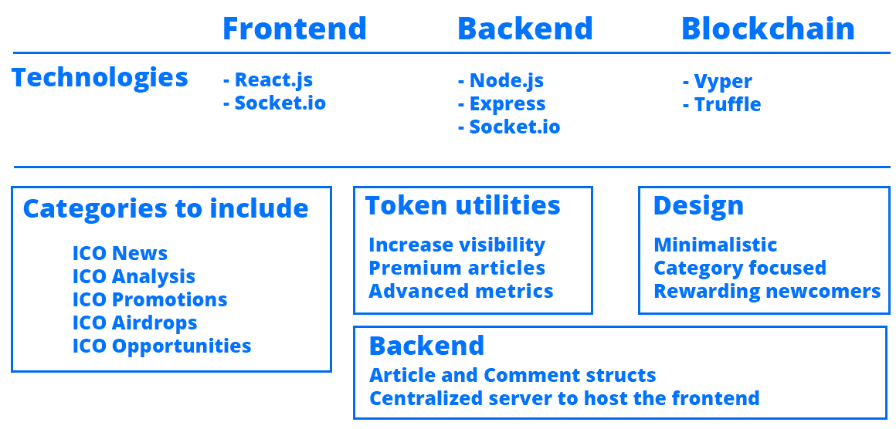

你可以在技术方面做得更深入，但在创意设计阶段，这并不是那么重要，你的目标是填补你计划创建的内容空白。这会在你意识到之前显示出对你来说重要的东西。然后，你可以创建一个你的智能合约将拥有的数据结构类型的方案，你用户界面的构建模块，以及服务器性能特性，以提供迅捷的交互。

然后，重要的是你问自己几个设计问题，比如以下几个：

+   我们将如何处理用户数量的突然增加？

+   如果我们面对像 DDoS 这样的攻击，必须采取哪些措施来保持应用程序的运行？

+   从用户的角度看，成功的交互是什么样的？

+   我们认为我们将面临不确定性的地方在哪里，有哪些事情还不够清晰？

+   所有核心功能完成的现实日期是什么？

+   这个想法的**最小可行产品**（**MVP**）是什么样子？哪些功能是必不可少的？

+   我们什么时候能完成 MVP？

+   我们为普通用户解决了什么问题？

+   我们提供了哪些解决方案，他们在其他地方找不到？

+   我们如何在开始之前发现或创造对我们想法的需求？

+   我们能否让早期用户帮助我们提供专门针对这类人的产品？

+   我们的理想用户是什么样的：他们做什么，他们的爱好是什么，他们在网上待在哪里（以便我们可以将他们纳入到创建更好产品的开发过程中）？

+   我们的目的是什么，为什么要做这件事？列出背后为什么的三个原因。

+   我们在哪些方面可以做得更好、更快、更高效？

从这里开始，你可以根据这些想法开始创建你的去中心化应用。务必创建一个免费且易于使用的 Google 表单，以澄清你认为相关的所有问题及更多问题。在回答中要明确和详细。永远记住专注于解决用户存在的问题。成功交付高质量的去中心化应用的关键是有一个坚实的基础，明确你为何这样做，以便在困难时保持动力—这就是为什么问题如此重要。这是从内心获得动力以面对困难任务的诀窍。

让我们回顾一下你到目前为止学到的东西。你学会了用几种心智工具来揭示你想法的薄弱点，以便你可以创建坚实的应用而不陷入设计不良交互中。你明白了优秀问题是清晰思考的核心基础。你希望自己能提出尽可能多的问题，并把它们写下来以记住你的目的，这样你就可以充分激励自己继续并完成你的目标。继续阅读下一节以了解更多有关设置开发环境的信息。

# 安装以太坊和 Truffle

要创建真正强大的去中心化应用，我们需要有本地版本的以太坊和 Truffle。你不能单独获取以太坊；你需要使用一个客户端，这在这种情况下将是 Geth。Truffle 是一个在你的机器上创建、部署和测试 dApp 的框架，无需等待外部服务，一切都在一个地方。

以太坊有不同的实现方式，最著名的是 Parity 和 Geth。当涉及到安装以太坊时，实际上是获取一个实现其协议的客户端，所以你可以选择你喜欢的开发系统。

让我们继续安装以太坊和 Truffle。首先，在 Mac 上获取以太坊，你需要运行以下命令：

```
brew update && brew upgrade
brew tap ethereum/ethereum
brew install ethereum
```

这将在几分钟内为你的 Mac 编译所有需要的代码。要在 Windows 上获取 Geth，你需要从官方网站下载二进制文件：[`geth.ethereum.org/downloads/`](https://geth.ethereum.org/downloads/)；你也可以获取其他系统的二进制文件，但是尽可能在终端中安装 Geth 会更容易和有趣。然后，只需打开 `geth.exe` 文件运行以太坊。

要在 Linux 上安装以太坊，你必须在终端上执行以下命令：

```
sudo apt-get install software-properties-common
sudo add-apt-repository -y ppa:ethereum/ethereum 
sudo apt-get update && sudo apt-get upgrade
sudo apt-get install ethereum
```

现在，要获取 Truffle，你需要执行一些额外的步骤：

1.  首先，从官方网站[`nodejs.org`](http://nodejs.org)安装 Node.js LTS 版本。

1.  然后，使用文件浏览器打开它以运行安装过程

1.  安装完成后，运行 `node -v` 或 `nodejs -v`；如果不起作用，请验证是否已安装

1.  运行 `npm i -g truffle` 安装 `truffle`

您现在可以通过在空文件夹上运行以下命令来为您的项目使用 Truffle，该命令将为任何`truffle`项目生成所需的文件结构：

```
truffle init
```

# 设置和配置以太坊和 Truffle

现在我们有了所需的工具，我们将设置基本的文件结构，以便我们有一个干净的环境来处理我们所需的所有 dApps。只要您需要，您就可以一次又一次地使用它，因为它已经设置了所有的依赖项。

首先，让我们创建一个名为`dapp`的文件夹，其中将包含我们的所有文件。然后，使用您的终端或命令行，在`dapp`文件夹内执行`truffle init`以设置 Truffle，确保您在`dapp`文件夹内。

在该文件夹中安装 Truffle 后，运行`npm init`来设置 Node.js 的`package.json`文件，这将允许您安装 npm 插件。它会要求您提供有关您的项目的一些常规信息；只需按照您的意愿填写或按*Enter*键留空，这是我通常所做的，除非我打算将该项目分发给其他人使用。

您将看到您已创建以下文件夹：

+   `contracts/`：您的合同将放在这里。现在，它有一个迁移合同，以更新您的合同，因为您改进了您的代码。

+   `migrations/`：这里是您定义智能合约将如何部署、构造函数将有哪些参数等的地方。

+   `test/`：您的智能合约和 dApps 的测试将放在这里。

+   `package.json`：主要的 npm 文件，用于从节点注册表中安装包。

+   `truffle-config.js`：一个配置文件，用于定义如何连接到区块链，您将使用哪个以太坊帐户等。

# 安装所需的软件包

现在我们要做的是安装我们将用于使用 React 和 webpack 的基本包。首先，使用以下命令将您的`npm`版本更新为最新版本：

```
npm i -g npm@latest
```

如果您还没有这样做，请进入您的`dapp`项目文件夹，并使用以下命令安装`webpack`：

```
npm i -S webpack webpack-cli
```

Webpack 是一个实用工具，它会将所有 JavaScript 文件合并为一个单一的、庞大的、易于管理的 JavaScript 文件，以便您可以优化开发时间。

安装了 Webpack 后，安装所有`babel`依赖项。Babel 是一个实用工具，它与 webpack 一起工作，将您的 JavaScript 文件转换为最新版本，以便每个浏览器都与新的 JavaScript 功能兼容，鉴于各种浏览器之间存在重大差异需要进行标准化。Babel 就是这样做的，您可以这样安装它：

```
npm i -S @babel/core @babel/preset-env @babel/preset-react babel-loader
```

然后，我们需要安装`react.js`，因为我们将在我们的项目中使用它，如下所示：

```
npm i -S react react-dom
```

# 设置 webpack

我们现在可以生成`webpack.config.js`文件，其中我们将指定如何处理我们的 JavaScript 文件，以及组合版本将部署到何处。在您的`dapp/文件夹`的根级别创建一个空的`webpack.config.js`文件，并使用以下配置：

```
const path = require('path')

module.exports = {
    entry: './src/index.js',
    output: {
        filename: 'bundle.js',
        path: path.join(__dirname, 'dist')
    },
    module: {
        rules: [
            {
                test: /\.js$/,
                exclude: /node_modules/,
                use: {
                    loader: 'babel-loader'
                }
            }
        ]
    }
}
```

模块导出是在`node.js`项目中使用的导出对象。它包含`rules`数组，其中你指示哪些文件必须通过哪些编译器，这里是`babel-loader`。入口和输出属性定义了在合并文件后生成文件的位置。增加 webpack 配置文件中的一些额外信息以定义 HTML 结果文件；这是为了自动生成一个包含你的 JavaScript 文件的有效 HTML 页面。安装以下加载器：

```
npm i -S html-webpack-plugin html-loader
```

更新你的 webpack 配置如下：

```
const html = require('html-webpack-plugin')
const path = require('path')

module.exports = {
    entry: './src/index.js',
    output: {
        filename: 'bundle.js',
        path: path.join(__dirname, 'dist')
    },
    module: {
        rules: [
            {
                test: /\.js$/,
                exclude: /node_modules/,
                use: {
                    loader: 'babel-loader'
                }
            }
        ]
    },
    plugins: [
        new html({
            template: './src/index.html',
            filename: './index.html'
        })
    ]
}
```

# 设置源文件夹

让我们看看设置源文件夹的以下步骤：

1.  创建一个`src`文件夹，所有你的开发代码都会在这里。现在你的项目设置应该是这样的：

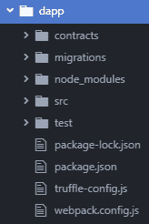

1.  在`src/`中创建一个名为`index.html`的新文件，使用以下代码：

```
<!DOCTYPE html>
<html lang="en" dir="ltr">
    <head>
        <meta charset="utf-8">
        <title>Startup</title>
    </head>
    <body>
        <div id="root"></div>
    </body>
</html>
```

1.  `<div id="root">`对象将是我们 React 项目的起点。有了 HTML、`webpack` 和 `babel` 设置，我们可以开始创建主`react.js`文件。在`src/`文件夹中创建一个名为`index.jsx`的文件，里面包含我们的初始`react.js`文件：

```
import React from 'react'
import ReactDOM from 'react-dom'

class Main extends React.Component {
    constructor() {
        super()
    }

    render() {
        return (
            <div>The project has been setup.</div>
        )
    }
}

ReactDOM.render(<Main />, document.querySelector('#root'))
```

在这里，我们导入`React`和 ReactDOM，将 React 与我们的 HTML 文件连接起来。然后，我们创建一个`Main`类，它有一个简单的构造函数和一个`render()`函数，该函数返回一个确认项目已正确设置的消息。

1.  最后，使用以下命令编译这些文件，其中`-p`表示生产环境：

```
webpack -p
```

1.  记得在你的项目文件夹中执行。编译文件后，你需要运行一个静态服务器，将文件传送到你的浏览器，以便你可以使用你的 dApp。为此，使用以下命令安装`http-server`：

```
npm i -g http-server
```

1.  然后，为你的分发文件运行它：

```
http-server dist/
```

1.  在浏览器中打开`localhost: 8080`，即可查看你的 dApp 项目实时展示：

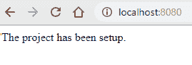

恭喜！你现在拥有一个可以复制到其他想要创建的 dApp 的工作启动项目。

你可以将项目发布到你的 GitHub 上，以便在其他情况下需要时克隆它，执行以下步骤：

1.  打开[`github.com`](https://github.com)，点击 New 创建一个新的仓库。命名为`dapp`，选择 gitignore Node 和 MIT 许可证。这是我创建的一个示例：[`github.com/merlox/dapp`](https://github.com/merlox/dapp)。

1.  现在，回到你的终端并键入`git init`，如果你的系统上已安装了`git`。\那将在你的文件夹中启动一个新的 GitHub 项目。

1.  然后，当你在使用自己的凭证提交新文件时，你需要告诉 GitHub 你想要更新哪个仓库的更改；你可以使用以下命令来永久执行所有这些操作：

```
git config remote.origin.url https://<YOUR-USERNAME>:<YOUR-PASSWORD>@github.com/<YOUR-USERNAME>/dapp
```

1.  用以下命令从你的仓库中拉取初始许可文件：

```
git pull
```

1.  使用`git add .`添加你的文件，用`git commit -m`进行提交。首先，提交它们，然后用`git push origin master`推送它们。接下来，你将在你的新存储库中看到你的文件。

记得不要推送任何新的更改，因为你希望这个存储库在未来使用相同文件结构的项目中保持不变。

# 创建 dApps

你现在已经准备好用 Truffle, React, Webpack 和 Solidity 创建 dApps。为了尽快获得必要的知识，我们将经历创建一个完全可行的分散式应用程序所需的所有步骤。在本章中，我们正在创建一个音乐推荐社交媒体平台，在这里人们将能够发布他们当时喜欢的歌曲，以帮助他们的朋友找到有趣的音乐来享受，所有这些都存储在智能合约内，而不需要一个集中的服务器。

我们将首先创建智能合约，然后是用户界面，最后，我们将用`web3.js`将它们全部结合在一起。在主界面完成后，我们将测试我们的分散式应用程序，以确保它正常运作。

# 创建智能合约

在直接创建智能合约之前，让我们定义我们需要它做什么：

+   我们需要一个数组，它将以字符串或 bytes32 格式存储每个用户的音乐推荐

+   一个用于定义用户信息的结构体

+   一个包含每个用户推荐的映射

+   一个关注用户的数组，这样我们可以看到新的音乐更新

跟往常一样，我们从创建基本的智能`contract`结构开始：

```
pragma solidity 0.5.0;

contract SocialMusic {

}
```

接下来，我们定义我们将使用的变量，如下所示：

```
pragma solidity 0.5.0;

contract SocialMusic {
    struct User {
        bytes32 name;
        uint256 age;
        string state; // A short description of who they are or how they feel
        string[] musicRecommendations;
        address[] following;
    }
    mapping(address => User) public users;
}
```

每个用户结构体将保存该用户做出的所有音乐推荐。现在，我们需要创建函数来添加新的音乐推荐。我们不会有函数来删除或修改过去的推荐，因为我们希望它成为分享过去和现在的音乐品味的永久场所，如下所示：

```
pragma solidity 0.5.0;

contract SocialMusic {
 struct User {
 bytes32 name;
 uint256 age;
 string state; // A short description of who they are or how they feel
 string[] musicRecommendations;
 address[] following;
 }
 mapping(address => User) public users;

    // To add a new musical recommendation
    function addSong(string memory _songName) public {
        require(bytes(_songName).length > 0 && bytes(_songName).length <= 100);
        users[msg.sender].musicRecommendations.push(_songName);
    }
}
```

`addSong()`函数接受歌曲名作为字符串，并将该歌曲推荐到特定以太坊地址的音乐推荐数组中。_songName_ 必须在 1 和`100`个字符长之间，以避免极大或空的推荐。

然后，我们需要创建用于创建新用户和关注其他用户的函数。人们可以只用他们的地址发布音乐推荐，如果他们不想设置他们的`姓名`、`年龄`和`州`，他们将是匿名的，因此`setup`函数是可选的：

```
pragma solidity 0.5.0;

contract SocialMusic {
    struct User {
        bytes32 name;
        uint256 age;
        string state; // A short description of who they are or how they feel
        string[] musicRecommendations;
        address[] following;
    }
    mapping(address => User) public users;

    // To add a new musical recommendation
    function addSong(string memory _songName) public {
        require(bytes(_songName).length > 0 && bytes(_songName).length <= 100);
        users[msg.sender].musicRecommendations.push(_songName);
    }

    // To setup user information
    function setup(bytes32 _name, uint256 _age, string memory _state) public {
        require(_name.length > 0);
        User memory newUser = User(_name, _age, _state, users[msg.sender].musicRecommendations, users[msg.sender].following);
        users[msg.sender] = newUser;
    }
}
```

`setup`函数必须至少接收用户的`_name`，其他参数是可选的，而在设置之前做出的推荐将与该用户保持链接。以下是`follow`函数的样子：

```
// To follow new users
function follow(address _user) public {
    require(_user != address(0));
    users[msg.sender].following.push(_user);
}
```

我们只是将一个新地址推送到以下用户的数组中。你可以使用 Remix 手动测试所有功能来部署你的合约。要使用 Truffle 部署它，我们首先需要设置`truffle-config.js`配置文件，并确保我们的`SocialMusic.sol`文件位于项目的`contracts/文件夹`中。正如你在之前的课程中学到的那样，要为`ropsten`设置`truffle-config.js`，我们需要取消注释第 63 行的`ropsten`对象：

```
    ropsten: {
      provider: () => new HDWalletProvider(mnemonic, `https://ropsten.infura.io/${infuraKey}`),
      network_id: 3, // Ropsten's id
      gas: 5500000, // Ropsten has a lower block limit than mainnet
      confirmations: 2, // # of confs to wait between deployments. (default: 0)
      timeoutBlocks: 200, // # of blocks before a deployment times out (minimum/default: 50)
      skipDryRun: true // Skip dry run before migrations? (default: false for public nets )
    },
```

然后，在文件开头的第 21 行取消注释变量：

```
const HDWalletProvider = require('truffle-hdwallet-provider');
const infuraKey = "fj4jll3k.....";

const fs = require('fs');
const mnemonic = fs.readFileSync(".secret").toString().trim();
```

将你的`infuraKey`更改为你的个人密钥，你可以在`infura.io`创建项目后找到。如果你不知道如何获取`infuraKey`，请返回到第三章，*以太坊资产*，并执行以下代码：

```
const infuraKey = "v3/8e12dd4433454738a522d9ea7ffcf2cc";
```

创建一个包含你的 MetaMask 助记词的`.secret`文件，Truffle 将使用它来使用你的第一个以太坊帐户部署你的`SocialMusic`智能合约。如果你正在进行 git 项目的开发，请确保将`.secret`添加到你的`.gitignore`文件中，这样你的帐户就不会泄露给别人看到并窃取你的以太币。

在部署你的合约之前，你需要安装钱包提供程序，以便`truffle`可以访问你的帐户：

```
npm i -S truffle-hdwallet-provider
```

现在，你需要告诉 Truffle 你想要部署哪些合约。你可以通过打开`migrations/1_initial_migrations.js`文件并相应更改来实现：

```
const SocialMusic = artifacts.require("./SocialMusic.sol")

module.exports = function(deployer) {
  deployer.deploy(SocialMusic)
}
```

在设置好秘密助记词之后，为`ropsten`部署你的合约；记得要有足够的`ropsten`以太币用于部署：

```
truffle deploy --network ropsten --reset
```

`--reset`标志将强制 Truffle 部署新版本的合约，如果你之前部署的是无效的。Truffle 的好处在于设置好一切之后，你可以非常高效地快速部署新版本的合约进行测试。如果一切都运行成功，你将看到类似于下面的内容：

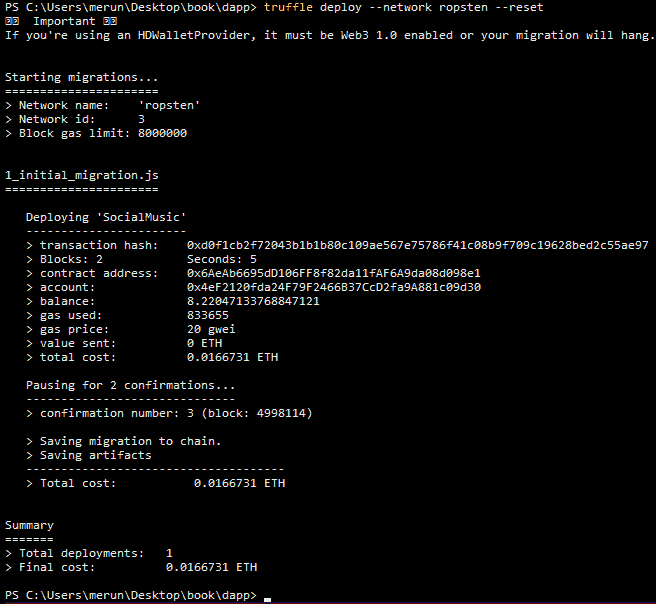

恭喜！你刚刚部署了你的`SocialMusic`智能合约。继续阅读，了解如何创建我们将用于与智能合约交互的用户界面。

# 创建用户界面

因为我们有一个干净的`react.js`项目正确设置，所以我们可以立即开始创建我们应用程序的用户界面。我们将使用示例数据来检查设计，然后再移动并集成真实的智能合约代码。

打开`src/index.js`文件开始编写你的设计：

```
import React from 'react'
import ReactDOM from 'react-dom'

class Main extends React.Component {
    constructor() {
        super()
    }

    render() {
        return (
            <div>
                <h1>Welcome to Decentralized Social Music!</h1>
                <p>Setup your account, start adding musical recommendations for your friends and follow people that may interest you</p>
                <div className="buttons-container">
                    <button>Setup Account</button>
                    <button>Add Music</button>
                    <button>Follow People</button>
                </div>
                <h3>Latest musical recommendations from people using the dApp</h3>
                <div ref="general-recommendations"></div>
            </div>
        )
    }
}

ReactDOM.render(<Main />, document.querySelector('#root'))
```

我们将设计写在`render()`函数内部，因为这是所有代码将显示给用户的地方。我创建了两个主要部分：一个`h1`欢迎用户来到 dApp，并显示给他们三个按钮开始使用它的简短消息，以及一个`h3`部分向用户展示网络上随机人员最新的 10 条音乐推荐：

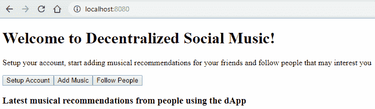

为了改善应用程序的外观，我们将使用一些基本的 CSS，让用户感觉很棒。在`src/`目录下创建一个名为`index.css`的新文件。为了能够在我们的`react.js`应用程序中使用 CSS，我们需要使用一个新的加载程序来理解 CSS。打开你的`webpack.config.js`文件，在 rules 块中添加以下部分，就像之前使用其他加载程序一样：

```
{
    test: /\.css$/,
    exclude: /node_modules/,
    use: [
        {loader: 'style-loader'},
        {loader: 'css-loader'}
    ]
}
```

然后，安装`css-loader`和`style-loader`，如下所示：

```
npm i -S style-loader css-loader
```

现在，我们可以在`index.css`中编写我们的 CSS 代码，如下所示：

```
body {
    margin: 0;
    font-family: sans-serif;
    text-align: center;
}

button {
    border-radius: 10px;
    padding: 20px;
    color: white;
    border: none;
    background-color: rgb(69, 115, 233);
    cursor: pointer;
}

button:hover {
    opacity: 0.7;
}

.buttons-container button:not(:last-child){
    margin-right: 5px;
}
```

你应该得到类似以下截图的东西：

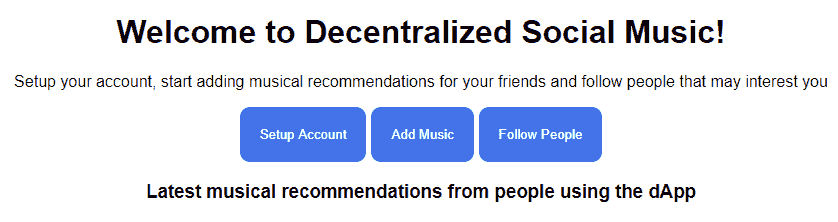

现在，我们需要实现每一个这些功能，但在此之前，让我们先创建一个名为**推荐**的新组件，它将是一个包含某个用户推荐的个人音乐推荐的个体盒子。它将是这个样子：

```
import React from 'react'
import ReactDOM from 'react-dom'
import './index.css'

class Main extends React.Component {
    constructor() {
        super()
    }

    render() {
        return (
            <div>
                <h1>Welcome to Decentralized Social Music!</h1>
                <p>Setup your account, start adding musical recommendations for your friends and follow people that may interest you</p>
                <div className="buttons-container">
                    <button>Setup Account</button>
                    <button>Add Music</button>
                    <button>Follow People</button>
                </div>
                <h3>Latest musical recommendations from people using the dApp</h3>
                <div ref="general-recommendations">
                    <Recommendation
                        name="John"
                        address="0x5912d3e530201d7B3Ff7e140421F03A7CDB386a3"
                        song="Regulate - Nate Dogg"
                    />
                </div>
            </div>
        )
    }
}

class Recommendation extends React.Component {
    constructor() {
        super()
    }

    render() {
        return (
            <div className="recommendation">
                <div className="recommendation-name">{this.props.name}</div>
                <div className="recommendation-address">{this.props.address}</div>
                <div className="recommendation-song">{this.props.song}</div>
            </div>
        )
    }
}

ReactDOM.render(<Main />, document.querySelector('#root'))
```

我们新增了一个显示三个包含推荐歌曲的名称、地址和歌曲的 div 的新组件。我还在`Main`组件中添加了一个示例用法，这样你就可以看到它是如何工作的。Props 只是你从一个组件传递到另一个组件的变量，并且它们是通过它们的变量名识别的。让我们用一些 CSS 代码改善一下外观，如下所示：

```
.recommendation {
    width: 40%;
    margin: auto;
    background-color: whitesmoke;
    border-radius: 20px;
    margin-bottom: 10px;
    padding: 40px;
}

.recommendation-name, .recommendation-address {
    display: inline-block;
    color: #444444;
    font-style: italic;
}

.recommendation-name {
    margin-right: 10px;
}

.recommendation-address {
    color: rgb(156, 156, 156);
}

.recommendation-song {
    font-weight: bolder;
    font-size: 16pt;
    margin-top: 10px;
}
```

这就是我们刚刚做的改变和一些更多音乐推荐样本的样子：

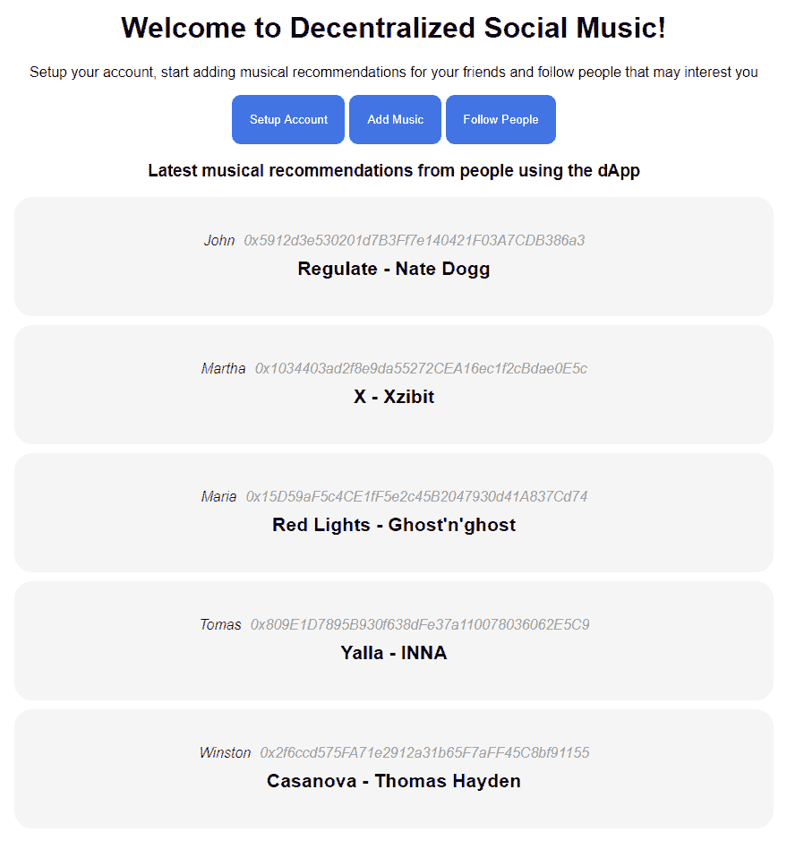

就是这样——你刚刚创建了你的去中心化`SocialMusic`平台的 UI。让我们通过集成`web3.js`使它动态起来，以便我们可以使用我们的智能合同让人们与它互动。

# 将智能合同连接到 web 应用程序

去中心化应用程序由智能合同和用户界面组成。我们现在有了这两个元素，我们可以通过使用`web3`连接前端和后端来将它们结合起来，`web3`是从浏览器与以太坊区块链交互的最强大工具。

让我们从获取`web3.js`开始。你可以用以下命令来安装它：

```
npm i -S web3
```

然后，将它导入到你的`index.js`文件中，如下所示：

```
import React from 'react'
import ReactDOM from 'react-dom'
import web3 from 'web3'
import './index.css'
```

你不需要安装`web3`，因为大多数用户（如果不是所有用户）都会安装 MetaMask，它会自动将`web3.js`注入到你的应用程序中。尽管如此，在应用程序的代码中有`web3`是一个好习惯，因为你可以控制应用程序中使用的版本。

要将我们的`react.js`应用程序完全连接到我们的`SocialMusic`合同，我们需要实现合同的每个函数，以便它们可以从我们设计的用户界面执行。我们还想要检索特定信息，比如最后推荐的五首歌曲。你可以用许多方法开始实现你的合同，所以，我们将首先让我们 web 应用程序中的所有三个按钮与智能合同正常工作。

# 设计设置表单

首先，我们有“设置账户”按钮。这个按钮应该向用户显示一个表单，其中包含几个输入来设置他们的姓名、年龄和状态，其中只有姓名是必填的。还应该有一个取消按钮和一个提交按钮。让我们创建一个新的 React 组件，我们将其称为`Form`，它将包括所有这些要求：

```
class Form extends React.Component {
    constructor() {
        super()
    }

    render() {
        return (
            <form className={this.props.className}>
                <input type="text" ref="form-name" placeholder="Your name" />
                <input type="number" ref="form-age" placeholder="Your age" />
                <textarea ref="form-state" placeholder="Your state, a description about yourself"></textarea>
                <div>
                    <button>Cancel</button>
                    <button>Submit</button> 
                </div>
            </form>
        )
    }
}
```

我们添加了两个带有文本区域的输入，用于状态和两个按钮以取消或提交。注意我在表单元素上添加了自定义`className`属性，以便我们可以从外部组件动态设置类，否则它将不起作用。我们只想在用户点击“设置账户”时显示这个表单，所以我们将表单组件添加到我们的三个按钮下面作为一个隐藏元素，因为这个位置对用户来说更有意义，因为它更靠近鼠标。我们如何在网站中隐藏一个元素？通过使用一个自定义类，将显示设置为 none。

首先，在构造函数中设置新的状态变量，以在不必要时隐藏表单：

```
class Main extends React.Component {
    constructor() {
        super()

        this.state = {
            isFormHidden: true
        }
    }
}
```

然后，在按钮下面添加`Form`组件，并使用一个动态类名来根据需要显示表单：

```
render() {
  return (
      <div>
          <h1>Welcome to Decentralized Social Music!</h1>
          <p>Setup your account, start adding musical recommendations for your friends and follow people that may interest you</p>
          <div className="buttons-container">
              <button>Setup Account</button>
              <button>Add Music</button>
              <button>Follow People</button>
          </div>

          <Form className={this.state.isFormHidden ? 'hidden' : ''} />

          <h3>Latest musical recommendations from people using the dApp</h3>
          <div ref="general-recommendations">
              <Recommendation
                  name="John"
                  address="0x5912d3e530201d7B3Ff7e140421F03A7CDB386a3"
                  song="Regulate - Nate Dogg"
              />
              <Recommendation
                  name="Martha"
                  address="0x1034403ad2f8e9da55272CEA16ec1f2cBdae0E5c"
                  song="X - Xzibit"
              />
          </div>
      </div>
  )
}
```

正如你所看到的，我添加了一个叫做`isFormHidden`的状态元素，它指示表单是否隐藏。然后，我设置了我们的`Form`的`className`作为一个依赖于状态的动态组件，以便在适当的时候保持隐藏。我们需要使用 React 的状态，因为这是 React 更新正在显示的信息的主要方式。React 对状态是响应式的，所以每当它改变时，它就会更新整个 Web 应用程序。如果我们简单地选择组件并直接更新它的类，React 就不会知道发生了什么，并且会变得混乱，因为状态是每个交互式 Web 应用程序的重要组成部分。

然后，创建一个 CSS 类来隐藏它，如下所示：

```
.hidden {
    display: none;
}
```

在实时页面上查看结果。你不应该看到任何东西，因为你的表单是隐藏的。要显示它，你必须在“设置账户”按钮上添加一个`onClick`事件，如下所示：

```
<button onClick={() => {
    if(this.state.isFormHidden) this.setState({isFormHidden: false})
    else this.setState({isFormHidden: true})
}}>Setup Account</button>
```

这将读取表单的状态以在点击时隐藏或显示它。你会发现设计是一团糟，所以我们必须改进它：

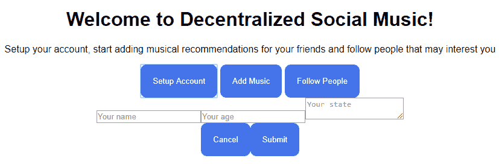

为每个输入添加一个新的通用类，用不同的类来区分文本区域，如下所示：

```
<form className={this.props.className}>
    <input className="form-input" type="text" ref="form-name" placeholder="Your name" />
    <input className="form-input" type="number" ref="form-age" placeholder="Your age" />
    <textarea className="form-input form-textarea" ref="form-state" placeholder="Your state, a description about yourself"></textarea>

    <div>
        <button className="cancel-button">Cancel</button>
        <button>Submit</button>
    </div>
</form>
```

然后，创建具有所需外观的新 CSS 类，如下所示：

```
.form-input {
    display: block;
    width: 200px;
    border-radius: 20px;
    padding: 20px;
    border: 1px solid #444444;
    margin: 10px auto;
}

.form-textarea {
    height: 200px;
}

.cancel-button {
    margin-right: 10px;
}
```

这是在样式更改后的外观：

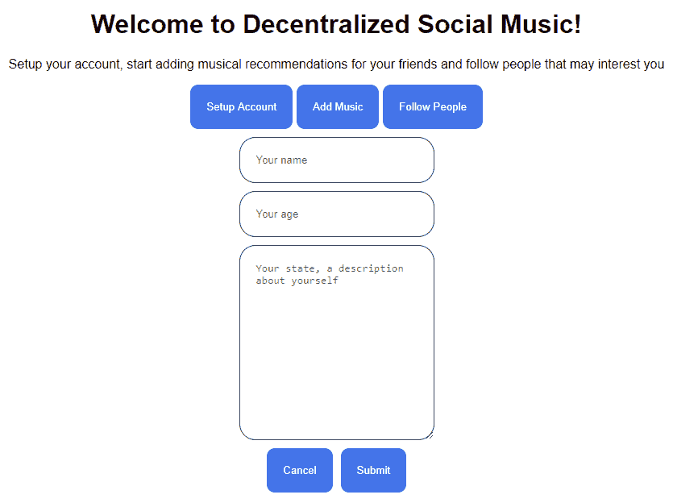

看起来好多了。

# 实现设置功能

现在，我们必须让它与我们的智能合约交互。为此，我们将不得不在`ropsten`上创建我们部署的合约的新实例。我们需要地址和`ABI`接口，你可以在 Truffle 为你部署`SocialMusic`合约时创建的`build/contracts/`文件夹中快速找到它们。只需将`SocialMusic.json`复制到你的`src/文件夹`以便更容易访问。请记住，如果决定扩展其功能，则需要用新的 ABI 版本替换该文件。只需重复相同的步骤即可：

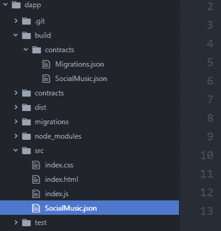

接下来，我们需要一种方法来在我们的 React 应用程序中导入该 JSON 文件。幸运的是，如果你使用的是 webpack 2.0 或更新版本（我目前使用的是 4.19），则无需执行任何额外操作，因为 webpack 默认支持 JSON 文件。在之前的版本中，你必须添加一个新的`json-loader`来处理这些文件。只需在文件开头添加文件，如下所示：

```
import React from 'react'
import ReactDOM from 'react-dom'
import web3 from 'web3'
import './index.css'
import ABI from './SocialMusic.json'
```

你可以使用你想要的名称导入你的 JSON 文件；`ABI`变量的目的是为了能够读取 JSON 文件的值。然后，创建一个变量，其中包含你的智能合约的地址和你的`abi`接口。请记住，你可以随时使用 Truffle 使用`deploy --network ropsten --reset`部署新版本以获取新地址（如果你丢失了它）：

```
class Main extends React.Component {
    constructor() {
        super()

        const contractAddress = '0x0217ED41bC271a712f91477c305957Da44f91068'
        const abi = ABI.abi

        this.state = {
            isFormHidden: true
        }
    }
    ...
}
```

我们希望使用我们自己版本的 web3 1.0 部署合约，因为 MetaMask 注入的版本已过时，我们无法依赖于不受控制的版本。这就是为什么我们会创建一个新的 web3 实例，如下所示：

```
import React from 'react'
import ReactDOM from 'react-dom'
import myWEB3 from 'web3'
import './index.css'
import ABI from './SocialMusic.json'

class Main extends React.Component {
    constructor() {
        super()

        window.myWeb3 = new myWEB3(myWEB3.givenProvider)
        const contractAddress = '0x0217ED41bC271a712f91477c305957Da44f91068'
        const abi = ABI.abi

        this.state = {
            isFormHidden: true
        }
    }
...
```

我将`web3`变量重命名为`myWeb3`，以避免与 MetaMask 注入的变量混淆。请注意`myWeb3`前面的`window`关键字；这用于将该变量设置为全局，以便你可以从你的 dApp 中的任何位置访问`myWeb3`。通过在任何地方都可以访问我们的自定义 web3，生活会变得更加轻松。稍后我们将使用带有 async await 的 promises。为了能够在这个版本的 webpack/babel 中使用 async await，你需要安装`babel-polyfill`，它负责编译你的 async 代码，以便在所有浏览器上正常工作。使用以下命令安装：

```
npm i -S babel-polyfill
```

然后，将其添加到你的 webpack 配置文件中，如下所示：

```
require('babel-polyfill')
const html = require('html-webpack-plugin')
const path = require('path')

module.exports = {
    entry: ['babel-polyfill', './src/index.js'],
    output: {
        filename: 'bundle.js',
        path: path.join(__dirname, 'dist')
    },
...
```

现在，我们将使用一些辅助函数和`setupAccount`函数的集成来创建合约的实例。

首先，更新构造函数以在 dApp 加载时执行设置合约实例的函数，如下所示：

```
constructor() {
    super()

    window.myWeb3 = new myWEB3(myWEB3.givenProvider)
    this.state = {
        isFormHidden: true
    }

    this.setContractInstance()
}
```

然后，创建所需的函数来正确设置用户帐户和合约，如下所示：

```
async getAccount() {
 return (await myWeb3.eth.getAccounts())[0]
}

async setContractInstance() {
    const contractAddress = '0x0217ED41bC271a712f91477c305957Da44f91068'
    const abi = ABI.abi
    const contractInstance = new myWeb3.eth.Contract(abi, contractAddress, {
        from: await this.getAccount(),
        gasPrice: 2e9
    })
    await this.setState({contractInstance: contractInstance})
}

async setupAccount(name, age, status) {
    await this.state.contractInstance.methods.setup(this.fillBytes32WithSpaces(name), age, status).send({from: '0x2f6ccd575FA71e2912a31b65F7aFF45C8bf91155'})
}

fillBytes32WithSpaces(name) {
    let nameHex = myWeb3.utils.toHex(name)
    for(let i = nameHex.length; i < 66; i++) {
        nameHex = nameHex + '0'
    }
    return nameHex
}
```

然后，在你的`render()`函数中使用`Form` props 来告诉 React 用户单击设置按钮时要执行什么操作，以及用户单击取消按钮时要执行什么操作：

```
render() {
    return (
        <div>
            <h1>Welcome to Decentralized Social Music!</h1>
            <p>Setup your account, start adding musical recommendations for your friends and follow people that may interest you</p>
            <div className="buttons-container">
                <button onClick={() => {
                    if(this.state.isFormHidden) this.setState({isFormHidden: false})
                    else this.setState({isFormHidden: true})
                }}>Setup Account</button>
                <button>Add Music</button>
                <button>Follow People</button>
            </div>

            <Form
                className={this.state.isFormHidden ? 'hidden' : ''}
                cancel={() => {
                    this.setState({isFormHidden: true})
                }}
                setupAccount={(name, age, status) => {
                    this.setupAccount(name, age, status)
                }}
            />

            <h3>Latest musical recommendations from people using the dApp</h3>
            <div ref="general-recommendations">
                <Recommendation
                    name="John"
                    address="0x5912d3e530201d7B3Ff7e140421F03A7CDB386a3"
                    song="Regulate - Nate Dogg"
                />
                <Recommendation
                    name="Martha"
                    address="0x1034403ad2f8e9da55272CEA16ec1f2cBdae0E5c"
                    song="X - Xzibit"
                />
            </div>
        </div>
    )
}
```

最后，更新你的`Form`组件，添加新功能以在用户与输入交互时触发设置功能：

```
class Form extends React.Component {
    constructor() {
        super()
    }

    render() {
        return (
            <form className={this.props.className}>
                <input className="form-input" type="text" ref="form-name" placeholder="Your name" />
                <input className="form-input" type="number" ref="form-age" placeholder="Your age" />
                <textarea className="form-input form-textarea" ref="form-state" placeholder="Your state, a description about yourself"></textarea>
                <div>
                    <button onClick={event => {
                        event.preventDefault()
                        this.props.cancel()
                    }} className="cancel-button">Cancel</button>
                    <button onClick={event => {
                        event.preventDefault()
                        this.props.setupAccount(this.refs['form-name'].value, this.refs['form-age'].value, this.refs['form-state'].value)
                    }}>Submit</button>
                </div>
            </form>
        )
    }
}
```

这里有一些变化，让我解释一下我做了什么。

首先，我创建了`setContractInstance`函数，用于使用我们智能合约的地址设置合约实例，以便以后可以使用它执行其他功能。`getAccount`函数是一个快速获取当前用户地址的辅助函数。

然后，我创建了`setupAccount`函数，它接收我们想要用于设置用户帐户的三个参数，并使用一个名为`fillBytes32WithSpaces`的辅助函数，因为我们需要用这个版本的`web3.js`填充一个 bytes32 类型变量的所有空格，否则它会拒绝交易。此函数简单地创建了我们部署的智能合约中的`setup()`函数的事务。

接下来，我为`Form`组件创建了一些属性函数，当用户点击取消或提交时将执行这些函数。我们希望当用户取消时隐藏表单，所以我简单地将表单的状态设置为隐藏。当用户点击提交时，我们提取所有输入的数据，并将它们发送到`setupAccount`函数。请注意，我在每个按钮的点击事件内部都使用了`event.preventDefault()`，以避免刷新页面，因为所有的 HTML 按钮都是提交按钮，它们应该向服务器发送信息。

注意，在设置用户数据时我们使用了`.send()`函数，这会生成一个交易并花费 gas。在其中，我使用了我的以太坊地址，以便它知道谁应该进行交易：

```
.send({from: '0x2f6ccd575FA71e2912a31b65F7aFF45C8bf91155'})
```

但是你不想使用相同的地址，因为你无法访问它来使用你的 MetaMask。你可以简单地删除那个参数，让函数看起来像这样：

```
.send()
```

有时告诉 React 自动查找用户的地址不起作用，所以你可以设置自己的地址。记得解锁你的 MetaMask 并使用 ropsten，然后把你当前的地址粘贴到那里。

更新完变化后，与您的 dApp 进行交互，以验证它确实正在向智能合约提交交易。

现在我们要做的是设置“添加音乐”按钮，使用户可以创建音乐推荐。首先，通过更新构造函数内的状态对象，创建一个新的组件设计，就像我们之前做的那样：

```
constructor() {
    super()

    window.myWeb3 = new myWEB3(myWEB3.givenProvider)
    this.state = {
        isFormHidden: true,
        isAddMusicHidden: true
    }

    this.setContractInstance()
}
```

然后，创建一个新的`addMusic()`函数，它将把指定的歌曲推送到数组中：

```
async addMusic(music) {
    await this.state.contractInstance.methods.addSong(music).send({from: '0x2f6ccd575FA71e2912a31b65F7aFF45C8bf91155'})
}
```

通过向“添加音乐”按钮添加`onClick`事件监听器来更新`state`以显示添加音乐表单。然后，添加新的`AddMusic`组件，就像这样：

```
render() {
    return (
        <div>
            <h1>Welcome to Decentralized Social Music!</h1>
            <p>Setup your account, start adding musical recommendations for your friends and follow people that may interest you</p>
            <div className="buttons-container">
                <button onClick={() => {
                    if(this.state.isFormHidden) this.setState({isFormHidden: false})
                    else this.setState({isFormHidden: true})
                }}>Setup Account</button>
                <button onClick={() => {
                    if(this.state.isAddMusicHidden) this.setState({isAddMusicHidden: false})
                    else this.setState({isAddMusicHidden: true})
                }}>Add Music</button>
                <button>Follow People</button>
            </div>

            <Form
                className={this.state.isFormHidden ? 'hidden' : ''}
                cancel={() => {
                    this.setState({isFormHidden: true})
                }}
                setupAccount={(name, age, status) => {
                    this.setupAccount(name, age, status)
                }}
            />

            <AddMusic
                className={this.state.isAddMusicHidden ? 'hidden': ''}
                cancel={() => {
                    this.setState({isAddMusicHidden: true})
                }}
                addMusic={music => {
                    this.addMusic(music)
                }}
            />

            <h3>Latest musical recommendations from people using the dApp</h3>
            <div ref="general-recommendations">
                <Recommendation
                    name="John"
                    address="0x5912d3e530201d7B3Ff7e140421F03A7CDB386a3"
                    song="Regulate - Nate Dogg"
                />
                <Recommendation
                    name="Martha"
                    address="0x1034403ad2f8e9da55272CEA16ec1f2cBdae0E5c"
                    song="X - Xzibit"
                />
            </div>
        </div>
    )
}
```

最后，使用`class`函数定义新的`AddMusic`组件：

```
class AddMusic extends React.Component {
    constructor() {
        super()
    }

    render() {
        return(
            <div className={this.props.className}>
                <input type="text" ref="add-music-input" className="form-input" placeholder="Your song recommendation"/>
                <div>
                    <button onClick={event => {
                        event.preventDefault()
                        this.props.cancel()
                    }} className="cancel-button">Cancel</button>
                    <button onClick={event => {
                        event.preventDefault()
                        this.props.addMusic(this.refs['add-music-input'].value)
                    }}>Submit</button>
                </div>
            </div>
        )
    }
}
```

我们遵循了创建`Form`组件时所做的相同步骤。只需设置渲染 HTML，将`AddMusic`元素放在`Form`元素下方，同时保持隐藏，并设置所有 prop 函数。然后，创建一个将新歌曲添加到智能合约的函数。我们还为切换这些按钮的隐藏类创建了一个新的状态变量。

您可能已经注意到，如果您先单击“添加歌曲”，然后立即单击“设置帐户”而不取消，那些 div 会保持打开状态——这不是我们想要的。我们希望在任何给定时间内仅保持一个部分处于打开状态。我们可以通过一个函数来更新隐藏所有组件的状态来实现这一点，然后再打开新的组件，如下所示：

```
hideAllSections() {
    this.setState({
        isFormHidden: true,
        isAddMusicHidden: true
    })
}
```

然后，在打开部分之前添加函数调用到按钮：

```
<button onClick={() => {
    this.hideAllSections()
    if(this.state.isFormHidden) this.setState({isFormHidden: false})
    else this.setState({isFormHidden: true})
}}>Setup Account</button>
<button onClick={() => {
    this.hideAllSections()
    if(this.state.isAddMusicHidden) this.setState({isAddMusicHidden: false})
    else this.setState({isAddMusicHidden: true})
}}>Add Music</button>
```

让我们添加最终的按钮功能，以便关注其他用户。我们将显示所有已注册用户的列表，以便用户可以关注自己喜欢的用户以获取更新。为了实现这一点，我们将不得不修改我们的合同，以便我们可以添加一个包含最新新人的数组，当用户执行`setup`函数时会更新该数组，如下所示：

```
pragma solidity 0.5.0;

contract SocialMusic {
    struct User {
        bytes32 name;
        uint256 age;
        string state; // A short description of who they are or how they feel
        string[] musicRecommendations;
        address[] following;
    }
    mapping(address => User) public users;
    address[] public userList;

    // To add a new musical recommendation
    function addSong(string memory _songName) public {
        require(bytes(_songName).length > 0 && bytes(_songName).length <= 100);
        users[msg.sender].musicRecommendations.push(_songName);
    }

    // To setup user information
    function setup(bytes32 _name, uint256 _age, string memory _state) public {
        require(_name.length > 0);
        User memory newUser = User(_name, _age, _state, users[msg.sender].musicRecommendations, users[msg.sender].following);
        users[msg.sender] = newUser;
        userList.push(msg.sender);
    }

    // To follow new users
    function follow(address _user) public {
        require(_user != address(0));
        users[msg.sender].following.push(_user);
    }

    // Returns the array of users
    function getUsersList() public view returns(address[] memory) {
        return userList;
    }
}
```

使用 Truffle 重新部署合同，如下所示：

```
truffle deploy --network ropsten --reset
```

我们将直接从构建文件夹中获取所有信息，包括地址，而不是手动复制新地址并更新 json 文件，如下所示：

```
import ABI from '../build/contracts/SocialMusic.json'

...
async setContractInstance() {
    const contractAddress = ABI.networks['3'].address
    const abi = ABI.abi
    const contractInstance = new myWeb3.eth.Contract(abi, contractAddress, {
        from: await this.getAccount(),
        gasPrice: 2e9
    })
    await this.setState({contractInstance: contractInstance})
}
...
```

现在，您不必每次都担心更新信息，这很棒，因为您可以自由访问不同的外部文件夹，webpack 会获取并捆绑所有所需信息，因此访问`src/`文件夹之外的文件并不重要。现在让我们创建所需的功能，以获取最新的用户，以便用户可以关注他们，并添加一些新组件：

```
class FollowPeopleContainer extends React.Component {
    constructor() {
        super()
    }

    render() {
        let followData = this.props.followUsersData
        // Remove the users that you already follow so that you don't see em
        for(let i = 0; i < followData.length; i++) {
            let indexOfFollowing = followData[i].following.indexOf(this.props.userAddress)
            if(indexOfFollowing != -1) {
                followData = followData.splice(indexOfFollowing, 1)
            }
        }
        return (
            <div className={this.props.className}>
                {followData.map(user => (
                    <FollowPeopleUnit
                        key={user.address}
                        address={user.addres}
                        age={user.age}
                        name={user.name}
                        state={user.state}
                        recommendations={user.recommendations}
                        following={user.following}
                        followUser={() => {
                            this.props.followUser(user.address)
                        }}
                    />
                ))}
            </div>
        )
    }
}

class FollowPeopleUnit extends React.Component {
    constructor() {
        super()
    }

    render() {
        return (
            <div className="follow-people-unit">
                <div className="follow-people-address">{this.props.address}</div>
                <div className="follow-people-name">{myWeb3.utils.toUtf8(this.props.name)}</div>
                <div className="follow-people-age">{this.props.age}</div>
                <div className="follow-people-state">"{this.props.state}"</div>
                <div className="follow-people-recommendation-container">
                    {this.props.recommendations.map((message, index) => (
                        <div key={index} className="follow-people-recommendation">{message}</div>
                    ))}
                </div>
                <button
                    className="follow-button"
                    onClick={() => {
                        this.props.followUser()
                    }}
                >Follow</button>
            </div>
        )
    }
}
```

`FollowPeopleContainer`只是一个组件，它保存了您可以用您的账户关注的所有用户。它将从`Main`组件中的`this.props.followUsersData` prop 接收数据，该数据发送一个包含最多 10 位用户和每位用户最多两个音乐推荐的数组，以便您可以了解他们的类型。它还从数组中删除已经关注的用户，以便您不将其视为新用户。最后，它使用一个包含所有所需用户属性的`FollowPeopleUnit`组件，并具有一个将传输所需关注特定用户信息到`Main`组件的函数。

注意在每个`FollowPeopleUnit`中的`key={user.address}`属性，因为我们需要能够单独识别它们，这是 React 强制性需要的，以避免重复元素。

另一方面，`FollowPeopleUnit`组件由一组显示所有必要信息给用户的 div 组成。因为我们在一个名为`this.props.recommendations`的数组中有两个推荐，所以我们必须循环遍历它们以逐个显示每个消息。当你想要使用 react 动态生成 HTML 元素时，你必须使用你的数组的`.map()`函数，并用圆括号`()`而不是花括号`{}`，因为所有 HTML 元素必须在这些类型的括号内。

现在我们有了两个新组件，我们必须在我们的`Main`组件中定义函数以使它们交互式；你可以在 GitHub 上查看完整的代码，这样你就知道所有东西应该放在哪里，以防你遇到错误。

首先，我们更新了地址系统，使其动态化，这样你就不必在代码中手动输入你的以太坊地址。例如，假设我们有以下代码：

```
await this.state.contractInstance.methods.follow(address).send({from: '0x2f6ccd575FA71e2912a31b65F7aFF45C8bf91155'})
```

相反，我们将使用以下代码，这对于使我们的 dApp 与许多不同的用户交互是必不可少的。您可以看到我们在`setContractInstance()`函数中设置了`userAddress`状态变量：

```
await this.state.contractInstance.methods.follow(address).send({from: this.state.userAddress})
```

接下来，我们创建了复杂的`getFollowPeopleUsersData()`函数，该函数获取最近的用户地址；它最多获取 10 个用户地址，如果用户数量不够，则获取尽可能多的用户。然后，它创建一个包含我们想要的所有属性的`userData`对象，并使用智能合约状态变量的信息填充它，首先通过使用`getUsersMusicRecommendationLength()`获取音乐推荐数组的长度，然后通过使用`getUsersMusicRecommendation()`获取每个单独的音乐推荐。在函数的底部，我们获取了那个特定人正在关注的用户数组，以防我们需要访问它们。

正如你所看到的，我们使用了智能合约中的一些新函数。这是因为如果不添加一些复杂性，我们无法使所有这些成为可能。这是我们更新后的智能合约的样子：

```
pragma solidity 0.5.0;

contract SocialMusic {
    struct User {
        bytes32 name;
        uint256 age;
        string state; // A short description of who they are or how they feel
        string[] musicRecommendations;
        address[] following;
    }
    mapping(address => User) public users;
    address[] public userList;

    // To add a new musical recommendation
    function addSong(string memory _songName) public {
        require(bytes(_songName).length > 0 && bytes(_songName).length <= 100);
        users[msg.sender].musicRecommendations.push(_songName);
    }

    // To setup user information
    function setup(bytes32 _name, uint256 _age, string memory _state) public {
        require(_name.length > 0);
        User memory newUser = User(_name, _age, _state, users[msg.sender].musicRecommendations, users[msg.sender].following);
        users[msg.sender] = newUser;
        userList.push(msg.sender);
    }

    // To follow new users
    function follow(address _user) public {
        require(_user != address(0));
        users[msg.sender].following.push(_user);
    }

    // Returns the array of users
    function getUsersList() public view returns(address[] memory) {
        return userList;
    }

    // Returns the music recommendations
    function getUsersMusicRecommendation(address _user, uint256 _recommendationIndex) public view returns(string memory) {
        return users[_user].musicRecommendations[_recommendationIndex];
    }

    // Returns how many music recommendations that user has
    function getUsersMusicRecommendationLength(address _user) public view returns(uint256) {
        return users[_user].musicRecommendations.length;
    }

    // Returns the addresses of the users _user is following
    function getUsersFollowings(address _user) public view returns(address[] memory) {
        return users[_user].following;
    }
}
```

有一些函数用于从各自的数组中检索每个特定人的以下和推荐数据。这是因为我们不能只使用公共数组自动获取整个数组；正如你所知，公共数组每次只返回整个数组的一个元素，所以我们需要一个函数来完整获取它。字符串也是同样的情况——我们必须创建一个函数来逐个获取每个字符串，因为我们不能只发送一个字符串数组，考虑到它们是低级多维度的`byte[][]`数组。Solidity 不允许你发送`byte[][][]`，它将是等同于`string[]`的等价物，因为它太大且太复杂了。

记得在用 Truffle 进行更改后重新部署你的代码，`deploy --network ropsten --reset`。现在，你不需要更新智能合约地址，也不需要将 ABI 复制到源文件夹中，因为它被设置为直接从构建文件夹中获取部署的合约数据。

我们的 dApp 看起来还不够好，所以这里是你参考的整个 CSS 代码，如果你想要达到相同的外观：

```
body {
    margin: 0;
    font-family: sans-serif;
    text-align: center;
}

button {
    border-radius: 10px;
    padding: 20px;
    color: white;
    border: none;
    background-color: rgb(69, 115, 233);
    cursor: pointer;
}

button:hover {
    opacity: 0.7;
}

.hidden {
    display: none;
}

.buttons-container button:not(:last-child){
    margin-right: 5px;
}

.recommendation {
    width: 40%;
    margin: auto;
    background-color: whitesmoke;
    border-radius: 20px;
    margin-bottom: 10px;
    padding: 40px;
}

.follow-people-unit {
    width: 40%;
    background-color: whitesmoke;
    border-radius: 20px;
    margin: 10px auto;
    padding: 20px;
}

.recommendation-name, .recommendation-address, .follow-people-address, .follow-people-name, .follow-people-age {
    display: inline-block;
    color: #444444;
    font-style: italic;
}

.recommendation-name, .follow-people-name {
    margin-right: 10px;
}

.recommendation-address, .follow-people-address {
    color: rgb(156, 156, 156);
}

.recommendation-song, .follow-people-recommendation {
    font-weight: bolder;
    font-size: 16pt;
    margin-top: 10px;
}

.form-input {
    display: block;
    width: 200px;
    border-radius: 20px;
    padding: 20px;
    border: 1px solid #444444;
    margin: 10px auto;
}

.form-textarea {
    height: 200px;
}

.cancel-button {
    margin-right: 10px;
}

.follow-people-state {
    font-style: italic;
    font-weight: bolder;
    color: #444444;
}

.follow-button {
    margin-top: 10px;
}
```

这是最终结果的截图，你可以通过`webpack -d`和`http-server dist/to`在`localhost:8080`上看到它：

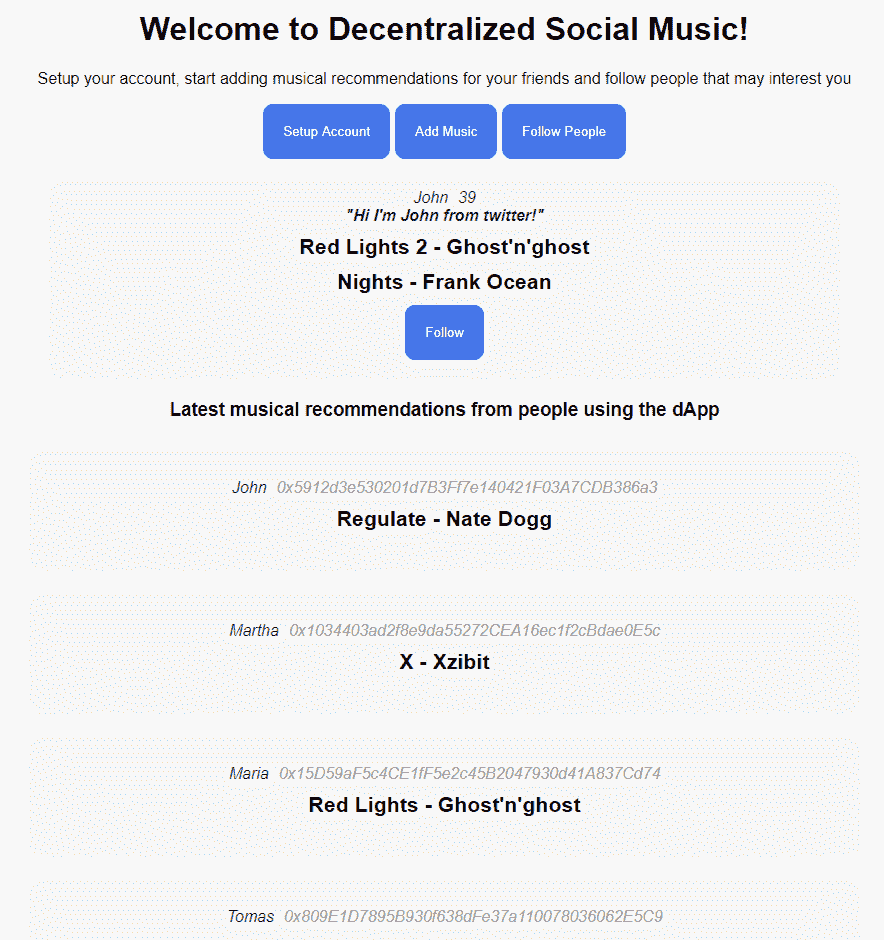

继续点击前面截图中显示的按钮与你的新的很棒的 dApp 进行交互吧。关注人们按钮将需要几秒钟的时间从智能合约中加载数据，因为我们正在运行几个请求来生成我们在 JavaScript 中的自定义对象。

最后，我可以添加功能来显示最新的音乐推荐和取消关注系统，但我将把这留给你作为一个练习，来提高你的智能合约 dApp 实现技能。这个想法是在页面底部动态显示生成的推荐组件，而不是我们已经有的静态组件；你可以通过简单地从我们的智能合约中获取数据来实现这一点。

这个 dApp 远非完美；你可以通过优化数据结构来解决一些速度问题，这样你就只检索所需的信息而不是整个数组。你也可以通过用 truffle 测试代码来解决一些安全问题。最终结果取决于你；你决定何时可以认为应用程序已经完成，因为你可以添加并继续添加使其更好的功能——这就是所有伟大的 dApp 的诞生方式。

你可以在我的 GitHub 上查看最终代码：[`github.com/merlox/social-music`](https://github.com/merlox/social-music)。

# 摘要

在本章中，你亲自看到了如何创建一个去中心化应用程序，以及所需的所有细微差别和更改。你已经经历了整个过程，从使用 React、webpack 和 Truffle 设置开发环境开始。你学会了如何创建整洁地组织代码的 React 组件，以便你可以轻松地管理你的 dApp 的所有复杂性。

记得把这个应用程序加到你的 GitHub 上作为证明你已经完成了它，以提高你的简历上有价值的项目，这样未来的客户就可以亲眼看到你为他们做了什么，以及你已经掌握了构建完全去中心化应用程序所需的所有步骤。在下一章中，你将学到更多关于如何通过进一步的高级技巧来改进你的 dApps，使它们感觉灵敏，并表现得像高质量的系统一样。
