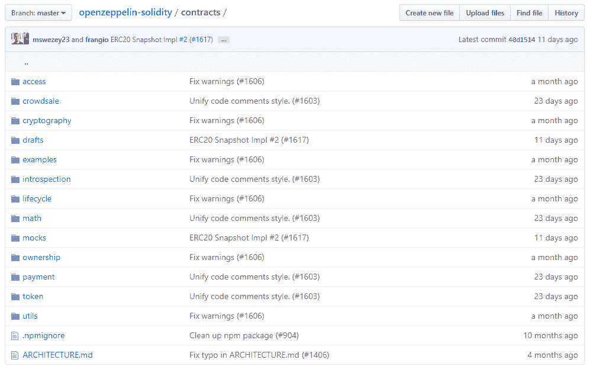

# 第六章：工具、框架、组件和服务

在本章中，您将了解到关于以太坊开发者可用的几个重要工具，用于创建强大的分布式应用和可为数百万潜在用户提供安全服务的智能合约。以太坊开发世界充满了许多有用的工具，旨在让您在创建复杂的分布式应用和智能合约时更轻松，这些应用和智能合约使用了 Solidity 的最新变化。了解存在的工具和它们如何运作将极大地帮助您推进您的开发项目，因为您将能够创建更好，更快速的应用程序，减少易出错的代码。

在本章中，我们将涵盖以下主题：

+   使用开发者工具

+   了解以太坊通信工具

+   理解以太坊基础设施

+   学习以太坊测试和安全工具

+   获取重要的开源库

# 使用开发者工具

开发者工具，例如**集成开发环境**（**IDEs**）、水龙头，甚至智能合约语言是开发人员必须掌握的基本事项，以便在开发智能合约时能够实际理解如何高效地开发。

# 开发框架

有几个开发框架为您提供了一组工具，用于在可以测试和验证代码的环境中创建智能合约，从而以较高质量的代码提高开发速度。让我们看看一些最受欢迎的框架，以决定在任何特定时刻应该使用哪一个：

+   **Truffle**：这是用 Solidity 创建 dApps 和智能合约的最大开发框架。在撰写本文时，它与 Vyper 并不完全兼容，但如果你真的希望如此，有一些解决方法可以让它正常运行。正如你已经知道的，Truffle 可以直接在终端中为您提供智能合约编译、部署和测试工具，这样您就无需离开您的工作流程。它的设置有点复杂，因为你必须按照特定的方式工作，但一旦完成，你将拥有创造强大 dApp 的巨大潜力。你可以在[truffleframework.com](https://truffleframework.com/)获取它。

+   **Waffle**：虽然不是一个知名的开发框架，但 Waffle 旨在创建更简单和更快的编程工具，以便您可以在有更少的依赖性的情况下轻松开发。你只需要 `contracts` 和 `test` 文件夹来开始使用 Waffle，因为它可以在没有复杂性的情况下编译所有代码。你可以使用 `npx waffle` 轻松编译你的智能合约。由于它的目标是尽可能精简，你无法从它们的工具中部署合约，也没有像 Truffle 那样的 `build/` 文件夹，所以你需要自行部署它们。少一些设置和头痛，功能更少但更简单。你可以用 `npm i -S Ethereum-waffle` 来安装它。

+   **0xcert：** 这是另一个优秀的开发工具，专注于创建和部署高级 ERC721 非同质化智能合约代币。这些是特殊类型的代币，其中每个代币都是唯一的，并具有某种内在价值。例如，CryptoKitties 使用 ERC721 代币生成具有唯一特征和基于稀有度的固定价格的随机动物。Oxcert 旨在增加已被接受的 ERC721 代币标准的采用率，以便开发人员可以创建更快、更安全和更复杂的代币合约。您可以在他们的网站上获取它：[0xcert.org](https://0xcert.org/)。

# 集成开发环境

当谈到集成开发环境（IDEs）时，我们有一小部分工具真正帮助您从第一行代码起编写安全的程序，因为它们试图在错误发生之前修复错误：

+   **Remix：** 最受欢迎的开发环境是一个非常强大的代码编辑器，可以通过自动编译和有用的警告消息来修复您的智能合约代码，以指示您的代码存在什么问题。它甚至提供最佳实践的建议，让您在开发过程中学习。您可以使用自定义以太坊实例、JavaScript 虚拟机或注入的`web3.js`来部署您的智能合约，以查看您的智能合约在不同环境中的反应。一旦您有源代码，您就可以在不离开浏览器的情况下与每个部署的合约进行交互。我强烈推荐它用于开发 Solidity 代码并手动测试函数的每个组件。您可以在[remix.ethereum.org](http://remix.ethereum.org)上开始使用它。

+   **Superblocks：** 这是一个强大的 IDE，甚至包含更多功能，可以直接部署您的 dApps，这样您就可以与您的应用程序进行实时交互并获得即时反馈。您可以导出您的 dApps，部署合约，直接访问区块链等等很多很棒的功能。您应该给它一个机会，体验一次从空文件到功能齐全且经过测试的 dApp 的每一步都得到帮助的完整 IDE 的力量。

# 测试网水龙头

作为以太坊开发人员，您可能已经熟悉可供您使用的测试网络。您知道它们是强大的区块链，可以在其中部署您的智能合约，这是一个安全的空间，甚至可以用于真实世界的应用程序，因为功能是相同的。让我们看看以下一些水龙头，这样您就可以体验每个测试区块链的不同特性：

+   **Rinkeby**：这是一个**权威证明**（**PoA**）区块链，你可以通过质押机制挖掘交易而不泄露你的身份。这是一个非常强大的解决方案，用于安全可靠的区块链。你应该在不同的测试网络上部署你的应用程序，以找到最适合你要求的测试网络。如果你想使用 Rinkeby，你需要一些测试以太币，在 [rinkeby.io/#faucet](http://rinkeby.io/#faucet) 可以获得。这个过程与其他区块链有些不同，因为他们想确保网络保持不受损害。所以，为了获得以太币，你必须在社交媒体平台上发布你的以太坊地址，如 Twitter，并等待接收一定数量的以太币：一次最多可获得 18.75 个以太币，每 3 天可以提取一次。

在发布你的以太坊地址后，将链接粘贴到水龙头上，你将在几分钟内收到你的以太币。这个网络的好处是与 MetaMask 兼容，而且区块时间非常快。

+   **Ropsten**：这是最流行的**工作量证明**（**PoW**）测试网络，在这里你可以从许多水龙头快速获取以太币。你可以从 MetaMask 自身获得免费以太币，只需访问 [`faucet.metamask.io`](https://faucet.metamask.io) 就可以收到有限数量的以太币。每个用户的以太币限制不断变化，所以很难预测通过反复点击请求来自水龙头的 1 个以太币按钮你将获得多少以太币——这取决于你自己去发现。尽管如此，这是一个很棒的区块链，虽然由于其低容量区块链，只有少量节点免费挖矿，因此不像其他区块链那样可靠。

+   **Kovan**：尽管这不太常用于测试项目，但它是一个非常稳固的 PoA 测试网络，由 Parity 团队构建，为开发者提供了一个高效的测试环境，适用于各种项目。你可以在 [faucet.kovan.network](http://faucet.kovan.network) 获得以太币，在那里你需要用你的 GitHub 账户登录，每个账户每 24 小时可以收到 1 个以太币。虽然不多，但对于没有实质性支付要求的较小项目来说应该足够了。

# 了解以太坊通信工具

以太坊是一个由几个相互连接的部分组成的大生态系统，这些部分相互交流，包括智能合约、dApps 和 Web 应用程序。目标是创建单独的结构，使你的最终应用程序是模块化的，这样你就可以更新特定部分而不必重新创建整个 dApp。这就是为什么我们有通信工具：帮助我们在智能合约、dApps 和 Web 应用程序之间交换信息的库。让我们来看看在通信方面我们现在有哪些不同的工具。

# 以太坊前端 API

谈到前端通信工具，我们有一些强大的 JavaScript 库，通过连接智能合约和 Web 应用程序，使 dApps 成为可能：

+   **Web3.js**：最流行的用于在 web 应用程序中使用智能合约的库，可以创建合约实例、调用合约函数、创建交易和签名交易。单单这个库就使得 dApps 成为可能。后端是区块链本身的 Web 应用程序是一个革命性的概念，因为人们决定构建了这样的库，它正因此而日益受到欢迎。它也可以在 Node.js 应用程序中使用，因此对于包括后端在内的各种 dApps 都是一个很好的工具。你可以在这里获取 web3.js：[github.com/Ethereum/web3.js](http://github.com/Ethereum/web3.js)。

+   **NEthereum**：这是一款类似于 web3.js 的智能合约通讯工具，专为.NET 开发人员而设计。那些使用流行的.NET 库并喜欢使用 C#编程的人会喜欢这个工具，因为它专为这些程序员而制作。它为你提供了连接现有.NET 环境与你的 Web 应用程序所需的一切，包括库和客户端集成。你可以在这里了解更多关于 NEthereum 的信息：[nethereum.com](http://nethereum.com)。

+   **Drizzle**：这是一个为你的 dApps 提供 Redux 集成的工具，可以轻松管理状态和数据存储。如果你熟悉 Redux 和 React，你会喜欢这个工具，因为它为你提供了一个干净的库，可以轻松实现 Redux 在你的 dApps 上的好处。由 Truffle 的创建者制作，非常适合大型项目。你可以在这里获取它：[github.com/trufflesuite/drizzle](http://github.com/trufflesuite/drizzle)。

# 以太坊后端 API

大多数以太坊应用程序都需要某种形式的中心化后端来执行一些对智能合约来说不可行的任务，要么是因为超出了合同的能力，要么是因为有更好的处理某些操作的方法。在这些情况下，我们仍然需要与区块链进行通信。这就是后端 API 出场的地方：帮助我们创建工具和系统，改善我们总体的 dApps 和智能合约。

+   **Web3.py**：这是用于 Python 的流行的以太坊实现，可以为这种流行的语言创建工具和系统。Python 与 web3.js 非常搭配，因为你可以创建高效的脚本来自动执行一些操作，比如检查智能合约事件。其语法与原始的`web3.js`非常相似，因此你会感到很舒适使用它。在这里查看它：[github.com/Ethereum/web3.py](http://github.com/Ethereum/web3.py)。

+   **Eventeum**：这是一个用于与后端微服务通信智能合约事件的工具。如果您对微服务不熟悉，它们只是专注于以非常高效和可维护的方式执行某些特定任务的小型应用程序，以便最终应用程序非常高效，并且易于使用模块进行优化和替换。Eventeum 正在与这些微服务一起工作，以处理您智能合约生成的以太坊事件，以便您可以轻松地在复杂的服务网络上实施事件。它适用于 Java，非常适合希望实现可伸缩性的后端开发人员。在这里查看它：[github.com/ConsenSys/eventeum](http://github.com/ConsenSys/eventeum)。

# 应用二进制接口工具

**应用二进制接口**（**ABIs**）是描述智能合约函数、变量、修饰符以及所有其他内容的 JSON 对象。ABIs 的目标是帮助您的 dApp 快速理解智能合约，以便知道哪些功能对您可用。现在，重要的是尽可能多地利用这一协议，因为您将在所有 dApp 中使用它。以下是一些工具，可以帮助您真正提高对 ABI 的理解：

+   **Abi-decoder**：这是一个小巧的 JavaScript 工具，允许您解码通常加密并难以理解的复杂交易对象。您知道，每当您通过执行智能合约中的函数发送交易时，您都在与加密数据的区块链进行交互。迟早，您都需要阅读这些交易，无论是因为您正在调试您的 dApp，还是因为您需要出于其他原因了解其中发生了什么。使用 abi-decoder，您可以解码交易数据和交易日志，这对数据高效的 dApp 来说太棒了。在 [github.com/ConsenSys/abi-decoder](http://github.com/ConsenSys/abi-decoder) 了解更多关于这个由 Consensys 制作的小工具。

+   **OneClickdApp.com**：这是一个很棒的工具，可以让您快速将您的 dApp 部署到互联网，而无需担心托管问题。您只需点击一个按钮，选择您的 ABI 数据和配置，您的 dApp 就可以部署到他们的域名上。只需点击几下，您就可以看到它在真实世界中的样子。这对测试和较小的项目非常有用。唯一的问题是，如果决定进行无停机的托管，则您需要每月支付 5 美元，尽管这对您的整体测试过程非常有帮助。在 [oneclickdapp.com](http://oneclickdapp.com) 了解更多。

到目前为止，您已经发现了一些奇妙的工具，可以立即在您的项目中实施，带来即时的好处。请继续探索完整的技术生态系统，帮助您创建更好的 dApp 和智能合约，以便在未来构建功能强大的应用程序时迈向更高一级。

# 理解以太坊基础设施

当涉及到以太坊区块链的基本结构时，有几个应用程序可以帮助改善它，以便人们，包括开发人员，能够从其潜力中受益。你知道，区块链能做的远不止处理交易和运行智能合约。你可以通过消息直接与每个节点进行通信，存储信息，并使用自定义客户端。在本节中，您将了解以太坊基础设施中一些最有趣的用例。

# 以太坊客户端

您已经知道有一些功能强大的客户端，但您可能不知道的是，有专门为特定客户端制作的特定工具。我们将看到一些最好的 Java 编写的实现，主要是因为它是这些类型应用程序中最常使用的语言之一：

+   **Pantheon**：这款应用完全由 Java 编写，专注于为您的 dApps 和智能合约提供不同的环境。它拥有丰富的文档网站，可以立即开始使用，可以使用 Clique 创建具有 PoW 或 PoA 的私人网络。你不需要了解 Java 就能使用它，因为它非常容易设置。请访问 [docs.pantheon.pegasys.tech/en/latest/](http://docs.pantheon.pegasys.tech/en/latest/) 了解更多信息。

+   **EthereumJ**：这是一个重型实现，专注于为您的私人网络需求提供尽可能多的功能。它可在您的 Maven 或 Gradle 项目中通过 Java 代码进行配置。就易用性而言，这款产品更难设置，并且需要更长的时间来适应它，因为它针对的是企业级开发人员。请访问 [github.com/Ethereum/Ethereumj](http://github.com/Ethereum/Ethereumj) 了解更多信息。

+   **Harmony**：由 EtherCamp 制作，这是以太坊早期的一个热门网站，提供了他们自己的 IDE 和工具。Harmony 是用 JavaScript 和 Java 的组合编写的，并基于 EthereumJ。他们的目标是提供一个清晰的 Web 仪表板界面，让你可以轻松监控和详细分析区块链。它非常适用于需要深入了解底层运行情况的项目。请访问 [github.com/ether-camp/Ethereum-harmony](http://github.com/ether-camp/Ethereum-harmony) 了解更多信息。

# 以太坊存储

当我们谈及存储时，指的是在分散的云中保存各种文件，这些云可能与以太坊区块链合作，也可能没有。这些是允许您存储合同和文件的应用程序，而无需依赖于集中式服务器：

+   **星际文件系统**（**IPFS**）：这是分散式存储的最知名实现，它允许您将大型文件存储在连接的节点的分散网络中，而不是将您的信息存储在集中式服务器和数据库中。它正在被用于各种项目中，这些项目希望利用完全分散的应用程序的可能性，在这些应用程序中，没有集中的故障点。这些类型的项目将来会被广泛使用，因为它们在数千个节点在高质量网络上复制信息时要安全得多。IPFS 介于 Torrent 和 Git 协议之间，其中文件根据其内容进行标识。因此，具有相同内容的两个相同文件将具有相同的加密标识符，称为**哈希**。这是一个非常重要的革命，因为它们删除了重复的文件，增加了数据的可用性，并允许更好地利用资源，因为许多节点将共享相同的信息，而不是分开的。在他们的网站[ipfs.io](http://ipfs.io)上查看它。

+   **Swarm**：这是建立在以太坊之上的一个协议，其目标是以分散的方式共享文件，就像 IPFS 一样，但无需依赖外部团队。它由核心以太坊团队不断改进，并与整个系统无缝集成，因此您可以将其与您的 dApps 和智能合约集成，而无需头痛。在他们的网站[swarm-gateways.net](http://swarm-gateways.net)上查看它。

# 以太坊消息传递

以太坊消息传递意味着在对等方之间直接交换加密信息，而无需中介，以便您几乎实时地获得信息。它们是速度优先的聊天和应用程序的绝佳工具：

+   **Whisper**：最知名的实现对等消息传递的协议，它建立在以太坊之上，并与其核心的所有系统完全集成。您可以使用它与其他 dApps 进行通信，配置最小。智能合约是相互连接的，有一个层次，它们可以安全地共享信息。在这里了解更多关于 Whisper 的信息：[github.com/Ethereum/wiki/wiki/Whisper](http://github.com/Ethereum/wiki/wiki/Whisper)。

+   **Devp2p**：这是建立在以太坊之上的另一个协议，允许用户和 dApps 在不必创建缓慢的区块链交易的情况下以高速交换加密消息。有一个用 Python 编写的实现，称为 pydevp2p，它为您提供了一个简单的界面，以便在您的应用程序中包含消息传递，以便人们可以开始相互交换数据。在他们的官方 GitHub 页面上了解更多信息：[github.com/Ethereum/devp2p](http://github.com/Ethereum/devp2p)。

以太坊消息应用程序为我们提供了丰富的可能性集，可以创建更好的 dApps 和先进的智能合约，所以当你想要在以太坊上开发基于用户的游戏或聊天应用程序时，你应该关注这些服务。

# 学习以太坊测试和保护工具

区块链安全是任何其他特性之上的首要任务。没有安全的应用程序，我们无法着手处理最简单的智能合约，因为用户不会信任我们的代码。这就是为什么作为一名精通以太坊开发者，你必须了解如何确保程序安全的所有可能性。

# 理解监控工具

监控是观察你的应用程序在现实世界中的行为的行为。你知道，监视你的代码非常重要，因为它可能被全世界成千上万的用户使用：你不希望他们在随机时刻有糟糕的体验。确保查看这些工具，以提升你的智能合约水平，因为它们可以极大地提高你的应用程序质量：

+   **智能合约监视器：** 由 Neufund 制作，这是一家致力于创建法律约束力智能合约等其他事物的公司。该工具允许你监视你的智能合约活动，并查看它可能导致问题的地方。你可以将其用作自己的定制区块浏览器，作为当你的应用程序中的资金严重减少时的安全工具，或者用于任何需要仔细监视的情况。它可以从终端简单使用，并具有简单的输出界面，以查看发生了什么。在此处了解更多信息：[github.com/Neufund/smart-contract-watch](http://github.com/Neufund/smart-contract-watch)。

+   **Scout：** 实时显示智能合约内部事件和活动的发生情况，以便你关注重要的事情。你可以创建在危险情况下应执行的关键事件，以通知你需要紧急修补的安全漏洞。想象一下，如果人们使用像 Scout 这样的工具在遭受黑客攻击时迅速而果断地采取行动，将能够节省多少以太币。他们的仪表板和实时报告令人惊叹，因此我强烈推荐你查看它以改进你的应用程序。在此处了解更多信息：[scout.cool](http://scout.cool)。

+   **Chainlyt：** 允许你解码交易数据内部发生的事情，以极端详细的方式探索任何给定时刻发生的情况。你可以将其与其他监控工具结合使用，在太迟之前通过了解事情的发生方式来修补漏洞，因为你可以准确地看到智能合约的内外情况。他们还提供了一个不错的仪表板，你可以自由使用来进行快速项目。这是一个非常强大的工具，适用于高级用户。在此处了解更多信息：[chainlyt.io](https://www.chainlyt.io/landing)。

# 使用安全测试工具

如果你打算将智能合约部署到主网，并且不想从一开始就面临重要问题，那么测试你的智能合约绝对是必不可少的。这是不可避免的，你应该在开发过程中进行测试。看看这些测试工具，建立一个舒适易用的测试环境，满足你的日常需求：

+   **Oyente:** 这是一个非常著名的工具，用于轻松分析你的智能合约。他们为你提供了一个基于 Remix 的在线 IDE，具有诸如超时、深度限制、自定义字节码等多种高级功能，以帮助你分析你的智能合约，显著提高其安全性。由于它的潜力，它是非常推荐的。在这里了解更多关于它的信息：[oyente.melonport.com](http://oyente.melonport.com)。

+   **MythX:** 这是一个奇妙的工具，以清晰的格式显示出在部署之前必须修补的 EVM 字节码问题。这些是低级调用，显示出潜在的安全漏洞。你可以轻松分析它们，甚至已经为 Truffle 和一些开发工具如 Visual Studio Code 提供了插件。它们的主要卖点是为整个安全设置提供的便利，以便你可以使用最常用的工具设置并忘记它们。了解更多关于 Mythx 的信息，请访问：[mythx.io](http://mythx.io)。

+   **Solgraph:** 这些是生成的视觉图表，清晰地描述了你的智能合约的流程。例如，如果你想看看当你调用`transferFunds()`函数时会发生什么，你可以调用 Solgraph，你将收到一个极具直观描述的描述，描述你的合约完成调用所采取的步骤。对于希望了解复杂合约流程的开发者来说，这是非常有效的。在他们的 GitHub 页面上了解更多信息：[github.com/raineorshine/solgraph](http://github.com/raineorshine/solgraph)。

# 理解审计工具

审计是手动查看代码各个不同部分的过程，以使用诸如逐行分析、漏洞测试和黑客路径等流程找出潜在的漏洞。你必须熟悉它们以保证可持续、高质量的代码项目。

请注意，它们的目标是加快你的审计流程，因此它们更像是一套深思熟虑的过程的辅助工具：

+   **EthSum:** 这是一个简单直接的工具，由 Netlify 制作，允许你对以太坊地址进行校验和。有时，你需要对地址进行校验和，以确保它是一个经过正确创建的良好形式的地址。它主要用于 Truffle 项目，其中你必须为你的项目拥有有效的地址，所以 EthSum 是一个不错的辅助工具来验证地址。你可以在这里获取它：[ethsum.netlify.com](http://ethsum.netlify.com)。

+   **Decode**：这是一个使交易数据易于为您的 testrpc 节点理解的工具。当您审核项目时，您必须运行几个测试和手动检查以验证结果的完整性，而大多数情况下很难在 testrpc 或类似的测试环境中执行此操作，因为生成的数据令人困惑。Decode 通过使交易易于阅读和理解来解决了这个问题。了解更多信息，请访问：[github.com/dteiml/decode](http://github.com/dteiml/decode)。

+   **EthToolBox**：这是一个具有许多不同实用工具的 Web 应用程序，可帮助您解决常见任务而无需在不同环境之间来回切换。通过绿色界面，您几乎可以进行任何您所需的检查，而无需退出浏览器。它可以执行诸如 ECRecovers、密钥生成、EVM 单词转换、十六进制解析等任务。当您必须审核任何类型的智能合约时，您会喜欢它，因为您可以快速分析任何类型的结果。请在此处从浏览器中使用：[eth-toolbox.com](http://eth-toolbox.com)。

审计工具将为您节省无数时间，避免混乱的错误、漏洞和脆弱性。它们将成为您最常使用的一套工具之一，与您已经出色的开发工作流程结合在一起，以便您一旦集成它们就能创建更好的应用程序。

# 获取重要的开源库

在创建新的智能合约应用程序时，您必须利用所有可用资源以最有效的方式节省时间或成本来创建它们。您的目标应始终是使用和创建高质量的代码。那么，为什么不在下一个项目中使用一些最常用、经过测试和安全的库呢？它们已被成千上万次地使用，由于其质量而依然强大。让我们在以下章节中看看这些强大的开源库。

# ZeppelinOS

Zeppelin 在以太坊领域已经有很长时间了。他们构建了一些最有用的智能合约，比如用于防止溢出问题的 SafeMath，并且有一个充满了安全合同的 GitHub，几乎可以即插即用。他们的智能合约分布在许多文件夹中。为了理解所有这些压缩信息，我们将逐个浏览这些文件夹，为您节省数小时混乱并帮助您了解这些合同的潜力。您可以在官方 GitHub 仓库中访问它们：[`github.com/openzeppelin/openzeppelin-solidity`](https://github.com/OpenZeppelin/openzeppelin-solidity)，看起来像这样：



为了理解所有这些文件以及它们为何重要，我们将解释每个文件夹，以便您快速了解其内部包含的内容。

+   `权限`：在这个文件夹中，您将找到提供给特定以太坊用户权限的角色管理合同的工具，以便您可以创建不同角色可以使用的应用程序。

+   `众售`：这个文件夹包含一些最有趣的 ICO 智能合同，包括可暂停的、可退款的、可铸造的和白名单众售等各种实现。如果你刚开始学习 ICO，这个文件夹是必不可少的，以了解 ICO 应该如何正确地构建。

+   `加密学`：这个文件夹包含了两个用于 Merkle 证明验证和**椭圆曲线签名**（**ECDSA**）操作的智能合同。这是加密项目中的高级实用工具，用于需要使用已签名消息的加密项目。

+   `草案`：这些是正在进行中的智能合同，在完全测试和打磨后将在未来的版本中包含。

+   `示例`：这提供了一些快速的代币和 ICO 示例合同，这些合同将所有必要的逻辑实现在单个文件中，以便您可以直观地看到完整的系统运行。

+   `内省`：这些是用于检测外部合同中使用的接口的 ERC165 合同。例如，您可以用它来检测特定智能合同中是否支持 ERC20 代币。

+   `生命周期`：这个文件夹中包含一个可暂停的智能合同实现，您可以用它来停止任何你希望在任何时间增加安全措施的合同。

+   `数学`：可能是最受欢迎的文件夹，其中包含了著名的 SafeMath 库和一个数学智能合同，用于在智能合同中进行安全的数学计算。这些计算是必要的，因为智能合同本质上是不安全的，变量的工作方式使其如此。

+   `模拟`：这个文件夹包含许多模拟合同，实现整个合同功能的一小部分，以帮助您理解每种类型合同的关键方面。我建议您从这里开始，了解一个合同与另一个合同的不同之处，比如 ERC 实现。它们实现了可以用于分析这些函数的输入/输出的事件。

+   `所有权`：它包含了两个限制函数访问权限的所有者限制合同，其中某些函数必须限制只能被所有者调用。

+   `支付`：强大的支付工具，用于组合支付、延迟支付和托管合同，您可以轻松实现。对于依赖常规支付的项目，比如银行，这非常酷。

+   `代币`：这个文件夹包含了 ERC20 和 ERC721 的实现，具有许多接口，您可以用它们创建更小或更改进的代币。

+   `实用工具`：这个文件夹包括智能合同实用工具，如递归保护和数组管理，可帮助那些需要快速解决复杂问题的项目。

您可以通过一行代码为您的项目安装所有这些合同：

```
npm i -S openzeppelin-solidity
```

这将使合同成为一个完美的包装，您可以通过完整的合同路径来引用，就像这样：

```
import 'openzeppelin-solidity/contracts/token/ERC721/ERC721Full.sol';
```

总的来说，Zeppelin 在回馈社区方面做得非常出色，提供了非常有价值的、高质量的代码，我们许多人每天都在使用。如果你认为他们应该因他们的行为而受到奖励，那就在你的下一个项目中使用他们的合同，以此来表达你的感激之情。

# 使用 0x 协议

0x 协议（读作零 x 协议）是一组流行的 API、智能合约和工具，用于构建相互连接的去中心化交易所。你看，许多交易所工作得如此独立，以至于它们失去了共享系统可以提供的很多好处。0x 致力于创建一种交易所可以使用的协议，以便它们拥有共享的流动性池、用户和接口，称为中继。让我们来看看你可以用这种协议构建的主要东西。

# 构建中继器

中继器是一个 dApp，使用一套共同的工具来与其他中继器共享交易。对于选择特定功能的最佳交易所，他们为用户提供了许多选项，因为它们都分享某些行动，以帮助整个生态系统。

他们使用一个叫做`0x.js`的库，这个库可以让你与中继器进行高级别、清晰易用的交互。

# 成为做市商

做市商为交易所提供了外部用户可以根据动态价格进行交易的个人交易。他们是通过利用自己的权力地位从中获利最多，因为他们在任何时刻都能更多地控制哪些交易是有效的。

有了 0x，你可以简单地成为一个做市商，为去中心化交易所提供流动性，使它们在代币高交易网中运作。

0x 协议还有很多功能，你需要自己探索。它是近年来最有趣的项目之一，其代币价格清楚地反映了这一点。如果你对**去中心化交易所**（**DAXs**）感兴趣，立即开始更多地了解它，加入交易革命。

# Aragon

Aragon 是创建运行在完美系统内的**去中心化自治组织**（**DAOs**）的首选解决方案，而且不需要中介机构。他们为您提供管理公司的工具，直接从您的电脑上操作。我们将探索这些，以便您欣赏其功能的全部潜力，并创建自己的公司在以太坊区块链之上运行。

# AragonPM

这是一个工具，用于为他们的 Aragon 客户端分发其自己软件包的不同版本，这样 DAO 可以使用一套固定的改进，而不必不断更新他们的软件需求，可能会破坏他们现有的结构。

# AragonOS

这是一个智能合约框架，用于构建具有各种实用功能的去中心化组织，例如控制限制、可升级的合约和插件，您可以根据需要添加。对于希望在区块链上实现强大公司动态的高级 DAO 来说，这是一组极好的智能合约。

# AragonJS

这是他们 Aragon 系统的 JavaScript 实现。它允许您创建与去中心化组织一起工作的 dApps，并提供一个漂亮的 API，您可以在几小时内了解。它非常适用于构建自定义界面，以与您的公司进行交互，使您可以根据需要调整。

# AragonUI

这是一组 UI 组件，您可以在 JavaScript 应用程序中实现这些组件，以创建具有您希望创建的确切外观的漂亮界面。您不必担心从头设计一切，因为您只需将这些界面元素插入到正确的位置，就可以为项目创建自定义 DAO 实现。

# AragonCLI

**命令行界面**（**CLI**）用于创建和与各种 Aragon 应用程序进行交互，这些应用程序与去中心化组织一起工作。在启动许多不同 DAO 项目时，此 CLI 直观且简单易用。

# 摘要

在本章中，您已经了解了许多工具，可用于创建高级智能合约应用程序。您首先了解了一些最有用的开发工具指南，这些工具可用于您日常的智能合约开发工作，包括集成开发环境（IDE）、开发框架和测试网络。然后，您继续您的学习之旅，了解了帮助您以高效方式将智能合约与 Web 应用程序集成的以太坊通信工具。之后，您了解了更多关于以太坊基础设施实用程序的信息，这些实用程序位于区块链的较低层，可以更好地访问以太坊区块链的各个方面。

接下来，您通过快速学习了解了安全性的重要性，学习了如何实施审计工具、监控实用程序和测试应用程序，这些工具可以为您提供对代码安全性的全面概述。最后，您通过阅读更多关于可用于帮助您创建各种独特应用程序的最受欢迎的开源库的信息，结束了这一学习路径，这些库具有安全且广受欢迎的代码，被全球成千上万的区块链公司使用。

所有这些信息在正确人手中具有许多危险性，因此成为一名优秀的以太坊开发人员，利用您新获得的知识来改善整个生态系统，而不是利用已有的东西而不提供价值。

在下一章中，我们将探讨各种可以立即实施的 dApp 改进，以提高您的 Truffle 和 React 项目的性能，通过前所未见的技术，真正实现这类 dApp 的最佳性能。
