# 第七章：在测试网上部署

开发智能合约是一项复杂的任务，你需要在不同的环境之间移动，以有效地测试你的应用程序的质量。这就是为什么有许多不同的测试网，在这些测试网上你可以部署你的代码，实验你的合同在不同规则和挖掘算法下的行为，以提高其质量。在本章中，你将了解以太坊主要网络之间的区别，包括 Ropsten、Rinkeby、Kovan 和主网在智能合约保障世界中的定位。

你将了解到每个网络提供的核心挖矿算法变化，从而可以了解你的应用在不同环境中的行为。你还将看到如何为每个网络获取以太币，以便你可以立即在免费的测试网络上开始开发。

在本章中，我们将涵盖以下主题：

+   使用 Ropsten 进行智能合约开发

+   了解 Rinkeby 与 PoA

+   使用 Kovan 进行智能合约开发

+   介绍主网

# 使用 Ropsten 进行智能合约开发

每个以太网网络都有一个唯一的标识符，用数字表示所选择的网络，以便以太坊客户端和 Truffle 等框架可以快速选择一个新的测试网络。Ropsten，由 ID 3 标识，是以太坊中使用最广泛的测试网络名称，因为它提供了最接近真实主网的技术堆栈，被真实世界的 dApps 所使用。

请注意，每个测试网络都是一个独立的区块链，具有自己的一套规则和限制，以帮助人们决定在哪里测试他们的 dApps，模拟真实世界的情况。

最初，Ropsten 区块链被命名为**Morden**，并于 2015 年以太坊启动时部署。一年后，以太坊核心团队决定将 Morden 重命名为**Ropsten**，以表明它是一个升级版本，具有更好的安全功能和更快的交易性能。

它通过硬分叉不断改进，以包括最新的以太坊版本，以便该区块链与最新的创新保持同步。有趣的是，以太坊的一个最大的升级，被称为**Constantinople**，首先在该测试网上发布，以便验证其运作方式，然后再将这些改变风险性地应用于主网。在将主网络升级之前，通常会通过硬分叉在测试网上发布颠覆性的以太坊变更，以保证升级的安全性。

因为此网络基于**工作量证明**（**PoW**），所以容易受到垃圾邮件攻击的影响，少数强大的计算机可以通过 51% 攻击重写区块历史以进行自己的交易。这就是为什么这是测试最不稳定的网络之一，尽管一直在持续改进。事实上，它在 2017 年遭受了垃圾邮件攻击，未知用户生成了大量导致整个区块链崩溃的慢区块，阻止新的交易到达矿工，从而有效地摧毁了网络。

在此事件之后，以太坊基金会收到了来自外部团体的 GPU 捐赠，这些团体希望支持他们的工作。有了这种提高的哈希率，Ropsten 恢复了活力，比以前更加强大，并且仍然运行良好。

# Ropsten 的特点

Ropsten 是与主网最相似的区块链，因为它实现了相同的 PoW 挖矿算法，每个人都可以自由生成新区块以换取 Ropsten 以太币，这些以太币没有真实世界的价值。其区块率约为每个区块 30 秒，并且被所有主要的以太坊客户端接受，包括 Geth 和 Parity。

此网络中的以太币可以自由挖掘，就像在主网中一样，并且有几个开放的水龙头可以免费获取以太币。在那些您希望尽可能模拟与主网接近的环境的情况下，此网络最适用，以太币具有真实价值，因此您的合约表现出非常相似的区块率和挖矿性能。事实上，该区块链上的燃气限制通常与主网相同。

# 获取 Ropsten 以太币

如果您是以太坊的现有用户，则此网络获取以太币的过程非常简单。以下是您必须遵循的步骤：

1.  如果您尚未这样做，请下载 MetaMask 并通过顶部的按钮将您的网络更改为 Ropsten：

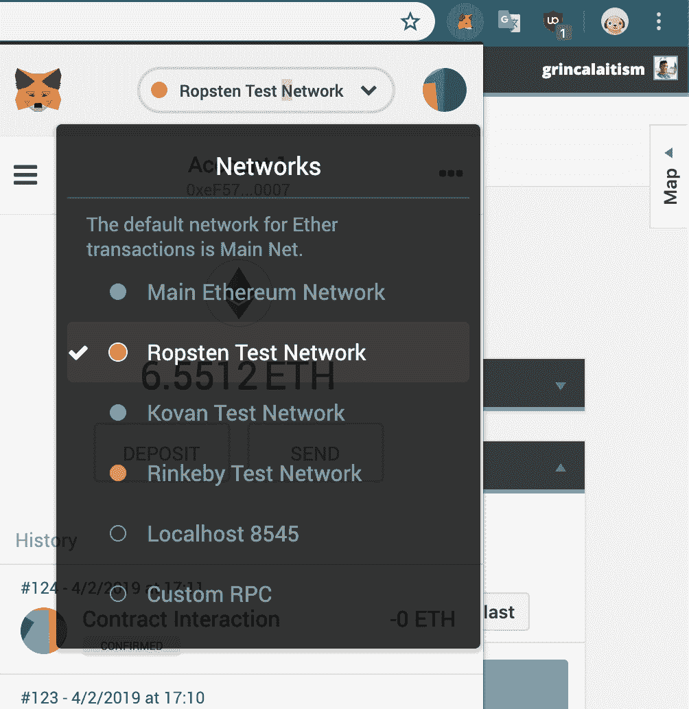

1.  然后，点击存款按钮，向下滚动，并点击获取以太币以打开水龙头：

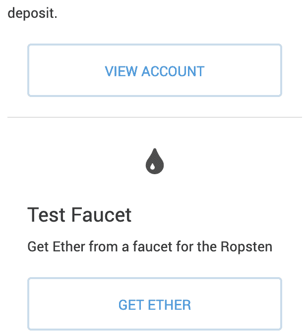

1.  这是 MetaMask 水龙头的外观：

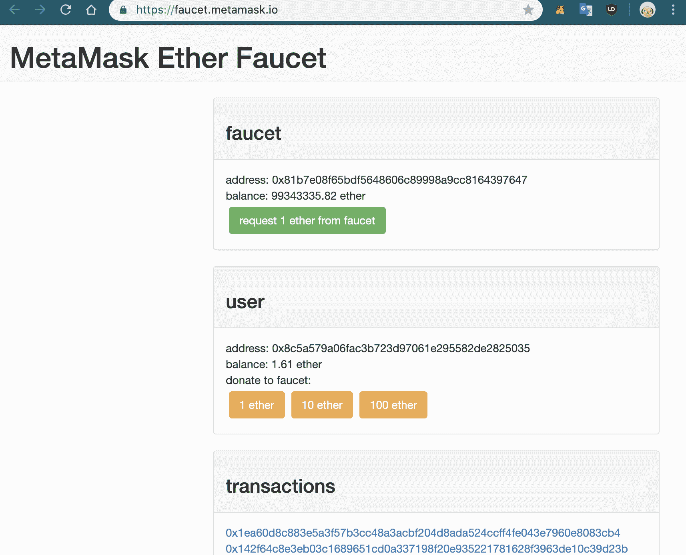

点击请求 1 以太币的水龙头，您将收到一个 MetaMask 通知，批准他们网站上使用您的帐户，以便他们每次点击都可以向您发送一个以太币，最多约五个 Ropsten 以太币。您可以在专用子域中使用 Etherscan 分析您的 Ropsten 交易：[`ropsten.etherscan.io`](https://ropsten.etherscan.io)。

在获得 Ropsten 以太币之后，您应该能够使用您的框架或 IDE 连接到该特定网络。以下是将合约部署到此测试网络的步骤，以及对您的 Truffle 配置进行的一些修改：

1.  要将智能合约部署到此测试网络，您可以修改您的`truffle-config.js`文件，配置如下：

```
ropsten: {
  provider: () => new HDWalletProvider(mnemonic, `https://ropsten.infura.io/${infuraKey}`),
  network_id: 3,
  timeoutBlocks: 200, // # of blocks before a deployment times out (minimum/default: 50)
}
```

1.  然后，您可以使用以下方式部署您的合约：

```
$ truffle deploy --network ropsten --reset
```

记得通过创建一个没有限制的新项目来为 Ropsten 获取有效的 INFURA 密钥。

或者，您可以通过将 MetaMask 网络更改为 Ropsten，使用 Remix IDE 部署到 Ropsten，只要您在其中有以太币。 Remix 将自动重新加载新选择的测试网络。

# 了解具有权威证明的 Rinkeby

Rinkeby 是最安全的网络之一，用于测试您的应用程序，因为它使用**权威证明**（**PoA**）来安全生成区块。实际上，它是如此安全稳定，以至于许多人将此网络用于原型、MVP 和演示，因为开发者知道他们的 dApp 将在此链上毫无问题地继续运行。

它由 ID 4 标识，并于 2017 年由以太坊团队创建，为那些想要尝试不同挖矿算法的开发者提供了另一种解决方案。此测试网络速度极快：它每 15 秒生成一个区块。以太币的供应由 `puppeth` 控制，以防止人们通过滥用挖矿行为生成以太币。

唯一支持的客户端是 Geth，尽管您可以在大多数应用程序中使用 MetaMask 和 Truffle。

# 描述权威证明

你已经从第三章，*以太坊资产*中熟悉了 PoA，那里你通过一个基本介绍了如何使用 Puppeth 生成 Clique 网络。**Clique** 是 Rinkeby 使用的 PoA 算法的名称。它非常类似于 PoS，并且包括选择大约 25 个矿工的小部分，他们充当为链提出新区块的验证者。

每个验证者都对他们想要被接受为下一个区块的区块押注，几秒钟后，被押注以太币量最大的区块被选择。如果验证者在规则范围内表现良好，他们不会失去押注的以太币，但如果他们变得**拜占庭**，他们将冒着失去押注的风险作为惩罚。

这个共识算法之所以有效，是因为验证者的身份是公开的，这样其他人就知道当一个矿工表现恶意时。为了成为验证者，每个用户都必须将一些敏感数据公开以保护网络。

# 获取 Rinkeby 以太币

要在此网络中获取以太币，您必须前往 [`faucet.rinkeby.io`](https://faucet.rinkeby.io) 或 [`www.rinkeby.io/#faucet`](https://www.rinkeby.io/#faucet)，在那里您可以提供带有您地址的社交媒体链接。

这个过程有点混乱，所以这是步骤的分解：

1.  通过打开 MetaMask 并点击您的地址来复制您的 Rinkeby 以太坊地址：

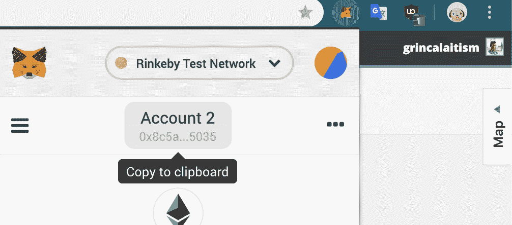

1.  前往您的 Twitter 或 Facebook，并创建一个带有您地址但没有其他内容的新推文或帖子；虽然您可以添加文本，但最好只留下您的地址：

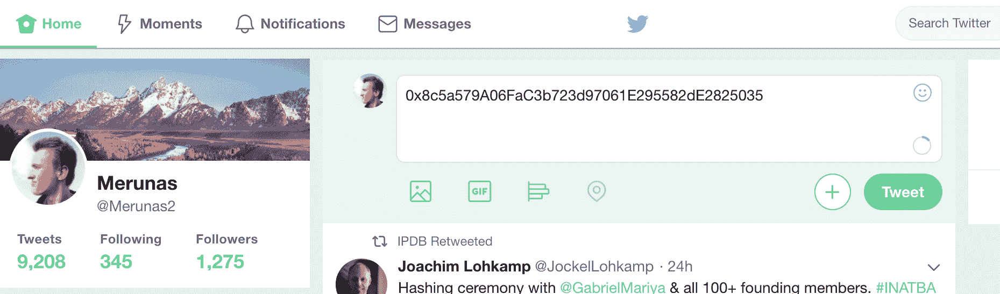

1.  发布推文，点击它，并复制该位置的 URL：

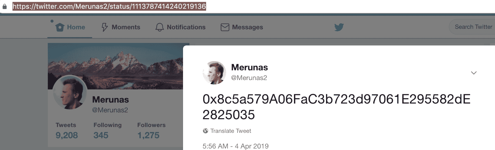

1.  将该 URL 粘贴到 Rinkeby 的 faucet 页面的输入框中：

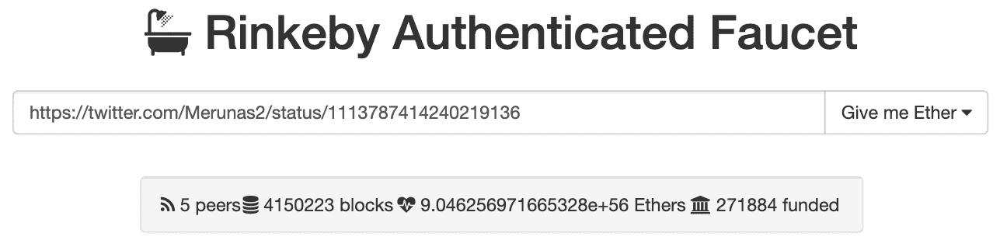

1.  点击“给我 Ether”选择您希望收到的以太币数量。总量每三天限制为 18.75 个 Ether。您将立即收到以太币，但必须等到达该时间才能在将来获得更多以太币。如果一切顺利，您将看到一个绿色的确认消息。如果不行，可能是因为您提供的 URL 无效。确保复制推文本身的 URL：

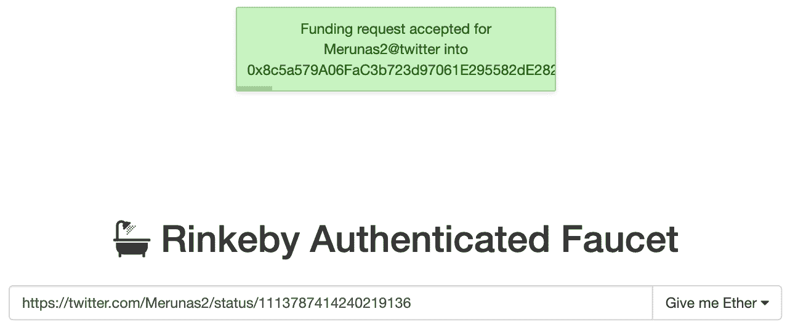

1.  确认您在 MetaMask 中收到了您的以太币：

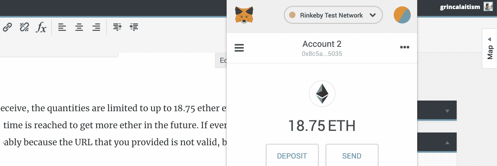

现在，您应该可以在 Rinkeby 上进行操作并在需要时部署您的合约。请记住，这里有一个专门用于探索 Rinkeby 交易的 Etherscan 版本：[`rinkeby.etherscan.io`](https://rinkeby.etherscan.io)。

要将这个测试网用于您的 Truffle 项目，您需要做以下更改：

1.  要在这个测试网上部署智能合约，你可以修改你的`truffle-config.js`文件，配置如下：

```
rinkeby: {
  provider: () => new HDWalletProvider(mnemonic, `https://rinkeby.infura.io/${infuraKey}`),
  network_id: 4,
  timeoutBlocks: 200, // # of blocks before a deployment times out (minimum/default: 50)
}
```

1.  保存了配置文件后，使用以下命令部署您的合约：

```
$ truffle deploy --network rinkeby --reset
```

请记得为 Rinkeby 获得有效的 INFURA 密钥，创建一个新项目。

或者，您可以通过将 MetaMask 网络更改为 Rinkeby 在 Remix IDE 中部署，只要您在其中有以太币。 Remix IDE 将自动重新加载已选择的新测试网。

# 使用 Kovan 进行智能合约开发

Kovan 是由 Parity 团队创建的一个测试网，他们希望能够部署他们的智能合约，知道他们将无休止地运行，因为这个网络非常安全。这个网络是速度最快的，因为它有 4 秒的区块时间，这使得测试变得轻松，因为您不必等待长时间的确认时间。

它诞生是因为 2017 年 Ropsten 受到攻击，当时 Parity 意识到开发者失去了他们的重要工具，因为他们需要在可能最真实的情况下测试他们的智能合约，以模拟区块链的限制。

Kovan 是其中一个最活跃的网络，因为他们提供**Kovan 改进提案**，即**KIPs**，用户可以在仓库([`github.com/kovan-testnet/kips`](https://github.com/kovan-testnet/kips))上提交 GitHub 问题，介绍他们希望引入到这个网络中的更改。

由于依赖一组受信任的验证者持续以最佳速度生成区块，而不是依赖具有更高节点变异性的公共算法，因此无法对此区块链进行挖掘。您可以在官方 Kovan 白皮书中了解有关为此测试网络生成区块的已批准验证者的更多信息：[`github.com/kovan-testnet/proposal`](https://github.com/kovan-testnet/proposal)。

此网络的标识符是 ID 42，因为他们决定为可能想要创建的新测试网络保留大量标识符。此网络也不易受到 DDoSing 等攻击的影响，具有大量慢区块的溢出。

如果要连接到此网络，您可以使用 INFURA 或以下 `parity` 命令：

```
$ parity --chain kovan
```

要将智能合约部署到此测试网络，您可以修改您的 `truffle-config.js` 文件，配置如下所示：

```
kovan: {
 provider: () => new HDWalletProvider(mnemonic, `https://kovan.infura.io/${infuraKey}`),
 network_id: 42,
 timeoutBlocks: 200, // # of blocks before a deployment times out (minimum/default: 50)
}
```

使用以下简单命令将您的合约部署到 `kovan`：

```
truffle deploy --network kovan --reset
```

使用 Remix 做同样的事情：将 MetaMask 网络更改为 Kovan，IDE 将自动刷新。

# 获取 Kovan 以太币

获取 Kovan 网络的以太币有两种主要方式：通过项目的公共聊天请求以太币，或者使用一个自动化工具，该工具连接到您的 GitHub 帐户，并在每 24 小时给您一个以太币。

要通过 Gitter 主持的公共聊天请求以太币，请按照以下步骤操作：

1.  首先访问 Kovan 的公共 Gitter 聊天网站，网址为 [`gitter.im/kovan-testnet/faucet`](https://gitter.im/kovan-testnet/faucet)，界面类似于以下内容：

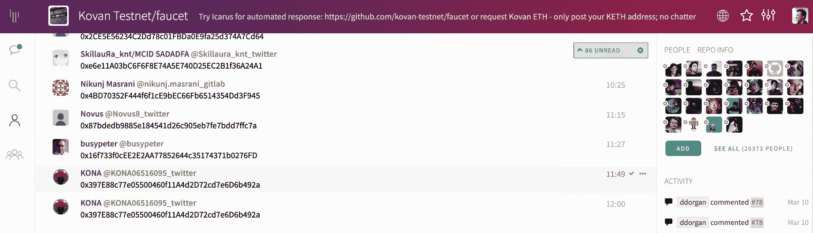

1.  使用您的帐户加入该 Gitter 聊天，并在网站底部的聊天框中粘贴您的以太坊地址（从 MetaMask 复制），就像我们在 Rinkeby 中所做的那样：

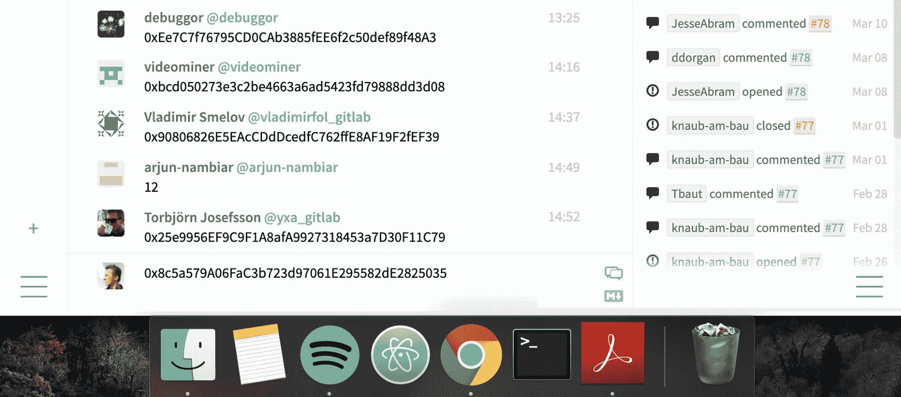

1.  按下 *Enter* 发送您的地址，几分钟后您将收到 1 个 Kovan 以太币。如果您不想等待，可以使用名为 **Icarus** 的工具获取以太币（在此处提供：[`faucet.kovan.network/`](https://faucet.kovan.network/)），该工具会自动提供以太币：

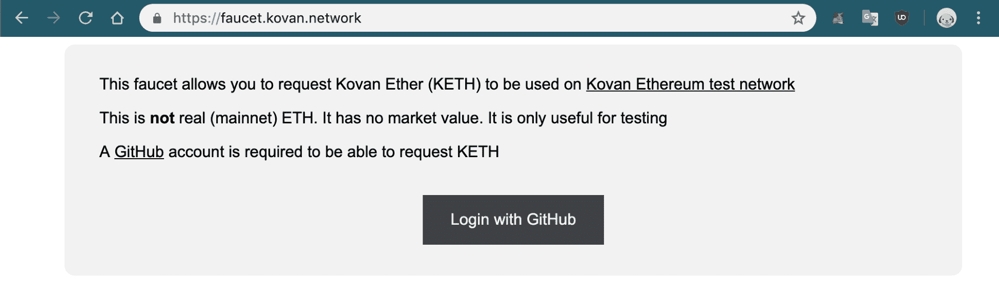

1.  单击使用 GitHub 登录以便他们知道是谁在请求以太币。然后，您将看到一个简单的输入框，以请求每 24 小时一个以太币：

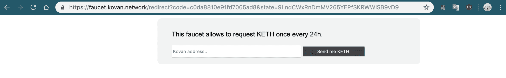

1.  如果一切顺利，您将在 Etherscan 上看到带有您交易的绿色消息。

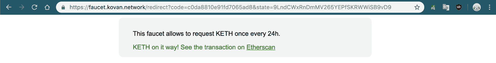

一般情况下，如果您想要极快的区块时间并且关心安全性，您应该使用此网络。主要问题是，您无法像 Rinkeby 或 Ropsten 那样轻松获取以太币，因为用户必须拥有 GitHub 资料或访问 Gitter 聊天，即使如此，水龙头每 24 小时也只能提供一个以太币。

# 介绍 Mainnet

以太坊主网络是创建平台的关键组件，在这个平台上你可以部署智能合约并运行去中心化应用。尽管它是主网络，但一些开发者更喜欢将他们的 dApps 运行在测试网络上，以避免昂贵的成本。无论如何，最好在主网络上部署你的最终应用，这样更多的用户将能够使用你的去中心化应用，使用真正的以太币和最新的更新。

主网络也被称为**Homestead**，它是在 2015 年随着以太坊的创建而发布的生产版本，所有真实世界的用例都部署在这里。它采用了 15 秒的区块生成时间，这取决于矿工，它运行 PoW，这取决于拥有一个强大的节点网络来维持网络的运行，否则就会因为允许 51% 攻击而变得容易受到攻击。

要获取 Homestead 的以太币，你必须从交易所购买，比如 Coinbase、Kraken、Bittrex，或者接受法定货币的等价物。然后，你必须将你的以太币存储在一个钱包中，这可以是硬件钱包，比如 Trezor，也可以是软件钱包，比如 [btc.com](https://btc.com) 提供的钱包、MetaMask、Mist 或者 [myetherwallet.com](https://myetherwallet.com) 提供的钱包。

如果你对安全性非常担心，你甚至可以创建一个纸质钱包来保持它的安全性。总的来说，当涉及到真正的以太币时，你要小心谨慎，因为它包含了可以交换成法定货币和现实世界资源的有价钱值，所以安全是必须的。

# 摘要

在本章中，你已经学会了了解测试网络。首先，你经历了 Ropsten 的历史，它是如何开始的，以及使其成为以太坊开发者最常用的测试网络的独特特性。然后，你了解了 Rinkeby 测试网络对于那些希望长期依赖测试网络的项目来说是多么强大和安全。你看到了如何通过简单修改 Truffle 配置文件来部署你的合约到每个测试网络。之后，你了解了 Kovan 网络对于那些需要快速确认的开发者来说有多快，实际上它是快速开发的最佳解决方案之一，尽管你已经知道获取 Kovan 的以太币比其他网络更加复杂一些。最后，你探索了 Homestead 网络如何工作，其中包含了只能在交易所购买后才能获得的有价值的以太币。

在下一章中，你将学到更多关于一些最精妙和有价值的开发技巧，你可以立即使用这些技巧来为更高质量的项目创建更好、更快、更高效的 dApps —— 这是你在其他任何地方都找不到的独家信息！
