# 第八章：各种 dApps 集成

本章介绍了如何利用新技术改进现有的 dApps 和智能合约，使它们更快、更好、更有效。有趣的是，大多数 dApps 都可以通过一些技巧进行改进。你将发现 dApp 开发的新方面，包括创建自己的预言机和与智能合约一起工作的后端。首先，你将通过改进你的 React 技能开始，然后我们将转向后端，以便你学会为需要大量资源才能正常工作的混合型 dApps 创建更好的集中式后端。之后，我们将回到前端，学习如何使用 web3.js 构建更强大的 dApps。为了涵盖与你的 dApps 相关的所有领域，你将利用最近获得的关于服务器的知识构建预言机，这是处理预言机时要考虑的主要组件。最后，为了对改进做一个完整的回顾，你将学习如何改进你的开发工作流程，以便以时间和资源为基础生产出最有效的代码。

在本章中，我们将涵盖以下主题：

+   更好的 React 应用程序

+   使用 NGINX 构建可扩展的 Node.js 后端

+   更好的 web3.js dApps

+   构建你自己的预言机

+   改进你的开发工作流程

# 更好的 React 应用程序

你对创建 React 应用程序所需的工作流程很熟悉。但是，许多较新的 dApps 方面更难以控制。这包括智能合约连接性、为 Solidity 函数处理数据以及创建可扩展组件等方面。

# 正确组织组件

当你的应用程序开始增长时，你希望确保你的代码库足够干净，以支持新的改进而无需在以后重写整个系统。为此，你将从将组件分离到不同文件开始，以便你可以正确地组织你的内容。

例如，看一看名为`index.js`的这个文件：

```
import React from 'react'
import ReactDOM from 'react-dom'

class Main extends React.Component { ... }

class ArtContainer extends React.Component { ... }

class ArtPiece extends React.Component { ... }

class Form extends React.Component { ... }

class ButtonContainer extends React.Component { ... }

ReactDOM.render(<Main />, document.querySelector('#root')
```

你会看到有五个组件都在一个大文件中，由数百行代码组成。这对于只有几个组件的较小项目来说是可以接受的，但是当你开始处理更大的应用程序时，你必须将你的组件分开放在不同的文件中。为此，请为每个组件创建一个具有相同名称的文件。以下是一个示例：

```
// ArtPiece.js

import React from 'react'
import ReactDOM from 'react-dom'

class ArtPiece extends React.Component { ... }

export default ArtPiece
```

注意，你必须使用`export default`关键字导出你的组件，这样你才能得到特定的组件。然后，你的`src`文件夹最终会看起来类似于这样：

```
src/
    Main.js
    ArtContainer.js
    ArtPiece.js
    Form.js
    ButtonContainer.js
```

现在，在你的`Main.js`组件中，你必须导入所有将要使用的组件。否则，它不会工作。这种重构可以很容易地在任何项目中完成，因为它只是将组件分离到文件中；但是，请确保将它们导入并导出到正确的位置。

# 动态生成组件

在改进 React dApps 时的另一个技巧是动态生成组件。您可能曾经处于这样一种情况，您必须生成具有不同属性的多个子组件，因为您有某种数组。这似乎很简单，但却非常不直观，因为 React 只能理解其虚拟 HTML 中的某种对象类型。

假设你有一个包含不同动物属性的对象数组，这些属性是从智能合约中获取的：

```
const myAnimals = [
    {
        name: 'Example',
        type: 'tiger',
        age: 10
    }, {
        name: 'Doge',
        type: 'dog',
        age: 12
    }, {
        name: 'Miaw',
        type: 'cat',
        age: 3
    }
]
```

您想为这些对象中的每一个生成`Animal`组件。您不能只是简单地循环它们并创建组件；您必须使用带有普通括号的`.map()`函数，而不是花括号，因为 React 组件非常挑剔。看看它会是这样：

1.  首先，您可以按照以下方式设置构造函数来呈现数组中要显示的元素：

```
import React from 'react'
import ReactDOM from 'react-dom'

class AnimalContainer extends React.Component {
    constructor () {
        super()
        this.state = {
            myAnimals: [
                {
                    name: 'Example',
                    type: 'tiger',
                    age: 10
                }, {
                    name: 'Doge',
                    type: 'dog',
                    age: 12
                }, {
                    name: 'Miaw',
                    type: 'cat',
                    age: 3
                }
            ]
        }
    }
}

ReactDOM.render(<AnimalContainer />, document.querySelector('#root'))
```

1.  然后，设置呈现函数以通过`map()`函数查看所有元素，尽管您可以使用普通的`for()`循环来生成 JSX 组件数组。请注意，因为 JSX 要求返回动态 HTML 元素，我们将每个元素返回在普通的`()`括号内而不是花括号`{}`内：

```
render () {
    return (
        <div>
            {this.state.myAnimals.map(element => (
                <Animal
                    name={element.name}
                    type={element.type}
                    age={element.age}
                />
            ))}
        </div>
    )
}
```

1.  最后，创建`Animal`组件以在您的 dApp 上显示它：

```
class Animal extends React.Component {
    constructor () {
        super()
    }

    render () {
        return (
            <div>
                <div>Name: {this.props.name}</div>
                <div>Type: {this.props.name}</div>
                <div>Age: {this.props.name}</div>
            </div>
        )
    }
}
```

正如你所见，`AnimalContainer`组件正在使用`.map()`函数动态生成`Animal`。这就是如何将 JavaScript 对象转换为 React 组件。请注意，我们是在 render 函数内生成组件的，并且`.map()`函数块在普通括号中而不是花括号中：

```
.map(element => ())
```

# 更快地启动项目

React 项目的另一个问题是，您必须始终从头安装依赖项，设置`webpack`文件，并确保一切正常运行。这很烦人，耗费了太多宝贵的时间。为了解决这个问题，有`create-react-app`库，尽管它添加了许多不必要的包，可能会在以后造成麻烦，增加了可升级性更困难，因为它基于封闭系统。

最好尽可能使用最简化的版本启动 React 项目。这就是我创建的开源`dapp`项目，其中包含了最小、最精简的使用 Truffle 启动 React dApp 项目的版本，让您可以立即开始。您可以使用以下代码从我的 GitHub 上获取最新版本：

```
$ git clone https://github.com/merlox/dapp
```

然后使用`npm i`安装所有依赖项，运行`webpack watch`以在进行更改时保持文件捆绑为`webpack -d -w`，并在`dist/`文件夹中运行您选择的静态服务器。例如，您可能会选择`http-server dist/`。

`dapp`项目正在为您执行以下任务，以便您可以立即开始新的 dApp 工作：

+   安装所有 `react`, `webpack`, `babel`, 和 `truffle` 的依赖项。刚刚好，因为它甚至不包括 `.css` 加载器，这样你就可以轻松管理你的包。如果你想使用它，你仍然需要全局安装 Truffle。

+   为你设置 `webpack.config.js` 文件，其中入口为 `/src/index.js`，输出为 `/dist/`，并使用加载器加载所有 `.js` 和 `.html` 文件。

+   设置最简单的 HTML 和 JavaScript 索引文件。

因此，每当你需要启动一个新项目时，你可以简单地克隆 `dapp` 存储库以加快启动速度。

# 带有 NGINX 的可伸缩 Node.js 后端

**Node.js** 是创建命令行应用程序、服务器、实时后端以及各种用于开发 Web 应用程序的工具中最强大的工具之一。它之所以美妙，是因为 Node.js 就是服务器上的 JavaScript，这与你的 React 前端很好地结合在一起，实现了 JavaScript 到处都是。即使它是集中式的，你也会在许多场合使用它，用于去中心化项目，你无法摆脱以太坊区块链的限制。你看，Solidity 和 Vyper 的限制很严重：除了基本的基于函数的代码之外，你几乎什么都做不了。迟早你都得使用集中式后端来实现像需要仪表板这样的高级应用程序。

至少在去中心化的主机和存储解决方案显着改进之前，我们将不得不使用集中式后端来处理那些不能轻松通过智能合约完成的特定任务。

**NGINX**（发音为**engine X**），另一方面，是一个可以用作反向代理和负载均衡器等的 Web 服务器。与 Node.js 结合使用是一个神奇的工具，因为它加速了后端调用并显着提高了可伸缩性。简单来说，NGINX 是大量用户需要最佳性能的高级项目的 Node.js 的最佳伙伴。这并不意味着它不能用于简单的 Node.js 应用程序，绝对不是这样：NGINX 也非常适用于小型应用程序，帮助你轻松控制端口并理解域名。你将学到所有必要的知识，以便正确地为更大的 dApps 使用它。

我们将从学习如何创建一个带有 NGINX 后端的 Node.js 应用程序开始，然后我们将把它连接到一个真实的域名，最终部署一个可扩展的 NGINX 后端，包括负载均衡等其他改进。

# 创建一个 Node.js 服务器

你可以在任何地方创建 Node.js 应用程序，但迟早你都得将该应用程序迁移到真实的托管服务，比如 **亚马逊云服务 EC2**（**AWS EC2**）或 DigitalOcean。两者都是优秀的选择，所以我们将探讨如何部署到 DigitalOcean。

无论如何，我们将首先在本地创建 Node.js 服务器，然后将其移动到托管解决方案中。假设我们有以下情景：你刚刚使用 React 创建了一个功能完善且效率非常高的 dApp，因此你希望其他人能够免费使用这个应用程序。你可以将其部署到 GitHub 页面或 HostGator 提供的静态托管网站等，但你希望扩展应用程序的功能，并具有仅对特定用户可访问的数据库和管理页面。这就是你需要自定义服务器和**虚拟专用服务器**（**VPS**）的地方，它基本上是一个远程计算机，你可以在其中进行自定义服务器的创建，通常使用 Linux 操作系统。

要实现这一切，你必须首先创建一个 Node.js 服务器，为你提供静态文件，而不是使用诸如`http-server`之类的工具。让我们从在前几章中创建的 Social Music 应用程序创建一个静态服务器开始吧。继续在项目目录内创建`server/`和`public/`文件夹，并将基本代码移动到`public`文件夹中：

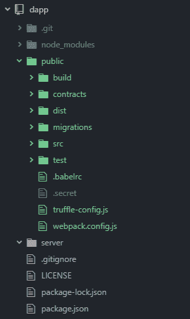

我们将所有与节点相关的文件（例如`package.json`）和与 GitHub 相关的文件（例如`LICENSE`）移动到了与服务器文件分开的地方，以便进行组织。

首先，在`server/`中创建一个名为`server.js`的文件，作为设置服务器所需的主要文件，包括所需的库：

```
const express = require('express')
const bodyParser = require('body-parser')
const app = express()
const path = require('path')
const port = 9000
const distFolder = path.join(__dirname, '../public', 'dist')
```

然后，配置服务器监听器，负责在外部用户请求时提供正确的文件：

```
app.use(distFolder, express.static(distFolder))
app.use(bodyParser.json())

app.use((req, res, next) => {
   console.log(`${req.method} Request to ${req.originalUrl}`)
   next()
})
app.get('*/bundle.js', (req, res) => {
   res.sendFile(path.join(distFolder, 'bundle.js'))
})
app.get('*', (req, res) => {
   res.sendFile(path.join(distFolder, 'index.html'))
})

app.listen(port, '0.0.0.0', (req, res) => {
    console.log(`Server listening on localhost:${port}`)
})
```

首先我们导入了`express`和`body-parser`。Express 是一个使用 Node.js 创建 web 服务器的框架，而 body-parser 则用于处理所有我们的 JSON 请求，以便能够理解这些类型的消息，因为默认情况下，Node.js 无法理解 JavaScript 请求的`json`对象。然后，我创建了几个`get`请求处理程序，以便在从`dist`文件夹请求时发送`bundle.js`文件和`index.html`；`app.use()`是一个中间件，这意味着它接收所有请求，进行一些处理，并让其他请求块继续执行它们的工作。在这种情况下，我们使用该中间件来记录有关每个请求的信息，以便在出现任何问题时调试服务器。

使用以下命令安装所需的服务器依赖项：

```
npm i -S body-parser express
```

现在，你可以运行服务器了：

```
node server/server.js
```

上述命令的问题在于，每当出现错误请求或者对服务器文件进行更改时，你都必须重新启动服务器。对于开发工作，最好使用`nodemon`实用程序，它会自动刷新服务器。使用以下代码安装它：

```
npm i -g nodemon
```

然后，再次运行你的服务器：

```
nodemon server/server.js
```

为了更轻松地进行开发，在你的`package.json`文件中创建一个新的脚本，以便更快地运行该命令：

```
{
  "name": "dapp",
  "version": "1.0.0",
  "description": "",
  "main": "truffle-config.js",
  "directories": {
    "test": "test"
  },
 "scripts": {
 "server": "nodemon server/server.js"
 },
  "author": "",
  "license": "ISC",
  "dependencies": {
    "@babel/core": "⁷.2.2",
    "@babel/preset-env": "⁷.3.1",
    "@babel/preset-react": "⁷.0.0",
    "babel-loader": "⁸.0.2",
    "babel-polyfill": "⁶.26.0",
    "body-parser": "¹.18.3",
    "css-loader": "².1.0",
    "express": "⁴.16.4",
    "html-loader": "⁰.5.5",
    "html-webpack-plugin": "³.2.0",
    "react": "¹⁶.8.1",
    "react-dom": "¹⁶.8.1",
    "style-loader": "⁰.23.1",
    "truffle-hdwallet-provider": "¹.0.3",
    "web3": "¹.0.0-beta.46",
    "webpack": "⁴.29.3",
    "webpack-cli": "³.2.3"
  }
}
```

然后，你可以运行`npm run server`来启动服务器：

# 获取托管解决方案

现在我们的静态服务器已经运行，我们可以将其部署到托管解决方案上，以使我们的 dApp 从外部世界访问。在此之前，将您的项目添加到 GitHub，并包含所有最新更改，以便稍后在另一台计算机上使用。转到[`digitalocean.com`](https://digitalocean.com)，并使用链接[`m.do.co/c/db9317c010bb`](https://m.do.co/c/db9317c010bb)创建帐户，这将为您提供价值 $100 的服务，免费使用 60 天，并在您添加 $25 到服务时额外获得 $25。这将足以至少运行一个基本的 VPS 服务器 3 个月。您需要添加信用卡/借记卡或添加 $5 的 PayPal 美元才能开始使用它。在我的情况下，我支付了 $5 美元。

转到 Droplets 部分，然后单击“创建 Droplet”：

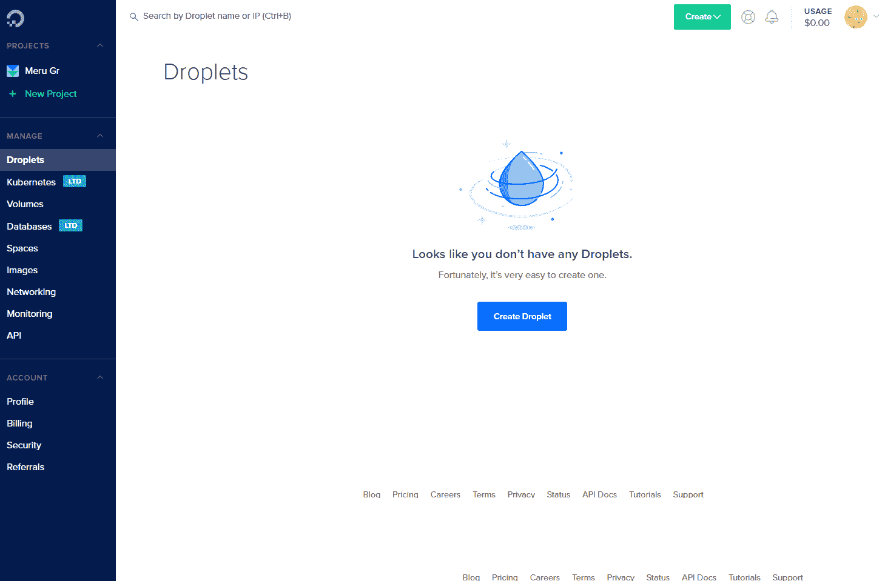

然后，您必须选择在该服务器内安装哪个发行版；此发行版称为 Droplets。您可以选择使用 Node.js 的一键式安装，但我认为在没有用户界面时了解如何从头安装 Node.js 非常重要。因此，请选择 Ubuntu 18.04 作为操作系统，并选择每月 $5 的计划：


选择距离您所在地最近的数据中心以获得最佳性能。我住在西班牙，所以我会选择德国或英国的服务器。对您来说，可能会有所不同：


将其余选项保持不变，然后按“创建”进行创建。您将看到实时创建的过程。单击您的 droplet 并复制 IPv4 地址，您将需要连接到该服务器：

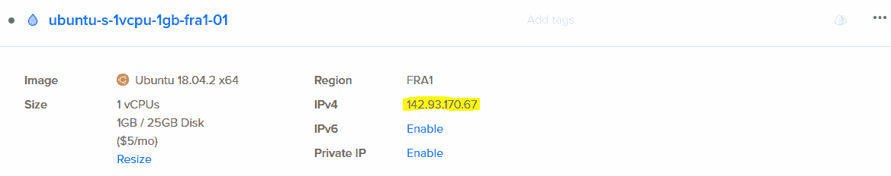

# 在 VPS 主机上设置您的服务器

如果您使用的是 Windows，请从官方网站下载 PuTTY 以连接到外部服务器，网址在这里：[`www.putty.org`](https://www.putty.org/)。安装后打开它：

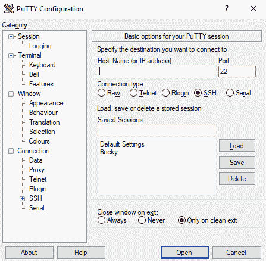

将您的 IP 地址粘贴到主机名输入框中，并通过单击“打开”连接到它。它会警告您连接到一个未知的服务器；只需点击“是”。然后，它会要求您登录；将`root`作为您的默认用户名：对于每个托管提供商，它都是不同的。

如果您使用的是 Mac，则可以简单地使用以下命令而不是使用 PuTTY：

```
ssh root@<your-ip>
```

尽管 **root** 是 DigitalOcean 提供的默认用户，但请注意每个托管解决方案可能会有所不同，因此请查看其网站上提供的信息。

然后，它会要求您输入密码，您可以通过电子邮件获得；由于 DigitalOcean 已经向您发送了登录凭据，因此您在粘贴时将不会看到它，这是一种安全措施。您可以通过右键单击粘贴，除此之外什么都不要做，因为 PuTTY 就是这样工作的。

紧接着，它将要求您重新输入当前密码，然后将您的 Unix 密码更改为新密码，因为您不能依赖自动生成的密码：

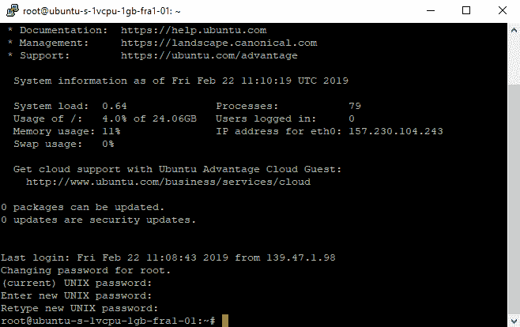

现在您应该可以访问您的服务器。正如您所看到的，除了您的命令行工具之外，您没有用户界面。您不希望像 root 用户一样执行所有任务，因为这是一个安全风险，任何操作都可以无限制地访问整个系统。使用以下代码创建一个新用户：

```
useradd -m <your-user-name>
```

以下是一个示例：`useradd -m merunas`。 `-m` 标志将创建一个 `/home/merunas` 用户文件夹。然后，使用 `su merunas` 或您创建的任何用户切换到该用户。`su` 命令表示“切换用户”。

您还必须使用 `passwd` 命令设置密码，否则您将无法在会话开始时登录。例如，您可以使用此命令：`passwd merunas`。您下次想要以该用户登录，以避免作为 root 用户的潜在安全风险。然后，您将想要将您的 shell 更改为 Bash 而不是 sh，以便在按 *ab* 时获得自动完成，以及其他帮助您编写命令的实用程序。请使用以下命令执行此操作：

```
chsh <your-user> -s /bin/bash
```

然后，将您的用户添加到 `sudo` 组中，以便能够以 `root` 用户身份运行命令而无需更改用户。您必须以 `root` 用户身份运行此命令：

```
usermod -aG sudo <your-user>
```

这是一个示例：`usermod -aG sudo merunas`。

现在我们要做的是从头开始安装 Node.js 和 NGINX。Node.js 的过程有点复杂，因为他们不断改进他们的软件，所以设置起来更困难，但完全可行。转到 [`nodejs.org/en/download/current/`](https://nodejs.org/en/download/current/) 并通过右键单击其中的按钮复制源代码的链接地址：

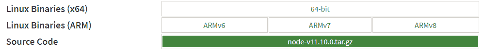

返回到 PuTTY 会话并运行 `wget` 命令与源代码链接一起下载节点二进制文件，以便您可以安装它：

```
wget https://nodejs.org/dist/v11.10.0/node-v11.10.0.tar.gz
```

使用 `tar` 进行提取，如下命令行所示：

```
tar -xf node-v11.10.0.tar.gz
```

运行 `cd node-v11.10.0` 切换到当前目录。要从该文件夹安装 Node.js，您需要安装一些依赖项，这些依赖项可以通过名为 `build-common` 的软件包安装：

```
sudo apt install build-common
```

然后，运行 `./configure` 和 `sudo make` 命令来运行安装。`make` 命令生成所需的配置，但需要几分钟的时间，所以请耐心等待。以前，您还必须运行 `sudo ./install.sh`，但现在不再需要；您仍然可以获得漂亮的 `node` 可执行文件。只需将其复制到二进制文件位置以便能够全局使用：

```
sudo cp node /bin
```

您现在可以删除安装文件夹和下载的文件。或者，您可以使用 `sudo apt install nodejs` 来安装 Node.js，但这是一个过时的版本，不如官方二进制文件维护得好。现在您已经安装了 Node.js，请从 GitHub 克隆您的社交音乐项目，或者使用以下命令使用我的：

```
git clone https://github.com/merlox/social-music
```

用`sudo apt install npm`在外部安装`npm`，以便你可以安装数据包。你必须从另一个来源获取它，因为 Node.js 不包含它。npm 的好处是你可以立即使用`sudo npm i -g npm`将其更新到最新版本，因此无论你从哪里获取哪个版本，都不重要，你都可以轻松地将其更新到最新版本，而不需要经过漫长的过程。

现在，你可以运行`npm install`来安装你在`social-music`项目中的依赖项。检查你的`package.json`文件是否包含你之前创建的`npm run server`命令。否则，使用`vim`或任何其他文本编辑器，如`nano`，再次添加它：

```
"scripts": {
    "server": "node server/server.js"
}
```

当你使用`npm run server`命令时，你会发现你的服务器正常运行；问题在于你不应该使用`nodemon`，因为它是为开发而设计的，没有考虑到在不同环境下可能出现的问题。

出于这个原因，你有一个非常适合在生产环境中使用的实用工具。它叫做`pm2`，它会保持你的服务器在线，即使在某个时间点发生严重错误。这个实用工具非常好，因为你可以监控你的服务器并运行不同服务的各种实例。使用以下命令在全局安装它：

```
sudo npm i -g pm2
```

它非常容易使用。你只需运行`pm2 start server/server.js`就可以使服务成为守护进程，这意味着无论出于什么原因停止运行，都会重新启动它。要停止它，从运行服务的列表中使用`pm2 delete server`。

恭喜！你的 Node.js 应用程序正在你的服务器上运行。现在，为了让它对世界可用，你必须将它暴露在`80`端口上，这是所有网站使用的公共端口。你可以通过修改你的`server.js`文件或使用所谓的前端服务器来实现，该服务器接收所有请求并将它们重定向到正确的位置。在我们的情况下，那将是 NGINX。但在此之前，我们需要一个易于访问的域名，这将使我们的 IP 管理更加轻松。

# 获取一个域名

你需要一个域名来帮助人们通过一个易于记忆的名称访问你的网站，而不是在他们的浏览器上输入一个长长的 IP 数字。只需进行一些更改，域名将与你的托管解决方案关联起来。要获得一个域名，请访问[godaddy.com](https://in.godaddy.com/)并搜索你想要的名称：


选择最适合你业务的领域：

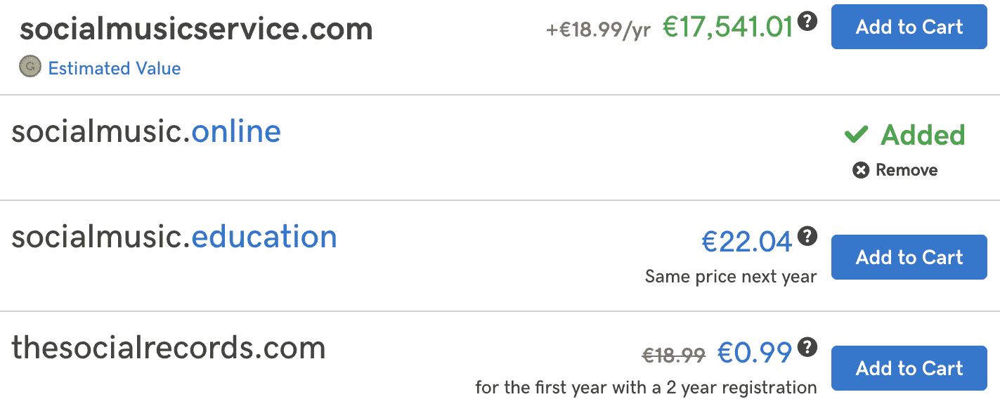

点击“添加到购物车”按钮购买，并创建一个账户（如果你没有账户）。我总是使用 PayPal，因为它更容易管理。几分钟后，你的域名将在你的仪表板上可用：


现在，你可以转到你的 DNS 管理设置，将你的域名指向你托管的服务器，以便从该名称访问：

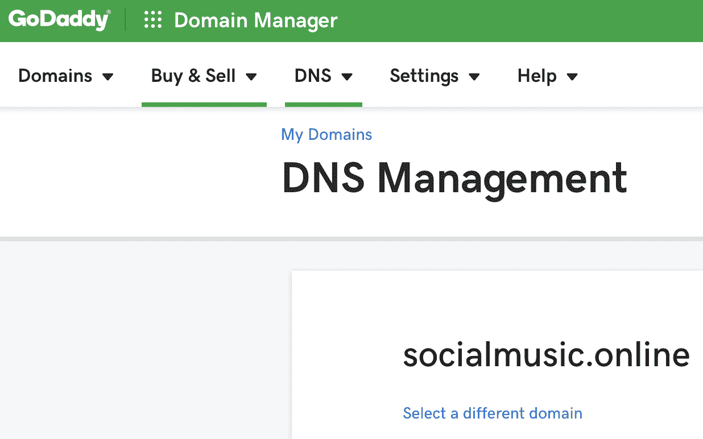

点击 A 记录旁边的铅笔图标，并将指针更改为您的 IP 地址，如下所示：

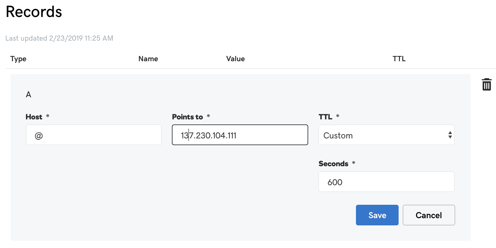

通过这一变化，您现在可以使用域名而不是 IP 连接到您的服务器，在 Mac 中，例如这样：

```
ssh root@socialmusic.online
```

它将与以前完全相同的方式工作。您还可以在端口 80 上启动 Node.js 服务器，并且您将能够使用该域名访问网站。但是，当涉及与域名通信时，Node.js 受到了限制，因此我们必须使用更高级的解决方案。

# 设置 NGINX

现在您的域名已经设置好了，是时候将 NGINX 配置为前端服务器，以将您的域名与 Node.js 实例连接起来了。NGINX 将为您处理所有请求，这样您就可以专注于改进您的 Node.js 应用程序。

与之前一样连接到服务器，并使用以下命令安装`nginx`：

```
sudo apt install nginx
```

之后，您将需要编辑 NGINX 的配置文件，位于`/etc/nginx/sites-enabled/default`。只需用`vim`编辑您的默认文件：

```
sudo vim /etc/nginx/sites-enabled/default
```

然后，添加以下代码以能够在 Node.js 服务器中使用域名：

```
upstream nodejs {
  server socialmusic.online:9000;
}

server {
  listen 80;
  server_name socialmusic.online;

  gzip on;
  gzip_comp_level 6;
  gzip_vary on;
  gzip_min_length 1000;
  gzip_proxied any;
  gzip_types text/plain text/html text/css application/json text/JavaScript;
  gzip_buffers 16 8k;

  location / {
    proxy_http_version 1.1;
    proxy_set_header Upgrade $http_upgrade;
    proxy_set_header Connection 'upgrade';
    proxy_set_header Host $host;
    proxy_set_header X-Real-IP $remote_addr;

    proxy_pass http://nodejs;
  }

  location ~ ^/(images/|img/|JavaScript/|js/|css/|stylesheets/|static/) {
    root /home/merunas/social-music/public;
    access_log off;
    expires max;
  }
}
```

首先，我们定义了一个`upstream`块。在这里，我们告诉 NGINX 我们在正确端口上运行的`node.js`服务器的位置。这对于保护端口 80 非常重要，因为大部分请求都会在那里执行。

然后，我们创建了一个`server`块。这些类型的块用于在定义的端口上设置一些配置。`listen 80;`语句告诉 NGINX 在该服务器块内处理端口 80 的请求。然后，我们为更快的加载时间添加了一些`gzip`压缩，以及一个将所有请求传递给`upstream nodejs`的位置块。另一个位置块是用于提供静态文件的，以便您有图像之类的文件，因为这是传递静态内容的更快方式。请注意，`root /home/merunas/social-music/public;`根位置是我们的静态文件的位置。

请记得将`socialmusic.online`改为您的域名。您现在可以使用以下命令行运行 NGINX：

```
sudo service nginx restart
```

这将重新启动服务，使其在后台保持运行。您的网站现在可以在任何浏览器中使用您的域名访问。要完成部署，我们将添加 SSL。**SSL**是用于保护访问您的 dApp 的通信的加密算法。这是非常常见的，并且对于任何重要项目来说都必须添加。

# 添加 SSL 安全性

要安装 SSL，我们将使用**Let's Encrypt**的免费证书，这是一个非营利性组织，其目标是为每个人提供免费 SSL 证书来保护互联网。以下是步骤：

1.  安装以下库：

```
sudo apt install software-properties-common certbot python-certbot-nginx
```

1.  运行`certbot`应用程序向您的 NGINX 服务器添加：

```
sudo certbot --nginx
```

1.  提供您的电子邮件地址，接受服务条款，并选择 1 作为您的域名：

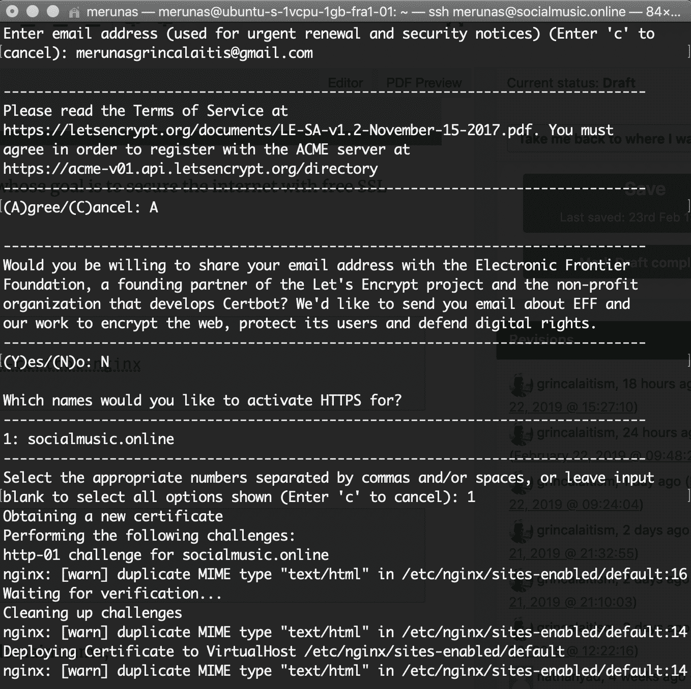

1.  它会询问您是否想要将所有请求重定向到 443 安全的 HTTPS 端口。只需通过选择第二个选项说是：

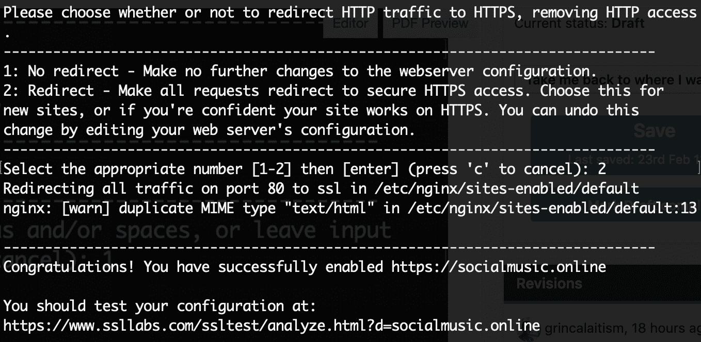

就这样！现在，所有请求都启用了 HTTPS，并且您的域将自动重定向到 HTTPS。这可以手动完成，但这种方式要简单得多，这样您在处理这些类型的复杂身份验证系统时就可以避免无数的头痛。

现在，您的去中心化应用程序使用了一个 NGINX 服务器，并且启用了 HTTPS，使用了一个 Node.js 集中式后端，您可以根据需要扩展其功能，这些功能在简单的智能合约中无法实现。两全其美。

# 更好的 web3.js dApps

web3.js 是您的 Web 应用程序中与智能合约通信的最常用实用程序，可以将它们转换为去中心化应用程序。它能够管理无尽的交易，并且一旦设置完成就会自动工作。

问题在于许多 web3.js 应用程序并没有被优化，至少不尽可能好。因为我们正在处理智能合约，所以代码很快就会变得混乱，这使得中长期内的维护变得更加困难。因此，重要的是您从一开始就研究系统，以创建更好的 web3.js dApps，学习使您在与智能合约交互时成为更好的程序员的技巧和诀窍。

你将会使用很多基于 web3 的 dApps，那么为什么不学习做事情的最佳方式，以便在长期内减少头痛，并创建更高质量的代码呢？以下是一些使 web3.js dApps 更好的技巧和诀窍。

# 设置固定的 web3.js 版本

如果您之前使用过 MetaMask，您可能已经注意到它会将 web3.js 注入到您访问的每个页面中，因为它需要 web3.js 才能与智能合约进行交互。这很好：这是一种预期的行为，但通常会导致旧版本的 web3.js，主要是版本 0.20，这个版本在 web3.js 1.0 推出几年后仍在被使用。他们不想强迫用户更新到最新版本，因为那样会破坏许多已经依赖于 MetaMask 的 web3.js dApps；这是一个巨大的潜在问题。

这就是为什么非常必要为您的项目设置一个固定的 web3.js 版本，以便您不依赖于 MetaMask 或任何其他以太坊客户端强制您使用的版本。必须提供某种保证，即您的 dApp 将在未来继续正常工作。

要做到这一点，请看一下这段代码：

```
import NewWeb3 from 'web3'

window.addEventListener('load', () => {
    window.web3Instance = new NewWeb3(NewWeb3.givenProvider)
})
```

我们在这个示例中使用 web3.js 1.0。接下来，我们导入`NewWeb3`类，这只是一个不同的名称，用于区分它与 MetaMask 提供的`Web3`。设置一个新的 `web3` 对象来使用我们特定版本的 `web3` 与区块链通信。它称为 `web3Instance` 而不是普通的 `web3`，因为我们希望使用不同的名称来避免使用 MetaMask 提供的名称。你看，我们不知道 MetaMask 何时会注入自己的 `web3` 版本，因此，我们确保使用不同的名称来保证我们的版本已经设置好了。然后，我们使用 `window` 对象设置了一个全局的 `web3Instance` 变量，以便它可以在我们应用程序的任何地方访问，并且我们在页面加载后通过监听事件`'load'`来实现。

在项目中尝试一下，你会发现`web3Instance`是你在导入中定义的版本。请注意，`.givenProvider`正在从 MetaMask 中注入的 web3.js 数据中获取数据以设置一个新的 web3.js 版本。确保在所有未来的项目中使用这个提示，以确保你的 dApp 适用于未来和过去的 web3.js 版本，因为 MetaMask 不断地以不可靠的方式更改它自己的系统。

# 创建帮助函数

帮助函数是那些帮助你轻松管理更复杂的函数的函数。它们本质上是帮助其他函数的函数，其中一些通用逻辑可以帮助你避免反复编写代码。

这些是重要的函数，因为它们会极大地提高代码的可维护性。你将能够在更少的行数中看到发生的事情，并且你将能够更快地升级你的代码。

例如，在 web3.js 1.0 中，合约必须为每个智能合约调用和事务使用一行较大的代码：

```
await this.state.contractInstance.methods.functionName(parameters).send({from: this.state.userAddress})
```

这个描述性的名称比必要的稍长一点。让我们用一个帮助函数来缩短它：

```
async function send(functionName, parameters) {
    await this.state.contractInstance.methodsfunctionName.send({from: this.state.userAddress})
}
```

正如你所见，我们已经将一种方法转换成了括号版本，因为这是你可以使用唯一参数动态生成函数名称的方法。过去，我记得使用以下快捷方式来快速选择元素，而不必一遍又一遍地输入相同的结构：

```
function q(element) {
    return document.querySelector(element)
}
```

有了这样一个简单的帮助函数，我将一个 22 个字符的函数转换成了一个具有相同逻辑的 1 个字符的函数。起初可能看起来荒谬，但当你在一个项目中需要使用它 100 次时，你会意识到你大大减少了代码的大小，并且使其更易于阅读。你实际上节省了 2,200 行代码。现在这就是用最小的改变来提高效率！

# 使你的函数变成 Promise

现代 JavaScript 使用 promises 来清晰地处理事务，因为它让你选择使用同一个函数同步或异步地运行代码，而不是使用回调函数，其中你必须堆叠代码层来控制事物的流程。

这就是为什么如果你的回调函数还没有转换成 promises，那么所有的回调函数都必须被转换成 promises。对于最新版本的 web3 来说，这不是问题，但对于 web3.js 0.20 和许多其他需要使用回调函数的库来说，最好将它们转换为 promises，以便更轻松地编写代码。

有一个名为`bluebird`的库可以帮助你实现这一点，它会将对象内的所有函数转换为 promises。使用以下命令进行安装：

```
npm i -S bluebird
```

使用以下内容将其导入到你的 React 项目中：

```
import * as Promise from 'bluebird'
```

使用以下函数将你的对象方法转换为`Async`：

```
web3Instance = Promise.promisifyAll(web3Instance)
```

然后，你可以使用`Async`函数而不是回调函数，就像这样：

```
web3Instance.eth.getAccountsAsync()

// Instead of 
web3Instance.eth.getAccounts()
```

这只是一个例子：你只需在你的回调函数中添加`Async`关键字，就可以使用 promise 版本，而不需要做其他任何事情。

# 使用 web3.js 监听事件

事件对于管理你的去中心化应用程序的流程至关重要，因为你可以实时获取关于智能合约中发生的变化的更新，并相应地采取行动。你甚至可以创建 Node.js 应用程序来通知你有关关键变化的信息。

例如，假设你运行一个银行智能合约，并且有一个事件在你的智能合约中的资金达到临界的 10 以太币时被激活：

```
contract Bank {
    event CriticalLow(uint256 contractBalance);
    ...
}
```

你想要被通知这些变化，所以你在一个`node.js`实例上建立了一个简单的 web3.js dApp，当发生这种情况时会给你发送一封电子邮件：

```
// Node.js

function sendCriticalEmail() {
    // Sends an email when something critical happens to fix it ASAP
}

function listenToCriticalLow() {
    // Listen to critical events on real-time
}
```

这可能是一个监控系统，你自己设置的，用来管理一个被数百万用户使用的 dApp，以使其尽可能长时间地保持运行状态。你可以说，在这样的场景中监听事件是必不可少的，那么你该如何做呢？这是基本结构：

```
function listenToCriticalLow() {
    const subscription = web3.eth.subscribe('CriticalLow', {
        address: <your-contract-address>
    }, (err, result) => {
        if(!err) sendCriticalEmail()
    })
}
```

当事件生成时，你的`web3.eth.subscription`函数将执行回调。这基本上就是你如何在 web3 中监听事件的方法。现在，你知道如何在你的 dApp 工作流程中运用它们了。

# 构建你自己的 Oracle

Oracle 是外部应用程序，它们帮助你的智能合约从外部世界获取信息，以执行一些 Solidity 或 Vyper 中不可能实现的功能。它们的工作原理很简单：你创建一个中心化的服务器，在需要时调用你的智能合约的特定函数。

它们用于生成随机数、提供实时价格数据和显示网站信息。正如你所知，智能合约无法生成随机数，因为在区块链中不能存在任何关于能够避免意外情况的不确定性。

在这一部分，你将学习如何创建一个 Oracle 来为区块链上的游戏生成一个 1 到 100 之间的随机数。已经有一些做这些任务的 Oracle，即 Oraclize，它已经在 Solidity 中被使用了很长时间。

# 构建随机生成的 Oracle

Oracle 是智能合约从外部世界获取信息的一种方式。它们是中心化服务器、外部区块链和 API 与运行在以太坊上的智能合约之间的桥梁。基本上，它们是一种服务，可以为您提供来自无法通过普通智能合约访问的地方的重要信息，它们通过设置一个中心化服务器监听您的合约的 web3 事件来工作。

首先，创建一个名为`oracle`的新项目，运行`truffle init`以便编译合约，使用`npm init -y`设置 npm，并创建一个生成事件并处理`Oracle.sol`的智能合约：

```
pragma solidity 0.5.4;

contract Oracle {
    event GenerateRandom(uint256 sequence, uint256 timestamp);
    event ShowRandomNumber(uint256 sequence, uint256 number);
    uint256 public sequence = 0;

    function generateRandom() public {
        emit GenerateRandom(sequence, now);
        sequence += 1;
    }

    function __callback(uint256 _sequence, uint256 generatedNumber) public {
        emit ShowRandomNumber(_sequence, generatedNumber);
    }
}
```

这很基本：当用户通过调用`generateRandom()`函数请求时，执行带有随机生成的数字的`__callback()`函数的想法。我们将设置一个事件监听器，在适当的时间给用户提供随机数，带有正确的序列标识符。

记得更新您`migrations`文件夹中的`1_initial_migrations.js`文件，以告诉 Truffle 部署正确的合约：

```
var Oracle = artifacts.require("./Oracle.sol")

module.exports = function(deployer) {
    deployer.deploy(Oracle)
}
```

然后，通过在`truffle-config.js`中设置正确的配置来将其部署到`ropsten`。您已经知道如何做到这一点，因为我们在之前的章节中学习了如何在 Truffle 的配置文件中设置 Infura 以用于 Ropsten：

```
truffle deploy --network ropsten --reset
```

现在，我们可以创建一个 Node.js 应用程序，该应用程序监听由我们的智能合约生成的事件，并使用以下代码在一个`oracle.js`文件中启动生成一个随机生成的数字类型的正确请求：

```
const Web3 = require('web3')
const fs = require('fs')
const path = require('path')
const infura = 'wss://ropsten.infura.io/ws/v3/f7b2c280f3f440728c2b5458b41c663d'
let contractAddress
let contractInstance
let web3
let privateKey
let myAddress
```

我们已经导入了`web3`、`fs`和`path`作为与合约交互的库。然后，我们定义了一个用于连接到 Ropsten 部署和与合约交互的 websockets Infura URL。重要的是您使用`wss`而不是`http`，因为这是接收事件的唯一方式。最后，我们添加了一些稍后会需要的全局变量。

通过创建和签署使用我们的私钥的自定义交易对象，我们可以生成没有 MetaMask 的交易。我们可以使用以下基于`.secret`文件中的助记词生成私钥的函数：

```
// To generate the private key and address needed to sign transactions
function generateAddressesFromSeed(seed) {
    let bip39 = require("bip39");
    let hdkey = require('ethereumjs-wallet/hdkey');
    let hdwallet = hdkey.fromMasterSeed(bip39.mnemonicToSeed(seed));
    let wallet_hdpath = "m/44'/60'/0'/0/0";
    let wallet = hdwallet.derivePath(wallet_hdpath).getWallet();
    let address = '0x' + wallet.getAddress().toString("hex");
    let myPrivateKey = wallet.getPrivateKey().toString("hex");
    myAddress = address
    privateKey = '0x' + myPrivateKey
}
```

这相当复杂，尽管我们只需要专注于安装和导入`bip39`和`ethereumjs-wallet`库以生成用于签署交易的`privateKey`。我们可以使用以下命令安装依赖项：

```
npm i -S bip39 ethereumjs-wallet web3
```

然后，我们可以创建一个`start`函数，该函数将设置所需的合约并开始监听正确的触发事件以调用`__callback()`函数：

```
// Setup web3 and start listening to events
function start() {
    const mnemonic = fs.readFileSync(".secret").toString().trim()
    generateAddressesFromSeed(mnemonic)

    // Note that we use the WebsocketProvider because the previous HttpProvider is outdated and doesn't allow subscriptions
    web3 = new Web3(new Web3.providers.WebsocketProvider(infura))
    const ABI = JSON.parse(fs.readFileSync(path.join(__dirname, 'build', 'contracts', 'Oracle.json')))
    contractAddress = ABI.networks['3'].address
    contractInstance = new web3.eth.Contract(ABI.abi, contractAddress)

    console.log('Listening to events...')

    // Listen to the generate random event for executing the __callback() function
    const subscription = contractInstance.events.GenerateRandom()
    subscription.on('data', newEvent => {
        callback(newEvent.returnValues.sequence)
    })
}
```

首先，我们读取助记词的 12 个单词的密码来使用先前的`generateAddressesFromSeed()`函数生成我们的 privateKey 和 address。然后，我们使用`WebsocketProvider`为我们的 Ropsten Infura URL 设置一个新的 web3 实例，因为我们无法使用`HttpProvider`监听事件。之后，我们通过从 Truffle 生成的包含部署合约地址的 JSON 文件中读取 ABI 数据来设置`contractInstance`。

最后，我们使用`contractInstance.events.GenerateRandom()`函数为`GenerateRandom`事件设置了一个订阅，这将使用与之对应的序列调用`callback()`函数。让我们看看回调函数是什么样子的。请记住，这个函数将运行我们智能合约的`__callback()`函数，以向用户提供一个随机生成的数字，因为我们不能直接使用 Solidity 生成随机数：

```
// To generate random numbers between 1 and 100 and execute the __callback function from the smart contract
function callback(sequence) {
    const generatedNumber = Math.floor(Math.random() * 100 + 1)

    const encodedCallback = contractInstance.methods.__callback(sequence, generatedNumber).encodeABI()
    const tx = {
        from: myAddress,
        gas: 6e6,
        gasPrice: 5,
        to: contractAddress,
        data: encodedCallback,
        chainId: 3
    }

    web3.eth.accounts.signTransaction(tx, privateKey).then(signed => {
        console.log('Generating transaction...')
        web3.eth.sendSignedTransaction(signed.rawTransaction)
            .on('receipt', result => {
                console.log('Callback transaction confirmed!')
            })
            .catch(error => console.log(error))
    })
}
```

这个函数接收序列参数以将值映射到正确的 ID，使用户能够确定哪个事件适合他们。首先，我们使用`Math.random()`生成一个介于 1 和 100 之间的随机数，通过一些计算来使其适应我们期望的范围。然后，我们生成一个称为`tx`的交易对象，其中包括我们的函数数据，包括`sequence`和`generatedNumber`，以及一些基本参数，如`gas`和`from`地址。最后，我们通过首先使用`privateKey`进行签名，然后使用`web3.eth.sendSignedTransaction`发送该交易到我们的`Oracle`智能合约。当矿工确认时，我们会看到`console.log`显示`"Callback transaction confirmed!"`，或者在出现问题时显示错误。

就是这样了！我们可以在底部添加`start()`函数初始化以开始监听事件。以下是完整的代码：

1.  在文件开头导入所需的库并设置将在项目中使用的变量：

```
const Web3 = require('web3')
const fs = require('fs')
const path = require('path')
const infura = 'wss://ropsten.infura.io/ws/v3/f7b2c280f3f440728c2b5458b41c663d'
let contractAddress
let contractInstance
let web3
let privateKey
let myAddress
```

1.  创建`generateAddressesFromSeed()`函数，它为您提供了访问给定种子中包含的帐户的权限：

```
// To generate the private key and address needed to sign transactions
function generateAddressesFromSeed(seed) {
    let bip39 = require("bip39");
    let hdkey = require('ethereumjs-wallet/hdkey');
    let hdwallet = hdkey.fromMasterSeed(bip39.mnemonicToSeed(seed));
    let wallet_hdpath = "m/44'/60'/0'/0/0";
    let wallet = hdwallet.derivePath(wallet_hdpath).getWallet();
    let address = '0x' + wallet.getAddress().toString("hex");
    let myPrivateKey = wallet.getPrivateKey().toString("hex");
    myAddress = address
    privateKey = '0x' + myPrivateKey
}
```

1.  创建`start`函数以设置 web3 监听器：

```

// Setup web3 and start listening to events
function start() {
    const mnemonic = fs.readFileSync(".secret").toString().trim()
    generateAddressesFromSeed(mnemonic)

    // Note that we use the WebsocketProvider because the previous HttpProvider is outdated and doesn't allow subscriptions
    web3 = new Web3(new Web3.providers.WebsocketProvider(infura))
    const ABI = JSON.parse(fs.readFileSync(path.join(__dirname, 'build', 'contracts', 'Oracle.json')))
    contractAddress = ABI.networks['3'].address
    contractInstance = new web3.eth.Contract(ABI.abi, contractAddress)

    console.log('Listening to events...')

    // Listen to the generate random event for executing the __callback() function
    const subscription = contractInstance.events.GenerateRandom()
    subscription.on('data', newEvent => {
        callback(newEvent.returnValues.sequence)
    })
}
```

1.  最后，创建执行智能合约中的`__callback()`函数的回调函数。函数名称以两个下划线开头，以避免调用现有函数，因为它是一个专门由 Oracle 专用的特殊函数：

```
// To generate random numbers between 1 and 100 and execute the __callback function from the smart contract
function callback(sequence) {
    const generatedNumber = Math.floor(Math.random() * 100 + 1)

    const encodedCallback = contractInstance.methods.__callback(sequence, generatedNumber).encodeABI()
    const tx = {
        from: myAddress,
        gas: 6e6,
        gasPrice: 5,
        to: contractAddress,
        data: encodedCallback,
        chainId: 3
    }

    web3.eth.accounts.signTransaction(tx, privateKey).then(signed => {
        console.log('Generating transaction...')
        web3.eth.sendSignedTransaction(signed.rawTransaction)
            .on('receipt', result => {
                console.log('Callback transaction confirmed!')
            })
            .catch(error => console.log(error))
    })
}
```

1.  记得在文件加载完毕后运行`start`函数来启动 oracle：

```
start()
```

1.  可选地，我们可以添加一个函数来执行来自我们智能合约的`generateRandom()`函数，以验证我们是否确实收到了另一个订阅的事件，例如以下内容：

```
// To send a transaction to run the generateRandom function
function generateRandom() {
    const encodedGenerateRandom = contractInstance.methods.generateRandom().encodeABI()
    const tx = {
        from: myAddress,
        gas: 6e6,
        gasPrice: 5,
        to: contractAddress,
        data: encodedGenerateRandom,
        chainId: 3
    }

    web3.eth.accounts.signTransaction(tx, privateKey).then(signed => {
        console.log('Generating transaction...')
        web3.eth.sendSignedTransaction(signed.rawTransaction)
            .on('receipt', result => {
                console.log('Generate random transaction confirmed!')
            })
            .catch(error => console.log(error))
    })
}
```

1.  然后，通过使用`generateRandom()`函数更新`start`函数以监听我们创建的新事件：

```
// Setup web3 and start listening to events
function start() {
    const mnemonic = fs.readFileSync(".secret").toString().trim()
    generateAddressesFromSeed(mnemonic)

    // Note that we use the WebsocketProvider because the previous HttpProvider is outdated and doesn't allow subscriptions
    web3 = new Web3(new Web3.providers.WebsocketProvider(infura))
    const ABI = JSON.parse(fs.readFileSync(path.join(__dirname, 'build', 'contracts', 'Oracle.json')))
    contractAddress = ABI.networks['3'].address
    contractInstance = new web3.eth.Contract(ABI.abi, contractAddress)

    console.log('Listening to events...')
    // Listen to the generate random event for executing the __callback() function
    const subscription = contractInstance.events.GenerateRandom()
    subscription.on('data', newEvent => {
        callback(newEvent.returnValues.sequence)
    })

    // Listen to the ShowRandomNumber() event that gets emitted after the callback
 const subscription2 = contractInstance.events.ShowRandomNumber()
 subscription2.on('data', newEvent => {
 console.log('Received random number! Sequence:', newEvent.returnValues.sequence, 'Randomly generated number:', newEvent.returnValues.number)
 })
}
```

这样你就能够看到合约实际上是如何从你的 Node.js oracle 接收到你的随机生成数字以确认它是否正常工作的。尝试自己部署自己的 Oracle，以通过唯一标识符的基于回调的机制为智能合约提供外部数据，而它们自己无法获取。此外，您可以添加一些外部证明来验证数据是否来自正确的 Oracle，尽管这超出了本指南的范围，因为描述起来太复杂了。

像往常一样，如果你想要查看最新的更改并尝试工作版本，你可以在我的 GitHub 上找到完整的、更新的代码（[`github.com/merlox/oracle`](https://github.com/merlox/oracle)）。如果你想要查看我是如何设置它的，可以看一下 Truffle 配置文件。

# 改进你的开发工作流程

当涉及到创建智能合约和去中心化应用时，一个常见的问题是我们必须以最有效的方式工作，以创建最高质量的代码，这样我们就不会花费不必要的时间去解决一开始就不应该存在的问题。

根据我的个人经验，我创建的最好的应用程序都是通过事先进行详尽的规划而诞生的。它可能感觉是不必要的，但你工作得越多，你就越意识到通过清晰描述你的想法的详细计划来节省多少时间。

你是否曾经在项目中遇到过不断出现问题，如 bug 或混乱？那很可能是因为你没有做足够的规划。在本节中，你将学习如何规划你的应用程序，以建立易于理解的项目，从而使你能够更有效地开发。

假设你想要将你的技能付诸实践，以了解更多关于以太坊技术的真实项目。所以，你决定在一个相对复杂的 dApp 上工作。你首先得到了这个想法，然后基于你认为它应该如何工作，详细描述了你应用程序的组件，并立即开始编码以快速完成。

对于大多数项目来说，这是一种非常常见的方法，因为我们不想浪费时间在规划上——我们想要立即完成代码的开发。对于小型项目来说这没问题，但对于更大的项目，我们必须遵循以下准则：

1.  详细描述你心中所想的内容：最重要的特性，对客户的感觉，以及这个项目的主旨。

1.  将其分解成较小的部分：前端、后端和智能合约（如果有）。然后以一种你能理解它们将如何被使用的方式描述这些元素。

1.  通过写下将添加到这三个部分的函数来深入了解。这些将是你应用程序的主要函数。在一个空文件中写下它们，没有实际的代码，只有带有参数和返回值的函数。

1.  使用 NatSpec 文档记录这些函数，以清楚地解释每个参数和返回值在技术层面上应该做什么。

1.  开始处理较小的独立函数。这些可以是返回某个变量的 getter 函数，或者是用于计算值的简单函数。

1.  移动到更复杂的函数，直到所有函数都完成为止。在这样做的同时，根据想法编写空测试，以检查这些函数的每个方面。

1.  通过编写从之前设置的单元测试中得出的单元测试，并添加一些关注它们可能造成的问题潜力的更多单元测试，来校正项目。

您的计划可能会有所不同：你刚刚读到的只是我试图理解成功项目背后的过程后提出的一个简单指南。只是为了让你更直观地理解，这里有一个该开发过程的示意图：

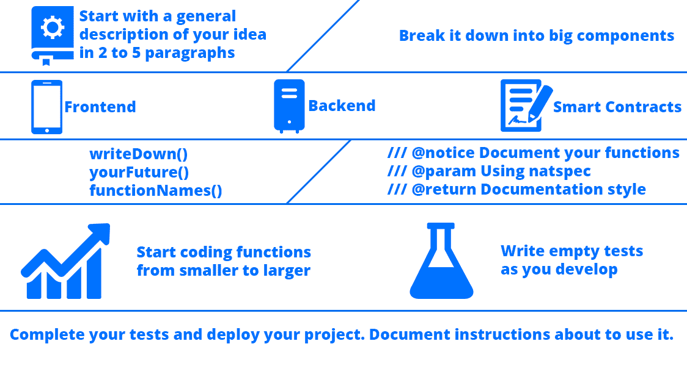

当您创建每个函数时，请留下`//TODO`注释，描述接下来需要做什么，这样当您回来时，您就有一个清晰简明的目标可供实现。例如，这是我最近正在努力的一个函数：

```
constructor(address _identityRegistryAddress, address _tokenAddress) public {
    require(_identityRegistryAddress != address(0), 'The identity registry address is required');
    require(_tokenAddress != address(0), 'You must setup the token rinkeby address');
    hydroToken = HydroTokenTestnetInterface(_tokenAddress);
    identityRegistry = IdentityRegistryInterface(_identityRegistryAddress);
    // TODO Uncomment this when the contract is completed
    /* oraclize_setProof(proofType_Ledger); */
}
```

著名的 [atom.io](https://atom.io/) 代码编辑器中已经安装了一个名为`language-todo`的扩展，它会突出显示这些类型的`TODO`注释，以便您可以轻松看到它们。您还可以使用搜索功能在整个项目中查找这些注释。

此外，还有另一个扩展，允许您在一个单独的面板中管理这些提醒。以下是包名称，如果您愿意，可以安装它：

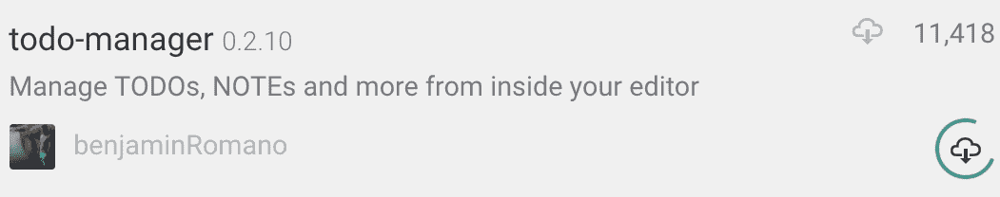

以下是一些额外的建议，以提高您在创建成功项目时的工作流程：

+   在每个文件的顶部，创建一个列出了需要在该文件中完成的事项的列表，这样你就知道何时完成了它。

+   使用已有的工具部署您的合约并编写测试以有效验证功能。例如，Truffle、Ganache 和 Remix 在测试和提高效率方面是必不可少的。

+   为每件事情设定一个时间限制；尽量精确，因为项目往往会耗尽你给予的所有时间。要严格保持专注。

+   确定在不同时间限制下可以完成哪些工作。例如，在 1 周内，您可以使用核心两个功能创建您的想法的基本版本，在 1 天内，您可以完成所需的 100 个功能中的 5 个，以完成一个稳定的 beta 版本，而在 1 个月内，您可以完成基本代码。关键是想象在足够时间内完成您的想法的可能性的现实估计。记录下需要在 1 天内、1 周内和 1 个月内完成的工作。

+   将自己放在你感到舒适的地方。通常，当你的身体感觉良好，心情放松时，会有伟大的想法涌现。例如，一个水温合适，水流不断的淋浴是检查你的假设和探索可能很棒的新想法的最佳场所之一。

+   始终记得为你的项目创建一个 Git 存储库，即使你认为你不会用它，因为往往你会需要几年前做的某个特定事情的代码片段，现在你需要为新项目记起。将你的代码保存在 GitHub 上也很好，可以看到你作为开发人员的进步，并建立一个坚实的在线存在。

想出好点子可能需要单独一章。创造力的问题在于只有当你打破常规时才能获得它，因为你不能指望你的头脑基于同样的日常经验创造新的联想。去新的本地地方旅行，探索奇怪的爱好，并真正对与你熟悉的完全不同的主题感兴趣，即使它们一开始看起来很无聊。

# 摘要

你刚刚完成了本书中最重要的章节之一，因为我们讨论了优化和效率，这两个对你所做的每一个项目都至关重要的事情。我们首先构建了更好的 React 应用程序，你学会了如何使用这个强大的框架优化创建前端应用程序的方式，以及如何正确地结构化你的组件的有趣技巧。

然后，你学会了使用 NGINX 创建集中式 Node.js 应用程序，你可以将其用于智能合约不够的混合项目，包括从想法到代码再到在 VPS 服务器上部署带有 HTTPS 证书的过程中的所有步骤。之后，你探索了几个 web3.js 的改进，以创建具有事件订阅、辅助函数和可以更好地控制的 promises 的更强大的前端。

当谈到创建能力强大的智能合约时，你已经经历了最有趣的话题之一：**预言机**，因为它们为智能合约提供了有价值的外部信息，这些信息对于特定应用可能是不可或缺的。最后，你发现了 14 个改进项目创建思路的提示，这样你就可以在努力提供更高质量代码的过程中变得熟练。

在下一章中，你将开始从头构建一个非常有趣的去中心化交易所，这是一个令人兴奋的机会，你会喜欢的！
