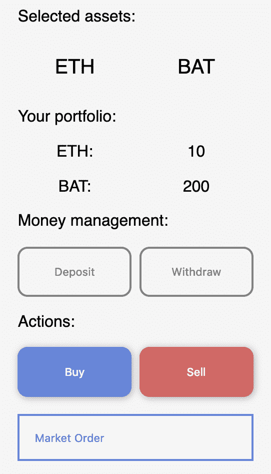
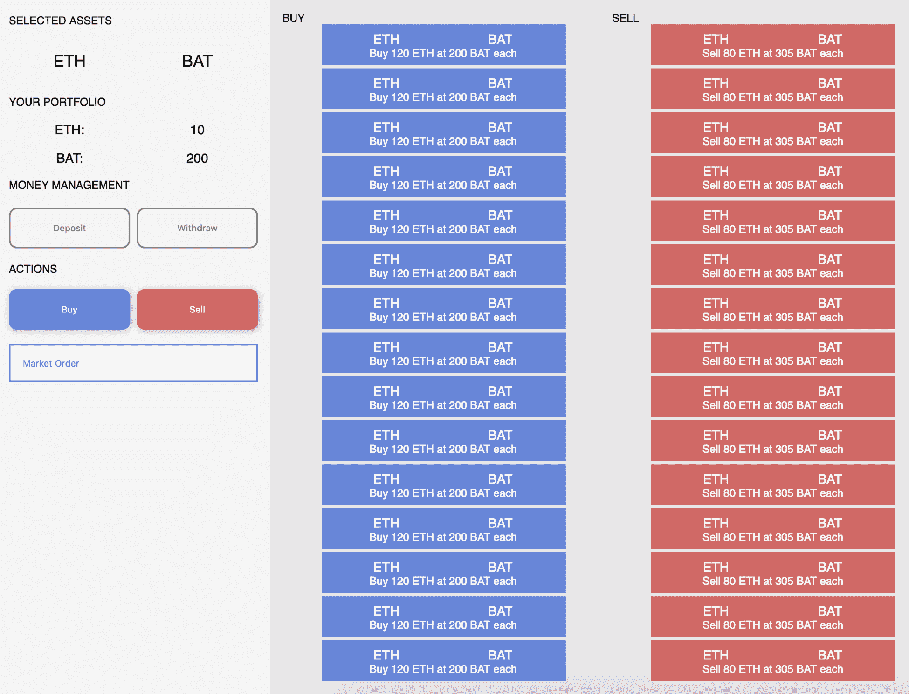
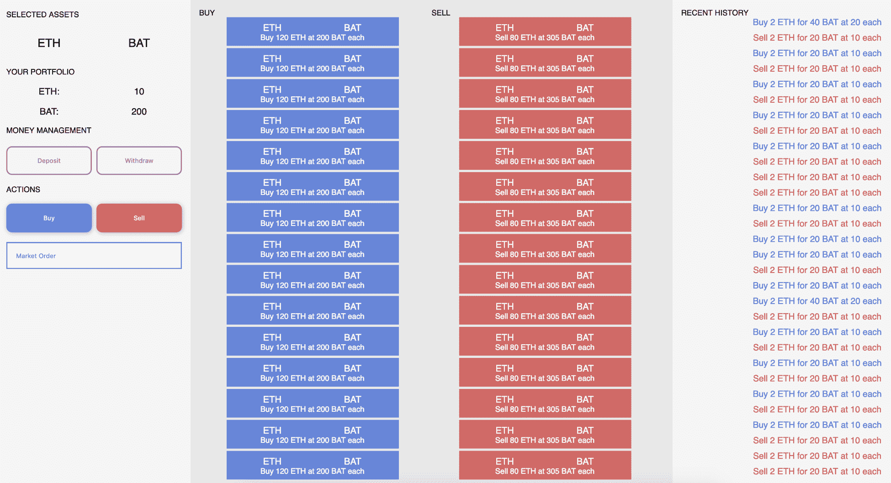
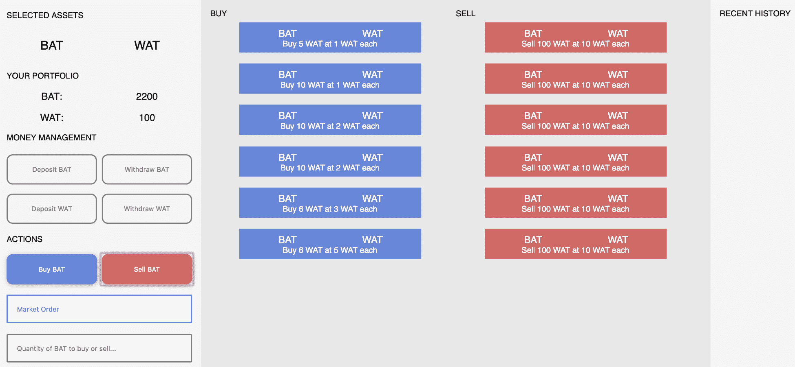

# 去中心化交易所工作流程

去中心化交易所，也被称为**DAXs**，是一个热门话题，简单的原因是所有加密货币都需要通过其他货币进行交换，以赋予它们某种实用性。你能想象一个世界，在这个世界里你不能用比特币换取美元吗？或者以太坊换比特币？这将摧毁大多数加密货币的实际实用性。这就是为什么我们有交易所，为了允许各种货币在自由市场中交易。我们将首先介绍关于 DAXs 的解释，以便你理解它们背后的思想。然后你会理解订单是如何进行的以及如何以安全的方式管理用户资金。之后，你将创建一个具有复杂智能合约和详细界面的真实世界 DAX。

在这一章中，我们将涵盖以下主题：

+   介绍去中心化交易所

+   理解交易和匹配引擎

+   管理加密货币钱包和冷存储

+   构建用户界面

+   构建以太坊后端

+   完成 dApp

# 介绍去中心化交易所

到底什么是 DAXs？嗯，普通的交易所，比如股票市场，建立在一个集中式系统之上，其中一个服务器处理所有订单并向用户显示结果。他们运行非常高效的系统，但是要建立这样的系统成本相当高，尽管考虑到它们提供的效用是可以理解的。另一方面，DAXs 不依赖于一个集中式系统，所有订单都必须通过一个进行必要计算的服务器进行处理。相反，DAXs 基于以太坊的基础架构工作，为用户提供一个可以由任何人执行并由庞大的计算机网络处理的系统。

与中心化交易所相比，DAX 的第一个区别是它们受到背后技术的限制。你不能创建一个交易法币的 DAX，比如美元或欧元，因为这些货币是基于不同的技术的；它们在一个称为 FOREX 的不同市场上运行，那里的全球银行交易全球货币。同样，你也不能在股票市场交易 ERC20 代币，因为它们是基于以太坊运行的，而且在那些中心化交易所工作的开发者没有创建这些系统之间流畅连接所需的工具——主要原因是速度上的差异。

以太坊自然会产生较慢的交易，因为它们必须被网络的每个节点确认。这就是为什么在 DAXs 中预期会有一个慢速交易系统。然而，还有一些扩展技术，比如 *plasma* 和 *state channels*，允许你在初始设置后更有效地进行交易。我们将探讨它们的工作原理，并构建一个 DAX，以便你理解它们是如何工作的。你甚至可以创建自己的规则。

# DAXs 的缺点

DAXs通常较慢，因为除非你依赖于货币对之间的链下系统，否则无法进行即时交易，在你希望在其他加密货币之间进行交易时将会放慢你的速度。

它们在某种程度上也受限，因为你不能交易不同区块链上基于法定货币或加密货币的货币。例如，交换**比特币**（**BTC**）兑换**以太坊**（**ETH**）的唯一方法是拥有中心化系统，该系统持有这两种货币，并在任何时刻提供用户公平的交换。有一些项目已经整合了这两种类型的货币，但它们仍然年轻，并需要成熟才能变得受欢迎。

DAXs目前尚未被主流公众使用，所以它们没有达到它们可能达到的水平，因为我们缺乏创建无故障工作的交易所所需的工具和协议。

# DAXs的优势

另一方面，这些类型的交易所有可能克服多数依赖中心化交易的大多数市场过时技术。因为它们是从零开始创建的，所以它们可以在其他项目中获取所有优点，并将其更好地实施。

DAXs默认可以使用数千种代币，因为它们大多数实施了ERC20标准，为它们提供了巨大的可能性。有许多优秀的项目正在构建协议，比如**0xprotocol**，其中开发人员可以将一组已知功能添加到自己的系统中，以便它们可以自由通信，作为一个全球互连DAXs系统。事实上，0xprotocol分享了代币的流动性，使它们可以在没有任何要求的情况下作为交易者运行。

随着以太坊核心团队开发的新的扩容解决方案，DAXs即将大幅改善，交易速度更快，类似于真实的中心化市场，使以太坊成为全球虚拟货币经济中的核心参与者。

许多成功的交易所正不断提高以扩展去中心化技术的可能性范式，并且它们正在使用稳定币，如泰达币和USD Coin，以维持以法定货币支持的不变价值，从而弥合了两个世界之间的鸿沟。

我们可以在几本不同的书中讨论数小时有关DAXs，但我想要传达的观点是，DAXs有潜力超越现有技术，成为全球中心化和去中心化货币市场的主要场所。这就是为什么我希望你通过构建基于solidity智能合约的简单DAX来明白所有这些是如何可能的，以获取为创建DAXs的许多公司工作所需的实践经验，甚至自己开始DAX，因为它们是去中心化技术的核心要素之一。

# 基本交易术语

交易世界广阔而复杂；这就是为什么使用它们的人们创造了许多术语来帮助彼此准确理解它们的含义。例如，与其说 *我想购买 10 个 BTC，希望未来价格上涨*，你可以说 *我想多买入 10 个 BTC*。它们的意思是一样的，但这是一种更精确的相互沟通方式。

让我们学习一些重要的术语，以理解交易市场的一些方面：

+   **市价单**：一种以最低或最高价格买入或卖出货币的行为。你看，交易所有卖家和买家，那些想要摆脱某种货币的人和那些想要获取一些货币的人。每个人都为自己想要得到的东西设定一个价格，价格总是成对出现的。例如，*我想以 50 个 ETH 的价格购买 10 个 BTC*。在这种情况下，这对将是 BTC-ETH，因为你声明你想用你的比特币交换以太币；在那里，你同时是比特币的买家和以太币的卖家。人们设定不同的价格，所以当你进行市价交易时，你只是以最大的利润买入或卖出。当你用美元在线购买东西时也是一样的。如果你是欧洲人，像我一样，你会注意到许多在线物品的价格是以美元计价的，这使得用欧元购买这些物品成为不可能，因为它们不是同一种货币。那么当你购买书籍时会发生什么？在后台，一些程序以市场设定的价格将欧元兑换为美元，并用美元购买书籍。

+   **限价单**：一种你自己设定的固定价格买入或卖出的行为。这些类型的订单用于那些预测价格变动或愿意等待订单在较长时间内得到执行的人。

+   **经纪人**：一位向你提供贷款以进行交易活动的人。经纪人通常会帮助你执行交易等行动，因为他们有更多的资金，所以在你所在的交易所享有特权。

+   **保证金账户**：一种特殊类型的用户账户，你可以在其中在交易时从经纪人那里借钱。

+   **多买入**：一种购买特定货币的行为，因为你相信它将升值以获利，或者支持货币背后的技术。

+   **空头交易**：一种当你看空的货币价值下跌时赢得的行为。例如，你可以说，*我要做空欧元，因为我相信价格会在接下来的五天内下跌*。这是一个你可以卖出你不拥有的货币的系统。其背后的推理包括以下内容：

    +   首先，你从另一个人，称为经纪人，那里借钱，他会给你想要做空的货币的所需数量，比如你做空的 100 个 ETH。

    +   你会自动以市场价格出售那 100 个 ETH。

    +   在稍后的日期，你会购买这 100 个 ETH。这被称为平仓。例如，20 天后，你以市价购买 100 个 ETH 来平掉你的空头仓位。

    +   根据买入和卖出时的价格，你会赚取或亏损资金。如果你在高价位做空，然后在低价位平仓，你会赚取价格差。例如，如果你以每个以太币 20 美元的价格做空 100 个 ETH，5 天后以太币价格为 10 美元时平仓，你将赚取每个以太币 10 美元，总计 100 个 ETH × 10 美元 = 1000 美元。

    +   通常做空只在保证金账户上可用。这些账户是你可以从经纪人借钱的账户，但有一些限制。

还有买价和卖价，分别等同于买入和出售。现在你更好地理解了一些复杂的概念，你可以继续学习我们将在本章构建的 DAX 更多相关内容。

# 理解交易和匹配引擎

交易和匹配引擎是一组使用不同类型算法创建和关闭订单的函数。算法可能专注于完成具有更高价格或之前执行的订单。这取决于开发人员的偏好。因为我们将使用智能合约和 ERC20 代币，我们的引擎将专注于按照订单依次快速完成，因为将会是用户关闭订单，前端将包含大部分逻辑。

我们无法在智能合约中处理大量信息，因为 gas 费用昂贵，所以我们让 React 应用程序控制交易以保护人们的资金。

让我们从计划我们将需要的函数开始，这样当我们创建合约和前端函数时就有了坚实的基础：

```
/// @notice To create a limit order for buying the _symbolBuy while selling the _symbolSell.
/// @param _symbolBuy The 3 character or more name of the token to buy.
/// @param _symbolSell The 3 character or more name of the token to sell.
/// @param _priceBid The price for how many _symbolBuy tokens you desire to buy. For instance: buy 10 ETH for 1 BTC.
/// @param _priceAsk The price for how many tokens you desire to sell of the _symbolSell in exchange for the _symbolBuy. For instance: sell 10 BTC for 2 ETH.
function createLimitOrder(bytes32 _symbolBuy, bytes32 _symbolSell, uint256 _priceBid, uint256 _priceAsk) public {}

```

那个函数签名（带参数但不含主体的函数名称）将负责生成限价订单。让我们看一些示例，并检查函数签名是否正确：

例如，*我想用 90 个 ETH 换取 7 个 BTC*，执行以下代码：

```
function createLimitOrder("ETH","BTC", 90, 7);
```

正如你所见，我们将符号的顺序颠倒，将卖出订单转换为买入订单，用户愿意用 `ETH` 换取 `BTC`。它具有相同的效果，只需一个函数，而不需要为出售创建专门函数。

例如，*我想用 20 个 ETH 买入 10 个 BTC*。

```
function createLimitOrder("BTC", "ETH", 10, 20);
```

在这种情况下，我们将符号按照期望的顺序放置，因为我们正在创建一个买入 `BTC` 并卖出 `ETH` 的限价订单。现在我们可以创建市价订单函数的签名。

市价订单很有趣，因为我们希望以最便宜或最贵的价格立即填充订单。背后发生的是我们用市价订单来关闭限价订单。然而，通常不可能以最新市价填满整个订单，简单的原因是最赚钱的限价订单是购买或出售最少数量的代币。

例如，我们想以市场价格出售10个TokenA换取TokenB。最有利可图的限价订单是*以40个TokenB换取5个TokenA*。在这种情况下，1个TokenA的价格将为8个TokenB，反之亦然。因此，我们创建了市价订单，立即从该限价订单中出售5个TokenA以换取40个TokenB，但是我们想要出售的剩余的5个TokenA怎么办？我们转向下一个最有利可图的买单，即*以700个TokenB换取100个TokenA*。在这种情况下，1个TokenA的价格将为7个TokenB，虽然不如上一个订单的利润高，但仍然不错。因此，我们交换了5个TokenA以换取35个TokenB，将该限价买单保留在*以665个TokenB购买95个TokenA*，直到下一个用户填满为止。

最后，我们使用那一特定时刻的最有利可图限价订单的组合，以10个TokenA获得了75个TokenB。通过这种理解，我们可以创建我们的市场订单功能的签名：

```
/// @notice The function to create market orders by filling existing limit orders
/// @param _type The type of the market order which can be "Buy" or "Sell"
/// @param _symbol The token that we want to buy or sell
/// @param _maxPrice The maximum price we are willing to sell or buy the token for, set it to 0 to not limit the order
function createMarketOrder(bytes32 _type, bytes32 _symbol, uint256 _maxPrice);
```

`_maxPrice`参数只是一个数字，表示您愿意出售的最低价格，或者您愿意购买的最高价格。默认情况下为零，即无限制，因此只要有卖家或买家可用，您就会得到最有利可图的价格。

# 管理加密货币钱包和冷存储

当涉及到管理人们的资金时，我们必须格外注意我们的操作方式，因为使用我们的DAX可能会面临数百万美元的风险。这就是为什么最大的交易所采用冷存储并配备了许多安全系统的原因。基本上，他们会将资金离线存储在远程位置的安全硬件设备中，这些设备根据其需求进行定制，如Trezor、Ledger或他们自己的设备。

在我们的情况下，我们将资金存储在一系列智能合约中，称为**托管合约**，其唯一目标是存储人们的资金。每个用户帐户将关联一个托管合约，独立安全地保管所有他们的资金。该托管合约将具有一个函数来接收资金，仅限ERC20代币，并具有一个可以由该托管合约所有者执行的提取资金的函数。现在，请创建一个名为`decentralized-exchange`的文件夹，然后运行`truffle init`和`npm init -y`命令，在`contracts/`文件夹中创建一个名为`Escrow.sol`的合约。以下是我们的托管合约的外观。

首先，它包含了ERC20代币的接口，因为我们不需要整个实现来进行代币交易：

```
pragma solidity 0.5.4;

interface IERC20 {
    function transfer(address to, uint256 value) external returns (bool);
    function approve(address spender, uint256 value) external returns (bool);
    function transferFrom(address from, address to, uint256 value) external returns (bool);
    function totalSupply() external view returns (uint256);
    function balanceOf(address who) external view returns (uint256);
    function allowance(address owner, address spender) external view returns (uint256);
    event Transfer(address indexed from, address indexed to, uint256 value);
    event Approval(address indexed owner, address indexed spender, uint256 value);
}
```

接着，我们添加了`Escrow`合约，用于管理每个用户的资金：

```
contract Escrow {
    address public owner;

    modifier onlyOwner {
        require(msg.sender == owner, 'You must be the owner to execute that function');
        _;
    }

    /// @notice This contract does not accept ETH transfers
    function () external { revert(); }

    /// @notice To setup the initial tokens that the user will store when creating the escrow
    /// @param _owner The address that will be the owner of this escrow, must be the owner of the tokens
    constructor (address _owner) public {
        require(_owner != address(0), 'The owner address must be set');
        owner = _owner;
    }

    /// @notice To transfer tokens to another address, usually the buyer or seller of an existing order
    /// @param _token The address of the token to transfer
    /// @param _to The address of the receiver
    /// @param _amount The amount of tokens to transfer
    function transferTokens(address _token, address _to, uint256 _amount) public onlyOwner {
        require(_token != address(0), 'The token address must be set');
        require(_to != address(0), 'The receiver address must be set');
        require(_amount > 0, 'You must specify the amount of tokens to transfer');

        require(IERC20(_token).transfer(_to, _amount), 'The transfer must be successful');
    }

    /// @notice To see how many of a particular token this contract contains
    /// @param _token The address of the token to check
    /// @return uint256 The number of tokens this contract contains
    function checkTokenBalance(address _token) public view returns(uint256) {
        require(_token != address(0), 'The token address must be set');
        return IERC20(_token).balanceOf(address(this));
    }
}
```

这个`Escrow`合约接收代币转账以将资金安全地保存在内部。每个用户将拥有一个独特的托管合约来分散资金的位置，以便攻击者无法集中于单一地点。您可以通过`transferTokens()`函数管理合约内的代币资金，并且可以使用`checkTokenBalance()`函数检查合约内的代币余额，这是一个简化的`.balanceOf()`ERC20辅助函数。最后，我添加了一个空的非付款回退函数，以避免接收Ether，因为我们只想要代币内部。

我们将稍后使用这个`Escrow`合约来管理人们的资金，因为我们希望有一个安全的地方来保存他们珍贵的代币。理想情况下，我们会创建一个使用硬件设备中的冷存储的系统，但这样的操作将需要一个复杂的系统，负责安全管理每一个步骤，以防止中间人攻击。

# 构建用户界面

DAXs的用户界面与传统交易所（如股票交易所）或中心化加密交易所（如**币安**）使用的界面相同。其理念是提供一个数据驱动的设计，使他们能够快速了解所选代币对的情况。中心区域将用于数据显示，侧边栏将用于用户可能采取的操作，右侧将用于辅助数据；在我们的情况下，它将用于过去的交易。

像往常一样，创建一个包含我们项目的`src`和`dist`文件夹。您可以通过查看我的GitHub上的自己版本 [github.com/merlox/dapp](http://github.com/merlox/dapp) 来直接复制之前项目的设置。我们的设计将基于大多数交易所，因为它们有一个经过研究的公式，感觉很棒。在您的`index.js`文件中创建一个新组件作为侧边栏的一部分。

首先，添加`Main`组件以及普通React应用程序所需的导入：

```
import React from 'react'
import ReactDOM from 'react-dom'
import './index.styl'

class Main extends React.Component {
    constructor() {
        super()
    }

    render() {
        return (
            <div>
                <Sidebar />
            </div>
        )
    }
}
```

然后添加`Sidebar`组件，其中包含用户可以执行的一些基本操作，例如资金管理部分以添加或提取资金，以及创建买入或卖出订单的部分：

```
/// Create the basic sidebar html, then we'll add the style css
// The sidebar where you take all your actions
class Sidebar extends React.Component {
    constructor() {
        super()
        this.state = {
            showLimitOrderInput: false
        }
    }

    render() {
        return (
            <div className="sidebar">
                <div className="selected-assets-title">Selected assets:</div>
                <div className="selected-asset-one">ETH</div>
                <div className="selected-asset-two">BAT</div>
                <div className="your-portfolio">Your portfolio:</div>
                <div className="grid-center">ETH:</div><div className="grid-center">10</div>
                <div className="grid-center">BAT:</div><div className="grid-center">200</div>
                <div className="money-management">Money management:</div>
                <button className="button-outline">Deposit</button>
                <button className="button-outline">Withdraw</button>
                <div className="actions">Actions:</div>
                <button>Buy</button>
                <button className="sell">Sell</button>
                <select defaultValue="market-order" onChange={selected => {
                    if(selected.target.value == 'limit-order') this.setState({showLimitOrderInput: true})
                    else this.setState({showLimitOrderInput: false})
                }}>
                    <option value="market-order">Market Order</option>
                    <option value="limit-order">Limit Order</option>
                </select>
                <input ref="limit-order-amount" className={this.state.showLimitOrderInput ? '' : 'hidden'} type="number" placeholder="Price to buy or sell at..."/>
            </div>
        )
    }
}
```

您添加的类和元素完全由您决定。我个人喜欢向用户显示他们正在交易的货币对，每个货币对的余额以及一组操作，如购买、出售、存款和提款。然后，我们可以添加一些`css`。在这个项目中，我们将使用一种称为`stylus`的`css`预处理器（[stylus-lang.com](http://stylus-lang.com)），它允许您在没有括号和嵌套类的情况下编写`css`，以及许多其他很好的功能。您可以按照以下步骤安装它：

```
npm i -S style-loader css-loader stylus-loader stylus
```

然后将其添加到你的`webpack`配置文件中作为新的规则块：

```
{
    test: /\.styl$/,
    exclude: /node_modules/,
    use: ['style-loader', 'css-loader', 'stylus-loader']
}
```

在你的源文件夹内创建一个新的`index.styl`文件，并添加你的Stylus代码。如果你想创建和我一样的设计，请在官方GitHub上查看stylus代码：[https://github.com/merlox/decentralized-exchange/blob/master/src/index.styl](https://github.com/merlox/decentralized-exchange/blob/master/src/index.styl)。

这为我们的DAX生成了一个漂亮的侧边栏。记得用`webpack -w -d`打包你的文件：



正如你所看到的，Stylus允许你编写清晰、可嵌套的`css`，以便轻松组织大块的样式，从而使你的项目更易于维护。最后，该代码会被转换成有效的在所有浏览器上运行的`css`，因为Stylus会正确地编译每个文件。然后我们可以添加一个交易部分，展示在我们的交易所中所有货币对的交易，以便人们了解他们的硬币的总体价格。

首先，在`Main`组件的状态对象中添加假数据的新交易以实现最终设计时dApp的展示：

```
import React from 'react'
import ReactDOM from 'react-dom'
import './index.styl'

class Main extends React.Component {
    constructor() {
        super()

        this.state = {
            trades: [{
                id: 123,
                type: 'buy',
                firstSymbol: 'ETH',
                secondSymbol: 'BAT',
                quantity: 120, // You want to buy 120 firstSymbol
                price: 200 // When buying, you get 1 firstSymbol for selling 200 secondSymbol
            }, {
                id: 927,
                type: 'sell',
                firstSymbol: 'ETH',
                secondSymbol: 'BAT',
                quantity: 80, // You want to buy 80 secondSymbol
                price: 305 // When selling, you get 305 secondSymbol for selling 1 firstSymbol
            }],
            history: [{
                id: 927,
                type: 'buy',
                firstSymbol: 'ETH',
                secondSymbol: 'BAT',
                quantity: 2,
                price: 20
            }, {
                id: 927,
                type: 'sell',
                firstSymbol: 'ETH',
                secondSymbol: 'BAT',
                quantity: 2, // You want to buy 80 secondSymbol
                price: 10 // When selling, you get 305 secondSymbol for selling 1 firstSymbol
            }]
        }
    }
```

之后，通过将props传递给`Trades`和`History`组件，用新的状态对象更新`render()`函数：

```

    render() {
        return (
            <div className="main-container">
                <Sidebar />
                <Trades
                    trades={this.state.trades}
                />
                <History
                    history={this.state.history}
                />
            </div>
        )
    }
}

```

创建新的`Trades`组件，以便显示我们刚刚添加的交易：

```
// The main section to see live trades taking place
class Trades extends React.Component {
    constructor() {
        super()
    }

    render() {
        let buyTrades = this.props.trades.filter(trade => trade.type == 'buy')
        buyTrades = buyTrades.map((trade, index) => (
            <div key={trade.id + index} className="trade-container buy-trade">
                <div className="trade-symbol">{trade.firstSymbol}</div>
                <div className="trade-symbol">{trade.secondSymbol}</div>
                <div className="trade-pricing">{trade.type} {trade.quantity} {trade.firstSymbol} at {trade.price} {trade.secondSymbol} each</div>
            </div>
        ))
        let sellTrades = this.props.trades.filter(trade => trade.type == 'sell')
        sellTrades = sellTrades.map((trade, index) => (
            <div key={trade.id + index} className="trade-container sell-trade">
                <div className="trade-symbol">{trade.firstSymbol}</div>
                <div className="trade-symbol">{trade.secondSymbol}</div>
                <div className="trade-pricing">{trade.type} {trade.quantity} {trade.firstSymbol} at {trade.price} {trade.secondSymbol} each</div>
            </div>
        ))
        return (
            <div className="trades">
                <div className="buy-trades-title heading">Buy</div>
                <div className="buy-trades-container">{buyTrades}</div>
                <div className="sell-trades-title heading">Sell</div>
                <div className="sell-trades-container">{sellTrades}</div>
            </div>
        )
    }
}
```

正如你所看到的，由于我们需要它们来了解我们的交易所在实际环境中的样子，我们增加了许多样例交易和历史交易；请注意我们如何更新了`Main`组件，以将状态数据传递给每个组件。然后我们可以添加一些Stylus让它看起来更好。在官方GitHub上查看最终的Stylus代码：[https://github.com/merlox/decentralized-exchange/blob/master/src/index.styl](https://github.com/merlox/decentralized-exchange/blob/master/src/index.styl)。

为了得到一个外观漂亮的设计。请注意，我在`Main`组件的状态对象中包含了15个交易对象和15个历史交易对象，以便我们在完全加载后看到dApp的样子：



每个BUY和SELL部分顶部最上面的交易是该加密货币对的市价，因为市价订单在那个特定时刻一直是最有利可图的交易。随着人们随着时间交易不同的货币，这些交易将实时更新。这是了解价格走势的一种奇妙方式。最后，我们可以添加`History`部分，它将显示最近的交易：

```
// Past historical trades
class History extends React.Component {
    constructor() {
        super()
    }

    render() {
        const historicalTrades = this.props.history.map((trade, index) => (
            <div key={trade.id + index} className="historical-trade">
                <div className={trade.type == 'sell' ? 'sell-trade' : 'buy-trade'}>{trade.type} {trade.quantity} {trade.firstSymbol} for {trade.quantity * trade.price} {trade.secondSymbol} at {trade.price} each</div>
            </div>
        ))
        return (
            <div className="history">
                <div className="heading">Recent history</div>
                <div className="historical-trades-container">{historicalTrades}</div>
            </div>
        )
    }
}

ReactDOM.render(<Main />, document.querySelector('#root'))

```

请记得添加来自`react-dom`包的`render()`函数以渲染你的组件。然后我们可以添加更多`css`：

```
.history
    padding: 15px
    background-color: whitesmoke
    height: 100vh
    overflow: auto

    .historical-trades-container
        text-align: center

        .historical-trade
            font-size: 0.95em
            margin-bottom: 10px

            &:first-letter
                text-transform: uppercase

            .sell-trade
                color: rgb(223, 98, 98)

            .buy-trade
                color: rgb(98, 133, 223)
```

现在，如果你运行`webpack`和`http-server`，你会看到我们的成品。由于我们的目标是创建一个用于桌面电脑的交易所，而要验证每个断点以适应手机和平板电脑的不同尺寸是一项耗时的任务，因此它对移动设备不具有响应性：



这将是我们的基本设计。您可以自由添加更多的货币对，使用 ERC20 代币，使用 D3.js 创建图表，甚至使用状态通道！本书中展示的项目的优点在于，您可以在现有结构的基础上构建一个真正高质量的产品，该产品可用于 ICO 或使用您自己的解决方案来扩展 dApps 生态系统。让我们继续构建所需的智能合约来创建交易并使用 MetaMask 进行交易。

# 构建以太坊后端

我们项目的后端将负责生成可以由任何人填写的交易，只要他们有足够的资金支付已确定的价格即可。当用户注册时，他们将部署一个 Escrow 合约，该合约将由我们的主要 DAX 合约使用。因此，让我们首先设置要求和合约结构，然后开始填写所有功能以练习在 [第四章](2b43135a-08f4-46d3-8c2a-5dd70bb02843.xhtml) 中学习的系统以提高开发者的效率，*精通智能合约*。

首先，在文件开头的大型注释中定义我们将需要的函数：

```
// Functions that we need:
/*
    1\. Constructor to setup the owner
    2\. Fallback non-payable function to reject ETH from direct transfers since we only want people to use the functions designed to trade a specific pair
    3\. Function to extract tokens from this contract in case someone mistakenly sends ERC20 to the wrong function
    4\. Function to create whitelist a token by the owner
    5\. Function to create market orders
    6\. Function to create limit orders
 */
```

设置所使用的 Solidity 版本，导入 `Escrow` 合约，并定义令牌接口：

```
pragma solidity ^0.5.4;

import './Escrow.sol';

interface IERC20 {
    function transfer(address to, uint256 value) external returns (bool);
    function approve(address spender, uint256 value) external returns (bool);
    function transferFrom(address from, address to, uint256 value) external returns (bool);
    function totalSupply() external view returns (uint256);
    function balanceOf(address who) external view returns (uint256);
    function allowance(address owner, address spender) external view returns (uint256);
    event Transfer(address indexed from, address indexed to, uint256 value);
    event Approval(address indexed owner, address indexed spender, uint256 value);
}
```

首先通过定义我们将用于创建新订单的 `Order` 结构来创建 `DAX` 合约：

```
contract DAX {
    event TransferOrder(bytes32 _type, address indexed from, address indexed to, bytes32 tokenSymbol, uint256 quantity);
    enum OrderState {OPEN, CLOSED}

    struct Order {
        uint256 id;
        address owner;
        bytes32 orderType;
        bytes32 firstSymbol;
        bytes32 secondSymbol;
        uint256 quantity;
        uint256 price;
        uint256 timestamp;
        OrderState state;
    }
```

然后定义管理卖单和买单所需的许多变量，同时也将令牌列入白名单：

```
    Order[] public buyOrders;
    Order[] public sellOrders;
    Order[] public closedOrders;
    uint256 public orderIdCounter;
    address public owner;
    address[] public whitelistedTokens;
    bytes32[] public whitelistedTokenSymbols;
    address[] public users;
```

创建所需的映射以添加和管理令牌符号，并根据给定的 ID 查找订单：

```
    // Token address => isWhitelisted or not
    mapping(address => bool) public isTokenWhitelisted;
    mapping(bytes32 => bool) public isTokenSymbolWhitelisted;
    mapping(bytes32 => bytes32[]) public tokenPairs; // A token symbol pair made of 'FIRST' => 'SECOND'
    mapping(bytes32 => address) public tokenAddressBySymbol; // Symbol => address of the token
    mapping(uint256 => Order) public orderById; // Id => trade object
    mapping(uint256 => uint256) public buyOrderIndexById; // Id => index inside the buyOrders array
    mapping(uint256 => uint256) public sellOrderIndexById; // Id => index inside the sellOrders array
    mapping(address => address) public escrowByUserAddress; // User address => escrow contract address
```

然后，添加 `onlyOwner` 修饰符，回退函数将还原，以及构造函数：

```
    modifier onlyOwner {
        require(msg.sender == owner, 'The sender must be the owner for this function');
        _;
    }

    /// @notice Users should not send ether to this contract
    function () external {
        revert();
    }

    constructor () public {
        owner = msg.sender;
    }
```

使用完整的 NatSpec 文档和函数签名定义白名单令牌函数。我已经突出显示了该函数，以便您可以清楚地区分函数和注释：

```
     /// @notice To whitelist a token so that is tradable in the exchange
     /// @dev If the transaction reverts, it could be because of the quantity of token pairs, try reducing the number and breaking the transaction into several pieces
     /// @param _symbol The symbol of the token
     /// @param _token The token to whitelist, for instance 'TOK'
    /// @param _tokenPairSymbols The token pairs to whitelist for this new token, for instance: ['BAT', 'HYDRO'] which will be converted to ['TOK', 'BAT'] and ['TOK', 'HYDRO']
    /// @param _tokenPairAddresses The token pair addresses to whitelist for this new token, for instance: ['0x213...', '0x927...', '0x128...']
    function whitelistToken(bytes32 _symbol, address _token, bytes32[] memory _tokenPairSymbols, address[] memory _tokenPairAddresses) public onlyOwner {}
```

要管理令牌，请创建以下两个带有文档的函数：

```
    /// @notice To store tokens inside the escrow contract associated with the user accounts as long as the users made an approval beforehand
    /// @dev It will revert is the user doesn't approve tokens beforehand to this contract
    /// @param _token The token address
    /// @param _amount The quantity to deposit to the escrow contract
    function depositTokens(address _token, uint256 _amount) public {}

    /// @notice To extract tokens
    /// @param _token The token address to extract
    /// @param _amount The amount of tokens to transfer
    function extractTokens(address _token, uint256 _amount) public {}
```

使用它们正常工作所需的参数添加市场和限价订单功能，因为这些将是创建订单和与 DAX 交互的主要功能：

```
    /// @notice To create a market order by filling one or more existing limit orders at the most profitable price given a token pair, type of order (buy or sell) and the amount of tokens to trade, the _quantity is how many _firstSymbol tokens you want to buy if it's a buy order or how many _firstSymbol tokens you want to sell at market price
    /// @param _type The type of order either 'buy' or 'sell'
    /// @param _firstSymbol The first token to buy or sell
    /// @param _secondSymbol The second token to create a pair
    /// @param _quantity The amount of tokens to sell or buy
    function marketOrder(bytes32 _type, bytes32 _firstSymbol, bytes32 _secondSymbol, uint256 _quantity) public {}

    /// @notice To create a market order given a token pair, type of order, amount of tokens to trade and the price per token. If the type is buy, the price will determine how many _secondSymbol tokens you are willing to pay for each _firstSymbol up until your _quantity or better if there are more profitable prices. If the type if sell, the price will determine how many _secondSymbol tokens you get for each _firstSymbol
    /// @param _type The type of order either 'buy' or 'sell'
    /// @param _firstSymbol The first symbol to deal with
    /// @param _secondSymbol The second symbol that you want to deal
    /// @param _quantity How many tokens you want to deal, these are _firstSymbol tokens
    /// @param _pricePerToken How many tokens you get or pay for your other symbol, the total quantity is _pricePerToken * _quantity
    function limitOrder(bytes32 _type, bytes32 _firstSymbol, bytes32 _secondSymbol, uint256 _quantity, uint256 _pricePerToken) public {}
```

最后，添加 `view` 函数，您可以将其用作界面可能需要的帮助程序和获取器。尝试自己添加它们。然后检查解决方案：

```
    /// @notice Sorts the selected array of Orders by price from lower to higher if it's a buy order or from highest to lowest if it's a sell order
    /// @param _type The type of order either 'sell' or 'buy'
    /// @return uint256[] Returns the sorted ids
 function sortIdsByPrices(bytes32 _type) public view returns (uint256[] memory) {}

    /// @notice Checks if a pair is valid
    /// @param _firstSymbol The first symbol of the pair
    /// @param _secondSymbol The second symbol of the pair
    /// @returns bool If the pair is valid or not
 function checkValidPair(bytes32 _firstSymbol, bytes32 _secondSymbol) public view returns(bool) {}

    /// @notice Returns the token pairs
    /// @param _token To get the array of token pair for that selected token
    /// @returns bytes32[] An array containing the pairs
 function getTokenPairs(bytes32 _token) public view returns(bytes32[] memory) {}
}
```

首先，我们设置一个 `event` 来记录令牌转移，以便人们可以看到什么时候卖出或购买了令牌。我们可以添加更多事件，但我将让您自行发现您需要哪些事件。然后，我们添加了大量必要的变量，从一个定义订单是开放还是关闭的 `enum` 开始。我们为每个订单的每个属性添加了一个 `struct`，以清晰地定义正在处理哪个令牌。

然后，我们添加了三个数组来存储现有订单，同时还有一些变量来将新代币列入白名单，以便我们可以与更广泛的加密货币集进行交易。之后，我们添加了多个映射以轻松找到每个特定订单，同时优化了 gas 成本。

我们添加了一个`onlyOwner`修饰符来限制对whitelisting函数的访问，以防止在添加加密货币时变得太疯狂。我们添加了一个不允许以太币转账的fallback函数，以防止人们向这个交易所发送资金，并添加了一个定义DAX所有者的构造函数。

然后，我们添加了`whitelistToken()`函数，该函数接受一个令牌地址和一个符号数组，用于创建与该主令牌的交易对；这样，你就能够一次交易大量的交易对。`depositTokens()`函数是由想增加其令牌余额的用户使用的。他们可以直接将他们想要交易的令牌转移到与他们相关联的Escrow合约中，但用户必须首先通过这个函数创建一个新的Escrow，这只能通过这个函数完成。然后，Escrow地址将与`escrowByUserAddress`映射中的该帐户关联起来。此存款函数还要求用户之前使用`approve()`函数来允许DAX合约将令牌转移到Escrow合约；否则，它将失败。

接下来，`extractTokens()`函数用于将令牌从托管账户移动到用户的地址。这是一个快捷方式，用于在`Escrow`合约内部调用`transferTokens()`函数以便于令牌管理。之后，我们有复杂的市场和限价订单函数。它们都是大函数，因为它们需要对订单进行排序、更新和查找以匹配现有订单，并在区块链的燃气使用限制内工作。我们很快会深入了解它们是如何实现的。最后，我们有一些辅助函数用于对订单进行排序，检查给定的令牌对是否存在，以及检索令牌对的数组。

让我们继续实现一些这些函数。记得从最简单的函数开始，逐步进展到更复杂的函数，这样你就会有一个坚实的结构支撑它们。这是`whitelisting`函数应该的样子：

```
/// @notice To whitelist a token so that is tradable in the exchange
/// @dev If the transaction reverts, it could be because of the quantity of token pairs, try reducing the number and breaking the transaction into several pieces
/// @param _symbol The symbol of the token
/// @param _token The token to whitelist, for instance 'TOK'
/// @param _tokenPairSymbols The token pairs to whitelist for this new token, for instance: ['BAT', 'HYDRO'] which will be converted to ['TOK', 'BAT'] and ['TOK', 'HYDRO']
/// @param _tokenPairAddresses The token pair addresses to whitelist for this new token, for instance: ['0x213...', '0x927...', '0x128...']
function whitelistToken(bytes32 _symbol, address _token, bytes32[] memory _tokenPairSymbols, address[] memory _tokenPairAddresses) public onlyOwner {
    require(_token != address(0), 'You must specify the token address to whitelist');
    require(IERC20(_token).totalSupply() > 0, 'The token address specified is not a valid ERC20 token');
    require(_tokenPairAddresses.length == _tokenPairSymbols.length, 'You must send the same number of addresses and symbols');

    isTokenWhitelisted[_token] = true;
    isTokenSymbolWhitelisted[_symbol] = true;
    whitelistedTokens.push(_token);
    whitelistedTokenSymbols.push(_symbol);
    tokenAddressBySymbol[_symbol] = _token;
    tokenPairs[_symbol] = _tokenPairSymbols;

    for(uint256 i = 0; i < _tokenPairAddresses.length; i++) {
        address currentAddress = _tokenPairAddresses[i];
        bytes32 currentSymbol = _tokenPairSymbols[i];
        tokenPairs[currentSymbol].push(_symbol);
        if(!isTokenWhitelisted[currentAddress]) {
            isTokenWhitelisted[currentAddress] = true;
            isTokenSymbolWhitelisted[currentSymbol] = true;
            whitelistedTokens.push(currentAddress);
            whitelistedTokenSymbols.push(currentSymbol);
            tokenAddressBySymbol[currentSymbol] = currentAddress;
        }
    }
}
```

whitelisting函数进行一些要求检查，然后为每个给定的令牌对进行白名单设置，以便您可以独立交易。例如，如果你的主要令牌符号是BAT，并且你的`_tokenPairSymbols`数组包含`['TOK', 'TIK']`，你就可以与BAT - TOK和BAT - TIK交易。简单的事情。只要你保持低数量的令牌对，该函数就不会耗尽燃气。

以下是用于管理令牌资金的下一个函数：

```
/// @notice To store tokens inside the escrow contract associated with the user accounts as long as the users made an approval beforehand
/// @dev It will revert is the user doesn't approve tokens beforehand to this contract
/// @param _token The token address
/// @param _amount The quantity to deposit to the escrow contract
function depositTokens(address _token, uint256 _amount) public {
    require(isTokenWhitelisted[_token], 'The token to deposit must be whitelisted');
    require(_token != address(0), 'You must specify the token address');
    require(_amount > 0, 'You must send some tokens with this deposit function');
    require(IERC20(_token).allowance(msg.sender, address(this)) >= _amount, 'You must approve() the quantity of tokens that you want to deposit first');
    if(escrowByUserAddress[msg.sender] == address(0)) {
        Escrow newEscrow = new Escrow(address(this));
        escrowByUserAddress[msg.sender] = address(newEscrow);
        users.push(msg.sender);
    }
    IERC20(_token).transferFrom(msg.sender, escrowByUserAddress[msg.sender], _amount);
}

/// @notice To extract tokens
/// @param _token The token address to extract
/// @param _amount The amount of tokens to transfer
function extractTokens(address _token, uint256 _amount) public {
    require(_token != address(0), 'You must specify the token address');
    require(_amount > 0, 'You must send some tokens with this deposit function');
    Escrow(escrowByUserAddress[msg.sender]).transferTokens(_token, msg.sender, _amount);
}
```

存款函数检查用户是否有与他们地址相关联的`Escrow`合约。如果没有，函数会创建一个新的`Escrow`，然后转移用户请求的令牌存款，只要他们之前在适当的ERC20合约中批准了一些令牌。

extract函数只是简单地运行`transferTokens()`函数到所有者的地址，只要他们之前有一些余额。否则它会回滚。

让我们继续进行限价订单功能。因为这是一个较大的功能，我们将其拆分为更小的部分，以便您了解每个部分的操作方式。

首先，我们根据创建函数时出现的更改更新的文档。改进文档永远不会太迟：

```
/// @notice To create a market order given a token pair, type of order, amount of tokens to trade and the price per token. If the type is buy, the price will determine how many _secondSymbol tokens you are willing to pay for each _firstSymbol up until your _quantity or better if there are more profitable prices. If the type if sell, the price will determine how many _secondSymbol tokens you get for each _firstSymbol
/// @param _type The type of order either 'buy' or 'sell'
/// @param _firstSymbol The first symbol to deal with
/// @param _secondSymbol The second symbol that you want to deal
/// @param _quantity How many tokens you want to deal, these are _firstSymbol tokens
/// @param _pricePerToken How many tokens you get or pay for your other symbol, the total quantity is _pricePerToken * _quantity
```

然后，我们运行许多`require()`检查，以确保用户正确执行限价订单功能：

```
function limitOrder(bytes32 _type, bytes32 _firstSymbol, bytes32 _secondSymbol, uint256 _quantity, uint256 _pricePerToken) public {
    address userEscrow = escrowByUserAddress[msg.sender];
    address firstSymbolAddress = tokenAddressBySymbol[_firstSymbol];
    address secondSymbolAddress = tokenAddressBySymbol[_secondSymbol];

    require(firstSymbolAddress != address(0), 'The first symbol has not been whitelisted');
    require(secondSymbolAddress != address(0), 'The second symbol has not been whitelisted');
    require(isTokenSymbolWhitelisted[_firstSymbol], 'The first symbol must be whitelisted to trade with it');
    require(isTokenSymbolWhitelisted[_secondSymbol], 'The second symbol must be whitelisted to trade with it');
    require(userEscrow != address(0), 'You must deposit some tokens before creating orders, use depositToken()');
    require(checkValidPair(_firstSymbol, _secondSymbol), 'The pair must be a valid pair');
```

之后，如果用户创建买入限价订单，则执行`buy`功能：

```
    Order memory myOrder = Order(orderIdCounter, msg.sender, _type, _firstSymbol, _secondSymbol, _quantity, _pricePerToken, now, OrderState.OPEN);
    orderById[orderIdCounter] = myOrder;
    if(_type == 'buy') {
        // Check that the user has enough of the second symbol if he wants to buy the first symbol at that price
        require(IERC20(secondSymbolAddress).balanceOf(userEscrow) >= _quantity, 'You must have enough second token funds in your escrow contract to create this buy order');

        buyOrders.push(myOrder);

        // Sort existing orders by price the most efficient way possible, we could optimize even more by creating a buy array for each token
        uint256[] memory sortedIds = sortIdsByPrices('buy');
        delete buyOrders;
        buyOrders.length = sortedIds.length;
        for(uint256 i = 0; i < sortedIds.length; i++) {
            buyOrders[i] = orderById[sortedIds[i]];
            buyOrderIndexById[sortedIds[i]] = i;
        }
```

否则，更改订单添加的数组，同时在添加后对订单进行排序：

```
    } else {
        // Check that the user has enough of the first symbol if he wants to sell it for the second symbol
        require(IERC20(firstSymbolAddress).balanceOf(userEscrow) >= _quantity, 'You must have enough first token funds in your escrow contract to create this sell order');

        // Add the new order
        sellOrders.push(myOrder);

        // Sort existing orders by price the most efficient way possible, we could optimize even more by creating a sell array for each token
        uint256[] memory sortedIds = sortIdsByPrices('sell');
        delete sellOrders; // Reset orders
        sellOrders.length = sortedIds.length;
        for(uint256 i = 0; i < sortedIds.length; i++) {
            sellOrders[i] = orderById[sortedIds[i]];
            sellOrderIndexById[sortedIds[i]] = i;
        }
    }

    orderIdCounter++;
}
```

这是整个限价订单功能拆分成易于理解的片段，以解释每个语句背后的逻辑。你看到我们使用了`sortIdsByPrices`函数，因为我们需要对订单数组进行排序。下面是完成后的排序函数的样子。请注意，该函数是`view`类型，这意味着运行所有计算不会产生任何Gas费用，因为它们将在本地执行，因此排序后的数组可以是无限的：

```
/// @notice Sorts the selected array of Orders by price from lower to higher if it's a buy order or from highest to lowest if it's a sell order
/// @param _type The type of order either 'sell' or 'buy'
/// @return uint256[] Returns the sorted ids
function sortIdsByPrices(bytes32 _type) public view returns (uint256[] memory) {
    Order[] memory orders;
    if(_type == 'sell') orders = sellOrders;
    else orders = buyOrders;

    uint256 length = orders.length;
    uint256[] memory orderedIds = new uint256[](length);
    uint256 lastId = 0;
    for(uint i = 0; i < length; i++) {
        if(orders[i].quantity > 0) {
            for(uint j = i+1; j < length; j++) {
                // If it's a buy order, sort from lowest to highest since we want the lowest prices first
                if(_type == 'buy' && orders[i].price > orders[j].price) {
                    Order memory temporaryOrder = orders[i];
                    orders[i] = orders[j];
                    orders[j] = temporaryOrder;
                }
                // If it's a sell order, sort from highest to lowest since we want the highest sell prices first
                if(_type == 'sell' && orders[i].price < orders[j].price) {
                    Order memory temporaryOrder = orders[i];
                    orders[i] = orders[j];
                    orders[j] = temporaryOrder;
                }
            }
            orderedIds[lastId] = orders[i].id;
            lastId++;
        }
    }
    return orderedIds;
}
```

注意`sortIdsByPrice()`函数。它读取包含订单结构的相应状态变量，然后按升序排列订单（如果是买入限价单），或按降序排列订单（如果是卖出限价单）。我们需要它用于限价订单功能。

`limitOrder()`函数首先检查参数是否有效，以及代币是否可以交易。根据请求的订单类型，它将一个新的`Order`结构实例推送到`sellOrders()`或`buyOrders()`数组中，同时对这些数组进行排序，以将这个新的限价订单推送到正确的位置。请记住，我们的想法是有一个排序后的订单数组，以便我们可以快速找到最有利可图的订单；这就是为什么我们有排序功能。最后，它更新订单数组和订单索引映射，以便我们以后可以找到每个`Order`实例在这些数组中的位置。

现在，我们可以看一下庞大的`marketOrder`函数实现；这是我自己的方式来实现，我建议你尝试从头开始重新创建一个市场订单功能，考虑到所有的Gas限制和限制。虽然不完美，但它清楚地显示了DAX交易所的工作原理。以下是您理解的功能分解。首先，更新函数的文档以确保它解释了内部执行的内容：

```
/// @notice To create a market order by filling one or more existing limit orders at the most profitable price given a token pair, type of order (buy or sell) and the amount of tokens to trade, the _quantity is how many _firstSymbol tokens you want to buy if it's a buy order or how many _firstSymbol tokens you want to sell at market price
/// @param _type The type of order either 'buy' or 'sell'
/// @param _firstSymbol The first token to buy or sell
/// @param _secondSymbol The second token to create a pair
/// @param _quantity The amount of tokens to sell or buy
```

然后添加`require()`函数检查以验证给定的代币是否有效，以及数量是否正确：

```
function marketOrder(bytes32 _type, bytes32 _firstSymbol, bytes32 _secondSymbol, uint256 _quantity) public {
    require(_type.length > 0, 'You must specify the type');
    require(isTokenSymbolWhitelisted[_firstSymbol], 'The first symbol must be whitelisted');
    require(isTokenSymbolWhitelisted[_secondSymbol], 'The second symbol must be whitelisted');
    require(_quantity > 0, 'You must specify the quantity to buy or sell');
    require(checkValidPair(_firstSymbol, _secondSymbol), 'The pair must be a valid pair');
```

就像限价订单功能一样，根据现有订单的状态执行买入或卖出功能：

```
    // Fills the latest market orders up until the _quantity is reached
    uint256[] memory ordersToFillIds;
    uint256[] memory quantitiesToFillPerOrder;
    uint256 currentQuantity = 0;
    if(_type == 'buy') {
        ordersToFillIds = new uint256[](sellOrders.length);
        quantitiesToFillPerOrder = new uint256[](sellOrders.length);
        // Loop through all the sell orders until we fill the quantity
        for(uint256 i = 0; i < sellOrders.length; i++) {
            ordersToFillIds[i] = sellOrders[i].id;
            if((currentQuantity + sellOrders[i].quantity) > _quantity) {
                quantitiesToFillPerOrder[i] = _quantity - currentQuantity;
                break;
            }
            currentQuantity += sellOrders[i].quantity;
            quantitiesToFillPerOrder[i] = sellOrders[i].quantity;
        }
    } else {
        ordersToFillIds = new uint256[](buyOrders.length);
        quantitiesToFillPerOrder = new uint256[](buyOrders.length);
        for(uint256 i = 0; i < buyOrders.length; i++) {
            ordersToFillIds[i] = buyOrders[i].id;
            if((currentQuantity + buyOrders[i].quantity) > _quantity) {
                quantitiesToFillPerOrder[i] = _quantity - currentQuantity;
                break;
            }
            currentQuantity += buyOrders[i].quantity;
            quantitiesToFillPerOrder[i] = buyOrders[i].quantity;
        }
    }
```

当开发如此复杂的逻辑时，添加一些额外的注释永远不会有害。在这里，我添加了一些说明，以提醒自己这个功能应该在更技术层面上如何工作：

```
    // When the myOrder.type == sell or _type == buy
    // myOrder.owner send quantityToFill[] of _firstSymbol to msg.sender
    // msg.sender send quantityToFill[] * myOwner.price of _secondSymbol to myOrder.owner

    // When the myOrder.type == buy or _type == sell
    // myOrder.owner send quantityToFill[] * myOwner.price of _secondSymbol to msg.sender
    // msg.sender send quantityToFill[] of _firstSymbol to myOrder.owner
```

现在，我们生成了要填充的订单数组和每个订单所需的数量，我们可以开始使用另一个循环填充每个订单：

```
    // Close and fill orders
    for(uint256 i = 0; i < ordersToFillIds.length; i++) {
        Order memory myOrder = orderById[ordersToFillIds[i]];

        // If we fill the entire order, mark it as closed
        if(quantitiesToFillPerOrder[i] == myOrder.quantity) {
            myOrder.state = OrderState.CLOSED;
            closedOrders.push(myOrder);
        }
        myOrder.quantity -= quantitiesToFillPerOrder[i];
        orderById[myOrder.id] = myOrder;
```

我们必须按类型分解，以查看订单实际上是买单还是卖单，以确保我们以正确的数量实现正确的订单：

```
        if(_type == 'buy') {
            // If the limit order is a buy order, send the firstSymbol to the creator of the limit order which is the buyer
            Escrow(escrowByUserAddress[myOrder.owner]).transferTokens(tokenAddressBySymbol[_firstSymbol], msg.sender, quantitiesToFillPerOrder[i]);
            Escrow(escrowByUserAddress[msg.sender]).transferTokens(tokenAddressBySymbol[_secondSymbol], myOrder.owner, quantitiesToFillPerOrder[i] * myOrder.price);

            sellOrders[sellOrderIndexById[myOrder.id]] = myOrder;

            emit TransferOrder('sell', escrowByUserAddress[myOrder.owner], msg.sender, _firstSymbol, quantitiesToFillPerOrder[i]);
            emit TransferOrder('buy', escrowByUserAddress[msg.sender], myOrder.owner, _secondSymbol, quantitiesToFillPerOrder[i] * myOrder.price);
```

如果这是一个卖单，我们改变使用的数组，但逻辑是一样的：

```
        } else {
            // If this is a buy market order or a sell limit order for the opposite, send firstSymbol to the second user
                Escrow(escrowByUserAddress[myOrder.owner]).transferTokens(tokenAddressBySymbol[_secondSymbol], msg.sender, quantitiesToFillPerOrder[i] * myOrder.price);
            Escrow(escrowByUserAddress[msg.sender]).transferTokens(tokenAddressBySymbol[_firstSymbol], myOrder.owner, quantitiesToFillPerOrder[i]);

            buyOrders[buyOrderIndexById[myOrder.id]] = myOrder;

            emit TransferOrder('buy', escrowByUserAddress[myOrder.owner], msg.sender, _secondSymbol, quantitiesToFillPerOrder[i] * myOrder.price);
            emit TransferOrder('sell', escrowByUserAddress[msg.sender], myOrder.owner, _firstSymbol, quantitiesToFillPerOrder[i]);
        }

    }
}
```

乍一看，你会发现我们不止有三个`for`循环，这是非常不经优化的，因为它无法处理超过几个订单，但对于不需要中心服务器的 DAX，这是为数不多的解决方案之一。

首先，我们进行所需的检查，以验证用户是否创建了一个具有适当`approve()`的有效市场订单，以便合同可以自由购买代币。然后，我们开始循环遍历我们排好序的所有订单数组，首先填充利润最高的订单，同时跟踪每个订单将填充多少代币。一旦我们有了要填充的订单列表和数量，我们就可以开始填充其中的每一个。我们应该如何做？

我们更新每个订单的状态，以便在数量为零或减少数量的同时，对完全填充的订单使用`enum OrderState.CLOSED`。然后我们将正确数量的代币转移到每个用户。这就是`buyOrderIndexById[]`映射特别有用的地方，因为我们想要更新特定订单而不改变整个数组的顺序，从而节省燃气和处理成本。最后，我们发出一些事件，以指示我们进行了一些代币转移。

这就是全部内容了！以下是完整的合同，以便您了解所有内容是如何联系在一起的。它可以在官方 GitHub 上找到： [https://github.com/merlox/decentralized-exchange/blob/master/contracts/DAX.sol](https://github.com/merlox/decentralized-exchange/blob/master/contracts/DAX.sol)。

这是一个相当庞大的合同，所以我建议您为它编写一些测试，以验证它是否正常运行。您可以通过克隆我的 GitHub 并使用这里的所有代码来检查并运行我编写的测试：[https://github.com/merlox/decentralized-exchange](https://github.com/merlox/decentralized-exchange)。

# 完成 dApp

现在，我们有了一个具有所需逻辑的工作智能合同，我们可以在简单的 React 应用程序中使用 Truffle 和 web3.js 实现 dApp。首先在您的`index.js`文件中导入所需的组件：

```
import React from 'react'
import ReactDOM from 'react-dom'
import MyWeb3 from 'web3'
import './index.styl'
import ABI from '../build/contracts/DAX.json'
import TokenABI from '../build/contracts/ERC20.json'

const batToken = '0x850Cbb38828adF8a89d7d799CCf1010Dc238F665'
const watToken = '0x029cc401Ef45B2a2B2D6D2D6677b9F94E26cfF9d'
const dax = ABI.networks['3'].address
```

在这个原型中，我们将只使用两种代币，以便您学习如何创建应用程序，因为一个具有完整功能的 DAX 超出了本书的范围。我们首先导入所需的 ABIs 来创建代币实例和代币地址。这些就是我们将使用的代币。

首先，通过更新`Main`组件中的状态对象，添加新的所需变量，我们将使用这些变量与智能合约进行交互。注意，我们移除了交易和历史数组，因为我们将从合约中获取这些数据：

```
class Main extends React.Component {
    constructor() {
        super()

        this.state = {
            contractInstance: {},
            tokenInstance: {},
            secondTokenInstance: {},
            userAddress: '',
            firstSymbol: 'BAT', // Sample tokens
            secondSymbol: 'WAT', // Sample tokens
            balanceFirstSymbol: 0,
            balanceSecondSymbol: 0,
            escrow: '',
            buyOrders: [],
            sellOrders: [],
            closedOrders: []
        }

        this.setup()
    }
```

添加`bytes32()`辅助函数，用于生成 web3.js 所需的有效十六进制字符串：

```
    // To use bytes32 functions
    bytes32(name) {
        return myWeb3.utils.fromAscii(name)
    }
```

然后创建`setup()`函数，初始化 web3.js 实例，并获取用户同意使用他们的 MetaMask 账户凭据：

```
 async setup() {
        // Create the contract instance
        window.myWeb3 = new MyWeb3(ethereum)
        try {
            await ethereum.enable();
        } catch (error) {
            console.error('You must approve this dApp to interact with it')
        }
        console.log('Setting up contract instances')
        await this.setContractInstances()
        console.log('Setting up orders')
        await this.setOrders()
        console.log('Setting up pairs')
        await this.setPairs()
    }
```

由于在 react 应用中设置合约更加复杂，我们必须为可维护性创建一个单独的函数：

```
    async setContractInstances() {
        const userAddress = (await myWeb3.eth.getAccounts())[0]
        if(!userAddress) return console.error('You must unlock metamask to use this dApp on ropsten!')
        await this.setState({userAddress})
        const contractInstance = new myWeb3.eth.Contract(ABI.abi, dax, {
            from: this.state.userAddress,
            gasPrice: 2e9
        })
        const tokenInstance = new myWeb3.eth.Contract(TokenABI.abi, batToken, {
            from: this.state.userAddress,
            gasPrice: 2e9
        })
        const secondTokenInstance = new myWeb3.eth.Contract(TokenABI.abi, watToken, {
            from: this.state.userAddress,
            gasPrice: 2e9
        })
        await this.setState({contractInstance, tokenInstance, secondTokenInstance})
    }
```

在设置完 web3 和合约实例后，我们可以开始从智能合约获取订单，以便用订单填充我们的用户界面。首先，我们获取用于循环遍历所有订单的数组长度。这是唯一一种安全地考虑到数组中包含的所有元素的方法：

```
    async setOrders() {
        // First get the length of all the orders so that you can loop through them
        const buyOrdersLength = await this.state.contractInstance.methods.getOrderLength(this.bytes32("buy")).call({ from: this.state.userAddress })
        const sellOrdersLength = await this.state.contractInstance.methods.getOrderLength(this.bytes32('sell')).call({ from: this.state.userAddress })
        const closedOrdersLength = await this.state.contractInstance.methods.getOrderLength(this.bytes32('closed')).call({ from: this.state.userAddress })
        let buyOrders = []
        let sellOrders = []
        let closedOrders = []
```

然后我们开始循环遍历买单数组，通过独立调用智能合约来处理每个组件：

```
        for(let i = 0; i < buyOrdersLength; i++) {
            const order = await this.state.contractInstance.methods.getOrder(this.bytes32('buy'), i).call({ from: this.state.userAddress })
            const orderObject = {
                id: order[0],
                owner: order[1],
                type: myWeb3.utils.toUtf8(order[2]),
                firstSymbol: myWeb3.utils.toUtf8(order[3]),
                secondSymbol: myWeb3.utils.toUtf8(order[4]),
                quantity: order[5],
                price: order[6],
                timestamp: order[7],
                state: order[8],
            }
            buyOrders.push(orderObject)
        }
```

我们对卖单数组也做同样的事情：

```
        for(let i = 0; i < sellOrdersLength; i++) {
            const order = await this.state.contractInstance.methods.getOrder(this.bytes32('sell'), 0).call({ from: this.state.userAddress })
            const orderObject = {
                id: order[0],
                owner: order[1],
                type: myWeb3.utils.toUtf8(order[2]),
                firstSymbol: myWeb3.utils.toUtf8(order[3]),
                secondSymbol: myWeb3.utils.toUtf8(order[4]),
                quantity: order[5],
                price: order[6],
                timestamp: order[7],
                state: order[8],
            }
            sellOrders.push(orderObject)
        }
```

再次，我们对关闭订单数组执行相同的操作。我们需要这个数组来显示过去的历史交易，这可以帮助人们了解在加入乐趣之前发生了什么：

```
        for(let i = 0; i < closedOrdersLength; i++) {
            const order = await this.state.contractInstance.methods.closedOrders(this.bytes32('close'), 0).call({ from: this.state.userAddress })
            const orderObject = {
                id: order[0],
                owner: order[1],
                type: myWeb3.utils.toUtf8(order[2]),
                firstSymbol: myWeb3.utils.toUtf8(order[3]),
                secondSymbol: myWeb3.utils.toUtf8(order[4]),
                quantity: order[5],
                price: order[6],
                timestamp: order[7],
                state: order[8],
            }
            closedOrders.push(orderObject)
        }
        this.setState({buyOrders, sellOrders, closedOrders})
    }
```

最后，创建一个名为`setPairs()`的函数，将来用于向平台添加新的令牌对。因为我们不想过度复杂化我们正在创建的初始 DAX，所以我们将自己限制在只有一个令牌对的范围内，由两个虚拟令牌组成，分别命名为`WAT`和`BAT`：

```
    async setPairs() {
        // Here you'd add all the logic to get all the token symbols, in this case we're keeping it simple with one fixed pair
        // If there are no pairs, whitelist a new one automatically if this is the owner of the DAX contract
        const owner = await this.state.contractInstance.methods.owner().call({ from: this.state.userAddress })
        const isWhitelisted = await this.state.contractInstance.methods.isTokenWhitelisted(batToken).call({ from: this.state.userAddress })
        if(owner == this.state.userAddress && !isWhitelisted) {
            await this.state.contractInstance.methods.whitelistToken(this.bytes32('BAT'), batToken, [this.bytes32('WAT')], [watToken]).send({ from: this.state.userAddress, gas: 8e6 })
        }

        // Set the balance of each symbol considering how many tokens you have in escrow
        const escrow = await this.state.contractInstance.methods.escrowByUserAddress(this.state.userAddress).call({ from: this.state.userAddress })
        const balanceOne = await this.state.tokenInstance.methods.balanceOf(escrow).call({ from: this.state.userAddress })
        const balanceTwo = await this.state.secondTokenInstance.methods.balanceOf(escrow).call({ from: this.state.userAddress })
        this.setState({escrow, balanceOne, balanceTwo})
 }
}
```

我们从设置构造函数开始，其中包含整个应用程序所需的基本变量。然后，`setup()`函数负责获取所有初始信息。`bytes32()`函数用于将普通字符串转换为十六进制，因为新版本的 web3 强制我们发送十六进制字符串而不是纯文本以识别`bytes32`变量。个人而言，我更喜欢将`bytes32`变量写成字符串，但`web3`是他们的框架，所以我们必须遵循它的编程风格。然后，我们使用`setContractInstances()`函数设置合约实例，该函数使用给定的地址和 ABI 启动我们的合约。

然后我们使用`setOrders()`函数设置订单。这个看起来更吓人，因为它包含了更多的代码，但其实想法很简单，就是从智能合约中获取每个订单，并将它们存储在 react 状态变量的组织良好的数组中。最后，我们使用`setPairs()`设置令牌对，它会用我们的令牌更新状态。

现在我们需要在智能合约中实现剩余的函数。以下是 React dApp 中白名单函数的样子：

```
async whitelistTokens(symbol, token, pairSymbols, pairAddresses) {
    await this.state.contractInstance.methods.whitelistToken(this.bytes32(symbol), token, pairSymbols, pairAddresses).send({ from: this.state.userAddress })
}
```

然后我们实现存款令牌函数，它将增加用户为交易令牌而向平台添加的可用余额。我已经添加了大量注释，让您了解正在发生的事情：

```
async depositTokens(symbol, amount) {
    if(symbol == 'BAT') {
        // Check the token balance before approving
        const balance = await this.state.tokenInstance.methods.balanceOf(this.state.userAddress).call({ from: this.state.userAddress })
        if(balance < amount) return alert(`You can't deposit ${amount} BAT since you have ${balance} BAT in your account, get more tokens before depositing`)
        // First approve to 0 to avoid errors and then increase it
        await this.state.tokenInstance.methods.approve(dax, 0).send({ from: this.state.userAddress })
        await this.state.tokenInstance.methods.approve(dax, amount).send({ from: this.state.userAddress })
        // Create the transaction
        await this.state.contractInstance.methods.depositTokens(batToken, amount).send({ from: this.state.userAddress })
    } else if(symbol == 'WAT') {
        // Check the token balace before approving
        const balance = await this.state.secondTokenInstance.methods.balanceOf(this.state.userAddress).call({ from: this.state.userAddress })
        if(balance < amount) return alert(`You can't deposit ${amount} WAT since you have ${balance} WAT in your account, get more tokens before depositing`)
        // First approve to 0 to avoid errors and then increase it
        await this.state.secondTokenInstance.methods.approve(dax, 0).send({ from: this.state.userAddress })
        await this.state.secondTokenInstance.methods.approve(dax, amount).send({ from: this.state.userAddress })
        // Create the transaction
        await this.state.contractInstance.methods.depositTokens(watToken, amount).send({ from: this.state.userAddress })
    }
}
```

提取代币函数相当简单，将用于两种代币：

```
async withdrawTokens(symbol, amount) {
    if(symbol == 'BAT') {
        await this.state.contractInstance.methods.extractTokens(batToken, amount).send({ from: this.state.userAddress })
    } else if(symbol == 'WAT') {
        await this.state.contractInstance.methods.extractTokens(watToken, amount).send({ from: this.state.userAddress })
    }
}
```

最后，我们必须实现限价和市价订单功能，讽刺的是，这是最小的功能，因为我们只需要将所需信息传递给智能合约，它就会自行执行整个功能：

```
async createLimitOrder(type, firstSymbol, secondSymbol, quantity, pricePerToken) {
    // Create the limit order
    await this.state.contractInstance.methods.limitOrder(type, firstSymbol, secondSymbol, quantity, pricePerToken).send({ from: this.state.userAddress })
}

async createMarketOrder(type, firstSymbol, secondSymbol, quantity) {
    // Create the market order
    await this.state.contractInstance.methods.marketOrder(type, firstSymbol, secondSymbol, quantity).send({ from: this.state.userAddress })
}
```

白名单功能相当简单，因为我们只使用主以太坊地址从智能合约运行白名单功能。请记住，此功能只能由合约的所有者执行。

存款代币函数检查您的以太坊地址中是否有足够的代币，然后创建两个批准：第一个批准是将批准数量减少到零，因为我们无法安全地增加批准数量，由于该功能存在一些安全风险；第二个批准是批准要存入所选代币的所需数量。然后，我们运行我们的`DAX`合约中的`depositTokens()`方法，将代币移动到托管地址，并在用户尚未拥有托管时创建一个托管。

提取函数简单地运行我们的`DAX`合约中的`extractTokens()`方法，将代币从托管转移到用户的地址，因为我们在那里不需要检查任何东西。

然后我们转向`createLimitOrder()`函数。还记得在`DAX`合约中它是多么复杂和庞大吗？嗯，在这种情况下，只是将正确的参数放在正确的位置。我们将在后面的`render()`函数中看到如何获取这些参数。与运行我们的`DAX`合约中的`marketOrder`方法相同，`createMarketOrder()`也是如此。

这是`render()`函数：

```
render() {
    return (
        <div className="main-container">
            <Sidebar
                firstSymbol={this.state.firstSymbol}
                secondSymbol={this.state.secondSymbol}
                balanceOne={this.state.balanceOne}
                balanceTwo={this.state.balanceTwo}
                deposit={(symbol, amount) => this.depositTokens(symbol, amount)}
                withdraw={(symbol, amount) => this.withdrawTokens(symbol, amount)}
                limitOrder={(type, firstSymbol, secondSymbol, quantity, pricePerToken) => this.createLimitOrder(type, firstSymbol, secondSymbol, quantity, pricePerToken)}
                marketOrder={(type, firstSymbol, secondSymbol, quantity) => this.createMarketOrder(type, firstSymbol, secondSymbol, quantity)}
            />
            <Orders
                buyOrders={this.state.buyOrders}
                sellOrders={this.state.sellOrders}
            />
            <History
                closedOrders={this.state.closedOrders}
            />
        </div>
    )
}
```

渲染函数生成三个组件：`Sidebar`、`Orders`和`History`。这些是我们之前创建的三个部分。在这种情况下，我们向每个组件添加了许多属性，以便轻松地传递数据。您可以看到，限价订单和市价订单属性只是接收参数并将它们发送到`Main`组件的函数中。

让我们来探索每个组件的实现方式；这是我自己的做法，所以您可以看到 DAX 应该是什么样子。我建议您根据您所学到的知识创建您自己的版本。以下是`Sidebar`组件；我们首先创建更新的`constructor()`、`bytes32()`和`resetInputs()`函数，这些函数将在渲染中使用：

```
class Sidebar extends React.Component {
 constructor() {
        super()
        this.state = {
            selectedLimitOrder: false,
            limitOrderPrice: 0,
            orderQuantity: 0,
        }
 }

    // To use bytes32 functions
 bytes32(name) {
        return myWeb3.utils.fromAscii(name)
 }

 resetInputs() {
        this.refs.limitOrderPrice.value = ''
        this.refs.orderQuantity.value = ''
        this.setState({
            limitOrderPrice: 0,
            orderQuantity: 0,
        })
 }
```

在这种情况下，`render()`函数有点过大，您可能无法理解它，因此我们将其分解为更小、更易消化的部分。因为我们想要给用户更多的选择，所以为每种代币添加了一个存款和提取按钮，以保持简单：

```
 render() {
        return (
            <div className="sidebar">
                <div className="selected-assets-title heading">Selected assets</div>
                <div className="selected-asset-one">{this.props.firstSymbol}</div>
                <div className="selected-asset-two">{this.props.secondSymbol}</div>
                <div className="your-portfolio heading">Your portfolio</div>
                <div className="grid-center">{this.props.firstSymbol}:</div><div className="grid-center">{this.props.balanceOne ? this.props.balanceOne : 'Loading...'}</div>
                <div className="grid-center">{this.props.secondSymbol}:</div><div className="grid-center">{this.props.balanceTwo ? this.props.balanceTwo : 'Loading...'}</div>
                <div className="money-management heading">Money management</div>
                <button className="button-outline" onClick={() => {
                    const amount = prompt(`How many ${this.props.firstSymbol} tokens do you want to deposit?`)
                    this.props.deposit(this.props.firstSymbol, amount)
                }}>Deposit {this.props.firstSymbol} </button>
                <button className="button-outline" onClick={() => {
                    const amount = prompt(`How many ${this.props.firstSymbol} tokens do you want to withdraw?`)
                    this.props.withdraw(this.props.firstSymbol, amount)
                }}>Withdraw {this.props.firstSymbol}</button>
                <button className="button-outline" onClick={() => {
                    const amount = prompt(`How many ${this.props.secondSymbol} tokens do you want to deposit?`)
                    this.props.deposit(this.props.secondSymbol, amount)
                }}>Deposit {this.props.secondSymbol} </button>
                <button className="button-outline" onClick={() => {
                    const amount = prompt(`How many ${this.props.secondSymbol} tokens do you want to withdraw?`)
                    this.props.withdraw(this.props.secondSymbol, amount)
                }}>Withdraw {this.props.secondSymbol}</button>
```

正如你所看到的，这些按钮通过`prompt()`全局 JavaScript 函数询问用户要移动多少代币，该函数提供了清晰但基本的动态输入。然后通过`props`将相应的函数调用传递到`Main`组件中。然后，我们可以添加`buy`按钮功能来格式化限价或市价订单所需的输入：

```
                <div className="actions heading">Actions</div>
                <button onClick={() => {
                    if(this.state.orderQuantity == 0) return alert('You must specify how many tokens you want to buy')
                    if(this.state.selectedLimitOrder) {
                        if(this.state.limitOrderPrice == 0) return alert('You must specify the token price at which you want to buy')
                        if(this.props.balanceTwo < (this.state.orderQuantity * this.state.limitOrderPrice)) {
                            return alert(`You must approve ${this.state.orderQuantity * this.state.limitOrderPrice} of ${this.props.secondSymbol} tokens to create this buy limit order, your ${this.props.secondSymbol} token balance must be larger than ${this.state.orderQuantity * this.state.limitOrderPrice}`)
                        }
                        // Buy the this.state.orderQuantity of this.props.firstSymbol
                        this.props.limitOrder(this.bytes32('buy'), this.bytes32(this.props.firstSymbol), this.bytes32(this.props.secondSymbol), this.state.orderQuantity, this.state.limitOrderPrice)
                    } else {
                        this.props.marketOrder(this.bytes32('buy'), this.bytes32(this.props.firstSymbol), this.bytes32(this.props.secondSymbol), this.state.orderQuantity)
                    }
                    this.resetInputs()
                }}>Buy {this.props.firstSymbol}</button>
```

卖出按钮做的事情是一样的，但是在顶层函数中使用卖出类型告诉智能合约我们想要卖出：

```
                <button onClick={() => {
                    if(this.state.orderQuantity == 0) return alert('You must specify how many tokens you want to sell')
                    if(this.state.selectedLimitOrder) {
                        if(this.state.limitOrderPrice == 0) return alert('You must specify the token price at which you want to sell')
                        if(this.props.balanceOne < this.state.orderQuantity) {
                            return alert(`You must approve ${this.state.orderQuantity} of ${this.props.firstSymbol} tokens to create this sell limit order, your ${this.props.firstSymbol} token balance must be larger than ${this.state.orderQuantity}`)
                        }
                        // Buy the this.state.orderQuantity of this.props.firstSymbol
                        this.props.limitOrder(this.bytes32('sell'), this.bytes32(this.props.firstSymbol), this.bytes32(this.props.secondSymbol), this.state.orderQuantity, this.state.limitOrderPrice)
                    } else {
                        this.props.marketOrder(this.bytes32('sell'), this.bytes32(this.props.firstSymbol), this.bytes32(this.props.secondSymbol), this.state.orderQuantity)
                    }
                    this.resetInputs()
                }} className="sell">Sell {this.props.firstSymbol}</button>
```

最后，我们给用户一个简单的选择输入，表示他们想要创建限价订单还是市价订单。如果他们选择了限价订单，将显示一个额外的输入来指示卖出或买入价格：

```
                <select defaultValue="market-order" onChange={selected => {
                    if(selected.target.value == 'limit-order') {
                        this.setState({selectedLimitOrder: true})
                    } else {
                        this.setState({selectedLimitOrder: false})
                    }
                }}>
                    <option value="market-order">Market Order</option>
                    <option value="limit-order">Limit Order</option>
                </select>
                <input ref="limitOrderPrice" onChange={event => {
                    this.setState({limitOrderPrice: event.target.value})
                }} className={this.state.selectedLimitOrder ? '' : 'hidden'} type="number" placeholder="Price to buy or sell at..." />
                <input ref="orderQuantity" onChange={event => {
                    this.setState({orderQuantity: event.target.value})
                }} type="number" placeholder={`Quantity of ${this.props.firstSymbol} to buy or sell...`} />
            </div>
        )
 }
}
```

与以前一样，我们有一个构造函数，一个`bytes32`函数和一个`render()`函数。`resetInputs()`函数负责清理输入字段，以便在购买或出售后重置它们的值。渲染最复杂的部分是创建我们的设计。主要逻辑可以在按钮中找到。我们在资金管理部分有四个按钮，用于存入 BAT 或 WAT 和取出 BAT 或 WAT。有一个简单的系统来管理你在托管账户中有多少代币。然后，有几个主要按钮用于买入或卖出。这些按钮中的每一个都运行`createLimitOrder`或`createMarketOrder`方法，取决于您是否选择了限价订单下拉框还是其他选项。当您点击这些按钮时，组件读取存储在输入中的值，然后将它们传递给正确的函数。

仔细观察按钮背后的逻辑，了解它们如何决定调用哪个函数以及如何将信息传递到`Main`组件。现在让我们转向`Orders`组件，之前称为`Trades`：

```
// The main section to see live trades taking place
class Orders extends React.Component {
 constructor() {
        super()
 }

 render() {
        let buyOrders = this.props.buyOrders
        let sellOrders = this.props.sellOrders
        if(buyOrders.length > 0) {
            buyOrders = buyOrders.map((trade, index) => (
                <div key={trade.id + index} className="trade-container buy-trade">
                    <div className="trade-symbol">{trade.firstSymbol}</div>
                    <div className="trade-symbol">{trade.secondSymbol}</div>
                    <div className="trade-pricing">{trade.type} {trade.quantity} {trade.secondSymbol} at {trade.price} {trade.secondSymbol} each</div>
                </div>
            ))
        }

        if(sellOrders.length > 0) {
            sellOrders = sellOrders.map((trade, index) => (
                <div key={trade.id + index} className="trade-container sell-trade">
                    <div className="trade-symbol">{trade.firstSymbol}</div>
                    <div className="trade-symbol">{trade.secondSymbol}</div>
                    <div className="trade-pricing">{trade.type} {trade.quantity} {trade.secondSymbol} at {trade.price} {trade.secondSymbol} each</div>
                </div>
            ))
        }
        return (
            <div className="trades">
                <div className="buy-trades-title heading">Buy</div>
                <div className="buy-trades-container">{buyOrders}</div>
                <div className="sell-trades-title heading">Sell</div>
                <div className="sell-trades-container">{sellOrders}</div>
            </div>
        )
    }
}
```

我们只有一个渲染和构造函数，从`Main`组件给出的买入或卖出订单对象生成我们所需的设计。除此之外，我们没有太多可说的，它为无尽的订单创建了一个清晰的界面。

现在，这是最后一个`History`组件：

```
// Past historical trades
class History extends React.Component {
 constructor() {
        super()
 }

 render() {
        let closedOrders = this.props.closedOrders
        if(closedOrders.length > 0) {
            closedOrders = closedOrders.map((trade, index) => (
                <div key={trade.id + index} className="historical-trade">
                    <div className={trade.type == 'sell' ? 'sell-trade' : 'buy-trade'}>{trade.type} {trade.quantity} {trade.firstSymbol} for {trade.quantity * trade.price} {trade.secondSymbol} at {trade.price} each</div>
                </div>
            ))
        }
        return (
            <div className="history">
                <div className="heading">Recent history</div>
                <div className="historical-trades-container">{closedOrders}</div>
            </div>
        )
    }
}

ReactDOM.render(<Main />, document.querySelector('#root'))
```

它几乎与`Orders`组件相同，但样式不同。记得运行`ReactDOM.render()`函数来显示你的 dApp。

大概就是这样了！现在你应该有一个可用的 DAX，可以使用并构建它，以创建一个更强大的交易所，因为你从内到外了解了它的工作方式。这可能是启动自己的交易所的最直接方式。这是一些交易后的样子：



# 总结

在本章中，你学会了如何从零开始构建一个 DAX，从交易所的工作原理的想法，到使用 react 和 truffle 构建用户界面，再到创建所需的智能合约，以便你亲眼看到一个完全去中心化的系统如何工作，最后将所有这些组合在一起，创建一个与你部署的合约和代币进行通信的漂亮 dApp。你了解了传统的、中心化的加密货币交易所与功能齐全的 DAX 之间的区别，以便你可以选择最适合你需求的类型。

在那个简短的介绍之后，你通过理解我们如何通过一系列智能合约实现交易和撮合引擎的技术方面，深入了解了 DAX 的技术方面。最后，你开发了一个简洁的界面，没有图表，以保持简单，并且通过可管理的组件集成了所有复杂的智能合约逻辑。

在下一章中，我们将探讨区块链上的机器学习，这可能是你听说过的话题，因为它结合了关于货币和计算未来的两种最流行的技术，通过构建一个允许我们使用智能合约中的线性回归算法训练模型来进行预测的 dApp。
