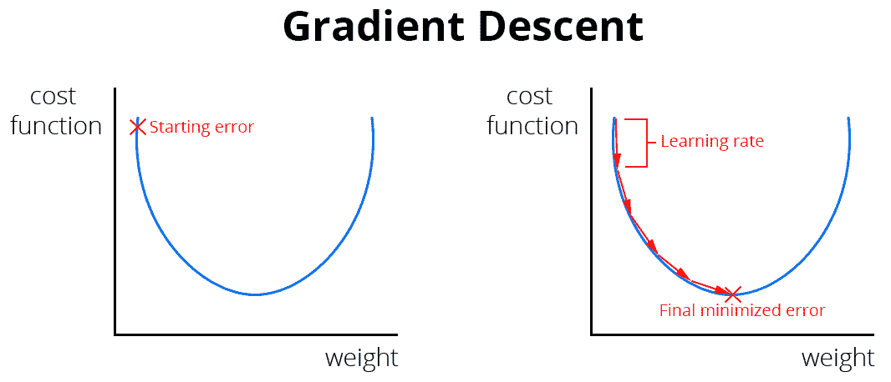

# 第十章：以太坊区块链上的机器学习

区块链和人工智能是近年来最有趣的话题，这有充分的理由：它们是最先进的技术，已经被创造出来以颠覆大多数已建立的业务。我们能够教会计算机自己学习是一件非常强大的事情，这意味着未来的机器学习系统将继续发展。同样的道理适用于区块链：分布式计算领域刚刚开始，它将成为未来大多数问题的默认解决方案。那么为什么不将两者结合起来进行革命性的发明呢？事实证明它们很好地结合在一起，我们可以创建非常有趣的 dApps，从两个领域中受益，特别是通过利用它们来创建分布式市场，以解决机器学习问题，并奖励用户的计算能力。

在本章中，我们将涵盖以下主题：

+   理解机器学习

+   分布式机器学习市场

+   构建智能合约机器学习市场

# 理解机器学习

**机器学习**（**ML**）是**人工智能**（**AI**）的一个子集，而后者又是数据科学更广泛主题中的一个领域。ML 专注于创建能够自己学习以解决特定问题的程序，而无需编写所有逻辑；我们只需要给它们大量的输入。试错是主要机制，机器慢慢地学会如何解决问题的正确输出。

计算机诞生的时刻，科学家们就问自己，“我们如何让这台机器像人类一样思考和行动？”这就是为什么了解计算机如何学习始于了解人类如何看待世界。

想一想：你认为动物和人类如何学会在我们生活的危险而混乱的世界中生存？通过向他人学习吗？嗯，那是一种有效的学习系统，但我们真正了解的一切都来自于在面对不确定性时进行实验。想象一下这样的场景：你处于一个原始世界，语言尚未发明——我们谈论的是数千年前。你在地上看到一个扁平而闪亮的红色物体，这对你来说是完全新的。你如何开始理解它呢？它可能是能够杀死你的东西，也可能是能够为你提供新材料的东西。你还不知道，所以你开始尝试不同的事情，始终保持警惕，因为你的主要目标是生存。你用一根棍子触摸它：没有反应。你用手触摸它：感觉温暖。你抓住它：感觉坚固，于是你试图打破它，没有成功。经过更多的实验，你得出结论：你手里拿着的是一个坚固的、自然形成的金属圆盘，你可以利用它的力量用太阳烹饪食物。

所有这些具体的知识都是通过试验使用试错机制得来的。我的观点是，这就是我们发现了当前世界上我们所知道的一切的方式，也是机器学习算法用来自行解决问题的系统。你给它们大量信息，它们就用它们的工具进行实验，这些工具通常是图像的逐像素读数和数据的字节，以生成结果。它们被用来预测未来，考虑到一些初始条件，以理解无法用经典编程解决的复杂问题，并创建帮助我们做得更好的工具。

从技术上讲，创建一个机器学习系统有三个步骤，如下所示：

1.  收集关于一个主题的大量信息，例如 2,000,000 张独特的水瓶图片。

1.  开发一个机器学习**模型**，生成所需的输出。在我们的例子中，假设我们想要创建一个模型，根据它们的形状、大小、颜色、化学成分和纯度对水瓶进行分类，因为我们需要找到最适合人类使用的水。这些属性被称为**标签**，因为它们是对每个组成部分的精确描述。

1.  模型在一个称为**训练**的过程中消耗所有这些数据，在这个过程中，它调整了我们水瓶的每个组件的重要性，以计算哪些因素决定了最佳水的可能性。在某个时候，它将被训练，意味着它将理解构成最佳水的属性，生成一个我们可以使用的程序，以快速确定特定新水瓶的好坏。

这只是一个例子，说明了我们如何使用机器学习来提供复杂问题的解决方案，例如，我可以为了最佳健康状况消费什么样的水？一个危险的人看起来像什么？我怎样教我的相机判断它所看到的是狗还是猫？

一般来说，步骤是获取数据 -> 创建使用该数据创建程序的模型 -> 将程序用于特定情况。还有许多其他不同的系统，程序通过试错来自行获取数据。其他有趣的机器学习算法在生物水平上工作，教导机器人像真实生活中的动物一样行动，以便像它们一样学习和看待世界。

这是一个非常热门的话题，在未来几年将继续增长，以回答人类可能提出的最复杂的问题和疑问。这就是为什么我建议你探索广阔的人工智能世界。在将其与区块链相结合之前，看看有什么可以利用的东西。

# 分散式机器学习市场

我们将建立一个市场，用于购买和出售具有强大 GPU 的用户的计算能力，并希望帮助其他人执行机器学习，以教会他们的算法根据监督学习完成任务，其中程序学会根据给定目标从大量输入中生成所需输出，以便自我编程。

当我们需要处理我们的 ML 市场中发生的交易的永久记录以及买家根据其参数请求的训练模型时，以太坊就会介入其中，以便随时可以访问。其理念是创建一个地方，让全世界的人们可以开始通过新的硬件用途来赚钱，作为挖矿的替代方案，同时还提供了一个安全的 ML 算法系统。

我们将使用 GPU 来训练我们的机器学习程序，因为它们非常擅长同时处理大量并行操作，这样我们就可以快速处理大批输入，比使用 CPU 更快。我们还将使用以太坊作为默认支付货币，以便轻松处理分散式交易。

如今，大多数机器学习模型都是基于**神经网络**（**NN**）的，这是对人脑工作原理的抽象，转化为计算机语言。它基于虚拟的个体神经元，接收输入并在满足条件时产生输出。例如，假设一个简单的神经元包含以下语句：

```
if(input > 10) return output = true;
```

如果输入大于 10，则该语句将返回一个正值。这个函数被称为激活函数，因为只有在函数满足条件时才会激活。我们可以使用不同的参数和配置将许多这些神经元组合在一起，得到所谓的神经网络，它可以处理复杂的输入以生成精确的输出。在训练时，我们会重新调整激活函数以更好地适应我们的目标。一旦设置好了我们的模型，这一切都会自动完成。最终，我们得到了一个经过训练的程序，能够回答复杂的问题，而无需编写每个特定情景的代码。

一旦模型从我们的训练数据集中调整好，我们就可以用来自不同来源的新输入来测试它，以确定它是否生成了最优输出。这很重要，因为存在过拟合的风险，即机器学习程序进行了过多的优化，变得过于特定于我们的初始输入，这样就无法从新数据中产生有效结果。这就像一个必须从头开始成为全科医生的外科医生：它不会产生很好的结果，因为它太专业化了。

一些著名的激活函数是 Sigmoid 和 ReLU。深度学习是将多层神经元堆叠在一起的过程，以便神经元的输出传递到另一个神经元，从而获得更高级的结果。这些网络被称为**深度神经网络**（**DNNs**），因为它们由多层组成。一定要自己探索神奇的神经网络世界，了解未来技术是如何塑造的。

在这里我们不会使用神经网络，因为由于区块链的限制，从头开始在**Solidity**上实现它们很困难，所以我们将使用您可以根据需要扩展的更简单的算法。这是我们的协议将如何工作的简要说明：

1.  用户向智能合约以以太币的形式发布一组数据、一个评估函数（我们的机器学习模型）以及完成任务的奖励。

1.  那些希望完成任务的人将从第一个用户那里下载发布的数据，以训练给定的机器学习模型，以生成一个训练良好的程序，然后将其返回给智能合约。

1.  外部用户将查看针对该特定任务发布的所有解决方案，以确定谁是赢家。买家将根据自己的偏好确定赢家。

从这个协议中，我们可以建立用户将遵循的以下流程：

1.  买家，即想要训练他们的模型的人，部署一个智能合约，其中包含以下数据：

    +   构造函数中的模型定义——例如，DNN。

    +   要训练的数据集——例如，由 30 x 30 像素制成的手写数字图像数组。每个图像都是一个 30 x 30 像素（900 像素）的数组，其中每个像素又是另一个数组，包含有关像素位置以及它是黑色还是白色的信息（我们不希望在这个图像中使用颜色，以避免复杂性）——例如 [[0, true], [1, false]] 将表示一个 2 x 1 像素的图像，其中第一个像素是黑色，而另一个是白色。这些数据集将发布到一个外部网站，人们可以自由访问以训练模型。在我们的构造函数中，我们将提供一个 URL，即`https://example.com/dataset`。

    +   训练模型的奖励以以太坊支付，并在可支付的构造函数中设置了此安排。

1.  合约被发布，卖家开始参与训练模型的任务。从数据集中，90%的数据将用于训练模型，而剩下的 10%将用于测试程序的结果，以验证其准确性。为了确保卖家不会彼此抄袭，将向不同的参与者提供不同的随机数据集。

1.  买家决定哪个模型对他们最有效，并选择一个赢家。如果到达到期时间而买家尚未选择赢家，则第一个参与者将获得奖励。

对于我们的机器学习市场，我们将在 Solidity 中使用一个简单的线性回归机器学习算法。用户将提交包含名称和两个数字参数以进行预测的数据。线性回归是两个因素之间的关系，例如，网站销售量与访问者数量。在这种情况下，我们可以建立一个模型，使我们能够预测给定访问者数量的销售量。

简单线性回归模型可以应用于许多领域，其中一个变量取决于另一个变量，它是可用的最简单的机器学习系统之一。这就是为什么我们将使用它的原因，因为重要的是能够在 Solidity 中重新创建它，以验证其他用户提供的解决方案。理想情况下，我们将实现一个 NN 或更复杂的模型，但考虑到区块链的限制，这将需要太多的时间来开发。您可以借鉴本章的教训来扩展市场。在下一节中，您将学习如何创建市场所需的代码。

# 构建智能合约机器学习市场

我们的机器学习市场将专门使用线性回归算法，以简化流程，让您了解它们如何紧密联系。我鼓励您扩展解决方案，以练习您的机器学习和区块链技能。要应用简单的线性回归算法，我们需要以下内容：

+   一个预测函数，用于从数据中生成预测

+   一个组合预测结果的成本函数

+   用于训练我们的算法的优化算法使用**梯度下降**，这将微调预测以获得更精确的结果

+   一个训练函数来改善我们的算法

# 预测函数

首先，您需要了解，我们的简单线性回归算法使用以下函数预测值：

```
y = weight * x + bias
```

如果我们根据网站访问者数量预测销售量，我们的预测函数将如下所示：

```
Sales = weight * visitors + bias
```

我们的目标是获得固定的权重和偏差值，优化我们的预测函数，以便我们获得销售的真实估计。例如，经过训练的线性回归会是这样的：

```
Sales = 0.43 * visitors + 0.9
```

我们在给定数据集上训练后得到了`0.43`的权重和`0.9`的偏差。我们应该能够使用该优化函数来为我们特定的需求做出准确的预测，从而取得出色的结果。我们需要在 Python 和 Solidity 中实现预测函数，因为卖家将使用 Python 训练模型，而我们将使用 Solidity 来验证这些卖家给出的结果。以下是我们市场的 Python 和 Solidity 中的`prediction`函数的样子：

```
# Python implementation
def prediction(x, weight, bias):
    return weight * x + bias
```

供您参考，这是我们将添加的 Solidity 函数，允许卖家和买家通过进行预测来验证模型的准确性：

```
// Solidity implementation
function prediction(uint256 _x, uint256 _weight, uint256 _bias) public pure returns(uint256) {
 return _weight * _x + _bias;
}
```

# 成本函数

要训练我们的线性回归算法以生成准确的预测，我们需要一个成本函数。成本函数是分析我们的预测函数在数据集中工作效果如何的一种方法。它给了我们一个错误率，这实际上是真实结果与预测之间的差异。错误越小，我们做出的预测就越好。成本函数将真实结果和预测作为输入，输出我们模型的错误，如下所示：

```
error = result - prediction
```

在我们的案例中，有许多不同类型的成本函数。在这种情况下，我们将使用**均方误差**（**MSE**）成本函数，它看起来像这样：

```
error = sum((result - prediction)2) / numberOfDataPoints
```

为了使其更清晰，我们可以添加具有所有参数的预测函数，以便您可以看到变量在成本函数中的作用，如下面的代码所示：

```
error = sum((result - prediction(x, weight, bias))2) / numberOfDataPoints
```

在这里，`sum()`是所有真实结果减去预测的平方的总和，所有结果数据集的总和。所有这些都被数据点的数量除以。请记住，`result`是我们试图预测的实际值。例如，回到我们之前的例子，我们试图预测每位访客将获得多少销售额，`result`将是`10`个销售额，这来自 200 位访客，而预测是我们从权重和偏差得出的估计值。

为了帮助您更好地理解该函数，考虑下面的假想数据集的示例：一个国家的假枪支持有和每个国家的犯罪数；在这个例子中，我们有兴趣了解枪支数量如何影响每个国家的犯罪数。利用这些数据，我们可以预测犯罪，以便我们可以调动特定数量的警察来处理这些情况。请记住，这是虚假数据，用来说明成本函数的工作原理：

| **国家** | **枪支总数** | **每年犯罪数量** |
| --- | --- | --- |
| 德国 | 3,520 | 20 |
| 爱沙尼亚 | 192 | 3 |
| 巴哈马 | 91 | 0 |
| 巴西 | 9,271 | 88 |

我们首先用随机权重和偏差初始化我们的预测函数，如下所示的代码：

```
// Our prediction function definition for you to remember how it looked like
y = weight * x + bias

// Our prediction function with random weight and bias
prediction = 0.1 * x + 0.4
```

德国的犯罪预测如下所示：

```
prediction = 0.1 * 3520 + 0.4 = 352.4 crimes per year
```

我们得到了`352.4`起犯罪，我们可以近似为 352，因为用小数点谈论犯罪没有意义。正如你所看到的，我们使用该权重和偏差的预测比每年 20 起犯罪的真实结果要高，因为我们的模型尚未训练，所以预计会有巨大的差异。

然后我们计算所有这些值的成本函数。让我们看看德国的情况如何：

```
// Our cost function definition for you to remember how it looked like
error = sum((result - prediction)2) / numberOfDataPoints

// Our cost function for the initial dataset
error = sum((20 - 352)2) / 1
```

我们正在将成本函数应用于一个数据点，以查看初始预测的错误，以便您可以看到它是如何应用的。这是结果：

```
error = (20 - 352)2 / 1 = 110224 
```

误差为`110224`，这是一个巨大的数字，因为我们将其应用于一个数据点，而且我们的模型尚未训练。现在对所有数据点执行相同操作，直到您为整个数据集生成误差。希望您可以通过该示例了解计算该误差的过程。

我们需要计算误差，以优化我们的预测函数，以便稍后进行更准确的预测。现在概念已经清楚，我们可以在 Python 中实现该函数。在 Solidity 中，我们希望它能够从特定市场解决方案计算误差，以便丢弃那些具有过大误差的市场解决方案。Python 中的`cost`函数将被买家用于验证其训练结果，并且将被 Solidity 中的卖家用于验证提交。让我们看看以下代码：

```
# The cost function implemented in python
def cost(results, weight, bias, xs):
    error = 0.0
    numberOfDataPoints = len(xs)
    for i in range(numberOfDataPoints):
        error += (results[i] - (weight * xs[i] + bias)) ** 2
    return error / numberOfDataPoints
```

`xs` 参数是独立变量的数组，`x`——我们在预测函数中看到的。在 Solidity 中它看起来是这样的；因为它是一个纯函数，我们不用担心燃气成本，因为一切都将在本地执行，而不必从区块链修改状态：

```
// The cost function implemented in solidity
function cost(int256[] memory _results, int256 _weight, int256 _bias, int256[] memory _xs) public pure returns(int256) {
    require(_results.length == _xs.length, 'There must be the same number of _results than _xs values');
    int256 error = 0; // Notice the int instead of uint since we want negative values too
    uint256 numberOfDataPoints = _xs.length;
    for(uint256 i = 0; i < numberOfDataPoints; i++) {
        error += (_results[i] - (_weight * _xs[i] + _bias)) * (_results[i] - (_weight * _xs[i] + _bias));
    }
    return error / int256(numberOfDataPoints);
}
```

正如您所看到的，我们将预测函数包含在`for`循环中，以计算结果减去预测的平方，以便我们可以从`cost`函数计算误差。这将由希望优化买家的特定线性回归的卖家使用，以进行准确的预测。

# 优化算法

现在我们可以在给定一些参数的情况下进行预测，并使用成本函数计算这些预测的精度，我们必须努力改进这些预测，通过减小由成本函数生成的误差。我们如何减小成本函数生成的误差？通过使用优化算法调整我们的预测函数的权重和偏差。在这种情况下，我们将使用梯度下降，这使我们能够不断减小误差。以下是说明其工作原理的图表：



我们从由随机权重和偏差值引起的高误差开始，然后通过优化这些参数来减小误差，直到我们达到足够好的预测模型，即图表中的局部最小值。想法是计算**权重**和**偏差**的偏导数，看它们如何影响最终预测，直到我们达到最小值。我们不会探讨计算这些偏导数的数学，因为它可能导致混淆，因此带有偏导数的结果函数如下所示：

```
weightDerivative = sum(-2x * (result - (x * weight + bias))) / numberOfDataPoints

biasDerivative = sum(-2 * (result - (x * weight + bias))) / numberOfDataPoints
```

让我们来看看更新机器学习算法的权重和偏差的这些函数的实现：

```
# Python implementation, returns the optimized weight and bias for that step
def optimizeWeightBias(results, weight, bias, xs, learningRate):
    weightDerivative = 0
    biasDerivative = 0
    numberOfDataPoints = len(results)
    for i in range(numberOfDataPoints):
        weightDerivative += (-2 * xs[i] * (results[i] - (xs[i] * weight + bias)) / numberOfDataPoints)
        biasDerivative += (-2 * (results[i] - (xs[i] * weight + bias)) / numberOfDataPoints)

    weight -= weightDerivative * learningRate
    bias -= biasDerivative * learningRate
    return weight, bias
```

在 Solidity 中，它看起来像这样：

```
// Solidity implementation
function optimize(int256[] memory _results, int256 _weight, int256 _bias, int256[] memory _xs, int256 _learningRate) public pure returns(int256, int256) {
    require(_results.length == _xs.length, 'There must be the same number of _results than _xs values');
    int256 weightDerivative = 0;
    int256 biasDerivative = 0;
    uint256 numberOfDataPoints = _xs.length;
    for(uint256 i = 0; i < numberOfDataPoints; i++) {
        weightDerivative += (-2 * _xs[i] * (_results[i] - (_xs[i] * _weight + _bias)) / int256(numberOfDataPoints));
        biasDerivative += (-2 * (_results[i] - (_xs[i] * _weight + _bias)) / int256(numberOfDataPoints));
    }
    _weight = weightDerivative * _learningRate;
    _bias = biasDerivative * _learningRate;
    return (_weight, _bias);
}
```

如你所见，我们通过使用前面代码块中描述的函数来计算两个导数，以便我们可以使用优化后的值更新权重和偏置。学习速率是我们达到图表最小点的步长大小。如果我们迈出的步子太大，我们可能会错过最小值，如果我们迈出的步子太小，可能需要太长时间才能到达那个最小值。无论如何，最好保持一个平衡的学习速率并尝试不同的步长。现在我们有了改进我们预测函数的方法。

# 训练函数

我们可以开始通过一个新的函数来改进我们的模型，该函数循环执行多个优化调用，直到达到最小值，此时模型将完全优化。代码如下所示：

```
# Python implementation
def train(results, weight, bias, xs, learningRate, iterations):
 error = 0 for i in range(iterations):
    weight, bias = optimizeWeightBias(results, weight, bias, xs, learningRate)
    error = cost(results, weight, bias, xs)
    print("Iteration: {}, weight: {:.4f}, bias: {:.4f}, error: {:.2}".format(i, weight, bias, error))
 return weight, bias
```

Solidity 实现看起来非常相似，尽管我们必须确保结果和独立变量的值具有相同的长度，以避免错误，如下面的代码所示：

```
// Solidity implementation
function train(int256[] memory _results, int256 _weight, int256 _bias, int256[] memory _xs, int256 _learningRate, uint256 _iterations) public pure returns(int256, int256) {
    require(_results.length == _xs.length, 'There must be the same number of _results than _xs values');
    int256 error = 0;
    for(uint256 i = 0; i < _iterations; i++) {
        (_weight, _bias) = optimize(_results, _weight, _bias, _xs, _learningRate);
        error = cost(_results, _weight, _bias, _xs);
    }
    return (_weight, _bias);
}
```

如你所见，我们正在使用优化函数和成本函数连续减少误差，通过更新权重和偏置参数来进行指定次数的迭代。

现在你应该能够创建和训练线性回归模型，使用`train`函数训练你的模型后，使用预测函数进行预测。以下是完整的 Python 代码供你参考，尽管你可以在官方 GitHub 上查看更新版本，链接为[`github.com/merlox/machine-learning-ethereum/blob/master/linearRegression.py`](https://github.com/merlox/machine-learning-ethereum/blob/master/linearRegression.py)。

我们首先创建构造函数，该构造函数将使用`uniform`库训练模型，并使用初始随机值，因为它返回 0 到 1 之间的浮点数，如下面的代码所示：

```
from random import uniform

class LinearRegression:
    xs = [3520, 192, 91, 9271]
    results = [20, 3, 0, 88]

    def __init__(self):
        initialWeight = uniform(0, 1)
        initialBias = uniform(0, 1)
        learningRate = 0.00000004
        iterations = 2000
        print('Initial weight {}, Initial bias {}, Learning rate {}, Iterations {}'.format(initialWeight, initialBias, learningRate, iterations))
        finalWeight, finalBias = self.train(self.results, initialWeight, initialBias, self.xs, learningRate, iterations)
        finalError = self.cost(self.results, finalWeight, finalBias, self.xs)
        print('Final weight {:.4f}, Final bias {:.4f}, Final error {:.4f}, Prediction {:.4f} out of {}, Prediction Two {:.4f} out of {}'.format(finalWeight, finalBias, finalError, self.prediction(self.xs[1], finalWeight, finalBias), self.results[1], self.prediction(self.xs[3], finalWeight, finalBias), self.results[3]))
```

然后，我们实现`prediction`和`cost`函数，就像你刚学的一样，放在构造函数下面，如下面的代码所示：

```
    # Python implementation
    def prediction(self, x, weight, bias):
        return weight * x + bias

    # The cost function implemented in python
    def cost(self, results, weight, bias, xs):
        error = 0.0
        numberOfDataPoints = len(xs)
        for i in range(numberOfDataPoints):
            error += (results[i] - (weight * xs[i] + bias)) ** 2
        return error / numberOfDataPoints
```

然后，我们添加了优化的权重和偏置函数，如下面的代码所示：

```
    # Python implementation, returns the optimized weight and bias for that step
    def optimizeWeightBias(self, results, weight, bias, xs, learningRate):
        weightDerivative = 0
        biasDerivative = 0
        numberOfDataPoints = len(results)
        for i in range(numberOfDataPoints):
            weightDerivative += -2 * xs[i] * (results[i] - (xs[i] * weight + bias))
            biasDerivative += -2 * (results[i] - (xs[i] * weight + bias))

        weight -= (weightDerivative / numberOfDataPoints) * learningRate
        bias -= (biasDerivative / numberOfDataPoints) * learningRate

        return weight, bias
```

最后，我们通过在类的作用域之外创建`train`函数并初始化类来完成代码，如下面的代码所示：

```
    # Python implementation
    def train(self, results, weight, bias, xs, learningRate, iterations):
        error = 0
        for i in range(iterations):
            weight, bias = self.optimizeWeightBias(results, weight, bias, xs, learningRate)
            error = self.cost(results, weight, bias, xs)
            print("Iteration: {}, weight: {:.4f}, bias: {:.4f}, error: {:.2f}".format(i, weight, bias, error))
        return weight, bias

# Initialize the class
LinearRegression()
```

如你所见，我们创建了一个 Python 类，在构造函数中运行`train`函数。如果你对 Python 不熟悉，不要担心；你只需要理解这段代码正在训练我们的线性回归算法进行更精确的计算。创建一个名为`linearRegression.py`的文件，并将代码写入其中。然后你可以用以下命令行运行它：

```
python linearRegression.py
```

你会看到程序不断通过向最小值迈出小步骤来减少误差，直到它达到一个不太改善的程度。这没关系：我们希望它能做出精确的预测，但不一定 100% 准确。然后，你可以用最终的权重和偏置来对那个机器学习模型进行预测。

让我们看一下智能合约市场，看看用户将如何与之交互。我们的目标是提供一个地方，让机器学习开发人员可以上传其模型，并以以太币支付，目的是从几个卖家中获得解决方案，然后根据错误或买家的选择选择一个赢家。让我们看一下以下代码：

```
pragma solidity 0.5.5;

contract MachineLearningMarketplace {}
```

我们可以开始添加变量来创建我们想要的应用程序，如下所示：

```
pragma solidity 0.5.5;

contract MachineLearningMarketplace {
    event AddedJob(uint256 indexed id, uint256 indexed timestamp);
    event AddedResult(uint256 indexed id, uint256 indexed timestamp, address indexed sender);
    event SelectedWinner(uint256 indexed id, uint256 indexed timestamp, address indexed winner, uint256 trainedIdSelected);

    struct Model {
        uint256 id;
        string datasetUrl;
        uint256 weight;
        uint256 bias;
        uint256 payment;
        uint256 timestamp;
        address payable owner;
        bool isOpen;
    }
    mapping(uint256 => Model) public models;
    mapping(uint256 => Model[]) public trainedModels;
    uint256 public latestId;
}
```

我们添加了三个事件来通知用户已添加了新作业或结果，以及何时选择了提案的获胜者。这样，人们就会在他们的提案被更新时收到通知。然后，我们有一个名为 `Model` 的结构体，它代表我们希望的线性回归 ML 模型，其中包括数据集、权重、偏差和支付等重要变量。最后，我们添加了一对映射，以对买家创建的模型（那些支付来让他们的模型训练）和卖家创建的模型进行排序，后者训练数据集并上传特定的权重和偏差，以便在被买家选中时赢取。`latestId` 是一个标识符，表示哪个模型是最新的。

开放的模型意味着它仍在运行，因此您可以发送提案并参与其中，以获得被选中的机会。如果它已关闭，您仍然可以参与，但要知道您将无法获胜，因为获胜者已经被选定。

让我们继续讨论我们 ML 市场的三个最重要的功能。上传作业功能如下所示：

```
/// @notice To upload a model in order to train it
/// @param _dataSetUrl The url with the json containing the array of data
function uploadJob(string memory _dataSetUrl) public payable {
    require(msg.value > 0, 'You must send some ether to get your model trained');
    Model memory m = Model(latestId, _dataSetUrl, 0, 0, msg.value, now, msg.sender, true);
    models[latestId] = m;
    emit AddedJob(latestId, now);
    latestId += 1;
}
```

这是上传结果功能，其中添加了一些文档以澄清内部使用的参数：

```
/// @notice To upload the result of a trained model
/// @param _id The id of the trained model
/// @param _weight The final trained weight, it must be with 10 decimals meaning that 1 weight is 1e10 so that you can do smaller fractions such as 0.01 which would be 1e8 or 100000000
/// @param _bias The final trained bias, it must be with 10 decimals as the weight
function uploadResult(uint256 _id, uint256 _weight, uint256 _bias) public {
    Model memory m = Model(_id, models[_id].datasetUrl, _weight, _bias, models[_id].payment, now, msg.sender, true);
    trainedModels[_id].push(m);
    emit AddedResult(_id, now, msg.sender);
}
```

最后，这是选择结果功能，因为我们必须确保作业是开放的，并且尚未选择赢家，所以这个函数相当冗长。如果三天后没有选择获胜者，第一个申请人将赢得奖励，以避免失去以太币：

```
/// @notice To choose a winner by the sender
/// @param _id The id of the model
/// @param _arrayIdSelected The array index of the selected winner
function chooseResult(uint256 _id, uint256 _arrayIdSelected) public {
    Model memory m = models[_id];
    Model[] memory t = trainedModels[_id];
    require(m.isOpen, 'The job must be open to choose a result');
    // If 3 days have passed the winner will be the first one, otherwise the owner is allowed to choose a winner before 3 full days
    if(now - m.timestamp < 3 days) {
        require(msg.sender == m.owner, 'Only the owner can select the winner');
        t[_arrayIdSelected].owner.transfer(m.payment);
        models[_id].isOpen = false;
        emit SelectedWinner(_id, now, t[_arrayIdSelected].owner, t[_arrayIdSelected].id);
    } else {
        // If there's more than one result, send it to the first
        if(t.length > 0) {
            t[0].owner.transfer(m.payment);
            emit SelectedWinner(_id, now, t[0].owner, t[0].id);
        } else {
            // Send it to the owner if none applied to the job
            m.owner.transfer(m.payment);
            emit SelectedWinner(_id, now, msg.sender, 0);
        }
        models[_id].isOpen = false;
    }
}
```

`uploadJob` 函数将由买家使用，以发布他们的数据集和付款，以便让全世界的参与者训练他们的模型。`uploadResult` 函数将由卖家使用，以获取有关训练指定数据集直到错误最小化的作业的信息。最后，`chooseResult` 函数是由买家用于选择确定作业的赢家提案的函数。作业的创建者有三天的时间选择获胜提案。如果三天后没有人申请，那么支付将退还给所有者。如果有参与者，但所有者尚未选择获胜者，则奖励将作为对速度的补偿发送给第一个参与者；在这种情况下，此函数必须由外部用户执行以执行支付。

这些是构成我们 ML 市场的主要组件；然而，我们需要一些函数来帮助人们与之交互。以下是添加到 ML 市场的新函数，为了更好地帮助您理解，将它们分解成片段。

首先，我们创建了完整文档的成本函数，这样我们就能理解它的作用：

```
/// @notice The cost function implemented in solidity
/// @param _results The resulting uint256 for a particular data element
/// @param _weight The weight of the trained model
/// @param _bias The bias of the trained model
/// @param _xs The independent variable for our trained model to test the prediction
/// @return int256 Returns the total error of the model
function cost(int256[] memory _results, int256 _weight, int256 _bias, int256[] memory _xs) public pure returns(int256) {
    require(_results.length == _xs.length, 'There must be the same number of _results than _xs values');
    int256 error = 0; // Notice the int instead of uint since we want negative values too
    uint256 numberOfDataPoints = _xs.length;
    for(uint256 i = 0; i < numberOfDataPoints; i++) {
        error += (_results[i] - (_weight * _xs[i] + _bias)) * (_results[i] - (_weight * _xs[i] + _bias));
    }
    return error / int256(numberOfDataPoints);
}
```

然后我们有获取模型函数来检索结构模型中包含的变量，因为我们目前无法原样返回结构。我们必须做这些类型的技巧来独立获取结构值。以下代码显示了该函数：

```
/// @notice To get a model dataset, payment and timestamp
/// @param id The id of the model to get the dataset, payment and timestamp
/// @return Returns the dataset string url, payment and timestamp
function getModel(uint256 id) public view returns(string memory, uint256, uint256) {
    return (models[id].datasetUrl, models[id].payment, models[id].timestamp);
}
```

然后我们添加另一个获取器函数，它为特定 ID 的所有经过训练的模型提供了，如下所示的代码。对于想要查看他们特定作业收到了什么提案的卖家来说，这是很有用的。如果我们要在一个 dApp 中实现这个机器学习市场，我们将不得不为作业和其他映射添加一些更多的获取器：

```
/// @notice To get all the proposed trained models for a particular id
/// @param _id The id of the model created by the buyer
/// @return uint256[], uint256[], uint256[], uint256[], address[] Returns all those trained models separated in arrays containing ids, weights, biases, timestamps and owners
function getAllTrainedModels(uint256 _id) public view returns(uint256[] memory, uint256[] memory, uint256[] memory, uint256[] memory, address[] memory) {
    uint256[] memory ids;
    uint256[] memory weights;
    uint256[] memory biases;
    uint256[] memory timestamps;
    address[] memory owners;
    for(uint256 i = 0; i < trainedModels[_id].length; i++) {
        Model memory m = trainedModels[_id][i];
        ids[i] = m.id;
        weights[i] = m.weight;
        biases[i] = m.bias;
        timestamps[i] = m.timestamp;
        owners[i] = m.owner;
    }
    return (ids, weights, biases, timestamps, owners);
}
```

我们有一个`cost`函数，用于快速验证由拟议销售方上传的结果，一个`getModel`函数，主要由想要获取有关模型更多具体信息的卖家使用，以及一个`getAllTrainedModels`函数，返回特定工作的参与者。请注意，我们返回结构中最重要的变量而不是整个结构。我们这样做的简单原因是，目前在 Solidity 中我们无法返回结构，所以我们必须分开每个变量，并为每个变量返回一个数组。

这个市场的一般工作流程如下：

1.  拥有要训练的机器学习模型的买家使用`uploadJob`函数将其数据集和付款上传到市场。

1.  生成了一个`AddedJob`事件，通知对该市场新工作感兴趣的用户。他们可以使用**web3**或外部 dApps 来监听这些事件，因为合约是开源的。

1.  卖家使用`getModel`函数读取模型数据，特别是时间戳，因为那是最重要的信息片段，使用他们从事件中收到的`id`模型。然后他们开始使用我们之前构建的 Python 应用程序或他们自己的应用程序进行模型训练，因为有许多不同的方法可以训练线性回归算法。

1.  他们使用`uploadResult`函数将他们训练好的权重和偏置上传到该作业作为一个新的提案。这将触发`AddedResult`事件，通知买方是否在听取更新，以便他们可以选择获胜者。

1.  在任务创建后不到三天之内，买家会浏览提案，比较每个提案产生的错误与`cost`函数或他们自己的实现。他们几乎肯定会选择错误最小的结果，尽管他们可以选择任何一个。选择完毕后，模型的状态将变为`isOpen = false`，这意味着赢家已选定，并且会触发`SelectedWinner`事件。

就是这样！您现在能够在区块链上上传和训练线性回归模型了。

# 总结

在这一章中，您学到了结合区块链和机器学习的基本实用性，因为它们几乎是对立的，这意味着它们互补，可以很好地实现最佳的安全性和性能。我们从机器学习的一般解释开始，这样您就可以通过快速了解生成和训练机器学习模型的过程来理解所有的炒作。然后我们深入探讨了应用的技术功能，这样您就能清楚地看到机器学习和区块链的交汇点。最后，我们建立了机器学习市场，因为这是两种技术的绝佳结合。您看到了线性回归算法如何在 Python 和 Solidity 中逐步实现。我们建立了市场，全世界的用户可以在这里为每个任务训练和交换计算资源，创建了一个伟大的安全开放源代码平台，人们在这里可以自由互动，没有审查、费用或中心化。

在下一章中，我们将探索类似于本章中所见的高级以太坊实现，但涉及到不同的行业，从一个基于区块链的社交媒体平台开始，它将分散化和互联网上的社交互动结合在一起。
