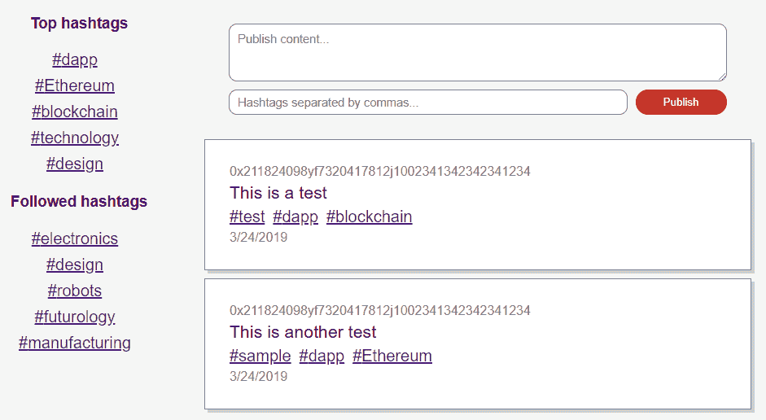
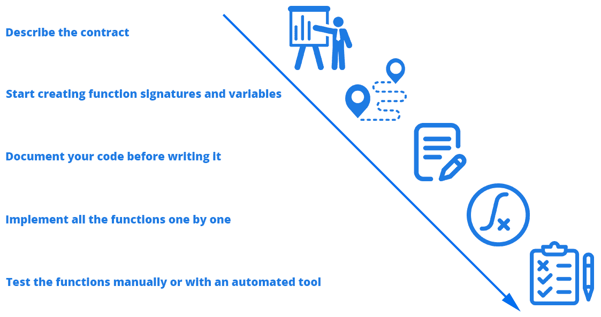
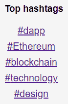
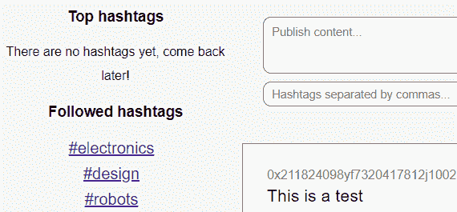

# 创建基于区块链的社交媒体平台

掌握以太坊开发始于大量的理论和技术，但在某一时刻，你必须跨出一步，开始将你最近获得的知识应用于构建你的投资组合的实际情况。这就是为什么我们要创建一个基于区块链的社交媒体平台，因为它是区块链技术的最佳用例之一，因为我们提供了人们的信任。不幸的是，许多中心化的社交媒体公司正在滥用这种信任，通过窃取和变现用户的隐私。诸如 Twitter 或 Facebook 等社交媒体平台之所以著名，是因为它们赋予了人们在一个界面上与许多个体保持联系的权力，利用了互联网的能力。

本章将带您了解如何创建一个完全基于区块链而无需中心化服务器的动态社交媒体平台的挑战。您将了解如何使用 React 创建一个漂亮的用户界面。然后，您将探索如何更好地组织信息，以便使用智能合约允许人们找到他们想要的内容。最后，您将使用 web3 将所有内容联系在一起，并能够使用您的社交媒体平台。

在本章中，我们将涵盖以下主题：

+   理解分散的社交媒体

+   创建用户界面

+   构建智能合约

+   完成 dApp

# 理解分散的社交媒体

当涉及基于以太坊的社交媒体 dApp 时，我们帮助人们解决了许多目前中心化公司尚无法有效解决的问题。我们可以帮助解决以下问题：

+   在分散的区块链上保护用户的隐私

+   通过不允许来自外部中心化实体的审查来保证完全的自由，因为区块链上的信息是永久的

+   一个不变的、固定的存储系统，在几十年后仍然可以访问创建的内容

然而，当我们考虑构建一个分散的社交媒体平台时，我们会失去一些对现代应用程序至关重要的以下重要方面：

+   **速度**：用户无法像使用普通的中心化应用程序一样快速使用 dApp，因为它依赖于一个庞大而缓慢的互联网络。

+   **存储限制**：以太坊的空间有限，因此每个字节都很昂贵，导致在区块链上可以存储的内容受到巨大限制，因此我们必须找到克服这些自然限制的方法，同时尽可能保持分散。

+   **Gas 费用**：普通的中心化应用程序不必为系统上每个操作支付 gas 费用，因为它们了解到所有这些成本都是在中心化服务器上支付的。在区块链上，每个交易都有一定的成本，这可能是显着的。我们将通过使用测试网络来解决这个问题，在测试网络上，gas 没有价值，直到最终的应用程序创建完成。

另一个大问题是我们无法在区块链上存储图像和视频；如果我们希望保留主系统的去中心化，我们将不得不依赖于分布式存储解决方案，例如 IPFS，但这并不是强制性的。

# 初始概念

我们的目标是创建一个有效的社交媒体平台，克服或完全避免区块链的限制。为了简化我们的 dApp 的复杂性，我们将构建一个类似于 Twitter 的应用程序，用户只分享文本消息，而不提供分享图像或视频的选项。

由于我们是开发人员，我们将创建一个面向程序员、设计师、开发人员和各种技术相关领域的 Twitter，让人们可以在共同兴趣的社区中感到受欢迎。我们希望它具有以下功能：

+   仅受智能合约容量限制的文本字符串分享能力

+   为每个内容添加标签的能力

+   通过点击标签来查看人们在他们的内容中包含的标签的功能

+   订阅标签的功能

我们不希望人们关注其他人，我们只会给他们提供关注标签的能力，这样他们就会专注于内容而不是信使。让我们开始着手设计用户界面，这将成为我们的社交媒体 dApp，供技术爱好者通过标签而不是特定用户来关注内容。

# 创建用户界面

此特定项目的用户界面将围绕内容和标签展开，因为标签是用户发现新趋势内容的方式。用户将能够订阅特定标签，以在他们的订阅中接收来自这些主题的内容。

像往常一样，我们首先用 Truffle 设置一个新项目。按照以下步骤设置你的项目：

1.  克隆初创仓库（[`github.com/merlox/dapp`](https://github.com/merlox/dapp)），其中包含了在你的 React dApp 上工作的初始配置：

```
git clone https://github.com/merlox/dapp
```

1.  将仓库重命名为`social-media-dapp`以整理内容：

```
mv dapp/ social-media-dapp/
```

1.  通过访问 GitHub 创建一个新的空仓库（不包含许可证或`.gitignore`，因为它们已经包含在你的项目中），并使用以下命令来更新拉取/推送 URL：

```
git config remote.origin.url https://<YOUR-USERNAME>:<YOUR-PASSWORD>@github.com/<YOUR-USERNAME>/social-media-dapp
```

1.  推送第一个提交。使用`npm i`安装依赖项，并使用`webpack -wd`运行`webpack`。

1.  通过运行静态服务器`http-server dist/`来打开你的应用程序，并访问`http://localhost:8080`，查看是否一切都设置正确。

现在你可以开始创建你的用户界面了。你已经知道如何做了，那为什么不先自己试试呢？你会惊讶于此时你能够做到的事情，所以我鼓励你尝试建立自己的系统。我们的想法是通过指导你的步骤来一起构建这个 dApp，直到你拥有一个高质量的 dApp，可以用来建立你的简历或进一步为 ICO 或作为人类进步的开源软件的开发。

# 配置 webpack 样式

最后，你将必须有两个部分：一个是最受欢迎的标签，这将来自我们智能合约中的映射，另一个是你可以在其中阅读更多关于每个具体标签的内容，同时能够发布内容。你可能想设置样式加载程序以能够在你的 dApp 上使用 CSS，这在你刚刚克隆的默认 dApp 上并没有设置。为了这样做，在停止 webpack 后安装以下依赖项：

```
npm i -S style-loader css-loader
```

现在你已经安装了所需的库，可以在项目中使用 CSS 文件，你可以通过在`css`文件的`loaders`块中添加一个新的 loader 来更新 webpack 配置文件。请注意，我们使用了两个 loaders，`style-loader`排在第一个。否则它将无法工作：

```
{
    test: /\.css$/,
    exclude: /node_modules/,
    use: [
        { loader: 'style-loader' },
        { loader: 'css-loader' }
    ]
}
```

# 建立初始结构

打开`index.js`文件，并开始创建你的用户界面。首先，通过创建一些以后会用到的必要变量来设置构造函数：

1.  为任何 React 项目设置所需的导入，以及我们现在可以通过样式和 css 加载器导入的`css`文件：

```
import React from 'react'
import ReactDOM from 'react-dom'
import './index.css'
```

1.  设置构造函数并填入一些虚拟数据，以查看最终应用程序在填入来自智能合约的变量后的外观：

```
class Main extends React.Component {
    constructor() {
        super()

        this.state = {
            content: [{
                author: '0x211824098yf7320417812j1002341342342341234',
                message: 'This is a test',
                hashtags: ['test', 'dapp', 'blockchain'],
                time: new Date().toLocaleDateString(),
            }, {
                author: '0x211824098yf7320417812j1002341342342341234',
                message: 'This is another test',
                hashtags: ['sample', 'dapp', 'Ethereum'],
                time: new Date().toLocaleDateString(),
            }],
            topHashtags: ['dapp', 'Ethereum', 'blockchain', 'technology', 'design'],
            followedHashtags: ['electronics', 'design', 'robots', 'futurology', 'manufacturing'],
            displaySubscribe: false,
            displaySubscribeId: '',
        }
    }
```

1.  创建带有`ReactDOM`渲染的`render()`函数：

```
    render() {
        return (
            <div className="main-container">
            </div>
        )
    }
}

ReactDOM.render(<Main />, document.querySelector('#root'))
```

如你所见，我们应用程序的状态包含了`content`对象，其中包含了一个以太坊地址作为该文章的作者，消息，标签和时间。我们以后可能会更改它，但现在已经足够好了。我们还添加了两个数组，其中包含了最热门的标签和这个特定用户关注的标签。这些显示订阅变量是为了在用户悬停在标签上时显示一个订阅按钮，以便他们有选择关注以改善 dApp 的互动性。

# 渲染标签

现在我们可以创建带有所有逻辑的渲染函数，但要警告你：由于我们要显示状态中的所有数组，所以有点复杂，请耐心地分段查看代码以理解。按照以下步骤进行：

1.  创建一个新的函数来生成标签的 HTML，因为我们希望在按钮上添加可变逻辑，以确保`hashtag`文本对用户展示订阅或取消订阅按钮有反应。记住，我们希望用户能够关注标签；这就是我们需要订阅和取消订阅按钮的原因：

```
generateHashtags(hashtag, index) {
    let timeout
    return (
        <span onMouseEnter={() => {
            clearTimeout(timeout)
            this.setState({
                displaySubscribe: true,
                displaySubscribeId: `subscribe-${hashtag}-${index}`,
            })
        }} onMouseLeave={() => {
            timeout = setTimeout(() => {
                this.setState({
                    displaySubscribe: false,
                    displaySubscribeId: '',
                })
            }, 2e3)
        }}>
            <a className="hashtag" href="#">#{hashtag}</a>
            <span className="spacer"></span>
            <button ref={`subscribe-${hashtag}-${index}`} className={this.state.displaySubscribe && this.state.displaySubscribeId == `subscribe-${hashtag}-${index}` ? '' : 'hidden'} type="button">Subscribe</button>
            <span className="spacer"></span>
        </span>
    )
}
```

1.  更新`render()`函数以生成内容和标签块，因为我们需要一种简单的方法来创建要显示的内容；所有逻辑将在`render()`函数中执行：

```
render() {
    let contentBlock = this.state.content.map((element, index) => (
        <div key={index} className="content">
            <div className="content-address">{element.author}</div>
            <div className="content-message">{element.message}</div>
            <div className="content-hashtags">{element.hashtags.map((hashtag, i) => (
                <span key={i}>
                    {this.generateHashtags(hashtag, index)}
                </span>
            ))}
            </div>
            <div className="content-time">{element.time}</div>
        </div>
    ))
```

1.  添加标签块，其唯一工作是创建将显示给用户的 JSX 对象，使用我们刚刚使用的`generateHashtags()`函数：

```
let hashtagBlock = this.state.topHashtags.map((hashtag, index) => (
    <div key={index}>
        {this.generateHashtags(hashtag, index)}
    </div>
))
let followedHashtags = this.state.followedHashtags.map((hashtag, index) => (
    <div key={index}>
        {this.generateHashtags(hashtag, index)}
    </div>
))
```

1.  在`render()`函数的末尾，添加带有我们刚刚设置的块变量的`return`块：

```
    return (
        <div className="main-container">
            <div className="hashtag-block">
                <h3>Top hashtags</h3>
                <div className="hashtag-container">{hashtagBlock}</div>
                <h3>Followed hashtags</h3>
                <div className="hashtag-container">{followedHashtags}</div>
            </div>
            <div className="content-block">
                <div className="input-container">
                    <textarea placeholder="Publish content..."></textarea>
                    <input type="text" placeholder="Hashtags separated by commas..."/>
                    <button type="button">Publish</button>
                </div>

                <div className="content-container">
                    {contentBlock}
                </div>
            </div>
        </div>
    )
}
```

我们添加了一个名为`generateHashtags`的函数，因为我们必须在许多地方添加相同的逻辑来显示订阅按钮，所以制作一个只在需要时执行此操作而不重复这些长代码块的函数是有意义的。然后，在`render()`函数中，您可以看到我们在许多地方使用该函数来生成标签逻辑。在返回之前，我们有三个变量，只是使用我们的状态数据动态生成 JSX 组件。最后，`render()`函数很好地显示了这些块。

# 改善外观

我还导入了`index.css`文件，其中包含用于以最佳方式显示我们的应用程序的网格组件，具有干净的结构，易于维护：

1.  添加主要组件的一般样式到您的应用程序，例如 body 和按钮，以使它们看起来更好：

```
body {
    margin: 0;
    background-color: whitesmoke;
    font-family: sans-serif;
}

button {
    background-color: rgb(201, 47, 47);
    color: white;
    border-radius: 15px;
    border: none;
    cursor: pointer;
}

button:hover {
    background-color: rgb(131, 0, 0);
}
```

1.  将一般隐藏和间隔样式添加到隐藏元素并创建动态间隔：

```
.hidden {
    display: none;
}

.spacer {
    margin-right: 5px;
}
```

1.  将容器的样式添加到位置上，该位置现在在所有主要浏览器上都被接受的网格系统中：

```
.main-container {
    display: grid;
    grid-template-columns: 30% 70%;
    margin: auto;
    width: 50%;
    grid-column-gap: 10px;
}

.input-container {
    margin-bottom: 10px;
    padding: 30px;
    display: grid;
    grid-template-columns: 80% 1fr;
    grid-template-rows: 70% 30%;
    grid-gap: 10px;
}
```

1.  格式化输入和文本区域，以创建一个外观更好，易于使用的设计：

```
.input-container textarea {
    padding: 10px;
    border-radius: 10px;
    font-size: 11pt;
    font-family: sans-serif;
    border: 1px solid grey;
    grid-column: 1 / 3;
}

.input-container input {
    padding: 10px;
    border-radius: 10px;
    font-size: 11pt;
    font-family: sans-serif;
    border: 1px solid grey;
}
```

1.  为内容块提供一个看起来很棒的设计，类似于 Twitter 中的推文：

```
.content {
    background-color: white;
    border: 1px solid grey;
    margin-bottom: 10px;
    padding: 30px;
    box-shadow: 4px 4px 0px 0 #cecece;
}
.content-address {
    color: grey;
    margin-bottom: 5px;
}
.content-message {
    font-size: 16pt;
    margin-bottom: 5px;
}
.content-hashtags {
    margin-bottom: 5px;
}
.content-time {
    color: grey;
    font-size: 12pt;
}
```

1.  格式化这些标签，以将它们放置在正确的位置，并增加它们的大小：

```
.hashtag-block {
    text-align: center;
}

.hashtag-container {
    line-height: 30px;
}

.hashtag {
    font-size: 15pt;
}
```

1.  如果您希望实现相同的外观，可以复制并粘贴该 css。这是 dApp 目前的外观：



1.  您可以在 GitHub 上查看完成的代码，网址是[`github.com/merlox/social-media-dapp/tree/master/src`](https://github.com/merlox/social-media-dapp/tree/master/src)。

我试图模拟一种简单的卡通设计，以使可视化更有趣，同时保持一个清晰的界面，人们可以轻松阅读而不会混淆。注意您创建的用户界面，因为它们是每个 dApp 的主要组成部分。外观专业的 dApp 会引起更多关注。更多的关注通常会转化为更多的收入，因为您能够在正确的时刻引导人们的注意力到正确的地方。

# 构建智能合约

我们要构建的智能合约将作为我们的分散式应用的后端，存储所有消息、主题标签和用户。在我们的应用中，我们希望保持用户的匿名性；这就是为什么他们被表示为地址而不是用户名——将人们的注意力集中在谈论的内容上，而不是消息的发布者。

正如您已经知道的，我们将创建一个以主题为中心的社交媒体平台，不包含图像或视频。这就是为什么我们所有的数据将存储在映射和数组的组合中。

# 规划设计流程

在直接进入代码之前，我想让您了解我们将遵循的优化整个流程、避免混乱并通过清晰地了解需要完成的工作来节省时间的过程。该过程如下所示：

1.  创建一个智能合约文件，并在注释中写下合约的目的描述，例如函数的工作方式以及谁将使用它。尽量简洁，因为这将有助于您和维护人员了解它的全部内容。

1.  开始创建变量和函数签名，即，没有主体的函数，只有名称和参数。使用 NatSpec 格式为每个函数编写文档以进行额外的澄清。

1.  独立实现每个函数，直到所有函数都完成。如果需要，您可以添加更多函数。

1.  通过将合约复制粘贴到 remix 或任何其他 IDE 中手动测试合约，以快速发现问题并在虚拟 EVM 中运行所有函数，在那里您无需支付任何 gas 费用或等待确认。理想情况下，您会编写 Truffle 测试来验证一切是否正常工作，但有时可以跳过以节省时间。

这是该流程的图形表示，以便您牢记：



这种类型的流程是我用来最大化生产力而不至于因规格而疯狂的流程。如果您立即开始编写解决方案，您可能会陷入一个需要重新制作整个代码库的地方，同时在此过程中创建不必要的错误。这就是为什么规划如此重要。此外，确切地知道该做什么以及何时做将使您的生活变得轻松得多。

现在我们可以开始创建我们的智能合约，描述其背后的想法。在您的`contracts/`文件夹中创建一个名为`SocialMusic.sol`的文件，并在文件顶部的注释中写下该合约最终版本应该包含的内容的描述。在查看我的解决方案之前，请尝试自己完成，因为学习的唯一方法就是自己练习：

```
// This is a social media smart contract that allows people to publish strings of text in short formats with a focus on hashtags so that they can follow, read and be in touch with the latest content regarding those hashtags. There will be a mapping of the top hashtags. A struct for each piece of content with the date, author, content and array of hashtags. We want to avoid focusing on specific users that's why user accounts will be anonymous where addresses will the be the only identifiers.

pragma solidity ⁰.5.5;

contract SocialMedia {}
```

无论您是否意识到，通过编写描述，您的思维都得到了很大程度的澄清。现在您可以开始创建函数和变量了。鉴于您已经有了用户界面，您将想将该界面分解为块，并创建将提供这些块中显示的数据的函数；例如，看一下您应用程序的以下块：



当你看着界面时，你显然能看到顶部的标签和一些随机的标签。当你看着界面时，你必须问自己，我需要在我的智能合约中实现什么来使这成为可能？嗯，这似乎显而易见，但往往并不那么容易。在这种情况下，你必须创建一个函数来检索顶部的标签。该函数将从排序数组或映射中获取数据并将其发送给用户，也许还有一个参数，用于确定在任何时刻要检索多少顶部标签，以便你可以尝试不同的数量。要创建该函数，你必须实现某种排序机制，可能是一个不消耗 gas 的纯函数或视图函数来进行处理。另一方面，你如何确定这些标签的顺序？可能是一个增加每个标签值的分数系统，具体取决于使用情况。

你看，从我们整个应用程序中一个小明显的部分，你意识到你需要以下内容：

+   包含需要排序的顶部标签的数组或映射。

+   一个用于检索那些标签的函数，还可以使用可选参数来确定要实验的标签数量。

+   对现有标签进行排序的函数，考虑到区块链的限制，必须是一个纯函数或视图函数，以避免过高的 gas 成本。

+   为每个标签分配一个分数的系统，这样我们可以根据它们的受欢迎程度对它们进行排序。

你必须为应用程序的每个组件进行相同的分析过程。无论它看起来多么显而易见，试着在脑海中描述这些部分，这样你就可以预先可视化所需和可能的内容，从而节省你数小时的沮丧和错误代码。

# 设置数据结构

在进行必要的规划之后，可以依次执行以下步骤为所有所需部分编写函数签名：

1.  首先用结构体和事件定义以后要使用的变量：

```
struct Content {
    uint256 id;
    address author;
    uint256 date;
    string content;
    bytes32[] hashtags;
}

event ContentAdded(uint256 indexed id, address indexed author, uint256 indexed date, string content, bytes32[] hashtags);
```

1.  添加映射、数组和剩余的状态变量：

```
mapping(address => bytes32[]) public subscribedHashtags;
mapping(bytes32 => uint256) public hashtagScore; // The number of times this hashtag has been used, used to sort the top hashtags
mapping(bytes32 => Content[]) public contentByHashtag;
mapping(uint256 => Content) public contentById;
mapping(bytes32 => bool) public doesHashtagExist;
mapping(address => bool) public doesUserExist;
address[] public users;
Content[] public contents;
bytes32[] public hashtags;
uint256 public latestContentId;
```

1.  定义函数签名：

```
function addContent(string memory _content, bytes32[] memory _hashtags) public {}
function subscribeToHashtag(bytes32 _hashtag) public {}
function unsubscribeToHashtag(bytes32 _hashtag) public {}
function getTopHashtags(uint256 _amount) public view returns(bytes32[] memory) {}
function getFollowedHashtags() public view returns(bytes32[] memory) {}
function getContentIdsByHashtag(bytes32 _hashtag, uint256 _amount) public view returns(uint256[] memory) {}
function getContentById(uint256 _id) public view returns(uint256, address, uint256, string memory, bytes32[] memory) {}
function sortHashtagsByScore() public view returns(bytes32[] memory) {}
function checkExistingSubscription(bytes32 _hashtag) public view returns(bool) {}
```

你是否对我们在一瞬间想出的函数和变量的数量感到惊讶？在进行这个过程时，你可能没有考虑到像`checkExistingSubscription`或`getContentIdsByHashtag`这样的函数。老实说，我在编写合同之前并不知道这些函数是必需的；只是在创建整个代码之后，它们变得必要起来。如果你在创建代码之前没有想出所有必需的变量和函数，也没关系。它们将在适当的时刻浮出水面，当你开发时，你不必事先编写所有函数并计划每一个函数和变量；那将是疯狂的。所以要有耐心，并且知道，在实施你的初始函数之后，你可能需要添加一些额外的函数来实现所需的功能。

# 记录未来函数

那些功能还不够清晰，为什么不为它们中的每一个编写 NatSpec 文档？这是一个繁琐的过程，但在编码时会提醒您自己在做什么，所以您会感谢自己的。这是我的版本，包含了文档：

1.  从添加内容、订阅和取消订阅函数开始：

```
/// @notice To add new content to the social media dApp. If no hashtags are sent, the content is added to the #general hashtag list.
/// @param _content The string of content
/// @param _hashtags The hashtags used for that piece of content
function addContent(string memory _content, bytes32[] memory _hashtags) public {}

/// @notice To subscribe to a hashtag if you didn't do so already
/// @param _hashtag The hashtag name
function subscribeToHashtag(bytes32 _hashtag) public {}

/// @notice To unsubscribe to a hashtag if you are subscribed otherwise it won't do nothing
/// @param _hashtag The hashtag name
function unsubscribeToHashtag(bytes32 _hashtag) public {}
```

1.  用于顶部和已关注标签的获取器函数。我们需要这些函数将它们显示在用户界面的侧边栏上：

```
/// @notice To get the top hashtags
/// @param _amount How many top hashtags to get in order, for instance the top 20 hashtags
/// @return bytes32[] Returns the names of the hashtags
function getTopHashtags(uint256 _amount) public view returns(bytes32[] memory) {}

/// @notice To get the followed hashtag names for this msg.sender
/// @return bytes32[] The hashtags followed by this user
function getFollowedHashtags() public view returns(bytes32[] memory) {}
```

1.  通过 ID 的获取器函数。我们需要它们将结构变量分解为单独的部分返回：

```
/// @notice To get the contents for a particular hashtag. It returns the ids because we can't return arrays of strings and we can't return structs so the user has to manually make a new request for each piece of content using the function below.
/// @param _hashtag The hashtag from which get content
/// @param _amount The quantity of contents to get for instance, 50 pieces of content for that hashtag
/// @return uint256[] Returns the ids of the contents so that you can get each piece independently with a new request since you can't return arrays of strings
function getContentIdsByHashtag(bytes32 _hashtag, uint256 _amount) public view returns(uint256[] memory) {}

/// @notice Returns the data for a particular content id
/// @param _id The id of the content
/// @return Returns the id, author, date, content and hashtags for that piece of content
function getContentById(uint256 _id) public view returns(uint256, address, uint256, string memory, bytes32[] memory) {}
```

1.  辅助函数用于对标签进行排序和检查现有订阅情况。当用户订阅以更新整个标签的分数并根据分数排序它们时，将使用这些函数：

```
/// @notice Sorts the hashtags given their hashtag score
/// @return bytes32[] Returns the sorted array of hashtags
function sortHashtagsByScore() public view returns(bytes32[] memory) {}

/// @notice To check if the use is already subscribed to a hashtag
/// @return bool If you are subscribed to that hashtag or not
function checkExistingSubscription(bytes32 _hashtag) public view returns(bool) {}
```

NatSpec 文档描述了所有函数的基本描述、参数和其他程序员的返回值，以便他们可以维护您的代码。它们还帮助您理解代码基础增长时发生的情况。

接下来，我们必须逐一实现所有函数，直到所有函数都完成。这是最耗时的过程，因为考虑到 Solidity 的限制，一些部分比其他部分更难。在执行此操作之前，尽量保持积极。如果您设置了一个一到两小时的计时器，在完成之前不能分心，您会比预期完成得更早。这就是著名的**番茄工作法**，以最大程度地提高生产力，我建议您使用它以在较短时间内完成更多工作。

# 实现添加内容功能。

添加内容功能是我们正在构建的 dApp 中最复杂的，因为我们需要完成以下任务：

1.  检查用户提供的内容是否有效。

1.  将新内容添加到正确的状态变量中。

1.  增加包含在内容片段中的标签的分数。

1.  将内容动态存储在`general`标签中，人们可以使用它来查找未排序的随机内容。

1.  如果是新客户，则将用户添加到用户数组中。

由于我们必须实现的函数很多，该函数不可避免地会很复杂。这就是为什么要花时间做好它很重要，因为我们很容易创建消耗所有可用燃气的燃气陷阱。在看到我的解决方案之前，请先去您的计算机上实施它们，尽量在自己的计算机上执行以下步骤：

1.  添加`require()`检查以确保内容有效：

```
/// @notice To add new content to the social media dApp. If no hashtags are sent, the content is added to the #general hashtag list.
/// @param _content The string of content
/// @param _hashtags The hashtags used for that piece of content
function addContent(string memory _content, bytes32[] memory _hashtags) public {
    require(bytes(_content).length > 0, 'The content cannot be empty');
    Content memory newContent = Content(latestContentId, msg.sender, now, _content, _hashtags);
    // If the user didn't specify any hashtags add the content to the #general hashtag
```

1.  根据用户是否添加了标签，我们将执行相应的功能来对这些标签进行排序并增加其值：

```
    if(_hashtags.length == 0) {
        contentByHashtag['general'].push(newContent);
        hashtagScore['general']++;
        if(!doesHashtagExist['general']) {
            hashtags.push('general');
            doesHashtagExist['general'] = true;
        }
    } else {
        for(uint256 i = 0; i < _hashtags.length; i++) {
            contentByHashtag[_hashtags[i]].push(newContent);
            hashtagScore[_hashtags[i]]++;
            if(!doesHashtagExist[_hashtags[i]]) {
                hashtags.push(_hashtags[i]);
                doesHashtagExist[_hashtags[i]] = true;
            }
        }
    }
```

1.  使用前面描述的函数按分数对数组进行排序，并在创建用户时发出正确的事件：

```
    hashtags = sortHashtagsByScore();
    contentById[latestContentId] = newContent;
    contents.push(newContent);
    if(!doesUserExist[msg.sender]) {
        users.push(msg.sender);
        doesUserExist[msg.sender] = true;
    }
    emit ContentAdded(latestContentId, msg.sender, now, _content, _hashtags);
    latestContentId++;
}
```

这是我在那个函数中逐步完成的拆分：

1.  我检查了包含消息的 `_content` 变量是否为空，方法是将其转换为字节并检查其长度。这是检查字符串是否为空的一种方法，因为无法获取字符串类型的长度。

1.  我使用所需的参数创建了 `Content` 结构体实例，并开始填充使用该结构体的映射，以便稍后找到该内容。

1.  用户可以选择不指定任何标签，此时内容将被添加到 `#general` 标签中，以某种方式为希望从应用程序获取一般信息的人组织起来。请记住，我们主要通过标签进行交互，因此将每条消息组织到一个标签中至关重要。

1.  如果用户指定了一些标签，我们将内容添加到所有这些标签中，同时创建新的标签供人们关注。目前，我们对人们可以使用多少个标签没有任何限制，因为我们正在尝试应用程序的工作方式。如果我们决定设置此类限制，我们以后可以关注这些细节。

1.  将用户添加到用户数组中，并发出 `ContentAdded` 事件，以通知其他人有关新内容的情况。

# 创建推广引擎

我们需要一种方法告诉用户哪些帐户表现最佳，方法是创建一个增加标签价值的评分系统。这就是我们创建 `hashtagScore` 映射的原因，作为衡量正在使用的标签受欢迎程度的方法。推广引擎只是一种按照受欢迎程度评分标签的方法。因此，当有人订阅该标签或为该标签添加新内容时，该标签的分数将会增加。当有人取消订阅时，分数将减少。这一切都是不可见的，所以用户只会看到热门标签。

让我们继续编写订阅函数，让人们有权关注他们感兴趣的特定主题。要实现推广引擎，我们只需在订阅和取消订阅函数中更新正在使用的特定标签的分数。再次强调，在看解决方案之前，尝试自己实现它，以锻炼你的技能并获取经验。以下是订阅函数，它增加了该特定用户选择的标签的分数：

```
/// @notice To subscribe to a hashtag if you didn't do so already
/// @param _hashtag The hashtag name
function subscribeToHashtag(bytes32 _hashtag) public {
    if(!checkExistingSubscription(_hashtag)) {
        subscribedHashtags[msg.sender].push(_hashtag);
        hashtagScore[_hashtag]++;
        hashtags = sortHashtagsByScore();
    }
}
```

然后我们有取消订阅函数，它减少了标签的价值，因为它变得不太相关：

```
/// @notice To unsubscribe to a hashtag if you are subscribed otherwise it won't do nothing
/// @param _hashtag The hashtag name
function unsubscribeToHashtag(bytes32 _hashtag) public {
    if(checkExistingSubscription(_hashtag)) {
        for(uint256 i = 0; i < subscribedHashtags[msg.sender].length; i++) {
            if(subscribedHashtags[msg.sender][i] == _hashtag) {
                delete subscribedHashtags[msg.sender][i];
                hashtagScore[_hashtag]--;
                hashtags = sortHashtagsByScore();
                break;
            }
        }
    }
}
```

`subcribeToHashtag` 函数简单地检查用户是否已订阅，以便将新主题添加到他们的兴趣列表中，同时对标签进行排序，因为该标签的分数已经增加。在我们的智能合约中，标签的价值取决于使用情况。订阅该标签的人越多，为该标签创建的内容越多，其排名就越高。

`unsubscribeToHashtag`函数循环遍历该特定用户的所有标签，并从其列表中移除选定的标签。此循环不应引起任何 gas 问题，因为我们不期望用户关注数十万个主题。无论如何，正确的做法是限制可订阅标签的数量，以避免 gas 错误。我会把这交给你。最后，我们降低该标签的评分，并对所有标签进行排序处理。

# 实现 getter 函数

接下来，让我们看看我们将用来向用户显示数据的 getter 函数。这些函数不需要任何 gas 费用，因为它们是从已下载和同步的区块链中读取数据，始终可用，而不依赖于互联网连接。让我们看看以下步骤：

1.  创建`getTopHashtags()`函数，以 bytes32 格式返回用户可见的名称列表，以便查看哪些标签正在流行。这是发现新内容的主要系统：

```
/// @notice To get the top hashtags
/// @param _amount How many top hashtags to get in order, for instance the top 20 hashtags
/// @return bytes32[] Returns the names of the hashtags
function getTopHashtags(uint256 _amount) public view returns(bytes32[] memory) {
    bytes32[] memory result;
    if(hashtags.length < _amount) {
        result = new bytes32[](hashtags.length);
        for(uint256 i = 0; i < hashtags.length; i++) {
            result[i] = hashtags[i];
        }
    } else {
        result = new bytes32[](_amount);
        for(uint256 i = 0; i < _amount; i++) {
            result[i] = hashtags[i];
        }
    }
    return result;
}
```

1.  添加获取已关注标签的函数，这很简单，因为它使用`subscribedHashtags[]`映射返回指定列表：

```
/// @notice To get the followed hashtag names for this msg.sender
/// @return bytes32[] The hashtags followed by this user
function getFollowedHashtags() public view returns(bytes32[] memory) {
    return subscribedHashtags[msg.sender];
}
```

1.  实现`getContentIdsByHashtag()`函数。这将负责返回包含用户可能订阅的特定标签的所有内容片段的 ID 数组：

```
/// @notice To get the contents for a particular hashtag. It returns the ids because we can't return arrays of strings and we can't return structs so the user has to manually make a new request for each piece of content using the function below.
/// @param _hashtag The hashtag from which get content
/// @param _amount The quantity of contents to get for instance, 50 pieces of content for that hashtag
/// @return uint256[] Returns the ids of the contents so that you can get each piece independently with a new request since you can't return arrays of strings
function getContentIdsByHashtag(bytes32 _hashtag, uint256 _amount) public view returns(uint256[] memory) {
    uint256[] memory ids = new uint256[](_amount);
    for(uint256 i = 0; i < _amount; i++) {
        ids[i] = contentByHashtag[_hashtag][i].id;
    }
    return ids;
}
```

1.  添加简单的`getContentById()`函数，用于将 ID 结构转换为可理解的单独变量，因为我们目前无法返回结构体：

```
/// @notice Returns the data for a particular content id
/// @param _id The id of the content
/// @return Returns the id, author, date, content and hashtags for that piece of content
function getContentById(uint256 _id) public view returns(uint256, address, uint256, string memory, bytes32[] memory) {
    Content memory c = contentById[_id];
    return (c.id, c.author, c.date, c.content, c.hashtags);
}
```

前面的函数相当简单。`getContentIdsByHashtag` 函数有点棘手，因为通常情况下我们不需要它，但由于 Solidity 不允许我们返回结构体数组或字符串数组，所以我们必须获得这些 ID，以便稍后可以使用`getContentById`函数逐个获取各个内容片段，该函数可以成功返回每个变量。

以下是我们需要使一切成为可能的最后两个辅助函数：

+   `sortHashtagsByScore()`函数用于返回按照每个标签的受欢迎程度排序的标签列表，因为我们正在读取每个标签的值：

```
/// @notice Sorts the hashtags given their hashtag score
/// @return bytes32[] Returns the sorted array of hashtags
function sortHashtagsByScore() public view returns(bytes32[] memory) {
    bytes32[] memory _hashtags = hashtags;
    bytes32[] memory sortedHashtags = new bytes32[](hashtags.length);
    uint256 lastId = 0;
    for(uint256 i = 0; i < _hashtags.length; i++) {
        for(uint j = i+1; j < _hashtags.length; j++) {
            // If it's a buy order, sort from lowest to highest since we want the lowest prices first
            if(hashtagScore[_hashtags[i]] < hashtagScore[_hashtags[j]]) {
                bytes32 temporaryhashtag = _hashtags[i];
                _hashtags[i] = _hashtags[j];
                _hashtags[j] = temporaryhashtag;
            }
        }
        sortedHashtags[lastId] = _hashtags[i];
        lastId++;
    }
    return sortedHashtags;
}
```

+   `checkExistingSubscription()`函数返回用户是否已订阅的布尔值：

```
/// @notice To check if the use is already subscribed to a hashtag
/// @return bool If you are subscribed to that hashtag or not
function checkExistingSubscription(bytes32 _hashtag) public view returns(bool) {
    for(uint256 i = 0; i < subscribedHashtags[msg.sender].length; i++) {
        if(subscribedHashtags[msg.sender][i] == _hashtag) return true;
    }
    return false;
}
```

排序函数因其明显的复杂性而难以阅读。尽管如此，它只是一对`for`循环，一个正常的循环和一个内部的倒序循环，连续将得分较高的标签移到顶部，直到最好的标签位于我们的`sortedHashtags`数组的第一个位置。这将用于替换过去的、未排序状态`hashtags`数组。

`checkExistingSubscription` 函数循环遍历所有已订阅的标签，并在提供的标签在列表中时返回`true`。这对订阅函数很重要，以保持数组清洁，避免重复订阅。

完整更新的代码可以在我的 GitHub 上查看，网址为[`github.com/merlox/social-media-dapp`](https://github.com/merlox/social-media-dapp)。

现在剩下的是测试所有这些功能是否正常工作。将代码粘贴到 Remix 或任何其他 IDE 中，以便它指出必须修复的错误。然后将合同部署到 JavaScript VM 中，这不会产生任何费用，并逐一运行这些函数。注意，你将需要将`bytes32`变量转换为十六进制，如果你安装了 MetaMask，则可以在浏览器的开发者工具中使用`web3.toHex()`函数进行转换。

理想情况下，你可以在 Truffle 中编写测试，自动检查由新更改引起的错误。我会留下这个决定给你。

合约准备就绪后，下一步是在你的 dApp 中实施它，以便信息来自我们刚刚创建的去中心化后端。在下一节中看看如何实现它。

# 完成 dApp

你的 React.js Web 应用程序看起来很棒，剩下的就是连接智能合约到你的应用程序中的功能，以便它们互相交流，同时保持去中心化，因为任何人都可以在不依赖于集中式服务器的情况下自由使用 React 应用程序。

连接智能合约与 Web 应用程序的第一步是安装 web3.js，因为它是以太坊和 Web 浏览器之间的桥梁，尽管我们已经有了 MetaMask，你可能不需要它，但是重要的是选择一个稳定版本，不会为我们的 dApp 更改。请在项目文件夹中运行`npm i -S web3`。

# 设置智能合约实例

在 React 应用程序中实施智能合约时，必须首先完成合约实例，以便我们可以在整个去中心化应用程序中调用该合约的方法。我们将使用 Truffle 提供的编译合约和其地址。让我们执行以下步骤：

1.  将 web3 导入到你的项目中：

```
import Web3Js from 'web3'
```

你觉得为什么我将变量命名为 `Web3Js` 而不直接用 `Web3` 呢？因为 MetaMask 注入了自己版本的 web3，准确地命名为 `Web3`，因此当我们开发时，可能会使用 MetaMask 注入的 web3 版本，而不是我们想要导入的版本。为了避免与 MetaMask 注入的 web3 发生干扰，重要的是使用略微不同的名称。

1.  全局使用当前提供程序设置 web3，这样你就可以在整个应用程序中使用它，而不必担心范围问题。

1.  创建一个名为`setup()`的函数，其中包含 MetaMask 设置逻辑。这个函数将在构造函数中执行，页面加载时执行：

```
class Main extends React.Component {
    constructor() {
        // Previous code omitted for simplicity

        this.setup()
    }

 async setup() {
 window.web3js = new Web3Js(ethereum)
 try {
 await ethereum.enable();
 } catch (error) {
 alert('You must approve this dApp to interact with it, reload it to approve it')
 }
 }
}
```

我们创建了一个新的设置函数，因为我们无法在构造函数上使用 await，因为它不是一个异步函数。在其中，我们创建了一个名为`web3js`的全局变量，该变量不叫做`web3`（小写），因为 MetaMask 已经使用了该变量名，我们有可能使用错误的版本。如您所见，在本例中，提供程序称为`ethereum`，这是来自 MetaMask 的全局变量，其中包含了我们启动使用 web3 所需的一切；这是一种新的初始化 web3 实例的方式，与旧版 dApp 兼容，因为 MetaMask 团队对安全性进行了一些更改。然后我们等待`enable()`函数获得用户的许可以注入 web3，因为我们不希望在没有用户同意的情况下暴露用户密钥。如果用户不允许，我们会显示一个错误，让他们知道我们需要他们授予权限以使此 dApp 正常工作。

1.  设置智能合约实例。因为我们已经安装了 Truffle，我们可以编译我们的智能合约以生成包含 ABI 的 JSON 文件，该文件是使用该应用程序所必需的。然后我们可以将合约部署到`ropsten`：

```
truffle compile

truffle deploy --network ropsten --reset
```

您可能会收到以下消息：

```
"Unknown network "ropsten". See your Truffle configuration file for available networks."
```

1.  这意味着您没有正确设置 Truffle 配置文件以使用`ropsten`网络。使用`npm i -S truffle-hdwallet-provider`安装钱包提供程序。然后使用以下代码修改`truffle-config.js`：

```
const HDWalletProvider = require('truffle-hdwallet-provider')
const infuraKey = "https://ropsten.infura.io/v3/8e12dd4433454738a522d9ea7ffcf2cc"

const fs = require('fs')
const mnemonic = fs.readFileSync(".secret").toString().trim()

module.exports = {
  networks: {
    ropsten: {
      provider: () => new HDWalletProvider(mnemonic, infuraKey),
      network_id: 3, // Ropsten's id
      gas: 5500000, // Ropsten has a lower block limit than mainnet
      confirmations: 2, // # of confs to wait between deployments. (default: 0)
      timeoutBlocks: 200, // # of blocks before a deployment times out (minimum/default: 50)
      skipDryRun: true // Skip dry run before migrations? (default: false for public nets )
    }
  }
}
```

1.  告诉 Truffle 通过在`migrations/`文件夹中创建一个名为`2_deploy_contract.js`的文件来部署您的合约，其中包含以下代码：

```
const SocialMedia = artifacts.require("./SocialMedia.sol")

module.exports = function(deployer) {
  deployer.deploy(SocialMedia);
}
```

1.  如您所见，我们只有最小的配置参数，因此保持它简洁。在您的项目文件夹中创建一个`.secret`文件，并粘贴您的以太坊种子短语，您可以通过重置 MetaMask 或在另一个浏览器中安装它来获取该种子短语，如果您担心使您的种子公开。该种子短语将被 Truffle 用于部署合约，所以请确保您的第一个账户中有足够的`ropsten`以太币。然后再次运行`truffle deploy --network ropsten --reset`。

1.  使用以下内容更新您的`setup`函数以创建合约实例：

```
async setup() {
    window.web3js = new Web3Js(ethereum)
    try {
        await ethereum.enable();
    } catch (error) {
        alert('You must approve this dApp to interact with it, reload it to approve it')
    }
 const user = (await web3js.eth.getAccounts())[0]
 const contract = new web3js.eth.Contract(ABI.abi, ABI.networks['3'].address, {
 from: user
 })
 await this.setState({contract, user})
}
```

我们已经设置了应用程序状态中的用户账户，以便在需要时轻松访问它。

# 将您的数据去中心化

要完全实现智能合约，我们必须查看网站的每个部分，以使用智能合约中的数据更新其内容。让我们从左上角到右下角进行。按照顺序，我们必须首先去中心化顶部的标签部分，使用`getTopHashtags()`函数：

```
async setup() {
    window.web3js = new Web3Js(ethereum)
    try {
        await ethereum.enable();
    } catch (error) {
        alert('You must approve this dApp to interact with it, reload it to approve it')
    }
    const user = (await web3js.eth.getAccounts())[0]
    window.contract = new web3js.eth.Contract(ABI.abi, ABI.networks['3'].address, {
        from: user
    })
 await this.setState({contract, user})
}
```

当您没有任何热门标签时，您还必须更新您的`render()`函数，因为您刚刚部署了智能合约。我们将从另一个名为`getContent()`的函数中获取内容：

```
render() {
    return (
        <div className="main-container">
            <div className="hashtag-block">
                <h3>Top hashtags</h3>
                <div className="hashtag-container">{this.state.topHashtagBlock}</div>
                <h3>Followed hashtags</h3>
                <div className="hashtag-container">{this.state.followedHashtagsBlock}</div>
            </div>
            <div className="content-block">
                <div className="input-container">
                    <textarea ref="content" placeholder="Publish content..."></textarea>
                    <input ref="hashtags" type="text" placeholder="Hashtags separated by commas without the # sign..."/>
                    <button onClick={() => {
                        this.publishContent(this.refs.content.value, this.refs.hashtags.value)
                    }} type="button">Publish</button>
                </div>

                <div className="content-container">
                    {this.state.contentsBlock}
                </div>
            </div>
        </div>
    )
}
```

修改后的代码如下所示：



让我们更新获取内容函数，以根据用户是否有任何活动订阅来生成数据：

1.  要获取用户将要看到的所有内容，我们需要获取 `latestContentId`，这是一个表示当前时刻可用多少个内容片段的数字，以防用户尚未订阅任何标签：

```
async getContent() {
    const latestContentId = await this.state.contract.methods.latestContentId().call()
    const amount = 10
    const amountPerHashtag = 3
    let contents = []
    let counter = amount
```

1.  如果用户正在关注标签，则通过循环遍历所有 ID 获取内容片段：

```
    // If we have subscriptions, get content for those subscriptions 3 pieces per hashtag
    if(this.state.followedHashtags.length > 0) {
        for(let i = 0; i < this.state.followedHashtags.length; i++) {
            // Get 3 contents per hashtag
            let contentIds = await this.state.contract.methods.getContentIdsByHashtag(this.bytes32(this.state.followedHashtags[i]), 3).call()
            let counterTwo = amountPerHashtag
            if(contentIds < amountPerHashtag) counterTwo = contentIds
            for(let a = counterTwo - 1; a >= 0; a--) {
                let content = await this.state.contract.methods.getContentById(i).call()
                content = {
                    id: content[0],
                    author: content[1],
                    time: new Date(parseInt(content[2] + '000')).toLocaleDateString(),
                    message: content[3],
                    hashtags: content[4],
                }
                content.message = web3js.utils.toUtf8(content.message)
                content.hashtags = content.hashtags.map(hashtag => web3js.utils.toUtf8(hashtag))
                contents.push(content)
            }
        }
    }
```

1.  如果用户尚未订阅任何标签，则更新 `counter` 变量以反向循环，以便首先获取最新的内容片段：

```
    // If we don't have enough content yet, show whats in there
    if(latestContentId < amount) counter = latestContentId
    for(let i = counter - 1; i >= 0; i--) {
        let content = await this.state.contract.methods.getContentById(i).call()
        content = {
            id: content[0],
            author: content[1],
            time: new Date(parseInt(content[2] + '000')).toLocaleDateString(),
            message: content[3],
            hashtags: content[4],
        }
        content.message = web3js.utils.toUtf8(content.message)
        content.hashtags = content.hashtags.map(hashtag => web3js.utils.toUtf8(hashtag))
        contents.push(content)
    }
```

1.  生成 `contentsBlock`，其中包含创建内容片段的所有元素，类似于推特或 Facebook 的帖子：

```
    let contentsBlock = await Promise.all(contents.map(async (element, index) => (
        <div key={index} className="content">
            <div className="content-address">{element.author}</div>
            <div className="content-message">{element.message}</div>
            <div className="content-hashtags">{element.hashtags.map((hashtag, i) => (
                <span key={i}>
                    <Hashtag
                        hashtag={hashtag}
                        contract={this.state.contract}
                        subscribe={hashtag => this.subscribe(hashtag)}
                        unsubscribe={hashtag => this.unsubscribe(hashtag)}
                    />
                </span>
            ))}
            </div>
            <div className="content-time">{element.time}</div>
        </div>
    )))

    this.setState({contentsBlock})
}
```

此 `getContent()` 函数检查用户是否有任何活动订阅，以便它可以获取每个标签最多三个内容片段。它还将获取 dApp 上载的最近 10 篇文章。它相当庞大，因为它根据智能合约上可用的标签数量生成数据。如果您关注 100 个标签，您将看到 300 个新的内容片段，因为我们在 feed 中每个标签获取 3 篇文章。我们还将添加 10 个随机内容，这些内容将从智能合约中的 `contents` 数组中取出。

# 创建标签组件

每个标签都是一个小型机器，包含了大量的逻辑来检测用户是否已订阅。这可能看起来很简单，但请记住，我们需要获取每个用户对每个标签的状态，这意味着我们必须执行大量请求，可能会减慢我们的 dApp 的性能。创建函数时要保持清洁，以便它们运行顺畅。

我们正在使用一个名为 Hashtag 的新组件，它是一个 HTML 对象，返回一个交互式的标签文本，可以点击进行订阅或取消订阅。这是创建这种功能的最简洁方式，以减少复杂性：

1.  创建构造函数，带有一些状态变量，根据用户的行为显示或隐藏标签：

```
class Hashtag extends React.Component {
 constructor(props) {
        super()
        this.state = {
            displaySubscribe: false,
            displayUnsubscribe: false,
            checkSubscription: false,
            isSubscribed: false,
        }
 }
```

1.  创建 `bytes32()` 和 `checkExistingSubscription()` 函数来检查当前用户是否已经关注了特定的标签：

```
 componentDidMount() {
        this.checkExistingSubscription()
 }

 bytes32(name) {
        let nameHex = web3js.utils.toHex(name)
        for(let i = nameHex.length; i < 66; i++) {
            nameHex = nameHex + '0'
        }
        return nameHex
 }

 async checkExistingSubscription() {
        const isSubscribed = await this.props.contract.methods.checkExistingSubscription(this.bytes32(this.props.hashtag)).call()
        this.setState({isSubscribed})
    }
```

1.  `render()` 函数相当庞大，因此我们将其分解为两个主要部分：检测用户是否已订阅的功能，以及显示正确按钮的功能：

```
 render() {
        return (
            <span onMouseEnter={async () => {
                if(this.state.checkSubscription) await this.checkExistingSubscription()
                if(!this.state.isSubscribed) {
                    this.setState({
                        displaySubscribe: true,
                        displayUnsubscribe: false,
                    })
                } else {
                    this.setState({
                        displaySubscribe: false,
                        displayUnsubscribe: true,
                    })
                }
            }} onMouseLeave={() => {
                this.setState({
                    displaySubscribe: false,
                    displayUnsubscribe: false,
                })
            }}>
```

1.  实现订阅或取消订阅按钮，当用户悬停在标签上时显示：

```
                <a className="hashtag" href="#">#{this.props.hashtag}</a>
                <span className="spacer"></span>
                <button onClick={() => {
                    this.props.subscribe(this.props.hashtag)
                    this.setState({checkSubscription: true})
                }} className={this.state.displaySubscribe ? '' : 'hidden'} type="button">Subscribe</button>
                <button onClick={() => {
                    this.props.unsubscribe(this.props.hashtag)
                    this.setState({checkSubscription: true})
                }} className={this.state.displayUnsubscribe ? '' : 'hidden'} type="button">Unsubscribe</button>
                <span className="spacer"></span>
            </span>
 )
 }
}
```

`render()` 函数显示标签，当鼠标悬停时显示订阅或取消订阅按钮。`checkExistingSubscription()` 函数获取特定标签订阅的状态，以显示适合取消订阅的用户的按钮类型。

# 创建标签获取器

当页面加载时，我们现在可以创建一个函数，从智能合约中获取顶级标签和已关注的标签。我们将通过检索已关注的和顶级标签来完成。这些标签将通过循环遍历它们直到界面填满数据，显示给用户。

一旦完成，请尝试自行实现并查看以下结果：

1.  定义创建结果标签 JSX 所需的变量：

```
async getHashtags() {
    let topHashtagBlock
    let followedHashtagsBlock
    const amount = 10
    const topHashtags = (await contract.methods.getTopHashtags(amount).call()).map(element => web3js.utils.toUtf8(element))
    const followedHashtags = (await this.state.contract.methods.getFollowedHashtags().call()).map(element => web3js.utils.toUtf8(element))
```

1.  开始循环遍历标签块，直到我们填满顶部标签列表：

```
    if(topHashtags.length == 0) {
        topHashtagBlock = 'There are no hashtags yet, come back later!'
    } else {
        topHashtagBlock = topHashtags.map((hashtag, index) => (
            <div key={index}>
                <Hashtag
                    hashtag={hashtag}
                    contract={this.state.contract}
                    subscribe={hashtag => this.subscribe(hashtag)}
                    unsubscribe={hashtag => this.unsubscribe(hashtag)}
                />
            </div>
        ))
    }
```

1.  如果用户没有关注任何标签，我们将显示一条消息。如果他们有，我们将循环遍历所有关注的标签，生成具有所需数据的 Hashtag 组件。使用刚刚创建的新块更新状态，以便在 `render()` 函数中显示它们：

```
    if(followedHashtags.length == 0) {
        followedHashtagsBlock = "You're not following any hashtags yet"
    } else {
        followedHashtagsBlock = followedHashtags.map((hashtag, index) => (
            <div key={index}>
                <Hashtag
                    hashtag={hashtag}
                    contract={this.state.contract}
                    subscribe={hashtag => this.subscribe(hashtag)}
                    unsubscribe={hashtag => this.unsubscribe(hashtag)}
                />
            </div>
        ))
    }
    this.setState({topHashtagBlock, followedHashtagsBlock, followedHashtags})
}
```

# 创建发布功能

发布新的内容是一个简单的任务，需要验证所有输入是否包含有效的文本字符串。由于我们将标签存储在一个 bytes32 变量中，所以需要正确格式化用户输入的标签，以便智能合约能够安全处理它们。

让我们让发布功能起作用，这样我们就可以开始生成内容，执行以下步骤：

1.  如果尚未这样做，请创建 `bytes32()` 函数，因为我们很快会需要它：

```
bytes32(name) {
    let nameHex = web3js.utils.toHex(name)
    for(let i = nameHex.length; i < 66; i++) 
    {
        nameHex = nameHex + '0'
    }
    return nameHex
}
```

1.  添加 `publishContent()` 函数来处理带有标签的消息。标签将以字符串格式给出，其中包含不带散列符号（`#`）的逗号分隔字符串列表。确保标签被正确分隔和格式化，以供合约安全处理：

```
async publishContent(message, hashtags) {
    if(message.length == 0) alert('You must write a message')
    hashtags = hashtags.trim().replace(/#*/g, '').replace(/,+/g, ',').split(',').map(element => this.bytes32(element.trim()))
    message = this.bytes32(message)
    try {
        await this.state.contract.methods.addContent(message, hashtags).send({
            from: this.state.user,
            gas: 8e6
        })
    } catch (e) {console.log('Error', e)}
    await this.getHashtags()
    await this.getContent()
}
```

这是我们刚刚添加的两个函数的解释：

+   `bytes32()`: 这个函数用于将普通字符串转换为 Solidity 可用的十六进制，因为新的更新强制 web3 用户在处理 `bytes` 类型的变量时将数据转换为十六进制。

+   `publishContent()`: 这个函数看起来有点凌乱，因为我们正在使用正则表达式将用户输入的标签转换为有效的清晰字符串数组。它正在执行一些操作，比如删除空格、删除重复逗号和标签符号，然后将字符串拆分成一个有效的数组，可以在我们的智能合约中使用。

1.  记得更新你的 `setup()` 函数，以便在加载时获取最新的内容：

```
async setup() {
    window.web3js = new Web3Js(ethereum)
    try {
        await ethereum.enable();
    } catch (error) {
        alert('You must approve this dApp to interact with it, reload it to approve it')
    }
    const user = (await web3js.eth.getAccounts())[0]
    window.contract = new web3js.eth.Contract(ABI.abi, ABI.networks['3'].address, {
        from: user
    })
    await this.setState({contract, user})
 await this.getHashtags()
 await this.getContent()
}
```

1.  是时候专注于创建订阅功能了。它们将在用户点击订阅或取消订阅时执行，取决于当前状态。尝试自己实现它们，然后一旦完成，请返回比较你的解决方案和我的。记住，这是尝试和失败，直到代码变得足够好的过程。这是我的解决方案：

```
async subscribe(hashtag) {
    try {
        await this.state.contract.methods.subscribeToHashtag(this.bytes32(hashtag)).send({from: this.state.user})
    } catch(e) { console.log(e) }
    await this.getHashtags()
    await this.getContent()
}

async unsubscribe(hashtag) {
    try {
        await this.state.contract.methods.unsubscribeToHashtag(this.bytes32(hashtag)).send({from: this.state.user})
    } catch(e) { console.log(e) }
    await this.getHashtags()
    await this.getContent()
}
```

这两个函数都相当简单。当用户按下标签名称旁边的按钮时，它们运行适当的订阅或取消订阅函数。注意我们如何使用 try catch 避免在调用合约时出现故障时破坏整个应用程序；这也是因为有时它有一个奇怪的故障系统，在没有原因的情况下停止执行。当你觉得需要时，只需添加 try catch 块。

你可以在 GitHub 上找到更新版本，网址为 [`github.com/merlox/social-media-dapp`](https://github.com/merlox/social-media-dapp)，其中包含完整的实现代码供您参考。就是这样！现在你的区块链开发简历上有了一个新项目，你可以向雇主展示，或者在此基础上构建一个更好的去中心化社交媒体平台来筹集资金。

# 总结

当涉及到为用户自由发布内容创建一个完全去中心化的社交媒体平台时，就是这些了。在本章中，您了解了在区块链上创建这种类型的应用程序与在集中式系统上创建它之间的优势。然后，您通过使用 Truffle 和 React 从头开始设置了用户界面。之后，您开发了智能合约并将其连接到 dApp 以使其交互式。总的来说，您获得了一大块经验，可以将其扩展为创建具有各种有趣功能的不同类型的社交媒体平台，例如关注用户和添加用于与不同 API 交互的 Oracle。

在下一章中，我们将探讨在区块链上构建去中心化电子商务市场的构建过程，您将为您的业务创建一个完全功能的商店。
