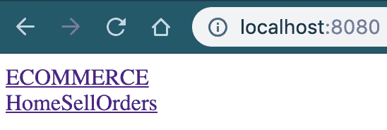
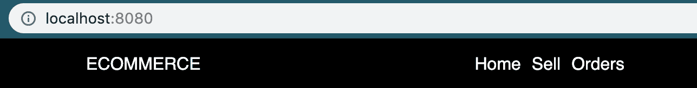
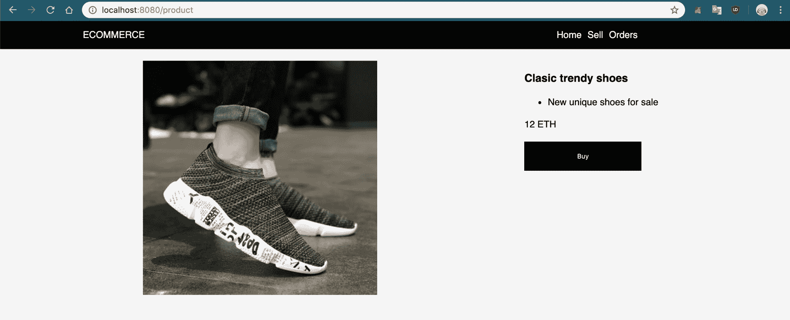
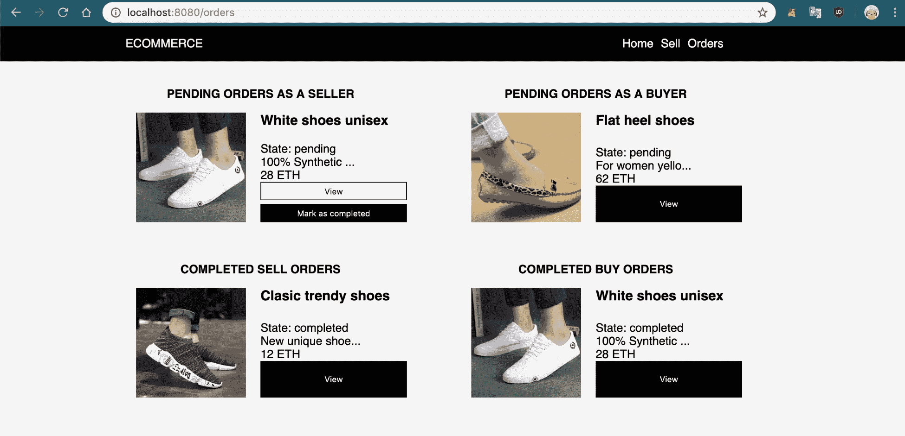
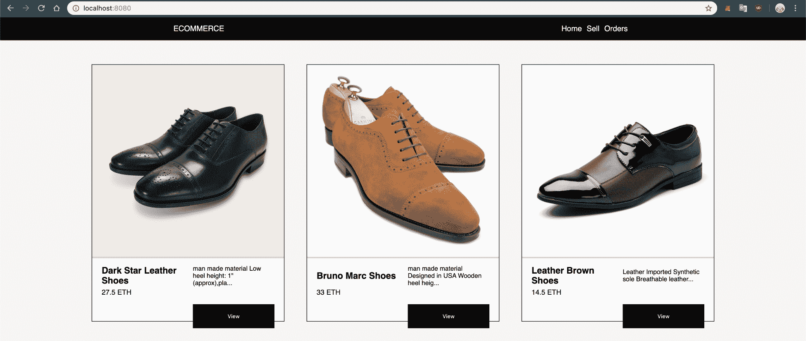

# 创建基于区块链的电子商务市场

区块链技术最佳应用案例之一是分散的电子商务市场，原因很简单，你不必支付费用，也不必把数据委托给那些会为了利润出售数据的强大企业。Ethereum 为此提供了一个出色的解决方案，新的 ERC-721 代币标准已经为您在区块链上生成数字化物体。在本章中，你将学习如何处理个人用户数据，以便为每个个体保护数据，鉴于 Ethereum 是一个公共系统。

在第一部分中，我们将研究电子商务网站应该如何构建，使用户可以像在真实商店一样与之互动。你将构建用户界面，用于显示使用 ERC-721 约定标识的独特产品。然后，你将实现 React 路由器模块，以在用户友好的界面中组织不同的视图。最后，你将创建实施 ERC-721 代币并创建管理分散式产品所需功能的智能合约。

此外，在本章中，你将学习如何在 Ethereum 上为您的企业创建一个完整的电子商务市场，学习以下主题：

+   创建用户界面

+   理解 ERC-721 代币

+   开发电子商务智能合约

+   完成 dApp

# 创建用户界面

这类指南的最大优点是，你可以将在这里学到的关于分散电子商务的知识应用到扩展这些想法上，创造一个更高级的产品，提供一个复杂的解决方案以募集资金，或者简单地以此来建立一个业务。

# 计划市场界面

该市场几乎拥有无限的选择，因为你不必面对许多区块链的限制。每个产品都是一个独立的实例，可以根据需要进行修改，因此你可以自由添加尽可能多的功能，比如以下功能：

+   将产品加入购物车的购物系统，从而实现较大的综合采购，而不是直接购买

+   动态的发货地址功能，以添加多个不同的地址，以便您可以通过保存您的首选位置快速向多个地点发送订单

+   创建用于用户产品拍卖的竞标系统

+   为更好的用户互动而创建的个人资料和评价功能

在这个项目中，我们不会实现任何那些高级功能，因为它们会花费太多时间来开发，尽管你可以在基本产品完成后自己添加它们。这就是为什么我们将创建一个具有以下功能的简单接口：

+   通过 Ethereum 直接购买实物和数字产品的购买系统

+   作为独立卖家，在市场上发布产品的销售功能

+   作为买家和卖家查看待处理订单的订单展示功能

通常情况下，用户将能够像使用信用卡一样作为普通在线商店与 MetaMask 进行直接付款交互。与像亚马逊这样收取约 15%总付款费用的电子商务商店相比，该市场不会向用户收取费用，这真的很费钱。另一个重要的点是，不会有任何审查或需要遵循的规则，这意味着用户可以自由发布产品，而不必担心被来自中心化实体的禁令所影响，这是一个经常发生的问题，导致卖家损失了数千美元的锁定资金和撤销的订单。

不会有多个数量的单个产品，因为我们将使用独特的**不可替代令牌**（**NFT**），这意味着每个产品都必须是唯一的。由于我们将从一个用户向另一个用户交换令牌，所以我们将无法拥有同一产品的多个副本。然而，你可以实现一个 ERC-20 代币或一个系统，用于为同一产品的多个数量生成相同的令牌 ID 的多个副本。

让我们首先通过克隆基础存储库（[`github.com/merlox/dapp`](https://github.com/merlox/dapp)）或自行配置`npm`和 Truffle 来设置项目。在设置 Truffle 或克隆存储库后，你应该有以下文件夹和初始文件：

+   `contracts/`

+   `dist/`

+   `migrations/`

+   `node_modules/`（在克隆存储库后记得使用`npm install`）

+   `src/`

    +   `index.js`

    +   `index.html`或`index.ejs`，根据你的喜好

    +   `index.css`或`index.styl`，根据你的喜好

+   `.babelrc`

+   `.gitignore`

+   `LICENSE`

+   `package.json`

+   `README.md`

+   `truffle-config.js`

+   `webpack.config.js`（记得设置好你的 webpack 配置）

在你的`src/`文件夹内，创建一个名为`components/`的新文件夹，其中将包含每个 JavaScript 组件的文件，因为这是一个较大的 dApp，我们将有许多不同的组件。因为我们将有多个页面，我们希望使用 React 路由器来管理历史位置和 URL，以便用户可以在页面之间进行导航。通过在终端上运行以下命令来安装 React 路由器和`web3`库：

```
npm i -S web3 react-router-dom
```

# 设置索引页面

打开你的`index.js`文件，导入所需的库，并使用一些虚拟数据设置初始状态，以查看最终设计的外观。我们通过以下步骤来实现这一点：

1.  导入所需的库。我们需要来自`react-router`库的几个组件，如下所示的代码：

```
import React from 'react'
import ReactDOM from 'react-dom'
import MyWeb3 from 'web3'
import { BrowserRouter, Route, withRouter } from 'react-router-dom'
```

1.  创建构造函数，并添加一些具有必要属性的产品，以尽可能多地向用户显示信息，如下所示的代码。标题、描述、ID 和价格等属性是必须的：

```
class Main extends React.Component {
    constructor(props) {
        super(props)

        this.state = {
            products: [{
                id: 1,
                title: 'Clasic trendy shoes',
                description: 'New unique shoes for sale',
                date: Date.now(),
                owner: '',
                price: 12,
                image: 'https://cdn.shopify.com/s/files/1/2494/8702/products/Bjakin-2018-Socks-Running-Shoes-for-Men-Lightweight-Sports-Sneakers-Colors-Man-Sock-Walking-Shoes-Big_17fa0d5b-d9d9-46a0-bdea-ac2dc17474ce_400x.jpg?v=1537755930'
            }
            productsHtml: [],
            productDetails: [],
            product: {},
        }
    }
```

1.  您可以通过复制 `product` 对象并更改一些参数使其看起来独特来添加更多产品。然后添加 `bytes32()` 函数将字符串转换为有效的十六进制以及 `render()` 函数，如下所示：

```
    bytes32(name) {
        return myWeb3.utils.fromAscii(name)
    }

    render() {
        return (
            <div>
                <Route path="/" exact render={() => (
                    <div>The dApp has been setup</div>
                )} /> 
            </div>
        )
    }
}
```

1.  使用 React 路由器提供的 `withRouter()` 函数为我们的 `Main` 组件提供历史属性，这对于在您的 dApp 中在页面之间导航是必要的。如下所示：

```
// To be able to access the history in order to redirect users programmatically when opening a product
Main = withRouter(Main)
```

1.  添加来自 React 路由器的 `BrowserRouter` 组件以初始化路由器对象，如下所示：

```
ReactDOM.render(
    <BrowserRouter>
        <Main />
    </BrowserRouter>,
document.querySelector('#root'))
```

`BrowserRouter` 组件是用于初始化路由器的主要组件，以便它们可以管理不同的页面。我们使用 `withRouter` 导入来访问导航历史，以便我们可以编程方式更改页面。基本上，我们需要它在我们的 dApp 中在特定时间重定向用户到不同页面。然后我们在 `this.state` 对象中设置一些基本产品与不同的属性。注意图片是一个 URL 而不是文件。由于我们没有处理文件的服务器，我们需要卖家在某种公共服务上托管自己的图片，比如 Imgur。

React 路由库将使用多个 `Route` 实例来确定在什么时间加载哪个页面。我们还必须在我们的 `Main` 组件顶部添加高级 `BrowserRouter` 组件来激活路由器。注意我们如何使用 `exact path="/"` 渲染单个路由，显示设置文本以确认应用程序配置成功加载后。

# 配置 webpack 开发服务器

创建 `Main` 组件后，您将想要运行应用程序以查看其外观，但在这种情况下，我们将使用 `webpack-dev-server` 扩展，该扩展会在我们开发时自动重新加载网站，以便我们不必不断手动重新加载它并在后端编译文件。因此，而不是设置 webpack 观察者和静态服务器，它全部包含在一个单独的命令中。使用以下命令在本地安装 webpack 服务器：

```
npm i -S webpack-dev-server
```

然后在 `package.json` 文件的 `scripts` 部分下更新新的脚本（如下所示）；否则，它将无法工作，因为我们需要从项目内部执行此命令：

```
{
  "name": "dapp",
  "version": "1.0.0",
  "description": "",
  "main": "truffle-config.js",
  "directories": {
    "test": "test"
  },
 "scripts": {
 "dev": "webpack-dev-server -d"
 }
}
```

这只是使用 `-d` 标志运行 `webpack-dev-server` 命令，该标志将模式设置为开发模式，允许您从未压缩的文件中看到完整的错误消息。如果愿意，可以添加 `-o` 标志，在运行命令时打开浏览器。通过运行以下命令行来执行它：

```
npm run dev
```

如果一切正确，您将能够访问 `localhost:8080` 并看到已设置路由器的页面。

# 创建头部组件

我们的应用程序将有几个页面用于买家、卖家和订单。这就是为什么尽可能将每个组件尽可能地分离成可以在需要时导入的唯一块的重要性，通过执行以下步骤来完成：

1.  在 `src/components/` 文件夹内创建一个新的组件，用于显示我们网站的标题，并创建一个名为 `Header.js` 的文件，放在你的 `components` 文件夹内，如下面的代码所示：

```
import React from 'react'
import { Link } from 'react-router-dom'

function Header() {
    return (
        <div className="header">
            <Link to="/">ECOMMERCE</Link>
            <div>
                <Link to="/">Home</Link>
                <Link to="/sell">Sell</Link>
                <Link to="/orders">Orders</Link>
            </div>
        </div>
    )
}

export default Header
```

1.  使用 `export default Header` 导出，以便其他文件可以访问你的组件。然后按照下面的代码将其导入到你的 `index.js` 页面中，以在导入的库下方显示它，以保持它们的顺序：

```
import React from 'react'
import ReactDOM from 'react-dom'
import MyWeb3 from 'web3'
import { BrowserRouter, Route, withRouter } from 'react-router-dom'
import Header from './components/Header'
```

1.  使用组件实例更新你的 `render()` 函数，如下面的代码所示：

```
render() {
    return (
        <div>
            <Route path="/" exact render={() => (
                <Header />
            )} />
        </div>
    )
}
```

你将看到你的标题会自动加载，无需刷新你的 webpack 服务，如下面的截图所示：



1.  目前看起来不太好，所以让我们用一些 `stylus` CSS 来改进设计。如果你还没有配置它，请使用以下命令安装 `stylus` 和 `stylus-loader` 库：

```
npm i -S stylus stylus-loader
```

1.  根据以下内容更新你的 `webpack` 配置：

```
require('babel-polyfill')
const webpack = require('webpack')
const html = require('html-webpack-plugin')
const path = require('path')

module.exports = {
    entry: ['babel-polyfill', './src/index.js'],
    output: {
        filename: 'bundle.js',
        path: path.join(__dirname, 'dist')
    },
    module: {
        rules: [
            {
                test: /\.js$/,
                exclude: /node_modules/,
                use: {
                    loader: 'babel-loader'
                }
            }, {
 test: /\.styl$/,
 exclude: /node_modules/,
 use: [
 {loader: 'style-loader'},
 {loader: 'css-loader'},
 {loader: 'stylus-loader'}
 ]
 }
        ]
    },
    plugins: [
        new webpack.HotModuleReplacementPlugin(),
        new html({
            title: "dApp project",
            template: './src/index.ejs',
            hash: true
        })
    ]
}
```

这里是我们在 `webpack` 文件中进行的主要更改：

+   我们导入 webpack，以便我们可以使用 `webpack.HotModuleReplacementPlugin()` 在进行更改时部分重新加载页面。而不是重新加载整个页面，只会重新加载更改的组件。

+   然后我们设置 stylus 加载器来加载 `styl` 文件。

1.  创建 `index.styl`，采用以下设计，尽管最终你的电子商务商店的外观是由你决定的：

```
productPadding = 20px

body
    background-color: whitesmoke
    font-family: sans-serif
    margin: 0

button
    border: none
    background-color: black
    color: white
    cursor: pointer
    padding: 10px
    width: 200px
    height: 50px

    &:hover
        opacity: 0.9

input, textarea
    padding: 20px
    border: 1px solid black

.header
    background-color: black
    color: white
    padding: 15px
    margin-bottom: 20px
    text-align: center
    display: flex
    justify-content: space-around

    a
        color: white
        text-decoration: none
        margin-right: 10px

        &:hover
            color: lightgrey
```

1.  注意顶部的 `productPadding` 变量。Stylus 允许我们创建变量，以便我们可以轻松地在样式文件中配置相同值的多个实例；我们稍后会使用该变量。然后像这样在你的 `index.js` 文件中导入 stylus 文件：

```
import './index.styl'
```

现在检查你的应用在浏览器中的外观；由于你更新了 webpack 配置，你可能需要重新加载你的 webpack 服务器：



# 创建主页组件

`Home` 组件将包含显示用户首次打开 dApp 时看到的第一个页面的逻辑，以便他们可以开始购买产品。该组件将是管理剩余页面的核心组件。

创建一个默认设计的 `Home` 组件，用于主页；它将包含一个干净设计的最新产品。以下是位于组件文件夹中的 `Home.js` 文件的代码：

```
import React from 'react'
import MyWeb3 from 'web3'
import Header from './Header'

class Home extends React.Component {
    constructor() { super() }
    render() {
        return (
            <div>
                <Header />
                <div className="products-container">{this.props.productsHtml}</div>
                <div className="spacer"></div>
            </div>
        )
    }
}

export default Home
```

你可以将其导入到你的 `index.js` 文件中，这将是主要的数据和功能来源。同时，从索引中删除 `Header` 的导入，因为它已经包含在 `Home` 组件中了。下面的步骤显示了你需要做的更改，以便将 `Home` 组件包含在你的 dApp 中：

1.  在文件开头导入组件，同时移除`Header`组件，因为我们已经在`Home`组件中包含了它：

```
import React from 'react'
import ReactDOM from 'react-dom'
import MyWeb3 from 'web3'
import { BrowserRouter, Route, withRouter } from 'react-router-dom'
import Home from './components/Home'
import './index.styl'
```

1.  为了简化事情，我创建了`Array`对象的原型 JavaScript 方法。这是一种可以用来改变某些函数工作方式的 JavaScript 方法的高级实现。特别地，我创建了一个异步的`for`循环，可以被`await`，以确保它在继续执行代码的其余部分之前完成，如下面的代码片段所示。基本上，这是一种干净的运行循环的方法：

```
Array.prototype.asyncForEach = function (callback) {
 return new Promise(resolve => {
 for(let i = 0; i < this.length; i++) {
 callback(this[i], i, this)
 }
 resolve()
 })
}
```

1.  在您的构造函数中，包括一个`setup()`函数调用，如下面的代码片段所示：

```
constructor(props) {
    super(props)
    // State object omitted for simplicity
    this.setup()
}
```

1.  使用以下代码片段展示的代码来实现`setup()`函数，并启动 web3 实例和显示产品：

```
async setup() {
    // Create the contract instance
    window.myWeb3 = new MyWeb3(ethereum)
    try {
        await ethereum.enable();
    } catch (error) {
        console.error('You must approve this dApp to interact with it')
    }
    const user = (await myWeb3.eth.getAccounts())[0]
    let products = []
    for(let i = 0; i < this.state.products.length; i++) {
        products[i] = this.state.products[i]
        products[i].owner = user
    }
    this.setState({products})
    this.displayProducts()
}
```

1.  我们添加了对`displayProducts()`函数的调用，这将用于通过循环遍历我们`state`对象中的产品数组来显示产品，如下面的代码片段所示：

```
async displayProducts() {
    let productsHtml = []
    await this.state.products.asyncForEach(product => {
        productsHtml.push((
            <div key={product.id} className="product">
                
                <div className="product-data">
                    <h3 className="product-title">{product.title}</h3>
                    <div className="product-description">{product.description.substring(0, 50) + '...'}</div>
                    <div className="product-price">{product.price} ETH</div>
                    <button onClick={() => {
                        this.setState({product})
                        this.redirectTo('/product')
                    }} className="product-view" type="button">View</button>
                </div>
            </div>
        ))
    })
    this.setState({productsHtml})
}
```

1.  修改`render()`函数，并包括一个名为`redirectTo()`的函数，当用户使用 React 路由器点击按钮时，将允许您更改页面，如下面的代码片段所示：

```
    redirectTo(location) {
 this.props.history.push({
 pathname: location
 })
 }

    render() {
        return (
            <div>
                <Route path="/" exact render={() => (
 <Home
 productsHtml={this.state.productsHtml}
 />
                )} />
            </div>
        )
    }
}
```

我们对此索引文件进行了以下重要的添加：

+   首先，我们为`Array`对象设置了一个自定义的原型函数，名为`asyncForEach`。你可能对 JavaScript 的深层原理不熟悉，但你必须了解所有类型的变量都是带有名为`prototype`的属性的对象，该属性包含该变量类型的方法。默认的`forEach`方法在 JavaScript 的某个地方被定义为`Array.prototype.forEach = function() {...}`；这样做的目的是创建一个自定义的`for`循环，我们可以在这里使用`await`，以充分利用`async`函数。因此，我们可以用`await array.asyncForEach()`来代替`for(let i = 0; i < array.length; i++) {}`，这样更容易阅读，且减少了混乱的代码。这只是我想要用来提高代码可读性和增加可用性的一种实现。

+   然后我们导入了`Home`组件而不是`Header`组件，并在`Route`的`render()`函数内替换了它。

+   `redirectTo`函数通过使用我们之前看到的`withRouter`历史对象加载新页面来更改我们当前所见的`Route`。当用户点击`displayProducts`函数内的`View`按钮时，将使用此函数。

+   在此之后，我们添加了一个`setup`函数，该函数配置 MetaMask 并将所有这些示例产品的所有者地址添加到其中，这样你就可以看到谁拥有这些物品。

+   最后，我们创建了一个名为`displayProducts()`的函数，用于为每个产品生成 HTML，并将其推入产品数组并更新状态。`Home`组件然后将这些产品作为`prop`接收，并显示每个产品。

现在我们可以添加一些 CSS 代码来改善主页的外观，如下所示：

```
.products-container
    display: grid
    width: 80%
    margin: auto
    grid-template-columns: 1fr 1fr 1fr
    justify-items: center
    margin-top: 50px

    .product
        width: 400px
        border: 1px solid black

        .product-image
            width: 100%
            grid-column: 1 / 3
            box-shadow: 0 3px 0px 0 lightgrey

        .product-data
            display: grid
            grid-template-columns: 1fr 1fr
            grid-template-rows: 50px 20px 40px
            align-items: center
            padding: 10px productPadding
            grid-column-gap: productPadding
            background-color: white

            .product-description
                font-size: 10pt

            .product-price
                font-size: 11pt

            .product-view
                width: 200px
                grid-column: 2 / 3
                margin-top: 50px
                height: 50px

.spacer
    height: 200px
    width: 100%
```

现在网页的外观如下所示：


正如您所见，我们正在快速进展！对于这些类型的复杂应用程序，初始设置需要一些时间，但之后它是一件很棒的事情，因为您可以轻松更新每个单独的部分，同时为未来的改进保证了良好的可维护性因素。电子商务商店的主题与许多鞋店相似：它使用扁平设计和黑色调，同时也弹出一个元素，如按钮，以赋予它三维感。它让我想起了时尚杂志。

# 创建产品组件

现在我们有了一个基本的设计，当用户点击“查看”按钮时，我们可以创建产品页面，以便用户可以详细了解有关特定产品的更多信息。用户将能够在产品页面内购买产品。让我们按照以下步骤进行：

1.  在您的组件内添加一个新的 `Product.js` 文件，并使用以下代码，尽管我总是建议您在查看解决方案之前自己尝试：

```
import React from 'react'
import Header from './Header'

class Product extends React.Component {
    constructor() { super() }
    render() {
        return (
            <div>
                <Header />
                <div className="product-details">
                    
                    <div className="product-data">
                        <h3 className="product-title">{this.props.product.title}</h3>
                        <ul className="product-description">
                            {this.props.product.description.split('\n').map((line, index) => (
                                <li key={index}>{line}</li>
                            ))}
                        </ul>
                        <div className="product-data-container">
                            <div className="product-price">{this.props.product.price} ETH</div>
                            <div className="product-quantity">{this.props.product.quantity} units available</div>
                        </div>
                        <button onClick={() => {
                            this.props.redirectTo('/buy')
                        }} className="product-buy" type="button">Buy</button>
                    </div>
                </div>
            </div>
        )
    }
}

export default Product
```

1.  我们需要一个新的页眉，因为当我们更改页面时，将加载一个新的组件（在本例中是 `Product` 组件），所以我们需要仅向 `Product` 组件显示必要的信息。然后，我们可以将其导入到索引文件中的新 `Route` 中，如下面的代码所示：

```
import React from 'react'
import ReactDOM from 'react-dom'
import MyWeb3 from 'web3'
import { BrowserRouter, Route, withRouter } from 'react-router-dom'
import Home from './components/Home'
import Product from './components/Product'
import './index.styl'

class Main extends React.Component {
    // Omitted previous code to keep the demonstration short 

    render() {
        return (
            <div>
                <Route path="/" exact render={() => (
                    <Home
                        productsHtml={this.state.productsHtml}
                    />
                )} />
 <Route path="/product" render={() => (
 <Product
 product={this.state.product}
 />
                )} />
            </div>
        )
    }
}
```

1.  当您单击“查看”按钮时，应该能够访问自定义产品页面，假设我们已设置所需的历史功能。当用户单击“查看”按钮时，`Product` 组件的 `product` 属性也会设置。添加以下 CSS 代码以修复产品页面的设计：

```
.product-details
    display: grid
    width: 70%
    margin: auto
    grid-template-columns: 70% 30%
    grid-template-rows: 1fr
    margin-bottom: 50px
    grid-column-gap: 40px

    .product-image
        grid-column: 1 / 2
        justify-self: center

    .product-title, .product-description, .product-price, .product-buy
        grid-column: 2 / 3

    .product-description
        white-space: pre-wrap
        line-height: 20pt

    .product-data-container
        display: flex
        justify-content: space-between
        margin-bottom: 20px
```

1.  您可以打开您的 dApp，点击产品的“查看”按钮，查看详细的产品页面，其中显示更大的图片和完整的描述，如下面的截图所示：



剩下的是添加购买、销售和订单页面。以下是我们如何使用 `Buy` 组件的方法，当用户单击位于产品页面中的“购买”按钮时，它将被显示：

1.  导入所需的库，使用以下代码：

```
import React, { Component } from 'react'
import Header from './Header'
```

1.  在 `Buy` 组件内定义构造函数，其中状态变量为空，这样您就知道整个组件中将使用哪些变量，您可以使用以下代码完成此操作：

```
class Buy extends Component {
    constructor() {
        super()
        this.state = {
            nameSurname: '',
            lineOneDirection: '',
            lineTwoDirection: '',
            city: '',
            stateRegion: '',
            postalCode: '',
            country: '',
            phone: '',
        }
    }
```

1.  `render` 页面函数将显示一些基本的产品信息，以通知买家他们将获得什么，如下所示的代码：

```
    render() {
        return (
            <div>
                <Header />
                <div className="product-buy-page">
                    <h3 className="title">Product details</h3>
                    
                    <div className="product-data">
                        <p className="product-title">{this.props.product.title}</p>
                        <div className="product-price">{this.props.product.price} ETH</div>
                    </div>
                </div>
```

1.  包含一个区块，用于用户输入其地址以便可以免费获得产品的运输信息，如下面的代码所示：

```
                <div className="shipping-buy-page">
                    <h3>Shipping</h3>
                    <input onChange={e => {
                        this.setState({nameSurname: e.target.value})
                    }} placeholder="Name and surname..." type="text" />
                    <input onChange={e => {
                        this.setState({lineOneDirection: e.target.value})
                    }} placeholder="Line 1 direction..." type="text" />
                    <input onChange={e => {
                        this.setState({lineTwoDirection: e.target.value})
                    }} placeholder="Line 2 direction..." type="text" />
                    <input onChange={e => {
                        this.setState({city: e.target.value})
                    }} placeholder="City..." type="text" />
                    <input onChange={e => {
                        this.setState({stateRegion: e.target.value})
                    }} placeholder="State or region..." type="text" />
                    <input onChange={e => {
                        this.setState({postalCode: e.target.value})
                    }} placeholder="Postal code..." type="number" />
                    <input onChange={e => {
                        this.setState({country: e.target.value})
                    }} placeholder="Country..." type="text" />
                    <input onChange={e => {
                        this.setState({phone: e.target.value})
                    }} placeholder="Phone..." type="number" />
                    <button>Buy now to this address</button>
                </div>
            </div>
```

1.  导出组件，以便可以将其导入到您的路由管理器中，如下面的代码所示：

```
export default Buy
```

我们只需要显示一个带有用户地址参数的表单，因为这是我们唯一需要的信息。我们可以假设运费都是免费的，已包含在价格中。我们将更新此`Buy`组件的状态以包含详细信息，以便稍后将这些数据提交给智能合约。然后在索引文件的开头导入`Buy`组件。我已经为您突出显示了新的导入位置，以便您看到`Buy`组件应该位于何处，如下面的代码所示：

```
import React from 'react'
import ReactDOM from 'react-dom'
import MyWeb3 from 'web3'
import { BrowserRouter, Route, withRouter } from 'react-router-dom'
import Home from './components/Home'
import Product from './components/Product'
import Buy from './components/Buy'
import './index.styl'
```

然后在您的`render`函数中添加新的`Route`和`props`参数到刚刚导入的`Buy`组件中。更改已突出显示，以便您可以更快地找到它们，如下面的代码所示：

```
class Main extends React.Component {
    // Omitted the other functions to keep it short

    render() {
        return (
            <div>
                <Route path="/" exact render={() => (
                    <Home
                        productsHtml={this.state.productsHtml}
                    />
                )} />
                <Route path="/product" render={() => (
                    <Product
                        product={this.state.product}
                        redirectTo={location => this.redirectTo(location)}
                    />
                )} />
 <Route path="/buy" render={() => (
 <Buy
 product={this.state.product}
 />
 )} />
            </div>
        )
    }
}
```

我们只需要将`state.product`发送到此组件，以便我们可以看到正在购买的产品。添加一些 CSS 代码，通过执行以下步骤使其看起来好看：

1.  使用以下代码为`Buy`组件的产品部分添加 CSS 代码：

```
.product-buy-page
    display: grid
    margin: auto
    width: 50%
    padding: 20px
    padding-top: 0
    grid-template-columns: 50% 50%
    grid-template-rows: auto 1fr
    margin-bottom: 50px
    grid-column-gap: 40px
    border: 1px solid black
    background-color: white

    .title
        grid-column: 1 / 3
        justify-self: center

    .product-image
        grid-column: 1 / 2
        height: 150px
        justify-self: end

    .product-title
        margin-bottom: 25px

    .product-price
        font-size: 15pt
        font-weight: bold
```

1.  添加`Buy`组件的运输表单的 CSS 代码，如下面的代码所示：

```
.shipping-buy-page
    display: grid
    flex-direction: column
    justify-items: center
    width: 50%
    margin: auto
    margin-bottom: 200px

    input
        margin-bottom: 10px
        width: 100%
```

# 创建`Sell`组件

我们正在构建一个分散式市场，全世界的用户都可以通过发布自己的产品免费加入。不会收取任何费用，并且购买将以加密货币完成。因此，我们需要一个专门为这些卖家的页面，我们将通过以下步骤创建一个`Sell`组件：

1.  导入必要的库以创建 React 组件，并包含`Header：`

```
import React from 'react'
import Header from './Header'
```

1.  创建具有空构造函数的`Sell`类，其中包含用户将出售的产品的`title`、`description`、`image`和`price`的`state`对象，如下面的代码所示：

```
class Sell extends React.Component {
    constructor() {
        super()
        this.state = {
            title: '',
            description: '',
            price: '',
            image: '',
        }
    }
}
```

1.  创建具有整洁形式的`render()`函数，允许用户访问公共产品，如下面的代码所示。请注意，图像是一个字符串，因为我们将使用外部 URL 来提供图像，而不是自己托管文件：

```
render() {
    return (
        <div>
            <Header />
            <div className="sell-page">
                <h3>Sell product</h3>
                <input onChange={event => {
                    this.setState({title: event.target.value})
                }} type="text" placeholder="Product title..." />
                <textarea placeholder="Product description..." onChange={event => {
                    this.setState({description: event.target.value})
                }}></textarea>
                <input onChange={event => {
                    this.setState({price: event.target.value})
                }} type="text" placeholder="Product price in ETH..." />
                <input onChange={event => {
                    this.setState({image: event.target.value})
                }} type="text" placeholder="Product image URL..." />
                <p>Note that shipping costs are considered free so add the shipping price to the cost of the product itself</p>
                <button onClick={() => {
                    this.props.publishProduct(this.state)
                }} type="button">Publish product</button>
            </div>
        </div>
    )
}
```

1.  使用以下代码导出此新组件，以便其他文件可以导入它：

```
export default Sell
```

在保存`Sell`组件之后，将其导入到您的索引 JavaScript 文件中。我们将添加一个名为`publishProduct`的函数，它将调用相应的智能合约函数。

下面的步骤显示了需要对索引文件进行的更改（以提高清晰度），以便导入此`Sell`组件：

1.  在`Buy`组件导入下面直接导入`Sell`组件，如下面的代码所示：

```
import React from 'react'
import ReactDOM from 'react-dom'
import MyWeb3 from 'web3'
import { BrowserRouter, Route, withRouter } from 'react-router-dom'
import Home from './components/Home'
import Product from './components/Product'
import Buy from './components/Buy'
import Sell from './components/Sell'
import './index.styl'
```

1.  在`render()`函数中包含`Sell`组件及其自己的`route`对象，同时定义一个`publishProduct()`函数，如下所示的函数：

```
class Main extends React.Component {
    // Omitted the other functions to keep it short

 async publishProduct(data) {}

    render() {
        return (
            <div>
                <Route path="/" exact render={() => (
                    <Home
                        productsHtml={this.state.productsHtml}
                    />
                )} />
                <Route path="/product" render={() => (
                    <Product
                        product={this.state.product}
                        redirectTo={location => this.redirectTo(location)}
                    />
                )} />
                <Route path="/buy" render={() => (
                    <Buy
                        product={this.state.product}
                    />
                )} /> <Route path="/sell" render={() => (
                    <Sell
                        publishProduct={data => this.publishProduct(data)}
                    />
                )} />
            </div>
        )
    }
}
```

1.  添加一些 CSS 代码以改善此页面的设计，如下所示的函数：

```
.sell-page
    display: grid
    flex-direction: column
    justify-items: center
    width: 50%
    margin: auto
    margin-bottom: 200px

    input, textarea
        width: 100%
        margin-bottom: 10px
```

您可以通过单击页眉中的`Sell`按钮来查看其外观，该按钮将重定向到`/sell`URL，加载`Sell`组件。

# 创建订单组件

通过以下步骤添加最终的`Orders.js`组件。在看解决方案之前，试着自己做一下，以便你练习一下使用一些`stylus` CSS 完成设计的技能。你会发现这比预期的时间要长，但是一切都是值得的：

1.  导入所需的库，如下代码所示：

```
import React, { Component } from 'react'
import Header from './Header'
```

1.  定义构造函数并添加一些虚构的订单，以便你可以看到它的外观，如下代码所示：

```
class Orders extends Component {
    constructor() {
        super()

        // We'll separate the completed vs the pending based on the order state
        this.state = {
            sellOrders: [{
                id: 1,
                title: 'Classic trendy shoes',
                description: 'New unique shoes for sale',
                date: Date.now(),
                owner: '',
                price: 12,
                image: 'https://cdn.shopify.com/s/files/1/2494/8702/products/Bjakin-2018-Socks-Running-Shoes-for-Men-Lightweight-Sports-Sneakers-Colors-Man-Sock-Walking-Shoes-Big_17fa0d5b-d9d9-46a0-bdea-ac2dc17474ce_400x.jpg?v=1537755930',
                purchasedAt: Date.now(),
                state: 'completed',
            }],
            pendingSellOrdersHtml: [],
            pendingBuyOrdersHtml: [],
            completedSellOrdersHtml: [],
            completedBuyOrdersHtml: [],
        }

        this.displayOrders()
    }
```

1.  我们需要一个函数来通过从智能合约获取数据来获取用户的订单，同时标记订单为已完成。我们暂时不会实现这些函数，因为我们首先必须创建智能合约，如下代码所示：

```
    async getUserOrders() {}

    async markAsCompleted(product) {}
```

1.  添加这些空函数，然后创建一个名为`displayOrders()`的函数，它将使用状态数据来输出生成的 HTML。首先定义内部使用的数组，如下代码所示：

```
async displayOrders() {
    let pendingSellOrdersHtml = []
    let pendingBuyOrdersHtml = []
    let completedSellOrdersHtml = []
    let completedBuyOrdersHtml = []
}
```

1.  阅读不同顺序的对象以循环遍历它们，并生成结果有效的 JSX。根据产品状态分类产品，如下代码所示：

```
await this.state.sellOrders.asyncForEach(product => {
    if(product.state == 'pending') {
        pendingSellOrdersHtml.push(
            <div key={product.id} className="product">
                
                <div className="product-data">
                    <h3 className="small-product-title">{product.title}</h3>
                    <div className="product-state">State: {product.state}</div>
                    <div className="product-description">{product.description.substring(0, 15) + '...'}</div>
                    <div className="product-price">{product.price} ETH</div>
                    <button className="small-view-button" onClick={() => {
                        this.props.setState({product})
                        this.props.redirectTo('/product')
                    }} type="button">View</button>
                    <button className="small-completed-button" onClick={() => {
                        this.markAsCompleted(product)
                    }} type="button">Mark as completed</button>
                </div>
            </div>
        )
```

1.  如果卖单的状态是已完成，将其推入`completedSellOrders`数组中，因为我们想要根据它们的状态分类订单，如下代码所示。创建一个新的 HTML 块，因为它会略有不同，因为我们想要使用一个按钮来标记产品为已完成：

```
} else {
        completedSellOrdersHtml.push(
            <div key={product.id} className="product">
                
                <div className="product-data">
                    <h3 className="product-title">{product.title}</h3>
                    <div className="product-state">State: {product.state}</div>
                    <div className="product-description">{product.description.substring(0, 15) + '...'}</div>
                    <div className="product-price">{product.price} ETH</div>
                    <button onClick={() => {
                        this.props.setState({product})
                        this.props.redirectTo('/product')
                    }} className="product-view" type="button">View</button>
                </div>
            </div>
        )
    }
})
```

1.  使用相同的过程来设计`buyOrders`数组的 HTML，以循环遍历数组，如下代码所示：

```
await this.state.buyOrders.asyncForEach(product => {
    let html = (
        <div key={product.id} className="product">
            
            <div className="product-data">
                <h3 className="product-title">{product.title}</h3>
                <div className="product-state">State: {product.state}</div>
                <div className="product-description">{product.description.substring(0, 15) + '...'}</div>
                <div className="product-price">{product.price} ETH</div>
                <button onClick={() => {
                    this.props.setState({product})
                    this.props.redirectTo('/product')
                }} className="product-view" type="button">View</button>
            </div>
        </div>
    )

    if(product.state == 'pending') pendingBuyOrdersHtml.push(html)
    else completedBuyOrdersHtml.push(html)
})
```

1.  使用生成的 HTML 对象更新组件的状态，如下代码所示：

```
this.setState({pendingSellOrdersHtml, pendingBuyOrdersHtml, completedSellOrdersHtml, completedBuyOrdersHtml})
```

1.  创建`render()`函数来展示这些生成的订单，如下代码所示：

```
    render() {
        return (
            <div>
                <Header />
                <div className="orders-page">
                    <div>
                        <h3 className="order-title">PENDING ORDERS AS A SELLER</h3>
                        {this.state.pendingSellOrdersHtml}
                    </div>
                    <div>
                        <h3 className="order-title">PENDING ORDERS AS A BUYER</h3>
                        {this.state.pendingBuyOrdersHtml}
                    </div>
                    <div>
                        <h3 className="order-title">COMPLETED SELL ORDERS</h3>
                        {this.state.completedSellOrdersHtml}
                    </div>
                    <div>
                        <h3 className="order-title">COMPLETED BUY ORDERS</h3>
                        {this.state.completedBuyOrdersHtml}
                    </div>
                </div>
            </div>
        )
    }
}
```

1.  导出`Orders`组件对象，如下代码所示：

```
export default Orders
```

这是一个很长的代码，因为我们在状态对象中添加了一些样本订单数据，以显示订单页面的真实视图。你可以看到我们为每个产品添加了一个`state`属性，它显示了订单是待定还是已完成。这将在智能合约中设置。`displayOrders`函数生成每种类型订单的 HTML 对象，因为我们想要分离已完成和待定以及买入和卖出的订单，以便你可以看到所有重要信息。当实现智能合约时，订单将来自`getUserOrders`函数。添加一些 CSS 使其看起来不错。你可以在官方 GitHub 上检查到我的设计，网址为[`github.com/merlox/ecommerce-dapp`](https://github.com/merlox/ecommerce-dapp)，在`src/`文件夹内。

最后，你将会得到一个很酷的订单页面，如下截图所示：



关于 React 中的用户界面就是这样了！只是为了确保，一旦所有组件创建完成，你应该在`src/`文件夹里有以下文件：

+   `components/`

    +   `Buy.js`

    +   `Header.js`

    +   `Sell.js`

    +   `Product.js`

    +   `Home.js`

    +   `Orders.js`

+   `index.ejs`

+   `index.js`

+   `index.styl`

# 理解 ERC-721 代币

这种新类型的代币用于在我们的智能合约中生成独特的产品。ERC-721 标准已被官方以太坊团队批准，这意味着您可以将其用于各种应用程序，而且知道它将与依赖于此标准的工具和智能合约兼容。就像 ERC-20 代币催生了去中心化代币交易所一样，我们可以预期会创建去中心化 ERC-721 交易所和数字以及实物产品市场。

# 解释 ERC-721 函数

要理解 ERC-721 代币的工作原理，最好查看定义 ERC-721 代币的函数，这样你就可以理解它们的内部工作方式。以下是描述这些函数的列表：

+   `balanceOf(owner)`: 返回给定地址所有代币数量的计数，该地址用户拥有的代币。

+   `ownerOf(tokenId)`: 返回拥有特定代币 ID 的地址。

+   `safeTransferFrom(from, to, tokenId, data)`: 给定授权后，将代币从一个地址发送到另一个地址，就像这个短语对 ERC-20 代币所做的那样。它被称为安全，因为如果接收方是一个合约，它会检查合约是否能够接收 ERC-721 代币，这意味着接收合约已实现了`onERC721Received`函数，这样你就不会把代币丢失给不能管理这些类型代币的合约。`data`参数可以省略，它只是包含您可能想要发送到`to`接收方地址的额外字节信息。`from`地址必须是当前所有者，所以您可以将此函数用作普通的`transfer`函数或`transferFrom`函数（您可能熟悉使用 ERC-20 代币）来批准向另一个地址发送代币。

+   `transferFrom(from, to, tokenId)`: 这与前一个函数相同，但它不确保接收地址能够管理这些类型的代币，如果它是一个智能合约的话。

+   `approve(to, tokenId)`: 用于向另一个所有者批准特定代币，以便他们可以随意使用它。

+   `setApprovalForAll(operator, approved)`: 这是为另一个地址，即`operator`地址，创建您所有代币的授权，以便其管理您的整个余额。您可以通过将`approved`参数设置为`false`来撤销对特定操作员的访问权限。

+   `getApproved(tokenId)`: 返回具有此代币授权的地址。

+   `isApprovedForAll(owner, operator)`: 如果`operator`可以访问所有所有者的代币，则返回`true`。

注意他们从 ERC-20 规范中删除了我们熟悉的`transfer`函数，因为它通过允许使用`transferFrom`和`safeTransferFrom`函数作为普通转账或已批准的转账来简化了流程，从而省去了标准`transfer`函数的需要。

`_mint(owner, tokenId)` 和 `_burn(tokenId)` 内部函数用于生成和删除代币；然而，它们在标准的 `ERC721.sol` 智能合约中不可用，因为它们是内部函数，这意味着你需要创建一个新合约，继承该 ERC-721 合约并实现自定义的 `mint(owner, tokenId)` 和 `burn(tokenId)` 函数（去掉下划线），根据需要进行任何修改，因为我们希望限制谁能创建或删除代币。

你能想象每个人都能随心所欲地生成代币吗？那将违背拥有有价值代币的目的，所以他们强迫你使用有限访问权限创建自己的铸造函数，可能还带有 `onlyOwner` 修饰符。在我们的案例中，我们将允许卖家为其产品铸造新类型的 ERC-721 代币。

我们去中心化电子商务商店中的每个产品将代表一个唯一的 ERC-721 代币；这就是为什么我们不想为每个产品添加多个数量，因为我们将不得不创建几个唯一的 ERC-721 实例。另外，NFT 意味着每个代币在其不同的属性上都是独一无二的。与 ERC-20 相比，其中每个代币都是相同的，ERC-721 标准旨在用于唯一物品，如家庭产品、手工制品、艺术品或独特的数字资产，如游戏中的皮肤。有趣的是，你可以根据需要组合这两种标准以创建独特的代币，同时还能够生成相同的多个实例。

# ERC-721 智能合约

现在你已经了解了这些类型的 NFT 如何工作，让我们来看一下 ERC-721 合约接口。实现可在 GitHub 上找到 [`github.com/merlox/ecommerce-dapp/blob/master/contracts/ERC721.sol`](https://github.com/merlox/ecommerce-dapp/blob/master/contracts/ERC721.sol)，因为完整的代码太长无法在此显示：

```
pragma solidity ⁰.5.0;

contract IERC721{
    event Transfer(address indexed from, address indexed to, uint256 indexed tokenId);
    event Approval(address indexed owner, address indexed approved, uint256 indexed tokenId);
    event ApprovalForAll(address indexed owner, address indexed operator, bool approved);
    function balanceOf(address owner) public view returns (uint256 balance);
    function ownerOf(uint256 tokenId) public view returns (address owner);
    function approve(address to, uint256 tokenId) public;
    function getApproved(uint256 tokenId) public view returns (address operator);
    function setApprovalForAll(address operator, bool _approved) public;
    function isApprovedForAll(address owner, address operator) public view returns (bool);
    function transferFrom(address from, address to, uint256 tokenId) public;
    function safeTransferFrom(address from, address to, uint256 tokenId) public;
    function safeTransferFrom(address from, address to, uint256 tokenId, bytes memory data) public;
}
```

这个合约与 ERC-20 合约非常相似，因为它们背后的基本思想是相同的。该合约用于生成许多具有独特的代币，其挖矿功能必须单独实现，因为你想控制谁能够创建代币，谁能够销毁它们。

在你的 `contracts/` 文件夹中创建名为 `ERC721.sol` 的文件，并添加以下代码，我们马上就会用到它。我们将创建一个合约，该合约继承 ERC-721 智能合约以实现 `mint()` 函数，因为默认的 ERC-721 实现不可访问。在那里创建一个名为 `Ecommerce.sol` 的新文件，并使用以下代码导入 `ERC721.sol` 合约：

```
pragma solidity ⁰.5.0;

import './ERC721.sol';
```

Solidity 版本并不重要，只要功能相同即可。创建一个自定义实现你自己的 ERC-721 智能合约，继承这个合约，如下所示：

```
pragma solidity ⁰.5.0;

import './ERC721.sol';

/// @notice The Ecommerce Token that implements the ERC721 token with mint function
/// @author Merunas Grincalaitis <merunasgrincalaitis@gmail.com>
contract EcommerceToken is ERC721 {
 address public ecommerce;
 bool public isEcommerceSet = false;
    /// @notice To generate a new token for the specified address
    /// @param _to The receiver of this new token
    /// @param _tokenId The new token id, must be unique
 function mint(address _to, uint256 _tokenId) public {
 require(msg.sender == ecommerce, 'Only the ecommerce contract can mint new tokens');
 _mint(_to, _tokenId);
 }

    /// @notice To set the ecommerce smart contract address
 function setEcommerce(address _ecommerce) public {
 require(!isEcommerceSet, 'The ecommerce address can only be set once');
 require(_ecommerce != address(0), 'The ecommerce address cannot be empty');
 isEcommerceSet = true;
 ecommerce = _ecommerce;
 }
}
```

此代币合约将仅允许电子商务合约生成新代币，在购买完成后将其转移到买家名下；在你能够铸造代币之前，必须设置 `setEcommerce` 函数。

# 开发电子商务智能合约

开发与 ERC-721 代币交互的智能合约很简单，因为我们只需确保用户的产品关联有一个代币 ID。如果用户希望这样做，他们将能够独立与他们的代币进行交互。对于我们的市场，我们将专注于创建购买和销售功能，以创建和销毁代币。像往常一样，我们还将创建多个 getter 从智能合约中提取数据供用户界面使用。

让我们开始创建电子商务合同，将所有市场逻辑放在同一个文件中，因为它不会占用太多空间：

1.  定义智能合约所需的变量，从您需要的结构开始，如下面的代码所示：

```
/// @notice The main ecommerce contract to buy and sell ERC-721 tokens representing physical or digital products because we are dealing with non-fungible tokens, there will be only 1 stock per product
/// @author Merunas Grincalaitis <merunasgrincalaitis@gmail.com>
contract Ecommerce {
    struct Product {
        uint256 id;
        string title;
        string description;
        uint256 date;
        address payable owner;
        uint256 price;
        string image;
    }
    struct Order {
        uint256 id;
        address buyer;
        string nameSurname;
        string lineOneDirection;
        string lineTwoDirection;
        bytes32 city;
        bytes32 stateRegion;
        uint256 postalCode;
        bytes32 country;
        uint256 phone;
        string state; // Either 'pending', 'completed'
    }
```

1.  添加映射、数组、变量和构造函数，如下面的代码所示：

```
    // Seller address => products
    mapping(address => Order[]) public pendingSellerOrders; // The products waiting to be fulfilled by the seller, used by sellers to check which orders have to be filled
    // Buyer address => products
    mapping(address => Order[]) public pendingBuyerOrders; // The products that the buyer purchased waiting to be sent
    mapping(address => Order[]) public completedOrders;
    // Product id => product
    mapping(uint256 => Product) public productById;
    // Product id => order
    mapping(uint256 => Order) public orderById;
    Product[] public products;
    uint256 public lastId;
    address public token;

    /// @notice To setup the address of the ERC-721 token to use for this contract
    /// @param _token The token address
    constructor(address _token) public {
        token = _token;
    }
}
```

我们必须首先设置变量，从结构开始，这种情况下是`Product`和`Order`。每个订单都将通过 ID 引用特定的产品，在这两种情况下 ID 将是相同的，这意味着每个产品将与具有相同 ID 的订单对应。将有映射用于尚未完成的待处理订单，并有其他映射用于已完成的订单，以便我们有已完成订单的参考。构造函数将接收令牌地址，以便电子商务合约可以创建新的代币。

# 创建发布功能

创建一个功能来发布新产品，以便用户可以通过以下代码自行出售产品。图像 URL 将是图像所在的位置：

```
/// @notice To publish a product as a seller
/// @param _title The title of the product
/// @param _description The description of the product
/// @param _price The price of the product in ETH
/// @param _image The image URL of the product
function publishProduct(string memory _title, string memory _description, uint256 _price, string memory _image) public {
    require(bytes(_title).length > 0, 'The title cannot be empty');
    require(bytes(_description).length > 0, 'The description cannot be empty');
    require(_price > 0, 'The price cannot be empty');
    require(bytes(_image).length > 0, 'The image cannot be empty');

    Product memory p = Product(lastId, _title, _description, now, msg.sender, _price, _image);
    products.push(p);
    productById[lastId] = p;
    EcommerceToken(token).mint(address(this), lastId); // Create a new token for this product which will be owned by this contract until sold
    lastId++;
}
```

此功能将检查参数，以便在设置参数的同时铸造新的代币。

# 创建购买功能

现在用户可以发布要出售的产品后，您可以开始编写`buy`功能来购买产品：

```
/// @notice To buy a new product, note that the seller must authorize this contract to manage the token
/// @param _id The id of the product to buy
/// @param _nameSurname The name and surname of the buyer
/// @param _lineOneDirection The first line for the user address
/// @param _lineTwoDirection The second, optional user address line
/// @param _city Buyer's city
/// @param _stateRegion The state or region where the buyer lives
/// @param _postalCode The postal code of his location
/// @param _country Buyer's country
/// @param _phone The optional phone number for the shipping company
function buyProduct(uint256 _id, string memory _nameSurname, string memory _lineOneDirection, string memory _lineTwoDirection, bytes32 _city, bytes32 _stateRegion, uint256 _postalCode, bytes32 _country, uint256 _phone) public payable {
    // The line 2 address and phone are optional, the rest are mandatory
    require(bytes(_nameSurname).length > 0, 'The name and surname must be set');
    require(bytes(_lineOneDirection).length > 0, 'The line one direction must be set');
    require(_city.length > 0, 'The city must be set');
    require(_stateRegion.length > 0, 'The state or region must be set');
    require(_postalCode > 0, 'The postal code must be set');
    require(_country > 0, 'The country must be set');

    Product memory p = productById[_id];
    require(bytes(p.title).length > 0, 'The product must exist to be purchased');
    Order memory newOrder = Order(_id, msg.sender, _nameSurname, _lineOneDirection, _lineTwoDirection, _city, _stateRegion, _postalCode, _country, _phone, 'pending');
    require(msg.value >= p.price, "The payment must be larger or equal than the products price");

    // Delete the product from the array of products
    for(uint256 i = 0; i < products.length; i++) {
        if(products[i].id == _id) {
            Product memory lastElement = products[products.length - 1];
            products[i] = lastElement;
            products.length--;
        }
    }

    // Return the excess ETH sent by the buyer
    if(msg.value > p.price) msg.sender.transfer(msg.value - p.price);
    pendingSellerOrders[p.owner].push(newOrder);
    pendingBuyerOrders[msg.sender].push(newOrder);
    orderById[_id] = newOrder;
    EcommerceToken(token).transferFrom(address(this), msg.sender, _id); // Transfer the product token to the new owner
    p.owner.transfer(p.price);
}
```

首先，`buy`功能必须是可支付的，以便用户可以用以太币发送所需的价格，这些价格将被发送给卖方，除了燃气成本之外没有任何费用。购买产品时，买方需要发送所有地址详细信息，以便卖方可以处理发货；这就是为什么`buy`功能中有这么多参数的原因，其中电话号码和第二地址行是可选的。`products`数组会删除产品，以便用户界面显示最新的产品。将创建一个新的`order`结构实例，并将订单添加到待处理映射中。

# 创建标记订单功能

创建订单后，我们需要一种方法告诉客户产品已经发货。我们可以通过一个名为`markOrderCompleted`的新功能来做到这一点，如下面的代码所示：

```
/// @notice To mark an order as completed
/// @param _id The id of the order which is the same for the product id
function markOrderCompleted(uint256 _id) public {
    Order memory order = orderById[_id];
    Product memory product = productById[_id];
    require(product.owner == msg.sender, 'Only the seller can mark the order as completed');
    order.state = 'completed';

    // Delete the seller order from the array of pending orders
    for(uint256 i = 0; i < pendingSellerOrders[product.owner].length; i++) {
        if(pendingSellerOrders[product.owner][i].id == _id) {
            Order memory lastElement = orderById[pendingSellerOrders[product.owner].length - 1];
            pendingSellerOrders[product.owner][i] = lastElement;
            pendingSellerOrders[product.owner].length--;
        }
    }
    // Delete the seller order from the array of pending orders
    for(uint256 i = 0; i < pendingBuyerOrders[order.buyer].length; i++) {
        if(pendingBuyerOrders[order.buyer][i].id == order.id) {
            Order memory lastElement = orderById[pendingBuyerOrders[order.buyer].length - 1];
            pendingBuyerOrders[order.buyer][i] = lastElement;
            pendingBuyerOrders[order.buyer].length--;
        }
    }
    completedOrders[order.buyer].push(order);
    orderById[_id] = order;
}
```

这个函数从各自的数组中移除了待处理订单，并将它们移到 `completedOrders` 映射中。我们不使用 `delete` 函数，而是减少数组的长度来删除 `Order`，因为 `delete` 函数实际上并不从数组中删除用户订单，而是留下一个空的订单实例。当我们将要 `delete` 的元素移动到数组的最后位置并减少其长度时，我们完全删除了它，而不会留下任何空洞，因为 `delete` 函数保持数组完整。

# 创建 getter 函数

剩下的就是添加所需的 `getter` 函数来返回这些数组的长度，因为公共数组变量不会公开数组长度，我们需要知道有多少产品和订单以向用户显示最新内容，让我们使用以下代码来设置：

```
/// @notice Returns the product length
/// @return uint256 The number of products
function getProductsLength() public view returns(uint256) {
    return products.length;
}

/// @notice To get the pending seller or buyer orders
/// @param _type If you want to get the pending seller, buyer or completed orders
/// @param _owner The owner of those orders
/// @return uint256 The number of orders to get
function getOrdersLength(bytes32 _type, address _owner) public view returns(uint256) {
    if(_type == 'seller') return pendingSellerOrders[_owner].length;
    else if(_type == 'buyer') return pendingBuyerOrders[_owner].length;
    else if(_type == 'completed') return completedOrders[_owner].length;
}
```

`getOrdersLength()` 函数将被用于卖家、买家或已完成的三种订单类型，以避免创建多个相似的函数。这就是整个合同。如果你想查看更新版本，请访问我的 GitHub：[`github.com/merlox/ecommerce-dapp`](https://github.com/merlox/ecommerce-dapp)。

# 部署智能合约

了解部署过程是很重要的，以确保成功执行，因为，让我们面对现实吧，Truffle 可能会让人感到困惑。在之前的章节中，你已经看到了使用这个框架部署智能合约需要做什么，但再过一遍这个过程也无妨，只是为了确保你理解了它。

首先，打开你的 `truffle-config.js` 文件，并修改它以使用 `ropsten`，这是我们将用于部署我们 dApp 的初始版本的网络。以下是它的样子，使用你自己的 INFURA 密钥：

```
const HDWalletProvider = require('truffle-hdwallet-provider');
const infuraKey = "v3/<YOUR-INFURA-KEY-HERE>;
const fs = require('fs');
const mnemonic = fs.readFileSync(".secret").toString().trim();

module.exports = {
  networks: {
    development: {
     host: "127.0.0.1", // Localhost (default: none)
     port: 8545, // Standard Ethereum port (default: none)
     network_id: "*", // Any network (default: none)
    },
    ropsten: {
      provider: () => new HDWalletProvider(mnemonic, `https://ropsten.infura.io/${infuraKey}`),
      network_id: 3, // Ropsten's id
      gas: 5500000, // Ropsten has a lower block limit than mainnet
      confirmations: 2, // # of confs to wait between deployments. (default: 0)
      timeoutBlocks: 200, // # of blocks before a deployment times out (minimum/default: 50)
      skipDryRun: true // Skip dry run before migrations? (default: false for public nets )
    }
  }
}
```

我保留了开发网络的可用性，因为在将合同部署到 `ropsten` 之前，你可能需要在使用 `ganache-cli` 生成的本地测试网络上检查部署过程。在这样做时，请确保你的 `.secret` 文件中的种子短语的第一个帐户中有足够的 `ropsten` 以太币。记得安装 Truffle 钱包，以使以下代码的部署过程正常工作：

```
npm i -S truffle-hdwallet-provider
```

然后，在你的 `migrations/` 文件夹中创建一个 `.secret` 文件，并创建一个名为 `2_deploy_contracts.js` 的文件，告诉 Truffle 在部署合同时需要做什么，主要是设置构造函数参数，如下面的代码所示。如果没有这个文件，Truffle 将无法部署：

```
const Token = artifacts.require("./EcommerceToken.sol")
const Ecommerce = artifacts.require("./Ecommerce.sol")
let token

module.exports = function(deployer, network, accounts) {
    deployer.deploy(
        Token,
        { gas: 8e6 }
    ).then(tokenInstance => {
        token = tokenInstance
        return deployer.deploy(Ecommerce, token.address, {
            gas: 8e6
        })
    }).then(async ecommerce => {
        await token.contract.methods.setEcommerce(ecommerce.address).send({
            from: accounts[0]
        })
        console.log('Is set?', await token.contract.methods.isEcommerceSet().call())
        console.log('Deployed both!')
    })
}
```

您的迁移文件夹应该有`1_initial_migrations.js`和`2_deploy_contracts.js`文件。语法有点混乱，但重要的是我们使用了`deployer.deploy()`函数，该函数返回一个 promise 来获取令牌地址，并从令牌合约运行`setEcommerce()`函数，以便我们可以立即开始使用合约。请注意，我们通过将第三个参数添加到主函数来访问`accounts`，这是运行`setEcommerce()`函数所必需的，第一个以太坊地址。最后，我通过调用令牌中的`isEcommerceSet()`公共变量来检查电子商务合约是否已正确设置。

运行以下部署命令：

```
truffle deploy --network ropsten --reset
```

如果您想要测试一切是否正常运行而无需等待`ropsten`，您可以通过运行以下命令快速在`ganache-cli`私有区块链上部署它：

```
truffle deploy --network development --reset
```

部署您的合约后，您会在`build/contract/Ecommerce.json`文件夹中找到地址和 ABI。

# 完成 dApp

要完成 dApp，我们必须修改 React 代码以集成智能合约更改，同时理解我们如何使用正确的方法从区块链接收信息并正确显示该数据的方式。在此之前，请确保您的合约已部署到`ropsten`，如前几个步骤所示。

# 设置合约实例

因为我们使用 webpack，所以我们可以从 React 文件中访问源文件夹中的所有文件，这意味着我们可以获取已部署的智能合约 ABI 和已部署的合约地址，以及创建合约实例所需的参数。这在以下代码中显示： 

```
import React from 'react'
import ReactDOM from 'react-dom'
import MyWeb3 from 'web3'
import { BrowserRouter, Route, withRouter } from 'react-router-dom'
import Home from './components/Home'
import Product from './components/Product'
import Sell from './components/Sell'
import Header from './components/Header'
import Buy from './components/Buy'
import Orders from './components/Orders'

import './index.styl'
import ABI from '../build/contracts/Ecommerce.json'
```

当您使用 Truffle 成功部署您的智能合约时，将创建`build`文件夹，其中包含我们可能需要的重要智能合约参数。修改您的设置函数以全局访问合约对象，使外部组件更容易。我已经在下面的代码中突出显示了合约实例，供您查找更改：

```
async setup() {
    // Create the contract instance
    window.myWeb3 = new MyWeb3(ethereum)
    try {
        await ethereum.enable();
    } catch (error) {
        console.error('You must approve this dApp to interact with it')
    }
 window.user = (await myWeb3.eth.getAccounts())[0]
 window.contract = new myWeb3.eth.Contract(ABI.abi, ABI.networks['3'].address, {
 from: user
 })
    await this.getLatestProducts(9)
    await this.displayProducts()
}
```

注意我们如何将`state`对象减少为几个元素，而没有任何虚拟数据，因为我们将使用真实的智能合约数据。合约实例是通过使用`abi`和合约地址创建的，这些信息也包含在构建的 JSON 文件中。在设置函数的末尾，我们调用了`getLatestProducts()`和`displayProducts()`函数，正如您即将看到的，这些函数是必要的，以便从合约中获取数据并正确显示它。

# 更新索引文件

现在我们有一个可工作的合约实例，我们可以在索引文件中工作，以便将功能保持在较小的组件中，如下面的代码所示：

1.  实现`displayProducts()`函数以按属性排序显示产品：

```
async displayProducts() {
    let productsHtml = []
    if(this.state.products.length == 0) {
        productsHtml = (
            <div key="0" className="center">There are no products yet...</div>
        )
    }
    await this.state.products.asyncForEach(product => {
        productsHtml.push((
            <div key={product.id} className="product">
                
                <div className="product-data">
                    <h3 className="product-title">{product.title}</h3>
                    <div className="product-description">{product.description.substring(0, 50) + '...'}</div>
                    <div className="product-price">{product.price} ETH</div>
                    <button onClick={() => {
                        this.setState({product})
                        this.redirectTo('/product')
                    }} className="product-view" type="button">View</button>
                </div>
            </div>
        ))
    })
    this.setState({productsHtml})
}
```

1.  添加更新后的重定向功能，如下所示的代码所示：

```
redirectTo(location) {
  this.props.history.push({
    pathname: location
  })
}
```

1.  实现从智能合约获取产品的功能，方法是获取这些产品的长度，并循环每一个：

```
async getLatestProducts(amount) {
    // Get the product ids
    const productsLength = parseInt(await contract.methods.getProductsLength().call())
    let products = []
    let condition = (amount > productsLength) ? 0 : productsLength - amount

    // Loop through all of them one by one
    for(let i = productsLength; i > condition; i--) {
        let product = await contract.methods.products(i - 1).call()
        product = {
            id: parseInt(product.id),
            title: product.title,
            date: parseInt(product.date),
            description: product.description,
            image: product.image,
            owner: product.owner,
            price: myWeb3.utils.fromWei(String(product.price)),
        }
        products.push(product)
    }
    this.setState({products})
}
```

在我们的主页上，我们将展示其他卖家添加的最新产品，以便您可以立即开始购买。因此，我们将使用`getLatestProducts()`，它接收要显示的产品数量作为参数，同时从区块链获取数据。那么，我们如何在没有`getter`函数的情况下获取所有产品数据呢？好吧，流程是这样的：

1.  我们获取产品数组的长度。我们使用`getProductsLength()`函数，因为如果没有适当的`getter`函数，我们无法获取数组的长度。

1.  一旦我们知道智能合约中有多少产品可用，我们就通过循环该大小来运行`products()`函数，该函数可用于我们的产品数组，这意味着它自动为其创建了`getter`函数。公共数组必须逐个访问；这就是为什么我们使用反向`for`循环的原因。

1.  我们需要一个反向循环来首先获取最新的产品。关于`for`循环的工作原理，因为可能出现我们要显示`9`时产品已用尽的情况，这是由于当我们想要显示`9`时，我们从零产品开始。这就是为什么我们创建了`condition`变量-它检查要求显示的产品数量是否实际可用；如果不可用，我们只需获取所有可用的产品，无论它们有多少。

另一方面，一旦`state`对象被填充了包含在我们的智能合约中的产品，我们就使用`displayProducts()`函数，该函数负责生成每个产品所需的正确 HTML，同时更新`productsHtml`状态数组。

最后，我们有`render`函数，这些新更新的组件略有修改，如下所示的代码所示：

```
render() {
    return (
        <div>
            <Route path="/product" render={() => (
                <Product
                    product={this.state.product}
                    redirectTo={location => this.redirectTo(location)}
                />
            )}/>
            <Route path="/sell" render={() => (
                <Sell
                    publishProduct={data => this.publishProduct(data)}
                />
            )}/>
            <Route path="/buy" render={() => (
                <Buy
                    product={this.state.product}
                />
            )} />
            <Route path="/orders" render={() => (
                <Orders
                    setState={state => this.setState(state)}
                    redirectTo={location => this.redirectTo(location)}
                />
            )} />
            <Route path="/" exact render={() => (
                <Home
                    productsHtml={this.state.productsHtml}
                />
            )} />
        </div>
    )
}
```

在进行实现更改后，请查看整个索引文件，可在 GitHub 上找到，网址为 [`github.com/merlox/ecommerce-dapp`](https://github.com/merlox/ecommerce-dapp)。

# 更新购买组件

让我们转向`Buy.js`文件，因为`Home.js`和`Product.js`组件将保持原样，无需任何必要的修改，考虑到产品数据将具有相同的预期格式。在`Buy`组件中，我们需要添加一个购买产品的函数，该函数将事务发送到智能合约，以下是该函数：

```
async buyProduct() {
    await contract.methods.buyProduct(this.props.product.id, this.state.nameSurname, this.state.lineOneDirection, this.state.lineTwoDirection, this.bytes32(this.state.city), this.bytes32(this.state.stateRegion), this.state.postalCode, this.bytes32(this.state.country), this.state.phone).send({
        value: myWeb3.utils.toWei(this.props.product.price)
    })
}

bytes32(name) {
    return myWeb3.utils.fromAscii(name)
}
```

`buyProduct()`函数获取与用户地址相关的所有状态数据，并将具有所需产品价格的交易作为交易的支付发送。`bytes32`函数是必需的，以将一些字符串值转换为`bytes32`，以节省 gas 成本。这就是此特定组件所需的所有更改。在更新的 GitHub 上检查整个组件的最终实现：[`github.com/merlox/ecommerce-dapp/blob/master/src/components/Buy.js`](https://github.com/merlox/ecommerce-dapp/blob/master/src/components/Buy.js)。

# 更新出售组件

让我们来创建`Sell.js`功能所需的功能，这样你就可以开始向市场添加可购买的产品了。在这种情况下，我们需要添加一个函数，该函数将从智能合约中调用`publishProduct()`函数。下面是更新后的`publish`函数的样子：

```
async publishProduct() {
    if(this.state.title.length == 0) return alert('You must set the title before publishing the product')
    if(this.state.description.length == 0) return alert('You must set the description before publishing the product')
    if(this.state.price.length == 0) return alert('You must set the price before publishing the product')
    if(this.state.image.length == 0) return alert('You must set the image URL before publishing the product')

    await contract.methods.publishProduct(this.state.title, this.state.description, myWeb3.utils.toWei(this.state.price), this.state.image).send()
}
```

注意我们如何检查所有必需的参数，以便让用户知道何时缺少某些内容。你可以添加一些额外的检查，以确保提供的图片 URL 实际上是一个可以在市场上显示的有效图片。这部分就交给你了。不应该花费你超过`10 分钟`的时间，这是一个练习你的 JavaScript 技能的好机会。

最终更新的版本在 GitHub 上可用：[`github.com/merlox/ecommerce-dapp/blob/master/src/components/Sell.js`](https://github.com/merlox/ecommerce-dapp/blob/master/src/components/Sell.js)。

# 更新订单组件

现在让我们更新`Orders.js`组件，这是最复杂的组件，因为我们必须生成多个产品。让我们从创建一个函数开始，以获取与当前用户相关的所有订单，如下所示：

```
async getOrders(amount) {
    const pendingSellerOrdersLength = parseInt(await contract.methods.getOrdersLength(this.bytes32('seller'), user).call())
    const pendingBuyerOrdersLength = parseInt(await contract.methods.getOrdersLength(this.bytes32('buyer'), user).call())
    const completedOrdersLength = parseInt(await contract.methods.getOrdersLength(this.bytes32('completed'), user).call())

    const conditionSeller = (amount > pendingSellerOrdersLength) ? 0 : pendingSellerOrdersLength - amount
    const conditionBuyer = (amount > pendingBuyerOrdersLength) ? 0 : pendingBuyerOrdersLength - amount
    const conditionCompleted = (amount > completedOrdersLength) ? 0 : completedOrdersLength - amount

    let pendingSellerOrders = []
    let pendingBuyerOrders = []
    let completedOrders = []

    // In reverse to get the most recent orders first
    for(let i = pendingSellerOrdersLength; i > conditionSeller; i--) {
        let order = await contract.methods.pendingSellerOrders(user, i - 1).call()
        pendingSellerOrders.push(await this.generateOrderObject(order))
    }

    for(let i = pendingBuyerOrdersLength; i > conditionBuyer; i--) {
        let order = await contract.methods.pendingBuyerOrders(user, i - 1).call()
        pendingBuyerOrders.push(await this.generateOrderObject(order))
    }

    for(let i = completedOrdersLength; i > conditionCompleted; i--) {
        let order = await contract.methods.completedOrders(user, i - 1).call()
        completedOrders.push(await this.generateOrderObject(order))
    }

    this.setState({pendingSellerOrders, pendingBuyerOrders, completedOrders})
}
```

我们通过遵循与索引文件中产品相同的程序生成了三个不同的数组。我们具有相同的条件运算符，但用于不同类型的订单。然后，我们为每个所需订单运行一个逆序的`for`循环，以便获得最近的订单。由于智能合约返回的数据有些混乱，我们创建了一个名为`generateOrderObject()`的函数，该函数接收一个订单对象，并返回一个已清理的对象，其中包含已转换为可读文本的十六进制值。下面是它的样子：

```
async generateOrderObject(order) {
    let productAssociated = await contract.methods.productById(parseInt(order.id)).call()
    order = {
        id: parseInt(order.id),
        buyer: order.buyer,
        nameSurname: order.nameSurname,
        lineOneDirection: order.lineOneDirection,
        lineTwoDirection: order.lineTwoDirection,
        city: myWeb3.utils.toUtf8(order.city),
        stateRegion: myWeb3.utils.toUtf8(order.stateRegion),
        postalCode: String(order.postalCode),
        country: myWeb3.utils.toUtf8(order.country),
        phone: String(order.phone),
        state: order.state,
        date: String(productAssociated.date),
        description: productAssociated.description,
        image: productAssociated.image,
        owner: productAssociated.owner,
        price: myWeb3.utils.fromWei(String(productAssociated.price)),
        title: productAssociated.title,
    }
    return order
}
```

将重复的代码分离到外部函数中以保持代码整洁是很重要的。正如你所看到的，这个函数将变量的字节类型转换为可读的`utf8`字符串，同时将大数转换为整数，以便它们可以在我们的用户界面中正确显示。

在使用最新订单更新状态对象之后，我们可以创建一个函数，通过以下步骤生成每个元素的正确 HTML：

1.  设置所需的数组变量，这种情况下更简单，因为我们要为不同类型的订单创建三个块：

```
async displayOrders() {
    let pendingSellerOrdersHtml = []
    let pendingBuyerOrdersHtml = []
    let completedOrdersHtml = []
```

1.  如果没有每种类型订单，我们希望显示一条消息，让用户知道没有订单，使用以下代码：

```
    if(this.state.pendingSellerOrders.length == 0) {
        pendingSellerOrdersHtml.push((
            <div key="0" className="center">There are no seller orders yet...</div>
        ))
    }
    if(this.state.pendingBuyerOrders.length == 0) {
        pendingBuyerOrdersHtml.push((
            <div key="0" className="center">There are no buyer orders yet...</div>
        ))
    }
    if(this.state.completedOrders.length == 0) {
        completedOrdersHtml.push((
            <div key="0" className="center">There are no completed orders yet...</div>
        ))
    }
```

1.  使用以下代码添加地址部分来更新待处理订单：

```
    await this.state.pendingSellerOrders.asyncForEach(order => {
        pendingSellerOrdersHtml.push(
            <div key={order.id} className="product">
                
                <div className="product-data">
                    <h3 className="small-product-title">{order.title}</h3>
                    <div className="product-state">State: {order.state}</div>
                    <div className="product-description">{order.description.substring(0, 15) + '...'}</div>
                    <div className="product-price">{order.price} ETH</div>
                    <button className="small-view-button" onClick={() => {
                        this.props.setState({product: order})
                        this.props.redirectTo('/product')
                    }} type="button">View</button>
                    <button className="small-completed-button" onClick={() => {
                        this.markAsCompleted(order.id)
                    }} type="button">Mark as completed</button>
                </div>
```

1.  在产品数据下面，使用以下代码添加地址信息，以便卖家可以履行这些订单：

```
                <div className="order-address">
                    <div>Id</div>
                    <div className="second-column" title={order.id}>{order.id}</div>
                    <div>Buyer</div>
                    <div className="second-column" title={order.buyer}>{order.buyer}</div>
                    <div>Name and surname</div>
                    <div className="second-column" title={order.nameSurname}>{order.nameSurname}</div>
                    <div>Line 1 direction</div>
                    <div className="second-column" title={order.lineOneDirection}>{order.lineOneDirection}</div>
                    <div>Line 2 direction</div>
                    <div className="second-column" title={order.lineTwoDirection}>{order.lineTwoDirection}</div>
                    <div>City</div>
                    <div className="second-column" title={order.city}>{order.city}</div>
                    <div>State or region</div>
                    <div className="second-column" title={order.stateRegion}>{order.stateRegion}</div>
                    <div>Postal code</div>
                    <div className="second-column">{order.postalCode}</div>
                    <div>Country</div>
                    <div className="second-column" title={order.country}>{order.country}</div>
                    <div>Phone</div>
                    <div className="second-column">{order.phone}</div>
                    <div>State</div>
                    <div className="second-column" title={order.state}>{order.state}</div>
                </div>
            </div>
        )
    })
```

1.  对于待处理买家订单，我们采取相同的做法：我们首先显示产品数据，使用以下代码：

```
 await this.state.pendingBuyerOrders.asyncForEach(order => {
        pendingBuyerOrdersHtml.push(
            <div key={order.id} className="product">
                
                <div className="product-data">
                    <h3 className="product-title">{order.title}</h3>
                    <div className="product-state">State: {order.state}</div>
                    <div className="product-description">{order.description.substring(0, 15) + '...'}</div>
                    <div className="product-price">{order.price} ETH</div>
                    <button onClick={() => {
                        this.props.setState({product: order})
                        this.props.redirectTo('/product')
                    }} className="product-view" type="button">View</button>
                </div>
```

1.  地址数据将完全相同，因此将其复制并粘贴到待处理买家订单循环中。我们使用相同的代码，因为我们需要更新每个 HTML 块的外观，但类名必须不同。使用以下代码将`for`循环添加到已完成订单数组中：

```
    await this.state.completedOrders.asyncForEach(order => {
        completedOrdersHtml.push(
            <div key={order.id} className="product">
                
                <div className="product-data">
                    <h3 className="product-title">{order.title}</h3>
                    <div className="product-state">State: {order.state}</div>
                    <div className="product-description">{order.description.substring(0, 15) + '...'}</div>
                    <div className="product-price">{order.price} ETH</div>
                    <button onClick={() => {
                        this.props.setState({product: order})
                        this.props.redirectTo('/product')
                    }} className="product-view" type="button">View</button>
                </div>
```

1.  将地址块粘贴到产品数据下方。使用`setState()`方法更新此组件的状态：

```
    this.setState({pendingSellerOrdersHtml, pendingBuyerOrdersHtml, completedOrdersHtml})
```

这是一个大函数，因为我们为了保持简单而有重复的功能。我们有三个循环用于三个订单数组，这样我们可以将订单信息提供给用户。没有太多花哨的东西，只是干净的设计中的数据。我们将该数据添加到`state`对象中，以便我们可以轻松显示它。

1.  创建一个`setup()`函数，在组件加载时运行这两个函数，如下所示：

```
bytes32(name) {
    return myWeb3.utils.fromAscii(name)
}

async setup() {
    await this.getOrders(5)
    await this.displayOrders()
}
```

1.  在这种情况下，我们每种类型请求五个订单，因为我们不想让用户被信息压倒，这很容易根据您的喜好进行更改。您甚至可以在 UI 中添加一个滑块，以便用户更改显示的项目数量。`render()`函数也已更新以反映买家的地址数据，如下所示：

```
render() {
    return (
        <div>
            <Header />
            <div className="orders-page">
                <div>
                    <h3 className="order-title">PENDING ORDERS AS A SELLER</h3>
                    {this.state.pendingSellerOrdersHtml}
                </div>

                <div>
                    <h3 className="order-title">PENDING ORDERS AS A BUYER</h3>
                    {this.state.pendingBuyerOrdersHtml}
                </div>

                <div className="completed-orders-container">
                    <h3 className="order-title">COMPLETED ORDERS</h3>
                    {this.state.completedOrdersHtml}
                </div>
            </div>
        </div>
    )
}
```

这就是`Orders`组件的全部更改。请查看官方 GitHub 链接中的更新实现：[`github.com/merlox/ecommerce-dapp/blob/master/src/components/Orders.js`](https://github.com/merlox/ecommerce-dapp/blob/master/src/components/Orders.js)。

您可以在[`github.com/merlox/ecommerce-dapp/blob/master/src/index.styl`](https://github.com/merlox/ecommerce-dapp/blob/master/src/index.styl)找到更新后的 CSS 代码，您将获得完全相同的设计。

这就是整个电子商务 dApp！这是它的外观，只是为了让您看到这个简单而又功能强大的应用程序的潜力：



记得将你的智能合约部署到`ropsten`并运行`npm run dev`来启动 webpack 服务器，以便您可以与其交互。这是以太坊电子商务部门的一个原型；现在您理解了智能合约如何与用户界面交互，您可以在此基础上构建自己的想法。

请务必查看本章节代码的 GitHub 链接：[`github.com/merlox/ecommerce-dapp`](https://github.com/merlox/ecommerce-dapp)。

# 摘要

在本章中，你首先学习了使用 ERC-721 代币利用去中心化智能合约技术创建独特产品市场的潜力，以便你可以轻松管理用户自由创建的 NFT。然后，你建立了一个清晰的界面来显示最重要的数据，使用户有一个舒适的地方与底层智能合约进行交互。接下来，你通过学习 NFT 代币的工作原理（包括所有功能）来构建了智能合约。你部署了你自己的 ERC-721 标准版本，然后创建了包含发布产品到公共市场所需逻辑的电子商务智能合约，以便其他人可以用真正的以太币购买它们。最后，你通过创建与 React 用户界面交互所需的必要功能将所有内容整合在一起。

在下一章中，我们将进一步构建一个去中心化银行和借贷平台，实现复杂的智能合约系统，以确保人们可以访问安全资金储备，并为他们提供用户界面进行交互。
