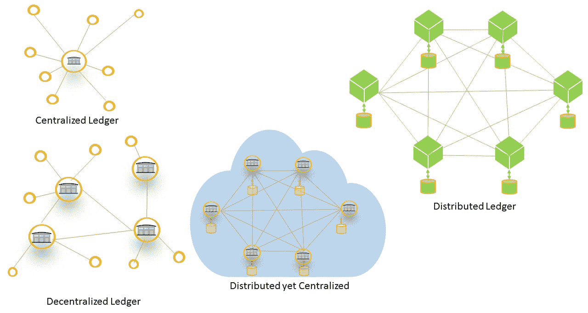
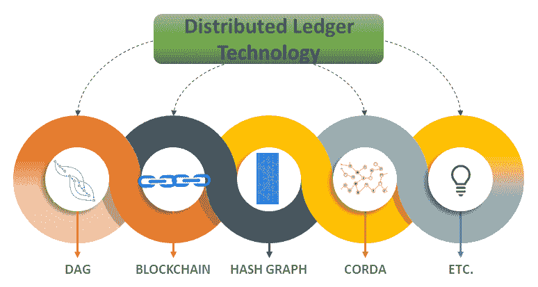
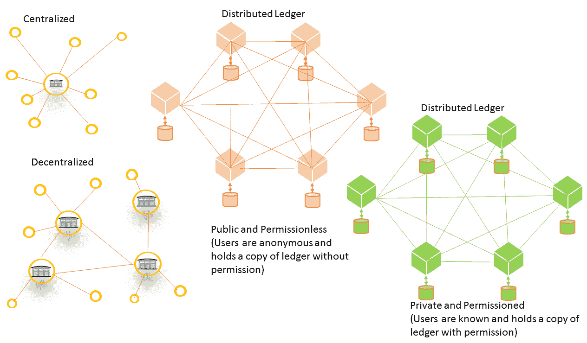
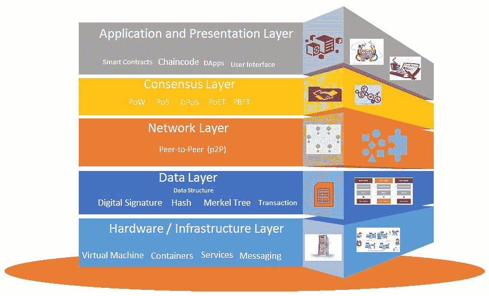
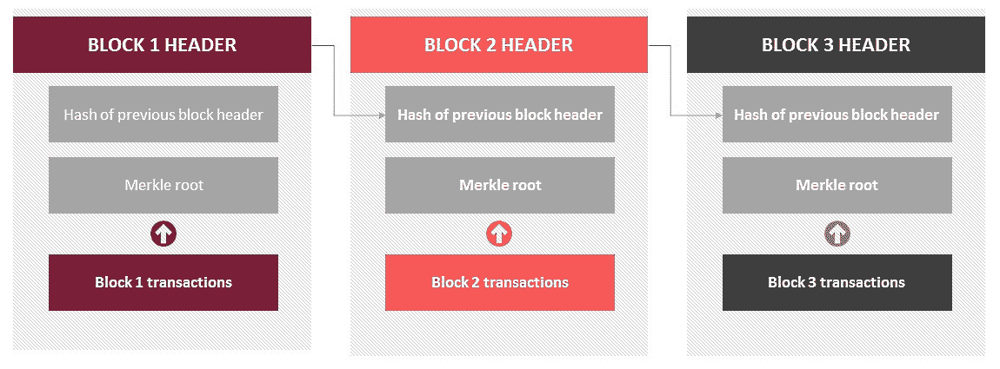
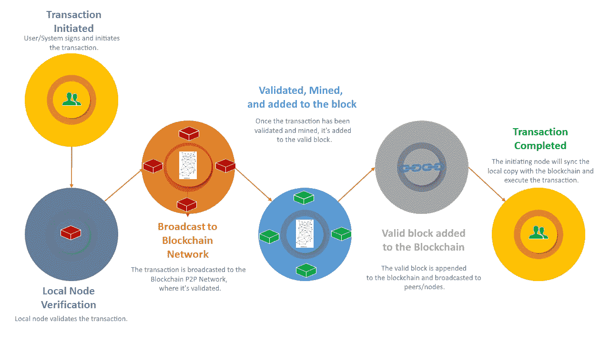
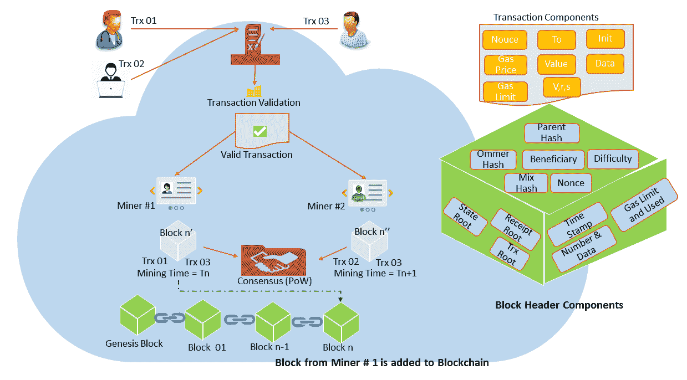
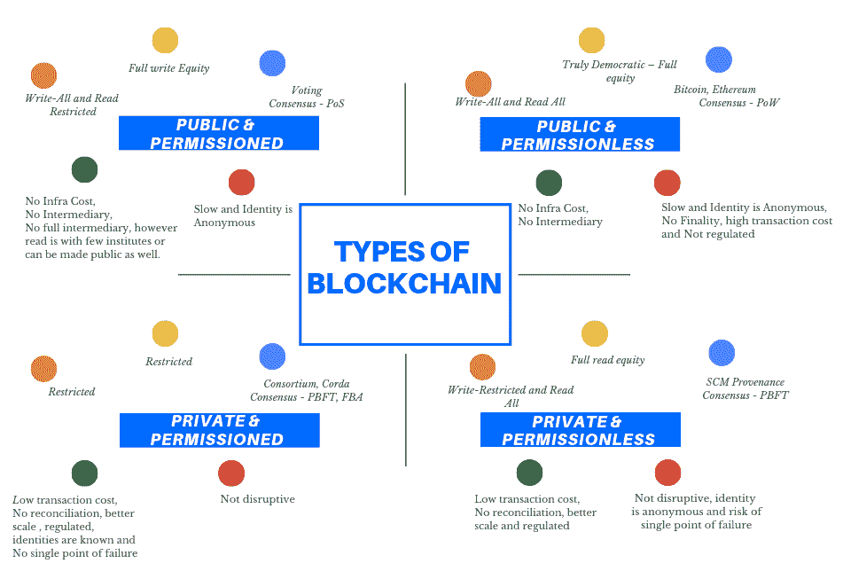
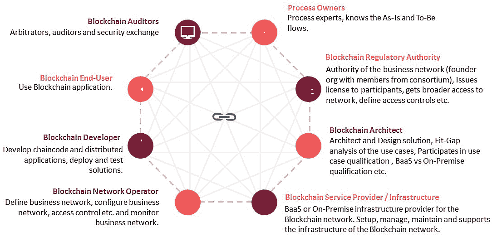
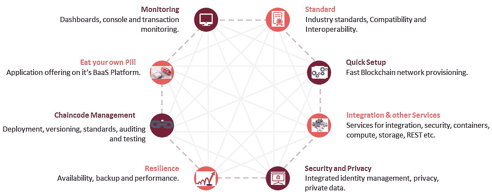

# 第一章：探索区块链和 BaaS

区块链被认为是一种具有颠覆性、改变游戏规则的技术，其影响将在未来二十年与互联网一样巨大。这个可编程经济在几乎每个行业都有用例和应用。区块链已经从一个时髦词发展成为对热衷者和实际实施者都非常感兴趣的东西。传道者们不再局限于**概念证明**（**PoCs**），而是已经开始实际的实施，并开始展示具体的成就。尽管采用速度较慢，但根据 Gartner 在 2019 年 6 月 3 日的预测（在[`www.gartner.com/`](https://www.gartner.com/)上），到 2030 年采用率将达到 3.1 万亿美元。

区块链是一个让用户完全掌控交易和周围信息的世界。周围流动的信息是真实的、可信的、准确的、一致的、被接受的、完整的、及时可用的、广泛可用的、透明的和不可变的。区块链是一种**分布式分类帐技术**（**DLT**），它消除了中心化失效风险，而底层的密码学和算法将确保在这个不可变的世界中的安全性。由于*信任*存在于区块链网络本身，所以无需信任的中央第三方。欢迎来到区块链世界，一个分布式双向记账系统的世界。

这一章从会计系统、集中式和分散式分类帐开始，并创造了术语*分布式双向记账系统*。本章逐渐向区块链的定义和类比发展，并展示了**点对点**（**P2P**）网络提供的权益力量。在这里，您还将了解各种类型的区块链网络，例如许可和非许可，或公共和私有。本章然后逐渐向区块链架构的分层结构和交易结构以及区块和交易流程发展。最后，它介绍了您如何应对区块链解决方案，并定义了通过**区块链即服务**（**BaaS**）平台，如**Oracle 区块链平台**（**OBP**）来简化区块链采用的云方法—从 PoC 到生产。

# 会计系统 - 单式和复式

在我们深入讨论区块链、深入了解 Hyperledger Fabric 和 Oracle Cloud 解决方案之前，我们需要从两个核心原则开始 - 总账和会计。在会计系统中，业务交易记录在日记账和总账中。每笔交易的细节都被输入到各种日记账中。从日记账中的汇总信息然后转移到总账中（也称为过账）。总账中的信息成为试算平衡表和各种财务报表的来源。每笔交易都记录在日记账中，然后过账到总账中，该总账将此信息记录在各种账户中，例如资产账户、负债账户、所有者权益账户、收入账户和费用账户。

对于任何组织的会计系统来说，总账是其支柱。任何具有财务价值的事物都会被记录到组织的总账上。然而，这些总账是中央化的总账，组织对其拥有完全控制权。我们将在本章后面讨论中央化和分散化的总账。

# 会计系统 - 单式记账

会计系统旨在产生一份运营文档，显示资产所有权，保护资产以及执行各种其他任务。基本上，会计系统是一种强大的手段，用于检查资产损失，这些损失是由恶意人为活动、软件等造成的，并跟踪围绕这些资产的活动和交易。历史上，由于围绕资产的活动很少，单式记账足以证明资产的所有权。这是一种每笔交易在日记账中只有一次记账的记账系统。

单式记账系统类似于个人用于跟踪支票、存款和余额的支票注册。记录的信息很少，由个人拥有。这对于每天交易很少的以现金为基础的非常小型企业来说是一种高效的系统。没有基于信用的交易，拥有的资产非常少。最重要的是，无需发布收入、财务和资产负债表。从历史上看，它可能非常有效，即使在今天，对于那些符合上述属性的非常小的公司来说，它可能也会运行良好。

单录入会计系统存在各种挑战——没有科学或系统的规则来记录、过账和报告交易。它看起来像是一个不完整的系统，因为它没有记录账户的两个方面；因此，它无法真实反映利润或损失的情况，并且将无法反映组织的真实财务状况。由于所有这些缺点，单录入系统容易受到欺诈和账簿中各种错误的影响。因此，为了检查脆弱性，您需要信任一个集中的权威；因此，从历史上看，需要国王检查脆弱性并维护账簿周围的信任。然而，随着贸易的扩展，您需要一种机制来允许一个账簿所有者与另一个账簿所有者进行交易。这立即导致了双录入会计系统的出现。

# 会计系统 - 双录入

双录入系统提供了单录入系统中本质上无法获得的错误检查。每个账户都有两栏，每笔交易都反映在两个账户中。每笔交易都会产生两笔记录；但是，每笔交易在一个账户中有借方记录，而在另一个账户中有等额的贷方记录。双录入账户系统的一个示例是，如果一个组织想要购买一台价值$2,000 的新笔记本电脑。在这种情况下，该组织将会在支出账户中记录$2,000 的借方和在现金账户中记录$2,000 的贷方，以显示资产负债表中的减少。

双录入会计是一种展示交易影响的方式。例如，如果一个组织购买了一台笔记本电脑，会计分录并不清楚这台笔记本是用现金购买的，以换取另一台笔记本，还是赊购。只有当交易的两个影响都被记录时，这样的信息才能够得到。在会计系统中，这两个影响被称为借方和贷方。双录入会计系统遵循了对偶原理，这意味着，对于每笔借方记录，都必须有一个等额的贷方记录。借方记录显示诸如资产和费用增加，以及权益、收入和负债减少等影响。类似地，贷方记录显示诸如资产和费用减少，以及权益、收入和负债增加等影响。双录入系统确保会计等式保持平衡：

*资产 = 负债 + 权益*

在报告期末，总借方等于总贷方。资产负债表遵循该等式，其中总资产等于负债和权益的总和。任何偏离该等式的情况都会突显出错误。

有趣的是，单式记账系统只记录收入和支出，不监控所有权、负债和资产。然而，双式记账系统记录收入、支出、所有权、负债和资产，这使得轻松准确地得出和计算利润和损失、有助于检测欺诈、减少错误，并允许生成各种财务报表。由于交易的双方面都有记录，因此更容易让账簿保持完整。维护双重记账系统牵涉时间、金钱、技能和劳动。存在出错和疏漏的可能。在一个会计年度内，交易被记录并调整在最终账户中；如果跟踪交易是一个挑战，调整交易将会有困难。

在双重记账系统中，第一笔记录说明你拥有什么，而第二笔记录澄清你是如何得到它的。如果这些记录不平衡，那就清楚地表明对手方风险可能未被有效地计入，这会导致审计和纠正。在双重记账系统中，对对手价值的每一次变动都必须进行记账。多年来，这一简单、经得起检验、有效的会计系统一直是强制性的。

但是，考虑一下当不存在对手方风险的情况。假设系统不清楚谁拥有它并对资产和账簿中记录的价值负有责任。要发送或接收具有价值的资产，必须有对手方来接收和发送。直到今天，这些基础问题远未解决。组织的账簿记录了一项交易，对手方的账簿也记录了相同的交易；例如，供应商的账簿或银行的账簿。这反映了对手方对同一交易的看法。各种文件和陈述，如合同、发票、票据、银行对账单和收据，支持这些交易。这很容易出错，比如对账错误和现金缺失，进而导致争议。这需要争议解决，并且为了核对所有这些，组织投资于记录、分析和审计。

双重记账系统已经运作了几百年。在这一部分，我们不会强调三重记账系统的需求，而是会深入探讨分散化账簿。双重记账要求每个组织及其对手方维护自己的账簿，这反映了*真相*。然而，存在多个副本的真相。此外，组织和对手方投入时间、资源和金钱来执行真相调和，最终得出并达成一个统一的真相。

# 中央化对分散化账簿

本节突出了中央化和去中心化账簿以及分散化账簿，并概述了它们之间的差异。

以下图表显示了不同类型的系统：



系统和分类帐的类型

在本节中，我们将参考前面的图表来了解各种类型的分类帐的布局。在我们深入研究集中式和分布式分类帐之间的区别之前，让我们先了解一下不同类型的系统。

从*控制*的角度来看，系统有两种类型——集中化和去中心化系统：

+   **集中式系统**：一个实体控制整个系统，其中实体可以是一个人或一个企业。

+   **去中心化系统**：在去中心化系统中，可能有多个实体控制系统。没有单一的控制点，控制权是在各个独立实体之间共享的。

从*位置*的角度来看，系统有两种类型——集中式和分布式系统：

+   **集中式系统**：系统的所有组成部分，如服务器、分类帐等，都是共位的，存在于同一个位置。

+   **分布式系统**：系统的所有组成部分，如服务器、分类帐等，都不是共位的，而是存在于不同的位置。

这些系统的分类导致了以下系统变体：

+   **分布式但集中化系统**：分布式但集中化系统是系统的一类，从位置的角度来看，系统是分布式的，但系统由一个中央权威或中央实体控制。例如，云服务提供商提供各种服务，如计算、存储、SaaS、PaaS、IaaS 等。这些服务是通过分布式的服务器和数据库提供的。然而，整个系统由云服务提供商控制。这样的系统可以称为分布式但集中化系统。

+   **分布式系统**：从控制的角度来看，分布式系统是去中心化的，而从位置的角度来看，它们是分布式的。这意味着没有单一实体是系统的所有者或管理者，系统也不只存在于一个地点——它被广泛分布。DLT 及其类型，如区块链，就是这种分布式系统，其中控制不在一个实体手中。因此，没有单一实体可以改变或修改系统（去中心化）。另外，DLT 和区块链是基于 P2P 网络的，其中节点（对等方或参与者）是独立的，并且全球分布（分布式）。

分布式系统是去中心化系统的超集，并且基于 P2P 网络。

# 集中式分类帐

到目前为止，我们讨论的复式记账系统强调了一个具有集中式分类帐的会计系统。任何具有财务价值的事物都记录在日记帐中并发布到分类帐中。这些分类帐就像发布交易的中央仓库一样，它们是任何组织的支柱。

然而，中心化的分类账系统也有各种缺点。例如，银行控制着输入到银行分类账的交易，并且他们对银行对账单拥有绝对控制权。在这种情况下，他们可以随时惩罚你，并且可以随时从你的账户中转账。如果这样一个中心化的机构有恶意意图，后果可能是多方面的；他们可以在没有事先通知的情况下关闭他们的业务，从而禁止任何进一步的交易。这些例子主要被倾向于完全去中心化信任机构的区块链狂热者使用。

让我们看看一个更可行的挑战，涉及到银行。**双向记账**要求每个银行都要维护自己的分类账，以反映他们对真实的看法，随着越来越多的银行相互交易，他们需要调和他们对真相的看法，以得出一个统一的真相。如今，银行花费时间、金钱和资源来确保对单一真相达成共识。

显然，它们有自己的分类账和系统，这使得金融行业能够避免出现单一控制点和单一故障点的任何机会。此外，当客户在银行开立账户并将他/她的资金寄存在银行时，他/她对该银行有一定程度的信任。现在，责任在银行机构上，要保护你的资金和信息。另一方面，银行将投入大量时间、金钱、资源和精力来构建和维护一个系统，然后花费更多的时间、金钱、资源和精力与其他银行机构进行整合和核查，以确保他们的掌握的系统与其他银行机构的系统一致，以达成共识。

如果你仔细分析，你会发现每家银行的分类账实际上正在复制其他银行机构的功能。现在，如果其中一家银行的系统失败了怎么办？这会导致无法协调的局面吗？这不是更像一个单一故障点吗？答案在下一节和整本书中讨论的分布式分类账中。

# 分布式分类账

在全球范围内，在经济、法律、政治和制度系统中，关键要素是交易、合同和文件。它们决定了国家、企业、组织、社区和个人之间的关系，最重要的是，它们被认为提供了信任。有趣的是，这些要素在数字化转型中的参与程度还不是很大，也没有为更大的事业做出贡献。那么，解决方案是什么？分布式分类账和分布式账本技术（DLT），以及区块链，为这些关键挑战提供了解决方案。在本节中，我们将更多地探讨分布式分类账和 DLTs。

在分布式分类账中，没有中央机构或中央管理员。这是共享在网络上的资产数据库，网络上的每个参与方都有分类账的相同副本。这些资产可以是金融、法律和电子资产。这些资产价值的改变会在整个网络中反映出来，每个分类账的副本都会被附加。

许多组织、政府和机构使用了我们在*中心分类账*部分讨论过的分类账的中央数据库。中央分类账需要一个可信赖的中央机构来被交易各方信任；然而，在分布式分类账中，第三方的需求被省略掉了，这是吸引人们对 DLT 的吸引力之一。在这里，我悄悄地使用了 DLT 这个术语，因为分布式分类账可以被发音为分享分类账或 DLT，它们是同一个概念。

DLT 所颠覆性的地方在于分类账数据库是分布在网络中的所有节点或计算设备上，每个节点都有一个相同的分类账副本，节点独立地更新自己。所有参与的节点通过一种称为**共识**的过程达成一致意见，建立分类账的单一真相（真实的副本）。一旦达成一致，分布式分类账会被自动更新，最新的真相（真实的协议副本）会被分别附加在每个节点上。在阅读这一段时，你可能会想到银行的协调过程来建立对分类账的信任和一致性。使用 DLT，信任（协调）和一致性（协议）会无缝自动地发生。

我们刚刚发现的是在先前的故事中没有中央机构来维护分布式分类账。DLT 赋予系统减少对各种中央机构（如银行、律师、政府、监管办公室和第三方机构）的依赖的能力。分布式分类账省略了需要中央机构来验证、认证和处理交易的需求。DLT 上的过渡是被时间戳标记并且具有加密的唯一标识，被质疑的所有记录可以供参与者查看，这确保了交易的可验证和可核对的历史被不可变地存储。

在分散的分布式总账中，交易被复制到分布式总账中，这意味着所有参与节点的总账副本都被追加；然而，没有中央单一数据库。网络是分散的。这样的系统需要分散的共识，因为没有单一的联系点、单一的权威或方。因此，为了确保无信任，共识是必要的。在传统的数据库系统中，单一方代表交易客户行事，以修改系统的状态。然而，在分布式总账中，任何一方都可以记录，协议和算法管理着交易在网络总账上的发布。

下表列出了中心化账本和分布式账本之间的一些区别：

| **中心化账本** | **分布式账本** |
| --- | --- |
| 需要协调（内部和外部）。 | 不需要协调；然而，需要达成一致意见。 |
| 没有对数据库操作的限制。 | 它只能追加。 |
| 存在单一故障点。 | 它是分布式的；因此，没有单一故障点。 |
| 存在单一联系点。 | 它是分散的；因此，没有单一的权威。 |
| 存在第三方、中间人和门户。 | 这是点对点的。没有中央方，并且追加到总账的行为受到共识的约束。 |
| 需要备份和灾难恢复。 | 随着越来越多的参与节点加入网络，韧性和可用性增加。 |
| 可以代表某人执行操作。 | 存在加密身份验证和授权。 |
| NA | 添加到总账的数据是不可变的。 |
| NA | 节点之间存在直接交互，允许启动资产的直接交易，例如货币、房产证书或文件等。 |

有了总账知识，现在让我们深入了解 DLT 和区块链，并理解它们之间的区别。

# DLT 和区块链

区块链是一个点对点网络，其中总账是分布式的，并且只有在达成共识后才会将交易发布到总账。这样的点对点网络，以及智能合约、加密学和算法等各种组件，有助于构建一个提供信任的区块链网络。区块链允许参与方（节点）在没有中介的情况下建立共识，这导致单一的分布式真相（总账）。没有协调、没有延迟和没有中介，交易将永远实时记录在一个不可变的总账上。

我们还没有涵盖有关区块链的详细信息，在这一部分中，我们也只是简要介绍了定义，并深入讨论了区块链与 DLT 之间的区别。到目前为止，我们知道分布式分类帐。区块链技术专注于安全高效地构建交易的不可变记录，也称为高重要性的活动。区块链（DLT 的一种形式）是最受接受的 DLT；然而，DLT 本身对未来有很多潜力。有各种类型的 DLT，如下图所示：



DLT

区块链将数据分组成块，将它们链接在一起，并通过密码学牢固地保护它们。区块链是一个不断增长的仅追加链，经过协商一致的交易只追加到块中。它们永远不会被改变或删除，这种不可变性具有各种用途。现在，由于区块链是 DLT 的一种形式，它是在区块链网络上分布的分类帐。每个节点都有一个分类帐副本，只有当交易达成共识时，才会安全地添加到其中。

DLT 是一个更广泛的术语，用于突出显示那些允许参与者（公共或私人）之间分发信息的技术。区块链是 DLT 的一种类型，得到了广泛的接受并且非常流行，因此它成为了 DLT 的代名词。DLT 专注于没有中央权威的技术，有趣的是，区块链是一系列块，而 DLT 既不要求链条也不要求块。对于区块链的愿景，DLT 产生了共鸣；因此，每个区块链都是一个 DLT。但是，DLT 不一定是区块链的必要条件。以下是关于 DLT 和区块链的类比，分别使用了术语车辆和汽车。因此，我们的等式是——每辆汽车都是一辆车辆；然而，并不是每辆车辆都必须是一辆汽车。

以下表格总结了 DLT 和区块链之间的区别：

| **DLT** | **区块链** |
| --- | --- |
| 这是一个分布在网络上的分类帐。 | 这是一个 P2P 分布式分类帐。 |
| 分类帐保持不变。 | 交易被分组到块中，块是不可变的。 |
| DLT 包括一个确保协议的共识算法。 | 当达成共识时，块被添加到链中，每个块都有交易。 |
| 没有中央权威或集中式数据存储。 | 没有中央权威或集中式数据存储。 |

另外一些受欢迎和接受的 DLT 如下：

+   Chain Core

+   Corda

+   **有向无环图**（**DAG**）

+   哈希图

+   peaq

+   Quorum

总的来说，DLT 广泛地创建了一个系统——而区块链则特别地创建了一个系统，这个系统可以让世界拥有一个点对点的分布式账本，这个账本是可信的、不可变的、安全的，并且是基于共识的。DLT 有各种类型，比如区块链和 DAG，虽然区块链获得了更广泛的认可，但 DAG 正在缓慢而稳定地获得动力。就这本书而言，我们将集中讨论 Hyperledger Fabric 和区块链等 DLT。不过，无论是哪种 DLT，其核心优势都包括透明度、不可变性、高效性和没有第三方的存在。

**是区块链的 DLT**：

区块链是一种数据以块的形式存储的 DLT 形式。这些块是链接并加密的。因此，它也可以被称为块的加密链表，你可以追溯块的起源（这意味着你可以追溯到创世块）。这种块的链表（也称为区块链）是不断增长的。这种庞大的增长导致了交易速度缓慢，并且在点对点网络上需要大量的存储空间。

**区块链技术作为平台**：

我们先来谈谈区块链技术的第一个应用——加密货币。不过，本书不会进一步讨论加密货币。对于加密货币交易，账本被分布在点对点网络上。任何用户（节点）都可以无需许可加入网络，并开始交易。只要用户（节点）遵循交易协议，交易就可以被执行。如果交易有效，它们将被添加到区块链网络中。同样地，任何节点都可以参与共识过程，并开始验证交易。

这样的区块链网络是公开的，并通过浏览器应用程序向每个人提供读取权限。这样的交易信息不包含用户详细信息。它们只包含交易细节。这样的公共区块链网络不会对系统管理员产生费用，因为挖矿是由参与节点执行的，并且矿工会因为他们验证交易的努力而获得奖励。反过来，矿工可以通过照顾服务器、机器和电费来负担起基础设施的成本。你可以把这样的基础设施想象成是由人群资助、人群维护和人群验证的。成本是由参与节点共同分担的。通过这种方法，与集中式系统相比，基础设施的前期和维护成本大大降低了。一些流行的货币包括 Litecoin、Ripple、EOS、Bitcoin、Ethereum（Ether）等等。

除了加密货币，区块链平台还为无许可网络或有许可网络的增长提供支持。它可以作为各种类型交易和共识的平台，这些交易和共识代表了一个资产（有价值的东西）。无许可网络包括以太坊，而有许可网络包括 Hyperledger Fabric 和 R3 Corda。

**不是区块链的 DLT**：

有各种不是区块链的 DLT，比如 DAG、Hashgraph 和 **数字资产控股**（**DAH**）。它们也基于分布式账本的概念；然而，它们不是基于区块链（也称为区块链）的块链。它们大多是有效的，其交易量极高。DAH 主要与金融服务和银行等用例相关。Hashgraphs 是基于投票算法的有权限 DLT。DAG（表）是另一个不基于区块链的 DLT。目前它被用于 IOTA 和微支付。

# 比较区块链和 DAG：

区块链和 DAG 都是 DLT。然而，让我们来看看这两者之间的区别，以更好地了解它们的技术。

以下表格比较了 DLT - 区块链和 DAG：

| **特性** | **区块链** | **有向无环图** |
| --- | --- | --- |
| 结构 | 它是一个区块链，交易被分组到块中。 | 它是一个链接交易的网络。没有交易块。 |
| 数据结构 | 它是一个链接列表（块列表）。 | 它是一个树（交易树）。 |
| 共识 | 交易按块验证以满足共识。 | 交易互相验证。 |
| 特征 | 提供透明度和不可变性。 | 提供高可扩展性和微不足道的费用。 |
| 用例 | 适用于交易量低、价值高的用例。 | 适用于高交易量的用例。 |
| 陷阱 | 交易成本高，存储和带宽要求高，计算能力也高（用于无需许可的场景）。 | 低交易量可能导致攻击。对于 DAG 的私有版本，它使用协调者，这不允许 DAG 完全去中心化。 |
| 方法 | 它是一个线性的、实用的 DLT，为交易提供几乎实时的更新，并提供去中心化。 | 它采用非线性方法，实际上在网络增长时结果更快的交易。 |

# 会计系统 - 三重会计或分布式双重会计

让我再次引导您回到会计系统。我们已经讨论过单式记账和复式记账系统。更多地关注分类账使我们熟悉了集中式和分布式去中心化分类账。此外，即使在本章中我们还没有将区块链的定义巩固下来之前，我们也试图将其与 DLT 进行比较。现在，我们回到了起点，回答另一个关于会计世界中的区块链的重要问题。

有很多关于三重会计系统的讨论。许多倡导者认为三重会计系统是对古老而经得起考验的双重会计系统的先进增强。借贷和贷方仍然是两个主要的条目，而第三个顶点条目是对所有以前的借贷和贷方的不可变链接，这意味着所有的账目条目都有一个不可变的加密封印。

假设两个组织正在进行一笔交易；一个组织将在其账户中发布收到的金额的借方，而另一个组织将在其账户中发布花费的金额的贷方。然而，这些发布是到不同分类帐中的。我们在银行机构的例子中以前已经见过这种情况。现在，这些组织有不同的分类帐副本，然后它们将对其进行**调和**以确保它们有一个共同的“真实”理解。分布式分类帐技术将确保没有两个分类帐。将存在一个分类帐，它将保持分布式，而区块链技术将确保发布到分布式分类帐的交易是不可变的并且安全密封的。不可变性将确保它永远不会被篡改，而加密技术将处理安全方面的问题。因此，企业和商业不需要调和分类帐，因为不存在单独的分类帐。

尽管有各种各样对于三重记账系统的定义，但要取代经过验证的双重记账系统将会非常困难。三重记账是一个复杂的术语；我们不否认在区块链网络中将交易发布到分布式分类帐有巨大的好处这一事实。在分布式、仅追加、不可变的分类帐中发布和记录交易有很多好处，我们将在本书中详细介绍这些。

例如，一旦签署了合同，区块链上就会创建一个区块，并且交易会发布到区块链网络中的分布式分类帐。有人可以针对该合同发出购买订单，这笔交易也会作为一个区块附加到区块链中，这意味着它也被发布到分布式分类帐中。可以针对这些购买订单发出账单，并且可以将支付与这些账单关联在不同的交易中，并记录到分布式分类帐中。您拥有一个区块链，其中显示了从合同到付款的交易，在一个单一的分布式分类帐中。这意味着您拥有出色的审计记录，并且所有交易方都能实时查看交易。像超级账本面料（Hyperledger Fabric）这样的权限分布式账本技术还可以进一步使您能够对这些交易提供受限制的访问。此外，这些发布的交易无需调和，是不可变的并且无处不在的。

我们刚刚学到，在区块链网络上的分布式账簿中，交易是不可变的，没有人可以伪造它们。交易被时间戳记录、验证，并通过共识达成一致，值得信赖；这提供了一种在任何时候实时检索、访问、分析和审计的简便方法。交易链，在区块中被捆绑在一起，并分布在区块链网络中，每个参与节点都拥有相同的账簿副本（网络上的单一真相）。在这个方程中，我们没有见到一个单一的权威/方，因为没有中央可信方；信任在区块链网络和分布式账簿中。欢迎来到区块链世界，一个分布式复式系统的世界。

总之，我个人相信分布式的复式记账系统。你可以把它称为三重记账系统，如果你愿意的话。然而，这种会计系统的本质保持不变——分布式、安全和不可变的复式记账系统。在这个方程中，DLT 提供了账簿的分布，而区块链技术将确保单一分布式账簿的密码学、安全性、数字收据和不可变性。因此，在本书中，我们将使用分布式复式记账系统这个术语，你仍然可以称之为三重记账系统。

# 区块链的定义和类比

通过对账簿、系统类型的事实检查以及了解 DLT 与区块链之间的区别，让我们来了解区块链的定义和类比。区块链是一个 P2P 网络，账簿是分布式的，交易只有在共识达成后才会被发布到账簿上。这样的 P2P 网络，以及各种组件，比如智能合约、密码学和算法，帮助构建了一个能够提供信任的区块链网络。区块链允许参与方（节点）在没有中间人的情况下建立共识，这导致了一个单一的分布式真相（账簿）。没有调解、没有延迟，交易是实时记录在永久不变的账簿上的。

让我们用一个类比来解释区块链。我们将区块链比作一个笔记本。每一页代表区块链上的一个区块。你可以在这一页上记录任何类型的数据，比如医疗记录和金融交易，这也被称为一个区块，其中每一页（区块）都与前一页（区块）相连。这个链不仅仅是到前一页的链接；它还包含有关页面的信息，一旦页面上的数据被定义并添加到笔记本上，就不能被更改。如果更改了，页面的信息也会更改。然后，它与其他页面的链接也会更改，以此类推。这是因为链上的连接被中断了。因此，每个链接页面上的行都是不可变的。

区块链技术还包括智能合约，这是智能程序化合约，也称为规则；这些在区块链网络上的某种类型事件发生时被定义和执行。它被称为区块链，因为区块的链是一个块的链表，其中每个块有一个或多个交易。这些交易在一定时间段内由区块链网络验证和验证。区块链协议的共识算法，采用了该区块链网络的规则和参与节点的激励。我们将在共识算法部分详细介绍这一点。

区块链是一个块的链，每个块上记录着在分布在区块链网络的所有参与节点上的分类帐（区块链）上记录的交易。这个分布式分类帐是分布式的双向分类帐（如前所述），用于记录任何数字资产或有价值的资产的交易。对于区块链网络，交易从它（分类帐）开始被记录，它们永远保持不变地留在那里。因此，可以从网络开始生成、追踪和验证财务报表。有趣的是，由于分类帐是分布式的，并且所有参与节点都有其副本，任何节点都可以验证交易并宣布交易验证以达成共识。

# 类比

让我们再看一个类比。让我们回到一个没有技术的时代。有一个美丽的村庄，有几个家庭，他们不是用货币，而是用商品进行交换。

一个蔬菜农民会用蔬菜交换大米，一个大米农民会用大米交换花生，依此类推。这种方式运作得很好，直到他们开始相互承诺为止。承诺（交易）是信用，其中一个农民会买蔬菜而不交出大米；相反，大米农民会承诺在大米收获时还蔬菜农民大米。同样，水果农民会得到大米，并承诺在收获时交付橙子。

蔬菜农民信任大米农民；然而，随着时间的推移，各种农民之间进行了几次承诺交易，跟踪这些承诺变得困难，这导致了信任的破裂。最终，村民们任命了一个人来跟踪这些承诺。这个人被赋予了名为分类帐人的头衔（中央第三方）。很快，分类帐人建立了信任；然而，他被承诺淹没，并开始要求费用（交易成本）。村民们同意付给他一部分承诺作为费用。最终，这将分类帐人变成了一个富有的人。后来，分类帐人沉溺于腐败，开始接受贿赂以篡改分类帐，贿赂村民以保住自己的位置，并有时增加费用。

很快，村民们意识到拥有一个分类帐管理人（集中式系统）的挑战。因此，他们决定，不再由单个分类帐管理人保留承诺，而是由每个人保留承诺（去中心化）。不会有一个人持有承诺；村民们会在指定地点聚集以进行承诺，并且每个村民都会记录每个承诺（P2P 网络）。

每周，他们会通过朗读他们对承诺的版本来验证这些承诺。如果大多数村民就某项承诺达成一致（共识），那么该承诺将被视为有效，并被视为真实（账本）。在出现问题时，具有大部分条目的承诺将被视为正确的承诺，并有助于解决基于承诺的任何问题（最长链）。随着时间的推移，他们增加了安全性和各种其他功能。

我们将重新讲述这个故事，并进行扩展。目前，我们了解到区块链是一种解决方案（协议），它允许无领导（去中心化）的对等节点（P2P）就交易达成一致（共识），并且一旦发生（同步），它们就会被记录（发布）在一个无处不在的防篡改（不可变）的分布式链表（分类帐）上，其中每个节点都持有其副本（分布式）。我们刚刚了解到区块链是一个 P2P 网络；现在，让我们确切地了解一下 P2P 网络到底是什么。

# 区块链组件

区块链由各种组件组成，在区块链网络中协同工作。在本章中，我们将介绍其中一些组件，以及一些其他组件，如成员服务，将在后续章节中详细讨论。以下是区块链组件的列表：

+   **分类帐**：分类帐是一个分布式分类帐，交易被不可变地记录/发布在其中。作为一种 DLT 类型，区块链确保了交易历史的不可变性，从创世区块到当前区块。在本章中，我们已经涵盖了单式记账和复式记账。区块链分类帐是分布式复式记账系统的安全实现。

+   **对等网络和节点**：P2P 网络是一种计算机网络，其中计算机（对等节点）分布并共享网络的工作量以达到最终目标。节点在区块链上执行交易。有两种类型的节点 —— 完整节点和轻节点。像区块链或超级账本（Hyperledger）这样的分布式分类帐技术可以是公共的或私有的。在公共区块链中，每个节点都有权益；然而，他们可以以不同的角色运行，例如作为矿工，作为完整节点，其中区块链的完整副本将被复制到这些节点上。他们也可以作为轻节点，并且只能持有密钥或区块头值。

+   **智能合约或链码**：对于像以太坊这样的区块链，以及像 Hyperledger 这样的 DLT，智能合约或链码是在区块链网络上执行的代码逻辑。参与节点或区块链客户端可以根据该业务逻辑（智能合约或链码）发出交易。随着区块链层的加入，账本不仅存储不可变的交易，还存储不可变的代码。

+   **会员服务**：对于像 Hyperledger 这样的 DLT，会员服务提供了身份和安全解决方案，确保用户参与区块链网络。认证和授权是会员服务的功能。它们主要用于私有和许可的区块链或 DLT。

+   **事件**：区块链或 DLT 负责在区块链/DLT 上发生特定定义的操作时引发事件。事件是让其他订阅应用程序或系统与区块链网络交互的有效方式。

+   **共识**：共识算法（或协议）是区块链平台存在的核心。毋庸置疑，区块链网络在没有共识的情况下无法存在。共识层是任何区块链（以太坊或 Hyperledger 等）中最关键和至关重要的层。共识负责验证块、排序块，并确保每个人都对其达成一致意见。有关共识算法的详细信息，请访问本章节的*共识算法*一节。

在前一节中，我们详细讨论了账本和分布式系统。在本节中，我们将专注于 P2P 网络。本章*探索区块链和 BaaS*和第二章*理解分布式分类账技术和区块链*将详细介绍所有列出的组件。

# P2P 网络

区块链技术利用互联网并在计算机的 P2P 网络上运行。这些计算机运行区块链协议，允许这些计算机保留账本的副本。这个账本包括被打包在一起形成链的交易，起始区块。将块加入链中是通过共识达成一致，无需中介。

区块链分布式分类账在 P2P 网络上运行，交易通过共识算法使用密码学进行验证。区块链网络为其定义了共识算法，这基本上是验证区块链 P2P 网络上交易的规则。一旦达成共识，块就会被添加到账本中。将块添加到网络中的节点然后会获得激励（根据区块链类型而定）。因此，重点在于，在分布式分类账的 P2P 网络中，交易使用密码学进行验证并通过共识进行确认。

下图显示了网络的类型：



P2P 网络

如前图所示，**集中式**网络有一个中心节点，该节点定义和管理交易的验证和核实。所有其他连接节点依赖中央权威。中央权威可以完全访问和控制数据、信息和交易状态。尽管这是一个受严格监管的网络，但也是中央控制的。一方面，只要中央权威和参与节点之间的信任保持真实，就是安全可靠的；然而，人为错误、恶意意图、单一故障点和权力掌握在一个单一权威手中也存在自己的挑战。它适用于非常小的组织，可以迅速做出决策，甚至最小的决策也是可见的。**去中心化**网络与中心化网络几乎相同；然而，在这里，中心节点本身是分布式的。这意味着权威的集中化是分布式的。在去中心化网络中，每个节点不直接连接到节点；但在 P2P 网络中，每个节点都连接到其他节点。

# [股权网络](https://wiki.example.org/equity_network)或点对点网络

P2P 网络利用网络；然而，节点的连接和断开完全是自愿的。该网络是一个*平等*的网络，其中每个对等节点与任何其他对等节点一样平等和公正。一个对等节点向其他对等节点提供计算资源，而不需要中央权威来控制、管理或维护网络。即使它具有公平性，每个节点都有公平的机会扮演矿工的角色，或者可以将自己变成完整节点。每个节点都保存分布式账本的副本，这一区块链网络的协议确保了区块链网络的弹性和不可变性。只要有一个节点保留了分布式账本的副本，区块链网络就可以复活整个系统。

在 P2P 网络上，信息在所有参与节点之间记录和复制；因此，随着越来越多的节点加入区块链网络，P2P 网络的权力、一致性、可靠性和信任也会越来越多。此外，由于没有单一故障点和单一权威，系统不容易遭受黑客攻击、数据丢失、不一致性、人为错误或单一部分控制网络议程，因此权力和隐私仍然留给每个节点。请注意，正是共识算法确保了区块链上数据的同步。有各种共识算法，例如**工作证明**（**PoW**）和**股权证明**（**PoS**）。我们将在本书中详细讨论它们。

# 区块链架构的分层结构

本节介绍了区块链的分层架构。在本节中，我们还将涉及以太坊和 Hyperledger Fabric。在讨论 Hyperledger Fabric 基础设施时，我们也会深入了解 OBP 的基础设施。

下图显示了区块链的分层架构：



区块链分层架构

# 硬件和基础架构层

区块链的内容托管在位于这个美丽星球的数据中心中的服务器上。在浏览网页或使用任何应用程序时，客户端会从应用服务器请求内容或数据，通常称为客户端-服务器架构。但是，今天，客户端也可以连接到对等客户端，并在彼此之间共享数据。这样一个庞大的计算机集合彼此之间共享数据被称为 P2P 网络。区块链是一个 P2P 网络，它计算交易，验证它们，并以有序的形式将它们存储在共享账本中。这导致了一个分布式数据库，记录了所有数据、交易和其他相关信息。P2P 网络中的每台计算机都被称为一个*节点*。节点负责验证交易，将其组织成块，将其广播到区块链网络中等。在达成共识后，节点将块提交到区块链网络并更新其本地账本副本。这一层包括虚拟化（创建虚拟资源，如存储、网络、服务器等）。值得注意的是，节点是这一层的核心。当设备连接到区块链网络时，它被称为节点并被视为节点。在区块链网络上，这些节点是分散和分布式的。

# 以太坊 - 基础架构层

让我们来看看以太坊中的节点。任何人都可以在自己的计算机上运行一个以太坊节点。这将使他们的计算机能够参与到以太坊区块链网络中。节点可以运行一个客户端（兼容的客户端），如 Geth、Parity 或 Pantheon，以连接到以太坊区块链。Geth 是用 Go 语言编写的，Parity 是用 Rust 语言编写的，Pantheon 是用 Java 语言编写的。一个节点（运行节点的客户端）可以是轻节点（客户端）或全节点（客户端）。轻节点存储缓存，而全节点（客户端）存储数据集，随时间线性增长。轻节点（客户端）从以太坊区块链网络中获得有关以太坊状态的高保证，并且他们可以参与验证交易的执行。另一方面，任何参与全面执行共识并将整个区块链下载到节点本地存储的节点被称为全节点（客户端）。全节点验证签名，格式化交易和区块的数据，检查双重支付等。它们基本上验证交易并使用八卦协议将此信息传递给其他节点，称为对等节点。

这些以太坊节点（客户端）运行**以太坊虚拟机**（**EVM**）。EVM 是一个图灵完备的软件；一个基于股权的虚拟机，使不可信代码能够被全球点对点计算机网络执行。EVM 处理内部状态和计算。以太坊区块链是一个图灵完备的区块链，开发人员还可以为区块链开发程序（智能合约）。EVM 类似于 JVM，它们在区块链上的每个节点上运行。EVM 就像交易引擎一样，负责改变区块链的世界状态。EVM 作为沙盒运行，并为智能合约提供执行环境。

# [超级账本](https://wiki.example.org/feynmans_learning_method)– 基础架构层

这个基于超级账本框架的区块链网络由对等节点组成，这些节点托管账本和链码（也称为智能合约）。基本上，对等体托管账本和链码的实例，这些实例关注单点故障。由于对等节点负责托管账本和链码，应用程序和管理员需要与这些对等节点进行交互。在超级账本中，一个节点可以托管多个账本。在一些情况下，对等节点只能托管一个账本，而无法托管链码（这种情况很少，但有可能）。大多数节点至少安装了一个链码，以更新或查询节点的账本。一个节点也可以托管多个链码和多个账本，由通道支持。您将在第三章，*深入了解超级账本*中了解更多关于通道和超级账本架构的信息。

要访问链码或账本，应用程序和管理员（通过管理应用程序）将始终通过超级账本**软件开发工具包**（**SDK**）API 连接到对等体。这些 API 允许应用程序在区块链网络上执行交易，并接收与流程确认相关的事件。有两种类型的交易——查询交易和更新交易。对于查询交易，不需要共识，因为对等体将立即从其账本的本地副本返回结果。然而，对于更新交易，没有个体对等体可以更新账本，因为其他对等体在更新账本之前需要达成一致。达成一致更新账本的过程被称为*共识*。您可以在第三章，*深入了解超级账本*中详细阅读关于账本更新交易过程。

特定的一组应用程序和对等体可以通过通道进行通信，因为通道是特定应用程序和对等体之间的一个分区——通信的路径。Hyperledger Fabric 适用于企业，并为私有许可（联盟）和私有无许可用例提供支持。各种志同道合的组织组成联盟，建立区块链业务网络。因此，对等体由各种组织拥有。这些组织为区块链网络的设置、维护和运营提供资源。资源之一是节点（对等体），只要在区块链业务网络上有一个组织拥有一个对等体仍然存活，业务网络就可以继续存在。

该组织的管理员分配节点给区块链业务网络。每个组织都有一个证书颁发机构，它为这些节点分配数字证书。这个数字证书（X.509）是这些对等体的数字身份。当对等体尝试连接到区块链业务网络上的通道时，这个数字身份有助于识别对等体的所属组织。通道具有策略，这些策略确定对等体的权限和特权。这个对等体在组织中的角色与对等体的身份与组织的映射由**成员服务提供者**（**MSP**）提供。与区块链业务网络交互的任何东西，如对等体、应用程序、管理员、订单者等，都必须有一个身份和一个关联的 MSP，以使它们能够与之集成。

订单节点确保区块链业务网络上账本的一致性。让我们快速了解一下基于 Hyperledger Fabric 的区块链网络的交易流程。整个过程由订单者（订单节点）进行调解，在此过程中，所有对等体就交易内容以及交易顺序达成一致。

**交易流程**：Hyperledger Fabric 基于区块链网络中的交易发生在一个多阶段过程中。请访问第三章的*深入了解 Hyperledger Fabric*，以获取更多详细信息。以下是交易流程的简要介绍：

1.  **第一阶段**（**背书阶段**）：应用程序发起账本更新交易。这个交易请求由背书对等体（作为背书者的节点）处理。这些节点背书所提议的账本更新并将背书发送给应用程序。然而，对账本不执行任何提交。

1.  **第二阶段**（**排序阶段**）：来自各种应用程序的背书交易的提案响应被订单者节点接收。这些节点将交易排序成块。

1.  **第三阶段**（**分发阶段**）：最后，有序的区块被分发到区块链业务网络中的所有对等方。这些对等方将验证交易，并在验证成功后将交易提交到账本的本地副本。

订单节点是整个交易过程的中介。此交易过程称为共识，因为区块链业务网络中的所有对等方都就交易和交易数据达成了一致意见。订购服务利用了面向消息的架构，订购服务可以以以下三种方式之一实现：

+   独立

+   Kafka

+   Raft

以下表格突出显示了各种订单服务实现的特点：

| 特点 | **独立** | **Kafka** | **Raft** |
| --- | --- | --- | --- |
| 节点数量 | 单个订购节点 | 一个组织的多个订购节点。 | 来自不同组织的多个订购节点。 |
| 容错 | 非容错 | **崩溃容错**（**CFT**），它使用一个账本并遵循节点配置。使用 ZooKeeper 集合管理。 | 基于 Raft 协议的 CFT。 |
| 实施 | 开发和测试（非生产环境） | 生产级别，但存在管理开销。 | 生产级别，比 Kafka 更容易实现。 |
| 分布式订单服务 |  | Kafka 集群实际上由一个组织（可能是一个创始组织）运行。因此，所有的订购实际上都送到一个单一的组织。因此它是部分分散的。 | 允许分布式订购服务，因为各个组织可以贡献其节点来形成分布式订购服务。因此，它是完全分散的。 |

从物理存在的角度来看，节点可以位于以下位置之一：

+   由一个组织租用或拥有的云

+   数据中心或由一个组织拥有的本地环境

+   在本地机器上

从本质上讲，对等方的身份将其与组织关联起来，并确定其由该组织拥有。这些节点是区块链网络的基础和核心。它们具有不同的类型并执行各种功能，例如认可、排序、提交和托管链码，并确保账本的一致性。到目前为止，我们已经从以太坊和超级账本 Fabric 的角度讨论了基础设施。如果您想要查看特定供应商的基础设施提供情况，您可以访问本章的*Oracle's Baas – OBP*部分。

# 数据层

区块链是一个去中心化、大规模复制的数据库（分布式分类账），其中交易被排列在区块中，并放置在 P2P 网络中。所有账户的当前状态都存储在这样的数据库中。一个网络（公共或私有）由许多节点组成，若没有共同的共识，数据就不能被更改。区块链的数据结构可以表示为区块的链表，其中交易被排序。区块链的数据结构包括两个主要组成部分——指针和链表。指针是变量，它们指向另一个变量的位置，而链表则是由链接的区块组成的列表，每个区块都有数据和指向前一个区块的指针。一个*Merkle 树*是哈希的二叉树。每个区块都包含 Merkle 根哈希的信息，如上一个区块的哈希、时间戳、随机数、区块版本号以及当前难度目标。Merkle 树为区块链技术提供了安全性、完整性和不可辩驳性。Merkle 树，连同密码学和共识算法，是区块链技术的基础。例如，以太坊区块链使用 Patricia 树数据库来存储信息。Patricia 树（Trie）是一种 Merkle 树，它类似于键值存储。就像 Merkle 树一样，Patricia 树有一个*根哈希*。这个根哈希可以用来指代整棵树。因此，你不能在不修改根哈希的情况下修改树的内容。每个区块包含自上一个区块以来发生的交易列表，并且在应用这些交易后，Patricia 树的根哈希代表了新状态（*状态树*）。

创世区块（第一个区块）不包含指针，因为它是链中的第一个。下图显示了区块链中块的连接列表：



区块链结构

根据区块链的类型，数据被存储在区块中。例如，超级账本的区块将包括通道信息，而比特币区块链将包含有关发送者、接收者和金额的数据。我们已经多次使用了术语*哈希*。哈希是数据的唯一摘要。密码哈希算法（例如 SHA 256 算法）可以生成数据的定长哈希值。这些哈希有助于轻易识别区块，同时也有助于检测对区块所做的任何更改。每个区块都有前一个区块的哈希；因此，区块链本质上是一个哈希链。任何连接到区块链的新节点都将接收区块链网络的拷贝。只有在一致性达成后，才会将区块添加到本地区块链。

交易在区块链上进行数字签名，以确保存储在其中的数据的安全性和完整性。它们使用非对称加密的数字签名来保护有关区块、交易、交易方等信息。交易使用私钥进行签名，持有公钥的任何人都可以验证签名者。数字签名用于检查篡改。数字签名保证了完整性，因为加密的数据也被签名了。因此，任何篡改都会使签名无效。由于数据已经加密，因此无法检测到。即使检测到了，也无法篡改。数字签名还保护了发送者（所有者）的身份。私钥与所有者（用户）相关联；因此，签名在法律上与所有者相关联，无法否认。在本节中，我们详细讨论了交易。在下一节中，我们将详细介绍基于以太坊的区块链平台的交易流程。

# 网络层

网络层，也称为 P2P 层，负责节点间通信。它负责发现、交易和区块传播。这一层也可以称为传播层。这个 P2P 层确保节点可以发现彼此并可以相互通信、传播和同步，以维护区块链网络的有效当前状态。在本章的以下 *交易流* 小节中，体验 P2P 层的交易广播、交易提议、交易验证和交易提交。这一层还负责世界状态的传播。P2P 网络是一种计算机网络，其中计算机（节点）分布并共享网络的工作负载以达到最终目标。节点在区块链上执行交易。有两种节点——全节点和轻节点。全节点负责验证和验证交易、挖矿和强制共识规则的执行。它们负责维护网络的信任。轻节点只保留区块链的头（键）并可以发送交易。

# 交易流

此处描述的交易流程突出了 P2P 网络层中节点之间的互动。以下图表显示了以太坊区块链的交易流程：



区块链交易流程

下面的要点突出了以太坊区块链的交易流程，如上图所示：

+   **交易初始化**：轻节点或具有以太坊客户端的全节点数字签名并初始化交易

+   **本地节点验证**：一旦本地以太坊节点接收到交易，本地以太坊节点将执行以下检查：

    +   检查数字签名与发件人地址和交易内容的一致性

    +   检查发送方是否有足够的 gas 来支持正在处理的交易

    +   检查交易是否会导致智能合约功能失败

+   **向区块链网络广播**：交易被广播到区块链 P2P 网络，全节点将执行以下检查：

    +   重复上述验证检查

    +   全节点相互通信

    +   矿工节点将交易放入待处理区块，并启动共识（例如，PoW），以便尝试解决谜题

+   **验证、挖矿和添加到区块链**：以下步骤确保区块的验证和添加到区块链：

    +   一旦交易经过验证和挖矿，它将被添加到有效区块

    +   矿工将解决谜题并找到有效区块，该区块将被添加到区块链

+   **有效区块添加到区块链**：有效区块被追加到区块链并广播给节点：

    +   矿工节点将有效的区块追加到区块链。

    +   矿工将有效的区块广播到节点。

    +   在将区块追加到区块链后，矿工将向区块链对等节点广播此信息，每个节点都会重新验证区块，以确保当前（新）区块与前一个区块的一致性。一旦验证成功，节点将向其节点广播，依此类推。

+   **交易已完成**：发起节点将本地副本与区块链同步并执行交易：

    +   最后，区块到达发起交易的节点

    +   本地节点将与区块链同步本地副本，并执行区块中的交易。

    +   交易标记为已完成

# 共识层

共识协议是区块链平台存在的核心。俗话说，*每个区块链都有一个共识算法*。共识层是任何区块链（以太坊，超级账本或任何其他区块链）中最关键和重要的层。共识负责验证区块，对区块进行排序，并确保每个人都同意。以下是关于共识层的关键点：

+   共识协议（算法）在分布式 P2P 网络中的节点之间创建不可争议的一致协议。

+   共识保持所有节点同步。共识确保所有节点都同意*真理*。

+   共识确保权力保持分散和去中心化。没有单一实体可以控制整个区块链网络。

+   共识确保遵循单一链，并且它持有*真理*。

+   共识是节点遵循的规则，以确保交易在这些规则的边界内得到验证，并且区块遵循这些规则。

+   共识导致参与节点对*真理*的一致接受。

+   对于具有加密货币的区块链（例如以太坊），共识还奖励节点验证交易和维护区块链网络。

+   根据设计，共识协议无法被复制，因为复制或模仿它们的成本高且耗时。

+   P2P 网络中的可靠性是通过共识协议实现的。

不同类型的区块链使用不同的共识方法。例如，遵循类似以太坊，比特币等无许可区块链网络的共识，被称为概率性共识。这种共识保证了分类账的一致性，尽管各参与者可能对区块有不同的观点。这意味着它们容易出现分类账分叉（也称为分歧分类账）。超级账本等许可区块链遵循确定性算法。这样的区块链网络具有特定的节点称为排序节点；由这些排序节点验证的区块被认为是最终和真实的。因此，不会出现分叉的可能性。

以下表格概述了本书中提到的一些共识算法的快速比较：

| **事实** | **PoW** | **PoS** | **PBFT** |
| --- | --- | --- | --- |
| 区块链类型 | 无许可 | 无许可和许可 | 许可 |
| 交易的终局性 | 概率性 | 概率性 | 确定性 |
| 需要代币 | 是 | 是 | 否 |
| 示例用法 | 比特币，以太坊 | 以太坊 | 超级账本 |

请访问*区块链结构*部分，详细分析各种共识算法。

# 应用层

应用层由智能合约，链码和 dApp 组成。应用层可以进一步分为两个子层 - 应用层和执行层。应用层包括最终用户用于与区块链网络交互的应用程序。它包括脚本，API，用户界面，框架。对于这些应用程序，区块链网络是后端系统，它们通常通过 API 与区块链网络连接。执行层是子层，由智能合约，基本规则和链码构成。这个子层包含实际执行的代码和已执行的规则。交易从应用层传播到执行层，但交易在语义层（智能合约和规则）进行验证和执行。应用程序将指令发送到执行层（链码；在超级账本的情况下），执行交易并确保区块链的确定性（例如超级账本之类的许可区块链）。

在以太坊运行引擎上执行的智能合约是用 Solidity 语言编写的。它需要编译器来在语法上证明代码的正确性。由于它是编译的，字节码更小，在以太坊虚拟机上运行速度更快。在以太坊虚拟机上执行的代码是完全隔离的，不会与网络或文件系统进行任何互动。

**智能合约:**  一段带有业务逻辑的代码，由唯一的地址标识，并驻留在 EVM 上。智能合约包含在针对这些函数执行事务时执行的函数。根据智能合约的逻辑，事务可能会导致合约状态的改变。开发人员可以使用 Solidity 或 Python 等任何语言编写智能合约，并可以使用特定的编译器将代码编译成字节码，然后将这些字节码部署到区块链上。一旦部署，智能合约就会被分配一个唯一的地址。区块链上的任何用户都可以对该智能合约执行事务。请参考以下以太坊区块链上事务步骤的事务流程。智能合约是用高级语言比如 Solidity 编写的，并部署到 EVM 上执行。然而，这些代码与外部世界相连；例如，区块链之间的逻辑执行等。这些称为 Oracles 和 dApps。

**Oracles**：智能合约基于值操作，并触发合同状态变化，但仅当满足定义的逻辑时。Oracle 是一个旨在安全地向智能合约提供这些值的代理。Oracles 类似于第三方服务的数据源，为智能合约提供值。

**链码**（**Hyperledger Fabric**）：智能合约是控制业务对象生命周期的事务逻辑，这些对象包含在世界状态中。然后将智能合约打包到 chaincode 中，然后将其部署到区块链业务网络中。在 Hyperledger 中，智能合约控制交易，而 chaincode 控制智能合约的打包和部署。一个链码可以包含许多智能合约。例如，在一个保险链码中，可以包含针对索赔、责任、处理等的智能合约。Chaincode 定义分类账的数据模式，启动它，对分类账执行更新（基于共识），并响应对分类账数据的查询。Chaincode 还产生事件，这允许其他应用程序订阅 chaincode 事件并执行后续的下游功能或流程。

在 Hyperledger Fabric 中，没有像 EVM（以太坊）那样的虚拟机。Chaincode 部署在网络节点上，智能合约运行在由组织拥有的对等节点上，主要使用标准语言如 Java、Node.js 和 Go 编写。Chaincode 在安全的 Docker 容器上运行，每个区块链实例都可用。这些容器独立于网络中的其他节点；然而，这些 chaincode 由对等节点编排并作为代理，允许通过 REST API 或 SDK 访问客户端应用程序。

Chaincodes 是为通道初始化的。管理员可以为给定通道的链码定义背书策略。这确保了链码中打包的所有智能合约都可用于该通道。由于这个原因，一个链码可能根据为该通道配置的背书策略，在不同的通道上遵循不同的背书策略。智能合约可以与同一通道或其他通道上的其他智能合约通信。

**dApps**：dApps 是运行在区块链等分布式技术之上的分布式应用程序，例如以太坊、比特币或超级账本 Fabric。它是一个利用智能合约或链码的去中心化应用程序。dApps 可以被视为与智能合约或链码交互的 Web 应用程序；然而，dApps 不受单个实体或组织控制。一旦部署，它们就属于区块链网络。dApps 是用户友好的应用程序，业务用户可以用来在区块链网络上进行交易。智能合约允许你连接到区块链，而 dApps 允许你连接到智能合约或链码。例如，如果你去 LinkedIn，网页会调用 API，从数据库中收集数据。然而，在 dApps 和智能合约的世界中，dApps 是基于 API 的 Web 应用程序，它们与智能合约连接，而智能合约又在分类帐上执行交易。一些 dApps 的示例是金融应用程序，例如发票保理、KYC 等。

# 区块链的结构

当用户在传统系统上执行交易时，涉及到一个可信的第三方，负责处理交易、记录交易、维护分类帐和余额，并收取交易费用。通过区块链等 DLT（例如以太坊），每个参与的全节点都有分类帐（区块链）的副本。信任在系统本身上，因为没有涉及任何一方。用户发起交易，交易被验证和分组（在一个区块中），并且根据共识，将区块添加到分类帐（区块链）中。

本节专注于区块头、交易、向区块添加交易，以及最终向区块链添加区块的结构。我们在本节中讨论了区块链，特别是以太坊。然而，在后续章节中，我们将详细探讨超级账本等分布式账本技术。在那里，我们将逐步介绍超级账本 Fabric 的结构、交易流程、参与者和特定算法。有关超级账本 Fabric 的详细信息，请访问 第三章《深入了解超级账本 Fabric》。

# 交易状态机

以太坊区块链是一个基于交易的状态机，从**创世状态**开始。然后，一笔交易会导致状态的改变，最近的状态被称为当前状态。因此，一笔交易是两个状态之间*有效*序列流的表示；区块链应该只包含由于有效交易而发生的有效状态交易。

交易被分组到块中。一个块与前一个块用一个加密哈希链接在一起，代表一系列被称为区块链的块的链。在这里，加密哈希被用作参考。块本身是日志，区块链是记录一个或多个交易的分类帐。奖励被提供给矿工，并且奖励发生在状态转换时。一个向矿工提供奖励的区块链需要有一个共识来向矿工传递价值。例如，以太坊将 Ether 视为以太坊区块链中的价值，并用于向矿工提供奖励。最小的价值单位 Wei 用于以太坊中的奖励。

挖矿是一个过程，各种节点解决一个谜题以验证一个交易，以便更多的交易可以添加为区块在区块链中。这个验证交易的过程被称为挖矿。许多矿工同时行动来验证交易，一旦完成，他们提交他们工作的证明，这是数学证明。矿工不仅需要解决这个谜题 - 他们需要在其他矿工之前解决它，才能将他们的区块添加到区块链中。这是矿工解决一个谜题并提交 PoW 的过程。获胜的矿工会获得某种形式的价值作为奖励。如果是以太坊，则向矿工提供一定数量的 Ether 作为奖励。

由于以太坊是去中心化的，每个节点都拥有股权并可以参与创建新的区块。也可能会有恶意参与者提出新的路径。因此，系统确保达成一致意见，从创世区块到当前区块的后续路径。以太坊使用**GHOST**（代表**贪婪最重要观察子树**）协议来检查区块链中多个分支的创建，并遵循最佳有效路径。

# 账户类型

帐户地址（160 位唯一标识符）与帐户状态之间的映射被称为世界状态，这个世界状态保存在 Merkle 树（Trie）中。 Trie 保存在状态数据库中。由于根节点在加密上依赖于所有内部节点的数据，根节点的哈希可以被用作区块链网络的全局安全身份。

小对象构成了以太坊的共享全局状态。这些对象通过消息传递框架进行交互。这些对象被称为**账户**。每个账户都有一个状态，并且每个账户都有一个 20 字节的地址，这些账户通过 160 位的标识符进行标识。以太坊有两种账户，外部拥有账户没有与之关联的代码，它们能够发起新的交易。然而，合约账户有与之关联的合约代码，以及一个唯一的地址，它们不能发起新的交易。合约账户只能执行合约之间的消息传递。请记住，外部账户通过使用其私钥对其进行签名，并将这些交易发送到另一个外部账户或合约账户来发起交易。如果交易发送到一个合约账户，这将导致执行合约账户的业务逻辑（智能合约的账户）。

这两种账户都有一个账户状态，由四个组件表示：nonce、余额、存储根和代码哈希。对于外部拥有账户，nonce 强调了从账户地址发起的交易，而对于合约账户，它表示了由该合约账户创建的合约。余额显示了以太的基本单位（在以太坊区块链中）。存储根保存了默克尔树根节点的哈希，而代码哈希包含了部署在 EVM 上的合约账户上的代码的哈希。

# 深入区块结构

一个区块由区块头（`BH`）、交易集（`BT`）和当前区块叔块的其他区块头（`BU`）组成，如下代码所示：

```
B = (BH, BT, BU)
```

叔块是那些矿工的区块被孤立并未能进入区块链的区块。然而，他们成功地挖矿了区块，但是他们的区块未能及时添加。以太坊也向这些矿工提供了很低的激励。

以太坊区块头包括以下组件：

+   **父哈希**：父区块头的哈希

+   **叔块哈希**：当前区块叔块列表部分的哈希

+   **受益者**：矿工的账户地址，有权获得激励

+   **状态根**：Trie 的根节点哈希

+   **交易根**：Trie 的根节点哈希，其中包含区块的交易列表部分

+   **收据根**：Trie 的根节点哈希，其中包含列在区块中的每笔交易的收据

+   **日志布隆**：例如记录器地址和日志主题等日志信息

+   **难度**：代表区块的难度水平的值

+   **编号**：展示祖先区块值的数字；例如，对于创世区块，这个数字是零

+   **Gas 限制**：显示每个区块的燃气限制的值

+   **已使用 Gas**：显示区块中交易使用的 gas 值

+   **时间戳**：区块初始时的时间；基本上，它是系统时间

+   **Extra Data**: 包含区块数据的数组；它只是 32 个字节，应该只包含相关数据。

+   **mixHash**: 一个哈希值，当与 nonce 混合时，将证明对区块执行的计算足够。

+   **Nonce**: 一个哈希值，当与 mixHash 混合时，将证明对区块执行的计算足够。

每个交易的收据包括交易所在的区块的累积气体价格、为交易创建的日志集、交易日志的布隆过滤器和交易的状态代码。

# 交易

交易由外部账户签名和创建。这些交易导致合约账户之间发送消息和创建合约账户。每个交易具有以下字段：

+   **Nonce**: 列出发送者发起的交易数。

+   **Gas Price**: 以 Wei 为单位支付的用于执行交易的计算成本的价值（价格）。

+   **Gas Limit**: 给定交易的最大气体限制；给定交易的成本不应超过此限制。

+   **To**: 消息或交易的接收者地址。

+   **Value**: 要转移到收件人的已交易价值。

+   **V**，**r**，**s**: 交易发送者的签名。

+   **Init**: 通常与合约创建交易相关联，指定了用于账户初始化的 EVM 代码；它在账户创建时执行一次，然后被丢弃。

+   **Data**: 消息调用的输入数据。

下图显示了交易、区块和区块包含到区块链中，这些在本节中详细讨论。在阅读有关交易组件、区块头组件、区块链和交易流程时，请参考此图。它还显示了在整个过程中的共识的包含：



交易

交易在以太坊虚拟机（EVM）中执行。当执行交易时，它经过初始验证：

1.  发起者签名的有效性

1.  交易的 nonce 的有效性（必须与发送者的当前 nonce 匹配）

1.  检查气体限制（它应大于交易使用的固有气体）

1.  交易的形式是否正确

1.  发送者账户应具有足够的资金用于预付款。

一旦交易成功验证，将执行以下步骤：

1.  交易的成本从发送者的账户余额中预先扣除。

1.  发送者账户的 nonce 值增加 1。

1.  执行交易，并在交易执行期间，执行合约（智能合约）中的交易逻辑。

1.  在交易执行时，收集各种子状态信息，例如日志系列和退款余额。此外，计算剩余气体（总气体限制减去固有气体使用）。

1.  一旦交易用于创建有效状态，未使用的燃气将退还给发送者，矿工将获得激励，并且用于交易的燃气将添加到燃气计数器中，该计数器跟踪属于区块的所有交易使用的总燃气。

1.  最后，状态被更改并为交易创建日志。

# 添加交易到一个区块

现在，我们知道交易在 EVM 中执行，它们必须经历各种验证和处理步骤。

在本节中，我们将逐步介绍将交易添加到区块的步骤，具体如下：

1.  **验证 ommer**：在区块链头中，每个 ommer 区块必须是有效的头部

1.  **验证交易**：用于区块的燃气应该等于或小于列在区块上的所有交易使用的燃气

1.  **应用奖励，也称为激励**：矿工会获得奖励

1.  **验证状态和区块 nonce**：对每个交易应用状态更改并定义新的区块

# 将区块追加到区块链

现在，我们了解了如何将交易添加到区块中。在本节中，我们将看看如何将区块添加到区块链中。我们已经知道，区块头包含 mixHash 和 nonce，它们证明了对区块执行的计算的充分性。计算的这种充分性被定义为矿工创建新区块所必须经历的*总难度*。 *总难度*或*区块难度*的算法称为 PoW 算法（在以太坊中也称为 Ethash）。只有包含给定难度的 PoW 的区块才有效（可能很快会被 PoS 替换）。

通过扫描截至该时间点的区块头，为每个区块计算一个种子。从种子计算出伪随机高速缓存，并从高速缓存生成数据集。全节点和矿工需要存储这个数据集。矿工将随机选择数据集的几个片段，并将它们哈希在一起形成 mixHash。每个矿工将继续重复生成 mixHash 的这个集合，直到 mixHash 匹配 nonce。当 mixHash 匹配 nonce 时，nonce 被视为有效，因此区块被视为有效，并且可以添加到区块链中。该区块中的交易也被视为已确认。

记住，网络上有许多矿工，它们在不同的时间听到交易。因此，每个矿工都在挖掘不同的交易（这也可能基于每笔交易关联的交易费用），因此生成自己的区块。由于每个矿工都在自己的区块中构建自己的一组交易，那么被挖掘和验证的区块如何达成共识呢？他们根据共识达成共同协议。

# 共识算法

很明显，矿工执行交易验证并构建自己的交易区块。一旦他们解决难题并创建一个新的有效区块，他们会将其广播到区块链网络。这就是区块链共识算法出现的地方，它将确保区块链网络就交易排序和需要将哪个有效区块添加到区块链达成共识。记住，关于*将谁的区块视为*下一个区块的决定也确定了对矿工的奖励。这由 PoW 或 PoS 等共识算法负责处理。

以太坊使用 PoW，很快将转向 PoS。使用 PoS 作为区块链网络的共识算法，任何首先解决问题并广播有效区块的矿工将被视为赢家。在 PoS 中，新区块的创建者是以确定性方式选择的，取决于其财富，也被定义为其股份。有趣的是，在 PoS 中没有区块奖励，因此矿工将获得交易费用。这就是为什么在 PoS 中矿工是锻造者而不是矿工的原因。以下表格列出了 PoW 和 PoS 之间的区别：

| **PoW** | **PoS** |
| --- | --- |
| PoW 是区块链网络中的原始共识算法。 | 下一个区块链的共识算法，例如以太坊。 |
| 矿工互相竞争以验证并提出一个有效区块添加到区块链中，以便矿工获得奖励。 | 没有矿工，也没有挖矿奖励。锻造者（创建新区块的人）是确定性选择的，并且获得交易费用。 |
| 第一个挖到有效区块的矿工将获得奖励。 | 区块的创建者由其在货币中的份额或股份确定。 |
| 许多矿工解决难题是昂贵的，需要计算能力和能源。 | PoS 方法更环保更便宜。 |
| 主要优点是抗 DoS 攻击防御和股份对挖矿可能性的低影响。挖矿可能性可能导致高股份持有者掌控区块链网络的情况。 | 使用 PoS Casper，将有一个验证者池和网络，将从该池中选择锻造者。锻造者需要提交存款以参与并列入验证者池中的验证者名单。如果他们违反或行为不端，将受到经济处罚，他们的存款将被收走，并且将被取消列名。 |
| 主要缺点是巨额支出、计算的*无用*性和 51% 攻击，其中 51% 攻击意味着用户或群体控制了网络中大多数的挖矿算力。 | 要进行 51% 攻击，验证者需要拥有价值（货币）总供应量的 51%。因此，要攻击以太坊，所需的美元金额在数十亿美元，而其发生远非现实。 |

下面详细概述了一些共识方法：

+   **PoW**：这是最早的共识算法。它被用于比特币和其他加密货币。共识是一个处理交易区块并将其添加到区块链的算法，当节点之间达成一致意见时便将其完成。因此，对于遵循 PoW 共识的网络，该网络会依照 PoW 规则来建立各种交易区块，并将其添加到区块链中。生成 PoW 并允许节点将区块添加到区块链的过程被称为*挖矿*，参与挖矿的节点被称为*矿工*。在矿工将一个区块添加到区块链之前，PoW 要求矿工解决一个复杂的业务问题（也称之为谜题）。作为解决业务问题（谜题）的交换，矿工会获得奖励。在类似比特币或以太坊这样的货币型区块链中，他们会被授予加密货币。基本上，矿工与其他矿工竞争，以找到每个哈希函数的正确哈希。一旦一名矿工找到解决方案并找到正确的哈希，它会将其传播到 P2P 网络中的所有其他节点。其他节点在将区块（交易集）添加到区块链之前验证哈希。为了维持区块时间，网络会动态调整问题（谜题）的难度级别。如果多个矿工同时解决问题，那么最长的链被认为是获胜者，因为最长的链是最可信赖的链。

    这解决了双重支付问题，但从能源和费用的角度来看，它是慢且昂贵的，也不被认为是可扩展的。

+   **PoS**：这是比特币提出的另一种共识算法，建议于 2011 年，并首次由 Peercoin（2012 年）实施。在 PoS 中，矿工挖掘的几率取决于矿工在系统中拥有的股权（代币）。例如，拥有 15%股权（代币）的矿工有 15%的几率挖掘下一个区块。基于 PoS 共识的区块链网络是昂贵的攻击对象，同时也是节能的。因此，在 PoS 中，创建区块并获得奖励的几率取决于网络中的股权。基本上，创建区块的几率与底层加密货币的股权成正比。

    但这是否意味着富者越富呢？为了防止这种情况，PoS 采用了随机化技术，即检查中心化，这可能会在一个富裕节点变得更富并最终接管整个网络时引起。攻击者在试图基于 PoS 攻击区块链网络时会失去其股权。PoS 存在*无所作为*问题，即区块生成者可以为多个区块链（也称为分叉）投票，因此，他们可以阻止系统达成共识。

+   **时间过去证明**（**PoET**）：由英特尔在 2016 年推出，PoET 共识算法适用于许可的区块链网络，如 Hyperledger sawtooth。PoET 算法基于等待时间，参与节点（称为验证者）等待一段随机选择的时间。验证者生成一个随机等待时间并在此期间进入休眠。第一个醒来的人（也被称为睡眠时间最短的人）将有机会向区块链提交新的区块并向 P2P 网络中的所有节点传播该信息。通过这种随机等待时间，每个节点都有公平且类似的概率向网络添加区块。PoET 算法需要处理两个任务——首先，它需要确保参与节点确实选择了随机的休眠时间（而不是最短的休眠时间），其次，节点已经达到了休眠时间，没有在休眠时间中醒来。PoET 具有成本效益，并为所有参与者提供平等的机会。但它不适用于无许可的公共区块链网络。

    PoET 导致了领导者的选择，领导权会随机分配给整个网络中的验证者。由于验证者参与的成本较低，它扩大了验证者的人口，因此增强了共识算法的健壮性。

+   **拜占庭容错**（**BFT**）：这不是*证明*算法家族的一部分。它的名字源于古典的拜占庭将军问题。一支军队与他们的拜占庭将军包围了一座城堡。将军们散布在城堡周围，要想成功进攻，他们必须一起攻击。如果所有将军不一起攻击，他们就会输掉战争。现在，他们需要相互通信达成共识，以便同时发动攻击。

    从技术角度来说，需要一个拥有多个对等节点的系统来达成共识，即使有少数攻击者和恶意节点试图影响这些节点。实用的拜占庭容错算法可以帮助解决 BFT。

+   **拜占庭容错**实用性（**PBFT**）：Hyperledger Fabric 采用这种共识机制。PBFT 提供了一种设计用于容忍恶意节点（拜占庭故障）的拜占庭状态机复制。所有节点都有顺序排序，其中一个节点被宣布为领导节点（主节点），其他节点被称为追随者节点（次要/备用节点）。任何节点都可以通过从追随者节点转变为领导者节点，大多数是通过循环算法，成为领导者。所有节点需要执行两项任务，首先，他们需要验证消息来自特定对等节点，其次，他们需要验证并确保消息在传播过程中没有被修改。无论网络状态如何，所有节点都将达成共识并使用多数规则。整个网络都基于一个假设，即网络节点不会超过三分之一是恶意的。节点越多，网络就越安全。它具有以下阶段：

1.  客户端向领导节点发送请求

1.  领导节点将此消息传播给所有追随者（次要）节点

1.  所有节点（领导者和追随者）都将执行客户端请求的任务，并向客户端发送响应

1.  当客户端收到*n + 1*个相同结果的答复时（其中*n*是最大数量的恶意节点），客户端将验证响应并确保请求（攻击或撤退）成功服务

这也基于节点是确定性的事实。当所有诚实的节点就订单达成一致意见并集体接受或拒绝订单时，最终结果就被达成。

# 区块链网络的类型

广义来说，有两种区块链网络——公共和私有。两者都是 P2P 网络，余额表分布在可以参与交易的人群之中。余额表副本在参与者之间复制，而那些可以执行只能追加在余额表上的交易的参与者会持有余额表的副本，并参与达成将一个区块添加到区块链的共识。除了公共或私有外，区块链也可以是**无需许可的**（比如比特币或以太坊）和**需许可的**（比如 Hyperledger 区块链框架）*.*

无需许可的区块链也被称为公共区块链，因为任何人都可以加入网络。无需许可的 P2P 系统不需要设定一定数量的同行者在线并且一般较慢。在无需许可的区块链上，各方在不验证交易方身份的情况下进行通信。任何人都可以加入无需许可的区块链，比如以太坊，并进行读写交易。由于演员未知，网络中可能存在恶意演员的可能性。

有权限网络是仅允许预授权用户或组织执行写入交易的区块链网络。由于节点有限，它们更快速、更经济，可以符合监管要求，并且易于维护。必须对参与方进行预验证，因此交易双方是已知的。*有许可 P2P 网络必须保证正常运行，并且在通信链路上需要高水平的服务质量。*像 Hyperledger Fabric 这样的有许可区块链确保只有交易各方参与交易，并且交易记录仅向这些参与者显示，而不是向整个网络显示。因此，数据隐私、不可变性和安全性是 Hyperledger 为企业提供的主要功能。

尽管有两种区块链网络——公共和私有——根据权限，它们可以被分类为**公共和无许可、公共和有许可、私有和无许可以及私有和有许可**，如下图所示：



区块链类型

基于权限的区块链网络可以分类如下：

+   **公共和无许可区块链**：这些是开放透明的，提供去中心化和匿名性。它们是无信任的，并提供不可变性。这意味着任何人都可以加入区块链网络。用户（在节点上）可以使用所需的软件启用其系统并加入区块链网络。公共区块链消除了中间人，从而降低了成本，缩短了协调所需的时间，并提供了网络的透明性。公共区块链是无信任的，信任在共识中。交易被复制到每个参与的节点，并且共识负责验证和同步要添加到区块链的交易。这使得不信任的各方可以放心地执行交易。节点越多，撤销交易就越不可能；因此，公共区块链是不可变的。尽管任何人都可以阅读交易，但用户的身份是受到保护的，因此提供了匿名性。

+   **公共和有权限的区块链**：这些区块链是可扩展的、成本效益高、透明的，并且提供了非居间和匿名性。公共和有权限的区块链允许任何人读取交易，但只有少数有权限的用户可以编写交易（例如，政府雇员的工资和房地产登记）。另外，它可以允许少数人读取交易并让所有人编写交易（例如，投票）。公共和有权限的区块链被指定用于这样的用例，即人们或当局（例如指定的雇员或机构）用公开可见的数据批准交易。如果公共和有权限的区块链属于允许任何人读取但只有少数有权限的参与者可以编写的类型，那么这样的系统就不需要基于昂贵的共识算法，比如 PoW。这样的区块链网络是可扩展的。不是每个人都会参与验证，只有一个验证者被选择。因此，与公共和无权限的网络相比，它不会慢且昂贵。虽然没有中间人，但只有少数机构能够读取或编写。

+   **私人和无权限的区块链**：只有个人或被选中的成员可以运行全节点进行交易、验证和读取交易。少数人可以执行编写交易和验证交易，而所有人都可以读取。它可以应用于包括审计在内的用例，并且大多数被企业采用，这些企业希望在企业内部探索区块链。所有的权限都是企业的核心；因此，它们不是去中心化的，它们只能被分布。在积极的一面，它允许企业合规并满足隐私需求来实施区块链。此外，它允许加密审计。然而，整个去中心化网络的理念都丢失了。

+   **私人和有权限的区块链**：公共区块链导致我们运行一个全节点的情景，这意味着节点为该网络所有应用程序执行计算。这会降低区块链网络的性能。这可能适用于一些用例；然而，对于企业要求来说，公共区块链不是答案。企业正在寻找一个区块链网络，其中一个节点只执行给定应用程序所需的计算。此外，他们需要一个区块链网络，其中参与方是可识别的（不一定是受信任的），并且可以授予权限。此外，即使所有参与者都在同一个区块链网络上，也可以保证一定组参与者之间的数据隐私。此外，共识由预定义的节点集控制，这导致了更快速且低成本的商业网络。

对企业需求的答案是私有和有权限的区块链网络。私有和有权限的区块链也可以称为联盟区块链。它们由一个联盟（成员的联盟）控制。节点是预定义的，访问权限被定义。此类区块链网络的示例包括 R3 和 Hyperledger Fabric。

私有和有权限的区块链/联盟提供以下内容：

+   **比公共区块链更好的治理**：公共区块链网络缺乏治理，无法确保区块链网络的有效演进（例如，更新、运营机制的更改和共识）。因此，纠正缺陷速度较慢，阻碍了创新。另一方面，由于志同道合的企业可以迅速决定创新并发展业务网络以满足企业的动态需求，所以联盟可以迅速行动。

+   **成本效益**：公共区块链的前期成本较低；然而，对于发起交易的节点来说，它变得昂贵。初始基础设施成本可能较低，但随着时间的推移，运营成本增加，这反映在交易成本的增加上。由于公共网络是无信任的，信任依赖于共识机制。昂贵的共识机制，如 PoW 和 PoS，不适用。在联盟中，涉及到志同道合的信任方。因此，不需要昂贵的共识机制。此外，联盟不包括交易费用。在许多方面，联盟不仅成本效益高，而且速度更快。

+   **隐私与安全**：联盟或私有和有权限的区块链网络具有极高的安全性。访问控制层对于联盟来说是一级公民，并确保一组定义明确的人员访问网络。访问权限定义为读取、写入和部署代码（智能合约/链代码）以及验证交易。公共区块链由*矿工*（也称为**验证者**）保护。他们解决复杂问题（挖矿）以验证交易，并作为回报获得激励和奖励。在私有和有权限的网络中，安全性由可识别的节点对区块的创建具有预测性的分布来保证，这些节点极不可能串通。恶意串通和 51%攻击不适用，因为这种恶意行为很容易被检测到，涉及的各方将根据联盟管理规则受到处罚。交易对所有人不可见。这为企业提供了与信任商业网络提供的隐私信任的能力进行交易。

以下表格突出显示了从权限角度来看不同类型的区块链之间的相似性和差异：

| **公共和无权限** | **公共和有权限** | **私有和无权限** | **私有和有权限** |
| --- | --- | --- | --- |
| 公开且透明的。 | 公开且受限的。 | 受限但透明读取。 | 受限（混合方法）。 |
| 写入和读取全部。 | 写入全部，读取受限。 | 写入受限，读取全部。 | 写入受限，读取受限。 |
| 每个人都可以加入、交易、读取和审计。 | 每个人都可以加入和交易，但只有获得许可的用户可以读取和审计。 | 每个人都可以加入，没有人可以交易，每个人都可以读取和审计。 | 没有人可以加入、交易、读取和审计。 |
| 任何人都可以下载协议并参与验证交易。 | 符合预定义标准的任何人都可以下载协议并参与验证交易。 | 网络中的任何人都可以参与和验证交易。但是，这仅限于企业内部。 | 只有联盟成员可以验证交易。 |

下表突出了不同类型的区块链在交易和匿名性方面的相似之处和差异之处：

| **公开且无许可** | **公开但有许可** | **私有且无许可** | **私有且有许可** |
| --- | --- | --- | --- |
| 交易是匿名且透明的。 | 交易是匿名的，但不透明。 | 交易不是匿名的，但是透明的。 | 交易既不是匿名的，也不透明。 |
| 写入交易可以由任何人撰写或发起；例如，我向比尔发送 10 比特币。每个人都会知道转移了 10 个比特币。 | 写入交易可以由任何人撰写或发起；例如，我正在投票。然而，我为谁投票可以由授权机构计数。另一个例子是，写入可以由少数人执行，但所有人都可以读取。 | 写入交易由少数人执行，但任何人都可以读取。例如，授权方写入有关库存来源的信息，随后的写入由另外一些中间方或设备执行；但是，任何人都可以读取。 | 写入交易可以由授权用户撰写或发起；例如，我向比尔发送 10 美元。授权机构将知道转移了 10 美元。 |
| 每个人都将参与交易验证，验证者不是被选中的。 | 没有人可以参与交易验证，验证者是被选中的。 | 没有人可以参与交易验证，验证者是被选中的。 | 没有人可以参与交易验证，验证者是被选中的。 |
| 真正的民主：完全的权益。 | 全部写入权益。 | 全部读取权益。 | 受限制的。 |
| 交易批准时间长。通常需要几分钟。 | 交易批准时间长。通常需要几分钟。 | 交易批准时间短。 | 交易批准时间短。 |

下表显示了不同类型区块链的**共识**和**用例**：

| **公开和无需许可** | **公开和需要许可** | **私密和无需许可** | **私密和需要许可** |
| --- | --- | --- | --- |
| 开放和去中心化。 | 开放和可控制。 | 受限制的。 | 封闭和受限制的。 |
| 任何人都可以运行全节点来交易、验证和读取交易。 | 不只是任何人都可以运行全节点来交易、验证和读取交易。所有人都可以执行写交易，而少数人可以验证和读取交易。 | 只有个人或选定的成员可以运行全节点来交易、验证和读取交易。少数人可以执行写交易和验证交易，而所有人都可以读取。 | 只有联盟成员可以运行全节点来交易、验证和读取交易。此外，只有经许可的用户可以读取。 |
| 例如，比特币、以太坊和莱特币。 | 例如，以太坊。 | 例如，超级账本 Fabric。 | 例如，超级账本 Fabric，R3 和 Corda。 |
| 共识 - PoW。 | PoS，PoA。 | PBFT。 | PBFT 和 FBA。 |
| 使用案例—加密货币，视频游戏。 | 使用案例—投票，民意调查记录。 | 使用案例—供应链溯源，政府记录保存和评估记录。 | 使用案例—纳税申报，联合体，联盟。 |

**公开和无需许可** 区块链的优势如下：

+   创建和运行**去中心化应用**（**dApps**）的基础设施成本为零。

+   无需可信任方或中介；没有中介。

+   网络开放透明，提供匿名性。

+   网络提供了无需信任的和不可变的特性。

**公开和需要许可** 区块链的优势如下：

+   创建和运行 dApps 的基础设施成本为零。

+   无需可信任方或中介；没有中介。

+   可扩展、快速且成本较低。

**私密和无需许可** 区块链的优势如下：

+   交易成本降低。

+   无需协调。

+   简化文档处理。

+   数据冗余降低。

+   规模扩大。

+   更好地遵守法规。

+   自动合规功能。

+   实现了确定性。

**私密和需要许可** 区块链的优势如下：

+   比公共区块链拥有更好的治理。

+   交易成本降低。无需协调。

+   文档处理简化，数据冗余减少。

+   参与者已预先批准且身份已知，隐私和安全性更好。

+   Consortia 专注于决策，并不使用单一方。

+   不存在单点故障。

+   它的规模更大，遵守法规合规性。

+   它实现了确定性。

**公开和无需许可** 区块链的劣势如下：

+   **可扩展性**：对于可以创建的交易数量有限制，通常在高峰期间可达到几分钟。因此，此类去中心化系统不具有可扩展性。

+   **缓慢和成本更高**：具体包括以下内容：

    +   每个人都会参与验证，并且没有选定验证器。当每个节点执行相同任务时，如执行代码（智能合约）或验证交易时，可以达成共识。这种复制过程是缓慢、耗时且成本高昂，例如存储、电力和处理能力等多个方面。

    +   随着交易数量增加，执行这些交易的成本也会增加，这导致矿工拥挤执行高价值交易，因此系统变得缓慢和昂贵。

+   **身份是匿名的**：匿名参与者可能是恶意的。

+   **不可变性是一个挑战**：虽然事务和区块的不可变性是公共区块链的主要特征，但代码（智能合约）的不可变性对区块链网络来说是一个挑战。区块链认为智能合约部署是一个事务，因为它们是事务，所以它们是不可变的。因此，任何错误或问题或代码循环都无法纠正。这意味着智能合约在部署之前需要经过精心构建和测试，并且应具有**KILL**（也称为**关闭**）调用的操作以停止进一步的损害。

+   **终局性：**没有终局性和 51% 攻击（理论）。

+   **可能导致集中化**：要实现公共区块链的代币化优势，节点要作为完整节点运行。完整节点意味着节点携带了完整的区块链副本。随着区块链网络规模的增长，对于较小的参与者和个体节点来说，作为完整节点运行变得成本高昂。只有较大的参与者才能作为完整节点运行，这种情况可能导致集中化，从而影响区块链网络。

**公共和有许可** 区块链的缺点如下：

+   身份是匿名的，参与者匿名，可能恶意行为

+   不可变性是一个挑战

+   没有终局性和 51% 攻击（理论）

+   这可能导致集中化

**私有和无许可** 区块链的缺点如下：

+   它仍然有中间人，因此不是去中心化的。

+   它是中心化的，因此不是去中心化的。但是，它可以是分布式的。

+   参与者未经事先批准，身份未知，尽管恶意用户不能执行写入交易，只能读取信息。

**私有和有许可** 区块链的缺点如下：

+   **不完全分布式**：它仍然有中间人，因此不是完全分布式的。

+   **联合体形成是一个挑战**：联合体的形成需要志同道合的企业共同合作解决共同业务问题。除了定义联合体的结构、运作和治理模型外，还有许多问题需要回答以正式建立一个联合体：

    +   如何确保联合体不会导致权力集中？

    +   谁控制了联合体？

    +   主要财团成员是否比后来加入的成员更有利？

    +   谁受益于已经存在的基础设施？这是否给新成员或后来加入者造成混乱和基础设施依赖或锁定？

    +   谁决定新成员的加入或任何成员的排除？

    +   谁决定财团非核心成员的加入/排除？

    +   运营决策将如何执行？

    +   财团将如何融资？

    +   争端如何实现？

+   **争端解决和仲裁员**：包括以下内容：

    +   联合企业和各方的财团具有自己的业务复杂性，这些复杂性可能导致争端。因此，一个财团必须有仲裁员来解决争端。这意味着财团需要一个仲裁功能，负责处理财团成员之间的参与合同（通过法律文件）。

    +   一个财团还可能需要智能合约（链代码）审计员来验证智能合约以及智能合约与外部应用程序和数据源的接口和集成。这样的独立审计员将为财团提供保证，并帮助凸显漏洞。

在本节中，我们比较了不同类型的区块链，并了解了它们的优缺点等。在下一节中，重点将放在区块链架构的分层结构上。

# 区块链平台

到目前为止，我们已经探讨了不同类型的区块链网络。在本节中，我们将快速看一下两个主要的区块链平台—以太坊和超级账本 Fabric。

以下是这两个平台的概述：

+   **以太坊**：这是一个开源的、公共的区块链网络。它是核心区块链概念的延伸，现在支持超越货币的应用。开发者可以构建去中心化应用程序（通过智能合约），甚至可以构建**去中心化自治组织**（**DAOs**）。它是一个通用平台，交易通过 PoW 共识验证。以太坊用作**企业对消费者**（**B2C**）用例和应用程序的想法。这是一个公共区块链，因此所有参与者都可以访问账本。它支持 Solidity，并具有内置货币（以太币）。

+   **超级账本 Fabric**：这是一个面向企业应用的平台。这个平台是开源和模块化的，并运行 BFT 共识算法。超级账本并不真正有一个共识机制。由于其可插拔的架构，共识可以根据用例插入其中。账本不是公共的，它更适用于**企业对企业**（**B2B**）的用例或应用程序。链代码（也称为智能合约）可以用标准语言编写，如 Java、Go 和 Node.js。它没有内置货币。

**运营**包括以下内容：

+   **以太坊**：这是一个公共区块链，参与者（节点）可以随时参与。

+   **超级账本超级账本 Fabric**：这是一个私有区块链，参与者（节点）被授予权利参与。

**共识**如下：

+   **以太坊**：每个参与节点扮演的角色是相似的。所有节点都需要就一个交易达成共识才能提交。即使参与交易的节点也需要参与共识。以太坊的共识基于 PoW 算法或 PoW/PoS 的混合形式（称为 Casper）。

+   **超级账本超级账本 Fabric**：每个参与节点扮演的角色可能不同。一些节点是验证节点，一些是背书节点，一些是排序节点等。因此，在建立共识的过程中，不同的节点将执行不同的任务。节点可以选择不进行共识（No-op）或者选择 PBFT 等协议进行协议。没有第三方强制选择共识机制。除了共识之外，超级账本超级账本 Fabric 在交易的生命周期内还提供身份验证。它还支持频道和私有数据收集，以便在各方之间进行更私密的交易。交易被排序然后添加到区块，然后分布到频道上。频道进一步控制交易对业务网络参与者的可见性。

**选择：**根据用例和应用程序的不同，您可以选择以太坊还是超级账本。以下是一些需要注意的点：

+   **以太坊**：以太坊是公开和无许可的，并提供透明性。其各种优势如前文所列。然而，以太坊的隐私性和可伸缩性较低。

+   **超级账本超级账本 Fabric**：解决了隐私和可伸缩性问题，并提供了访问控制、高交易速度和弹性。此外，它还是模块化和可插拔的，适用于各种 B2B 企业用例。

**代码执行**如下：

+   **以太坊**：代码，也被称为智能合约，是在以太坊虚拟机（EVM）上执行的。以太坊网络提供了执行智能合约和使其达成共识的服务。它们还提供了调用外部*预言机*的服务。智能合约的范围一直持续到业务网络的生命周期结束。因此，良好的开发实践是编写具有 KILL 方法的智能合约。

+   **超级账本超级账本 Fabric**：代码，也被称为链码，可以用标准编程语言编写，如 Java、Node.js 和 Go。链码在业务网络上执行，并由业务网络节点验证和背书。与以太坊不同的是，超级账本超级账本 Fabric 支持链码的版本控制和升级。以下是从链码角度来看超级账本超级账本 Fabric 的一些亮点 -

    +   可以将 chaincode 升级到新版本，只要保持相同的链码名称；否则，它将被视为不同的 chaincode。升级是区块链网络上的一项交易，会导致将新版本的 chaincode 绑定到通道上。在更新 chaincode 之前，在背书人上安装新版本的 chaincode。

    +   旧版本会发生什么？所有绑定到先前（旧）版本的 chaincode 的其他通道可以继续执行旧版本。您向通道提交 chaincode *升级* 交易。因此，只有执行了升级交易的通道会受到影响。所有其他通道，未执行升级交易的通道将继续运行旧版本。

    +   Chaincode 甚至可以被停止。然而，在 v1.4 版本中，启动和停止生命周期事务 *未* 实现。这些是未来的增强功能。在升级之前，停止事务将是停止 chaincode 事务的一种逻辑方式。

    +   可选地，您可以通过从背书人中删除 chaincode 容器来停止链码。实际上，您可以从运行背书者的每台主机（VM）中删除 chaincode 的容器。

Hyperledger Fabric 支持以太坊。从 Hyperledger Fabric 1.3 版本开始，用 Solidity 和 Vyper 编写的智能合约现在也可以在 Hyperledger Fabric 上执行，因为它支持 EVM。这是一个新的智能合约运行时，并支持 web3.js 以增强 dApps（去中心化应用程序）的开发。这进一步促进了权限区块链上 dApps 的开发。访问[`www.hyperledger.org/`](https://www.hyperledger.org/)以获取有关此功能的更多详细信息。

# 区块链参与者

参与某项行动或区块链网络的实体被称为**角色**，这是*区块链角色*的缩写。在本节中，我们将介绍涉及区块链的各种角色。然而，在深入了解之前，让我们简要回顾一下私有区块链。前一部分介绍了各种类型的区块链网络。但是，在本节中，我们将主要定义私有区块链网络的角色。

以下表格列出了私有区块链网络的一些主要属性，对于理解区块链角色至关重要：

| **特征** | **私有和无许可的** | **私有和受许可的（联合体）** |
| --- | --- | --- |
| 所有者 | 单一所有者 | 联合体或创始组织 |
| 一致性 | 由单一所有者管理 | 由联合体（一组指定参与者）管理 |
| 读取交易 | 任何节点 | 仅受许可节点 |
| 网络 | 分布式 | 去中心化 |

私有区块链旨在解决企业业务案例，并且这种演变正在获得动力。私有和有许可的是一个跨越各种组织的财团区块链，但它有一个受控的用户组。虽然参与者不是完全可信的，但可以确定（具有身份）。志同道合的企业或试图追求相似目标的企业可以组成一个财团来解决业务需求，提高信任、透明度和问责制，并增强现有的业务流程和工作流程。

私有和无许可的区块链并不真正分布式。它们是分散的，并且完全由单一所有者控制。由于它由单一机构拥有和运营，因此在这样的网络中建立的共识不能被信任，因为权力掌握在中央机构手中选择用户和影响共识。财团区块链（私有和有许可的区块链）由创始组织拥有，但由财团（来自不同组织的一组参与者）管理。可以信任共识，因为各个组织参与其中，并且它们对结果具有集体利益。

财团提供了许多好处，如下所示：

+   并非每个企业或组织都需要构建区块链解决方案。它们可以共享业务网络并共同构建，这样既经济实惠又节省时间。

+   较小的组织可以按使用量付费加入联盟，并完全将其业务扩展到区块链上。

+   财团的成员组织需要确定反映其共同问题的用例。然后，他们可以定义一个治理机构，并共同构建解决方案以满足业务需求。

+   参与者的身份是已知的，这增强了信任水平。

+   一致性不能受到影响，因为财团成员管理着区块链网络。

+   区块链网络的访问控制和区块链网络的功能可以确保数据的隐私和增强安全性。

+   参与许可的许可由区块链网络的监管机构发放。

+   特定交易的许可参与者仅限于对交易的权限。

+   财团具有弹性，并提供高安全性、性能、可扩展性和事务吞吐量。

到目前为止，我们已经讨论了各种私有区块链网络以及财团的好处。现在，让我们回到本节的主题——参与者。以下图显示了私有区块链网络的各种参与者：



区块链参与者

每个参与者在区块链网络的发展、运作和维护中都有一个明确定义的关键角色。然而，最具挑战性的工作在于架构师。

设计、构建、维护和使用区块链应用的架构涉及各种角色，如下所述：

+   **流程所有者**：流程所有者是业务流程的主题专家。他们对于识别业务挑战和帮助定义共同问题至关重要，这成为了形成财团的基础。流程所有者是定义使用案例的关键参与者。他们是关于现有流程的专家，从功能角度定义应该流程，并为区块链商业网络奠定基础。

+   **区块链监管权威**：他们是业务网络的主要当局（来自财团的创始组织成员）。他们向参与者发放许可证（证书），通常可以更广泛地访问网络。他们定义访问控制，发放证书等。他们对流程具有功能性了解，并确保正确的参与者可以访问区块链网络的相关部分。他们在定义财团中至关重要，因为私人和获准权限的区块链网络基于可识别参与者和定义的访问控制。与架构师一起，他们负责识别和定义以下内容：

    +   用于设立、发展和运营财团和区块链网络的资金

    +   为区块链网络选择基础设施

    +   区块链网络中参与者和最终用户的访问控制和参与

    +   定义和建立信任机构

    +   为将导致区块链网络发展的计划定义治理

    +   为财团和其成员确立投资回报率

    +   定义追踪、计划追踪等程序

+   **区块链架构师**：他们应该具备业务分析背景，并且对技术有所了解。区块链架构师应该了解他们的同行、共识、安全性、链码、集成、分类帐和应用。他们与权威一起定义并决定在财团及其解决方案中使用共识算法、标准、最佳实践等。区块链架构师负责以下活动：

    +   深入挖掘识别使用案例

    +   分析并为给定的使用案例选择特定的区块链解决方案

    +   定义适用于填补空白的区块链/DLT 解决方案

    +   提供估计、计划风险和定义里程碑

    +   构建和设计解决方案

    +   与基础设施、区块链操作者和开发团队一起正确实现区块链解决方案

    +   定义区块链网络的复用、可审计性和监控

    +   分析和量化区块链网络的性能、恢复力、安全性、可扩展性和事务吞吐量

    +   定义区块链网络的版本策略、治理模型和生产准备情况

+   **区块链解决方案提供商**：一个财团可以选择作为区块链业务网络基础设施的 BaaS（云）提供。他们也可以建立本地解决方案。区块链架构师和区块链管理机构可以决定基础设施。一旦决定，区块链解决方案提供商（无论是云端还是本地）可以负责设置、管理、维护和支持区块链网络的基础设施。区块链解决方案提供商是来自区块链云服务提供商的团队，负责创建和维护区块链网络，提供安全解决方案，并提供部署和维护智能合约或链代码的便利性。

+   **区块链网络运营商**：他们定义业务网络，配置业务网络，访问控制和监控业务网络。他们关注区块链业务网络的运萂部分。他们主要关注节点、共识和区块链网络的安全，而不关心智能合约和用户界面代码。

+   **区块链开发者**：区块链开发者关注代码（链代码、UI 和分析）。他们还负责将区块链网络的链代码与其他应用程序、数据源、事件和分类账集成。他们对区块链网络的运行、共识、安全、节点和订购节点是透明的。但是，他们应该了解区块链的基本原理。任何具有在任何高级编程语言中编码的能力并且对区块链/DLT 技术有基本了解的人都可以作为区块链开发者承担以下责任：

    +   开发智能合约或链代码

    +   部署和测试智能合约或链代码

    +   在代码中使用 API 与区块链网络交互

    +   开发、部署和维护 dApps 和用户界面作为智能合约的 Web 应用程序

+   **区块链最终用户**：拥有 dApps Web 应用程序访问权限的最终用户能够通过 UI 或 Web 应用程序消费区块链智能合约。这使最终用户能够针对智能合约执行交易，而底层的区块链技术对他们来说是透明的。

+   **区块链审计员**：由于联盟包括各个企业和离散方，因此具有自己的业务复杂性。这些复杂性可能导致争端。因此，联盟必须有仲裁员来解决争端。这意味着联盟需要一种仲裁功能，负责联盟成员之间的参与合同（通过法律文件）。暂时，CPA 管理机构将处理这些法律文件，直到它们变成智能合同（链码）并充当智能仲裁员为止。联盟可以聘请智能合同（链码）审计员来验证智能合同，并验证智能合同与外部应用程序和数据源的接口和集成。这样的独立审计员将为联盟提供保证，并帮助发现漏洞。此外，它允许诸如 SEC 之类的监管机构对数据进行只读获取，以便他们可以在*可用信息宇宙*中识别交易细节。

# BaaS

区块链是一种颠覆性的技术，也是未来趋势。然而，由于技术复杂性、缺乏专业知识和技能以及操作开销，区块链的采用速度较慢。这些挑战逐渐被进入区块链解决方案的云服务提供商所解决，其提供了 BaaS 方案，明确了我们应该在*哪里*托管解决方案。

到目前为止，我们已经讨论了 DLT、区块链、中心化和去中心化系统以及分类账。我们还研究了区块链结构、区块等等。现在，我想通过为后续章节奠定*下一步*的基础来结束本章。这一节讨论了本书的**重心**（**CG**）。后续章节将围绕使用案例和使用 Oracle 的区块链云平台（BaaS）实施使用案例展开。在这个阶段，你可能会对我们如何实施此业务感到好奇。把这一节当作对区块链解决方案提供商以及其应该驻留何处的一瞥。在实施区块链之前有各种步骤。它们始于识别使用案例和选择解决方案提供商。你需要回答的一些问题如下：

+   为什么你需要区块链以及背后的原因是什么？

+   这是战略选择还是战术推动？

+   你在构建什么，以及你是如何构建它的？

+   谁参与其中，他们如何参与，谁会决定，等等？

+   解决方案将在何处存储-在本地还是云上？

+   谁将进行管理？

+   谁将负责韧性？

很多答案都隐藏在 BaaS 中。

# BaaS 资格

BaaS 是一个托管消费者区块链应用和解决方案的区块链平台。区块链平台（BaaS）提供商收费处理区块链基础设施的设置、维护和支持。对于企业和企业家来说，这是一个提升，因为它减轻了客户的很多负担，并允许他们专注于识别用例和开发区块链应用和解决方案。诸如网络可用性、可扩展性、性能等问题留给服务提供商。区块链触及了广泛的受众，包括架构师、设计师、开发人员、热情的传道者、业务和流程所有者、IT 战略师和经济学家。此外，作为一种全栈云解决方案，BaaS 使企业家、热情的传道者、企业等能够及时高效地把握 Dlt 和区块链的潜力。BaaS 正在成为扩大 Dlt 和区块链采用的真正催化剂。

在选择 BaaS 提供商时，以下是一些要考虑的资格因素：

+   **标准**：这些包括以下内容：

    +   它是一个已建立的云服务提供商吗？

    +   是否基于行业标准？

    +   是否兼容和可互操作？它与其他账本也是可互操作的吗？

+   **快速设置**：是否允许快速设置区块链网络？

+   **集成和其他服务提供**：这些包括以下内容：

    +   是否支持 REST 代理，以便将 OBP 与 SaaS、PaaS 和其他本地应用集成？

    +   是否提供数据安全、集成服务和对象/文档存储等服务？

    +   是否提供容器和计算与存储服务等云服务？

+   **安全和隐私**：这些包括以下内容：

    +   是否提供集成的身份管理和安全性？

    +   是否关心隐私、数据分区和私有通道？

+   **是否具有弹性**：这些包括以下内容：

    +   是否提供高可用性？

    +   是否提供备份和灾难恢复？

    +   是否提供增强的性能（区块链网络和共识）？

+   **智能合约/链代码**—**部署、版本控制、标准、审计和测试**：这些包括以下内容：

    +   是否提供在标准语言（如 Java 和 Node.js）中部署链代码的功能？

    +   是否允许回滚到链代码的上一个版本？

    +   是否提供/支持测试链代码的工具？

    +   是否有可信的开发社区？

+   **吃自己的药丸**：是否提供市场上的应用程序，并在自己的 BaaS 上构建？

+   **监控**：是否提供交易监控和仪表盘？

以下图表突出了 BaaS 平台的关键资格要求：



BaaS 资格审查

# BaaS 使用案例

为了简化，BaaS 解决了成本、效率和透明度方面的挑战。它使企业能够探索、实验、体验，然后参与区块链。它消除了实施的复杂性，使企业能够专注于核心业务。这类似于陈年威士忌。你可以信任它的制造商并支付费用来享用它。你不需要深入了解它是在哪里制造的，以什么条件制造的，如何对待的等等。区块链实现了产品溯源。

在 DLT 的用例周围涌现了大量的想法，这对 DLT、区块链和 BaaS 都是有利的，并且区块链和 BaaS 将推动 DLT 和区块链的采用浪潮，从而实现和满足企业、客户和企业家的这些想法。可以通过利用 BaaS 来解决各种用例：

+   **实力**（**教育和专业**）：*实力台账*可以作为证书、评估、技能等的真实来源。它提供实力所有权，对资产（证书、成绩单、技能、证据等）拥有完全权限，并提供全面跟踪和追踪个人的证书、技能和知识的解决方案。除了证书外，还有各种用例。例如，在招聘时，组织需要关于申请人资格的真实可信的信息。*实力台账*将提供持有申请人证书、技能、经验、专业知识和其他相关报告的台账，不可变地。此外，由于这些记录是不可变的，甚至申请人也无法伪造它以满足特定的工作要求。我们可以轻松计算雇佣伪造技能的申请人所涉及的风险。

+   **供应链**：一个*供应台账*可以作为资产管理、采购、产品生命周期管理、物流、溯源、欺诈检测等的真实来源。它可以超越溯源（产品追踪）到区块链上的整个 SCM 生命周期。

+   **政府**：政府机构持有公民数据和各种其他敏感信息。敏感性系数带来了安全和隐私风险。区块链的公共存储库，以及哈希、加密和其他成熟的技术，可以解决黑客攻击、数据修改、信息丢失等问题。*信任台账*可以处理公民权利、选票、捐款等。带有*信任台账*的投票平台可以确保无欺诈的投票和无欺诈的计票，并检查选票操纵。结果迅速，执行选举的整个过程可以做到具有成本效益、及时和值得信赖。*唯一身份*（**UID**）的*身份台账*可以数字化安全身份管理。

+   **房地产**：*所有权账簿*可以作为财产所有权的真相，简化财产上市，允许在几分钟内转让所有权，减少上市成本等。

+   **医疗保健**：*健康账簿*可以作为追踪患者和医生信息的真相。这将防止药物伪造，保障和控制诸如处方和病史等信息的安全和受控交换。目前的系统将医疗信息存储在信息孤岛中，分享和使用受到了严格限制。*健康账簿*将导致在不可变和安全的账簿上存储信息，离散的利益相关者根据其权限访问信息。区块链及其链代码可以自动进行审计和追踪个体的健康和历史，甚至允许患者将其医疗记录用于研究获得报酬，这对人类是巨大的收益。

+   **保险**：*保险账簿*可以作为从保单销售到结算的真实来源，其中包括保单的销售，保单的维护（续约、终止、调整等），索赔，评估和证据，以及结算。这将消除繁琐的流程，减少第三方参与，加快结算速度等。

+   **知识产权**：*知识产权账簿*可以成为专利和知识产权商标的真实来源；它减少了知识产权的滥用，确保知识产权所有者获得其知识产权的信用和经济利益等。

+   **金融科技**：*财富账簿*可以作为跨境支付和更快的 B2B 交易的基础。它消除了对账，增强了交易者之间的信任等。它还可以用于清算和结算，贸易融资，KYC 和 AML。

+   **其他行业**：这些也可以使用 BaaS，具体如下：

    +   **旅行**：可以用于乘客处理、旅行追踪和追踪，作为乘客身份的单一真相来源等。将关键文件存放在账簿上可以检查护照伪造、逃避检查、非法移民等。

    +   **人道主义**：可用于慈善、捐赠等。

    +   **交通运输**：使用案例包括追踪等。

    +   **石油和天然气**：可用于货运管理、付款、运输等。

+   **分析**：这里将分析推广为一个横向行业，因为我相信这句话：*有数据的地方就有分析*（Vivek Acharya）。参考前面关于*医疗保健*的例子——患者尝试将他们的医疗记录变现也对人类有很大的帮助。如果这种情况发生，就需要一个高效的分析平台来理解区块链数据。除此之外，账簿上的交易数据可以带来更大的见解。区块链和人工智能结合可以带来更好的预测、有效的预测，以及实时回答业务和最终用户的问题。

# BaaS 的主要优势

区块链即服务（BaaS）是在诸如 Hyperledger Fabric 之类的平台之上拥有众多功能的平台。使用 BaaS 提供的服务，客户可以创建网络和通道，构建和部署链码和分布式应用程序（dApps）。云服务提供商负责处理基础设施的敏捷性、可伸缩性和运营效率等琐碎但必要的活动，而客户可以专注于构建应用程序和链码。BaaS 极大地推动了区块链的采用，在大多数主要云解决方案提供商中都提供了 BaaS 服务。

使用诸如 Oracle 的区块链云服务等云平台，您无需自行提供安全性、身份管理、容器管理、管理控制台管理、基础设施、高可用性和恢复等方面的服务。所有这些都由云服务提供商提供。以下是 BaaS 的一些关键优势：

+   快速的供应能力

+   配置简便

+   成员快速入职

+   内置身份管理

+   提升安全性和保密性

+   高效的开发和测试

+   与流程和应用程序的优化集成

+   更好的性能和可伸缩性

+   高可用性和运营弹性

+   出色的可伸缩性

+   将基础设施与客户开发智能合约和应用程序的主要任务解耦

+   允许客户探索其传统应用程序和业务流程的众多可能性。

# Oracle 的 BaaS - OBP

BaaS 在其基础（也称为其核心）之上提供了许多功能。Hyperledger Fabric（基础）并未预装。因此，企业需要构建链码并从 Hyperledger Fabric 中受益；他们需要设置 Hyperledger Fabric 基础设施，处理其先决条件，并对其进行配置和维护。企业需要确保已安装的 Hyperledger Fabric 环境与安全利益相集成，并管理所有容器的生命周期。企业需要处理补丁和升级，并确保系统的高可用性、性能、业务网络管理等。Oracle 的区块链平台基于 Hyperledger Fabric。通过 OBP，企业设置、管理和维护区块链平台的责任将转移到 Oracle（BaaS 提供商），企业可以继续专注于构建世界级的区块链应用程序和解决方案。

Linux 基金会的 Hyperledger Fabric 是 OBP 的基础基础（核心）。由于 Hyperledger Fabric 是基础，任何供应商（包括 Oracle）在其上提供解决方案都必须自动遵循行业标准。区块链平台，例如 Oracle 的区块链平台，可以简化创建一个网络，不同组织的参与者可以参与并共同工作。互操作性挑战，如治理、命名约定标准和统一数据模型，需要满足共识。例如，一个由参与者相互同意的标准、参与规则、成本和利润共享、治理机制和集体风险缓解的财团，以及包括分析、审计和验证以确保顺畅的区块链网络操作。

OBP 提供一个控制台来管理网络、通道和用户。它提供了一个 REST 代理和各种其他基础设施服务来设置、构建和维护区块链网络。它是建立在 Hyperledger Fabric 之上的，为简化操作、增强安全性和提高可访问性增加了许多丰富的功能。Oracle OBP 是 Oracle 提供的一种 BaaS 服务，有潜力解决企业 DLT/区块链用例。Oracle 的提供包括基础设施服务和各种嵌入式资源，如计算、容器、存储、事件流和身份管理。Oracle 具有以下特点：

+   **基于标准**：Oracle BaaS 的核心是 Hyperledger Fabric；因此，它自动遵循行业标准。因此，构建在 OBP 上的应用程序是可互操作和兼容的。这个特性与前一节中列出的 BaaS 限定符*标准*相匹配。

+   **预装的**：Oracle 的区块链平台包括预装的身份解决方案（Oracle 的身份管理）、对象存储（内嵌式存档）和 RESTful API。Oracle 的提供包括一个操作控制台，用于配置和管理整个区块链业务网络。简化了将 B2B 合作伙伴引入区块链网络，并且合作伙伴可以通过内置的身份解决方案进行验证。此功能类似于 BaaS 限定符：*快速设置*、*安全性*、*隐私*、*以及链码管理和监控*。

+   **可插拔的**：它提供与**Oracle 集成云服务**（**OICS**）的集成服务，允许与 SaaS 和 PaaS 应用程序快速集成。这个特性符合 BaaS 限定符集成和其他服务，如下所述：

    +   企业可以利用 OICS 工具来处理云服务，以构建和扩展 BPM（工作流）应用程序。企业可以使用 SDK 或 RESTful API 扩展其 SaaS 应用程序。

    +   在 Oracle 开发平台上构建的应用程序（例如，VBCS）可以使用各种标准（Java、Node.js 和 Go）和 API 调用链码操作。

    +   企业可以在应用程序容器云服务、Java 云服务、移动云服务或应用程序构建器云服务上构建应用程序，并可以使用 SOA 云服务、流程云服务和 API 发起区块链交易。

+   **企业**级解决方案：这是一个托管服务，具有高可用性、增强的安全性和分类账的持续备份。该功能符合 BaaS 资格标准——*弹性*。

+   **自动化**：Oracle 的自主数据库是 OBP 的支柱。因此，它利用了 Oracle 的自主数据库的好处，如自助提供、自动升级、增强的安全性和监控。它可以在没有停机时间的情况下自动应用安全补丁，提高多层次的安全性，并以加密状态存储数据。它提供自我修复功能，确保了最高的可用性，并将计划和非计划停机时间减少到不到两分半钟。该功能符合*BaaS 资格标准*中的*弹性*和*监控*。

+   **隐私**：Hyperledger Fabric 提供通道和私密数据收集（详细信息请参阅第三章，*深入研究 Hyperledger Fabric*）。Oracle 的产品只允许批准的对等方加入通道。该功能符合*BaaS 资格标准*中的*安全*和*隐私*。

在分析区块链解决方案，确定使用案例并选择最相关的区块链平台时，战略性地看待核心系统、业务流程以及企业将从在生态系统中引入区块链中获得的好处是非常重要的。我们正处于*云化（云）*基础架构、应用程序和流程的时代。区块链云平台是您云策略的绝佳补充。云和区块链策略与对未来自治组织的愿景紧密相关。本书介绍了 Hyperledger Fabric 及其通过 Oracle 区块链云平台实现的细节和实践。我们将在后续章节详细介绍此内容。

# 预构建的区块链应用程序

上一节列出了 OBP 及其特性。它还试图将它们与 BaaS 资格标准相匹配。除了一个（*吃自己的药丸*）之外，几乎所有 OBP 的特性都符合 BaaS 资格标准。在本节中，我们将扩展 OBP 的特性并将它们与*吃自己的药丸*资格标准匹配。该资格标准实际上显示了供应商的 BaaS 产品的能力和成熟度。在这种情况下，Oracle 提供了许多构建在 OBP 上的应用程序。

Oracle 是创建基于 SaaS 的区块链应用的先驱，允许业务应用程序利用区块链技术进行可追溯性、增强安全性和简化共识。这些基于 SaaS 的区块链应用是使用 OBP 构建的，并在 Oracle 的云平台上运行。它们与其他 SaaS 应用程序（例如**供应链管理**（**SCM**）、**企业资源规划**（**ERP**）和其他基于云的应用程序）无缝集成。它们还与机器学习应用程序、物联网和人工智能应用程序集成。

这些应用程序解决了企业面临的常见挑战，如跟踪、追溯、可见性和根本原因分析。区块链是一种能记住的技术。它是一种消除产品跟踪、追溯和可见性障碍的技术。Oracle 区块链应用程序允许跟踪、追溯和分析产品通过其供应链周期的情况。这些应用程序还允许根本原因分析，并在诸如产品损坏、运输延误、交付延误和质量低下等挑战性情况下提供建议。

这些区块链应用程序提供以下优势：

+   它们提供预先构建的解决方案来解决常见的业务挑战。

+   这些应用程序是可配置的，允许更快地将应用程序与区块链技术相互连接，以满足业务需求。

+   它是将 B2B 合作伙伴添加到区块链业务网络的一站式商店。

+   它可以快速解决业务挑战，并为企业节省时间。

+   它为 SaaS 和本地应用程序带来业务敏捷性，使它们能够快速利用区块链技术的好处。

+   它无缝集成了物联网和基于人工智能的应用程序。

+   它提供了预先构建的分析仪表板，以增强企业、其合作伙伴和供应商之间的透明度、信任和可见性。

这些应用程序为业务问题提供解决方案，如召回、纠纷、欺诈、合规问题和仿冒品。它们提供跨供应链的分析和端到端的追溯性。它们提供了一个预先构建的仪表板，展示物联网、人工智能和区块链交易。这使企业能够实时洞察业务情况。以下是 Oracle 提供的应用程序（在撰写本书时）：

+   **Oracle 智能追踪和追溯**：它提供端到端的资产跟踪和追溯。它为供应链过程中的每个步骤和事件提供数字化足迹。它实时提供这些事件和供应链过程中的步骤的洞察力，从制造到运输，再到销售和交付。

+   **Oracle 产品渊源和来源**：它允许用户验证产品的来源。

+   **Oracle 智能冷链**：它跟踪产品从制造到销售的状态，并提供其完整的审计追踪。它会发出针对异常情况的变更，并提供预防建议。

+   **Oracle 保修与使用跟踪**：它跟踪高价值资产，并提供资产使用的完整审计跟踪。这些审计跟踪是可验证的日志，可用于产品保修和责任索赔。

企业可以改变其现有业务流程，并从这些适合企业使用的应用程序中获得即时好处。这些应用程序让企业可以开发一个允许与供应商和合作伙伴进行安全、透明和高效交易的区块链网络。此外，它解决了跟踪、追踪、可见性和根本原因分析等常见业务问题。这确实是应用程序的未来。这些应用程序与现有的本地和云应用程序无缝配合。企业可以使用现成的区块链应用程序，利用区块链网络模板建立他们的区块链业务网络，并使用预构建的集成扩展和整合应用程序。我们将在后续章节中更多地了解这一点。

# 摘要

在这一章中，我们深入研究了分类帐、区块链的定义、区块链结构和层次。我们还简单看了一下区块链结构、区块、交易以及如何将区块添加到区块链中。我们熟悉了区块链中的参与者、组件和算法。我们还尝试创造了分布式复式记账（也称为三重记账）这个术语。第二章，*理解分布式分类账技术和区块链*，将列举区块链和超级账本的用例，并帮助我们为其确定可能的方法。企业正在探索分布式账本技术和区块链的巨大机会，并承认这种分布式技术的战略性和长期利益；然而，企业采用这种技术之前需要解决各种与分布式账本技术和区块链相关的挑战。尽管存在挑战，但也有大量的机会。随着分布式账本技术和区块链的信任和利益增长，企业将探索并更多地参与采用分布式账本技术/区块链。让我们深入研究第二章，*理解分布式分类账技术和区块链*，并通过解决各种用例来探索类似区块链的分布式账本技术所提供的大量机会。
