# 理解分布式账本技术和区块链

区块链是一系列按时间顺序排列的交易，这些交易经由共识达成一致，并被分组成块。这保证了账本（链）的信息是可靠且可信的，因为每个条目（块）都经过网络验证并得到网络的认可。对于记录账本来说，分布式账本技术（DLT）及其变种（区块链）是一场革命。凭借其不可变的可信账本、没有单一故障点、没有中心化第三方和分散的信任等特性，DLT 和区块链引发了一场热潮（由想象力催化），使我们能够设想各种 DLT 和区块链的用例。

区块链的一种应用引起了大家的关注，即比特币，它是一个全球分布的不可变记录账本。自从发现它（我不将其称为发明）以来，企业、组织、企业、创业者，最近是个人，都了解到了这项颠覆性技术的重要性。有一段时间，比特币的大规模旅程掩盖了其潜在技术。然而，当世界见证了加密货币的巨大波动时，所有人都对由潜在颠覆性技术创造的头条新闻感兴趣。今天，有许多共识协议、各种 DLT 和区块链，全球正在尝试确定 DLT 和区块链可以解决的不同用例。

自从发现以来，DLT（分布式账本技术）和区块链已经不断壮大。数十亿美元被投入到区块链项目中，这一趋势年复一年地增长。研究者们正在探索并验证各种用例，从防止人口贩卖到数字身份，从教育到医疗等等。

前一章重点介绍了账本、区块链、DLT 技术及其结构的概述。本章将深入探讨 DLT、其挑战与机遇，并将钻研各种用例。我们还将关注设计策略以及它如何让我们探索并参与业务场景。

# DLT 的挑战与机遇

企业正在探索 DLT 和区块链的巨大机会，并认识到这种颠覆性技术的战略和长期利益。然而，DLT 和区块链存在各种挑战，需要在企业采用之前加以解决。本节总结了 DLT 面临的挑战以及其提供的机遇。

# 与 DLT 相关的挑战

本节介绍了 DLT 采用面临的主要挑战。

# 感知

**底层技术的不成熟被认为存在的挑战**：技术的不成熟促使人们相信使用它构建的解决方案可能面临挑战。最近，显然 DLT 在处理更多并发用户的交易方面存在困难。性能不佳的 DLT 和区块链应用程序，从交易和性能角度来看，降低了 DLT 和区块链的吸引力和竞争力。

**与数据安全相关的认知挑战**：企业需要安全的数据访问和分布式账本技术（DLT）和区块链的许可实施。DLT 和区块链作为分散化分布式账本的本质，被认为比集中式账本更安全，然而这需要数据支持事实。大多数分析集中在 DLT 和区块链的影响上；然而，注意力需要转向技术的使用以及围绕其的法规。对我来说，一个更完善的监管框架，技术将被更广泛地采纳，这对 DLT 和区块链同样适用。

# 共识

**术语一致性和清晰度**：DLT 与区块链、共识、法规和安全性的模糊性，以及它们之间的关系，增加了对这一颠覆性技术的困惑。业务利益相关者、决策者、消费者和企业仍在分析 DLT 和区块链的用例。清晰度越高，采用率越高，因为企业将更清楚地了解用例。

**法规不确定性**：考虑到企业已经投入相当多的资源来保持符合标准和法规，确立围绕 DLT 和区块链的法规是至关重要的。否则，缺乏法规，DLT 和区块链的采用将仍然存在疑问。

# 事实

**围绕技术缺乏结构化治理**：围绕 DLT 和区块链的治理是具有挑战性的，特别是当账本是分布式的时候。由于 DLT 和区块链是点对点的，用户使用他们的密钥进行交易；这就是为什么围绕密钥管理的治理，以及密钥丢失的清晰度和合法性，仍然需要发展。

**不紧急**：对于任何技术的采用，另一个重要因素是其需求。如果有需求和紧迫性，技术将会见证从监管者和企业方面的巨大转变。由于企业已经投资于当前与法规相符的 IT 基础设施，它们没有迫切需要转向 DLT 和区块链；这是一项巨大的架构变更和巨大的飞跃。它还涉及成本，企业需要评估投资回报率（ROI）。这些因素降低了 DLT 和区块链的紧急性和采用。

# 未知因素

**早期采用者面临的未知风险**：如今，每个企业都有明确定义的流程、IT 系统和分析解决方案，满足其当前需求并符合法规和标准。采用尚未标准化的分布式账本技术和区块链技术解决方案需要对现有解决方案进行大幅重新设计，风险未知。还有一点就是它们的清晰度问题。即使有一定程度的计算战略利益支持分布式账本技术和区块链技术，企业也因为软件和人才资源成本而不愿采用。只有当分布式账本技术和区块链技术对企业的利益超过成本和风险时，企业才会转向这些技术。

**缺乏对智能合约替代真实合同的清晰认识**：在涉及智能合约和链码时存在缺乏清晰认识的情况。人们假设它们会用简单的自动执行条件替代真实的法律合同。这种缺乏清晰认识将随着智能合约的演进而逐渐消失，而当企业分享智能合约作为复杂真实合同替代品的影响故事时，智能合约将会大放光彩。

**缺乏数据突显企业可以获得的优势**：由于分布式账本技术和区块链技术尚未被广泛采用，有关其性能的数据尚未被共享和广泛知晓。对于企业采用分布式账本技术和区块链技术的益处以及其对传统集中式账本方法与分散式账本方法的影响的精确评估尚不清楚。对于企业采用分布式账本技术和区块链技术的好处的清晰认识仍然需要巩固。

作为分布式账本技术和区块链技术的爱好者和传道者，我坚信围绕这种颠覆性技术的挑战不会阻碍其被接受和采用。正如我们之前讨论过的，信任越大，技术被采用的可能性就越大。企业越看到它们的价值和好处，法规和标准就越会制定出来。有趣的是，成熟度和采用之间存在着差异，完全取决于企业在使用分布式账本技术和区块链技术中发现的好处。好处越多（即使分布式账本技术和区块链技术的成熟度较低），它们被采用的可能性就越大。分布式账本技术和区块链技术可能需要比被采用更长的时间来成熟。

# 分布式账本技术和区块链技术提供的机会

这是一个去中介化的时代，在这个时代，Uber 没有车辆，Facebook 让数十亿人联系，Airbnb 没有房地产，Amazon 在几乎不保留大量库存的情况下销售几乎所有商品。包括保险、医疗保健、金融、交通运输、物流、零售和房地产在内的各种行业都涉及中介。所有涉及中介的案例都是区块链的潜在应用案例。这允许在消费者和生产者之间去除中介，同时注入信任、可靠性、强大性、不可变性和机密性。金融和非金融行业迅速意识到了 DLT 和区块链技术及其颠覆性应用的潜力。DLT 和区块链可以应用于多个行业，从金融领域到音乐，从知识产权到教育和医疗保健。DLT 和区块链持续应用于解决各种用例的规模是如此之大，以至于世界经济论坛预测，到 2027 年，全球 GDP 的 10%将存储在区块链上。

现在是时候了解 DLT 和区块链所提供的机遇了。

# 效率与新颖的收入流增益

**效率提升**：涉及第三方和以人为中心的企业流程可以自动化和重新设计以获得效率。例如，有了 DLT 和区块链，就不需要第三方进行数据同步和控制，这使得第三方不再需要，从而提高了交易的效率。之前我们讨论了需要交易双方进行协调的情况，其中包括资产和其价值。有了 DLT 和区块链，每个人都拥有相同的可信账本副本，因此不需要协调。这是一个重大的成本节约和广泛采用的推动因素。

**新颖的收入流**: 高效、改进和整合的流程将为企业带来新颖的收入流，因为他们将能够快速扩展，更快地与其他组织整合，通过引入敏捷性快速应对新挑战。

# 商业模式和增强的弹性

**广泛的商业模式**：缺乏第三方打开了各种应用和商业模式的可能性。企业可以采用**对**-**等**（P2P）交易，从而推动众包经济、共享经济的增长，或者将贫困人口引入主流体系。

**增强的弹性**：DLT 和区块链，凭借其分布式的特性，允许参与节点拥有账本的副本。即使网络失败，每个节点都持有账本和上面的交易副本。没有任何单一实体拥有它；每个人都拥有它，这增强了网络的弹性。

# 信任的继承

由于没有单点故障，也没有单个或第三方作为中央权威，每个人都拥有网络，但同时又不拥有。交易被添加为块，但只有在达成共识时才会添加；一旦追加到块中，并且块添加到链上，它就会变得无处不在且不可改变。在没有第三方参与并且不依赖于集中式数据库的情况下，分布式账本技术和区块链在身份验证、安全性以及对一个不可变、受信任、分布式平台上的信任验证方面提供了机会。

# 不可变性和更智能的世界

**记录不可变性的优势**：由于分布式账本技术和区块链中的交易是不可变的，提供了一致性和清晰的报告。由于它们是不可变的，出现错误的几率极低，而网络本身也会防范欺诈行为。

**更智能的世界**：在分布式账本技术和区块链中，企业之间的协议、企业与消费者之间的协议、个人与机器之间的协议、机器与机器之间的协议等都是使用智能合约来实现的。这些智能合约是自动执行的，因此协议的行政和执行成本大大降低。在合同或协议解释方面，风险显著降低，这进一步减少了传统合同和协议冲突时产生的任何法律成本。

**大量的用例**：分布式账本技术和区块链在政府到金融，再到**供应链管理**（**SCM**）以及人类赋权等众多用例中都找到了机会。本章将涵盖其中一些用例。

# 传统技术和解决方案的挑战

人类对于理解价值交换的演变有其根源于不确定性的水平。不确定性越大，对于价值交换的信任就越少。确定性越高，价值交换就越大。区块链试图解决各种传统挑战，比如信任、中介、保密性、健壮性、韧性和可用性。现在让我们一起来讨论一下：

+   **无需信任**：当你处理一个集中式系统时，你将信任放在系统和负责处理系统及其安全性的人和机器的基础上。你对你正在处理的组织有内在的信任。例如，我们使用电子邮件服务很多年了，有时也发送重要的个人邮件。我们对提供这些电子邮件服务的组织有内在的信任和确定性，相信我们的电子邮件既不会被篡改也不会丢失。然而，它能被修改吗？你试图从银行或政府等机构获取的数据能被篡改吗？答案是肯定的。另一方面，区块链提供了一个无需信任的生态系统，其中信息不能被篡改，并且可以确定地传递。人类寻找无需信任的生态系统的探索被区块链所解决。

+   **无中间人**：谈到信任时，我们可以感觉到它是企业与企业之间或企业与消费者之间交换价值的基础。此外，当信任跨越边界、界限和法规时，信任变得更加复杂、昂贵、低效、容易出错和缓慢。当一个中间人介入时，这个方程变得更加复杂。区块链被证明是一个强大的选择，作为去中介、无需信任的经济体，其中信任直接存在于企业之间、人与人之间或企业与人之间，而没有机构化的中介或第三方作为集中式信任机构。没有中间人，信任存在于系统/生态系统本身，合作、伙伴关系和机会是无限的。此外，区块链允许组织之间、消费者、机器或彼此进行交易，而无需任何中间人。对我来说，这是信任的演变，其中信任存在于一个生态系统和技术中，现在允许各方在没有受信任的中间人的情况下进行交易。在进行交易时，理解机密性至关重要。

+   **保密性**：这是个人、组织或各方保持其数据私密的权利，其行为既不被记录也不被监控。他们可以通过匿名化不让他人了解任何关于他们的信息，或者不在交易本身中发布任何敏感信息或文档，或者进行加密信息的交易来获得隐私。保密性是关于根据协议向个人、组织或各方安全且受控地交换敏感信息。它也可以称为权限访问，即授予权限以允许各方访问信息。在这个技术先进的时代，技术已经侵犯了隐私。个人、组织和机构的数据和信息在公共领域，这些领域在他们的防火墙之外托管或被他人用于监视和推导模式并衡量活动。

一个例子是面部识别，它不仅仅是一种技术；它是一种生物识别，有趣的是它不需要你的同意。指纹和视网膜扫描需要你的同意；然而，通过面部识别，某人可以在没有你的批准的情况下使用你的身份。信息可以被推导出来，并且你的模式可以被识别出来，这些都是使用面部技术的应用。用微笑支付或将个人与照片或动态定价联系起来是当今流行的面部识别应用的一些例子。通过复杂的模式匹配，技术甚至可以将数据与个人或组织相关联。

利用区块链技术，用户是所有者，并可以决定可以共享的信息的深度和级别以及与谁共享。例如，用户可以选择为政府的安全计划共享他们的面部识别生物特征身份，而不是为用户购买行为的模式识别商业用途共享。

区块链通过加密和访问控制提供了保密性和隐私。持久化数据被加密并存储，而在传输过程中的数据则通过启用双向**传输层安全性**（**TLS**）来保护。此外，它还加密了针对智能合约或链码执行的交易。基于角色的访问控制或基于属性的访问控制定义了谁可以根据用户的角色配置文件或用户的属性执行交易。除此之外，你应该只与那些应该访问它的参与方共享数据和信息（例如，Hyperledger Fabric 的私有通道）。这样一来，一个组织假设信息只与应该访问它的参与方共享。如果你使用的是不公开的、仅特定于仅由同意的参与方进行交易的通道的分布式账本，则可以将保密性提升到下一个级别。

+   **健壮性：** 在前一部分我们讨论了信任，我们了解到信任是关于正确执行交易的。然而，信任也延伸到管理异常情况。系统管理可信异常的能力被称为健壮性。在区块链中，健壮性至关重要，因为它是一个基于共识的生态系统，可以在没有中介的情况下建立信任。当两个矿工同时找到谜题解决方案时，区块链可以处理异常情况。区块链提出了遵循最长链的解决方案，在一个周期内巩固一个单一的链将有助于解决这种双重挖掘问题。同样，双花异常可以通过允许接受引用数字资产的第一笔交易，拒绝引用同一资产的第二笔交易来解决。这其中存在挑战，但系统的底层健壮性增强了信任。毕竟，在区块链中，信任建立在系统本身上，而是区块链系统的健壮性将吸引企业和个人参与其中。

+   **弹性：** 弹性意味着个体从冲击状态恢复的能力，例如，一份巨额手机账单，或者你刚把手机掉进水里。你从这些冲击中以多快、多积极地恢复定义了你的弹性。同样，在区块链中，弹性是区块链网络从故障中恢复的能力。有趣的是，由于区块链技术的本质，它天然具有弹性。通过分布式账本（DLT），交易被备份并在参与节点上可用。随着越来越多的节点加入区块链网络，其可用性增加。由于数据在每个节点都可用，弹性不是问题。它是分布式的，因此没有单一故障点，同时也是去中心化的，这意味着没有单一权威。这导致了在一个系统中拥有卓越的灾难恢复能力，其中节点可以随时连接或断开区块链网络。

+   **可用性：** 由于区块链网络不需要集中的权威来信任和维护它，而且它是弹性的，节点可以随时连接和断开，系统的可用性得到了提升。随着越来越多的节点连接到网络，网络变得更加可用。即使在区块链网络中只有一个节点存活时，它也被归类为可用。没有交易遗漏，没有人为错误，以及一个所有交易达成共识的系统，区块链提供了一个弹性、健壮的系统。交易是不可变的，可以验证，而这种验证的结果总是一致的。想象一下，一个相对于传统技术有如此多好处的系统；它吸引企业和企业相信区块链是一场革命。

# 设计战略

本节将详细介绍设计区块链解决方案以建立业务网络的细节。许多企业、企业家和组织正在分析区块链。他们正在采用区块链来获得业务对业务交易的交易速度，以不可变的方式存储信息并安全地共享信息。对于企业来说，区块链是一个平台，通过交易来交换价值，而无需中央仲裁者的干预。这一切都很好；然而，我们应该从哪里开始呢？本节涵盖了定义区块链设计策略。

我从我的书*《我们与诺亚一起醒来》*中使用了以下术语，并发现我在那本书中探讨的自我提升概念也可以应用于技术领域：

| **探索** | **参与** | **实验** | **体验** | **影响** |
| --- | --- | --- | --- | --- |
| 用例识别 | *现状*流程 | 获得技能 | 分析结果 | 共享 |
| 证明用例 | *未来*流程 | 灵活 | 衡量结果 | 影响 |
| 区块链网络结构 | 全面解决方案设计 | 开发、测试 | 分析教训 |  |
| 业务网络目标 | 选择 MVP | 提升、测试 |  |  |
| 治理 | 制定长期愿景 | 部署 |  |  |
| 争议和仲裁者 | 未来的增强 |  |  |  |
|  | 定义范围 |  |  |  |
|  | 定义故事板 |  |  |  |

前面的表格列出了区块链解决方案的设计策略。本节将更详细地讨论它。

在制定各种决策时，例如确定用例和通过区块链技术证明用例时，与企业关键利益相关者进行研讨会和会议总是有益的。这也有助于确定区块链的类型、定义治理和仲裁者等。在研讨会期间可以遵循以下原则：

+   将研讨会定义为业务研讨会，并列出可以在随后的技术研讨会中回答的技术问题。

+   强调确定用例并通过回答和评分各种因素来证明它们。

+   持续评估观众的反应、问题和倾向，这些倾向可能与或远离区块链相一致。将这些反馈用于后续改进问题结果的证明问题（如下一节所列）。

+   理解*现状*和*未来*流程，因为它们有助于将解决方案与业务需求对齐。

+   在研讨会中包括区块链专家、技术专家和安全专家，因为他们有助于回答具体的技术问题，并帮助他们朝着真正的业务需求发展。

+   确定关键利益相关者并建立利益相关者联盟（业务联盟和技术联盟），以便您可以更有效地进行后续的研讨会。

+   与技术联盟同时进行并行设计会议。早期的设计会议为方程式带来了两个非常重要的因素：简单和清晰。

+   在设计会议开始和结束时利用商业联盟的反馈，以及在商业会议结束时利用技术联盟的反馈。这将有助于建立平衡并使事情保持在正确的轨道上。

# 探索

本部分涵盖了将用例识别和证明为区块链技术候选的工作。我们还将涵盖识别区块链的类型、治理和仲裁员。

# 识别和证明用例

启动研讨会将确定用例，以高层次起草，并分析区块链作为解决手头用例的候选方案。这一探索至关重要，因为它确保所有参与方达成共识，采用区块链来解决用例。它有助于量化需要基于区块链的解决方案的需求。

以下是将用于量化作为用例解决方案的区块链需求的方程中的因素列表。根据所选用例，根据以下因素量化对区块链需求：

+   **真相**:

    +   是否需要各方之间的调和？

    +   在企业、其合作伙伴和供应商之间是否存在信息孤岛？

+   **中介**:

    +   是否存在现有中介？

    +   这些中介是否仅确保信任？

    +   是否需要包括具有相似共同问题的参与者？

+   **多方**:

    +   此用例是否导致与他人分享信息？

    +   多个参与方是否需要更新报告？

    +   是否需要来自其他来源或利益相关者的信息？

    +   是否是其他参与方遇到的类似问题？

+   **交易**:

    +   此用例是否需要企业报告交易的准确性？

    +   此用例是否需要交易透明？

    +   此用例是否需要交易隐私？

    +   是否需要高交易吞吐量？

+   **权威**:

    +   是否需要参与者之间的监管机构？

    +   是否预见到其他参与方的加入？

+   **标准和其他解决方案**:

    +   此用例是否容易突出资产（或者你是否可以轻松识别资产？）、交易和事件？

    +   此用例是否导致轻松数字化业务价值链中的资产？

    +   是否可以用传统技术更好地解决？

# 量化需要区块链的算法是什么？

针对上述因素，确保为每个问题起草两个单独的因素——一个是关键性因素问题，另一个是满意度因素问题。这些问题的答案应该由参与者给出。例如，关于**真相**的第一个因素可以用以下问题来扩展：

+   **关键因素**: 各方之间的调和是否至关重要？

+   **满意度因素**: 当前各方之间的调和是否令人满意？

形成所有其他因素，并将它们扩展到衡量关键性因素和满意度因素。这成为帮助证明对区块链需求的方程的关键。在这里，我正在尝试制定一个方程来证明对区块链的需求: 让我称之为 **区块链证明方程** (**BJE**)。

让我们使用这个 BJE 来量化对区块链的需求。为使用情况因素分配一个数字，并检查是否对给定的使用情况合理使用区块链。换句话说，我们可以说使用情况因素在突显区块链的可用性方面至关重要。在本节中，我将尝试草拟一个方程来证明对区块链的需求。区块链的需求如下:

+   **合理的**: 当使用情况对企业至关重要，但目前尚未得到很好的服务时。这意味着他们对当前解决方案不满意。

+   **未合理**: 当使用情况对企业不是至关重要，但目前已经得到很好的服务。这意味着他们对当前解决方案感到满意。

最终，我们将在*结果* 合理时考虑对区块链的需求; 否则，就不需要区块链。

# 构建方程式

通过研讨会和会议来让参与者根据两个因素对上述问题进行评分:*关键性因素* (**CF**) 和 *满意度因素* (**SF**)。这些因素需要独立回答，评分从零到五，其中五是极其关键的，零是不关键的; 同样，五是极其满意的，零是不满意的。

让我制定方程:

*BN = CF + (CF - SF)*

在这里，*BN* 是区块链需求，*CF* 是关键性因素，*SF* 是满意度因素。

这意味着:* 区块链需求 * = *关键因素 * + (* 关键因素 * - * 满意度因素 * )。在这里，*关键因素* 是将因素评为极其关键的人的百分比，而*满意度因素* 是将因素评为极度满意的人的百分比。在这个方程中，*关键性* 是将结果评为非常或极端重要的人的百分比，而*满意度* 是将结果评为非常或极端满意的人的百分比。

如果 80% 的受访者将因素评为极其关键，而只有 20% 的受访者将其评为极度满意，那么对区块链的需求是合理的。然而，如果只有 20% 的受访者将因素评为极其关键，而 80% 的受访者将其评为极度满意，那么对区块链的需求是不合理的。

我将在我的下一本书《面向解决方案设计师的区块链》中更详细地开发这个方程和围绕它的图表。现在，我们将探讨这个方程，并看看它如何快速帮助根据手头的各种因素量化(证明)对给定使用情况的区块链需求。

# 区块链的类型

一旦您证明了对区块链的需求，就可以分析各种因素以确定哪种区块链解决方案适合使用情况。 以下图表在确定哪种类型的区块链满足您的需求方面是不言自明的。 但是，如果您想深入了解每种区块链的细节，可以参考第一章中的《区块链和 BaaS 的探索》*区块链网络类型*部分，我们在那里提供了有关不同区块链类型的详细信息。

以下图表说明了用于识别特定类型区块链需求的合格条件：

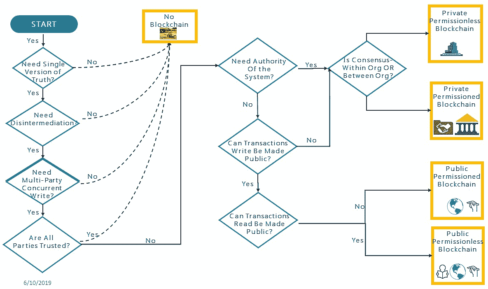

区块链的类型

上述图表清楚地突出了可以帮助您识别所需区块链网络类型的合格条件。

# 商业网络的结构

到目前为止，作为设计策略的一部分，我们已经确定了使用情况以及用于证明对区块链需求的合格/因素。 我们还分析了使用情况，并就所需的区块链网络类型达成了一致意见。 从本章开始，我们将专注于许可区块链，因为本书是关于 Hyperledger Fabric 和许可区块链的。 在本节中，我们将重点介绍基于区块链的业务网络的结构定义，特别是对于许可区块链网络。 许可区块链业务网络由一个以上的企业组成。 它们解决了一个共同的业务问题，并且希望利用区块链技术的优势。 因此，首先出现的问题是如何定义许可区块链网络的范围和结构。

定义结构是至关重要的，因为它会影响税收、法律、管辖权和治理。 许可区块链网络可以结构化如下：

+   **基于联盟的商业网络**：它们可以是联合企业，其中所有成员都像创始人一样：

    +   **合资企业**（**JVs**）：这通常是一个庞大的中央结构。 合资企业是刚性的，并且通常将创始人置于主导地位。 但是，如果忽略了合资企业的缺点，那么组建一个联盟是一个有效的选择。 每个成员（以财务参与形式）可以被添加为创始人，并且可以在创始人之间形成合资企业法人实体。 他们可以民主决定联盟的设置、维护和运营。

+   **创始人驱动的商业网络**：创始人驱动的商业网络由创始人建立和维护。 在这种情况下，创始人能够处理业务网络，并可以决定未来技术方向。 它们可以是以下类型之一：

    +   **基于软件许可驱动**：这是指一个技术公司或解决方案/平台提供商为创始人驱动的商业网络提供支持；例如，IBM 或 Oracle 从头开始构建一个解决方案，负责处理财团。这种配置可能导致技术集中化。

    +   **开源驱动**：这样的网络由一个开源巨头运行；Linux 基金会的 Hyperledger 项目和以太坊就是例子。开源仍然缺乏企业支持、项目治理、项目财务等能力。

+   **基于社区的商业网络**：这些是由社区驱动的区块链网络，其要么由标准驱动，要么是自主驱动的：

    +   **许可去中心化自治组织**（**pDAO**）：**去中心化自治组织**（**DAOs**）就像合作组织一样，不同的合作方提供资金。例如，用于无许可 DAOs 的资金由 ICO 和代币安排。也可能存在一种 pDAO，其中财团的治理在规则中设定，这些规则体现在链码本身中。在这样的配置中，是链码驱动财团的运作。财团的创始人可以处理财团的设置和维护。操作会由链码自动处理。

# pDAOs

pDAOs 是去中心化的（无单一管理机构）和自治的（自给自足）。这意味着它们是由参与企业拥有的基于社区的区块链网络。然而，运营、资金和争议解决都将由治理自主许可组织的链码自动处理。这种企业财团的设置将消除维护和处理财团运作所需的庞大企业行动。所有决策都是*民主的*，由处理财团运作的代码驱动。这样的企业财团将定义链码的*运作*和*维护*。实质上，它们首先会定义商业网络的宪法。之后，链码将负责自动实现宪法。每个提案，比如添加和移除成员，都可以作为交易提交给链码，链码将负责在区块链上执行它。这样一个由社区驱动的区块链网络是为区块链而设的，由区块链驱动，为区块链所用。权力不掌握在少数人手中；它是分散的，有特定用例的底层许可网络和链码驱动的许可。

我相信 pDAO 可能是企业区块链采用的未来。这样的企业联合体可以由少数参与者开始。所有的法律确定性都可以通过法律结构解决，差异可以通过仲裁者解决。阅读我的下一本书，*面向解决方案设计者的区块链*，其中详细介绍了 pDAO。

# 商业网络目标和治理

上一节概述了如何定义和选择区块链的结构。设计策略的下一步应该专注于建立业务网络目标和治理。定义业务网络目标和治理也需要分析结果，在定义区块链网络时收集。本节与上一节并行进行，因为上一节中做出的决定在这里得到了确认。

在选择区块链结构之前，需要分析各种问题。以下是一些将对选择特定区块链结构产生强烈影响的问题：

+   如何确保联合体不会导致权力集中？

+   谁控制联合体？

+   主要的联合体成员是否比后加入者获益更多？

+   谁从已存在的基础设施中受益？这是否会给新加入者或后加入者带来困惑和基础设施依赖性或锁定？

+   谁决定新成员的加入或成员的排除？

+   谁决定联合体的非核心成员的纳入/排除？

+   运营决策将如何执行？

+   联合体将如何融资？

+   争议如何解决？

治理是一个更广泛的话题，超出了本书的范围。目前，你应该理解它是定义业务网络以及从维护和运营角度扩展业务网络的重要步骤。

# 争议解决和仲裁者

由于联合体包括各种企业和独立方，因此它具有自己的业务复杂性。这些复杂性可能导致争议。因此，联合体必须有仲裁者来解决争议。这意味着联合体需要一个仲裁功能，负责处理联合体成员之间的参与合同（通过法律文件）。这可能是负责处理法律文件的注册会计师机构，直到这些文件也变成智能合约（链码），其作为智能仲裁者。

一个联合体可以聘请智能合约（链码）审计员来验证智能合约，并验证智能合约与外部应用程序和数据源的接口和集成。这样的独立审计员将为联合体提供保证，并帮助发现漏洞。

# 参与、实验、体验和影响

一旦您探索了设计策略，就是与*现有*流程和*将来*流程进行交互并定义解决方案的时候了。 解决方案的整体设计将确保流程、用例和技术之间的同步性。 用大爆炸开始区块链解决方案可能是一个问题。 选择一个**最小可行产品**（**MVP**），并为未来的增强制定草图。 从一个简单、清晰但关键的用例开始。 这样做有两个好处：

+   简单和清晰的流程将帮助您以有效和及时的方式将要求转化为解决方案。

+   用例的关键性将巩固区块链处理关键用例的能力

从一个较小的区块链业务网络开始。 尽量不要包括仲裁员、监管机构和大型联盟。 设计一个可扩展和动态的解决方案，但构建一个满足用例范围的最小可行产品。 关于此的详细信息超出了本书的范围。 您应该遵循敏捷的方式开发基于区块链的解决方案。 您可以在我的下一本书《*面向解决方案设计者的区块链*》中了解更多有关区块链解决方案设计的信息。

# 区块链属性和用例

DLT，如区块链，被视为本世纪最具颠覆性的技术进步之一。 尽管它需要克服许多监管挑战才能成为大多数的一部分，但区块链的各种属性使其真正革命性。 正是区块链的属性为各行各业提供了无数的潜力。 在本节中，我们将讨论区块链的属性以及由这些属性催化的用例。

# 区块链属性

随着区块链的首个应用比特币的巨大成功，以及以太坊和超级账本的出现，企业、组织、行业领袖、企业家和个人已经意识到，区块链不是一个异想天开的梦想，而是一场真正的革命，将把今天的企业跨越各行各业推进到一个新的数字化企业时代。 DLT 和区块链的各种属性可以实现去中心化的自治市场，促进交易和协调摩擦的减少，允许安全地维护和共享去中心化的记录，并使消费者和企业能够追踪产品、供应和文件的来源。

以下是区块链最重要的属性列表：

+   **共享和透明的访问**：这导致数据的一致性，允许参与者在更新在参与者之间复制时访问一致的数据。 对于经许可的区块链，它仅允许授权参与者访问数据。 透明度增强了系统的审计性和信任，并降低了欺诈和审计的成本。

+   **不可变性**：区块链是只能追加的；记录不能被更改或删除。不可变性增强了系统中存在的信息的信心，并减少了欺诈的潜力。

+   **验证和不可否认的交易**：只有在达成共识后，交易才会被添加到区块链中。因此，交易的有效性不容否认。

+   **隔离保密**：通过许可区块链，交易可以被视图访问，只有授权参与者或方能进行更新。

+   **去中心化**：像区块链这样的分布式账本技术是没有中央机构控制的去中心化 P2P 网络。这导致了第三方和中介机构的消失，从而进一步降低了交易成本并实现了几乎实时的交易执行。

+   **分布式账本**：所有参与节点都维护账本的副本。因此，不需要对账，因为分布式账本技术保证了数据的一致性。由于数据一致性得到保证，因此不需要对账、争议解决和由于争议解决而导致的延迟。

+   **智能合约**/**链代码**：业务逻辑在智能合约或链代码中编写，由参与者验证并共享，从而在自动化业务流程中形成高度信任。在区块链中，任何资产都可以被数字化表示，交易将根据这些智能合约或链代码中定义的业务逻辑进行执行。

+   **韧性**：无信任的生态系统，健壮性、机密性和可用性是我们先前讨论过的其他几个特性。

这些特性不仅推动了各行业各种用例的演进，还解决了分布式账本技术和区块链的认知挑战。除此之外，区块链可以被定制为诸如 Hyperledger 之类的许可区块链。在许可区块链中，只有授权方才能访问区块链网络，并且只能查看和更新相关信息和任务。尽管许可区块链需要精心规划，但它消除了企业对区块链的担忧。诸如**Oracle 区块链平台**（**OBP**）之类的各种 BaaS 为许可区块链提供解决方案，并推动了许可区块链的采用。因此，BaaS 本质上正在催化区块链革命的采用。

# 特性和使用案例

区块链有几个颠覆性属性，对各行业具有吸引力，并为整个行业范围内的一系列用例提供了解决方案。尽管金融业继续是探索和实施 DLT 和区块链用例的主要新兴参与者，但区块链具有吸引力的几个优势/属性对一个行业也具有吸引力，例如不可变的永久记录、公共记录存储库、通用格式、可访问性和带有时间戳哈希的公证，并且它们还解决了各种政府和法律用例，如投票、提案、治理服务、交易组织、点对点债券、土地所有权、IP 注册、税收收据、公证服务和文件注册服务。

同样，分布式账本、去中心化网络、交易共识和无信任对手等属性吸引了数字货币、支付、汇款、金融行业、银行业、保险业、结算、交易、衍生品、内部审计和众筹等市场的用例。区块链和 DLT 的属性，如大规模协调、交易安全性和通信（也称为消息传递），对物联网（IoT）领域非常有吸引力，并推动了诸如智能家庭网络、连接汽车、智能城市、个性化机器人、数字助理、无人机和传感器网络等大量用例的链条。医疗保健用例，如数字健康钱包、智能健康令牌、健康数据分析、健康数据库、通用电子病历和个人发展合同，可利用 DLT 和区块链的属性，如大规模多流集成、隐私和安全、实时可访问性和通用格式。

上述属性还涉及艺术、科学和人工智能用例，如点对点资源网络、鸦片分析、社区超级计算机、电影、艺术追踪和跟踪、区块链倡导者、数字思维文件和区块链学习者。以下图表列出了一些用例，仅是对 DLT 和区块链为企业、组织和个人带来的可能性和机遇的一个初步了解：

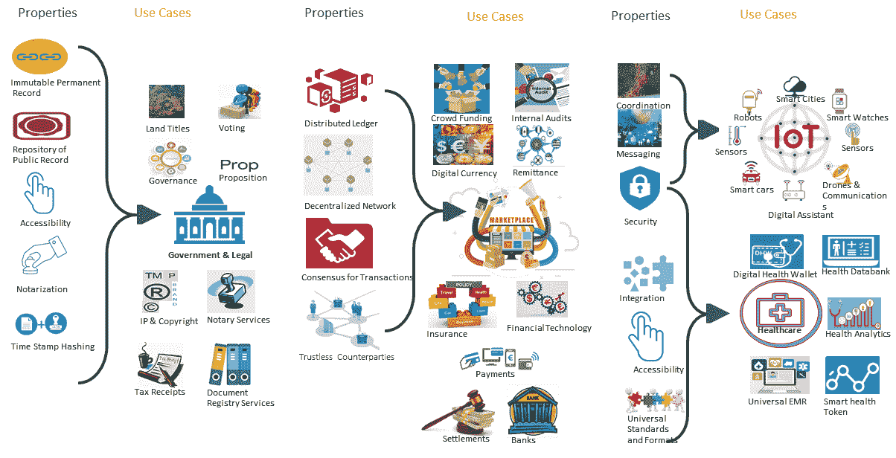

属性和用例

上述图表显示了帮助实现各种行业用例的属性，如政府、法律、市场、物联网和医疗保健。属性列出了属性，而用例列突出显示了对于特定行业最具吸引力的用例。

# 用例类型

广义上讲，区块链是一个理想的用例，用于由自身附加在协商的非可交换交易上的分布式账本上的分布式共识。在本节中，我将把区块链用例分类为几个类别；然而，我相信存在数百万个用例，这是非可交换状态转换函数的结果。列出的用例分类是详尽的。

让我们从简单地将区块链的定义放入一个等式开始：

*区块链* = *谁拥有* - *什么*，*何时*，*以及多少*

*何时* 是时间线，而 *多少* 是数量。然而，*什么* 是这里讨论的主题。我对区块链进行分类的努力集中在 *什么* 和 *谁* 上。

**什么：** *什么* 代表资产；基本上是宝贵的稀缺资产。身份、货币、土地所有权、合同、投票、来源和付款等资产是宝贵且稀缺的。让我们分析区块链的各种应用，并检查它们实际上管理的是什么。比特币管理账户，以太坊管理合同状态，Everledger 管理与钻石相关的事件，而 Ripple 管理信任线，等等。同样，对于 Hyperledger Fabric，资产可以是有形资产，如房地产和硬件，而无形资产可以是合同和知识产权。因此，区块链是那些要求通过记录在不可变账本上来建立分布式共识以交易这些资产的情况的潜在解决方案。

**谁：** 在任何给定时间点，区块链都是一种货币、网络、协议或平台。这是一个推动世界走向 **DAO** 或 **分布式自治社区**（**DAC**）的概念。我将在整个过程中交替使用这些术语。

组织或企业是一组共同努力实现一定目标并遵循规则的人员。这些组织拥有资产和负债，这意味着有一组人员和法律合同确立了持有资产和拥有负债的真相。一个组织的行为是因为一组关键人员之间存在相互共识。同样，雇佣某人意味着雇员同意提供某些服务，而雇主同意提供货币和其他福利。在所有这些情况下，都存在合同（一组规则）。

问题是：我们真的需要管理层来执行这些规则吗，还是我们需要在某些业务功能上的某些工作来执行这些合同？工业化通过在底层引入机器来回答了这个问题；像区块链这样的 DLT 是否也能在顶层做到这一点？组织建立和运作在合同和规则上，同时遵循法规，这又是一套规则。组织执行这些合同和规则以产生收入，提供服务，并为他们为组织提供服务而支付的员工支付工资，以便组织可以向客户提供服务并向政府支付税款。这些不能通过软件来实现吗，特别是通过区块链和 Hyperledger 这样的 DLT 来实现吗？

对我来说，答案是*是*，而且人的参与很少。可以有 DAO（也称为 DAC），其中资产所有者是利益相关者，智能合约和链码是管理组织的日常、战略和战术运营的规则和合同。参与节点本身就是员工，他们负责最小限度地验证、核实和达成共识，并获得最少的奖励。是的，现在完全勾画出 DAO 即将到来的未来还为时过早；可能会有一个由超级智能合约管理政策和关系的分布式一世界政府。

现在回到*现在*，并回顾前面的等式，让我们集中精力放在*谁*上。在采用区块链时，您应该寻找的关键要素如下：资产是什么，业务在向区块链迈进时将同意什么共识机制？您是否计划建立一个 DAO，还是您的业务计划建立一个各方将进行交互并建立一个财团的业务网络？在这里，我暗示了区块链的许可和非许可世界。无论哪种情况，*谁*都很重要，需要确定。由于 DAO 和 DAC 的世界正在展开，我正在考虑一个由智能合约和链码推动的市场作为区块链用例的一个类别。分布式账本世界变得越来越成熟，世界将更接近 DAO 和 DAC 的现实。现在，让我们再次回到等式，并看看除了*什么*和*谁*之外的另外两部分。这两个部分是*什么时候*和*多少*。实际上，*多少*是一个泛指，表示资产的数量和所有其他参数。*什么时候*有助于分析时间表、事件日期和交易。

现在，问题是，我们如何获取关于*谁、何时、什么*和*多少*的信息？这些信息是区块链生态系统的一部分，并带来了第三个最重要的用例类别，即分析。进入设计和开发，并始终提出解决方案的可见性方面。根据该等式及其周围的定义，区块链用例有三个主要类别：

+   数字资产

+   数字分析

+   数字平台

在本节中，我们将深入研究这些类别，并列出这些区块链用例的子类别。

# 数字资产

当我们使用术语“数字资产”时，我们统计了一大堆资产，主要分为以下几个类别：

+   有形资产和

+   无形资产。

下面是有形资产的子类别：

+   **金融资产**：货币、股票（上市和非上市）、债券、衍生品、大宗商品、金融、小额信贷、慈善事业和众筹。

+   **记录**：记录可以是公开的、半公开的，也可以是其他类型的：

+   **公共记录**：

    +   财务记录，如支出记录、交易记录、抵押记录和服务记录

    +   公共记录，如企业所有权记录、监管记录、企业设立/解散记录、卫生/安全检查记录、移民记录和政府法律

    +   标题，如地契

    +   注册，如车辆注册和法证证据

    +   许可证和许可证，如营业执照、建筑许可证和枪支许可证

    +   证书，如出生证、死亡证和结婚证

    +   数字身份，如护照、社保号码、唯一标识、选民身份证、投票、产品的数字代币等

+   **半公开记录**：

    +   证书，即学位、成绩、学习评估报告等

    +   记录，如员工记录、行为记录、医疗记录、会计记录、业务交易记录、仲裁、供应记录、递送记录和公民记录

+   **私人记录**：

    +   合同和担保

    +   个人，如遗嘱、信托、签名和 GPS 数据

    +   密钥，如车钥匙、酒店钥匙、公寓和家庭钥匙、储物柜钥匙、租车钥匙和包裹递送钥匙

下面是无形资产的子类别：

+   无形资产，如优惠券、门票、专利、预订、商标、版权、许可证（如软件许可证、视频游戏许可证和电影许可证）、域名、艺术证明（如作者、照片和视频或音频所有权记录）

+   杂项，如温度记录和体育记录

在这里，我们尝试列举一些这些资产。然而，在区块链上管理和记录这些资产的用例有很多。此外，还有一种特殊的用例类别，处理某些资产的来源，并且大多数情况下实施在供应链管理案例中，例如从供应商到货架的追踪，追踪药品，以及药丸的保管。以下是这些用例的可能子类别：

+   数字身份

+   证据来源

+   记录

让我们再多谈谈这些子类别。

**数字身份**：身份盗窃和身份欺诈是数字世界常见的头条新闻。每年全球都会有数十亿的记录被窃取、丢失和泄露，三分之二的数据泄露是由于身份盗窃和身份欺诈。区块链 DNA 包括不可变性和本地身份验证，这抑制了身份盗窃和身份欺诈。例如，如果身份验证系统仅基于生物特征，那么身份验证问题就被省略了。因此，银行、政府和组织可以使用极为准确的结果。即使在生物特征身份验证变成现实之前（不仅仅是在特定情况下全世界都能使用），私钥所有权也是一种高度安全且验证身份的成熟方式，其中密钥是数字资产。因此，用户身份可以在不暴露宝贵信息（如个人数据）的风险下进行管理和验证。通过数字代币对人类身份、物品身份和独特性进行验证和管理。数字代币是将物理物品与物品的数字身份映射的资产。然后，这个数字代币可以用于供应链管理，以证明来源，例如为知识产权赋予权利。

**记录**：区块链不是一个去中心化的数据库；它是一个记录系统。每天、每时每刻，企业都在与这些资产进行交易，资产在供应商、客户、合作伙伴和个人之间进行交换。区块链是一个记录这些交易和这些资产的数字身份的系统。这是不可改变的，增强了系统上存在的信息的保密性，并减少了欺诈机会。 此外，一致达成共识后，交易将添加到区块链中的块中。因此，无法否认交易的有效性。

**产品溯源**：凭借独特的数字身份（数字代币），任何物理物品都能证明其真实性和起源。由于总账中的记录是不可变的，物品可以从其起源追踪到终点。追溯性检查假冒产品，并允许消费者在拿取物品前获得充分信息，因为现在责任转移到了消费者，因为消费者对产品的起源、历程、运输中的温度、农场、地区等有充分了解。消费者可以作出明智的决定。有了产品溯源，每个产品都将说出真相。公司了解他们获供的材料，可以检查是否使用了劣质物品来制造产品，并了解可能出现的问题。

此外，区块链将消除组织因检查物品和产品而产生的成本。这就是为什么产品上市时间缩短而信任倍增的原因。对于追溯性，区块链引入了产品的透明性、可持续性和信任。最终消费者在拿起产品之前就对产品、成分和其历程有充分了解。区块链允许对产品进行智能追踪和追溯，并管理产品的数字身份（例如，序列号），记录其起源，标记构成部分的认证，并跟踪产品在转变、包装、运输、存储和上架过程中的整个旅程，同时管理监管合规性，召回和检查产品的真实性。

这些子类别是相互关联的。例如，对于追溯性，产品的数字身份是必不可少的。该产品的交易，比如转化、包装、运输、存储和上架都被记录在总账上，以便分析产品的数字足迹。这些数字足迹帮助消费者跟踪和追踪产品。但在更广泛的层面上，我们将它们视为追踪和追溯分析用例的推动因素，尽管它们主要与资产的数字记录有关。

# 数字分析

区块链总账是一个不可改变的记录系统。随着世界开始采用越来越多的区块链用例，想象一下在无需权限的区块链中包含的巨大数据量。即使是有权限的区块链也会有财团或私人数据，这些数据将继续大规模增长。区块链上的分析和预测分析将揭示许多故事、事实和见解。这样的生态系统将提供实时、可信且未经篡改的信息，这将不仅赋予企业而且赋予小型组织和个人分析信息的能力，在有权限的区块链中，相关（经授权的）信息。

区块链在金融技术中有许多用例，比如贸易融资，智能合约和去中心化应用程序（dApps）可以被创建来增强支付速度，并减少跨境和各方执行交易所需的时间。区块链智能合约、链代码或 dApp 可以简化结算和清算功能。这些 dApp 将导致巨大的交易和贸易数据，合同和交易数据根据这些合同执行。这些数据对战略和战术目的非常有用，数字区块链分析将有助于分析区块链数据。这导致了诸如**反洗钱**（AML）和欺诈分析、风险分析、交易执行、运营分析、合规报告和监管报告等区块链分析用例。

# 数字平台

一组组织可以建立一个平台，让他们的客户以统一的系统与他们互动。或者，几个个人可以从家里或智能设备上投票进行变革，结果将在当天可用。所有这些都是可能的，因为建立在区块链平台上的现代转型应用程序的数组。这样的应用程序被称为 dApp。

dApp 提供了一个去中心化的平台来构建去中心化应用程序。这些 dApp 继承了区块链的许多好处，如点对点交互、无信任系统和可靠性的共识。由于 dApp 继承了区块链的好处，构建在一个区块链平台上，数据不是集中记录的，而是分布式的。这排除了单点故障的可能性，提高了交易速度，因为不需要调和，降低了成本，因为没有第三方参与，减少了欺诈及其相关成本，同时增强了透明度。应用程序上市所需的成本和时间大大减少，而且区块链很容易与旧系统集成，因此给企业提供了区块链与传统系统共存的机会。

在 dApp 之外，还有 DAO 和 DAC 的世界。智能合约/链代码可以被设计成可以执行大部分业务功能。区块链可以通过执行作为智能合约或链代码的一部分编写的法律合同和规则来运行业务，并参考记录、数据和文档，这些记录、数据和文档都记录在区块链账本上。

区块链应用市场是一个重要领域，许多应用程序可用于解决简单到复杂的问题，这些应用程序建立在诸如以太坊用于无需许可的应用程序、超级账本面向许可用例的区块链平台，以及超级账本和**物联网协会**（**IOTA**）用于基于物联网的用例等区块链平台之上。例如，股票交易遵循 T+3，即交易在被接受后三天结算。使用区块链，交易可以立即结算。政府法规可以纳入到 dApps 和 DAO 中，因为合规性是可以编码进智能合约或链码的政府规定。这将使法规融入到 dApps 和 DAOs/DACs 中。有关 DAOs/DACs 的详细信息，请参阅前一节。

区块链与物联网的结合提供了一个生态系统，其中机器之间的互动被记录、处理和共享。区块链将物联网数据的不可变记录添加到区块链分类帐中，从而为物联网系统带来了无需信任和透明性。通过设备的数字身份，区块链允许对设备进行身份验证、验证身份，并为许可和无许可用例开启了多种用例。IOTA 是物联网的数据层，它依赖于一个称为**有向无环图**（**DAG**）的 DLT，在这里重点是执行和记录机器之间的交易。

以下图表显示基于三个主要用例类别的不同用例：

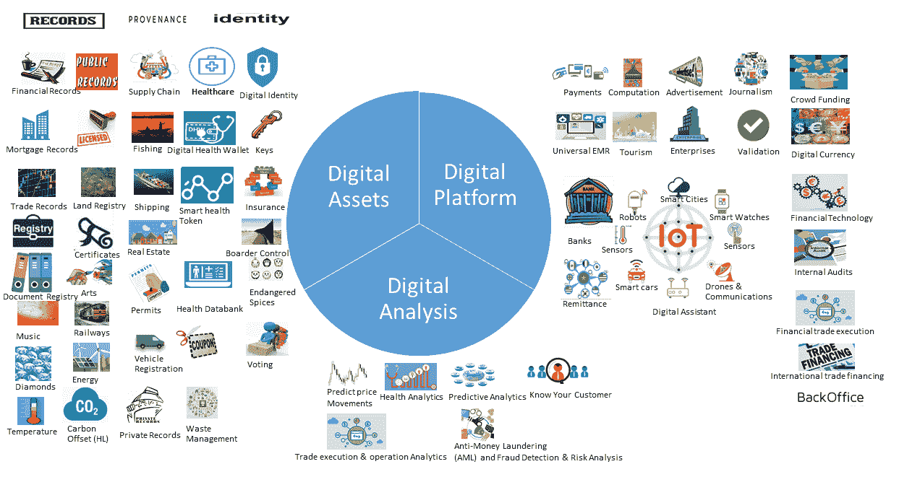

分类的用例

接下来的部分将深入探讨一些用例。

# 探索用例

在*设计策略*部分，我们试图为基于区块链的商业解决方案定义一个设计策略，其中包括五个步骤：探索、参与、实验、体验和影响。在本节中，我们将专注于第一步。在这一步中，我们将探讨几个区块链用例。它们如下：

+   房地产登记和所有权转移

+   了解您的客户

+   发票保理

# 政府 - 房地产登记和所有权转移

不动产由政府记录和维护，主要在地方政府层面。例如，一个国家的评估员负责记录和维护国家的财产记录。虽然一些国家已经数字化，但许多国家仍然使用传统方法，并依赖于纸质系统。多多少少，记录导致了合法所有权、交易记录的记录以及检查非法处置。本质上，记录是合法所有权的证据。在这个记录过程中，政府是一个值得信赖的权威，负责维护财产记录，评估其价值，并征收税款。作为一个值得信赖的中央权威，政府机构提供信任并倡导透明度。此外，政府的中央权威还提供了一套程序，用于认可财产权、保护文件、将财产权显示为透明的公共记录，并提供无缝的方法来转移这些权利和记录转移交易的所有权。简而言之，公众寻求记录和权利维护，产权和权利的转移，以及记录转移交易和信任。

这不是听起来像是区块链可以解决的有效用例吗？事实上，许多地方和国际政府已经开始采用区块链来在区块链上数字记录土地所有权记录。它在许多方面都有所帮助，比如透明度、保护记录、检查欺诈性转移以及记录转移。这个用例涵盖了一个简单的区块链解决方案，用于不动产登记、评估和上市。

# 当前流程存在的挑战

记录一项行为会产生行政成本。通常，文件通过电子表格、邮寄、电子邮件或亲自递交纸质文件至登记处。然后，将其扫描并上传至文件存储中。这导致记录被发布到中央存储中。从那时起，记录的信息被用来确定记录的所有权。该记录的所有权也对公众开放供参考。任何进一步的交易，如所有权转移，都需要在同一中央存储中进行。这是昂贵、低效、容易出错和耗时的。

# 区块链，救星

记录将存储在区块链或政府的中央知识库中，其引用可以在区块链上。有关大型对象存储的更多详细信息，请参阅第三章中的*大型*对象存储-*在链上或链下*部分，深入了解超级账本的细节。土地或房地产所有权记录为数字资产，并可在区块链上供公众参考。交易可以针对这些资产执行，并且资产可以快速转移。政府机构不需要一直扫描文件、打印标签、记录文件并对其进行维护。该数字资产的所有信息都在不可变的区块链中可用。税收交易也可以针对这些资产执行。可以评估房地产价值，并且该价值评估可以作为这些数字资产（房地产）的交易发布在区块链上。一切都记录在一个地方，并且可以基于区块链记录生成分析和报告。区块链为对数字资产（房地产）执行的所有交易提供了可追溯和可审计的记录历史。

各种交易，如单个包裹更改交易（其中数字资产被拆分、合并或重新分类），可以记录在区块链上。各种建议，如 58 和 193（指加利福尼亚州的道具），导致父母与子女之间或祖父母与孙子之间的房地产转让交易，可以记录在不可变的分类账上。各种其他生命周期事件，如地址更改和任何属性更改也可以记录。由于数据可在区块链上获得，因此很容易与其他部门共享，并且这也使得其他部门可以连接到一个来源以获取相关信息。各种其他交易也可以发生在数字资产上，例如估价、评估和卷校正，这些交易可以在数字资产上进行，并且可以记录以进行审计和可追溯性。

用于房地产（也称为*房地产*或*房地产*）登记的区块链解决方案可以是**RealPropertyChain**注册表。这是一个区块链解决方案，其中记录了房地产记录，如土地记录和建筑记录。这些属性在区块链上被识别为数字资产，并且对这些数字资产（记录）的交易被记录在区块链平台上：

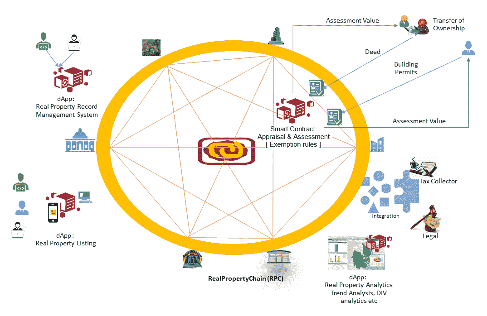

房地产登记和评估的区块链解决方案

前面的图表展示了一个简单的用于房地产登记、评估、上市和分析的区块链解决方案。它是一个具有以下组件的区块链平台：

+   有一个注册房地产的 dApp，它还将验证并将纳税人与之关联。它被称为**房地产记录管理系统**。记录的房地产将拥有数字身份，系统将识别它为具有定义所有权和确定纳税人的独特数字资产。如果财产已记录，则可以使用财产的唯一数字资产 ID 来验证它及其所有权。

+   有一款允许您列出房产的 dApp。同样，房地产所有者授权列出房产。此列表将允许您买卖房产。如今，有**多重列表服务**（**MLSes**），这是一个房地产数据库，房地产经纪人需要支付费用以列出、购买和出售房产。各种网站，如 Zillow，与这些 MLSes 合作处理住宅物业，而其他公司如 CoStar 与 MLSes 合作处理商业物业。为了出售您的房产，您需要支付注册到这些 MLSes 的经纪人。有时候是销售价格的 6 到 9％。这是一项昂贵的交易，为了获得更好的交易，您可能需要与 MLS 合作以拓宽市场范围。基于区块链的 dApp 正在寻求在区块链上列出*授权*房产。现在买卖透明，交易不可更改，人人可及。

+   区块链去中心化应用（dApp）也可以被创建用来分析房地产数据，展示趋势、评估价值变化和房地产交易。

+   可以创建诸如**评估与评定**等智能合约，它可以处理所有权转移、建筑许可等。例如，当一项财产（数字资产）发生转移时，区块链会收到契据的副本。智能合约将根据州法判断是否需要重新评估。如果需要重新评估，则智能合约通信服务将确定财产的新市场价值并将新的评估价值传达给纳税人。此类智能合约还将处理免税规则，如残疾免税和退伍军人免税。此外，某些所有权转移，如丈夫到妻子，不会导致重新评估。这些智能合约处理此类评估规则，并为纳税人创建新的评估价值。智能合约还可以与纳税人沟通，提供新的评估，让房产所有者在不同意评估价值时提出申诉。

+   其他系统，如法律和司法系统以及税务收集者，可以轻松连接到区块链并从中访问相关的授权信息。

# 区块链解决方案的优势

区块链解决方案在财产登记、列表和评估方面的优势如下：

+   **效率**：目前，契据记录是昂贵的。将房地产登记引入区块链平台会导致**房地产作为资产服务**（**PaaAS**），在其中被不可变地记录下来。随后的交易，如所有权变更、评估和评估，可以由智能合约来处理，这增加了效率；它更少出错，更高效。

+   **实时**：房地产记录实时更新。所有权转移、评估和重新评估计算等交易几乎可以立即由智能合约执行。区块链增强了公共信息的透明度和准确性，实时性得到了提升。

+   **不可变的交易**：由于数字资产注册和交易记录位于 DLT 上，它是不可变的，容易受到攻击，并且防篡改。像海地发生的地震这样的自然灾害，导致土地记录被摧毁可能会发生。这种情况在像区块链这样的不可变账本上是不会发生的。

+   **信任**：区块链为房地产登记和记录、房地产交易记录、房地产挂牌、自动评估和评估、易于集成等提供了信任、透明度、效率、准确性和安全性。这表明，区块链是中心化房地产登记、所有权和交易系统的强大替代品。

# 社会因素

基于区块链的土地所有权登记解决方案对于像洪都拉斯这样的国家意味着很多，世界银行向洪都拉斯政府发放了美元以帮助其数字化土地所有权。中心化系统并不是可行的解决方案，因为腐败分子可能会对其进行黑客攻击和篡改。区块链解决方案是这种问题最合适的解决方案，因为它是不可变的，无法被篡改。另一个例子是印度，那里有三分之二的民事案件与土地和房地产有关。根据政府数据，有 2200 万个待处理案件。其中，有 600 万个已经拖延了五年以上。在区块链平台上，土地和房地产记录是具有独特数字身份的数字资产。它们被不可变地存储在账本上，区块链系统将处理这些数字资产的交易，如所有权的转移、属性的变更、新建筑和贷款。用户、授权机构和政府几乎可以即时地跟踪和追溯数字资产的整个历史。这样的系统将是高度无组织和腐败地区的福音。

# 房地产众筹

另一个有趣的用例与前面的用例相一致，与房地产众筹有关。房地产众筹，其中代币代表了房产的部分所有权，已经存在了很长一段时间。但是，当您想要变现而您的合作伙伴在那个时候还没有准备好时，问题就出现了。通过数字资产（如房地产）的基于代币的所有权，您可以交易您的代币而不必担心问题，并根据您的意愿和需求变现。代币或固定数量的数字代币可以代表数字资产（如土地、建筑物或公寓）的所有权百分比。根据百分比，您将获得租金收入或股息。对于那些想要进入房地产并想要投资房地产但也想要从小额投资开始的人来说，这是一个开放的窗口。现在你可以拥有一部分企业、一部分房屋或一部分公寓，并从其租金或股息中获得潜在收益。

# 金融科技 - 了解你的客户

为了检查法规风险、洗钱、未经授权的融资等问题，银行正在花费数十亿美元来吸纳新客户并为现有客户维持合规性。虽然开立账户是一个简单、直接的过程，但它涉及法规程序来识别和进一步验证申请人。这些过程被称为**了解你的客户**（**KYC**）。这个过程面临着不断变化的监管变化，需要及时更新以满足合规要求。它是复杂的、耗时的和昂贵的。大约每家银行每年花费 6 亿到 3 亿美元。每个 KYC 大约需要 5 到 45 天的时间，平均需要 24 天才能完成新账户的开立。此外，金融机构需要维护他们的系统和流程，以保持符合不断变化的监管要求。此外，由于从一家银行到另一家银行的变化，客户并没有统一的体验。除此之外，银行每年共同花费数十亿美元用于反洗钱。

显然，所有金融机构和银行的负担导致客户开户不良。在这种情况下，区块链是一个潜在的救星，因为它允许金融机构共享负担。此外，它消除了努力的重复，因为客户详情将在共享的分布式账本上可用。通过区块链启用的 KYC 流程，客户的最新信息可在共享的分布式账本上获得。参与的金融机构和银行将就是否需要对客户数据进行更改达成共识，并参与一种基于共识的联合方法来验证申请人。

目前，KYC/入职涉及从申请人收集文件，与信用机构合作验证申请人的身份，并将其纳入 AML 和非法金融交易。这一链条涉及多个参与方，耗时、费用高、缓慢且容易出错。

# 现在

目前，KYC，也称为入职过程，面临许多挑战。首先，由于信用、账户、法律和运营等不同部门遵循不同的流程，缺乏结构。由于每个部门对法规的解释不同，因此每个金融机构或银行都有单独的流程。其次，这些流程需要遵守不断变化的法规。第三，需要一系列文件和各种接触点来验证申请人，这增加了时间和成本。

# 未来

像加密、安全、散列和透明度、不可变性等特性的区块链技术将确保银行试图访问的记录准确、一致、安全、可靠和真实。由于数据是共享的，它既不受单一实体控制，也没有单一故障点。凭借共识，数据也是可靠的。区块链上的客户/申请人个人数据的可用性是一个可以解决的问题。每个金融机构和银行都可以维护自己的安全数据库来托管其客户的数据，并且只分享到区块链的链接或区块链的令牌。

对于申请人，金融机构或银行执行 KYC 过程，以验证申请人的身份。这确保个人没有参与任何非法金融交易。申请人向金融机构或银行提供某些信息，然后由银行的业务线（LOB），也称为部门，使用该信息来验证申请人是否参与 AML 和非法融资活动。通过 KYC 的区块链解决方案，即使参与的银行也可以在安全的共享不可变账本上分享申请人的验证。客户的任何错误交易都将立即引发对区块链的警报，这可以由参与的银行和金融机构使用来标记该客户。

KYC 本质上是涉及多方的身份移动。由于区块链是共享的、不可变的、可靠的和安全的，并且没有单一的权威或单一的故障点，银行和金融机构不需要协调。

关于下图中的**预区块链 KYC 流程**，申请人提交文件，包括政府发行的身份证明文件，如社会安全号码、驾驶执照和护照，以及其他信息，如就业、商业税收和地址证明。银行收集这些文件，并在启动扫描后将其转发给中央中介以验证人员身份。中介将存储此类信息在中央数据库中，并将成本用于管理、维护和保护此类数据。这些成本进一步被银行传递。此外，每个参与的银行和金融机构都会重复相同的流程：

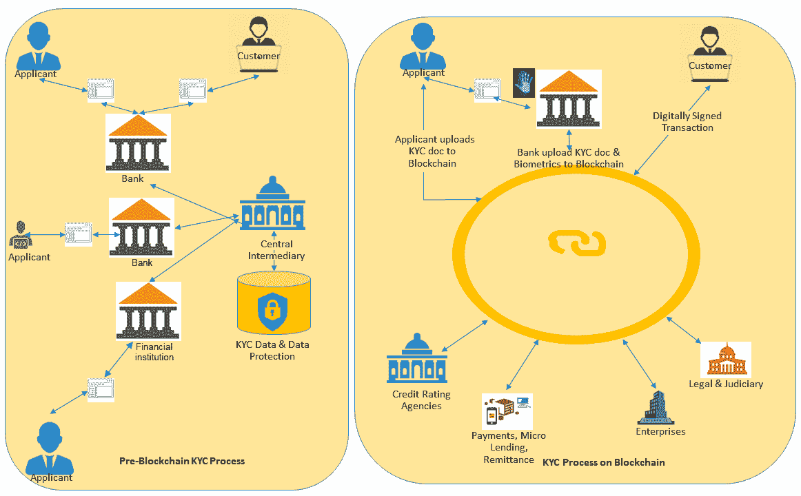

KYC 使用案例

虽然申请人提交了政府发行的身份证明，但仍然存在一个挑战，那就是保证级别。最主要的挑战在于证明*你是谁*。中介将检查各种数据源、信用机构等，但保证级别仍然是一个值得怀疑的问题。

如果申请人是第一次申请者，甚至连信用历史都没有怎么办？在最高保证级别中缺少的链条是对申请者的生物识别身份验证。申请者可以提供政府发行的身份证明文件，如护照、社会安全号码或驾驶执照，以及生物特征。通过匹配生物特征和政府身份，可以保证最高的保证级别。这意味着中央中介也必须具备生物识别数据。这增加了数据保护成本，并引入了复杂的设备，以便扫描申请者的生物特征。

# 区块链上的 KYC/入门流程

申请人的唯一数字身份是基于政府发布的标识符和生物特征生成的。生物特征添加了最高级别的保证，由政府身份证支持。这将作为客户在区块链网络上的唯一数字身份。这有助于申请人成为客户后进行跨境交易。另外，使用区块链 KYC 解决方案，没有中央中介，因此每家银行和金融机构无需重复进行 KYC 检查。共享的不可变分布式账本将提供给银行或金融机构请求，以及申请人的允许，用于跨银行和机构的客户活动。如果有任何可疑情况，它也会发出警报，让银行和机构标记该客户。对于客户执行的所有后续交易，其数字身份将附加到每个交易中，这意味着每个交易都具有客户的数字签名，具有最高级别的保证。客户的数字身份可以帮助您访问客户的相关信息，例如其地址，并让您跟踪和追踪任何交易。这也将帮助您标记任何可疑交易，并有助于减少错误的阳性。通过区块链，没有中央中介。因此，不存在单一故障点，不可变的共享账本成为真实性的来源。

# 在区块链上的处理

使用区块链，KYC/入职流程将如下进行：

1.  申请人携带其政府身份证、地址和纳税证明前往银行。

1.  银行将扫描文件，以及申请人的生物特征，并将其推送到区块链上（假设银行开始使用生物特征进行入职）。或者，客户可以直接将其 KYC 文件上传到区块链上（如前面的示意图所示）。

1.  区块链网络将使用政府身份证的某些属性，例如社会安全号码和出生日期，以及，如果启用生物特征识别，将使用生物特征识别来生成申请人的唯一数字身份。如果申请人已存在，验证的信息将返回给银行。

1.  当一个新的申请人被添加到区块链时，将执行一个交易，参与的银行和金融机构进行验证。因此，数字身份是经过高度保证的，并基于共识添加，这也意味着它是可靠的。同样，对已经存在客户信息进行的任何更改都可以在共识后追加到区块链上。所有更新和新添加都可以实时访问给参与的银行和金融机构。

1.  经验证的申请人将被添加为客户。

1.  由该客户执行的交易将始终包含其数字签名。

这确保了客户的数字身份的创建以及每个交易都有经过验证的数字签名。然而，让我们讨论谁可以访问区块链上的数据。由于数据可在共享的分布式分类帐上获得，因此第三方可以在获得权限后进行访问以进行验证。这样可以防止对数据的未经授权访问，并赋予个人用户和机构用户权力。

当申请人向银行提供信息以及其生物特征时，他们的数字身份是由区块链系统创建的。然而，在用户授予权限之前，没有人可以访问它。用户将拥有数据，其他人只能在用户提供同意后访问。用户可以通过登录 KYC 门户（作为区块链网络的 dApp 的统一 KYC 门户）并建立数据的私钥来授予权限。现在，银行和其他第三方可以访问数据进行验证，数据仍然由用户拥有。此外，每个验证请求和对用户数据的每次访问都将留下痕迹，这将赋予最终用户权力，并告知他们谁在使用他们的信息以及用途。

KYC 流程可以构建为智能合约，然后可在各行业中使用，并进一步促进标准化。区块链提供了严格的防欺诈检查，因为区块链上的数据是不可变的。银行和金融机构不需要单独进行验证。由于数据在共享的分布式分类帐上，各方可以访问数据，尽管它仍然由最终用户拥有。由于交易已签署，可以在整个区块链网络中发现任何欺诈活动。由于账本上的数据是受信任的，可靠的和不可变的，因此不需要进行二次验证。欺诈和欺诈交易可以实时发现，这节省了未检测到的欺诈和诈骗的后果。

我们之前讨论的 KYC 解决方案是客户的分布式数字身份解决方案。此外，将银行和金融机构引入区块链消除了冗余。使用数字身份签署交易有助于防范欺诈并识别非法和欺诈性交易。然而，KYC 及其基础的区块链数字身份解决方案还有各种用例。它可以找到需要唯一数字身份的用例的解决方案；例如，会员卡，法律体系和信用评级机构。除此之外，所有涉及交易的用例都是基于区块链的 KYC 解决方案的主要候选对象。示例包括赌注，数字权利，微型融资，P2P 借贷，汇款，全球支付，股权，债务，众筹，衍生品，投票，所有权，所有权记录，知识产权和医疗保健。

# 金融科技 – 发票保理

小型企业通常将其发票带给较大的融资公司，如银行，以获得融资。通常情况下，企业与企业和企业与政府的交易，尤其是采购，需要更长时间才能付款。公司通常将发票出售给发票融资公司，并可以为未付发票获得融资。通常情况下，发票金额的 75%至 85%。其余部分在发票融资公司收到金额后收到，剩余金额由发票融资公司扣除费用。发票融资公司收取的金额通常取决于付款条件。付款条件越长，发票保理公司收取的费用就越高。全球范围内，大约有 3 万亿美元的发票保理业务。全球范围内，大约有 2%的发票融资每年都受到欺诈行为的影响。

**今天有什么？**

银行和金融机构确实有检查欺诈并应对潜在风险的流程；但是，这是一项劳动密集型、手动、昂贵、耗时且低效的工作。以下是发票保理的主要步骤：

1.  供应商向其客户开具带有付款条款（30 至 90 天）的发票。

1.  供应商需要现金，因此达成协议将发票分配给了保理公司，其中包括费用和其他细节。

1.  发票被出售并分配给了一个保理公司。

1.  保理公司将预付发票金额的大约 80%。

1.  在发票到期日，客户支付给保理公司发票金额。

1.  保理公司在扣除费用后向供应商支付剩余的 20%。

**我们试图解决什么问题？**

大多数情况下，公司将发票提交给多个融资机构或银行。由于融资公司和银行之间缺乏集成的沟通机制，存在潜在的漏洞，可能成为欺诈的潜在点。由于公司有多个地方可以将其发票提交，并且由于金融机构和银行之间缺乏集成，它们不知道同一张发票被提交给多个融资机构或银行。此外，发票可能被篡改并提交给各方以获得融资。在这里，我们谈论了两个主要挑战：首先，相同的发票被发送给各方，其次，篡改的发票被发送给各方。除此之外，发票保理还涉及其他风险，如不付款和迟付款等。其他风险包括发票可能是假的，或者可能已被篡改。发票保理也是用于验证客户及其客户身份的用例。经过验证和建立的身份可以降低迟付款和不付款的风险。

将发票保理引入区块链将导致整个发票保理流程的去中心化。区块链智能合约将负责协议和验证参与者的信用（供应商及其客户，根据本节中的先前示例）。由于这是一笔不可变的交易记录，参与方还可以分析参与者的过去表现，有助于降低风险并增加整个流程的透明度。基于超级账本的区块链解决方案，特别是基于 Hyperledger Fabric 的解决方案，将有助于减少发票融资中由于缺乏沟通和双重开票而发生的欺诈。

# 财团为基础的解决方案

基于许可的基于 Hyperledger 的解决方案可以帮助公司在分类账上共享关于发票的关键信息，但不会向他们提供客户数据的详细洞察。尽管它是银行、金融机构等的财团，但它们是竞争对手。在财团为基础的解决方案中，发票卖方将与特定的因素（银行或金融机构）联系。发票的数字身份将在区块链网络上进行验证。在唯一性的情况下，该发票将被因素（银行或金融机构）考虑为保理。供应商可以允许其客户成为区块链网络的一部分，以便客户可以直接向因素支付款项。所有交易将通过区块链网络进行处理，由交易方的数字身份签名，并包含有关发票的数字身份（数字资产）的信息。

正如您可以想象的那样，发票的数字身份，也称为数字代币，由区块链网络发行并且是唯一的。因此，在区块链网络上不可能发生双重发票。此外，所有方，如银行和金融机构，都在财团中；因此，每个人都将了解发票，消除了任何沟通问题。这也将检查卖方同时向多家放贷人提供相同或篡改的发票的任何机会。如果他们这样做，发票将只支付一个请求，并且双重开票行为将永久记录在区块链上，这可能会影响卖方的信用评级。随着区块链网络的发展，可以更加重视卖方和放贷人的信用评分。卖方的评级越高，他们需要支付的费用就越少，这将鼓励合法和值得信赖的卖方。借助区块链，发票保理还可以向中小投资者推广。

# 市场解决方案

应收账款卖家可以通过一个 dApp 使用区块链平台，这将允许他们选择想要出售的应收账款。一旦一张应收账款被标记为出售，一个经过验证的保理方可以接受应收账款。如果卖方同意，这意味着卖方已同意保理协议和费用。在这种情况下，智能合约将向卖方和卖方支付款项。到期日，智能合约将会从客户账户发起贷记交易，将资金转入保理公司账户。在向保理公司付款后，智能合约将继续处理剩余款项给卖方，并将费用记入保理公司账户。

在整个过程中，一旦将应收账款推送至区块链平台进行交易，所有交易都由智能合约自动处理。供应商、保理方和客户都将被智能合约自动开具发票、贷记和借记。发票的某些属性可以用来生成一个唯一的哈希，也被称为发票的数字身份。发票属性的任何更改都将导致发票哈希的更改，并且可以很容易被区块链网络发现。

# 代币化市场

在区块链的作用下，应收账款保理超越了银行和金融机构的边界。小型和中型投资者也可以参与应收账款保理。比如，*发票买卖*是一个建立在区块链解决方案上的 dApp：

+   应收账款卖家可以使用该应用并选择一张要交易的应收账款。

+   卖方可以根据之前的评分设置应收账款金额或智能合约。卖方的信用评分将调整应收账款的价格。

+   区块链智能合约（应收账款保理智能合约）将生成发票的数字身份（数字代币）并进行重复性验证。

+   经过验证后，应收账款将会根据应收账款金额的百分比或分数进行代币化。

+   出借者（小型、中型或大型）可以拥有那些代币。代币代表应向卖方支付的部分。拥有代币意味着同意向卖方支付款项。

+   到期日，智能合约将会从客户账户发起债务交易，将资金转入保理公司账户，根据出借者（保理公司账户）所拥有的代币数量。

+   向出借者（保理公司账户）付款后，智能合约将继续处理剩余款项给卖方，并将费用记入出借者/保理公司账户。

以下图表展示了含有区块链和不含有区块链的应收账款保理过程：

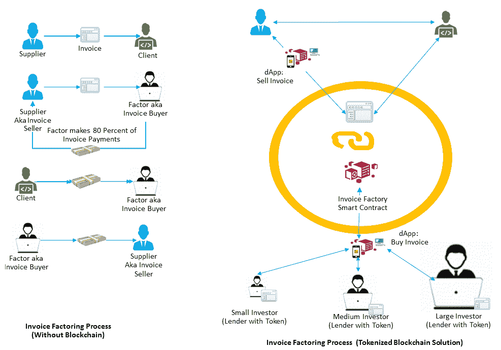

应收账款保理使用案例

由于这是一种基于代币的方法，小型、中型和大型出借者可以通过区块链网络的不可篡改性、信任性和可靠性跨越边界购买应收账款。

# 与使用案例互动

在*设计策略*部分，我们试图定义一个由五个步骤组成的区块链设计策略：探索、参与、实验、经验和影响。在本节中，我们将集中于第二步。在这一步中，我们将与我们在前一节中定义的用例之一进行交互。第五章、*在 Oracle 区块链平台上管理解决方案*，以及 第六章、*在 Oracle 区块链平台上开发解决方案*，负责试验解决方案。在那里，我们将定义另一个用例，并尝试为解决方案构建链码。我们还将设置和配置一个区块链网络来运行链码，并通过 REST 进行集成以连接链码。

在本章中，当与用例交互时，我们将首先定义流程——首先是*现状*流程，然后是*未来*流程。在前一节中，我们已经涵盖了很多流程方面的内容，这就是为什么本节将关注*现状*流程。在交互过程中，我们将学习定义模型的艺术，包括资产、数据模型、交易、参与者、事件和访问控制。一旦流程被定义并且组件被识别，我们将研究用例的集成架构和基础设施配置。

为给定用例参与和定义基于区块链的业务网络的步骤如下：

1.  定义*现状*流程以识别问题并定义一个高层次的流程（*未来*）

1.  识别和定义区块链网络组件：

    +   识别参与者。

    +   定义资产和数据模型。

    +   在交易细节中定义业务流程。这样可以帮助你识别交易和事件。

# 定义流程

此用例涵盖应收账款保理，也称为发票保理。这是一种金融交易，允许企业从未清算的发票中快速产生价值。我们将首先定义*现状*流程，然后定义*未来*流程，这样我们就可以识别各种区块链组件。

# 现状流程

卖方与客户进行交易并开具发票。这些发票到期日为 30 天、90 天或其他期限，取决于供应商和他们的客户的业务条款。因此，他们的客户不会立即付款给卖方。在这些情况下，卖方希望立即获得现金以运营或扩大业务，他们可以选择出售未结应收账款。这使卖方能够满足其紧急需求。发票卖方通常以折扣的形式出售未结发票。买方通常接受折扣并立即支付卖方。但是，买方只支付折扣后的金额，例如，总发票金额的 90%。在幕后，买方检查付款方（客户）的信用历史，因为最终要支付买方的是客户。在此过程中，有三方参与——发票卖方、发票债务人（付款方）和发票保理方（买方）。这种发票保理也称为应收账款融资或应收账款保理。它是一种基于资产的融资（ABL），允许卖方的应收账款作为抵押品。

# To-be 流程

在较高层次上，供应商向其客户（客户 A 和客户 B）交付商品。供应商向这些客户发出付款发票。发票 1 应于 30 天内支付给客户 A，发票 2 应于 90 天内支付给客户 B。供应商需要即时现金，并以 5%和 10%的折扣分别出售发票 1 和发票 2。银行 1 和银行 2 也是区块链业务网络（KonsensusChainBC）的参与者。他们浏览可用的发票并对其进行保理。银行 1 对发票 1 进行保理，并向供应商支付发票价值的 95%，而银行 2 对发票 2 进行保理，并向供应商支付发票价值的 90%。保理将导致立即向供应商支付发票。立即支付确认将导致客户的应收账款更新。现在，客户 1 需要支付给银行 1，而客户 2 需要支付给银行 2。应付款项已更新为新的收款人详细信息。到期日时，应从付款方（客户）账户直接支付给买方（银行）账户，并更新客户的 AP 系统。在客户 1 和 2 支付发票的总金额达到 100%后，买方将支付剩余的发票金额给卖方。但是，买方（银行 1 和银行 2）将支付给卖方的余额中减去交易费。

# 识别和定义业务网络组件

以下图表突出显示了名为 KonsensusChainBC 的商业网络的各种区块链组件。 这些组件包括资产、交易、事件、通道以及区块链网络的访问控制列表。 由于该区块链业务网络是在基于 Hyperledger Fabric 的区块链上实现的，因此它也有通道的概念。 虽然这一步需要详细的交易和事件流程，但你可以直接跳转到交易流程步骤，然后再回到这一部分。

基于交易流程，你可以在区块链业务网络上得到以下组件列表：

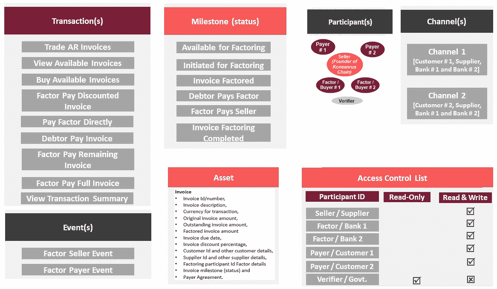

KonsensusChainBC 的区块链组件

访问第三章，*深入 Hyperledger Fabric*，了解有关交易、事件、通道、参与者和访问控制的详细信息。 访问第五章，*使用 Oracle 区块链平台管理解决方案*，以在 OBP 上配置网络。

# 定义资产

资产可以是任何*价值*。 资产可以是有形资产，例如房地产和硬件，也可以是无形资产，例如合同和证书。 资产可以使用链码交易进行修改。 因此，在确定交易之前，最好确定将在区块链网络上进行交易的资产。 身份、货币、土地所有权、合同、投票、来源和支付等资产是宝贵且稀缺的。 让我们分析区块链的各种应用，并检查它们实际管理了什么。 例如，比特币中的帐户是资产，以太坊管理合同状态，Everledger 管理钻石资产，等等。 同样，对于 Hyperledger Fabric，资产可以是有形资产，例如房地产和硬件，其中无形资产可以是合同和知识产权等事物。 这意味着，区块链是那些需要进行资产交易并建立去中心化共识并将其记录在不可变账本上的情况的潜在解决方案。

对于这个业务案例，主要资产是发票。 以下是资产的一些属性：

+   发票 ID/号码

+   发票描述

+   交易货币

+   原始发票金额

+   未清发票金额

+   保理发票金额（根据折扣百分比计算）

+   发票到期日

+   发票折扣百分比

+   客户 ID 和其他客户详细信息

+   供应商 ID 和其他供应商详细信息（同样包括银行的详细信息）

+   保理参与者 ID（同意发票保理的银行）

+   保理详情（保理银行的详情等等）

+   发票里程碑（状态）

+   付款方协议（是/否）

# 定义参与者

本小节集中在定义商业网络的参与者。 对于发票保理的用例，涉及以下各方：

+   供应商，也被称为发票的销售商或发行人：

    +   供应商也是区块链网络（KonsensusChainBC）的创始人，该网络连接了各种银行和客户作为参与者

    +   区块链网络的链码呈现为名为 KonsensusChain 的 dApp

    +   此 dApp 提供了销售应收账款的解决方案。它还配备了用户界面，允许供应商（卖方）、买家（保理方）和客户（付款人/债务人）进行交易

    +   供应商的应收账款与区块链网络相连

+   客户（客户 A 和客户 B）也被称为付款人/债务人：

    +   客户使用 KonsensusChain dApp 浏览发票的里程碑（状态）并检查收款人的信息。

    +   客户的应付账款与区块链网络相连，其中订阅从区块链网络发出的事件。各种事件允许客户的**应付账款**（**AP**）更新收款人详细信息，并使用正在进行的发票状态更改更新其 AP 系统。

+   银行是购买发票的一方。它们也被称为买家。在这种情况下有两家银行（银行 1 和银行 2）。

+   验证者是具有交易摘要访问权限但没有许多详细信息的参与者。例如，想要检查发票保理中的欺诈并需要访问交易摘要的政府机构，如**证券交易委员会**（**SEC**）。

以下图示显示了参与者：

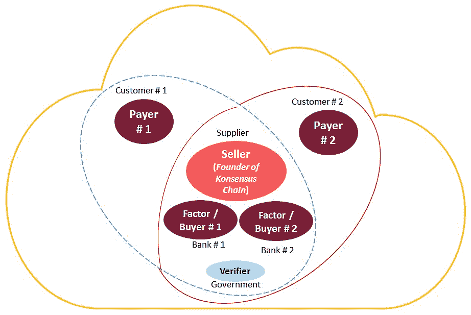

KonsensusChainBC 商业网络参与者

用虚线/蓝色表示的圆圈显示了客户 1、供应商和所有银行之间的渠道，而用实线/红色表示的圆圈显示了客户 2 和供应商之间的渠道。我们将在第三章中更详细地讨论渠道，*深入了解 Hyperledger Fabric*。

# 详细的流程，包括交易和事件

此部分是识别交易和事件的核心，也为定义渠道和访问控制奠定了基础。我们将在本节中涵盖所有剩余的区块链组件。

**供应商**（**卖方**）以发票价值的 5% 折扣（发票 1 开给客户 A）和发票价值的 10% 折扣（发票 1 开给客户 B）的价格出售应收账款。供应商的**应收账款**（**AR**）将自动将发票推送到区块链网络（KonsensusChainBC）。推送到区块链网络的应收账款发票被标记为“*待审批保理*”的里程碑（状态）。

以下是**卖方**执行的确保发票可用于保理的步骤：

1.  KonsensusChain dApp 提供了一个供应商（基于角色）的用户界面。此 UI 允许**卖方**批准 AR 发票，这些发票正在等待因素化（*待批准因素化*）。一旦批准，发票将可供银行因素化。

1.  一旦批准，链码（KonsensusChain dApps 背后的智能合约）将发出交易 *交易 AR 发票*，并且发票的里程碑（状态）将为 *可因素化*。

**银行**（**买方**/**付款方**）使用面向买方的 dApps（KonsensusChain）和用户界面。

以下是**付款方**执行的步骤：

1.  银行 1 和银行 2 使用 dApps 用户界面浏览可因素化的发票。

1.  在浏览时，dApp 发出 **查看可用发票交易**。

1.  银行浏览发票并选择要购买的发票。这将导致交易 **购买可用发票**，并且发票的里程碑变化为 *启动因素*：

假设银行 1 购买了客户 A 的发票，银行 2 购买了客户 B 的发票。以下是此假设的结果：

1.  此状态（*启动因素*）变更将导致 *因素支付折扣发票* 交易的自动执行，并且发票的里程碑将变为 *发票已因素化*。

1.  *因素支付折扣发票* 交易生成两个事件：*因素卖方事件* 和 *因素支付方事件*。*因素卖方事件* 将导致以下活动：

    +   银行 1 的系统将支付供应商发票金额的 95%（对应客户 A 的发票 1）和 供应商发票金额的 90%（对应客户 B 的发票 2）。

    +   *因素卖方事件* 还将导致供应商的 AR 系统更新其记录。

**客户**（**债务人**/**收款人**）账款系统将从链码接收 *因素支付方事件*。以下是*因素支付方事件*的影响和客户账款（AP）的变化：

1.  *因素支付方事件* 还将导致客户的账款（AP）系统更新记录：

    +   客户 1 和客户 2 订阅了包含唯一客户身份、发票标识和收款人帐户详细信息的*因素支付方事件*过滤器。这将允许 AP 系统将收款人详细信息与发票关联起来。

    +   这些事件将包含关于作为付款人/债务人列出的发票的详细信息。这些发票现在将具有修改后的收款人（银行）详细信息。在这种情况下，银行的详细信息和银行的帐户详细信息也将成为事件的一部分。

1.  客户的 AP 系统还将调用 *直接支付因素* 交易。这是客户同意直接支付收款人（发票买方/因素）的协议。这不会导致发票的里程碑变化，但将 *付款方协议* 发票属性设置为 *true*。

当发票到期时，即客户 A 为 30 天，客户 B 为 90 天，KonsensusChain (链码) 将自动向收款人 (银行) 支付发票价值的 100%。当发票到期时，以下事件发生：

1.  到期的发票将导致*债务人支付发票*交易。这将会改变发票的里程碑为*债务人支付保理款*

1.  在执行*债务人支付发票*交易后，链码将自动导致*保理商支付贴现发票*交易，并且发票的里程碑将是*保理商支付卖方*。这将导致以下结果：

    +   这一步将导致银行（买方/保理商）向发票卖方（供应商）支付剩余发票款项。

    +   发票的保理商（买方）将支付剩余款项给卖方（本例中的供应商），扣除保理费。

    +   付款后，卖方系统将自动调用*保理商支付全额发票*交易。这是向 KonsensusChain 区块链网络指示成功收款的最终指标。在这个最后阶段，发票的里程碑 (状态) 将是*发票保理完成*。

下图突出显示了整个交易流程：

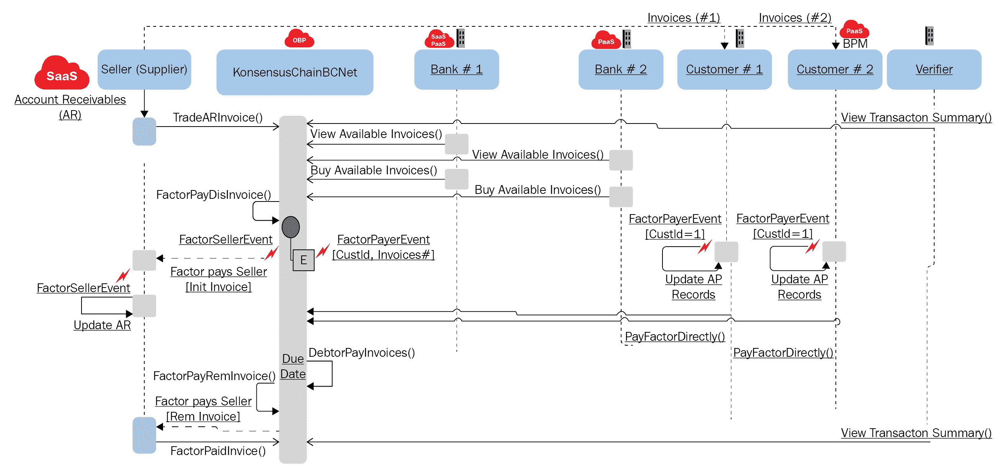

交易流程

# 集成架构

下图展示了各种系统如何与区块链业务网络集成。 应用程序可以使用 REST、SDK 和事件与区块链网络集成。这样可以简化应用程序开发，并与区块链网络集成。事件允许 SaaS、PaaS 和自定义流程订阅事件并相应地做出响应。

在本章中设计的业务场景是因为所有参与者都是 KonsensusChain 区块链网络的一部分，并且正在使用 dApp 执行交易。这样的 dApp 提供了基于角色的用户界面，允许参与者连接到应用程序并执行交易。然而，我们也讨论了导致更新应收账款和更新应付账款的交易。AR 和 AP 分别是供应商和客户 1 的 SaaS 和本地部署 (E-Business Suite) 应用程序。这些应用程序可以订阅区块链事件并相应地采取行动。

根据我们的业务场景，卖方 (供应商) 可以通过 REST 与区块链网络 (KonsensusChain) 集成，并执行*交易应收账款发票*交易。此交易将导致在区块链网络中发现发票。银行的应用程序可以通过 REST 和 SDK 将其 SaaS、PaaS 和自定义流程与区块链网络连接起来。客户 2 没有 SaaS，他们使用 BPM 解决方案构建他们的流程和应用程序。这样的应用程序也可以订阅区块链事件，并通过 REST 连接。

验证者正在使用 Java、Go 和 Node.js 进行高级集成：

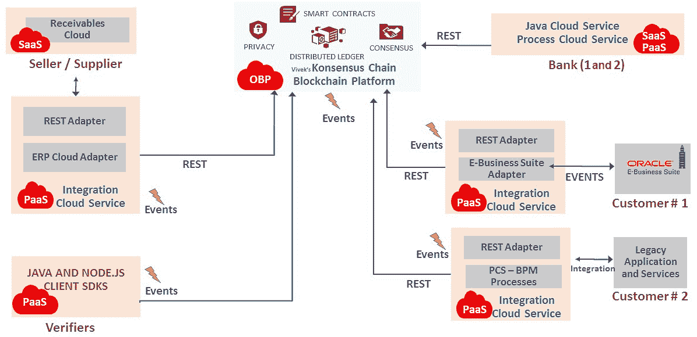

集成架构

# 业务网络的基础设施

到目前为止，我们已经详细介绍了应收账款保理的用例，并对业务网络（KonsensusChain）进行了建模以实现该用例。我们还了解了与区块链网络的集成选项。本节专门讨论实现业务网络基础设施的问题。到目前为止，我们讨论的用例可以在诸如 Hyperledger Fabric 之类的许可区块链上实现。因此，我们将尝试使用基于 Hyperledger Fabric 的云平台来定义基础设施。我们在 第一章 的 *BaaS* 部分中简要了解了 OBP。在本节中，我们将尝试在 OBP 上实现业务用例。

从基础设施的角度来看，Oracle 提供了一个区块链的云托管平台，预装有各种基础服务，如计算、存储、身份管理（身份验证）、容器、对象存储（内置归档）、日志和管理分析（运营）等。各种 SaaS 应用程序、PaaS 应用程序、本地应用程序和遗留应用程序都可以使用 Oracle 的集成云服务与区块链集成，并且可以订阅从区块链业务网络中引发（发出）的事件。

以下图表显示了 OBP 是在 Hyperledger Fabric 之上构建的：

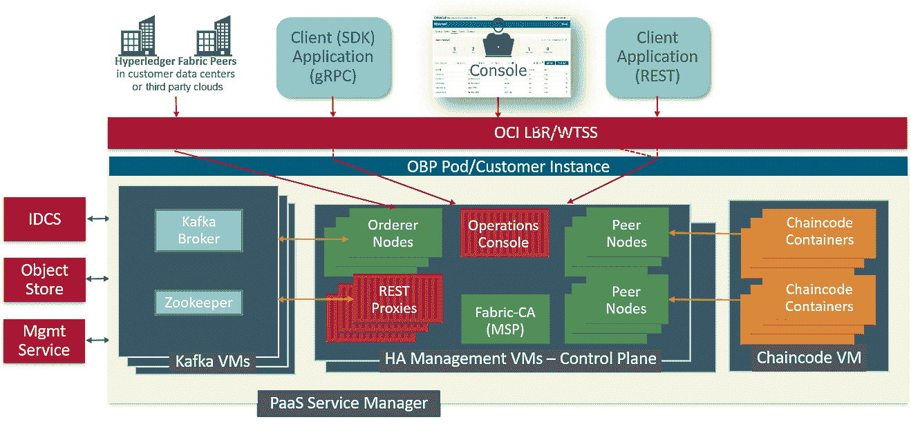

OBP 利用 Hyperledger Fabric

供应商（卖方）组织计划启动一个财团，并决定采用基于创始人的财团，因此向其中添加了几个更多的参与组织。为此，他们在 OBP 上设置了区块链实例。每个区块链实例包含托管容器、虚拟机、身份管理、块和对象存储以及 Kafka，即 Oracle 事件中心云服务。在本节中，我们将深入讨论业务案例，并尝试为其实现基础设施。

KonsensusChain 是一个基于创始人的区块链网络，其链码负责财务交易、发票买卖、向发票销售商支付款项以及从最终客户处收取款项。KonsensusChain 设置在 OBP 上。对于每个组织（创始人和参与者），它都有一个物理机器。由于它是一个生产部署，其排序基于 Kafka，并且排序节点是由创始人组织创建的。此基础设施还包括每个组织的一个 **证书颁发机构**（**CA**）。根据每小时少于 1,000 次交易的要求，此高度可用的配置将如下所示：

+   两个 fabric CA 节点在不同的虚拟机（VMs）上复制，以实现 **高可用性**（**HA**）。

+   供应商（创始人）将拥有两个对等节点，而客户和银行各有两个对等节点。

+   存储容量为 4 TB。

+   每个 VM 上都有一个复制的控制台节点，以实现高可用性。这个控制台可以用来管理参与者，创始人可以用它来管理链码。

+   集成了身份云服务，允许组织管理角色和身份。

+   将在一个隔离的 VM 中为链码提供一个容器。您可以使用控制台来管理链码。

+   REST 代理节点将在不同的 VM 上进行复制，以实现高可用性。这些节点提供 RESTful API。

+   也提供了负载均衡器和运维管理和监控。

+   提供配置备份的对象存储，以及通过区域的块复制。

+   创始人（卖方/供应商）将拥有两个 Kafka orderer 节点，这些节点将在不同的 VM 上进行复制，以实现高可用性。

以下图表显示了我们在本节中讨论的区块链业务网络（KonsensusChain）的基础设施：

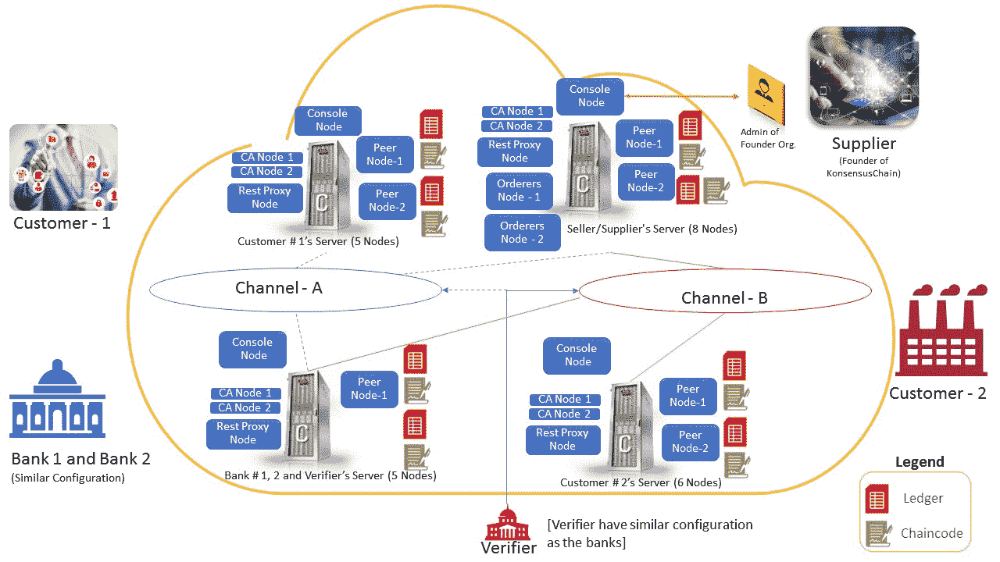

区块链业务网络的基础设施

每个组织都将获得一个区块链实例（一个创始人和五个参与者实例）。每个实例都包括节点-一个对等节点、一个控制台节点、一个 REST 代理节点和一个 CA 节点，而创始人将拥有一个 orderer 节点。实例还与对象存储集成，用于动态备份配置和账本。备份包括账本块、通道配置、检查点、链码和用于配置文件和日志文件的节点。备份和恢复是自动流程。它还使用 Oracle 事件中心云服务来处理 orderer 节点上的 Kafka。REST 代理节点将允许 RESTful API，这进一步帮助 SaaS、PaaS 及其应用程序与区块链业务网络连接和集成。通过所有这些服务、容器和基础设施，OBP 负责区块链业务网络的高可用性、可伸缩性和弹性。

# 总结

本章突出了 DLT 和区块链的挑战和机遇。本章还深入探讨了区块链的各种属性，以及这些属性如何颠覆了在不同场景中使用区块链的方式。在本章中，我们还深入研究了建模一个用例以及展示用例实施的集成方面和基础设施。*设计策略* 部分提到了这五个阶段——探索、参与、实验、体验和影响。我们还涵盖了设计策略的最初两个阶段（探索和参与）。我们通过审视各种用例来探索设计策略，证明采用区块链的合理性，并试图制定一个方程来证明/量化在给定用例中使用区块链的可行性。之后，我们通过为给定用例定义基于区块链的业务网络来参与设计策略。在这里，我们勾勒了流程，并确定了各种基于区块链的业务网络组件，如资产、交易、参与者、事件、访问控制和通道。我的下一本书，《面向解决方案设计师的区块链》，将详细介绍设计策略。在这个版本中，第五章，*在 Oracle 区块链平台上管理解决方案* 和 第六章，*在 Oracle 区块链平台上开发解决方案*，涵盖了设计策略的实验部分，您将学习如何构建链码并在区块链平台上运行它。这使您能够对区块链平台进行实验。从下一章开始，我们将探索 Hyperledger，其架构和其他细节。
