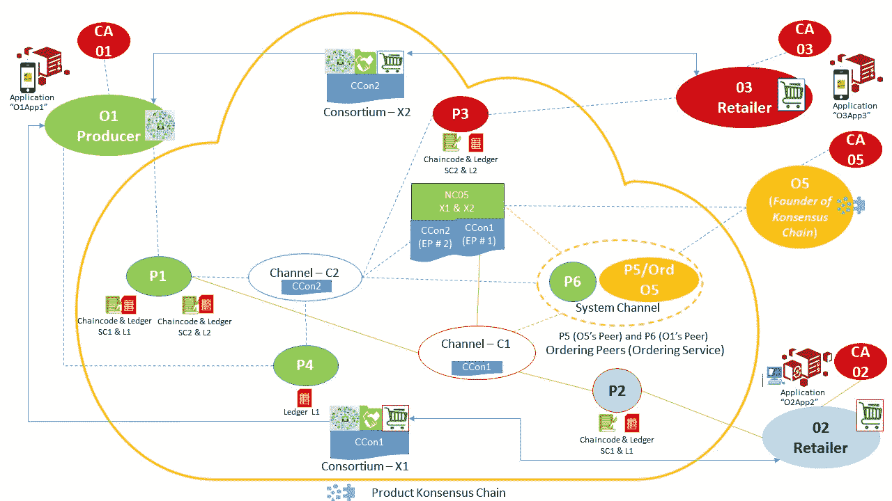
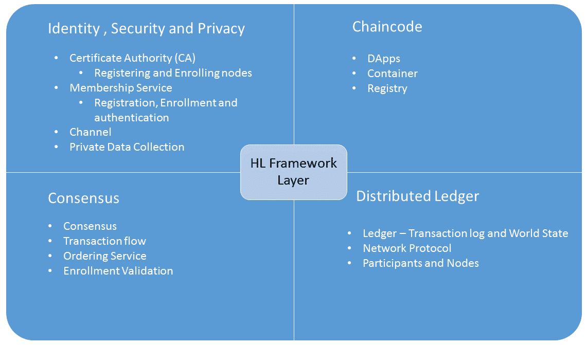
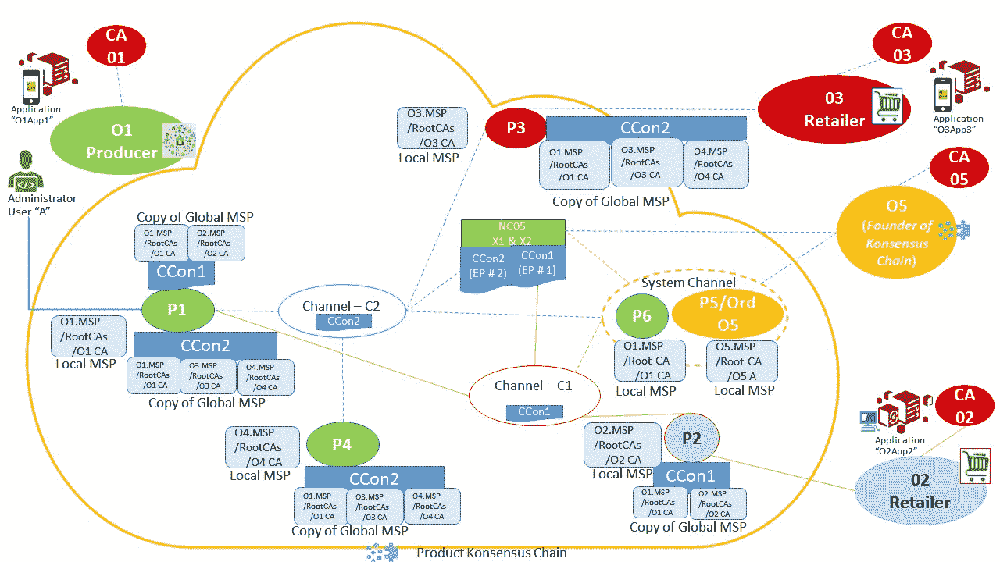
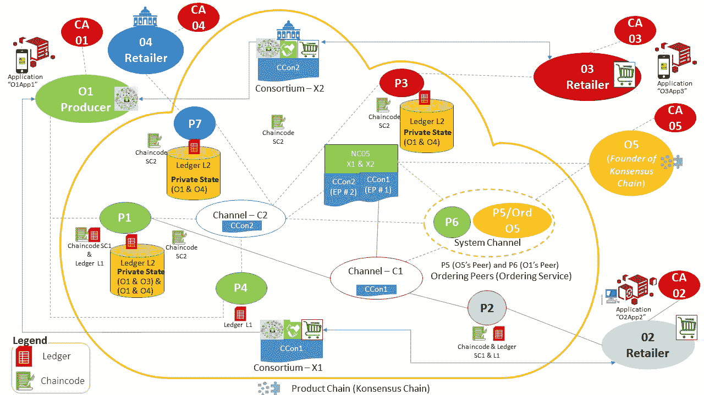
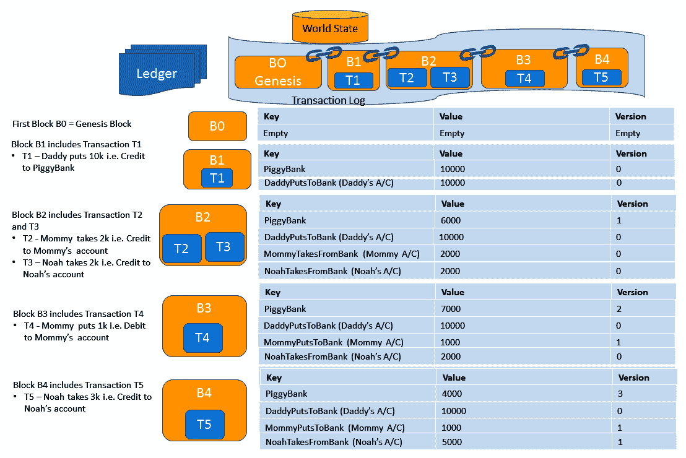

# 深入了解 Hyperledger Fabric

权限区块链已经发展，以满足在一组已知（但不一定受信任的）但可识别的参与者中采用区块链的需求。这些参与者首先需要被明确地接纳到区块链网络中。在这里，了解（识别）参与者比完全信任这些已知参与者更为重要。这些参与者可能不信任彼此，但是已知和可识别，它们是被共同目标连接在一起的。**Hyperledger Fabric**（一种权限区块链）使用**拜占庭容错**（**BFT**）变体**实用 BFT**（**PBFT**）作为共识协议，而不是**工作证明**（**PoW**）。HLF 为权限区块链提供了改进的功能特性，如保密性和一致性，同时还提供了改进和增强的非功能特性，如性能和可伸缩性。

本章重点介绍 HLF 的基础知识。这将使您理解在 HLF 中如何实现业务逻辑，并了解促进读写操作到分布式账本的各种交易类型。Linux Foundation 正在与各大公司和一些最聪明的开发人员合作，致力于解决 IT 世界面临的一些最复杂的挑战，并促进开源技术的商业应用。这是有史以来规模最大的开源软件项目。Linux Foundation 是各种开源项目的母项目。对于大数据和分析，它支持 R 语言，以及贡献项目。对于网络，它支持 ONAP（Open Network Automation Platform）和 OpenDaylight 等项目。对于云计算，它支持 Cloud Foundry 和云原生计算等项目。同样，对于区块链，Linux Foundation 负责处理 Hyperledger 项目。

# 简介 Hyperledger 项目

Hyperledger 项目始于 2015 年 12 月，由 Linux Foundation 主办，旨在创建先进的跨行业**分布式账本技术**（**DLT**）和区块链技术。它托管区块链框架并支持一些工具。这是一个开源项目的集合，其中一些项目是 DLT 框架，包括 Iroha、Sawtooth 和 Fabric。

# Hyperledger 托管的框架

以下是由 Hyperledger 托管的框架。这些被分类如下：

+   Hyperledger Burrow

+   Hyperledger Fabric

+   Hyperledger Indy

+   Hyperledger Iroha

+   Hyperledger Sawtooth

**Hyperledger Burrow**:

+   **贡献者**：最初由 Monax 贡献，由 Intel 共同赞助。

+   **主要特点**: Burrow 是一种轻量级、快速、高效的权限链码机器。它利用 Tendermint 协议进行共识。Burrow 最重要的特点是区块链的速度。在区块链速度方面有三个维度。第一个是代码库的事务吞吐量。第二个是区块在网络内的传播速度。第三个和最后一个维度是区块最终化的时间（也就是区块的最终性）。Burrow 是一个非分叉的区块链，事务终局性是有保证的。终局性增强了系统的整体速度，因为应用程序和系统可以立即依赖区块链网络上的信息。

+   **目标**: 它提供了一个模块化的区块链客户端，其中包含一个部分按照**以太坊虚拟机**（**EVM**）规格开发的权限智能合约解释器。它是一个权限智能合约机器，提供了一个模块化的区块链客户端，其中包含部分符合 EVM 规格的权限智能合约解释器。

+   **共识协议**: Tendermint。

**Hyperledger Fabric (HLF)**:

+   **贡献者**: 最初由 Digital Asset 和 IBM 贡献

+   **主要特点**: 模块化可插拔架构，以及高水平的隐私和机密性权限

+   **目标**: 用作开发具有模块化架构的权限企业应用程序或解决方案的基础

+   **共识协议**: Apache Kafka

**Hyperledger Indy**:

+   **贡献者**: Sovrin 基金会。

+   **主要特点**: 专为去中心化身份而建。它管理密钥，证明和其他相关信息，从而使各方之间的可信等的对等交互成为可能。

+   **目标**: 提供工具、库和可重复使用的组件，以创建和使用可在应用程序之间互操作的独立身份。

+   **共识协议**: PBFT。

**Hyperledger Iroha**:

+   **贡献者**: Soramitsu、日立、NTT 数据和 Colu 贡献。

+   **主要特点**: 允许对账户和数字资产进行操作

+   **目标**: Hyperledger Iroha 强调移动应用程序开发，并提供了 Android 和 iOS 的客户端库，使它与其他 Hyperledger 框架区分开来

+   **语言**: C++

+   **共识协议**: **又一个共识** (**YAC**)

**Hyperledger Sawtooth**:

+   **贡献者**: 英特尔。

+   **主要特点**: 供 DLT 应用程序使用的模块化平台。

+   **目标**: Sawtooth 在一个不信任的世界中创建了一个数字平台，实现了物理可追溯性。它是一个利用模块化平台构建、部署和运行分布式账本的区块链框架。它支持权限部署和无权限部署。

+   **共识协议**: **耗时证明** (**PoET**) 共识。

前述的 Hyperledger 框架用于构建 DLT 和区块链应用程序，以及一系列模块（也称为工具）用于方便地部署和维护区块链应用程序，分析账本数据，和管理区块链网络。

# 由 Hyperledger 托管的工具

以下由 Hyperledger 托管的**模块**，也称为工具：

+   Hyperledger Caliper

+   Hyperledger Cello

+   Hyperledger Composer

+   Hyperledger Quilt

+   Hyperledger Explorer

+   Hyperledger URSA

**Hyperledger Caliper**:

+   **贡献者**：甲骨文、华为和其他公司。

+   **目标**：测量特定区块链实现的性能

+   **关键特点**：它允许生成具有各种性能指标的报告，如资源利用率、每秒交易数和交易延迟

**Hyperledger Cello**:

+   **贡献者**：IBM、华为和其他公司。

+   **目标**：为企业提供**Blockchain**-**as**-**a**-**Service**（**BaaS**）, 从而快速实现企业区块链解决方案。它减少了复杂性，最小化了创建、终止和管理区块链所需的工作量。

+   **关键特点**：除了各种基础设施，如**bare** **metal**和虚拟机，它还提供多租户服务。它通过简化的控制面板实现了快速创建和管理区块链的功能，并可立即提供区块链实例。 

**Hyperledger Composer**:

+   **贡献者**：IBM 和 Ox-chains 的贡献者是维护者社区，但鼓励每个人参与和贡献。

+   **目标**：开发一组协作工具，促进快速、简便地建立区块链商业网络，以使开发人员能够快速创建链码和应用程序。

+   **关键特点**：使用 JavaScript 和工具，包括 Node.js、npm 和 CLI 构建。其模块化语言有助于资产定义、参与者定义和交易定义。这三个组件构成了区块链网络。它可以更快、更容易地开发区块链应用程序。

**Hyperledger Quilt**:

+   **贡献者**：NTT 数据和瑞波。

+   **目标**：通过实现**Interledger Protocol**（**ILP**），实现账本系统之间的互操作性。ILP 是一种支付协议，旨在跨分布式和非分布式账本转移价值。

+   **关键特点**：允许账本之间进行原子交换（甚至是非区块链或分布式账本），以及每个账本内的账户具有单一的命名空间。

**Hyperledger Explorer**:

+   **贡献者**：IBM、DTCC 和英特尔。

+   **目标**：允许授权参与者探索 DLT 项目。它还允许可视化区块链操作，从而使企业能够从数据中提取价值。

+   **关键特性**: 浏览器可以查看、调用、部署或查询区块、交易和相关数据，网络信息（名称、状态和节点列表）、链码和交易家族，以及存储在分类账上的任何其他相关信息。

**Hyperledger Ursa**:

+   **贡献者**: Ursa 的贡献者包括 Hyperledger Indy、Sawtooth 和 Fabric 开发人员，他们致力于这些模块的安全方面。此外，为确保所有加密算法符合标准，还有几位密码学家参与其中。

+   **关键特性**: 旨在为 Hyperledger 中的其他项目提供模块化、灵活的加密库。

+   **目标**: 确保其他 Hyperledger 项目对受信任的加密库的安全和更轻松访问。其模块化库将帮助区块链开发人员通过简单的配置切换或更改加密方案。

+   **语言**: Rust.

# HLF – 特性和限定符

与 Linux 基金会一起，各种公司，如富士通和 IBM，正参与 HLF 项目的合作。HLF 是一个设计和构建模块化应用程序的权限区块链框架。

以下是 Hyperledger 框架的关键功能:

+   HLF 受到来自各组织的卓越多样化的技术指导委员会的监督。

+   HLF 是模块化和可配置的，这使得它对于各种用例都非常有用，从银行、金融和供应链到教育和医疗。

+   它是一种 DLT，其中链码是用通用编程语言（如 Java、Go 和 Node.js）编写的，而不是使用**DSL**（**领域特定语言**）。这也使得 HLF 更接近那些使用这些语言构建和精通这些语言的企业。

+   HLF 是一个开源的、企业级的、权限区块链。

+   HLF 采用模块化组件化方法和易于使用的 API。

+   由于 HLF 是受权限控制的，它遵循治理模型来处理纠纷。

+   HLF 支持可插拔的共识协议，区块链网络可以选择共识协议以解决其用例。例如，对于单一企业区块链解决方案，**崩溃容错**（**CFT**）共识可能比 BFT 更吸引人，因为 BFT 更适合多企业区块链网络。

+   成员服务（HLF 的关键组件）是即插即用的。

+   HLF 还具有可插拔的身份管理协议，例如**轻量级目录访问协议**（**LDAP**）和 OpenID Connect。这也使得 HLF 对拥有多样化身份解决方案的企业更具吸引力。

+   在 HLF 中，智能合约，也称为链码，在容器中执行（例如，Docker），因此与分类账状态隔离。

+   在 HLF 中，分类账可以配置为支持各种数据库管理系统。

+   HLF 不需要加密货币，这显著减少了区块链存在对加密货币的依赖，并降低了攻击风险。

+   HLF 服务图显示了 HLF 的各种组件。它们是通过 API 和 SDK 集成、组装和交互。主要组件如下：

    +   身份

    +   账本

    +   交易

    +   共识

    +   智能合约

    +   安全和加密服务

# 为什么选择 Hyperledger？

在第一章，*探索区块链和 BaaS*，以及第二章，*理解分布式账本技术和区块链*中，我们涵盖了 DLT 和区块链。另外，我们了解了各种网络拓扑，如集中式、分布式和去中心化系统。我们还熟悉了区块链的结构、交易和各种其他区块链概念。我们对许可和无许可区块链进行了详细分析和讨论。像以太坊和比特币这样的无许可区块链是开放区块链，任何人都可以参与其中。另一方面，许可区块链允许有限的参与者管理区块链网络，只有经过授权和认证的参与者才能访问它。

与无许可区块链相关的各种优势，同样，使用许可区块链也有优势。许可区块链成本效益高，交易开销低。由于交易验证和验证更快，交易成本非常低，交易时间更短。选择区块链网络背后的决策完全取决于用例和消息和交易的可见性。然而，在我看来，与企业形成共鸣的关键区别是确定谁将参与区块链业务网络，谁有权在业务网络上进行交易；另一个原因是能够增强制造商和消费者之间的直接关系，并降低或消除对中间人或第三方（中介）的依赖。

我们正处在去中介化的时代。这一趋势由 Uber、亚马逊、Airbnb 等公司发起，它们没有拥有任何车辆、实际库存或房间库存，但它们让生产者和消费者连接和交易。区块链和分布式账本进一步赋予生产者和消费者权力，从方程式中剔除第三方和中介。许可区块链通过对区块链网络进行许可访问和在参与者之间传输交易，进一步允许数据在区块链网络上的隔离，从而实现隐私和数据的保密性。与区块链一样，分布式账本完全有可能颠覆那些严重依赖中介的行业，比如保险、医疗保健、交通运输、零售、物流、房地产和教育。

就企业而言，区块链在高层次上提供以下几点：

+   它检查恶意节点篡改数据传输的风险，以确保数据传输的防篡改。这由保护交易树以及获得 PoW 的复杂性来实现。恶意用户不能在没有重新计算 PoW 哈希的情况下更改/篡改数据，这是一项艰巨的任务，需要极端的计算能力。

+   由于 HLF 区块链是受许可的，区块链网络是在已知参与者中进行操作的，这在区块链网络本身提供了高水平的信任。

+   使用 HLF 的通道，可以进一步保障参与者之间的交易。

+   它消除了对单一中心故障点的依赖。

+   一致性由协议保证，采用相同的验证规则和区块布局。

+   所有节点将遵循最长的链，确保在各地建立协议。

+   区块链降低不确定性，增强各方之间的信任，实现更快速、更安全的交易。

+   企业选择的许可区块链允许企业为参与者制定成员资格规则，提供不可变性（防篡改，区块链代表着真相）、隐私性和保密性（授权进行敏感数据安全交换）、可扩展性、可靠性、可用性（支持关键任务应用）和可审计性（管理、跟踪、追溯、验证和监控）。

在无需许可区块链中，交易在每个节点上执行（假设共识机制是 PoW）。这意味着缺乏保密性，因为数据和智能合约以及交易数据都可以在网络上的每个节点上找到。对企业来说，保密性和交易数据的可见性非常重要。在 B2B 交易的情况下，企业不希望一个合作伙伴提供的特别费率数据对另一个合作伙伴可见，尽管无需许可网络通过加密数据来解决保密性问题。然而，使用 PoW 的无需许可区块链网络将导致数据在每个节点上都可用，这突显了在未来可能有可能解密数据，以及节点上的数据的本地可用性。在 HLF 中，除了已识别的参与者以及加密外，通道提供了最高级别的保密性。在这里，只有参与节点才能访问链码和交易数据，而且这也是由访问控制进一步控制的。这为区块链网络引入了高级别的隐私和保密性。

**无需许可与受许可区块链**：

当我们讨论*为什么选择 Hyperledger ？*时，很有必要快速了解无需许可区块链和受许可区块链（如 HLF）之间的差异。让我们从执行方式、确定性和保密性的角度分析这些分布式账本（DLT）的变体：

+   **执行方式**：

    +   无需许可区块链，如以太坊，观察到交易的顺序执行，它们遵循*顺序*-*执行*的架构。所有对等方执行*顺序*-*执行* 风格的交易，这导致了性能和可扩展性的限制。在这里，吞吐量与交易的延迟成反比。然而，无需许可区块链试图通过围绕加密货币进行编排来处理这个问题。这确保了每笔交易都包括一定数量的燃料/气体。因此，每个交易执行步骤都需要通过智能合约付费。然而，这种吞食加密货币的机制可能不适用于受许可区块链。

    +   允许的区块链，如 HLF 的架构，支持可伸缩性和性能，同时也支持信任。 HLF 的架构基于**执行-排序-验证**（**E-O-V**）架构，其中交易甚至在达成共识之前就已被执行。交易的执行（**execute**）将确保交易的正确性（认可），而模块化可插拔式共识协议将导致排序（**order**）交易。此外，在提交交易之前，交易受特定于应用程序的认可政策验证（**validate**）。E-O-V 解决了允许的区块链订购和执行架构所面临的灵活性、可伸缩性、性能和保密性问题。 HLF 允许子组中的一部分对等方并行执行交易。有趣的是，链码将认可工作委托给某些指定的对等方；因此，不同的链码可以指定不同的对等方作为认可者，从而支持并行执行。请注意，Hyperledger Fabric 会在交易被排序之前执行交易。

+   **确定性**：

    +   共识确保节点对交易达成一致意见，因此智能合约应该确定性地执行交易。如果不确定，建立共识就没有意义。此外，这种非确定性会导致共识的无效，并且会导致分支。因此，智能合约语言和编译器应确保智能合约的执行是确定性的。因此，各种区块链都选择了领域特定语言。这迫使开发人员学习新的语言，只是为了确保智能合约的确定性。

    +   HLF 的 E-O-V 架构确保交易受特定于应用程序的认可政策验证。这意味着是特定于应用程序的政策确保了多少以及哪些对等方节点将验证和确保链码的确定性执行。因此，子组的一部分将执行（认可）交易以满足认可政策。这将在排序之前过滤出不一致的结果，并从而消除任何不确定性。因为消除了不确定性，HLF 支持使用标准编程语言。你可以使用 Go、Node.js 和 Java 编写链码。

+   **确定性的混合复制驱动程序**：

    +   HLF 遵循被动复制和主动复制。通过广泛执行（认可），被动复制实现了确定性和并行执行。它还通过只在达成共识后将交易提交到账本来实现主动复制。因此，HLF 遵循混合复制策略。同样，共识的选择是特定于用例的，或者与该用例部署相关，因为 Hyperledger 支持模块化共识机制。这允许实施者选择任何自己喜欢的共识协议，比如 BFT 或 CFT。

+   **机密性**：

    +   利用 PoW 的无许可区块链在每个节点上执行交易。因此，每个交易和智能合约对每个节点都是可见的，这明确表明了 PoW 提供的 BFT 的保密性损失。保密性的丧失是企业客户及其用例所面临的挑战。例如，如果一家企业希望与一些供应商建立某些价格，并与非高级供应商建立不同价格，它们将无法保持这些首选价格的保密性。如果所有供应商都在同一区块链网络上并访问相同的智能合约，则不可能与不同供应商维持不同的交易关系（价格）。无许可区块链提供了两种解决方案：

        +   它加密了这些首选信息。然而，数据和智能合约都在每个节点上。加密可能会被破解，且始终存在丢失信息的风险。

        +   **零知识证明**（**ZKP**）可以处理保密性丢失。然而，ZKP 的计算会增加延迟并消耗资源。这意味着 ZKP 可以解决保密性问题，尽管这会导致性能问题。

+   像 HLF 这样的许可区块链提供了通道和**私有数据收集**（**PDC**）来解决保密性问题。

# 区块链解决方案的 Go/No–Go

现在，每个企业都需要区块链解决方案，同时每个企业都需要基于用例的区块链解决方案。因此，确定企业是否需要区块链解决方案的核心在于它试图解决的用例。

现在，让我们列出企业在评估区块链之前应考虑的因素：

+   是否需要一个共享的共享数据库？

+   对于业务流程，参与方是否缺乏信任？

+   是否有多个方参与了向数据库承诺？

+   是否涉及第三方或中间人参与业务流程？

+   业务流程数据是否存在于多个数据库中？

+   是否需要数据的不可变性或交易的日志/历史记录？

+   交易频率是否在每秒 10,000 次左右？

+   交易规则是否不经常更改？（在区块链上编写的规则是预先设置的，一旦部署并启动，链码将不会根据新规则改变路线）。由于区块链上的一切都是确定性的，规则更改应用程序通常不适合区块链）。

+   过程中没有存储大量静态数据吗？

+   过程中的数据量不大吗？（由于数据被复制，大规模的数据复制到所有节点并不是区块链的有效用例）。

+   是否没有从外部来源检索数据的需求？

如果前面的任何问题的答案是*是*，那么区块链就是企业用例的解决方案。此外，如果需要交易公开，那么企业用例需要一个无权限的区块链解决方案，否则需要一个像 HLF 这样的有权限的区块链解决方案。

# 架构 - 概念视图

在我们深入了解 HLF 架构及其组件之前，让我们首先了解一些重要术语的概念视图。通过一个例子来阅读本节，以把握一些基本知识，并在阅读架构和组件后回顾本节，以进一步确认对 HLF 的理解。

KonsensusChain 组织决定创建一个产品链（一条名为 ProductChain 的区块链业务网络）来使生产商和零售商进行交易。此外，它将允许监管机构验证产品的合法性。 KonsensusChain 组织将充当创始组织，并不参与任何交易。然而，它将建立区块链网络，开发用户界面、链码应用程序，并进一步维护和操作业务网络（财团）。这是一个基于 HLF 的创始者发起的区块链网络模型，在这个模型中，参与组织已创建了一个财团。在此示例中，创始者并不完全提供 dApp。dApps 是由组织单独构建的。然而，它们使用 SDK、REST API 和其他集成方法与业务区块链网络连接并执行交易。

以下是意图成为区块链网络一部分的不同组织：

+   **生产商组织**：标识为组织 1（**O1**），这是一个生产某些产品并将它们销售给零售商的组织。监管机构进一步验证这些产品的合法性。生产组织 **O1** 的证书授权机构（CA）是 **CA 01**。

+   **零售商组织**：标识为组织 2（**O2**），这是一个从生产组织 **O1** 购买产品并转售给其消费者的组织。零售商组织 **O2** 的 CA 是 **CA O2**。

+   **零售商组织**：标识为组织 1（**O3**），这是一个从生产组织 **O1** 购买产品并转售给其消费者的组织。零售商组织 **O3** 的 CA 是 **CA O3**。

+   **监管机构**：标识为监管机构（**O4**），这是一个验证产品并核实产品合法性的监管机构。

+   **创始组织**：[KonsensusChain.com](http://KonsensusChain.com) 是创始组织，标识为组织 5（**O5**）。所有零售商和生产商已经同意将 **O5** 作为 ProductChain 区块链网络（区块链网络的虚构名称）的创始组织。

以下是这个基于区块链的业务网络（ProductChain）的要求：

+   **需求一**：生产者组织（**O1**）希望与零售商组织（**O2**）进行私人交易和沟通，因为他们已经就某些产品的特定价格达成一致，并希望保持交易隐私。

+   **需求二**：类似地，生产者组织（**O1**）希望与零售商组织（**O3**）进行私人交易和沟通，因为他们已经就某些折扣和付款条款达成了一致，他们希望保密。

以下是本节将参考的业务网络的概念图：

架构：概念视图

# 构建区块链网络

本节讨论了业务网络的构建块，并涵盖了组建业务网络所涉及的步骤。所有术语均基于 HLF。以下是构建业务网络所需的步骤：

**步骤 1**：**启动区块链网络**：组建网络的第一步是启动一个排序器。在示例中（参考上述 *架构*：*概念视图* 图），节点 **O5** 归属于组织 **O5**，也被定义为排序器。创始组织（**O5**）使用网络配置 **NC05**，并为区块链网络配置了一个排序服务（**Ord05**）。这个设置为创始组织（**O5**）在区块链网络（ProductChain）上提供了完整的管理权限。组织 **O5** 的 CA 是 **CA O5**。该 CA 向创始组织（**O5**）的网络节点管理员颁发证书：

+   从本质上讲，排序服务由创始组织（**O5**）或云平台管理员托管，并由 **O5** 进一步管理和管理。网络配置文件 **NC05** 定义了组织 **O5** 在业务网络上的权限和特权信息。

+   CAs 是 HLF 的核心。HLF 提供了一个内置的 Fabric CA 以便快速启动。然而，组织可以使用自己的 CAs。不同的参与者使用证书在区块链网络上进行身份识别。在这个虚构的区块链网络（ProductChain）中，我们将定义五个 CAs，每个组织一个。

+   网络配置（**NC05**）使用称为 **成员服务提供商**（**MSP**）的结构，将由 **CA05** 发出的证书映射到 **O5** 组织的证书持有人。此外，**NC05** 使用 MSP 名称在策略中授予来自创始组织（**O5**）的参与者对区块链网络资源的访问权限。以识别来自 **O5** 的参与者为例，该参与者充当区块链网络的管理员，并进一步向区块链网络添加新的成员组织。

**创始者添加其他管理员**：创始组织(**O5**)通过更新网络配置(**NC05**)将生产者组织(**O1**)添加为管理员。此修改进一步定义**O1**为区块链网络的管理员。生产者组织利用其资源（节点）作为区块链网络的附加订货者(**O1**)。

**第二步**：**定义联盟以实现交易的分离和安全性**。其次，我们将看看如何定义联盟。它是两个或更多组织的关联，他们参与以实现共同的目标。在联盟中，每个参与的组织都有其自己的法律地位，并通过协议约定加入其中。这种联盟形成不同于第二章所定义的联盟，*理解分布式分类账技术和区块链*。在第二章中，*理解分布式分类账技术和区块链*，创始组织本身定义并拥有联盟，并且参与交易。在这里，创始者负责建立、维护和操作区块链网络的基础设施。它还提供了一个解决方案，各种组织可以融合并形成联盟和通道，并且可以进行交易。这样的配置可以允许云平台提供商管理业务网络，而无需参与其中。毕竟，联盟是一群志同道合的组织，致力于解决共同的问题。在这个过程中，他们在业务网络中利用自己的资源。在这个示例中，创始组织正在利用自己的基础设施，并且雇佣了几个节点作为订货者。在这个联盟中，以下内容适用：

+   创始组织正在利用自己的基础设施，并且雇佣节点**P5**(**Ord O5**)作为订货节点。

+   生产者组织**O1**（也被定义为网络管理员）定义了一个名为**Consortium-X1**的联盟，其成员为组织**O1**和组织**O2**。

+   联盟定义保存在网络配置（**NC05**）文件中。

**第三步**：**定义通道**：第三，我们将创建一个通道，允许联盟成员之间安全地进行交易。通常，这些通道被称为应用程序通道：

+   通道配置**CCon1**管理**Channel-C1**。**Channel-C1**是为**Consortium-X1**创建的。**O1**和**O2**都可以管理通道配置**CCon1**，并且他们对其拥有平等的权限。

+   通道配置(**CCon1**)完全独立于网络配置(**NC05**)，因此组织**O5**对通道配置(**CCon1**)没有控制权。然而，**Channel-C1**连接到订货服务(**Ord 05**)。

+   通道配置（**CCon1**）包含定义组织（**O1** 和 **O2**）在 **Channel-C1** 上进行交易权限的策略。其他组织，如 **O3** 和 **O5**，无法影响其上的交易。

**向通道添加对等点**：

+   **向通道添加对等点**，**组织 1**：对等点 **P1** 被生产者组织（**O1**）加入到业务网络中。这是因为该组织拥有对等点（**O1** 拥有 **P1**）。图中的对等点 **P1** 也托管分类帐 1（**L1**）的副本。很明显，**P1** 和 **O5**（对等点和订购服务）可以通过 **Channel-C1** 互相通信。

+   **向通道添加对等点**，**组织 2**：同样，对等点 **P2** 被零售商组织（**O2**）加入到通道中，该组织拥有对等点 **P2**。对等点 **P2** 也托管分类帐 1（**L1**）的副本。很明显，**P2** 和 **O5**（对等点和订购服务）可以通过 **Channel-C1** 互相通信。

我们可以从这个配置中得出以下教训：

+   **将对等点与组织相关联**：可以根据证书确认对等点 **P1** 与组织（**O1**）的关联。在本示例中，组织 **O1** 的 CA（**CA O1**）已向对等点（**P1**）颁发了 X.509 身份，因此，**P1** 与 **O1** 相关联。类似地，可以根据证书确认对等点（**P2**）与组织（**O2**）的关联。在本示例中，组织 **O2** 的 CA（**CA O2**）已向对等点（**P2**）颁发了 X.509 身份，因此，**P2** 与 **O2** 相关联。

+   **将对等点与分类帐相关联**：对等点 1（**P1**）和对等点 2（**P2**）托管分类帐 1（**L1**）的副本。因此，分类帐 1（**L1**）在物理上与**P1**和**P2**相关联，在逻辑上与通道（**C1**）相关联。

+   **功能**：在启动时，对等点（**P1**）向订购者（**Ord O5**）发送请求。订购者（**Ord O5**）通过参考通道配置（**CCon1**）验证来自对等点（**P1**）的请求。这种验证解锁了关于**P1**在通道（**C1**）上的权限（访问控制）的信息。它有助于确定对等点（**P1**）可以在分类帐 1（**L1**）上执行的操作（读/写）。对对等点 **P2** 也是如此。

**添加链码并允许应用访问分类帐**：在这个示例中，创始人并未完全提供 dApp。dApps 是由组织单独构建的。

但是，它们使用 SDK、REST API 和其他集成方法来连接业务区块链网络并执行交易：

+   生产者组织（**O1**）拥有应用程序（**O1App1**），零售商组织（**O2**）拥有应用程序（**O2App2**）。这些应用程序与链码（智能合约）集成，定义为图表中的链码（**SC1**）。链码（**SC1**）部署在对等方 1（**P1**）和对等方 2（**P2**）上，并允许 dApp（**O1App1**和**O1App2**）访问分类账 1（**L1**）。所有参与实体，如应用程序（**O1App1**和**O2App2**）、对等方（**P1**和**P2**）和订购服务（**O5**）都使用 **Channel-C1** 进行通信（交易）。

+   dApp（**O1App1**和**O2App2**）也被称为客户端应用程序。它们也与组织（**O1**和**O2**）关联的身份。链码（**SC1**）定义了操作，应用程序（dApps）可以与链码集成，以执行允许访问分类账（**L1**）的事务。应用程序（**O1App1**和**O2App2**）对分类账（**L1**）的访问完全由链码（**SC1**）操作管理。

    +   链码是由组织的（**O1**）开发团队开发的，并由财团团队（**X1**的成员，如**O1**和**O2**）审查和同意。然而，在部署到对等方之前，财团对链码的共识是必需的。

# 链码及其阶段

链码有四个阶段 —— 安装、初始化、定义背书人和允许事务。接下来对这些阶段进行了详细分析。您也可以将它们与示例联系起来：

+   **已安装**：在与链码（开发和测试）相关的共识事件中，组织（**O1**）管理员可以在对等方节点（**P1**和**P2**）上部署（安装）链码（链码）。尽管安装了链码的对等方可以完全访问和了解链码，但客户端应用程序（dApp）仅限于调用事务。有趣的是，仅在通道上安装链码并不能使客户端应用程序（**O1App1**和**O2App2**）能够针对链码（**SC1**）发出事务。这只有在链码初始化时才能发生。

+   **已启动**：到目前为止，链码仅安装在对等方（**P1**和**P2**）上。因此，除了对等方（**P1**和**P2**）之外，其他通道参与者不知道它。生产者组织（**O1**）将在通道（**C1**）上启动链码（**SC1**）。一旦在通道上启动了链码，其他通道参与者，如 dApp（**O1App1**和**O2App2**）可以调用链码（**SC1**）。此外，只有已安装链码的对等方才能访问链码逻辑。然而，链码逻辑对其他组件不可访问，但可以调用链码的操作。

+   **背书**：参考前述*架构*：*概念视图*图，清楚地表明组织（**O1**和**O2**）是**X1 联盟**的一部分。它们定义了通道（**C1**），通道由通道配置（**CCon1**）管理。话虽如此，背书策略（**EP #1**）也是通道配置的一部分，**CCon1**。当链码启动时，背书策略（**EP #1**）附加到通道配置（**CCon1**）。正是背书策略决定了账本（**L1**）上交易的接受。只有通道（**C1**）上的组织（**O1**和**O2**）批准时，交易才能被接受。

+   **调用**：仅在实例化之后，客户端应用程序才能将交易提案发送到对等体（**P1**和**P2**）。交易提案类似于链码（**SC1**）的输入，这将导致对等体节点**P1**和**P2**向客户端应用程序，**O1App1**和**O2App2**，分别发送一个*背书交易响应*。这将在本章的*交易流程*部分进一步讨论。

参考图，组织 1（**O1**）和组织 2（**O2**）在对等体**P1**和**P2**上安装了链码，这些对等体分别由**O1**和**O2**拥有。然而，由于链码由**O1**初始化，组织**O2**不需要初始化链码，因为它已经由**O1**初始化。此外，流言协议允许对等体相互通信。

# 对等体类型

对等体可细分如下：

+   **强制性对等体**：背书对等体和非背书对等体，也称为提交者和领导对等体。

+   **可选对等体**：锚对等体。这些是可选的，区块链网络可以在没有它们的情况下运行和存在。

以下是可用的不同类型的对等体：

1.  **背书对等体**：前一节详细介绍了背书对等体。参考*架构*：*概念视图*图，对等体（**P1**和**P2**）由组织（**O1**和**O2**）的管理员安装了链码。因此，它们可以背书交易，并被称为背书对等体。

1.  **非**-**背书对等体**（也称为提交对等体）：参考前面的图表，属于组织**O1**的对等体**P4**没有安装链码。组织 1（**O1**）的管理员选择仅在**P1**上安装链码，而不在**P4**上安装。这突出了两点：

    +   首先，组织管理员可以选择性地在对等体上安装链码。

    +   其次，已安装链码的对等体称为背书对等体，而没有安装链码的对等体可以存在于通道上。这些对等体（**P4**）是非背书对等体（称为提交对等体）。通道上的每个节点都是一个提交对等体：

        +   像**P4**（非背书对等体，也称为提交对等体）这样的对等体不能生成交易。然而，他们可以接受或拒绝要附加到账本（**L1**）的交易。

    +   安装了链码的对等体可以生成交易并背书交易。

    +   提交对等体接收交易块（由背书对等体发起的交易）并在提交到账本的本地副本之前进行验证。这样一次对账本副本（**L1**）的提交（背书者和提交者）构成了对账本的追加操作。

请记住，链码的背书政策（**EP #1**），存在于通道配置（**CCon1**）中，规定了一个组织的哪些对等体在被附加到通道账本（**L1**）之前应该进行数字签名。

1.  **领导对等体**：组织**O1**在通道（**C1**）上有两个对等体（**P1**和**P4**），其中**P1**是一个背书者，**P4**是一个提交者。因此，交易需要分发到组织（**O1**）中的所有对等体（提交者）。交易的分发意味着从排序者到组织的提交对等体的分发。为了确保交易的分发，可以将一个对等体定义为领导对等体（静态），或者任何对等体都可以承担领导者的角色（动态）。因此，在我们的样本网络中，对于**通道-C1**和组织**O1**，对等体**P1**被动态定义为领导对等体，它将把交易分发给附属于**通道-C1**的组织 1（**O1**）的所有对等体。

1.  **锚点对等体**：对于组织间的点对点通信，一个通道需要有一个锚点对等体。这是一个可选的对等体，只有在需要跨组织通信时才需要。

一个对等体可以是四种。例如**O1**的**P1**是一个背书者，一个提交者，一个领导者，也可以是一个锚点对等体。此外，对于一个通道，总会有一个背书者，一个提交者和一个领导者。

# 进化网络

在本节中，我们将进一步发展网络以实现要求**#2**。要求**#2**希望生产者组织**O1**可以执行与**O3**（零售组织 3）的私人交易和通信，因为他们已经就一些私人折扣率和付款条件达成了协议。

创始组织（**O5**）的管理员定义了生产组织（**O1**）和第二个零售组织（**O3**）之间的新财团。财团定义在网络配置（**NC05**）中。组织（**O1**或**O5**）之一可以为新财团（**X2**）定义一个新的通道（**C2**）。通道（**C2**）的配置存储在通道配置（**CCon2**）中。您可能注意到，**C2**的通道配置存储在**CCon2**中，并且与**通道-C1**的配置（**CCon1**）分开。这两个通道配置与网络配置（**NC05**）分开。因此，只有**O1**和**O3**对**C2**拥有权利，而**O5**对**通道-C2**没有权利。**O5**只向通道（**C2**）提供资源（订购服务 - **Ord O5**）。

组织（**O3**）向通道（**C2**）添加了一个对等体（**P3**），并拥有不同的账本（**L2**）。账本的范围限定在通道内，因此，**通道-C1**拥有账本**L1**，而**通道-C2**拥有账本**L2**。链码**SC2**被安装并在**通道-C2**上初始化，并且组织**O3**的应用程序（**O3App3**）使用**通道-C2**来调用针对链码**SC2**的交易。

# 网络配置和通道配置的物理实现

本节将介绍区块链网络中配置如何在物理上实现。

逻辑上，通道配置（**CCon1**和**CCon2**）似乎是通道（**C1**和**C2**）的单一配置。在实践中，通道的对等方承载了通道配置的副本。从逻辑上讲，网络配置**NC05**似乎存在于区块链网络的单个文件中。但实际上，它被复制到区块链网络的所有订购节点上。

当管理员配置网络和通道时，他们向区块链网络发出配置事务。这些事务由组织（组织管理员）进行数字签名，如修改策略（`mod_policy`）文件中所定义的。

`mod_policy`文件是网络和通道配置中的策略。例如，当您向区块链添加更多组织时，这些组织及其权限将根据区块链网络的网络配置进行修改。

# 订购服务

每个排序节点维护一个网络配置副本，并使用系统通道执行配置交易并维护一致的网络配置副本。在图中，我们有两个排序节点 — **O5** 和 **O1**。创始组织 (**O5**) 通过更新网络配置 (**NC05**) 将生产组织 **O1** 添加为管理员。这一修改进一步定义了 **O1** 作为区块链网络的管理员。生产组织 (**O1**) 使用其资源（节点）作为区块链网络的额外排序者 (**O1**)。排序者 **O5** 由组织 **O5** 雇用和维护，并由 **CA05** 颁发证书。而排序者 **O1** 由组织 **O1** 提供和维护，其证书由 **CA01** 颁发。网络配置 (**NC05**) 定义了来自配置组织 (**O5** 和 **O1**) 的参与者的确切权限。

排序服务还会收集来自客户应用（dApp）的被认可的交易，并将它们按顺序放入区块中。这些区块然后分发给通道上的每个提交节点。当达成共识时，每个提交对等方都会记录并附加本地账本的副本。有趣的是，您会注意到排序服务精心照料交易的分发。尽管同一排序服务用于多个通道（**C1** 和 **C2**），它会处理正确的交易分发给正确的通道。这在网络配置 (**NC05**) 和通道配置 (**CCon1** 和 **CCon2**) 中得到控制和定义。

# 维护一致网络配置副本的排序节点

要理解节点排序如何维护一致的网络配置副本，我们需要看看通道。

我们知道存在两种类型的通道：

+   **应用通道**：通道 **C1** 和 **C2** 是应用通道的示例。

+   **系统通道**：排序节点通过系统通道连接，允许它们在彼此之间分发配置交易。因此，当管理员尝试配置网络时，他们会在这个系统通道上发布配置交易。系统通道（在图中表示为**系统通道**）将确保这些配置交易在区块链网络上的排序节点之间进行分发。

在这个配置中，应用程序 **O1App1** 和 **O2App2** 将基于链代码 **SC1** 在 **Channel-C1** 上进行交易，并将使用 **Channel-C1** 与同行 **P1**、**P2** 和排序者 **O5** 进行通信。应用程序 **O3App3** 将基于链代码 **SC2** 进行交易，并使用 **Channel-C2** 与同行 **P3** 和排序者 **O5** 进行通信。这清楚地展示了精确的去中心化，在这种情况下，不同组织可以执行它们特定的交易并将区块存储在自己的账本上。

# 当节点加入多个通道时的行为

生产者组织（**O1**）希望为联合体**X1**和**X2**分别拥有单独的应用通道**C1**和**C2**。这将允许**O1**与这些通道上的组织进行私密交易。因此，图表显示了**O1**的对等方**P1**，并且还在**P1**上安装了链码**SC2**。组织**01**的客户应用程序（**O1App1**）现在将能够根据链码**SC2**中定义的逻辑在**通道-C2**上进行交易。

节点的行为，作为多个通道的一部分，由该通道的通道配置控制。通道配置**CCon1**和**CCon2**分别定义了节点（**P1**）在加入多个通道**C1**和**C2**时可用的操作。同样，应用程序**O1App1**现在可以根据链码**SC1**和**SC2**在通道**C1**和**C2**上执行交易，这也是由通道配置**CCon1**和**CCon2**决定的。

# Hyperledger 架构（分层视图）和组件

本节将介绍 Hyperledger 框架的架构层和组件。如下图所示，HLF 架构分为四个主要层，每个层都有其组件协同工作。这些层、组件及其相互作用共同构成了一个许可的区块链网络，如下图所示：

架构：分层视图

# 身份、安全和隐私

本节涵盖了与身份、安全和隐私相关的区块链架构方面的内容。区块链网络中有各种参与者，如节点（提交者、认可者等）、dApps 和客户应用程序，以及网络和通道管理员。这些参与者中的每一个都需要建立身份，因为这些参与者的身份决定了它们在区块链网络及其资源上的访问权限。原则是一组身份和属性，其中身份是用户 ID，属性包括其所属的组织、其所属的角色等。因此，很明显权限是由身份的属性决定的。

HLF 使用 X.509 证书进行身份验证。然而，MSP 验证身份并确定这些身份是否被允许进入区块链网络。从高层来看，MSP 拥有规则，这些规则使得区块链网络中的身份生效。但是，这些身份必须经由公钥基础设施进行信任和验证。

许可的 HLF 区块链网络严格控制参与者的身份。这是一个强制性的两步过程——建立参与者的身份和安全通信。

# 公钥基础设施

**公钥基础设施**（**PKI**）确保区块链网络中各参与者之间的安全通信，并验证发送到区块链网络的消息。PKI 包括 CA，负责向参与者（用户、节点等）发放数字证书。参与者根据这些证书进行身份验证，然后将消息发送到区块链网络。

在 Hyperledger 框架的分布式区块链网络中，根 CA 是一个 HLF CA，它被配置为信任锚点。它是一个自我认证的根 CA，也签署和认证中间 CA 的叶证书。此外，这些中间 CA 可以签署和认证其他叶中间 CA。因此，对于给定的数字证书，信任可以追溯到根 CA。这被称为信任链。HLF，特别是 HLF 成员服务，具有用于区块链网络安全运行的 Fabric CA 和中间 CA。

以下是 PKI 的一些关键元素：

+   数字证书

+   密钥

+   CA

+   **证书吊销列表**（**CRL**）

# 数字证书

数字证书是包含证书持有者各种属性的文件。这些证书符合标准，对于 HF 来说，这是 X.509 标准。

这里是关于证书的一些简要细节：

+   证书中有什么？证书就像身份证，包括以下证书数据：

    +   算法信息（如 SHA256）

    +   发行者信息，包括证书的有效期（时间）

    +   包括以下信息的主体信息：

        +   主体详细信息，例如组织单位

        +   主体公钥和签名算法详细信息

+   证书的主体（用户或节点）可以使用该证书证明其身份。

+   为了证明他们的身份，主体可以使用私钥对发送到区块链网络的任何通信（交易等）进行签名。主体的公钥包含在证书本身中。但是，主体的私钥是保密的和私密的。

+   证书中包含的所有信息都以一种加密方式进行加密，任何对其的更改都将标记证书为无效。

+   主体使用他们的私钥签名，并使用此证书证明他们的身份。由于其他各方信任身份提供者，也称为 CA，因此互动方可以信任主体。各方信任 CA，并相信主体展示的证书未被篡改。

# 密钥

在本节中，我们将介绍数字签名和公钥、私钥。在前面的描述中，我们看到消息是由主体签名的。签署消息被称为消息的数字签名。正是数字签名保证了消息的完整性和真实性。验证确保参与交易的各方确信消息发送者或创建者的身份，而完整性则确认消息在传输过程中未被修改/篡改。因此，正是数字签名保证了完整性和真实性。交易（消息）发送方将使用他们的私钥对消息进行签名并将其发送给接收方。接收方将使用发送方的公钥（广为人知）来验证消息的完整性和真实性。这意味着接收方将使用发送方的公钥来确保消息是由声称是发送方的发送者发送的，并且是预期的发送方。公钥和私钥的组合确保了区块链网络上的安全通信。

# CA

CA 主要包含在与 HLF 发布一起的 Docker 镜像中，并作为 HLF CA 组件发布。在区块链网络中，CA 有以下目的：

+   注册节点

+   注册节点

在 HLF 中，证书颁发机构是一个 CA 服务，它创建并发放证书（注册证书）给参与节点，使其能够加入和参与区块链网络。这些证书（注册证书）采用标准的 X.509 v3 格式。然而，企业可以扩展 HLF CA，并在需要时甚至可以替换它。CA 为参与者（用户、组和节点）发放符合 X.509 标准的证书。正是这些证书使参与者能够在区块链网络上进行交易和互动。CA 为参与者发放证书，这些证书包含有关主体（参与者）的各种信息，如前所示。CA 仅在使用其私钥对这些证书进行签名后才发放这些证书。因此，CA 发放的证书由 CA 签名，由于这些 CA 可信任，因此参与者也是可信任的。此外，证书中包含的信息是可信任的，因为它由 CA 签名。只要接收方拥有 CA 的公钥，他们就可以信任证书。

此外，当主体（参与者/发送方）签署任何交易时，接收方可以使用主体（发送方/参与者）的公钥来确保消息的真实性和完整性。值得信赖的 CA 包括 DigiCert 和 Verisign。这些证书没有任何私钥——无论是 CA 的私钥还是参与者的私钥。在区块链网络中，每个参与者（主体/行为者）都需要拥有由组织的 CA 颁发的数字身份，这实际上意味着 CA 为参与者提供了可验证的数字身份。

可用的 CA 类型如下：

+   根 CA 是大公司，如 Symantec，它们自签自己的证书，然后将这些证书发放给其他 CA。中间 CA 是由根 CA 或其他中间 CA 发放证书的 CA。这导致了证书的 *TrustChain*（信任链）。使用 CA 的组织可以放心使用中间 CA，因为 *TrustChain* 将允许它们追溯证书回到根 CA。此外，*TrustChain* 限制了根 CA 的风险，这对于 *TrustChain* 的安全性视角至关重要。此外，参与区块链网络的各种组织可以使用不同的中间 CA，并且可能有不同的或相同的根 CA。

+   HLF 提供了一个内置 CA，称为 Fabric CA，它是 HLF 区块链网络的根 CA。它是 Fabric 区块链网络的私有 CA；它不能为浏览器中使用的 SSL 证书提供服务。因此，组织可以为其 HLF 区块链网络使用商业公共根和中间 CA。HLF CA，也称为 Fabric CA，的功能如下：

    +   HLF CA 可以注册身份，也可以配置为使用现有的企业 LDAP 作为用户注册表

    +   对于成员组织、用户和管理员，HLF CA 可以为区块链网络发放、更新和撤销注册证书和根证书

+   HLF CA 生成自签名的 X.509 证书，可以有一个或多个 Fabric CA，其中一个是根 CA，其余是中间 CA，遵循 PKI 的信任链。

# CRL

CA 可以吊销证书，吊销的证书不构成过期的证书。在身份受到威胁的情况下，可以吊销证书，并将其放入称为 CRL 的列表中。建议任何想要验证其他方（主体方）身份的一方首先参考 CRL，检查该方（主体方的）的证书是否包含在吊销列表中。

# 成员服务

我们现在知道 PKI 为参与者提供了可验证的身份。但是，这些参与者如何在区块链网络上代表自己作为参与组织的受信任参与者呢？每个组织都在单个 MSP 下管理其参与者。但是，如果组织想要管理参与者的不同**组织单位**（**OU**），如财务和法律单位，组织可以拥有多个 MSP。如果您检查由 CA 发布给主体的证书，它将包含 OU 信息。这允许根据 OU 进一步控制对频道的访问。

成员服务管理参与者的身份，并用于验证参与者及其身份验证。区块链网络的访问控制列表中控制对系统资源（网络、通道等）的具体权限。成员服务代码在对等方和订购方上执行。它负责在 HLF 区块链网络上对身份进行认证、授权和管理这些身份。HLF 区块链网络的参与者具有身份，其中 PKI 生成与参与者（如网络组件、组织、dApps 和客户端应用程序）关联的证书。这有助于在网络级别和通道级别为参与者创建访问控制规则，通道是参与者进行私有交易的区块链网络的子集。区块链网络中的访问控制和通道共同解决了机密性和隐私挑战：

+   **身份验证**：HLF 使用 PKI 验证用户和设备的身份。

+   **授权**：HLF 使用**基于角色的访问控制**（**RBAC**）来控制对实体的访问，例如控制身份对实体（例如分类帐）的读写访问。对于给定资源的身份的访问控制基于 RBAC，其中身份被分配给角色，为资源定义了授权策略，并定义了确定哪些角色有权访问资源上的什么的规则。

# MSP

这是 HLF 区块链网络的身份管理解决方案。MSP 执行以下任务：

+   它注册和列出网络和通道参与者

+   它将证书映射到成员或参与组织

+   对于一个组织，MSP 确定一个参与者可以扮演的角色（行政等）

+   它定义了参与者的网络和通道以及访问权限，例如读和写

其主要活动如下：

+   MSP 确定了根 CA 和中间 CA，后者可以进一步定义域的成员，也称为组织，要么通过列出其用户的身份，要么通过授权 CA 为其成员分配有效身份

+   MSP 代表一个组织，并且还负责网络的 RBAC 和该组织成员的通道

+   一个组织可以有一个或多个 OUs，并且注册证书（X.509 证书）在证书中包含一个 OU 属性，以定义该组织的业务领域

# MSP 的类型

在本节中，我们将介绍 MSP 的类型。大体上说，有三种——网络 MSP、通道 MSP 和本地 MSP：

1.  **网络 MSP**：网络级别的 MSP 用于定义被授权执行网络级别管理任务的区块链网络，例如维护网络和创建通道：

    +   **范围**：网络级别

    +   **职责**：定义通道等管理活动

1.  **通道 MSP**：通道（也称为全局）MSP 在通道配置中定义。然而，每个节点都有一个本地副本的通道/全局 MSP，通过共识保持同步。通道上的每个参与组织都有一个定义好的 MSP，该通道上的所有节点都将共享该 MSP，因此，将能够使用相同的身份验证单一真相源对通道参与者进行身份验证。因此，任何新的参与组织首先需要将其 MSP 添加到通道配置中，以便在通道上进行交易。通道 MSP 主要用于身份验证，不需要对交易进行签名。通道的所有成员都熟悉 MSP 的配置，其中该组织的成员参与。这被称为通道 MSP：

    +   **范围**：通道级别

    +   **职责**：通过定义通道级别实体的管理和参与权限来建立信任链

1.  **本地 MSP**：MSP 用于对节点和用户进行身份验证。每个节点和用户在其本地文件系统中都有一个本地 MSP。为了对成员消息进行身份验证，并在通道上下文之外定义权限，对等方、订购者和客户端都维护一个本地 MSP 的实例：

    +   **范围**：每个节点都有一个定义该节点权限的本地 MSP

    +   **职责**：对成员消息进行身份验证并在网络和通道级别之外定义权限，并在本地应用配置时维护 MSP 的本地副本

    +   **事实**：

        +   诸如提交者、背书者和订购者之类的节点被称为本地 MSP。例如，定义对等方管理员等。

        +   客户用户等用户使用本地 MSP 对其在通道上执行的交易进行身份验证。

        +   参与组织的成员身份由作为本地 MSP 一部分的根 CA 或中间 CA 确定。

    +   **结构**：以下列表定义了构成 MSP 结构的各种元素。对于每种类型的元素，都有一个子文件夹，本地 MSP 存储在本地文件夹中作为文件夹，位于该特定子文件夹内。

        +   就结构而言，本地 MSP 包括以下各种元素：

            +   **根 CA 和中间 CA**：根 CA 包含由 MSP 中代表的组织信任的自签名证书（X.509 标准）。中间 CA 包含由组织信任的中间 CA 证书列表。

            +   **组织单位**：这是一个可选元素，包含一个 OU 列表，用于限制组织成员。

            +   **管理员**：这包含了作为组织管理员的参与者的身份。这类似于定义角色。然而，访问权限（例如添加新组织等）由系统资源确定，例如通道配置或网络配置策略。CA 发布证书中的角色属性还定义了参与者在组织中的角色，而不是在区块链网络上的角色。是系统资源（通道、网络等）策略定义了该角色在区块链网络系统资源上的权限。

            +   **吊销证书列表**：逻辑上，这个可选列表与 CAs 和 CRL 是相同的列表。然而，它还定义了参与者从组织中的吊销资格。

            +   **节点身份**：这是一个强制性元素，定义了节点的身份。应该存在于本地 MSP 中，以及 KeyStore（私钥）和节点身份，允许节点（如背书人等同行）在网络或通道上发送的消息中对自己进行身份验证；例如，背书人作为响应交易提议的一部分发送的证书。

            +   **KeyStore**：这个强制性元素是节点的密钥，节点（提交者、排序器、客户端节点等）用于数字签名交易。它只是本地 MSP 的一部分，而不是通道 MSP 的一部分，因为通道 MSP 不发送交易，因此不需要签名交易。

            +   **TLS 根 CA 和 TLS 中间 CA**：当节点想要连接到另一个节点时发送 TLS 通信，例如提交者节点并连接到排序器以获取分类账的最新更新。此元素包含根 CA/中间 CA 的自签名证书。

所有 MSP（网络、通道和本地）都应该与根或中间 CA 进行身份验证和交互，以确保建立信任链。

回到*架构* - *概念视图*部分的图表，网络配置（**NC05**）使用组织**O1**的 MSP 来确保参与者**P1**与组织 1（**O1**）的关联。然后，网络配置（**NC05**）使用访问策略中定义的 MSP 名称进一步授予**O1**的参与者（**P1**，**P4**和**P6**）特权；例如，将**P1**定义为来自组织 1（**O1**）的区块链网络管理员。参考以下 MSP 图表，每个对等方在其文件系统中都有自己的本地 MSP 副本。此外，每个对等方都保留其所属通道的全局 MSP 的副本；例如，对等方**P1**属于**Channel-C1**和**Channel-C2**。因此，尽管它有自己的本地 MSP，但它还包含对通道 1 和 2 的通道配置**CCon1**和**CCon2**的副本。通道配置的本地副本也意味着全局 MSP 的本地副本。因此，**P1**拥有**Channel-C1**和**Channel-C2**的全局 MSP 的副本。

每个对等方的信任域是其所属的组织，这是对等方本地 MSP 的一部分。然而，为了让该组织（以及其对等方）能够在通道上进行交易和通信，组织的 MSP 需要添加到通道配置中：

成员服务提供者

该图表还显示用户 A 属于组织 1（**O1**），用户 A 的身份由**CA01**（组织 1 的 CA）颁发。属于**O1**的对等方 1（**P1**）的本地 MSP 副本包含用户 A 的身份信息。根据用户请求的操作类型（本地或通道级别），对等方将验证用户 A 的身份。鉴于对等方**P1**、**P3**和**P4**位于**Channel-C2**上，它们拥有全局 MSP 的副本。全局 MSP 将包含通道（**C2**）的所有成员（**P1**，**P3**和**P4**）的证书和其他细节。此外，每个对等方都有自己的本地 MSP。

**本地级事务**：参考下图，可以明显看到 MSP 可以在两个地方找到——通道配置（作为通道 MSP）和本地对等方（本地 MSP）。本地 MSP 用于应用程序、用户、对等方和排序器，并定义了该节点的权限（权限），例如对对等方的管理。每个节点和用户都有一个本地 MSP。例如，用户的本地 MSP 允许用户在交易中进行身份验证，并定义了节点的参与权利等。当用户 A 尝试执行本地级事务（比如安装链码）时，对等方 **P1** 通过引用其本地 MSP 副本验证用户 A 的身份。通过验证，**P1** 确保用户 A 属于组织 1，并有权限执行该事务。只有在验证通过后，安装事务才能成功完成。

**通道级事务**：参与通道的每个组织都必须拥有一个通道 MSP。通道上的所有对等方和排序器都对通道 MSP 有相同的视图。当用户 A 尝试执行通道级事务，比如启动链码，需要所有参与组织的同意时，对等方 **P1** 将在执行事务之前检查通道 MSP。通道中的管理和参与权利被定义为通道 MSP。

# 通道（隐私提供者）

区块链业务网络中的机密性通过网络参与者之间的隔离通信实现，这是通过使用 HLF 通道实现的。区块链业务网络中的交易在通道上执行，在该通道上，交易各方经过验证和授权，可以在该通道上执行交易。默认情况下，网络中的所有参与者都属于一个通道。但是，对于私有交易，组织需要创建单独的通道并将成员授权给该通道。账本从通道到通道分开，因此账本数据无法在通道之间移动。通过通道将账本数据和对等方分开，允许在仍然属于同一区块链网络的组织之间进行私有和机密交易。通道之间的数据分离是通过配置成员服务、链码和八卦协议实现的。这里的数据包括交易信息、账本状态和通道成员资格。这些数据仅限于那些经过验证的通道成员对等方。

客户端 SDK 将参数（例如渠道内唯一的 MSP ID、策略和成员（组织））传递给网络配置链代码。此调用会在网络配置链代码上创建配置交易。这些有版本的配置交易（configtx）导致在渠道分类帐上创建创世区块。此创世区块记录诸如渠道配置之类的信息。一旦将成员添加到渠道中，它就可以访问创世区块上的相关信息。

参与者在渠道设置完成后可以部署链代码。然后，参与者可以提出交易、认可、排序和验证交易。访问权限由参与者的 MSP 授予，并且这些权限定义了参与者在渠道上的限制。渠道外的参与者无权访问渠道上的任何交易或消息。因此，根据其渠道对交易进行隔离增强了区块链网络提供的隐私。

# PDC

我们知道渠道在组织之间促进了私人和机密的交易。但是，如果您希望在一个渠道上有几个组织，但仍然希望将一些数据保留给参与该渠道的组织的子集，该怎么办？渠道有优势。然而，如果您不断创建在需要私人通信的组织之间的多个渠道，则可能会导致渠道爆炸，这将增加维护开销。您必须维护 MSP、策略和链代码版本，这不允许我们解决在渠道中为一些组织的子集拥有私人数据的用例。为了解决在渠道中允许一些组织的子集拥有私人数据的挑战，HLF（从 v1.2 开始）提供了创建 PDC 的功能。

# PDC – 更多渠道隐私

有了 PDC，组织的子集可以在一个渠道内查询、评论和认可私人数据，而不需要创建单独的渠道。

参考下图，节点**P1**属于组织**O1**，**P3**属于组织**O3**，节点**P7**属于组织**O4**。在这里，**P1**，**P3**和**P7**都在**Channel-C1**上。然而，组织 1（**O1**）希望与**P3**进行私人数据交换，并且还希望与**P7**进行单独的私人数据交换。如果仅按照渠道概念来处理，则系统将具有多个渠道。组织**O1**（**P1**）和组织**O3**（**P3**）将拥有一个单独的渠道，而组织**O1**（**P1**）和组织**O4**（**P7**）将拥有一个单独的渠道。处理此需求的另一种方法是允许 PDC 中渠道成员之间进行私人交易：

分类帐和私人数据

从分类账的角度来看，每个节点都有一个包括状态（当前状态和交易日志）的分类账。在本章的后续部分中，我们将详细介绍分类账。图表显示了当前状态作为分类账状态，并显示了分类账中的交易日志。在这里，组织 1 有节点 **P1**，组织 3 有节点 **P3**，组织 7 有节点 **P4**。由于 **P1** 和 **P3** 正在共享私有数据，图表显示了节点 **P1** 和 **P3** 的私有状态（**O1** 和 **O3**）。另外，由于 **P1** 和 **P7** 正在共享私有数据，图表显示了节点 **P1** 和 **P7** 的私有状态（**O1** 和 **O4**）。链码（**SC2**）在通道（**C2**）上 *被实例化*；因此，链码（**SC2**）中的所有智能合约对通道（**C2**）上的应用程序都是可用的。这些私有状态将从想要进行私有通信的组织的所有节点复制到所有节点。被授权的节点将能够看到数据的哈希值，这些哈希值位于主分类账中，而真实的私有数据将存储在它们的私有数据库中。由于私有数据未与未经授权的节点同步，它们永远无法看到私有数据。但是，主分类账的数据哈希值对它们是可见的。

PDC 是遵守**通用数据保护条例**（**GDPR**）的绝佳方式。其中一个规定是数据所有者可以删除私有数据。但是，我们知道区块链是不可变的，一旦数据被记录到分类账上，就无法被删除。使用 PDC，私有数据仍然保留在您的私有数据库中。它不会被写入分类账。只有数据的哈希值被写入分类账。

在技术上，PDC 得到两个关键元素的支持：

1.  **私有数据库**：在每个节点上也称为 SideDB，并参与私有数据通信。您将回忆起本章中讨论的锚定节点。由于排序节点不参与私有数据通信，需要为点对点通信通过八卦协议设置锚定节点。

1.  **数据哈希：** 哈希值位于当前状态的主分类账中。它作为交易的证据，无法被移除，且无论节点是否涉及到 PDC，所有通道中的节点都能访问它。

# 分布式账本

本章涵盖了与分类账特定的区块链架构方面。它还涵盖了节点，如节点和排序者，并且在定义排序者时，我们也将涵盖交易流程。

# 节点

HLF 的部署视图包括连接为点对点网络的节点，这些节点共享分布式账本。节点在 HLF 中可以担任不同的角色——节点和排序者。

**节点：** 提议交易，保存/应用并提交交易，并维护分类账的本地副本。

节点的类型如下：

+   **认可同行**，也称为认可者: 从客户端/应用程序获取交易提案，验证客户签名，获取将受交易影响的世界状态的 RW 状态，并将这些状态发送给排序器。

+   **提交同行**，也称为提交者（非认可节点）: 在认可和排序之后，对交易进行验证，将交易结果应用于本地分类账。这将提交到分类账，并且交易变得不可更改。

在 HLF 中，每个认可者节点也是一个提交者节点。但是，并非每个提交者都需要是认可者节点。

+   **排序器:** 区块链网络中至少需要存在一个排序器。排序器确保交易的正确排序。

# 同行

同行构成了一个区块链网络，托管分类账和链码。我们在架构的概念视图中看到，每个同行都有链码和分类账的副本。同行提供 API，允许应用程序与其互动，也允许启动、停止、配置、删除和重新配置同行。一个同行可以托管一个分类账和链码，同行也可以只托管分类账而不托管链码（应用程序链码）。同行通常始终具有系统链码。HLF SDK 提供 API，允许应用程序与同行互动，因为需要查询分类账或在分类账上调用交易时，应用程序会连接到同行。然后，同行调用链码来执行该交易。

与排序器一起，同行确保每个同行上的分类账同步。我们将在后续部分介绍交易流程，重点突出同行的参与。以下是该内容的简要概要:

+   应用程序（希望执行交易的一方）连接到一个同行。当应用程序和同行来自同一组织时，证书由组织的 CA 发放。

+   同行调用链码，导致生成提案响应。响应取决于应用程序的交易请求。例如，如果应用程序请求对分类账的查询，那么提案响应将包含查询结果，或者如果应用程序请求对分类账的更新，那么提案响应将包括提议的分类账更新。

+   应用程序从同行接收提案响应:

    +   如果是一个查询（*分类账查询交易*），那么流程已经完成，因为应用程序已经收到了响应

    +   如果是一个分类账更新（*分类账更新交易*），请求随后进入下一步

+   对于分类账更新请求（*分类账更新交易*），同行不能将响应发送，因为首先所有参与同行都需要同意更改分类账。这改变分类账的一致性称为共识。

+   由于对于*账本更新事务*需要共识，节点会向应用程序返回一个建议的更新响应，实际上是对节点提出的更改的快照。这类似于只有在达成共识后才对账本进行更改。

+   应用程序收到响应。应用程序将从所有响应中构建一个事务并将其发送到订购者节点。

+   订购者将从区块链网络收集此事务和其他各种事务，并将它们编译成一个区块。

+   接着，订购者将把这个区块分发给所有的节点（提交者），其中也包括应用程序（在这个示例中）发送初始请求的节点。

+   所有的节点，包括当前上下文中的节点，都将验证该事务。

+   在成功验证事务后，节点将更新账本的本地副本。

+   一旦账本更新完成，发送初始请求的节点将生成一个事件。

+   这个事件将被应用程序接收，标志着更新事务的完成。

我们在*架构* - *概念视图*部分看到，节点由各种组织拥有和贡献，并且这组节点形成了区块链网络。通常由组织开发的应用程序通常连接到该组织的节点。

区块链网络并非真正依赖于组织及其贡献的节点。然而，至少应存在一个组织和一个节点。有趣的是，组织节点（属于任何组织）托管相同的账本；然而，每个组织都可以自由使用其自己的代码语言来构建应用程序和演示逻辑。

从*架构*：*概念视图*图中，我们知道节点连接到通道。通道还具有通道配置并包含全局 MSP。该全局 MSP 有助于将节点映射到其组织，因为发给节点的证书来自该组织的 CA。例如，参考本章中的*MSP*图。这里，节点**P1'**的证书由 CA（**CA O1**）颁发。通道配置（**CCon1**）确定身份（参与者如**P1**）是由 CA（**CA O1**）颁发的，这来自组织 1（**O1**）。这在**O****1**中定义。MSP 包含在通道配置的全局 MSP 中。这有助于将节点与组织关联起来。

每个节点都有由组织的 CA 颁发的数字证书。该数字证书充当节点的身份。

在特定的时间点，一个同行只能属于/被一个组织拥有。同行可以随处存在；在本地计算机上，在企业内部，云上等等。是同行的证书（身份）将其映射并与一个组织相关联。这种映射由 MSP 提供。除了通过 MSP 对用户进行认证外，通道配置还涉及访问策略，确定对同行（同行的身份）分配的特权。这方面的详细信息可以在*MSP*部分找到。不过，简而言之，身份与组织的映射由 MSP 定义，并确定了在该特定组织中分配给同行的角色，以及分配给该身份的权利（特权）。

# 订单者和交易流程

在区块链网络中，订单者维护分类帐的同步性和一致性。我们已经看到了关于*分类帐更新交易*的细节，该交易需要网络中的所有参与同行达成一致以批准对分类帐的更新。从其他同行那里获得批准以更新分类帐的同意过程称为共识。一旦交易得到所有同行的批准，它就会提交到分类帐，并且客户端应用程序也会得到提交的成功更新（对分类帐的更新）。以下是*分类帐更新交易**的各个阶段：

+   **提案**：这是客户端应用程序将交易提案发送到通道同行的阶段

+   **认可**：这是模拟交易的阶段

+   **打包提案响应**：在这个阶段，每个认可者将其签名的认可返回给客户端

+   **验证并发送给订购者**：在这个阶段，客户端应用程序验证提案响应并发送交易消息给订购者

+   **分发**：在交易过程的这个阶段，订单者将区块分发给同行

+   **验证和标记**：在这个阶段，同行会收到来自订单者的区块，并将其标记为有效或无效

+   **通知**：当分类帐被附加时，客户端应用在此阶段会收到通知

我们稍后将详细讨论*无处不在的共识*部分的交易流程。

# 分类帐

正如我们在第一章中发现的，*探索区块链和 BaaS*，会计分类帐记录了记账的交易历史，而报表显示当前余额。所有的借贷记录导致了当前余额。现在，让我们建立类比，当前余额就是分类帐的当前状态，借贷记录就是交易日志条目。当前状态和交易日志一起形成了一个分类帐；一个区块链分类帐。在分布式分类帐上进行交互（也称为交易），需要调用链码：

+   **当前状态**：也称为*世界状态*或只是*状态*，这是一个键值对，显示了分类帐状态的当前值，随着状态的创建、追加或删除而经常变化。

+   **交易日志**：这是导致当前世界状态的更改集。经过排序和序列化的交易追加到区块链上。一组交易导致了当前世界状态的值。一旦排序和序列化，这些交易就不能被修改，因此，区块和区块链，也称为分类帐，变得不可变。

分类帐是分布式的；因此，它位于所有节点上。我们已经在交易流程中看到，需要在将交易提交到分类帐之前达成共识。因此，分类帐与参与节点保持同步。

每个对等节点都有分类帐的副本。此副本将交易日志和世界状态结果存储为数据库中的键值对。HLF 中的 DLT 有两个方面；世界状态和交易日志。分类帐状态包括一个键值对。世界状态是在给定时间点的分布式分类帐的聚合状态。世界状态允许消费者获取分类帐的当前状态。分类帐的方程如下：

*分布式分类帐 = 世界状态 + 交易日志*

以下图表显示了由世界状态和交易日志组成的分类帐。交易日志包括各种区块，每个区块包含一个或多个交易：

分类帐状态和交易日志

这个示例展示了一个名叫**诺亚**的男孩的**存钱罐**。世界状态和交易日志在开始时是空的。这由**创世区块**（**B0**）表示。**区块 B1** 包括**交易 T1**，其中**爸爸存了 10k，即向存钱罐充值**。这就像是向爸爸的账户借钱。第一笔交易由区块 1（**B1**）表示。区块 1 表示分类帐状态，其中**Key**为**存钱罐**，**Value**为**10000**。此外，它还有分类帐状态，其中**Key**为**爸爸存入银行**，**Value**为**10000**。两个分类帐状态都是在**版本** **0**。**版本** **0**表示这是一个起始版本号，并且自创建以来它们还没有被更新过。

应用程序调用链代码，实际上通过 API 访问分类帐状态来执行操作，例如使用**状态**键对状态进行`get`和`put`。

诺亚的妈妈和诺亚从**存钱罐**中取钱。区块**B2**包含交易**T2**和**T3**。这里，**T2**代表交易，**妈妈取了 2 千，即存入妈妈的账户**，**T3**代表一笔交易，**诺亚取了 2 千，即存入诺亚的账户**。**存钱罐**被扣除了 4 千。同样，**区块 B3**包含**交易 T4**，其中**妈妈存入 1 千，即从妈妈的账户扣除 1 千，同时存入**存钱罐**1 千**。同样，**区块 B4**包含**交易 T5**，其中**诺亚取了 3 千，即存入诺亚的账户**。在这个状态下，**存钱罐**显示了**存钱罐**的最新当前状态，即 4 千。因此，当前状态代表了**存钱罐**的当前世界状态。即使世界状态被损坏并且与当前状态相关的信息被破坏，按顺序重放交易将有助于创建当前世界状态。

# 世界状态数据库

我们在前面的章节中讨论了世界状态数据库。在这里，让我们更详细地检查它。它是一个数据库，提供查询并将自身附加到账本的状态上。我们知道世界状态被建模为一个带版本的键值存储。在这里，键的值通过简单的`put`和`get`操作由应用程序附加或检索。世界状态维护在一个数据库中，可以是 LevelDB 或 CouchDB。以下是对此数据库的快速比较和推荐列表：

+   **相似之处**:

    +   两者都可以存储二进制数据。

    +   两者都支持链码操作，如`get`和`set`。这就是`get`和`set`实质上是获取和设置资产（键的值）。

    +   两者都支持范围查询，其中键通过范围查询。

    +   两者都支持复合键；例如，资产 ID 和所有者 ID 的组合可用于获取特定所有者拥有的所有资产。

+   **不同之处**：今天的业务应用将资产建模为 JSON。因此，CouchDB 允许应用程序执行丰富的查询到链码，其中资产是以 JSON 模型化的，使用 CouchDB 的 JSON 查询语言：

    +   LevelDB 是默认数据库，并与节点共存，主要嵌入在同一操作系统进程中。

    +   CouchDB 在单独的操作系统进程上运行。但是，它与网络节点和 CouchDB 实例之间维护一对一的关系。

+   **推荐**：

    +   当状态为简单键值对时，推荐使用 LevelDB。

    +   当状态结构为 JSON 时，建议使用 CouchDB。

    +   可以从 LevelDB 开始，然后转到 CouchDB。但我个人建议将资产数据建模为 JSON，因此使用 CouchDB。

    +   CouchDB 推荐使用索引，其中索引可以与链码一起打包在不同的目录中。当链码安装并在对等方上启动时，索引也会部署到通道和链码的状态数据库，也称为 CouchDB。

+   **关键特性-可插拔**：HLF 有各种可插拔的组件，数据库就是其中之一。企业可以选择关系数据库、图形存储或临时数据库作为世界状态的数据库。

# 区块链代码

在第一章 *探索区块链和 BaaS* 中，我们学习了分类帐。有不同的分类帐，例如，销售分类帐用于存储财务交易，采购分类帐用于记录支出和采购，而总分类帐则记录帐户、负债、费用、收入等等。同样，在 HLF 中，交易日志是记录活动的分类帐。这些活动也称为*交易*。分类帐的世界状态跟踪交易，这些交易改变了分类帐的世界状态。世界状态是一个键-值对，它是有版本的，并且，与交易日志一起，它构成了分类帐，该分类帐可在区块链网络上的所有参与节点上使用。现在的问题是：谁提出了对分类帐的世界状态进行更改？嗯，答案是 dApps。客户端应用通过执行链码中的业务逻辑向区块链网络发出交易，这些交易由智能合约组成。

所有节点都协调一致，以获取智能合约的最新副本。

现在，请回顾本章前面的 *分类帐* 部分中的图表。在那个 PiggyBank 示例中，PiggyBank 账户和爸爸、妈妈和诺亚的账户余额显示了发生在各方和 PiggyBank 账户之间的资产转移（也称为交易）的世界观。当妈妈和诺亚从 PiggyBank 中取款时，它被表示为块 **B2** 中的交易 **T2** 和 **T3**。在这里，PiggyBank **版本** 从 **0** 更改为 **1**，因为它表示 **PiggyBank** 键的价值变化。每当值发生变化时，就会创建一个新版本。所有这些交易都针对区块链代码执行，这导致工作状态中的状态更改。那么，什么是区块链代码？

**区块链代码**（**及其智能合约**）：这是一个分布式计算机程序，可在 HLF 区块链网络上使用。在 PiggyBank 示例中，正是这个区块链代码使资产（美元）在账户之间进行转移，而无需第三方或中介的参与。爸爸、妈妈和诺亚能够在没有第三方参与的情况下进行交易。

Chaincode，一个计算机程序，被编译并部署到区块链网络中。经批准后，chaincode 被部署到分布式区块链网络中。它在独立于排序服务或对等进程的环境中运行，在 Docker 容器内。dApps 逻辑是在 chaincode 中实现的，chaincode 用于初始化账本状态，然后对其进行管理，由 SDK 处理。Chaincode 可以被客户端应用调用。因此，chaincode 执行两种类型的交易——部署交易和调用交易。

+   **Chaincode 部署交易**：用户通过参与节点授权一个 chaincode（使用 Golang 或类似语言）并使用 HLF SDK 向区块链网络发出部署交易。部署 chaincode 的权限被定义为访问控制，并由 HLF CA 发布 ECert。Chaincode 在安全的 Docker 容器中运行。

+   **Chaincode 调用交易**：dApps/客户端应用将使用 SDK 通过发出一笔交易来提议更改账本的世界状态，从而调用 chaincode。应用程序通过传递 chaincode 函数中定义的函数名和交易参数来调用 chaincode 的 `invoke` 函数。可以使用命令行或通过 SDK 对 chaincode 的 `invoke` 函数执行查询交易。然而，在此 `invoke` 函数调用中，没有提案来更改账本的世界状态。

对等节点执行调用交易，每个提交对等节点通过更新本地的世界状态副本来提交交易。我们将在后续章节中详细分析 chaincode、注册表等内容。因此，本章节仅限于对 chaincode 的介绍。

# 处处共识

从其他对等节点收到批准以更新账本的协议过程称为**共识**。共识确保以下内容：

+   它确保账本交易在整个区块链网络中同步

+   它确保只有有效和批准的交易被附加到账本上

+   它确保附加的交易遵循由订购者设置的相同顺序

为了使共识生效，重要的是确立和维护交易顺序，并且有一种有效的方法来拒绝无效交易被附加到账本上。这可以通过 PBFT 实现，它确保文件副本保持一致。比特币使用挖矿进行排序，其中每个计算节点将解决一个谜题并定义顺序。HLF 提供了多种共识机制可供选择——SOLO 或 Kakfa。

共识不仅仅意味着建立交易顺序。在 HLF 中，共识在交易流程中扮演着重要角色——从提案到背书，到排序，验证和附加。在整个交易流程中，身份验证发生在各个阶段。这是一个持续进行的过程。背书人和对等方对有效载荷进行签名，然后有效载荷在整个交易流程中反复验证和认证。为了达成共识，重要的是确保交易的顺序以及交易是否符合背书政策。在提交之前，确保获得足够的背书并且交易通过版本检查是至关重要的，在提交到总账（账本）之前，必须达成当前状态一致。版本检查是针对双重支付和其他数据完整性威胁的检查。

交易流程图和过程流程是正在进行的共识过程的表示。

对我来说，整个交易流程就是一个共识过程。如果您查看以下交易流程，对交易顺序和交易内容进行协商一致。这是通过经历交易流程的各个阶段完成的。在幕后，SDK 管理整个共识过程，当过程结束时，在通知阶段客户端会得到通知。

通道（应用通道）包含有关共识选项和排序组织的详细信息。例如，通道配置有一个名为 Kafka broker 的参数。如果设置为`ConsensusType`为 Kafka，那么它将被设置为通道的订单作为共识算法。通常在区块链网络引导过程中建立，并且一旦在通道配置和区块链网络中配置完毕，那么就无法通过配置更改。另外，要注意 MSP 也通过共识进行同步。共识是顺序服务，当您浏览以下部分的交易流程时，您将对此有更清晰的了解。

**BFT vs CFT**：共识算法（协议）在 HLF 中是可插拔的，允许设计者根据使用情况选择共识算法。对于区块链业务网络由单一企业组成，或者所有参与组织都是完全可信任的情况，那么 BFT 并不是理想的共识算法，因为信任已经存在。CFT 算法可以使用，因为它们性能更好，提供更好的吞吐量。然而，对于分散的分布式使用情况，包括多方参与，BFT 是最适合的共识算法。

# 交易流程

通过订单节点维护分类账的同步性和一致性。在批准对分类账的更新之前，需要达成共识。只有在所有对等方批准后，分类账才会更新。这是交易流程的一部分；在本节中将详细介绍。

以下图显示了交易流程：

交易流程

以下是交易流程的阶段：

**提案**：客户端应用程序向通道上的对等方发送*ledger-update-transaction*。参考前面的图表，客户端应用程序**O1App1**在**Channel-C1**上发送（提出）一个交易。当链码安装和启动时，将向通道配置（**CCon1**）添加背书策略。通道（**C1**）的背书策略规定组织**O1**和组织**O2**必须批准交易。因此，当提出交易时，它会发送到通道（**C1**）上的背书同行，这些同行属于组织**O1**和组织**O2**。参考图表，它发送到**P1**和**P2**，因为这些对等方也是组织**O1**和**O2**的背书同行。

从技术上讲，应用程序使用 API 生成交易提案。交易提案类似于对执行链码函数的请求，以便读取/更新分类账数据。在这里，应用程序使用 SDK（Node、Python 或 Java）和 API 之一来提出这样的交易。SDK 将负责将交易提案打包成一种架构格式（例如通过 gRPC 的协议缓冲区），并使用用户的私钥向交易提案添加数字签名。

**背书**（**模拟提案**）：客户端应用程序向通道上的对等方发送一个*ledger-update-transaction*。这些对等方是背书同行。请注意，对等方既可以是背书者，也可以是提交者。在这个阶段，不会查询订单节点，也不会参与其中。涉及以下步骤：

1.  应用程序生成交易提案并将其发送给背书同行。

1.  通道将根据背书策略确定背书对等方，然后将该交易提案请求路由到*选择的*背书对等方：

我使用了“**选择**”这个词，因为链码的背书策略将决定通道上的所有背书对等方是否需要背书一个交易提案请求。

1.  每个背书对等方都有分类账和链码的本地副本。他们将根据交易提案请求执行链码，并生成一个交易提案响应。

1.  每个背书对等方都会验证交易提案是否格式良好，并且以前未提交过。

1.  提交者的签名由 MSP 验证，授权检查以确保客户应用程序有权限在通道上执行交易（读/写）。在通道创建期间定义诸如写策略之类的政策，并有助于确定用户执行/提交交易到通道的资格。

1.  每个背书者将生成一份交易提案响应。他们还将使用他们的私钥对交易提案响应进行签名（数字签名响应）。在这个阶段，帐本上*没有*任何更新。

1.  然后，每个背书者将向应用程序发送提案响应。对于一个交易，应用程序将会收到多个提案响应。

1.  由于不同的背书对等方在不同的时间生成响应，并且在这些实例期间账本状态不同，因此应用程序发送的交易提案响应可能存在不一致性。在这种情况下，应用程序可以执行以下操作：

    +   接受响应以允许交易过程继续到更进一步的步骤

    +   拒绝响应并终止交易过程

    +   发送另一个请求以获取更近期的交易提案响应

从技术上讲，每个背书者将使用交易提案输入作为链码的输入参数。每个背书者都将获取交易提案，并使用当前存在的链码执行提议的交易。这些链码执行不会导致账本的更新。它们只模拟交易。在模拟交易的同时，背书者将获取一个键和值的当前列表（账本的当前状态）和一个模拟的键和值列表（账本的即将更新状态），这将被写入账本。因此，有两组键和值（读集和写集）。这些值集，连同背书对等方的签名，被添加到发送给 SDK 的提案响应中，SDK 将进一步解析负载以供应用程序消费。

**打包提案响应**：客户应用程序将收到所有背书者的背书，并在接受交易提案响应后将其发送到订购者节点：

+   从订购者节点的角度看，许多应用程序将向其发送各自的交易提案响应。

+   订购者将把这些交易排序并打包成区块。这些区块就是区块链中的区块：

    +   订购者将等待一定时间，将该时间段内的所有交易打包成一个区块，或者如果满足了期望的区块大小，则该区块将准备好进行分发。

+   订购者也没有链码的本地副本，因此，他们在定义区块时不参考链码（做出评判）。

+   **注意**：在 HLF 中，交易的顺序并不重要。但是，无论它们以何种顺序被添加到块中，它们都将按照那个顺序被执行。

+   **注意**：HLF 中的交易只存在于**一个**区块中，而不是多个区块。这意味着交易在区块中的位置是最终确定的，并在此阶段得到了保证。

从技术上讲，每个背书者都会将其签署的背书返回给客户端（通过 SDK）。我们知道背书者已经获取了读取和写入集合。这些读取和写入集合是签署提案的一部分。

**验证并发送进行排序**：客户端应用程序将再次参与交易流程，并执行两项活动——验证提案响应，并且对于*账本更新交易*，客户端将连接到排序服务进行进一步处理。

**验证提案响应**：客户端应用程序将验证提案响应：

+   如果只是一个*账本查询交易*，客户端应用程序将验证提案响应并收集其响应。它将不会将其发送给排序服务。

+   如果这是一个*账本更新交易*，那么应用程序将验证背书策略中指定的所有背书对等体是否已经对交易进行了背书，并且它们是否都是有效的。序列如下：

    +   客户端应用程序将首先验证背书对等体的签名

    +   然后，它比较每个背书对等体的提案响应，检查提案响应是否相同。

即使客户端应用程序选择不检查提案响应，背书策略仍将由对等体执行，并将在交易最终提交时使用。

**发送进行排序**：在此阶段，客户端应用程序将交易消息作为一个捆绑包（交易提案和一个响应）发送到排序服务。这个交易消息包含以下内容：

1.  两组键和值（读和写集）

1.  **背书对等体的签名**

1.  交易要提交到的通道 ID

参考前面的图表，**O5** 和 **O1** 是排序者，它们配置了**Channel-C1**。因此，为**C1**准备的交易消息将被广播到**O5**和**O1**排序者。它们将对交易消息进行排序、排序并创建这些交易的区块。

技术上，订购服务从其连接和配置的所有渠道接收此类交易消息。订购服务将对这些交易进行排序和排序（按渠道按时间顺序），并创建交易区块（每个渠道）。订购者永远不会创建交易，并确保它们提供了可靠的交付。订购者类提供了客户端应用与订购者节点进行交互的功能。订购者节点具有两个公开的 API——`broadcast()`和`deliver()`，以及其在客户端应用程序和订购者之间具有双向流的 gRPC 流连接的 API。`broadcast()` API 使客户能够将交易消息发送到订购者，而`deliver()` API 允许客户/消费者查询有关通道信息和通道配置的信息。

**分发**：在交易过程的这个阶段，订购者将区块分发给对等节点。对等节点连接到区块链网络中的订购者。订购者将通过基于八卦协议的 P2P 通信将区块分发给每个连接的对等节点。

**八卦协议**：我想在这里稍微谈谈八卦协议，因为分发是使用八卦协议的阶段。订购者需要将交易消息分发给所有对等节点。然而，对订购者来说这是一个负担，而且在网络规模庞大时几乎不可能达到所有对等节点。HLF 框架为此提供了解决方案。订购者不会将消息传递给每个对等节点。订购者只会将消息传递给配置为领导对等节点的对等节点。对于每个组织，在通道上，有一个确定的领导对等节点。这些领导对等节点将这些消息分发给其他对等节点等。然后对等节点将这些消息转发给随机选择的一些对等节点。这个随机的对等节点数量是预先确定的，此转发过程将持续，直到消息达到所有对等节点。整个过程被定义为广播，广播过程依赖于八卦协议来分发交易消息。

广播是一种推送消息的方法。然而，如果对等节点从*死亡*状态转变为*活动*状态，则对等节点使用拉取方法保持最新。

**节点引导**：我们刚刚提到节点向预定义或预定的节点列表发送消息。这个确定是如何发生的呢？这通过节点引导（也称为引导）完成。当区块链网络建立时，每个节点都获得一组引导节点。之后，节点会检查节点的*存活*状态。如果引导节点*死了*，它将标记为死亡。但是它会定期检查节点是否*存活/死了*。如果一个节点死了，而后变得存活，它会错过广播过程中的信息。因此，为了获取最新信息，该节点将拉取信息，例如成员数据（节点的*存活*和*死了*状态）和账本数据（交易的区块）。

**验证**与**标记**：在交易过程的这一阶段，节点将从订购方接收区块。他们将对其进行验证并标记为有效或无效：

+   节点将选择并处理区块中的交易。选择和执行交易的顺序与订购方对交易排序的顺序相同。节点在此步骤不执行链码。链码仅在背书阶段执行，从而证实链码应该仅存在于背书节点上。

+   在处理交易时，每个节点都会验证交易是否按照链码中定义的背书策略正确背书，这实际上是由生成此交易的链码生成的。这确保了所有应该背书交易的组织都已经进行了背书，并生成相同的输出。

+   若验证通过，则表示正确背书，随后发生以下情况：

    +   节点执行一致性检查。此检查是为了验证当前账本状态是否与节点生成交易提案更新时的账本状态兼容。如果一致，则交易被标记为有效。如果不一致，则不被应用，并且交易被标记为无效，定义为一笔*失败*交易。例如，对一项数字资产提出了交易，生成了提案响应，并且由另一笔交易更新了。在这种情况下，提案响应时的账本状态和一致性时的账本状态不同，因此无法应用，因此被标记为*失败*。

    +   一旦节点验证了区块中的所有交易，那么区块中所有未失败的交易都会提交到账本：

        +   失败的交易不会提交到账本，但被视为成功并可用于审计。

从技术上讲，每个节点将区块追加到通道的链中，并且只有有效的交易被追加到节点本地账本的副本中（即追加到当前世界状态）。

**通知**：当区块提交到账本、节点和链码时，会生成以下事件：

+   对等方和链码生成以下事件：

    +   **对等方生成**：区块事件和交易事件。区块事件包含整个区块内容，而交易事件突出显示了交易是否被验证或无效（标记为*失败*）。

    +   **链码生成**：链码事件。

+   应用程序可以订阅感兴趣的事件并接收通知。这些通知帮助应用程序了解交易的最终阶段。

先前定义的交易流程清晰地展示了涉及交易的各个参与者，从客户端应用程序到背书人、排序器、提交者和领导者。本节还清楚地突出了排序器在区块链网络中的强大作用。每个对等方都会验证交易，并按照排序器在区块中定义的顺序和顺序进行操作。因此，排序器确保区块链网络的一致性。此外，它确保交易在区块中的位置永远不会改变，并因此为区块链网络中的账本引入不可变性。如果重新阅读先前定义的交易过程，可以明显地看出所有对等方都同意交易及其内容。排序器调节此协议过程，称为共识。

# 大对象存储 - 在链上或链外

本节讨论了在区块链网络上或链外存储大对象。本节是设计策略的一部分。然而，将此主题定位在这里更为相关，因为它是 PDC 的延伸并有助于实现它。

# 链上/链外架构的原理

区块链的核心是数据存储和检索，其中资产、账户、权限和交易被视为数据。但是对于诸如证据文件、X 光、图像扫描、视频和 PDF 格式的法律合同文件等文档呢？区块链应用应该把这些文档存储在哪里？存储文档的正确方法是什么？本章将讨论文档存储方法以及如何保留区块链属性（如不可变性），即使是在链外存储的情况下也可以实现。

有论点认为，将图像、PDF 文件和其他对象存储在链上作为区块链交易的一部分是有益的。这样做的原因是确保与任何其他区块链数据一样，不可否认性和不可变性也适用于这些对象。如果将文档存储在链外，并且仅包括 URL 或其他参考信息，则存在篡改的可能性和风险。当然，可以在链外存储中对图像进行加密。然而，存在未被检测到的篡改可能性，以及对管理文档的集中化第三方的依赖。

直接将图像和大文件存储在链上的反对意见涉及到由于大交易负载而对性能产生显著影响。有三个值得考虑的方面：

+   网络延迟，因为需要将大型（多个 MB 或甚至 GB）的负载发送到多个参与者的网络上

+   计算成本，因为在签署消息时必须计算这些消息负载的数字签名哈希，并在接收消息时验证。

+   发送消息时的 TLS 通道加密成本

+   存储成本，因为包含大型交易的区块存储在多个区块链节点上

简而言之，在设计区块链应用程序时，将大型对象包含在交易负载中的性能和成本影响应该是一个重要考虑因素。还可能存在潜在的保密性问题，特别是在受监管的情境中，例如美国**健康保险可移植性和责任法案**（**HIPAA**）对医疗数据的规定，欧盟《通用数据保护条例》对**个人身份信息**（**PII**）的规定，以及许多国家的类似法规。尽管在像 HLF 这样的许可企业区块链堆栈中，网络规模（以对等体数量为单位）、计算能力、网络带宽和存储可能更易获得，从而使可接受的负载大小更高，但由于企业应用的性质，保密性问题往往更加突出。

最终，答案将取决于用例、共享数据的性质以及经验确定的特定负载大小的性能影响。虽然在 HLF 和 Oracle 区块链平台上技术上可以将文档存储在链上，但让我们将其与是否将文档存储在关系数据库中的类似论点进行比较。

数据库主要存储文本字符串、数字和日期值。使用`int`或`float`数据类型将允许您存储数字，`var`和`varchar`将允许您存储字符串和文本，而`blob`类型列（二进制大对象）将允许您存储二进制对象，例如图像，或文档文件，例如 PDF 或其他文件。然而，数据库的主要目的是提供快速和高性能的插入、检索和数据管理。虽然您可以为了方便将 blob 存储在数据库中，但将文档存储在数据库之外有许多优点。当文档存储在数据库之外时，性能要优于数据库多倍，因为从文件系统存储和检索文档的速度比从数据库检索要快得多。事实上，一些数据库通过将 blob 存储在文件系统中，并在实际数据库列中仅存储相关指针和元数据信息，并在数据库存储函数的内部实现中处理这些内容，使其对数据库用户和应用程序完全透明。然而，这仍然会增加一些成本，因此，在某些情况下，直接处理文件存储可能更好。

返回到区块链，将图像和文件作为区块链交易负载的一部分共享引发了各种限制，例如带宽、延迟（存储和检索图像所需的时间）、在各个节点之间重复信息以及由于区块大小的增大而给共识过程带来的负担。实际上，由于区块链架构的分布式和复制性质以及对网络延迟和 PKI 加密（用于数字签名及其验证）的关键依赖，反对在区块链上存储大尺寸图像和文档的论点甚至比反对在数据库 BLOB 上这样做的论点更加强有力。因此，论点最终不在于是否在链上存储文档，而在于当有必要时的尺寸限制以及应用考虑因素，以确保链上和链下存储一致，并且应用仍然可以从不可否认性和不可变性属性中获益，即使使用链下存储时也是如此。

在 HLF 事务流程中，客户端签署事务负载并将其发送到一个或多个对等节点以执行。将负载传递到链码执行容器后，对等节点会捕获链码的**读写集**（**RWSets**），如果它们要被存储在链上，则包括来自负载的对象。然后，对等节点对 RWSets 进行签名，这涉及对数据进行哈希计算，并将其发送到客户端。客户端必须验证签名，并在存在多个背书人的情况下，比较结果以确保它们匹配。然后，加密结果和所有签名被发送到排序服务，在那里消息被存储在 Kafka 主题中。**排序服务节点**（**OSNs**）随后必须就将这些交易消息定序到块中达成共识，这些块被发送到对等节点以进行交易验证和分类帐更新。对等节点会逐个处理每个交易，验证其他背书人的签名，并在声明交易有效之前将所有读取集数据字段的版本与当前世界状态数据库中的值进行比对，然后将块附加到分类帐，并使用写入集的值更新世界状态数据库。

由于在区块链网络中，多个参与方（客户端、对等节点和 OSN）需要确保交易准确和有效，并达成共识，任何涉及在链上存储图像或文档的交易都会减慢区块链网络的速度。所有的消息传输、存储和检索、签名和签名验证操作以及字段验证也会消耗参与节点的大量资源。

# 关键设计原则

什么选项和方法建议用于解决这些限制？如何确保文档保持不可变，即使文档存储在链外时仍然适用不可否认？一个基本的最佳实践是应用程序捕获不可变文档哈希，它基本上是对文档、存储位置（内容管理系统中的 URL、对象存储等）、以及相关元数据（包括时间戳、用户凭证和版本号）的指纹。然后，这些数据就成为一个文档记录，可以存储在链上，即使文档本身存储在链外。文档记录是不可变的，其中包含的文档哈希可用于在从链外存储中检索这些文档或图像对象时验证文档的完整性。

在这种链上/链下设计模式中应用的其他重要实践如下：

1.  在将文档记录更新到链上之前，请确保已收到文档成功存储到链外的确认。

1.  在检索文档时，首先从区块链检索文档记录，使用位置信息检索文档本身，然后计算并验证其哈希与包含在区块链记录中的哈希是否相符。

尽管可以在客户端应用程序中处理这些任务，但更有利的是使用一个提供内置到区块链的锚定的离链存储解决方案；也就是说，一个解决方案，每当创建、访问、更新或删除任何文档时都会自动在区块链上创建和更新记录。根据文档的性质，这可以是一个特定的内容管理/文档存储解决方案，或者是一个提供容器中未差异化的 blob 存储的通用对象存储解决方案。因此，涉及离链文档的交易将由这个存储解决方案处理，而这个存储解决方案将在链上创建不可变文档记录。这利用了区块链网络的不可变性，使用小型文档记录，而文档本身则存储在文档存储服务中。

# 集成区块链——锚定的文档存储解决方案

区块链锚定对于所有权证书、教育证书、合规性报告、合同、有或无实体签名的文件、采购订单、具有税务影响的发票、提单和其他运输材料以及贸易协议等文档将是有益的。

在区块链网络上存储文档记录，包括加密哈希、位置和其他元数据，将补充典型的文档存储/内容管理功能，如版本控制、搜索、跟踪文档和文档级访问控制。

这样的**区块链锚定文档作为服务**（**BaDaaS**）将管理两种类型的工件：存储在链下的实际文档或图像文件，以及文档属性，如唯一的文档 ID、内容散列、文档版本和其他元数据，记录并发布到区块链网络上作为不可变记录。涉及这些链下文件的任何活动都将作为区块链交易存储在链上，而相关的文档属性将作为其载荷存储在链上。

实质上，BaDaaS 提供以下类型的 API：

1.  通过调用`POST`进行文档上传的 API，或者通过`PUT`进行新版替换的 API。为了分片目的，可以将每个文件夹或容器映射到一个单独的区块链通道上。

1.  一个用于使用`GET` API 检索文档的 API，允许经过身份验证的用户下载或查看文档，但只有在其散列已在区块链记录中进行验证后才能进行。

1.  基于区块链交易历史检索文档历史的 API，包括所有相关版本和其他元数据更改、时间戳、用户身份等。

1.  一个用于检索最新版本的元数据并验证文档内容是否与存储在区块链上的散列匹配，而无需下载文档本身的 API。

1.  用于管理访问权限并授予新权限的 API。这些更改还应存储在链上，以确保它们作为一系列与文档记录通过文档 ID 相关联的**访问控制列表**（**ACL**）记录的不可变性。

这是一种方法示例，可解决某些用例的链上/链下存储需求。它不会使区块链负担过大的负载，但同时，会以一种不可变的方式在链上维护文档完整性和交易历史。

到目前为止，我们已经讨论了大量的非结构化对象，如二进制图像数据和 PDF 文件。这种方法能够应用于大型结构化文档吗？例如，在供应链协作需求预测和计划中，文档可能包含数百 MB 的结构化数据，这是不实际作为区块链交易负载进行共享的。好消息是，可以使用类似于前述的非结构化文档的方法。只有选择的数据被提取用于区块链记录，整个文档被散列以确保其完整性可以在另一端验证。文档可以使用传统方式传输（例如 EDI 和 B2B 文件传输），但在传输的两端，区块链被用于存储（发送时）和检索和验证（接收时）相关的元数据字段，包括使用散列验证传输文档的完整性。

# 区块链应用的存储选项选择

企业可以选择以下选项之一将文档存储在链下：

1.  关系型或文档数据库——在本地或云端（例如，Oracle 或 MongoDB）

1.  文档管理或内容管理系统（例如，Oracle 内容和体验云）

1.  一个分布式文件系统（例如，NFS）或分布式对象存储服务（例如，Oracle 云对象存储）

1.  一个分布式数据库（例如，Apache Cassandra 宽列 NoSQL 数据库）

1.  一个 P2P 文件共享网络（例如，**星际文件系统**（**IPFS**）或 Storj）

本节旨在不对这些数据存储解决方案进行详细审查，而是作为评估它们作为区块链应用的离链存储解决方案的指南。首先，您可以将文档或图像数据存储在传统数据库中，例如 Oracle，或者 NoSQL 数据库中，例如 MongoDB，后者提供更强大的查询功能和更低的成本；然而，它带来了低透明度、单点故障以及中央权威的强烈存在。

文档或内容管理系统提供了针对文档的额外功能——例如文件夹结构、版本控制功能、面向文档的访问控制、用户界面、专为处理文档而设计的 REST API 等等。然而，它们与数据库类似，存在单点故障的问题。在云环境中部署时，可以通过适当的设计来减轻单点故障的影响。

分布式文件系统或对象存储提供了其他选择，这些选择更简单且更便宜，更适合存储图像和其他二进制对象，而不是实际文档。请注意，虽然这些选项可以提供异步分发以避免单点故障，但在决定何时提交区块链事务时需要考虑存储数据的异步复制所带来的延迟，或者等待直到数据被复制。答案可能取决于使用情况和处理各种故障模式的能力。

分布式数据库，比如 Cassandra，可以具有遵循区块链拓扑结构并消除中心化担忧的节点。每个 Cassandra 节点可以与区块链节点位于同一位置。当文档被创建或更新为新版本时，本地 Cassandra 节点是首先存储它的节点，然后将其复制到其他节点。区块链记录更新交易可以同时提交到本地节点，但最终也会在其他节点上可用。使用分布式数据库的关键好处是可以实现数据库节点与区块链节点之间的本地关联，用于更新和文档检索。然而，Cassandra 和区块链中的复制都遵循最终一致性规则，但速度不同（考虑到文档可能比关联的区块链记录大得多），需要考虑不同的故障模式。

基于比特币和 Git 的 P2P 概念演变而来的 P2P 文件共享网络，比如 IPFS，建立在**DAG**（即**有向无环图**）架构之上，使得分布式存储节点网络中的版本化对象可以进行交换。每个对象（文件/文档）都有一个哈希值——作为其地址的唯一标识/ID。IPFS 根据哈希值检索对象——每个节点被要求根据其哈希值搜索文件。因此，在区块链记录中存储 IPFS 哈希值与文件哈希值及相关元数据提供了我们之前讨论过的核心锚定能力。IPFS 提供内容的历史版本和网络节点的高可用性。与 Cassandra 类似，IPFS 提供了分散的拓扑结构，尽管它更具可伸缩性，因为它是基于文件系统而不是数据库的。然而，在应用程序设计中仍然需要考虑分发的延迟和潜在的故障模式。

# 摘要

本章重点介绍了 HLF、其架构和组件。在本章中，我们研究了 Hyperledger 项目，并详细介绍了 Hyperledger 项目的资格标准。本章采用了基于示例的方法来阐述 HLF 的架构。我们探讨了对等体、节点、算法、共识、成员服务、排序服务，以及主要身份、安全性和隐私性。本章还解释了通道和 PDC，以允许组织之间进行私人交易。最后，对存储大型对象的设计策略进行了总结——是在链上还是链下。从下一章开始，我们将深入探讨创建 HLF 网络并编写链码以解决特定的应用场景。
