# 在区块链平台上进行业务案例的参与

上一章探讨了 Hyperledger 的架构，并向您展示了如何组装一个基于 Hyperledger 的示例业务网络。它提供了基于创建者和基于财团的业务网络的解释。它阐述了业务网络组件，向通道添加对等体，并处理链码和智能合约。它还涵盖了身份、安全性、隐私、会员服务、通道、分类账和交易流。在本章中，我们将学习如何设计与**Oracle 区块链平台**（**OBP**）构造一致的解决方案。本章分为两部分：第一部分重点介绍围绕证书发行和与信任方共享证书在区块链网络上的使用案例。第二部分涵盖了**区块链即服务**（**BaaS**）平台，该平台为实现区块链技术的潜力提供了一条有效、高效和经济的途径。

BaaS 是区块链采用的催化剂。BaaS 提供者确保安装和维护您的区块链网络，使您的业务和 IT 能够专注于链码和 dApps。整个区块链生态系统将由云服务提供商管理、管理、维护和支持。许多顶级供应商，如 Oracle，都有一个用于 BaaS 的托管**平台即服务**（**PaaS**）产品，因为 BaaS 允许客户以经济高效的方式将其 SaaS、**业务流程管理**（**BPM**）流程、自定义应用程序等带入区块链的能力。本章还通过探索教育部门的一个使用案例来探索 Oracle 的 BaaS，向您展示如何轻松使用区块链平台。

# 理解业务场景

教育是人类社会的基础建设部门。它还促进了劳动力不断根据时代变化的需要进行新知识领域的持续技能提升。尽管它是最古老的行业之一，但仍然存在效率低下的问题：

+   多个手动流程导致管理延迟

+   管理延迟导致验证延迟

+   手动流程总是会对学生的证书的真实性产生一些怀疑

为了在 OBP 上构建一个解决方案，我们在这个业务流程中选择了一个场景，涉及到资格证书的批准、以安全方式向学生颁发证书，并以可信的方式与其他利益相关者（如雇主和其他教育机构）共享证书。

# 引入使用案例

这个使用案例包括与个人的教育资格/学历的生命周期相关的互动和流程的典型设置。在这本书中，我们将考虑涉及以下情景的使用案例方面：

+   主管机关发布/批准证书

+   证书对所有者（即学生）的可用性

+   第三方（如雇主或其他教育机构）对证书的验证

在现实生活中，有太多利益相关者参与此场景，例如特定的学习学校、考试控制机构、发行机构、学生、其他机构和雇主。为了简单起见，我们将考虑以下利益相关者：

+   **Oracle Red School**（**ORS**）：证书创建者（学习学校）

+   **Oracle Empire University**（**OEU**）：证书审批者和颁发者（大学）

+   **学生、雇主、其他大学**：证书查看者/验证者

让我们快速看一下这个用例中现有的真实流程：

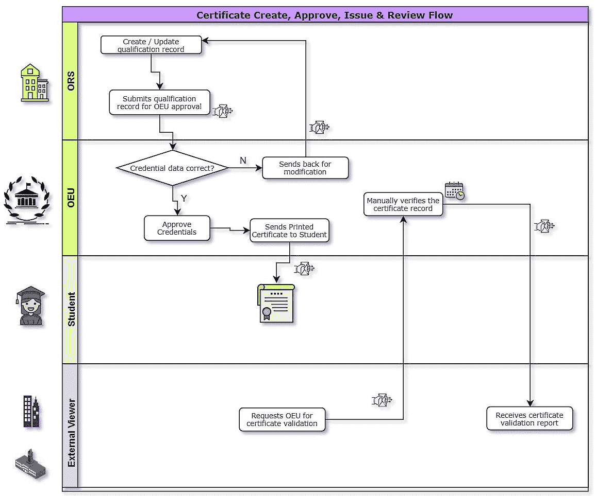

证书创建、审批、颁发和审查流程

现有流程存在以下效率问题：

+   手工验证流程使其变慢。

+   验证过程在确定欺诈性声明方面很慢。

+   它需要外部背景验证服务。

+   基于纸张的证书容易丢失或损坏。

+   伪造纸质证书和验证流程中的差距使证书的可信度成问题。

# 用例资格标准

在向我们的业务场景提出基于区块链的解决方案之前，让我们首先评估并看看它是否符合区块链解决方案的资格。我们如何确信基于区块链的解决方案应用于某一用例会真正解决当前流程面临的挑战？

让我们思考一下区块链技术可以克服的用例的特征方面和限制方面。以下考虑并非详尽无遗；而是一种试图提出区块链解决方案的指示性方法。

以下是区块链技术可以克服的用例的特征方面和限制方面：

+   用中心化解决方案可以解决该用例吗？由 OEU 管理的中心化解决方案会加速某些方面，与纯手工流程（如果存在）相比，但它会带来其他挑战，并不能解决所有现有的效率问题。中心化解决方案的挑战如下：

    +   中心化解决方案不能保证 ORS 和 OEU 的业务流程协同。因此，离线和在线流程之间的断裂不会提供系统效率的太多改进。

    +   从系统或信任的角度来看，将存在单一故障点。

    +   它要求其他方信任一个单一实体（OEU），而不需要其他利益相关者的验证或授权。

    +   它没有提供防止发放虚假证书的有效解决方案。

+   是否有多个利益相关者共享的数字资产？考虑到在此用例中，教育证书是数字资产，它确实将在 ORS 和 OEU 之间共享，用于生成、处理、授予以及验证。

+   数字资产需要以安全方式存储和访问吗？由于证书将成为共享资产，并将由不同的利益相关者访问，因此安全机制至关重要。考虑到资产的性质，安全对于以下方面非常重要：

    +   对其任何访问都应适当进行跟踪

    +   对证书数据的任何更新都应得到 ORS 和 OEU 的认可

    +   证书应受到任何篡改和未经授权访问的保护

+   组织间可能存在信任问题吗？需要建立 ORS、OEU 和证书查看者之间的信任。用例的解决方案应通过设计确保自动建立信任。

# 区块链解决方案的好处

用例需要一个数字资产（教育证书），应该在利益相关者之间共享，并具有以下特征：

+   共享资产状态

+   互相认可和验证的数据工作流程

+   所有授权的利益相关者透明而安全地访问

+   未篡改的、永久的存在证明和批准证明

考虑到解决方案的所需特征，基于区块链的解决方案是一个合适的选择。凭借其固有的支持不可变性、共享账本、安全访问和交易认可属性，基于区块链的解决方案将能够满足所有用例要求。此外，它还将通过涉及更多利益相关者和智能合约的应用，开启进一步的自动化和流程效率的可能性。

以下是基于区块链的解决方案对我们的用例带来的关键好处：

+   一个可信、防篡改的教育证书数字存储库

+   消除丢失或损坏的风险

+   流程简化（几乎实时）的验证程序，因为教育证书存储在受信任的、不可变的、共享账本上，并具有适当的授权

进一步的可能性如下：

+   个人大规模协作完成的完整教育资格历史

+   将此类真实来源作为进一步批准（例如研究资助和工业合作）的先决条件

+   将教育资格作为一种普遍且业界认可的表示进行标记（例如，EduCoin）

# 设计解决方案

现在我们已经为基于区块链的解决方案合格，让我们开始根据 OBP 结构设计解决方案。

设计过程没有固定的步骤顺序。这取决于解决方案设计者的自主选择。主要目标应该是明确 OBP 解决方案的各个方面，从逻辑视图到部署方面。

# 业务网络拓扑

正如我们之前提到的，对于我们的用例，我们考虑三种利益相关者。它们分别是 OEU、ORS 和**证书查看者**/**验证者**（让我们简称为**CVs**）。我们需要根据他们的功能确定每个利益相关者的角色：

+   OEU 是大学或控制机构，其下设有不同的学校（学院）。正是这个实体最终有权批准学生提交给他们学校的教育证书。

+   ORS 是其中一个学校，学生在该学校注册并完成他们的教育。完成后，ORS 将评估并提交学生的教育证书给 OEU。在更广泛的背景下，ORS 可以被归类为代表性区块链实体*学校*的一部分。这取决于业务需求和实现环境。

+   诸如学生、雇主和职业机构的 CVs 主要是数据（教育证书）的使用者，因此只能对网络进行只读访问。

基于这一前提，以下表格描述了实体：

| **组织** | **实体类型** | **访问类型** |
| --- | --- | --- |
| OEU | 创始人 | 读/写 |
| ORS | 受权参与者 | 读/写 |
| CVs | 参与者 | 读取 |

# 通道关联

在我们的用例中，一种类型的资产将与所有利益相关者共享，即证书数据。这需要每个人都能够访问相同的账本数据。因此，这将是一个单一通道网络组织，所有利益相关者将以前面列出的各种访问角色连接在一起。

以下图示逻辑地展示了解决方案中 OBP 节点将如何被创建：

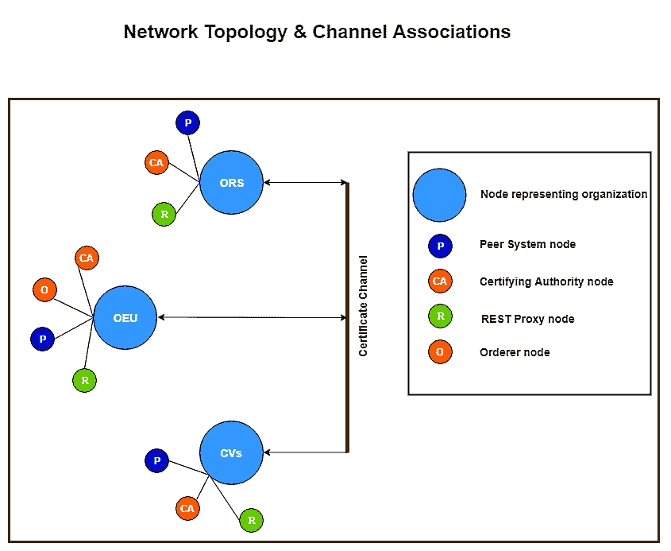

网络拓扑和通道关联

该图示展示了各个利益相关者与单一通道的关联。

# 网络构件

确定网络拓扑和利益相关者后，让我们定义在网络上共享的资产和对其执行的操作。

# 资产模型

对于给定的用例，我们主要在账本上存储两种类型的对象：

+   **学生**（**接收者**）：基本信息

+   **证书**：证书数据

以下图示是资产结构及其高层次之间的关系：

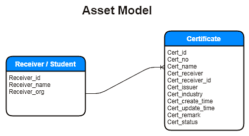

资产模型

# 链码交易

该用例要求各个阶段的利益相关者执行以下交易：

| **交易** | **执行者** | **描述** |
| --- | --- | --- |
| `CreateReceiver` | ORS | 创建新的接收者或学生 |
| `AddCertificate` | ORS | 为接收者插入证书 |
| `ApproveCertificate` | OEU | 批准证书 |
| **搜索操作** |  |  |
| `QueryByCert_id` | 所有 | 查询证书 |
| `QueryByRecev_id` | 所有 | 按 ID 查询接收者 |
| `GetCertificateHistory` | OEU/ORS/接收者 | 查询记录的一个关键字的历史 |
| `QueryAllCerts` | OEU/ORS | 查询所有学生的所有证书 |

# 解决方案运营流程

到目前为止，我们已经确定了 OBP 项目相关者，他们的关联，账本数据模型以及链码交易。本节将帮助您可视化基于 OBP 的解决方案对现有业务流程所带来的改变，从而克服当前面临的低效和挑战。

以下图表显示了符合条件的使用情形的解决方案流程：

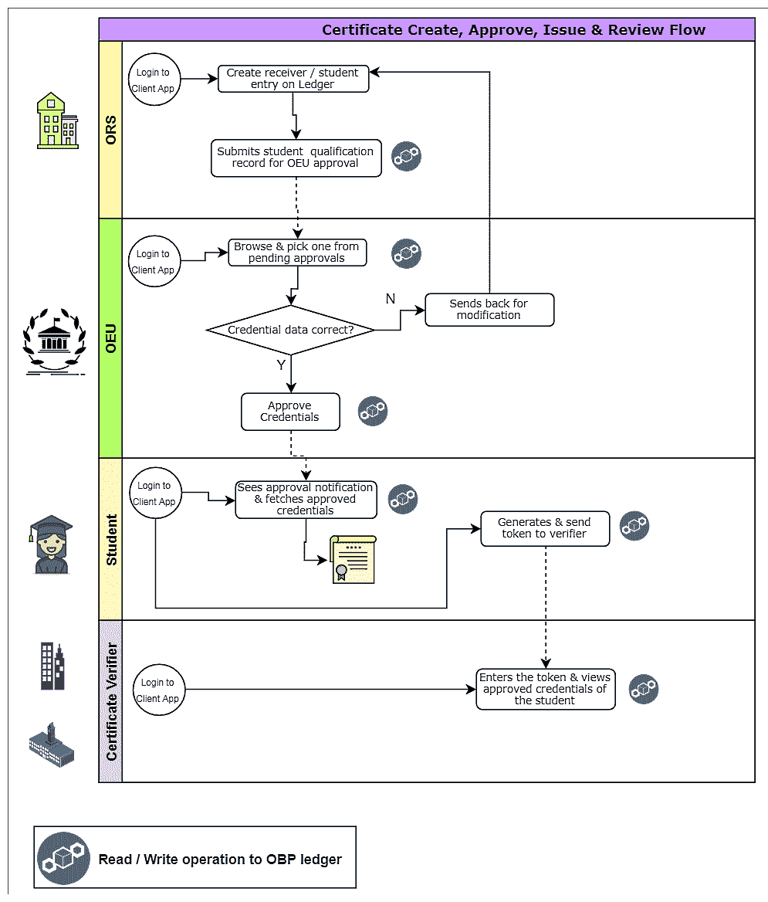

解决方案流程

# 解决方案架构

作为解决方案架构的一部分，本节涵盖了 OBP 解决方案的整体高级组件视图和运行时部署视图，以及其组件和实例。

# 高级架构

让我们确定实施基于 OBP 的解决方案所需的解决方案组件和它们之间的交互。以下图表描述了高级解决方案架构：

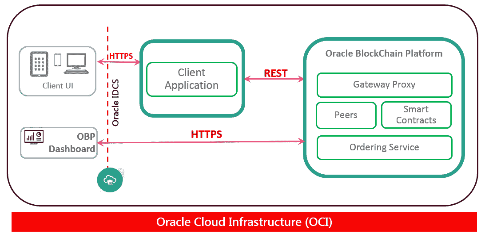

解决方案架构 - 高级层次

这些是解决方案的组件：

+   **OBP 仪表板**为 OEU 和 ORS 管理员/操作员提供一个接口，以执行 OBP 管理和配置任务。

+   不同的客户端应用程序集将为每个利益相关方而需要：

    +   **ORS**：

        +   创建学生条目，将证书数据插入账本中

        +   能够搜索学生和证书数据

    +   **OEU**：

        +   能够搜索学生和证书数据

        +   批准/拒绝学生的成绩证明数据

    +   **学生** (**CV**)：

        +   能够查看已批准的证书

        +   为证书验证器生成一个标记，以验证存储在 OBP 账本上的他们的学术资格

    +   **证书验证器**：

        +   能够使用学生使用 OBP 解决方案生成的标记来验证学生的学术资格

# 部署架构

以下图表显示了 OBP 所有部件和组成解决方案组件如何在 Oracle Cloud 实例上运行。 Oracle Cloud 通过集成的 Oracle **Identity Cloud Service**（IDCS）保证整个云设备通过其强大且可扩展的**Oracle Cloud Infrastructure**（OCI）可用性域：

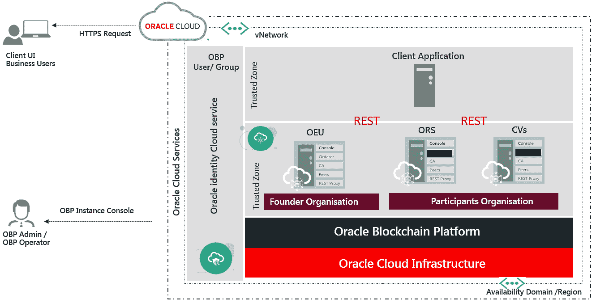

部署架构 [Oracle 镜像]

# 文档存储 - 推荐与 OBP 一起使用的方法

就像我们的用例一样，今天企业业务流程相关的很多情景涉及文档对象的交换。就实用性而言，对于许多情况，文档本身仅仅是对实体流程的直接采纳。它主要提供了一个对交易相关持有人手中可信实体资产的感知。技术上，这是与商业交易相关的数据值的逻辑分组，例如已经达成的条款和条件、合同和交易数据。

借助基于区块链的可信解决方案，比如我们正在 OBP 上构建的解决方案，实际上我们可以摆脱许多文档对象的需求。然而，出于实际性考虑，文档可能会共存，并且随着采用程度的增加而逐渐变得不相关（并非在所有情况下都是如此）。

目前，可以采用以下方法来存储企业文档以及核心 OBP 解决方案（分类帐）数据：

+   在 OBP 分类帐上进行写入事务时：

    +   生成文档的哈希值，将哈希值记录在分类帐上（链上），并将文档存储在链下

    +   文档的链下存储可以是基于云的 Oracle 内容和体验服务，或其他 Oracle 云存储选项，如对象存储或文件存储

    +   哈希逻辑应由交易参与者协商达成一致，并且必须得到适当的保护。

    +   在智能合约之外执行哈希和文档存储操作可以减少其执行时间。

+   在读取交易时（即在获取文档资产时）：

    +   从所选的文档存储获取文档。

    +   获取文档的哈希并发送给智能合约进行比较和验证。

    +   在匹配成功时，可以阅读文档。否则，应报告意外情况。

有关此方面的更多详情，请参考上一章节中的文档存储部分。

到目前为止，我们已经通过了业务场景并定义了用例。我们通过分析用例来证明需要区块链解决方案，并通过符合用例资格来了解用例。一旦我们决定用例适合区块链解决方案，我们就对基于区块链的解决方案进行了设计。本章的后半部分集中在探索 OBP 及其架构，并设置 OBP 网络实例。

# 探索 OBP

正如我们已经知道的，OBP 基于开源的 Hyperledger Fabric。但是对于企业来说，Fabric 并不够，因为它并非预安装。以下是从零开始为企业构建工作区块链网络所需的一些高级要求：

+   设置所有先决条件、配置和容器。

+   设置容器生命周期管理以管理节点、通道、链码等所有容器。

+   安装用户管理等安全性，这是企业中最重要的组件之一。

+   管理系统升级计划和补丁，以便与快速变化保持一致。由于 Hyperledger Fabric 是开源的，技术将不断演变，因此您需要不断管理系统升级计划和补丁。

+   确保所有资源的高可用性和可伸缩性。

+   为数据提供安全性并提供集成端点，例如 REST API，以与其他产品连接，比如 SaaS 应用程序、ERP 或任何第三方应用程序。

+   与各种工具一起监视和处理运营任务，如检查节点的健康状况和利用率、通道活动、对等方活动、通道管理、对等方管理、链码管理和网络管理。

要从基础到生产组织一个区块链网络，您需要技能、资源和时间（也许需要几个月）来设置和维护所有这些需求。Oracle 对所有这些需求负责，并提供了 OBP 服务。在本节中，我们将深入探讨 OBP 的架构，并学习如何设置 OBP 实例和区块链网络。

# OBP 架构概览

OBP 提供了一个预组装的平台，用于构建区块链网络、部署和运行智能合约以及维护分布式账本。一旦通过几次点击进行服务配置，管理员便可以使用 Web 控制台动态更新区块链配置并监视其运行。开发人员可以部署智能合约并使用 REST API 或客户端 SDK 集成应用程序。OBP 实现了实时的分布式点对点交易，并允许应用程序（新的或现有的）在区块链网络上进行交易和共享数据。

欲了解 OBP 产品的最新更新，请参考 [`www.oracle.com/cloud/blockchain/`](https://www.oracle.com/cloud/blockchain/)。

因为 OBP 是 Oracle 云平台的一部分，它预先与底层云服务组件配套，包括用于身份验证的身份云服务、用于嵌入式归档的对象存储、操作和故障排除的管理和日志分析等。用户可以配置多个对等节点和通道以实现可用性、扩展性和保密性，Oracle 云将自动处理底层依赖关系。以下图表对架构进行了高级解释，并说明了 OBP 如何为开源 Hyperledger Fabric 增加价值：

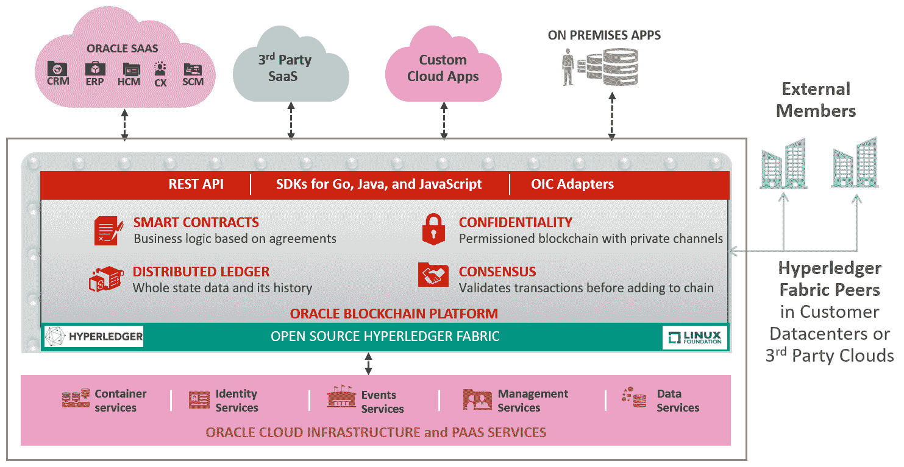

OBP 高级架构

OBP 是一种权限区块链，并且利用内置的 Oracle IDCS 到 Hyperledger Fabric 来提供以下功能：

+   用户和角色管理

+   OBP 控制台、REST 代理和**证书颁发机构**（**CA**）的身份验证

+   身份联合和第三方客户端证书支持以启用财团形成并简化成员入职流程

OBP 运行在 OCI 上，它是一个 PaaS 服务。因此，存储、可扩展性、高可用性和基础架构将由 Oracle 负责。使用 Oracle 集成云服务的适配器，可以将其与 Oracle SaaS、PaaS 和本地应用程序集成，实现区块链交易、事件和查询。由于 OBP 基于 Hyperledger Fabric，它还允许我们连接使用 Hyperledger Fabric 的外部成员节点。这些外部成员节点可以位于客户数据中心或第三方云服务中。下图显示了 OCI 上 OBP 服务级架构：

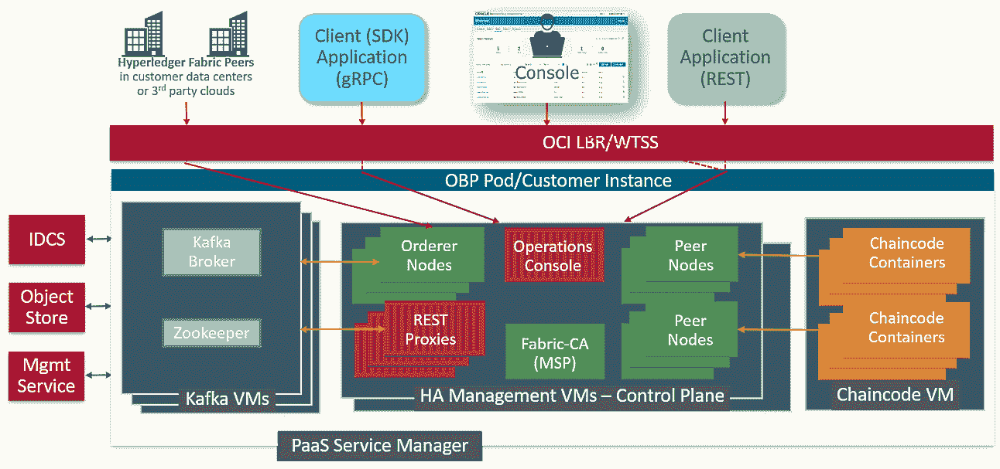

OBP 服务级架构

Oracle 已经对 Hyperledger Fabric 进行了许多增强，使 OBP 成为企业级服务。每个区块链实例都包含托管容器、虚拟机、身份管理、区块和对象存储以及 Oracle 事件中心云服务，这是一个专用的 Kafka 连接。

# 区块链实例

OBP 实例（本书中称为区块链实例）是包含对等节点、排序器、操作控制台、CA、REST 代理和链码的容器集合。OBP 实例与身份管理集成以管理用户和角色。它还集成了 Oracle 对象存储以动态备份配置更改和分类帐，并在需要时进行恢复。Oracle 对象存储将备份区块链实例中的所有组件，包括分类帐中的所有块文件，其中还包括系统通道和客户通道中的数据、通道列表、最新检查点、链码的源代码、配置文件和节点的配置文件和日志文件。此备份和恢复过程将在 OBP 中自动完成，而无需用户注意。OBP 使用 Oracle 事件中心云服务作为排序器的专用 Kafka。默认的 REST 代理可用于将 OBP 与任何其他应用程序集成，例如 SaaS、PaaS、本地或其他第三方应用程序。

到现在为止，你应该知道区块链需要大量容器和大量存储资源，因此资源密集型。由于 OBP 在 Oracle 云上运行，Oracle 将负责存储、可扩展性和服务的高可用性。

OBP 有两种方式可用。一种是通过安装 Oracle 提供的预构建虚拟机，另一种选项是在 Oracle 云中创建帐户，并从服务组合中提供区块链平台。除了访问和创建区块链实例的初始步骤外，所有其他功能和导航都是相同的。让我们看看这两种 OBP 配置方式。

# 设置 OBP SDK

本节展示了如何在笔记本电脑或本地机器上设置 OBP SDK。这仅供参考；然而，还有其他方法，如在 OCI 等云基础设施中设置。以下是设置 OBP SDK 的流程。

# 先决条件

这些是设置 OBP SDK 的先决条件：

+   Oracle Linux 版本 7.3 或更高（OBP 在任何带有 Docker 的 Linux 上运行，但推荐使用 Oracle Linux），并且必须具有互联网访问权限，并且 Linux 内核版本必须大于 3.10。

+   磁盘空间取决于计划部署的实例数量。

+   对于应用程序，推荐每个实例使用 4 GB 内存。

+   在配置完成后，有多个 Docker 容器在运行，并且每个容器对主机机器的 CPU 周期的访问应该是无限制的。为了确保每个容器运行顺畅，推荐至少使用两个 CPU。

+   需要主机名。

+   需要 Oracle 用户，因为进程在 Docker 容器中运行（例如 peer 和 orderer）。

当从浏览器访问时，主机名应该是一个可解析的名称。在本地设置 OBP 的情况下，主机名必须是您的 VM 运行时的名称。在同一 OBP VM 中创建多个组织时，主机名将保持不变（即 VM 名称），但每个组织的端口范围将不同。

```
#create user oracle
sudo useradd oracle
sudo passwd oracle
<newPassword>
```

# 准备 Docker 环境

要构建和安装 OBP SDK，需要安装最新的 Docker 引擎和 Docker Compose：

1.  Docker 引擎安装：OBP SDK 需要最新版本的 Docker 引擎。执行以下命令查找 Docker 引擎版本：

```
docker --version
```

1.  如果版本不是 `Docker version 17.05.0-ce` 或更高，则按以下说明安装/更新 Docker 的最新版本。

1.  使用以下命令使用 docker `yum` 仓库命令替换 OS（操作系统）版本为您的特定 OS 版本：

```
$ sudo tee /etc/yum.repos.d/docker.repo <<-EOF 
name=Docker Repository
baseurl=https://yum.dockerproject.org/repo/main/oraclelinux/7
enabled=1
gpgcheck=1
gpgkey=https://yum.dockerproject.org/gpg
EOF
```

1.  安装 Docker 引擎：

```
$sudo yum install docker-engine-17.05.0.ce
```

1.  检查 Docker 引擎版本：

```
$docker –version
```

以下截图显示版本：

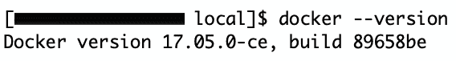

Docker 版本

1.  启动 Docker 引擎：

```
sudo systemctl restart docker
```

1.  对 Docker 守护进程的用户进行身份验证：

```
sudo usermod -a -G docker $USER
```

1.  解包并部署 **区块链云服务**（**BCS**）SDK，并借助以下代码片段解压缩它：

```
As opc user switch to 
/usr/localcd 
/usr/localsudo 
mkdir bcssdk
cd bcssdk
```

1.  从网络或本地来源复制 OBP SDK。

1.  执行以下命令将构建包解压到 `bcssdk` 目录：

```
sudo unzip obcs-sdk-19.1.3-20190129043733.zip -d /usr/local/bcssdk
```

本书使用 OBP SDK 版本 19.1.3，其中 Hyperledger Fabric 版本为 1.3。

1.  现在我们需要安装图像并开始配置控制台。作为 **root** 用户，运行 `build` 命令以加载和安装 Docker 图像：

```
./build.sh
```

以下截图显示了 `build.sh` 的输出：

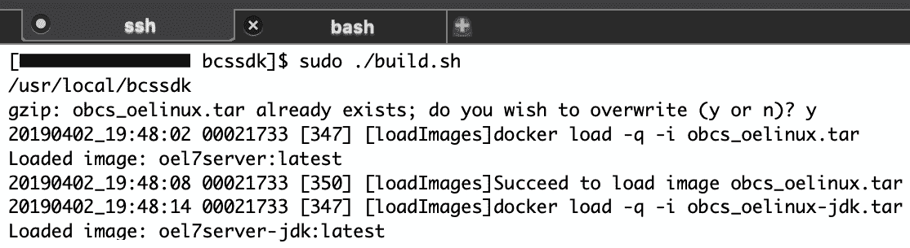

运行 build.sh

1.  等待 Docker 加载：

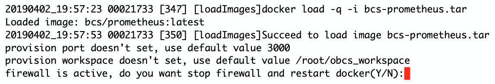

docker load

1.  确认使用 `Y`，然后图像安装完成后控制台将自动启动：

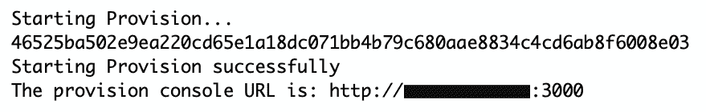

开始配置

有一些你需要记住的要点：

+   如果防火墙处于活动状态，`build.sh` 将提示用户停止防火墙并重新启动 Docker 守护程序。

+   请使用 `build.sh` 开始配置控制台。如果用户选择不停止防火墙，则在配置或配置后可能会出现问题。因此，在这种情况下，我们建议使用根用户。

+   如果防火墙关闭，用户 `oracle` 已存在，并且非根用户具有 Docker 访问权限，则可以使用此用户运行此命令。

# 配置

由于 OBP SDK 仅用于开发目的，每个已提供的实例只能存在 60 天。一旦过期，实例将不再工作。如果需要继续测试或原型制作，则需要提供新实例。

执行以下步骤进行配置：

1.  请使用以下命令行开始配置控制台（如果尚未启动）：

```
./build.sh [-d <package directory>, default is current path] [-w provision workspace directory, default ~/obcs_workspace] [-p provision console port, default 3000]
```

1.  将会观察到以下消息：

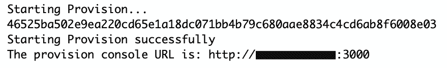

OBP 控制台 URL

1.  现在，您可以从本地机器使用 `ssh` 和端口转发访问控制台。在 Linux/mac 系统上，打开终端窗口并输入以下内容：

```
ssh -L <localPort>:<remoteIP>:3000 opc@<remoteIP>
```

1.  然后，从本地的 Web 浏览器中，只需输入 `http://localhost:3000`，您就可以看到控制台的用户界面：

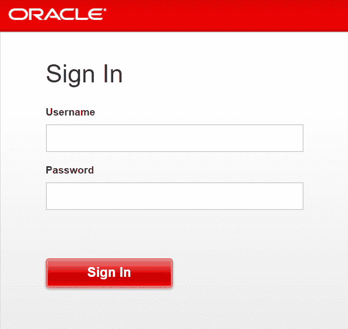

OBP 控制台

# 使用 SDK 创建区块链实例

使用 OBP SDK 创建区块链实例的过程如下：

1.  打开 VM 的登录 URL，例如，`http://studentvm2:3000/`。

1.  将打开 Oracle 登录页面。首次需要创建用户。

1.  输入**用户名**和**密码**（记住这些凭据以备将来使用）。

1.  单击“登录”。

1.  如果用户不存在，将打开一个标题为“创建用户”的对话框窗口，如下截图所示：

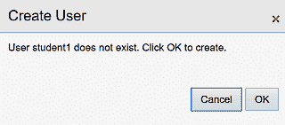

OBP SDK 登录

1.  单击“确定”创建用户。

1.  创建用户后，将打开 OBP 实例页面，如下截图所示。使用此页面创建实例并列出所有已创建的实例：

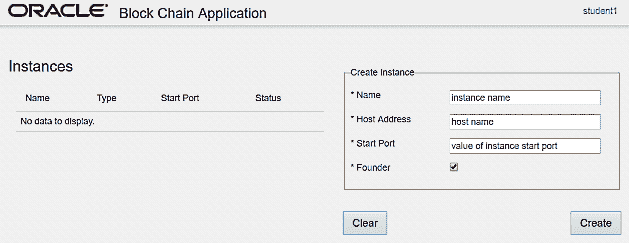

OBP SDK 控制台

# 在 OBP SDK 中创建创始人实例

要创建创始人实例，请在“创建实例”部分提供详细信息，并确保选中“创始人”复选框：

1.  名称：如下截图所示，可以设置要创建的实例的名称，例如，`detroitauto`。

1.  主机地址：如下截图所示，输入已设置了 SDK 的 VM 的主机地址。只能使用此主机地址访问实例。

1.  **起始端口**：参考截图，在实例创建后输入一个端口（或一系列端口）以访问控制台：

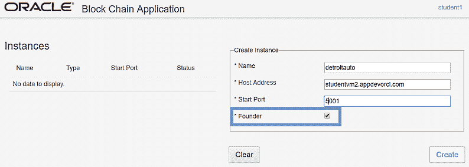

OBP SDK 创始人 1

1.  单击“创建”按钮，等待一段时间以查看已创建的实例，因为必须创建多个容器和虚拟机，并使其运行起来。

1.  当实例创建完成后，将在左侧的“实例”下可见：

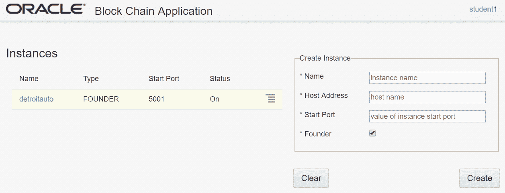

OBP SDK 创始人

1.  单击实例名称后，将打开该实例的区块链控制台。

现在让我们在 OBP SDK 中创建一个参与者实例。

# 在 OBP SDK 中创建参与者实例

要创建参与者，请按照上述步骤操作，但取消选中“创始人”：

1.  请参考以下截图：

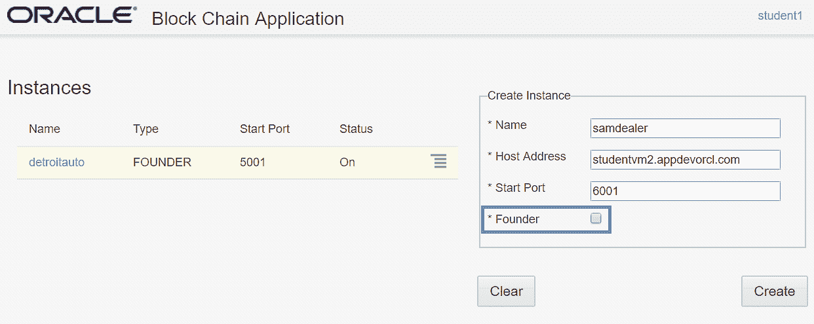

OBP SDK 参与者

1.  单击“创建”，等待几分钟（在我的情况下，是 4 分钟）；然后您将看到新的参与者实例已添加到实例列表中，如下所示：

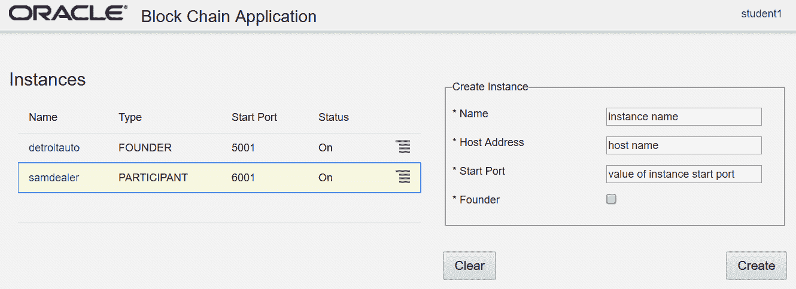

OBP SDK 参与者

参考*OBP 的特性和组件*部分，了解 OBP 控制台的外观并探索其功能。

# 在 Oracle Cloud 上进行 OBP 规划

访问 Oracle 云中的 OBP 的流程如下：

1.  打开 [`cloud.oracle.com`](https://cloud.oracle.com/)。

1.  单击右上角的“登录”。

1.  输入您的**Cloud Account Name**，然后单击“下一步”。

1.  输入您的用户名和密码，然后单击“登录”按钮。

1.  将打开“云我的服务”页面。

1.  单击左上角的汉堡图标，展开“服务”菜单。然后，您将在列表中看到“区块链平台”，如下所示：

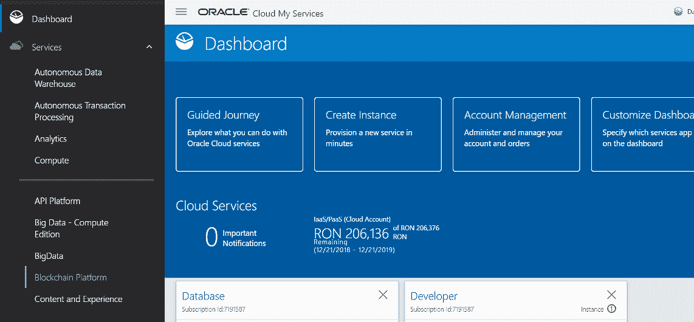

OBP 云我的服务

1.  单击“区块链平台”。将打开 OBP 控制台。这是您可以创建新的 OBP 实例或查看帐户中创建的实例列表的位置。您还可以查看实例活动的历史记录：

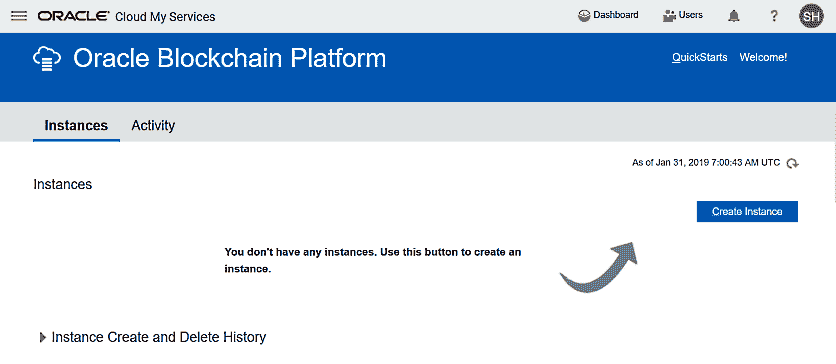

OBP 云控制台

# 在 Oracle Cloud 上创建创始人实例

一旦您按照前一节所示打开 OBP 控制台，请单击“创建实例”：

1.  将打开“创建实例”页面：

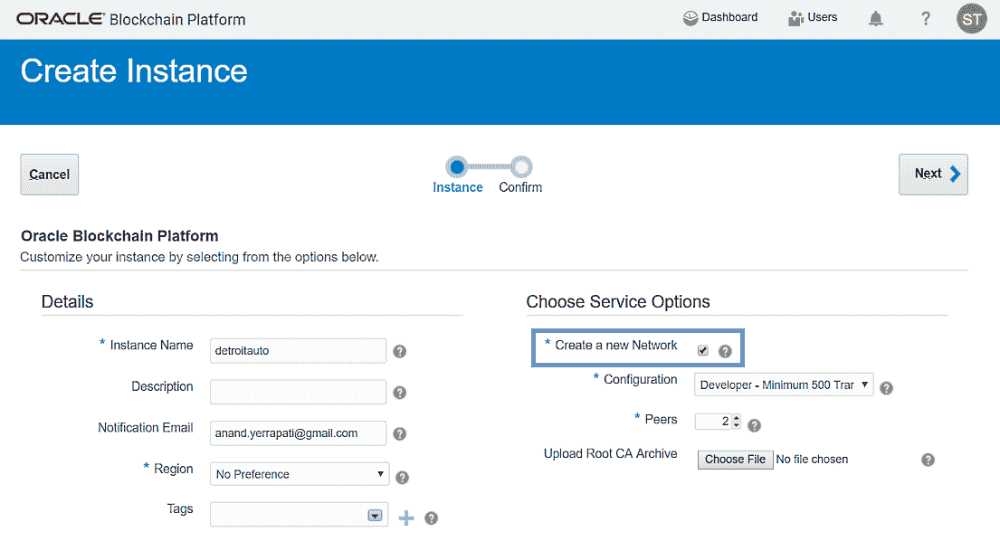

OBP 云创始人

1.  按照上图中显示的表单填写详细信息。

1.  确保“创建新网络”复选框已启用。这在创建创始人时非常重要。

1.  单击“下一步”。将显示包含您提供的详细信息的页面以供确认，如以下截图所示：

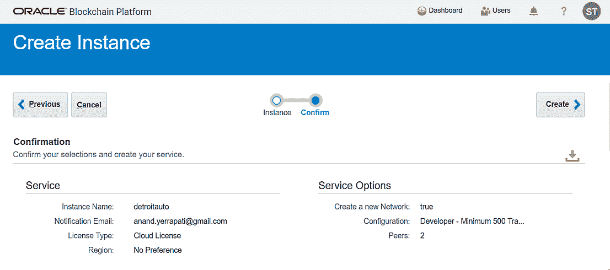

OBP 云创始人

1.  验证所有详细信息，然后单击“创建”。

1.  稍等片刻。成功创建实例后，将显示以下屏幕。将发送电子邮件确认到提供的电子邮件地址：

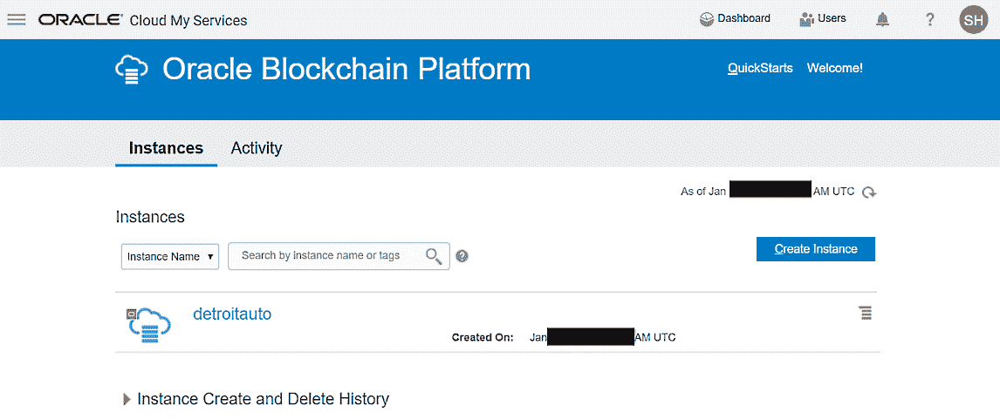

OBP 云创始人

1.  在实例名称旁边，单击汉堡图标。将显示一个菜单。如果单击“区块链控制台”选项，则将打开该实例的控制台。

# 在 Oracle Cloud 上创建参与者实例。

要创建参与者，请按照之前在 *在 Oracle Cloud 上创建创建者实例* 部分提到的步骤，但取消选中创建新网络：

1.  请参考以下截图：

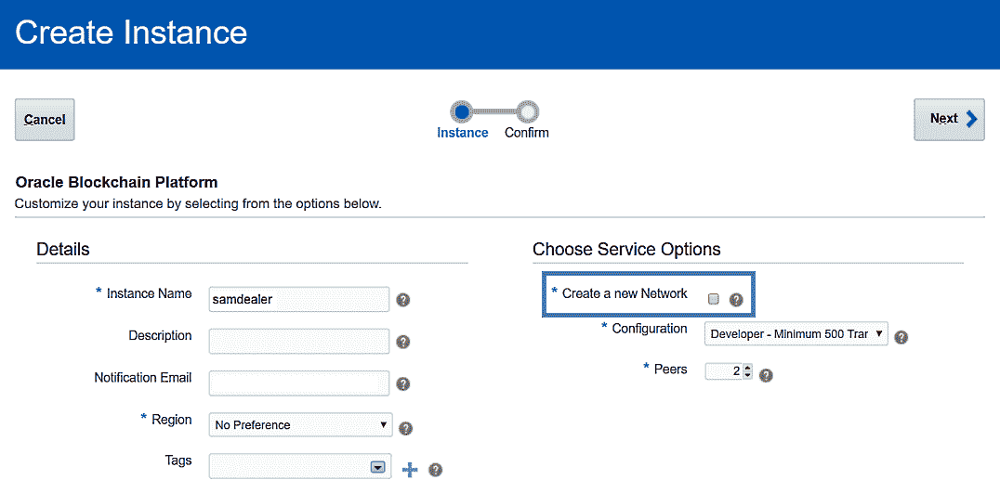

OBP 云参与者。

1.  创建参与者实例后，您可以在 OBP 控制台的“实例”选项卡中看到实例列表，如以下截图所示：

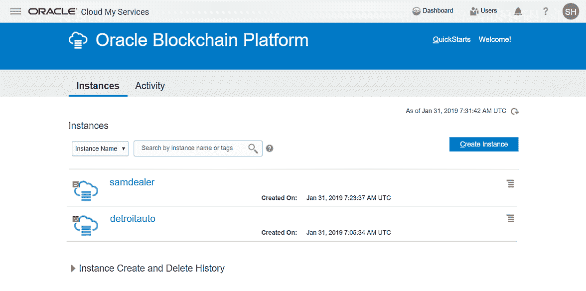

OBP 云实例。

# OBP 的功能和组件。

在本节中，我们将看到 Oracle 区块链实例控制台的外观，并检查其功能。如果您使用 OBP SDK 或通过 Oracle Cloud 创建区块链实例，则 OBP 实例的控制台将与以下截图中显示的相同：

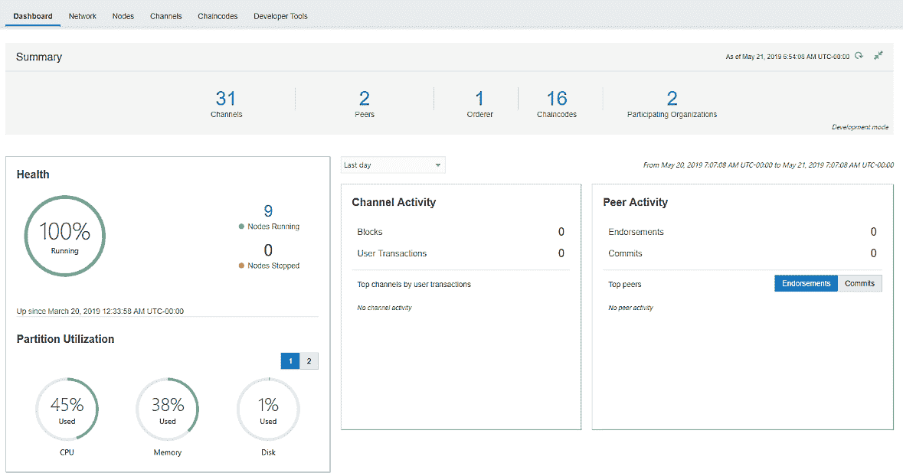

OBP 实例仪表板。

控制台有多个选项卡，在接下来的部分中我们将逐个探讨它们。

# 仪表板。

这是第一个选项卡，显示以下内容的摘要：

+   实例已创建或参与的通道数量。

+   实例正在使用的对等方数量。

+   部署和运行在实例上的链代码数量。

+   通道的活动，例如通道上创建的区块数量和通道上的用户交易数量。

+   对等方的活动，例如背书和提交。

+   实例的健康状况，例如正在运行和停止的节点数量。

+   CPU、内存和磁盘利用率的指标。

在仪表板上显示这些数据的同时，如果实例是创建者，则还会显示参与网络的顺序和组织的数量。

每个区块链网络只会有一个排序者，并且在 OBP 中它将与创建者一起。

# 网络拓扑结构。

此选项卡显示参与网络的所有人。此外，它还显示了网络的拓扑视图：

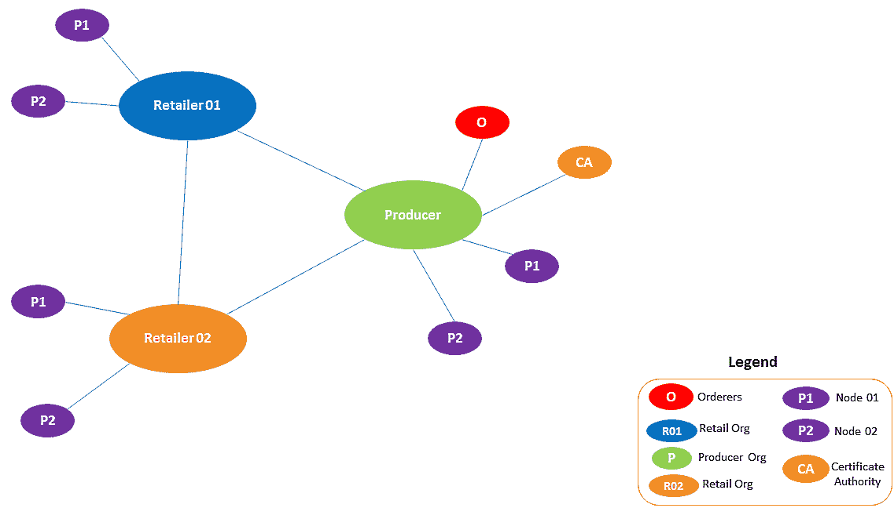

OBP 网络拓扑结构。

上图显示了网络的结构以及组织和节点之间的关系。

# 节点拓扑结构。

此选项卡显示所有对等方，包括自身对等方和远程对等方，他们都是网络的一部分，以及一个 CA 节点。如果是创建者，可以看到一个额外的用于排序的节点。它还显示了网络的节点和对等方的拓扑视图：

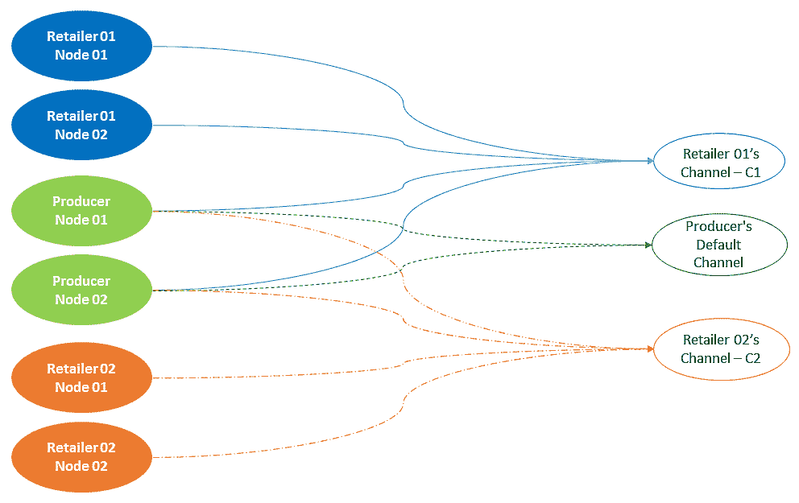

OBP 节点拓扑结构。

上图显示了对等方和通道之间的关系。

# 通道。

此选项卡用于管理实例的通道。它将列出实例所属的所有通道。还可以从这里创建新通道。可以管理通道级别的策略，可以向通道添加新对等点，以及可以向通道添加或删除组织。每个通道都将有自己的分类帐，并显示分类帐的所有区块和交易。一旦创建了通道，就无法删除。

# 链码。

此标签用于管理链码，并列出实例中所有网络的所有链码。这里可以进行链码的部署、启动和实例化。该链码可以写入并更新渠道的分类账。一旦部署链码，它不能被更新。链码可以在多个渠道中实例化。每个链码在一个渠道中每个版本只能实例化一次，这意味着如果在一个渠道的节点上实例化了链码，那么渠道中的其他节点只需部署链码，实例化将自动反映在它们上面。每个链码都有其自己的日志和私有数据集合，这些数据也可以从此标签访问。

# 开发者工具。

此标签允许我们访问 OBP 文档，并提供来自 Oracle 的 SDK、工具和预构建示例链码的下载链接。

在接下来的章节中，我们将了解如何创建区块链网络并邀请组织参与网络，创建和部署链码，使用链码，测试分类账，使用 REST 代理等等。

# 与 OBP 一起使用丰富历史数据库。

OBP 使用 Hyperledger Fabric 历史数据库来管理分类账，并在控制台中呈现分类账交易信息。只有链码可以访问这个历史数据库，不能向任何外部应用程序公开查询分析数据。即使它们提供区块链服务，分析也不能被忽略。因此，OBP 集成了丰富的历史数据库以满足这一要求。

丰富历史数据库是 OBP 外部的，并包含您选择的渠道中区块链账本交易的数据。您可以将丰富的历史数据库集成到 OBP 实例控制台中，并选择需要在数据库中捕获数据的渠道。一旦在一个渠道上启用丰富历史数据库，该渠道的所有交易都将同步到数据库中。这种级别的数据收集使丰富历史数据库成为生成分类账活动分析和可视化报告的绝佳数据源。您可以使用任何分析工具，例如 Oracle Analytics Cloud 或 Oracle Data Visualization Cloud Service，访问丰富历史数据库并创建分析报告或数据可视化。

OBP 只支持 Oracle 数据库，例如 Oracle Autonomous Data Warehouse 或 **Oracle Database Cloud Service**（**ODCS**），使用 OCI 创建丰富的历史数据库。

# 创建 ODCS 连接字符串。

OBP 可以在 OCI 中与 ODCS 集成为丰富历史数据库。然而，还必须通过端口 `1521` 启用对数据库的访问。

# 获取 ODCS 信息。

在 OCI 控制台中创建与 ODCS 连接的过程如下：

1.  登录 Oracle Cloud，My Services 页面将会打开。

1.  单击左上角的汉堡菜单图标，展开“服务”菜单，选择“数据库”选项。

1.  在 DB 系统下，找到要连接的数据库并记录其公共 IP 地址。

1.  单击数据库的名称并捕获以下字段的值：

    +   数据库唯一名称

    +   主机域名

    +   端口

1.  查找具有对此数据库的读取权限的数据库用户的用户名和密码。

# 启用端口 1521 以访问数据库

在 ODCS 上启用端口`1521`的过程如下：

1.  如前所示，导航至 DB 系统并单击要连接的数据库。

1.  点击“虚拟云网络”。

1.  在安全性列表下，导航到相应的子网。

1.  点击“<目标数据库>的默认安全列表”。将显示安全列表页面。

1.  点击“编辑所有规则”。

1.  添加一个入口规则，允许来自公共互联网的任何流量到达此数据库节点的端口`1521`，设置如下：

    +   源 CIDR：`0.0.0/0`

    +   IP 协议：`TCP`

    +   源端口范围：`全部`

    +   目标端口范围：`1521`

    +   允许：端口为`1521`的 TCP 流量

# 创建连接字符串

启用对 Oracle 数据库的访问后，请使用收集的信息在“配置丰富历史记录”对话框中构建连接字符串。构建连接字符串如下：

```
<publicIP>:<portNumber>/<database unique name>.<host domain name>
```

以下示例显示了连接字符串的样式：

```
123.213.85.123:1521/CustDB_iad1vm.sub05031027070.customervcnwith.oraclevcn.com
```

# 配置 OBP 中的丰富历史数据库

每个区块链网络实例都可以配置自己的丰富历史数据库，以下是执行此操作的步骤：

1.  打开区块链网络实例的控制台。

1.  点击选项按钮（右上角的汉堡图标），然后点击“配置丰富历史记录”。将打开配置对话框：

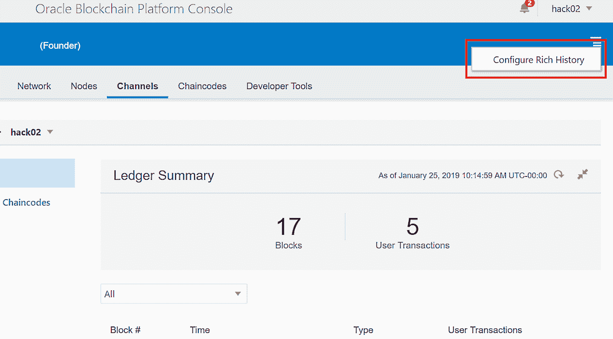

配置丰富的历史记录

1.  输入数据库的**用户名**和**密码**。

1.  在“连接字符串”字段中，输入将存储丰富历史数据的数据库的连接字符串。此输入取决于正在使用的 Oracle 数据库：

    +   如果数据库是 Oracle 自主仓库，则连接字符串类似于`<用户名>adw_high`。

    +   如果数据库是 OCI 的 ODCS，请按照“创建 ODCS 连接字符串”部分讨论的步骤获取连接字符串。

    +   如果您使用的是非自治数据库，并且想要使用`sys`用户连接数据库，则必须在连接字符串后面附加`?as=sys[dba|asm|oper]`，例如，`123.123.123.123:1521/example.oraclevcn.com?as=sysdba`。

    +   如果您使用的是 Oracle 自主数据库，则可以使用钱包文件而不是连接字符串。该文件包含客户端凭据，并且是从 Oracle 自主数据库生成的。

1.  单击“保存”按钮。

1.  要更新此配置，请重复相同的步骤。

以下截图供参考：

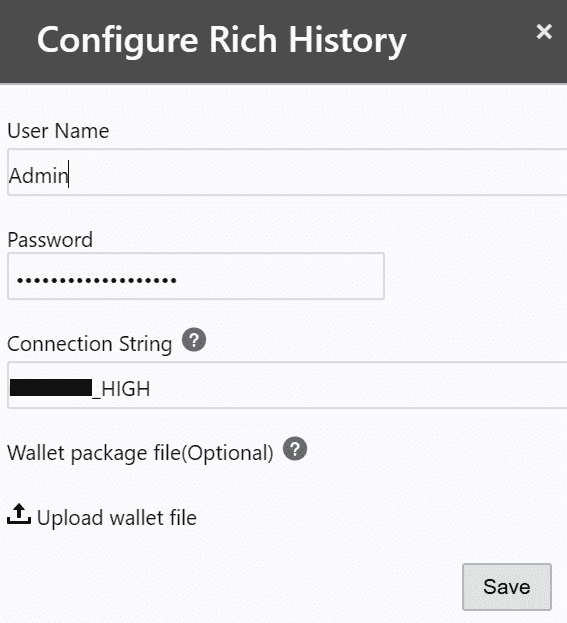

配置丰富历史记录

# 启用将数据写入丰富历史数据库的通道

在启用通道将数据写入丰富历史数据库之前，必须在实例中配置它。请按照以下步骤操作：

1.  打开区块链实例的控制台，转到通道选项卡

1.  定位通道并单击 More Options 图标

1.  要将通道添加到富历史数据库中，请从菜单中单击配置富历史选项

1.  将打开一个配置富历史对话框，里面有一个启用富历史的复选框

1.  单击复选框以添加通道，取消选中以删除通道

1.  单击保存按钮

# 富历史数据库的表格和列

当富历史数据库配置在一个通道上时，将在数据库中创建三张表格：历史表、状态表和最新高度。为了创建分析报告，将进行历史和状态表的查询：

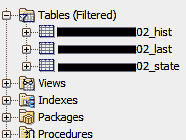

富历史表格

让我们看看每一个表格及其列。

# 历史表

此表的名称类似于 `<instance name>_<channel name>_hist`。

该表包含了通道分类账的历史。以下是列及其数据类型的列表：

| **列** | **数据类型** |
| --- | --- |
| `chaincodeId` | `VARCHAR2 (256)` |
| `key` | `VARCHAR2 (1024)` |
| `txnIsValid` | `NUMBER (1)` |
| `value` | `VARCHAR2 (4000)` |
| `valueJson` | `CLOB` |
| `blockNo` | `NUMBER NOT NULL` |
| `txnNo` | `NUMBER NOT NULL` |
| `txnId` | `VARCHAR2 (128)` |
| `txnTimestamp` | `TIMESTAMP` |
| `txnIsDelete` | `NUMBER (1)` |

请注意 `value` 和 `valueJson` 列以相互排斥的方式使用。也就是说，当键值为有效 JSON 时，该值会被设定到 `valueJson` 列中。否则，该值会被设定到 `value` 列中。 `valueJson` 列在数据库中被设置为 JSON 列，这意味着用户可以使用通常的 Oracle JSON 特定扩展查询该列。

# 状态表

此表的名称类似于 `<instance name>_<channel name>_state`。

该表从状态数据库复制数据。以下是列及其数据类型的列表：

| **列** | **数据类型** |
| --- | --- |
| `chaincodeId` | `VARCHAR2 (256)` |
| `key` | `VARCHAR2 (1024)` |
| `value` | `VARCHAR2 (4000)` |
| `valueJson` | `CLOB` |
| `blockNo` | `NUMBER` |
| `txnNo` | `NUMBER` |

`value` 和 `valueJson` 列在历史表格中是相互排斥使用的。

# 最新高度表

此表的名称类似于 `<instance name>_<channel name>_last`。

此表由 OBP 内部用于跟踪富历史数据库中记录的块高度。这张表格无法用于分析查询。

下面是一个屏幕截图，当富历史数据库连接到 **SQL Developer** 工具时，您可以参考以查看先前的表格：

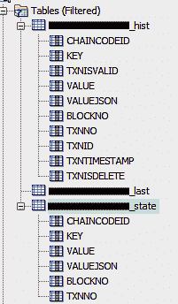

含有列的富历史表格

# 摘要

企业不断寻找有效和高效的方法来利用区块链技术，以及它们的 SaaS、BPM 和其他应用。BaaS 使他们能够实现这一目标。本章提供了对 OBP 的一瞥。本章重点介绍了与 OBP 构造相一致的解决方案的设计。本章涵盖了示例业务网络拓扑、网络构件以及解决方案和部署架构。本章还深入探讨了定义并创建基于创始人的业务网络实例以及向其中添加参与者。通过本章获得的知识将帮助您在下一章中管理区块链网络，并作为在上一章中描述的 OBP 解决方案开发的基础性里程碑。接下来的章节将让您深入了解 OBP 的管理方面，并教您在 OBP 上翻译网络拓扑。它深入探讨了对等体、排序和通道配置。它还提供了有关 REST 配置和 REST 接口管理的详细信息。随后的章节将更多地涵盖 OBP，并突出了 Oracle BaaS 平台的强大功能。
