# 在 Oracle 区块链平台上管理解决方案

上一章涵盖了商业场景，并允许我们探索 **Oracle 区块链平台** (**OBP**)。使用 OBP 管理解决方案非常简单；它允许您实践而不是阅读实践，并通过示例有效地展示实践。本章提供了关于 OBP 的深入知识，并允许您具备 OBP 的实际知识。通过本章，您将深入了解将网络拓扑映射到 OBP 上、创建网络利益相关者以及配置 OBP 实例的实际操作。这份知识的账本说明了设置交易基础设施、将参与者加入业务网络、访问控制、向业务网络添加智能性（链码）以及使用 REST 代理配置将链码暴露给 dApps。在很大程度上，OBP SDK 和 Oracle Cloud 上的 OBP 在功能上相似，除了让您创建 OBP 实例的步骤。这两个选项之间的差异不大，也很容易理解。本章主要涵盖了将网络拓扑转换为 OBP、为 OBP 网络增加业务智能和使用管理 REST 接口。

# 将网络拓扑映射到 OBP 上

本节描述如何在 OBP 上创建网络实例。如 第四章 *区块链平台的商业案例* 的 *设计解决方案* 部分所述，区块链网络需要以下业务实体：

+   **Oracle 帝国大学** (**OEU**) 作为创始者实体

+   **Oracle 红校** (**ORS**) 和 **证书查看器**/**验证器** (**CVs**) 作为参与者实体

# 使用 OBP 实例创建网络利益相关者

构建 OBP 解决方案的基础步骤包括为利益相关者实体创建 OBP 实例。按照以下步骤执行，以便为用例创建必要的 OBP 实例：

1.  启动并登录到 OBP 供应控制台。参考 第四章 *区块链平台的商业案例* 的 *设置 OBP SDK* 部分，获取 OBP 供应控制台的详细信息。

1.  登录后，通过填写实例详细信息开始创建 OBP 实例。

1.  下面的截图显示了创建实例的示例值。请注意这两个重要点：

    +   创始人复选框只能对创始者实例进行选择。

    +   为启动端口提供不同 OBP 实例的值。确保这些端口值相距较远，因为 OBP 在内部将多个值连续分配给起始端口，如下截图所示：

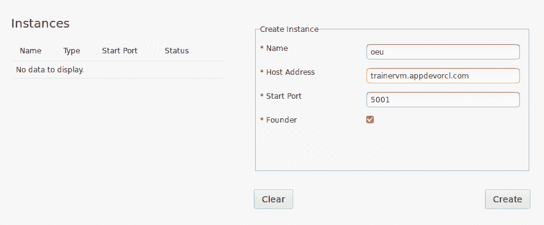

创建一个实例

1.  一旦我们的用例的所有 OBP 实例被创建（并激活），它们将显示在供应控制台上，如下截图所示：

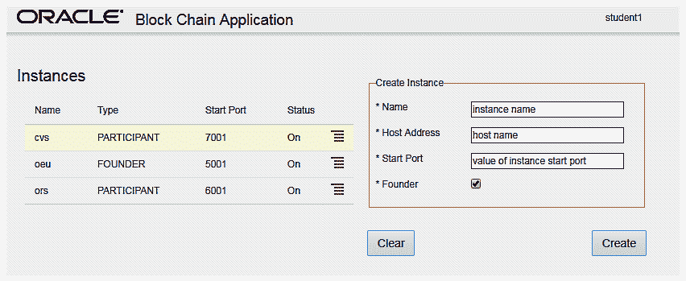

创始人和参与者实例的摘要

1.  单击每个 OBP 实例的上下文菜单，并选择 Console URL，导航到相应实例的 OBP 仪表板。我们案例中 OBP 网络创建的下一步是通过 OBP 仪表板完成的：

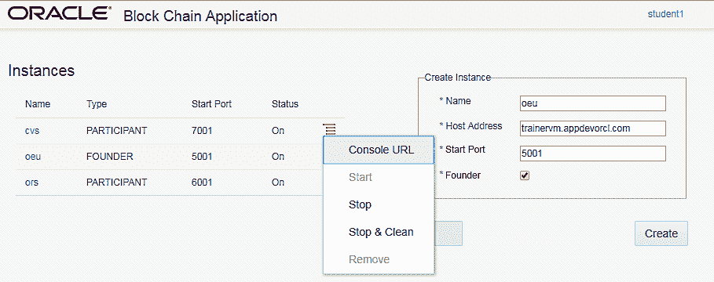

OBP 实例的上下文菜单

由于 **oeu** 是创始组织，它将拥有比其他参与者 OBP 实例更多的 OBP 系统组件。此外，作为创始组织，**oeu** 是一个自给自足的组织，因此在仪表板上还有不同的可视化元素。一旦我们完成了参与者实例的网络设置，我们也将在仪表板上获得类似的可视化效果。

以下表格给出了 OBP 工件下的默认值：

| **OBP 工件** | **创始人** (**OEU**) | **参与者** (**ORS 或 CVs**) |
| --- | --- | --- |
| 通道 | 1 | 0 |
| 对等点 | 2 | 2 |
| 排序器 | 1 | 0 |
| CA | 1 | 1 |
| REST 代理 | 2 | 2 |

以下截图显示了 **oeu** 仪表板，这是创始组织 (oeu) 的仪表板：

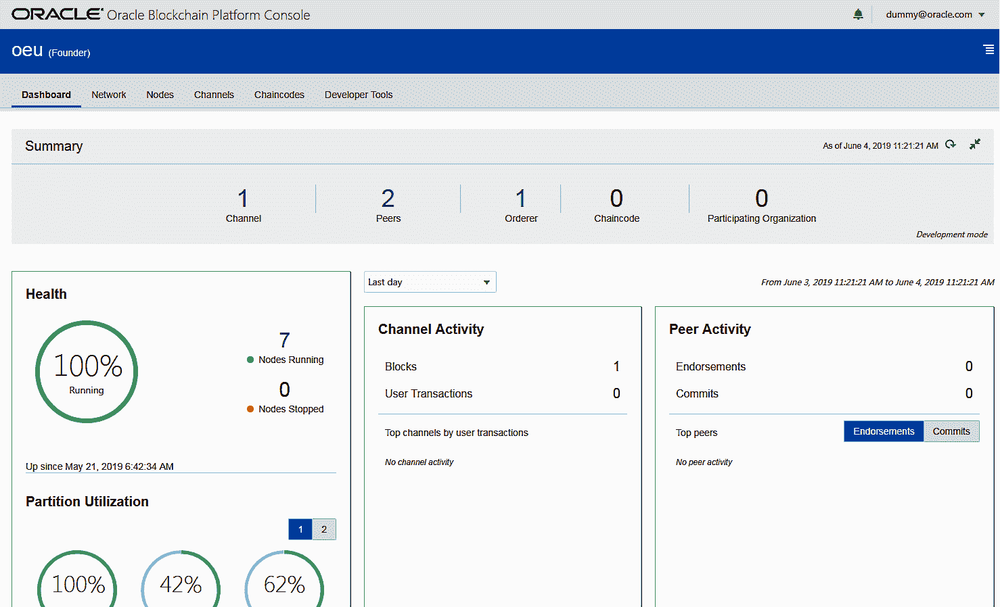

OBP 创始人仪表板

查看 **ors** 仪表板。ors 和 cvs 仪表板具有相似的外观：

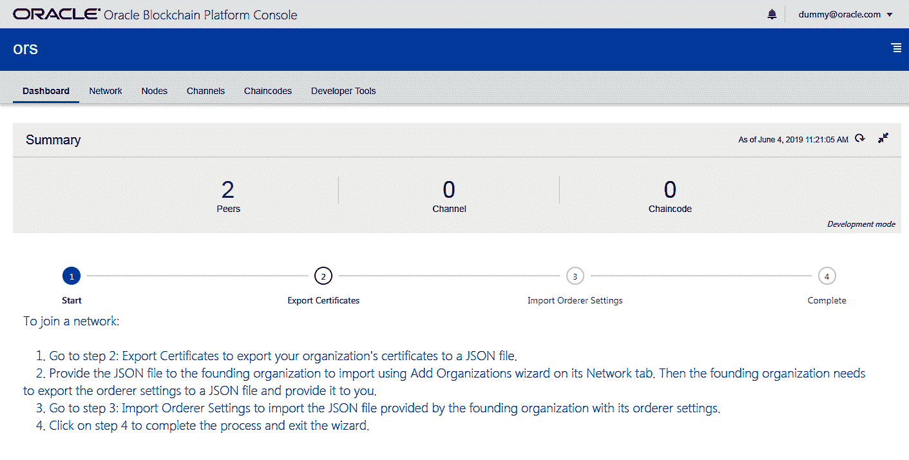

OBP 参与者仪表板

# 配置 OBP 网络基础设施

创建 OBP 实例后，构建 OBP 解决方案的下一步是在这些实例之间建立区块链交易网络。本节将带您完成连接所有 OBP 实例并启用底层共享账本基础设施的步骤。

以下部分阐述了步骤。

# 导出/导入参与者证书

导出参与者 (**ors** 和 **cvs**) 组织/实例证书并导入到创始人 OBP 实例。步骤如下：

1.  导出参与者组织证书

1.  将参与者组织证书导入创始组织

第一步是导出参与者组织证书。您可以通过以下两种选项之一导出参与者的 OBP 实例证书：

+   **选项 1**：使用仪表板向导，如下截图所示：

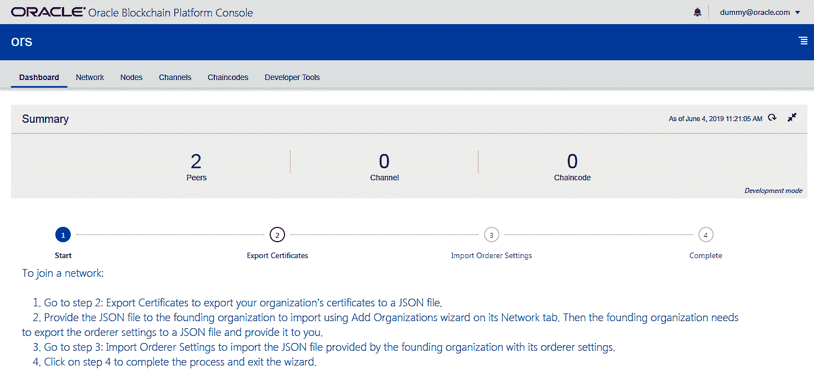

OBP 参与者导出证书流程

+   **选项 2**：从参与者 (**ors** 和 **cvs**) 的 OBP 仪表板的网络选项卡下的组织上下文菜单：

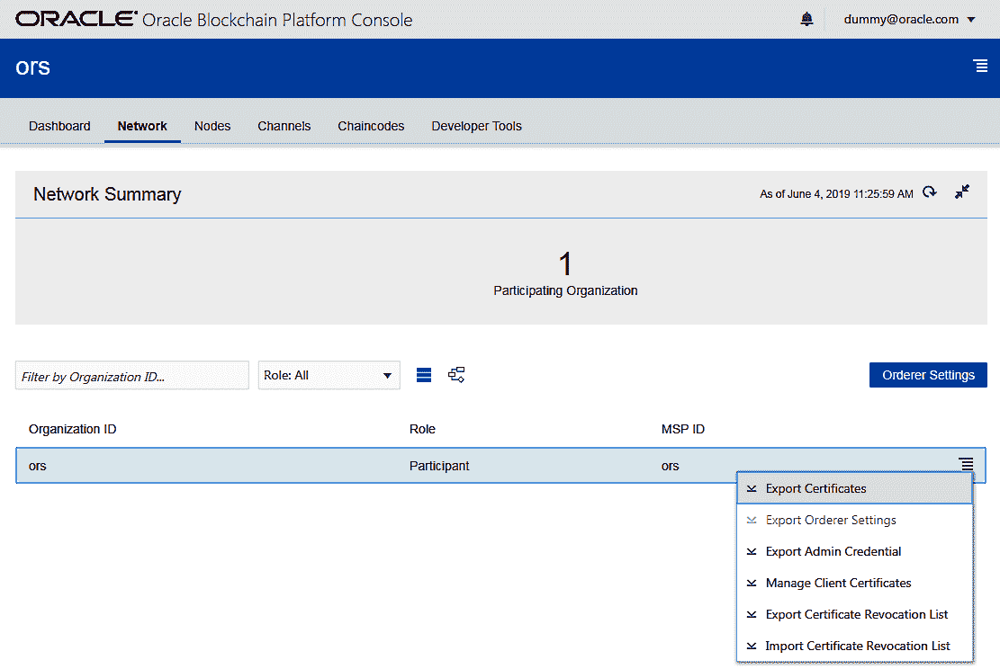

OBP 参与者网络摘要

参与者证书是包含其管理员、**证书机构** (**CA**) 和 **传输层安全性** (**TLS**) 的证书密钥及其签名的 JSON 文件。以下截图提供了参与者证书之一的一瞥：

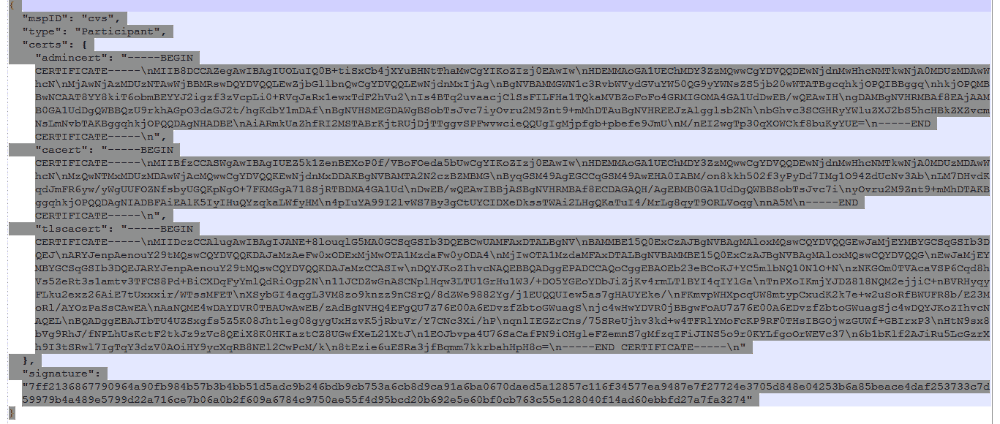

OBP 参与者证书快照

第二步是将参与者组织证书导入到创始者组织中。按照以下步骤将参与者证书导入到创始者组织中：

1.  转到创始者仪表板（oeu），以导入这些参与者的证书。这可以通过在 oeu 页面的**网络**标签下选择**添加组织**选项来实现。以下截图中展示了这些步骤。

1.  通过导入 ors 和 cvs 的参与者证书添加一个组织：

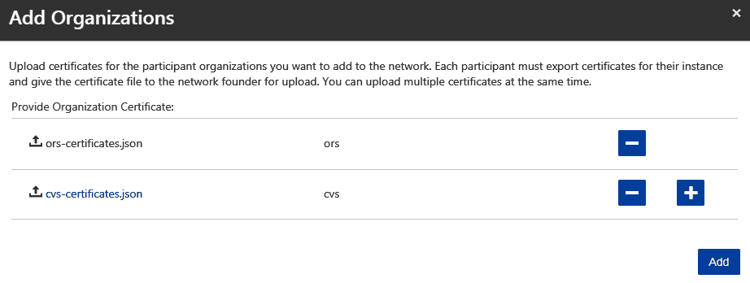

导入参与者证书

创始者的**网络**标签允许我们导入参与者证书：

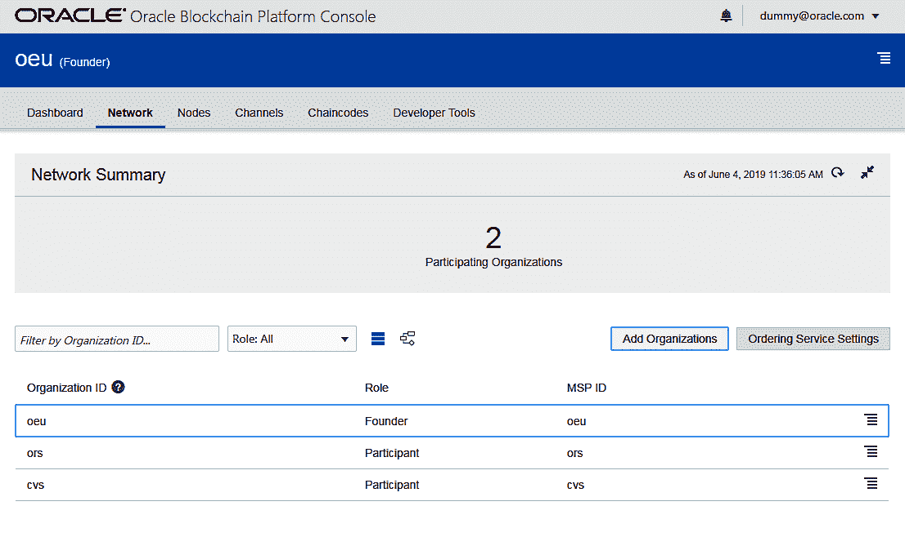

创始者网络摘要

# 订单者配置

设置 OBP 网络的下一组步骤是从创始者到参与者导入订购者配置。

由于订单者与基础设施级别的创始者实例相关联，因此执行此设置变得必要。这确保了由参与者对等体提交的任何区块链提案（交易）被同一订购者进行验证，并在最终写入共享账本之前对账本块进行排序。

以下步骤提供了如何完成订单者配置设置的逐步说明：

1.  使用**导出订购者设置**选项在**网络**标签下导出创始者实例的订购者设置：

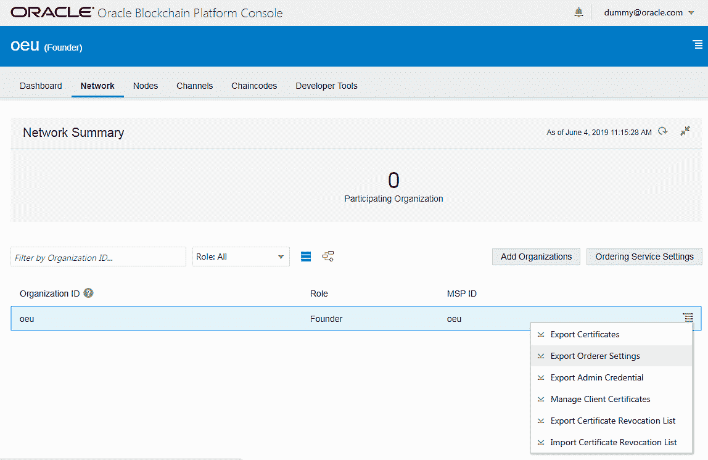

导出创始者实例的订购者设置

从技术上讲，OBP 中的订购者设置也以 JSON 文件的形式表示和存储，并包含创始者证书、签名和订购者端点。您还会收到一个类似的订购者的 JSON 文件，如下截图所示：

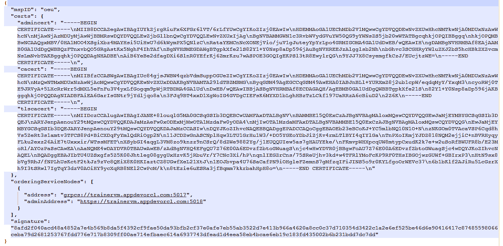

订单者设置的 JSON 文件

1.  将订单者设置导入到每个参与者（ors 和 cvs），如下几个截图所示。

1.  单击 ors 仪表板的**网络**标签下的**订购者设置导入**选项：

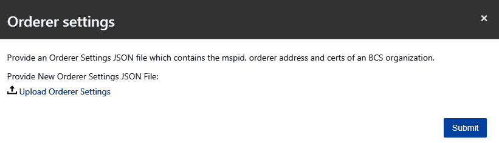

订购者设置的 JSON 文件

1.  上传从 oeu 实例导出的订购者文件：

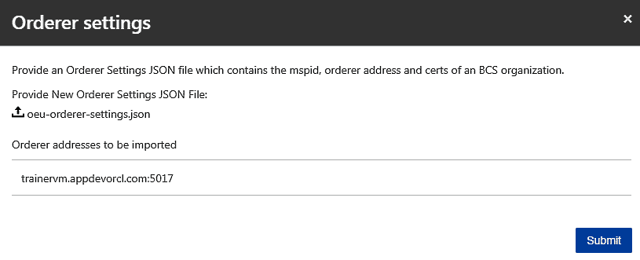

将订购者设置导入到参与者

1.  订单者设置导入完成后，您可以选择**查看订单者设置**选项来验证订单者详情。请注意，以下**订单者地址**实例与从创始者导出的订单者设置 JSON 文件中的订单者端点相同：

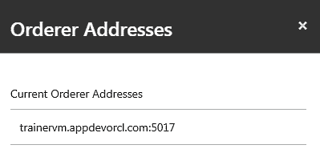

匹配订购者设置

# 配置 OBP 交易基础设施

在上一节中设置了基本的 OBP 网络基础设施后，现在是设置 OBP 交易基础设施的时候了。主要是在系统配置中定义共享账本，并将能够读/写账本的参与方（OBP 实例）相关联。

对于我们的用例，这将涉及与 OEU（创始人）建立频道，并将 ORS、CVs 和 OBP 实例添加到同一频道。有关更多详细信息，请参阅第四章中的*网络拓扑*和*频道*部分，*参与区块链平台的业务案例*。

正如其名称所示，频道是 OBP 中的逻辑或配置构造，允许两个或多个网络利益相关者共享数据。此数据共享通过共享账本完成。因此，OBP 中的每个频道本质上也表示与之关联的基础共享账本。

# 频道设置

让我们为用例继续进行必要的频道创建：

1.  转到 oeu 仪表板的 频道 选项卡，然后单击创建新频道。

1.  更新以下字段：

    +   频道名称：为频道提供一个名称。

        请注意，当进行链码调用时，您将需要它。

    +   选择 ors 和 cvs 实例的复选框。

    +   选择一个或多个 oeu 的对等节点加入频道，如下图所示：

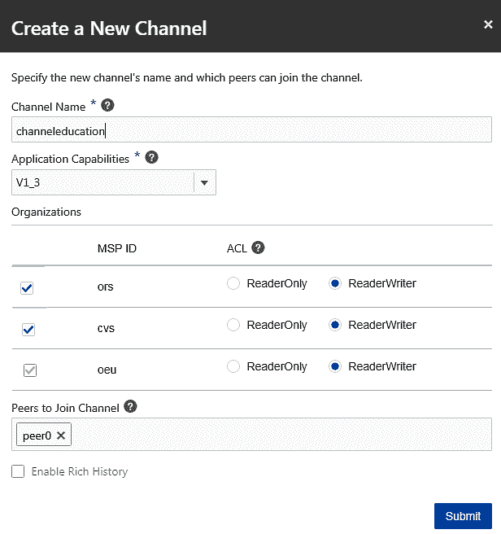

创建频道

频道创建成功后，您可以在 oeu 仪表板上看到相应的通知，并且新创建的频道将显示在现有的**频道**列表中。 **oeu **频道选项卡将类似于以下屏幕截图：

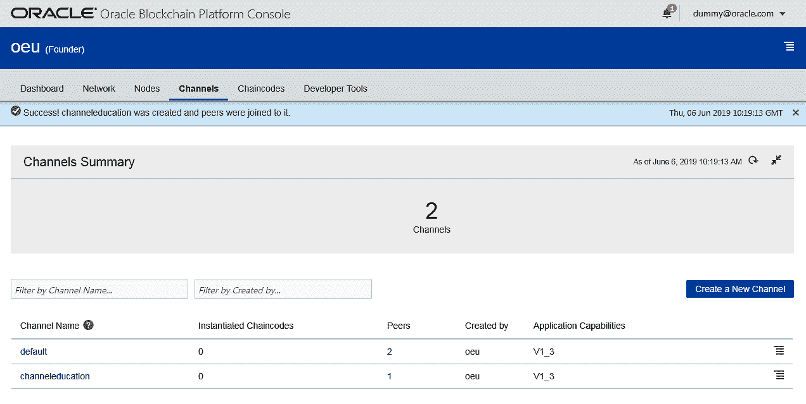

创建频道摘要

# 将参与者节点加入频道

使用 OEU 的 OBP 实例创建频道后，将参与者的对等节点 ORS 和 CVS 添加到同一频道。通过这样做，我们确保由各自 OBP 实例的应用客户端提交的任何交易都将被对等节点接受，并添加到频道进行验证、链码执行和 RWSet 创建。然后，此 RWSet 将提交给订购者以排序分类帐块。

您可以通过以下任一选项将参与者的对等节点添加到频道：

+   使用参与者 OBP 仪表板的 节点 选项卡下的对等节点的上下文菜单，如下图所示：

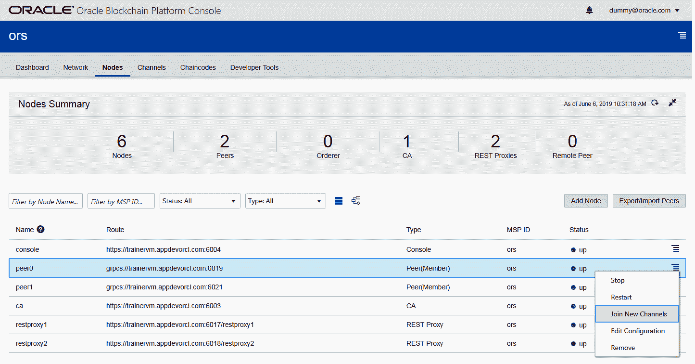

节点摘要

+   使用参与者 OBP 仪表板的 频道 选项卡下的频道的上下文菜单，如下图所示：

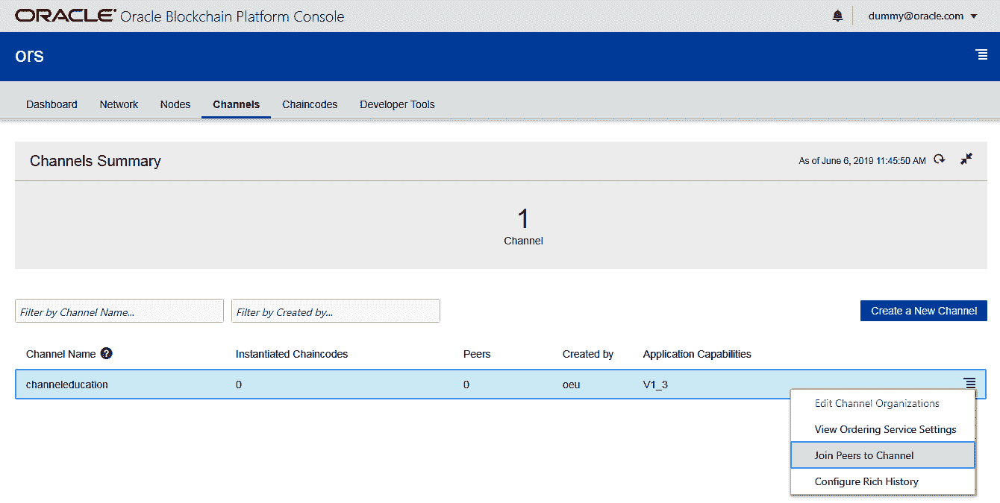

频道摘要

继续选择选项 2，您将被要求选择**加入频道的对等节点**选项。您可以选择一个或多个实例的对等节点加入：

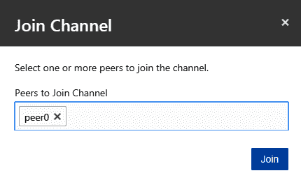

加入频道

一旦参与方节点加入通道，OBP 实例节点的拓扑视图应该如下所示的截图所示。

# 创始者节点摘要

以下截图显示创始组织的节点摘要：

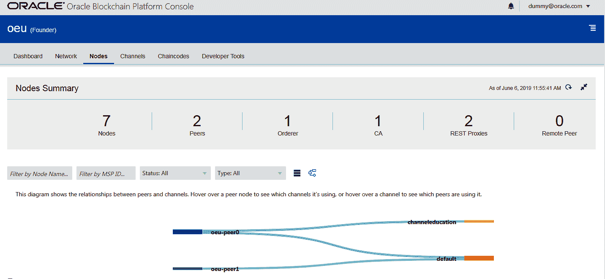

创始者节点摘要

# 参与者（ors）节点摘要

以下截图显示了 ors 组织的节点摘要：

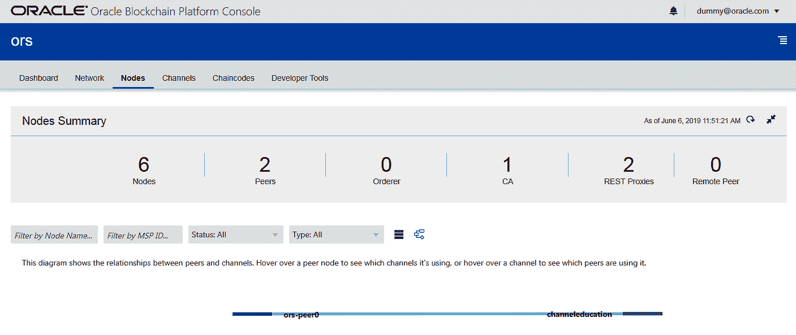

参与者节点摘要

# 参与者（cvs）节点摘要

以下截图显示了另一个参与者（cvs）组织的节点摘要：

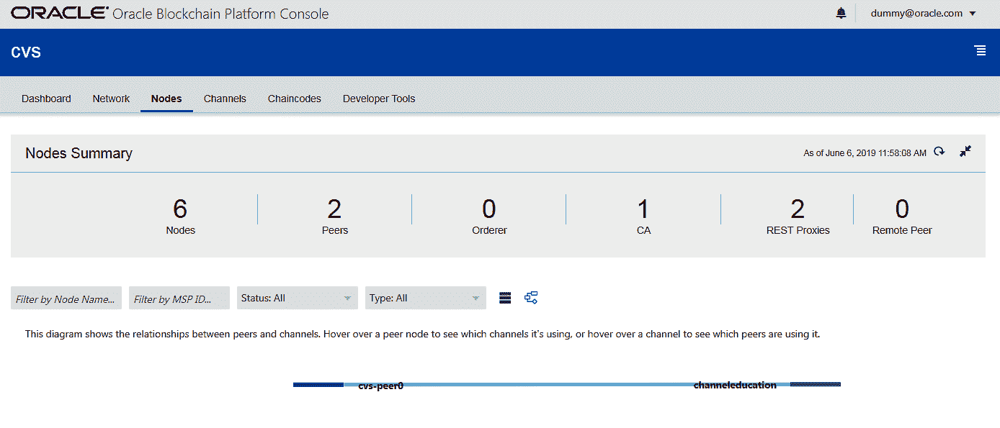

参与者节点摘要

另外，请验证 OEU、ORS 和 CV 的网络拓扑视图是否显示如下截图所示的可视化效果。

# 创始者网络摘要

以下截图显示了创始组织（oeu）的网络摘要：

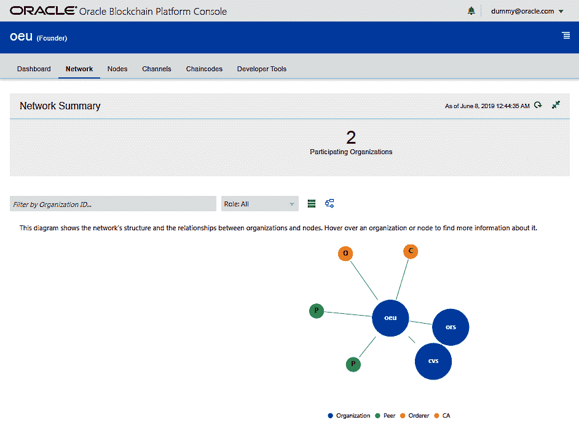

创始者网络摘要

# 参与者（ors）网络摘要

以下截图显示了参与组织的网络摘要之一：

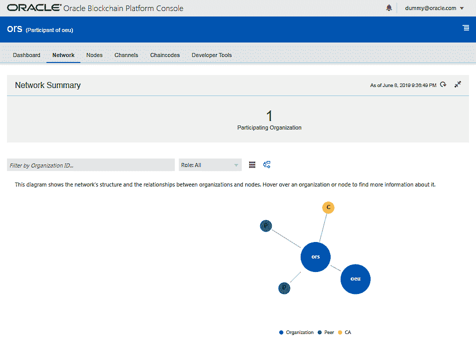

参与者（ors）网络摘要

# 参与者（cvs）网络摘要

以下截图显示了其他参与组织（cvs）的网络摘要：

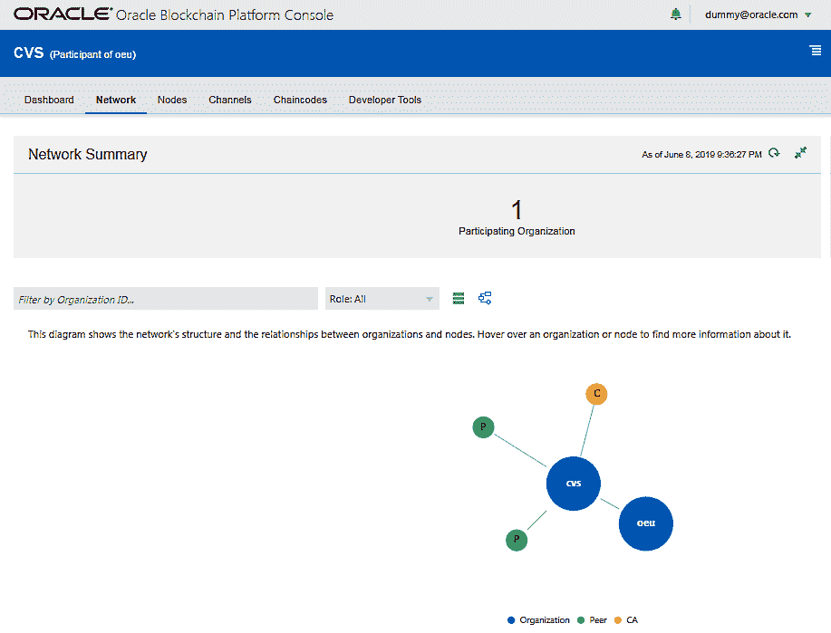

参与者（cvs）网络摘要

# 向 OBP 网络添加智能性

随后的章节广泛涵盖了通过链码开发向 OBP 网络添加业务智能性，并将链码功能暴露给客户应用程序。以下部分提供了其 sneak preview。

# 开发链码以向 OBP 网络添加智能性

完成配置 OBP 网络的步骤后，下一步的实施集合涉及向其添加智能性。通常，这意味着将我们的用例业务逻辑添加为智能合约或链码。它涉及在网络实例的所有节点上安装和实例化链码。

本书的下一章涵盖了为我们的用例实现链码和相关网络构件。 第六章，*在 Oracle 区块链平台上开发解决方案*，涵盖了开发、部署和实例化链码，以满足用例需求。关于网络构件设计的更多细节，请参考第四章，*参与区块链平台上的业务案例*，中的*网络构件*部分。

# 通过 REST 代理配置公开链码

这些配置通常包括定义，以将链码功能暴露给客户端应用程序（如 dApp）。为了保持连续性，请参考第六章中的链码部署部分，*在 Oracle 区块链平台上开发解决方案*，了解 REST 代理配置的详细信息。

# OBP 的 REST 接口

设置和管理您的 OBP 网络的所有管理和配置步骤（如前文所述）也可以使用 OBP 的管理 REST 服务来执行。这些服务对于需要以下情况非常有用：

+   减少这些活动的手动模式

+   实施自动化方式（例如 DevOps 流水线）设置和管理 OBP 网络

+   以自定义方式表示 OBP 管理信息

这些管理 REST 接口包括与组织、节点、渠道和链码相关的服务。此外，OBP 还提供了一系列 OBP 统计 REST 服务。

以下是 OBP 管理 REST 服务列表：

+   组织 REST 端点：在组织 REST 端点下，以下是服务列表：

    +   获取组织证书

    +   获取组织管理员凭证

    +   获取创始组织中的订购服务设置

    +   将一个新组织加入到创始组织

    +   将订购服务设置给参与者组织

+   节点 REST 端点：在节点 REST 端点下，以下是服务列表：

    +   获取节点列表

    +   获取特定渠道上的节点列表

    +   获取特定链码的节点列表

    +   添加对等节点

    +   启动/停止对等节点

    +   移除对等节点

    +   获取/设置对等节点属性

    +   将节点加入到渠道中

    +   导出/导入节点

    +   启动/停止订购者

    +   获取/设置订购者属性

    +   启动/停止 CA 节点

    +   获取/设置 CA 的属性

    +   启动/停止 REST 代理

    +   获取/设置 REST 代理的配置

+   渠道 REST 端点：在渠道 REST 端点下，以下是服务列表：

    +   创建一个渠道

    +   获取渠道列表

    +   获取链码的频道列表

    +   获取对等方的渠道列表

    +   更新渠道配置

    +   获取渠道信息

    +   通过块 ID 获取账本块

    +   通过 ID 范围获取块

    +   通过时间范围获取块

+   链码 REST 端点：在链码 REST 端点下，以下是服务列表：

    +   获取已安装链码列表

    +   获取特定对等方上的链码列表

    +   获取渠道上的链码列表

    +   安装链码

    +   实例化链码

    +   获取链码信息

+   统计 REST 端点：在统计 REST 端点下，以下是服务列表：

    +   当前存在的渠道列表以及每个渠道上加入的对等点列表

    +   指定对等方当前已加入的渠道数量和列表

    +   指定对等方上当前已安装的链码数量和列表

    +   指定渠道上已实例化链码的当前数量

    +   指定代理或所有代理的配置链码列表

    +   节点健康状态

    +   与节点使用相关的指标（CPU、内存、磁盘使用情况）

    +   总异步调用次数

    +   计费交易数

    +   区块数量

    +   提交次数

    +   背书数量

    +   总同步调用次数

    +   用于对等方或通道或整个网络的用户事务数量

有关这些服务的更多详细信息，请参阅 OBP 文档。

# 摘要

本章主要涵盖了对 OBP 解决方案进行实验的第一组步骤。我们已经涵盖了将网络拓扑转换为 OBP，配置 OBP 网络基础设施，配置 OBP 事务基础设施，向 OBP 网络添加业务智能，REST 代理配置以及管理 REST 接口。

下一章探讨了链码开发，例如语言部分、开发工具和开发环境设置。它还涵盖了链码从开发到更新的完整生命周期，包括安装、初始化、测试和版本控制。它展示了一个使用 Go 和 Node.js 构建的代码库的完整链码。它还说明了背书策略、私有数据收集、通过 shim 和 REST 端点进行链码测试，以及使用 SDK、REST 和事件将客户端应用程序与业务网络集成。
