# 在Oracle区块链平台上开发解决方案

前一章让您有机会实践而不是仅仅阅读，因为它有效地演示了开发示例。前面的章节提供了关于**Oracle 区块链平台**（**OBP**）的深入信息，并教授了在OBP上转换网络拓扑、创建网络利益相关者和配置OBP实例的实用性。本章探讨了链码，并包括链码开发的详细信息，包括语言部分、开发工具和开发环境设置。本章还着重于映射资产模型、操作以及开发链码的功能和接口。它详细描述了链码的完整生命周期，从开发到更新，包括安装、初始化、测试和版本控制。它还演示了基于Go和Node.js构建的完整链码代码库。背书政策、私有数据集以及它们与链码协作的工作也得到了阐述。本章还演示了通过shim和REST终点进行链码测试，并使用SDK、REST和事件将客户端应用程序与业务网络集成。最后，它通过实验监控链码日志和通道日志来总结了对链码、交易和通道的见解。该章涵盖了设置链码开发、链码开发、链码部署、测试链码以及将客户应用程序与区块链集成的主题。

# 设置链码开发

在这一部分，您将学习如何为我们在前几章中使用的大学场景开发链码。

# 选择开发语言（GO、Node.js 或 Java）

编程技能对于编写链码非常重要。由于区块链具有分布式账本，因此在**Hyperledger Fabric**（**HLF**）的初始版本中仅支持Go语言。然而，随着HLF的发展，它现在支持多种语言，并计划在将来添加更多语言。在Fabric版本1.3中，它支持使用Go、Node.js和Java编写链码。要探索其中的每一种，您可以在OBP实例控制台的**开发工具**选项卡下下载示例文件。

# OBP解决方案开发工具

这一部分为您提供了开发工具和开发环境的详细信息。

# 开发环境

OBP以HLF作为其基础，因此在编写有效的链码时使用HLF文档进行帮助。所有的链码文件都应打包成ZIP文件并安装在OBP上。如果链码是用Go语言开发的，并且只有一个名为`.go`的文件，那么打包是可选的。一个独立的文件可以安装在OBP上。

# 开发工具

从HLF或OBP都没有具体推荐的工具。开发者可以使用任何工具，例如文本编辑器或IDE，如NetBeans、VS Code等。工具的选择取决于开发者的兴趣和为链码开发选择的语言。最好使用IDE进行开发，以避免语法错误，将代码格式化为易于阅读的形式，并使开发变得轻松。

针对本书中示例用例的链码开发是使用**VS Code**（简称**Visual Studio Code**）进行的。VS Code是微软推出的一款源代码编辑器，适用于Windows、Linux和macOS。它包括开发、调试、版本控制、语法高亮、智能代码补全和重构等功能支持。

以下是在VS Code中链码文件的一些截图供参考：

+   这是源代码窗口：

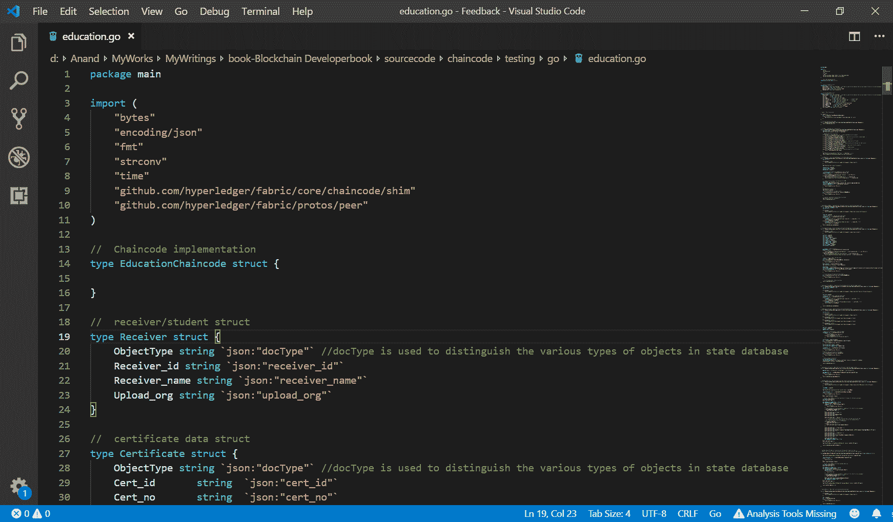

VS Code源代码窗口

+   需要直接安装的插件：

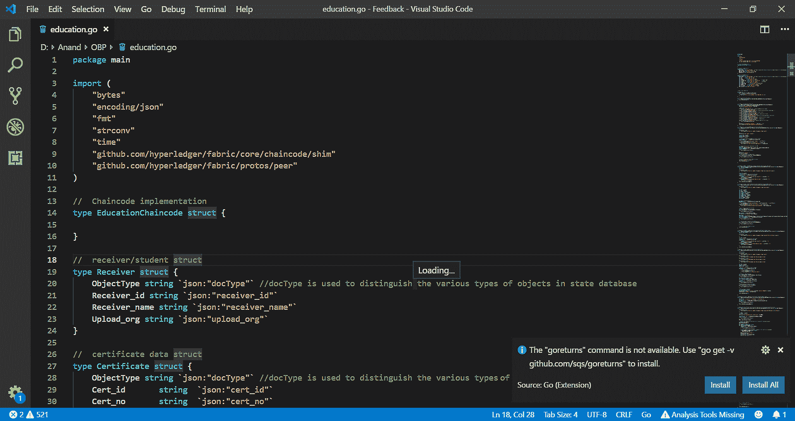

VS Code插件直接安装

+   VS Code上有多个可安装的插件供选择的语言：

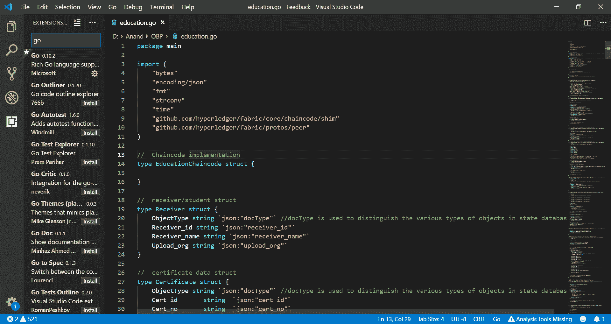

VS Code：插件

# 资产模型映射

链码导致在账本上创建资产（键值对），因为HLF将资产表示为键值对。资产状态变化记录为通道账本上的交易。有几种表示资产的方式——二进制或JSON形式。对于本书中的大学用例，定义了两种资产：

+   一个用于学生信息

+   另一个用于生成的证书

本章包括创建基本资产和链码，以便快速学习开发过程。随着用例模型本身的建模，更多资产和全面的操作集的包含可能会导致时间投入增加。稍后，当您对用例进行更多实验时，可以为其增加更多复杂性。

使用Go语言，以下是两种资产的定义：

1.  用于定义证书接收者的资产：

| **参数** | **描述** |
| --- | --- |
| `assetType` | 资产类型，例如，接收者 |
| `receiver_id` | 接收者/学生的ID |
| `receiver_name` | 接收者/学生的名称 |
| `upload_org` | 上传证书的组织/部门 |

1.  用于定义证书的资产：

| **参数** | **描述** |
| --- | --- |
| `assetType` | 资产类型，例如，证书。 |
| `Cert_id` | 证书的ID。 |
| `Cert_no` | 证书的编号。 |
| `Cert_name` | 证书的名称。 |
| `Cert_receiver` | 证书的接收者。这将根据给定的`Cert_receiver_id`参数从分类帐中获取。 |
| `Cert_receiver_id` | 被分配此证书的接收者/学生的ID。 |
| `Cert_issuer` | 证书的颁发者。 |
| `Cert_industry` | 证书所属行业/部门。 |
| `Cert_create_time` | 证书创建时间。 |
| `Cert_update_time` | 如果有任何更改，证书的更改时间。 |
| `Cert_remark` | 证书的备注或注释，如果有的话。 |
| `Cert_url_image` | 证书图片 URL。 |
| `Cert_learning_processing` | 证书学习进行中。 |
| `Cert_status` | 证书的状态。 |

链码是定义资产并允许对资产进行修改（也称状态变更）的软件程序（一组智能合约）或业务逻辑。任何交易（按照链码允许的）都会导致一组新的资产键值对的形成，或者修改资产的键值对，或者删除资产的键值对。

# 映射操作

链码（智能合约）生成的交易会分发到网络中的每个对等节点。经过共识后，它们将被不可变地记录在分类账的本地副本中。用户使用客户端应用程序或 dApp 调用这类交易（又称操作）。

这个表格集中讨论调用操作/交易的实现：

| **操作** | **描述** |
| --- | --- |
| `initReceiver` | 创建证书接收者（学生）的条目 |
| `queryReceiverById` | 通过给定的接收者 ID 获取接收者详情 |
| `insertCertificateInfo` | 创建证书条目 |
| `queryCertificateBytId` | 通过给定的证书 ID 获取证书详情 |
| `getHistoryForRecord` | 获取接收者（学生）信息或证书变更的历史记录 |
| `queryAllCertificates` | 获取所有证书 |
| `approveCertificate` | 更改证书的状态 |
| `del` | 在接收者或证书上进行标记删除 |

查看[第三章](6aaa9b0a-84b6-4fca-82c3-864e22d616b0.xhtml)，“深入了解 Hyperledger Fabric”，了解更多有趣的方面，例如并发检查、交易类型（如*分类账查询*和*分类账更新*交易）、交易流程以及交易涉及的各种其他组件。

# 解密链码开发的技艺

在HLF中，链码必须使用以下任一种语言实现链码接口：Go、Node.js或Java。链码开发人员可以选择其中任何一种编程语言进行开发。Fabric的shim包（[github.com/hyperledger/fabric/core/chaincode/shim](https://github.com/hyperledger/fabric/tree/release-1.4/core/chaincode/shim)）在链码开发中至关重要。

它支持以前的所有语言。该包有两个接口，在链码中发挥着关键作用。这些接口及其方法的语法可能会根据语言的不同而发生变化，但它们的目的是相同的。

当收到交易时，这些链码接口被调用。首先，当链码接收到交易请求时，`Init`方法被调用。这允许初始化应用程序状态。随后，当接收到调用事务时，将调用`Invoke`方法来处理任何交易提案。用于修改分类帐的其他接口，允许链码之间的调用，包括称为`ChaincodeStubInterface`的链码shim API。

# 链码接口

链码接口是实现具有两个方法的链码的必备条件：

+   `Init()`:此方法在链码的生命周期中仅被调用一次，即在链码被实例化或升级时。此方法有助于设置分类帐的初始状态，例如初始化任何序列号。它期望将`ChaincodeStubInterface`对象作为输入，并返回`peer.Response`对象。

语法：`Init(stub ChaincodeStubInterface)`

+   `Invoke()`:此方法将帮助调用用户事务。您的代码中可能有多个操作，但当客户端发送请求到链码时，它只会到达`Invoke()`方法，从这里，此方法将派发到相应的事务。此方法还接受`ChaincodeStubInterface`对象的输入，并返回`peer.Response`对象。

语法：`Invoke(stub ChaincodeStubInterface)`

# 链码存根接口

Stub接口提供了通过对对等体的调用来访问历史和分类帐状态的函数。每个事务都会调用`Invoke()`方法，并将函数和参数作为客户端请求的`stub`输入传递。这个接口促进了许多与分类帐交互的功能，并使链码开发变得简单。

# 链码函数

`ChaincodeStub`由`fabric-shim`库实现。它提供给`ChaincodeInterface`，并封装了链码实现和Fabric对等体之间的API。

尽管`stub`有许多函数，但本节列出了一些经常使用的函数：

+   `getFunctionAndParameters() (string, []string)`:此方法有助于从`stub`中获取函数和参数。此方法返回两个值：作为字符串的函数名称和作为字符串数组的参数。

+   `getState(key string) ([]byte, error)`: 此方法通过给定的键从状态分类帐中获取数据。它不会读取尚未提交的分类帐中的数据。如果有任何错误，它将返回数据作为字节数组和错误信息。

+   `putState(key string, value []byte) (error)`: 此方法将给定值放入交易的写入集作为提案。直到交易有效且成功提交之前，它不会影响分类帐。这个决定将由Orderer做出。分类帐中的所有交易数据都仅存储为键值对。此方法接受两个参数：key——用于数据的唯一字符串值，value——要存储在分类帐中的数据的字节数组。如果在执行过程中出现任何错误，则此方法返回错误参数。相同的方法可以用于*插入*和*更新*。

+   `delState(key string) error`: 此方法从分类帐中删除给定键的值。由于区块链分类帐中的数据不能永久删除，因此此方法标记数据已删除，区块仍然保留在分类帐中。此方法的输入是一个键，如果有错误则返回错误。

+   `getHistoryForKey(key string) (HistoryQueryIteratorInterface, error)`: 这是一个只读方法，用于获取分类帐中给定键的已提交交易的历史记录，以及交易ID和时间戳。此方法以键作为输入，并返回历史记录和错误的迭代器，如果有的话。

+   `getQueryResult(query string) (StateQueryIteratorInterface, error)`: 此方法针对状态数据库执行一个`丰富`查询。仅支持支持丰富查询的状态数据库，例如Oracle、ATP或ADW。此方法的输入是基础状态数据库的本机语法中的查询字符串。如果有任何错误，则此方法返回结果和错误的迭代器。

+   `setEvent(name string, payload []byte) error`: 这将事件设置为要包含在交易中的响应中的提案。无论交易的有效性如何，事件都将在已提交的交易块中可用。

除了链码中早期重要且常用的方法外，存根还具有以下方法：

```
getArgs() [][]byte

getStringArgs() []string

getArgsSlice() ([]byte, error)

getTxID() string

invokeChaincode(chaincodeName string, args [][]byte, channel string) 
pb.Response

getStateByRange(startKey, endKey string) (StateQueryIteratorInterface, error)

getStateByPartialCompositeKey(objectType string, keys []string) (StateQueryIteratorInterface, error)

createCompositeKey(objectType string, attributes []string) (string, error)

splitCompositeKey(compositeKey string) (string, []string, error)

getCreator() ([]byte, error)

getTransient() (map[string][]byte, error)

getBinding() ([]byte, error)

getSignedProposal() (*pb.SignedProposal, error)

getTxTimestamp() (*timestamp.Timestamp, error)
```

# 开发链码

此部分涵盖了在Golang中的实现。以下链码是使用Go语言开发的，用于在上一节中描述的操作/交易，使用上一节中的映射资产模型映射操作。

# Go语言中的链码

让我们看看Go语言中用于讨论的用例的链码开发：

1.  `import`: 此部分导入所需的库：

```
import (
  "bytes"
  "encoding/json"
  "fmt"
  "strconv"
  "time"
  "github.com/hyperledger/fabric/core/chaincode/shim"
  "github.com/hyperledger/fabric/protos/peer"
)
```

1.  `type`: 这将定义所需的资产结构：

```
// Chaincode implementation
type EducationChaincode struct {

}

// receiver/student struct
type Receiver struct {
  ObjectType string `json:"docType"` //docType is used to distinguish the various types of objects in state database
  Receiver_id string `json:"receiver_id"`
  Receiver_name string `json:"receiver_name"`
  Upload_org string `json:"upload_org"`
}

// certificate data struct
type Certificate struct {
  ObjectType string `json:"docType"` //docType is used to distinguish the various types of objects in state database
  Cert_id string `json:"cert_id"`
  Cert_no string `json:"cert_no"`
  Cert_name string `json:"cert_name"`
  Cert_receiver string `json:"cert_receiver"` // student name
  Cert_receiver_id string `json:"cert_receiver_id"` // student id
  Cert_issuer string `json:"cert_issuer"` // org name
  Cert_industry string `json:"cert_industry"`
  Cert_create_time string `json:"cert_create_time"`
  Cert_update_time string `json:"cert_update_time"`
  Cert_remark string `json:"cert_remark"`
  Cert_url_image string `json:"cert_url_image"`
  Cert_status string `json:"cert_status"`
}
```

1.  `main`: 这是`main`方法开始执行的地方：

```
// main - Start execution
func main() {
  err := shim.Start(new(EducationChaincode))
  if err != nil {
    fmt.Printf("Error starting Xebest Trace chaincode: %s", err)
  }
}
```

1.  `Init`: 此方法用于初始化链码，同时实例化链码：

```
// Init initializes chaincode
func (t *EducationChaincode) Init(stub shim.ChaincodeStubInterface) peer.Response {
  return shim.Success(nil)
}
```

1.  `Invoke`: 此方法用于绕过或执行用户事务：

```
// Invoke - Invoking user transactions
func (t *EducationChaincode) Invoke(stub shim.ChaincodeStubInterface) peer.Response {
  function, args := stub.GetFunctionAndParameters()
  fmt.Println("invoke is running " + function)

  // Handle different functions
  if function == "insertReceiver" { //create a new Receiver or student
    return t.insertReceiver(stub, args)
  } else if function == "queryReceiverById" { // query a receiver by id, stupid name - -!
    return t.queryReceiverById(stub,args)
  } else if function == "insertCertificate" { //insert a cert
    return t.insertCertificate(stub, args)
  } else if function == "queryCertificateById" { // query a certificate
    return t.queryCertificateById(stub, args)
  } else if function == "getRecordHistory"{ //query hisitory of one key for the record
    return t.getRecordHistory(stub,args)
  } else if function == "queryAllCertificates"{ // query all of all students
    return t.queryAllCertificates(stub,args)
  } else if function == "approveCertificate" { // change status
    return t.approveCertificate(stub,args) 
  }else if function == "deleteRecord" { // delete student or certificate
    return t.deleteRecord(stub, args)
  }

  fmt.Println("invoke did not find func: " + function) //error
  return shim.Error("Received unknown function invocation")
}
```

1.  `insertReceiver`：此方法用于将学生或证书接收者插入链码状态：

```
// initReceiver - insert a new Receiver into chaincode state
func (t *EducationChaincode) insertReceiver(stub shim.ChaincodeStubInterface, args []string) peer.Response {
  var err error

  if len(args) != 3 {
    return shim.Error("Incorrect number of arguments. Expecting 3")
  }

  fmt.Println("start insert receiver")

  receiver_id := args[0]
  receiver_name := args[1]
  upload_org := args[2]

  // Check if the receiver already exists with the id
  receiverAsBytes, err := stub.GetState(receiver_id)
  if err != nil {
    return shim.Error("Failed to get receiver: " + err.Error())
  } else if receiverAsBytes != nil {
    fmt.Println("This receiver already exists: " + receiver_id)
    return shim.Error("This receiver already exists: " + receiver_id)
  }

  // Create receiver object and marshal to JSON 
  objectType := "receiver"
  receiver := &Receiver{objectType, receiver_id, receiver_name,upload_org}
  receiverJSONasBytes, err := json.Marshal(receiver)
  if err != nil {
    return shim.Error(err.Error())
  }

  fmt.Println("receiver: ")
  fmt.Println(receiver)
  // Save the receiver to ledger state
  err = stub.PutState(receiver_id, receiverJSONasBytes)
  if err != nil {
    return shim.Error(err.Error())
  }

  // receiver saved and indexed. Return success
  fmt.Println("End init receiver")
  return shim.Success(nil)

}
```

1.  `queryReceiverById`：此方法通过给定的 ID 获取接收者记录：

```
// queryReceiverById - read data for the given receiver from the chaincode state
func (t *EducationChaincode) queryReceiverById(stub shim.ChaincodeStubInterface, args []string) peer.Response {
  var recev_id, jsonResp string
  var err error

  if len(args) != 1 {
    return shim.Error("Incorrect number of arguments. Expecting receiver_id to query")
  }

  recev_id = args[0]
  //Read the Receiver from the chaincode state
  valAsbytes, err := stub.GetState(recev_id) 
  if err != nil {
    jsonResp = "{\"Error\":\"Failed to get state for " + recev_id + "\"}"
    return shim.Error(jsonResp)
  } else if valAsbytes == nil {
    jsonResp = "{\"Error\":\"receiver does not exist: " + recev_id + "\"}"
    return shim.Error(jsonResp)
  } 
  return shim.Success(valAsbytes)
}
```

1.  `insertCertificate`：此方法用于将新证书信息插入账本状态：

```
// insertCertificate - insert a new certificate information into the ledger state
func (t *EducationChaincode) insertCertificate(stub shim.ChaincodeStubInterface, args []string) peer.Response {

  if len(args) != 11 {
    return shim.Error("Incorrect number of arguments. expecting 11 args")
  }

  cert_id := args[0]
  cert_no := args[1]
  cert_name := args[2] 
  cert_receiver_id := args[3]
  cert_issuer := args[4]
  cert_industry := args[5]
  cert_create_time := args[6]
  cert_update_time := args[7]
  cert_remark := args[8]
  cert_url_image := args[9]
  cert_status := args[10]

  // check if receiver exists
  ReceAsBytes, err := stub.GetState(cert_receiver_id)
  if err != nil {
    return shim.Error("Failed to get Receiver:" + cert_receiver_id + "," + err.Error())
  } else if ReceAsBytes == nil {
    fmt.Println("Receiver does not exist with id: " + cert_receiver_id )
    return shim.Error("Receiver does not exist with id: " + cert_receiver_id )
  }

  //Fetch receiver name from the state
  receiver := &Receiver{}
  err = json.Unmarshal([]byte(ReceAsBytes), &receiver)
  if err != nil {
    return shim.Error(err.Error())
  }
  cert_receiver :=receiver.Receiver_name;
  fmt.Println("cert_receiver: "+cert_receiver)

  objectType := "certificate"
  certificate := &Certificate{objectType,cert_id,cert_no,cert_name,cert_receiver,cert_receiver_id,cert_issuer,cert_industry,cert_create_time,cert_update_time,cert_remark,cert_url_image,cert_status}
  certificateJSONasBytes, err := json.Marshal(certificate)
  if err != nil {
    return shim.Error(err.Error())
  }

  // insert the certificate into the ledger
  err = stub.PutState(cert_id, certificateJSONasBytes)
  if err != nil {
    return shim.Error(err.Error())
  }

  // certificate saved - Return success 
  return shim.Success(nil)
}
```

1.  `queryCertificateById`：此方法通过给定的证书 ID 从账本状态中获取证书详细信息：

```
// queryCertificateById - read a certificate by given id from the ledger state
func (t *EducationChaincode) queryCertificateById(stub shim.ChaincodeStubInterface, args []string) peer.Response {
  var cert_id, jsonResp string
  var err error

  if len(args) != 1 {
    return shim.Error("Incorrect number of arguments. Expecting id of the certificate to query")
  }

  cert_id = args[0]
  //Read the certificate from chaincode state
  valAsbytes, err := stub.GetState(cert_id) 
  if err != nil {
    jsonResp = "{\"Error\":\"Failed to get state for " + cert_id + "\"}"
    return shim.Error(jsonResp)
  } else if valAsbytes == nil {
    jsonResp = "{\"Error\":\"certificate does not exist: " + cert_id + "\"}"
    return shim.Error(jsonResp)
  }

  return shim.Success(valAsbytes)
}
```

1.  `approveCertificate`：此方法用于由授权机构批准证书：

```
// approveCertificate - approve the certificate by authority
func (t *EducationChaincode) approveCertificate(stub shim.ChaincodeStubInterface, args []string) peer.Response {

  var err error
  // check args
  if len(args) != 3 {
    return shim.Error("Incorrect number of arguments. Expecting 3")
  }
  if len(args[0]) <= 0 {
    return shim.Error("1st argument must be a non-empty string")
  }
  if len(args[1]) <= 0 {
    return shim.Error("2nd argument must be a non-empty string")
  }
  if len(args[2]) <= 0 {
    return shim.Error("3rd argument must be a non-empty string")
  }

  cert_id := args[0]
  status := args[1]
  update_time := args[2]

  //Read certificate details from the ledger
  valAsbytes, err := stub.GetState(cert_id) 
    if err != nil {
      return shim.Error(err.Error())
    } else if valAsbytes == nil {
      return shim.Error("certificate not exist")
    }

  certificate := &Certificate{}
  err = json.Unmarshal([]byte(valAsbytes), &certificate)
  if err != nil {
    return shim.Error(err.Error())
  }
  certificate.Cert_status = status
  certificate.Cert_update_time = update_time

  valAsbytes, err = json.Marshal(certificate)
  if err != nil {
    return shim.Error(err.Error())
  }
  //Update the certificate in the ledger
  err = stub.PutState(cert_id, valAsbytes)
  if err != nil {
    return shim.Error(err.Error())
  }

  return shim.Success(nil)
}
```

1.  `queryAllCertificates`：此方法用于从账本状态查询所有证书：

```
// queryAllCertificates - Query all certificates from the ledger state
func (t *EducationChaincode) queryAllCertificates(stub shim.ChaincodeStubInterface, args []string) peer.Response {

  queryString := "{\"selector\":{\"docType\":\"certificate\"}}"

  queryResults, err := getQueryResultForQueryString(stub, queryString)
  if err != nil {
    return shim.Error(err.Error())
  }
  return shim.Success(queryResults)
}
```

1.  `getRecordHistory`：此方法获取给定记录的关键状态转换的历史记录：

```
// getRecordHistory - Fetches the historical state transitions for a given key of a record
func (t *EducationChaincode) getRecordHistory(stub shim.ChaincodeStubInterface, args []string) peer.Response {

  if len(args) < 1 {
    return shim.Error("Incorrect number of arguments. Expecting an id of Receiver or Certificate")
  }

  recordKey := args[0]

  fmt.Printf("Fetching history for record: %s\n", recordKey)

  resultsIterator, err := stub.GetHistoryForKey(recordKey)
  if err != nil {
    return shim.Error(err.Error())
  }
  defer resultsIterator.Close()

  // buffer is a JSON array containing historic values for the key/value pair
  var buffer bytes.Buffer
  buffer.WriteString("[")

  bArrayMemberAlreadyWritten := false
  for resultsIterator.HasNext() {
    response, err := resultsIterator.Next()
    if err != nil {
      return shim.Error(err.Error())
    }
    // Add a comma before array members, suppress it for the first array member
    if bArrayMemberAlreadyWritten == true {
      buffer.WriteString(",")
    }
    buffer.WriteString("{\"TxId\":")
    buffer.WriteString("\"")
    buffer.WriteString(response.TxId)
    buffer.WriteString("\"")

    buffer.WriteString(", \"Value\":")
    // if it was a delete operation on given key, then we need to set the
    //corresponding value null. Else, we will write the response.Value
    //as-is (as the Value itself a JSON goods)
    if response.IsDelete {
      buffer.WriteString("null")
    } else {
      buffer.WriteString(string(response.Value))
    }

    buffer.WriteString(", \"Timestamp\":")
    buffer.WriteString("\"")
    buffer.WriteString(time.Unix(response.Timestamp.Seconds, int64(response.Timestamp.Nanos)).String())
    buffer.WriteString("\"")

    buffer.WriteString(", \"IsDelete\":")
    buffer.WriteString("\"")
    buffer.WriteString(strconv.FormatBool(response.IsDelete))
    buffer.WriteString("\"")

    buffer.WriteString("}")
    bArrayMemberAlreadyWritten = true
  }
  buffer.WriteString("]")

  fmt.Printf("Result of getHistoryForRecord :\n%s\n", buffer.String())

  return shim.Success(buffer.Bytes())
}
```

1.  `getQueryResultForQueryString`：如果需要，此方法在账本状态上执行给定的`rich`查询：

```
// getQueryResultForQueryString executes the passed in query string.
// Result set is built and returned as a byte array containing the JSON results.

func getQueryResultForQueryString(stub shim.ChaincodeStubInterface, queryString string) ([]byte, error) {

  fmt.Printf("getQueryResultForQueryString queryString:\n%s\n", queryString)

  resultsIterator, err := stub.GetQueryResult(queryString)
  if err != nil {
    return nil, err
  }
  defer resultsIterator.Close()

  // buffer is a JSON array containing QueryRecords
  var buffer bytes.Buffer
  buffer.WriteString("[")

  bArrayMemberAlreadyWritten := false
  for resultsIterator.HasNext() {
    queryResponse, err := resultsIterator.Next()
    if err != nil {
      return nil, err
    }
    // Add a comma before array members, suppress it for the first array member
    if bArrayMemberAlreadyWritten == true {
      buffer.WriteString(",")
    }
    buffer.WriteString(string(queryResponse.Value))
    bArrayMemberAlreadyWritten = true
  }
  buffer.WriteString("]")

  fmt.Printf("getQueryResultForQueryString queryResult:\n%s\n", buffer.String())

  return buffer.Bytes(), nil
}
```

1.  `deleteRecord`：此方法将以给定的键标记记录为已删除：

```
// deleteRecord - Mark the record deleted by given key

func (t *EducationChaincode) deleteRecord(stub shim.ChaincodeStubInterface, args []string) peer.Response {

  if len(args) != 1{
    return shim.Error("Incorrect number of arguments. Expecting 1")
  }

  id := args[0]
  err := stub.DelState(id)
  if err != nil {
    return shim.Error(err.Error())
  }

  return shim.Success(nil)
}
```

在本书引用的 GitHub 存储库中也可以下载前述链码。文件名为`education.go`。

# Node.js 中的链码

让我们来看看使用 Node.js 开发链码的流程：

+   使用`fabric-shim`包创建一个 Node.js 文件

+   创建一个包含 Node.js 文件和依赖项详情的`package.json`文件（如果有的话）

+   将所有文件打包到一个 ZIP 文件中，包括`package.json`、主 Node.js 文件以及其他 JavaScript 或配置文件或依赖项（如果有的话）

+   在 OBP 的**Chaincode**选项卡下部署该包（参考*链码部署*部分）

注意：您只需创建一个`package.json`文件；无需运行`npm`命令来安装`node_modules`，因为 OBP 会在内部为您执行此操作。

名为`education.js`的示例 Node.js 文件。

使用`fabric-shim`包创建一个 Node.js 文件：

```
const shim = require('fabric-shim');
const Chaincode = class {
    async Init(stub) {
        return shim.success();
    }
    async Invoke(stub) {
        let ret = stub.getFunctionAndParameters();
        let method = this[ret.fcn];
        console.log("Inside invoke. Calling method: " + ret.fcn);
        if (!method) {
            shim.error(Buffer.from('Received unknown function ' + ret.fcn + ' invocation'));
        }
        try {
            let payload = await method(stub, ret.params);
            return shim.success(payload);
        } catch (err) {
            console.log(err);
            return shim.error(err);
        }
    }

    //Method to save or update a user review to a product

    async insertReceiver(stub, args) {
        console.log("inside insertReceiver: " + JSON.stringify(args));
        if (args.length != 3) {
            throw 'Incorrect number of arguments. Expecting ID,Name and Org.';
        }
        var receiver = {};
                             receiver.ObjectType = "receiver";
        receiver.Receiver_id = args[0];
        receiver.Receiver_name = args[1];
        receiver.Upload_org = args[2];
        await stub.putState(receiver.Receiver_id, Buffer.from(JSON.stringify(receiver)));
    }//End of method
}

shim.start(new Chaincode());
```

名为`package.json`的示例 JSON 文件。

创建一个包含 Node.js 文件和依赖项详情的`package.json`文件（如果有的话）：

```
{
  "name": "education",
  "version": "1.0.0",
  "description": "Chaincode implemented in node.js",
  "engines": {
    "node": ">=8.9.0",
    "npm": ">=5.5.0"
  }, 
  "scripts": { 
    "start" : "node education.js"
  },
  "engine-strict": true,
  "license": "Apache-2.0",
  "dependencies": { 
    "fabric-shim": "~1.3.0"
  } 
}
```

可以从本书引用的 GitHub 存储库中下载带有`package.json`文件的示例 Node.js 代码。

# 向链码添加事件

链码还可以发布事件，以通知订阅应用程序进一步处理客户端操作。例如，在链码匹配采购订单、发票和交货记录后，它可以发布事件，以便订阅应用程序可以处理相关付款并更新内部 ERP 系统。

OBP 支持以下类型的事件，可以通过 REST 代理订阅：

+   `transaction`：事务 ID 的事件

+   `txOnChannel`：通道上每个新事务的事件

+   `txOnNetwork`：整个网络中每个新事务的事件

+   `blockOnChannel`：特定通道上每个区块的事件

+   `blockOnNetwork`：整个网络中新区块的事件

+   `chaincodeEvent`：链码逻辑发出的自定义事件

# 发布事件

在这里，我们将看到如何从链码触发事件。使用 `ChaincodeStubInterface` 的 `SetEvent()` 方法，链码可以触发事件。在 `approveCertificate()` 方法中添加以下代码以在证书状态更改后发出事件：

```
var testEventValue []byte

testEventValue=[]byte("Certificate "+cert_id+" status is changed to "+status)

stub.SetEvent("testEvent",testEventValue)
```

# 订阅事件

事件可以通过 REST 代理或 HLF SDK 进行订阅。以下是通过 REST 代理订阅的步骤：

+   REST 端点：`<主机名>:<端口>/<REST 代理>/bcsgw/rest/v1/event/subscribe`

+   REST 方法：`POST`

+   标头：

    +   **内容类型**：`application/json`

    +   **授权**：`<基本授权>`

    +   **接受字符集**：`UTF-8`：

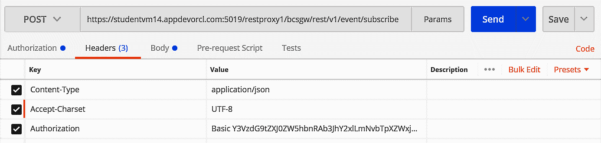

+   传递给 REST API 的 JSON 输入：

```
{
  "requests":[
  {
    "eventType":"chaincodeEvent",
    "callbackURL": "--- call back webhook url---",
    "callbackTlsCerts":{
      "caCert":" -- mandatory field which is the callback server's CA certificate in PEM format. It will be verified by REST proxy",
      "clientCert": "--Optional field which refers to the REST proxy certificate should use during callback --",
      "keyPassword": "--clientCert's encrypted private key in base64 encoded"
    },
    "expires": "1m",
    "channel": "channeleducation",
    "chaincode": "cceducation",
    "eventName": "testEvent"
  }
  ]
}
```

+   响应为 `subid`。

# 取消订阅事件

事件也可以取消订阅。要执行此操作，请按照订阅的相同步骤操作，但将端点和输入替换为以下内容：

+   REST 端点：`<主机名>:<端口>/<REST 代理>/bcsgw/rest/v1/event/unsubscribe`

+   JSON 输入：

```
{

    "request":{

    "subid": "---subscription id received---"
  }

}
```

# 链码部署

链码部署是一个多步骤的过程。它包括链码部署（快速或高级方法）、链码实例化、在 REST 代理中启用链码以及升级链码。在 OBP 上部署链码的先决条件包括具有部署链码的 OBP 实例的管理访问权限。链码可以由通道的创建者或参与者从任何实例安装和实例化。一旦它被实例化，通道的其他实例只需要安装链码。该实例化将自动应用于这些实例。在本节中，我们将从创建者实例部署链码。

# 部署链码

OBP 提供了两种不同的部署选项。一种是一步链码部署的快速部署选项，另一种是高级部署选项。快速启动部署选项推荐用于链码测试，而高级部署选项允许您指定各种高级部署设置，例如选择要安装链码的对等方、要使用的背书策略等。本节展示了两种部署选项。

部署链码的步骤如下：

1.  导航到 **链码** 选项卡：

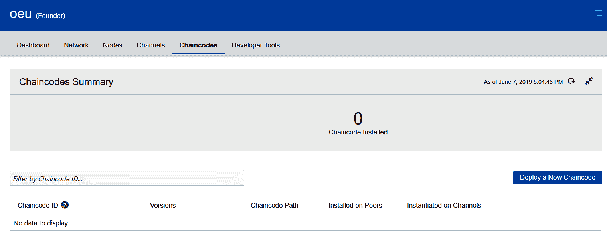

链码部署

1.  单击 **部署新链码** 按钮。将打开以下屏幕，其中包含两个部署选项：

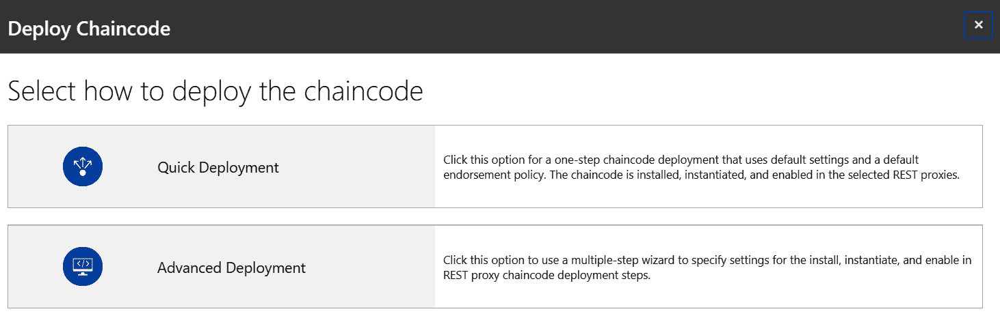

链码部署选项

1.  **快速部署**：一步链码部署选项使用默认设置，并在所选的 REST 代理中启用。然而，我们将在本节中使用 **高级部署** 选项来部署我们的链码。以下是您可以参考的 **快速部署** 屏幕：

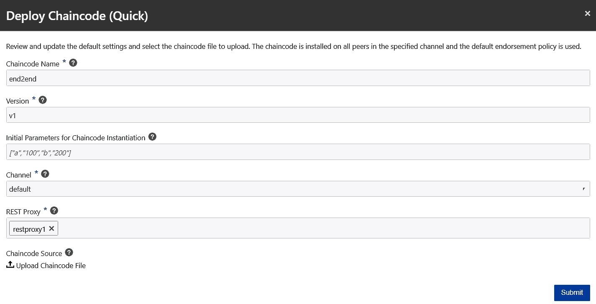

快速链码部署

1.  **高级部署**提供了一个多步骤向导，用于安装、实例化和启用链码的REST代理。从**部署链码**菜单中选择此选项。将打开逐步向导，第一步如下，您将提供链码的详细信息，如链码名称、版本、应部署链码的目标对等方以及实际链码包。 （如果是单个`.go`文件，则不需要包。可以选择单个文件，但如果有多个文件或代码是用Node.js或Java编写的，则将所有文件打包成ZIP文件。）填写以下屏幕截图中显示的字段，然后单击**下一步**。请记住，安装链码后不能更改这些值：

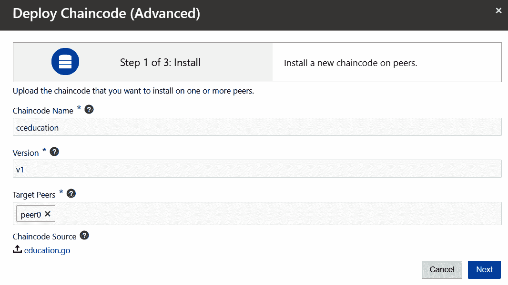

详细页面

1.  安装**Install**过程成功后，向导将显示第二步，即**Instantiate**。每个通道每个版本只会实例化一次链码。在此步骤中，您指定应将链码应用于哪个通道；参与的对等方；初始参数数组（如果有）要传递给链码中的`Init()`方法；背书策略（如果有的话，请参阅下一节以了解背书策略的详细信息）；以及私有数据集合（请参阅下一节以了解详细信息）。填写表单如下并单击**下一步**；可能需要一段时间才能进入下一步：

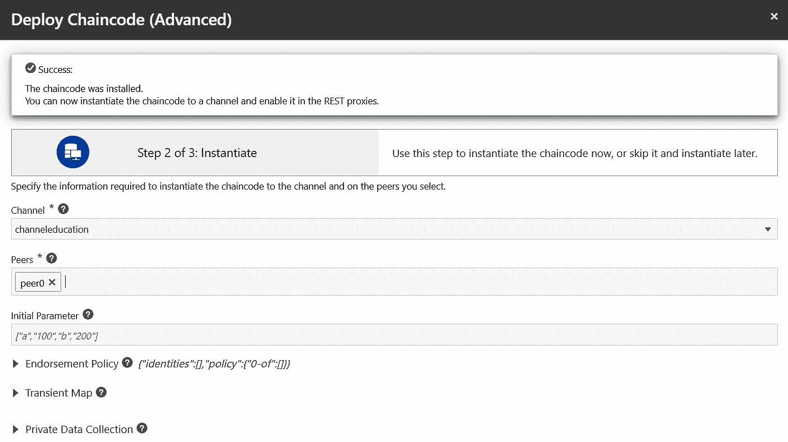

高级链码部署

1.  链码成功实例化后，向导将显示第3步，即在REST代理中启用链码。OBP提供多个REST代理。您可以选择多个REST代理以启用链码。按照以下字段填写并单击**下一步**：

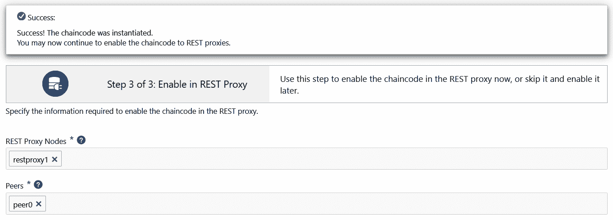

REST代理

1.  在向导的所有步骤完成之后，最后，您将看到此成功屏幕。单击**关闭**：

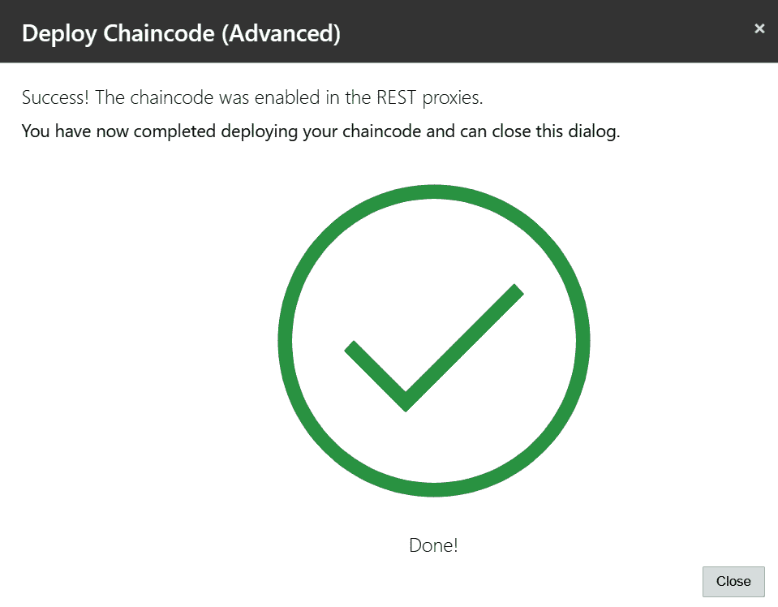

部署完成消息

1.  到目前为止，您已在创建者实例中部署了链码。您需要在所有参与者实例中部署链码。重复我们刚刚看到的部署过程；但是，您只需要部署链码——实例化将自动应用，因为它是从通道的创建者中完成的。因此，在**高级部署**向导中，在第1步安装完成后，在第2步屏幕上，单击**关闭**按钮。

1.  转到**通道**选项卡。您将发现链码已实例化。请查看以下参考资料。

以下是安装链码前的通道：

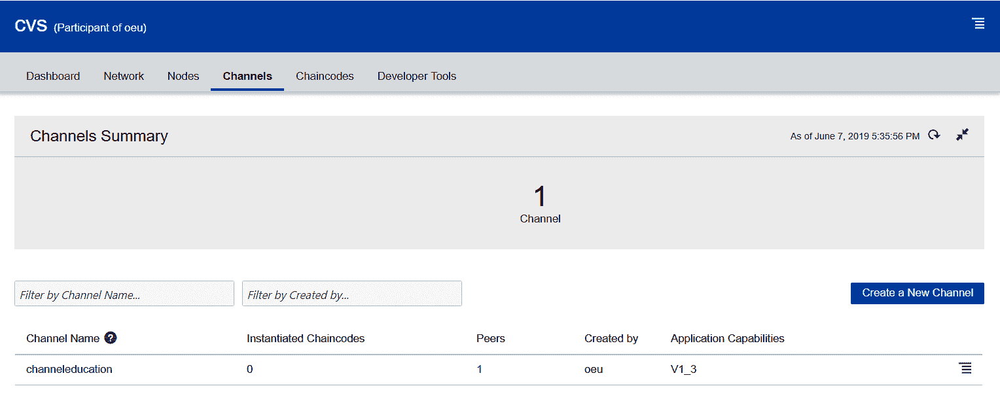

安装链码前通道

以下屏幕截图显示了安装链码后的通道：

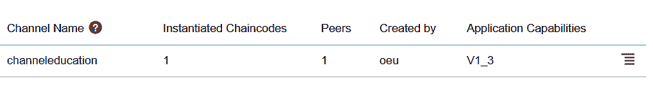

安装链码后通道

一个通道上可以安装多个链码。此外，一个链码可以在多个REST代理上启用。

# 更新链码

HLF支持链码版本控制和升级。当智能合约需要更改、业务逻辑发生变化或链码需要任何更改时，您可以更新链码。只要保持相同的链码名称，就可以将链码升级到新版本，否则将被视为不同的链码。

更新是区块链网络上的一个交易，它导致将链码的新版本绑定到通道上。旧版本的链码会发生什么情况？绑定到以前（旧）版本链码的所有其他通道可以继续执行旧版本。您向通道提交链码*升级*交易。因此，只有一个通道受到影响，您已经执行了升级交易的通道。所有其他通道，在这些通道上未执行升级交易的情况下，将继续运行旧版本。调用链码时，只会执行最新实例化的版本。

更新链码的过程如下所示：

1.  转到**链码**选项卡。

1.  对链码选择**升级**选项，位于**更多操作**下。将打开一个多步向导。

1.  在**第1步：选择版本**中，选择目标对等方并浏览链码源包。然后点击**下一步**：

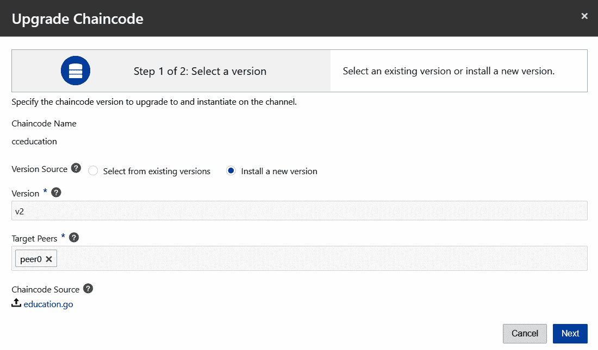

升级链码-选择版本

1.  在**第2步：升级**中，提供通道名称、对等方、初始参数（如果有）和背书策略（如果有）。然后点击**下一步**：

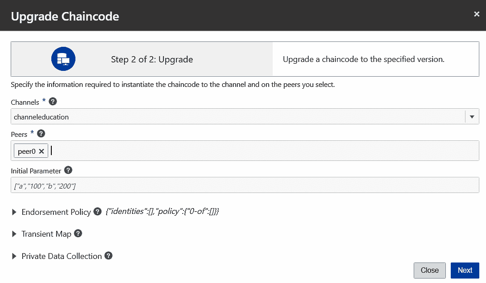

升级链码-实例化信息

1.  链码成功升级后，您将看到以下屏幕。点击**关闭**，然后为其他参与方重复相同的过程：

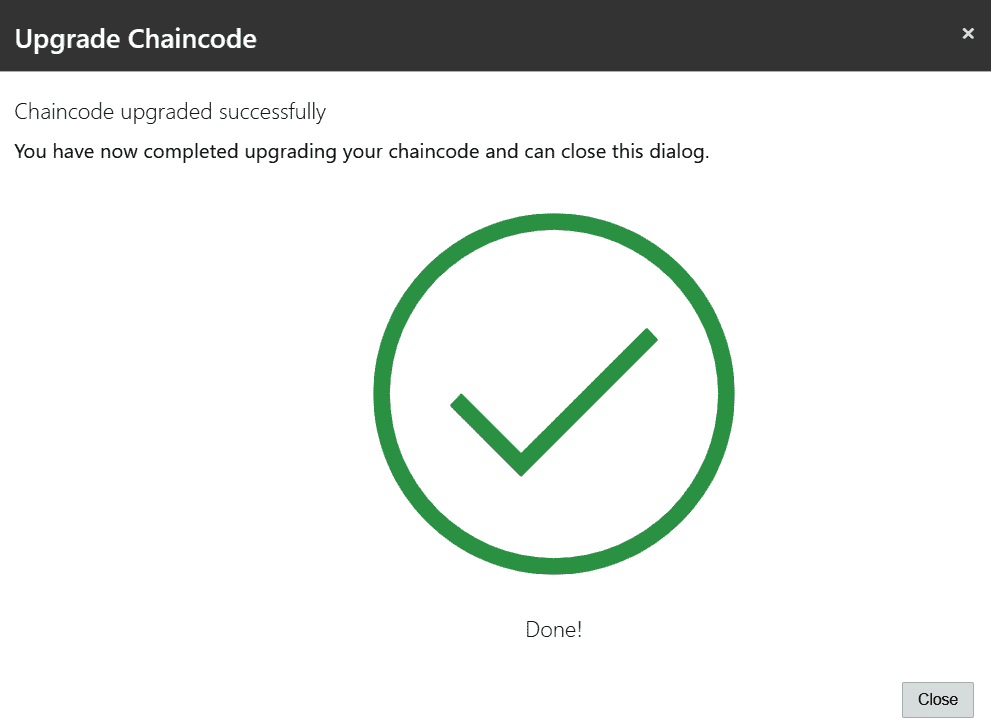

链码升级

# 背书策略

背书策略指定了必须在链码交易被添加到块并提交到账本之前正确批准或背书链码交易的具有对等方的组织。您可以在链码部署过程中的第2步实例化链码时在OBP中添加背书策略。背书保证交易的合法性。如果未指定背书策略，则使用默认背书策略，该策略从网络上的任何对等方获取背书。

组织的背书对等方必须在通道上拥有读写权限。当处理交易时，每个背书对等方都返回一个读写集，然后客户端将这些背书对等方与它们的签名捆绑在一起，并将所有内容发送到排序服务，排序并提交交易到区块，然后到账本。

在下面的屏幕截图中，您可以在实例化链码时看到背书策略配置。您可以简单地在 Signed by 字段中指定有多少人必须参与背书，或者通过选择高级选项，也可以通过表达式指定这一点。在我们的用例中，我们正在使用默认的背书策略：

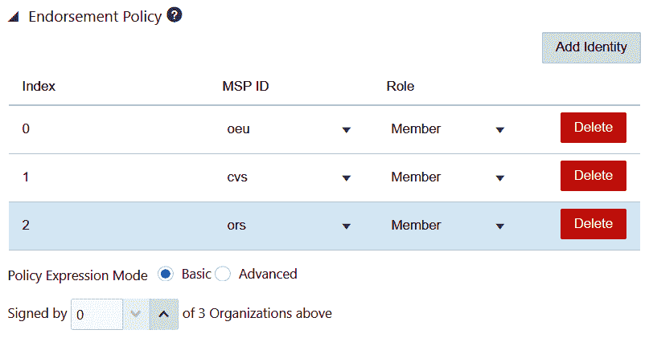

背书策略

# 私有数据集合

OBP 版本 19.1.3 及更高版本具有用于指定背书、提交或在通道上查询私有数据的组织子集的功能——私有数据集合。私有数据集合对于希望在通道上共享数据并防止通道上的其他组织看到数据的组织组是有用的。在链码实例化时可以关联一个或多个私有数据集合，如下所示。此外，您应该指定一个瞬态映射，以将客户端的私有数据传递给节点以进行背书。

下面的屏幕截图显示了**私有数据集合**在链码实例化时的情况：

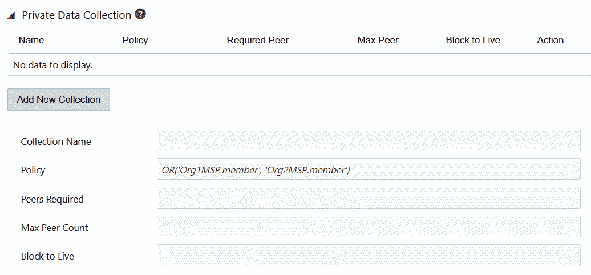

# 测试链码

可以在 OBP 上本地测试链码，而无需安装它。有两种测试链码的方式：使用模拟的 shim 和使用 REST 端点。

# 使用 shim 测试链码

让我们看看如何在本地开发的 Go 语言中测试之前的链码。在此之前，请注意以下要点：

+   在本地计算机上安装 Go 语言。

+   此测试文件名应采用此形式：`<Go file name>_test.go`。

例如：如果链码名称为`education.go`，那么此测试文件名应为`education_test.go`。

+   将两个文件放在同一个文件夹中。

+   将 `GOPATH` 设置为该文件夹。

+   如果找不到链码中使用的依赖包，请安装它们。

例如：`go get github.com/hyperledger/fabric/protos/peer`

`go get github.com/hyperledger/fabric/core/chaincode/shim`.C

+   代码片段文件 `education_test.go` 位于 GIT 存储库 ([https://github.com/PacktPublishing/Oracle-Blockchain-Quick-Start-Guide](https://github.com/PacktPublishing/Oracle-Blockchain-Quick-Start-Guide))，是一个仅包含一个方法`initReceiver()`的测试用例，附带解释。同样，您可以为所有其他方法编写测试用例。

+   每个测试用例都应以`Test<function name>`为前缀。

    例如：`TestInitReceiver`。

+   测试用例准备好后，使用以下命令进行测试：

`go test -run <<function name>>`

例如：`go test -run Education`。

这里，`Education`是测试用例名称。

要测试一个函数，使用 `NewMockStub()` 创建一个存根。该存根有一个`MockInvoke()`函数，它调用链码的实际函数。

例如，`stub.MockInvoke("001",[][]byte{[]byte("insertReceiver "), []byte(key),[]byte("Anand Yerrapati"), []byte("Blockchain")})`。

这里，`001` 是要在测试成功后返回的交易 ID，`insertReceiver` 是要在 `education.go` 文件中调用的函数。其余参数是要传递给 `insertReceiver` 函数的参数。

请参考 GIT 仓库中的文件 'education_test.go'，GIT 仓库网址为 "https://github.com/PacktPublishing/Oracle-Blockchain-Quick-Start-Guide-"。

用于测试链码的测试文件名为 (education.go)，测试文件名为 "education_test.go"。在本节中，此文件用于通过 shim 测试链码。

这个测试案例是为了测试流程，从插入接收方、查询接收方、插入证书、验证证书、批准证书，再查询证书，最后验证更改。在执行 `go test -run Education` 命令后，以下是早前测试案例的结果：

```
D:\Anand\OBP\chaincode\testing\go>go test -run Education
 Inside TestEducation
 invoke is running insertReceiver
 start insert receiver
 receiver:
 &{receiver std1231 Anand Y Blockchain}
 End init receiver
 Result insertReceiver:
 {200 [] {} [] 0}
 invoke is running queryReceiverById
 Result queryReceiverById:
 &{receiver std1231 Anand Y Blockchain}
 invoke is running insertCertificate
 cert_receiver: Anand Y
 {200 [] {} [] 0}
 Result insertCertificate:
 {200 [] {} [] 0}
 invoke is running queryCertificateById
 Result queryCertificateById:
 &{certificate cert123 12345 ORU Blockchain Certificate Anand Y std1231 ORU IT 06/04/2019 06/04/2019 Blockchain course completed Active}
 invoke is running approveCertificate
 {200 [] {} [] 0}
 Result approveCertificate:
 {200 [] {} [] 0}
 invoke is running queryCertificateById
 Result queryCertificateById:
 &{certificate cert123 12345 ORU Blockchain Certificate Anand Y std1231 ORU IT 06/04/2019 06/04/2019 10:41:50 Blockchain course completed Approved}
 PASS
 ok _/D_/Anand/OBP/chaincode/testing/go 3.921s
```

虚拟存根不支持每个功能。无法实现 `GetQueryResult` 和 `GetHistoryForKey` 方法。

# 从 REST 端点测试链码

OBP 提供一个 REST 代理以通过 REST 端点连接链码。希望通过 REST 服务执行的任何链码应配置在相应的 REST 代理上。可以在本章 *链码部署* 部分中查看此配置。在本节中，我们将看到如何调用 REST 端点，如何连接到所需的函数，以及如何传递参数。

有两个可用的 REST 端点：

+   **查询**：执行从分类帐查询数据的任何功能：

语法：`<主机名>:<端口>/<restproxy>/bcsgw/rest/v1/transaction/query`

+   **调用**：执行保存数据到分类帐或从分类帐查询数据的任何功能。也可以从此端点执行查询，不过，获取和返回数据的速度会较慢。因此，在从分类帐提取数据时建议使用查询端点：

语法：`<主机名>:<端口>/<restproxy>/bcsgw/rest/v1/transaction/invocation`

对于这两个端点，请求输入相同，即为一个 JSON 请求，以下是一个典型的 JSON 请求结构：

```
{
"channel":<channel name>,
"chaincode":<chaincode name>,
"method": <method name>,
"args":[<arguments separated by comma>]
}
```

可以在单个 REST 代理中配置多个链码。因此，输入 JSON 中的 **通道** 和 **链码** 参数有助于将请求分发到相应的链码。两个端点都是 **POST** 调用。每次调用都应传递两个标头，**授权** 和 **内容类型**。

我们正在使用 OBP SDK，其具有默认的用户名和密码：`customertenant@oracle.com/` 和 `Welcome1`。

标头应如下所示：

+   **授权**：`Basic Y3VzdG9tZXJ0ZW5hbnRAb3JhY2xlLmNvbTpXZWxjb21lMSA=`

+   **内容类型**：`application/json`

+   **目标端点**：`https://<主机名>:<端口>/<restproxy>/bcsgw/rest/v1/transaction/<invocation 或 query>`

这些是用于从 Postman 测试早期链码的参考（您可以在此处使用任何 REST 客户端进行测试）。以下是目标端点调用的输入 -

+   目标终点 - 插入接收方的调用：

    +   目标终点：`/invocation`

    +   目标方法：`insertReceiver`

    +   输入JSON：`{"channel":"channeleducation","chaincode":"cceducation","method":"insertReceiver","args":["std123", "Anand Yerrapati", "Blockchain"]}`

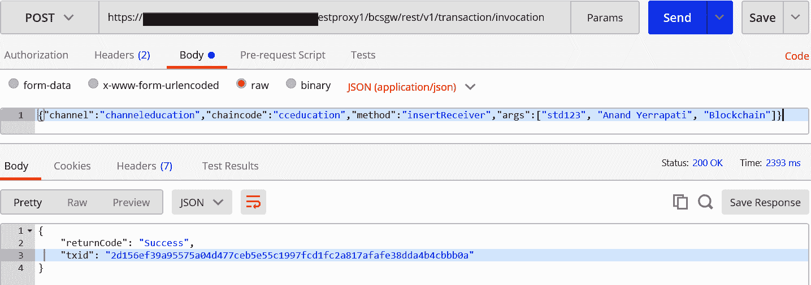

+   目标终点 - 查询按接收者ID查询：

    +   目标终点：`/query`

    +   目标方法：`queryReceiverById`

    +   输入JSON：`{"channel":"channeleducation","chaincode":"cceducation","method":"queryReceiverById","args":["std123"]}`

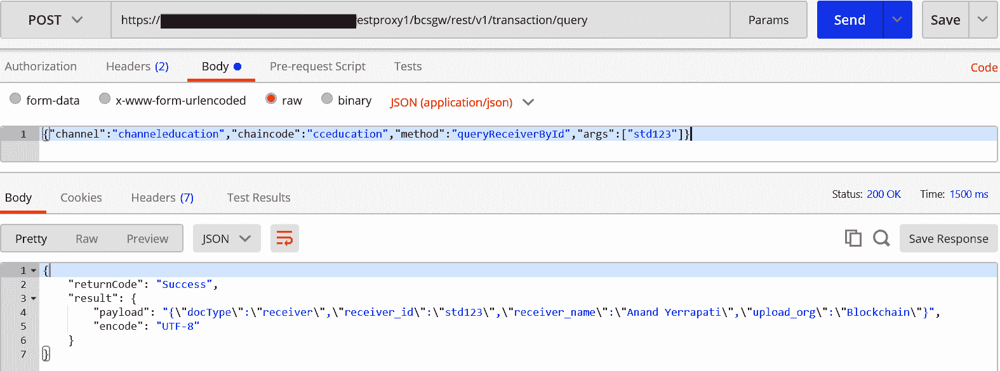

+   目标终点 - 插入证书的调用：

    +   目标终点：`/invocation`

    +   目标方法：`insertCertificate`

    +   输入JSON：`{"channel":"channeleducation","chaincode":"cceducation","method":"insertCertificate","args":["cert1234","1234","ORU Blockchain Certificate","std123","ORU","IT","6/5/2019","","Blockchain Course Completed","","","Issued"]}`

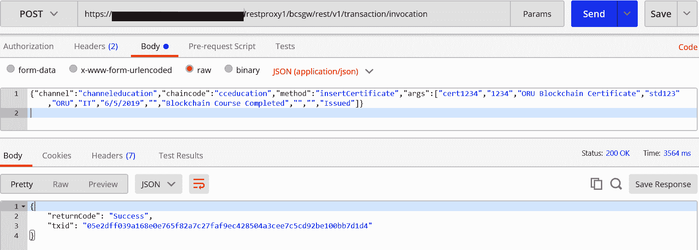

+   目标终点 - 通过ID查询证书的调用：

    +   目标终点：`/query`

    +   目标方法：`queryCertificateById`

    +   输入JSON：`{"channel":"channeleducation","chaincode":"cceducation","method":"queryCertificateById","args":["cert1234"]}`

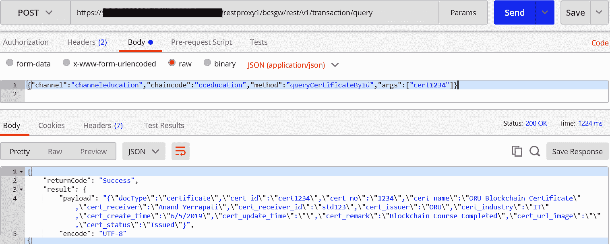

+   目标终点 - 批准证书的调用：

    +   目标终点：`/invocation`

    +   目标方法：`approveCertificate`

    +   输入JSON：`{"channel":"channeleducation","chaincode":"cceducation","method":"approveCertificate","args":["cert1234","Approved","6/5/2019 05:04:45 PM"]}`

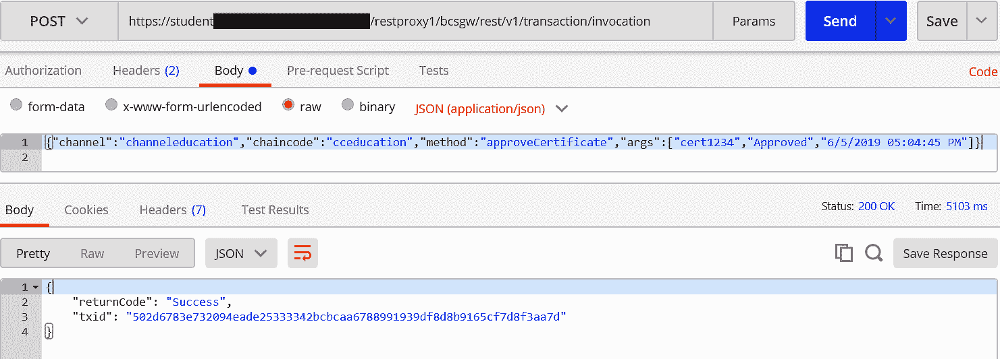

+   目标终点 - 通过ID查询证书的调用：

    +   目标终点：`/query`

    +   目标方法：`queryCertificateById`

    +   输入JSON：`{"channel":"channeleducation","chaincode":"cceducation","method":"queryCertificateById","args":["cert1234"]}`

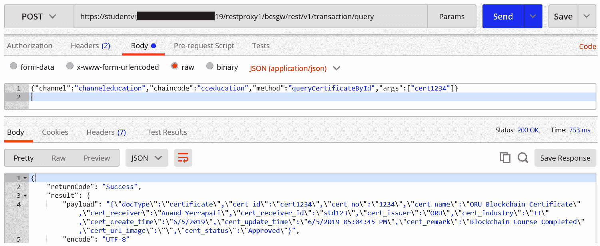

+   目标终点 - 查询所有证书的调用：

    +   目标终点：`/query`

    +   目标方法：``queryAllCertificates``

    +   输入JSON：`{"channel":"channeleducation","chaincode":"cceducation","method":"queryAllCertificates","args":[]}`

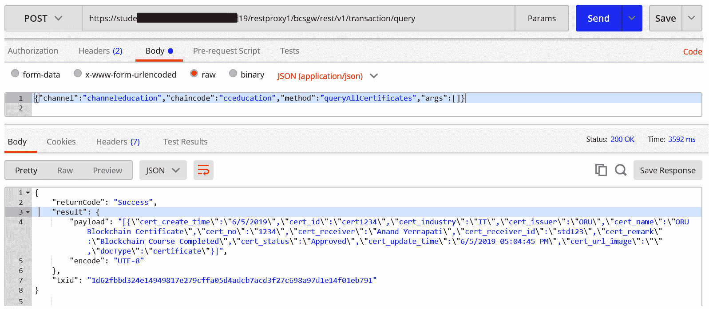

+   目标终点 - 查询端点以获取记录历史的调用：

    +   目标终点：`/query`

    +   目标方法：`getRecordHistory`

    +   输入JSON：`{"channel":"channeleducation","chaincode":"cceducation","method":"getRecordHistory","args":["cert1234"]}`

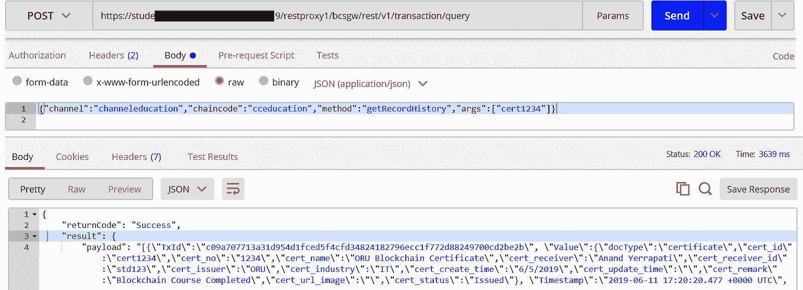

以下是`getRecordHistory`的响应：

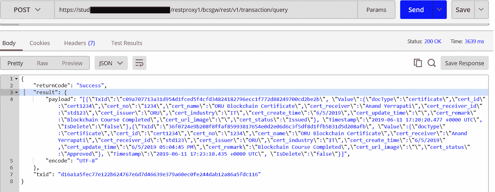

响应消息

# 链代码日志

链码中给出的系统生成的打印语句的日志可供查看。在OBP中，这些日志可以下载或内联查看。此外，我们可以选择所选对等方的日志或所选链码版本的日志。您可以访问部署了链码的对等方上的链码执行的日志文件。以下是打开日志文件的步骤：

1.  转到**链码**选项卡并找到您想要查看日志的链码。

1.  展开链码。

1.  单击您想要的链码版本 - 将显示版本信息

1.  在**已安装在对等方**选项卡上，找到对等方

1.  单击**日志**链接，将打开**查看链码日志**对话框

1.  您还可以通过选择**节点**选项卡下指定对等方的**日志**选项卡来打开日志文件，如下图所示：

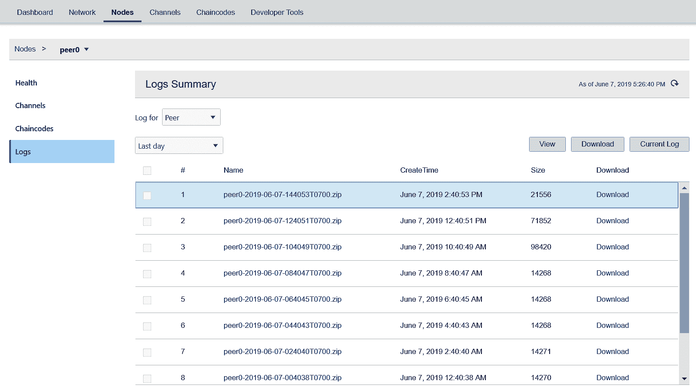

链码日志

# 通道账本

**账本**是区块链网络所有交易区块的最终存储。每个通道都有自己的账本，对通道中的所有组织都是公共的。组织可以对账本拥有读取、写入或两者权限来处理交易。账本只能通过链码进行查询或更新。OBP在其控制台中提供了一个选项，可以查看通道上的账本上的区块。账本上的每个区块都存储了交易ID、链码名称、状态、函数名称、交易的发起者、背书人和参数列表。您还可以看到总区块数和总用户交易数的计数。

通过按照这个步骤，您可以查看通道账本上的数据：

1.  转到**通道**选项卡。

1.  定位您想要的通道并单击通道名称。

1.  在**账本**选项卡下，您可以查看通道的所有区块交易。

1.  选择任何交易以查看其详细信息，如下面的屏幕截图所示：

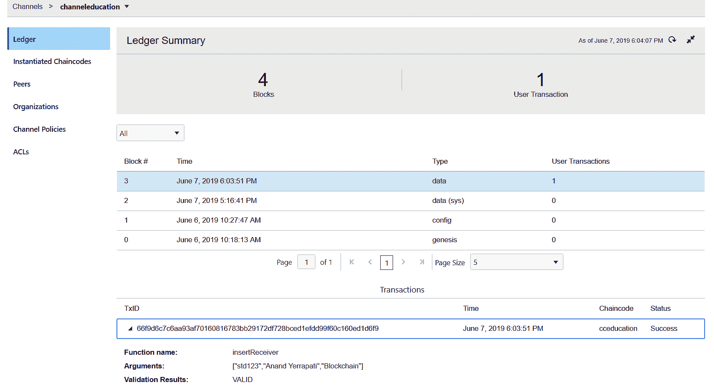

# 将客户端应用程序与区块链集成

到目前为止，我们已经探索了OBP并对在OBP上开发、部署和测试链码进行了实验。本节是[第3章](6aaa9b0a-84b6-4fca-82c3-864e22d616b0.xhtml)中*深入探讨 Hyperledger Fabric*节的复习，以下集成架构图突出了与OBP的三种集成选项：REST、SDK和事件。

当使用 REST API 与 OBP 构建和集成客户端时——参考*从 REST 端点测试链码*部分*——了解使用 REST 端点调用链码事务的用途是很有帮助的。REST 端点可以与客户端应用程序集成，并通过传递相应的头部（例如授权、内容类型以及包括强制性频道名称和链码名称字段以及所需参数在内的输入 JSON）来执行它们。响应也是 REST JSON，应该在客户端应用程序中处理。对于使用客户端 SDK 连接区块链，OBP 提供了 REST API。REST API 允许灵活地调用、查询和查看交易的状态。但是，如果应用程序需要更加精细的操作，那么 HLF SDK 是一种替代方法：

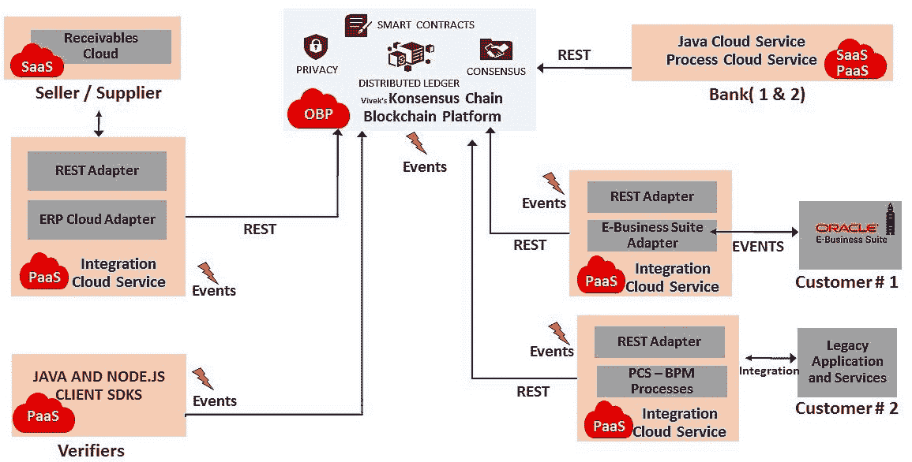

集成架构

参考[第 3 章](6aaa9b0a-84b6-4fca-82c3-864e22d616b0.xhtml)的*深入研究 Hyperledger Fabric*中的*集成架构*部分，了解应用程序与区块链的基于样本的集成策略。

# 运行端到端流程

本节是本章学习的快速回顾：

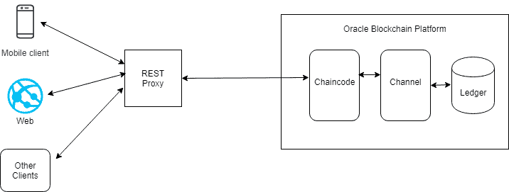

端到端流程

以下是在探索大学用例并与 OBP 合作尝试在 OBP 上开发流程中执行的步骤列表：

+   确定了区块链网络的创始人（在我们的案例中，是 OEU）

+   发现了网络的参与者组织（在我们的案例中是 CVS 和 ORS）

+   在 OBP 中创建了一个创始人和两个参与者实例

+   导出了创始人的 Orderer 证书

+   将 Orderer 证书导入到两个参与者组织的网络选项卡中

+   导出了每个参与者组织的网络证书

+   将两个组织的证书添加到创始人网络中

+   在创始人中为所有三个组织创建了一个通道，`channeleducation`。

+   在创始人和参与者中的通道中加入了对等体

+   导出了每个参与者的对等体，并将其导入到创始人中（这可能需要您查看网络所有对等体的综合拓扑视图；然而，此步骤对于参与背书的组织是必需的）

+   在创始人中安装和实例化链码（链码名称：`cceducation`）

+   在其他参与者中安装了链码

+   启用/配置 REST 代理以访问所有组织的链码

+   使用各自组织的 REST 端点连接到客户端应用程序

# 总结

本章介绍了链码开发的详细信息，如语言部分、开发工具和开发环境设置。它详细描述了链码的完整生命周期，从开发到更新，其中包括安装、初始化、测试和版本控制。它展示了基于 Go 和 Node.js 构建的完整链码代码库。它说明了背书策略和私有数据集以及它们与链码协同运作的方式。它通过 shim 和 REST 端点对链码进行了测试，并使用 SDK、REST 和事件将客户端应用程序与业务网络集成。最后，通过实验监控业务的链码日志和通道日志，对链码、交易和通道进行了深入的洞察。

这本知识总账的创建是基于这样一个信念，即我们共同将积极地促进区块链技术的发展，并不断地激励他人分享他们的经验，并进一步影响其他人这样做。因此，火炬传递给了你，通过分享继续影响，因为分享就是关怀，而我们共同致力于创造一个更智慧的世界。
