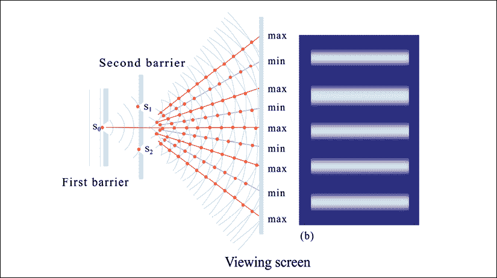
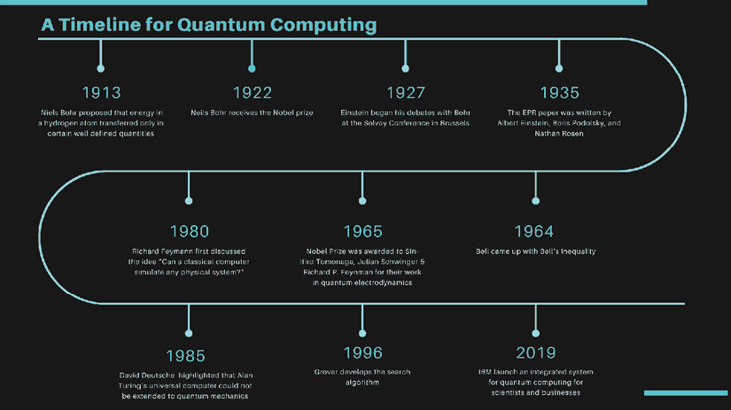
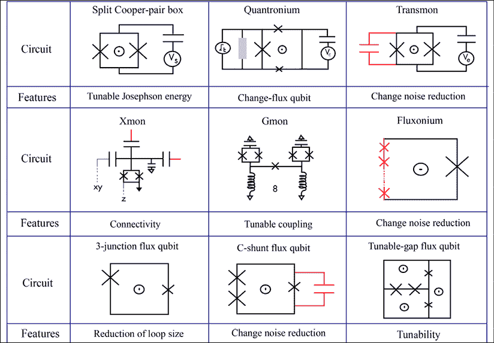
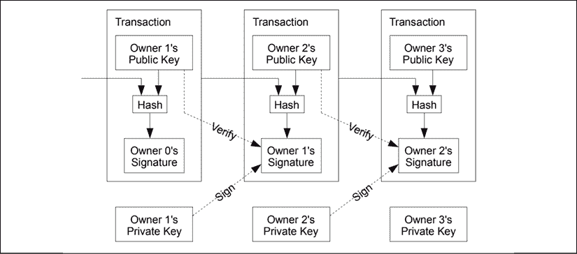

# 第一章：引言：量子计算与区块链

> 那是最好的时代，那是最坏的时代，
> 
> 那是智慧的时代，那是愚蠢的时代，
> 
> 那是信念的时代，那是怀疑的时代，
> 
> 那是光明的季节，那是黑暗的季节，
> 
> 那是希望之春，那是绝望之冬。

我相信查尔斯·狄更斯没有预见到量子计算或区块链。然而，他在 160 年前的话仍适用于我们所见到的这两项技术的起起伏伏。量子计算已存在了大部分世纪。相比之下，区块链首次亮相是在 2008 年。

与近年来席卷我们的区块链浪潮不同，量子原理已存在数十年。量子物理学是一个备受争议的领域，也是量子计算的基础。然而，量子计算领域近来势头迅猛。

尽管这两项技术的年龄存在差异，它们都有着有趣的历史。例如，大多数了解区块链的人都同意该框架是稳健的。然而，这项技术仍然远未完善，这对量子计算也是如此。

过去十年中量子计算背后的势头主要是由于算法和基础设施的进步。然而，在我看来，这也是因为我们生活在数据时代，一些量子计算机的用例变得更加清晰和相关。在本章中，我将涵盖这两项曾经备受争议的技术的历史。它们作为变革性技术在现代社会中的地位是难以争议的。

# 本书内容

本书的目的是探讨量子计算与区块链之间的重叠。这两项技术基本上都是基于密码学的。因此，它们之间存在可能的冲突。然而，当我们看到这些技术的实际应用时，它们彼此非常互补。

在本章中，我们将讨论对量子计算和区块链至关重要的技术概念。我们将深入探讨量子计算及其历史，然后涉及一些对本书主题相关的区块链的关键概念。

我想在本书中建立的一个关键主题之一是*技术只是达到目的的手段*。虽然理解技术并为其可能性感到兴奋很重要，但技术只有在能够改变人们的生活时才是特殊的。

社交媒体上有很多炒作，称量子计算将杀死区块链。在一个数据时代，这两种技术都有存在的意义。量子计算可以大大提高我们的问题解决能力。在一个社交媒体时代，我们需要我们的技术来应对大数据量，并理解我们分析的变量之间的相互关系。当量子计算走向主流时，应该能够解决这些领域。

另一方面，描述区块链应用的简单方法是*去中心化数据完整性*。每笔交易的不可变记录由网络维护和管理。这是区块链在过去的数据存储机制之上的基本优势。

通过行业特定的章节和与量子计算、人工智能和机器学习思想领袖的访谈，我将尝试建立这两种技术的业务相关性。通过这样做，我将确立这两种技术在我们生活的数据中心世界中的垂直协同效应。

在下一节中，我将了解量子计算的历史。在这个过程中，我还将触及这项技术的几个关键概念。

# 量子计算简介

我们正处于一个数据时代，有许多技术与彼此共享共生关系。在所有令人兴奋的技术范式中，量子计算有潜力以规模带来颠覆。量子物理的原则，这是量子计算的基石，已经存在了一个多世纪。

了解量子物理学的演变很有趣，因为涉及到个性以及他们相互矛盾的哲学观。然而，这一领域的历史也让我们了解到这些概念的违反直觉性质，这挑战了甚至最聪明的头脑。本章重点讲述量子计算的故事，并涉及了这项技术的一些基本原理。

# 量子力学的历史

在投资者和学术界教授之间的交谈中，投资者经常会想：“哇，这太棒了，但是怎么样？”，而学术界教授则在想：“投资者明白了吗？”探索量子计算对我来说就是这样一种经历，其中的书呆子想深入探讨这门学科的物理学、数学和技术方面。然而，我内心中的投资者一直在问：“这有什么价值？这对世界有什么意义？对企业有什么好处？”

由于这种拉锯战，我提出了量子原理的简化解释，奠定了量子力学的基础。为了更好地理解量子计算，我们首先需要研究与（量子）比特流相关的量子信息处理的基础知识，以及它们如何处理数据并相互作用。因此，让我们从量子物理学的原则作为量子信息处理的基础开始。

量子物理学提供了解释原子、电子、光子和正电子等粒子行为的基本原理。微观粒子被定义为肉眼不可见的微小物质。

在描述量子力学历史的过程中，我将涉及几个基本概念。对这些概念的发现和理解的演变有助于塑造更现代的量子计算思维。这些概念与量子计算的相关性将在本章展开时变得清晰。然而，在这个阶段，重点是这个复杂领域如何持续困扰了近 100 年的伟大思想家们。

量子力学处理最小尺度的自然；探索原子和亚原子粒子之间的相互作用。在 19 世纪的很大一部分和 20 世纪初期，科学家们试图解决粒子、物质、光和颜色的令人困惑的行为。电子围绕原子核旋转，当它吸收光子（光的粒子）时，它跳到一个不同的能级。紫外线能够提供足够的能量来*击出*电子，由于负电子的移除产生正电荷。来源：[`www.nobelprize.org/prizes/physics/1905/lenard/facts/`](https://www.nobelprize.org/prizes/physics/1905/lenard/facts/ )

科学家观察到，电子吸收光子通常限于特定频率。吸收特定类型光子的电子产生与加热气体相关的颜色。这种行为在 1913 年由丹麦科学家尼尔斯·玻尔解释。在这一领域的进一步研究导致了量子力学基本原理的出现。来源：[`www.nobelprize.org/prizes/physics/1922/bohr/biographical/`](https://www.nobelprize.org/prizes/physics/1922/bohr/biographical/ )

玻尔假设电子只能在某些轨道上旋转，并且它们吸收的颜色取决于它们旋转轨道之间的差异。因为这一发现，他在 1922 年获得了诺贝尔奖。更重要的是，这有助于巩固一个观念，即电子和原子的行为与人眼可见的物体（宏观物体）不同。与定义宏观物体行为的经典物理学不同，量子力学涉及基于概率规则而不是精确机械定律的瞬时跃迁。

这奠定了进一步研究以关注亚原子粒子如电子的行为和相互作用的基础。随着研究发现经典物理学和量子物理学之间的更多差异，广泛认可量子原理可以用来定义自然的特异性（例如：黑洞）。两位伟大的思想家，阿尔伯特·爱因斯坦和史蒂芬·霍金通过对相对论和量子引力的研究做出了贡献。现在让我们来看看阿尔伯特·爱因斯坦如何看待量子物理学及其概念。来源: [`www.nobelprize.org/prizes/physics/1921/einstein/facts/`](https://www.nobelprize.org/prizes/physics/1921/einstein/facts/)

## 爱因斯坦的量子困扰

我们可能需要回到历史中一些年代才能理解爱因斯坦如何卷入量子力学的世界。对于一般人来说，空间只是无尽的虚空，然而当与时间结合时，空间变成了一个四维的难题，被证明是 19 世纪和 20 世纪最伟大思想家的巨大挑战。爱因斯坦不认同量子力学的某些原则，并且他对此持有批评态度。

量子力学的关键原则之一是*Copenhagen Interpretation*。它解释了粒子状态是如何受到观察的影响；观察者从而影响了粒子的状态。爱因斯坦对尼尔斯·玻尔所假设的量子力学的不确定性方面并不认同。

1927 年，爱因斯坦在布鲁塞尔的索尔维会议上开始与玻尔进行辩论。他相信客观现实是独立于观察存在的。根据量子理论的原则，实验者选择的方法影响了某些参数是否具有明确定义的值，或是模糊的。爱因斯坦无法接受*当没有人看时月亮不在那里*并且认为量子理论的原则是不完整的。来源: [`cp3.irmp.ucl.ac.be/~maltoni/PHY1222/mermin_moon.pdf`](https://cp3.irmp.ucl.ac.be/~maltoni/PHY1222/mermin_moon.pdf)

这种不确定性特性的一个有趣方面是，作为婴儿，我们更容易欣赏这些原则。这在婴儿经常喜爱的躲猫猫游戏中得到了体现。他们相信观察者只在他们观察到他们时存在，并且不展示被称为*对象永恒性*的认知能力。然而，随着我们长大，我们会基于对象永恒性的假设来行动。

尼尔斯·玻尔认为，在观察不存在时，将现实赋予宇宙是没有意义的。在测量之间的间隔中，量子系统存在于所有可能属性的模糊混合中 - 通常被称为*叠加态*。描述粒子所取状态的数学函数被称为*波函数*，在观察点处会崩溃到一个状态。

这两位科学家（爱因斯坦和玻尔）之间的哲学斗争在 1935 年的时候因*纠缠*特性的出现而加剧。它意味着两个纠缠粒子的状态取决于彼此（或存在相关性），而与它们彼此间的距离有多远无关。爱因斯坦（嘲笑地）称之为*鬼魅的远程作用*。

作为对玻尔发现的回应，由阿尔伯特·爱因斯坦、鲍里斯·波多尔斯基和内森·罗森于 1935/36 年撰写的臭名昭著的 EPR（爱因斯坦，波多尔斯基，罗森）论文诞生了。这篇论文的目的是论证量子力学未能提供物理现实的完整描述。波多尔斯基负责将其翻译成英文，而爱因斯坦对翻译感到不满。除此之外，波多尔斯基还向《纽约时报》泄露了 EPR 论文的预先报告，爱因斯坦对此非常不满，他再也没有和波多尔斯基说过话。来源：[`www.aps.org/publications/apsnews/200511/history.cfm`](https://www.aps.org/publications/apsnews/200511/history.cfm)

EPR 悖论确定了纠缠特性的两种可能解释。一个粒子的状态影响另一个粒子的状态，可能是由于两个粒子之间共享的内嵌属性，就像*基因*一样。另一种解释是，两个粒子可以彼此进行即时通信，关于它们的状态。第二种解释被认为是不可能的，因为这违反了狭义相对论的理论（如果粒子以超过光速的即时通信）和地域性原则。

地域性原则指出，物体只受其周围的即时环境的影响。

狭义相对论理论指出，物理定律对于所有非加速观察者都是相同的，爱因斯坦表明，在真空中的光速不管观察者以何种速度移动都是相同的。

如果纠缠存在，并且粒子能够在远距离上影响*彼此的状态*，那么局域性理论也被认为被违反了。因此，EPR 论文挑战了粒子能够即时传递状态并且在很远距离上传递的假设。

因此，EPR 得出结论，两个纠缠粒子中嵌入了隐藏变量，这些变量使它们在被观察时选择相关状态的信息。阿尔伯特·爱因斯坦继续挑战量子力学的原理。

> "量子力学确实是威严的。但内心告诉我，它还不是真正的东西。这个理论说了很多，但并没有真正让我们更接近'老大'的秘密。至少我相信，他不会掷骰子。"

—*阿尔伯特·爱因斯坦*

爱因斯坦和玻尔甚至在有仲裁员在场时也无法达成一致。这个仲裁员以约翰·惠勒的形式出现。1939 年，玻尔和惠勒开始在普林斯顿大学工作，并保持了良好的工作关系。惠勒是一个和蔼可亲的人，能说德语。爱因斯坦——普林斯顿的流亡教授——成为惠勒的邻居，这就有了这些伟大思想碰撞的可能性。惠勒认为玻尔的互补观点——两个粒子可以被纠缠——是有道理的。他也同意爱因斯坦对理论的挑战，*当我们观察粒子时，我们无可避免地改变它们*。尽管多次尝试，约翰·惠勒未能提出一种能说服玻尔和爱因斯坦的理论。

## 贝尔不等式

在爱因斯坦和玻尔之后，约翰·贝尔于 20 世纪下半叶进入了量子领域。他于 1928 年出生在贝尔法斯特，并在多年研究量子力学理论后，最终选择在 1963 年在斯坦福大学休假时踏上了这条道路。他将纠缠解释为被分离的同卵双胞胎的行为。如果在一生中它们被带到一起，它们会有一些惊人的共同点。他在一项关于双胞胎研究所的研究中发现了这一点。这让人们认为也许电子的行为就像它们有基因一样。至少，这帮助一个外行人理解了量子粒子的纠缠意味着什么。

然而，1964 年，贝尔随后提出了贝尔不等式。通过一系列关于电子和正电子对的实验以及概率理论，贝尔证明了 EPR 的结论是错误的。假设粒子必须具有嵌入它们的属性来解释纠缠的观点似乎并不是正确的方法。贝尔的不等式得到了几个随后实验的支持。贝尔不等式的概率解释通过贝尔不等式的维恩图表非常简单。有一个更简单的可能的家庭实验可以使用偏振镜来解释量子力学的神秘性质。

你可以在这里观看实验的 YouTube 视频，[`www.youtube.com/watch?v=zcqZHYo7ONs&t=887s`](https://www.youtube.com/watch?v=zcqZHYo7ONs&t=887s)，这确实有点违反直觉。

视频显示如下：

+   透过偏振镜看白色背景。看起来是灰色的，表明有很多光被阻止通过透过镜。

+   再添加另一个偏振镜 B，你会观察到更少的光透过它——通过背景变得更暗来指示。

+   现在，通过在 A 和 B 之上添加另一个偏振镜 C，你会期望白色背景看起来更暗。但令人惊讶的是，它比只有 A 和 B 时看起来更亮。

实验的结果可能可以通过一种可能性来解释。如果光子通过一个滤波器时其性质发生变化怎么办？这可能意味着经过变化的光子与后续滤波器的相互作用也是不同的。

我将在本章后面通过量子缝实验解释光粒子（光子）的另一种奇怪行为。目前，对于亚原子粒子的行为，最清楚的解释是通过量子力学原理来解释的。如果要提供任何新的替代方案，它必须比现有原理更具说服力。

## 量子计算机——一个花哨的想法

在提出自然中粒子行为的理论的同时，有一些人开始思考使用经典计算机模拟这些行为的影响。 1965 年，诺贝尔物理学奖联合颁发给 Sin-Itiro Tomonaga，Julian Schwinger 和 Richard P. Feynman，*以表彰他们在量子电动力学方面的基础工作，对基本粒子物理学产生了深远的影响*。直到 1980 年代，理查德·费曼才首次讨论了“*经典计算机能否模拟任何物理系统*”的想法。人们认为他通过题为“*用计算机模拟物理*”的讲座奠定了量子计算的基础。

1985 年，英国物理学家大卫·德特奇强调了艾伦·图灵的理论上的通用计算机无法推广到量子力学的事实。您可能会问图灵的计算机是什么。

1936 年，艾伦·图灵提出了一种简化版的计算机，称为图灵机。它有一条带有几个方块的磁带，每个方块中都编码为“0”和“1”。他的想法是，机器会在磁带上方运行，一次查看一个方块。机器有一个代码手册，上面有一套规则，根据规则，这些方块中的每一个的状态（“0”和“1”）将被设置。在过程结束时，这些方块的状态将提供机器解决的问题的答案。许多人认为这为我们今天使用的计算机奠定了基础。

然而，David Deutsche 指出，图灵的理论是基于经典物理学（0 和 1），而基于量子物理学的计算机将比经典计算机更强大。

当贝尔实验室的彼得·肖尔发明了量子计算机上因式分解大数的算法时，理查德·费曼的想法开始受到关注。使用这个算法，量子计算机甚至可以破解最近的密码技术。

1996 年，这被 Grover 的搜索算法所取代。在经典计算机中，当在 N 个项目的列表中搜索项目时，平均需要 N/2 次检查才能找到项目。然而，使用 Grover 算法，检查的次数可以降低到√N 次。在数据库搜索中，这为搜索性能提供了二次改进。这被认为是量子计算领域的一个重要里程碑。

### Déjà vu

Grover 的算法以及随后在这一领域的工作自此加速了人们对量子计算的兴奋和炒作。更近些时候，科技巨头 IBM、Google、Intel、Microsoft 以及其他一些公司都加大了在量子计算领域的工作力度。在 2019 年的消费电子展上，IBM 展示了他们的实力，推出了一套供科学家和企业使用的量子计算集成系统。IBM 还拥有一个基于云的量子计算基础设施，程序员可以使用它。更多关于科技巨头的动态将在*第十六章*“国家和网络战争”中揭示。

当我第一次看到 IBM 在 2019 年消费电子展上展示的量子计算机复制品的图片时，我立刻想到了*Déjà vu*。上一代见证了经典计算革命的兴起，对社会的各个方面产生了深远的影响。我们站在另一场革命的边缘；我们将有幸亲眼目睹量子计算的演变。

# 量子的怪异性

在我们探索量子计算之前，了解量子力学描述的粒子行为将是有益的。下面，我描述了一个实验，帮助我们理解量子理论的反直觉性质。

## 一个可怕的实验

著名的量子狭缝实验描述了光子/粒子的行为以及它们如何相互作用和相互影响。正如我们将看到的，这对试图描述它们行为的物理学家构成了挑战。

在 19 世纪，英国科学家托马斯·杨提出了一个理论，即光粒子是以波的方式传播，而不是以粒子的方式。他进行了一个简单的实验，他在金属片上切了两个狭缝，并将其放置在光源和屏幕之间作为挡光器。他知道，如果光粒子的传播方式与粒子相同，那么通过狭缝的粒子将击中屏幕。那些被金属挡住的粒子将从表面弹开，不会到达屏幕。实际上，如果光是由粒子组成的，那么屏幕看起来应该像是涂在模板上的喷雾。*图 1*显示了实验和狭缝的形成。

然而，他假设（在实验之前）光是由波形成的，当波通过狭缝时，它们会相互干涉并在屏幕上形成图案。图案将根据通过狭缝的波的相互作用来定义。

当波相互干涉时（称为构造干涉），屏幕上会显示出明亮的斑点，而峰值与槽（称为破坏性干涉）相互干涉时，它们会形成暗斑。因此，图案将在中心显示出狭缝形状，然后是越来越暗的狭缝形状向左和向右。杨氏成功地证明了光是以波的形式传播的。

图 1：杨氏双缝实验

### 爱因斯坦的光子 - 现在更奇怪了

阿尔伯特·爱因斯坦再次在量子力学领域产生了很大的影响。他提出光是由光子组成的 - 一种像粒子一样行为的离散光量子。因此，实验被重复进行，这一次，光子一个接一个地通过狭缝，图案仍然出现。只有在以下情况下才会发生这种情况：

+   光子以波形传播。

+   所有这些波形的可能路径相互干涉，尽管只有其中一条路径会发生。

这支持了这样一个理论，即在观察结果之前，所有的现实都存在，并且亚原子粒子可以处于叠加态。当探测器被放置来观察通过狭缝的光子时，图案消失了。观察粒子的行为将现实折叠为一个。

我们已经讨论了量子力学的三个原则：叠加、纠缠和干涉。这些原则对量子计算机内部管理粒子的方式至关重要。

图 2：量子计算时间轴

量子计算的历史和关键里程碑都反映在*图 2*中。关键的收获是这一领域所做出的贡献，这些贡献使得这项技术最终有望在规模上产生影响。

# 在量子计算机内部

量子计算机的基本单元是被称为量子比特（qubits，发音为*cue-bit*）。在经典计算世界中，比特有 0 和 1 两种状态。量子比特存在于这两种状态中，同时也存在于这两种状态的线性组合中，称为叠加态。

叠加态可以比我们今天通常使用的确定性和概率算法更快地解决一些问题。一个关键的技术区别在于，虽然概率必须是正数（或零），但叠加态中的权重可以是正数、负数，甚至是复数。

**纠缠**是理解量子计算机的基本原理之一。如果两个粒子显示出纠缠，那么当其中一个粒子行为随机时，它会通知观察者，如果对另一个粒子进行类似的观察，它将如何行动。

只有当两个观察者比较笔记时，这种性质才能被检测到。纠缠的性质赋予了量子计算机额外的处理能力，并使它们比经典计算机运行得更快。

与经典计算机使用的传统晶体管相比，量子计算机具有相似之处和不同之处。量子计算机的研究正在向前发展，以找到新形式的量子比特和算法。例如，自 2017 年以来，使用光子的光量子计算机在研究领域取得了重大进展。使用光子的光量子比特的光量子计算机在室温下运行。

量子计算机应该满足以下要求：

+   量子比特需要被放入叠加态。

+   量子比特应该能够相互作用。

+   量子比特应该能够存储数据并允许读取数据。

量子计算机还表现出一些特征（通常）：

+   倾向于在低温下运行，并且对环境/噪声非常敏感。

+   倾向于有较短的寿命 - 原因如下所述。

我们将量子比特状态编码到亚原子粒子中；在半导体量子计算机的情况下，是电子。有几种方法可以创建量子比特，每种方法都有优缺点。最常见和稳定的量子比特类型是使用超导环创建的。超导体与普通导体不同，因为电流通过导体时没有能量损耗（无电阻）。超导体电路在接近绝对零度的温度下运行（即 0 开尔文，或 -273 摄氏度），以维持其电子的状态。

另一种使用基于晶体管的经典电路的量子比特架构被称为 SQUIDs。SQUID 代表*超导量子干涉装置*。它们用于跟踪和测量微弱信号。这些信号只需要产生比移动指南针所需能量弱 1000 亿倍的变化。它们由约瑟夫森结制成。SQUIDs 的一个主要应用领域是用于人脑成像的磁场测量。来源：[`whatis.techtarget.com/definition/superconducting-quantum- interference-device`](https://whatis.techtarget.com/definition/superconducting-quantum-interference-device)

超导量子比特（以 SQUIDs 形式存在）的电荷载体是称为库珀对的电子对。在这种架构中，基于晶体管的经典电路使用电压来管理电子行为。此外，量子电路由波函数定义。SQUIDs 被称为人工原子，为了改变这些原子的状态，需要使用激光。正如本章前面描述的那样，基于量子力学原理，只有具有特定频率的光才能改变亚原子粒子的状态。因此，用于改变量子比特状态的激光必须调谐到量子比特的过渡频率。

超导量子比特可以由一个简单电路构成，其中包括一个电容器、一个电感和一个微波源，以将量子比特置于叠加态。然而，这种简单设计有几个改进之处，用一个约瑟夫森结取代普通电感是一个重大升级。约瑟夫森结是非线性电感器，允许从非等间距能级中选择两个最低能级。这两个能级构成了量子信息处理中的一个量子比特。这是量子比特电路设计中的一个重要标准——选择两个最低能级。没有约瑟夫森结，能级是等间距的，这对于量子比特是不切实际的。来源：[`web.physics.ucsb.edu/~martinisgroup/classnotes/finland/LesHouchesJunctionPhysics.pdf`](https://web.physics.ucsb.edu/~martinisgroup/classnotes/finland/LesHouchesJunctionPhysics.pdf)

就像古典计算机中的门概念一样，量子计算机也有门。然而，量子门是可逆的。一个常见的量子门是作用于单个量子比特并将其基态转变为叠加态的哈达玛（H）门。

### 量子比特类型和属性

基于这些属性的量子比特电路有几种变体。在设计这些电路时需要考虑的关键属性包括：

+   **脉冲时间**：这是将量子比特置于叠加态所需的时间。脉冲时间越短，效果越好。

+   **退相干时间**: 这是从不想要的噪音中解耦量子比特所需的时间。退相干时间越短，越好。较长的退相干时间会导致信息的更大损失。

+   **每门门的错误**: 由于门用于在量子比特的状态之间创建转换，如果有错误门，错误就会传播到最初正确的量子比特上。因此，每门门的错误需要定期测量。

+   **退相时间**: 这是量子比特状态可以持续的时间。离子量子比特是最适合保持相干时间的，因为它们可以保持状态长达数分钟。

+   **对环境的敏感性**：虽然半导体量子比特在非常低的温度下运行，但电路构建中所涉及的粒子对环境的敏感性很重要。如果电路对环境敏感，存储在量子比特中的信息就很容易受损。

图 3: 量子比特电路

IBM 最近推出了一台 50 比特的机器，还提供了一个云托管的量子基础设施供程序员编码。量子组装语言也有了几个进展，它将作为这些机器和开发者编写的代码之间的接口。*图 3* 展示了不同类型的量子比特电路。

我们已经涵盖了量子计算的基础知识，让我们继续看看这本书关注的其他技术：区块链。

# 区块链和密码学

不同于量子计算，区块链的历史相对较短。如果量子计算是新兴技术中的摩·法拉赫，区块链就是尤塞恩·博尔特。几个区块链属性源于密码学，了解一些术语是很重要的，才能享受本章剩下的部分。

了解区块链如何依赖密码学很重要。这将帮助我们在后续章节中了解区块链和量子计算可能在未来发生碰撞。以下是对区块链和密码学一些关键术语的详细且简化的描述：

## 哈希

哈希是一个过程，其中一组数据输入到一个函数中以获得固定长度的字符串作为输出 - 称为哈希值。我们每天都在使用它们。当您使用密码创建一个电子邮件 ID 时，密码会经过一个哈希函数，创建一个唯一的字符串，并且这个字符串存储在电子邮件提供商的数据库中。当您再次尝试登录时，输入的密码会通过哈希算法，然后得到的字符串与存储在电子邮件提供商数据库中的字符串进行匹配。如果匹配成功，您就可以访问您的电子邮件。

图 4: 比特币交易过程的示意图。来源：https://bitcoin.org/bitcoin.pdf

### 比特币哈希

比特币系统使用一种称为 Hashcash 的函数。Hashcash 工作证明算法是由亚当·巴克于 1997 年发明的。比特币哈希使用了两个额外参数 - 一个随机数（nonce）和一个计数器。随机数只是在输入哈希函数之前添加到数据集合中的随机数。因此，所创建的哈希是先前哈希、新交易和一个随机数的组合。比特币系统要求哈希值以特定数量的 0 开始；随着 0 的数量增加，识别正确的哈希值的挑战呈指数增长。Hashcash 函数的计数器参数记录增量，直到达到正确的哈希值。

## 挖掘比特币

比特币网络中的节点努力寻找具有正确数量的 0 的哈希值。他们使用不同的随机数生成哈希，直到找到正确的哈希。这项工作需要大量的计算能力，当找到正确的哈希值时，达到这一目标的节点将因识别正确的随机数而获得比特币奖励。

确定通过哈希函数得到在困难级别内的特定哈希值所需的随机数称为挖矿。随着 0 的数量增加，难度级别也会增加。随着时间的推移，挖掘比特币变得更加困难，因为需要更多的计算能力来确定随机数。永远只会有 2100 万个比特币被生产，编写本书时，已经挖掘了约 1750 万个比特币。挖掘一个区块的奖励是 12.50 比特币，每天约挖掘 144 个区块。在下一次挖矿奖励减半到 6.25 比特币之前，还有约 6.5 万个区块需要被挖掘。

## 一个区块

区块只是一组共同验证的交易。如果一堆交易没能及时进入一个区块，它们就会被移到下一个区块中。挖掘一个区块可获得的比特币数量一开始是 50，然后随着挖掘每 21,000 个区块而减半。

## 工作证明

*工作证明*一词是由马库斯·雅各布森和阿里·尤尔斯在 1999 年发表的一篇文章中创造的。*工作证明*被用于比特币系统，以确保通过强大的计算能力验证交易。通过这种方法建立的一连串区块，要想黑客通过这些区块需要同样庞大的计算能力。

同样，在*工作证明*系统中，节点的处理能力决定了节点对网络的控制。例如，在比特币网络中，一个 CPU 相当于一票，可以在决策时行使。

## 交易

新的交易被广播到所有节点进行验证。交易被收集到区块中，节点正忙寻找自己区块的工作证明。当一个节点找到工作证明时，它将将区块广播到所有节点，只有当其中的所有交易都有效时，节点才接受该区块。区块的接受导致网络开始处理新的区块。

黑客攻击一个区块意味着需要识别一个新的随机数，解决的不仅是一个矿工的工作，还包括所有后续矿工的工作。此外，在存在多个区块链时，以创建这些链所需的计算能力为准，最长的区块链将被网络接受。

这些概念中的一些是理解区块链网络运作方式的基本概念，现在你应该能够更有信心地接触区块链这一话题了。说到这里，我们现在将讨论区块链的另一个关键概念：实用性代币和安全性代币。最近，理解安全性代币和实用性代币之间的区别已经成为全球区块链社区的难题。

## 实用性代币与安全性代币

随着基于区块链的解决方案开始筹集资金，它们被广泛分类为两种——实用性代币或安全性代币。实用性代币就像是应用程序所需的积分或数字优惠券。它们大致用于在公司盈利时分配利润（或股利）。

另一方面，安全性代币的价值来自于底层资产。例如，房地产基金可以被代币化，代币可以进行交易。代币的价值来源于房地产基金的价值。同样，筹集资金的公司可以发行代币，投资者将获得公司的股份。这实际上是拥有公司的股权，被归类为安全性代币。

尽管我已经描述了实用性代币和安全性代币是互斥的概念，但它们通常并非如此。例如，在以太坊（Ethereum 的代币）的情况下，它更多地是一种实用性代币而不是安全性代币，因为代币在应用程序生态系统中被广泛使用，大部分的价值来自以太的需求。SEC 已经制定了一种简单的方法来将代币确定为安全性代币，因为安全性代币属于其监管范围之内。这被称为豪伊测试。

豪伊测试得名于 1946 年的最高法院判决：SEC 诉 W.J.豪伊公司。豪伊公司向那些入住该公司拥有的酒店的游客提供生产、收获和营销橙子的服务合同。这些合同被卖给了这些游客。法院被询问土地购买和服务合同是否构成投资合同。法院同意了，并且豪伊测试就此产生。

根据豪伊测试，如果：

1.  这是一笔金钱投资

1.  有一种从投资中获利的预期

1.  投资的资金投入是在一个共同的企业中

1.  任何利润都来自于发起者或第三方的努力

让我们以 2014 年以太坊众售为例。有资金投入（尽管是以比特币形式）- 至少有一些人投资，希望代币的价值在一段时间内增加，他们可以从中获利。通过以太坊的众售，资本被投资者集中在一个计划中，这被 SEC 视为共同企业。以太的价值增长预计将通过 Vitalik 及其团队的工作实现。因此，以太应该是一种安全性令牌，根据豪威测试。

以 2014 年以太坊众售为例，很容易将其归类为安全令牌。然而，以太坊现在是一个庞大的应用社区的氧气。因此，我们可以说以太是一个代币的例子，它最初像安全性一样筹集了资金，但由于公司和技术的演变方式，如今更像是一个实用工具。由于其所拥有的社区，以太坊是去中心化的，不再仅仅依赖于公司的初始创始人。

最近，我参加了一个圆桌讨论，讨论了将代币分类为实用性或安全性的挑战。我会把它描述为一个进度条; 进度条的一端是安全令牌，另一端是实用令牌。取决于代币如何获得其价值以及社区如何使用它，它将更接近进度条的一端或另一端。安全与实用性不应被视为代币的二进制状态。

我们已经讨论了量子计算机的背景，并触及了一些有趣的区块链概念。这些基本思想的想法是在未来章节中在各行业中的真实应用之前使用它们作为基础模块。加密元素对这两种技术都是基本的。这是否意味着量子计算使区块链过时了？我们将在未来的章节中讨论这个问题。

# 结论

Bohr（玻尔）、Einstein（爱因斯坦）、Alan Turing（艾伦·图灵）等人近一个世纪以来的旅程已经导致了量子计算机的发明。这个领域的炒作和头条新闻每天都在增加。然而，大规模工业对这项技术的采用还需数年（甚至数十年）时间。在本章中，我想带领读者走一趟旅程，并介绍量子计算中的关键人物、原理、事件和技术组件。

重要的是要理解为什么量子比特与今天的计算世界主要依赖的比特不同。本章提供了我们将在未来章节中涉及的量子方法和现实世界的应用。将在随后的章节中讨论使用光子的光量子计算机的应用。

我们简要介绍了区块链和加密的使用。这也是至关重要的，这样我们就可以看到这两种技术之间的技术重叠。区块链社区将这种重叠视为机会而不是主要障碍至关重要。我坚信这两种技术都将继续存在，并且肯定会通过在各个行业之间相互补充而丰富我们的生活。

量子计算机在包括医疗保健、物流、金融和一般的网络安全等各行业都有几个实际应用。我们将在本书中详细介绍这些内容。

# 参考文献

1.  [`www.coinmama.com/guide/history-of-ethereum`](https://www.coinmama.com/guide/history-of-ethereum)

1.  `medium.com/@aakash_13214/the-scalability-trilemma-in-blockchain-75fb57f646df`

1.  [`www.apriorit.com/dev-blog/578-blockchain-attack-vectors`](https://www.apriorit.com/dev-blog/578-blockchain-attack-vectors)

1.  [`www.investopedia.com/articles/personal-finance/050515/how-swift-system-works.asp`](https://www.investopedia.com/articles/personal-finance/050515/how-swift-system-works.asp)

1.  [`medium.com/altcoin-magazine/how-to-tell-if-cryptocurrencies-are-securities-using-the-howey-test-da18cffc0791`](https://medium.com/altcoin-magazine/how-to-tell-if-cryptocurrencies-are-securities-using-the-howey-test-da18cffc0791)

1.  [`blog.advids.co/20-blockchain-use-case-examples-in-various-industries/`](https://blog.advids.co/20-blockchain-use-case-examples-in-various-industries/)
