# 第二章：量子计算 - 主要讨论点

在最近的一个活动中，有人问了我一个问题，关于量子计算机可以解决哪些经典计算机无法解决的问题。观众也很想了解为什么量子计算机能够做到历史上经典计算机难以处理的事情。量子计算机可能潜在地模拟自然及其中蕴含的复杂性。经典计算机尚未达到这种程度，因为比特存在于两种状态中。量子系统存在于叠加态的能力使它们能够处理指数问题。为了理解量子计算机如何实际上在多个行业中取得创新突破，理解量子物理学的基本原理至关重要，这些原理构成了量子计算的基础。

这些量子物理学原理中的许多已经演变了一个世纪，并且有着特殊的怪异之处，因为它们经常与处理宏观物体的行为和物理相悖。我尝试捕捉量子计算的核心原理（就我们今天所理解的）来解释量子物理学所涉及的亚原子元素的行为。详细了解它们的最佳方法是学习这些概念的物理和数学基础。然而，本书的目的是探讨量子计算的实际应用。因此，我提供了真实的例子，并且依赖了很少的数学和物理来解释这些概念。本章的其余部分将讨论这些概念，从叠加开始。

# 叠加

叠加是将量子计算机与经典计算机区分开的属性之一。量子计算机的量子比特可以存在于 0 和 1 的状态以及这些状态的线性组合中。量子计算机可以实现一种特殊的叠加，允许同时具有指数级更多的逻辑状态。这有助于解决诸如分解大数之类的问题，这通常对经典计算机很难解决。在密码学需要的排列组合数量建模方面，经典计算机的能力有限。

应用量子计算机在密码学中的一个示例涉及 RSA 加密。RSA 加密涉及两个大素数相乘得到一个更大的数。以下示例应该能体现出这些挑战。

## 一个指数挑战

关于国际象棋棋盘和大米的故事生动展现了处理指数难题的挑战。当国际象棋游戏呈现给一个苏丹时，他向游戏的发明者提供了他心满意足的任何奖励。发明者提议，第一个方格得到一粒大米，第二个得到两粒，第三个得到四粒，依此类推。每个方格，米粒的数量都会加倍。苏丹没有意识到他所面对的是什么，并同意支付这些米粒。

几天后，发明家回来和苏丹核对。苏丹的顾问意识到需要大量的米来支付给发明家。棋盘上的第 64 个方格将需要 2⁶³粒米，即 9,223,372,036,854,775,808 粒米。

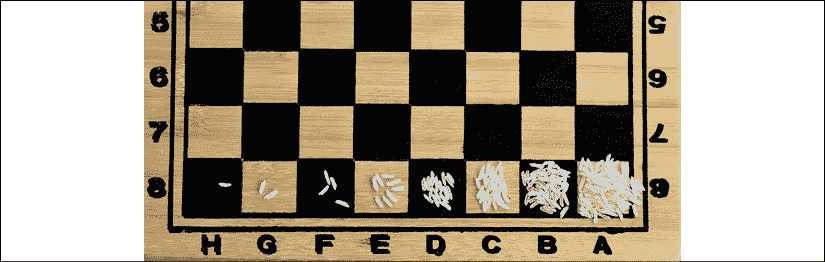

图 1：棋盘和米粒

## 五枚硬币难题

线性回归是用于从自变量 a 和 b 到因变量*x*的值的统计建模技术之一。一个函数*f(x)*表示*x*、*a*和*b*之间的关系。

大多数现实世界中的问题通常不像从几个自变量到因变量的简单。通常，自变量 a 和 b 是相关的。假设 a 和 b 相互作用，并且它们的相互作用影响了结果变量*x*。需要考虑 a 和 b 的所有可能相互作用的组合来计算*x*。假设，不只是两个变量，*x*取决于更多的变量。这些变量之间的可能相互作用使传统计算机难以建模。

让我们考虑一个涉及五枚硬币的游戏。游戏的目标是在抛掷它们后获得最小或最大可能的得分。每枚硬币都有一个值，可以是正数或负数，并且可以是正面或反面，这也对应于正数或负数。游戏中的总得分是通过每枚硬币的*状态*（正面或反面）乘以硬币的值，然后将每枚硬币的得分相加得出的。

| **硬币标识** | **状态 (正面 = +1, 反面 = -1)** | **价值** | **状态*价值** |
| --- | --- | --- | --- |
| coin1 | 1 | 4 | 4 |
| coin2 | -1 | 3 | -3 |
| coin3 | 1 | 3 | 3 |
| coin4 | 1 | 5 | 5 |
| coin5 | -1 | -1 | 1 |
|  |  | 总计 | 10 |

表 1：详细描述了五枚硬币难题

如果我们想要在这种情况下获得最低可能的总分，我们将需要所有值为负的硬币为正面（+1），所有值为正的硬币为反面（-1）。

这将给我们带来总共-16，如*表 2*所示。使用同样的逻辑，如果我要得到最高的总分，我将需要所有值为正的硬币为正面，所有值为负的硬币为反面，总共+16。

| **硬币标识** | **状态 (正面 = +1, 反面 = -1)** | **价值** | **状态*价值** |
| --- | --- | --- | --- |
| coin1 | -1 | 4 | -4 |
| coin2 | -1 | 3 | -3 |
| coin3 | -1 | 3 | -3 |
| coin4 | -1 | 5 | -5 |
| coin5 | -1 | 1 | -1 |
|  |  | 总计 | -16 |

表 2：在五枚硬币难题中得到最低可能分数

现在，让我们将另一个变量加入到混合中。我们称之为相关变量。硬币 1 和硬币 2 之间的相关性可以用 C(1,2)来表示。我们还必须考虑硬币作为成对出现，以及作为单个硬币。在这种情况下，我们将有更多的变量需要处理。

简单起见，如果我们只需找到前两个硬币的总计：

总计 = S1W1 + S2W2 + (C(1,2)*S1*S2)

但是，如果我们想要仅使用两枚硬币确定最低总计，我们将需要用两枚硬币的正面和反面状态进行试验，以获得总计的最小值。对于两枚硬币，将会有四种状态（正正，正反，反正，反反）。如果我们再加入另一枚硬币，状态的数量将增加到八种（正正正，正正反，正反正，反正正，正反反，反正反，反反正，反反反）。所要考虑的状态数量将是 2^N，其中*N*将是用于计算总计的硬币数量。正如我们在国际象棋的例子中看到的那样，这很快就会成为传统计算机难以解决的问题。在量子计算世界中，状态的信息可以更有效地使用超定态进行存储。量子比特可以同时处于正面和反面状态。

量子计算机处理这种量子表示，并确定硬币的状态以得到最低值。该过程涉及在超定态中启动系统，并调整状态以关闭超定态效应。随着相关变量同时输入系统，超定态将被关闭，并且为每个硬币选择经典状态（正面或反面）。

满足指数级计算能力的需求是量子计算带给问题解决世界的一个显著区别。在现实世界场景中，例如模拟癌细胞对放疗的行为，模拟股价行为对市场风险因素的影响，或者寻找从起点到目的地的最短最快飞行路线，量子计算可以提供多个具有不同置信度的答案。

正如我们在*第十四章*中讨论的，*与 IBM 合伙人 Dinesh Nagarajan 的采访*中所述，量子门充当操作符，帮助量子比特从一种状态过渡到另一种状态。一个量子门，在其基本形式中，是一个 2 x 2 的酉矩阵，是可逆的，保留范数和概率振幅。概率振幅是一个复数，它提供了量子系统的波函数与系统观测结果之间的关系。

简单来说，当量子比特处于基态 0 或 1 时，通过门可以将其置于叠加态或激发态。使用量子门与量子比特进行交互并提供结果的算法称为量子算法。当量子计算机在电路图中表示时，导线代表电子通过电路的流动，每个门代表电子运动模式的变化。因此，量子门被有效地用于推动系统产生结果。与经典计算算法不同，量子算法通常提供概率性结果。

**要点**：目前存在一些现实世界中尚未解决的问题，或者是通过近似方法解决的。一旦量子计算机变得主流，其中一些复杂问题可以更有效地和更精确地解决。

现在让我们转向下一个量子概念：纠缠。

# 纠缠 - 远程的神秘行为

爱因斯坦称量子纠缠性质为*远程的神秘行为*。如果一个系统中的两个粒子纠缠在一起，那么如果不考虑另一部分，就无法描述系统中的一个粒子。在量子计算机中，量子比特展示了这一特性。因此，观察一个量子比特的配置的概率将取决于观察其纠缠的另一半配置的概率。即使纠缠的一对比特被分开了很远，这种量子系统的特性仍然存在。这意味着，如果一个量子比特顺时针旋转，那么它的纠缠对可能会在数英里之外逆时针旋转。

最近，赛里斯的科学家们展示了长达 1200 公里的距离上的纠缠。来源：[`phys.org/news/2018-01-real-world-intercontinental-quantum-enabled-micius.html`](https://phys.org/news/2018-01-real-world-intercontinental-quantum-enabled-micius.html)

这个实验是在卫星和地球之间进行的，其中使用纠缠粒子进行即时通信。在使纠缠发生在长距离上的挑战在于，粒子经过光纤网络传输时经常会丢失。然而，科学家们最近在世界上第一颗量子卫星“墨子”上使用激光束进行了通信，利用纠缠的光子在赛里斯的三个不同地面站之间进行通信。之前的量子通信尝试局限于几百公里；这主要是由于光纤中发生的数据通道损失。

量子纠缠（基于量子纠缠）除了长距离通信外，在密码学中也是一个重要的概念。量子传送是在两个被纠缠的量子比特之间传输信息的过程，这两个比特可能被分隔很远。与传统的安全数据传输方式相比，这种方法依赖于量子比特的纠缠而不是复杂的加密函数。量子传送可能很重要，因为它很快可能成为安全互联网或任何通信网络的基础元素。在下一节中，我们将讨论布洛赫球，它有助于可视化量子比特的状态。

## 布洛赫球

布洛赫球，以菲利克斯·布洛赫命名，是一个三维几何表示量子比特状态的球体表面上的点。它还帮助我们理解当量子比特经过门（操作）时其状态如何变化。由于它代表一个量子比特，因此不适用于演示纠缠属性，其中需要考虑多个量子比特之间的相互作用。本节出于必要性而使用数学，但这将是本书中唯一使用数学到这种程度的部分。

布洛赫球的极点代表比特的经典状态：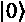和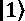。

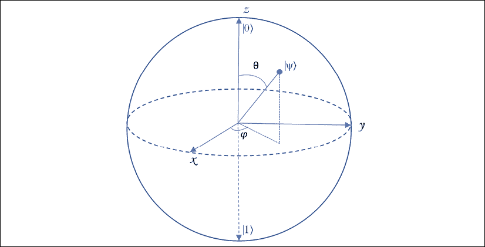

图 2：布洛赫球

由布洛赫球图示表示的量子比特状态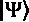，可以表示为：

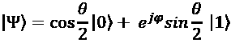

方程式 1：计算机科学家的量子计算，N. Yanofsky 和 M. Mannucci，剑桥出版社，2008 年。

在这个表示中，对应于纬度，对应于量子比特的经度。布洛赫球中的任何点都可以用和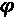的取值范围来表示，由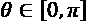和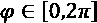给出。

这意味着：

+   当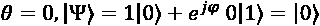，那代表经典比特的状态。

+   当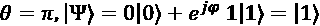，那代表另一个经典比特状态。这是因为φ代表经度，在极点处没有意义。

如果取 0 和之间的其他值，这将导致量子比特的叠加状态。因此，虽然从方程式导出的布洛赫球的极点代表了经典比特的状态，但量子比特的状态可以由球体中的任何点给出。

布洛赫球如何表示量子位的可能状态变化，特别是当它们被观察时？继续讨论 *第十四章*，*与 IBM 合作伙伴 Dinesh Nagarajan 的采访*，我们知道量子位的状态会在观察下坍缩到经典状态。角度  表示量子位的状态将坍缩到两种状态中的任意一种的概率。如果表示布洛赫球的箭头更接近球的北极，状态就会坍缩为 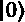，反之亦然。在下一节中，我们将看看量子计算历史上最有影响力的算法之一。

## Shor's algorithm

彼得·肖尔和他的工作可能对量子计算的演变产生了最大的影响。1994 年，他提出了一种用于识别素因数的多项式时间量子算法。理查德·费曼[1982, 1986]已经提出了量子计算比经典计算机更强大的想法。然而，肖尔是第一个揭示量子计算机实际应用的人。利用他的算法，可以演示识别大数的素因数，他激励了一代科学家致力于利用量子计算机进行算法加速。

因式分解长期以来一直是一个数学挑战。想想数字 35。它有两个素因数：5 和 7。同样，数字 142 有两个素因数：11 和 13。如果有一个大的奇数 *N*，需要确定其素因数，我们将需要将 *N* 除以所有小于 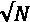 的素数来确定因数。这是一种蛮力方法，计算密集型。现代 RSA 加密依赖于素因数分解来加密所有数据。我们登录的密码、信用卡详细信息以及其他敏感信息都依赖于因式分解的计算困难来防止黑客入侵。

截至目前，RSA 2048 的数字已经达到 617 位十进制数字。虽然因式分解过程已经通过 RSA 位排序，但破解 RSA 2048 数字还需要几年的时间。肖尔的算法提供了一个理论模型来简化因式分解。

如果计算模幂函数的周期，则可以简化数的因式分解。让我们举一个例子来理解模运算和周期的概念。这将帮助我们了解因式分解算法。

*a (mod b)* 的结果是当 a 被 b 除时的余数。以下是一些示例：

12 (mod 5) = 2

21 (mod 7) = 0

18 (mod 7) = 4

下一步是理解周期的概念。假设 *N* 是我们需要找到因子的数字，而 x 是 *N* 的互质数。我们使用以下幂函数：

x^a Mod (N)

现在，让我们通过一个例子来了解因式分解算法。

假设 *N* = 91，x = 3（与 *N* 互质）。当两个数字互质时，它们的**最大公约数**（**gcd**）为 1，将上述幂函数应用于导出周期：

3⁰ Mod (91) = 1

3¹ Mod (91) = 3

3² Mod (91) = 9

3¹ Mod (91) = 27

3⁴ Mod (91) = 81

3⁵ Mod (91) = 61

3⁶ Mod (91) = 1

3⁷ Mod (91) = 3

如您所见，序列在增量为 a 的情况下重复出现，这就是周期，本例中为"6"。确定周期是一个在因数分解中难以解决的问题。但是，一旦完成了这一步，就可以使用以下方法得到因数：

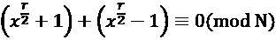

在此示例中，r = 6，*N* = 91，x = 3，我们可以得到：

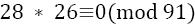

根据因式分解算法：

gcd(28,91) 或 gcd(26,91) 将是 91 的非平凡因子，其中 gcd 代表*最大公约数*。在这种情况下，gcd(26,91) = 13。一旦确定了这一点，另一个因子可以确定为 7。

这是因式分解算法的一个简单示例。Shor 提出，该因式分解算法的部分步骤在量子计算机上执行，而预处理和后处理在经典计算机上执行。以下是描述该算法的步骤：

**第一步**：在上述示例中，使用经典计算机选择 3 作为与 91 互质的数。

**第二步**：创建两个量子寄存器。寄存器 1 将存储 a 的增量，即 x^a Mod (N)。寄存器 2 将存储 x^a Mod (N) 的结果。

**第三步**：对寄存器 1 应用量子傅里叶变换，并在并行计算中计算周期 r = 6。

**第四步**：一旦确定了周期，使用经典计算机找到最大公约数，并得到 91 的非平凡因数。

Shor 的算法提供了一种通过量子计算进行模指数运算并确定周期的方法。序列 x^a Mod (N) 中的每个元素都对序列的周期幅度有所贡献。对于计算得到的除正确周期之外的所有周期，这些贡献的自旋方向都不同，因此彼此抵消。真正的周期，序列的贡献指向相同的方向，并以高概率选择为正确值。现在我们将看看 Grover 的算法，它提供了对非结构化数据的搜索性能的提高。

## Grover 的算法

Lov Grover 在 1996 年发表了一篇描述 Grover 算法的论文。将 Grover 算法应用于非结构化搜索提供了二次速度提升。如果您想在数据库中找到一个项目，并且数据没有排序，使用量子计算机实现的 Grover 算法可以提供比经典计算机更好的性能。

当需要在数据库中的 *N* 个名称中识别一个名称时，如果名称已排序，则经典计算机可以执行二进制搜索以在对数时间内找到名称。如果名称未排序，则搜索将涉及扫描多达 *N*-1 个名称以找到正确的名称。

如果 S[a] 是我们试图从 *N* 个元素的数据库中找到的元素，则使用 Grover 算法可以帮助解决问题，尝试次数为 。通过使用 Hadamard 门准备量子比特，使所有数字处于统一的叠加状态。在这个阶段测量量子比特将显示所有结果同等可能： 

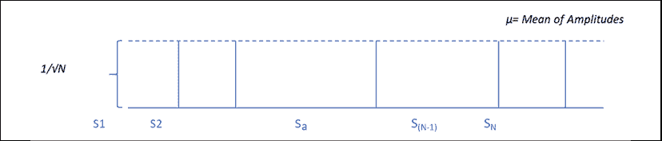

图 3：实现统一振幅

以下方程表示所有字符串的统一大小：

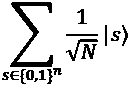

现在，对 s[a]的振幅施加了一个 Oracle 门，将其翻转，而其他部分保持不变：

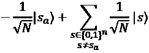

现在图表可以表示为：

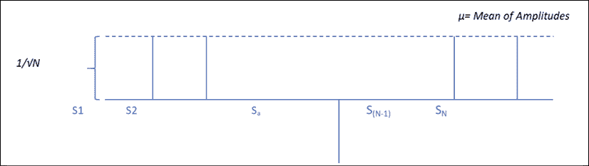

图 4：翻转匹配的振幅字符串

现在所需元素 S[a] 的振幅已经翻转（为负）。因此，振幅的平均值  将会减小。这就是引入 Grover 扩散算子的地方，以绝对增加 S[a] 的振幅。

所有这个算子所做的就是翻转平均振幅。这导致 S[a] 的振幅增加到约为 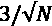 的大小。振幅看起来如下图所示：

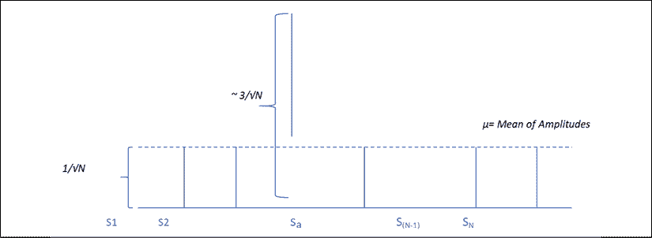

图 5：翻转平均振幅

重复应用 Oracle 门和 Grover 扩散门的过程直到振幅足够显著。还必须注意，S[a] 的振幅不要太大，以至于平均振幅变为负数，这将导致 S[a] 的振幅减小。当振幅几乎为一时，测量量子比特将提供正确的答案。可以证明，当重复约为 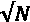 次时，此过程提供准确的结果。

**要点**：Shor 和 Grover 算法奠定了量子计算的基础，并确定了这些算法可以帮助解决的实际用例。

现在我们将转向量子退火，这是一种用于解决优化问题的技术。

## 量子退火

我们已经看到使用门操作实现的量子比特的叠加是如何解决实际问题的。还有其他方法可以得到优化的解决方案。量子退火是利用量子波动到达全局最小值的过程。量子隧道效应可以帮助在量子退火器中的状态之间进行转换。

在量子退火过程中，为了优化所需的信息被建模为一个物理系统。该过程涉及将一个涉及多个相关变量的优化问题编码为一个物理系统（由叠加态中的量子比特表示）。

问题的解决方案被表示为系统的最小能量状态，用来实现这一点的最简单功能称为哈密顿量。量子隧道效应驱动的量子退火可以解决物流问题，例如。

### 量子隧道

量子隧道是粒子穿越高能系统的量子特性。在经典物理学中，当电子遇到电场时，如果电场比电子的电场强，电子就会被排斥。使用量子退火解决的问题依赖于粒子的量子隧道性质。

图 6：电子接近电场

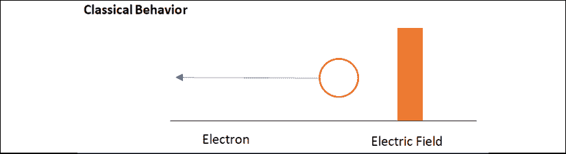

图 7：电子受电场排斥

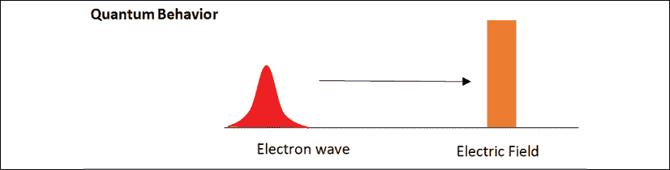

图 8：电子波向电场移动

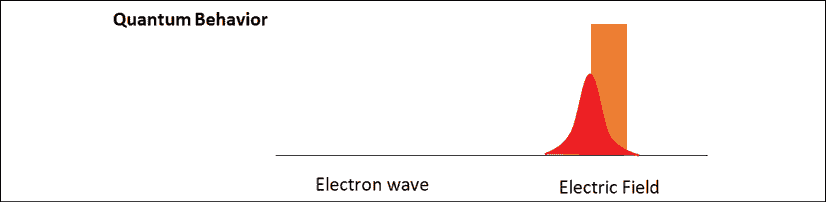

图 9：电子波穿隧通过电场

隧道效应是由弗里德里希·亨德在 1927 年观察到的性质。如果一颗以波的形式传播的电子遇到排斥它的电场，它仍然有概率穿过电场并出现在电场的另一侧（*图 9*）。在放射性衰变过程中，亚原子粒子表现出隧道效应，当粒子逃离不稳定的原子核时。

量子退火是依赖于粒子的隧道特性的过程。让我们看一个实际例子，量子退火可以被应用的地方。

### 旅行推销员

旅行推销员问题是量子隧道的一个广为人知的应用。假设有一个推销员在全国范围内销售货物。他穿越国家的最佳路径将取决于该国的城市数量。如果国家有三个城市（A，B 和 C），最佳路线可能是 A -> B -> C 或 A -> C -> B 或 B -> A -> C 或 B -> C -> A 或 C -> A -> B 或 C -> B -> A。可能的路线数量（6）取决于这里的城市数量（3）。可能的路径数量可以表示为城市数量的阶乘：

3！= 3 * 2 * 1 = 6

当城市数量翻倍至 6 个时，可能的路线数量将变为 6! = 720，这是一个急剧的增加。除了城市数量的增加，还可能会出现其他问题，比如某一时间点发生交通拥堵，或者有一条非常糟糕的道路。因此，最佳路线未必是最短的路线。我们首先需要建立系统来确定最佳解决方案。

让我们将系统准备在问题的许多可能解决方案的量子叠加态中。现在系统可以被看作是一个峰谷景观。峰值是高能态，是昂贵的。另一方面，山谷代表低能态。在我们在一个山谷和另一个之间过渡时，每个解决方案的概率会演化。能量更低的选项成为更可能的解决方案，直到最高概率的解决方案被确定为最佳解决方案。

在模拟退火中，热量被用来越过峰值并在山谷之间过渡。使用量子退火器，量子隧道效应使我们能够*穿过*高能量*峰值*而不是爬上它们，就像在模拟退火中一样。

量子退火是由外部磁场驱动的，起到了模拟退火中温度的作用：量子退火从高磁场（高温度）开始，并以低磁场（低温度）结束。

量子退火是将优化所需的信息输入到物理系统的过程。问题的解决方案将由系统的基态（最低能态）定义。用于此过程的函数称为哈密顿函数，它管理系统的能级信息。

我们可以使用哈密尔顿量来根据一系列约束条件管理系统的能级。在旅行推销员问题中，我们可以将更高的能级分配给更长的距离、糟糕的道路、交通堵塞和道路关闭。最佳路径将是能级最低的路径。考虑到这一点，我们如何确定能量最低的解决方案？

哈密尔顿函数，以及我们添加以增加能级的项，会在能量空间中创建峰和谷。我们需要找到谷，而不必爬上高峰能级。如上所述，这可以通过量子隧道实现。虽然这使我们能够从一个谷到另一个谷移动，但我们如何确定最低的谷？一种称为绝热量子计算的量子技术可以用于此目的。

术语*绝热*来自于热力学理论，意味着*不改变热量的数量*。在这个过程中，系统被初始化到基态，然后缓慢演化为更复杂的哈密顿量，其基态编码了解决方案。

每个哈密顿都通过向所有不正确的配置分配*能量惩罚*来编码变量的正确分配。景观中的峰值有更高的惩罚，而山谷有较低的惩罚。通常，最低能级的最佳解决方案具有 0 的特征值。 我们可以时间演化系统为:

H(s) = (1 − s) H[0] + sH[1]

当时间 s = 1 时，哈密顿量为 H(1) = H[s]，如果演变缓慢，系统将处于其基态。本征值和本征矢量被用于多种现实世界的算法中。它们被用于建模旋转体的物理学、振动系统的振动以及投资银行的风险建模。

本征值由 Hoffman 和 Kunze（1971）以下定义：

> 本征值是与线性方程组（也就是矩阵方程）相关的一组特殊标量，有时也称为特征根、特征值（Hoffman and Kunze 1971）、特征数或者潜在根（Marcus and Minc 1988, p. 144）。

参考：[`mathworld.wolfram.com/Eigenvalue.html`](http://mathworld.wolfram.com/Eigenvalue.html)

量子退火可以用于解决优化问题。然而，我们可能不需要等待量子计算机来使用量子退火和量子隧道原理来取得结果。富士通已经创建了一个“*受量子启发的数字退相干器*”来解决金融风险管理和金融投资组合再平衡中的具有挑战性的优化问题。

**要点**：量子退火可以用于优化多个行业中的问题。金融、物流、医疗保健和智能城市都是可以使用这种技术来优化复杂问题的领域。

尽管量子技术有着所有这些惊人的可能性，退相干是一个重大挑战。让我们接下来看一看。

## 量子退相干

我们在*第一章*，*量子计算与区块链导论*中讨论了量子狭缝实验，看到光子穿过狭缝时表现出波的特性（干涉自身），即使它们是逐个发送的。当粒子表现出自身干涉的特性时，即使它们是逐个发送的。当粒子表现出自身干涉的特性时，即使它们是逐个发送的。当一个粒子表现出波的特性，即干涉自身时，就被称为相干。退相干是系统中相干性的丧失或抑制。

当粒子的状态被观测时，解释其行为的波函数会坍缩。这个解缠现象的过程，使原本处于多重状态的粒子在被观测时坍缩为两个经典状态之一，被认为是量子和经典物理之间的桥梁。实验可能是关于处于超定态的电子，如果观察者正在测量自旋的 z 分量，实验将输出自旋 z 分量的确定值。x 分量仍可能保持在超定态。这符合玻尔的解释，即在观测时，量子世界的性质才会出现。

我们知道，宏观物体，比如人类，不表现出这种属性——只有在被观察时才采取某一状态。当然，当我们知道被观察时，我们都表现出高尚品质，有时相反，但这对于*活着*或*死去*等固有属性却不是这样！更严肃地说，量子世界中的事物如何在被观察之前处于多种状态？

厄温·薛定谔（Erwin Schrodinger）设计了一个思想实验来说明这个概念的反直觉性质和看似荒谬的性质：

一只猫、放射性物质和毒气被放置在一个箱子里。如果探测到放射性，盛放毒气的瓶子将被打破，猫会死。放射性物质足够小，以至于有时无法检测到放射性。因此，在任何时候，箱子外的人都无法确定猫是活着还是死了。因此，按照量子逻辑，可以认为猫既活着又死了！

薛定谔质疑在量子世界中这可能如何发生，而在宏观世界中显然不是这样。迄今为止，所有的量子实验都肯定了量子物体确实似乎能够存在于两种状态，直到被观测到。

## 量子纠错

**量子纠错**（**QEC**）是一个关键的过程，使量子系统的结果变得可靠。在量子计算的初期阶段，高效地纠正量子计算机，同时又不触发计算的失真，被认为是极其不直观的。量子系统中缺乏可靠的纠错是一个主要的障碍，因为量子算法使用的是干涉，而干涉是脆弱的。这种干涉使量子算法对系统的不精确性和系统与世界其他部分之间的耦合敏感。

一些常见错误的原因包括：

1.  系统初态的准备

1.  量子比特由于与环境的相互作用而发生失真

1.  门上的不准确

1.  测量过程中的缺陷

彼得·肖尔（Peter Shor）和安德鲁·斯蒂恩（Andrew Steane）开发了第一套量子纠错码。肖尔发现可以将 9 个量子比特组合在一起对一个量子比特进行纠错，而斯蒂恩则发现了一种由 7 个量子比特组成的纠错方法。

由于与环境的干涉而导致的量子信息丢失可以通过信息的分布来处理。如果信息分布在多个量子比特而不是一个量子比特上，信息将更加安全。在经典计算中，使用重复码进行纠错需要用三位来存储来自一位的信息的副本。因此，除非两份副本有错误，否则信息将完好无损。虽然这在经典计算中是一个简单的过程，但对于量子计算机来说，从一个量子比特复制信息到另一个量子比特更加复杂。

将重复码方法推广到量子计算机的方法是由 Shor 提出的。他提出的解决方案是在基态上使用重复码对量子位进行编码。

通过 Emanuel Knill 开发的后选择量子计算表明，通过错误检测而不是错误校正可以实现量子计算的规模化。量子计算机将具有错误检测电路，如果检测到错误（噪声）已经突破了阈值，则将算法的相关子程序重置并重新运行。这解决了高级别的错误容忍度，但具有高资源需求。

处理量子错误的另一种有用方法是使用称为稳定器的量子纠错码。对于量子系统的开发者来说，这些是相当有用的工具。稳定器代码规范有许多应用，包括准备电路、校正电路和容错逻辑门的设计。使用稳定器来定义量子纠错码有助于使用校正电路在编码数据上应用逻辑操作。由安德鲁·斯坦（Andrew Steane）开发的 7 量子位方法构建了一个使用七个物理量子位的逻辑量子位，具有校正单个 X 或 Z 错误的能力。

**要点**：量子计算中的错误校正是一个非平凡的练习。QEC 的复杂性以及解决它们的各种选项值得一本书来详细讨论。这是量子计算的一个关键方面，它已经帮助将量子计算从理论转变为实际可能性。

# 结论

为了理解本书中的访谈以及从中得出的关键推论，读者充分理解本章是必不可少的。出于同样的原因，我使用实际示例描述了量子计算的概念，并将其与经典计算等价物进行了比较。有一些量子计算的概念，如果不深入研究底层物理（如果不是数学的话），就很难理解。在这种情况下，本章对物理基础概念的简化将有助于理解组成量子系统的微观元素行为中的怪异之处。简化的版本可能会让量子科学家感到不舒服，但我坚信简化叙述对于任何技术走向主流都是至关重要的。

# 参考文献

1.  [`www2.physics.ox.ac.uk/sites/default/files/ErrorCorrectionSteane06.pdf`](https://www2.physics.ox.ac.uk/sites/default/files/ErrorCorrectionSteane06.pdf)

1.  [`journals.jps.jp/doi/full/10.7566/JPSJ.88.061009`](https://journals.jps.jp/doi/full/10.7566/JPSJ.88.061009)

1.  [`arxiv.org/pdf/quant-ph/9508027.pdf`](https://arxiv.org/pdf/quant-ph/9508027.pdf)

1.  [`science.sciencemag.org/content/356/6343/1140`](http://science.sciencemag.org/content/356/6343/1140)

1.  [`people.cs.umass.edu/~strubell/doc/quantum_tutorial.pdf`](https://people.cs.umass.edu/~strubell/doc/quantum_tutorial.pdf)

1.  [`cs.uwaterloo.ca/~watrous/LectureNotes/CPSC519.Winter2006/05.pdf`](https://cs.uwaterloo.ca/~watrous/LectureNotes/CPSC519.Winter2006/05.pdf)

1.  [`grove-docs.readthedocs.io/en/latest/vqe.html`](https://grove-docs.readthedocs.io/en/latest/vqe.html)

1.  [`quantumexperience.ng.bluemix.net/qx/tutorial?sectionId=beginners-guide&page=004-The_Weird_and_Wonderful_World_of_the_Qubit~2F001-The_Weird_and_Wonderful_World_of_the_Qubit`](https://quantumexperience.ng.bluemix.net/qx/tutorial?sectionId=beginners-guide&page=004-The_Weird_and_Wonderful_World_of_the_Qubit~2F001-The_Weird_and_Wonderful_World_of_the_Qubit)

1.  `medium.com/@jonathan_hui/qc-cracking-rsa-with-shors-algorithm-bc22cb7b7767`

1.  [`www.scottaaronson.com/blog/?p=208`](https://www.scottaaronson.com/blog/?p=208)

1.  [`quantumexperience.ng.bluemix.net/proxy/tutorial/full-user-guide/004-Quantum_Algorithms/070-Grover's_Algorithm.html`](https://quantumexperience.ng.bluemix.net/proxy/tutorial/full-user-guide/004-Quantum_Algorithms/070-Grover's_Algorithm.html)

1.  [`www.cs.cmu.edu/~odonnell/quantum15/lecture04.pdf`](https://www.cs.cmu.edu/~odonnell/quantum15/lecture04.pdf)

1.  `medium.com/@quantum_wa/quantum-annealing-cdb129e96601`
