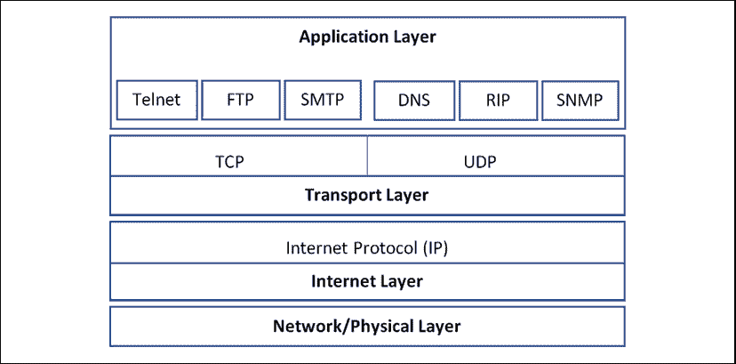
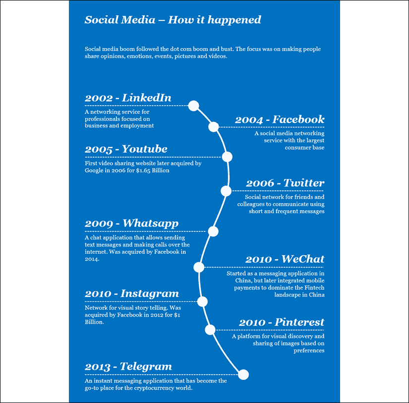
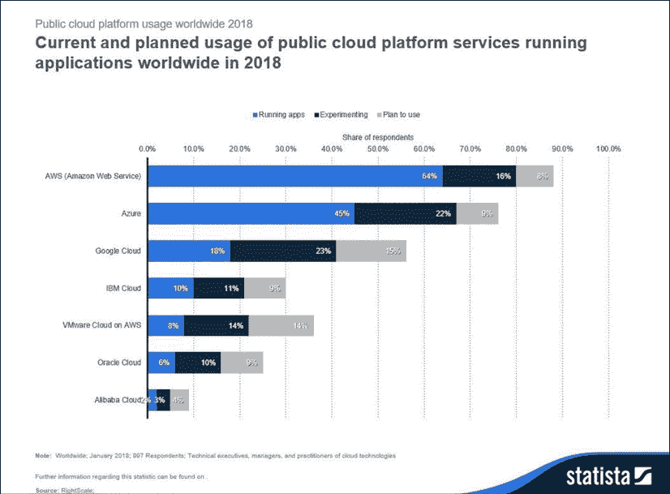
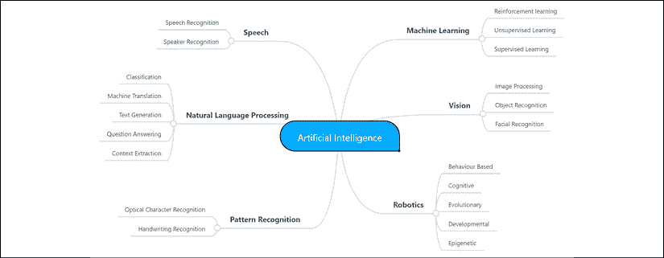
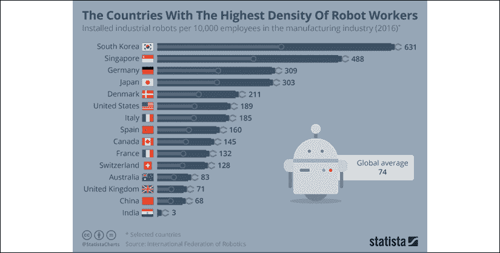

# 3

# 数据经济

最近，我家的一个吊灯出了故障，电路有些奇怪的布线问题。连接到吊灯的灯泡开始闪烁，一两个小时后所有的灯泡都跟着几个危险的火花熔断了。我们不得不将其修理好，但同时也发生了其他事情。我五岁的孩子看到这一幕后说："爸爸，这个吊灯失去了互联网连接，你看，甚至灯泡也不再发光了，我们可以检查一下互联网吗？"

我对这个评论感到惊讶，让我意识到了我们生活的世界。下一代人沉浸在一个无缝连接的世界中，或许无法想象它曾经是其他样子。这种连接性也带来了自己的挑战。连接性导致互动，而互动反过来产生数据 - 很多数据。然而，只有这些互动产生的数据能够被有效地获取、管理和分析，才有价值。在过去几年中，互联网作为数据网络导致了一次重大升级。多亏了区块链，我们现在拥有价值网络，通过连接可以进行点对点的价值交换。

点对点互动（无论是数据还是价值）的这种增长也带来了一些挑战和风险，包括网络安全、数据隐私和自主身份。多年来，我们看到一些公司丢失或错误管理了客户数据，因此受到了声誉和监管风险的影响。同样，我们也看到资本市场在创造包容性价值框架方面表现不佳，使得富人变得更加富有，而穷人变得更加贫穷。

人工智能、区块链和量子计算等新兴技术可以帮助管理新型数据经济。它们也可以帮助世界转向点对点价值交换网络。

本章将带你重温互联网的诞生，以及在互联网之上构建业务的科技公司的诞生。我将描述随后出现的社交媒体和大数据，这意味着我们需要方法来管理随之而来的数据爆炸。云计算和人工智能在如此庞大的数据量上的崛起是合乎逻辑的下一步。目前正在进行使用区块链来管理数据完整性，以及利用量子计算更好地利用数据。让我们从互联网开始吧。

# 互联网

互联网的崛起在互联网本身上有了充分的记录。然而，我觉得首先应该理解过去50年来技术转变的一些重要内容，以便了解我们今天所生活的丰富数据时代是如何到来的。互联网之前是由晶体管、电话、无线电和计算机等设备的发明和传播引起的。试图连接计算机以共享和广播信息并进行协作，这就是互联网的起源。一切始于ARPANET。

## ARPANET

1962 年，麻省理工学院的 J.C.R. 利克莱德写了一系列备忘录，描述了网络上可能发生的交互，并将其称为**银河网络**。另一个思维突破发生在麻省理工学院的伦纳德·克莱因洛克提出了使用数据包而不是电路进行通信的理论。这激发了劳伦斯·G·罗伯茨的工作，他制定了 ARPANET 计划，并于 1967 年发布了该计划。结果，1969 年，克莱因洛克的加州大学洛杉矶分校网络测量中心成为 ARPANET 上的第一个节点。斯坦福研究所（**SRI**）、加州大学圣巴巴拉分校和犹他大学随后加入了网络。主机之间的第一条消息发生在克莱因洛克的实验室和 SRI 之间。

随着越来越多的主机加入，ARPANET 迅速扩张。然而，直到 1971-72 年实施**网络控制协议**（**NCP**）后，ARPANET 用户才能开发应用程序。使用 NCP，用户可以远程访问计算机并发送文件。它充当了传输层，并定义了连接两台计算机的过程。更多阅读：[https://www.internet-guide.co.uk/NetworkControlProgram.html](https://www.internet-guide.co.uk/NetworkControlProgram.html)

1972 年是一个重要的年份，第一个电子邮件程序推出了，用户可以阅读、转发和回复消息。在当今微型消息传递世界中，电子邮件主要用于正式通信。然而，在互联网的历史上，电子邮件是一个关键的步骤。

## TCP/IP

ARPANET 为使用数据包交换在网络内进行通信铺平了道路。然而，当**传输控制协议**/**互联网协议**（**TCP**/**IP**）由鲍勃·卡恩开发时，通过不同技术连接到其他网络的互操作性发生了变化。后来称为 TCP/IP 的 TCP/IP 成为了我们今天使用的互联网的基石协议。TCP/IP 是互联网上数据交互发生的规范，以及数据应该如何被分成数据包，从源头传输到目的地并在目的地接收的规定。TCP 定义了如何在网络上（在本例中是互联网上）创建应用程序通道，而 IP 为数据包的目的地提供了标识符或地址。下图描述了使用 TCP/IP 的互联网架构：

图 1：TCP/IP 架构

网络层是数据在物理线、电缆或光纤中以数据包形式传输的地方。Internet层使用我们称之为IP地址来标识主机，并找到距离目的地最近的路由器。传输层负责数据的端到端传输，不受底层网络的影响。它还负责处理错误处理、流量控制和拥塞控制，以避免大量数据通过相同的路由器发送。应用层涵盖了我们用于电子邮件、文件传输和网站等应用的协议。

TCP/IP协议的开发和宣传是互联网发展阶段的一个重要阶段。几年的规划后，ARPANET顺利从NCP转到TCP/IP，这个转变出乎意料地顺利。

1989年，一位名叫蒂姆·伯纳斯-李的英国科学家提出了**万维网**的概念。这意味着**统一资源定位符**（**URL**）可以成为保存信息的空间。这些URL可以相互链接，并通过互联网访问。到1990年，蒂姆还提出了**超文本标记语言**（**HTML**），这门语言是互联网的基石。

## 繁荣、萧条和繁荣

几家公司在上世纪80年代就应用了TCP/IP协议。然而，直到20世纪90年代，互联网的主流采用才开始。20世纪90年代，几家基于互联网的企业开始成型，个人电脑开始变得普遍。随着这两项创新（互联网和个人电脑）在90年代中期的融合，互联网市场迅速增长。几家公司在两年时间内增长了约500%。例如，**AOL**（美国在线）从1992年上市时的7000万美元增长到2000年初的1500多亿美元。

由于90年代末的非理性狂热，**风险投资**（**VC**）行业随意向初创企业大肆投资。这些VC用于评估投资机会的估值模型基本上是错误的，而且在许多情况下根本没有进行估值。许多没有健全商业模式的公司以疯狂的估值获得了资金，导致了泡沫和崩溃（如下所述）。这是历史重演的一个典型例子，因为点网泡沫在2017/2018年末的区块链/加密货币行业中重演，尽管规模较小。通过这场繁荣与萧条，关键事件的时间顺序如下：

**繁荣期**

+   1995年8月：网景公司开始交易，标志着互联网时代的开启

+   1996年4月：雅虎上市，首日股价翻倍

+   1997年5月：亚马逊上市，并在第一天股价上涨30%

+   1998年1月：NASDAQ以1574.10点开盘，两年来涨幅达50%

+   1998年9月：Google由拉里·佩奇和谢尔盖·布林创立

+   1998年9月：eBay上市，首日股价上涨163%

+   2000年3月：纳斯达克达到5132.52的峰值

**经济大萧条**

+   2000年3月：达到峰值三天后，纳斯达克下跌了4.5％

+   2000年4月：纳斯达克在一周内跌幅达到25％，泡沫破裂

+   2000年12月：eBay股价跌至2.81美元（首日收盘价为47.35美元）

+   2000年12月：纳斯达克年末收于2470.52美元，较3月份的峰值下跌了52％

+   2001年3月：eToys股票一文不值。该公司在三年内耗尽了8亿美元，并申请破产。

+   2001年4月：TheGlobe.com股价跌破1美元，并从纳斯达克摘牌

+   2001年11月：亚马逊股价跌至5.51美元

**复苏**

+   2003年第一季度：亚马逊报告了其首次年度利润为3500万美元

+   2004年8月：谷歌上市，首日股价上涨18％

随着互联网帝国在21世纪初的衰落，大多数公司在几周内失去了价值。许多公司破产，投资者失去了资本。然而，在痛苦的几年后，尘埃落定了。其他一些互联网/技术公司从互联网泡沫破裂中恢复过来。然而，这是一个缓慢的过程。微软的股价直到2016年10月才回到1999年12月的高点。互联网泡沫的破裂识别了定义计算机和互联网未来的公司。互联网泡沫的幸存者继续建立了我们今天所知的社交媒体的框架。

# 社交媒体

互联网革命之后是另一场技术范式——社交媒体。虽然互联网是连接人们和分享信息，但可利用的信息仍然有限（相对而言）。

社交媒体创造了互动，博客和微博客的机会，导致了数据爆炸。

图2：社交媒体应用程序

随着社交媒体席卷全球，一些大型科技公司出现了一些关键发展。Facebook早期看中了Instagram和WhatsApp。虽然Instagram以10亿美元的价格被收购是一个抢手货，但以190亿美元收购WhatsApp引起了一些人的质疑。然而，这些应用程序所涵盖的市场规模足以证明这笔开支是合理的。此外，到2014年WhatsApp被收购时，Facebook仅通过广告的收入就达到约120亿美元，用户基数达到13亿人。

尽管Facebook的收入模式取得了成功，但他们清楚地意识到他们必须全球扩展其用户群。他们的雄心壮志是让每个互联网用户成为他们的客户，在互联网普及率低的地方，他们甚至制定了提供互联网的策略。用户数据的竞争开始了，随着他们免费提供服务，他们的用户成了他们的商品。

让我们了解一下使用这些社交媒体应用程序创建的数据量和市场规模。这将帮助我们理解为什么这一章涵盖的新兴技术现在比以往任何时候都更加重要。这些数据将披露为什么大型科技公司着眼于扩大他们的客户群。

一些需要注意的数字是（截至2019年1月）：

+   42亿人使用互联网

+   34亿人积极使用社交媒体

+   Facebook和WhatsApp每天创建600亿条消息

+   2018年发送了450亿条微信消息

+   晨高峰1分钟内微信消耗了46TB的数据流量

+   自2003年以来，Google已经回答了4500亿个独特的查询

+   每分钟有300小时的视频上传到YouTube

根据上述统计数据，您可以清楚地看到世界数据的庞大增长。其中，很大一部分增长是由全球用户广泛采用社交媒体所推动的。

> "在文明的黎明和2003年之间，整个世界创造了5艾字节的信息。现在，这个数量每两天就是一样多。"

– *埃里克·施密特，Google前首席执行官和董事长（2010年）*

这些数据多年来一直被科技巨头用于各种商业目的。这也导致了政府、监管机构甚至客户在数据隐私权上的反弹。Facebook与剑桥分析公司分享了有关8700万人的数据的丑闻为该公司带来了很多声誉问题，并凸显了对更好的数据控制和法规的需求。标签**#FacebookIsDead**开始流行起来，许多千禧一代和Z一代用户因为Facebook对用户数据的处理而远离这家社交媒体巨头。很明显，数据法规、治理和控制是必不可少的。但在继续讨论这个问题之前，让我们先看看企业如何利用大数据技术管理这一大量数据的爆炸增长。

# 大数据

术语**大数据**是由Roger Mougalas在2005年创造的，这是在Web 2.0之后的一年。Web 2.0用于指示传统商业智能工具由于它们需要处理的数据量而无效的数据时代。同一年，Yahoo在Google的MapReduce上开发了Hadoop，旨在对**万维网**进行索引。Hadoop是一个能够处理结构化和非结构化数据的开源框架。

结构化数据是由明确定义的数据类型、数据规则和其会遵循的控制所确定的。结构化数据通常存储在数据库中，其中数据的确切参数是预定义的。Oracle、Microsoft SQL Server和其他几个数据库管理系统非常专注于处理结构化数据。

非结构化数据没有相同级别的结构纪律，主要是因为它的生成方式。非结构化数据以各种形式存在，大部分是当今世界上存在的数据。它可能是从社交媒体、电子邮件、聊天、语音录音和视频中产生的数据。社交媒体需要高效地管理非结构化数据，并且出现了几种技术以应对这一机遇。

数据库的另一种分类是关系型和非关系型。关系型数据库如 MySQL、Microsoft SQL Server 和 Oracle 在表中以结构化格式存储数据。这些表可以通过关系相互链接。这些关系确保数据的完整性。

然而，这种模型的缺点是，将数据转换为关系模式需要大量时间。因此，在数据量庞大且处理通常预期在几分之一秒内完成时，这可能不是最佳选择。从关系数据库中提取数据通常使用**结构化查询语言**（**SQL**）。

非关系型数据库如 MongoDB、Neo4J 和 Cassandra 以 JSON 或 XML 格式存储数据。当数据一致性不太重要，可用性和查询响应时间更重要时，它们非常方便。这些数据库还允许更无缝地进行水平扩展。这在涉及大数据量时非常重要。

在深入了解大数据管理如何进行之前，首先了解结构化数据的数据来源、管理和分析将非常有用。

## 结构化数据处理

在传统环境中，数据遵循着明确定义的数据类型，从数据源、准备、管理到以适合报告和分析的格式传送的过程涉及一个称为**ETL**（**提取**、**转换**和**加载**）的过程。所有这些过程发生在组织中的系统称为**数据仓库**。我们将简要讨论以下每个过程：

**提取**

数据来源于组织内的各种形式，并存储在名为临时数据库的数据库表中。数据来源可以是平面文件、消息总线，或者高度规范化以快速写入事务的事务数据库。源到目标的映射是预定义的，以确保源数据以兼容的结构（数据类型）传送到临时区域。临时数据库中的表充当这些数据的着陆区。

**转换**

临时表中的数据经历预定义的转换。这些转换在系统中提前确定并编码。当数据被确定为与这些转换和系统中设定的规则（数据类型、逻辑条件）不兼容时，数据将被记录到错误处理队列中。

**加载**

转换后的数据然后加载到数据仓库中，到那个时候通常是高质量的。这个最终的数据库也可能是数据集市，通常是满足特定目的或组织部分的小型数据仓库。无论如何，数据在准备进行分析和报告之前需要经过几个步骤。

这个过程过去在传统的设置中有效。然而，可能无法找到一个地方来存储每天产生的2.5亿亿字节的数据（数据），这些数据不符合结构化数据库的语义限制。因此，需要通过大数据平台的方法转变。现在让我们看看非结构化数据管理是如何解决数据时代提出的一些挑战的。

## 非结构化数据处理

传统的数据库管理系统并不适用于处理与互联网经常相关的数据量和缺乏结构。大数据系统的关键组成部分包括：

**数据源**

大数据系统中的数据源可以是文本文件，来自社交媒体的消息，网页，电子邮件，音频文件和视频文件。随着**物联网** (**IoT**) 的兴起，机器交互产生的数据也将成为大数据系统需要处理的来源之一。

**数据存储**/**数据湖**

来自这些来源的数据存储在分布式文件存储系统中，如**Hadoop分布式文件系统** (**HDFS**)。存储的分布式特性允许它处理大容量和大数据量。数据湖也可以处理结构化数据，但不需要数据处于结构中。

> 成功实施数据湖的企业在有机收入增长方面超过了竞争对手9%（根据Aberdeen的研究）

来源：[https://s3-ap-southeast-1.amazonaws.com/mktg-apac/Big+Data+Refresh+Q4+Campaign/Aberdeen+Research+-+Angling+for+Insights+in+Today's+Data+Lake.pdf](https://s3-ap-southeast-1.amazonaws.com/mktg-apac/Big+Data+Refresh+Q4+Campaign/Aberdeen+Research+-+Angling+for+Insights+in+Today's+Data+Lake.pdf )

与传统的数据仓库不同，数据湖在读取时获得模式。

**数据处理**

在大数据基础设施中进行数据处理的方式可能有所不同，具体取决于输入系统的数据的性质：

+   批处理通常用于处理大型文件。这些批处理作业处理传入的文件，并将处理后的数据存储在另一个文件中。像Hive、Pig或MapReduce作业这样的工具可以处理这种类型的处理。

+   实时数据处理发生在一个系统中，数据来自社交媒体或物联网设备，数据以连续的数据流形式需要处理。这个数据流是实时捕获的，这可能也涉及使用消息缓冲区来处理实时数据量。

+   然后可以使用传统技术转换这些数据，并将其移动到分析数据库/数据仓库中。

+   或者，如果不喜欢传统流程，可以在数据文件之上构建一个低延迟的NoSQL层，用于分析和报告。

现在让我们来看看已经探索过的不同架构，以管理大数据。

## 大数据架构

有一些大数据架构既解决了处理大容量数据的问题，又满足了精确的分析需求。例如，Lambda架构有一个热路径和一个冷路径。热路径处理来自诸如社交媒体之类的来源的大量数据，然而，对于读取操作，热路径提供了较低数据精度的快速访问。另一方面，冷路径涉及耗时的批处理，但处理数据以提供高度准确的分析功能。

热路径通常仅保存短时间的数据，之后，从冷路径处理的更高质量的数据替换此数据。Kappa架构从Lambda架构汲取灵感，并通过使用流处理机制简化了它，仅使用一个路径而不是Lambda架构的两个路径。这消除了重复和确保数据收敛的复杂性。像Apache Spark Streaming、Flink和Beam这样的框架能够提供实时和批处理处理能力。

大数据系统使用的第三种架构是Zeta架构。它使用七个可插拔组件来增加资源利用率和效率。组件如下：

+   分布式文件系统

+   实时数据存储

+   可插拔的计算模型/执行引擎

+   部署/容器管理系统

+   解决方案架构

+   企业应用程序

+   动态和全局资源管理

这种架构的好处包括：

+   减少复杂性

+   避免数据重复

+   降低部署和维护成本

+   提高资源利用率

将解决方案分解为可重用组件，在开发和管理大数据平台的几个方面都能提高效率。

虽然架构很有趣，可以了解技术的成熟度，但结果可能更重要。例如，大数据系统允许更好地利用以社交媒体互动形式捕获的数据。处理大量数据的基础设施的成熟度已帮助多个行业提供精明的客户特定服务。我们使用社交媒体分析看到的一些常见用例包括：

+   品牌情感分析

    +   品牌可以使用社交媒体分析来了解有关其品牌或最新推出产品的情绪，并相应调整其产品。

+   客户细分和定向广告

    +   几个社交媒体平台提供了有关组织在营销方面获得最大效益的详细信息。企业可以根据这些信息微调其营销策略，并降低客户获取成本。

+   积极主动的客户服务

    +   客户不再需要经历繁琐的投诉流程。有几个例子显示，顾客在Twitter或Facebook上记录了他们的投诉，品牌立即做出了反应。

+   政治竞选活动

    +   即使在选举前，政治竞选活动也通过社交媒体洞察力得到积极主动的管理。西方国家可能更习惯这样的活动，但例如在印度，总理纳伦德拉·莫迪成功地利用巧妙的社交媒体策略吸引了他的追随者的注意。

    +   在政治竞选期间，有几个亚洲政治组织被指控发布假新闻，以误导选民。例如，在2019年印度选举前夕，WhatsApp被用作传播关于印巴空战的假新闻的平台。2016年的英国脱欧公投是另一个被指控进行选民操纵的例子。来源：[https://www.bbc.com/news/world-asia-india-47797151](https://www.bbc.com/news/world-asia-india-47797151 )

组织利用社交媒体数据持续与消费者进行互动的其他几种方式。例如，了解用户的情绪、积极主动地处理投诉，以及创建增加品牌知名度的活动，都可以在社交媒体上完成。

作为一名投资者，当我评估公司时，我考虑的一个关键维度是它们对通过社交媒体渠道提高品牌知名度、获得客户以及持续互动的认识和能力。了解有效利用社交媒体的优势已成为经营业务的基本要素。这不再是一个选择。社交媒体的崛起使公司从本地服务器转向基于云的基础设施。也许不存在因果关系，但社交媒体与云之间绝对存在相关性。

## 云计算

架构上催化了大数据革命的大数据框架也同时得到了云计算的演进支持。如果没有这些技术范式成为主流，就不可能捕获、存储和管理大量数据。一切始于2002年，当时亚马逊推出了其在线零售服务。他们不得不采购大量服务器来应对圣诞季节的高峰流量。在其他时候，他们的服务器利用率约为10%，在那个时代这是很常见的情况。

亚马逊的团队发现了他们服务器的低利用模式，并认为他们可以创建一个模型来提高非高峰时段的利用率。与需要服务器资源的其他人分享他们的服务器基础设施可以为每个人增加效率。云基础设施的概念应运而生。

杰夫·贝佐斯和他的执行团队最终决定在非高峰时段充分利用未使用的服务器容量。一年之内，亚马逊的团队组建了一个提供计算机存储、处理能力和数据库的服务。这种商业模式改变了创新格局，因为服务器基础设施变得更加负担得起，适合初创公司使用。

**亚马逊网络服务**（**AWS**）于2006年上线，到2018年，它成为一个创收260亿美元的机器。谷歌、微软、IBM等公司纷纷效仿；然而，亚马逊显然领先一步。截至2018年，80%的企业正在使用AWS运行应用程序或在其上进行实验（据Statista）。自从云服务主流采用以来，创业成本已经大幅下降。

采购基础设施的需求基础也使得运营和扩展业务变得成本效益高。

图3：2018年全球公共云平台服务计划和当前使用情况。来源：https://www.statista.com/statistics/511467/worldwide-survey-public-coud-services-running-application/

随着云服务的成熟和扩展，出现了几种新的模式，即**软件即服务**（**SaaS**）、**平台即服务**（**PaaS**）和**基础设施即服务**（**IaaS**）。

SaaS是一种模式，其中软件应用程序由供应商在服务器上虚拟管理，并通过互联网供用户访问。谷歌文档是这种模式的早期例子之一。今天，我们使用云托管的SaaS进行日常应用的多种简单任务，从文档管理到进行远程会议。由于这种模式，我们的笔记本电脑不再每隔一会儿就呼喊出软件更新。然而，我们也越来越依赖互联网，并在没有互联网的情况下感到失去功能。

PaaS是一种模式，供应商不提供互联网上的应用程序，而是为开发人员提供一个创建应用程序的平台。例如，许多供应商以PaaS模式提供区块链，开发人员可以使用云管理的软件开发服务来创建区块链应用程序。IBM也为量子计算提供了类似的服务，然而，这也可以归类为IaaS模式。

IaaS是一种模式，其中计算机资源被提供为服务。这将包括服务器存储、计算和网络容量、灾难恢复等。这帮助大型组织通过转移到云端来减少其基础设施占地面积。数据中心迁移到云端，从而实现了计算资源的效率提升，同时也减少了它们的碳足迹。

随着这些在架构、软件和基础设施技术范式方面的进步，数据时代已经真正启动。我们已经找到了创建和管理大规模数据的方法。然而，我们并不擅长利用数据量来开发规模化的智能——挑战人类的智能。于是人工智能登场了。

# 人工智能

我把人工智能提及得好像是在社交媒体爆炸之后第一次真正开发出来的。这一点与事实大相径庭；人工智能的概念早已存在。像人类一样行为的机器人的概念早在 20 世纪初的科幻作品中就被提出。然而，直到 1950 年，当艾伦·图灵提出这个问题时，它才开始成为一个严肃的研究领域，

**“机器能思考吗？”**

## 人工智能的起源

当艾伦·图灵开始探索这个问题时，他不仅遇到了数学上的挑战，还遇到了神学上的反对意见。他反驳了上帝给人类赋予不朽灵魂，但未给其他动物或机器赋予的论点，因此没有动物或机器可以思考。

他明确指出，在试图使机器思考时，我们（社会和人类）并不是在违背上帝的意志。他认为这不是神学和科学首次采取看似矛盾的立场。

他指出，下面的圣经经文与哥白尼的理论不符。哥白尼曾提出太阳是宇宙的中心，地球和其他行星围绕它运转。

> “他奠定了地球的根基，使其永不动摇”（诗篇 104:5）

艾伦·图灵也阐述了他对思考机器未来的看法。

> “我相信，大约在五十年后，将有可能，利用存储容量约为 10⁹ 的计算机，使它们玩得和人一样好，以至于一个平均的询问者在问了五分钟的问题后，不会有超过 70% 的几率正确识别。原来的问题，“机器能思考吗？”我认为太无意义，不值得讨论。尽管如此，我相信，在本世纪末，使用的词语和一般受过教育的观点会发生如此大的变化，以至于人们将能够谈论机器思考，而不期望受到反驳。
> 
> 我相信进一步隐藏这些信念是毫无意义的。普遍认为科学家们从一个被充分确证的事实不可逆地推导到另一个被充分确证的事实，从不受到任何改进的猜测的影响，这种观点是完全错误的。只要明确表明了哪些是经过证实的事实，哪些是猜测，就不会造成任何损害。猜测非常重要，因为它们提出了有用的研究方向。

那个时代甚至尝试人工智能实验的实际挑战是巨大的。计算能力和数据存储能力（或缺乏）是最大的瓶颈。计算机不仅需要存储单词，还需要理解它们之间的关系，以进行有意义的交流。

有一些科学家和研究人员认为机器将具有人类的智能。他们提出了不同的“**人工智能奇点**”时间表。尽管人工智能技术有时被视为炒作，但研究界持续取得进展；20世纪80年代，约翰·霍普菲尔德和大卫·鲁梅尔哈特引入了深度学习的概念，人工智能领域通过研究资金的激增得到了新的推动。

第一个实际的突破也许发生在1996年，当国际象棋大师加里·卡斯帕罗夫被IBM的深蓝击败时。深蓝是一个计算机程序，比赛结果受到了极大的宣传，并被认为是当时该领域的一大突破。与此同时，微软将由Dragon Systems开发的语音识别软件集成到其Windows操作系统中。

科学界已经意识到，人工智能不仅仅是一个奇迹般地表现得像人类的程序。它是一种使用大量高质量数据构建的算法的方法。这使得算法能够更好地理解机器所处的背景，并提供相关的输出答案。

## 模仿游戏

图灵的另一个贡献是图灵测试。这个测试被称为*模仿游戏*。游戏构造如下：

+   有三个房间，每个房间都通过计算机屏幕和键盘连接到其他房间。

+   第一个房间里坐着一个人类，第二个房间里坐着一台计算机，第三个房间里坐着一个“裁判”。

+   裁判的工作是根据他们的回答（通过五分钟的互动）来识别人类和机器。

+   图灵提出，如果裁判在识别人类或机器方面的准确率低于50%，这意味着裁判有可能选择人类或计算机。这使得计算机成为了一个可以通过的模拟人类和智能的人工智能系统。

多年来，程序员们对这个实验进行了几次简化，将其用作他们解决方案智能程度的试金石。一些随后的研究者批评了图灵测试在识别真正智能系统方面的能力，而其他论文则为测试进行了辩护。不管怎样，艾伦·图灵对人工智能领域的贡献无疑是巨大的。他是一个有远见的人，为后代播下了利益的种子。

## 人工智能的化身

我经常发现人们在很多列出的更详细的AI分支中将AI互换使用。经常有人挑战将**AI**用来指代机器学习解决方案的做法。在我看来，这些AI的子群集侧重于利用数据做出更好的决策。在某些情况下，这种智能增强了人类，有时机器自己做出决策并从中学习。

AI的算法细节，如神经网络、聚类和贝叶斯网络都作为AI的分支下的技术进行了涵盖：

图4：AI的分支

机器学习或许是最常见的形式，其中数据中识别模式并利用这些模式进行预测。模式识别过程涉及向算法提供大量数据，并开发解决方案来利用这些训练数据进行学习。机器从训练数据中学习后，就可以将学到的内容应用到新的数据集上。如果新的数据集呈现出与训练数据相似的模式，那么机器就会强调这些模式。因此，训练数据的广度和质量在学习过程中非常关键。让我通过我参与的一个例子来解释这个问题。

2014年，我有幸成为PwC的IBM Watson评估委员会成员。我们正在评估使用IBM Watson解决监管问题的可行性。自2008年以来，英国和欧盟的金融监管机构提出了几项复杂的法规，要求银行了解大量的监管文本并确保合规。成千上万行复杂的监管文本，相互补充和冲突的监管规则，以及经常变化的法规，这一切都使得银行很难保持他们的监管义务。

我们正在评估的IBM Watson解决方案将所有监管文本（以法律语言书写）作为输入。我们还将提供那些监管文本的自然语言版本作为输入（如果有）。两位监管专家将与IBM Watson合作，在他们所称的“*Watson上学*”过程中，AI引擎将接受监管规定的培训。专家们会向AI提出关于某项监管规定的问题，当答案提供后，专家们会根据答案的质量点赞或点踩。这有助于AI引擎随着时间的推移学习并在大量监管文本上回答简单、普通的问题变得更加出色。

在这种情况下，问题非常明确 - 我们要求机器查看监管文本并提供相关答案。然而，有时候尽管有大量数据可用，分析师也不知道他们在数据中寻找什么。我们使用一种称为无监督学习的方法来识别数据中的问题和异常。利用这一点，我们开始理解影响异常的潜在变量的过程。

机器人技术是另一个在过去10年左右取得显著进展的领域。韩国等国家已经通过在制造业中每10000名员工部署约700台机器人将机器人技术提升到一个全新水平。以下图表上的数字代表2016年的数据。最新数据显示，韩国的数字已经增至每10000名员工710台机器人。

机器人技术被用于进行手术、进行对人类潜在有害的救援行动、银行客户服务、物流、建筑甚至农业。其中几项用途处于原型/试点阶段，但显示出了有希望的迹象。机器人在工业应用方面的应用开始变得清晰起来，特别是在有重复和机械任务的领域。

结果，低技能、高频率、乏味的工作将被机器取代。在资产管理行业，人工智能被用于做出投资组合管理决策，因为机器可以处理数百万个数据点，以做出比人类大脑更好的决策。

图5：2016年机器人工作者密度最高的国家

人工智能在当今世界的应用是无限的。每天都有新的途径和现实机会为人工智能开启。数据的可用性使人工智能的繁荣成为可能，但也在数据隐私、数据所有权和数据安全方面打开了一个全新的潘多拉魔盒。在消费者数据的集中垄断中，我们往往不清楚我们的数据是如何被使用、分享和货币化的。这就是区块链等技术可以发挥作用的地方。

# 区块链

正如我们之前简要提到的，区块链框架具有几个属性，使其能够解决一些数据所有权、安全性和隐私挑战。在今天主要是非量子技术的背景下，区块链比集中式数据管理系统提供了更好的数据安全性。同时，区块链也存在一些限制，如果不加以解决可能会影响其主流采用。《第1章：量子计算与区块链简介》讨论了区块链（比特币区块链）的历史和技术架构。

区块链具有几个特性使其能够在多个行业应用。然而，在我们专注于数据经济主题时，让我们看看区块链及其能力如何在恰到好处的时间加入了其中。

# 分权

随着区块链技术在多年里日益受欢迎，分权一直是全球数百万区块链信徒的魔力咒语。感谢我们在本书中早先讨论的可扩展性三难问题，分权通常似乎是实现商业规模的障碍。虽然区块链已经实现了可扩展性，但分权经常被牺牲，使其成为我们希望世界向之迈进的一个难以企及的乌托邦观念。

然而，分权确有其优点。多年来，我们已经习惯了客户端-服务器系统，大部分数据存储在服务器上。这种架构的挑战在于：

+   拥有大部分数据的服务器易受网络犯罪分子的攻击。黑客攻击集中系统以获取关键信息很容易。曾经发生过银行被黑客攻击并丢失数百万客户数据的多起事件。

+   如果集中实体停止存在，客户拥有的数据往往会丢失。如果Facebook申请破产并停止运营，全球23亿用户的整个数据集可能会丢失。

在分权系统中，已达成共识的数据版本存储在区块链上的所有节点上。因此，在区块链中关闭一个节点不会导致数据丢失。

虽然分权可防止数据丢失，但也确保数据所有权不被集中。对每个消费者来说，管理其数据、经济和社会身份越来越重要。由于客户端-服务器系统的缺点如前所述，身份管理机制在分权网络内被称为自主身份管理。

多亏了区块链框架，自主身份的概念开始看起来不像以前那样难以捉摸。在一个将数据视为新油、而注意力（在媒体和社交媒体中）被视为新黄金的时代，身份必须由每个个体拥有和管理。如果我在Facebook上有个人档案已有10年，我需要完全透明地了解Facebook如何使用我的数据并对其进行货币化。任何未经批准使用或出售客户数据的行为都将不再被容忍。

在深入研究有助于管理自主身份的分权可追溯性之前，让我们看看阻止对区块链系统本身进行网络攻击的功能。

## 不变性

在一个每个生成的区块都使用前一个区块的哈希的系统中，任何试图在区块链上创建虚假交易的人都需要穷举整个区块链。在区块链上就伪造交易达成共识的另一种逻辑方法是控制51%的节点。这种情况发生在一个失去人气的区块链网络中。在这样的网络中，某人可以接管网络，以达到对网络的51%控制。

区块链还有其他被攻击的方式，比如导致以太坊硬分叉并诞生以太坊经典的DAO攻击。然而，这些问题发生在框架逻辑基本上容易受到攻击的情况下。

如果这样的漏洞被遗忘一分钟，区块链作为一个不可变的网络。一旦创建了交易，要想入侵和更改就会变得非常困难。虽然不可变性无疑是一种可取的区块链属性，但它也在需要可追溯性的情况下使用。

## 可追溯性

在传统数据库管理系统中建立可追溯性和可审计性并不困难。然而，当可追溯性与区块链的其他特性结合在一起时，它变成了去中心化-不可变-可追溯性，这是特殊的。在数据密集型世界中，区块链的这一特性有多种应用，用于管理知识产权。它还允许你跟踪第三方如何使用你的数据，并在相关情况下，作为客户而得到报酬。

几周前，我和一位区块链架构师交谈，我们讨论了许多网站提供的用户旅程，我们必须输入用户名和密码才能使用他们的服务。他坚持认为，世界需要转向解决方案，其中客户的数字身份不是存储在应用程序级别，而是存储在协议级别。每次需要检查客户身份时，应用程序可以利用这个协议。

这意味着诸如Facebook和Twitter之类的应用程序不一定会成为个人数字身份的中心持有者。理想情况下，身份应该由一个去中心化的政府网络管理。然而，当网络由少数几个政府管理时，就被认为是集中化的，与区块链的对立面相反。然而，这里的重点不是去中心化程度。更重要的是，身份将必须在更基本的层面进行管理。

随着身份的管理，个人拥有的数据也将被管理。而且，用户的数据将被归因于他们，并且他们将被告知任何一家公司使用他们的数据赚取的金额。选择能够利用他们的数据赚钱的提供商是用户的决定。例如，个人可能会同意将他们的数据（在聚合水平上匿名）用于帮助银行做出放贷决策，但是他们可能不会同意一家大型华尔街银行将其用于向更多客户推销产品。

例如，用户可能会同意将其数据用于具有低碳足迹的公司，但是当一家矿业、石油或天然气公司希望使用其数据做出任何战略/商业决策时，他们希望这些公司将从决策中获得的收益中捐赠一部分给环保慈善机构。

创建一个允许数据创建、共享和变现的生态系统并不足以。建立围绕它的治理和控制是至关重要的，以便实现数据的谨慎使用。在一个国家之间很快将使用网络攻击来相互发动战争的世界中，这些控制将决定胜利者和失败者。各国可能会停止在核弹头上花费时间和金钱，并开始更多地花费时间和精力来保护其公民的数据，使用诸如区块链之类的技术。

随着我们逐步了解到对数据时代至关重要的技术，其中一种显著的技术是量子计算。对于这个领域来说，现在仍然是早期阶段，但其可能性是令人充满希望的。

# 量子计算

在使数据经济成为可能的一系列技术创新中，量子计算或许是最为重要的一环。我们已经涉及了量子计算的各个方面，使其成为一种革命性的技术范式。在实践层面上，量子帮助我们解决了一些以前无法解决的关键问题。这些实际问题中的许多都在本书中通过采访进行了讨论。有了量子计算，人工智能就像注射了类固醇一样发展迅速，区块链经历了一次新的整容（也许是经历了一场痛苦的手术），而大数据的管理和利用可能会经历一次重大的反思。

当量子特性如纠缠被用于在大距离传输信息时，网络安全将呈现出非常不同的形态。企业将能够做出实时数据驱动的决策，并且具有更高的信心度。实质上，多亏了新兴技术，我们应该能够充分利用我们所创造的数据。

# 结论

每隔几年，我们都会看到新的技术趋势出现。自互联网兴起以来，没有一项重大技术能够在不丰富数据经济的情况下蓬勃发展。无论是人工智能、大数据、云计算、区块链、物联网、5G还是量子计算，它们都与数据经济互动并为其做出贡献。其中一些在应用层有更多的用例，一些在协议层有更多的用例，而一些在物理/基础设施层有更多的用例。尽管如此，它们都在规模上造成了颠覆性的影响。

互联网为这几年的数据创新奠定了基础。社交媒体在此基础上建立。一旦我们通过社交媒体创建了数据，就是利用新兴技术充分利用它的时候了。其中一些技术范式甚至在互联网和社交媒体出现之前就存在了。但是，丰富的、具有上下文的用户数据的可用性帮助创新者完善了他们利用和进一步发展这些技术的方法。

互联网提供的连接性为新经济模式的创建提供了可能。一个连接的用户群体，网络效应以及产生的参与度提供了丰富的数据。企业通过充分利用这些数据而免费提供其服务而蓬勃发展。使用区块链数字化创造了价值。

一个小型网络发展成了一个生态系统，并且数字经济得以创建。所有这些都是在过去15年以惊人的速度发生的。现在出现的问题是，量子计算是否能够丰富这股创新浪潮？

在接下来的几章中，我们将研究量子计算和区块链在几个行业中的潜在应用。

# 参考文献

1.  [http://sitn.hms.harvard.edu/flash/2017/history-artificial-intelligence/](http://sitn.hms.harvard.edu/flash/2017/history-artificial-intelligence/)

1.  [http://jmc.stanford.edu/artificial-intelligence/what-is-ai/branches-of-ai.html](http://jmc.stanford.edu/artificial-intelligence/what-is-ai/branches-of-ai.html)

1.  [https://medium.com/@chethankumargn/artificial-intelligence-definition-types-examples-technologies-962ea75c7b9b](mailto:https://medium.com/@chethankumargn/artificial-intelligence-definition-types-examples-technologies-962ea75c7b9b)
