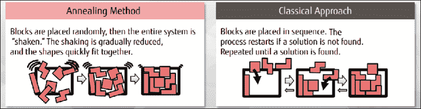
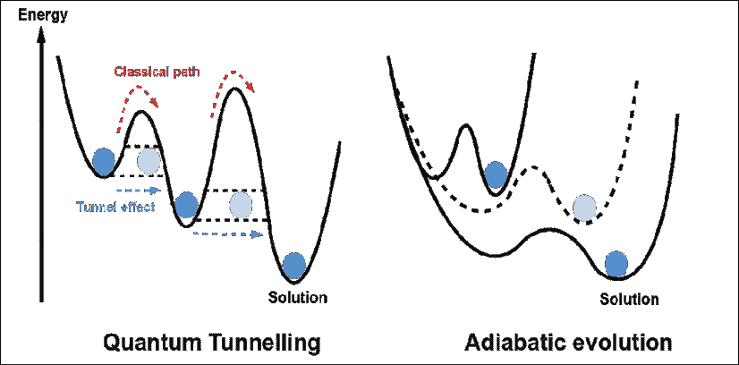
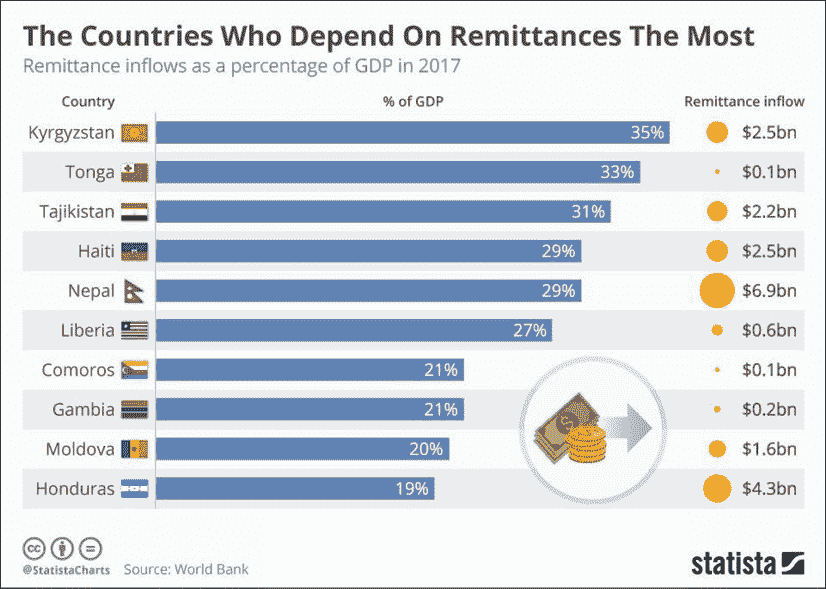
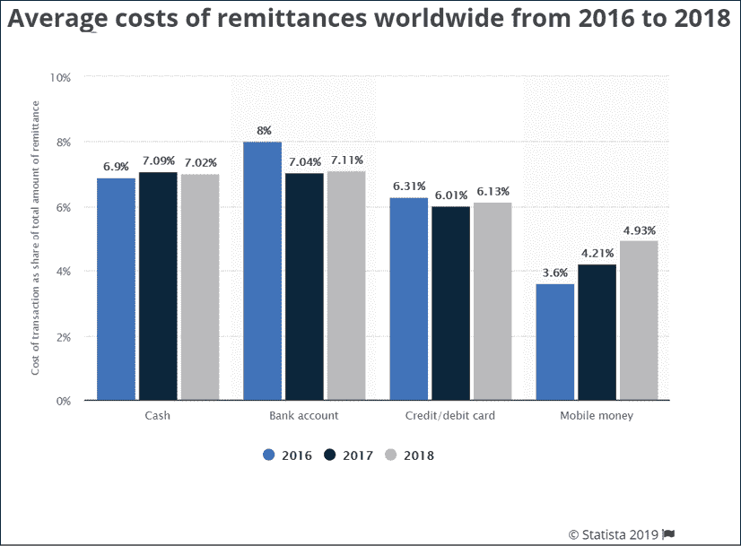

# 第四章：对金融服务的影响

金融服务行业在历史上一直不善于拥抱创新和尖端技术。 部分原因是银行、资产管理和保险公司将自己视为提供金融产品的业务。 他们认为技术是成本中心，不属于他们的核心业务。 然而，这种做法受到了业务景观中的两个关键变化的挑战。

2008 年的经济衰退导致金融服务公司与创新技术互动方式发生了几个关键转变。 经济衰退后，银行面临巨大的监管压力。 这意味着他们必须小心他们向客户提供的金融产品的创新程度。 银行必须向监管机构报告更多有关其产品和服务提供情况的细节。 结果，创新产品变得稀缺。 与后勤技术和流程相关的大量间接成本。 仅在英国，银行每年就要花费 50 亿英镑用于监管合规性。 随着监管压力的增加，风险管理流程和技术也激增。

金融科技公司的崛起是景观中的另一大变化，被称为*金融科技公司*。 金融科技公司是利用数字方法以更加以客户为中心的方式提供金融服务的创新型年轻公司。 它们年轻且没有传统技术的负担。 这帮助它们在很短的时间内创建新的商业模式、技术解决方案和运营模式。

当银行和金融服务公司在应对监管压力时，灵活的金融科技公司让它们措手不及。 在意识到之前，银行看到金融科技公司以快速增长和扩大其客户基础的方式挑战了它们的业务前景。 另一方面，监管流程增加了底线压力。 解决方案是将技术转化为金融服务公司的竞争优势。

过去 5 年来，金融服务公司以不同程度的成功拥抱了人工智能和区块链等新技术。 在本章中，我讨论了量子计算在金融服务中的潜在应用，并提及了一些适合这项技术的行业应用。

当银行正与金融科技力量搏斗时，他们希望有一个解决问题的灵丹妙药。区块链是在金融科技热潮兴起后引入的，银行因为多种原因而纷纷抓住了这项技术。其中一个原因是要树立他们能够拥抱创新并引领科技的形象。他们还认为区块链可以为他们带来跨越多个银行流程的巨大运营效率。银行正在试验区块链技术，从客户的入职，到实时交易结算时进行**了解您的客户** (**KYC**) 检查。这最终将成为他们的竞争优势。

银行探索利用新兴技术应对金融科技挑战的方法，全球范围内出现了基于区块链的生态系统。这些生态系统有潜力挑战传统资本市场的根基。区块链生态系统的浪潮搭乘着分散化金融服务的原则。我们今天拥有的资本市场高度集中，去中心化，并且通常对最需要它们的人不可及。区块链将改变这一切，并提供大规模的金融包容性。至少，那是愿景。这给银行带来了另一个重大挑战。

在本章中，我触及了区块链试验的不同领域和应用，以及成功案例的领域。金融服务业是一种因全球范围内的业务模式和交互而本质复杂的行业。在几个银行职能中涉及的数据复杂性需要能够帮助充分利用数据的技术。因此，讨论量子计算对金融服务业可能产生的影响也是重要的。

# 量子计算应用

我在职业生涯的最后十年中，深度参与了风险管理和基金管理工作。当我从巴克莱资本的前台技术转入风险管理工作时，我注意到了两个关键机遇。

一、风险管理是一个数据饥饿的领域；二、与前台相比，技术尚未充分渗透到该领域（尤其是风险管理）。在过去的十年中，我见证了不同银行的风险技术成熟发展到今天的状态。

投资银行中的风险管理和报告涉及大量数据处理。该领域的角色是查看公司在市场上所持有的金融头寸，并评估这些头寸周围的风险。在 2008 年的经济衰退之后，银行被要求持有基于投资组合风险的储备资本。**价值风险** (**VaR**) 方法用于计算公司在风险偏好确定的置信水平下可能遭受的最严重损失。

风险管理有几个子类别，如市场风险、信用风险、操作风险和行为风险。但是，我们将重点关注市场风险和信用风险的工作方式，主要是因为它们需要非常大量的数据和计算。这使它们成为量子计算解决方案的理想候选者。

## 市场风险

市场风险是模拟市场动态对公司交易头寸的影响的因素。银行可以在市场上交易的各种产品中持有头寸。每种产品都有一个定价机制。风险管理职能的作用是识别影响定价产品所涉及的变量的市场风险因素。

让我们以金融债券为例。这是一种简单的债务产品，通过使用利率贴现未来现金流量来定价。现金流量通常以固定的形式支付利息，用于贴现现金流量的变量是利率。可以通过使用来自彭博公司等公司的利率数据来计算债券的价格。由于利率用于贴现现金流量，如果利率的值上升，债券价格就会下降，反之亦然。

当银行在债券中持有多头头寸（购买）时，如果利率上升，债券价格就会下跌。因此，债券头寸的市场风险是通过建模债券价格来计算的，当市场风险因素影响到所使用的利率时。这是一个简单的例子。

通常会使用几个变量来计算金融产品的价格。当有多个风险因素影响这些变量时，计算风险就变得计算密集。我们还发现其中一些变量彼此之间存在相关性；当一个变量改变时，会导致另一个变量改变。这些交互关系需要被建模以定价产品和头寸相关的风险。

如果一个头寸增加了投资组合的风险，风险管理人员会识别出来，并确保前台采取对冲头寸以降低投资组合的整体风险。所有这些数据都用于计算公司的 VaR 和资本要求。这个过程涉及大量的数据、复杂的计算和模拟以及尖端数据分析。

在一家一线银行中，每天都会将数百万个持仓输入风险引擎中。这些持仓根据市场数据每天重新定价，然后通过将风险因素应用于这些重新定价的持仓来计算风险。这些变量之间的相关性使得传统的模拟技术难以评估风险。因此，银行有时会选择近似价格，因此风险也是一个近似值。

在正常情况下，银行每天早上计算的近似值有效。然而，在危机情况下，当银行发现自己面临着一场市场灾难时，现有系统和流程明显不足。他们需要更快地定价他们的风险，更准确地采取必要的市场行动。了解市场压力情景中的风险有助于银行更有效地对冲现有头寸，或清算造成大额敞口的头寸。

银行使用的现有技术提供了一些途径来近似他们的风险。利用量子计算来模拟市场风险可以带来两个关键优势：

+   风险可以通过跨不同变量的相关性进行更准确的计算。

+   风险可以在几乎即时的情况下进行计算，以应对日内压力情景。

使用相关性建模更准确地衡量风险是很重要的。举个简单的例子，假设一家银行在英国航空公司拥有巨额头寸。银行通常会模拟英国脱欧对富时 100 指数和因此对英国航空公司的直接影响。然而，脱欧对全球经济前景有影响。在脱欧公投当天，石油价格和其他几种大宗商品价格下跌。石油价格下跌对航空公司是个好消息。因此，理解市场风险对股票头寸的直接影响很重要。但同时，理解市场波动和可能影响银行市场头寸的其他因素之间的相关性也是至关重要的。

我将在本章后面更详细地讨论银行面临的技术限制。这也应该帮助您了解量子计算技术如何确切地帮助进行市场风险计算。

市场风险并不是量子计算可以应用的唯一领域。信用风险可能是一个更加成熟和计算密集的领域，也可以从这项技术中受益。

## 信用风险

信用风险是指公司正在交易的交易对手可能不履行其对公司的义务而出现的风险。多个变量用于模拟公司或个人是否会违约。通常通过信用评级来捕捉这一点，并使用*违约概率*进行建模。随着对交易对手的不同信用信息的获取，信用评级会升级或下降。

信用评级有不同的级别，AAA 为最好，CCC 为最差。这些信用评级与机构交易更相关。信用分数在零售银行业务中更普遍。根据多个变量，交易对手（机构或零售）的信用评级可能上升或下降，并且这可能决定银行是否会赚钱或亏钱。以零售银行业务为例。债券评级参考：[`www.investopedia.com/terms/b/bondrating.asp`](https://www.investopedia.com/terms/b/bondrating.asp )

约翰和玛丽是一家银行的两个客户，具有不同的信用档案。他们都向银行申请抵押贷款。在抵押贷款申请过程中，银行检查他们的信用档案和信用评分。假设约翰有几条信用额度，如信用卡和个人贷款，他还曾经在 3 年前拖欠过一项义务。玛丽有一个更干净的信用档案，没有拖欠记录，而且有一套受控的良好管理的信用额度。他们都要求为一套价值 £200,000 的公寓申请抵押贷款。对于两个申请人，抵押贷款的其他方面都是相同的。

银行通常会按照较高的利率为约翰的抵押贷款定价，而玛丽会得到更好的交易。这正是机构空间中发生的事情。根据交易对手的信用评级来定价产品。当交易对手违约的可能性较高时，信用评级较低，产品的定价也较高。

然而，银行需要每天评估这些信息。如果交易对手的产品定价为 X，且交易对手的信用评级突然降低，银行的敞口已经增加。这需要反映在银行设置的资本中，这在**信用 VaR**（**CVAR**）和经济资本计算中体现出来。许多银行使用蒙特卡罗模拟来计算 CVAR 和经济资本。

与市场风险技术限制非常相似，信用风险算法也有可能被量子计算机解决的限制。在市场崩盘的情况下，更快的计算速度至关重要。准确的计算有助于更细致地评估风险。

假设银行 A 与银行 B 有一项活跃的交易。这可能意味着在某个时间点银行 A 期望从银行 B 获得结算。因此，需要定期计算银行 B 的信用风险。但是银行 B 可能在英国有很大的敞口，因为其大部分业务都在那里。如果英国退欧影响严重，银行 B 可能无法向银行 A 还款。在这种情况下，除了英国退欧，银行 B 还可能向其有巨大敞口的银行 C 还款。因此，了解资金网络并能够准确计算银行 B 的信用风险是重要的。

在探讨量子计算如何帮助这些领域之前，让我们首先更详细地了解技术和流程的限制。

## 技术限制

现在我们已经了解了建模产品价格、风险和 VaR 所涉及的数据处理挑战，请让我们更深入地了解现有技术在处理这些挑战方面的限制。我们在前几节中简要提到了这些限制。在深入探讨量子计算如何帮助之前，了解它们更详细是很重要的。

在一些实际场景中，某些风险管理流程需要在白天执行。这些被称为日内报告流程。当市场在白天发生崩盘或压力事件时，需要计算日内价值风险以确保银行能够应对压力情景。然而，一些处理引擎速度很慢，需要几个小时才能执行所谓的“重新计算”。

蒙特卡罗模拟能够提供预期收益的准确估计。然而，当时间尺度较短时，它们往往不够精确。它们需要大量的计算资源，当数据量增加时，这个问题会被放大。

另一个挑战是现有计算方法处理相关变量的能力有限。这与*第二章*，《量子计算 - 关键讨论点》中的讨论有关。我们提到了经典计算框架处理从多个变量*X1*，*X2*，*X3*，..*Xn*中建模相关变量*Y*的局限性。如果计算*Y*涉及捕捉*X1*，*X2*，*Xn*之间的相关性，这对于经典计算机来说会更加困难。这是量子计算可以发挥作用的两种情况。

随着量子计算算法的流行，有几家公司正在寻找弥合经典和量子计算之间差距的方法。受量子启发的技术在性能上提供了很大的飞跃。

这些解决方案中有一些已经可以在工业环境中使用，其中一个已经见诸天日的关键解决方案是富士通的量子启发退火算法。使用该算法，他们已经能够降低风险模型的延迟。现在让我们深入了解量子计算如何帮助风险管理。

## 受量子启发的数字退火

我们在*第二章*，《量子计算 - 关键讨论点》，讨论了绝热量子退火方法及其在解决组合概率问题中的应用。量子退火是一种处理经典计算机难以解决的现实世界问题的方法。富士通和日立等技术服务提供商正在研究使用经典计算机并借鉴量子计算原理的数字退火。这些数字退火解决方案已经在金融服务行业的实际场景中得到应用。

例如，富士通使用“伊辛”开发了数字退火器。伊辛模型是由 Wilhelm Lenz 于 1920 年提出的。该模型描述了可以存在于两种不同状态的大量原子如何相互作用。这些原子排列在多维晶格中，一个原子的状态影响相邻原子的状态。解决方案的云实施于 2018 年 5 月上线。他们称之为“*富士通受量子启发的计算数字退火器云服务*”。

在富士通的数字退火器中，磁铁内的原子被用来模拟退火器将要解决的问题。原子的状态代表变量的状态。可以准确计算与每个单独原子相关的能量和自旋相关性。原子之间的相互作用以及它们对彼此自旋的影响决定了问题的解决方案。使用低能量状态识别问题解决方案的能力类似于量子退火，在下一节中详细解释。

富士通与多伦多大学和总部位于加拿大温哥华的**1QB 信息技术**（**1QBit**）合作，为这种新架构共同创造了受量子启发的算法。

## 量子退火

这种设置类似于量子退火系统，其中粒子的状态代表问题中涉及的变量。在经典计算环境中使用伊辛模型帮助富士通在复杂计算中实现类似量子的效率。这种方法还可以扩展到资产管理中的投资组合再平衡和零售银行中的 ATM 补充。

*图 1* 描述了退火方法背后的原理，以识别在多个变量之间的正确适配：

图 1：退火方法与经典方法的对比。

数字退火器在室温下运行，不像量子计算机那样，因此可以保持更长时间的状态。

这也可以通过几种量子计算算法实现。**量子近似优化算法**（**QAOA**）可以在多项式时间内解决优化问题，而经典方法需要指数时间。

指数时间复杂度的算法增长速度比多项式时间复杂度的算法快得多。表达运行时间的变量在多项式时间中是底数，在指数时间中是指数。一个快速的例子可能是以下情况。如果`n`表示运行时间变量：

多项式：n²

指数：2^n

如果`n`为 1000，多项式方程提供 1000²，即 100 万，指数方程提供 2¹⁰⁰⁰，即 1.071509e+301（实际上非常巨大）。

因此，量子算法计算的速度远高于经典技术。量子退火还可用于处理旨在确定局部最小值的组合优化问题。

正如*第二章*，*量子计算 - 关键讨论要点*中所描述的，退火（数字退火和量子退火）是一种过程，在这个过程中，热涨落使系统能够在不同局部最小值之间跳跃。 在量子退火中，由于量子隧穿的性质，这些跳跃是可能的。 当能量壁垒很高时，量子隧穿允许更有效地探索能量景观。 使用量子比特实现基于量子退火的优化解决方案的过程如下：

1.  使用门（如哈密顿量）将输入数据建模为一组量子比特的状态。

1.  将量子比特置于叠加态。

1.  应用算法以得到保持正确答案的系统状态。

1.  使用量子干涉，增加测量正确状态的概率。

1.  测量量子比特以获得结果。

以下图片显示绝热演化与量子隧穿如何帮助识别低能量解状态：

图 2：绝热量子退火

量子退火为银行的风险建模流程提供了高效性。 然而，量子计算机仍处于萌芽阶段，失相使其在此阶段对企业使用不切实际。 正如在*第二章*，*量子计算 - 关键讨论要点*中所讨论的，失相导致量子计算机由于环境而丢失信息。

D-Wave Systems 和 IBM 已尝试使用他们的量子计算机解决一些金融服务建模挑战。 他们通过量子退火器运行了有限的金融数据实例，并发现与经典计算机性能相当。 富士通对数字退火器的测试在几秒钟内就提供了金融服务问题的答案。 过去，这些问题通常需要花费几小时甚至几天的时间。 其中一个例子是投资组合管理，我们将在下一节中讨论。

## 动态投资组合选择

在讨论量子计算对金融投资组合管理的影响之前，让我们试着理解问题陈述。 在资产管理行业，投资组合经理进行投资决策，并构建股票、债券、大宗商品和其他资产类别的投资组合。 动态投资组合选择是一个过程，其中投资组合在不同资产类别之间的配置反映了投资者的风险偏好。 要定期管理组合再平衡以确保分配得到管理。

一些投资者更喜欢风险较高的投资组合，以期获得更高的回报。 他们通常会更多地分配易变证券。 如果风险偏好较低，高级别、低波动性资产的分配会更多。 资产管理公司通常会有定期的风险/投资委员会，以确保投资者偏好与投资组合分配一致。

许多资产管理公司需要数天来完成此过程，通常每季度执行一次。然而，在市场压力和波动性高的时期，这是不够的。如果更经常地进行再平衡，投资组合可能会产生稳定的收益。

一个简单的例子是一个想象的投资组合，其中我们有 50%的股权（股票）和 50%的债务。假设由于，例如，许多科技**首次公开发行**（**IPO**）和市场参与者的非理性狂热，股票表现良好。在这种情况下，由于技术股票价格的市场波动，投资组合中股票的分配将增加。想要保持股票分配在 50%的投资组合经理可能需要卖出一些股票并重新平衡投资组合。这是一个足够简单的解决方案。

让我们在我们的想象投资组合中再添加一个资产类别。该投资组合现在有 40%的股权分配，40%的债务和 20%的大宗商品。假设由于中东地区的地缘政治紧张局势，石油价格（在投资组合中持有）上涨了。投资组合经理将不得不重新平衡分配。然而，石油市场的激增经常导致航空公司股票（也在我们的想象投资组合中持有）的下跌。因此，投资组合的一个集群的变动导致了另一个集群的变动。这被称为**相关性**。

在实际情况中，与三个这样的集群不同，资产类别之间存在更加细粒度的行业分配，并且它们之间存在相关性。对于模拟增加投资组合中一个集群的分配对另一个集群的影响进行建模是一项困难的任务。就像信用风险和市场风险问题一样，通过将一组相关变量建模到计算机中来找到最佳解决方案需要量子算法。

除了数学挑战之外，投资组合经理还需要考虑到实际世界中的摩擦，例如交易成本。一个投资组合通常需要大约 30 支股票才能实现最佳的分散化。如果交易成本高，定期再平衡这样的投资组合将会很昂贵。

再平衡之后，需要通过性能指标（例如夏普比率）来衡量投资组合的表现以获得最佳收益。夏普比率被定义为在单位波动性或总风险下获得的超过无风险利率的平均回报。来源：[`www.investopedia.com/terms/s/sharperatio.asp`](https://www.investopedia.com/terms/s/sharperatio.asp )

有几种方法可以执行投资组合再平衡。 **分层风险平价**（**HRP**）方法是资产管理行业的最新发展。 HRP 是一种基于风险的投资组合优化算法。它使用机器学习技术来识别投资组合的基本分层相关结构。类似的资产组成的群体竞争资金，从而形成一个多样化的投资组合。

富士通开发的量子启发式数字模拟器用于从资产价格变动方差矩阵创建分层相关结构。对超过 500 支股票的相关性进行聚类可以立即进行，而在传统的资产管理设置中，这通常是季度性的。

富士通的数字模拟器（Digital Annealer）也证明了其在优化投资组合方面的能力，可使夏普比率提高`60%`。尽管频繁的投资组合再平衡会产生交易成本影响，但在高波动时期执行该任务至关重要。

所讨论的示例是数字模拟器（Digital Annealer），然而，使用量子模拟器也可以达到相同的优化水平。如前文所述，由于退相干的原因，量子计算机尚未达到主流能力。如果可以管理数据在噪声环境中的丢失，量子模拟器可以解决几个优化问题。

投资组合优化过程还使用一种称为**主成分分析**（**PCA**）的机器学习算法。这是什么意思呢？如前所述，投资组合优化涉及使用几个相关变量来建模理想的分配。然而，如果我们能够减少变量的数量并且它们之间没有相关性，那不是更容易吗？这正是 PCA 帮助我们实现的。

PCA 是一种使用称为特征提取的原理的技术。使用 PCA 进行优化，我们可以放弃投资组合中最不重要的变量。所使用的每个剩余变量都彼此独立，这意味着不需要显式建模相关性。更详细地描述 PCA 超出了本书的范围，但有兴趣的人可以在[`towardsdatascience.com/a-one-stop-shop-for-principal-component-analysis-5582fb7e0a9c`](https://towardsdatascience.com/a-one-stop-shop-for-principal-component-analysis-5582fb7e0a9c)阅读更多。

使用特征值和特征向量进行 PCA 的成本非常高。对于一个 N × N 矩阵，计算成本为 O(N²)。银行可能拥有数百万支股票，这意味着 N 可能达到数百万。然而，使用量子 PCA 算法已经证明，执行相同计算的成本为 O(Log N)²。这应该有助于 PCA 在金融服务业中成为主流，因为它极大地简化了投资组合优化。参考资料：S. Lloyd，M. Mohseni 和 P. Rebentrost，*Quantum principal component analysis*，Nature Physics 10，631（2014）。来源：[`www.nature.com/articles/nphys3029?platform=oscar&draft=journal`](https://www.nature.com/articles/nphys3029?platform=oscar&draft=journal )

我们讨论了在资本市场业务中风险管理和投资组合管理中使用量子计算。目前，Natwest 银行正在测试量子启发数字退火器，用于管理他们的 ATM 网络。让我们在下一节中讨论这个问题。

## ATM 补货

让我们看看量子计算可以帮助的零售银行业务场景。为 ATM 补充现金占 ATM 总运营成本的约 35-60%。在这个时代，高街银行受到无现金、无分行银行业务模式的挑战，有效运营对于领先于竞争对手至关重要。根据英国银行的数据，英国有 65,000 多台 ATM，每年提供超过 25 亿次取款。参考: [`www.statista.com/statistics/445117/cash-machines-in-the-united-kingdom-by-bank/`](https://www.statista.com/statistics/445117/cash-machines-in-the-united-kingdom-by-bank/ )

银行能够建模 ATM 中所保留的现金数量，并在网络内最小化现金流动是非常重要的。英国最大的 ATM 网络约有 6,000 台 ATM，在现实时间内经典计算机无法计算补货模型。

建模补货所需的计算成本是如此高昂，以至于使用经典计算机还没有实现问题的实时解决方案。

该模型需要制定一个优化的分配计划，考虑到某个地区现金需求的任何异常或突然增加。这具有类似于我们在*第二章*，*量子计算 - 关键讨论要点*中讨论的旅行推销员问题的几个特性。

这是另一个适合量子退火的组合优化问题。英国的一些银行已经在与富士通的谈判中（根据以下最近的公告）使用他们的数字退火器进行实时 ATM 补货建模。来源: [`www.fujitsu.com/global/digitalannealer/pdf/wp-da-financialsector-ww-en.pdf`](https://www.fujitsu.com/global/digitalannealer/pdf/wp-da-financialsector-ww-en.pdf )

Natwest 和 BBVA 等银行已经在探索使用量子计算来解决一些计算和数据密集型问题。值得关注的是，像日立和富士通这样的公司采取了开发使用经典计算基础设施的量子启发技术的方法。这可以帮助行业在算法、计算甚至哲学思维过程上的过渡。随着行业准备受到量子计算的颠覆，这一过渡过程是必要的。既然我们已经讨论了量子计算在金融服务中的应用，那么让我们也看看区块链及其用例。

# 区块链应用

最近与一位技术专家转型为 CEO 的人进行了一次对话，我问了这个问题：“为什么在你的应用中使用区块链？” 他说：“我不必这样做。我可以使用传统数据库并为每个客户提供一个版本。当其中一个客户创建交易时，我可以编写代码来识别它，并触发将副本写入所有其他数据库的操作。然后，我将构建一个机制，如果这些客户中的一个更改了记录，我会触发一个警报通知整个网络，并希望这一切都能以某种方式作为框架运行。或者，我可以让区块链为我完成一切。”

我喜欢这个答案。通常，其他人会继续为区块链技术及其相对于传统数据管理系统的优点辩护。这个回答应该让您对区块链作为数据登记或者如其著名的分类账的能力有一个简单的认识。就金融服务业而言，几乎没有什么地方是区块链尚未尝试过的。我将详细介绍技术取得良好进展的领域，然后继续触及未来可能利用区块链创建金融生态系统的领域。

## 反洗钱（AML）和了解您的客户（KYC）

金融服务业中的 AML（反洗钱）和 KYC（了解您的客户）流程在过去的 10 年中变得至关重要，特别是由于监管压力增加。随着缺乏治理和控制导致银行遭受监管机构处罚性损失，对合规职能的投资激增。2012 年，汇丰银行因洗钱问题被罚 19 亿美元，达成和解。他们被证明是毒品大亨和流氓国家的中转站。他们的网络被未经银行系统和流程验证的客户使用。来源：[`www.reuters.com/article/us-hsbc-probe/hsbc-to-pay-1-9-billion-u-s-fine-in-money-laundering-case-idUSBRE8BA05M20121211`](https://www.reuters.com/article/us-hsbc-probe/hsbc-to-pay-1-9-billion-u-s-fine-in-money-laundering-case-idUSBRE8BA05M20121211)

正如*第一章*，*量子计算和区块链导论*中所描述的那样，区块链可以充当一个身份分类帐，并在全球范围内提供自主身份服务。这对社交媒体、邮件访问、银行、政府（选举）、税收规划、难民管理以及其他一些身份至关重要的领域都有影响。在本章上下文中，区块链目前作为一个 KYC 和 AML 工具正在引起关注。作为客户，当我去银行开立活期账户时，银行会要求我提交多份文件以确保我并非冒用身份。所有这些文件都经过验证并存储在银行的系统和文件中。现在，如果我想去另一家银行申请抵押贷款，我必须通过相同的 KYC 流程。有时，这些流程需要几周的时间，因为需要花费资源来验证客户身份。这将随着基于区块链的 KYC 和 AML 而改变。

由于区块链可以是一个生态系统中的不可变交易分类帐，印度的几家银行和公司合作进行了 KYC 和 AML 技术试验。在这个模型中，几家银行和金融服务公司加入了一个区块链网络。当他们验证客户身份时，他们使用密码学在网络上注册客户的详细信息。

> “利用这项技术的一种方式是帮助建立一个生态系统。作为迈向这一目标的一步，我们与印孚瑟斯 Informal 成立了印度贸易连接”

–*阿比杰特·辛格，ICICI 银行技术负责人。*

当另一家公司需要客户的 KYC 详细信息时，这些客户信息可以在网络上共享。该公司将征得客户的许可并节省重复 KYC 流程几天的时间。

新加坡也一直在领导多个区块链用例的原型开发。新加坡的**新加坡金融管理局**（**MAS**），该国的监管机构，已经为创新营造了一个合作环境。汇丰银行、三菱东京日联银行和华侨银行已经试验了 KYC 区块链。

一些央行推动了一个倡议，正在研究数字国家身份平台和银行电子 KYC 和 AML 系统之间的整合。客户接入是我们讨论的区块链的一个有趣用例。但目前的行业在这方面做得相当不错，而且在规模上没有出现问题。如果有一个领域可以让区块链将大部分基于纸张的价值链数字化，那就是贸易融资。接下来的部分将详细阐述区块链在贸易融资中的应用。

## 贸易融资

2018 年 6 月，我计划推出我的 Rhetoriq 播客，第一个季度的重点是区块链和金融包容性。我们想重点关注的一个领域是贸易融资，主要是因为我们知道价值链尚未数字化。贸易融资涵盖了全球企业用于进行贸易和商业的产品。全球贸易价值链主要是纸质、实体，并未从数字化时代受益。贸易融资的另一个重要机会是，全球范围内的大多数贸易路线都涉及到几个利益相关者、交易对手和中介机构。

监管机构、代理商、物流提供商、银行家、出口商、进口商和海关官员都参与了全球贸易路线的运作。价值链中的大多数利益相关者都会检查、验证并将贸易传递到下一个阶段。整个过程的每一步都涉及对前一步骤的成功验证。

然而，大多数贸易价值链通常涉及一对一的互动和握手。双方之间的互动没有可见性。这导致贸易路线上的工作重复，而且贸易的状态常常缺乏透明度。

全球范围内的银行和金融服务公司为贸易和商业提供信用证和融资，使之繁荣发展。因此，他们有兴趣确保全球范围内的贸易价值链运作更加高效。几家公司和财团已经联合起来解决这个问题。

我的 Rhetoriq 播客的一位嘉宾是来自 Sweetbridge 的 David Henderson。他讨论了解决贸易融资关键问题的挑战，并强调了解决商业环境中的狭窄问题领域以使产品成功运作的必要性。

we.trade、Marco Polo 和 Batavia 是贸易融资领域值得关注的区块链参与者。we.trade 是一个由银行组成的财团，专注于欧洲范围内的中小企业（SMEs）贸易。该财团包括 KBC、Société Générale、德意志银行、汇丰银行、Natixis、荷兰合作银行、联合信贷、桑坦德银行和诺迪亚银行。

2019 年 3 月，Marco Polo 在其平台上进行了首笔实时贸易融资交易。该平台运行在 R3 的 Corda 区块链上，由 Commerzbank 和 LBBW 进行了两笔交易，交易对象分别是技术公司 Voith 和泵阀制造商 KSB。

Batavia 由 IBM 领导，三家银行参与了该网络。然而，在 2018 年第四季度，三家银行转移到了 we.trade 网络，并称其为 we.trade 和 Batavia 的合并。随着越来越多的跨账本协议走向主流，一些较小的区块链应该能够与更大的区块链并存。

贸易金融行业是区块链的低 hanging fruit，因为它不受传统系统的束缚。这与区块链联盟试图利用的其他银行业务不同。由于价值链为该技术提供了一个全新的机会，因此它更有可能成为区块链的成功案例而不是其他金融服务用例。

将区块链引入贸易金融将使其更加高效。几乎实时地追踪货物可以让贸易金融提供商得到充分的信息。它可以在世界上几个贸易走廊范围内大规模减少腐败。通过引入不可变的交易注册能力，它还可以为参与贸易的个人带来金融包容性。

大多数致力于这一用例的公司都是在有限和安全的环境中进行的。只有当这个领域向更大的社区和几个世界贸易路线开放时，才能实现真正的好处。随着区块链生态系统的发展，贸易账簿的好处也将增长。

我们已经讨论了国际贸易以及区块链在这个特定领域的作用。现在让我们看看区块链如何帮助国际汇款。

## 汇款

在银行业的语境中，汇款被定义为外国工人将钱汇回自己的祖国的过程。多年来，汇款市场一直稳步增长。2018 年，向中低收入国家汇出的总额达到创纪录的 5290 亿美元。这比 2017 年的汇款总额增加了 9.6%。

大多数发展中国家将汇款视为它们最大的外部资金来源。2017 年，印度以 690 亿美元的汇款额位居受益国排行榜首位。赛里斯在 2017 年的汇款额为 640 亿美元，而亚太地区在全球汇款流入量中占据 53%的份额。有关这一市场的更多详情可从世界银行的网站上获取。参考链接：[`www.worldbank.org/en/news/press-release/2019/04/08/record-high-remittances-sent-globally-in-2018`](https://www.worldbank.org/en/news/press-release/2019/04/08/record-high-remittances-sent-globally-in-2018 )

了解汇款对一些中低收入国家的国内生产总值（GDP）的影响至关重要。*图 3*突显了许多新兴经济体对汇款的依赖程度。其中一些国家有 30%或更多的 GDP 依赖于汇款流入。

图 3：最依赖汇款的国家

鉴于汇款市场的巨大规模以及世界上许多国家对这一现金来源的依赖，许多公司都将注意力转向了这一市场。像西联汇款和 MoneyGram 这样的传统汇款公司采用代理模式进入市场。西联汇款在全球 200 多个国家设有 50 万名代理人，而 MoneyGram 则拥有超过 35 万名代理人。

中间商使价值链变得低效和昂贵。汇款成本仍然很高，这为使用区块链的颠覆性公司创造了机会。*图 4*显示了 2016 年至 2018 年之间交易成本的趋势。像 TransferWise 这样以汇款为重点的公司已经使这个价值链更加高效和用户友好。然而，在这个市场上仍然存在着效率待提高的空间。

图 4：全球汇款平均成本，2016 年-2018 年

我们通过零售角度简要了解了汇款市场。在如今的国际汇款流程中，银行与对方国家的对应银行建立关系来向海外方支付款项。因此，当公司希望将资金从世界的一部分转移到另一部分时，就会存在效率低下的情况。

例如，让我们以公司 A 为例，他们想将资金从美国花旗银行账户转移到印度 IDBI 银行账户的供应商公司 B。花旗银行可能与 IDBI 银行没有直接关系，ICICI 可能是印度的对应银行。这意味着，资金在到达供应商的 IDBI 银行账户之前，必须通过 ICICI 进行路由。

这个过程有几个缺点：

+   对应银行收取佣金来促进支付

+   资金的每一次转移都会增加时间到整个过程中。

+   通常很难透明地知道资金在任何时间点的去向

由于这些低效，使用区块链将价值链去中介化，降低交易成本，并使资金转移的状态近乎实时透明非常有用。我们知道，比特币没有边界。因此，在使用区块链进行汇款时，涉及的两方将在他们的钱包之间进行点对点交易。

这个过程不需要中间人来促成交易。它只需要发送方和接收方在区块链上，并且每笔交易都会被记录在区块链上。在机构环境中跟踪交易是至关重要的，因为它可以帮助银行和其他参与交易的机构管理现金流。

2019 年初，瑞波扩大了其全球 200 多家银行的合作伙伴关系，以实现跨境交易。IBM 推出了一种名为 IBM World Wire 的跨境支付基础设施，使用了 Stellar 区块链。另一个值得关注的名字是摩根大通，他们宣布了利用其专有的 Quorum 区块链开发 JPM Coin 的工作。在区块链领域进行了多项机构实验中，我密切关注了 SWIFT 的试点。在区块链和汇款的背景下，这个试点意义重大，主要是因为 SWIFT 在跨境支付中起着重要作用。

### SWIFT 实验

SWIFT 实验是创建基于许可的区块链的跨境支付消息基础设施的关键举措。SWIFT 是“**全球银行间金融电讯协会**”的缩写。SWIFT 的消息基础设施被银行用于快速准确地进行资金转移的通讯。

SWIFT 是金融机构之间国际资金转移的关键机制之一。SWIFT 网络上有超过 10,000 个成员机构，每天发送超过 2500 万条消息。在 2017 年至 2018 年期间，SWIFT 进行了区块链试点项目，以了解使用区块链作为其基础设施的可行性。

在对**分布式账本技术**（**DLT**）进行了近一年的可行性研究之后，得出以下结论：

+   跨境支付可以在基于 DLT 的基础设施上运行。

+   DLT 可以执行即日内和实时流动性管理。

+   国际支付成本的约 34%是由于 correspondent bank 的被困流动性。DLT 可以在这里增加效率。

+   银行内部基础设施需要进一步使用 DLT 更加有效。

+   SWIFT 试点项目中使用了 528 个通道。在现实世界中，需要定义超过 100,000 个通道，并且 DLT 应该能处理这些交易量。

+   银行的后勤部门依赖传统技术和操作，这些技术和操作还不能与 DLT 互操作。

SWIFT 实验的结果给银行业发出了严厉的警告，他们将区块链视为他们的救命稻草。它证明没有技术可以修复破碎的流程和缺乏标准的传统系统。

我们已经关注了解决机构之间跨境支付领域的努力。现在让我们看一下零售汇款领域的活动。

### 零售汇款

零售汇款市场规模为 5000 亿美元。然而，零售汇款的挑战在于，很少有公司拥有足够广泛的客户群来具有全球影响力。这就是为什么 Facebook 试验将基于加密货币的支付加入 WhatsApp 很令人兴奋的原因。WhatsApp 已经在其最大市场——印度（拥有 2 亿用户）进行了非加密货币的支付试点。

在一些非洲经济体中，区块链被用于加速金融包容倡议。金融包容是向历来无法获得金融服务的人提供贷款等金融服务的过程。有像 Wala Foundation、Humaniq 和 Sela Technology Solutions 这样的公司正在利用区块链在该地区提供金融包容。它们通常对客户进行 KYC 检查，并为他们提供区块链钱包。这有助于无银行账户的人找到一种进行数字资金保持和转移的方式。在这个过程中，他们还为自己创造了一个经济身份，因为所有他们的交易都记录在区块链上。

在新兴市场，区块链用于零售客户汇款比在发达世界更具有说服力。在发达世界，区块链可以用于节省交易成本。在非洲和拉丁美洲，汇款可以用作从不稳定经济中转移资金以维护价值创造的手段。

例如，津巴布韦或委内瑞拉的客户可能担心由于当地经济格局，其银行存款一天内会贬值 50%，他们可以立即将资金转移到比特币。这是委内瑞拉已知的趋势，他们采用中央银行支持的数字货币来避开制裁和全球股市的负面情绪。他们的举措效果存在争议，但它仍然是区块链的一种应用。现在让我们来看看全球各地的中央银行数字货币倡议。

## 中央银行支持的数字货币

中央银行支持的数字货币一直是全球关注的话题，特别是在 2017 年底和 2018 年整个期间。最初有关区块链的叙事是关于去中心化和消除中间人。然而，区块链社区开始意识到，在价值网络中中间人的目的是建立信任。有时中间人为实现这一目的获取一部分利益。在中央银行支持的数字货币的情况下，中间人可以帮助确立治理和秩序。

许多中央银行一直在玩数字货币的想法。新加坡金融管理局（MAS）通过其试点和原型一直在试水。尽管加密货币被禁，印度储备银行（RBI）也在探索这个想法。然而，最轰动的宣布是在 2018 年委内瑞拉推出他们的数字货币。

委内瑞拉总统尼古拉斯·马杜罗的视频在宣布他们将使用石油币作为数字货币时走红，这种货币由实物资产支持。石油币预售于 2018 年 3 月推出，在第一天就筹集了约 7.35 亿美元。石油币的关键方面如下：

+   雨果·查韦斯曾预见到"由原始材料支持的强势货币"。

+   2017 年 12 月宣布，Petro 将作为委内瑞拉玻利瓦尔的补充，并帮助应对美国的制裁。

+   政府将生产和控制 Petro 的供应。

+   Petro 的价值将与委内瑞拉石油桶的价格挂钩，他们已承诺将 50 亿桶石油用于支持这种货币。

+   根据预售时的石油价格，1 亿 Petro 可以帮助筹集约 60 亿美元。这将帮助委内瑞拉偿还部分债务。

尽管拥有所有这些特性，Petro 仍未成功。Petro 有两个主要目标。一个是通过以国家石油财富将 Petro 的价值与玻利瓦尔（委内瑞拉货币）挂钩来遏制玻利瓦尔的贬值。另一个关键目标是绕过国际市场上的制裁。

Petro 未能实现这两个目标。导致这种情况有几个原因：

+   政府计划了多项举措来丰富 Petro 生态系统，允许挖矿，并以进一步储备支持。然而，这些举措都没有得到执行。

+   国际社会对委内瑞拉经济的情绪很低。因此，由该国资产支持的加密货币被视为一种风险选项。

+   2018 年，唐纳德·特朗普对 Petro 实施了制裁。

+   加密社区没有参与进来，因为他们认为 Petro 是一个非常集中的生态系统。

最后，Petro 被认为是强项的方面（由国家石油储备支持）反而对它不利。这对于未来的中央银行和监管机构来说是一个教训，计划推出数字货币。货币的价值取决于其所支持的资产。

然而，印度的数字货币故事略有不同。虽然它是解决委内瑞拉债务问题和规避制裁问题，但更多的是关于印度的问责制、透明度和效率。印度央行正在研究数字货币，因为印度印钞和管理纸币的不可持续成本。每年耗费 70 亿卢比（约 1 亿美元）用于印制和管理卢比。

这是将转向数字货币的动机之一。更大的动机是，国家已经建立了身份识别每位公民的基础设施，即 Aadhaar。如果卢比转为数字货币，持有 Aadhaar 卡的任何人都可以创建数字钱包并接入银行系统。这将实现大规模的金融包容，并成为世界获得灵感的飞跃时刻。

在 2019 年 5 月，MAS 与加拿大银行完成了数字货币概念验证。Accenture 和 JP 摩根参与了这项涉及**加拿大元**（**CAD**）与**新加坡元**（**SGD**）交换的实验。**哈希时间锁定合约**（**HTLC**）原则被用来确保全有或全无的保证。HTLC 使用智能合约同步构成交易的所有操作，以便它们要么全部发生，要么全部不发生。

此方法的几个要点如下：

+   MAS 网络建立在 Quorum 区块链上，而加拿大银行网络建立在 Corda 上。

+   通过 Interledger 支付在两个区块链之间发送资金。

+   HTLC 方法可以用于无信任网络的多方交易。然而，在通常由机构使用的权限区块链中，如果交易的一端失败，可能会有不同的模型来回滚交易的成功部分。

+   他们还探讨了涉及中介（对应银行）参与交易的模型。

显然，这个领域还处于初级阶段。然而，如果基础设施能够处理高交易量，其潜力是巨大的。这在赛里斯的数字货币倡议中可以清楚地看到。作为对 Facebook Libra 倡议的回应，一些赛里斯领导人敦促该国推出数字货币。与美国的贸易战加速了这种思考，因此，在撰写本章时，赛里斯的数字货币推出日期已定于 11 月 11 日。如果赛里斯成功推出其数字货币，许多亚洲经济体将会效仿。

即使在赛里斯的数字货币中，由于技术限制，他们也仅在有限的范围内使用了区块链。仍然有很多工作要做，以确保技术能够扩展。必须对此进行全球建模、理解并达成共识的监管框架以及破碎或未完成交易的异常处理。区块链的另一个令人兴奋的发展是安全令牌，它将现实世界的资产数字化，并帮助民主化这些资产的交换。让我们在下一节中详细了解它们。

## 安全令牌

我在*第一章*，*量子计算与区块链简介*中提到了实用性与安全性令牌的难题。在这里，我们将讨论金融监管机构如**证券交易委员会**（**SEC**）眼中的安全性意味着什么。SEC 使用"Howey's Test"来评估某物是否属于安全令牌。这是 1946 年最高法院在一起房地产案件上做出裁决所使用的测试，并且此后一直被用来识别安全令牌。

Howey 测试通常询问三个问题：

1.  是否有资金投入？

1.  投资是否涉及共同企业？

1.  是否有对从推动者或第三方的工作的利润的期望？

在第一个问题中，明确使用了“钱”这个术语。然而，后来的问题还包括其他资产。由于这种思维框架，美国的几个 ICO 项目不得不面对 SEC 的惩罚性损失。

许多人认为它们是实用型代币，因为它们有助于构建一个生态系统，但在监管机构看来，它们是伪装成实用型代币的安全代币。随着这一争论的继续，2018 年和 2019 年安全代币及其周边生态系统的崛起令人瞩目。

作为风险投资（VC）投资者，我经常遇到有关这种资产类别流动性的问题。当我为我的基金向投资者筹资时，他们问我：“我什么时候可以退出我的对你基金的投资？”或者“你能否在明年年底前归还我的钱，因为我打算那时买房？”。我的回答是，请不要根据你对风投基金的投资来规划你的流动性。

流动性是风险投资、私募股权和房地产等某些资产类别的关键问题。安全代币为这些资产类别带来了急需的流动性。2016-2017 年的 ICO 热潮确实关注了早期风险投资。当时，我对可能性感到非常兴奋，因为它使筹款变得像以前那样的民主化。它全球化了筹款，并挑战了风投界。然而，它失败了，因为它在两个关键方面有所欠缺：

+   它专注于一种资产类别，即难以评估基础（早期私募股权）的内在价值。因此，当泡沫最终破裂时，人们失去了所有的钱。如果基础有内在价值，损失将会受到限制。

+   它没有治理和控制来支持资金生态系统，最终成为人类贪欲的猎物。

我相信这种模式仍然有价值，但需要一个强大的框架来支持它。然而，随着更多的监管控制被深思熟虑，生态系统的成熟度更高，以及具有更好内在价值的基础资产，安全代币有更好的机会成为主流。

2019 年初，DX Exchange 宣布推出他们的区块链平台来代币化纳斯达克股票。全球范围内有几个项目致力于代币化房地产资产。这使人们可以投资更少的金额进入房地产，但更重要的是，如果投资者希望出售他们的股份，它提供了流动性。

在我最近的一个小组讨论中，我开玩笑地说过，某一天我能用印度红树林中的被标记的芒果交易白金汉宫的代币。使用安全代币已经在理论上是可能的。

金融服务领域中与区块链相关的另一个关键发展是“去中心化的死亡”。随着多年来区块链叙事的展开，技术的一个关键“卖点”之一是区块链将使华尔街去中心化和非中介化。它被期望在这个意义上高度颠覆性，并且一些来自华尔街的大佬跳槽到区块链公司来实现这一目标。

然而，通过 2018 年和 2019 年，对我来说，大多数事件都指向一个关键趋势：去中心化是一个神话。价值网络无法像最初描述的那样轻松地去中心化。随着区块链生态系统的发展，我们已经看到集中式交易所比去中心化交易所增长更快。我们现在开始看到像 Flovtech 这样的公司，他们位于瑞士，为这些交易所提供流动性。

我对像 Flovtech 这样的初创公司感到非常高兴，因为它们为交易所上列出的小型和新型替代币带来了流动性。然而，这只是表明去中心化的努力失败了。曾经被誉为新资本市场的基于区块链的价值网络，现在只是老资本市场的更数字化和更流动的版本。许可的区块链、中央银行数字货币、集中式交易所和流动性提供者都指向了中心化的区块链经济。

# 结论

金融服务行业正在面对两个关键力量带来的大规模颠覆：监管和技术创新。随着银行意识到技术不再是他们业务的非核心部分，他们开始探索获得竞争优势的新方法。在金融服务领域实现运营卓越的一个关键领域是利用适当的技术来处理中间办公室和后台流程。

在过去，银行和金融服务公司依赖于成本效益的方式来达到最佳解决方案。无论是在风险管理、投资组合管理还是任何其他数据和计算密集型问题上，他们通常在准确性和实现及时、成本有效的解决方案之间进行权衡。在需要准确性的地方，意味着需要更多的计算能力或更多的时间来得出解决方案。

随着科技采纳竞赛由金融科技公司主导，银行现已抛弃了传统的创新方式。世界各地的银行，如 BBVA、巴克莱和 DBS，都采取了数字友好的方法来取悦他们的客户。虽然这可能有助于他们的收入，但底线必须通过使用先进技术以可行的成本来保持。

量子计算已经突显出使用新型方法来解决计算密集型问题的重要性。它们可以在短时间内提供结果，这在多种银行场景中至关重要。无论是通过清理协议优化利率互换，还是在财务团队场景下计算**高质量流动资产**（**HQLA**），量子计算机都能提供实时解决方案。

将机器学习原理与量子计算算法结合起来，可以给银行带来颠覆性的结果。在投资组合优化中使用量子 PCA 可以帮助简化处理成千上万个相关变量以得出最终模型的过程。

过去几年，金融科技公司一直专注于面向客户的用例，我坚信这是这些技术密集型金融服务提供商的一个被错过的机会。这是因为，如果他们不通过人工智能、区块链和量子计算等尖端技术来实现运营卓越，他们很快就会被银行所超越。

对银行来说，关注金融科技公司尚未实现的事情——规模，是至关重要的。凭借他们所掌握的数据量和庞大的客户群，银行应该能够利用这些技术来重新夺回失去的地盘。

在本章中，我们已经看到了新兴技术如量子计算和区块链在金融服务中的应用。健康和财富往往是科技应该关注的核心行业，以创造飞跃性时刻。在下一章中，让我们关注这些技术在医疗保健和制药领域的应用。
