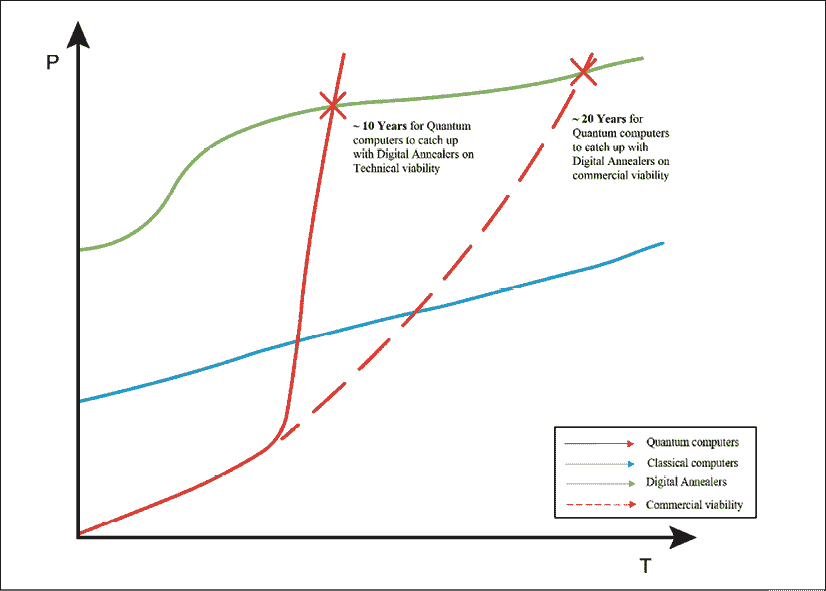

# 5

# 与戴夫·斯内林博士的采访，富士通研究员

在书的前几章中，我提供了关于量子计算和区块链技术的技术细节。我讨论了这两种技术在不同行业中的用例。我讨论了这些技术有几个共同之处，并且有技术上的原因让我觉得它们彼此之间的碰撞是不可避免的。然而，当我们从商业利益的角度看待问题时，我们会发现它们在很大程度上是相辅相成的。

书的第一个目标是建立这两种开创性技术背后的技术概念。一旦我们讨论了这一点，书的重点就转移到了这些技术的*作用*上。我想要确立这些技术随着时间的推移将在我们生活中占据越来越大的地位。然而，当我们缺乏那些第一手正在努力使之成为现实的技术工作者的观点时，这还不是一个完整的画面。

在本章和随后的章节中，我将发布与量子计算专家的采访内容。这些采访对我来说开了眼界，特别是我们讨论了大规模改变人们生活可能性的地方。在本章中，我记录了我与富士通的戴夫·斯内林之间的讨论。

戴夫在富士通内担任过几个职位。他是一位富士通研究员和杰出工程师，人工智能项目总监，也是富士通欧洲、中东和非洲区首席技术官办公室的一员。在大学期间学习高性能计算后，他开始了他的职业生涯。在包括学术界在内的几次简短职业跳跃之后，他于22年前加入了富士通。

我第一次见到戴夫是在富士通伦敦贝克街办公室举办的活动上。戴夫介绍了数字退火器在金融和物流领域的影响。在他的演讲之后，当我被介绍给戴夫时，他被称为富士通数字退火器背后的智囊。一开始，我以为可能会是一个与科学家进行长时间技术交流的谈话。结果是，戴夫非常巧妙地谈论了数字退火器的实际应用。

我立刻意识到我必须为我的书采访戴夫。几个星期后我们再次见面，这次我向戴夫介绍了我的书的计划。我们在富士通办公室见面，戴夫很好地为我提供了关于量子计算更全面的观点。聊天的最好部分是戴夫拿起我的平板电脑画了一张图，表示量子计算机、经典计算机和数字退火器在未来二十年内的发展趋势。

然后，我们安排了一个采访的时间，并且戴夫就他如何看待量子技术在不同行业中的应用提供了他的见解。以下是采访内容：

**阿伦**：戴夫，非常感谢您同意接受这次采访。让我们从您如何涉足量子计算，并在量子计算领域的探索中进行简要概述开始。

**戴夫**：除非我把我的简历发给你，否则我刚离开研究生院的时候就开始了。我在研究生院学习高性能计算，然后加入一家在同一领域工作的初创公司来到欧洲。那家初创公司后来破产了，像很多公司一样。那是在 1983-84 年。之后我做了一点咨询工作，然后在莱斯特大学和曼彻斯特大学教书，主要是教授新型计算和面向对象设计。

然后我加入了富士通，支持他们在欧洲中程天气预报中心（ECMWF）的超级计算项目。从那以后我就一直在富士通工作。我最初在富士通的日子主要花在实验室里。我花了很多时间研究各种不同的事情，从高性能计算开始。

我开始研究网格计算，这是云计算的前身。在实验室的最后时期和过渡到业务部门期间，我开始研究人工智能。大约两年前，富士通宣布了它的数字退火器。我不得不迅速了解量子计算，并且我的过去经验有所帮助。所以，我推动了富士通的量子计算研究，但最初我是从商业角度考虑的。

我的技术背景是真正理解我所说的 *真正的量子计算* 面临的挑战是必要的。我还能够从技术和商业战略的角度解决数字退火器可以解决的用例。所以，这就是我现在所处的位置。在过去的一年里，我一直是富士通在数字退火器国际业务中的技术方面的负责人。

我的角色的一个重要部分当然是确保我的营销人员和我们自己的销售人员不会把产品销售成它不是的东西（他笑了）。我还确保在我们的内部和外部沟通中，我们清楚地表明我们在销售的东西不是量子计算机。这是一台数字退火器，但它在解决一些问题方面非常出色。

那些问题是什么？我们如何将它们映射等等？我就在这个阶段。

**阿伦**：非常感谢您。这很好地引出了下一个问题。您能告诉我们关于数字退火器以及它的起源吗？

**戴夫**：我可以告诉你数字退火背后的故事。它是由日本富士通实验室的一个团队开发的。我们在那里有一个历史悠久的定制技术设计团队。该团队确定了*组合优化*问题作为一个关键解决目标，这可能受到了早期D-Wave的一些发展的启发。这使得富士通有了市场为组合优化问题提供定制解决方案的迹象。

早在2011年，D-Wave开发了专注于使用量子退火技术解决优化问题的量子计算机（128比特）。

组合优化问题是指将数学技术应用于在可能解的有限集合中找到最优解的问题。可能解的集合通常由一组限制条件定义，并且该集合太大以至于无法进行穷举搜索。一个例子是旅行推销员问题，其中必须最小化总旅行距离，同时每个客户只能被访问一次。来源：[https://www.sciencedirect.com/topics/computer-science/combinatorial-optimization-problem](https://www.sciencedirect.com/topics/computer-science/combinatorial-optimization-problem)

实际上，它现在正在崛起。所以，时机刚刚好。然后，我们采取了纯科学技术方法。我们如何使这成为现实？数字退火器就是开发该技术的结果，该技术将解决量子应用程序的组合优化子集。

然后，它成为了一个完整服务的技术部分。现在，富士通提供这些服务跨越多个阶段，从确定问题是否适合组合优化开始。我们确保手头的问题足够大，值得为其提供严肃高性能的解决方案。小的组合优化问题不需要数字退火器。也有一些问题太大了。当然，我们正在努力解决这些问题。因此，该过程始于确定一个工业问题，然后真正的挑战是将行业内的业务问题映射到一个*二次无约束二进制优化问题*。

二次无约束二进制优化问题 QUBO 已经成为表示各种组合优化问题的统一模型，并连接了许多面临这些问题的学科。一种新型的量子退火计算机将 QUBO 映射到具有特定大小和边缘密度限制的物理量子比特网络结构上，引起了人们对将基础 QUBO 结构转化为具有较少节点和边的等效图的兴趣。来源：[https://dl.acm.org/citation.cfm?id=3160134](https://dl.acm.org/citation.cfm?id=3160134)

**Arun**：有趣。在此基础上，为什么我们需要这个Digital Annealer呢？为什么我们不能使用传统的机器学习技术来解决这些组合优化问题呢？

**Dave**：组合优化问题的性质是它们不适合精确解决方案。我最喜欢的例子是典型的背包问题。我可能在以前的对话中告诉过你这个，但是这里我会再给你一次。

**背包问题**：我们有27个物品（这是一个经过精心挑选的数字！）。有27个物品要放进我的背包里，我只能承载一定重量。我想在里面得到最大的价值。其中一些物品本身就带有固有价值，但也有物品之间的相互作用的可能性。例如，金戒指和钻石各自都有价值，但作为钻戒它们的价值更大。这种相互作用是积极的。

在我们的物品清单中，还有一只鸡和一只狐狸。这两者之间存在负面互动 - 它们不太可能和谐相处。你知道你不想把它们都放在背包里，因为那样你就有了一只死鸡和一只脏乱的狐狸：比只带其中一只的价值要低。

这种问题中的相互作用的复杂性在任何可使用的现代技术下都无法以可解决的方式解决。事实上，如果你每秒称重1000个背包，以尝试所有可能的组合，那么你将需要花费500万亿年来找到最佳组合。

我一直喜欢这样做，因为每秒1000个背包和500万亿年这样的数字是人们会停下来理解的。所以，这种问题是一个组合优化问题。在一定规模之上，即使使用Digital Annealer，你也不能可行地找到精确的解决方案。所以，你要找的是其中一种启发式方法。

**启发式**技术，通常简称为**启发式**，是指任何解决问题、学习或发现的方法，它采用了一个实用的**方法**，不能保证是最优或完美的，但对于即时目标来说足够了。来源：[https://www.101computing.net/heuristic-approaches-to-problem-solving/](https://www.101computing.net/heuristic-approaches-to-problem-solving/)

Digital Annealer使用的方法是模拟退火，这是一种非常有效的方法，可以找到局部最小值，然后找到更深层的最小值。

**图形处理单元**（**GPU**）是一种专门设计用于快速操作和修改内存以加速在帧缓冲区中创建图像，以输出到显示设备的电子电路。来源：[https://en.wikipedia.org/wiki/Graphics_processing_unit](https://en.wikipedia.org/wiki/Graphics_processing_unit)

所以，对于那种问题，我们可以在传统机器或 GPU 上使用启发式方法。我们有一个在 GPU 上运行的数字模拟器模拟器。它在 GPU 上比数字模拟器慢几千倍，但它可以很好地解决小问题，因为它可以模拟数字模拟器评估从一个状态到下一个状态的所有可能变化的方式。正如你所知，每个状态都被描述为一串比特。数字模拟器评估如果你改变了每个个体比特会发生什么，同时评估所有这些。现在，这大约是 130,000 路并行性——全部在同一块芯片上。

如果你尝试用一个 CPU 集群来实现这个目标，以使 130,000 个核心相互通信，你将会有一个庞大的机器。关于这样的机器你可能会联想到许多问题，其中一个最大的问题是你不能让所有核心每个周期都互相通信，而在数字模拟器中，这 130,000 个不同的情况可以同时被评估和比较。

当你尝试在 GPU 上做同样的事情时，你的效果比在 CPU 上好一些，但你仍然没有这种连接性。这就是数字模拟器的作用——对于特定类别的问题，有非常紧密的耦合。它只在一个包含 8,192 位的二进制域上进行模拟退火。

此外，还有一个冷却周期，当模拟退火器从一个可能的解决方案移动到另一个可能的解决方案时，会逐渐改变敏感度。这种自动冷却已经内置在硬件中。

一个模拟退火器需要一个冷却计划。如果温度太低，模拟器将无法摆脱局部极小值。当温度太高时，它将难以收敛到局部极小值。冷却周期需要根据模拟器的敏感度来计划。

除此之外，还有一些硬件内置来检测当你陷入局部极小值时。然后你可以编码你对该检测的敏感程度，然后硬件会自动地、临时地提高温度并重新开始搜索。你会升高温度以走出那个局部极小值，然后再次冷却下来，当然要记住你当时的位置。

有些情况下，如果你知道你的问题有一个将是最小值的数字，你可以得到实际的最小值。例如，在纯约束优化问题中，模拟器可以找到任何符合所有约束的解决方案。

**Arun**：你尝试过用你的数字模拟器解决背包问题吗？

**戴夫**：哦，是的，我们已经运行了一系列经典的组合优化问题，如图着色、最大割、背包问题和旅行推销员问题。对我来说，背包问题就像金融中的投资组合优化。因此，如果我能解决背包问题，我相信，我们就能解决金融中的投资组合优化。我要把(*股票*、*债券*、*衍生品*、*现金*、*大宗商品*以及以何种比例*)放入我的投资组合中？

权重是我被允许在投资组合上携带的最大预算，波动性是不同资产（如*股票*和*债券*）相互之间的行为方式。其中一些资产是相互协同作用的，其中一些资产是相互对抗的。在它们相互对抗的情况下，这是一件好事，因为你希望它们创造所需的多样化。因此，在那种情况下进行优化。

旅行推销员问题本身应该避免，因为纯粹的旅行推销员问题已经有了数十年的研究和数学支持，很容易解决。如果你对它进行变体，那就更有趣了。我们与宝马合作的项目之一是在汽车底盘上焊接。你需要焊接几道接缝。什么是完成所有这些焊接的最快方法？

经典的旅行推销员问题和焊接问题之间有几点不同。当你访问一个*城市*（焊接点）时，你必须在那里停留，直到你完成那个焊接。因此，与城市相关联的是一个时间。在焊接示例中，由于接缝是二维的，你会在地图上的其他地方出现，所以它有点像一个虫洞。

这是一个有时间延迟的虫洞，你可以从任一端进入，然后从另一端出来。现在，当你有了那些变体（从经典的旅行推销员问题开始），并且将那些类型的约束条件放入你的问题中时，你再也不会有一个可以在你的笔记本电脑上解决的经典的旅行推销员问题，因为它变得更加复杂了。

这样的问题完全在数字退火器的范围内。DA可以处理多达约90个接缝，并且甚至可以操作多个焊接机器人共享彼此的工作空间。所以，就像两个机器人一起工作，告诉对方，“当你在那边的时候，让我帮你做几个。”以这种方式工作，机器人可以更快地工作。在提高制造过程效率方面，我们取得了一些巨大的成功。

宝马和富士通正在研发一种由数字退火器驱动的解决方案，以提高宝马的制造流程效率。以上由大卫提供的解释涉及到该倡议，其中数字退火器解决了类似于旅行推销员问题的问题。宝马工厂有几台机器人负责汽车的几项任务。数字退火器正在被用来使机器人在组装汽车时更加高效。

**阿伦**：你能否透露你们在那个特定用例中所实现的效率的统计数据？

**戴夫**：对于那个特定的用例，宝马已经发布了一份新闻稿。

新闻稿透露了以下内容：

> “目前，原型量子计算解决方案可以计算出优化的七个焊接接缝路线。与富士通量子启发式计算数字退火器合作，一家主要的汽车原始设备制造商已经测试并优化了22个接缝，以更具成本效益地增加使用相同资源生产的汽车数量，而且即将将其提高到64个接缝（具有8192位规模），这将带来颠覆性的变革。”

**阿伦**：太好了。我对数字退火器的应用有一个问题。在过去的六个月里，自从我们开始讨论这个问题以来，我遇到了一些正在使用量子计算解决困难问题的人。这些问题涵盖了选举建模、交通管理、气候建模，甚至是衰退建模。在所有这些不同的可能应用中，哪些是低挂果呢？你们还关注哪些其他令人兴奋的领域？

**戴夫**：如前所述，我们正在研究制造业——就像与宝马的合作，我们正在优化制造流程。从某种意义上说，这是一个低挂果，因为我们知道如何解决这个问题，如果你能够提高生产以跟上需求，那么它会产生很大的影响，也就是说，无需建造新工厂。投资组合优化是我们正在研究的金融领域的另一个重要影响领域。

第二个领域是类似于偿付能力要求（SCR）的内容。能够找到一个足够安全的SCR的投资组合是很重要的。我认为这可能是我们尝试通过数字退火器进行的最复杂的计算。

**阿伦**：我更多地是资本市场的人，而不是保险专家。我了解SCR是价值风险（VaR）的等价物，对吗？

**戴夫**：它类似，但是它是来自于受监管要求驱动的保险行业。对于SCR，我们平衡了一个近似值，然后在平衡的资产组合上计算实际的SCR。数字退火器实际上并不是在解决SCR，而是在解决其代理问题。我们测试了代理行为与实际SCR完全一致。我们对这种流程感到满意。

我们会考虑风险价值，但我们还没有达到这一步。我们正在帮助我们的一位客户评估更频繁重新平衡、更高质量的重新平衡，或者能够使用更大的资产池来生成他们的投资组合的对业务价值的影响。但是，我还不能给你任何关于这方面的绩效数字。

**Arun**: 我对频繁重新平衡解决方案有一个问题。技术（数字退火器）如果你希望它能实现即时重新平衡，它可以做到。但由于交易成本，这样做会使其在财务上不可行。在您进行重新平衡并提供重新平衡建议的过程中，您是否也考虑了交易成本？

**Dave**: 在我们的方法中，关于重新平衡成本的处理是这样的：你可以进行评估并单独决定是否进行更改。因此，你可以每天评估一次，当变得经济上可行时，你可以执行投资组合的重新平衡。我们还对在任何时候变化的投资组合的百分比进行了一些探索。

我们可以以一种只有大约10%的资产发生变化的方式重新平衡，而且它们每次只变化2或3%。重新平衡可能是一个平稳的过程，而不是完全混乱的过程。否则，你基本上每次都在创建一个新的投资组合。但我们也可以编码约束条件，比如说，*给我一个新的平衡投资组合，其中只有5%的资产变化幅度小于10%*。这种灵活性和约束管理使我们能够处理交易成本。

**Arun**: 非常有趣。您在物流方面正在解决哪些问题？

**Dave**: 我们曾在日本使用数字退火器进行交通管理，在那里，你不再是单个的点对点旅行，而是同时有多个点对点的旅行。你可以想象一下一个出租车网络，它们经常走相同的路线，都经过城市的同一部分。如果你能告诉一些出租车走稍长的路以减少拥堵，整体上，每个人的旅程时间将缩短约40%。在他们进行研究的东京可能会奏效，因为出租车司机会照做。但在伦敦可能行不通。

**Arun**: 数字退火器在印度的道路上也行不通。你可能知道，在印度，人们更多地凭直觉驾驶而不是遵循交通规则，所以可能有更多的混乱，数字退火器可能难以应对。道路上的车辆和行人数量是伦敦的数倍，所以计算成本也会很高。

**戴夫**：是的，但这种方法可以在军事行动和自动驾驶车辆网络中发挥作用。这不是今天的市场，但却是可能发生的事情。在实际运输方面，一个更大的问题不是面包车开得怎样，而是我们在面包车上放什么？在一个场景中，面包车载着某物品在城市间分发，数字退火器被用来优化面包车的路线，这一点很相关。

这比只找出面包车的最短路径要有趣得多，也更具挑战性。其中一个例子就是 ATM 补充。现在这显然是一个消失的市场，但每个国家至少有一家银行将需要在几乎每个城镇都提供现金。所以，至少有一个客户需要这种应用。但问题并不是如何将现金尽可能有效地交付到站点，而是你要在哪个 ATM 放多少现金？

根据分配的现金量，你现在可能希望更少地访问那个地方来为 ATM 补充现金。因为你真正想做的是保证 ATM 在夜间的最小现金量。

还有一个关于工作轮班调度的问题类别，其基础是图着色。我得到的一个潜在客户有一个工程师网络。如果这些工程师必须出去修理东西，你会派遣哪位工程师？你会安排哪位工程师上班？你会在一周的哪一天派他们出去，以便满足所有的约束条件，比如他们都必须每周工作 37 小时？

我们还有一些限制，比如这些工程师每周需要休息 2 天。所有的工程师都必须工作一些晚班。当我对此建模时，我的第一个问题的版本远远超出了我在数字退火器中拥有的位数。所以，那个问题需要分区。这是我们[Fujitsu]解决方案周围包装的一部分。

即使我们将目标机器扩展到百万位，我们可能仍需要对问题进行分区。围绕分区的更大的解决方案将成为我们业务提供的一部分。我知道 D-Wave 的人有很好的软件用于分区，用于连接不良或连接较弱的退火器。第二代的 D-Wave 每个位只有 15 个最近的邻居。

在我们的芯片上，我们对每个位都有 8K 连通性，精度为 64 位。但当我们在芯片之间切换时，我们将面临类似的挑战。这与当我们尝试为手机组件周围的能量场进行模拟时，机械工程 CAD（计算机辅助设计）、CAM（计算机辅助制造）面临的挑战是一样的。你必须进行 3D 建模来构建你的网格，然后对网格进行分区以将其放入你的集群超级计算机中。对于多个数字退火器的分区是同样的问题。

**阿伦**：[分区解决方案]已经投入使用了吗，还是你正在计划或开发中？

**戴夫**：集群机器尚未上线，它还在实验室。集群软件仍在开发中。它的发布计划是在2020年。所以，离现在也不远了。

**阿伦**：我期待着。我们谈到了物流，我们谈到了金融服务，我们也谈到了交通管理以及劳动力管理。你在医疗保健领域做了什么吗？

**戴夫**：是的。制药业是最好的描述方式。用退火器的方法不是为了识别最终解决方案。而是寻找解决方案的代理，就像我们在保险案例中所做的那样。假设那是一个癌细胞，你知道你希望用你的放射性药物精确地锁定它。为了做到这一点，你需要想出如何设计你的药物，以便它只能针对那个细胞。结果发现，解决这个问题需要进行大量的分子模拟。

进行每一个这样的模拟需要几个小时（取决于许多因素可能需要数百个小时）的计算机时间，并且相关成本巨大。数字退火器的策略是我们从一个基本的分子结构开始，然后我们可以在上面添加东西。例如，我们可以以苯环（C[6] H[6]）开始。在苯分子中，你有一个由六个碳组成的环，每个碳都与一个氢键合。你可以替换氢，所以你有六个不同的位置可以放置50种不同的东西。这转化为六的五十次方种组合方式。

我们通过缩小范围，利用分子键能来确定产生可行分子的最佳候选者。这并不完美，但比空手没有好多了。还需要考虑邻近分子之间可能的相互作用。它们之间的键合也至关重要，因为这是一个约束条件。

这种模拟在药物设计中特别有价值。这是我们正在关注的一个领域。从市场的角度来看，数字退火器要进入这个领域还需要一些时间。制药行业乐于进行大量的化学测试，并且缓慢地采用新技术，所以这将是一个渗透挑战。现在，这就是医疗保健。

**阿伦**：蛋白质折叠是一个重大的建模挑战，如果我们做对了，我们可以加速药物发现过程。谢谢你谈到这个，戴夫。你认为量子计算的哪些领域会首先取得成功？

**戴夫**：在我看来，量子计算世界有三大广泛分类。有门式计算机，然后有退火器——数字退火器和量子退火器。此外，还有我所说的*模拟*量子设备，可以用来解决量子物理问题。在*模拟*类别中，你将你的量子设备连接起来描述自然界的问题。

这只是将自然编程到计算机中，这将比门限计算机更早产生一些结果。退火器会首先产生结果，因为我们现在就在用数字退火器做这个，量子退火器不会远在其后。但这些模拟量子设备将会介于两者之间。它们将在我们攻破RSA算法的门限计算机之前开始。这将带来一些重要的物理学发现。这主要是因为他们制造了一个量子设备，当它做它正在做的事情时，它正在回答一个更大的问题。

**Arun**: 有趣。所以，上次我们见面时，你给我画了一张图。我不确定你还记得吗？【下面是一张有些粗糙的图示：】

图 1：戴夫·斯内林绘制的草图，解释了计算范式的趋势

**Dave**: 是的，我记得。图上有一个点，数字解决方案和量子解决方案在那里交叉。一个是在可解性上交叉，然后是在价格上交叉。数字退火器最终将被商品化，这将逐步降低它们的价格，这将推动你的商业可行性曲线向右移动。

**Arun**: 你觉得这种趋势有什么好处？我记得你谈过这个问题。我们能简要讨论一下门限计算机和量子退火器的应用区别吗？

**Dave**: 门限计算机最大的一个问题是它非常简单。门限计算机在理论上将是图灵完备的。因此，任何你可以用图灵机描述的东西，你都可以放到量子门上。你可能可以将图灵机编码到一个量子门机器上，然后你就完成了。

图灵机是数学家艾伦·图灵在1936年构想出来的一种假想机器。尽管它很简单，但该机器可以模拟任何计算机算法，无论多么复杂。来源：[https://www.cl.cam.ac.uk/projects/raspberrypi/tutorials/turing-machine/one.html](https://www.cl.cam.ac.uk/projects/raspberrypi/tutorials/turing-machine/one.html)。图灵完备的编程语言或计算设备等价于图灵机，它可以实现任何算法。

以下只是我的观点。在某些方面，我认为门限计算机分散了市场对基于量子的解决方案的发展，特别是在我谈到的模拟空间中。在那个模拟空间中，可能有一些更易达到的成果，我们可以通过构建特殊用途的机器来实现。

现在，一种特殊用途的机器是量子退火器。它们编码了一个直接的哈密顿算符，然后最小化能量，这样你就可以用这种方式编写你的问题。组合优化恰好适用于退火。从这个意义上讲，数字和量子退火器解决了一个非常具体的问题。

我们有一个在退火器上进行整数分解的算法。它无法扩展到RSA级别，但确实有效。如果有人真的要建立一个密切耦合的百万位数字退火器，你可能会接近。但我们不会建立一个密切耦合的退火器。我们将建立一个集群，并且集群使其难以用作破解器（RSA）。

**阿伦**：有这么多机会来解决未解决的问题，当您去行业销售退火器时，您的主要挑战是什么？

**戴夫**：当我们与客户交谈时，市场推广策略是非常明确地表明数字退火器只解决一种问题。我们面临的最大挑战是让人们远离他们听到的关于量子人工智能和量子机器学习的信息。

**阿伦**：有趣。所以，这是我经常听到的一点。就是我们似乎被门控机器分散了注意力。

但他们没有意识到的是，量子计算给了我们一种将自然模型化到计算机中的方法。我们不是将物理学转化为数学，然后将其弯曲成计算机科学操作，而是直接将物理模型化为机器。在翻译过程中（从物理到数学到计算机），我们失去了很多质量信息，但在量子世界中，这种信息的丢失是不会发生的。

**戴夫**：嗯，我完全同意，因为那就是我一直在谈论的这个*模拟*量子计算机。现在我们几乎需要在*模拟*周围加上引号，否则人们可能不会理解我称它们为模拟的上下文。量子退火器处于中间地带，因为它们是一种通用的模拟设备。但如果您可以建立一个模拟设备来匹配您的蛋白质（在医疗保健示例中），然后让它达到最终的低能态，您就拥有了一切。

**阿伦**：我们之前见面时提到的一些内容是，对于一些组合优化问题，物流可能是最大的市场。我亲眼见过几个复杂的金融服务问题。例如，我们在金融服务中有风险管理，这是相当数据密集的。我们在这个领域处理数百万个数据点。如果我们可以使用退火器解决风险管理挑战，为什么物流中的优化会更难呢？是数据的维度使物流更难吗？

**戴夫**：从实际角度来看，在物流中对其进行编码是受约束驱动的。而例如投资组合优化空间，则主要由目标函数驱动。通常，当您描述一个退火问题时，您有目标函数。那就是您试图优化的内容。因此，当您尝试优化投资组合平衡时，您试图最小化您的风险。然后，您对此施加两个约束，一个是最大回报，另一个是最小花费。

你也可以将其编码为双目标函数，即用于平衡风险和回报的风险参数。之后，你可以根据总预算进行限制。这是问题的一面。

在物流空间中，一切都关乎约束。在编码过程中的约束会爆炸性地增加问题的复杂性。这是因为你通常通过将二次方项作为问题解决方案的一部分来编码约束。你正在利用信息空间的一部分来给代码添加约束，因此这使得利用这个信息空间来编码目标函数也变得更具挑战性。此外，有时你在物流中的约束会导致高阶多项式而不是二次的情况。

**阿伦**：转到另一个话题，我在研究半导体行业。量子比特电路的选择远不止是用于经典计算机的基于硅的半导体模型。正在使用不同类型的材料，采用不同的模型。那么你认为这将如何影响行业？如果不同类型的量子比特电路出现在这个领域，会摧毁半导体垄断吗？

**戴夫**：周围涌现了很多关于约瑟芬结的奇特技术，这些技术经历了一轮又一轮的炒作，然后陷入了沉寂。就我记得，约瑟芬结在几十年前就已经存在了。然后它们就消失了，现在又在这个量子伞下重新出现。你还有高温超导体。它们可能在流行与不流行之间来回。

约瑟芬结是通过将一层薄的非超导材料夹在两层超导材料之间来制造的。这些设备以布莱恩·约瑟夫森命名，他在1962年预言说超导电子对可以直接从一个超导体“隧道”穿过非超导障碍物到另一个超导体。来源：[https://www.scientificamerican.com/article/what-are-josephson-juncti/](https://www.scientificamerican.com/article/what-are-josephson-juncti/)

**阿伦**：最后一个问题，戴夫。量子霸权，你认为有人接近吗？

**戴夫**：不，根据经典定义来说，他们并没有。量子霸权也有其他定义，这是说*你在量子计算机上是否比在普通计算机上更快地解决问题？*从这个意义上说，是的，很多人即将接近量子霸权。

事实是，在半毫秒内解决问题非常令人印象深刻。但如果在一台笔记本电脑上可以在2秒内解决问题，这是否真的会改变你的商业模式？不会。所以这是量子霸权吗？是，但又不是。

如果解决的是每月都需要解决的问题，而在常规集群上可能需要花费 6 小时，那么你需要数字退火器还是量子设备？这只是一个纯经济上的问题。它并不受时间窗口的驱动。因此，量子至尊是一个肯定会引起关注的热词，至少在商业层面讨论时是这样的。只要有人想要说他们用量子计算机做了以前没有人能做到的事情，他们就可以宣称*量子至尊*，你知道这只是一个营销旗帜。

这里（是我）有一点愤世嫉俗的情绪，这是你不能归因于富士通的。量子至尊周围的很多炒作都是为了确保这种研究的资金。公司和研究团队利用这一点来吸引关注并获得研究资金。我特别希望在我们之前讨论过的*模拟*领域看到一些至尊存在。

我希望看到一些有意义的突破的其他领域是量子通信、量子传感（例如：重力传感）和量子成像。这些都是量子计算的令人敬畏的用例，利用了纠缠。例如，重力传感器非常敏感于重力。你可以感觉到有人在墙后走动，并且可以在量子设备上看到他们的重力特征。英国量子研究组织目前正在这个领域做大量工作 [1]。

**阿伦**：我大部分时间都在与从业者交流，不久将与英国研究组织进行交流。他们大多是学术界的人士。这本书主要关注这些技术的实际影响；然而，捕捉到研究世界的发展方向也是很好的。

**戴维**：完全正确。就我个人而言，我现在并没有关注研究领域。我忙于扮演从业者的角色，并解决工业问题。

**阿伦**：谢谢你，戴维，我占用了你很多时间。非常感谢你的见解。

**戴维**：非常感谢。我期待着看到成书的完成。

# 结论

我与戴维·斯奈林的对话非常有启发性，其中有几个要点。最主要的要点是数字退火器如何在未来几年内为量子计算机和退火器打开大门。从技术能力和商业可行性的角度来看，这种过渡都很有趣。

我想强调的另一个关键点是戴维对技术的*意义*的关注。基于门的计算机，那又怎样？量子至尊，那又怎样？等等等等。这对技术人员来说是一个重要的教训：非常重要的是要确定要解决的问题，然后将技术资源部署到解决方案中去。我经常发现技术人员创造出寻找问题的解决方案，这绝不是创新的好处所在。

很明显，戴夫对量子计算机的可能性充满热情。我们在本章讨论了几个行业中的使用案例。然而，戴维也警告我们不要过度兴奋于量子霸权周围的炒作。

我个人受到戴夫简化叙述的能力的启发。对于一个拥有多年实验室经验、长期技术背景的人来说，他的讲故事能力令人惊叹。最后但绝不是最不重要的，我真诚地感动于他在分享对这个行业的看法和想法时是多么脚踏实地和开放。

# 参考资料

1.  [http://uknqt.epsrc.ac.uk/about/uknqt-hubs/](http://uknqt.epsrc.ac.uk/about/uknqt-hubs/)
