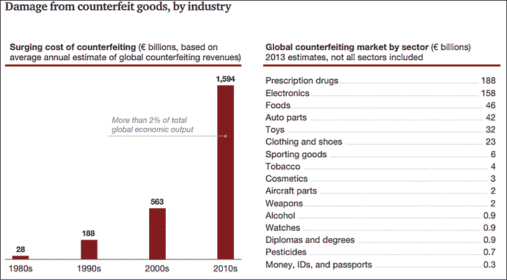

# 6

# 对医疗保健和制药的影响

我出生在印度最南端约75英里的一个村庄。我的父母在社会上地位相对较高，我们在成长过程中并没有面临任何经济挑战。因此，我在成长过程中个人并没有为了优质医疗保健而苦苦挣扎。然而，我见证了对于不幸的人来说提供的医疗基础设施或缺乏基础设施的情况。因此，当涉及医疗保健创新时，我感到一种目标感。

多年来，由于疫苗、诊断、药物和手术程序的进步，在医疗保健领域取得了几项突破。很难忽视这些成就。来源：[https://www.medpagetoday.com/infectiousdisease/publichealth/17594](https://www.medpagetoday.com/infectiousdisease/publichealth/17594 )

在医疗保健和制药行业内进行创新和改进的好处将会对全球许多人的福祉产生重大影响。我们将讨论该行业创新的背景，并涵盖以下几个领域，量子计算可能会带来重大改进：

+   药物发现

+   最后一公里药物分配

+   癌症诊断

*最后一公里* 这个术语是指配送网络的最终目的地。在这种情况下，它将指的是将高质量医疗保健带到新兴市场的农村人口的能力。

这些示例并不是可以从量子计算中受益的医疗保健用例的详尽清单。但是，它们应该展示了该技术的潜在好处。

# 创新的集会

了解医疗保健和制药价值链中的痛点至关重要，以发现像人工智能（**AI**）、区块链和量子计算等新兴技术的机会。在过去几年中，人工智能已经以前所未有的规模进行试验和应用，以解决其中一些问题。IBM对他们基于Watson的医疗保健能力表现得相当积极。

然而，在使医疗保健在全球范围内变得无缝、成本有效和包容性方面，还有很多工作要做。即使在像美国和英国这样的发达经济体中，医疗保健也是消费者（患者）希望看到重大转变的服务之一。

有几种创新趋势，如使用像巴比伦这样的应用进行远程咨询，或者使用IBM Watson进行临床决策支持，或者使用人工智能进行药物发现应用。IBM Watson尝试创建**Robo Doctor**，但由于其方法缺乏重点而面临重大挑战。

由于可穿戴设备、**物联网**（**IoT**）和物联网数据分析的融合，现在可以即时做出多个健康决策。这些工具还帮助保险公司确定客户支付的保费。

在另一方面，制药供应链正在呼唤更多创新。供应链效率低下，不透明，并且由于缺乏治理和控制而充斥着伪劣产品。

这并不意味着我们在医疗保健领域没有取得重大进展。艾滋病患者的预期寿命现在已接近正常预期寿命。印度成功根除了小儿麻痹症。再生医学致力于再生、修复或替换受损细胞的方法。它可以帮助患有骨关节炎的人，这是一个不断增长的问题，预计将有30%的成年人在11年内患有这种疾病。这些进展的清单还在继续，但在医疗保健和医学领域仍有很多成就需要实现。来源：[https://www.weforum.org/agenda/2019/05/healthcare-technology-precision-medicine-breakthroughs/](https://www.weforum.org/agenda/2019/05/healthcare-technology-precision-medicine-breakthroughs/)

在我的风险投资基金绿岸资本，我们遇到了有潜力在巨大规模上产生影响的医疗保健企业。技术可以将医疗保健带到亚洲和非洲等新兴市场的“最后一英里”。它可以帮助制药公司比以往更轻松地建模试验结果，并缩短药物上市时间。技术可以比以往更快地、更准确地识别基因疾病，如癌症。

每次我看到一份陈述一个开创性医疗保健机会的演示文稿的资金申请，我都充满希望。这就是医疗保健的特殊之处。我们在我的基金不断努力完善我们的投资理论。我们一致认为，健康和财富是我们不能忽视的两个行业。我相信，对医疗保健的创新和投资可能产生最大的社会影响。在接下来的章节中，我们将看到医疗保健为技术提供的机遇。

## AI医生

一切始于2011年2月，当IBM的沃森参加了一个名为Jeopardy的电视节目，与该节目的顶尖选手本·詹宁斯和布拉德·拉特竞争。直到那个时候，计算机能做的最多就是回答那些有非常明确和事实性答案的问题。计算机在处理涉及解释和回答过程中的细微差别的问题方面一直表现不佳。

Jeopardy节目看到IBM沃森从不同来源整合信息，并从中解释一个答案。在此之前，被开发用于执行类人交互的程序被认为是聪明的算法。然而，随着IBM沃森的出现，这一过程发生了变化。沃森被喂食了数百万本书籍、百科全书、小说和其他任何可用的参考文本。

每次提出问题时，沃森都会识别一系列可能的答案以及每个答案的一组证据。证据的质量是通过自然语言处理进行评估的。根据证据的质量和相关性，答案被分级。有几种算法同时执行相同的练习。随着更多的算法对一个答案进行排名，该答案的置信水平会增加。因此，沃森呈现问题的答案。

几年前，当我在普华永道工作时，我们正在评估IBM沃森以提供对监管和法律问题的答案。理念是将数百万条法律和监管文本输入IBM沃森中。在对沃森进行一段时间的培训后，IBM将其称为“沃森上学”，就可以投入商业使用。

我有幸并肩负责参与普华永道对IBM沃森进行评估的委员会。当时我们面临的最大挑战之一是让IBM沃森理解法律和监管语言。理念是，这种理解应该允许与用户进行自然语言对话。

随着时间的推移，沃森将通过提问的方式由法律和监管专家进行培训。当沃森回答问题时，培训者会对答案进行反馈。经过数次重复这一过程后，沃森应该会随着时间的推移学习并提供更准确的答案。

这正是IBM对医疗保健的愿景。医疗记录数据，研究，临床试验信息，医学书籍和其他参考资料都被输入到IBM中。在咨询时，医生将与患者进行面谈，医疗评估将由IBM沃森协助进行。

当患者提供有关其健康状况的信息时，顾问会使用IBM沃森参考庞大的信息库。IBM沃森会利用其拥有的广泛知识库查找与患者诊断相关的信息。然后，顾问可以参考该信息对患者进行评估并提供健康建议。

IBM对沃森的愿景是将其用作为癌症患者提供治疗的人工智能医生。然而，多年来，该系统的性能并没有达到预期。IBM有超过13,000个医疗保健客户尝试该解决方案。尽管如此，沃森的准确性仍然不及预期，导致医院客户的流失。这也导致2018年认知技术收入下降了6%。来源：[https://seekingalpha.com/article/4212897-watson-failing-deliver-ibm](https://seekingalpha.com/article/4212897-watson-failing-deliver-ibm )

IBM Watson的低准确率的主要原因是缺乏高质量的专业数据。IBM在医疗保健领域追求了一个非常广泛的用例。因此，为Watson引擎获取的数据是广泛且浅薄的。然而，要想提高人工智能的准确性，数据需要是精细且深入的。在应用领域需要高质量的数据来使其成为人工智能的可行模型。

工作所选择的两个医疗保健领域是肿瘤学和基因组学。这两个领域对人工智能来说都很复杂，而且医学术语构成了一个主要障碍。2018年，IBM Watson的领导层由于所有这些挑战引起的负面公关而发生了变化。沃森的健康主管黛博拉·迪桑佐辞职，并由当时担任认知解决方案和IBM研究高级副总裁的约翰·凯利接替。

使用人工智能在医疗保健领域也有成功案例。根据高地肿瘤学团队的一家诊所的评论，沃森在客户的预筛选过程中取得了78%的更好表现。然而，由于其固有能力来对自然进行建模，量子机器学习可以更好地帮助医疗保健领域。

2019年7月，埃森哲成功获得了第二项用于量子计算的美国专利。该专利是针对他们的“量子计算机学习模块”，该模块可以训练人工智能模型在任务的适用性上选择经典的或量子的计算模块。来源：[https://patents.justia.com/patent/10095981](https://patents.justia.com/patent/10095981 )

埃森哲在使用量子启用的方法进行分子比较方面取得了重大突破。他们与称为Biogen和1-Qbit的公司合作，创建了增加诊断和药物发现过程效率的量子计算模型。

## 医疗保健的最后一英里

最近，我采访了我2003年毕业的阿姆里塔大学的人工智能/量子研究负责人。她向我解释了在医疗保健中使用机器学习的应用案例，更重要的是在新兴市场的背景下。我们还讨论了量子机器学习如何帮助提高能力到一个全新的水平。

阿姆里塔大学位于印度南部科伊甘拜尔市以外的一个叫埃蒂马代的村庄，距离城市有20公里。埃蒂马代是该大学的工程学院所在地。20年前教授我**数据库管理系统**（**DBMS**）和**面向对象编程**的B.拉贾蒂拉甘博士，现在正在领导人工智能和量子机器学习研究。

她的其中一个主要标准是研究工作的成果。在我们的交谈中，她一直在强调通过她的研究工作在社会中产生影响的重要性。因此，我们花了一些时间讨论她的博士和硕士学生试图解决的问题。

安德玛大学已经采纳了101个主要由部落人口居住的村庄。这些村庄大多没有医院，最近的医院至少有20公里远。在印度这些地区提供最后一公里的医疗一直是一个挑战。

提供最后一公里的医疗涉及以下步骤：

+   持续监测健康状况

+   数据云托管

+   识别个体及其数据

+   对数据进行诊断

+   提供即时的解决方案

这个过程可以重复进行。技术如何帮助这些步骤呢？

健康状况的监测可以是自动或手动的。可以有医生定期造访这些村庄，并进行基本测试，并通过电子方式获取结果。这个过程也可以通过使用物联网的诊断设备进行自动化。

使用无人机摄像头也可以自动捕捉健康状况。可以使用深度学习图像识别算法来识别贫血、抑郁和脱水等问题的症状。量子机器学习可以增强这种能力，可以为不同的健康状况提供诊断结果以不同程度的信心。

**量子图像处理** (**QIP**) 丰富了现有图像处理技术的能力。使用经典信息处理技术需要大量的计算资源。当使用QIP时，存储* N *比特信息发生在* log(2N) *量子比特中。听起来有希望的两种图像处理方法是**量子傅里叶变换** （**QFT**） 和** 量子小波变换** （** QVT **）。使用量子比特来存储图像信息的附加优势是可以利用叠加等属性。

每个村庄的中央办公室可以放置一些基本的诊断设备。村民可以进入办公室，使用国家身份证（Aadhaar）进行身份识别并使用设备。设备会将详细信息发送到云托管服务器，并附有村民的标识符。

一旦数据上传，机器学习算法将协助远程的医生进行诊断并开处方。药物将按照处方分发到这些村庄。利用量子退火过程可以使这个分发过程变得更加高效。

假设在这101个村庄中，大约有50个村庄每个有大约5个疾病。这就是需要治疗的2,500种不同的健康状况。假设每种状况平均需要2种药物来治疗。按照这些假设，需要分发5,000种药物（2500 * 2）。

每天源和分发这么多药物的物流工作并非易事。并非所有这些药物都可以从同一供应商采购。在计算向这些村庄分发药物的最佳方式时，需要考虑道路状况、天气情况和疾病的严重程度。

记得我们在*第二章*、*量子计算-关键讨论点*中讨论过的旅行推销员问题吗？这是量子计算的一个极好的模型使用案例，也是解决涉及多个相关变量的物流问题的一种方式。在这种情况下，由于缺乏基础设施所造成的摩擦是一个重要的需要建模的变量。

要解决这个问题，可以使用绝热量子退火器。道路状况、天气条件和疾病的严重程度都可以被建模到绝热量子退火器中。从退火器的最低能级解决方案中得出分发药物的最优解。

退火器的能量空间将由所有真实世界问题组成。一个村庄的疾病增加和其相邻村庄受到影响之间的相关性是另一个需要建模的重要因素。当所有这些变量被编码进入时，我们将会看到一个有着高峰和低谷的能量空间。

然后我们使用量子隧道穿越能量景观。在这个过程中，我们识别出低谷而无需攀登高峰。最终，最优解由系统的最低能量级给出。

同样，也可以通过雇佣一组低技能劳动力来手动完成所有这些分发工作。在印度，劳动力成本低，特别适用。然而，要想在印度其他地方和全球范围内复制这种可扩展的模型，必须集结几种新兴技术的力量。

在加纳，医疗用品最近通过无人机100%准确地分发。在目前阶段，将这一模式扩展到大规模商业环境下使其无法持续。然而，随着无人机技术的普及化，医疗保健的最后一英里交付将成为其中一个主要的使用案例，而驱动这些无人机的智能可能由量子计算机提供支持。

我们需要集成一整套技术才能实现这一切。

+   物联网用于数据采集

+   区块链用于数据完整性和患者身份管理

+   机器学习（经典和基于量子的）用于诊断

+   量子退火器模拟药物分发

+   无人机执行药物分发

许多这些领域在阿姆里塔进行研究。他们正与医疗设备供应商合作建立基础设施。他们的研究人员正在研究软件算法，这些算法将帮助解决从诊断到无人机智能等多种使用案例的问题。

我无法感谢我的教授，让我一窥这些技术融合所能带来的可能性。在西方，我们经常生活在一个泡沫中，没有考虑到可以在规模上解决这样基本的问题。然而，当我们设法做到时，我们看到全球范围内发生跨越式的时刻。当这些村庄的医疗保健变得可能通过技术实现时，这可能成为其他地区效仿的案例研究。

## 癌症诊断和治疗

在前一节中，我们简要涉及了量子机器学习在疾病诊断和治疗中的应用。让我们花一点时间来理解量子计算可以产生深远影响的一些领域。

人类曾经为治愈疾病而战斗，随着医疗保健和药物领域的进步，几个世纪以来已经克服了许多疾病。但仍有一种疾病我们尚未掌握，那就是癌症。数十亿美元正在投资于肿瘤学领域；识别和治疗癌症。还有一些旨在开发某些类型癌症疫苗的倡议。

但是，识别和治疗癌症的过程并不容易。世界上大约有200种癌症类型。

癌细胞存在于我们大多数人的身体中，但只有当这些细胞迅速增长并支配身体中的健康细胞时，它们才会成为问题。这可能达到一个程度，使得正常细胞无法在人体中发挥功能。导致细胞变为“癌性”的原因尚未完全理解。

癌症的几个潜在原因。如果健康的人体持续暴露于致癌物质，这可能会触发癌细胞。其他原因包括接触辐射、吸烟和缺乏运动。当这些外部因素之一触发细胞的癌性行为时，主体开始出现症状。

触发因素的多样性、不同类型的癌症以及它们作为症状表现的方式使得及时诊断更加困难。癌细胞聚集在肿瘤形成。肿瘤的大小、肿瘤的状态（恶性或非恶性）以及转移状态确定了应提供的治疗方式。

转移表明癌症从身体的一部分扩散到另一部分。癌细胞发生的部位以及癌细胞扩散的速度是治疗中需要考虑的因素。

印度博帕尔技术学院发表的一篇研究论文指出了一种利用Shor算法识别癌症治疗的方法。该方法建议将Shor算法递归地应用于数据集，以识别癌症类型。数据集包括肿瘤大小、转移状态和结节状态（恶性或非恶性）。

Shor的算法用于解析数据并识别癌症的阶段。然后进行凝聚式聚类以逻辑分组结果。这个使用量子算法的过程已被证明比经典方法识别和分类癌症要快得多。经典方法需要数小时才能得到结果，而这种方法已被证明在几秒钟内即可获得结果。来源：[https://www.omicsonline.org/open-access/quantum-computing-based-technique-for-cancer-disease-detection-system-jcsb.1000095.pdf](https://www.omicsonline.org/open-access/quantum-computing-based-technique-for-cancer-disease-detection-system-jcsb.1000095.pdf )

前述方法使用Shor的算法来对癌症类型进行分类和识别。然而，治疗的患者需求是多样化且复杂的，可能从手术到化疗不等。这更多地是一个优化问题，将取决于患者是否会从特定类型的治疗中受益。

量子退火可以解决优化问题。诊断涉及的因素、患者的属性以及受癌细胞影响的身体部位将需要在能量空间中建模。当前的过程涉及浏览数百个变量以确定一个杀死癌细胞而不影响健康细胞的最佳计划。

系统的最低能量状态将确定癌细胞的治疗计划。使用量子计算还可以提供所有选项及其适用性的整体视图，以及它们所关联的置信度程度。

## 药物发现

药物发现是发现、测试和推向市场新药物的过程。将一种新药物推向市场的成本约为26亿美元。这个过程需要数年时间，经历数个临床试验阶段，然后进行监管审批。

由于这个过程，超过90%的候选药物在上市过程中失败。不同因素如疾病类型、生物标志物和行业影响着药物发现过程的成功。一些领域的成功率较低。基于几项研究，肿瘤学的成功率约为5%。来源：[https://www.ncbi.nlm.nih.gov/pubmed/29394327](https://www.ncbi.nlm.nih.gov/pubmed/29394327 )

有几个尝试使用机器学习来预测临床试验的结果，以减少将药物推向市场所需的时间。其中一种尝试专注于模拟健康细胞和癌细胞对不同水平的糖和氧气含量的行为。

健康细胞和癌细胞行为的差异可以通过它们的脂质、酶和蛋白质的数据来展示。这些数据对颠覆药物发现过程非常有用。这个领域长期以来一直采用试错的方法，需要更加科学化的方法。

几家初创公司致力于改善制药行业的这一过程。它们使用了经典计算和基于量子计算的机器学习的混合方法。Benevolent AI是一家总部位于伦敦的初创公司，从多个临床试验和患者记录中获取数据，并模拟它们之间的关系。

自然语言处理技术用于为进行药物发现过程的科学家提供见解。该算法使用了跨多种研究疾病、疾病症状、涉及的蛋白质以及提出的药物的数据维度。

利用这些智能，企业可以缩短药物发现周期，并比传统方法更快地将药物推向市场，从而为制药行业节省数十亿美元。

另一个量子机器学习可以应用的关键领域是蛋白质建模领域。人体由数十亿个细胞组成，蛋白质是这些细胞的重要组成部分。了解蛋白质的结构和折叠机制对于理解细胞行为至关重要。

蛋白质折叠是由诺贝尔奖获得者安芬森（Anfinsen CB）首次揭示的，已有50多年的历史。我们在理解蛋白质在我们机体功能中的重要性方面取得了极大的进展。我们已经确定蛋白质折叠与阿尔茨海默病、糖尿病和帕金森病有关。

蛋白质由氨基酸组成，当这些组成部分结合在一起时，它们可以呈现不同的形态。异常的蛋白质折叠可能导致多种疾病。此外，随着年龄的增长，身体难以阻止错误折叠的蛋白质的产生。这解释了为什么随着年龄增长，我们对疾病的免疫力会降低。

有几种尝试对蛋白质行为建模。然而，这是一个具有挑战性的过程，因为它取决于氨基酸的极性以及它们与细胞中的水环境的相互作用。建模蛋白质行为对我们理解疾病至关重要。

传统计算机并未能够很成功地做到这一点。旧金山的XLabs等公司正在利用量子计算来解决这一基本问题。

Biogen已与1-Qbit和Accenture合作，寻找治疗多发性硬化、阿尔茨海默病和帕金森病的潜在解决方案。一旦确定了工业解决方案，患有这些病症的患者将受益最多。

艾森图公司被授予了两项量子计算专利，他们已经开始创建试点项目，以解决规模化药物发现问题。其中一项专利（专利号10095981）侧重于使用多状态量子优化引擎的解决方案。该引擎根据要解决的任务调用不同的量子设备。引擎调用的设备可能是退火器、模拟器或门基量子计算机。

艾森图公司被授予的另一项量子计算专利（专利号10275721）是针对一个机器学习模块的，该模块具有根据任务性质将任务路由到经典设备或量子设备的能力。

多状态量子优化引擎被用于开发基于量子的分子比较的突破性解决方案。预计这一解决方案将极大加速药物发现的过程。查看以下来源以了解更多信息：

+   [https://www.ncbi.nlm.nih.gov/pmc/articles/PMC6205278/](https://www.ncbi.nlm.nih.gov/pmc/articles/PMC6205278/)

+   [https://www.quora.com/Why-is-protein-folding-an-important-problem-What-are-its-applications](https://www.quora.com/Why-is-protein-folding-an-important-problem-What-are-its-applications)

+   [https://patents.justia.com/patent/10095981](https://patents.justia.com/patent/10095981)

+   [https://patents.justia.com/patent/10275721](https://patents.justia.com/patent/10275721)

我们已经讨论了机器学习在医疗保健领域的应用和好处，以及使用量子计算可以实现的规模。在接下来的一节中，我们将看一些区块链可以解决的问题。再一次，我们将看到这两种技术的商业应用几乎没有冲突点。

## 医疗保健中的区块链

通过简单的谷歌搜索，你可以找到区块链在医疗保健中的应用的世界各地信息。然而，许多这些区块链应用似乎并不真正需要区块链。这些应用大多可以使用传统的数据库管理系统执行。在已经存在多个痛点的困难价值链中，区块链会带来额外的开销和可扩展性挑战。

话虽如此，在医疗保健领域有一些区域，区块链技术在目前形式下可以提供帮助。如果解决了一些技术限制，它将更有用。区块链潜力的一个关键领域是健康保险。我在金融服务章节中没有详细讨论保险，但我是那些认为区块链将比银行业更有助于转型的人之一。

## 保险

我们中许多人在保险单上提出索赔时都经历了一段艰难的时期。 如果保险公司找到他们条款和条件中的漏洞不支付客户的索赔，这对客户是残酷的。 在我生命的大部分时间里，我尽量避免购买保险，因为我确实相信这更多的是一个麻烦事。 然而，当我有了一个家庭，我必须确保我为他们所有人购买了健康保险。

那并没有让我的保险体验变得更好。 几年前，我妻子生病了，我打电话给我的医疗保险公司。 我们在签约时提交了她的健康详情，而这次疾病与她以往的任何状况都没有关系。 我们甚至有我们的顾问的意见，他们并不是相关状况。 然而，保险公司拒绝支付索赔，因为他们认为这个状况不是新的。

那时我们的重点是让她接受治疗，所以我们只是经历了这个过程，没有保险覆盖。 如果这个过程给我们造成了更大的损失，或者如果这发生在财力较弱的人身上，那将有人命堪忧。 对整个家庭来说都是一个痛苦的经历。

从那时起，我遭受了保险公司或与他们打包其他服务的中间商的恶行。 出于所有这些令人大开眼界的经历，我相信智能合同将不得不被使用。 我可以看到几种技术的应用汇聚，使健康保险发挥作用。

我改变了我的医疗保险提供商，希望找到更好的服务。 我现在使用Vitality，他们更注重技术。 他们已经成功创建了一个生态系统，向他们提供有关他们客户的信息。 例如，我的Fitbit和我妻子的Apple Watch都连接到了Vitality App。 我的月度保费是由这些智能设备发送给Vitality的数据决定的。 如果我度过了一个很活跃的月份，我的保险费就会更低，反之亦然。

这是一个相当不错的开始，保险公司提供透明的框架来收取保费。 他们在保险索赔过程中可以进一步保护客户，构建一个无缝的流程和体验。 这个过程可能看起来像这样：

1.  在签署保险时，我向我的保险公司提供了我的健康详情。

1.  他们与我的医生核实这些信息。

1.  智能合同用于保险的两个方面：

    +   计算保费的框架。

    +   释放索赔的一套清晰规则。

1.  保险公司使用智能设备收集有关客户的数据，并定期将其发送回给他们。

1.  保险公司可以使用这些数据来定价保费。

1.  如果智能设备在任何时候识别出必须释放保险索赔的情景，它应该无缝地发生。

1.  例如，如果我的可穿戴设备的数据表明我生病了，并且这并未被登记为已知病症，那么就需要一个自动释放索赔的过程。

1.  索赔流程可以由保险公司触发（而不是客户追求保险公司）。

1.  触发器可能需要客户批准索赔的释放，并承认可穿戴设备在适当时候引起警示是正确的。

保险公司不应该在索赔过程中需要任何手动干预。这可能为保险公司创造主观性。通过物联网的数据实时采集，他们可以更主动地与他们的客户互动。因此，他们可以实时响应索赔场景，即使没有客户追逐他们。

不仅仅是客户会通过健康保险的适当数字化受益。保险公司可以利用他们从这些物联网设备捕获的健康数据进行多方面的洞察。这些数据可以通过机器学习模型来预测客户可能会面临的未来健康问题。这可以帮助他们警告客户可能出现的未来状况。

对于保险公司来说，更有用的是他们利用这些健康数据，为客户未来的保险费用定价。如果客户的可穿戴设备指示出活动减少、睡眠减少、工作时间加班、水消耗减少和心跳不规则等情况，这可能表明客户患病风险较高。

假设通过可穿戴设备捕获的数据表明客户患心脏病的风险增加了。保险公司可以就此与客户联系，并主动确保客户了解他们的健康状况。如果客户忽视了这一警告，那么保险公司可以表示他们将提高他们的保费。

同样地，假设一个客户提出了治疗疾病的索赔。如果保险公司捕获了治疗后的健康数据，可能会显示客户的健康正在逐步恢复。在这种情况下，数据可以用来降低客户的保费，从而奖励良好的习惯和行为。

在所有这些场景中，智能可以用来优化客户将要支付的保费金额。在这些场景中，区块链的好处是以合同结构化保费金额和索赔款项的释放，如果智能成立的话。

另一个新兴的用例是面部识别技术的使用。商汤是世界上规模最大的人工智能初创公司，从一项研究发展成为一家四年内市值达到45亿美元的公司。他们在保险业中有着有趣的面部识别技术的应用。如果客户提出了索赔，他们将经历一个面试过程。

AI引擎在面试过程中扫描客户的面部，并根据面部表情提供诚信评分。该诚信评分用于决定索赔是否真实。从那里开始的一个改进是创建一个智能合约，如果诚信评分超过阈值，则会触发索赔支付。

区块链的一个关键应用是不可变的追溯性。全球范围内，由于缺乏追溯性和供应链握手机制，假药已成为一个蓬勃发展的产业。现在让我们看看如何利用区块链来解决这个问题。

## 制药供应链

我们讨论了量子机器学习如何帮助药物发现过程，并减少制药行业的成本和上市时间。然而，该行业今天依赖的供应链需要进行重大改革。这在一些新兴经济体尤其如此，其中假药每年给制药行业造成数十亿美元的损失。

一份关于假药的PwC报告将其称为每年赚取超过1500亿英镑的最有利可图的非法市场。更令人担忧的数字是因消费这些假药而“数百万”人丧生。在发达市场，大约有1%的药物是假冒的，但在非洲等市场，这个数字高达70%。

由于数字经济的发展，近年来假冒商品在全球范围内广泛传播。根据世界卫生组织（WHO）的数据，约有50%在网上销售的药品是假药。与假药的斗争已经广泛展开，但只取得了零星的成果。

尽管像制药安全协会、美国食品和药物管理局以及世界卫生组织这样的组织已经做出了努力，但仍有很多工作要做。制药公司很难投资于打击假药，因为它们已经负担了较高的药物发现和监管成本。因此，保持药品市场的清洁并不在它们的优先事项之列。

结果，我们仍然有一个蓬勃发展的药品伪造市场。在销售药品的50,000多个在线网站中，95%的网站没有获得监管批准和行业标准。因此，假药市场已被大公司和组织归类为一个无法承受的弱点。然而，每年有超过450,000人死于对疟疾的无效和假药。任何一种每年夺走这么多人性命的因素都需要有组织地进行处理。PwC报告中的以下图表突出了假药的利润情况：

图1：关于假药市场的统计数据。来源：[https://www.strategyand.pwc.com/report/counterfeit-pharmaceuticals](https://www.strategyand.pwc.com/report/counterfeit-pharmaceuticals )

该问题的解决方案是，几家机构和制药行业提出了大规模序列化和跟踪药品在其供应链中的方案。大规模序列化涉及在药品包装上使用条形码。药品及其对应的代码在制造点中央注册。然后，在供应链的几个步骤中扫描条形码以确保它们看到的是同一种药品。

然而，挑战在于许多这些系统已被伪造者攻破。因此，条形码和大规模序列化工作只解决了部分伪造尝试。需要更难破解和更安全的更好解决方案来解决这个行业，与假药进行有组织的斗争。

正如本章前面提到的，我在印度南部的一个村庄长大。我一生中的大部分时间都见证了破碎的医疗保健的负面影响。印度可以说是全球假药的中心。以下是关于印度及其在假药市场中的角色值得知道的一些统计数据：

+   以消费量计算，印度制药行业是世界第三大制药行业

+   然而，全球35%的假药来自印度

+   印度向世界200多个国家出口药品

无需多言，为了世界和印度的利益，印度的药品供应链需要进行严肃的改革。

在*第14章*，*与IBM合伙人Dinesh Nagarajan的访谈*中，当我们讨论区块链的应用时，我们发现供应链是其关键的行业应用之一。区块链可以成为食品、药品和商品等行业的出色跟踪机制。我看到世界各地有几家初创企业正在利用区块链框架的跟踪功能。

一家名为Chronicled的初创公司，总部位于美国，为医疗保健设立了一个名为MediLedger的区块链联盟。区块链将用于注册并跟踪药品在供应链中的每一步。账本的一个关键原则是只有制造商可以创建并附加药品的标识符。如果药品的标识符在其供应链的任何其他地方被篡改，它将被区块链标记为伪造品。

至少在美国，**药品供应链安全法案**（**DSCSA**）正在强制要求制药公司拥有可互操作的系统，并可以通过供应链跟踪药品。使用区块链可以确保这种互操作性直接从系统中获得，而不必通过昂贵的系统和流程集成工作来开发。

在这个领域使用区块链的优势如下：

+   联盟必须遵守的规则可以事先商定并编码到区块链中。

+   没有单一实体可以更改供应链详细信息。

+   区块链允许条目，不允许删除。因此，每次录入分类账都会被审计和跟踪。

+   控制的分散性，以及前述特征，使得篡改变得困难。

MediLedger财团使用**零知识证明**（**ZKPs**）来强制执行治理和控制，而不需要各个节点（公司）彼此分享详细数据。ZKP是一个简单的框架，允许区块链上的某人提供适当水平的信息以证明他们满足某个条件。

例如，如果我向银行申请贷款，银行将需要访问我的信用评分。使用ZKP，银行可能只需要知道我的信用评分范围，就可以决定我的贷款请求。在ZKP模型中，有一个证明者（我）和一个验证者（银行）。我应该能够说服银行，我向他们提供的信息是完整和真实的。但是，不应向银行分享更多信息。

我们生活在一个每产生一点数据都被谷歌、Facebook或亚马逊等科技巨头用来为我们提供更好服务的世界中。他们还将数据转售给第三方并赚钱。在这种情况下，ZKP可以作为确保用户控制其被这些服务提供商使用的数据的一种卓越方式。

回到我们的医疗保健示例，像MediLedger这样的系统可以提供适当水平的信息透明度，以阻止伪造企图。同时，在运输敏感药物的地方，信息不会过于容易地对所有方面可用。区块链在药品供应链中还处于早期阶段，但在大多数供应链用例中，这项技术看起来很有前景。

现在让我们转向区块链的下一个用例，即记录保管。重要的是要以安全可靠的方式存储病人记录。确保病人拥有自己的数据可能同样重要。让我们在下一节详细讨论这个问题。

## 医疗保健数据交换

在医疗保健领域，最大的挑战之一是可用性（或者说缺乏）高质量的数据。在医疗价值链的许多环节中，访问患者健康信息可以帮助做出更好的决策。现实世界的健康数据有助于提高研究质量、健康咨询和药物发现。

有办法为所有研究创建模拟数据。然而，它经常不能作为真实患者健康数据的良好替代。在过去，我一直愿意提供我的健康数据供研究使用。每次进行健康审查过程时，我都会被问及是否允许使用我的数据，我会回答“是”。

然而，最近我开始对数据隐私和安全影响有些谨慎。当涉及与医疗保健组织分享我的数据时，还有另一个关键原因需要谨慎。我坚定地相信自我主权身份。因此，我认为当我的数据被某处使用时，它需要以某种形式归属于我。

目前没有将隐私、安全和自我主权身份这三个方面结合起来的系统。如果有一种机制可以匿名分享我的医疗数据，用于研究或健康咨询目的，我可能更愿意这样做。

除了安全可靠之外，我希望能够追踪我的数据在哪里使用以及第三方使用我的数据赚了多少钱。需要有一种预先同意的机制，这样我才能从分享我的数据中获益。

Ponemon研究所对503名受访者进行的一项调查发现，约有86%的受访者看到了由于患者身份错误识别而导致的医疗问题。80%的受访者认为，通过生物识别技术积极确认患者可以改善医院的现金流。来源：[http://promos.hcpro.com/pdf/2016-national-report-misidentification-report.pdf](http://promos.hcpro.com/pdf/2016-national-report-misidentification-report.pdf )

有一些公司试图利用区块链解决数据共享、版权和知识产权市场的问题。随着医疗保健数据共享，情况变得更加有趣和具有挑战性。像HealthVerity和Doc.ai这样的公司利用区块链作为医疗保健数据的市场。

通过这个市场，个人可以允许他们的数据被用于特定的研究。随着这项研究通过医学突破产生回报；该计划的收益分配给数据提供者。研究使用的数据存放在临时空间中，直到研究完成，然后被删除。

尽管区块链目前由这些初创公司发起，但计划是将生态系统发展成为类似以太坊的生态系统。这将有助于真正去中心化个人数据的所有权和管理。在这种模式中，任何想要出售自己数据的人都可以将其放在市场上。想要数据的第三方可以对其进行竞标并利用它。区块链网络可以验证交易并将其记录在链上。参与验证的节点可以得到奖励。

随着这个去中心化数据共享治理过程的扩展，医疗健康市场可以成为主流。现在让我们看看智能合约如何使医学研究更加高效。

## 研究治理

在 *第 8 章*，*对治理的影响* 中，我们看到了区块链如何在全球范围内被用于政府的有效运作。原则上，区块链框架可以用于任何在启动过程之前达成合同条款的情境。随着过程的进行，每次满足合同条款时，一系列行动就会被触发。

在区块链上跟踪这些合同义务时，每一步进展都可以被数字时间戳化。可以根据这些合同义务启动并执行服务级别协议。然而，使用区块链进行智能治理的最重要的方面是可以消除合同决策中的人为偏见。

长期以来，医疗研究一直是一个运营效率低下的机器。医疗研究中的一些低效率包括：

+   研究目标和成功标准通常事先没有达成一致。

+   缺乏在整个研究过程中的里程碑设计。

+   研究人员受到人类偏见的影响，并且可能会在试验进行中更改标准。

+   负面结果通常不会被发布。

+   跨医疗系统的互操作性难以实现，因此，数据采集和集成可能是一个挑战。

+   研究步骤的审计轨迹通常缺失，因此很难从历史信息中识别出所学到的教训。

+   对于大多数涉及的主要利益相关者来说，研究的实时视图不可用。

随着所有这些痛点，医疗研究真的在呼唤一个解决方案来实现运营效率。在考虑以下步骤时，区块链可以帮助解决这个问题：

+   所有一项研究的关键利益相关者都被注册为区块链上的一个节点。

+   研究条款、结果和结果的成功标准事先已经达成一致。

+   所有中间里程碑都已经了解，并已达成指示性时间表。

+   已经达成关于研究活动的成功和失败的发布政策。

+   从多个系统获取/共享数据的任何要求已经确定，可能可以作为 Oracle 导入到区块链中。

将所有这些内容达成一致并加入区块链的好处是巨大的。之前提到的每一个摩擦点都可以得到解决，过程可以在几乎实时的基础上得到无缝管理和监控。然而，将医疗数据加载到区块链上并非没有挑战。

医疗数据比大多数其他信息更敏感，并且对于任何发现的违规行为都有严重的监管影响。因此，数据可能必须以一种综合且相关的方式共享。但使用数据的第三方不应该能够识别出拥有数据的患者。另一个挑战更具政治性质。

制药企业一直以来对变革抱有抵制态度。在美国，从纸质记录转向电子记录需要颁布主要监管法案（HITECH法案）。因此，要看到他们如何在规模上采用区块链作为技术范式。与其他技术不同，对于区块链来说，生态系统中的大多数关键利益相关者必须参与其中才有意义。

因此，如果相当比例的制药行业不愿采用区块链，其他参与者利用这项技术产生任何影响将变得越来越困难。

# 结论

我在医疗保健章节中可能讲述了更多故事，因为我个人可以将许多医疗保健情景联系起来。在世界各地，这个领域存在着几个痛点。发达国家致力于提高现有流程的效率，如患者识别、记录保存、数据共享和隐私。而新兴经济体则需要解决更基本的问题。

新兴经济体在为其居民提供基本医疗保健方面存在着“最后一英里”问题。能够大规模及时、有效地提供医疗保健可能是当今人类面临的最大问题。在非洲、亚洲和拉丁美洲等地区，有数百万人无法获得基本医疗保健。

在致力于带来创新想法改变医疗保健的同时，关注发达市场和新兴世界至关重要。挑战的规模之大已经足够，单纯使用个别技术并提供零散解决方案已经远远不够。

能够用更精确的诊断和治疗方案治疗癌症等疾病是医疗保健能力的重大飞跃。蛋白质行为的建模可以帮助我们开发能够解决老年痴呆症等退行性神经疾病的药物。量子计算能够为药物研发流程带来效率，将试验期从10余年缩短至几年，有效节省数十亿美元。

需要使用能够处理数据价值链中所有接触点的技术。需要使用物联网和数据捕获医疗设备从患者处接收健康数据。这些信息必须被安全地妥善存储在系统中。然后利用这些数据创造智能洞见是非常重要的。基于这种智能，医疗诊断和治疗决策将需要使用机器学习。整个过程可以通过区块链跟踪，同时提供透明度和隐私的正确级别。仍然需要在链上和链下设计中进行协议级改进，以克服使用区块链的监管挑战。然而，随着技术的成熟以及许多架构解决方案的演变，数据监管不应再成为医疗保健的绊脚石。

在撰写这本书的过程中，我与全球各地的医疗专家进行了交谈。其中对我影响最大的一次讨论是我与我的导师B. Rajathilagam博士的访谈。也许，我对此有更多共鸣，因为我在那些村庄及周边度过了四年的时间。也许，这更令人鼓舞，因为它是一个医疗应用。但最重要的是，也许，那是我们可以帮助拯救生命并每天看到实际结果的地方。

医疗创新将继续激励我，我希望我们能看到越来越多能够改变人们生活的令人激动的技术。
