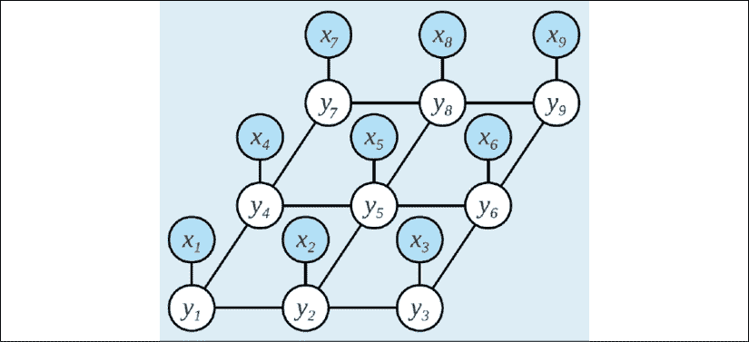
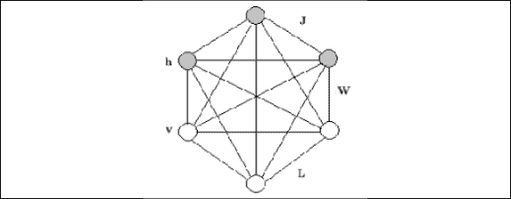

# 第八章：8

# 对治理的影响

治理指的是政府和公民社会如何达成决策以满足民众需求。它是利用宪法中定义的一套原则来运行政府的机制。政治涉及治理的艺术，但通常被认为超越了治理；它还是一个个人或组织建立和执行治理的手段。

本章讨论了近年来政府和政治如何利用新兴技术提供公共部门服务。

世界各国政府根据地方优先事项制定了多个任务。发展中国家政府关注司法效率、消除贫困、医疗保健和人民的基本需求。在发达地区，政府诚信、财务自由和商业自由都是重要方面。在拥有公共医疗保健和福利的州，失业和医疗保健福利是公民期望的重要方面。

尽管世界各国政府的优先事项有所不同，但一个方面在各国政府中普遍存在；与私营部门相比，它们在数字化和创新方面的步伐相对较慢。缺乏足够的激励是原因之一。对于金融服务或医疗保健行业的企业而言，采用创新有竞争上的理由。没有技术优势，它们往往会很快变得不重要。然而，由于缺乏竞争，政府没有这样的压力。

这并不是说政府没有推动其功能数字化的动力。在发达世界，随着互联网和移动设备的普及率日益提高，一些公共机构已经数字化。税务局、驾驶执照部门，更重要的是签证和移民服务都已经数字化。然而，在这方面还有更多工作可以做。

似乎有更多新兴技术被用于个人或政党竞选办公室。当个人和政党竞选组建政府时，对技术的需求似乎就消失了。参选组建政府的个人和政党利用社交媒体数据进行行为和预测分析。社交媒体上的趋势和模式被理解并用来利用选民的情感倾向，以赢得选民的支持。

因此，社交媒体已成为顶级政党和领导人推动其议程的工具。无论是 2016 年的美国选举，还是英国脱欧公投，或者 2014 年的印度选举，社交媒体都发挥了重要作用。利用社交媒体进行选举宣传的努力现在已经在应用**人工智能**（**AI**）方面有了新的发展。这项技术已被用于情感分析和理解会引发特定选民反应的敏感词语。

使用人工智能来理解选民的行为可以利用量子计算扩展到全新的水平。 人工智能目前可以进行情绪分析，但当它用于对选民在选举中的行为进行建模时，它就显得力不从心了。 为了对选举结果进行建模，必须对一个国家的不同地区之间的相关性进行建模是必不可少的。 这将提供有关一个国家某一地区选民观点的变化如何影响该国其他地区选民的信息。

在本章中，我讨论了量子机器学习在选举建模中的应用。 总部位于华盛顿特区的 QxBranch 公司，由首席执行官迈克尔·布雷特和首席数据科学家马克斯·亨德森领导，利用量子机器学习对 2016 年的美国选举进行了建模。

除了人工智能和量子机器学习的应用外，区块链在公共部门也有几个用例。 我们还看到政府试点了区块链等新兴技术。 瑞士、爱沙尼亚和迪拜一直在各个治理方面试验区块链。 央行数字货币，区块链的重要金融服务用例，可以帮助为纳税人带来透明度并遏制腐败。 本章将涉及区块链技术在这些情境中的用途。 让我们首先来看看过去几年全球政治和社会组织在社交媒体上的使用情况。

# 政治中的社交媒体

随着社交媒体成为主流，组织开始依赖它来了解客户的情绪。 查看 Twitter 数据以了解任何负面趋势或声誉问题的人工智能算法对于改变公众看法非常有用。 使用这些工具的组织已经成功地通过其客户参与模型更加积极地管理了与他们客户的互动。

> "良好的声誉需要多年时间来建立，但一瞬间就能毁掉。"

– *沃伦·巴菲特*

意图积极与客户互动的组织将需要掌握社交媒体对其品牌的情绪。 在快速变化的千禧一代和 Z 一代客户世界中，进行互动交流是至关重要的。

2016 年美国选举中看到了数据分析技术在竞选活动中的应用。 它的使用程度存在争议，并在最高层级引起了争议。 然而，人工智能和行为科学在与选民互动方面的应用后来被证明是有效的。 Twitter 和 Facebook 等渠道允许政客直接与选民互动。

> "我喜欢它，因为我也可以表达我的观点，而我的观点对很多看着我的人来说非常重要。"

– *唐纳德·特朗普*

在印度，纳伦德拉·莫迪总理在 2014 年选举以及此后的社交媒体宣传中非常成功。截至 2019 年第二季度，他在全球范围内拥有超过 4500 万的 Twitter 追随者。在拥有 6500 万追随者的唐纳德·特朗普之后，莫迪是在社交媒体上拉拢追随者方面最成功的人。

值得注意的是，在 2014 年至 2019 年担任总理期间，莫迪竟然从未与新闻媒体见过面。尽管如此，他在与追随者的对话渠道方面相当成功。他建立了作为竞选的一部分的营销能力，这帮助他的政党以绝对多数赢得了选举。这是自 1984 年以来任何印度政党首次以多数票赢得选举。

当政治家试图以自上而下的方式利用技术时，希望在政策制定中发表意见的市民也巧妙地利用了社交媒体。市民利用社交媒体为关键活动赢得支持。2019 年 4 月，数千名活动人士走上了伦敦街头，敦促英国政治家采取更多措施来遏制伦敦的气候变化。

2017 年，大约有 200 万人在钦奈的马里纳海滩聚集，抗议禁止他们传统的斗牛活动。政府最初禁止斗牛活动是因为受到动物福利组织的压力。然而，当地人争辩说，他们的斗牛形式并没有像世界其他地区那样伤害动物。斗牛活动被用作寻找社区中最强壮的公牛的手段，并且对该牛品种的繁衍至关重要。

这些抗议活动是通过社交媒体策划的。它们是和平的，大多由千禧一代和 Z 一代的公民领导。持续了一个星期，并导致印度政府撤销了禁令。抗议者还同意对斗牛活动进行监管以确保动物不受伤害。

社交媒体已经成为市民、活动家和游说者通过宣传来推动政治决策的主要工具。它还帮助政治家和政府利益相关者营造一种他们易于接近且离选民只有一步之遥的感觉。

由于这种行为的融合带来的对话为了解该国不同地区市民的优先事项提供了丰富的数据。政治家们可以利用这些数据进一步定制他们的信息给特定年龄、性别、社区、地区或这些因素的组合的受众。这已经为下一部分设定了背景，下一部分是关于人工智能如何帮助选举建模的。

# 选举建模

由于大数据的飞速增长，使用 AI 算法来对问题进行建模解决现在成为可能。预测分析公司一直在工作的关键领域之一是建模选举结果。

历史上，选举结果是用两种关键方法进行建模的。选民在选举之前被问及他们将投谁的票，这种方法被称为民意调查。另一种方法是在选民离开投票站时被问及他们投票给谁。这种方法被称为出口调查。出口调查通常比民意调查更准确地预测选举结果。

近年来，出口调查的准确性受到了挑战。在过去的三次印度选举和 2018 年最新的澳大利亚选举中，出口调查都不准确。

随着预测分析和统计建模变得更加流行，已经对一些经济指标及其与选举结果的相关性进行了建模。结果令人惊讶的是，关键的经济指标似乎对选举几乎没有影响。例如，美国的国内生产总值（**GDP**）只能解释二战后发生的选举中的 33%。在二战前这个数字降到了 23%。资料来源：[`fivethirtyeight.blogs.nytimes.com/2011/11/18/which-economic-indicators-best-predict-presidential-elections/`](https://fivethirtyeight.blogs.nytimes.com/2011/11/18/which-economic-indicators-best-predict-presidential-elections/)

失业率并不能很好地预测选举结果。我期望一个国家的公民会投票给一个能降低失业率的政府，反之亦然。比如，在英国，2019 年失业率达到了 44 年来的最低水平。然而，2019 年对执政党保守党的选民情绪普遍是消极的——可能是由于他们对脱欧的处理方式。

在许多发达国家，失业率与选举结果之间的相关性很少明显。在新兴市场，失业一直是家庭的主要问题。例如，拉丁美洲的选举结果与失业之间的相关性是不可忽视的。

返到美国选举，它们中没有任何支持信息表明失业率是选举结果的良好指标。我们可能也需要考虑到这种分析是基于仅有 16 次美国选举的数据。这个样本空间可能太小，无法提供有意义的选举结果相关性。

社会福祉是我们可能要考虑的另一个维度，以帮助解释选举结果。事实上，对选举结果与社会福祉和幸福因素之间的相关性进行研究已经产生了积极的结果。

研究人员将所有这些因素汇总为所谓的“国民幸福”，作为执政政府的关键绩效指标，以便获得连任。2019 年 5 月，新西兰政府透露，在民粹主义政策时期，他们正在为他们的公民推出一项“幸福”预算。预计总理雅辛达·阿德恩将宣布一项涉及心理健康、儿童贫困和社会不平等等问题的预算。

新西兰的这一政权已经出台了禁止塑料和对抗气候变化的政策。然而，在这样做的过程中，雅辛达·阿德恩也因未将重点放在解决底线问题上而受到批评，尤其是在该国面临经济放缓的时候。

过去已经将经济和社会指标结合起来预测选举。在世界某些地区，在选举前几个月，还存在一个重要的模式，被称为“政治商业周期”。这是一种趋势，其中执政党开始在选举前几个月制定有利于选民的经济政策。

政治商业周期已被观察为新兴经济体的常见现象，在这些地方，选民对政党的这些明显的把戏不够警觉。在世界上更发达的地区，政治商业周期则更为微妙。

尽管存在这些可能影响选举结果的政治、经济和社会工具，但深科技新秀、政客武器库中最强大的技术之一是社交媒体。这个想法是利用社交媒体来建模选民行为，通过这些微妙的技巧引发某些有利行为。

另一个来自 2016 年美国选举的观察是，大多数预测模型未能预测最终结果。这些预测失败归因于它们无法对各州之间的相关性进行建模。这正是量子退火可以解决的限制。在下一节中，我们将详细介绍量子机器学习和量子退火技术是如何结合起来对美国选举进行建模的。

# 量子机器学习

怀俄明州华盛顿特区的量子计算公司 QxBranch 提出了一种量子机器学习方法来建模美国选举。他们利用了 2016 年美国选举来创建他们的机器学习模型。全连接图模型被确定为美国各州之间相关性的最佳拟合模型。以下示意图展示了图模型可能的样子。

在建模变量之间的相关性的连接图形模型中，一个关键挑战在于使用经典计算实现它们。这些模型很强大；然而，它们不能使用现有的计算基础设施生成。近期量子计算的发展已经解决了训练这些模型所需的计算能力需求。当涉及到相关变量时，图形网络现在是一个现实的选择。

图 1：图形网络示意图 来源：https://medium.com/@neerajsharma_28983/intuitive-guide-to-probability-graphical-models-be81150da7a

现在让我们看看 BM，这是一种在选举建模中使用的深度学习技术。

## Boltzmann 机器

量子机器学习领域的一个有趣研究领域是深度量子学习。这涉及研究量子设备和算法对经典深度学习模型（如图形模型和**深度神经网络**（**DNNs**））的影响。

在 1985 年，Geoffrey Hinton 和 Terry Sejnowski 发明了一种称为**Boltzmann 机器**（**BM**）的无监督深度学习模型。这样做，他们引发了几个称为深度模型的神经网络的发展。BM 基于玻尔兹曼分布，这是统计力学的一部分。

BM 的一个应用是模拟熵和温度等参数对量子状态的影响。Hinton 曾以核电厂的示意图作为理解 BM 的应用。BM 是一个强大的图形模型，可以归类为 DNN。

传统的神经网络模型没有它们的输入节点连接。BM 在根本上与此不同，输入是连接的。因为这些节点彼此连接，它们交换信息（例如我们选举示例中的相关性）并自动生成后续数据。因此，它们被称为生成式深度模型。*图 2*代表具有节点连接的 BM。

图 2：Boltzmann 机器中的隐藏和可见节点

灰色节点在*图 2*中代表隐藏节点，白色节点代表可见节点。可见节点是我们测量的变量，隐藏节点是我们不测量的变量。机器首先需要输入数据。一旦输入数据，节点就会学习它们的参数、数据中的模式以及这些变量之间的相关性，并形成一个高效的系统。因此，BM 被归类为无监督的深度学习模型。

尽管提供了一个强大的模型，但是 BM 可能很难训练。使用经典计算基础设施训练这些网络的成本可能是禁止性的，从而限制了它们在主流工业应用中的应用。然而，有了量子计算基础设施，训练这样的网络似乎更可行。

QxBranch 已经使用由 D-Wave 系统生产的量子退火装置来实现选举建模的 BMs。这些设备可以比传统计算机更好地处理算法的计算需求。由于量子超定态和隧道效应特性，某些类型的能量景观在退火过程中可以更有效地使用量子计算来探索。因此，我们可以训练 BMs 来解决选举建模的复杂性。

在一个退火过程中，系统被置于基态，然后绝热演化过程开始。如果过程足够缓慢，系统应该在最终状态提供最佳结果，这也将是一个基态。然而，存在一定概率系统可能不会最终处于基态。因此，通过使用 BMs 对相关性进行建模和量子退火来识别低能态，可以实现类似选举建模的优化问题的解决方案。

以下部分描述了 QxBranch 在 2016 年美国选举中使用 D-Wave 量子退火机器进行的实验。

## QxBranch 选举模型

在 BM 中模拟美国总统选举时，一个美国州被表示为二进制单位。在模拟中赢得最多选举票的总统候选人被分类为选举的获胜者。

投票结果的状态被映射到候选人身上。例如，民主党将被定义为 1，共和党将被定义为 0。模型中每个州都被分配了不同的权重。州的权重根据它们对全国投票的影响来确定。

建模一阶矩项需要确定一个州投票给候选人的概率。用于对此进行建模的数据来自 FiveThirtyEight。该数据涉及各州的时间平均民意调查结果。因此，如果认为民主党候选人赢得纽约的可能性为 70％，那么代表纽约的变量的一阶矩将是 0.7。

对每个州的两位候选人的预计投票份额在选举前 6 个月内计算。这些预计投票份额被用于计算每个州的一阶矩项。这是模型中的简单部分。计算二阶项更困难。二阶项涉及对州之间的相关性进行建模。这可以解释为两个州在一次选举中最终得到相同投票结果的可能性。

在确定相关性时，发现投票给同一党派的州之间存在高度相关，反之亦然。在模型中，高相关性由高二阶矩表示，低相关性由低二阶矩表示。相关性受人口统计、地理位置以及在某些情况下经济因素的影响。

使用过去 11 次美国总统选举的数据来识别州之间的相关性。如果两个州一直投票给同一党派，相关性会更高；如果州在历史上投票给不同的党派，相关性会较低。

从以往总统选举的数据中得出的相关性中，给予了最近选举数据更高的权重。例如，过去五次选举中两个州之间的相关性将获得比之前选举中识别的相关性更高的权重。

由于量子计算基础设施的硬件限制，必须使用一些基本假设简化模型。D-Wave 2X 系统无法嵌入 50 个美国州模型和华盛顿特区。因此，华盛顿特区和马里兰州被省略，因为它们成为民主党获胜区的可能性接近 100%。一旦模型基本就位，就必须定期使用数据进行训练。

接下来的部分详细介绍了模型取得的成果，以及与用于预测和建模选举结果的现有方法相比的结果。

## 主要实验

本节描述了 QxBranch 使用 DWave 量子退火器进行的实验。还评估了训练算法的过程和取得的结果。

一旦确定了变量和数据需求，就开始使用选举数据对 BM 进行训练。使用 DWave 量子退火设备对 2016 年 6 月至 11 月的数据进行训练了多个完全连接的 BM。然而，由于限制，训练必须每两周进行一次，而不是每天进行一次。训练网络包括 150 次迭代，其中包括随机化系数。

在第一次训练后，每两周进行一次过程，重点关注一阶矩。他们进行了 25 次迭代，以使结果收敛到稳定的总和误差。训练的这个阶段几乎没有对一阶矩进行任何改变。

将每个量子比特的结果映射到一个状态。这是为了找出哪位候选人赢得了一个样本。候选人赢得的选举票数被添加到模型中。这样，每个样本都导致候选人赢得或输掉选举。

通过标识赢得的样本数量，确定了克林顿赢得的概率。然后将此数字除以总样本数量，得出克林顿获胜的概率。

需要时间加权算术平均数函数来获取选举结果的平均预测。

通过实验，观察到了一些众所周知的选民行为模式。倾向于民主党或共和党的州具有非常低的相关系数。伊利诺伊州和内布拉斯加州被确定为民主党和共和党候选人的坚定支持者。具有最高相关系数的州是激烈竞争的州。

现在让我们看一下 QxBranch 的工作与现有选举民意调查方法的比较。FiveThirtyEight 是一个提供选举民意调查结果的网站。他们从 2008 年开始做这项工作，并且在 2010 年成为《纽约时报杂志》的特许功能。比较 QxBranch 的方法和 FiveThirtyEight 的方法将有助于了解 QxBranch 算法的有效性。

就像 QxBranch 的模型，他们识别出了影响选举结果的州一样，FiveThirtyEight 的预测也有一个被称为“临界点概率”的度量标准。“临界点概率”被定义为“一个州提供决定性选票在选举人团中的概率”。在选举日，他们排名最高的 10 个州中，有 7 个州与 QxBranch 模型中排名前 10 个最相关的州相同。

总之，QxBranch 所使用的方法论包括对一阶项和二阶项进行建模。一阶项涉及识别一个国家的获胜者，而二阶项则识别了国家之间的相关性。尽管算法很复杂，只进行了少量简化，量子基础设施就能产生良好的结果。

该算法的真正考验将在 2020 年美国大选时进行。这个模型是否能帮助提前识别出胜者？在世界其他民主国家使用时，很值得看看这个模型需要如何调整。毫无疑问，科技将在未来几年内影响全球的民主进程。

现在让我们来看看区块链在全球公共部门活动中的运用情况。

# 区块链，治理和选举

治理是区块链的关键设计原则之一。这使得这项技术非常适合于政府和一些公共领域的用例。身份管理、电子治理、选举以及土地登记管理都已经试用了区块链。

了解区块链内部治理所使用的不同策略将会有益。一旦我们从治理角度了解了这个框架，我们就可以讨论它在世界各国的使用情况。

## 治理模型

这次讨论的重点是区块链在组织和国家治理中的应用。然而，了解区块链所使用的治理模型是至关重要的。这将帮助我们了解它如何作为国家治理模型的一种。

关键的区块链网络已经使用了几种治理策略作为其平台/协议的基本构建模块。众所周知的治理策略如下：

1.  区块链上的治理

1.  终身的仁慈独裁者

1.  核心开发团队

1.  开放治理

### 区块链上的治理

在这种模式中，治理规则被存储在链上的智能合约中。智能合约提供了区块链所需的治理和预定义了改变它们的程序。当需要修改区块链规则时，用户可以依赖内置方法。

### 终身仁慈独裁者

这种方法可能是管理区块链最简单的方法。在这种模式下，区块链的创造者是关于区块链的所有决定的最终权威。尽管它简单，这种模式导致高度集中的决策。在危机时期，这可以帮助快速行动；然而，集中化的决策也有其自身的风险，因为它可能导致滥用权力。

以太坊采用了"终身仁慈独裁者"的区块链治理模式。尽管用户和开发者对以太坊区块链的路线图提出他们的看法，Vitalik Buterin 是关于以太坊路线图的关键决定的最终权威。

### 核心开发团队

运行区块链协议业务的公司首先面临的挑战是在市场上赢得客户使用他们的区块链之前，建立一个开发者社区。在**B2C**（**企业到消费者**）和**B2B**（**企业到企业**）模式之后，区块链引入了**D2D**（**开发者到开发者**）模式。这凸显了开发者在商业模式中的重要性。发展贡献者社区已成为区块链业务与获取客户一样重要的一环。

由于这个快速变化的景观，让开发者成为区块链治理模式的一部分是公平的。最活跃的开发者子集决定应该包含在区块链中的功能。控制区块链的开发和发布路线图在核心开发团队手中。

这种策略已经在开源编程项目中使用，开发者对项目的推出有决定权。

### 开放治理

"终身仁慈独裁者"模式可能是最为集中式的治理形式。随着治理模式的发展，区块链采用了开放治理模式。在这里，为区块链做出决定的团队由区块链的用户自己选择。

Hyperledger 采用开放治理模式来决定他们的技术路线图。他们的**技术指导委员会**（**TSC**）由用户和开发者组成，在技术决策上具有最终权威。

每年，TSC 都是由 Hyperledger 社区内一群专注的用户和开发者选出的。这也使得活跃的开发者和用户对关键决策有话语权。区块链生态系统内的社区发展是如此重要，以至于参与治理已成为参与的一个关键动机。

这也有助于确保网络中的任何关键决策都是以大多数用户和开发人员为考虑对象的。由于区块链的治理主要掌握在由网络选择的小团队手中，这或许反映了世界各地民主结构的特点。这也可能是高度集中和去中心化治理理念之间的正确平衡。

现在我们已经审查了区块链内的治理模式，让我们看看区块链在治理中的应用。世界各国开始在其公共部门职能内进行区块链实验。领先的“政府区块链”倡议之一是智慧迪拜。

## 智慧迪拜

2017 年 1 月，迪拜启动了一项将所有政府交易数字化的倡议。这将由区块链技术提供支持，计划于 2020 年启动，并计划每年削减 1 亿次纸质交易。多亏了智慧迪拜，与政府和私营部门实体合作启动了 130 多个项目。

智慧迪拜的一些关键倡议包括迪拜数据倡议、迪拜区块链战略、幸福议程、迪拜人工智能路线图和迪拜无纸化战略。

2017 年 2 月，公共部门和私营部门启动了一项试点项目。与阿联酋国民银行、桑坦德银行和 Aramex 等主要金融服务提供商合作，使用 IBM 云和 Hyperledger 进行贸易金融和物流试点。

2017 年第二季度，迪拜移民和签证部门启动了数字护照的工作。该系统集成了生物识别验证和身份信任框架。它由一家总部位于英国的公司 Object Tech 与区块链技术合作推出。

另一个与政府和私营部门组织合作的倡议随之而来。 ConSensys 被任命为迪拜区块链倡议的城市顾问。 IBM 和 ConSensys 领导了区块链应用的建设，涵盖了警务、电力、人类发展和水务等公共部门办公室。

迪拜土地部推出了一项用于土地登记的区块链倡议。他们还将区块链扩展给租户，使他们能够在不提供任何文件的情况下完成数字支付。

2017 年底，迪拜宣布发行一种主权加密货币，名为 EmCash。这将在全国范围内的零售店使用。一家名为 Pundi X 的区块链公司已经创建了一个名为**销售点**（**POS**）的设备，该设备将接受 EmCash。计划在未来几年内创建超过 10 万个接受 EmCash 的商店。

智慧迪拜倡议致力于四个关键目标：

+   综合日常生活服务

+   城市资源的优化利用

+   预测风险并保护人民

+   丰富的生活和商业体验

他们计划在 2021 年实现这一目标，并且以他们设定的速度已经走在了实现这一目标的道路上。迪拜智慧城市倡议一直在通过使用或试验新兴技术为公共部门流程增加效率而创建常规头条。执行需要公共私营部门合作的倡议一直相当困难。然而，这并没有挫伤迪拜智慧城市倡议的士气。

公共部门和政府流程的数字化是所有希望提升数字化能力的重要国家值得关注的领域。它肯定更像是一场马拉松，而不是一场短跑，往往需要比私营部门项目更长的时间。然而，随着迪拜智慧城市倡议的成熟和形成，它们可以成为全球学习的案例。尽管我们对迪拜在这一领域的工作投来仰慕的目光，但还有另一个国家已经将区块链用例引入到了全球的公民中。现在让我们来看看爱沙尼亚以及它如何利用区块链带来电子治理。

## e-Estonia

当讨论电子治理和数字化公共部门流程时，很难忽视爱沙尼亚。它是一个国家如何拥抱新兴技术，使公共部门服务变得即时、无缝且成本效益的例子。

爱沙尼亚于 1991 年 9 月脱离苏联独立，经过 57 年的时光。其中一个关键里程碑是在 2000 年，也就是新千年之际，数字签名被赋予了与手写签名相同的法律价值。因此，由短码支持的数字身份证成为可能。

这一突破导致了一系列公共部门数字化倡议的涌现。税务和海关局成为了国家首个提供电子服务的公共部门机构。他们允许个人和企业在线提交税务申报。这也成为了名为 e-Estonia 的数字化社会门户的基石，这个数字平台让世界上更发达的地区感到羞愧。

e-Estonia 得到了 X-Road 的支持，这是一个数字交换系统，组织可以安全地交换信息。银行、电信公司、土地登记处和税务服务都成为了这个平台的一部分，以和谐的方式运行。有关 X-Road 增长的统计数据令人鼓舞。作为 X-Road 和更广泛的数字化爱沙尼亚计划的一部分，关键指标如下：

+   超过 1000 个组织加入了这个平台，包括 99% 的国家服务。

+   全球有 52000 个组织间接参与了这个计划。

+   每年，系统处理 5 亿次查询，节省了 1400 年的工作时间。

+   超过 98% 的爱沙尼亚人拥有一张包含芯片的身份证，使个人能够在线访问服务。

+   每年有 5000 万数字签名，每年节省五个工作日。

+   走向数字化的经济影响价值相当于该国国内生产总值的 2%。

+   爱沙尼亚 98%的税务申报现在都是通过电子方式提交的，流程通常需要 3-5 分钟。

+   一键式纳税申报系统被誉为 e-Estonia 的主要好处之一。

2005 年，爱沙尼亚成为了全球首个在全国范围内提供在线投票选项的国家，并且在 2007 年的议会选举中也是首个这样做的国家。随着所有这些数字化倡议，他们是最早拥抱区块链技术的国家之一，这一点也不令人惊讶。

尽管进行了数字化努力，但 e-Estonia 倡议面临着挑战；其中一个挑战是大量公共部门数据容易受到网络攻击的威胁。通过所有数字化努力实现的效率，如果系统的安全性受到损害，这些效率将毫无用处。

作为对已识别的风险的减轻措施，区块链技术得到了试验，并帮助了该倡议的口号，“没有人——不是黑客，也不是系统管理员，甚至不是政府本身——能够操纵数据并逃脱惩罚。”开发区块链的爱沙尼亚密码学家发表了这一声明，以描述他们的意图，即所有生态系统利益相关者都将保持诚实。

2019 年 3 月，当国家去选举他们的下一届政府时，44%的选民使用了名为 i-voting 的数字投票平台。之前的选举有 31%的选民使用了该系统。

使用手机投票的人数从上次选举的 12%增加到了 30%。这帮助稳步提高了选举投票率，从 2005 年的 47%增加到了 2019 年的 64%。来源：[`e-estonia.com/solutions/e-governance/i-voting/`](https://e-estonia.com/solutions/e-governance/i-voting/)

i-voting 系统使用区块链为该过程增加透明度。投票结束后立即公布选举结果。可以说，在一个人口很少的小国家中，实时选举结果可能并不具有操作上的挑战性。然而，这是其他国家的未来发展方向。

爱沙尼亚的土地登记和医疗系统也在使用区块链创建透明度。患者的病历存储在区块链中，医生可以在紧急情况下使用它们进行评估。患者也可以在线访问他们的数字化医疗史。如果患者想知道哪些医生访问了他们的档案，这也可以完全透明。

该系统每年提供了 50 万次医生查询和 30 万次患者查询。该系统产生的数据对于卫生部门的政策决策至关重要，以便可以据此合理分配资源。

e-爱沙尼亚及其平台（例如 i-Voting 和 X-Road）的成功已在全球范围内得到认可。X-Road 系统正在冰岛、芬兰、吉尔吉斯斯坦、阿塞拜疆、巴勒斯坦、越南、萨尔瓦多和阿根廷等国家推广。现在让我们看看爱沙尼亚是如何通过 e-居民身份使非爱沙尼亚人能够访问其公共部门服务的。

## 爱沙尼亚和 e-居民身份

2014 年 12 月，爱沙尼亚推出了一项 e-居民计划，允许非爱沙尼亚人访问其数字服务，包括公司注册、银行业务、支付和税务。该计划取得了巨大成功，吸引了来自世界各地的顶尖人才。

+   到目前为止，来自 150 个国家的超过 40,000 人已获得 e-居民身份。

+   已成立超过 6,000 家企业，通过税收贡献了约 1,000 万欧元（860 万英镑）。

+   该国目标是到 2025 年拥有 1,000 万名“e-爱沙尼亚人”，并在国家之间创建“电子服务”的“单一市场”。

    > “即使我们只有一百万多一点，但多亏了爱沙尼亚的能力，我们可以在短短十分钟内完成一千万次付款、一千万次请求和一千万次签约。即使是十倍大的国家也无法超越我们。但好消息是，加入我们这个独特的数字权力公民俱乐部是可能的。”

——爱沙尼亚总统 Kersti Kaljulaid

爱沙尼亚是利用区块链和人工智能等技术实现政府服务数字化转型的地方。因此，其他国家从他们的平台中汲取灵感。e-居民身份更进一步吸引了来自世界各地的人们在爱沙尼亚开展业务。

多亏了其数字化努力，爱沙尼亚的初创企业社区蓬勃发展。创办和经营企业的便利性对于早期阶段的企业至关重要。如果经营企业的操作痛点得到解决，企业可以专注于其核心价值主张。无论是电信、金融科技还是清洁技术，爱沙尼亚拥有欧洲最高密度的初创企业。以下是关于爱沙尼亚初创企业生态系统的一些有趣统计数据：

+   该国有超过 550 家初创企业，人口仅超过 100 万。

+   2018 年有超过 3,763 人受雇于初创企业。

+   这些初创企业筹集了 3.2 亿欧元（2.75 亿英镑）。

爱沙尼亚可能无法像非洲的 m-Pesa 成功或中国的阿里巴巴和腾讯波浪那样取得飞跃性影响。然而，通过使用区块链和尖端数据智能技术，他们向世界展示了数字治理的可能性。

欧洲公共部门组织在使用区块链方面的应用并不止于爱沙尼亚。奥地利也通过他们的举措成为新闻头条。更多详情请参阅下一节。

## 维也纳代币

区块链技术的一个有趣方面是，一些领先的技术生态系统存在于硅谷以外。传统上，大多数新兴技术都起源于硅谷并有其大公司在那里。这得益于硅谷的资本流动和投资者的风险偏好。无论是经典计算公司、社交媒体、人工智能公司，甚至许多量子计算公司，它们都与硅谷有着紧密的联系。

然而，区块链并非完全是这种情况。该技术的初期繁荣集中在亚洲。欧洲在接受和采用该技术方面排名第二。包括加密谷在内的几个欧洲枢纽出现并让该地区取得了领先地位。家族办公室和机构投资者以一种过去只有硅谷才能夸耀的方式支持了该技术的崛起（以及炒作）。

维也纳一直是最近一些区块链行业发展的核心。其中一个关键倡议是对**开放政府数据**（**OGD**）进行公证化。这是为了方便地方政府员工使用食品券。维也纳还正在建立一个基于区块链的代币，以激励市民的良好行为。

对于这个系统，我的第一个想法是它与中国社会信用系统的相似之处。中国一直在试验基于人工智能的社会信用系统以加强良好的市民行为。然而，根据西方的说法，这是一个备受争议的计划，它忽视了消费者数据隐私。阿里巴巴等私营部门公司也参与提供所需数据使这个计划得以实施。该系统的一个例子是，市民可以根据他们是否按时支付信用款来获得交通等日常设施的使用权限。

然而，维也纳的“文化代币”计划是为市民的任何良好行为设立的奖励。市民可以使用代币来获取维也纳市的艺术和文化。奖励范围计划扩展到其他几项市民服务。

该计划正在帮助维也纳当局减少碳排放，通过奖励市民在市中心步行而不使用汽车。从长远来看，文化代币可以在几项其他关键倡议中使用，并过渡为维也纳代币。

现在让我们来看看联合国是如何在全球范围内利用区块链技术推进其倡议的。

## 联合国和难民

联合国一直处于利用区块链进行公共部门创新的最前沿。在过去几年中，联合国发起了几项倡议，取得了在追踪援助、遏制腐败和最重要的是确保价值链责任方面的切实利益。

联合国等组织在处理金融和政府组织时面临着许多运营挑战。这些组织中的许多都位于政权敌对且腐败水平高的地区。通过透明平台有效分发人道主义援助是一个具有挑战性的过程。

因此，受益者数据存在风险，如果财政援助无法追溯到最后一公里，可能成为财务管理和腐败的源头。为了解决这些挑战，联合国的**世界粮食计划署**（**WFP**）推出了一个名为 Building Blocks 的计划。支持 Building Blocks 核心论点的研究表明，直接将援助资金转移给受益人是最有效的，并且有利于当地经济。

然而，在慈善/援助行业中实现去中介化并完全透明地掌握资金流动并非易事。2018 年，联合国 WFP 分发了价值 16 亿美元的现金转账记录。他们需要一种技术平台来更有效、更高效地实现这一点。

Building Blocks 计划于 2017 年启动，就是为了做到这一点。2017 年，WFP 在巴基斯坦信德省开始了一个概念验证，使用区块链的功能对受益人交易进行认证和注册。该技术消除了中间商，并允许 WFP 与受益人之间进行安全快速的交易。到 2018 年，该平台已有超过 10 万名难民加入。他们可以用虹膜扫描证明身份并支付杂货费用。

Building Blocks 平台使用了 Ethereum 区块链的受许可版本。一年后，该平台在约旦的两个难民营推出。之前采用的食品券系统迅速被用于食品和杂货的虹膜扫描结账系统取代。随着难民信息与联合国难民署（联合国的难民机构）整合，生物特征认证用于记录每笔交易及其背后的受益人。

这在难民营中节省了 98% 的交易费用。Building Blocks 现在正准备升级。他们正在探索在约旦的难民营中使用手机货币。这也将迅速扩展，为经常在不同国家生活和工作的难民提供经济身份。由于难民的身份是在区块链上管理的，他们的交易被注册，对于想了解其财务背景的当局来说是很容易获取的。

在接受 Coindesk 的采访中，WFP（世界粮食计划署）的创新与变革主任 Robert Opp 评论了该计划的主要成就。

> “Azraq 和 Zaatari 难民营的 106,000 名叙利亚难民都在基于区块链的系统上兑换他们的现金转账。 到目前为止，价值超过 2,350 万美元的权利已通过 110 万次交易转移给难民。 到 2019 年 3 月，Opp 预计将有额外的 40 万名难民通过区块链接受援助。”

这些国家需要帮助的家庭不必等待数周才能收到他们的现金。 在过去，他们不得不依赖于中间组织中的腐败官员来收取资金。 通常，资金的相当一部分是支付给分发现金的中介机构的，原因既是运营的，也是腐败的。 然而，所有这些参与方都可以通过这项技术被去中心化。

在过去的两年里，我很高兴与三家不同的区块链初创公司讨论了这个用例。 Disberse、AidTech 和 Agriledger 都致力于为慈善事业和联合国主导的倡议带来责任。 Disberse 和 AidTech 使用区块链将慈善/援助交易的主要利益相关者引入他们的网络。 交易实时跟踪，并提供即时报告和透明度。

另一方面，Agriledger 正在与联合国合作，为农民生产的食品提供端到端的可追溯性。 他们正在与联合国在海地的原型上合作，并已在中国和非洲启动了项目。 另一家初创公司 Banqu，由非洲难民领导，也专注于为非洲妇女提供经济身份。

Agriledger 有很多工作要做，因为他们试图在联合国的帮助下提高食品供应链的效率。 农民可以拥有他们的食品生产和物流，中间商可以提供他们的服务并分得一部分收入。 这使得食品供应链更加透明，并允许农民在更多信息的支持下定价产品。 购买食品的客户也可以清楚地追溯商品的来源。

# 结论

在 2018 年 11 月的新加坡金融科技节上，印度总理纳伦德拉·莫迪发表了主题演讲。 他提到，初创公司使用诸如区块链之类的行话来增加他们在投资者中的估值。 在过去的三十年里，我从未见过印度政治领导人关注创新趋势。 这可能是印度初创企业生态系统成熟的迹象，但也是由于政府对技术的关注。

政府和治理已经是几个世纪的传统故事了。 对于大多数国家来说，数字化政府机构和流程并不是首要任务。 然而，在过去的 10 年中，情况发生了变化。 随着爱沙尼亚、迪拜、格鲁吉亚、印度和新加坡等国家探索了几项数字化倡议，我们肯定会看到几个跨越式的时刻和可以在其他地方复制的案例研究。

选民行为从未像今天这样被深入理解或曝光。社交媒体和选民在选举期间产生的数据是一个至关重要的工具，有时可能会对他们产生负面影响。多亏了深度学习算法和量子计算，政治家可以模拟一个国家的选民行为，并相应地规划他们的竞选活动。这种智能也可以帮助他们决定政策决策，并希望实施更好的治理。

所有这些都指向一个受欢迎的趋势，即政府越来越意识到这些技术可以赋予他们信息上的竞争优势。如今的时代，国家不再使用核武器进行战争，而是通过数据和信息。装备自己的一种方法是将防务预算重新投入到开发尖端技术中。

通过更好地管理公民行为，追踪经济中的现金流动，并更好地了解选民的情绪，政府将拥有必要的工具来做出明智的政策决策。过去，大多数政策是通过那些没有今天所提供的数据管理能力的模型和框架制定的。

另一个关键点是，一些技术相当实惠和民主化，不仅是大型经济体才能够以有意义的方式使用它们。相反，像爱沙尼亚这样的小型经济体已经迅速采用了区块链和数据分析。

联合国等组织 embracing 区块链和人工智能等技术以产生规模化影响也非常重要。慈善/援助价值链由于地方当局和中间人的存在而效率低下且容易受到腐败影响，但这可以得到解决。随着这些技术被用来为难民提供经济身份，国家边界变得不再重要。治理可以真正实现全球化。
