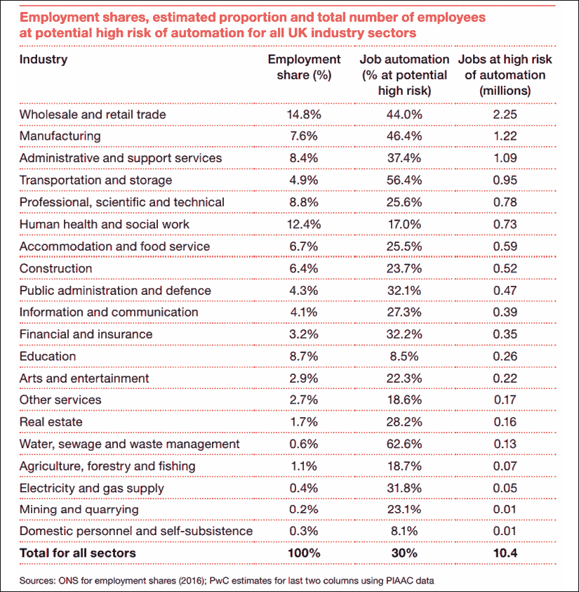
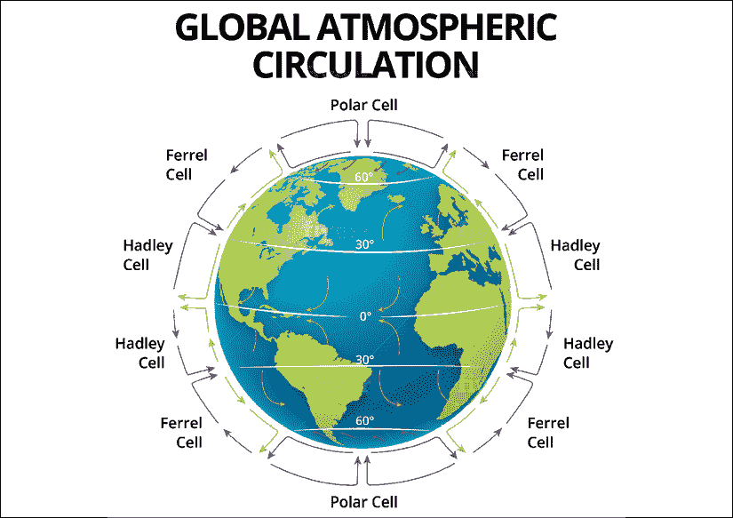

# 第十章：10

# 对智慧城市和环境的影响

技术使我们的生活变得更美好。然而，许多使我们受益的技术不幸地对环境造成了损害。我们能否在朝着更可持续的生活方式迈进的同时保持现代生活方式呢？本章重点介绍了量子计算和区块链在智慧城市和环境应用方面的应用，以及这些应用可能给我们带来的一些答案。

我们是地球上曾经走过的最聪明的物种。大自然赋予了人类不可思议的身体和心智能力。伴随着巨大的力量也伴随着责任。当我们开始利用技术和人力资源来改善我们的生活时，必须以可持续的方式进行。我们需要意识到我们与动植物王国的朋友共享这个世界。更重要的是，我们必须考虑我们想让我们的后代继承怎样的世界。

社会各个层面的创新都需要对我们生活的世界的长期健康保持一致。除了技术丰富外，智慧城市还可能意味着更加绿色的城市。在本章中，我将介绍技术如何用于交通管理、废物管理和气候建模等应用。

# 那么，我为什么关心呢？

26 年多前，我和一群朋友以及我的老师一起前往参加考试。我们去考试中心的交通工具是一辆牛车。在我印度泰米尔纳德邦的村庄里，这曾经是一个常见的景象。这个村庄叫梅拉加拉姆，位于泰米尔纳德邦和喀拉拉邦交界处，西高止山脉的山脚下，距离约 5 英里。

曾经有一个时期，我们可以去我们房子的天台看到被称为"主瀑布"的瀑布。这是印度南部顶级旅游景点之一，每年 6 月至 8 月期间定期被全球各地的人们参观。这是一个美丽的村庄，我仍然梦想着能够从"家"里，也就是从我的村庄工作。

我度过大部分时光的学校叫希尔顿中学。学校由一个颇具魅力的贝尔先生领导；一个我们都尊敬和喜爱的人。我们都对学校有很多回忆。它位于印度最南端两个邦的边界的山脚下仅一英里的地方。季风带来雨水，我们能够从教室的窗户看到我们称之为"旧瀑布"的瀑布。

学校有一个美丽的花园，甚至学校的食堂（我们称之为"mess"）也在花园的中心。我们每天早上乘坐学校巴士上学，途中会经过湖泊、绿色田野、瀑布、茂密的植被和小溪。仔细想想，对比起今天我孩子们在英国上学时的通勤，这更像是每天的郊游而不是通勤。

我们的家离学校有几英里远，周围也是绿色的社区。我们家对面有一个蚂蚁丘，离我们家的大门大约有一个板球球场的距离。我们家周围是稻田，稻米在那里被种植。我们的许多邻居养着牛、鸡和干草堆，我们会在那些田地里玩整天。

在每年 6 月和 7 月的季风季节以及 11 月，我们会在铅笔盒里收集一些小红色绒毛般的虫子。我在那个村庄住到 15 岁，然后搬到了炎热、潮湿、拥挤和污染的钦奈市上高中。

我几乎认为我的家乡的绿色山丘、美丽的风景和轻柔的小雨是理所当然的。钦奈对我的身体是一个冲击。我会骑车上学，当我回家时，我得洗掉额头上的黑烟灰。在夏季，路上的焦油会融化。我知道我离开了天堂去寻找一个更好的生活。这不应该是这样的。

这一章将智慧城市与环境联系在一起是有原因的。智慧城市不仅仅是为了让我们的城市充斥着追踪市民行为的设备。它们不仅仅是为了从这些设备中获取数据，并做出实时决策以优化城市的运作。它们还意味着确保城市不必失去其绿色才能变得聪明和复杂。

每当我想在社交媒体上分享有趣的内容时，我的首选都是环境意识、气候变化和塑料污染的内容。这些故事中有人带领着清理塑料污染海滩的行动，或者在辞去高薪工作后创造了数百英亩的森林土地。这些故事激励着我。

那么，新兴技术如何有助于创建智慧城市呢？最近，我开着特斯拉从伦敦希斯罗机场回到肯特的家。副驾驶座位上坐着一位在英特尔工作了几十年的朋友。我们讨论着特斯拉自动驾驶引擎背后的人工智能在印度道路上的部署方式。

交通管理是量子计算机的一个很好的应用案例。这些机器将需要得到来自物联网设备和电信提供商的地理空间数据的支持。在交通管理是一个重大挑战的新兴经济体中，已经试点使用人工智能来更好地解决问题。然而，这个问题远未得到解决。

随着世界专注于使我们的城市变得更好，确保我们在这个过程中不伤害环境至关重要。朝着智慧城市的努力也应该是保护环境的一部分。气候变化已经成为世界各地最高层次的讨论话题。自然纪录片谈到了极地冰雪融化及其对野生动植物和气候模式的影响。

关于气候变化是否仅仅是一个我们可能不得不经历的周期，或者是人为造成的问题，仍然存在争议。有人认为这仅仅是一个缺乏足够数据点支持的理论，有人认为在过去的 10-15 年里，人类已经造成了大部分的气候变化。

这是否是技术可以帮助评估的事情？像 PolArctic 这样的初创公司正在对北极冰的融化及引起其融化的变量进行建模。建立气候变化及其周围变量的综合模型是一项困难的任务。量子计算可能是模拟自然工作方式的最佳平台。过去的技术在这项任务上并不成功。将自然或物理建模到经典计算机中比在量子计算机中更困难。

当我们模拟气候变化时，我们进入了相互依赖变量的领域。在本章中，我将讨论通过智慧城市创新使我们的生活更美好，通过理解自然的创新使我们的世界更美好的努力。

# 智慧城市

全球范围内的智慧城市倡议涉及在城市各处使用数据捕获设备，为城市居民提供情境化和最优化的服务。到 2025 年，智慧城市市场预计将达到 7000 亿至 2.4 万亿美元。很难确定正确的数字，但这是发达国家和新兴经济体的巨大全球市场。

有几个智慧城市用例涉及区块链和量子机器学习。在本章中，我们将涉及以下一些领域：

+   停车

+   交通管理

+   城市规划

+   垃圾收集

## 智能停车

典型情况下，在智慧城市项目中，我们看到政府与私营部门密切合作以取得成果。例如，英国的一个计划旨在提高停车效率。该过程涉及实时获取车辆数据和停车位可用情况。虽然有几个应用程序可以保存停车数据，但将它们全部纳入中央存储库以提供智能服务的数据标准尚未制定。

因此，英国政府在 2019 年 5 月发布了一项关于标准化停车应用程序数据的公告。这些数据将包括停车数据的可用性、允许的时间和价格。这将通过一个综合平台向所有汽车司机提供。来源：[`www.gov.uk/government/news/uk-on-verge-of-revolution-to-make-parking-easier-and-help-british-high-streets`](https://www.gov.uk/government/news/uk-on-verge-of-revolution-to-make-parking-easier-and-help-british-high-streets )

此类倡议面临的挑战在于，一个国家的人民正在与政府分享大量个人数据。集中保存此类数据令数据所有者感到担忧。这为黑客提供了机会，但也允许决策者访问某些类型的数据，这些数据可能被公民视为侵犯隐私。

区块链可以帮助降低这些数据的所有权。即使是许可的区块链，也可以由事先同意的一组实体充当公共信息的门户，比完全集中的设置要好。纯粹主义者可能不愿称许可账本为区块链，但在我看来，在完全走向欣赏纯粹分散的生态系统之前，中心化世界需要进行几次迭代升级。

有像**委托权益证明**（**DPoS**）这样的协议，可以由少数几个节点来验证交易。虽然它们没有权限更改交易细节，但它们可以在网络中签署和广播交易。在 DPoS 协议中，代表是由网络通过投票选择的。因此，如果有一个不诚实的代表节点，网络可以通过投票将其撤销。

这些协议可以作为过渡到分散的数据世界的桥梁。然而，我仍然相信即使在目标状态下也会存在一定程度的中央集权。回到我们的智能城市示例，结合良好的元数据管理，区块链的使用可能是数据隐私的未来。在英国有像 people.io 和 Nuggets.life 这样的公司专注于解决数据隐私的问题。

尽管像智能停车这样的技术在英国这样的国家可能会有重要价值，但在许多新兴市场，交通管理是一个重大问题。现在让我们看看技术如何**帮助**解决这个问题。

## 交通管理

一想到交通管理，我脑海中浮现的画面就是印度混乱的道路。管理和规范像印度这样的国家的道路是当今技术面临的最大挑战之一。15 年前我搬到英国时，我经历了取消和重新学习驾驶技能的过程。

现在，我在英国的道路上比在印度的道路上更自如。多才多艺的司机可以在这两个国家舒适地开车，但坐落在我大脑中的智能引擎却难以适应。人类大脑需要花费大量精力来适应在两个非常不同的环境之间的转换复杂性。在人工智能达到应对这种情况所需的复杂程度之前，可能还需要一段时间。

然而，并不是说不能通过在这些背景下部署尖端技术来实现效率。在我与印度阿姆里塔大学的研究主任的交谈中，她透露他们正在进行使用机器学习进行交通管理的研究。

在我与富士通的讨论中，他们透露他们的量子启发式数字退火器也解决了交通管理问题。他们在仓储分布场景中部署了他们的解决方案，并实现了 45%的效率，找到了最佳路线。

将地理空间数据与传感器和雷达数据相结合可以有效地管理交通。由于全球手机的普及，大部分地区都可以获取来自移动电话基站的地理空间数据。使用这些数据可以实现对拥挤的积极识别。历史数据中的模式也可以预测交通堵塞的概率。

使用这些数据更容易识别城市的某一部分的拥挤，但很难预测拥挤。雷达部署在新兴市场以识别交通拥堵，然而，由于硬件成本和在实时情况下捕获和传输大量数据的挑战，它们不可扩展。在印度，雷达传感器的成本可能高达£40,000，这使得广泛部署成为不可行的选择。

交通摄像头结合图像识别算法可以识别拥挤的十字路口。当结合无人机使用时，这对实时管理交通拥堵非常有用。然而，智慧城市必须向交通拥堵的预测建模和解决方案识别方向发展。

在印度钦奈进行的一项最近的实验中，城市繁忙地区设置了 64 台摄像头。一天内约有 90,000 名违规者被识别并处以罚款。识别到的违规行为包括逆行、禁止通行、闯红灯和三人骑行。这表明即使在实施此类控制的范围较小且有限的情况下，也可以获得效率。

地理空间数据可以识别交通流量。这些数据可以帮助模拟城镇的某一部分有多少人在什么时间驾车到达另一部分。可以捕捉到这些数据的模式。然而，更难建模的行为点是一个城市的某一部分交通增加、事故或路障如何影响城市其他部分的交通。这就是量子退火器可以使用的地方。

在量子退火过程中，用于优化的信息被输入到一个物理系统中。在量子退火器上建模交通管理问题与旅行推销员问题非常相似，如《第二章，量子计算 - 主要讨论点》中所讨论的那样。量子系统准备在问题的许多可能解的叠加态中。不同可能解的概率通过退火过程演化。

随着退火过程的进行，能量较低的选项成为问题的可能解决方案。通过系统的基态识别的解的概率最高。这个过程使用的哈密顿函数管理系统的能级信息。

在繁忙城市的交通管理中有两个需要考虑的方面。一是不断发生的交通拥堵，以及如何解决它们，二是预测交通拥堵的发生。实时数据采集可以使资源被分配到交通拥堵的地区。

能够预测交通拥堵可以使道路工程、事故管理和交通管理变得更有效率。随着自动驾驶车辆开始变得主流，管理交通的综合基础设施变得愈发重要。

## 城市规划

在世界许多地方，城市规划和治理由理事会和管理城市的公共部门组织完成。我们将要涉及的过程包括理解新建筑、天桥、公园和道路对市民生活的影响。

新建筑、公园和道路基础设施是快速发展的城市的重要补充。然而，它们也会影响城市的碳足迹、排水基础设施、雨水管理和交通管制。需要将地理空间数据与 3D 建模技术相结合，以优化城市空间的利用，造福市民。

## 废物收集

随着自动化接管世界，几家公司正在进行研究，以确定其对就业岗位的影响。根据普华永道公司最近的一份报告，英国的废物管理行业预计受自动化的影响最大。如下图所示，该行业超过 62%的工作岗位有可能被机器取代。

图 1：自动化导致就业岗位受到威胁的预测图表 出处：[`www.pwc.co.uk/economic-services/ukeo/pwcukeo-section-4-automation-march-2017-v2.pdf`](https://www.pwc.co.uk/economic-services/ukeo/pwcukeo-section-4-automation-march-2017-v2.pdf)

我会对关于废物管理行业的上述统计有不同的理解。高百分比向我们表明，只需少量的智能自动化即可在废物管理行业获得许多效率。本次讨论的具体关注点是废物收集流程。

废物收集的当前流程涉及卡车在城镇的每条街道上行驶，并从垃圾箱中收集垃圾。在英国，已经对带有传感器的垃圾箱进行了试点测试。这些传感器可以提供垃圾箱的装满程度信息，以便只需要收集更满的垃圾箱。垃圾箱上的传感器也可以在它们装满时发送警报。

在英国与拉格比自治市议会展开的试点项目中，使用太阳能智能垃圾箱，帮助将年收集垃圾数量从 51,000 减少到 1,509。随着这一过程成为主流，可能会有进一步的效率提升。例如，量子退火器可以通知垃圾收集卡车收集垃圾的最快路线。

从可持续性的角度来看，传感器可以向市政府提供垃圾最少的家庭信息。市政府可以制定智能税收制度，为垃圾最少的家庭提供退税。我们可以进一步确定垃圾最多的家庭，并对他们征收更多的税款。随着物联网变得日益普及，量子计算的应用可以帮助实现规模效应。

# 气候建模

除了一些气候变化怀疑论者外，大多数人都认识到气候变化是一个我们不能再忽视的重要现象。根据**世界自然基金会**（**WWF**）的数据，地球每年失去 1870 万英亩的森林，相当于每分钟失去 27 个足球场的面积。这是一个严重的问题，因为森林是碳汇，树木吸收和储存二氧化碳。

有一个假设认为气候变化或全球变暖是一个周期性事件。自上一个周期以来，冰河时代之后，全球温度在 1 万年的时间里上升了 3°C 到 8°C。当前的科学共识是，人类行为导致的碳排放是加速这一气候变化周期的一个重要因素。**政府间气候变化专门委员会**（**IPCC**）的研究已经确定，最近的气候变化与人类活动有 90% 的关联性。来源：[`www.ipcc.ch/`](https://www.ipcc.ch/ )

碳排放和温度上升在过去的 200 年也有记录，并且被发现密切相关。有很大可能性是这些排放物在温度上升中起着因果作用，因为二氧化碳（CO[2]）等温室气体被认为会在大气中吸热，导致全球温度上升。参考：[`www.nature.com/articles/srep21691`](https://www.nature.com/articles/srep21691 )

然而，情况并非尽是悲观。大自然有着奇特的方式，能够从灾难中复苏生命。最近有一篇关于乌克兰切尔诺贝利的文章给了我希望。三十年前发生的切尔诺贝利事故糟糕到现在“切尔诺贝利”一词已经成为灾难的代名词。1986 年，切尔诺贝利核反应堆突然释放了大量能量。随后数日，空气中弥漫着放射性物质。事故造成的死亡人数估计有数千人。

自灾难发生以来，当时是苏联地区的一片区域已经被遗弃了 2600 平方公里。然而，三十年后，切尔诺贝利的植物和动物生命都已经回归。一篇关于该地区复苏生态系统的最新文章描述了植物如何适应了放射性环境。Business Insider 的文章称，切尔诺贝利今天的植物和动物生命比 1986 年灾难之前都要好。来源：[`www.businessinsider.com/chernobyl-exclusion-zone-animal-refuge-2019-5?r=US&IR=T`](https://www.businessinsider.com/chernobyl-exclusion-zone-animal-refuge-2019-5?r=US&IR=T)

这表明，如果我们付出系统性努力来恢复我们失去的森林，气候变化的影响是可以逆转的。恢复森林需要几十年的时间。因此，在此期间，我们迫切需要借助技术来应对气候变化。虽然长期的重新造林工作提供了一种有前途的缓解方案，但我们还需要能够应对当前世界各地正在经历的气候极端情况。一个双管齐下的方法是有效管理气候变化所必需的。

技术可以帮助促进气候变化建模的两个关键领域：

1.  量子退火和机器学习可以帮助我们对世界各地的空间和时间气候条件进行预测建模，使我们能够预测并管理世界各地的极端天气事件。

1.  量子计算可以帮助我们确定和量化气候变化最有影响力的驱动因素，进而为全球缓解方案提供信息。

第一个是一种战术性的练习，可以帮助我们预测、监测和管理全球范围内的极端天气模式。第二个是一种更具战略性和实验性的方法，我们在其中确定人类必须接受的关键生活方式变化，以长期应对气候变化。

了解气候变化需要数据涵盖多个变量 - 这些已知变量会影响一个地区的气候条件。它们是：

+   生物地理学

+   大气环流

+   海洋循环

+   地球的倾斜

## 生物地理学

生物地理学指的是植物和动物在地球上的分布。正如我们之前讨论的，拥有地、冰、植物和动物的最佳组合至关重要。当冰层过厚时，植物和动物会争夺土地，就像冰河时期一样。通过冰河时期的气候变化导致猛犸象和剑齿虎等物种灭绝。然而，我们更可能遇到的气候变化是冰的融化。这可能导致生活在极地地区的动物灭绝。

动物物种的灭绝影响了地球的植被模式，进而影响气候模式。曾经有过这样的情况，引入某些动物（如海狸）到生态系统中会改变自然景观和一个地区的气候模式。这种现象被称为“反馈循环”。海狸影响了河流和溪流的流动，从而影响了植被。随着植被模式的变化，会出现新物种的动物来进一步影响景观和生命的平衡。来源：[`www.nature.com/articles/nature10574`](https://www.nature.com/articles/nature10574)

因此，了解一个地区、大陆甚至一个行星的生物地理对数千年来气候模式的影响至关重要。动物、植物、景观和气候模式的演化之间存在固有的相互依赖关系。这样的环境被称为“开放系统”；这些系统由于我们无法控制系统内的变量以及变量相互作用的倾向而变得极为复杂。这些特征使得传统计算机（以及气候科学家）极难模拟这些行为。

## 大气环流

地球大气中的空气运动始于赤道。赤道处的高温使空气上升。随着空气上升，变冷并导致冷凝，进而降雨。这是影响世界范围内天气和植被模式的重要现象。随着空气从高压区向低压区移动，它创造了世界上干湿不同的区域。

从赤道到赤道南北 30°的空气运动形成了沙漠。由于这部分空气的水分很少，这个地区的降雨量较少。这个区域被称为哈德利环流。如下图所示，每个区域都有特定的空气运动模式，并具有不同的名称。空气的运动形成了蒸发、冷凝和降水的循环，影响了全球的天气模式。

图 2：全球大气环流示意图

## 海洋流

海洋流对全球天气模式有影响。海洋中的温度以三维模式流动，即东到西，北到南，以及表面到深处。热带海洋中的风从东向西吹。因此，陆地沿海地区的温度梯度从东到西。例如，太平洋西部比东部温暖 8°C。

然而，随着贸易风减弱，暖水由于重力作用向东移动。当这种暖湿的天气模式向东移动到南美洲沿海地区时，我们看到厄尔尼诺效应。

厄尔尼诺现象会导致南美西北部地区升温。由于海洋表面最温暖的部分产生了最多的蒸发，我们也会看到热带风暴向东移动。这影响了地球上的天气模式。厄尔尼诺现象每隔几年发生一次，科学家们无法准确预测它。

## 地球的倾斜

地球的倾斜会影响风的大气环流。由于倾斜，地表的空气会被偏转。偏转的空气在北半球初始轨迹的右侧流动，在南半球则相反。地球绕太阳的轨道上的革命形成了气候周期。

这些周期长达 10 万年。在这些周期中，地球的倾斜从 21.5°变化到 24.5°。由于倾斜影响了太阳的输入、海洋流和大气环流，它对气候周期产生了显著影响。

## 量子计算解决方案

正如前面描述的，由于存在多个相互依赖的变量，影响地球气候的意义重大，因此使用经典计算方法难以有意义地模拟气候模式。量子计算机应该能够处理模拟气候变化所需的数据。第一步需要明确确定气候变化是由人类行为引起的。

2019 年 1 月，埃克森美孚与 IBM 的量子计算能力合作进行环境建模。模拟自然现象最好由量子计算机完成，因为自然本质上是量子机械的。要在经典计算机上完成这项工作，需要将物理学转化为计算机科学，然后加载到计算机中。在量子计算机中，物理学以其本来的状态被编码。没有翻译，因此在这个过程中没有信息丢失。因此，使用量子计算机模拟其行为应该更加准确。

在我最近与一位物理学家的谈话中，他提到量子计算机应该是模拟物理学的好工具。除了量子计算机在计算能力上的提升外，它模仿自然的事实使得如果正确利用，能更好地模拟自然的行为。

南加州大学也正在利用量子计算机解决气候变化难题。随着量子机器学习和退火过程变得主流，我们将会有几种解决方案可以每天使用，以了解我们对环境造成的影响。我们将能够更好地预测天气条件，并更有效地管理极端情况。

# 结论

在智能城市和气候建模中应用量子机器学习和退火技术仍处于非常早期阶段。与金融服务和医疗保健应用相比，这些应用仍然远远落后。虽然新兴技术在智能城市应用可能会暂时等待，但我们必须对气候变化有一个牢固的理解。

气候变化的新兴影响也许是影响我们生活和未来世代生活的一些最重要的现象。政策制定者必须利用量子计算等技术来推动最高层次的决策制定。以气候变化为中心的自上而下的方法将帮助我们作为公民抵抗人类行为对我们星球的长期影响。

我们迄今为止已经涵盖了量子计算在医疗保健、金融服务和智能城市领域的应用。在接下来的章节中，我们将探讨量子计算在物流领域的应用，物流是使用经典计算机难以解决的一些最困难的问题。我们还将研究抗量子攻击的账本，这可以被区块链社区用来做好量子准备。
