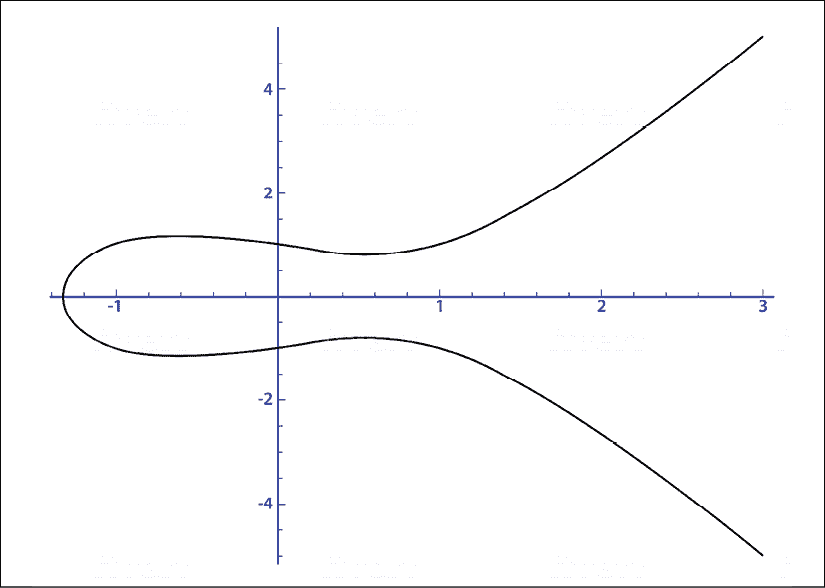
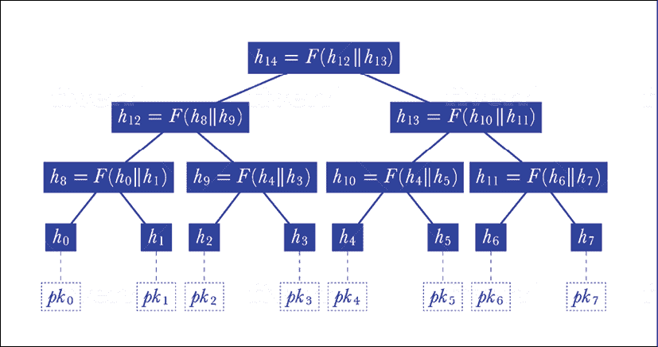

# 第十五章：量子安全的区块链

本书的论文围绕探索两种技术展开：量子计算和区块链。我触及了这两种技术的关键概念和历史。有一些采访和专注于行业的章节，我在其中揭示了这些技术的实际应用。这是为了证明，尽管存在一些挑战，但这些技术具有基本的用例。

我们已经确定这两种技术会长久存在。它们可能会经历周期性的低谷，其相关性可能会受到质疑。然而，最具影响力的技术会在经历这样的挑战后重新浮出水面，一旦它们再次变得重要。由于限制或生态系统成熟度不足，技术可能会见到低谷。在区块链的情况下，我们触及了三难问题，突显了这项技术尚未扩展。例如，完全去中心化的账本经常难以展示当今支付基础设施能够轻松容纳的吞吐量。

在量子计算的情况下，存在着诸如量子比特与其环境之间的相互作用导致的退相干等挑战。对于这两种技术来说，现在仍然是早期阶段，需要更多的工作来实现主流采用。然而，我们之前强调的是超越局限的能力。

这两种技术的“那又怎样？”是无法否认的。它们在不同行业都有用例，可能会创造跨越式的时刻。技术带来的跨越效应影响着目标市场数百万人的生活。从个人电脑、互联网和智能手机的发明，到应用程序如 PayPal、M-Pesa 和支付宝，都影响着发达国家和发展中国家数十亿人的生活。

我们还讨论了这两种技术之间的用例如何互补。量子计算主要关注于计算基础设施，还可以提供超出今天经典计算机的智能能力。另一方面，区块链是一个数据完整性层。

在一个主要依赖数据的世界里，我们需要一种能够提供智能和模拟能力的基础设施，可以利用数据的丰富性。然而，如果没有一个框架来确保这些机器存储和使用的数据具有高质量和完整性，那么所有的智能都将毫无用处。没有智能，高完整性数据也可能只是存储在计算机上而已。

因此，我们需要这两种技术都走向主流来解决未来的数据挑战。然而，有一个问题。这两种技术正处于冲突的轨道上。密码学是量子计算和区块链的一个重要组成部分。存在这样一种潜在的情况，即我们今天拥有的区块链解决方案一旦量子计算扩展并变得主流，就会过时。

因此，尽管这些技术有商业案例支持，但我们可能只会在未来看到两种技术中的一种变得重要。不过，我们可以克服这种情况。如果区块链能够克服另一个技术障碍，它仍然可能是相关的。本章将讨论技术之间的冲突并探讨解决这种情况的方案。

# 与时间赛跑

尽管互联网存在挑战，但它在很大程度上为我们服务良好。它是帮助世界各地经济繁荣的主要基石之一。全球访问互联网的成本已经大幅下降。例如，仅在印度，2015 年访问移动互联网的人数从约 2.42 亿增长到 2019 年底的 4.51 亿。来源：[`www.statista.com/statistics/558610/number-of-mobile-internet-user-in-india/`](https://www.statista.com/statistics/558610/number-of-mobile-internet-user-in-india/)

移动普及在过去已经在世界各地创造了飞跃时刻。移动互联网的普及又进了一步。例如，非洲通过 M-Pesa 得以看到移动支付像从未有过的规模。没有移动普及，这是不可能发生的。赛里斯又进了一步，因为移动互联网的普及导致了支付繁荣，阿里支付和微信支付贡献了赛里斯 40 万亿美元移动交易额的 90%以上。

另一方面，在印度，由于移动互联网的普及，推出了几种新的商业模式。有一些创新的应用程序允许农村地区的用户使用他们的地方语言通过语音界面进行日常交易。这些模式在新兴市场尤其是罕见。然而，这种增长是有代价的。互联网的爆炸式增长带来了对网络安全的风险。

近几年来，互联网已经渗透到世界许多地方，但是许多地方对数据隐私和数据安全的理解和意识仍然严重不足。因此，我们今天所看到的增长实际上可能为明天的网络战培育了肥沃的土壤。大多数存储在服务器上并由今天的安全机制锁定的互联网数据都容易受到网络攻击的威胁。

当我们将量子计算机引入到这个混合中时，这种威胁就成为了一个定时炸弹。量子计算机可能对存储在互联网上的数据造成灾难性影响。今天我们所知的互联网上的信息交换使用**Rivest–Shamir–Adleman**（**RSA**）算法和**Elliptic-Curve Cryptography**（**ECC**）。这些算法用于对在互联网上传输的信息进行编码和解码。这些算法是公钥加密技术，其中用于编码数据的加密密钥是公开的，而用于解码数据的加密密钥是私密的。

让我们简要介绍一下每种加密技术涉及的内容，并提及它们在量子世界中的漏洞。

## RSA 算法

在需要将消息从 A 方发送到 B 方的情况下，A 方可以只是将消息写在一张纸上，并将其发送给 B 方。如果信息是机密的并且需要受到保护，A 方可以使用加密密钥来混淆消息。只要 A 方和 B 方事先交换了密钥，B 方就可以使用密钥来解密消息并阅读。使用相同的私钥加密和解密消息的方法称为对称密钥加密。

但是如果 A 方和 B 方没有事先交换解密消息的密钥呢？这是一种不对称密钥加密技术（如 RSA 算法）非常相关的场景。在 RSA 技术中，A 和 B 将各自拥有一对密钥，包括公钥和私钥。公钥在 A 和 B 之间进行交换。A 方将使用 B 的公钥加密其消息并将其发送到 B。发送给 B 方的这条加密消息只能使用 B 方的私钥解密。

这使得 RSA 能够在事先无法共享私钥的 A 和 B 之间使用。RSA 算法已经在电子邮件和**虚拟专用网络**（**VPN**）中使用，并且在许多浏览器中也可以看到。尽管在互联网上有几种用例，但 RSA 算法最近才受到关注。

RSA 算法最初是由 Ron Rivest、Adi Shamir 和 Leonard Adleman 于 1977 年开发的，甚至以他们的名字命名（Rivest，Shamir，Adleman）。然而，当时很难理解其在实际应用中的意义，因此被搁置了。到了 1997 年，随着互联网业务、电子邮件、社交媒体和微型消息变得普遍，RSA 算法突然变得相关起来。

RSA 算法基本上依赖于一个原则，即一个方向的操作相对容易计算，但反向操作极其耗费资源。这样计算的一个关键示例是质数分解。如果我取两个质数，997 和 667，我们可以很容易地得到 997*667 等于 674,969。然而，反向操作极其困难。如果我们被要求找出 674,969 的质数因子，由于涉及的计算困难和试错的数量，我们会在合理的时间范围内很难做到。

展现这种属性的算法被称为陷阱函数。识别这样的算法对于创建安全的公钥密码技术至关重要。

在上述例子中，如果你得到了两个因子之一和结果为 674,969，那么操作会变得更简单。在实际的 RSA 实现中，质数非常长。例如，RSA 1024 有 1,024 位，可能有长达 309 位的数字。

在公钥密码技术中，解决问题的难度在一个方向上与在另一个方向上解决问题的难度之间的差异是重要的。例如，对于 RSA，挑战在于随着质数因子的增加，计算一个端点上的乘积与识别另一个端点上的因子之间的困难度差异已经减小。由于移动互联网的爆炸，安全机制也不得不变得更加资源密集。

因此，RSA 被认为不是可扩展的解决方案，随着质因数变大，它变得更加资源密集。除此之外，诸如二次筛和通用数域筛这样的算法使得破解质数分解挑战相对容易了。我们需要其他替代方案来构建一个可扩展的安全解决方案。现在让我们看看其中之一，以 ECC 的形式。来源：[`www.comparitech.com/blog/information-security/rsa-encryption/`](https://www.comparitech.com/blog/information-security/rsa-encryption/)

## ECC

ECC 是一个最近开始受到关注的替代方案。它基于椭圆曲线上点的群的离散对数。椭圆曲线算法可以使用以下方程来解释：

Y² = X³ + aX +b

当我们使用上述方程映射椭圆曲线时，我们得到一个类似以下曲线变体的图表：

图 1：绘制的椭圆曲线

该曲线有一些特殊特征，其中之一是它的水平对称性。位于 *x* 轴下半部分的曲线可以描述为位于 *x* 轴上半部分的曲线的镜像。然而，还有另一个从陷阱函数的角度来看更为相关的属性。

该属性可以通过想象在带有该曲线的棋盘上玩的台球游戏来解释。如果我们在曲线上的两点之间射击球，它将必然在第三点上击中曲线。可以使用曲线的形状来可视化预测第三点。

然而，如果在从起点 A 开始的几次（*n*）射击之后，球到达点 B，对于一个新手而言，即使知道点 B 和球的起始点，也很难理解射击次数。因此，即使我们知道了 A 和 B，要从点 A 到点 B 也是容易的，如果我们知道 *n* 的话。然而，即使我们知道 A 和 B，要找到 *n* 也是困难的。这是椭圆曲线算法的一个独特特性，使得它成为一个良好的陷阱函数。

在实际表示 ECC 的情况下，总体思路是将消息分配为上述方程中 *X* 的值以找到 *Y*。 这将给我们 (*X,Y*) 作为曲线上的点。 因此，使用 ECC 的安全机制将需要一个曲线方程，曲线中的一个公共点以及一个素数。 公共点可以在台球的例子中想象为被自己射击 *n* 次，其中 *n* 成为私钥。

根据欧洲研究人员最近发表的一篇论文，与 RSA 相比，ECC 提供了更好的安全性。 该论文考虑了打破加密算法所需的能量，并将其与煮水所需的能量进行了比较。 在 RSA 和 ECC 之间的比较中，要打破 228 位 RSA 算法，我们将需要相当于煮一勺水所需的能量。 另一方面，要打破 228 位 ECC 密钥，我们将需要足够的能量来煮沸地球上的所有水。 来源：[`eprint.iacr.org/2013/635.pdf`](https://eprint.iacr.org/2013/635.pdf)

ECC 被视为 RSA 的更节能替代品，即使对于编码器来说也是如此。 CPU 和内存使用也更加优化。 但是，RSA 更广泛地得到了采用。 这主要是由于理解 ECC 所涉及的复杂性。 ECC 如果不够了解，可能会被错误地实施，这实际上可能成为安全漏洞。

ECC 的潜在应用很多。 美国政府已经开始为内部通信部署这种安全机制。 Apple iMessage、WhatsApp Messenger 和 Tor 匿名网络使用 **椭圆曲线数字签名算法** (**ECDSA**) 进行安全交互。 在本书的背景下，椭圆曲线的更相关的用途可以在比特币和以太坊中找到。

现在，我们简要介绍了用于保护我们的数据的 RSA 和 ECC 技术，让我们来看看它们在量子计算机变得可行和主流时为什么会变得不安全。

# 量子计算意味着混乱吗？

那么，互联网安全作为今天的炸弹滴答作响的原因是什么？ 如果量子计算成为主流，会不会出现混乱，这种可能性有多大？ 这些都是困扰担心网络战的国家的问题。 处理敏感客户数据的顶级银行和医疗保健公司的首席执行官也担心数据安全。

让我们快速看一下量子计算世界所处的位置以及为什么它可能对全球数据安全构成威胁。 在 1994 年，彼得·肖尔提出了两种量子算法。 一个可以分解大素数，另一个可以在素数阶有限域中计算离散对数。 前者可能对 RSA 方法构成威胁，后者将处理椭圆曲线。

Shor 基本上表明，我们今天使用的几乎所有公钥加密技术都可以使用量子傅立叶攻击来破解。他使用量子傅立叶采样来找到数学对象的周期性。这反过来允许他解决因式分解问题。

过去 25 年来，量子计算机的威胁一直存在。因此，从理论上讲，量子计算算法确实可能对我们今天所了解的数据安全世界造成严重破坏。

然而，2015 年研究人员发现，需要 10 亿量子比特才能破解 RSA 2,048 位签名。这个数字（10 亿量子比特）在 2019 年修正为 2000 万。量子计算机中的噪声是一个必须在我们开始考虑其成为主流之前克服的难题。来源：[`cacm.acm.org/news/237303-how-quantum-computer-could-break-2048-bit-rsa-encryption-in-8-hours/fulltext`](https://cacm.acm.org/news/237303-how-quantum-computer-could-break-2048-bit-rsa-encryption-in-8-hours/fulltext )

尽管如此，2012 年使用了一个 4 量子比特的量子计算机来分解 143，两年后类似大小的量子计算机能够分解 56153。因此，量子计算机的能力正以非常快的速度不断提升。2019 年 12 月，谷歌的 Craig Gidney 和皇家理工学院的 Martin Ekera 发表了一篇题为《如何使用 2000 万量子比特在 8 小时内分解 2,048 位 RSA 整数》的论文。

突然之间，破解 RSA 2,048 位数的问题变得容易了 5 倍。之前估计使用量子计算机解决该问题需要 10 亿量子比特。Gidney 和 Ekera 使用了一种称为模指数的数学技术，并证明这是执行因式分解的更有效方法。他们在研究论文中表明，当因式分解 2,048 位 RSA 整数时，他们构造的时空体积比以前的实现少了 100 倍。来源：[`arxiv.org/abs/1905.09749`](https://arxiv.org/abs/1905.09749 )

谷歌的量子优势声明可能需要持保留态度。谷歌关于量子优势的论文于 2019 年被 NASA 泄露，随后谷歌发布了官方新闻稿。在发布会上，谷歌声称他们的 53 量子比特 Sycamore 芯片可以执行计算，而这对于最强大的经典计算机来说需要花费 10000 年才能完成。

IBM 对此作出了科学回应。他们计算出谷歌的 Sycamore 芯片的整个量子状态向量可以存储在 Summit 中——这是世界上最大的超级计算机，拥有 250PB 的存储空间。经典计算机必须借助磁盘存储才能接近基本量子计算机的能力，这一事实说明了这两种技术之间的差距。

IBM 还展示了经典超级计算机可以在大约 2.5 天内模拟 Sycamore 芯片，而不是谷歌声称的 10,000 年。谷歌所取得的资源效率确实很高，但也许量子计算机还没有像它们被吹捧的那样伟大。

微软的量子团队最近发表的另一篇文章声称，通过实施正确的算法技巧，可以更有效地破解 RSS 和 ECC。他们根据美国商务部的一个单位——国家标准与技术研究院（NIST）制定的 ECC 标准实施了他们的算法。来源：[`www.microsoft.com/en-us/research/wp-content/uploads/2017/09/1706.06752.pdf`](https://www.microsoft.com/en-us/research/wp-content/uploads/2017/09/1706.06752.pdf )

该研究表明，他们的算法可以使用 2,330 个逻辑量子比特和 Toffoli 门来破解 NIST 标准曲线 P-256。同样，他们能够证明，Shor 的因式分解算法需要 6,146 个量子比特来破解 3,072 位 RSA 密钥。

Toffoli 门非常适合构建具有数千个量子比特和数十亿门的大规模可逆电路，因为它们在经典和量子环境中都能工作。这些门位于高级抽象算法和最终驱动量子计算机的低级汇编语言指令集之间。您可以在[`cloudblogs.microsoft.com/quantum/2018/05/02/the-quantum-computing-effect-on-public-key-encryption/`](https://cloudblogs.microsoft.com/quantum/2018/05/02/the-quantum-computing-effect-on-public-key-encryption/)找到更多信息。

在谷歌、IBM 和微软的努力下，量子计算机有很大可能在不久的将来变得更加实用。纠错能力可能变得更高效，我们将需要更少的量子比特进行计算。随着更好算法的出现，使得量子计算机更加真实，对基于 RSA 和 ECC 的安全性构成了真正的威胁。RSA 和 ECC 是互联网、政府和许多金融服务公司目前依赖的基本安全机制。

我希望能解决目前我们在互联网、银行账户、信用卡、政府机密数据和消息传递中使用的安全机制可能会因量子计算的出现而受到严重威胁的问题。黑客今天可能记录下消息，而在 10 年左右的时间里，当量子计算机可以解密消息时，读取它。对信用卡信息可能不构成重大风险，但政府和国防秘密对这类问题更为敏感。

威胁加剧的事实是，很多重要国家正在希望利用量子突破进行网络战争，并且不一定愿意透露他们在量子技术方面的进展。因此，他们可能领先于我们从 IBM、谷歌或微软等获得的基准信息。现在让我们看看可能成为主流的不同的量子安全密码学技术，以确保我们的数据具有量子抵御能力。

## 量子安全密码学

每个问题都是创新的机会。薛定谔的算法基于量子傅里叶取样来破解非对称密码算法。因此，希望能对量子安全的密码系统需要对量子傅立叶取样以及其他经典和量子攻击免疫。2016 年 4 月，NIST 启动了**后量子密码学**（PQC）标准化挑战。使命是寻找一种 PQC 技术，可能保护我们的数据免受量子计算的威胁。

在 2019 年 1 月，69 个被接受的应用中有 26 个被选为半决赛入选。NIST 的努力目标不仅仅是找到一种在纸上行得通的 PQC 技术。他们还希望确保该技术在移动和平板设备以及物联网网络中是实际可行的。在机器相互传输数据的世界中，用低资源消耗来保护它们是必要的。

让我们来看看已提交给美国国家标准与技术研究院（NIST）的不同类别的密码学技术。重要的是要确保这些技术不仅在理论上对量子计算免疫，而且在实践中规模可行。正如讨论的那样，这些协议必须能够处理薛定谔算法。接下来让我们看看基于格的加密和基于代码的加密技术。

### 基于格的密码学

**基于格的密码学**（LBC）可能是最受关注的 PQC 类型。格是一个无限延伸的点网格。由于计算机资源有限，无法表示一个格。因此，我们使用一种称为基的东西，它是一组点或向量，帮助表示一个格。

LBC 依赖于在多维格网中解决几何问题的难度。例如，要解决的几何问题可能是**最短向量问题**（**SVP**），在其中我们需要识别具有短向量的良好基。不幸的是，在具有数千维的格网中这并不容易。

解决的另一个常见 LBC 问题是**最近向量问题**（**CVP**），其中给定一个点 *P*，需要确定最近的点。出于几个原因，LBC 技术似乎是最受欢迎的 PQC 技术。

格网已经研究了 200 多年。因此，它们的数学属性被充分理解。那些在格网理解方面发挥关键作用的数学家们根本不知道量子计算机的存在。尽管如此，他们的工作提供了一些洞见，可以帮助 LBC。

格网（Lattices）提供了一种前所未有的灵活方法来开发密码协议。因此，它们是研究最多、最深的密码领域。在 NIST 收到的 PQC 标准化挑战的 82 个申请中，有 28 个是基于格网的。

与 RSA 加密不同，后者可以归类为最坏情况下的降低技术，LBC 具有平均情况下的降低。这意味着平均而言，LBC 技术是安全的，除非格网问题的每个实例都很容易解决。在 RSA 加密技术中，如果使用的数字具有某些数论属性，则很容易破解。因此，在密钥生成过程中，我们需要确保这种情况不会发生。

对于 LBC，我们只需要选择参数大小并生成密钥。除了更安全之外，它们还更节约资源。例如，基于 LBC 的技术（R-LWE）在 8 位物联网设备上的加密过程在 200 万个周期内完成。RSA 1024 加密需要多运行 2300 万个周期。来源：[`arxiv.org/pdf/1805.04880.pdf`](https://arxiv.org/pdf/1805.04880.pdf)

这使得格网密码（LBC）在我们生活的物联网世界中非常相关。它也可以用于需要量子安全的资源高效加密技术的移动和平板设备。虽然 LBC 算法比 RSA 加密更快，但仍然比**基于码的密码**（**CBC**）慢。让我们来审视这一类后量子密码学。

### 基于码的密码学

CBC 依赖于解码通用线性分组码的难度。该代码可以属于 Goppa 码或准循环码等系列。麦克利斯算法是一种非对称加密方案，已证明使用量子傅里叶采样无法解决它。目前尚不知道任何多项式时间的量子算法来解码线性分组码。

McEliece 算法最初是在 40 年前开发的，但并没有像 RSA 或 ECC 那样流行。这主要是因为其密钥大小巨大（通常为 0.5 MB，而 RSA 为 0.1 MB，ECC 为 0.02 MB）。然而，现在由于需要使密码学具备量子防护能力，它已成为人们关注的焦点。

CBC 的优势在于，从计算效率的角度看，通常比 LBC 方法更具性能。然而，在选择适合平台或应用的正确加密技术时，重要的是考虑诸如密钥大小、资源消耗、计算效率、签名长度和安全性信心等因素。

这两种技术（CBC 和 LBC）各有优缺点。它们的应用将根据使用环境的具体情况而变化。例如，在 IoT 环境中，我们将需要更小的密钥和相对更好的资源效率，此时基于格的密码学可能是更好的解决方案。因此，需要采用“因地制宜”的方法（针对正确的工作选择正确的工具），而不是将一种技术视为在后量子世界保护我们数据安全的万能钥匙。

类似于 NIST 挑战，欧洲委员会资助了一个由 11 所大学和公司组成的研究联盟，资金为 390 万欧元。该倡议被称为 PQCrypto。其目标是在三年内识别 PQC 技术。在提交给 NIST 的 69 个方案中，有 22 个是由 PQCrypto 的成员设计或共同设计的。来源：[`pqcrypto.eu.org/nist.html`](https://pqcrypto.eu.org/nist.html )

尽管有所有这些充满希望的努力，人们也意识到任何新的加密系统要经过 15 到 20 年才能为规模化工业应用做好准备。因此，科学界面临这一挑战，以确保我们的所有数据都得到保护。虽然在后量子时代的互联网上数据安全是一个更广泛的问题，但我们也对区块链应用有特定的安全关注。

### 区块链密码学

许多区块链使用公钥密码学。它们在本质上是非对称的，因为发送者和接收者各有一个公钥和一个私钥。如前所述，在非对称加密方案中，用接收者的公钥加密的消息可以用他们的私钥解密。如果没有私钥，解密消息将非常困难，因此创建了一个陷门加密机制。

区块链安全机制依赖于这一陷门数学函数的难解性。许多加密货币和区块链使用 ECC。这包括以太坊和比特币区块链，因为 256 位椭圆曲线密钥的安全性相当于 3072 位的 RSA 密钥。椭圆曲线的较小密钥更具资源效率，因为它们需要较少的存储。

我们在*第一章*，*量子计算与区块链导论*中详细讨论了区块链密码学的工作原理。因此，我只会简要提及这个主题来刷新您的记忆。陷阱函数，又称为**单向函数**（**OWF**），是区块链安全的基础。区块链的用户使用这些函数创建数字签名，可以通过正确的密钥轻松验证。

加密货币可以被视为一系列数字签名的链条。每个数字签名都有一个向后和一个向前的链接，即它签署了前一个区块的哈希和新区块的公钥。这可以被视为一种握手机制，因为一枚硬币的所有权是通过数字签名从一个人转移到另一个人。

例如，比特币网络上的交易历史记录以区块形式表示。每个区块可以容纳多个交易。要将区块添加到账本中，需要满足一种数学条件。整个网络不断计算以找到这种数学条件的解（根据 ECC），一旦满足条件，区块就被添加到网络中。

因此，当有人想要攻击区块链时，他们不仅需要攻击单个交易，而且需要攻击整个签名链。尝试使用暴力方法来攻击这些签名是不可行的，因为需要的资源太多。

已经尝试了各种方法来攻击区块链，有些甚至成功了。我们在*第一章*，*量子计算与区块链导论*中讨论了这个问题。一些主要类型的区块链攻击如下：

+   智能合约攻击

+   交易验证攻击

+   挖矿池攻击

+   网络攻击

+   钱包攻击

所有这些针对区块链的攻击类型都有详细记录。正在识别和理解更多类型的攻击。根据 GitHub 的数据，有超过 30 种不同类型的智能合约漏洞可以被区块链黑客利用。

Sybil 攻击和 Finney 攻击是交易验证攻击的类型。当整个网络被攻击者入侵时，就会发生 Sybil 攻击。在 Finney 攻击中，攻击者会挖掘一个区块，将硬币发送给愿意购买未确认交易以获得一些商品的人，然后再回到网络确认交易并拿回钱。

网络攻击包括标准的**分布式拒绝服务**（**DDoS**），其中服务器被多个请求击倒，耗尽其资源。钱包攻击涉及利用社交工程攻击受害者的钱包。区块链黑客已经发现了几种利用框架漏洞的方法。

然而，大多数不涉及解决加密的过程，接收者接收到的交易更为容易。这就是量子计算可能对依赖 ECC 等加密技术的区块链网络造成致命打击的地方。使用量子技术破解区块链中的 ECC 可能导致保护资产的密钥破解。因此，黑客有更高的动机来攻击区块链网络，因为它们数字化存储了经济价值。

有一些区块链，如 **QRL** (**量子抗性账本**) 和 IOTA，是使用 PQC 开发的。然而，大多数区块链应用仍然使用 ECC，这不是量子安全的。就像 NIST 为互联网识别量子安全的加密技术所做的努力一样，我们需要一个全行业的区块链升级来抵御量子威胁。

现在让我们来看一些可以使区块链在后量子世界更安全的技术。区块链正在使用或探索的一些技术如下：

+   **扩展 Merkle 签名方案** (**XMSS**)

+   **区块链后量子签名** (**BPQS**)

+   **温特尼茨一次性签名** (**W-OTA**)，由 IOTA 使用

当我解释这三种方法时，可能会显而易见它们都是相互关联的技术，并且有很多共同点。然而，每种技术都有适合它们的特定应用。

# 后量子世界的安全性

随着要解决的问题的困难度增加，加密方案变得更加安全。在后量子世界中，ECC 方法因为我们之前看到的原因而变得容易解决。可用于使加密量子安全的替代方案之一是使用基于哈希的签名方案。让我们来看一下使用哈希函数的 XMSS。

## 扩展 Merkle 签名方案 (XMSS)

XMSS 是 QRL 探索的一种基于哈希的签名方案。XMSS 具有两个关键特点，使其成为后量子加密的良好候选者。它使用了哈希函数，并且遵循**一次性签名** (**OTS**) 系统。它还基于 Merkle 签名方案。Merkle 签名方案是由 Relph Merkle 在 1970 年代开发的，是量子抗性的。由于 Merkle 签名方案依赖于安全哈希函数，它们可以被归类为 PQC。

Merkle 签名方案中的公钥只能用于签署有限数量的消息。在 OTS 方法论中，它通常只用于签署一条消息。因此，在遵循 OTS 使用 Merkle 签名方案的区块链上，每个签名都需要生成一对公钥和私钥。XMSS 中的公钥由**伪随机函数** (**PRF**) 生成。

下面的 Merkle 树图应该能够将其工作原理呈现出来。在 Merkle 树中，通常会生成 *n* 个密钥对，其中 *n* 是 2 的幂。顶部节点通过对其子节点应用哈希函数的连接来压缩所有公钥。

在此方案中，当发送者发送签名时，它将包含签名、树叶节点的公钥、发送的叶节点的索引和身份验证路径。此细节将证明发送的密钥对是 Merkle 树的一部分。例如，在以下树形图中，如果我们要使用具有叶节点 *pk*[2] 的密钥对，则发送者将发布以下内容：

+   签名

+   叶节点（公钥）– *pk*[2]

+   已发布密钥对的索引– 2

+   一条哈希函数的身份验证路径– 在这种情况下是 *h*[3]、*h*[8] 和 *h*[13]

接收者将使用此信息然后计算从 *pk*[2] 到 *h*[14] 的路径。来源：[`pdfs.semanticscholar.org/f38c/562c21fa1a94871e5f577669f7c4b9520632.pdf`](https://pdfs.semanticscholar.org/f38c/562c21fa1a94871e5f577669f7c4b9520632.pdf )

图 2：具有 2³ 个 OTS 密钥对的 Merkle 树

OTS 方案与哈希函数相结合使得区块链更加安全。即使黑客找到了私钥，他们也无法破解区块链，因为之前的交易无法伪造。这是因为之前的交易将使用不同的密钥对。

在 XMSS 中，私钥保存一个索引，每次生成签名时更新。实际上，它保存了有关下一个未使用的 OTS 密钥对的信息。在此方案中，签名保存了 OTS 密钥对的索引和 Merkle 树上的路径。通过保存树中节点的位置，验证者可以识别根节点。从根节点，验证者然后可以计算公钥。如果公钥匹配，则签名有效。

尽管使用 OTS 结合哈希函数使得 XMSS 更安全，但它也有其缺点。密钥很大，如果树增长，对于小型设备使用这种技术可能会消耗资源。来源：[`eprint.iacr.org/2018/658.pdf`](https://eprint.iacr.org/2018/658.pdf )

现在让我们来看一下 BPQS 技术，这是作为 XMSS 的替代方案正在被探索的技术。

## 区块链后量子签名（BPQS）

BPQS 已经专门设计为在生成密钥和签名以及执行验证时具有资源效率。这些都是 XMSS 中的痛点。BPQS 是 XMSS 的一个变体，它使用一条身份验证路径而不是树。因此，可以将其可视化为一系列哈希函数而不是树。

BPQS 可以像 OTS 方案一样工作，但也可以轻松扩展到多个签名。尽管 OTS 方案被视为安全的，但区块链的应用通常需要使用密钥对进行多个签名。例如，如果一个慈善机构发布其用于接收资金的公钥，可能希望至少保留它与一个筹款活动一样长的时间。因此，尽管 BPQS 是 XMSS 的变种，但从理论上讲它可以支持少量时间签名。

然而，BPQS 被视为 XMSS 的子集，侧重于快速签名。它仍然使用类似 XMSS 的 OTS 方法（W-OTS）。因此，与其将其视为 XMSS 中的一个成熟的默克尔树，我们可以将其视为一个由 2 个叶子的默克尔树链。以下图表有助于可视化 XMSS 树链：

图 3：XMSS 树链的可视化。来源：[`eprint.iacr.org/2018/658.pdf`](https://eprint.iacr.org/2018/658.pdf )

由于其性质，BPQS 方法可以用于坐落在区块链和物联网融合处的应用。现在让我们来看看 IOTA 正在使用的 W-OTS 方案。

## 温特纳兹一次签名（W-OTS）

我们讨论了 XMSS 使用的是 W-OTS 方案，这是 W-OTS 方案的一个变种。另一方面，BPQS 使用 W-OTS。W-OTS 正在被用于 IOTA 这一较为知名的区块链应用中。IOTA 是由 IOTA 基金会开发的分布式分类账技术，它使用 W-OTS 方法来实现抗量子攻击。

IOTA 将其相关或链接的交易捆绑在一起。捆绑哈希被归一化以创建一个私钥，并透露密钥的一部分。因此，一个密钥只能被使用一次来提取给定值。私钥经过几次操作，将其分解成几个片段，然后通过哈希函数进行处理。使用称为 kerl 哈希函数来创建签名。

另一方面，通过使用所发送的捆绑哈希和签名来验证交易的签名。签名是以相反顺序处理以获得私钥片段。然后，通过哈希函数对其进行处理以获得地址。来源：[`docs.iota.org/docs/getting-started/0.1/clients/signatures?q=QUantum&highlights=quantum`](https://docs.iota.org/docs/getting-started/0.1/clients/signatures?q=QUantum&highlights=quantum )

IOTA 声称他们的方法是抵御量子攻击的，创建签名和验证的复杂性可能反映出这一点。然而，对我来说，所有这些都突显了我们需要真正复杂的技术来应对量子威胁。

我们现在已经看到了区块链应用程序使用的三种不同类型的抗量子密码学。然而，这些是例外。typical 构建应用程序使用以太坊开发者框架的区块链开发人员实际上并不了解量子威胁。

这种情况需要改变。每个区块链开发者都需要理解量子计算机可能对他们为世界创造的价值网络产生的影响。与更多是信息网络的互联网不同，区块链可以用来持有资产和财富。如果它被黑客攻击，那么损失会更大。因此，对网络安全的理解是每个设计和开发区块链应用程序的人必须具备的基本要素。

这也表明，就像互联网一样，数据安全需要在后量子时代进行升级，我们需要区块链是抗量子的。对于像以太坊这样的生态系统来说尤其如此，它被用来在全球范围内构建区块链应用程序。

每个正在评估区块链套件以为其客户创建应用程序的组织都需要确保它们是抗量子的。所有这些努力将确保只有抗量子的区块链平台在工业目的上获得关注。这最初会造成一些流失，但快速适应的平台很快将成为修正过程的胜利者。

# 结论

不仅是区块链正在与量子计算产生冲突，几乎整个互联网都处于风险之中。量子计算不仅对区块链平台构成严重威胁，对使用 RSA 和 ECC 等技术的所有平台也是如此。然而，对于互联网和区块链行业都存在抗量子密码学的解决方案。采用这些技术将需要仔细考虑这些技术将被部署的应用程序和上下文。

我必须承认，这一章节相当技术性。但我已经尽可能简化了围绕密码学的叙述。我已经涵盖了关键的加密技术 RSA 和 ECC，以及它们在互联网和区块链解决方案中的应用。

然后我提及了他们为什么在量子计算机普及后会受到威胁。目前对于那时将会发生这一事件还存在很多炒作。有人说是 2027 年，有人争论可能是 2031 年。Google、IBM 和微软都对量子优势可能何时发生有自己的看法。据说 Google 也在为量子时代做准备，正在他们的 Chrome 浏览器中尝试 LBC。

我已经讨论了包括 LBC 和 CBC 在内的各种技术，它们可以为互联网提供抗量子保护。重要的是，不应轻视 NIST 挑战的结果，并且应该有一个自上而下的全球性倡议，以转向抗量子的互联网。

我们讨论了区块链在后量子世界中的脆弱性，以及为何区块链应用程序必须具备抗量子特性的必要性。目前，区块链行业正在经历寒冬。我认为该行业需要在重新出现并恢复相关性之前，向抗量子方向迈进。区块链平台可以利用如 XMSS 和 BPQS 等解决方案来提高安全性。

总之，尽管量子计算机的威胁，区块链行业可以并且应该采取解决方案以保持相关性。尽管两项技术可能存在冲突的可能性，但它们也有真正的共存机会。区块链行业需要适应后量子时代以保持相关。

在本章中，我们深入探讨了信息和价值网络如何需要适应后量子时代的细节。在下一章中，我们将探讨各国是如何定位自己以利用量子技术可能给他们带来的信息优势。
