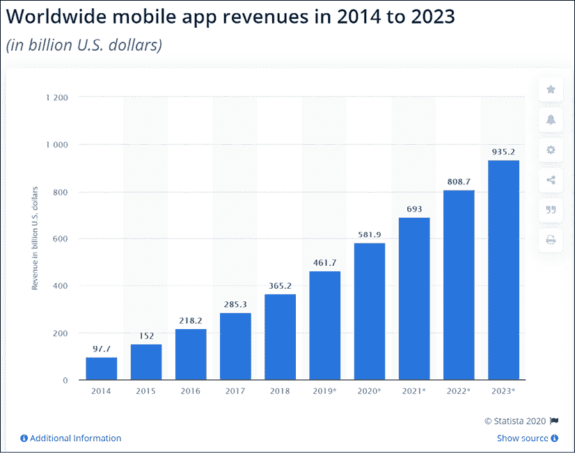
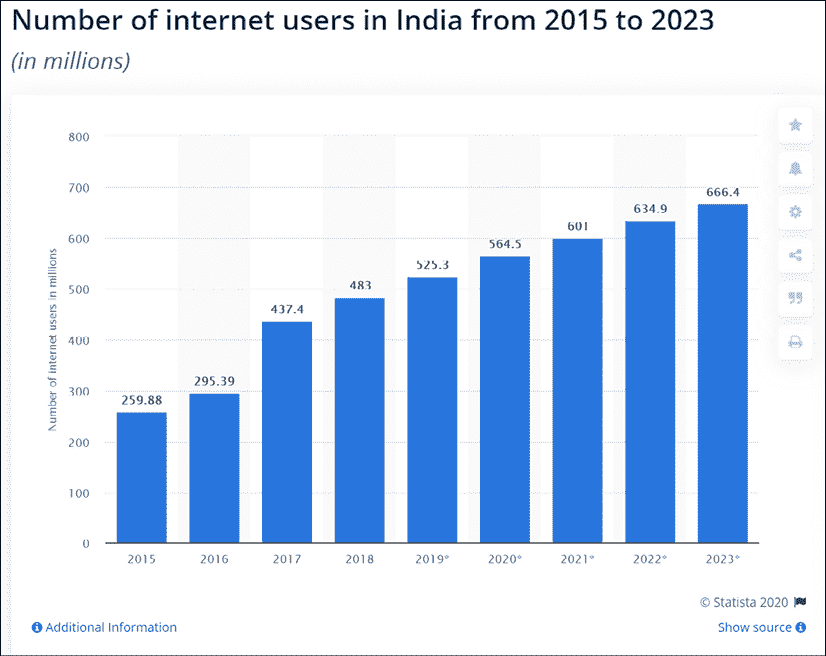
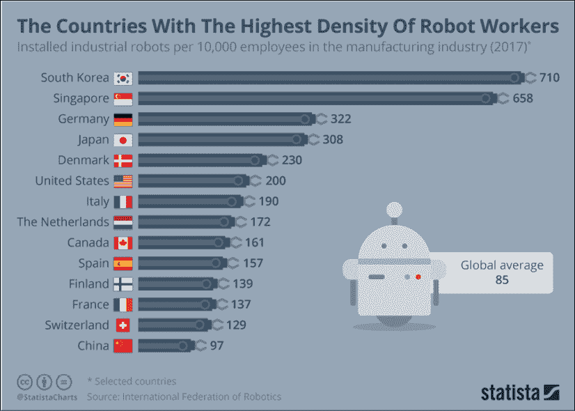
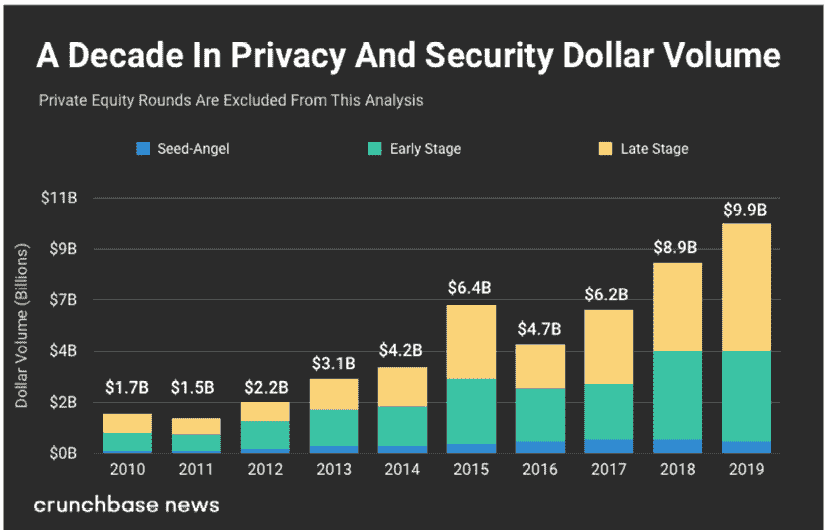
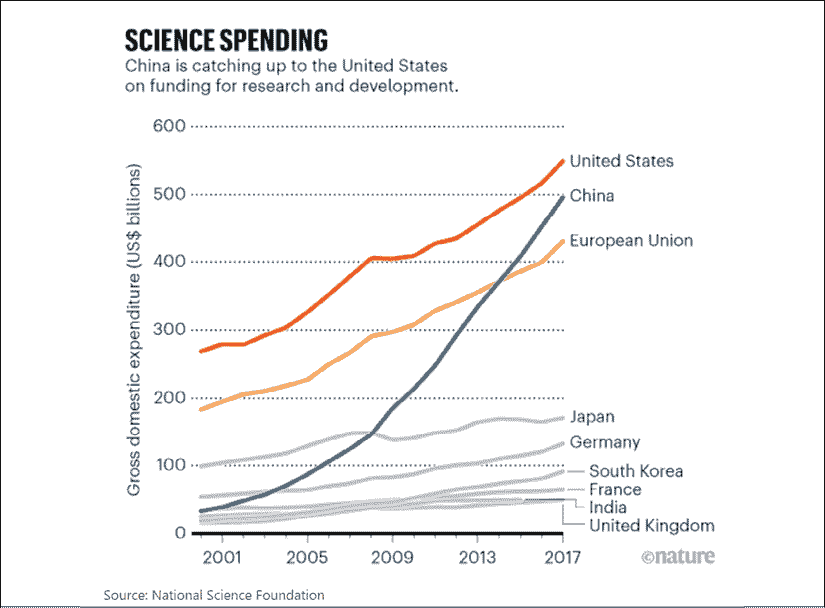
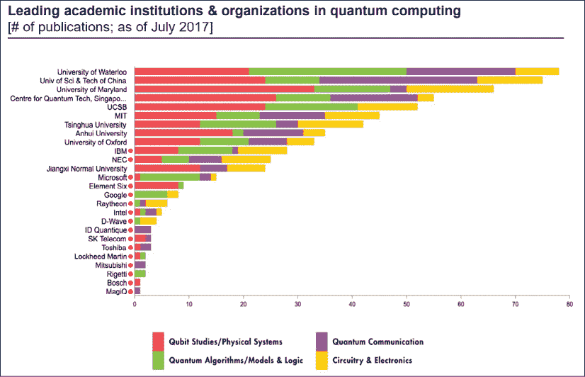

# 第十六章：国家与网络战

我们生活在一个数据可能比原子弹更强大的时代。数据被用来在世界上最大的经济体中赢得选举。各国正考虑部署网络战争以战术和战略上相互攻击。因此，对国家情报和国防机密的数据保护变得极为重要。

根据**国际数据公司**（**IDC**）发布的报告，到 2025 年我们创造的数据预计将达到 175 泽字节。1 泽字节等于十亿兆字节，或 10²¹字节。其中很大一部分数据预计将存储在云基础设施上。因此，我们需要确保整个基础设施都是网络安全的。

我们在*第三章*《数据经济》中看到，数据创造的增长导致了几种技术范式的出现。例如，人工智能经历了几个寒冬后终于变得相关和可行。在因特网成功的基础上，我们拥有了区块链，价值互联网。机器相互交互的兴起离不开互联网。

物联网范式可能是网络专家面临的最大挑战之一。到 2025 年，我们可能创造的 175 泽字节中，有 90 泽字节可以归因于机器之间的互动。在物联网中的网络安全复杂性仍处于萌芽阶段。

在本章中，我们将讨论各种技术范式如何为网络罪犯提供了利用的漏洞。我们将探讨量子技术在这一背景下既可能是威胁也可能是救世主。通过这样做，我们将了解世界超级大国如何依靠技术优势来确保他们主导网络战争。

让我们首先探讨过去十年的增长，借助移动互联网，如何为网络罪犯提供了利用的漏洞。

# 成长也可能危险

数据不会自己传输到云端。我们需要电信提供商充当数据产生点和存储点之间的管道。整个电信基础设施也必须受到网络犯罪的保护。由于电信基础设施，世界上的一些地区正在拥抱移动互联网。

例如，仅在印度，2015 年至 2019 年间，超过 2.75 亿人获得了移动互联网的接入。虽然互联网基础设施主要是在过去三十年中创建的，但电信行业以迅猛的速度演变成今天的样子。大多数地区的电信网络保护基础设施仍然欠缺。

非洲和亚洲互联网用户数量的爆炸式增长创造了前所未有的飞跃时刻。截至 2019 年第二季度，这两个大陆上有 28 亿人连接到了互联网。这将在金融服务、医疗保健、生活方式、电子商务、教育和生活的其他几个方面创造众多机会。

爱立信进行的研究表明，互联网速度翻倍可以使 GDP 增长 0.3%。然而，所有这些增长都是有代价的。这些农村地区大多缺乏对网络安全和网络犯罪世界中存在的社会工程技术的认识。

例如，在 2020 年初，曾有报道称朝鲜黑客成功侵入了印度库丹昆拉姆核电厂。这个电厂离我在印度的家乡不到 80 英里。这个国家的许多地区在过去 5 年内才获得了移动互联网接入，对网络安全的认识，如果不是不存在的话，也是很低的。

最近，亚马逊的首席执行官杰夫·贝索斯通过沙特阿拉伯王储的 WhatsApp 帐户被黑客攻击。因此，即使是世界上最了解网络的公民也不免受影响。如果网络犯罪分子能够成功地攻击世界上最富有的人之一，他将无法逃脱，而他正是运营着一家最大的技术公司之一的农民，则更加不可能。如果这个农民在追踪他的交易的区块链上，那么这个区块链也是脆弱的。

我们生活在一个地缘政治战争现在在网络上进行的世界。最近，当一名伊朗官员被美国无人机击毙时，预计报复将通过网络攻击进行。

除了移动互联网和物联网，这些都是黑客的潜在途径，边缘计算可能是另一个需要在网络安全框架方面得到良好支持的技术范式。在边缘计算世界中，我们在客户端有更多的数据和业务逻辑。在以移动互联网为主导的世界中，这可能意味着手机会更加智能，与云的交互会更加选择性。

因此，移动用户需要确保他们对他们在手机上下载和使用的应用程序非常了解。随着边缘计算变得比现在更加普遍，它可能会成为网络犯罪分子的乐园。想象一下如果物联网设备开始在边缘进行交互会怎样。设备网络中有大量的数据流动，而没有中央云基础设施。

这为网络安全世界带来了大量新问题。随着所有这些技术范式几乎每天都在发展，它为网络犯罪分子提供了新的控制机会。全球主要国家正在投资数十亿美元进行技术研发，以确保他们在战争游戏中保持领先地位。如今，技术突破可以导致数据优势，这比核技术的突破更好。

在提供了对当代和未来网络安全问题的简要概述之后，让我们集中讨论新兴市场的增长以及这可能是网络安全的一个主要盲点。

# 富饶的土地

为了理解全球范围内网络安全的关键性，重要的是要设定讨论的背景。过去的三十年无疑是数据创新世界的一个不可思议的时期。在这段时期中，也许我们创新了创造和交换数据和价值的方法，但也许没有足够创新来保护这些数据。

我们看到 ARPANET 的演变如何导致了互联网的崛起，见《第三章》，《数据经济》。互联网无疑为一系列基于数据驱动的互联网应用和商业模式奠定了基础。搜索引擎、社交媒体和消息应用变得司空见惯：

图 1：2014-2023 年全球移动应用收入。来源：Statista

我们还看到由苹果和谷歌主导的生态系统的兴起。手机成为了我们口袋里随身携带的个人电脑，取代了诸如音乐播放器和游戏机之类的设备。截至 2019 年，移动应用市场规模达到 4610 亿美元，预计到 2023 年将接近 1 万亿美元。前述图表显示了这一增长的程度。

直到 2010 年左右，大多数这些发展主要在世界发达经济体中才能明显察觉到。由于移动普及，也许是在过去的 10 年里，移动业务才真正触及到新兴世界的农村人口。

在非洲，M-Pesa 也许是首个在新兴世界范围内出现的模式，电信提供商和手机共同创建了一个可扩展的业务。当时我们并不知道移动电话在发达世界的不同生活领域中会产生多大的影响。

然而，M-Pesa 是全球数家组织的一个完美案例研究。这是随后在非洲、亚洲和拉丁美洲掀起的大规模包容浪潮的开端，由移动互联网驱动。在所有这些情况下，第一步都是移动渗透，其次是互联网渗透。

在非洲，M-Pesa 的飞跃时刻激发了中国创新的浪潮。阿里巴巴和腾讯释放了利用该国突然增长的互联网渗透率的业务。阿里巴巴的支付业务 Alipay 在 2013 年取代了 PayPal 成为全球最大的移动支付平台。

在接下来的 5 年里，它将记录前所未有的增长。到 2019 年，支付宝的月活跃用户已经增长到 6.08 亿。2019 年，中国的移动支付规模达到了 40 万亿美元，其中超过 90%是在支付宝或腾讯的微信平台上完成的。与美国黑色星期五和网络星期一的销售额达到 160 亿美元相比，2019 年阿里巴巴的“双 11”销售额达到了 380 亿美元。中国由于移动互联网的普及而导致的增长，使得以前从未见过的消费主义得以实现。这激发了其他亚洲地区的增长措施。

在过去的 2 至 3 年里，我们看到了印度和东南亚的新趋势。在印度，增长得到了三个关键因素的催化。

亚洲最富有的人穆克什·安巴尼通过 Reliance Jio 在该国发起了一场移动互联网革命。在推出 Jio 的 3 年内，该国农村地区的 2 亿人获得了互联网接入。根据麦肯锡对数字印度的报告，到 2018 年，该国有 5.6 亿移动互联网用户。来源：[`www.mckinsey.com/~/media/McKinsey/Business%20Functions/McKinsey%20Digital/Our%20Insights/Digital%20India%20Technology%20to%20transform%20a%20connected%20nation/MGI-Digital-India-Report-April-2019.ashx`](https://www.mckinsey.com/~/media/McKinsey/Business%20Functions/McKinsey%20Digital/Our%20Insights/Digital%20India%20Technology%20to%20transform%20a%20connected%20nation/MGI-Digital-India-Report-April-2019.ashx )

印度增长的第二个原因是围绕身份、数字银行和支付的政策和政府驱动的基础设施。该国数字经济在 2016 年 12 月的废钞努力中得到推动，当时政府禁止了某些面额的货币。这与名为“Aadhaar”的生物识别卡的推出同时发生。

有超过 11 亿印度人拥有 Aadhaar 卡。建立身份解决方案促成了前所未有的数字金融包容。这也与政府支持的支付基础设施“统一支付基础设施”（**UPI**）同时出现。以下图表突显了印度互联网用户的增长：

图 2：印度互联网用户，2015 年至 2023 年

印度增长的第三个，也许是最有趣的原因是，全球技术巨头将印度视为最后的前沿。例如，亚马逊和沃尔玛已经接管了印度的电子商务市场，以制衡中国的阿里巴巴。然而，阿里巴巴通过 Paytm 拥有印度超过 50%的支付市场，而沃尔玛对 PhonePe 的收购在不到 2 年的时间里使其在支付市场上的份额增至 42%。

最近，我与我投资组合公司的首席执行官就印度的数据安全和隐私问题展开了一场辩论。他认为印度、东南亚和非洲等地区的人对数据隐私和安全非常在意。我则认为，在印度的庙外摆摊卖花的女人使用二维码和 Paytm 应用的时候，并不在乎或不考虑数据安全问题。她只在乎钱能否到达她的银行账户，同时认为支付技术是安全的，不会让她失望。

这些发展为何在网络安全讨论中具有相关性？全球范围内的移动互联网已经催生了使普通人比以往任何时候都更易受网络犯罪侵害的新商业模式。以前从未接触过技术设备的人已经转向了智能手机、移动互联网、支付钱包、二维码和移动交易，而且这都是在 5-10 年的时间内发生的。

随着全球快速增长的严重缺乏对网络风险的认识。互联网不再仅仅是一个信息网络。随着电子商务和支付应用程序的普及，互联网已经演变成了一个财富网络。因此，我们需要一个由技术支持的框架来保护那些在过去十年中接受了创新的人们。

我们已经讨论了围绕移动互联网上人为通信和交易的增长会如何产生新的网络安全风险。现在让我们来看看物联网是如何会制造漏洞的。

# 机器时代

我们已经讨论了不同的技术范式，这些技术范式可能会让世界向网络犯罪分子打开大门。然而，在未来 5 年里将产生的 70%以上的数据将来自于机器及其之间的通信。这可能会给数据安全带来重大挑战，因为物联网生态系统在理解网络安全风险方面还处于初级阶段。

人工智能和物联网的发展催生了机器人领域的新主题。以前由人类执行的单调工作现在由前所未有的智能驱动的机器来完成。当发布有关人类将如何很快地失去工作岗位给机器时，社交媒体往往变得生动起来。

机器无疑在未来的工作中具有真正的地位：当任务涉及到浏览数千页的文本时，技术确实能够让我们人类更轻松。在我在普华永道的日子里，我们正在探索利用人工智能来帮助我们审查成千上万页的法律和法规文本，并就关键战略问题提供见解。

亚马逊和阿里巴巴已在其仓库中部署机器人以提高物流效率。我们还从富士通的戴夫·斯内林那里了解到，他们的量子退火器正为宝马的机器人提供动力。因此，有些用例中，机器确实能够比人类表现得更好。然而，我经常反驳社交媒体对机器取代的夸大说法，因为我相信我们可以通过更加人性化来超越机器。

尽管有所有这些技术发展，我们与通用人工智能仍有相当距离。要使机器具有共情能力，并在诸如医疗保健或金融服务等领域慎重做出决策，这种场景仍需数年时间。这就是人类在未来工作中仍然会保持相关性的原因。

日常生活中机器的崛起增加了我们对它们的依赖。就在几天前，我遇到了一件人寿保险费的问题，因为我的苹果手表未能与手机同步。同步过程对我的保险提供商来说很重要，以便他们收到我健身计划的详细信息，并为当月确定我的保险费用。

这在制造经济中尺度上更加明显。在美国，每百名制造业工人中有 2 台机器人。韩国的比例最高，每百名制造业工人中有 7.1 台机器人。这一比例预计将在本十年内急剧上升。因此，机器是来留下的。以下来自 Statista 的图表显示了世界工业化经济中机器的增长：

图 3：机器人工人密度最高的国家

机器和物联网的崛起开辟了新的可能性。我能够追踪家中每个设备的用电量。每个设备都会以使用情况发出信号，然后被智能设备捕获。这台机器从这些信号的模式中学习，以便在我的洗衣机磨损或者洗碗机需要维修时提醒我。

如今，我们使用的打印机甚至可以自行订购墨水。我们依赖于我们的手机将正确的数据发送给正确的服务提供商，以确保我们的生活没有任何中断。我最近接触到一个 AI 应用程序，它可以让智能音箱为我填写超市购物篮并下单。自动驾驶汽车是另一个重要的用例，融合了物联网和人工智能。

数据时代已经到了一个程度，物联网基础设施在生活的方方面面产生数据。使用这项技术捕获的数据随后存储在云中。区块链可以为这种数据基础设施带来完整性，并有能力确保它与正确的利益相关者共享。人工智能可以利用这些数据并提供洞察，使我们所有人的生活更轻松。我们依赖所有这些技术来继续前行。但是，它们也有它们的阴暗面。

2019 年，Facebook 宣布他们关闭了他们的人工智能计划，因为机器已经发明了他们自己的语言来相互交流。我们可能正在进入一个迄今为止只在电影中知道和看到的领域。物联网网络以缺乏网络安全基础设施而臭名昭著。**Bitcoin Gold** (**BTG**) 区块链在 2019 年 1 月遭受了 51%的攻击。据报道，这次攻击导致了价值$70k 的双重支出在区块链上。

在过去 5 年中出现的另一个关键技术范式是边缘计算。计算机工程师会同意，架构像时装一样是循环的。在 1990 年代和 21 世纪初，我们有很多安装在个人电脑或笔记本电脑上的应用程序。它们使用客户端服务器交互，在那里有一个厚客户端（Pc 安装）与集中服务器通信。

在过去的 15 年中，随着云计算的出现，我们看到大多数这些厚客户端都消失了。我们的大多数应用程序都是基于云的，并且大部分数据和智能都存储在服务器上。Chrome 操作系统的崛起，以及 Dropbox 和 Google Drive 等存储解决方案，都是同一趋势的例证。我们开始更频繁地使用 Google Docs 而不是安装在我们的 PC 和 Mac 上的传统文字处理应用程序。

然而，这种工作模式假定了持续的互联网连接。当我在伦敦地铁上时，我发现我的音乐应用程序或 YouTube 停止播放非常不方便。这就是边缘计算的原因，其中一些数据和大量业务逻辑可以位于客户端。仅在必要时才进行云连接，从而使用户体验更加无缝。

当机器必须彼此发送微型消息而不必依赖云基础设施时，这可能是一个特别有用的功能。如果没有云基础设施，机器依赖于它们所属的网络的完整性。在这样的网络开始变得越来越普遍的世界中，我们可能会面临大规模的网络犯罪。

这的一个例子是自动驾驶汽车。边缘计算的一个关键用例被认为是自动驾驶汽车行业，预计每天将产生数 TB 的数据。然而，大部分这些数据不必实时发送到云端。这些数据大部分是车辆及其其他车辆网络需要的，以调节道路交通。

总部位于旧金山的初创公司 Renovo 正在研究边缘基础设施，使自动驾驶车辆可以在边缘之间相互交互。当汽车到达充电点时，它们可以连接到云基础设施并发送所需的数据。这样做使过程更加高效和用户友好，因为只有必要的数据实时发送到云端。

这是边缘计算实时捕获和使用数据的良好示例。然而，想象一下，由于网络中的漏洞，这个汽车网络被黑客攻击。黑客不仅可以利用这个网络内的数据，而且如果他们想的话，他们还可以在道路上制造混乱。这是另一个创新如何催生数据创造新方式的例子，但在如何保护这些数据方面几乎没有采取任何行动。

我们在前一章中讨论了互联网和使用基于 RSA 和 ECC 的加密的区块链行业在后量子世界面临被攻击的风险的事实。迄今为止，这一章中讨论的大部分创新都是如此。然而，许多这些技术和创新发展甚至没有考虑到一些基本的网络安全防御措施。

因此，解决这个问题的第一步是在全球范围内提高对网络犯罪的意识。金融包容性、医疗保健、数据访问和支付交易都可能是非洲农民想要互联网的原因。然而，他们需要知道，一旦连接到网络，他们的数据和金钱就会变得脆弱。就像零售投资者被告知使用产品的风险一样，互联网用户也必须了解这样做的风险。

主要发达和新兴经济体已经注意到了存在的这些漏洞。他们了解到，能够利用这些漏洞使他们在了解敌国公民的情绪方面具有重大优势。利用这些数据漏洞对另一个国家的公民的心态和行为进行微妙的改变被视为网络战争中的重要武器。

现在让我们来看看世界上一些最大的经济体如何陷入技术军备竞赛，以利用世界在无意中创造的数据。

# 网络战

新的十年刚刚开始，还没进入新年的步伐之前，随着美国发动了无人机袭击并杀死伊朗军事官员卡西姆·苏莱曼尼，地缘政治紧张局势升级了。伊朗被预计会进行报复，他们也确实这样做了。然而，军事报复预计只是他们行动计划的一小部分。华盛顿特区一直在为发动广泛的网络攻击以在国家内造成混乱做准备。

CNN 报道称，美国政府官员一直在与 Dragos、CrowdStrike 和 Cloudflare 等网络安全公司合作。创建了几种场景，旨在了解漏洞和潜在威胁的规模。其中一些场景包括对依赖电力的美国电网发起攻击，以及针对石油和天然气公司的攻击。

美国大选计划于今年举行，网络攻击可能对该国的未来产生严重影响。包括微软和 Cloudflare 在内的几家公司已提供网络安全服务给参与选举的关键利益相关者。然而，这种新趋势在最高层面所受到的关注量仅仅表明了网络攻击对一个如美国这样强大国家的损害有多大。因此，全球各国必须做好准备来应对这种新威胁。

由于技术创新，不缺少能够解决网络攻击问题的初创公司。2019 年，投资进入网络安全公司的数量创下了历史新高。以下图表显示了该领域风险投资的增长：

图 4：网络安全领域的风险投资。来源：[`news.crunchbase.com/news/almost-10b-invested-in-privacy-and-security-companies-in-2019/`](https://news.crunchbase.com/news/almost-10b-invested-in-privacy-and-security-companies-in-2019/ )

2019 年，网络安全公司的风险投资达到了 100 亿美元，而 2010 年为 17 亿美元。2019 年全球网络安全市场规模为 1200 亿美元，预计到 2021 年将增长到 1430 亿美元。尽管网络安全是硬币的一面，但对于人工智能、区块链、量子计算和物联网等技术的投资为一个国家在经济和地缘政治竞争对手和对手之间赢得了竞争优势。

那些能够利用物联网更好地捕获数据、利用区块链和量子基础设施更安全地存储数据、利用安全网络安全地通信并利用分析做出智能决策的国家比其他国家具有优势。创新经济的一个标志是愿意分配给研发的 GDP 比例。

研发投资占国内生产总值的百分比越高，国家改善创新生态系统的承诺就越高。让我们快速审视各个主要国家的创新生态系统，并比较它们在接下来的创新图表上的表现。

## 美国

毫无疑问，美国一直是全球技术创新的总部。虽然研发投资占国内生产总值的比例可能不如一些斯堪的纳维亚国家高，但硅谷生态系统一直是技术创新和投资的中心。美国国内生产总值的巨大规模意味着比世界上几乎任何其他地方都有更多的资金流入技术领域。多年来，它已成为其他国家希望效仿的案例研究。

硅谷曾经处于互联网泡沫的前沿，幸存者支持了下一代企业家。2019 年，美国的风险投资达到了 1050 亿美元，分布在 4,633 宗交易中。尽管由于贸易战，来自中国的资本流动下降，但 2019 年的风险投资金额仍高于 2018 年（1,030 亿美元）。

需要考虑对技术的投资，如人工智能、区块链和量子计算，以评估美国在这些深度技术领域的竞争力。让我们特别看看美国的量子计算生态系统，因为这对我们来说更相关。

大型科技巨头如谷歌、英特尔、IBM 和微软都投资了大量量子计算。例如，谷歌投资了 D-Wave，其量子计算机被量子计算社区广泛使用。同样，英特尔投资了 QuTech，并已开始与之合作十年，以开发容错量子计算机。

微软和 IBM 大多将他们的量子计算研究保持在内部。IBM 在这一领域非常活跃，并定期公布其进展。在 2020 年的 CES 上，它宣布将其 28 量子比特机器的量子体积从去年的 16 提升到了 2020 年的 32。

即使是美国的学术机构也在量子计算的研发中非常积极。滑铁卢大学于 2002 年在黑莓创始人迈克·拉扎里迪斯的资助下建立了**量子计算研究所**（**IQC**）。根据量子计算领域的出版物数量，马里兰大学是另一所在美国的学术机构，得分很高。

为了在量子技术方面取得领先地位，美国总统唐纳德·特朗普于 2019 年 8 月签署了《国家量子计划法》。这项法案为量子计算研究拨款 12 亿美元。考虑到这一切意图，你可能会认为美国必须领导量子计算行业的倡议，但事实并非如此，因为全球创新的天平现在正倾向于东方。中国在量子通信方面具有巨大优势。

## 中国领先全球

在技术世界中，中国历来被认为是模仿者。 然而，过去十年，中国企业成为全球企业带来前所未有的资本，并且在技术创新方面表现出色。

图 5：技术创新的全国支出。 来源：[`www.nature.com/articles/d41586-020-00084-7`](https://www.nature.com/articles/d41586-020-00084-7 )

中国在过去十年的风险投资不断增加。 2018 年，中国在 5356 笔交易中投资了 1070 亿美元，但由于贸易战的影响，这一数字在 2019 年下降至 3348 笔交易中的 490 亿美元。 然而，这并没有真正阻止中国在缩小与美国之间的研发投资差距方面取得进展。

上述图表显示了中国在技术创新方面接近美国。 但是，在量子计算方面，他们无疑是世界领导者。 2017 年，中国在量子计算领域的专利申请数量是美国的两倍。 70%的量子技术专利被中国大学授予。 美国获得第二名，占专利的 12%。

中国国家主席习近平承诺在量子计算方面投资数十亿美元，以期实现该技术的全球主导地位。 阿里巴巴 CEO 马云为多个技术分配了 150 亿美元，其中也包括量子计算。 按照这个速度，到 2030 年，中国将以投资和成果的基础，远远领先于世界其他地区。

现在让我们简要了解一下中国在这一领域取得的成就。 中国大学在研究和发展工作方面做出了重大贡献。 以下图表展示了中国大学和公司在量子计算领域作出的贡献有多大：

图 6：以出版物数量为基础的量子计算中的领先学术机构和组织。 来源：[`quid.com/feed/the-three-leading-academic-institutions-in-quantum-computing`](https://quid.com/feed/the-three-leading-academic-institutions-in-quantum-computing)

中国科学技术大学（USTC），在潘建伟的领导下，已在量子计算研究领域取得了快速进展。 作为“量子之父”的潘建伟率先在量子通信领域开展了 USTC 的工作。 USTC 的量子通信网络利用卫星连接北京和上海等八个城市。

2016 年，潘领导中国发射了世界上第一颗量子卫星“墨子”。利用该卫星，在北京和维也纳之间进行了使用量子加密的视频通话。显然，中国在量子通信方面是领先者。然而，在量子计算领域，他们仍在赶超美国和欧洲。

现在让我们看看欧洲和英国在量子技术方面的努力。

## 欧洲和英国

随着中国和美国争夺全球主导地位，在量子科学上投入数十亿美元，欧洲和英国正在稳步取得进展，相对而言研究力度较小。

**UKRI**（**英国研究与创新**）是英国量子计算研发和生态系统发展的先驱。UKRI 的**国家量子技术计划**（**NQTP**）在该技术上的总投资已超过 10 亿英镑。该计划将覆盖量子行业的以下方面：

+   专注于使用量子技术的产品和服务。

+   面向行业的研究活动资金。

+   为量子项目确保丰富的供应链。

+   风险投资和早期投资。

NQTP 计划在四个中心投资了 1.2 亿英镑，重点关注量子计算中的不同集群：

+   伯明翰大学领导的传感器和计量学将致力于量子传感器和测量技术。

+   由 QuantIC 中心创建的量子增强成像项目，由格拉斯哥大学、布里斯托尔大学、爱丁堡大学、牛津大学、赫瑞瓦特大学和斯特拉斯克莱德大学参与。

+   NQIT（国家量子信息技术）中心由牛津大学领导。它专注于应用，如药物发现、随机数生成和量子通信。

+   由约克大学领导的量子通信中心，布里斯托尔大学参与，专注于**量子密钥分发**（**QKD**）。由于他们的努力，我们可能能够通过量子技术在手机上进行银行交易。

随着英国推动量子研究与发展，欧洲也不愿落后。2018 年 10 月，欧洲委员会承诺向量子计算投资 10 亿欧元，称之为“量子技术旗舰项目”。欧洲研究理事会与布里斯托尔大学密切合作，利用量子计算解决现实生活中的挑战。

到 2021 年为止，旗舰项目的第一阶段拨款为 1.32 亿欧元。这笔资金将分配给四个领域的 20 个项目：

+   量子通信

+   量子模拟

+   量子计算

+   量子计量学和传感

来源：[`ec.europa.eu/digital-single-market/en/quantum-technologies`](https://ec.europa.eu/digital-single-market/en/quantum-technologies )

2021 年后技术的资金将是欧洲 Horizon 2020 计划的一部分。

除了这些生态系统建设工作之外，欧洲一直是量子计算创新的一个重要中心。例如，荷兰一直是量子技术的重要枢纽。甚至微软在该国建立了量子实验室。

到目前为止，我们已经审视了创新速度和数据创建速度在数字世界中带来的风险。我们已经看到国家正在投资数十亿美元，以利用可以使它们处于数据竞赛中的领先地位的技术。另一个值得讨论的是量子网络在这一背景下可能发挥的作用。

# 围绕量子网络的炒作

在讨论中国对量子通信的关注的部分中，我们发现他们能够开拓出安全免受黑客攻击的量子加密通道。量子加密是一个很好的进步。然而，在量子网络上的信息流被誉为安全通信的圣杯。

想象一下一个没有人能窥探你信息的互联网。想象一下一个你可以自由进行通信和交易而不必担心数据安全的互联网。由于量子比特一旦被观察就会失去状态，这是可能的。因此，当有黑客攻击时，消息的发送者和接收者可以识别出来。这种技术范式对军事和国防通信的影响几乎是不可低估的。

量子网络可以被视为相距 50 到 100 公里的三个量子设备的网络。中国在墨子号建造了第一颗量子卫星，欧洲正努力维持第二。荷兰的代尔夫特理工大学正在致力于创建可能成为未来互联网的量子网络。

量子纠缠可以用来创建量子网络。第一步是创建所谓的“纠缠节点”。这是通过一种过程实现的，即纠缠的质子在这些节点之间交换。一旦这些节点被纠缠，整个量子比特就可以在它们之间传输，而无需在网络中物理地发送量子比特。

这正是第一颗量子卫星墨子为了在多个地面站之间进行通信所做的事情。使用晶体和激光器创建了纠缠的光子对。这些纠缠的光子对被分离并传输到不同的地面站。因此，量子信息可以在这些站点之间传输，这些站点位于相距 1203 公里的德令哈和丽江市。

这被誉为比使用最佳光纤技术高效一万亿倍的成就。然而，墨子实验每秒传输了 600 万对纠缠粒子，其中只有一对到达地面。因此，仍然有很多工作要做。

尽管存在这些挑战，利用纠缠的属性是最安全的通信方式。奥地利的量子光学与量子信息研究所和荷兰代尔夫特理工大学已合作创建了一个量子网络的原型。

团队们利用激光操纵钙离子，创建了一个具有两个能量状态的叠加态量子比特。该离子还会发射一个以其极化态编码的量子比特的光子。由于这些量子比特相互纠缠，它们可以传输到相距较远的两个量子站，用于通信。

在实验过程中，团队测试了一种称为纠缠交换的过程。在这个过程中，两个节点会将一个纠缠光子传输到中间的站点。这些光子将在中间的站点上进行测量，导致它们失去与其离子的纠缠性。然而，这个过程使得两个离子彼此之间产生了纠缠。

团队现在正在考虑在荷兰的三个城市之间建立一个网络，以利用纠缠交换来传输量子信息。显然，量子网络还有很长的路要走才能成为主流。现在仍然处于早期阶段，很难说量子网络会不会成为互联网的未来。然而，世界各地的科学家们现在每天都在取得进展，显示出希望的迹象。

如果承诺成真，我们也许能够建立一个安全的互联网基础设施。我们还可以建立一个安全的机器互联网，比如无需依靠云基础设施就能独立存在的自动驾驶汽车。

# 结论

在过去 30 年里，人类变成了一个完全依赖互联网谋生的网络族。我能想象一天没有电、食物，甚至水。但没有互联网的一天感觉无法想象。我们生活在一个孩子们把关闭 Wi-Fi 当做惩罚的年代。一个坏了的灯泡被视为失去了互联网访问权限的灯泡。

我们与智能音箱对话，提醒我们播放我们喜欢的歌曲，从而留下我们的一部分信息在线。我们的健康数据存储在云基础设施上，希望能够降低我们的保险费，或者帮助我们赢得步数比赛。多亏了支付和汇款技术，我们可以随意向世界各地的朋友和家人发送资金。

在我们的大部分数据都存放在线的情况下，我们经常忘记的是它的安全性。作为个人，失去数据给黑客的控制的想法可能是可怕的。然而，想象一下一个国家将其数据丢失给黑客的情景。如果黑客能够控制公民的身份，国防信息，国家电网和核电站（列表可以无限延伸），那将是灾难。

不再需要复杂的机关枪、无人机或原子弹来伤害敌人的国家。规模化计划和组织的网络攻击甚至比零星的无人机攻击更能让一个国家屈服。在本章中，我讨论了为什么创新使我们都容易受到这些网络威胁的影响。

然而，通过广泛的意识提升努力和一些技术突破，我们可能能够将我们所有的数据转移到一个安全状态。第一个挑战是，谁会率先达到目标？第二个挑战是，量子技术能否达到预期效果？

现在说量子网络会成为互联网的未来还为时过早。我们在世界各地的科学实验中看到了零星的小规模成功。然而，为了在合理的时间范围内产生实质性影响，需要在涉及量子领域的多个方面取得更广泛的成就。

虽然有很多炒作，但在所有炒作之间，仍然存在着希望。让我们现在快速回顾一下前面章节提出的关键讨论点。
