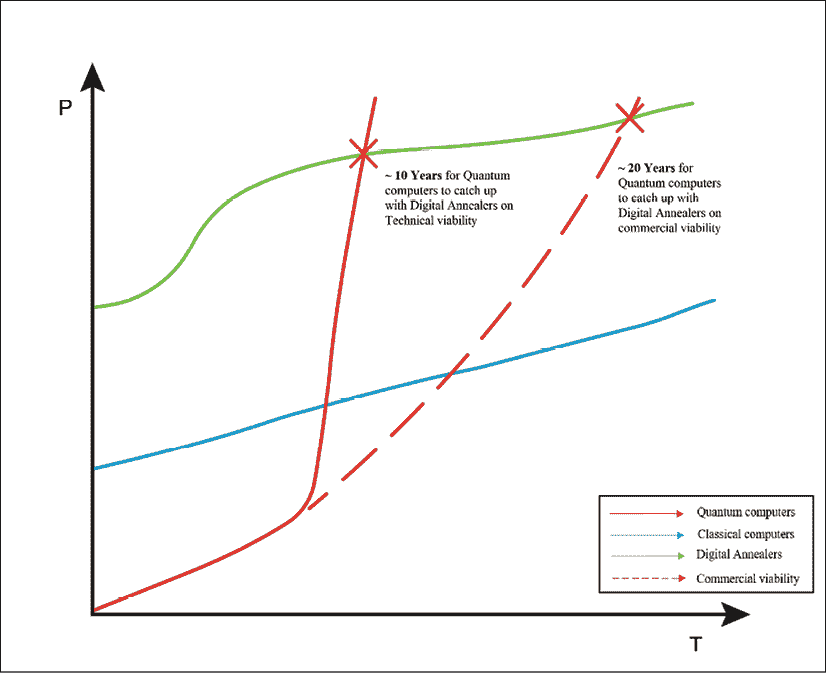

# 17

# 结论 - 蓝天

> 人生就像一盒巧克力，你永远不知道会得到什么。

*– 福雷斯特·冈普*

考虑到福雷斯特·冈普的智慧之言，写这本书的机会确实是“就像一盒巧克力”。现在我已经进入这本书的最后一章，我可以说这是一次有意义、令人谦卑和令人惊叹的学习经历。

在《每日金融科技》（Daily Fintech）这个世界第二大阅读量的金融科技博客连续两年每周发布博文后，我知道我能写作。我原计划在 2020 年开始写作生涯。但写书的机会比我预期的提前了一年到来。我知道生活给了我一个曲棍球，而我正处于一个很好的位置，可以将其击出公园。

在过去几年中，我有许多朋友一直在研究人工智能、区块链和量子计算方面的书籍。当我看到量子技术书籍的作者时，我看到的是物理学家和计算机科学家。我绝对不是其中之一。我必须为这本书找到一个关注我专长的论点。

在我与硅谷企业家进行的最早的量子计算谈话之一中，她提到过，要完全掌握量子技术，一个人需要在物理、数学和计算机科学中都拥有博士学位。我知道这是一个轻松的评论，但其中也有一些真理。因此，当我在开发这本书的论点时，我知道我必须坚持我的优势。

我的优势来自我过去 5 到 6 年作为风投（VC）投资者的经历。多年来，作为一名 VC，我的经验教会了我两个关键的教训。第一个教训是技术只是达到目的的手段，重点是要专注于“*为什么这样做？*”第二个教训是，一个技术专家应该能够保持叙述简单。

在我开始我的风投职业之前，我曾在银行担任数据和技术专家。这经常涉及与董事总经理和高管层合作。许多这些成就卓著的人把技术视为灵丹妙药。他们觉得市面上一定有一种特殊的技术能够解决他们的商业模式和流程效率低下的问题。我不得不一再强调，技术只是达到目的的手段而已。

因此，作为一名 VC，我关注的重点之一是超越炒作。我必须专注于我正在评估的技术的商业应用和可行性。仅在 2019 年，我就有幸观察了超过 400 家科技初创公司。如果考虑过去五年，这个数字将超过 2,000 家。对于 VC 行业的大多数人来说，这都是相当典型的经历。

这种经历让我有了一种独特的位置，能够看到我所见证的关于量子技术的炒作之外。每当我听到这个领域的概念时，我首先要问的问题是，“它将解决什么问题？”我对这本书的方法正是如此。

我不想过多讨论量子计算背后的数学或物理，因为我没有能力去谈论那些。但我知道如何看穿技术的炒作，关注它所带来的东西，以及潜在的商业应用。

我作为一名风险投资人（VC）所发展的另一个关键特征是保持叙述简单。我经常看到有着扎实技术背景的企业家们努力摆脱他们的行话。科学领域的人们可能能够应付这样的语言和解释，但当一项技术正在走向主流时，简化围绕技术的叙述是必不可少的，只有简化了围绕技术的叙述，才能与更广泛的生态系统建立联系。这种联系只能通过简化围绕技术的叙事来实现。

技术的受益者，无论是企业还是消费者，都应该能够理解技术的应用。比如，作为银行的消费者，你只关心他们提供的抵押贷款利率、信用额度和存款利率。你不关心他们是用蒙特卡洛方法还是历史模拟来评估他们的信用风险。

这本书本质上是所有这些思维过程的结晶。要将像量子计算这样复杂的事情简化，实在是极其困难的。同时，从应用的角度探索量子计算也是一次愉快的经历。在本章中，我将汇集我在本书中尝试涵盖的量子技术的不同维度。

让我们先关注眼前的现实。量子计算到底有多么被炒作？每一项技术都经历起起伏伏，量子计算也不例外。让我们根据本书中的讨论内容来考虑我们目前所处的量子计算的状态。

# 究竟有没有炒作？

量子计算依赖的量子力学原理已经存在了一个多世纪。正如我们在本书的前几章中讨论过的那样，量子计算的概念是由理查德·费曼在 1980 年代提出的。从那时起，每当出现像肖尔（Shor）或格罗弗（Grover）算法这样的突破性算法时，炒作就会增加。

类似的，像中国的量子卫星计划（墨子）这样的成功概念验证使乐观情绪飙升。这正是人类的生理反应，由于这些发明的新颖性而导致多巴胺水平增加。这也正是保持生态系统乐观并寻找新突破的动力，尽管面临重重困难。

回想一下我与戴夫·斯内林的采访，以及他为我画的图片：

图 1：戴夫·斯内林的草图，解释了量子退火的趋势

就像人工智能领域一样，自上世纪 30 年代以来，量子计算也经历了数次起伏。在我与富士通的 Dave Snelling 的讨论中，他提到量子计算机距离主流采用还有 15-20 年的时间。我们讨论了量子退火机的一些特定能力可能比基于门的量子计算机更快地实现。

因此，我们可能会在比 Dave 的时间表稍早一点的时候看到优化问题的解决方案。请参见前图以了解说明。像富士通这样的组织也正在努力通过数字量子退火机来弥合经典和量子计算机之间的差距。我们在本书中提到的许多应用已经在商业环境中实现，这些应用是通过数字量子退火机实现的。

然而，这项技术的一个一贯方面是几家公司试图利用的“量子霸权”。甚至像谷歌这样的公司也利用量子计算技术的倡议来做公关。甚至 Gartner 也不能免于加入这种炒作。他们的下一个图表展示了随时间变化的人工智能的预期：

图 2：2019 年 Gartner AI 炒作周期

前面的“炒作图表”显示了 Gartner 对量子计算所驱动的机器学习达到高潮炒作有多远的看法。我个人认为这个领域在接下来的十年内不会达到高峰。在这项技术成为主流之前，我们将在接下来的十到十五年中看到更多的高峰和低谷。

我为这本书采访过的 Dave Snelling 和其他许多人提出了对量子霸权的看法。例如，据 Dave 称，量子霸权不能仅仅关乎处理速度。它必须关乎量子计算机在合理时间内解决经典计算机无法解决的问题的能力。

谷歌声称能在几天内完成一项计算，而对经典计算机需要 1 万年的情况，这可能并不一定能满足科学界对此的要求。因此，当一家公司声称实现了量子霸权时，必须要对此持保留态度。

围绕量子计算的炒作的一个可取的结果是，它有助于引起人们对这项技术可能带来的风险的重视。在我与 IBM 的 Dinesh Nagarajan 讨论中，他强调了这项技术可能对互联网现有加密技术造成的风险。他还强调，在大型企业中，技术变革通常需要 7-8 年的时间。

因此，对技术的一些炒作可能有助于量子计算引起这些易受后量子世界影响的公司董事会的关注。随着技术的发展，这些组织可以做好准备，灵活应对威胁。

这并不是为了证明我们在今天数据驱动的世界中拥有一些酷技术的非理性狂热。考虑到技术的可能性，不免会感到兴奋。然而，了解我们在量子计算方面的现实并根据此设定现实期望是很重要的。现在让我们来看看我们在书中涵盖的技术的一些有趣用例。

# 有价值吗？

最近有关量子技术的优点的 Twitter 上的讨论，我被卷入其中。提出的问题是我是否从量子技术中看到了价值和实际应用。答案是肯定的，因为至少在过去一年里，我看到了一些量子计算初创公司开始商业化他们的解决方案。然而，我会谨慎行事，暂时不会对这些解决方案感到过度兴奋。

这些公司大多数都有解决方案，可以对我们生活的各个方面产生重大影响。但它们尚未在大规模的实际环境中证明自己。我在过去 12 个月中遇到的解决方案涵盖了各种领域，包括医疗保健、气候技术、金融服务，甚至石油和天然气。这些大多是经典计算机难以解决的问题。

尽管技术的成熟度令人担忧，但不能否认存在潜力。健康和财富一直是创新可以对地面产生巨大影响的两个关键领域。这在新兴市场尤其如此，在那里数十亿人没有良好的医疗保健或金融服务。让我们简要地触及我们在书中讨论的用例，无论是在涵盖采访的章节还是其他章节。

## 医疗保健

我们涉及了量子计算可以用于改善药物发现过程的用例。有两个方面。一个是技术可以缩短药物上市时间，因为它可以模拟药物可能有效或无效的情景。这个过程在使用经典计算机时效率不高。

此用例的第二个方面是药物与特定健康状况的匹配质量可以比使用经典计算机更有信心地评估。将这两个方面结合起来，我们可以开始看到更好的药物更快地投放市场。

量子计算还可以帮助诊断和治疗癌症等复杂健康问题。医生在为癌症患者开具正确治疗方案时需要考虑到几个变量。使用量子计算可以给我们一个考虑到不同变量之间相关性的解决方案。

如今，这个过程大多是手动的，医生在决定治疗方法之前会评估病情的严重程度、受影响的部位以及癌细胞对健康细胞的潜在影响。在看完健康问题之后，让我们简要触及一下财富使用案例。

## 金融服务

这是我职业生涯中大部分时间都在从事的行业。因此，我亲身经历了金融服务行业面临的数据挑战。回到富士通的数字模拟器，我们已经看到了受量子方法启发的实时应用。

例如，模拟器已经被证明比传统计算机在投资组合再平衡和风险管理等问题上要快得多。虽然即时进行投资组合再平衡的财务可行性仍然不清楚，但有这样的能力肯定会很有用。特别是在市场压力条件下，如果投资组合经理想要快速重组其投资组合并降低风险，即时进行这样的操作将是一个巨大的优势。

我曾在一个需要实时进行某些风险分析的监管环境中工作。大多数套期保值决策都依赖于隔夜计算的风险报告能力。能够在市场危机发生时即时或者在交易日内做出这些决定并对投资组合进行相应调整，将会给金融部门带来巨大的优势。

金融服务也是一个需要考虑许多相关变量以计算有效风险回报配置的领域。比如，理解经济衰退可能性的问题也存在相关变量。量子专家们也正在全球范围内致力于以高度自信对这些可能性建模。

在看过金融服务之后，让我们简要考虑一下量子计算对物流的影响。

## 物流

物流是一个对于经典计算机来说难以解决的问题最为棘手的领域。我们讨论了最短飞行路径问题和旅行推销员问题。这些都是可以使用数字和量子模拟器来解决的优化问题。

我们谈到了空客正在进行的与量子计算社区的实验。他们试图模拟飞机机翼与空气的相互作用。更好地了解飞行气动特性可以提高起飞和降落时的燃油效率。这对处于气候紧急状态的世界来说是一个巨大的胜利，当然也会为实现更高效率的公司带来更高的利润。

## 气候

这很好地引出了量子计算机与气候相关的用例。我们以化肥行业为例。基于氮的肥料是最广泛使用的，并且是农业行业需求最大的肥料。然而，目前的制造过程耗能且碳足迹较高。

具有讽刺意味的是，自然以一种更简单、更节能的方式处理氮固定。在实验室条件下无法模拟氮固定的能力使我们无法模仿这种更有效的制造过程。目前有几个正在进行的研究项目试图使用量子计算机模拟氮固定。这对人类来说将是一个巨大的胜利，因为我们迫切需要转向更可持续的工业流程。

我们还讨论了其他创新用例，如气候建模。如今，气候建模远未能模拟我们世界的巨大复杂性。有些人工智能初创公司正在努力解决这个问题。我们必须考虑许多相互关联的变量，从碳排放到海洋洋流。我们还必须考虑诸如融化冰川之类的反馈环路；这种现象导致全球冰覆盖减少。冰反射太阳的光线。因此，冰少意味着地球吸收更多的热量，从而融化更多的冰等等。如果我们希望有效地模拟我们变化中的气候，我们将需要更强大的技术来处理这种复杂性，最好是实时处理。

量子计算机可以考虑这些变量之间的相关性，并为我们提供更清晰的视角，以更高的信心度。我们还讨论了其他潜在的用例，比如使用量子计算机模拟碳捕获。现在让我们来谈谈量子计算机用于选举建模的用途。

从全球气候问题转移到政治气候问题，让我们简要考虑一下量子计算将如何影响我们的政治气候。

## 选举

在过去的五年里，全球民主进程发生了重大转变，社交媒体在政府选举中发挥了重要作用。这可能不像医疗保健、金融市场或气候变化那样成为重大问题，但主要经济体如美国、欧洲、印度或中国的政策制定者有能力改变数十亿人的生活。

马克斯·亨德森很友好地提供了他在 QxBranch 工作中的见解，他一直在使用量子退火进行选举建模。我很愿意在今年晚些时候，随着 2020 年美国大选的展开，再与他进行跟进。

这应该让你对这项技术的潜力有所了解。是的，现在还处于早期阶段。是的，存在挑战。但是可能性非常令人难以置信，我很高兴人类将通过这样的突破性创新迈向更加光明的未来。现在让我们来看看未来的障碍，必须克服这些障碍才能真正实现这一创新。

# 艰难的前路

那个章节标题在某种意义上是一个线索。有时人们对量子技术的可能性持怀疑和愤世嫉俗的态度，因为我们需要克服一些重大障碍。我们不能只谈论那些带来各种酷炫应用的美好未来，而不承认其中涉及的“如果”和“但是”。

我们与山姆·麦卡德尔进行了专门讨论错误校正的采访，因为这是量子计算机成为主流的主要障碍。错误校正是因为存储信息的量子粒子与外部环境相互作用，因此随着时间的推移会失去它们持有的信息。

与传统计算机不同，量子计算机依赖于量子比特。存储在量子比特中的信息无法复制到其他量子比特以进行容错。这是量子粒子的限制和特性，使得这个领域既具有挑战性又令人兴奋。然而，如果找不到保持像携带信息的光子这样的量子粒子的方法，很难想象量子计算机会成为主流。

在今天的量子计算机中，每个无错逻辑量子比特可能会有一千个嘈杂的量子比特。这些机器需要高度冗余以处理错误。然而，为了更好地采用量子计算机，这种情况需要改变。在我们与山姆的讨论中，我们谈到了 NISQ 技术，其中这些嘈杂的量子比特可以用于某些商业应用的计算。

目前正在探索这一领域，比如化学研究，这里噪声可以成为一个特性而不是干扰。化学反应可以使用代表它们在现实中发生的嘈杂环境的噪声量子比特进行建模。

在我们梦想量子计算机能够发挥重要作用的世界之前，这些挑战必须得到解决。这本书的一个关键主题之一是量子计算机如何对大多数数据和数字价值交互依赖的现有加密造成威胁。让我们简要看一下。

# 相撞的道路

第一次了解到量子计算机可能通过我们今天使用的密码技术时，我感到非常震惊。那时，量子计算成为我看待的一个主要技术范式，具有与个人计算机或互联网一样的巨大潜力。

量子技术可能使互联网面临风险，这是一个挑战，但我认为，普通人对这种可能性的缺乏认识是一个更大的问题。我们生活在一个数据和货币交易变得无摩擦、无形、因此无意识的时代。

我们也正在进入机器时代，在 2030 年可能产生的 1.75 泽字节数据中，70%将来自机器。自动驾驶汽车、可穿戴设备和传输信息的家用电器都在创造大量高度敏感和个人信息。确实令人担忧的是，大多数这些机器一旦量子计算机能够扩展，它们就会面临被黑客攻击的风险。

另一方面，区块链是一个非常新的发明，在全世界引发了一系列应用。其中许多应用程序存储价值、数据，甚至存储法律约束性信息。如今，大多数区块链解决方案使用 RSA 或 ECC 算法来保护数据交互。其中一些甚至声称这些安全机制是它们的差异化。

然而，除非这些区块链应用程序转向量子安全的加密，否则它们很快就可能过时。我们讨论了可以归类为后量子密码学的格密码和码基密码学。即使量子技术不是主流，量子计算的潜在风险也将使用户远离这些解决方案。

当这与我们现在看到的区块链寒冬结合在一起时，这可能意味着整个生态系统需要反思。像 IOTA 和 QRL 这样的一些区块链或分布式账本技术平台声称它们是量子安全的。然而，它们代表了区块链社区的少数派；那些更好准备应对风险的人。

需要有跨监管机构、政府和大型企业的协调努力，使互联网上的关键应用程序具备量子安全性。国家标准与技术研究所（NIST）正在寻找能够保护互联网的后量子密码学技术。

在与 Dinesh Nagarajan 的讨论中，他提到组织必须是“密码敏捷”的这一点至关重要。点 com 繁荣带来了敏捷软件开发方法。量子时代将需要解决方案具备密码敏捷性。这意味着它们的基础设施、平台和应用层需要具备交换和更改它们使用的密码学的能力。这种能力将确保它们可以在短时间内升级密码学，并为任何潜在的网络风险做好准备。

我们讨论了组织在准备量子威胁方面面临的挑战。组织需要经历一个成熟周期，结果是加密敏捷性的状态。然而，大多数这些大型组织习惯于花费 7 到 8 年的时间来升级他们的技术平台。因此，如果在那段时间内出现了任何重大的量子计算突破，这些组织还没有准备好，这令人有些紧张。

本质上，不仅是区块链生态系统与量子技术发生冲突，互联网世界也处于这种冲突之中。因此，必须确定并部署可持续的数据和价值交换的网络解决方案是至关重要的。

我们还需要跨越大陆的领导和治理，以便在技术创新不断发展的情况下保持正确的方向，以及了解这如何可能给数据驱动的世界带来新的网络威胁。一旦在技术或平台内部检测到威胁，就需要确定控制措施，以确保它们对企业和消费者的使用是安全的。

我们正在进入一个时代，在这个时代里我们将没有几十年来保护我们的数据。如果我们要跟上量子计算的力量，我们必须在几年内，如果不是几个月内就能做到这一点。说到这一点，现在让我们来谈谈世界各国如何为量子计算做准备。

# 国家和生态系统

当你拥有一项技术优势，可以获取敌对国家的国防机密时，你会退缩吗？如果这项技术让你掌控互联网、医疗信息以及大额金融交易的信息，那么这是否会诱使你投资于这项技术？

这正是中国投入数十亿美元用于人工智能和量子计算的原因。他们在量子通信领域显然是领导者，其"墨子号"计划。这已经激励了全球范围内的行动，美国、欧洲、英国、加拿大，甚至印度都纷纷加入到量子计算的浪潮中。他们每个人都为量子计算研究拨款约 10 亿美元。

政府参与其区域量子计算生态系统的发展是件好事。这将有助于确保最佳实践被普遍分享，并且在整个生态系统中遵循某些标准。例如，在英国，有四个由不同学术机构领导的量子计算中心。初创公司、企业和投资者与这些中心合作，以充分利用研究能力。

尽管有这些努力，但不能忽视其中一个国家在量子竞赛中领先的风险。即使在今天，我们也不确定这些国家中是否有任何一个真正解决了量子难题。如果其中一个国家已经成功实现了量子优势，他们可能会选择保持沉默。在当今时代拥有技术优势类似于在战后时代拥有核武器优势。

未来的地缘政治战争可能以更为微妙的方式展开，数据是石油，技术是武器。当你在网络上占据了对敌对国家的优势时，你可以破坏关键基础设施，如电网、交通网络、银行服务、医院以及所有依赖于互联网的系统。

这可能会引发大规模的破坏，导致资本市场停摆数日，并给受影响的国家造成数十亿美元的损失。

让我们希望各国在对手发现如何造成这种损害之前建立适当的防御和控制措施。

# 天空是蓝色的。

我在内心深处是一位乐观主义者，尽管我的风投工作要求我对技术初创公司进行现实的评估。我仍然必须做出乐观的预测，即它们将突破技术、运营和市场的障碍。通过这样做，他们将帮助为我的基金和我的投资者带来高额回报。

成为一名风险投资家最好的部分是，这份工作就像是窥视未来的一扇窗户。这是因为我们可以提前接触到各行业的创新公司。即使其中一小部分成功地打破了价值链和生态系统的规模，世界也可能在几年内变得不同。通过投资这样的创新，我们可以观察到这种过渡从萌芽状态到成熟状态的过程。

对于量子技术公司来说，我就有机会做到这一点。也许 2019 年是我们第一次有几家量子技术公司找上我们寻求资金支持的时候。它们是先行者，但也面临着穿透或创建市场解决方案的艰巨任务。我相信在 2020 年，这个领域将开始变得不同。

在 2020 年，许多这些先行者将更接近确定其产品和服务的市场适应性。其中一些甚至可能已经在商业环境中进行了试点和实际部署。我们将会迎来令人兴奋的几年，我们将看到兴奋、挫折、突破、障碍和疯狂的增长。

在量子计算所承诺的这段过山车般的旅程中，人性的一个属性将会持续存在——希望。一种希望，即我们都在为世界的美好未来而努力。一种希望，即尽管面临种种困难，我们将到达我们的目的地，并实现我们对自己、我们的组织、我们的国家、我们的世界以及人类自身的愿景。
